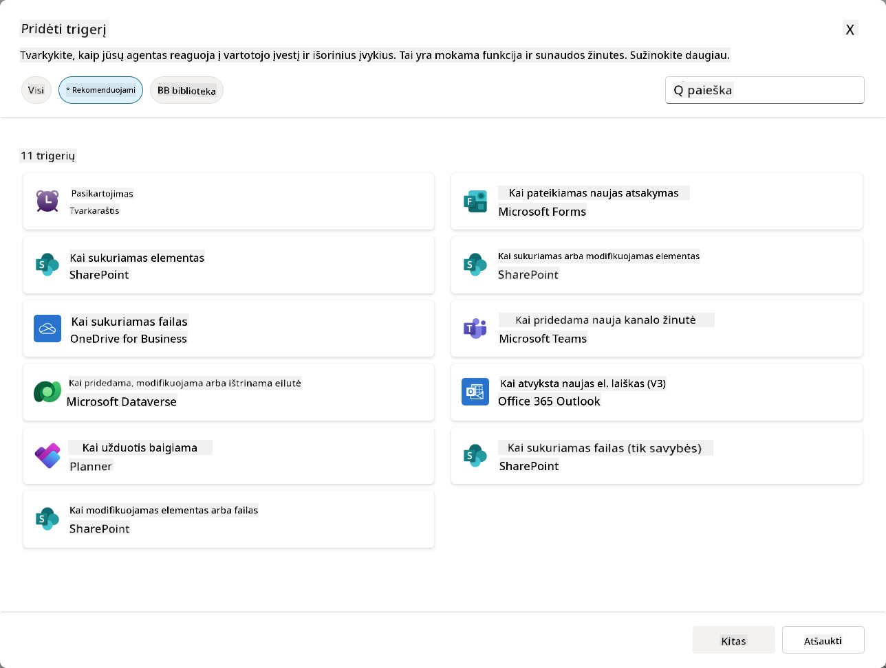
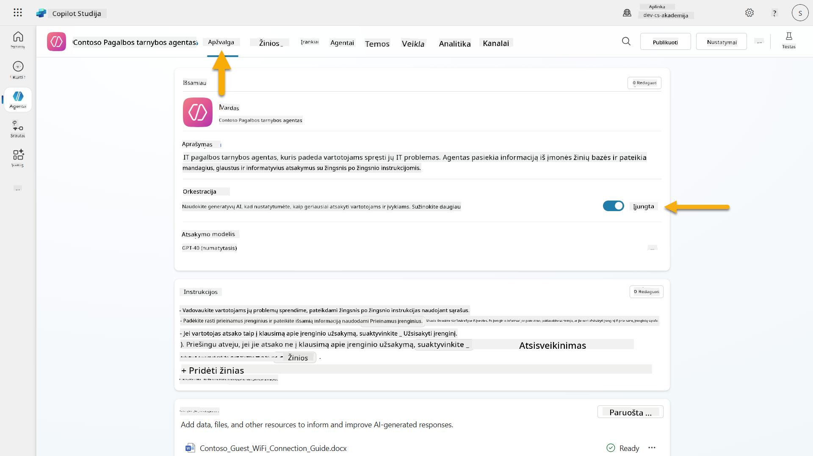
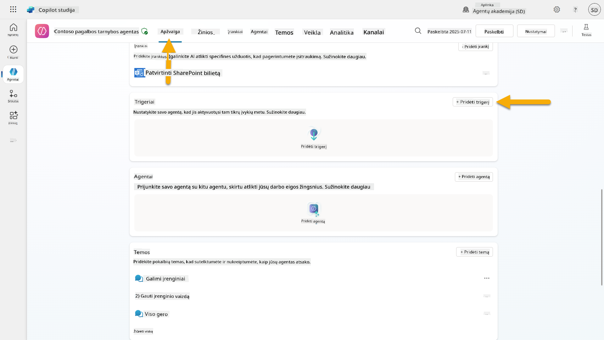
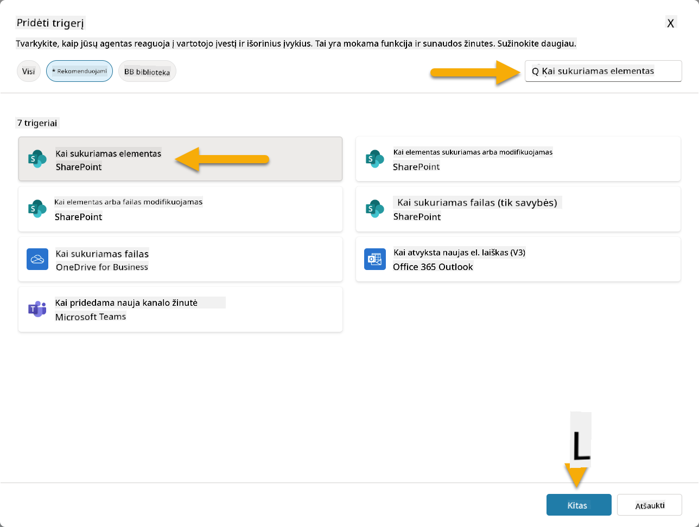
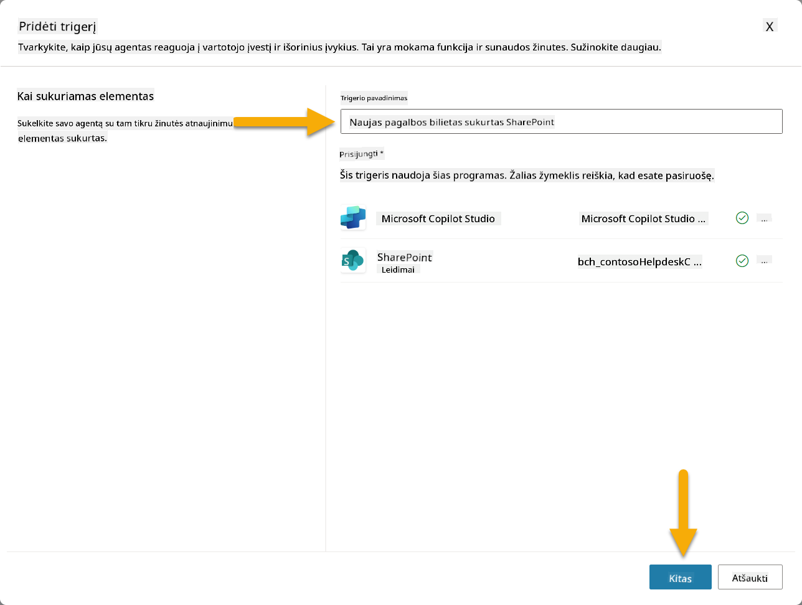
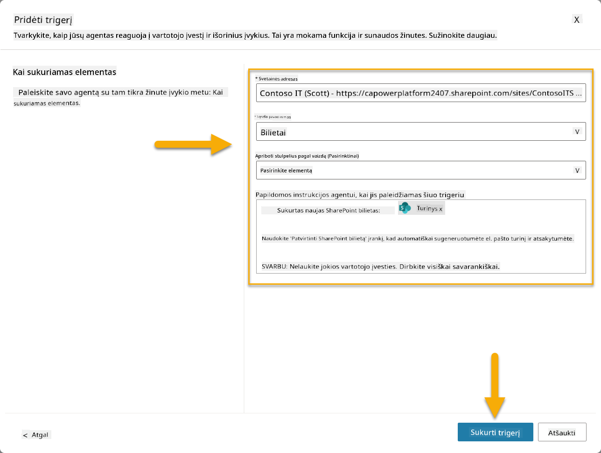
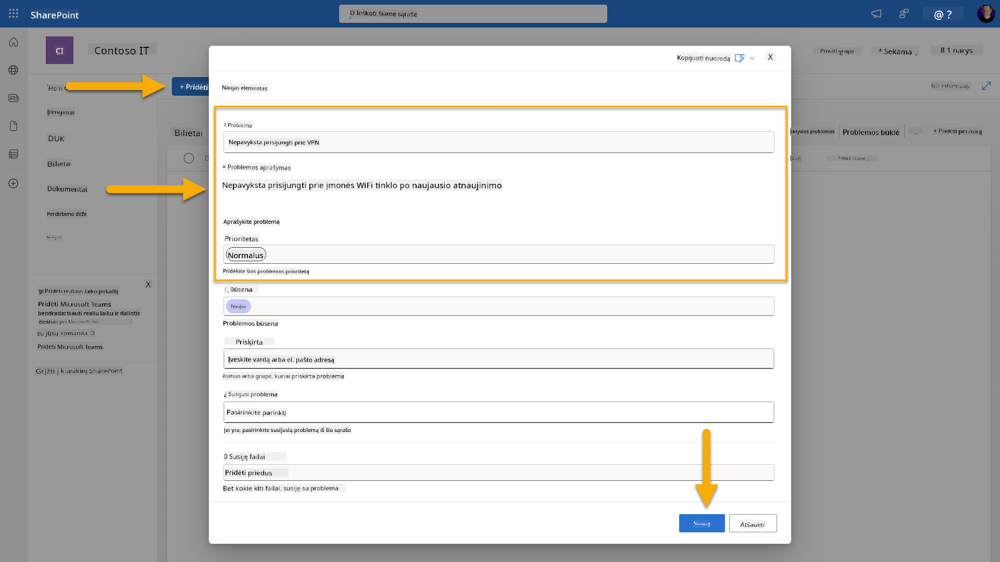
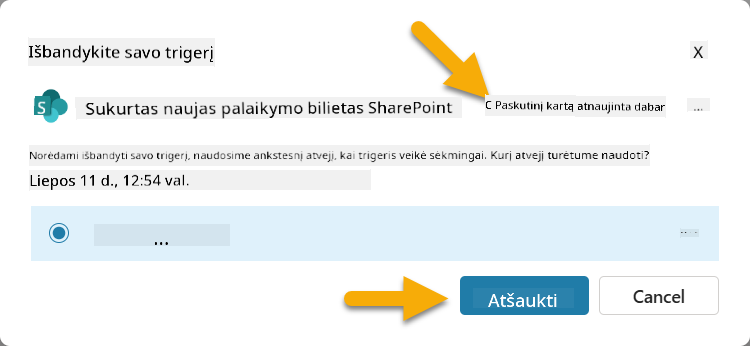
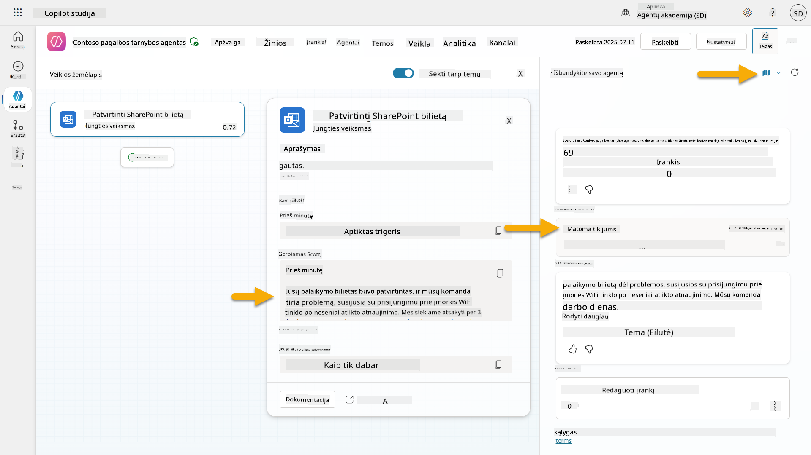
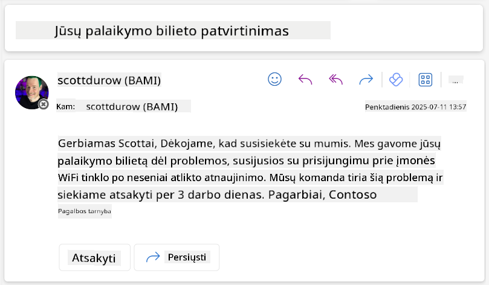

<!--
CO_OP_TRANSLATOR_METADATA:
{
  "original_hash": "cd99a76bcb7372ac2771b6ae178b023d",
  "translation_date": "2025-10-22T00:22:16+00:00",
  "source_file": "docs/recruit/10-add-event-triggers/README.md",
  "language_code": "lt"
}
-->
# 🚨 Misija 10: Pridėti įvykių paleidiklius - įgalinti autonominio agento funkcijas

## 🕵️‍♂️ SLAPTAŽODIS: `OPERACIJA VAIDUOKLIŲ RUTINA`

> **⏱️ Operacijos laiko langas:** `~45 minutės`

🎥 **Žiūrėkite vaizdo įrašą**

[](https://www.youtube.com/watch?v=ZgwHL8PQ1nY "Žiūrėkite vaizdo įrašą YouTube")

## 🎯 Misijos aprašymas

Atėjo laikas jūsų agentą paversti ne tik pokalbių asistentu, bet ir autonominiu veikėju. Jūsų misija - įgalinti agentą veikti be iškvietimo, tiksliai ir greitai reaguojant į signalus iš jūsų skaitmeninės aplinkos.

Naudodami įvykių paleidiklius, išmokysite savo agentą stebėti išorines sistemas, tokias kaip SharePoint, Teams ir Outlook, ir vykdyti protingus veiksmus vos tik gavus signalą. Ši operacija pavers jūsų agentą pilnai veikiančiu lauko turtu - tyliu, greitu ir visada stebinčiu.

Sėkmė reiškia agentų kūrimą, kurie inicijuoja vertę, o ne tik į ją reaguoja.

## 🔎 Tikslai

📖 Ši pamoka apims:

- Įvykių paleidiklių supratimą ir kaip jie įgalina autonominį agento elgesį
- Skirtumų tarp įvykių paleidiklių ir temų paleidiklių supratimą, įskaitant paleidiklių darbo eigas ir duomenų paketus
- Dažniausių įvykių paleidiklių scenarijų tyrimą
- Autentifikacijos, saugumo ir publikavimo aspektų supratimą, susijusių su įvykių paleidikliais
- Autonominio IT pagalbos tarnybos agento kūrimą, kuris reaguoja į SharePoint įvykius ir siunčia el. pašto patvirtinimus

## 🤔 Kas yra įvykių paleidiklis?

**Įvykių paleidiklis** yra mechanizmas, leidžiantis jūsų agentui veikti autonomiškai reaguojant į išorinius įvykius, nereikalaujant tiesioginio vartotojo įvesties. Galvokite apie tai kaip apie agento "stebėjimą" specifiniams įvykiams ir automatinį veiksmų atlikimą, kai tie įvykiai įvyksta.

Skirtingai nuo temų paleidiklių, kurie reikalauja, kad vartotojai kažką įvestų, kad aktyvuotų pokalbį, įvykių paleidikliai aktyvuojami remiantis įvykiais jūsų prijungtose sistemose. Pvz.:

- Kai SharePoint arba OneDrive for Business sukuriamas naujas failas
- Kai Dataverse sukuriamas įrašas
- Kai Planner užduotis yra užbaigta
- Kai pateikiamas naujas Microsoft Forms atsakymas
- Kai pridedama nauja Microsoft Teams žinutė
- Remiantis pasikartojančiu tvarkaraščiu (pvz., kasdieniais priminimais)  


### Kodėl įvykių paleidikliai svarbūs autonominiams agentams

Įvykių paleidikliai paverčia jūsų agentą iš reaktyvaus asistento į proaktyvų, autonominį pagalbininką:

1. **Autonominė veikla** - jūsų agentas gali dirbti 24/7 be žmogaus įsikišimo, reaguodamas į įvykius, kai jie įvyksta.
    - *Pavyzdys:* Automatiškai pasveikinti naujus komandos narius, kai jie pridedami į komandą.

1. **Reagavimas realiu laiku** - vietoj laukimo, kol vartotojai užduos klausimus, jūsų agentas iškart reaguoja į svarbius įvykius.
    - *Pavyzdys:* Įspėti IT komandą, kai SharePoint dokumentas yra modifikuotas.

1. **Darbo eigos automatizavimas** - sujungti kelis veiksmus remiantis vienu paleidiklio įvykiu.
    - *Pavyzdys:* Kai sukuriamas naujas pagalbos bilietas, sukurti užduotį, pranešti vadovui ir atnaujinti stebėjimo lentą.

1. **Nuoseklūs procesai** - užtikrinti, kad svarbūs žingsniai niekada nebūtų praleisti, automatizuojant reakcijas į pagrindinius įvykius.
    - *Pavyzdys:* Kiekvienas naujas darbuotojas automatiškai gauna įvadinę medžiagą ir prieigos prašymus.

1. **Duomenimis pagrįsti veiksmai** - naudoti informaciją iš paleidiklio įvykio, kad priimtumėte protingus sprendimus ir atliktumėte tinkamus veiksmus.
    - *Pavyzdys:* Nukreipti skubius bilietus vyresniems darbuotojams pagal prioritetą paleidiklio duomenų pakete.

## ⚙️ Kaip veikia įvykių paleidikliai?

Įvykių paleidikliai veikia per trijų žingsnių darbo eigą, leidžiančią jūsų agentui autonomiškai reaguoti į išorinius įvykius:

### Paleidiklio darbo eiga

1. **Įvykio aptikimas** - Specifinis įvykis įvyksta prijungtoje sistemoje (SharePoint, Teams, Outlook ir kt.)
1. **Paleidiklio aktyvavimas** - Įvykių paleidiklis aptinka šį įvykį ir siunčia duomenų paketą jūsų agentui per Power Automate Cloud Flow.
1. **Agentas reaguoja** - Jūsų agentas gauna duomenų paketą ir vykdo jūsų apibrėžtas instrukcijas.

### Įvykių paleidikliai vs temų paleidikliai

Suprasti skirtumą tarp šių dviejų paleidiklių tipų yra labai svarbu:

| **Įvykių paleidikliai** | **Temų paleidikliai** |
|-------------------------|----------------------|
| Aktyvuojami išorinių sistemos įvykių | Aktyvuojami vartotojo įvesties/frazės |
| Įgalina autonominį agento elgesį | Įgalina pokalbių atsakymus |
| Naudoja kūrėjo autentifikaciją | Galimybė naudoti vartotojo autentifikaciją |
| Veikia be vartotojo sąveikos | Reikalauja, kad vartotojas pradėtų pokalbį |
| Pavyzdžiai: Sukurtas failas, gautas el. laiškas | Pavyzdys: "Koks oras?" |

## 📦 Duomenų paketų supratimas

Kai įvykis įvyksta, paleidiklis siunčia **duomenų paketą** jūsų agentui, kuriame yra informacija apie įvykį ir instrukcijos, kaip reaguoti.

### Numatyti vs pritaikyti duomenų paketai

Kiekvienas paleidiklio tipas turi numatytą duomenų paketo struktūrą, tačiau ją galima pritaikyti:

**Numatytas duomenų paketas** - Naudoja standartinį formatą, pvz., `Naudoti turinį iš {Body}`

- Sudaro pagrindinė informacija apie įvykį
- Naudoja bendras apdorojimo instrukcijas
- Tinka paprastiems scenarijams

**Pritaikytas duomenų paketas** - Pridėti specifines instrukcijas ir duomenų formatavimą

- Įtraukti detalias instrukcijas jūsų agentui
- Tiksliai nurodyti, kokius duomenis naudoti ir kaip
- Geriau tinka sudėtingoms darbo eigoms

### Agentų instrukcijos vs pritaikytos duomenų paketo instrukcijos

Yra dvi vietos, kuriose galite nurodyti agento elgesį su įvykių paleidikliais:

**Agentų instrukcijos** (Bendros)

- Bendros gairės, taikomos visiems paleidikliams
- Pavyzdys: "Apdorojant bilietus, visada pirmiausia patikrinkite, ar nėra dublikatų"
- Geriausia bendriems elgesio modeliams

**Duomenų paketo instrukcijos** (Specifinės paleidikliui)

- Konkrečios instrukcijos individualiems paleidiklių tipams  
- Pavyzdys: "Dėl šio SharePoint atnaujinimo, siųskite santrauką projekto kanalui"
- Geriausia sudėtingiems agentams su keliais paleidikliais

💡 **Profesionalo patarimas**: Venkite prieštaringų instrukcijų tarp šių dviejų lygių, nes tai gali sukelti netikėtą elgesį.

## 🎯 Dažni įvykių paleidiklių scenarijai

Štai praktiniai pavyzdžiai, kaip įvykių paleidikliai gali pagerinti jūsų agentą:

### IT pagalbos tarnybos agentas

- **Paleidiklis**: Naujas SharePoint sąrašo elementas (pagalbos bilietas)
- **Veiksmas**: Automatiškai kategorizuoti, priskirti prioritetą ir pranešti atitinkamiems komandos nariams

### Darbuotojų įvedimo agentas

- **Paleidiklis**: Naujas vartotojas pridėtas į Dataverse
- **Veiksmas**: Siųsti pasveikinimo žinutę, sukurti įvedimo užduotis ir suteikti prieigą

### Projektų valdymo agentas

- **Paleidiklis**: Užduotis užbaigta Planner
- **Veiksmas**: Atnaujinti projekto lentą, pranešti suinteresuotiems asmenims ir patikrinti kliūtis

### Dokumentų valdymo agentas

- **Paleidiklis**: Failas įkeltas į specifinį SharePoint aplanką
- **Veiksmas**: Išgauti metaduomenis, pritaikyti žymes ir pranešti dokumento savininkams

### Susitikimų asistentas

- **Paleidiklis**: Sukurtas kalendoriaus įvykis
- **Veiksmas**: Siųsti priminimus prieš susitikimą ir darbotvarkę, rezervuoti išteklius

## ⚠️ Publikavimo ir autentifikacijos aspektai

Prieš jūsų agentui naudojant įvykių paleidiklius gamyboje, turite suprasti autentifikacijos ir saugumo pasekmes.

### Kūrėjo autentifikacija

Įvykių paleidikliai naudoja **agentą sukūrusio asmens kredencialus** visai autentifikacijai:

- Jūsų agentas pasiekia sistemas naudodamas jūsų leidimus
- Vartotojai gali potencialiai pasiekti duomenis per jūsų kredencialus
- Visi veiksmai atliekami "kaip jūs", net kai vartotojai sąveikauja su agentu

### Duomenų apsaugos geriausios praktikos

Norint užtikrinti saugumą, publikuojant agentus su įvykių paleidikliais:

1. **Įvertinkite duomenų prieigą** - Peržiūrėkite, kokias sistemas ir duomenis jūsų paleidikliai gali pasiekti
1. **Atidžiai testuokite** - Supraskite, kokią informaciją paleidikliai įtraukia į duomenų paketus
1. **Susiaurinkite paleidiklių apimtį** - Naudokite specifinius parametrus, kad apribotumėte, kokie įvykiai aktyvuoja paleidiklius
1. **Peržiūrėkite duomenų paketo duomenis** - Užtikrinkite, kad paleidikliai neatskleistų jautrios informacijos
1. **Stebėkite naudojimą** - Sekite paleidiklių veiklą ir išteklių naudojimą

## ⚠️ Trikčių šalinimas ir apribojimai

Atminkite šiuos svarbius aspektus, dirbant su įvykių paleidikliais:

### Kvotų ir apmokestinimo poveikis

- Kiekvienas paleidiklio aktyvavimas skaičiuojamas į jūsų pranešimų sunaudojimą
- Dažni paleidikliai (pvz., kas minutę pasikartojantys) gali greitai išnaudoti kvotą
- Stebėkite naudojimą, kad išvengtumėte apribojimų

### Techniniai reikalavimai

- Galimi tik agentams su generatyvine orkestracija
- Reikalauja, kad jūsų aplinkoje būtų įjungtas sprendimų sąmoningas debesų srauto dalijimasis

### Duomenų praradimo prevencija (DLP)

- Jūsų organizacijos DLP politika nustato, kurie paleidikliai yra prieinami
- Administratoriai gali visiškai blokuoti įvykių paleidiklius
- Susisiekite su administratoriumi, jei tikėtini paleidikliai nėra prieinami

## 🧪 Laboratorija 10 - Pridėti įvykių paleidiklius autonominiam agento elgesiui

### 🎯 Naudojimo atvejis

Jūs patobulinsite savo IT pagalbos tarnybos agentą, kad jis automatiškai reaguotų į naujus pagalbos prašymus. Kai kas nors sukuria naują elementą jūsų SharePoint pagalbos bilietų sąraše, jūsų agentas:

1. Autonomiškai aktyvuojasi, kai sukuriamas SharePoint bilietas
1. Pateikia bilieto detales ir instrukcijas apie veiksmus, kuriuos norite, kad jis atliktų
1. Automatiškai patvirtina bilietą pateikėjui per AI sugeneruotą el. laišką

Ši laboratorija demonstruoja, kaip įvykių paleidikliai įgalina tikrai autonominį agento elgesį.

### Reikalavimai

Prieš pradedant šią laboratoriją, įsitikinkite, kad turite:

- ✅ Užbaigtas ankstesnes laboratorijas (ypač 6-8 laboratorijas IT pagalbos tarnybos agentui)
- ✅ Prieigą prie SharePoint svetainės su IT pagalbos bilietų sąrašu
- ✅ Copilot Studio aplinką su įvykių paleidikliais
- ✅ Jūsų agentas turi įjungtą generatyvinę orkestraciją
- ✅ Tinkamus leidimus SharePoint ir jūsų Copilot Studio aplinkoje

### 10.1 Įjungti generatyvinį AI ir sukurti SharePoint elemento sukūrimo paleidiklį

1. Atidarykite savo **IT pagalbos tarnybos agentą** **Copilot Studio**

1. Pirmiausia įsitikinkite, kad **Generatyvinis AI** yra įjungtas jūsų agentui:
   - Eikite į **Apžvalgos** skirtuką
   - Skiltyje Orkestracija, įjunkite **Generatyvinę orkestraciją** į **Įjungta**, jei ji dar neįjungta  
     

1. Eikite į **Apžvalgos** skirtuką ir suraskite **Paleidiklių** skiltį

1. Spustelėkite **+ Pridėti paleidiklį**, kad atidarytumėte paleidiklių biblioteką  
    

1. Ieškokite ir pasirinkite **Kai sukuriamas elementas** (SharePoint)  
    

1. Konfigūruokite paleidiklio pavadinimą ir ryšius:

   - **Paleidiklio pavadinimas:** Naujas pagalbos bilietas sukurtas SharePoint

1. Palaukite, kol ryšiai bus sukonfigūruoti, ir pasirinkite **Toliau**, kad tęstumėte.  
   

1. Konfigūruokite paleidiklio parametrus:

   - **Svetainės adresas**: Pasirinkite savo "Contoso IT" SharePoint svetainę

   - **Sąrašo pavadinimas**: Pasirinkite savo "Bilietų" sąrašą

   - **Papildomos instrukcijos agentui, kai paleidiklis aktyvuojamas:**

     ```text
     New Support Ticket Created in SharePoint: {Body}
     
     Use the 'Acknowledge SharePoint Ticket' tool to generate the email body automatically and respond.
     
     IMPORTANT: Do not wait for any user input. Work completely autonomously.
     ```

     

1. Pasirinkite **Sukurti pale
1. Atidarykite naują naršyklės skirtuką ir eikite į savo **SharePoint IT palaikymo bilietų sąrašą**  
1. Spustelėkite **+ Pridėti naują elementą**, kad sukurtumėte testinį bilietą:  
   - **Pavadinimas**: "Nepavyksta prisijungti prie VPN"  
   - **Aprašymas**: "Nepavyksta prisijungti prie įmonės WIFI tinklo po naujausio atnaujinimo"  
   - **Prioritetas**: "Normalus"  

1. **Išsaugokite** SharePoint elementą  
      
1. Grįžkite į **Copilot Studio** ir stebėkite **Test your trigger** skydelį, kad pamatytumėte aktyvuotą trigerį. Naudokite **Atnaujinti** piktogramą, kad įkeltumėte trigerio įvykį, tai gali užtrukti kelias minutes.  
      
1. Kai trigeris pasirodys, pasirinkite **Pradėti testavimą**  
1. Pasirinkite **Veiklos žemėlapio piktogramą** viršuje **Test your agent** skydelyje  
1. Patikrinkite, ar jūsų agentas:  
   - Gavo trigerio duomenis  
   - Iškvietė įrankį "Patvirtinti SharePoint bilietą"  
       
1. Patikrinkite pateikėjo el. pašto dėžutę, kad įsitikintumėte, jog patvirtinimo el. laiškas buvo išsiųstas  
      
1. Peržiūrėkite **Veiklos** skirtuką Copilot Studio, kad pamatytumėte visą trigerio ir įrankio vykdymo eigą  

## ✅ Misija įvykdyta  

🎉 **Sveikiname!** Jūs sėkmingai įgyvendinote įvykių trigerius su jungčių įrankiais, kurie leidžia jūsų agentui veikti savarankiškai, automatiškai siųsti el. laiškų patvirtinimus ir apdoroti palaikymo bilietus be vartotojo įsikišimo. Kai jūsų agentas bus paskelbtas, jis veiks savarankiškai jūsų vardu.  

🚀 **Toliau**: Kitoje pamokoje sužinosite, kaip [paskelbti savo agentą](../11-publish-your-agent/README.md) Microsoft Teams ir Microsoft 365 Copilot, kad jis būtų prieinamas visai jūsų organizacijai!  

⏭️ [Pereiti prie pamokos **Paskelbti savo agentą**](../11-publish-your-agent/README.md)  

## 📚 Taktiniai ištekliai  

Pasiruošę gilintis į įvykių trigerius ir savarankiškus agentus? Peržiūrėkite šiuos išteklius:  

- **Microsoft Learn**: [Padarykite savo agentą savarankišku Copilot Studio](https://learn.microsoft.com/training/modules/autonomous-agents-online-workshop/?WT.mc_id=power-177340-scottdurow)  
- **Dokumentacija**: [Pridėti įvykių trigerį](https://learn.microsoft.com/microsoft-copilot-studio/authoring-trigger-event?WT.mc_id=power-177340-scottdurow)  
- **Geriausia praktika**: [Power Automate trigerių įvadas](https://learn.microsoft.com/power-automate/triggers-introduction?WT.mc_id=power-177340-scottdurow)  
- **Pažangūs scenarijai**: [Power Automate srautų naudojimas su agentais](https://learn.microsoft.com/microsoft-copilot-studio/advanced-flow-create?WT.mc_id=power-177340-scottdurow)  
- **Saugumas**: [Duomenų praradimo prevencija Copilot Studio](https://learn.microsoft.com/microsoft-copilot-studio/admin-data-loss-prevention?WT.mc_id=power-177340-scottdurow)  


---

**Atsakomybės apribojimas**:  
Šis dokumentas buvo išverstas naudojant AI vertimo paslaugą [Co-op Translator](https://github.com/Azure/co-op-translator). Nors siekiame tikslumo, prašome atkreipti dėmesį, kad automatiniai vertimai gali turėti klaidų ar netikslumų. Originalus dokumentas jo gimtąja kalba turėtų būti laikomas autoritetingu šaltiniu. Dėl svarbios informacijos rekomenduojama profesionali žmogaus vertimo paslauga. Mes neprisiimame atsakomybės už nesusipratimus ar neteisingus interpretavimus, atsiradusius naudojant šį vertimą.