<!--
CO_OP_TRANSLATOR_METADATA:
{
  "original_hash": "9dceeba2eae2bb73e328602a060eddab",
  "translation_date": "2025-10-22T00:51:17+00:00",
  "source_file": "docs/recruit/11-publish-your-agent/README.md",
  "language_code": "lt"
}
-->
# 🚨 Misija 11: Publikuokite savo agentą

## 🕵️‍♂️ SLAPTAŽODIS: `OPERACIJA PUBLIKUOTI PUBLIKUOTI PUBLIKUOTI`

> **⏱️ Operacijos trukmė:** `~30 minučių`  

🎥 **Žiūrėkite vaizdo įrašą**

## 🎯 Misijos aprašymas

Po daugybės sudėtingų modulių, Agentų Kūrėjau, jūs pagaliau pasiruošę svarbiausiam žingsniui – savo agento publikavimui. Atėjo laikas jūsų kūrinį padaryti prieinamą vartotojams per Microsoft Teams ir Microsoft 365 Copilot.

Jūsų agentas, turintis aiškią misiją, galingus įrankius ir prieigą prie svarbių žinių šaltinių, yra pasiruošęs veikti. Naudodami Microsoft Copilot Studio, jūs įdiegiate savo agentą, kad jis galėtų pradėti padėti realiems vartotojams ten, kur jie dirba.

Paleiskime jūsų agentą į veiksmą.

## 🔎 Tikslai

📖 Ši pamoka apima:

1. Kodėl svarbu publikuoti savo agentą
1. Kas nutinka, kai publikuojate savo agentą
1. Kaip pridėti kanalą (Microsoft Teams ir Microsoft 365 Copilot)
1. Kaip pridėti agentą į Microsoft Teams
1. Kaip padaryti agentą prieinamą visai organizacijai per Microsoft Teams

## 🚀 Publikuokite agentą

Kiekvieną kartą, kai dirbate su agentu Copilot Studio, galite jį atnaujinti pridėdami žinių ar įrankių. Kai visi pakeitimai yra atlikti ir kruopščiai išbandyti, jūs pasiruošę jį publikuoti. Publikavimas užtikrina, kad naujausi atnaujinimai yra aktyvūs. Jei atnaujinate savo agentą naujais įrankiais, bet nespaudžiate publikavimo mygtuko, jie dar nėra prieinami galutiniams vartotojams.

Visada įsitikinkite, kad paspaudėte publikavimo mygtuką, kai norite pateikti atnaujinimus savo agento vartotojams. Jūsų agentas gali turėti pridėtus kanalus, ir kai paspaudžiate publikavimo mygtuką, atnaujinimai tampa prieinami visiems kanalams, kuriuos pridėjote prie agento.

## ⚙️ Konfigūruokite kanalus

Kanalai nustato, kur jūsų vartotojai gali pasiekti ir bendrauti su jūsų agentu. Po to, kai publikuojate savo agentą, galite padaryti jį prieinamą keliuose kanaluose. Kiekvienas kanalas gali skirtingai rodyti jūsų agento turinį.

Galite pridėti savo agentą į šiuos kanalus:

- **Microsoft Teams ir Microsoft 365 Copilot** - Padarykite savo agentą prieinamą Teams pokalbiuose ir susitikimuose, taip pat Microsoft 365 Copilot patirtyse ([Sužinokite daugiau](https://learn.microsoft.com/microsoft-copilot-studio/publication-add-bot-to-microsoft-teams))
- **Demo svetainė** - Išbandykite savo agentą demo svetainėje, kurią teikia Copilot Studio ([Sužinokite daugiau](https://learn.microsoft.com/microsoft-copilot-studio/publication-connect-bot-to-web-channels))
- **Individuali svetainė** - Įterpkite savo agentą tiesiai į savo svetainę ([Sužinokite daugiau](https://learn.microsoft.com/microsoft-copilot-studio/publication-connect-bot-to-web-channels))
- **Mobilioji programėlė** - Integruokite savo agentą į individualią mobiliąją programėlę ([Sužinokite daugiau](https://learn.microsoft.com/microsoft-copilot-studio/publication-connect-bot-to-custom-application))
- **SharePoint** - Pridėkite savo agentą į SharePoint svetaines dokumentų ir svetainių pagalbai ([Sužinokite daugiau](https://learn.microsoft.com/microsoft-copilot-studio/publication-add-bot-to-sharepoint))
- **Facebook Messenger** - Bendraukite su vartotojais per Facebook žinučių platformą ([Sužinokite daugiau](https://learn.microsoft.com/microsoft-copilot-studio/publication-add-bot-to-facebook))
- **Power Pages** - Integruokite savo agentą į Power Pages svetaines ([Sužinokite daugiau](https://learn.microsoft.com/microsoft-copilot-studio/publication-add-bot-to-power-pages))
- **Azure Bot Service kanalai** - Pasiekite papildomus kanalus, įskaitant Slack, Telegram, Twilio SMS ir daugiau ([Sužinokite daugiau](https://learn.microsoft.com/microsoft-copilot-studio/publication-connect-bot-to-azure-bot-service-channels))

Norėdami pridėti kanalą, eikite į **Channels** skirtuką savo agente ir pasirinkite norimą konfigūruoti kanalą. Kiekvienas kanalas turi specifinius nustatymų reikalavimus ir gali reikalauti papildomos autentifikacijos ar konfigūracijos žingsnių.

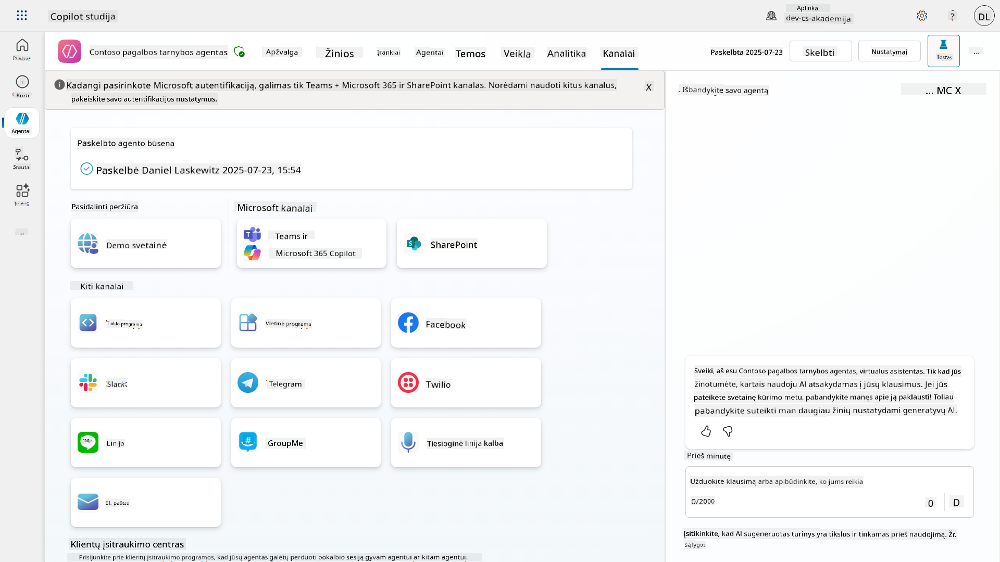

## 📺 Kanalų patirtys

Skirtingi kanalai turi skirtingas vartotojų patirtis. Kurdamas agentą keliems kanalams, įsitikinkite, kad žinote skirtumus tarp kanalų. Visada gera strategija išbandyti savo agentą keliuose kanaluose, kad įsitikintumėte, jog jis veikia taip, kaip numatyta.

| Patirtis                          | Svetainė      | Teams ir Microsoft 365 Copilot         | Facebook                 | Dynamics Omnichannel for Customer Service                   |
| --------------------------------- | ------------- | --------------------------------------- | ------------------------ | ----------------------------------------------------------- |
| [Klientų pasitenkinimo apklausa][1] | Adaptacinė kortelė | Tik tekstas                             | Tik tekstas              | Tik tekstas                                                 |
| [Pasirinkimo galimybės][1]         | Palaikoma     | [Palaikoma iki šešių (kaip hero kortelė)][4] | [Palaikoma iki 13][6]    | [Iš dalies palaikoma][8]                                    |
| [Markdown][2]                     | Palaikoma     | [Iš dalies palaikoma][5]                | [Iš dalies palaikoma][7] | [Iš dalies palaikoma][9]                                    |
| [Sveikinimo žinutė][1]            | Palaikoma     | Palaikoma                               | Nepalaikoma              | Palaikoma [Pokalbiams][10]. Nepalaikoma kituose kanaluose.  |
| [Ar turėjote omenyje][3]          | Palaikoma     | Palaikoma                               | Palaikoma                | Palaikoma [Microsoft Teams][11], [Pokalbiams][10], Facebook ir tekstiniams kanalams (SMS per [TeleSign][12] ir [Twilio][13], [WhatsApp][14], [WeChat][15], ir [Twitter][16]). Siūlomi veiksmai pateikiami kaip tekstinis sąrašas; vartotojai turi perrašyti pasirinkimą, kad atsakytų. |

[1]: https://learn.microsoft.com/microsoft-copilot-studio/authoring-create-edit-topics
[2]: https://daringfireball.net/projects/markdown/
[3]: https://learn.microsoft.com/microsoft-copilot-studio/advanced-ai-features
[4]: https://learn.microsoft.com/microsoftteams/platform/concepts/cards/cards-reference#hero-card
[5]: https://learn.microsoft.com/microsoftteams/platform/bots/how-to/format-your-bot-messages#text-only-messages
[6]: https://developers.facebook.com/docs/messenger-platform/send-messages/quick-replies/
[7]: https://www.facebook.com/help/147348452522644?helpref=related
[8]: https://learn.microsoft.com/dynamics365/customer-service/asynchronous-channels#suggested-actions-support
[9]: https://learn.microsoft.com/dynamics365/customer-service/asynchronous-channels#preview-support-for-formatted-messages
[10]: https://learn.microsoft.com/dynamics365/customer-service/set-up-chat-widget
[11]: https://learn.microsoft.com/dynamics365/customer-service/configure-microsoft-teams
[12]: https://learn.microsoft.com/dynamics365/customer-service/configure-sms-channel
[13]: https://learn.microsoft.com/dynamics365/customer-service/configure-sms-channel-twilio
[14]: https://learn.microsoft.com/dynamics365/customer-service/configure-whatsapp-channel
[15]: https://learn.microsoft.com/dynamics365/customer-service/configure-wechat-channel
[16]: https://learn.microsoft.com/dynamics365/customer-service/configure-twitter-channel

> [!NOTE]
> Yra keletas pavyzdžių, kaip galite naudoti skirtingą logiką skirtingiems kanalams. Vieną iš pavyzdžių galite rasti Power Platform Snippets saugykloje:
>
> Henry Jammes pasidalino pavyzdžiu, kaip parodyti skirtingą adaptacinę kortelę, kai kanalas yra Microsoft Teams. ([Nuoroda į pavyzdį](https://github.com/pnp/powerplatform-snippets/blob/main/copilot-studio/multiple-topics-matched-topic/source/multiple-topics-matched.yaml#L40))

## 🧪 Laboratorija 11: Publikuokite savo agentą į Teams ir Microsoft 365 Copilot

### 🎯 Naudojimo atvejis

Jūsų Contoso IT pagalbos tarnybos agentas dabar yra visiškai sukonfigūruotas su galingomis funkcijomis – jis gali pasiekti SharePoint žinių šaltinius, kurti pagalbos bilietus, siųsti proaktyvius pranešimus ir protingai atsakyti į vartotojų užklausas. Tačiau visos šios funkcijos šiuo metu yra prieinamos tik kūrimo aplinkoje, kurioje jas sukūrėte.

**Iššūkis:** Galutiniai vartotojai negali pasinaudoti jūsų agento galimybėmis, kol jis nėra tinkamai publikuotas ir padarytas prieinamas kanaluose, kuriuose jie iš tikrųjų dirba.

**Sprendimas:** Publikuodami savo agentą užtikrinate, kad naujausia versija – su visais jūsų naujausiais atnaujinimais, naujomis temomis, patobulintais žinių šaltiniais ir sukonfigūruotais srautais – yra prieinama realiems vartotojams. Be publikavimo, vartotojai vis dar naudotųsi senesne jūsų agento versija, kurioje gali trūkti svarbių funkcijų.

Pridėti Teams ir Microsoft 365 Copilot kanalą yra taip pat labai svarbu, nes:

- **Teams integracija**: Jūsų organizacijos darbuotojai didžiąją dienos dalį praleidžia Microsoft Teams platformoje bendradarbiaudami, dalyvaudami susitikimuose ir bendraudami. Pridėję savo agentą į Teams, vartotojai galės gauti IT pagalbą neišeidami iš savo pagrindinės darbo aplinkos.

- **Microsoft 365 Copilot**: Vartotojai gali pasiekti jūsų specializuotą IT pagalbos tarnybos agentą tiesiogiai per Microsoft 365 Copilot patirtį, todėl jis sklandžiai integruojamas į jų kasdienį darbą su Office programomis.

- **Centralizuota prieiga**: Vietoj to, kad vartotojai turėtų prisiminti atskiras svetaines ar programėles, jie gali pasiekti IT pagalbą per platformas, kurias jau naudoja, sumažindami trukdžius ir didindami naudojimą.

Ši misija paverčia jūsų kūrimo darbą į gamybai paruoštą sprendimą, kuris suteikia realią vertę jūsų organizacijos galutiniams vartotojams.

### Būtinos sąlygos

Prieš pradėdami šią laboratoriją, įsitikinkite, kad turite:

- ✅ Baigę ankstesnes laboratorijas ir turite visiškai sukonfigūruotą Contoso pagalbos tarnybos agentą
- ✅ Jūsų agentas buvo išbandytas ir yra paruoštas naudoti gamyboje
- ✅ Leidimus savo Copilot Studio aplinkoje publikuoti agentus
- ✅ Prieigą prie Microsoft Teams savo organizacijoje

### 11.1 Publikuokite savo agentą

Dabar, kai visi darbai su agentu yra baigti, turime užtikrinti, kad visas mūsų darbas būtų prieinamas galutiniams vartotojams, kurie naudosis mūsų agentu. Kad turinys būtų prieinamas visiems vartotojams, turime publikuoti savo agentą.

1. Eikite į Contoso pagalbos tarnybos agentą Copilot Studio (per [Copilot Studio kūrėjų portalą](https://copilotstudio.microsoft.com))

    Copilot Studio publikuoti savo agentą yra paprasta. Tiesiog pasirinkite publikavimo mygtuką agento apžvalgos viršuje.

    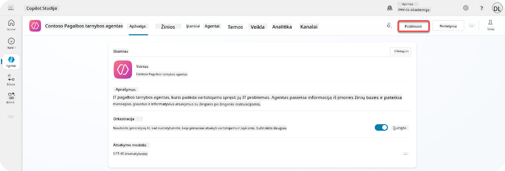

1. Pasirinkite **Publish** mygtuką savo agente

    Atsidarys publikavimo langas – patvirtinkite, kad tikrai norite publikuoti savo agentą.

    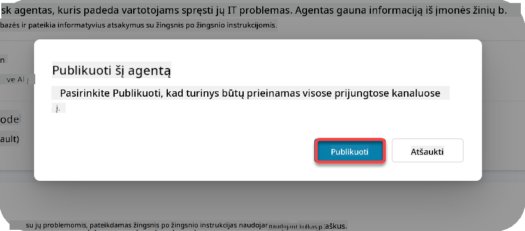

1. Pasirinkite **Publish**, kad patvirtintumėte agento publikavimą

    Dabar pasirodys pranešimas, kad jūsų agentas publikuojamas. Jums nereikia laikyti šio lango atidaryto. Jūs gausite pranešimą, kai agentas bus publikuotas.

    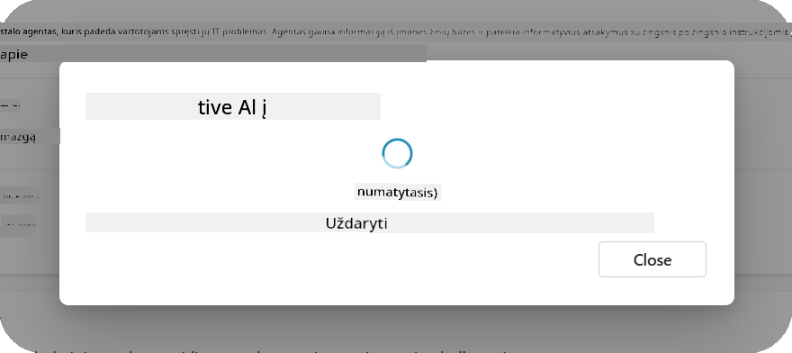

    Kai agentas bus publikuotas, viršuje pasirodys pranešimas.

    

Tačiau – mes tik publikavome agentą, dar nepridėjome jo į kanalą, todėl dabar tai išspręskime!

### 11.2 Pridėkite Teams ir Microsoft 365 Copilot kanalą

1. Norėdami pridėti Teams ir Microsoft 365 Copilot kanalą prie mūsų agento, turime pasirinkti **Channel** viršutinėje agento navigacijoje

    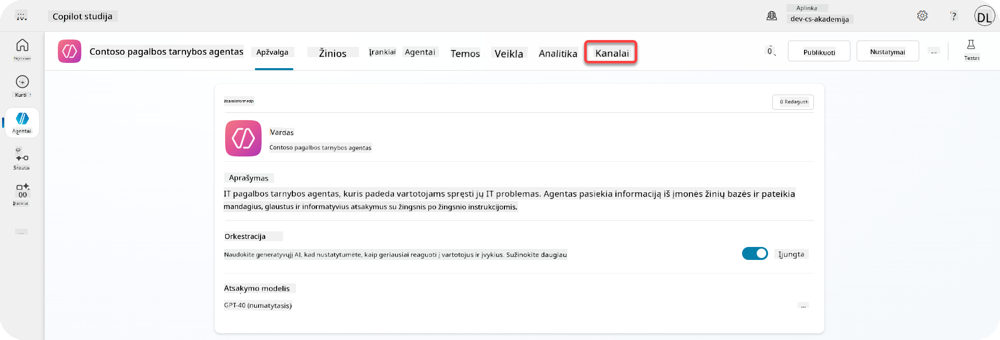

    Čia matome visus kanalus, kuriuos galime pridėti prie šio agento.

1. Pasirinkite **Teams ir Microsoft 365**

    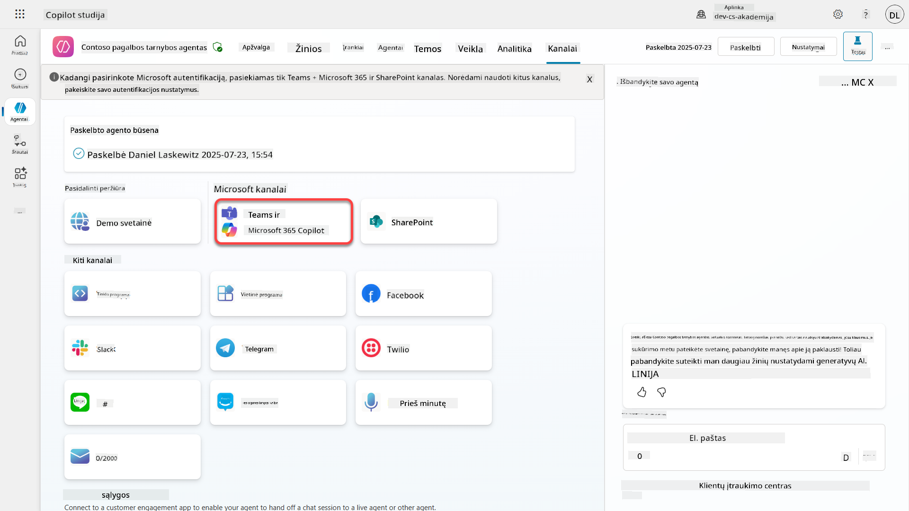

1. Pasirinkite **Add channel**, kad užbaigtumėte vedlį ir pridėtumėte kanalą prie agento

    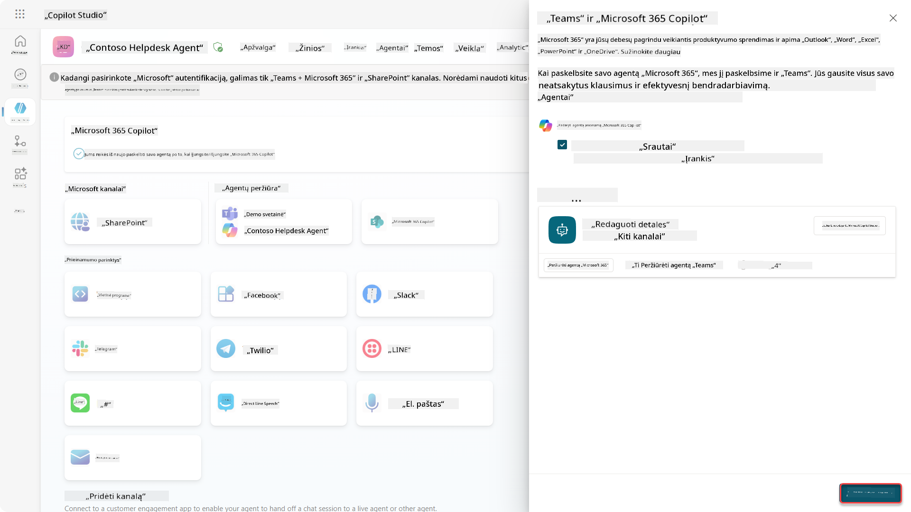

    Tai užtruks šiek tiek laiko, kol bus pridėta. Po to, kai bus pridėta, viršutiniame šoniniame skydelyje pasirodys žalias pranešimas.

    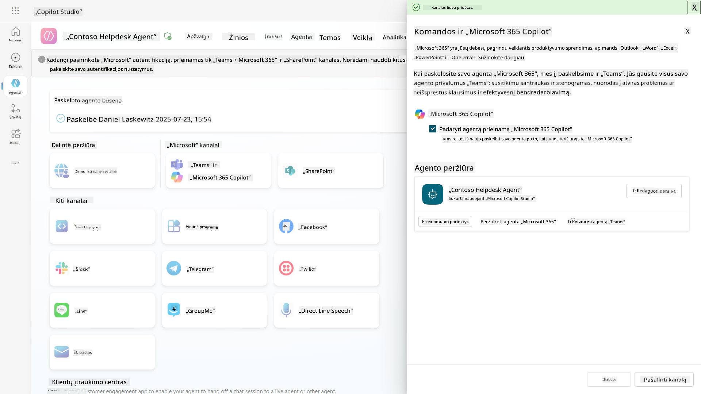

1. Pasirinkite **See agent in Teams**, kad atidarytumėte naują skirtuką

    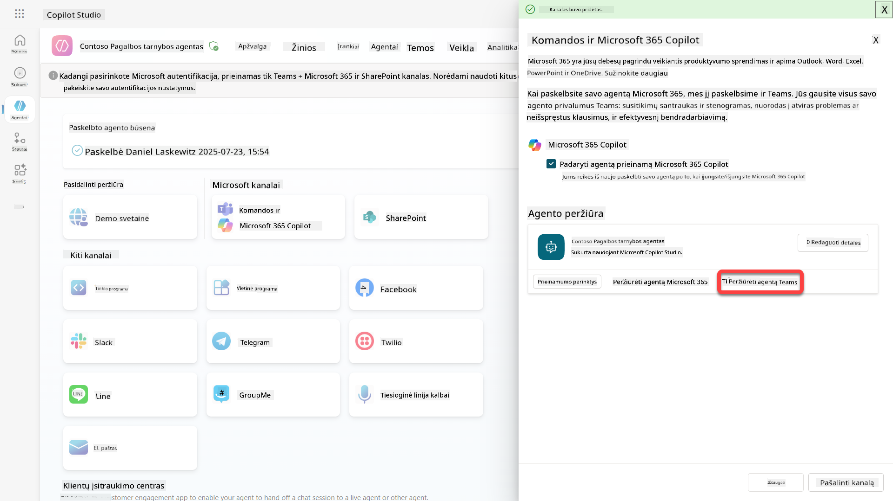

1. Pasirinkite **Add**, kad pridėtumėte Contoso pagalbos tarnybos agentą į Teams

    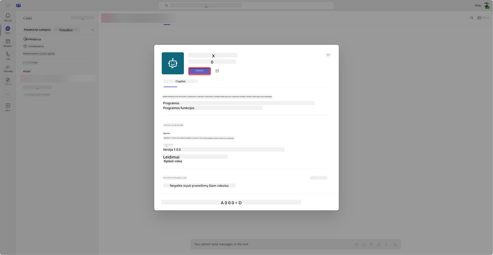

    Tai turėtų užtrukti šiek tiek laiko. Po to turėtų pasirodyti toks ekranas:

    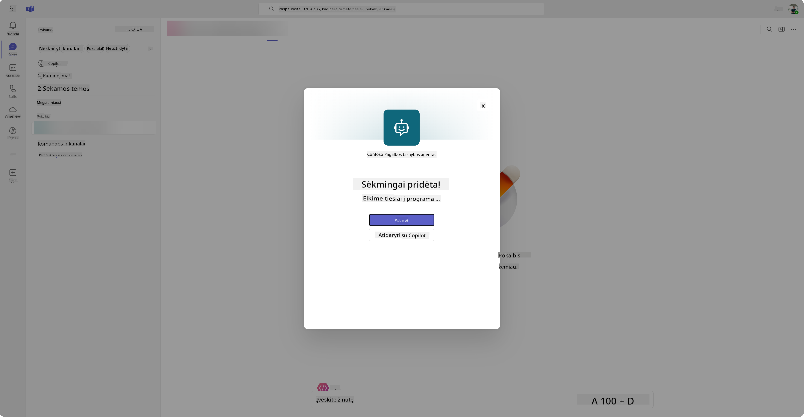

1. Pasirinkite **Open**, kad atidarytumėte agentą Teams

    Tai atidarys agentą Teams kaip Teams programėlę

    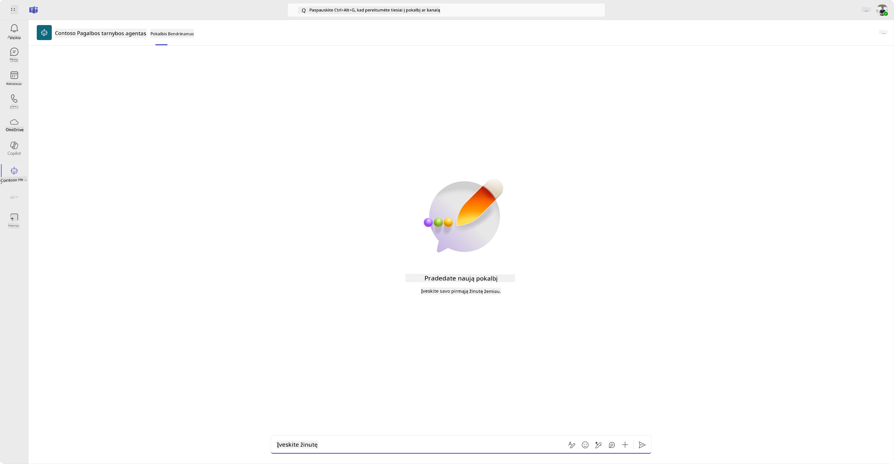

Dabar mes publikavome agentą, kad jis veiktų Microsoft Teams, tačiau galbūt norėsite padaryti jį prieinamą daugiau žmonių.

### 11.3 Padarykite agentą prieinamą visiems vartotojams nuomotojo aplinkoje

1. Uždarykite naršyklės skirtuką, kuriame atidarytas Contoso pagalbos tarnybos agentas

    Tai turėtų sugrąžinti jus į Copilot Studio, kur Teams ir Microsoft 365 Copilot šoninis skydelis vis dar atidarytas. Mes tik atidarėme agentą Teams, tačiau čia galime padaryti daug daugiau. Galime redaguoti agento detales, jį įdiegti daugiau vartotojams ir dar daugiau.

1. Pasirinkite **Edit details**

    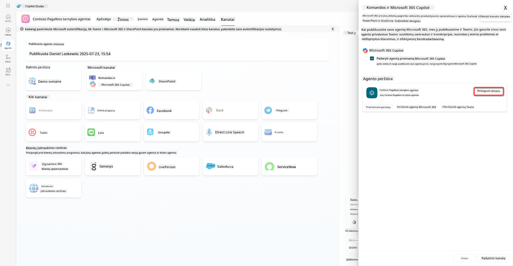
Tai atidarys langą, kuriame galėsime pakeisti daugybę agento detalių ir nustatymų. Galime pakeisti pagrindines detales, tokias kaip piktograma, piktogramos fono spalva ir aprašymai. Taip pat galime pakeisti Teams nustatymus (pavyzdžiui, leisti vartotojui pridėti agentą į komandą arba naudoti šį agentą grupiniuose ir susitikimų pokalbiuose). Pasirinkę *daugiau*, galite pakeisti kūrėjo detales, tokias kaip kūrėjo vardas, svetainė, privatumo pareiškimas ir naudojimo sąlygos.

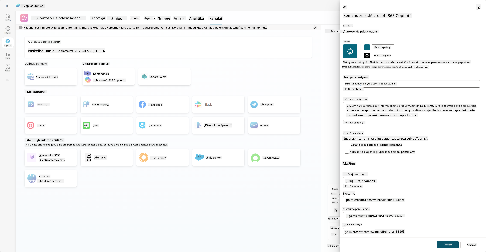

1. Pasirinkite **Atšaukti**, kad uždarytumėte Redaguoti detalių langą.

1. Pasirinkite **Prieinamumo parinktys**.

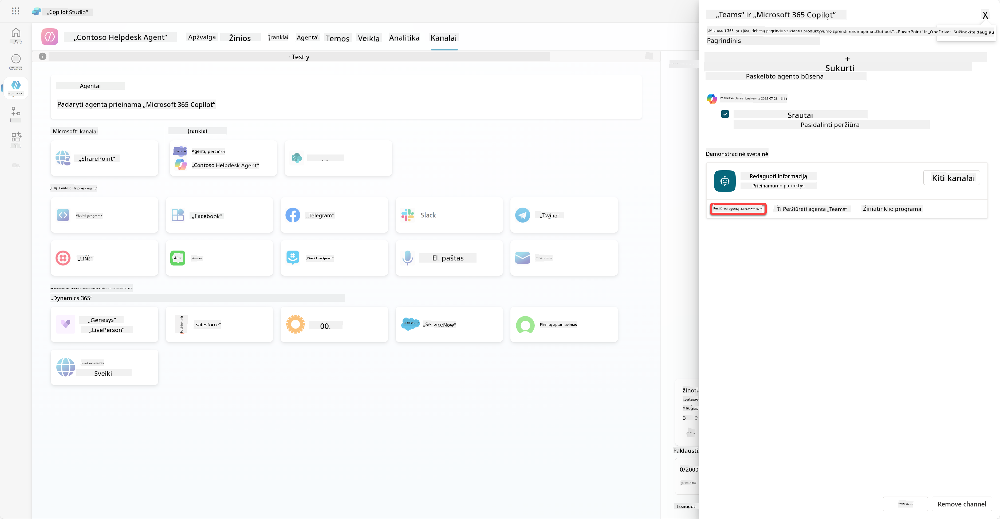

Tai atidarys prieinamumo parinkčių langą, kuriame galite nukopijuoti nuorodą, kad ją nusiųstumėte vartotojams, kad jie galėtų naudoti šį agentą (atkreipkite dėmesį, kad agentą taip pat reikia pasidalinti su vartotoju), ir galite atsisiųsti failą, kad pridėtumėte savo agentą į Microsoft Teams arba Microsoft 365 parduotuvę. Norėdami parodyti agentą parduotuvėje, turite ir kitų parinkčių: galite parodyti jį savo komandos nariams ir bendrintiems vartotojams (kad būtų rodomas *Sukurta naudojant Power Platform* skiltyje) arba galite parodyti jį visiems savo organizacijoje (tam reikia administratoriaus patvirtinimo).

1. Pasirinkite **Rodyti visiems mano organizacijoje**.

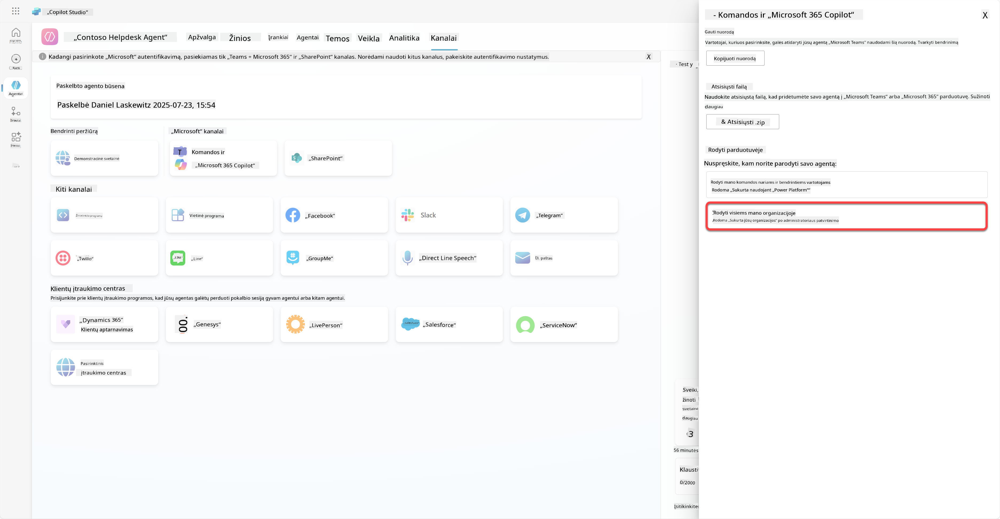

1. Pasirinkite **Pateikti administratoriaus patvirtinimui**.

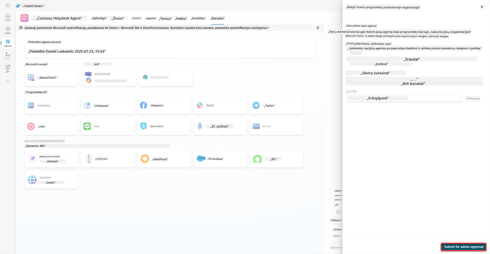

Dabar jūsų administratorius turi patvirtinti jūsų agento pateikimą. Jie tai gali padaryti, eidami į Teams administravimo centrą ir suradę Contoso Helpdesk Agent programą. Ekrano nuotraukoje matote, ką administratorius matytų Teams administravimo centre.

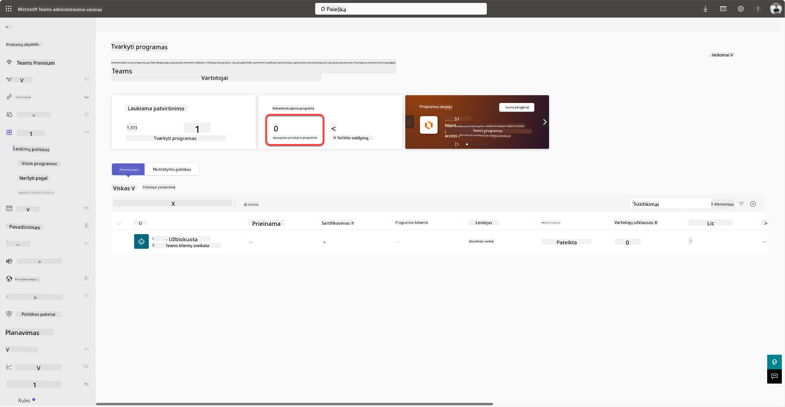

Administratorius turi pasirinkti Contoso Helpdesk Agent ir pasirinkti *Publikuoti*, kad publikuotų Contoso Helpdesk Agent visiems.

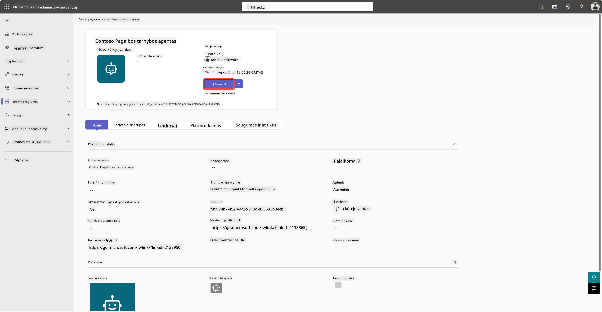

Kai administratorius publikuos agento pateikimą, galėsite atnaujinti Copilot Studio ir turėtumėte matyti *prieinama programų parduotuvėje* juostą prieinamumo parinktyse.

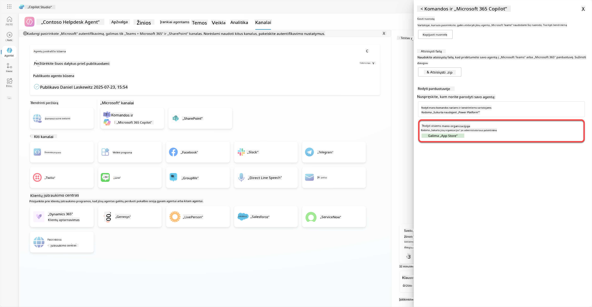

Čia yra dar daugiau galimybių. Jūsų administratorius gali pakeisti globalios konfigūracijos politiką ir automatiškai įdiegti Contoso Helpdesk Agent visiems nuomininkams. Be to, galite prisegti Contoso Helpdesk Agent kairėje juostoje, kad visi turėtų lengvą prieigą prie jo.

## ✅ Misija įvykdyta

🎉 **Sveikiname!** Jūs sėkmingai publikavote savo agentą ir pridėjote jį į Teams ir Microsoft 365 Copilot! Toliau laukia paskutinė kurso misija: Licencijavimo supratimas.

⏭️ [Pereiti į **Licencijavimo supratimo** pamoką](../12-understanding-licensing/README.md)

## 📚 Taktiniai ištekliai

🔗 [Publikavimo kanalų dokumentacija](https://learn.microsoft.com/microsoft-copilot-studio/publication-fundamentals-publish-channels)

---

**Atsakomybės apribojimas**:  
Šis dokumentas buvo išverstas naudojant AI vertimo paslaugą [Co-op Translator](https://github.com/Azure/co-op-translator). Nors siekiame tikslumo, prašome atkreipti dėmesį, kad automatiniai vertimai gali turėti klaidų ar netikslumų. Originalus dokumentas jo gimtąja kalba turėtų būti laikomas autoritetingu šaltiniu. Kritinei informacijai rekomenduojama profesionali žmogaus vertimo paslauga. Mes neprisiimame atsakomybės už nesusipratimus ar neteisingus aiškinimus, kylančius dėl šio vertimo naudojimo.