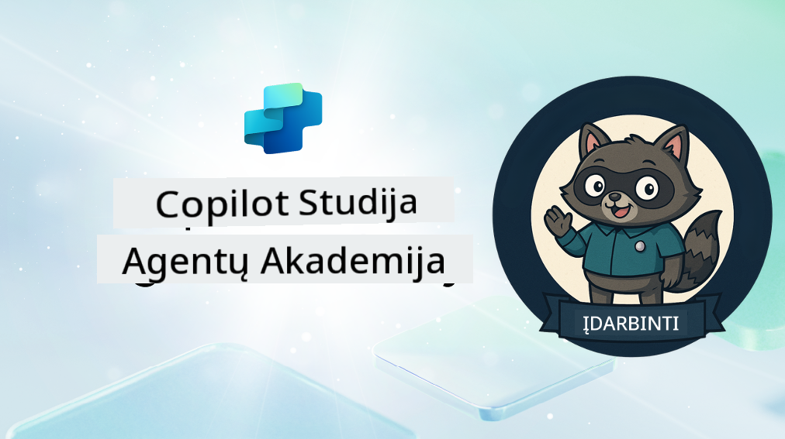

<!--
CO_OP_TRANSLATOR_METADATA:
{
  "original_hash": "8b5ecad9d5d073ea3f4c2b844e80f2e5",
  "translation_date": "2025-10-22T00:20:28+00:00",
  "source_file": "docs/recruit/README.md",
  "language_code": "lt"
}
-->
# Sveiki atvykę, Rekrute

**Sveiki atvykę, Rekrute.**  
Jūsų misija—jei nuspręsite ją priimti—yra įvaldyti agentų kūrimo meną naudojant **Microsoft Copilot Studio**.

Šis praktinis mokymas yra jūsų įėjimo taškas į **agentų pasaulį**: nuo pagrįstų užklausų iki Adaptive Cards ir agentų srautų, jūs išmoksite kurti, plėsti ir diegti intelektualius agentus, naudodami realius įrankius ir praktinius pavyzdžius.

---

## 🎯 Misijos tikslas

Baigę Agentų Akademiją, galėsite:

- Suprasti, kas yra agentai Microsoft Copilot Studio kontekste
- Ištyrinėti, kaip Dideli Kalbos Modeliai (LLMs), generavimas su papildoma informacija (RAG) ir orkestracija susijungia agentuose
- Kurti tiek **deklaratyvius**, tiek **individualius agentus**
- Tobulinti agentus su **Temomis**, **Adaptive Cards** ir **Agentų srautais**
- Diegti agentus į **Microsoft Teams** ir **Microsoft 365 Copilot**

---

## 🧪 Reikalavimai

Norint įvykdyti visas misijas, jums reikės:

- Microsoft 365 kūrėjo nuomotojo (su įjungtu SharePoint)
- Prieigos prie **Microsoft Copilot Studio** (bandomosios arba licencijuotos versijos)
- Pasirinktinai: Pagrindinių žinių apie SharePoint, Power Platform arba Power Fx

---

## 🧬 Kam tai skirta

Šis kursas idealiai tinka:

- Kūrėjams ir programuotojams, tyrinėjantiems **Copilot Studio**
- IT specialistams, kuriantiems **Microsoft 365 Copilot praplėtimus**
- Power Platform entuziastams, norintiems **pakelti savo lygį** su intelektualiais agentais
- Visiems, kurie mėgsta mokytis **praktikuojantis**

---

## 🧭 Mokymo programos apžvalga

Ši akademija suskirstyta į progresyvias pamokas—kiekviena sukurta kaip lauko misija, skirta tobulinti jūsų agentų kūrimo įgūdžius.

| Pamoka | Pavadinimas | Misijos aprašymas |
|--------|-------------|-------------------|
| `00` | 🧰 [Kurso nustatymas](./00-course-setup/README.md) | Paruoškite savo kūrimo aplinką, Copilot Studio bandomąją versiją ir SharePoint svetainę |
| `01` | 🧠 [Įvadas į agentus](./01-introduction-to-agents/README.md) | Supraskite pokalbių AI koncepcijas, LLMs ir autonominius bei deklaratyvius agentus |
| `02` | 🛠️ [Copilot Studio pagrindai](./02-copilot-studio-fundamentals/README.md) | Sužinokite pagrindinius elementus: žinias, įgūdžius, autonomiją |
| `03` | 👩‍💻 [Deklaratyvaus agento kūrimas](./03-create-a-declarative-agent-for-M365Copilot/README.md) | Pridėkite savo agentą prie Microsoft 365 Copilot, pagrįstą užklausa |
| `04` | 🧩 [Sprendimo kūrimas](./04-creating-a-solution/README.md) | Supakuokite savo agentą į pakartotinai naudojamą sprendimą aplinkos valdymui |
| `05` | 🚀 [Pradėkite naudotis iš anksto sukurtais agentais](./05-using-prebuilt-agents/README.md) | Naudokite ir pritaikykite šabloninius agentus, kad paspartintumėte nustatymus |
| `06` | ✍️ [Individualaus agento kūrimas](./06-create-agent-from-conversation/README.md) | Sukurkite naują Copilot, pagrįstą žinių šaltiniais |
| `07` | 🧠 [Pridėkite temą su trigeriais](./07-add-new-topic-with-trigger/README.md) | Naudokite temas, kad apibrėžtumėte individualius klausimų/atsakymų kelius |
| `08` | 🪪 [Tobulinimas su Adaptive Cards](./08-add-adaptive-card/README.md) | Sukurkite Adaptive Card naudodami Power Fx ir SharePoint |
| `09` | 🔁 [Automatizavimas su agentų srautais](./09-add-an-agent-flow/README.md) | Naudokite Adaptive Card įvestį, kad paleistumėte užkulisių srautus |
| `10` | 🧭 [Pridėkite įvykių trigerius](./10-add-event-triggers/README.md) | Leiskite savo agentui veikti autonomiškai, naudojant įvykių logiką |
| `11` | 📢 [Publikuokite savo agentą](./11-publish-your-agent/README.md) | Diegkite savo agentą į Microsoft Teams ir Microsoft 365 Copilot |
| `12` | 🪪 [Licencijavimo supratimas](./12-understanding-licensing/README.md) | Sužinokite, kaip veikia licencijavimas ir apmokestinimas su Copilot Studio |
| `13` | 🚨 [Saugokite savo Rekruto ženklelį](./course-completion-badges-recruit/README.md) | Pasiimkite savo ženklelį ir pažymėkite savo pasiekimą! |

!!! note
    ✅ Baigę šią mokymo programą, gausite **Rekruto** ženklelį.  
    🔓 **Operatyvinis** ir **Komandoro** lygiai bus pasiekiami ateityje.

<!-- markdownlint-disable-next-line MD033 -->

---

**Atsakomybės apribojimas**:  
Šis dokumentas buvo išverstas naudojant AI vertimo paslaugą [Co-op Translator](https://github.com/Azure/co-op-translator). Nors stengiamės užtikrinti tikslumą, prašome atkreipti dėmesį, kad automatiniai vertimai gali turėti klaidų ar netikslumų. Originalus dokumentas jo gimtąja kalba turėtų būti laikomas autoritetingu šaltiniu. Kritinei informacijai rekomenduojama naudoti profesionalų žmogaus vertimą. Mes neprisiimame atsakomybės už nesusipratimus ar neteisingus interpretavimus, atsiradusius naudojant šį vertimą.