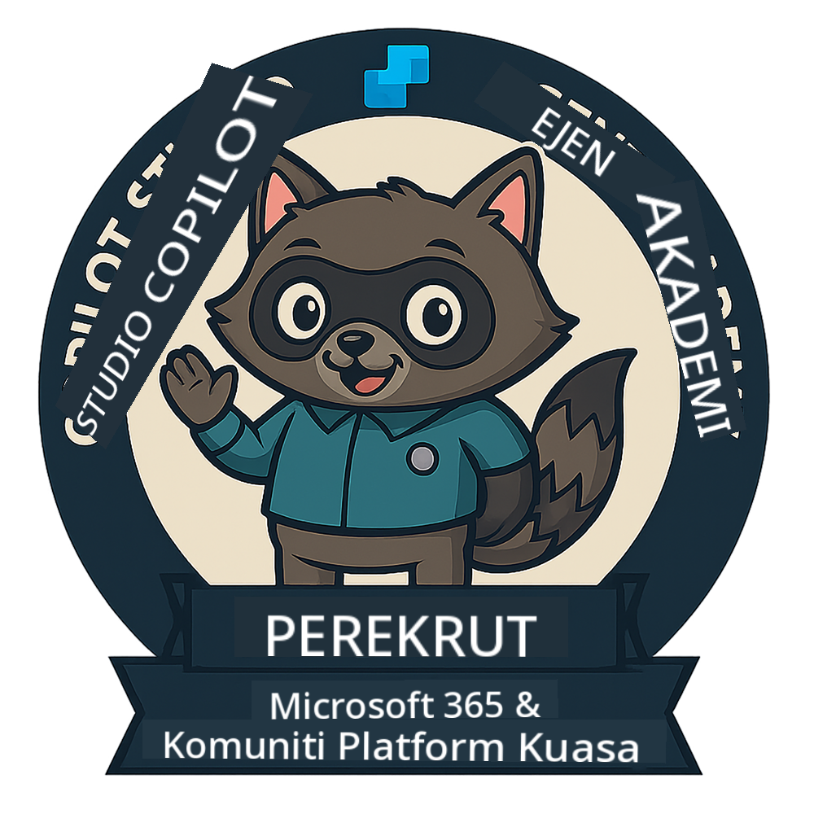

<!--
CO_OP_TRANSLATOR_METADATA:
{
  "original_hash": "15e57e059ce7689d602d7853187235cd",
  "translation_date": "2025-10-20T00:30:13+00:00",
  "source_file": "docs/index.md",
  "language_code": "ms"
}
-->
---
hide:
- navigation
---

# Akademi Ejen Copilot Studio

**Selamat datang ke Akademi Ejen Copilot Studio.**  

Misi anda—jika anda memilih untuk menerimanya—adalah untuk menguasai seni membina ejen menggunakan **Microsoft Copilot Studio**.

Latihan praktikal ini adalah pintu masuk anda ke **dunia ejen**: daripada arahan yang berasaskan fakta kepada Kad Adaptif dan aliran ejen, anda akan belajar cara membina, mengembangkan, dan melancarkan ejen pintar menggunakan alat dan kes penggunaan dunia sebenar.

---

## 🏅 Kemajuan Pangkat

**Akademi Ejen Copilot Studio** adalah program latihan pelbagai fasa yang direka untuk membina kemahiran anda merentasi tiga pangkat ejen. Setiap tahap termasuk lencana dan tanggungjawab yang semakin meningkat:

| Pangkat          | Tahap | Visual |
|------------------|:-----:|--------|
| 🟢 **Rekrut**  [🚀 Mulakan](https://aka.ms/agent-academy-recruit){ .md-button .md-button--primary }     | •     | { width="300" }     |
| 🔵 **Operatif** (Akan Datang)   | ••    | { width="300" } |
| 🟡 **Komander** (Akan Datang)    | •••   | { width="300" } |

Setiap tahap membina di atas yang sebelumnya. Selesaikan misi Rekrut anda, dan nantikan untuk meningkatkan kelayakan ejen anda.

---

## 🎒 Kursus Lain

Lihat kursus lain ini untuk terus belajar tentang AI dan Ejen:

- [Microsoft Copilot Studio <3 MCP Lab](https://aka.ms/mcsmcplab)
- [Kem Ejen Copilot](https://microsoft.github.io/copilot-camp/)
- [Ejen AI untuk Pemula](https://microsoft.github.io/ai-agents-for-beginners/)
- [Protokol Konteks Model (MCP) untuk Pemula](https://github.com/microsoft/mcp-for-beginners)

---

## 🚑 Isu

Kami sangat menghargai maklum balas anda! Sila gunakan [senarai isu](https://github.com/microsoft/agent-academy/issues) untuk berkongsi komen dan isu anda. Terima kasih!

---

## 📜 Kod Etika

Projek ini telah mengadopsi [Kod Etika Sumber Terbuka Microsoft](https://opensource.microsoft.com/codeofconduct/).

!!! info "Sumber:"

    - [Kod Etika Sumber Terbuka Microsoft](https://opensource.microsoft.com/codeofconduct/)
    - [Soalan Lazim Kod Etika Microsoft](https://opensource.microsoft.com/codeofconduct/faq/)
    - Hubungi [opencode@microsoft.com](mailto:opencode@microsoft.com) untuk pertanyaan atau kebimbangan

---

[⭐️ Bintangkan repositori kami](https://github.com/microsoft/agent-academy){ .md-button .md-button--primary }

<!-- markdownlint-disable-next-line MD033 -->

---

**Penafian**:  
Dokumen ini telah diterjemahkan menggunakan perkhidmatan terjemahan AI [Co-op Translator](https://github.com/Azure/co-op-translator). Walaupun kami berusaha untuk ketepatan, sila ambil perhatian bahawa terjemahan automatik mungkin mengandungi kesilapan atau ketidaktepatan. Dokumen asal dalam bahasa asalnya harus dianggap sebagai sumber yang berwibawa. Untuk maklumat penting, terjemahan manusia profesional adalah disyorkan. Kami tidak bertanggungjawab atas sebarang salah faham atau salah tafsir yang timbul daripada penggunaan terjemahan ini.