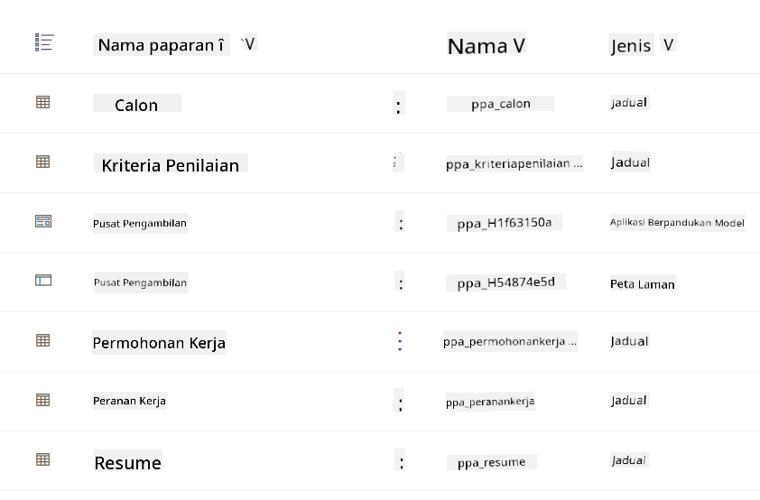
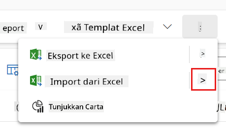
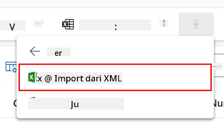
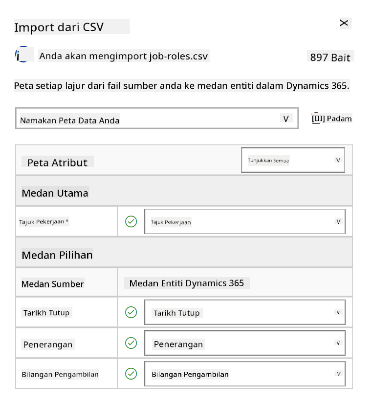
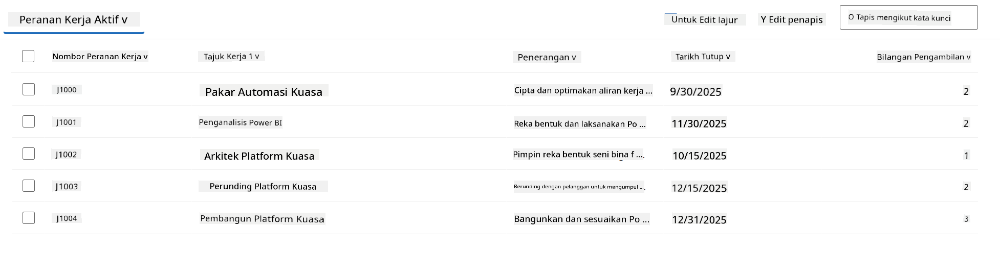
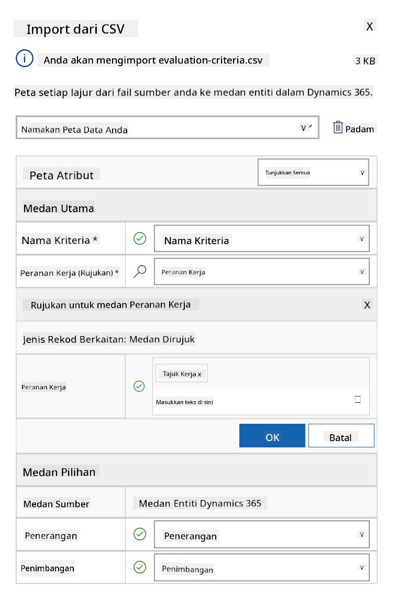
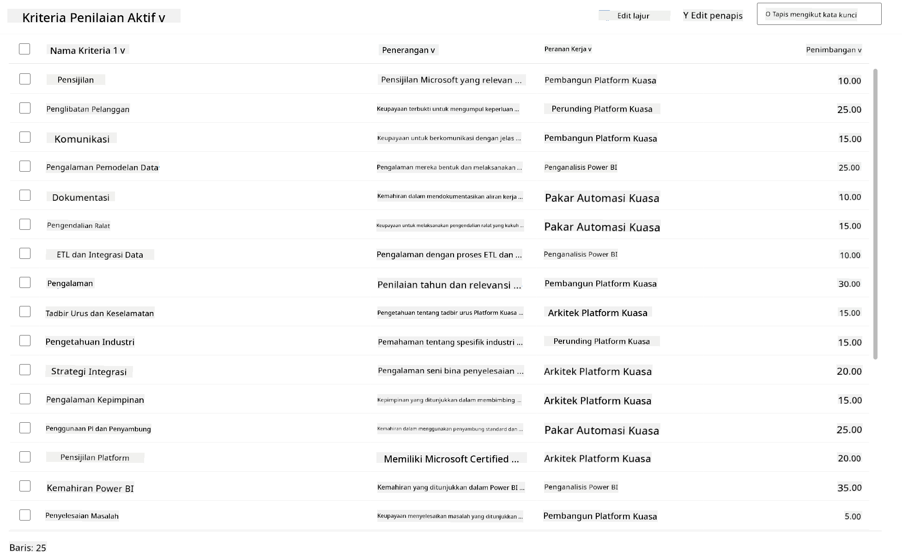

<!--
CO_OP_TRANSLATOR_METADATA:
{
  "original_hash": "2620cf9eaf09a3fc6be7fa31a3a62956",
  "translation_date": "2025-10-20T01:05:24+00:00",
  "source_file": "docs/operative-preview/01-get-started/README.md",
  "language_code": "ms"
}
-->
# 🚨 Misi 01: Memulakan dengan Ejen Pengambilan

--8<-- "disclaimer.md"

## 🕵️‍♂️ NAMA KOD: `OPERASI PENCARI BAKAT`

> **⏱️ Tempoh Operasi:** `~45 minit`

## 🎯 Ringkasan Misi

Selamat datang, Ejen. Tugas pertama anda adalah **Operasi Pencari Bakat** - membina infrastruktur asas untuk sistem pengambilan pekerja berkuasa AI yang akan mengubah cara organisasi mengenal pasti dan mengambil bakat terbaik.

Misi anda, jika anda memilih untuk menerimanya, adalah untuk melancarkan dan mengkonfigurasi sistem pengurusan pengambilan pekerja yang komprehensif menggunakan Microsoft Copilot Studio. Anda akan mengimport penyelesaian yang telah dibina terlebih dahulu yang mengandungi semua struktur data yang diperlukan, kemudian mencipta ejen AI pertama anda - **Ejen Pengambilan** - yang akan menjadi pengatur utama untuk semua operasi pengambilan pekerja masa depan.

Pelancaran awal ini akan menjadi pusat kawalan yang akan anda tingkatkan sepanjang program Operative Akademi Ejen. Anggaplah ini sebagai asas operasi anda - asas di mana anda akan membina rangkaian ejen khusus dalam misi seterusnya.

---

## 🔎 Objektif

Dengan menyelesaikan misi ini, anda akan:

- **Pemahaman Senario**: Mendapatkan pengetahuan menyeluruh tentang cabaran dan penyelesaian automasi pengambilan pekerja
- **Pelancaran Penyelesaian**: Berjaya mengimport dan mengkonfigurasi asas sistem pengurusan pengambilan pekerja
- **Penciptaan Ejen**: Membina ejen pengambilan yang menjadi permulaan senario yang akan anda bina sebagai Operative Akademi Ejen

---

## 🔍 Prasyarat

Sebelum memulakan misi ini, pastikan anda mempunyai:

- Lesen Copilot Studio
- Akses kepada persekitaran Microsoft Power Platform
- Kebenaran pentadbiran untuk mencipta penyelesaian dan ejen

---

## 🏢 Memahami Senario Automasi Pengambilan Pekerja

Senario ini menunjukkan bagaimana sebuah syarikat boleh menggunakan Microsoft Copilot Studio untuk meningkatkan dan mengautomasi proses pengambilan pekerja mereka. Ia memperkenalkan sistem ejen yang bekerjasama untuk menguruskan tugas seperti menyemak resume, mencadangkan peranan pekerjaan, menyediakan bahan temu duga, dan menilai calon.

### Nilai Perniagaan

Penyelesaian ini membantu pasukan HR menjimatkan masa dan membuat keputusan yang lebih baik dengan:

- Memproses resume secara automatik yang diterima melalui e-mel.
- Mencadangkan peranan pekerjaan yang sesuai berdasarkan profil calon.
- Mencipta permohonan kerja dan panduan temu duga yang disesuaikan untuk setiap calon.
- Memastikan amalan pengambilan pekerja yang adil dan mematuhi melalui ciri keselamatan dan moderasi terbina.
- Mengumpul maklum balas untuk meningkatkan penyelesaian.

### Cara Ia Berfungsi

- **Ejen Pengambilan** utama menyelaraskan proses dan menyimpan data dalam Microsoft Dataverse.
- **Ejen Penerimaan Permohonan** membaca resume dan mencipta permohonan kerja.
- **Ejen Persediaan Temu Duga** menghasilkan soalan temu duga dan dokumen berdasarkan latar belakang calon.
- Sistem ini boleh diterbitkan ke laman web demo, membolehkan pihak berkepentingan berinteraksi dengannya.

Senario ini sesuai untuk organisasi yang ingin memodenkan aliran kerja pengambilan pekerja mereka menggunakan automasi berkuasa AI, sambil mengekalkan ketelusan, keadilan, dan kecekapan.

---

## 🧪 Makmal: Menyediakan Ejen Pengambilan

Dalam makmal praktikal ini, anda akan membina asas untuk sistem automasi pengambilan pekerja anda. Anda akan bermula dengan mengimport penyelesaian yang telah dikonfigurasi yang mengandungi semua jadual Dataverse dan struktur data yang diperlukan untuk menguruskan calon, jawatan kerja, dan aliran kerja pengambilan pekerja. Seterusnya, anda akan mengisi jadual ini dengan data contoh yang akan menyokong pembelajaran anda sepanjang modul ini dan menyediakan senario realistik untuk ujian. Akhirnya, anda akan mencipta Ejen Pengambilan dalam Copilot Studio, menyediakan antara muka perbualan asas yang akan menjadi asas kepada semua ciri lain yang akan anda tambah dalam misi masa depan.

### 🧪 Makmal 1.1: Import penyelesaian

1. Pergi ke **[Copilot Studio](https://copilotstudio.microsoft.com)**
1. Pilih **...** di navigasi kiri dan pilih **Solutions**
1. Pilih butang **Import Solution** di bahagian atas
1. **[Muat turun](https://raw.githubusercontent.com/microsoft/agent-academy/refs/heads/main/docs/operative-preview/01-get-started/assets/Operative_1_0_0_0.zip)** penyelesaian yang telah disediakan
1. Pilih **Browse** dan pilih penyelesaian yang telah dimuat turun dari langkah sebelumnya
1. Pilih **Next**
1. Pilih **Import**

!!! success
    Jika berjaya, anda akan melihat bar pemberitahuan hijau dengan mesej berikut apabila selesai:  
    "Solution "Operative" imported successfully."

Apabila penyelesaian telah diimport, lihat apa yang telah anda import dengan memilih nama paparan penyelesaian (`Operative`).



Komponen berikut telah diimport:

| Nama Paparan | Jenis | Penerangan |
|--------------|-------|------------|
| Candidate | Table | Maklumat calon |
| Evaluation Criteria | Table | Kriteria penilaian untuk peranan |
| Hiring Hub | Model-Driven App | Aplikasi untuk menguruskan proses pengambilan pekerja |
| Hiring Hub | Site Map | Struktur navigasi untuk aplikasi Hiring Hub |
| Job Application | Table | Permohonan kerja |
| Job Role | Table | Peranan pekerjaan |
| Resume | Table | Resume calon |

Sebagai tugas terakhir untuk makmal ini, pilih butang **Publish all customizations** di bahagian atas halaman.

### 🧪 Makmal 1.2: Import data contoh

Dalam makmal ini, anda akan menambah data contoh ke beberapa jadual yang telah anda import dalam makmal 1.1.

#### Muat turun fail untuk diimport

1. **[Muat turun](https://raw.githubusercontent.com/microsoft/agent-academy/refs/heads/main/docs/operative-preview/01-get-started/assets/evaluation-criteria.csv)** fail CSV dengan kriteria penilaian
1. **[Muat turun](https://raw.githubusercontent.com/microsoft/agent-academy/refs/heads/main/docs/operative-preview/01-get-started/assets/job-roles.csv)** fail CSV dengan peranan pekerjaan

#### Import data contoh Peranan Pekerjaan

1. Kembali ke penyelesaian yang baru sahaja anda import dalam makmal terakhir
1. Pilih **Hiring Hub** Model-Driven App dengan memilih tanda semak di hadapan baris
1. Pilih butang **Play** di bahagian atas

    !!! warning
        Anda mungkin diminta untuk log masuk semula. Pastikan anda melakukannya. Selepas itu, anda sepatutnya melihat aplikasi Hiring Hub.

1. Pilih **Job Roles** di navigasi kiri
1. Pilih ikon **More** (tiga titik bertindih) di bar arahan
1. Pilih **anak panah kanan** di sebelah *Import from Excel*

    

1. Pilih **Import from CSV**

    

1. Pilih butang **Choose File**, pilih fail **job-roles.csv** yang baru sahaja dimuat turun dan kemudian pilih **Open**
1. Pilih **Next**
1. Biarkan langkah seterusnya seperti sedia ada dan pilih **Review Mapping**

    

1. Pastikan pemetaan adalah betul dan pilih **Finish Import**

    !!! info
        Ini akan memulakan import dan anda boleh menjejaki kemajuan atau menyelesaikan proses dengan segera dengan memilih **Done**

1. Pilih **Done**

Ini mungkin mengambil sedikit masa, tetapi anda boleh menekan butang **Refresh** untuk melihat jika import telah berjaya.



#### Import data contoh Kriteria Penilaian

1. Pilih **Evaluation Criteria** di navigasi kiri
1. Pilih ikon **More** (tiga titik bertindih) di bar arahan
1. Pilih **anak panah kanan** di sebelah *Import from Excel*

    

1. Pilih **Import from CSV**

    

1. Pilih butang **Choose File**, pilih fail **evaluation-criteria.csv** yang baru sahaja dimuat turun dan kemudian pilih **Open**
1. Pilih **Next**
1. Biarkan langkah seterusnya seperti sedia ada dan pilih **Review Mapping**

    

1. Sekarang kita perlu melakukan sedikit kerja tambahan untuk pemetaan. Pilih ikon kaca pembesar (🔎) di sebelah medan Job Role
1. Pastikan **Job Title** dipilih di sini, dan jika tidak - tambahkan
1. Pilih **OK**
1. Pastikan pemetaan yang lain juga betul dan pilih **Finish Import**

    !!! info
        Ini akan memulakan import sekali lagi dan anda boleh menjejaki kemajuan atau menyelesaikan proses dengan segera dengan memilih **Done**

1. Pilih **Done**

Ini mungkin mengambil sedikit masa, tetapi anda boleh menekan butang **Refresh** untuk melihat jika import telah berjaya.



### 🧪 Makmal 1.3: Cipta ejen pengambilan

Sekarang anda telah selesai menyediakan prasyarat, tiba masanya untuk kerja sebenar! Mari tambahkan Ejen Pengambilan kita terlebih dahulu!

1. Pergi ke **[Copilot Studio](https://copilotstudio.microsoft.com)** dan pastikan anda berada dalam persekitaran yang sama di mana anda mengimport penyelesaian dan data
1. Pilih **Agents** di navigasi kiri
1. Pilih **New Agent**
1. Pilih **Configure**
1. Untuk **Name**, masukkan:

    ```text
    Hiring Agent
    ```

1. Untuk **Description**, masukkan:

    ```text
    Central orchestrator for all hiring activities
    ```

1. Pilih **...** di sebelah butang *Create* di sudut kanan atas
1. Pilih **Update advanced settings**
1. Sebagai **Solution**, pilih `Operative`
1. Pilih **Update**
1. Pilih **Create** di sudut kanan atas

Ini akan mencipta Ejen Pengambilan untuk anda, yang akan anda gunakan sepanjang kursus Operative ini.

---

## 🎉 Misi Selesai

Misi 01 telah selesai! Anda kini telah menguasai kemahiran berikut:

✅ **Pemahaman Senario**: Pengetahuan menyeluruh tentang cabaran dan penyelesaian automasi pengambilan pekerja  
✅ **Pelancaran Penyelesaian**: Berjaya mengimport dan mengkonfigurasi asas sistem pengurusan pengambilan pekerja  
✅ **Penciptaan Ejen**: Membina ejen pengambilan yang menjadi permulaan senario yang akan anda bina sebagai Operative Akademi Ejen  

Seterusnya adalah [Misi 02](../02-multi-agent/README.md): Menjadikan ejen anda bersedia untuk multi-ejen dengan ejen yang bersambung.

---

## 📚 Sumber Taktikal

📖 [Microsoft Copilot Studio - Cipta ejen](https://learn.microsoft.com/microsoft-copilot-studio/authoring-first-bot)  
📖 [Dokumentasi Microsoft Dataverse](https://learn.microsoft.com/power-apps/maker/data-platform)

---

**Penafian**:  
Dokumen ini telah diterjemahkan menggunakan perkhidmatan terjemahan AI [Co-op Translator](https://github.com/Azure/co-op-translator). Walaupun kami berusaha untuk ketepatan, sila ambil perhatian bahawa terjemahan automatik mungkin mengandungi kesilapan atau ketidaktepatan. Dokumen asal dalam bahasa asalnya harus dianggap sebagai sumber yang berwibawa. Untuk maklumat kritikal, terjemahan manusia profesional adalah disyorkan. Kami tidak bertanggungjawab atas sebarang salah faham atau salah tafsir yang timbul daripada penggunaan terjemahan ini.