<!--
CO_OP_TRANSLATOR_METADATA:
{
  "original_hash": "75efaf515d5694d4fd549bfd6518901a",
  "translation_date": "2025-10-20T01:15:08+00:00",
  "source_file": "docs/operative-preview/03-automate-triggers/README.md",
  "language_code": "ms"
}
-->
# Misi 03: Tambah Pencetus Acara untuk bertindak secara autonomi

--8<-- "disclaimer.md"

## 🕵️‍♂️ NAMA KOD: `OPERASI SIGNAL POINT`

> **⏱️ Tempoh Operasi:** `~45 minit`

## 🎯 Ringkasan Misi

Selamat kembali, Ejen. Dalam [Misi 02](../02-multi-agent/README.md) - anda telah belajar cara membina ejen anak untuk Pengambilan Permohonan dan ejen bersambung Persediaan Temuduga untuk memperluaskan keupayaan Ejen Pengambilan utama anda.

Tugasan anda, jika anda memilih untuk menerimanya, adalah **Operasi Signal Point** - mendalami **pencetus acara** - meningkatkan sistem ejen anda daripada reaktif kepada **operasi autonomi**. Anda akan mengubah ejen anda daripada menunggu input manusia kepada bertindak balas secara proaktif terhadap acara luaran dan mengambil tindakan pintar tanpa pengawasan.

Anggaplah ia sebagai peningkatan daripada ejen yang _menjawab soalan_ kepada ejen yang _menjangka keperluan_ dan _bertindak secara bebas_. Melalui pencetus acara dan aliran kerja automatik, Ejen Pengambilan anda akan mengesan e-mel resume yang masuk, memproses lampiran secara automatik, menyimpan data dalam Dataverse, dan memberitahu pasukan pengambilan HR anda melalui Microsoft Teams - semuanya sementara anda fokus pada tugas bernilai tinggi.

Selamat datang ke dunia di mana automasi bertemu kecerdasan.

## 🔎 Objektif

Dalam misi ini, anda akan belajar:

1. Bagaimana pencetus acara membolehkan tingkah laku ejen autonomi tanpa interaksi pengguna
1. Perbezaan antara ejen interaktif dan autonomi dalam Copilot Studio
1. Cara mencipta pencetus acara yang secara automatik memproses lampiran e-mel dan memuat naik fail ke Dataverse
1. Cara membina aliran ejen yang menghantar kad adaptif ke saluran Teams untuk pemberitahuan
1. Cara menghantar data antara pencetus acara dan aliran ejen untuk automasi hujung ke hujung

## 🤔 Apa itu Pencetus Acara?

Sebelumnya dalam [Recruit](../../recruit/10-add-event-triggers/README.md), kita telah belajar tentang pencetus acara. Mari kita buat ulang kaji ringkas tentang ini sekiranya anda terlepas.

**Pencetus acara** membolehkan ejen _bertindak_ sendiri apabila sesuatu berlaku dalam sistem lain - tanpa memerlukan mesej pengguna. Apabila acara yang dikonfigurasi berlaku - seperti "item SharePoint baru," "e-mel baru," "tugas Planner diberikan," atau bahkan pengulangan berdasarkan masa, penyambung menghantar muatan pencetus kepada ejen anda. Ejen kemudian mengikuti arahan anda untuk memutuskan tindakan atau topik mana yang perlu dipanggil.

### Ciri-ciri utama

- **Aktivasi autonomi:**
      - Tidak seperti pencetus topik yang bermula apabila pengguna menaip kepada ejen, pencetus acara berlaku daripada acara luaran, membolehkan tingkah laku proaktif.

- **Dikuasakan oleh muatan:**
      - Setiap acara menghantar muatan (pembolehubah + arahan pilihan) melalui penyambung. Ejen menggunakan arahan yang anda tentukan dan muatan untuk memilih tindakan seterusnya.
      - Contohnya _memanggil topik_ atau _melaksanakan tindakan yang ditentukan oleh Alat_.

- **Contoh sedia ada:**
      - Fail atau item SharePoint/OneDrive dicipta
      - Tugas Planner selesai/diberikan
      - Respons Microsoft Forms dihantar
      - Pengulangan/jadual

    Ketersediaan bergantung pada dasar data organisasi anda yang dikonfigurasi dalam Power Automate.

- **Memerlukan orkestrasi generatif:**
      - Pencetus acara hanya tersedia apabila orkestrasi generatif diaktifkan untuk ejen.

- **Penagihan/penggunaan:**
      - Setiap penghantaran pencetus dikira sebagai mesej terhadap kapasiti Copilot Studio.
      - Contohnya, pengulangan 10 minit menghantar mesej setiap 10 minit.

- **Model pengesahan dan persediaan:**
      - Anda menambah pencetus dalam Gambaran Keseluruhan ejen, di bawah _Triggers_. Pengesahan untuk penyambung pencetus menggunakan akaun pembuat ejen (“pengesahan pembuat ejen”).
      - Anda boleh mengedit parameter pencetus dan muatan dalam portal pembuat Power Automate.

- **Ujian & pemerhatian:**
      - Anda boleh menguji pencetus dari panel ujian ejen dan memeriksa tingkah laku dengan peta aktiviti sebelum menerbitkan.

!!! info "Ringkasan untuk pembangun"

    Anggap pencetus acara sebagai **isyarat seperti webhook** yang menghantar muatan berstruktur ke dalam ejen anda, membolehkan ia _memulakan_ kerja dan menghubungkan tindakan di seluruh sistem - tanpa menunggu pengguna untuk bertanya.

### Pencetus topik - bagaimana ia berbeza

Sebelumnya anda telah belajar tentang pencetus topik dalam [Recruit](../../recruit/07-add-new-topic-with-trigger/README.md), namun anda mungkin masih tertanya-tanya bagaimana pencetus _Topik_ berbeza daripada pencetus _Acara_, dan mengapa perbezaan itu penting untuk memahami apa yang menjadikan ejen itu autonomi.

Pencetus topik mengawal _bila topik dijalankan_, biasanya sebagai tindak balas kepada mesej pengguna.

- Dalam orkestrasi generatif, pencetus lalai adalah **Oleh ejen** - perancang memilih topik yang nama/penerangannya paling sesuai dengan mesej pengguna.
- Dalam orkestrasi klasik, pencetus lalai adalah **Frasa** - perancang memilih topik apabila satu atau beberapa frasa pencetus paling sesuai dengan mesej pengguna.

Jenis pencetus lain termasuk `Mesej diterima`, `Acara diterima`, `Aktiviti diterima`, `Kemas kini perbualan`, `Invoke diterima`, `Pengalihan`, `Tidak aktif`, dan `Pelan selesai`.

!!! info "Perbezaan utama"

    Pencetus topik adalah pemula _aktiviti perbualan_ di dalam chat.
    
    Pencetus acara adalah pemula _acara sistem_ yang dihantar melalui penyambung yang boleh menjalankan ejen tanpa sebarang perbualan sama sekali.

### Panduan ringkas Pencetus topik vs Pencetus acara

- **Pencetus topik:** Pengguna (atau aktiviti chat) berkata/melakukan X ➡️ jalankan Topik T.
- **Pencetus acara:** SharePoint/Planner/E-mel/Timer berlaku dengan muatan P ➡️ ejen menilai arahan ➡️ panggil Tindakan/Topik yang sesuai.

## 🏓 Perbandingan ejen interaktif vs ejen autonomi

Sekarang anda tahu perbezaan antara pencetus acara dan pencetus topik, mari kita pelajari perbezaan antara ejen interaktif vs ejen autonomi.

Dalam istilah Copilot Studio, "interaktif" merujuk kepada ejen yang terutamanya berinteraksi melalui **topik** dalam chat atau saluran. "Autonomi" merujuk kepada ejen yang juga menggunakan **pencetus acara** untuk berjalan tanpa input pengguna.

Jadual berikut merangkum perbezaan dan persamaan mereka.

| Dimensi                              | Ejen interaktif       | Ejen autonomi                                                                                                 |
|-------------------------------------|-----------------------|---------------------------------------------------------------------------------------------------------------|
| Bagaimana ia bermula                | Pengguna (atau aktiviti chat) mencetuskan topik. Contoh: Oleh ejen, Frasa, Mesej diterima. | Pencetus acara luaran menghantar muatan melalui penyambung kepada ejen. Contoh: SharePoint, Planner, e-mel, jadual, dll. |
| Penggunaan utama                    | Soal jawab, aliran kerja berpandu, tindakan berdasarkan permintaan dalam chat - Teams, web, dll. | Operasi proaktif dan automasi latar belakang - bertindak balas terhadap perubahan sistem dan kemudian memberitahu, menyimpan, atau mengatur tugas. |
| Permukaan pencetus                  | Pencetus topik: Oleh ejen / Frasa / Mesej diterima / Jenis aktiviti / Invoke / Tidak aktif / Pelan selesai | Perpustakaan pencetus acara melalui penyambung; muatan termasuk data acara + arahan pilihan. |
| Perancang (orkestrasi generatif)    | Sangat digunakan untuk pencetus Oleh ejen dan Pelan selesai untuk memilih/menyusun topik. | Diperlukan untuk pencetus acara; ejen menggunakan arahan + muatan untuk memutuskan tindakan/topik mana yang akan dipanggil. |
| Contoh biasa                        | Pengguna bertanya "Apakah polisi bayaran balik kami?" → Topik dijalankan, pertanyaan pengetahuan, respons. | Tugas Planner baru diberikan → Pencetus acara berlaku → Ejen menghantar mesej Teams, mengemas kini rekod, atau memanggil topik. |
| Laluan persediaan                   | Cipta topik, tentukan jenis pencetus, tulis dialog/tindakan; terbitkan ke saluran. | Tambah pencetus acara (Gambaran Keseluruhan → Triggers), sahkan penyambung dengan kelayakan pembuat ejen, konfigurasikan muatan/arahan; uji melalui panel ujian; terbitkan. |
| Pengesahan dan tadbir urus          | Berjalan di bawah konteks saluran/pengesahan; pencetus topik bertindak balas terhadap aktiviti chat dalam saluran yang dibenarkan. | Ketersediaan pencetus bergantung pada dasar data Power Automate; penyambung berjalan di bawah akaun pembuat ejen. |
| Pemerhatian                         | Uji topik dalam Copilot Studio, periksa transkrip perbualan/aktiviti. | Gunakan Uji pencetus dan peta aktiviti untuk mengesahkan pelaksanaan sebelum menerbitkan, pantau aktiviti selepas menerbitkan. |
| Kesan kapasiti                      | Setiap mesej pengguna/respons ejen adalah mesej yang menggunakan kapasiti. | Setiap penghantaran acara juga adalah mesej, ditambah sebarang tindakan berikutnya. Contoh: pengulangan 10 minit = 6 mesej/jam |

### Bila untuk menggunakan yang mana?

- Pilih **pencetus topik (interaktif)** apabila pengguna memulakan perbualan ejen - FAQ, pengambilan berpandu, atau tugas gaya perintah dalam chat. Pencetus Oleh ejen perancang mengurangkan kurasi frasa secara manual.
- Tambah **pencetus acara (autonomi)** apabila ejen harus memulakan perbualan atau mengambil tindakan sendiri - pada kemas kini dalam SharePoint/Dataverse, e-mel masuk, atau pada jadual. Ini mengubah anda daripada operasi reaktif kepada proaktif.

## Petua & perkara penting untuk pembangun

1. **Aktifkan orkestrasi generatif** untuk mana-mana ejen yang anda ingin jadikan autonomi. Pencetus acara tidak akan muncul jika tidak.

1. **Modelkan muatan lebih awal.** Tentukan medan minimum yang diperlukan oleh ejen anda daripada pencetus seperti `itemId`, `assignedTo`, `dueDate` dan tambah arahan ringkas yang memberitahu ejen tindakan/topik mana yang perlu dipanggil berdasarkan nilai muatan.

1. **Skop pengesahan penting.** Pencetus disahkan menggunakan akaun pembuat ejen. Pastikan akaun tersebut mempunyai kebenaran penyambung yang betul dan mematuhi dasar data Power Automate.

1. **Kawal kos dan gangguan.** Pengulangan frekuensi tinggi atau sumber yang terlalu banyak berbual boleh meningkatkan penggunaan mesej dengan cepat - kawal di mana mungkin atau tambah syarat dalam pencetus untuk menapis acara.

1. **Uji sebelum menerbitkan.** Gunakan **Uji pencetus** dan peta aktiviti untuk memantau pelan dan tindakan yang dipanggil - ulangi arahan/muatan sehingga tingkah laku stabil.

## 🧪 Makmal 03 - Mengautomasi e-mel permohonan calon

Seterusnya kita akan menambah pencetus acara kepada **Ejen Pengambilan** dan membina aliran ejen dalam ejen anak **Ejen Pengambilan Permohonan** untuk mengendalikan pemprosesan lanjut secara autonomi.

### ✨ Senario penggunaan

!!! info ""

    **Sebagai seorang** Perekrut HR

    **Saya mahu** diberitahu apabila e-mel dengan resume tiba di Inbox saya yang telah dimuat naik secara automatik ke Dataverse

    **Supaya saya boleh** sentiasa diberitahu tentang resume yang dihantar melalui e-mel untuk permohonan yang dimuat naik secara automatik ke Dataverse

Kita akan mencapai ini menggunakan dua teknik

1. Pencetus acara untuk apabila e-mel tiba,
    1. Periksa `contentType` fail sama dengan `PDF` sebagai jenis format.
    1. Ekstrak fail dan muat naik ke Dataverse menggunakan tindakan melalui penyambung Dataverse.
    1. Kemudian hantar arahan kepada ejen untuk pemprosesan lanjut dengan menghantar parameter input daripada tindakan Dataverse.

1. Aliran ejen akan ditambah kepada ejen anak **Ejen Pengambilan Permohonan** yang dipanggil oleh arahan dalam pencetus acara.
    1. Gunakan parameter input yang dihantar daripada arahan pencetus acara dalam kad adaptif yang diposkan ke saluran dalam Microsoft Teams untuk memberitahu pasukan Pengambilan HR. Kad adaptif akan mempunyai pautan ke baris dalam Dataverse yang akan dilihat dalam **Ejen Pengambilan**.

Mari kita mulakan!

### ✨ Prasyarat untuk menyelesaikan misi ini

Anda perlu **sama ada**:

- **Telah menyelesaikan Misi 01 dan Misi 02** dan mempunyai Ejen Pengambilan anda sedia, **ATAU**
- **Import penyelesaian permulaan Misi 03** jika anda baru bermula atau perlu mengejar. [Muat turun Penyelesaian Permulaan Misi 03](https://aka.ms/agent-academy)

!!! note "Import Penyelesaian dan Data Contoh"
    Jika anda menggunakan penyelesaian permulaan, rujuk [Misi 01](../01-get-started/README.md) untuk arahan terperinci tentang cara mengimport penyelesaian dan data contoh ke dalam persekitaran anda.

Anda juga memerlukan akses kepada **Microsoft Teams** untuk menyelesaikan latihan makmal kedua memposkan kad adaptif ke Microsoft Teams.

### Makmal 3.1 - Automasi memuat naik resume ke Dataverse yang diterima melalui e-mel

1. Dalam Ejen Pengambilan, tatal ke bawah dalam **tab Gambaran Keseluruhan** dan pilih **+ Tambah pencetus**.

       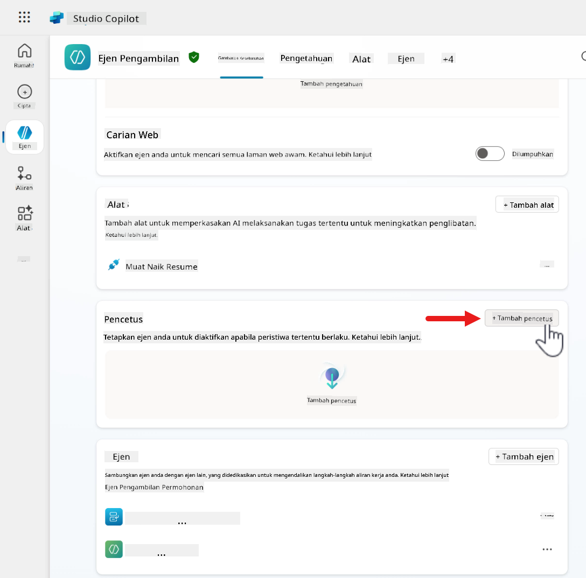

1. Senarai pencetus akan muncul. Pilih **Apabila e-mel baru tiba (V3)** dan pilih **Seterusnya**.

       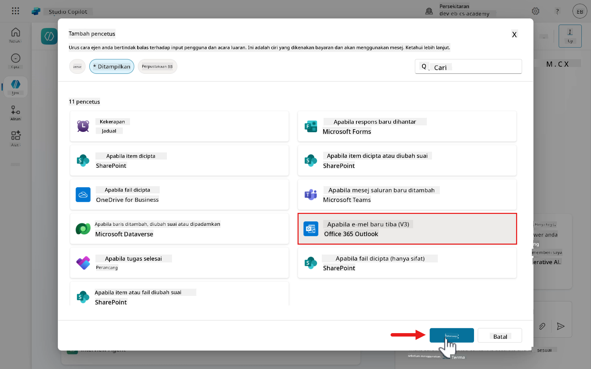

1. Kita kini akan melihat **Nama Pencetus** dan rujukan sambungan **Log masuk** untuk aplikasi yang disenaraikan.

       Namakan semula nama pencetus kepada yang berikut,
    
       ```text
       Apabila e-mel baru tiba daripada pemohon
       ```

       Pastikan anda melihat tanda hijau di setiap rujukan sambungan aplikasi yang disenaraikan. Jika anda tidak melihat tanda hijau, log masuk melalui elipsis (...) dan pilih **+ Rujukan sambungan baru** untuk mencipta rujukan sambungan baru.

       

1. Langkah terakhir adalah menetapkan sifat input pencetus. Kemas kini sifat berikut kepada yang berikut,

     | Sifat | Cara Menetapkan | Butiran |
     |-------|-----------------|---------|
     | **Sertakan Lampiran (Pilihan)** | Dropdown | Ya |
     | **Penapis Subjek (Pilihan)** | Taip/Masukkan dengan papan kekunci | Permohonan |
     | **Hanya dengan Lampiran (Pilihan)** | Dropdown | Ya |

       Pilih **Cipta pencetus**.

       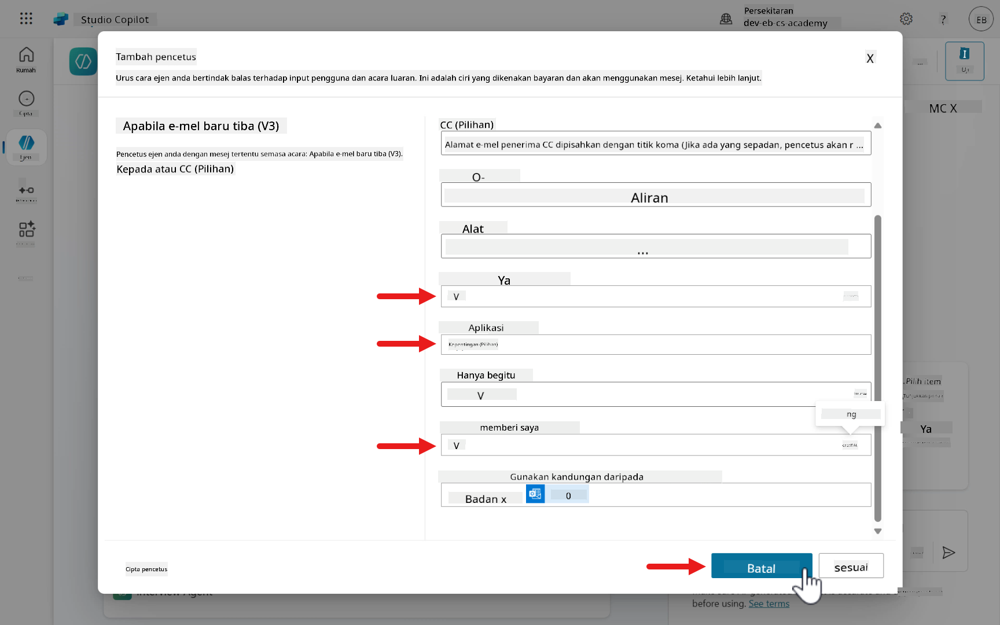

1. Setelah dicipta, mesej pengesahan akan muncul bahawa pencetus telah ditambah kepada ejen. Pilih **Tutup** dan pencetus akan disenaraikan dalam bahagian **Triggers**.
Sekarang kita akan mengemas kini pencetus acara untuk menambah lebih banyak keupayaan automasi. Pilih **ellipsis (...)** pada pencetus dan pilih **Edit in Power Automate**.

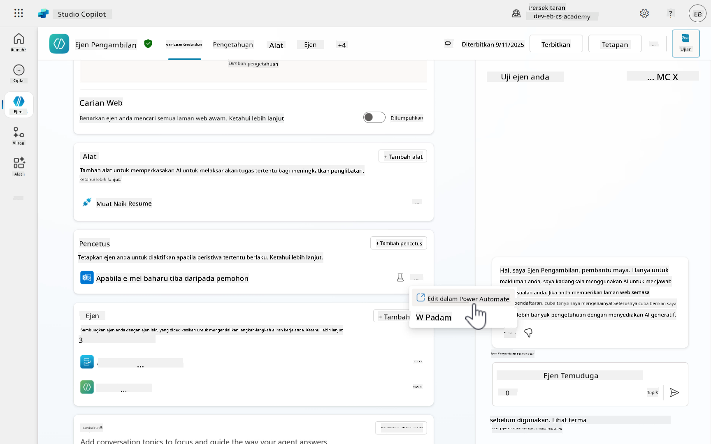

1. Pencetus akan dimuatkan sebagai aliran dalam portal pembuat Power Automate. Apa yang anda lihat adalah reka bentuk aliran dalam portal pembuat Power Automate. Di sinilah kita boleh menambah logik dan tindakan tambahan untuk lebih banyak automasi. Pencetus akan muncul di bahagian atas, diikuti dengan **Menghantar arahan kepada copilot yang ditentukan untuk diproses** sebagai tindakan terakhir dalam aliran.

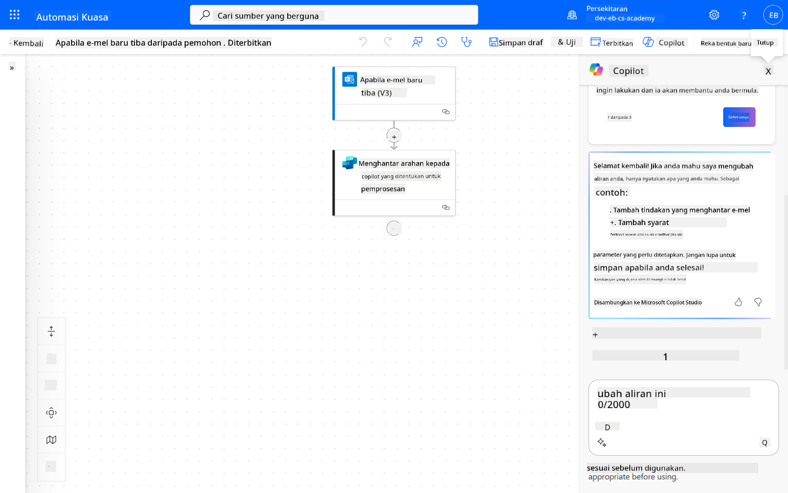

1. Secara lalai, pencetus **Apabila e-mel baru tiba** dalam Power Automate mungkin memproses beberapa e-mel secara bersama jika beberapa e-mel tiba serentak, menjalankan aliran hanya sekali untuk kumpulan tersebut.

   Untuk memastikan aliran berjalan secara berasingan untuk setiap e-mel, aktifkan tetapan **Split On** dalam tetapan pencetus dan pilih `@triggerOutputs()?['body/value']` dalam medan dropdown array.

   Dengan **Split On** diaktifkan dan medan array ditetapkan kepada `@triggerOutputs()?['body/value']`, aliran akan berjalan secara individu untuk setiap mesej, walaupun banyak tiba serentak.

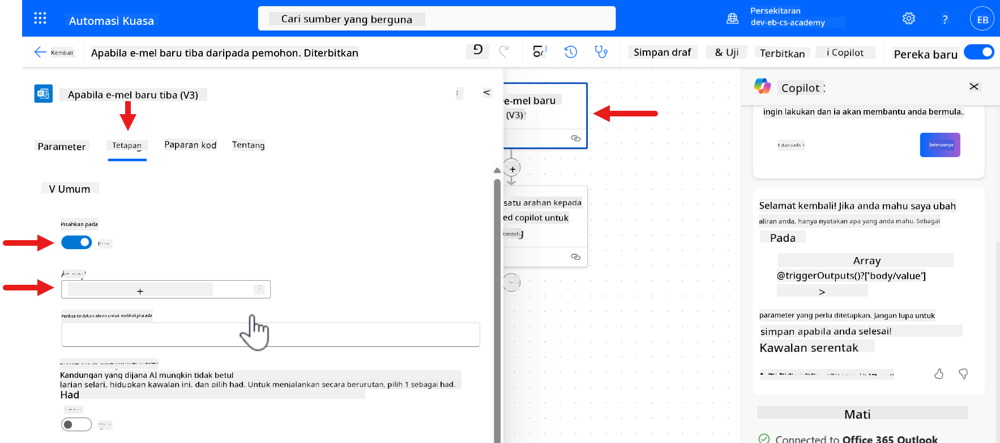

1. Seterusnya, mari kita tambahkan logik untuk memeriksa jenis fail lampiran, kita hanya mahu memuat naik lampiran fail .PDF dan bukan imej (ini mungkin datang dari tandatangan e-mel). Pilih ikon **+** di bawah pencetus dan pilih **Control** di bawah bahagian **Built in tools**.

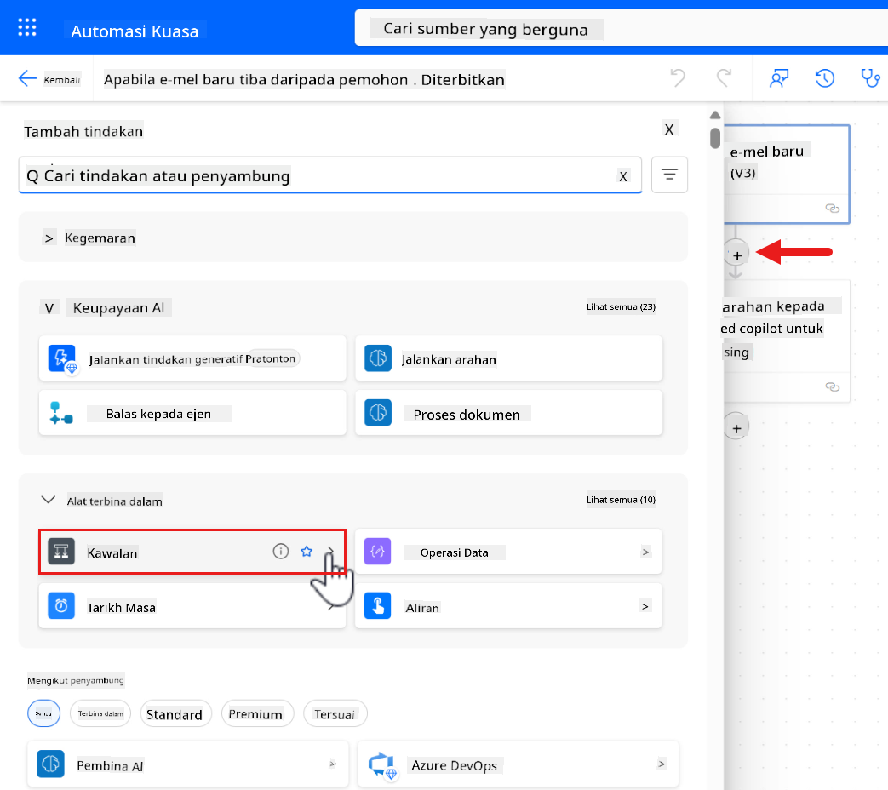

1. Pilih tindakan **Condition**.

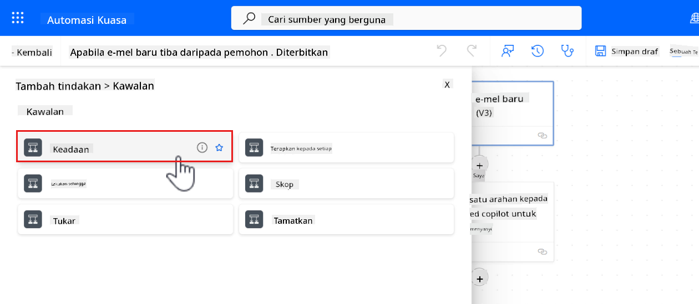

1. Sekarang kita konfigurasikan syarat untuk memeriksa jika jenis fail lampiran adalah .PDF. Dalam medan **Choose a value**, pilih **ikon kilat** atau **ikon fx** di sebelah kanan.

   1. Dalam medan **Search**, taipkan perkara berikut,

      ```text
      content type
      ```

   1. Kemudian pilih parameter **Attachments Content-Type** dari pencetus.

   1. Seterusnya, pilih **Add** untuk menambah input kandungan dinamik ke dalam parameter **Id** tindakan.

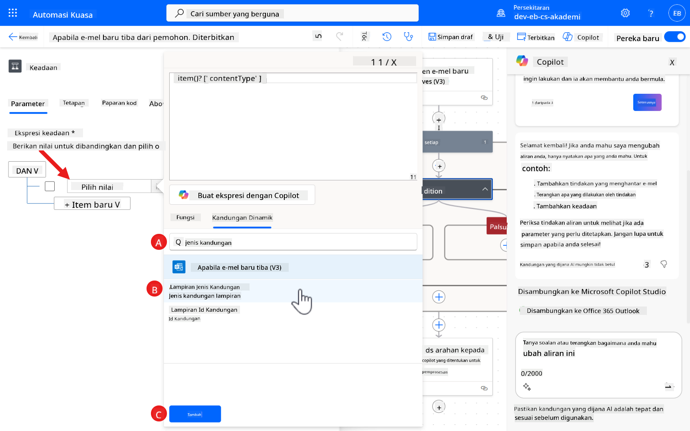

1. Mari kita berhenti sejenak, anda mungkin perasan bahawa tindakan **For each** muncul secara automatik.

   Pilih tindakan **For each**. Tindakan ini mewakili pengulangan melalui setiap lampiran dalam e-mel, kerana parameter **Attachments Content-Type** dari pencetus berkaitan dengan setiap lampiran.

   Di bawah permukaan, ia adalah array dan itulah sebabnya tindakan **For each** ditambahkan secara automatik apabila kita memilih parameter **Attachments Content-Type** dalam tindakan **Condition**.

   Untuk mengetahui lebih lanjut tentang ini, kembangkan blok pembelajaran tambahan berikut.

??? info "Pembelajaran Tambahan: Tindakan For each muncul secara automatik"

🤔 **Mengapa "Apply to each" atau "For each" Muncul Secara Automatik?**

Apabila anda memilih parameter (kandungan dinamik) yang mewakili senarai atau array item - contohnya, senarai lampiran, e-mel, atau baris - Power Automate mengenali bahawa anda mungkin ingin memproses setiap item secara individu.

Untuk membantu anda melakukan ini, Power Automate secara automatik menambahkan **“Apply to each”** (atau **For each**) loop di sekitar tindakan anda. Ini memastikan bahawa tindakan anda akan berjalan sekali untuk setiap item dalam senarai, bukannya cuba memproses keseluruhan senarai sekaligus (yang boleh menyebabkan kesilapan).

🦋 **Contoh**

- Jika anda memilih "Attachments" dari tindakan sebelumnya (yang merupakan array), dan cuba menggunakannya dalam tindakan yang mengharapkan satu fail, Power Automate membungkus tindakan anda dalam **"Apply to each"** (atau **For each**) loop.
- Dengan cara ini, tindakan anda akan berjalan untuk **setiap lampiran** - satu demi satu.

💡 **Poin Penting**

- **Automatik:** Loop muncul secara automatik untuk membantu anda memproses setiap item dalam koleksi.
- **Mencegah kesilapan:** Tanpa loop, tindakan anda mungkin gagal kerana tidak dapat menangani banyak item sekaligus.
- **Petunjuk visual:** Ia adalah cara visual untuk menunjukkan bahawa aliran anda akan mengulangi tindakan untuk setiap item dalam senarai.


1. Seterusnya, dalam medan **Choose a value** yang lain, taipkan perkara berikut,

```text
application/pdf
```

Ini akan memastikan bahawa untuk setiap lampiran fail, ia akan memeriksa format sambungan fail adalah .PDF.

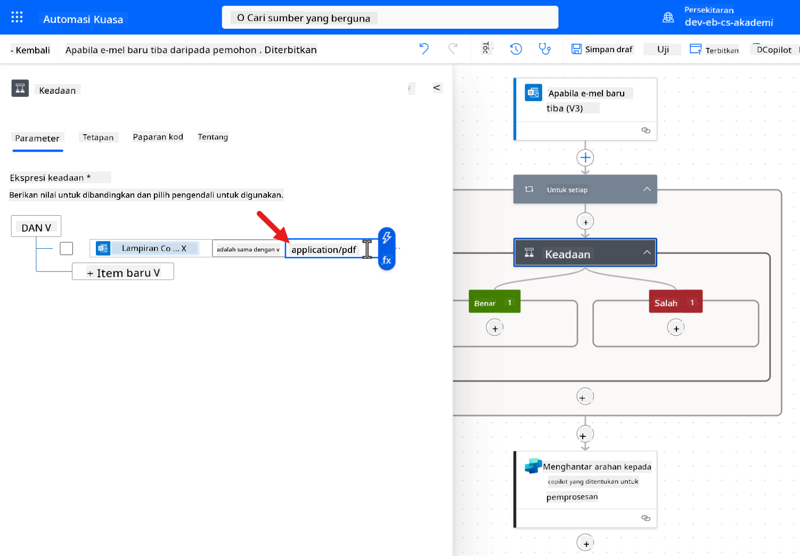

1. Sekarang kita akan konfigurasikan laluan **True** untuk mengekstrak fail dari e-mel dan memuat naiknya ke dalam jadual **Resume** Dataverse.

   Tambahkan tindakan baru di bawah laluan **True** dan cari `html to text`. Pilih tindakan **Html to text**.

   Untuk mengetahui lebih lanjut tentang tindakan **Html to text**, kembangkan blok pembelajaran tambahan berikut.

??? info "Pembelajaran Tambahan: Tindakan Html to text"

🤔 **Apa itu Tindakan "HTML to text"?**

Tindakan **HTML to text** dalam Power Automate digunakan untuk menukar kandungan yang diformatkan HTML kepada teks biasa. Ini sangat berguna apabila anda menerima data (seperti e-mel, kandungan web, atau respons API) yang mengandungi tag HTML, dan anda ingin mengekstrak hanya teks yang boleh dibaca tanpa sebarang format atau kod.

⚙️ **Bagaimana ia berfungsi?**

- **Input:** Anda memberikan string kandungan HTML (contohnya, badan e-mel).
- **Output:** Tindakan ini menghapus semua tag HTML dan hanya mengembalikan teks biasa.

👍🏻 **Bila anda harus menggunakannya?**

- Apabila anda ingin mengekstrak teks yang boleh dibaca dari e-mel, laman web, atau respons API yang mengandungi HTML.
- Sebelum menghantar kandungan ke sistem yang tidak menyokong format HTML (seperti SMS, mesej Teams, atau pangkalan data).
- Untuk membersihkan data bagi pemprosesan atau analisis lanjut.

🔭 **Di mana untuk mencarinya?**

- Dalam Power Automate untuk Agent Flows, cari tindakan yang dipanggil `HTML to text`. Ia berada di bawah penyambung **Data Operations**.

💡 **Poin Penting**

- Ia menghapus semua tag HTML dan hanya meninggalkan teks.
- Ia tidak mentafsir atau melaksanakan skrip/gaya - hanya menghapus tag.
- Berguna untuk pembersihan data dan menyediakan kandungan untuk output teks biasa.

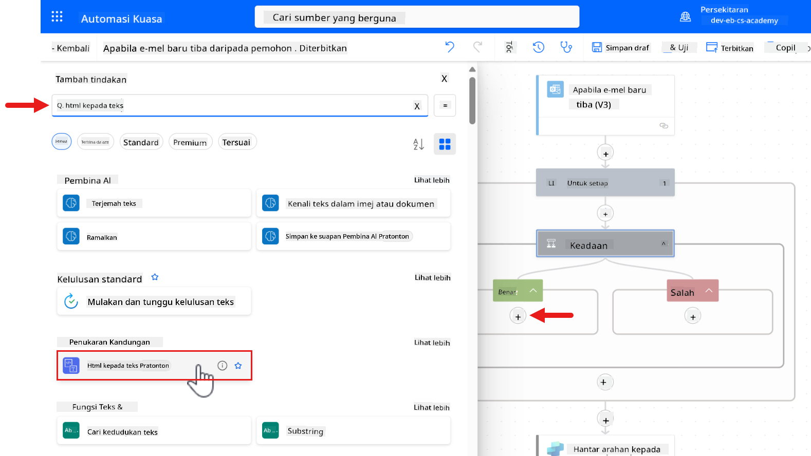

1. Seterusnya, kita perlu membuat rujukan sambungan baru untuk tindakan **Html to text** dengan memilih **Add new**.

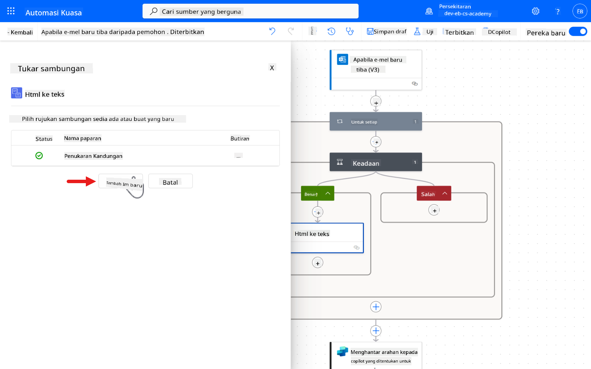

1. Tindakan kini boleh dikonfigurasikan. Mari kita tambahkan parameter **Body** dari pencetus. Dalam medan **Content**, pilih **ikon kilat** atau **ikon fx** di sebelah kanan.

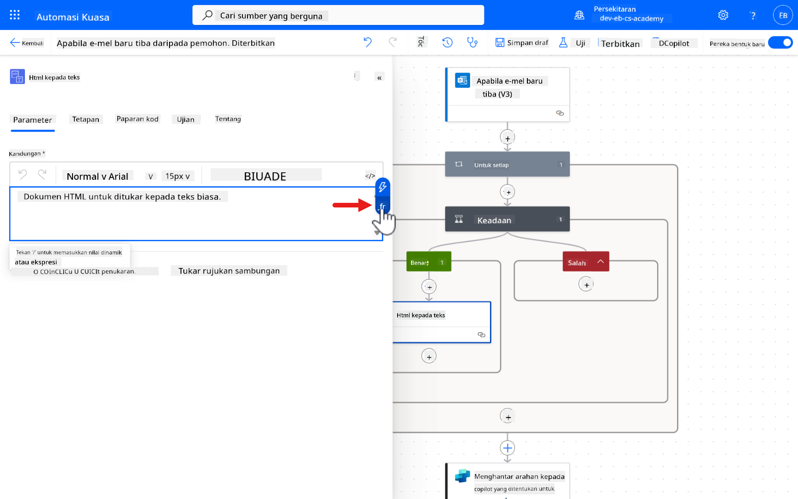

1. Dalam tab **Dynamic content**, cari `body` dan pilih parameter **Body**, diikuti dengan memilih **Add**.

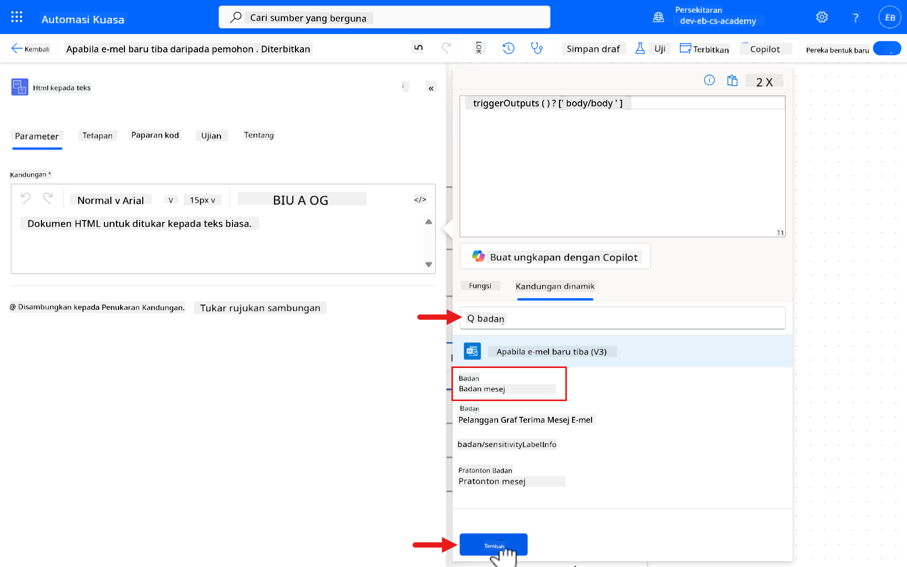

1. Kami telah selesai mengkonfigurasi tindakan ini jadi mari keluar dari tindakan dengan memilih dua tanda sudut («) yang menunjuk ke kiri untuk menutup panel.

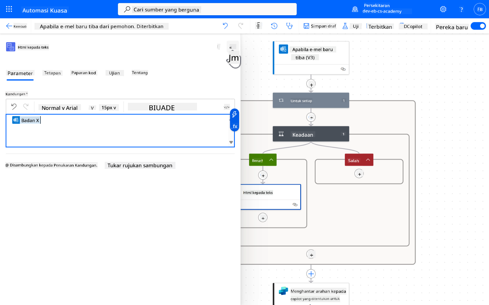

1. Kami akan menambah tindakan baru dengan memilih **ikon +** di bawah tindakan **Html to text** yang akan memuatkan panel untuk menambah tindakan. Pilih penyambung **Microsoft Dataverse**.

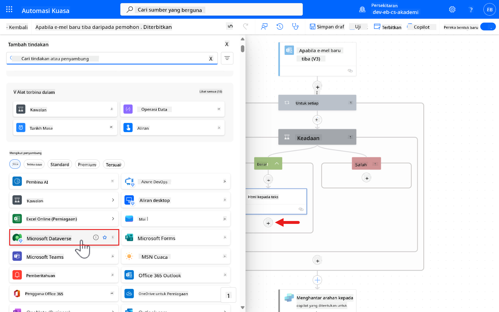

1. Pilih tindakan **Add a new row**.

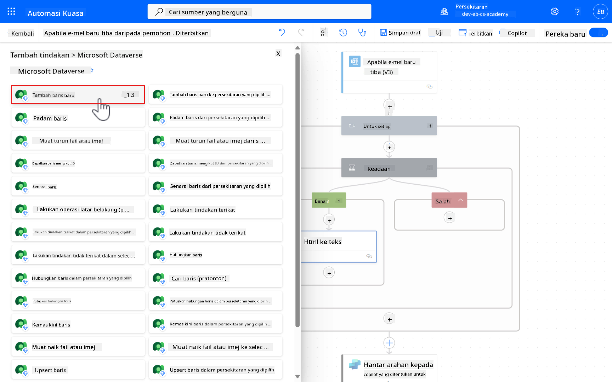

1. Namakan semula tindakan dengan memilih **Ellipsis (...)**, salin dan tampal perkara berikut sebagai nama,

```text
Add a new Resume row
```

Untuk parameter **Table name**, cari `res` dan pilih jadual **Resumes**.

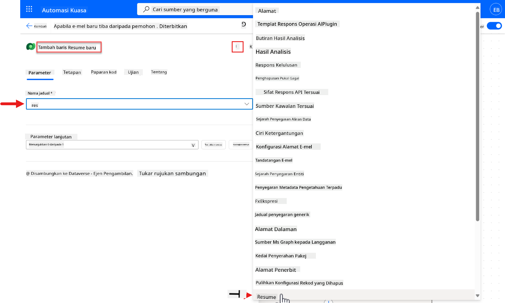

1. Pilih medan **Resume Title** seterusnya dan pilih **ikon kilat** atau **ikon fx** di sebelah kanan.

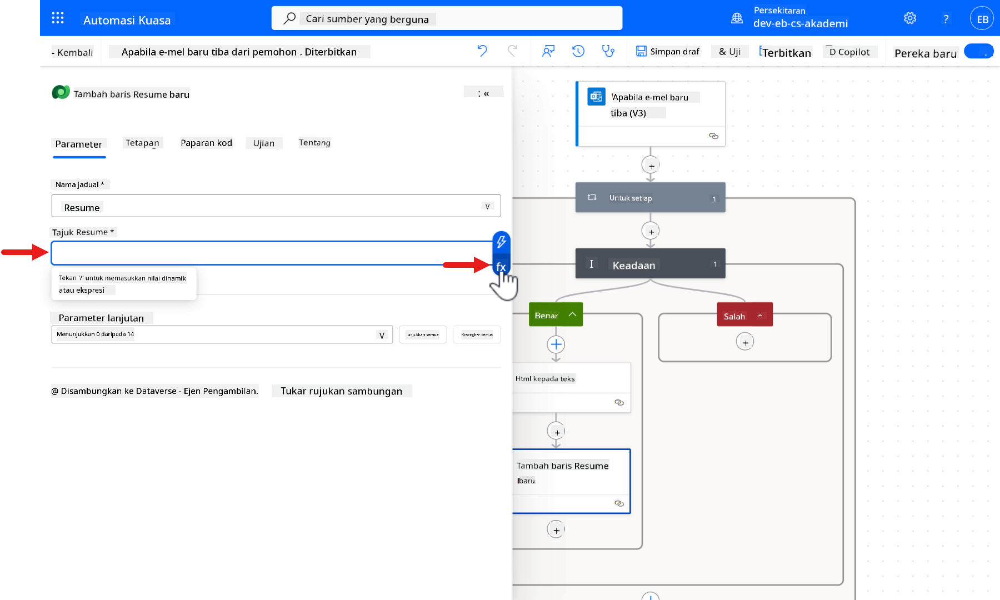

1. Dalam tab **Function**, masukkan ekspresi berikut yang menggunakan fungsi `item()`.

```text
item()?['name']
```

Untuk mengetahui lebih lanjut tentang fungsi `item()`, kembangkan blok pembelajaran tambahan berikut.

??? info "Pembelajaran Tambahan: Fungsi `item()`"

🤔 **Apa itu fungsi `item()`?**

- Apabila anda menggunakan tindakan **Apply to each**, Power Automate akan melalui setiap elemen dalam koleksi (array).
- Ia paling kerap digunakan dalam tindakan seperti **Apply to each** (atau **For each**), **Select**, atau **Filter array**.

⚙️ **Bagaimana ia berfungsi?**

- `item()` adalah fungsi yang mengembalikan item semasa yang sedang diproses dalam operasi loop atau array.
- Di dalam loop itu, `item()` merujuk kepada _elemen semasa_ yang sedang diproses.

📌 **Di mana anda menggunakannya?**

- **Apply to each:** untuk mengakses sifat item semasa.
- **Select:** untuk mengubah setiap item dalam array.
- **Filter array:** untuk merujuk kepada item semasa yang sedang dinilai.

🦋 **Contoh**

- Ekspresi dalam loop:
       -  `item()?['Email']`
- Ini mendapatkan sifat `Email` dari item semasa.

💡 **Poin Penting**

- `item()` adalah _konteks-sensitif_: ia sentiasa merujuk kepada item semasa dalam loop atau operasi array yang anda berada.
- Jika anda menyarangkan loop, anda boleh menggunakan `items('LoopName')` untuk merujuk kepada item dalam loop tertentu.

Pilih **Add** untuk menambah ekspresi ke parameter **Resume Title**.

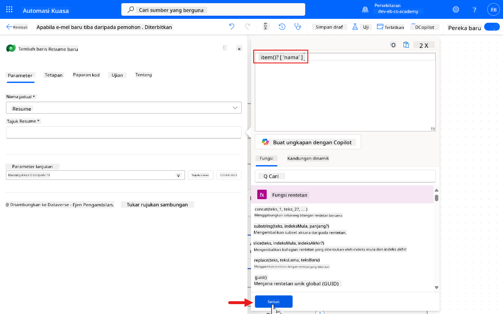

1. Kita masih perlu mengkonfigurasi beberapa parameter lagi, pilih **Show all** dan dalam medan **Cover Letter**, pilih **ikon kilat** atau **ikon fx** di sebelah kanan.

   Dalam tab **Function**, masukkan ekspresi berikut yang menggunakan ekspresi yang sama dalam [misi](../02-multi-agent/README.md) sebelumnya.

```text
if(greater(length(body('Html_to_text')), 2000), substring(body('Html_to_text'), 0, 2000), body('Html_to_text'))
```

Ekspresi ini memeriksa jika _teks_ dari tindakan **Html to text** lebih panjang daripada 2000 aksara, dan jika ya, hanya mengembalikan 2000 aksara pertama; jika tidak, ia mengembalikan teks penuh.

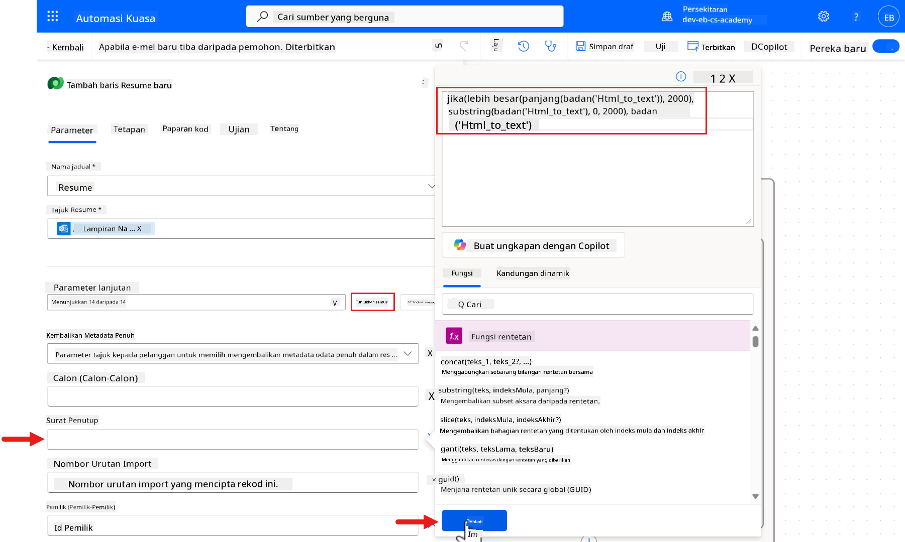

1. Ekspresi kini akan ditambahkan ke medan **Cover Letter**.

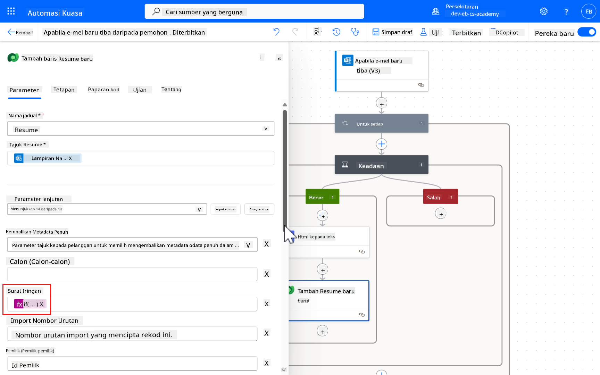

1. Untuk medan **Source Email Address**, cari `from` dan pilih parameter **From** dari pencetus kerana ini mengandungi nilai alamat e-mel.

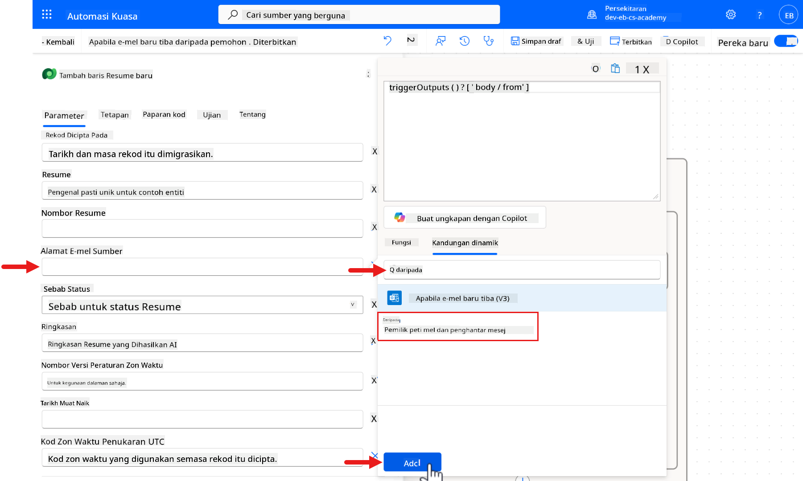

1. Untuk medan **Upload Date**, pilih **ikon kilat** atau **ikon fx** di sebelah kanan. Dalam tab **Function**, masukkan ekspresi berikut yang menggunakan fungsi `utcNow()`.

```text
utcNow()
```

Untuk mengetahui lebih lanjut tentang fungsi `utcNow`, kembangkan blok pembelajaran tambahan berikut.

??? info "Pembelajaran Tambahan: Fungsi `utcNow`"

🤔 **Apa itu fungsi `utcNow()`?**

- Fungsi utcnow() dalam Power Automate mengembalikan tarikh dan masa semasa dalam Waktu Universal Terkoordinasi (UTC) dalam format ISO 8601, seperti: `2025-09-23T04:32:14Z`

🦋 **Contoh**

- Ekspresi:
       -  `concat('Laporan dijana pada ', utcnow())`
- Output adalah:
       - Laporan dijana pada `2025-09-23T04:32:14Z`

💡 **Poin Penting**
- **Tiada argumen (parameter input) diperlukan:** ia sentiasa memberikan cap waktu UTC semasa.
   - **Kegunaan**
       - Menambah cap waktu pada log atau nama fail
       - Membandingkan waktu semasa dengan tarikh lain
       - Menjadualkan atau menetapkan syarat berdasarkan waktu

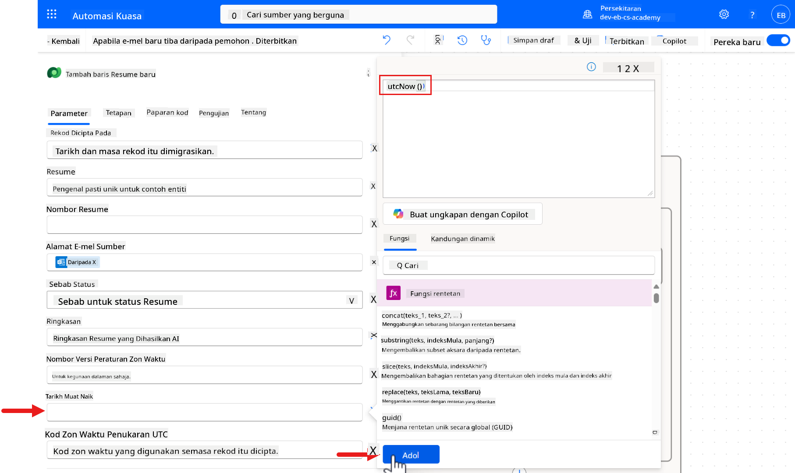

1. Kita telah selesai mengkonfigurasi tindakan **Tambah baris Resume baru**, jadi mari keluar dari panel dengan mengecilkannya.

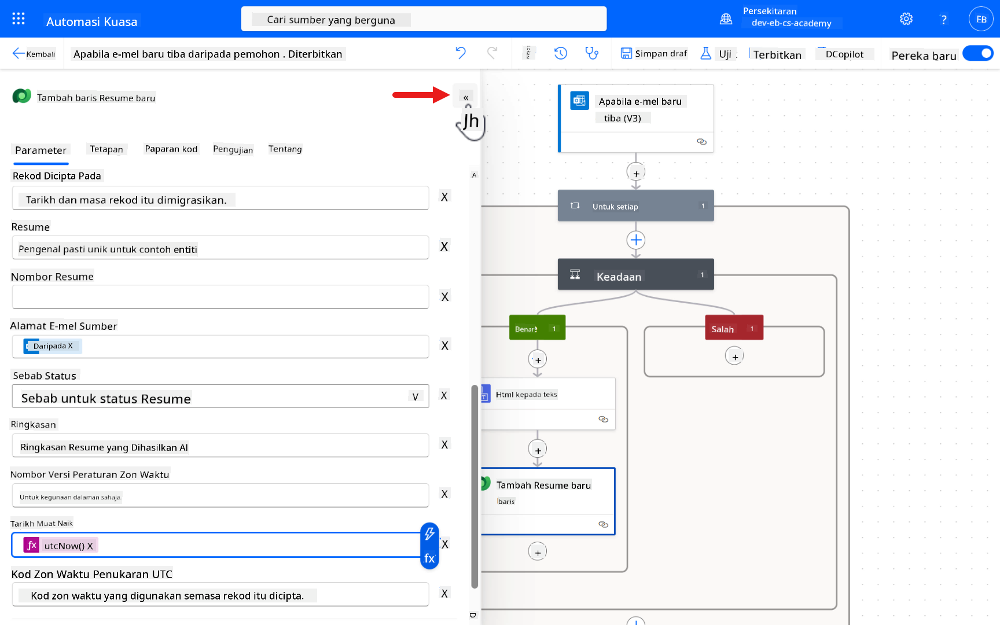

1. Kita akan menambah tindakan baru dengan memilih **ikon +** di bawah tindakan **Tambah baris Resume baru** yang akan memuatkan panel untuk menambah tindakan. Pilih penyambung **Microsoft Dataverse** sekali lagi.

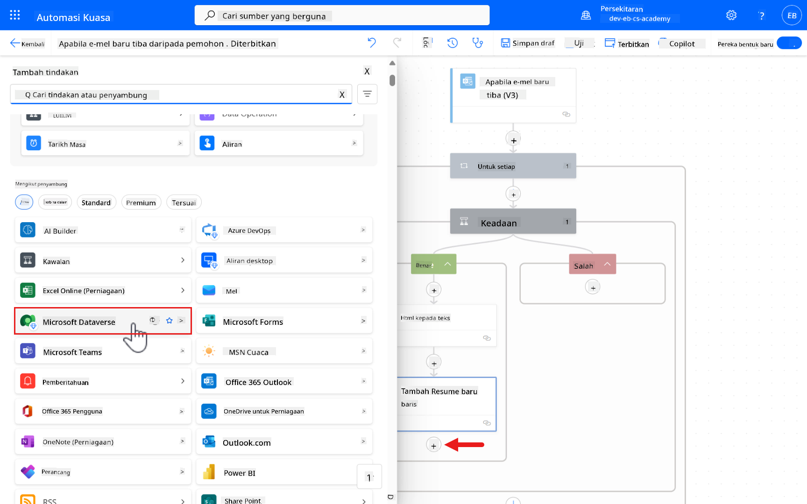

1. Pilih tindakan **Muat naik fail atau imej**.

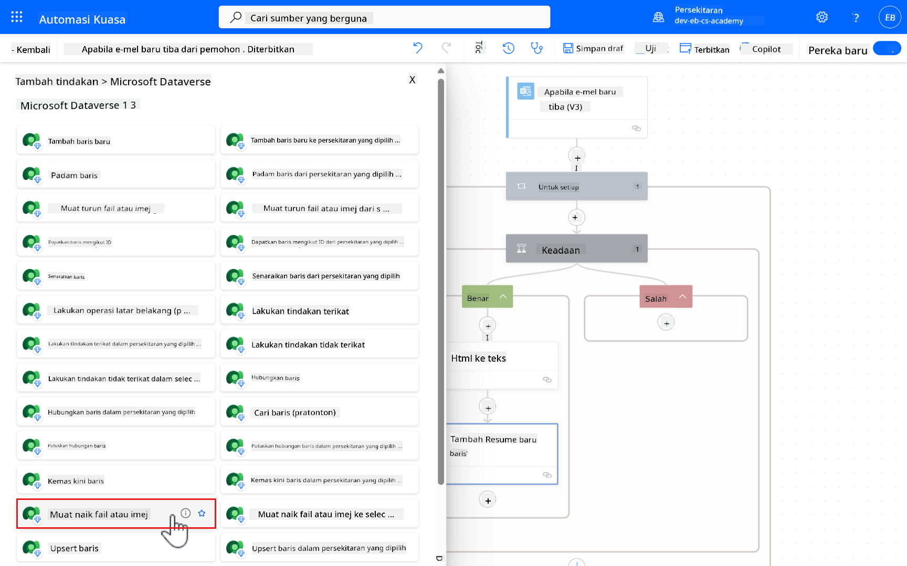

1. Namakan semula tindakan dengan memilih **Ellipsis (...)**, salin dan tampal teks berikut sebagai nama,

```text
Muat Naik Fail Resume
```

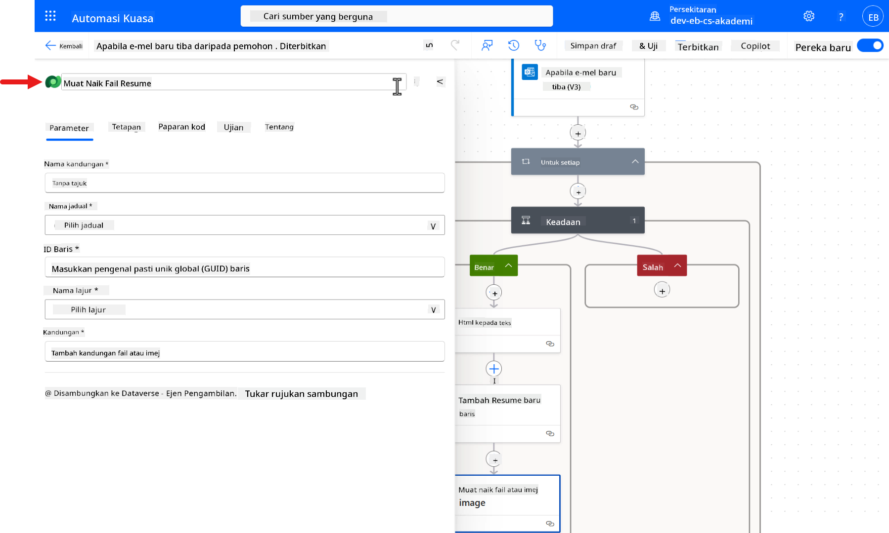

1. Seterusnya, pilih medan **Nama Kandungan** dan pilih **ikon kilat** atau **ikon fx** di sebelah kanan.

   Dalam **tab Fungsi**, masukkan ekspresi berikut yang menggunakan fungsi `item ()`. Ini akan mendapatkan sifat `name` dari item semasa (fail lampiran).

```text
item()?['name']
```

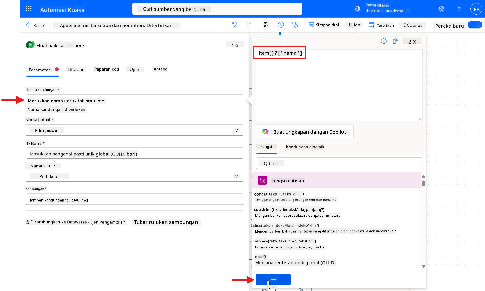

1. Untuk parameter **Nama Jadual**, cari `res` dan pilih jadual **Resumes**.

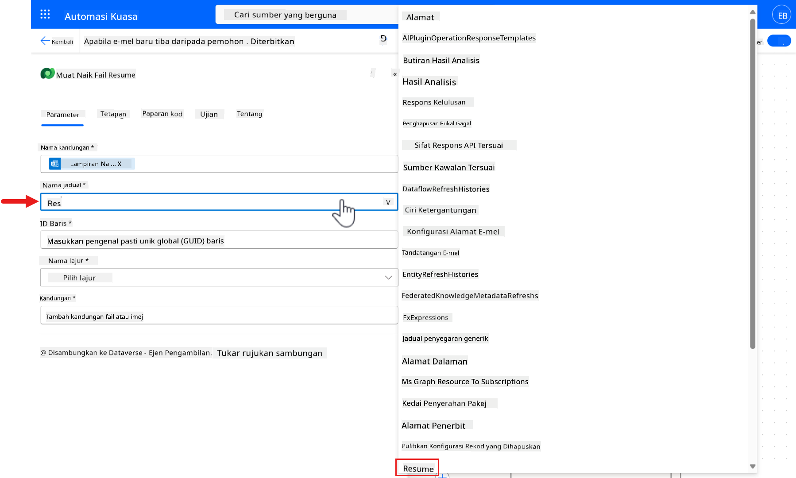

1. Pilih medan **ID Baris** seterusnya dan pilih **ikon kilat** atau **ikon fx** di sebelah kanan.

   Cari `ID` dan pilih parameter **Resume** dari tindakan Dataverse _Tambah baris baru_ kerana ini mengandungi nilai ID baris untuk memuat naik fail PDF.

   Pilih **Tambah**.

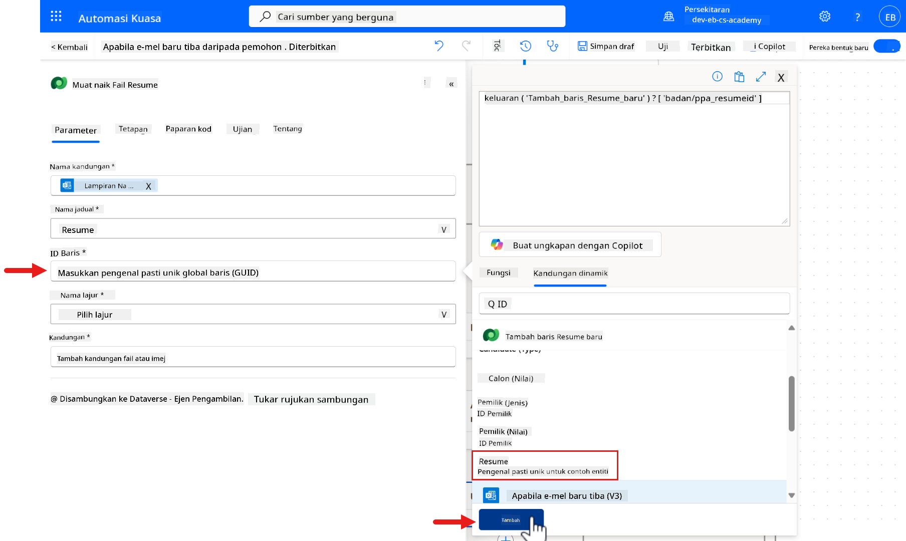

1. Pilih medan **Nama Kolum** dan pilih pilihan **Resume PDF**.

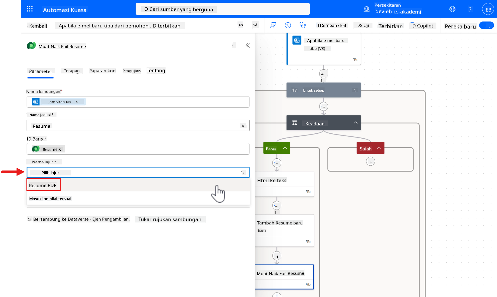

1. Pilih medan **Kandungan** dan pilih **ikon kilat** atau **ikon fx** di sebelah kanan.

   Dalam **tab Fungsi**, masukkan ekspresi berikut yang menggunakan fungsi `item ()`. Ini akan mendapatkan sifat `contentBytes` dari item semasa (fail lampiran). `contentBytes` merujuk kepada data binari mentah fail atau lampiran, yang dikodkan sebagai string Base64.

```text
item()?['contentBytes']
```

1. Kita telah selesai mengkonfigurasi tindakan ini, jadi mari keluar dari tindakan dengan memilih dua tanda kurung sudut («) yang menunjuk ke kiri untuk mengecilkan panel.


1. Seterusnya, pilih **Menghantar arahan kepada copilot yang ditentukan untuk diproses**, kemudian seret dan lepaskan tindakan ini di bawah tindakan **Muat Naik Fail Resume** dalam laluan _True_ syarat.

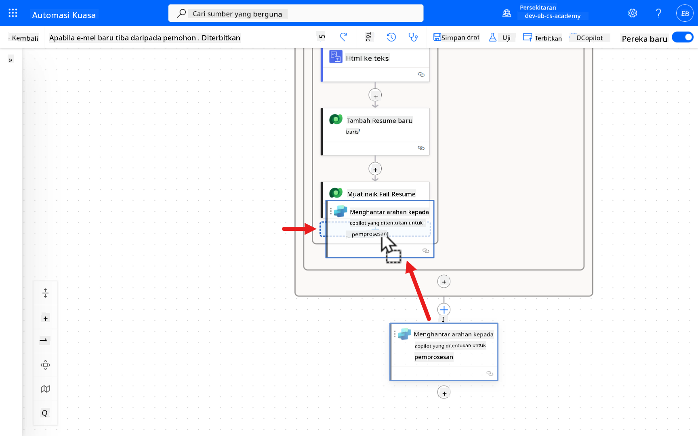

1. Pilih **Menghantar arahan kepada copilot yang ditentukan untuk diproses** untuk mengkonfigurasinya.

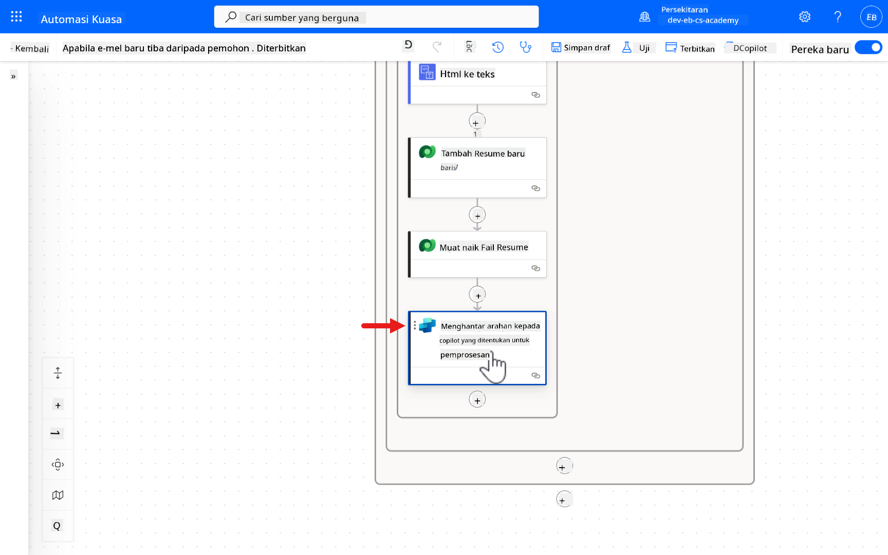

1. Dalam medan **Badan/Mesej**, pilih semua kandungan medan dan kosongkan/hapuskan.

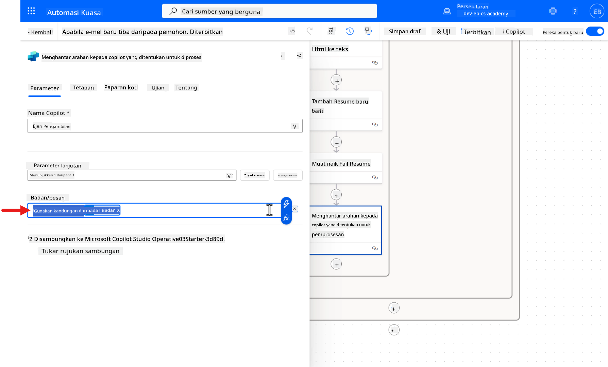

1. Salin dan tampal teks berikut ke dalam medan **Badan/Mesej** dan sorot `RESUME ID PLACEHOLDER`.

```text
Hantar [ResumeId (text)] = "RESUME ID PLACEHOLDER" dan [ResumeTitle (text_1)] = "RESUME TITLE PLACEHOLDER" dan [ResumeNumber (text_2)]= "RESUME NUMBER PLACEHOLDER" kepada Alat "Notify Teams Applicant channel" dalam agen anak "Application Intake Agent"
```

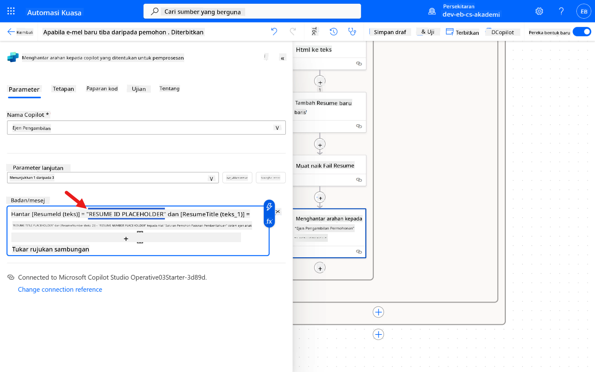

1. Pilih **ikon kilat** atau **ikon fx** di sebelah kanan.

   Cari `resume` dan pilih parameter **Resume** dari tindakan _Tambah baris baru Dataverse_ kerana ini mengandungi nilai `ID` dari baris Resume yang dibuat.

   Pilih **Tambah**.

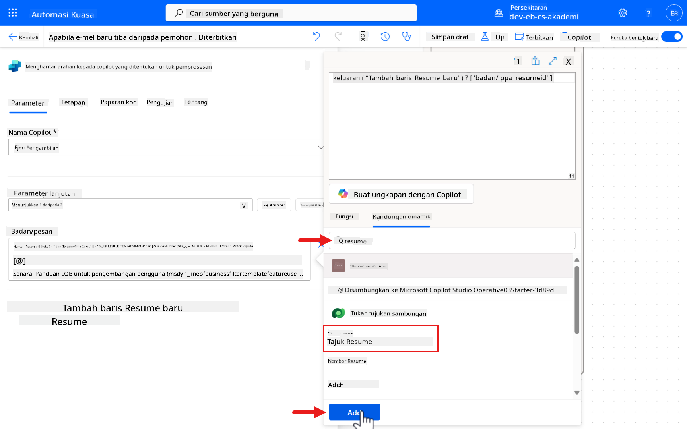

1. Sorot `RESUME TITLE PLACEHOLDER`. Pilih **ikon kilat** atau **ikon fx** di sebelah kanan.

   Cari `title` dan pilih parameter **Resume Title** dari tindakan _Tambah baris baru Dataverse_ kerana ini mengandungi nilai `resume title` dari baris Resume yang dibuat.

   Pilih **Tambah**.

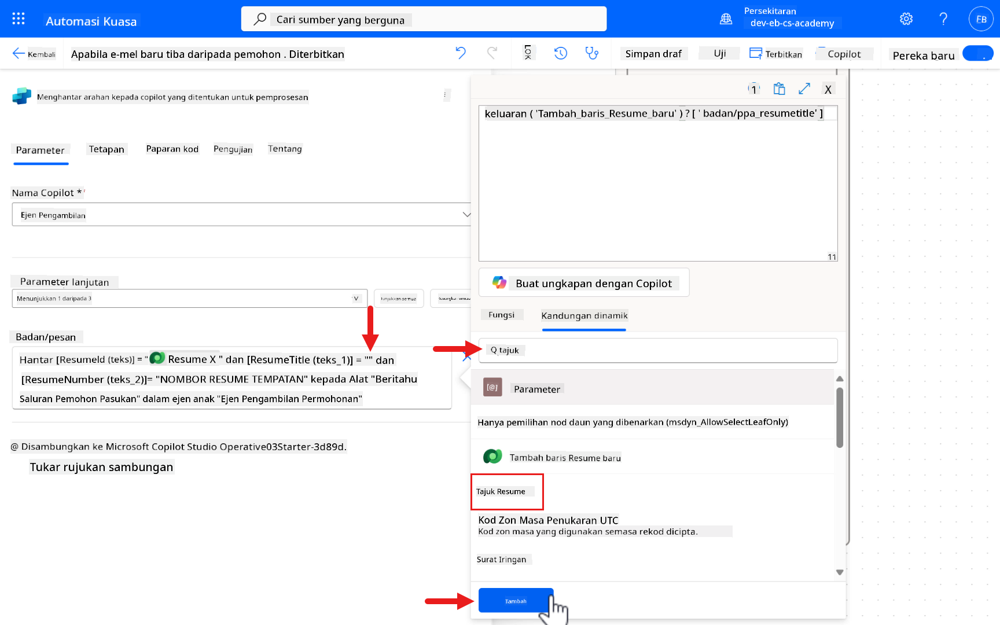

1. Sorot `RESUME NUMBER PLACEHOLDER`. Pilih **ikon kilat** atau **ikon fx** di sebelah kanan.

   Cari `resume number` dan pilih parameter **Resume Number** dari tindakan _Tambah baris baru Dataverse_ kerana ini mengandungi nilai `Resume Number` dari baris Resume yang dibuat.

   Pilih **Tambah**.

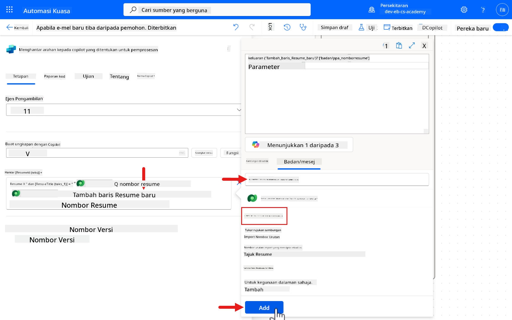

1. Kita telah selesai mengkonfigurasi tindakan ini dan aliran agen kita 🙌🏻 Anda melakukan yang terbaik! Sekarang mari simpan aliran pencetus acara kita dengan memilih **Simpan draf**.

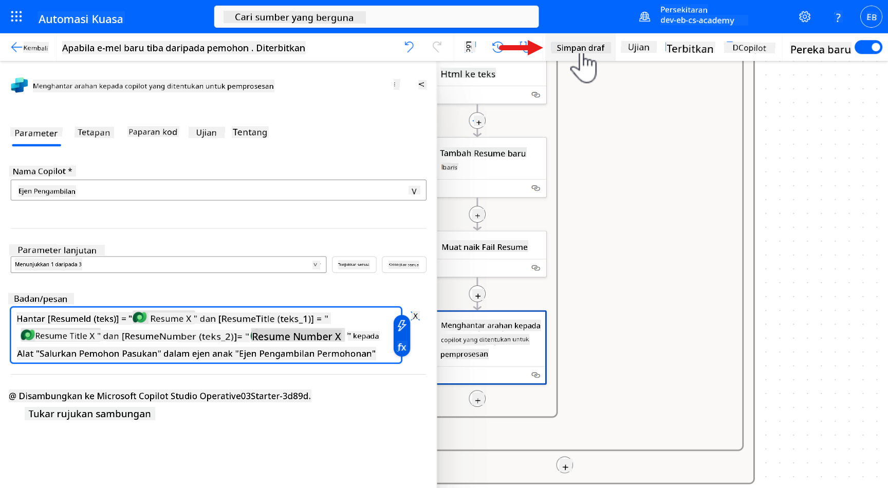

1. Sekarang kita perlu mengedit butiran aliran agen, pilih **Kembali**.

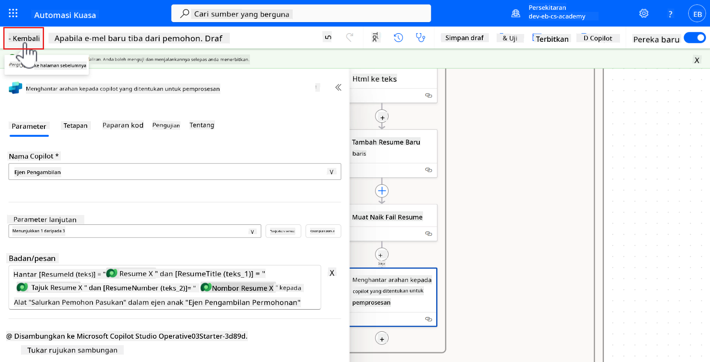

1. Pilih **Edit** dalam bahagian **Butiran** dan kemas kini **Pelan** kepada pilihan **Copilot Studio**.

   Pilih **Simpan**.

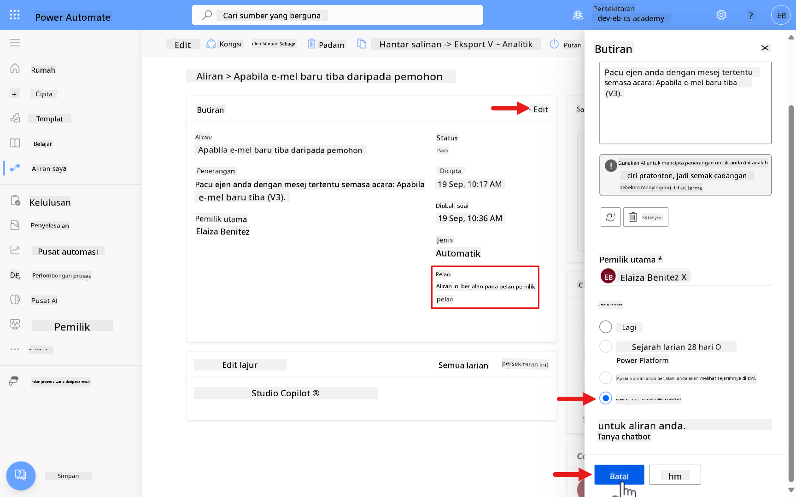

1. Modal akan muncul untuk meminta anda mengesahkan pertukaran kepada pelan Copilot Studio. Pilih **Sahkan**.

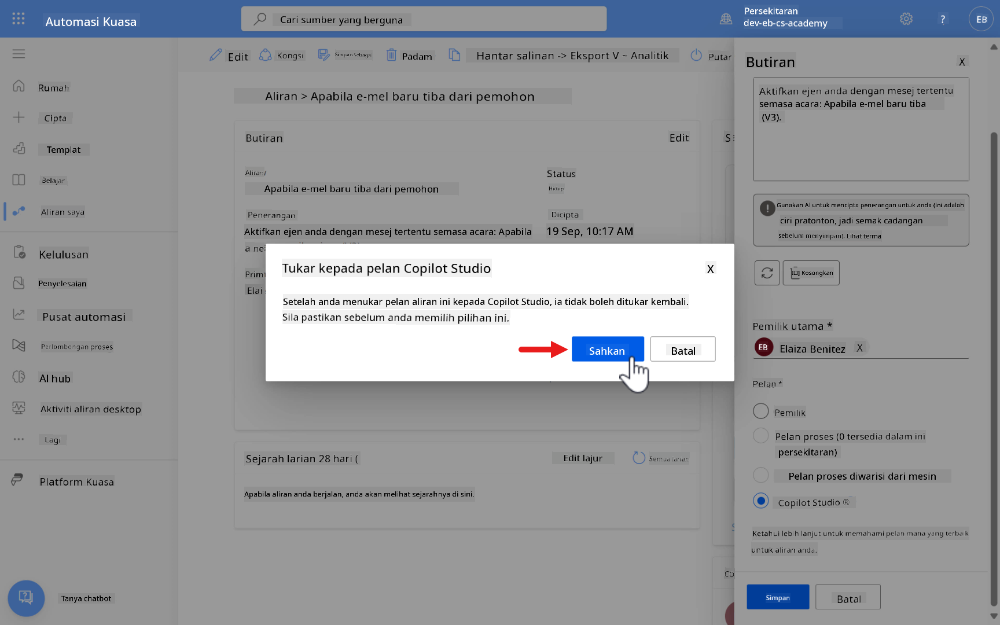

1. Pelan kini dikemas kini kepada **Copilot Studio**. Pilih **Edit** kerana kita perlu menerbitkan aliran pencetus acara untuk agen kita.

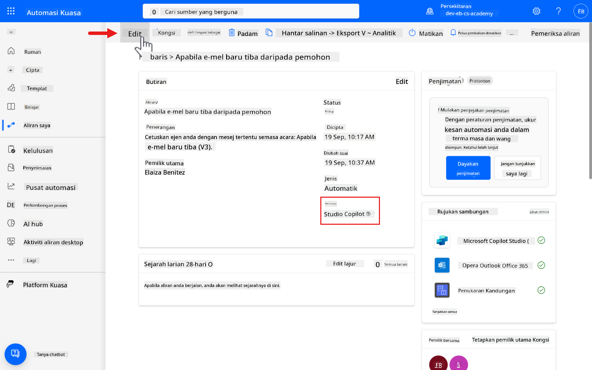

1. Pilih **Terbitkan**.

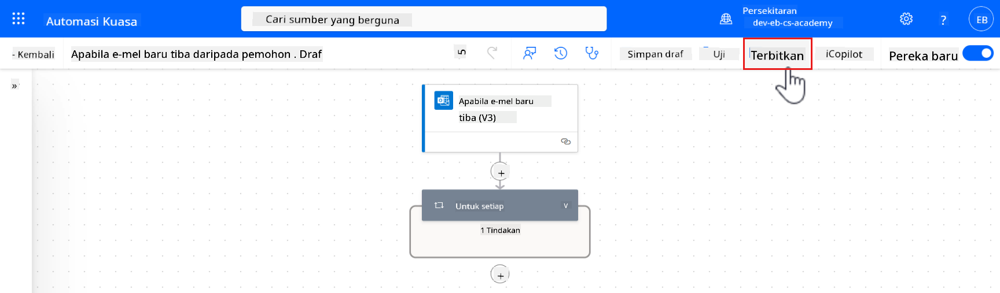

   Hooray! Aliran pencetus acara kini telah diterbitkan 😃

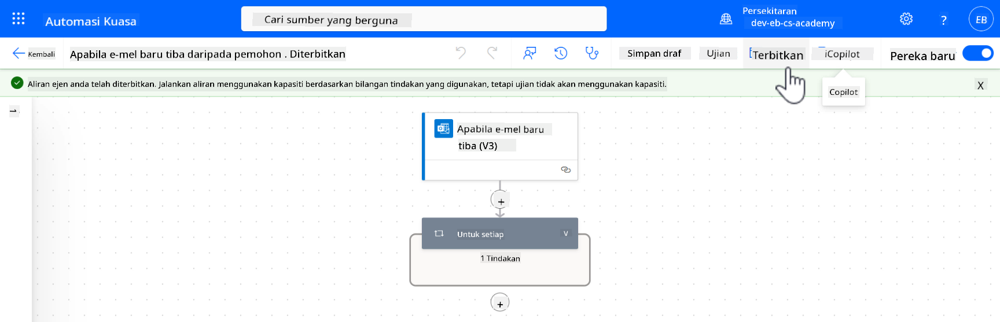

Mari teruskan dengan mencipta aliran agen baru yang akan dipanggil oleh agen anak **Intake Application Agent**.

### Lab 3.2 - Memaklumkan saluran Teams menggunakan kad adaptif

Kita kini akan mencipta aliran agen baru untuk agen anak **Intake Application Agent** yang menggunakan nilai yang dihantar oleh pencetus acara, untuk menghantar kad adaptif ke saluran Teams. Kad adaptif ini akan memberi amaran kepada pasukan pengambilan HR tentang PDF yang dimuat naik secara automatik supaya mereka dapat menyemaknya.

Mari mulakan!

1. Dalam **Hiring Agent** pilih tab **Agents** dan pilih **Application Intake Agent**.

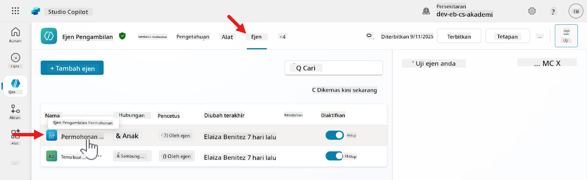

1. Skrol ke bawah ke **Tools** dan pilih **+ Add**.

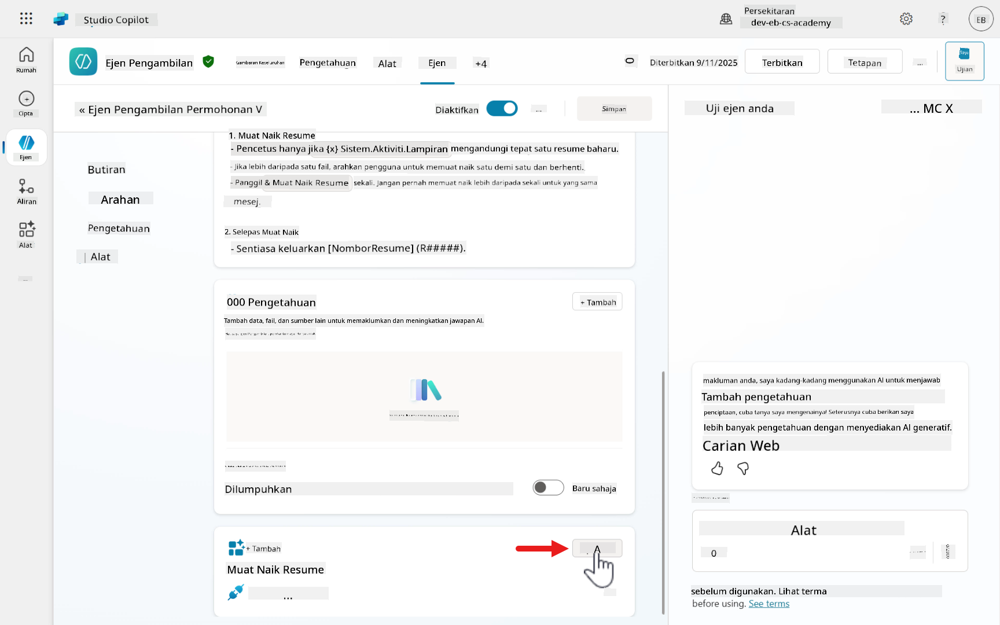

1. Modal **Tambah alat** akan muncul. Pilih **+ Alat baru**.

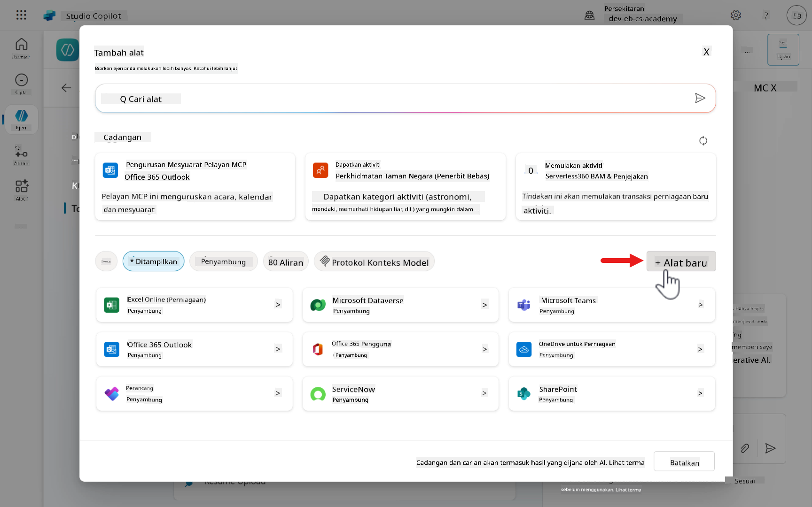

1. Pilih **Aliran agen**.

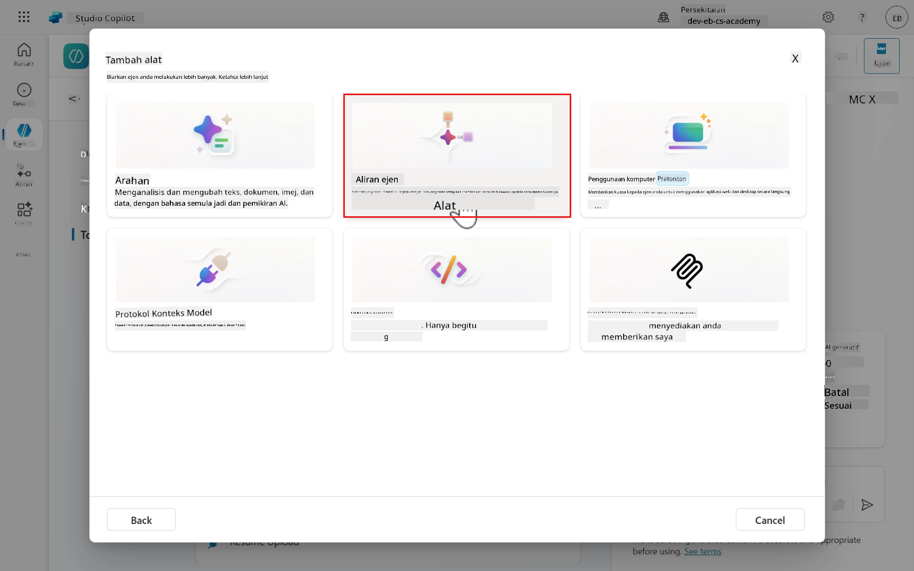

1. **Pereka aliran agen** akan dimuatkan seterusnya. Dalam pencetus **Apabila agen memanggil aliran**, pilih **+ Tambah input**.


1. Pilih **Teks** sebagai jenis input pengguna.


1. Dalam medan teks input, salin dan tampal berikut untuk nama parameter input.

```text
ResumeId
```


1. Ulang langkah yang sama untuk menambah input teks kedua. Salin dan tampal berikut untuk nama parameter input.

```text
ResumeTitle
```


1. Ulang langkah yang sama untuk menambah input teks ketiga. Salin dan tampal berikut untuk nama parameter input.

```text
ResumeNumber
```


1. Ingat bagaimana dalam [Recruit](../../recruit/08-add-adaptive-card/README.md#81-create-a-new-topic-with-an-adaptive-card-for-user-to-submit-their-request) kita menambah kad adaptif dalam Topik untuk agen kita? Kali ini, kita akan menambah kad adaptif dalam aliran agen. Kita kini akan menambah tindakan lain kepada aliran agen kita yang akan menghantar kad adaptif ke saluran Teams.

   Pilih **ikon +** di bawah pencetus.


1. Pilih tindakan **Hantar kad dalam sembang atau saluran**.


1. Rujukan sambungan ke Microsoft Teams perlu dibuat dengan akaun pengguna yang anda log masuk. Pilih **Log masuk**.


1. Pilih akaun pengguna anda dan kemudian pilih **Benarkan akses**.


1. Untuk parameter input berikut,

   | Parameter | Cara Tetapkan | Butiran |
   |----------|------------|---------|
   | **Hantar sebagai** | Dropdown | Pilih pilihan `Flow bot` |
   | **Hantar dalam** | Dropdown | Pilih pilihan `Channel` |
   | **Pasukan** | Dropdown | Pilih pasukan yang tersedia dalam persekitaran anda yang anda mempunyai akses untuk tujuan melengkapkan latihan ini |
   | **Saluran** | Dropdown | Pilih saluran yang tersedia dalam persekitaran anda yang anda mempunyai akses untuk tujuan melengkapkan latihan ini |


1. Seterusnya, kita akan mengkonfigurasi medan **Kad Adaptif**. Pilih medan **Kad Adaptif**.


1. Buka [Fail JSON Resume Table Updated](../../../../../docs/operative-preview/03-automate-triggers/assets/3.2_ResumeTableUpdated.json), salin keseluruhan kandungannya, dan tampal ke dalam medan Kad Adaptif.


1. Sama seperti yang kita lakukan dalam [Recruit](../../recruit/08-add-adaptive-card/README.md#81-create-a-new-topic-with-an-adaptive-card-for-user-to-submit-their-request), kita akan menggantikan nilai sedia ada dalam payload JSON dengan nilai sebenar atau kandungan dinamik.

   Pertama, mari kita kemas kini URL untuk sifat `url` dalam sifat `selectAction`. URL ini akan digantikan dengan URL pandangan sistem Resumes dalam aplikasi model-driven **Hiring Hub**. Ini akan membolehkan Pengambilan memilih tindakan dan diarahkan ke pandangan sistem Resumes dalam aplikasi model-driven.

   Sorot nilai URL semasa dan hapuskannya.


1. Dalam aplikasi model-driven **Hiring Hub**, navigasi ke pandangan sistem **Resumes** menggunakan menu di sebelah kiri dan salin URL. Kemudian navigasi kembali ke aliran agen, dan tampal URL yang disalin ke dalam sifat **url** dalam sifat `selectAction`.


1. Anda sepatutnya melihat perkara berikut di mana yang disorot dengan warna kuning adalah butiran persekitaran aplikasi model-driven **Hiring Hub**.

     | Parameter | Nilai | Penjelasan |
     |----------|------------|---------|
     | **Organization URI** | GUID | URL organisasi persekitaran Dataverse/Dynamics 365 |
     | **appid** | GUID | Untuk membuka aplikasi model-driven tertentu, parameter query sama ada appid atau appname digunakan. Dalam kes ini, appid digunakan |
     | **viewid** | GUID | Parameter query yang merupakan id pandangan |

       

1. Seterusnya, kita akan menambah nilai kandungan dinamik untuk beberapa sifat. Mari kita mulakan dengan teks yang akan memaparkan rujukan Nombor Resume bagi baris yang dicipta oleh pencetus acara secara automatik.

      Pilih ikon **panel** untuk memuatkan panel tindakan.

       

1. Skrol ke bawah ke baris di mana anda melihat sifat `text` untuk `RESUME NUMBER PLACEHOLDER`. Sorot nilai tempat letak dan padamkannya.

       

1. Klik di antara tanda petikan berganda dan pilih ikon **kilat** atau ikon **fx** di sebelah kanan.

      Dalam tab **Dynamic Content**, pilih parameter **ResumeNumber** dan pilih **Add**.

       

1. Parameter **ResumeNumber** kini akan ditambah sebagai kandungan dinamik kepada sifat `text`.

       

1. Kita akan ulang langkah yang sama untuk `RESUME NAME PLACEHOLDER`. Skrol ke bawah ke baris di mana anda melihat sifat `text` untuk `RESUME NAME PLACEHOLDER`. Sorot nilai tempat letak dan padamkannya.

       

1. Klik di antara tanda petikan berganda dan pilih ikon **kilat** atau ikon **fx** di sebelah kanan.

      Dalam tab **Dynamic Content**, pilih parameter **ResumeTitle** dan pilih **Add**.

       

1. Parameter **ResumeTitle** kini akan ditambah sebagai kandungan dinamik kepada sifat `text`.

       

1. Kita akan ulang langkah yang sama untuk nilai **Due Date** yang mewakili tarikh akhir untuk perekrut menyemak resume. Skrol ke bawah ke baris di mana anda melihat sifat `text` untuk `May 21, 2023`.

       

1. Padam nilai tempat letak tarikh ini dan klik di antara tanda petikan berganda.

       

1. Pilih ikon **kilat** atau ikon **fx** di sebelah kanan dan dalam tab **Function**, masukkan ungkapan berikut dan pilih **Add**.

       ```text
       addDays(utcNow(), 3, 'MMM dd, yyyy')
       ```

      Ungkapan ini menggunakan dua fungsi.

     | Fungsi | Penjelasan |
     |----------|------------|
     | **addDays** | Menambah bilangan hari tertentu kepada tarikh yang diberikan dan mengembalikan tarikh yang terhasil dalam format string |
     | **utcNow** | Mengembalikan tarikh dan masa semasa dalam format Waktu Universal Terkoordinasi (UTC) sebagai string. |

      Untuk nilai utcNow, kita memformatkan tarikh untuk menjadi bulan dan tarikh, diikuti oleh tahun.

       

      Ungkapan kini akan ditambah kepada sifat `text`.

       

1. Akhir sekali, kita akan mengemas kini URL untuk sifat `url` dalam harta array `actions` di bahagian bawah payload JSON. URL tempat letak semasa ini akan digantikan dengan URL baris Resume dalam aplikasi model-driven **Hiring Hub**. Ini akan membolehkan Perekrut memilih tindakan `Action.OpenURL` kad adaptif dan diarahkan ke Resume dalam aplikasi model-driven.

       

1. Dalam aplikasi model-driven **Hiring Hub**, buka satu baris dalam pandangan sistem **Resumes** menggunakan menu di sebelah kiri. Baris resume akan dimuatkan sebagai borang dalam aplikasi model-driven.

      Salin URL untuk baris Resume.

    ??? info "Cara untuk kembali ke aplikasi model-driven **Hiring Hub** jika anda keluar/menutupnya"

        1. Layari [https://make.powerapps.com](https://make.powerapps.com) dan pastikan anda berada dalam persekitaran pembangun yang anda gunakan untuk latihan makmal ini, jika tidak, tukar kepada persekitaran tersebut.
        
        

        1. Pilih **Apps** dalam panel menu sebelah kiri dan untuk aplikasi model-driven **Hiring Hub**, pilih ikon **Play** untuk memuatkannya dalam pelayar anda.
        
        

       

1. Kemudian kembali ke aliran ejen, sorot nilai URL tempat letak semasa dan padamkannya.

       

1. Kemudian tampal URL yang disalin ke dalam sifat **url** dalam `url property`.

       

1. Anda sepatutnya melihat perkara berikut. Padam nilai id `GUID` di hujungnya. Kita akan menggantikan kandungan dinamik ini - parameter **ResumeId**.

       

1. Pilih ikon **kilat** atau ikon **fx** di sebelah kanan.

      Dalam tab **Dynamic Content**, pilih parameter **ResumeId** dan pilih **Add**.

       

1. **ResumeId** akan ditambah sebagai kandungan dinamik. Perkara berikut yang disorot dengan warna kuning adalah butiran persekitaran aplikasi model-driven **Hiring Hub**.

     | Parameter | Nilai | Penjelasan |
     |----------|------------|---------|
     | **Organization URI** | GUID | URL organisasi persekitaran Dataverse/Dynamics 365 |
     | **appid** | GUID | Untuk membuka aplikasi model-driven tertentu, parameter query sama ada appid atau appname digunakan. Dalam kes ini, appid digunakan |
     | **id** | GUID | Parameter query yang merupakan id baris Resume |

       

1. Kita telah selesai mengkonfigurasi tindakan **Post card in a chat or channel** 👏🏻 Keluar dari panel konfigurasi tindakan dengan memilih ikon **x**.

       

1. Akhir sekali, kita akan mengkonfigurasi tindakan terakhir, **Respond to the agent** dengan menghantar teks kembali kepada ejen untuk menamatkan pemprosesan.

      Dalam tindakan **Respond to the agent**, pilih **+Add an output**.

       

1. Pilih **Text** sebagai jenis output.

       

1. Masukkan perkara berikut sebagai nama output.

       

1. Masukkan perkara berikut sebagai nilai untuk output.

       ```text
       Finished
       ```

       

1. Kita kini telah selesai mengkonfigurasi aliran ejen. Pilih **Save draft** untuk menyimpan aliran ejen. Mesej pengesahan akan muncul setelah disimpan.

       

1. Sebelum menerbitkan aliran ejen, kita perlu mengemas kini butiran untuk aliran ejen. Pilih tab **Overview** dan pilih **Edit**.

      Dalam medan nama aliran, masukkan perkara berikut.

       ```text
       Notify Teams Applicant channel
       ```      

      Selepas itu, pilih ikon **Refresh** untuk mengemas kini penerangan aliran ejen menggunakan AI.

      Kemudian pilih **Save** untuk menyimpan butiran yang dikemas kini untuk aliran ejen.

       

1. Navigasi kembali ke tab **Designer** dan pilih **Publish** untuk menerbitkan aliran ejen. Mesej pengesahan akan muncul setelah disimpan.

       

1. Aliran ejen kini perlu ditambah sebagai alat dalam **Application Intake Agent**. Navigasi kembali ke **Hiring Agent** dan pilih tab **Agents**, kemudian pilih **Application Intake Agent**.

       

1. Dalam bahagian **Details** ejen, kita akan mengemas kini medan **Description**. Salin perkara berikut dan tampal di hujung teks penerangan.

       ```text
       dan juga memberitahu saluran Teams Applicant
       ```

       

1. Seterusnya, kita akan menambah aliran ejen sebagai alat. Skrol ke bawah dan pilih **+ Add**.

       

1. Pilih aliran ejen yang telah dibuat sebelum ini, **Notify Teams Applicant Channel**.

       

1. Seterusnya, pilih **Add and configure**.

       

1. Dalam bahagian **Inputs** aliran ejen, tiga input yang kita konfigurasikan sebelum ini dalam aliran ejen adalah kelihatan. Secara lalai, konfigurasi **Fill using** ditetapkan kepada **Dynamically fill with AI**. Kita akan mengekalkan tetapan ini kerana prompt dari pencetus acara (dalam tindakan terakhir, **Sends a prompt to the specified copilot for processing** - ini adalah langkah 38-44 dari **Lab 3.1 - Automate uploading resumes to Dataverse received by email**) akan mengandungi nilai parameter yang akan diekstrak oleh AI.

       

1. Sekarang alat telah ditambah kepada **Application Intake Agent**, arahan ejen perlu dikemas kini. Pilih ikon **back arrow** untuk kembali ke senarai ejen.

       

1. Pilih **Application Intake Agent** dalam tab **Agents** di **Hiring Agent**.

       

1. Dalam medan **Instructions**, masukkan baris baru selepas arahan `2.Post-Upload`. Salin dan tampal arahan berikut.

       ```text
       Proses untuk Muat Naik Resume melalui Email
       1. Apabila anda menerima mesej, **Hantar [ResumeId (text)] = "1680265f-5793-f011-b41b-7c1e525be9f7" dan [ResumeTitle (text_1)] = "TAYLOR TESTPERSON (FICTITIOUS).pdf" dan [ResumeNumber (text_2)]= "R01026" kepada Alat "Notify Teams Applicant channel"** dalam ejen anak "Application Intake Agent", panggil [AGENT FLOW PLACEHOLDER]
       ```

       

1. Sorot teks `[AGENT FLOW PLACEHOLDER`.

       

1. Masukkan watak garis miring, `/`, dan pilih alat **Notify Teams Applicant Channel**.

       
1. Aliran ejen kini akan diaktifkan oleh **Application Intake Agent** mengikut arahan, selepas tindakan terakhir (**Menghantar arahan kepada copilot yang ditentukan untuk diproses**) dalam pencetus acara menghantar arahan yang mengandungi nilai parameter kembali kepada ejen.

      Pilih **Save** untuk menyimpan arahan yang telah dikemas kini untuk **Application Intake Agent**.

       

1. Arahan kini akan dikemas kini setelah ejen disimpan.

       

1. Kita kini perlu **Publish** **Hiring Agent**. Pilih **Publish** di bahagian atas kanan, dan dalam _Publish this agent modal_ yang muncul, pilih **Publish**.

       

1. Setelah diterbitkan, mesej pengesahan akan muncul bahawa ejen telah diterbitkan.

       

Kita kini boleh menguji ejen!

### Lab 3.3 - Uji pencetus acara

1. Untuk melaksanakan pencetus acara, e-mel perlu dihantar bersama fail PDF Resume. Dalam Outlook, tulis mesej e-mel baru.

     | Komponen E-mel | Butiran |
     |----------|------------|
     | **Kepada penerima** | Gunakan akaun pengguna yang telah anda log masuk sebagai nilai |
     | **Lampiran fail** | Muat naik fail [TAYLOR TESTPERSON (FICTITIOUS)](../../../../../docs/operative-preview/test-data/resumes/TAYLOR%20TESTPERSON%20(FICTITIOUS).pdf) |
     | **Isi kandungan** | Salin dan tampal teks berikut sebagai isi kandungan e-mel |

       ```text
       Dear Hiring Manager,

       I am writing to express my interest in the Senior Power Platform Engineer position at your organization. With over nine years of experience delivering secure and scalable solutions on Microsoft cloud platforms, I am confident in my ability to contribute effectively to your team.

       In my most recent role as Lead Power Platform Engineer, I developed an automated resume-intake pipeline, reducing manual triage and improving searchability. I have delivered HR case management applications, introduced solution-aware flows, and implemented PR checks to enhance deployment lead times. My expertise includes Power Apps, Power Automate, Power Pages, Dataverse, and a range of Microsoft 365 services, as well as integration with Graph/REST APIs and Azure Functions.

       Previously, I developed Teams approvals with adaptive cards, cutting approval times to the same day, and created robust error-handling frameworks. My background also includes migrating legacy workflows to Power Automate and building self-service portals adopted by hundreds of employees.

       I hold a B.Sc. in Computer Science and am certified as a Power Platform Developer (PL-400) and Solution Architect (PL-600). I am also passionate about mentoring and have volunteered with local maker groups.

       Please find my CV attached for your consideration. I would welcome the opportunity to discuss how my skills and experience align with your needs.

       Thank you for your time and consideration.

       Kind regards,
       Taylor Testperson
       ```

       **Hantar** e-mel setelah selesai ditulis.

       

1. Dalam portal pembuat Power Automate untuk aliran pencetus acara, pilih ikon **Refresh** untuk melihat aliran yang berjaya dijalankan untuk e-mel yang dihantar.

       

1. Kembali ke Copilot Studio dalam **Hiring Agent**, pilih tab **Activity**.

       

1. Tab **Activity** akan dimuatkan yang akan memaparkan semua aktiviti **Hiring Agent**. Akan ada aktiviti dengan nilai nama **Automated** yang mempunyai status **Complete**. Aktiviti ini mewakili pencetus acara dan aliran ejen yang telah diaktifkan.

       

1. Pilih aktiviti tersebut, dan pilih pencetus acara dalam peta aktiviti. Pada panel sebelah kanan, perhatikan bagaimana parameter input dalam arahan mengandungi nilai parameter `Resume Id`, `Resume Title` dan `Resume Number` dari baris **Dataverse** yang telah dibuat. Ini berasal dari nilai kandungan dinamik yang dikonfigurasi sebelumnya dalam langkah 18 - 27 **Lab 3.1 - Automate uploading resumes to Dataverse received by email**.

       

1. Navigasi kembali ke aplikasi model-driven **Hiring Hub** dan dalam **Resumes system view**, pilih **Refresh** untuk menyegarkan paparan. Baris baru untuk resume yang dihantar melalui e-mel kini akan disenaraikan kerana ia telah dibuat melalui pencetus acara.

       

1. Navigasi kembali ke Copilot Studio dan pilih aliran ejen **Notify Teams Applicant Channel** dalam **Application Intake Agent** di peta aktiviti. Pada panel sebelah kanan, perhatikan bagaimana input mempunyai nilai dari baris Dataverse. Ini berasal dari arahan yang dihantar oleh tindakan terakhir (**Menghantar arahan kepada copilot yang ditentukan untuk diproses**) dalam pencetus acara yang mengandungi nilai parameter dari baris Dataverse yang baru dibuat. Inilah cara kita boleh menghantar nilai parameter dari pencetus acara ke aliran ejen.

       

1. Akhirnya, mari kita lihat kad adaptif yang diposkan ke saluran dalam **Microsoft Teams**. Dalam saluran tersebut, kita akan melihat kad adaptif yang memaparkan maklumat tentang baris Resume yang baru dibuat dalam Dataverse. Arahkan kursor ke hyperlink di awal kad adaptif, perhatikan bagaimana URL adalah URL paparan sistem Resumes yang telah kita konfigurasi sebelumnya dalam payload JSON (langkah 15 - 19 dari **Lab 3.2 - Notify a Teams channel using an adaptive card**) kad adaptif.

       

1. Pilih hyperlink tersebut, dan anda akan diarahkan ke paparan sistem Resumes dalam aplikasi model-driven **Hiring Hub** di pelayar anda.

       

1. Navigasi kembali ke kad adaptif yang diposkan ke saluran dalam Microsoft Teams. Kali ini, arahkan kursor ke **View Resume** yang merupakan tindakan `Action.OpenURL` dari kad adaptif. Perhatikan bagaimana URL adalah baris Resume yang telah kita konfigurasi sebelumnya dalam payload JSON (langkah 30 - 36 dari **Lab 3.2 - Notify a Teams channel using an adaptive card**) kad adaptif.

       

1. Pilih tindakan tersebut, dan anda akan diarahkan ke borang baris Resume dalam aplikasi model-driven **Hiring Hub** di pelayar anda.

       

## ✅ Misi Selesai

Tahniah! 👏🏻 Kerja yang cemerlang, Operatif.

✅ Pencetus acara: anda telah mencipta pencetus acara yang menghantar nilai parameter Dataverse ke aliran ejen.  
✅ Membina aliran ejen: menggunakan nilai parameter Dataverse untuk memaparkan kad adaptif ke saluran dalam Microsoft Teams bagi memberi amaran kepada pasukan pengambilan HR.  
✅ Mengemas kini arahan ejen anak: untuk mengaktifkan aliran setelah pencetus acara selesai.

Ini membolehkan **Hiring Agent** berfungsi secara autonomi setiap kali resume diterima sebagai lampiran e-mel dan memberitahu pasukan pengambilan HR untuk semakan manual.

Ini adalah penghujung **Lab 03 - Automating candidate application emails**, pilih pautan di bawah untuk bergerak ke pelajaran seterusnya.

⏭️ [Bergerak ke pelajaran **Authoring Agent Instructions**](../04-agent-instructions/README.md)

## 📚 Sumber Taktikal

📖 [Jadikan ejen anda autonomi dalam Copilot Studio](https://learn.microsoft.com/training/modules/autonomous-agents-online-workshop/?WT.mc_id=power-188561-ebenitez)  

📖 [Tambah pencetus acara](https://learn.microsoft.com/microsoft-copilot-studio/authoring-trigger-event?WT.mc_id=power-188561-ebenitez)  

📖 [Gunakan aliran ejen dengan ejen anda](https://learn.microsoft.com/microsoft-copilot-studio/advanced-flow?WT.mc_id=power-188561-ebenitez)  

📖 [Pengenalan pencetus Power Automate](https://learn.microsoft.com/power-automate/triggers-introduction?WT.mc_id=power-188561-ebenitez)  

📖 [Menggunakan aliran Power Automate dengan ejen](https://learn.microsoft.com/microsoft-copilot-studio/advanced-flow-create?WT.mc_id=power-188561-ebenitez)  

📖 [Pencegahan kehilangan data untuk Copilot Studio](https://learn.microsoft.com/microsoft-copilot-studio/admin-data-loss-prevention?WT.mc_id=power-188561-ebenitez)  

---

**Penafian**:  
Dokumen ini telah diterjemahkan menggunakan perkhidmatan terjemahan AI [Co-op Translator](https://github.com/Azure/co-op-translator). Walaupun kami berusaha untuk ketepatan, sila ambil perhatian bahawa terjemahan automatik mungkin mengandungi kesilapan atau ketidaktepatan. Dokumen asal dalam bahasa asalnya harus dianggap sebagai sumber yang berwibawa. Untuk maklumat penting, terjemahan manusia profesional adalah disyorkan. Kami tidak bertanggungjawab atas sebarang salah faham atau salah tafsir yang timbul daripada penggunaan terjemahan ini.