<!--
CO_OP_TRANSLATOR_METADATA:
{
  "original_hash": "616d142d4fb5f45d2a168fad6c1f9545",
  "translation_date": "2025-10-20T01:18:19+00:00",
  "source_file": "docs/operative-preview/07-multimodal-prompts/README.md",
  "language_code": "ms"
}
-->
# 🚨 Misi 07: Ekstrak Kandungan Resume dengan Prompt Multimodal

--8<-- "disclaimer.md"

## 🕵️‍♂️ KOD NAMA: `DOCUMENT RESUME RECON`

> **⏱️ Tempoh Operasi:** `~45 minit`

## 🎯 Ringkasan Misi

Selamat datang, Operatif. Misi-misi anda sebelum ini telah melengkapkan anda dengan kemahiran orkestrasi agen yang hebat, tetapi kini tiba masanya untuk membuka kemampuan yang mengubah permainan: **analisis dokumen multimodal**.

Tugas anda, jika anda memilih untuk menerimanya, adalah **Document Resume Recon** - mengekstrak data berstruktur dari mana-mana dokumen dengan ketepatan. Walaupun agen anda boleh memproses teks dengan mudah, dunia sebenar memerlukan pengendalian PDF, imej, dan dokumen kompleks setiap hari. Resume bertimbun, invois perlu diproses, dan borang memerlukan pendigitalan segera.

Misi ini akan mengubah anda daripada pembina agen teks sahaja kepada seorang **pakar multimodal**. Anda akan belajar mengkonfigurasi AI yang membaca dan memahami dokumen seperti seorang penganalisis manusia - tetapi dengan kelajuan dan konsistensi AI. Pada akhir misi, anda akan membina sistem ekstraksi resume lengkap yang berintegrasi dengan aliran kerja pengambilan pekerja anda.

Teknik yang anda pelajari di sini akan menjadi penting untuk operasi asas data lanjutan dalam misi anda yang seterusnya.

## 🔎 Objektif

Dalam misi ini, anda akan belajar:

1. Apa itu prompt multimodal dan bila untuk menggunakan model AI yang berbeza
1. Cara mengkonfigurasi prompt dengan input imej dan dokumen
1. Cara memformat output prompt sebagai JSON untuk ekstraksi data berstruktur
1. Amalan terbaik untuk kejuruteraan prompt dengan analisis dokumen
1. Cara mengintegrasikan prompt multimodal dengan Agent Flows

## 🧠 Memahami prompt multimodal

### Apa yang menjadikan prompt itu "multimodal"?

Prompt tradisional hanya berfungsi dengan teks. Tetapi prompt multimodal boleh memproses pelbagai jenis kandungan:

- **Teks**: Arahan dan kandungan bertulis
- **Imej**: Foto, tangkapan skrin, carta, dan diagram (.PNG, .JPG, .JPEG)  
- **Dokumen**: Invois, resume, borang (.PDF)

Keupayaan ini membuka senario yang kuat seperti menganalisis resume, memproses invois, atau mengekstrak data dari borang.

### Mengapa multimodal penting untuk aliran kerja anda

Setiap hari, organisasi anda menghadapi cabaran pemprosesan dokumen berikut:

- **Penyaringan resume**: Membaca ratusan resume secara manual memakan masa yang berharga
- **Pemprosesan invois**: Mengekstrak butiran vendor, jumlah, dan tarikh dari format dokumen yang pelbagai
- **Analisis borang**: Menukar borang kertas kepada data digital

Prompt multimodal menghapuskan halangan ini dengan menggabungkan pemahaman bahasa AI dengan keupayaan analisis visual. Ini memberikan AI anda keupayaan untuk memproses dokumen seefektif teks.

### Senario perniagaan biasa

Berikut adalah beberapa contoh bagaimana prompt multimodal boleh digunakan:

| Senario                | Tugas                                                                                                                                      | Contoh Bidang Output                                                                                   |
|-------------------------|-------------------------------------------------------------------------------------------------------------------------------------------|---------------------------------------------------------------------------------------------------------|
| **Penyaringan resume**    | Mengekstrak nama calon, e-mel, telefon, jawatan semasa, tahun pengalaman, dan kemahiran utama.                                                 | Nama Calon, Alamat E-mel, Nombor Telefon, Jawatan Semasa, Tahun Pengalaman, Kemahiran Utama         |
| **Pemprosesan invois**  | Mengekstrak maklumat vendor, tarikh invois, jumlah keseluruhan, dan item baris dari invois ini.                                                 | Nama Vendor, Tarikh Invois, Jumlah Keseluruhan, Item Baris Invois                                             |
| **Analisis borang**       | Menganalisis borang permohonan ini dan mengekstrak semua bidang yang diisi.                                                                              | Nama Bidang (contoh: Nama Pemohon), Nilai yang Dimasukkan (contoh: John Doe), ...                                  |
| **Pengesahan dokumen ID** | Mengekstrak nama, nombor ID, tarikh luput, dan alamat dari dokumen pengenalan ini. Sahkan bahawa semua teks boleh dibaca dengan jelas dan tandakan mana-mana bahagian yang tidak jelas. | Nama Penuh, Nombor Pengenalan, Tarikh Luput, Alamat, Tanda Bahagian Tidak Jelas                        |

## ⚙️ Pemilihan model dalam AI Builder

AI Builder menawarkan model yang berbeza yang dioptimumkan untuk tugas tertentu. Memahami model mana yang perlu digunakan adalah penting untuk kejayaan.

!!! note "Tepat sehingga September 2025"
    Model AI Builder dikemas kini secara berkala, jadi semak dokumentasi [tetapan model AI Builder](https://learn.microsoft.com/ai-builder/prompt-modelsettings) terkini untuk ketersediaan model semasa.

### Perbandingan model

Semua model berikut menyokong pemprosesan penglihatan dan dokumen

| Model | 💰Kos | ⚡Kelajuan | ✅Terbaik untuk |
|-------|------|-------|----------|
| **GPT-4.1 mini** | Asas (paling menjimatkan kos) | Pantas | Pemprosesan dokumen standard, ringkasan, projek yang menjimatkan kos |
| **GPT-4.1** | Standard | Sederhana | Dokumen kompleks, penciptaan kandungan lanjutan, keperluan ketepatan tinggi |
| **o3** | Premium | Perlahan (analisis mendalam) | Analisis data, pemikiran kritikal, penyelesaian masalah yang canggih |
| **GPT-5 chat** | Standard | Dipertingkatkan | Pemahaman dokumen terkini, ketepatan respons tertinggi |
| **GPT-5 reasoning** | Premium | Perlahan (analisis kompleks) | Analisis paling canggih, perancangan, penaakulan lanjutan |

### Penjelasan tetapan suhu

Suhu mengawal sejauh mana respons AI anda kreatif atau boleh diramal:

- **Suhu 0**: Hasil yang paling boleh diramal, konsisten (terbaik untuk ekstraksi data)
- **Suhu 0.5**: Keseimbangan kreativiti dan konsistensi  
- **Suhu 1**: Kreativiti maksimum (terbaik untuk penciptaan kandungan)

Untuk analisis dokumen, gunakan **suhu 0** untuk memastikan ekstraksi data yang konsisten.

## 📊 Format output: Teks vs JSON

Memilih format output yang betul adalah penting untuk pemprosesan seterusnya.

### Bila untuk menggunakan output teks

Output teks sesuai untuk:

- Ringkasan yang boleh dibaca manusia
- Klasifikasi mudah
- Kandungan yang tidak memerlukan pemprosesan berstruktur

### Bila untuk menggunakan output JSON

Output JSON adalah penting untuk:

- Ekstraksi data berstruktur
- Integrasi dengan pangkalan data atau sistem
- Pemprosesan aliran Power Automate
- Pemetaan bidang yang konsisten

### Amalan terbaik JSON

1. **Tentukan nama bidang yang jelas**: Gunakan penamaan yang deskriptif dan konsisten
1. **Sediakan contoh**: Sertakan output sampel dan nilai untuk setiap bidang
1. **Nyatakan jenis data**: Sertakan contoh untuk tarikh, nombor, dan teks
1. **Tangani data yang hilang**: Rancang untuk nilai null atau kosong
1. **Sahkan struktur**: Uji dengan pelbagai jenis dokumen

### Pertimbangan kualiti dokumen

- **Resolusi**: Pastikan imej jelas dan boleh dibaca
- **Orientasi**: Putar dokumen ke orientasi yang betul sebelum pemprosesan
- **Sokongan format**: Uji dengan jenis dokumen spesifik anda (PDF, JPG, PNG)
- **Had saiz**: Sedar akan sekatan saiz fail dalam persekitaran anda

### Pengoptimuman prestasi

- **Pilih model yang sesuai**: Tingkatkan model hanya apabila diperlukan
- **Optimumkan prompt**: Selalunya, arahan yang lebih pendek dan jelas memberikan prestasi yang lebih baik
- **Pengendalian ralat**: Rancang untuk dokumen yang tidak dapat diproses
- **Pantau kos**: Model yang berbeza menggunakan jumlah kredit AI Builder yang berbeza

## 🧪 Makmal 7: Membina sistem ekstraksi resume

Masa untuk mempraktikkan pengetahuan multimodal anda. Anda akan membina sistem ekstraksi resume yang komprehensif yang menganalisis dokumen calon dan mengubahnya menjadi data berstruktur untuk aliran kerja pengambilan pekerja anda.

### Prasyarat untuk menyelesaikan misi ini

1. Anda perlu **sama ada**:

    - **Telah menyelesaikan Misi 06** dan mempunyai sistem pengambilan pekerja multi-agen anda sedia, **ATAU**
    - **Import penyelesaian permulaan Misi 07** jika anda memulakan dari awal atau perlu mengejar. [Muat turun Penyelesaian Permulaan Misi 07](https://aka.ms/agent-academy)

1. Dokumen resume sampel dari [Test Resumes](https://download-directory.github.io/?url=https://github.com/microsoft/agent-academy/tree/main/operative/sample-data/resumes&filename=operative_sampledata)

!!! note "Import Penyelesaian dan Data Sampel"
    Jika anda menggunakan penyelesaian permulaan, rujuk [Misi 01](../01-get-started/README.md) untuk arahan terperinci tentang cara mengimport penyelesaian dan data sampel ke dalam persekitaran anda.

### 7.1 Buat prompt multimodal

Objektif pertama anda: buat prompt yang mampu menganalisis dokumen resume dan mengekstrak data berstruktur.

1. Log masuk ke [Copilot Studio](https://copilotstudio.microsoft.com) dan pilih **Tools** dari navigasi kiri.

1. Pilih **+ New tool**, kemudian pilih **Prompt**.  
    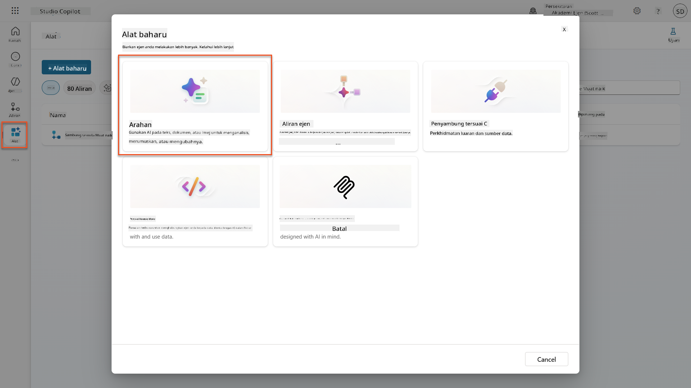

1. **Namakan semula** prompt dari nama cap masa lalai (Contoh: *Custom prompt 09/04/2025, 04:59:11 PM*) kepada `Summarize Resume`.

1. Dalam medan Instructions, tambahkan prompt ini:

    ```text
    You are tasked with extracting key candidate information from a resume and cover letter to facilitate matching with open job roles and creating a summary for application review.
    
    Instructions:
    1. Extract Candidate Details:
        - Identify and extract the candidate’s full name.
        - Extract contact information, specifically the email address.
    2. Create Candidate Summary:
        - Summarize the candidate’s profile as multiline text (max 2000 characters) with the following sections:
            - Candidate name
            - Role(s) applied for if present
            - Contact and location
            - One-paragraph summary
            - Experience snapshot (last 2–3 roles with outcomes)
            - Key projects (1–3 with metrics)
            - Education and certifications
            - Top skills (Top 10)
            - Availability and work authorization
    
    Guidelines:
    - Extract information only from the provided resume and cover letter documents.
    - Ensure accuracy in identifying all details such as contact details and skills.
    - The summary should be concise but informative, suitable for quick application review.
    
    Resume: /document
    CoverLetter: /text
    ```

    !!! tip "Gunakan bantuan Copilot"
        Anda boleh menggunakan "Get started with Copilot" untuk menghasilkan prompt anda menggunakan bahasa semula jadi. Cuba minta Copilot untuk membuat prompt untuk meringkaskan resume!

1. **Konfigurasi** parameter input:

    | Parameter | Jenis | Nama | Data Sampel |
    |-----------|------|------|-------------|
    | Resume | Imej atau dokumen | Resume | Muat naik resume sampel dari folder test-data |
    | CoverLetter | Teks | CoverLetter | Ini adalah Resume! |

1. Pilih **Test** untuk melihat output teks awal dari prompt anda.  
    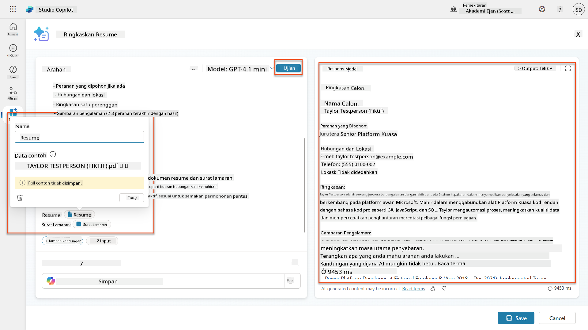

### 7.2 Konfigurasi output JSON

Sekarang anda akan menukar prompt untuk menghasilkan data berstruktur JSON sebagai ganti teks biasa.

1. Tambahkan spesifikasi format JSON ini di akhir arahan prompt anda:

    ```text
    Output Format:
    Provide the output in valid JSON format with the following structure:
    
    {
        "CandidateName": "string",
        "Email": "string",
        "Summary": "string max 2000 characters",
        "Skills": [ {"item": "Skill 1"}, {"item": "Skill 2"}],
        "Experience": [ {"item": "Experience 1"}, {"item": "Experience 2"}],
    }
    ```

1. Tukar tetapan **Output** dari "Text" kepada **JSON**.

1. Pilih **Test** sekali lagi untuk mengesahkan bahawa output kini diformat sebagai JSON.  
    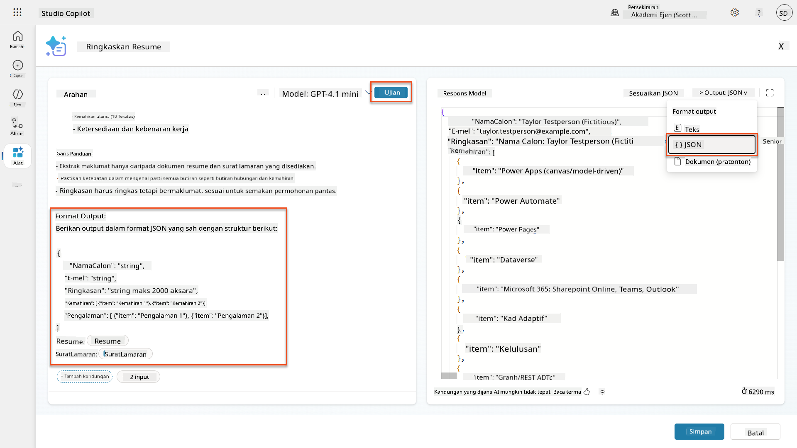

1. **Pilihan:** Eksperimen dengan model AI yang berbeza untuk melihat bagaimana output berbeza, kemudian kembali ke model lalai.

1. Pilih **Save** untuk mencipta prompt.

1. Dalam dialog **Configure for use in Agent**, pilih **Cancel**.

    !!! info "Mengapa kita tidak menambah ini sebagai alat lagi"
        Anda akan menggunakan prompt ini dalam Agent Flow dan bukannya secara langsung sebagai alat, yang memberikan anda lebih kawalan ke atas aliran pemprosesan data.

### 7.3 Tambah prompt ke dalam Agent Flow

Anda akan mencipta Agent Flow yang menggunakan prompt anda untuk memproses resume yang disimpan dalam Dataverse.

!!! tip "Ekspresi Agent Flow"
    Sangat penting untuk anda mengikuti arahan untuk menamakan nod dan memasukkan ekspresi dengan tepat kerana ekspresi merujuk kepada nod sebelumnya menggunakan nama mereka! Rujuk [misi Agent Flow dalam Recruit](../../recruit/09-add-an-agent-flow/README.md#you-mentioned-expressions-what-are-expressions) untuk penyegaran cepat!

1. Navigasi ke **Hiring Agent** anda di dalam Copilot Studio

1. Pilih tab **Agents**, dan pilih anak **Application Intake Agent**

1. Di dalam panel **Tools**, Pilih **+ Add** → **+ New tool** → **Agent flow**

1. Pilih nod When an agent calls the flow, gunakan **+ Add an input** untuk menambah parameter berikut:

    | Jenis | Nama | Penerangan |
    |------|------|-------------|
    | Teks | ResumeNumber | Pastikan menggunakan [ResumeNumber]. Ini mesti sentiasa bermula dengan huruf R |

1. Pilih ikon **+** Insert action di bawah nod pertama, cari **Dataverse**, pilih **See more**, dan kemudian cari tindakan **List rows**

1. Pilih **ellipsis (...)** pada nod List rows, dan pilih **Rename** kepada `Get Resume Record`, dan kemudian tetapkan parameter berikut:

    | Properti | Cara Tetapkan | Nilai |
    |----------|------------|-------|
    | **Table name** | Pilih | Resumes |
    | **Filter rows** | Data dinamik (ikon kilat) | `ppa_resumenumber eq 'ResumeNumber'` Gantikan **ResumeNumber** dengan **When an agent calls the flow** → **ResumeNumber** |
    | **Row count** | Masukkan | 1 |

    !!! tip "Optimalkan pertanyaan tersebut!"
        Apabila menggunakan teknik ini dalam pengeluaran, anda harus sentiasa mengehadkan lajur yang dipilih kepada hanya yang diperlukan oleh Agent Flow.

    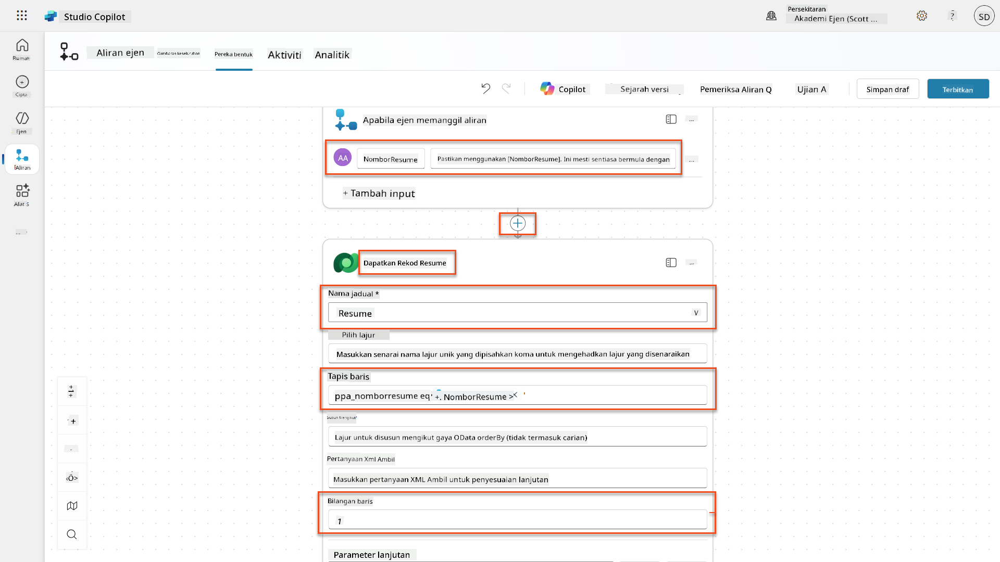

1. Pilih ikon **+** Insert action di bawah nod Get Resume Record, cari **Dataverse**, pilih **See more**, dan kemudian cari tindakan **Download a file or an image**.

    !!! tip "Pilih tindakan yang betul!"
        Pastikan tidak memilih tindakan yang berakhir dengan "from selected environment"

1. Seperti sebelumnya, namakan semula tindakan kepada `Download Resume`, dan kemudian tetapkan parameter berikut:

    | Properti | Cara Tetapkan | Nilai |
    |----------|------------|-------|
    | **Table name** | Pilih | Resumes |
    | **Row ID** | Ekspresi (ikon fx) | `first(body('Get_Resume_Record')?['value'])?['ppa_resumeid']` |
    | **Column name** | Pilih | Resume PDF |

    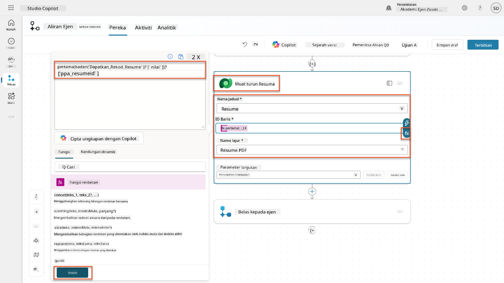

1. Sekarang, pilih ikon **+** Insert action di bawah Download Resume, di bawah **AI capabilities**, pilih **Run a prompt**,

1. Namakan semula tindakan kepada `Summarize Resume` dan tetapkan parameter berikut:

    | Properti | Cara Tetapkan | Nilai |
    |----------|------------|-------|
| **Prompt** | Pilih | Ringkaskan Resume |
| **CoverLetter** | Ekspresi (ikon fx) | `first(body('Get_Resume_Record')?['value'])?['ppa_coverletter']` |
| **Resume** | Data dinamik (ikon kilat) | Muat Turun Resume → Kandungan Fail atau Imej |

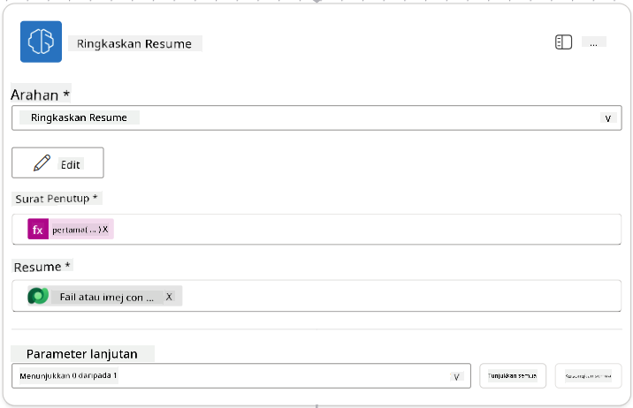

!!! tip "Parameter Prompt"
    Perhatikan bagaimana parameter yang anda isi adalah sama dengan parameter input yang telah anda konfigurasikan semasa anda mencipta prompt.

### 7.4 Cipta rekod calon

Seterusnya, anda perlu mengambil maklumat yang diberikan oleh Prompt dan mencipta rekod calon baru jika ia belum wujud.

1. Pilih ikon tindakan **+** Insert di bawah nod Ringkaskan Resume, cari **Dataverse**, pilih **Lihat lebih banyak**, dan kemudian cari tindakan **Senarai baris**

1. Namakan semula nod sebagai `Get Existing Candidate`, dan kemudian tetapkan parameter berikut:

    | Harta | Cara Tetapkan | Nilai |
    |-------|---------------|-------|
    | **Nama Jadual** | Pilih | Candidates |
    | **Baris Penapis** | Data dinamik (ikon kilat) | `ppa_email eq 'Email'`  **Gantikan** `Email` dengan **Ringkaskan Resume → Email** |
    | **Bilangan Baris** | Masukkan | 1 |

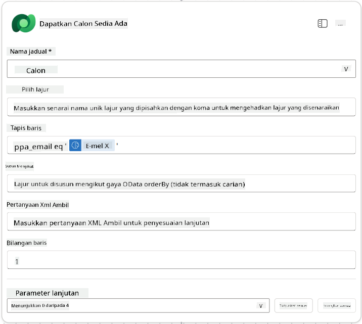

1. Pilih ikon tindakan **+** Insert di bawah nod Dapatkan Calon Sedia Ada, cari **Control**, pilih **Lihat lebih banyak**, dan kemudian cari tindakan **Condition**

1. Dalam sifat kondisi, tetapkan kondisi berikut:

    | Kondisi | Operator | Nilai |
    |---------|----------|-------|
    | Ekspresi (ikon fx): `length(outputs('Get_Existing_Candidate')?['body/value'])` | adalah sama dengan | 0 |

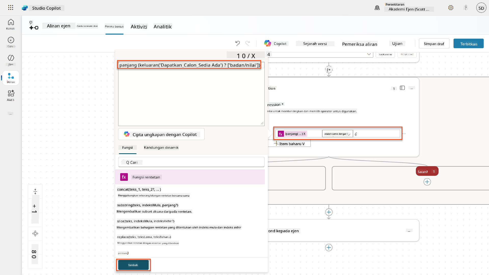

1. Pilih ikon tindakan **+** Insert di cabang **True**, cari **Dataverse**, pilih **Lihat lebih banyak**, dan kemudian cari tindakan **Tambah baris baru**.

1. Namakan semula nod sebagai `Add a New Candidate`, dan kemudian tetapkan parameter berikut:

    | Harta | Cara Tetapkan | Nilai |
    |-------|---------------|-------|
    | **Nama Jadual** | Pilih | Candidates |
    | **Nama Calon** | Data dinamik (ikon kilat) | Ringkaskan Resume → `CandidateName` |
    | **Email** | Data dinamik (ikon kilat) | Ringkaskan Resume → `Email` |

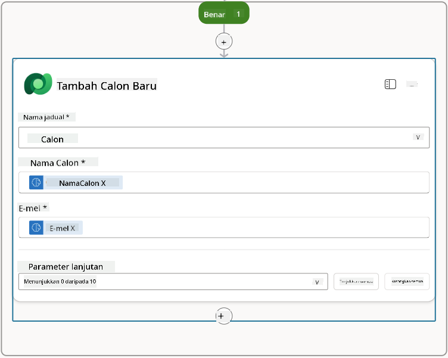

### 7.5 Kemas kini resume dan konfigurasikan output aliran

Lengkapkan aliran dengan mengemas kini rekod resume dan mengkonfigurasi data yang akan dikembalikan kepada ejen anda.

1. Pilih ikon tindakan **+** Insert di bawah kondisi, cari **Dataverse**, pilih **Lihat lebih banyak**, dan kemudian cari tindakan **Kemas kini baris**

1. Pilih tajuk untuk menamakan semula nod sebagai `Update Resume`, pilih **Tunjukkan semua**, dan kemudian tetapkan parameter berikut:

    | Harta | Cara Tetapkan | Nilai |
    |-------|---------------|-------|
    | **Nama Jadual** | Pilih | Resumes |
    | **ID Baris** | Ekspresi (ikon fx) | `first(body('Get_Resume_Record')?['value'])?['ppa_resumeid']` |
    | **Ringkasan** | Data dinamik (ikon kilat) | Ringkaskan Resume → Teks |
    | **Calon (Candidates)** | Ekspresi (ikon fx) | `if(equals(length(outputs('Get_Existing_Candidate')?['body/value']), 1), first(outputs('Get_Existing_Candidate')?['body/value'])?['ppa_candidateid'], outputs('Add_a_New_Candidate')?['body/ppa_candidateid'])` |

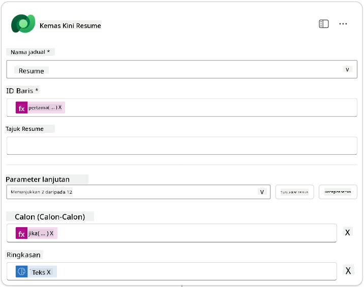

1. Pilih nod **Respond to the agent** dan kemudian gunakan **+ Tambah output** untuk mengkonfigurasi:

    | Jenis | Nama              | Cara Tetapkan                  | Nilai                                                        | Penerangan                                                |
    |-------|-------------------|--------------------------------|-------------------------------------------------------------|----------------------------------------------------------|
    | Teks  | `CandidateName`   | Data dinamik (ikon kilat)      | Ringkaskan Resume → Lihat lebih banyak → CandidateName       | [CandidateName] yang diberikan pada Resume               |
    | Teks  | `CandidateEmail`  | Data dinamik (ikon kilat)      | Ringkaskan Resume → Lihat lebih banyak → Email               | [CandidateEmail] yang diberikan pada Resume              |
    | Teks  | `CandidateNumber` | Ekspresi (ikon fx)             | `concat('ppa_candidates/', if(equals(length(outputs('Get_Existing_Candidate')?['body/value']), 1), first(outputs('Get_Existing_Candidate')?['body/value'])?['ppa_candidateid'], outputs('Add_a_New_Candidate')?['body/ppa_candidateid']) )` | [CandidateNumber] calon baru atau sedia ada              |
    | Teks  | `ResumeSummary`   | Data dinamik (ikon kilat)      | Ringkaskan Resume → Lihat lebih banyak → body/responsev2/predictionOutput/structuredOutput | Ringkasan resume dan butiran dalam bentuk JSON           |

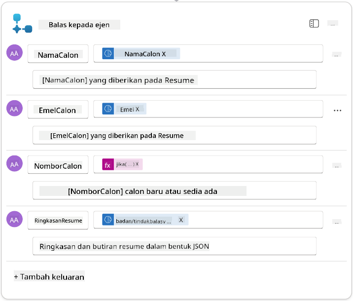

1. Pilih **Simpan draf** di bahagian atas kanan. Aliran Ejen anda sepatutnya kelihatan seperti berikut  
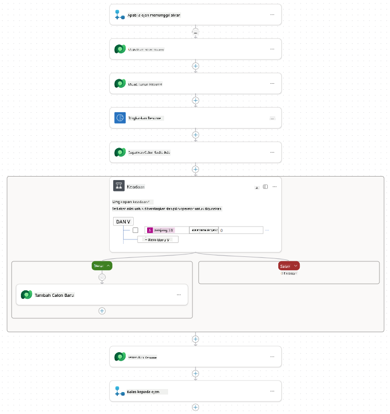

1. Pilih tab **Overview**, Pilih **Edit** pada panel **Details**

    1. **Nama Aliran**:`Ringkaskan Resume`
    1. **Penerangan**:

        ```text
        Summarize an existing Resume stored in Dataverse using a [ResumeNumber] as input, return the [CandidateNumber], and resume summary JSON
        ```

1. Pilih **Simpan**

1. Pilih tab **Designer** sekali lagi, dan pilih **Publish**.

### 7.6 Sambungkan aliran kepada ejen anda

Sekarang anda akan menambah aliran sebagai alat dan mengkonfigurasi ejen anda untuk menggunakannya.

1. Buka **Hiring Agent** anda dalam Copilot Studio

1. Pilih tab **Agents**, dan buka **Application Intake Agent**

1. Pilih panel **Tools**, dan Pilih **+ Tambah alat** - > **Flow** -> **Ringkaskan Resume** **(Agent Flow)**

1. Pilih **Tambah dan konfigurasikan**

1. Konfigurasikan tetapan alat seperti berikut:

    | Tetapan | Nilai |
    |---------|-------|
    | **Penerangan** | Ringkaskan Resume sedia ada yang disimpan dalam Dataverse menggunakan [ResumeNumber] sebagai input, kembalikan [CandidateNumber], dan ringkasan resume dalam JSON |
    | **Bila alat ini boleh digunakan** | Hanya apabila dirujuk oleh topik atau ejen |

1. Pilih **Simpan**  
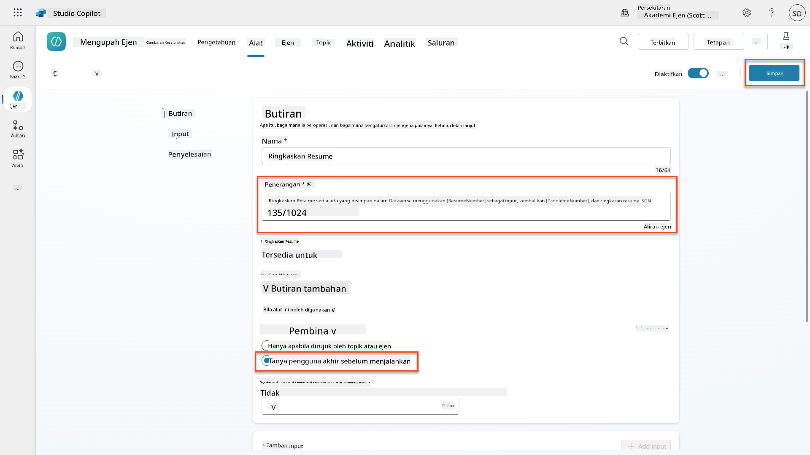

1. Jika anda memilih Tools dalam Hiring Agent, anda kini akan melihat kedua-dua alat kami menunjukkan bahawa ia boleh digunakan oleh **Application Intake Agent**.  
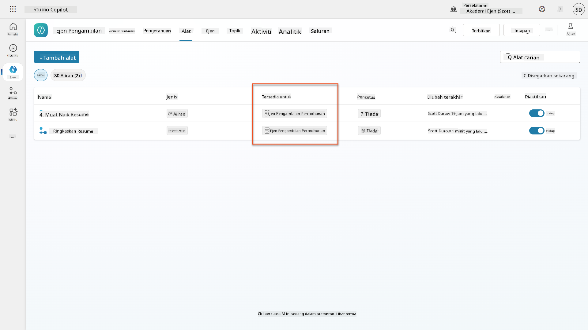

1. Navigasi ke arahan ejen **Application Intake Child**, dan ubah langkah **Post-Upload** kepada yang berikut:

    ```text
    2. Post-Upload Processing  
        - After uploading, be sure to also output the [ResumeNumber] in all messages
        - Pass [ResumeNumber] to /Summarize Resume  - Be sure to use the correct value that will start with the letter R.
        - Be sure to also output the [CandidateNumber] in all messages
        - Use the [ResumeSummary] to output a summary of the processed Resume and candidate
    ```

    Gantikan `/Ringkaskan Resume` dengan memasukkan rujukan kepada **Ringkaskan Resume agent flow** dengan menaip garis miring (`/)` atau memilih `/Ringkaskan` untuk memasukkan rujukan.  
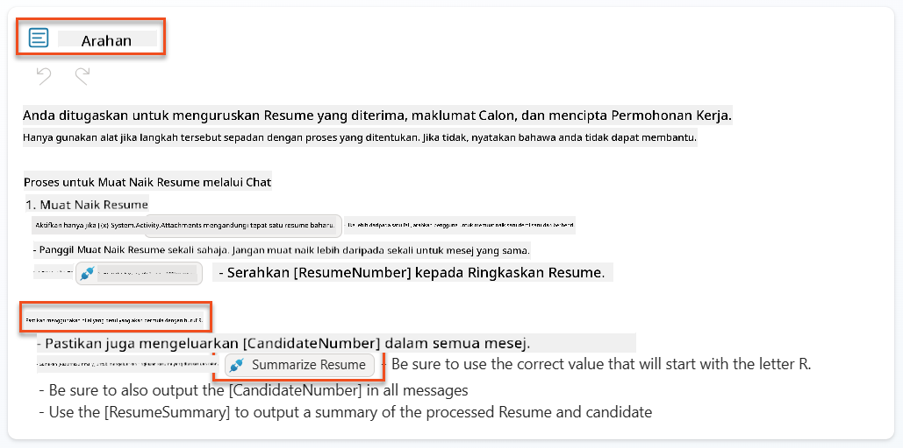

1. Pilih **Simpan**.

### 7.7 Uji ejen anda

Uji sistem multimodal lengkap anda untuk memastikan semuanya berfungsi dengan betul.

1. **Mulakan ujian**:

    - Pilih **Uji** untuk membuka panel ujian
    - Taip: `Ini adalah Resume calon`

    - Muat naik salah satu resume contoh dari [Test Resumes](https://download-directory.github.io/?url=https://github.com/microsoft/agent-academy/tree/main/operative/sample-data/resumes&filename=operative_sampledata)

1. **Sahkan hasil**:
    - Setelah anda menghantar mesej dan resume, periksa bahawa anda menerima Nombor Resume (format: R#####)
    - Sahkan anda mendapat Nombor Calon dan ringkasan
    - Gunakan peta aktiviti untuk melihat alat muat naik Resume dan alat Ringkaskan Resume berfungsi, dan output Prompt Ringkasan diterima oleh ejen:  
        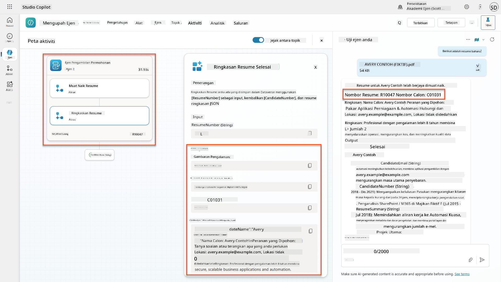

1. **Periksa ketahanan data**:
    - Navigasi ke [Power Apps](https://make.powerapps.com)
    - Buka **Apps** → **Hiring Hub** → **Play**
    - Pergi ke **Resumes** untuk mengesahkan resume telah dimuat naik dan diproses. Ia sepatutnya mempunyai maklumat ringkasan dan rekod calon yang berkaitan.
    - Periksa **Candidates** untuk melihat maklumat calon yang diekstrak  
        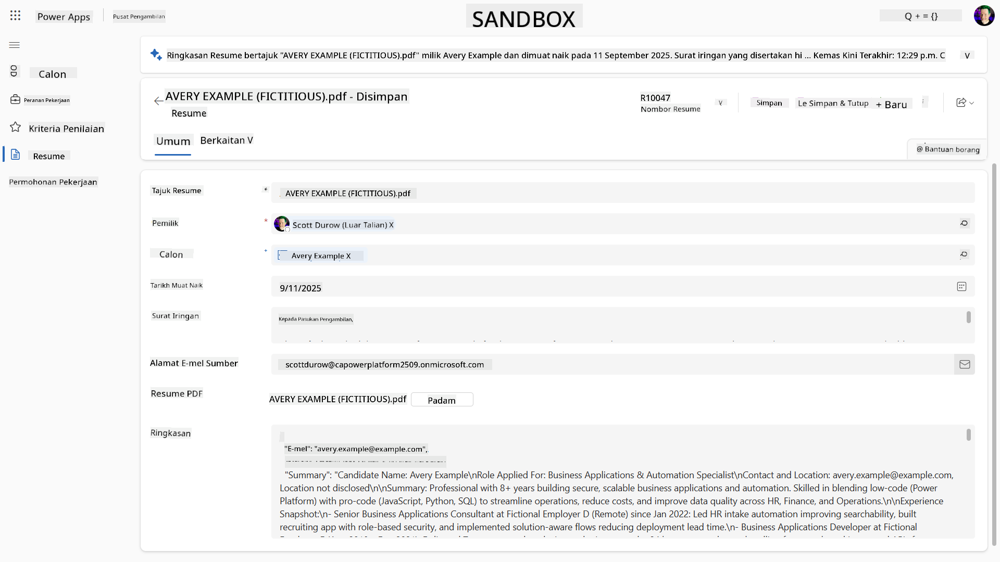
    - Apabila anda menjalankan proses sekali lagi, ia sepatutnya menggunakan Calon sedia ada (dipadankan dengan email yang diekstrak dari resume) dan bukannya mencipta yang baru.

!!! tip "Penyelesaian Masalah"
    - **Resume tidak diproses**: Pastikan fail adalah PDF dan di bawah had saiz
    - **Tiada calon dicipta**: Periksa bahawa email diekstrak dengan betul dari resume
    - **Kesalahan format JSON**: Sahkan arahan prompt anda termasuk struktur JSON yang tepat
    - **Kesalahan aliran**: Periksa bahawa semua sambungan Dataverse dan ekspresi dikonfigurasi dengan betul

### Kesediaan pengeluaran

Walaupun bukan sebahagian daripada misi ini, untuk menjadikan aliran ejen ini sedia untuk pengeluaran, anda mungkin juga mempertimbangkan perkara berikut:

1. **Pengendalian kesalahan** - Jika Nombor Resume tidak ditemui, atau prompt gagal menganalisis dokumen, pengendalian kesalahan harus ditambah untuk memberikan kesalahan yang jelas kepada ejen.
1. **Mengemas kini Calon sedia ada** - Calon ditemui menggunakan email, kemudian nama boleh dikemas kini untuk sepadan dengan yang ada pada resume.
1. **Memisahkan ringkasan Resume dan penciptaan Calon** - Fungsi ini boleh dipisahkan kepada aliran ejen yang lebih kecil untuk memudahkan penyelenggaraan, dan kemudian ejen diberikan arahan untuk menggunakannya secara bergilir.

## 🎉 Misi Selesai

Kerja yang hebat, Operative! **Dokumen Resume Recon** kini selesai. Anda telah berjaya menguasai prompt multimodal dan kini boleh mengekstrak data terstruktur dari mana-mana dokumen dengan tepat.

Inilah yang telah anda capai dalam misi ini:

**✅ Penguasaan prompt multimodal**  
Anda kini memahami apa itu prompt multimodal dan bila untuk menggunakan model AI yang berbeza untuk hasil yang optimum.

**✅ Kepakaran pemprosesan dokumen**  
Anda telah belajar untuk mengkonfigurasi prompt dengan input imej dan dokumen, dan memformat output sebagai JSON untuk pengekstrakan data terstruktur.

**✅ Sistem pengekstrakan resume**  
Anda telah membina sistem pengekstrakan resume lengkap yang memproses dokumen calon dan mengintegrasikannya dengan aliran kerja pengambilan pekerja anda.

**✅ Pelaksanaan amalan terbaik**  
Anda telah menerapkan amalan terbaik untuk kejuruteraan prompt dengan analisis dokumen dan mengintegrasikan prompt multimodal dengan Aliran Ejen.

**✅ Asas untuk pemprosesan lanjutan**  
Keupayaan analisis dokumen anda yang dipertingkatkan kini bersedia untuk ciri-ciri pengasas data lanjutan yang akan kita tambahkan dalam misi akan datang.

🚀 **Seterusnya:** Dalam Misi 08, anda akan menemui cara untuk meningkatkan prompt anda dengan data masa nyata dari Dataverse, mencipta penyelesaian AI dinamik yang menyesuaikan diri dengan keperluan perniagaan yang berubah.

⏩ [Bergerak ke Misi 08: Prompt yang dipertingkatkan dengan Dataverse grounding](../08-dataverse-grounding/README.md)

## 📚 Sumber Taktikal

📖 [Cipta prompt](https://learn.microsoft.com/ai-builder/create-a-custom-prompt?WT.mc_id=power-power-182762-scottdurow)

📖 [Tambah input teks, imej, atau dokumen kepada prompt anda](https://learn.microsoft.com/ai-builder/add-inputs-prompt?WT.mc_id=power-182762-scottdurow)

📖 [Proses respons dengan output JSON](https://learn.microsoft.com/ai-builder/process-responses-json-output?WT.mc_id=power-182762-scottdurow)

📖 [Pemilihan model dan tetapan suhu](https://learn.microsoft.com/ai-builder/prompt-modelsettings?WT.mc_id=power-182762-scottdurow)

📖 [Gunakan prompt anda dalam Power Automate](https://learn.microsoft.com/ai-builder/use-a-custom-prompt-in-flow?WT.mc_id=power-182762-scottdurow)

📺 [AI Builder: Output JSON dalam pembina prompt](https://www.youtube.com/watch?v=F0fGnWrRY_I)

---

**Penafian**:  
Dokumen ini telah diterjemahkan menggunakan perkhidmatan terjemahan AI [Co-op Translator](https://github.com/Azure/co-op-translator). Walaupun kami berusaha untuk ketepatan, sila ambil perhatian bahawa terjemahan automatik mungkin mengandungi kesilapan atau ketidaktepatan. Dokumen asal dalam bahasa asalnya harus dianggap sebagai sumber yang berwibawa. Untuk maklumat kritikal, terjemahan manusia profesional adalah disyorkan. Kami tidak bertanggungjawab atas sebarang salah faham atau salah tafsir yang timbul daripada penggunaan terjemahan ini.