<!--
CO_OP_TRANSLATOR_METADATA:
{
  "original_hash": "750f3ea8a94930439ebd8a10871b1d73",
  "translation_date": "2025-10-20T01:00:41+00:00",
  "source_file": "docs/operative-preview/08-dataverse-grounding/README.md",
  "language_code": "ms"
}
-->
# 🚨 Misi 08: Peningkatan arahan dengan asas Dataverse

--8<-- "disclaimer.md"

## 🕵️‍♂️ NAMA KOD: `OPERASI KAWALAN ASAS`

> **⏱️ Tempoh Operasi:** `~60 minit`

## 🎯 Ringkasan Misi

Selamat kembali, Operatif. Sistem pengambilan multi-ejen anda sudah beroperasi, tetapi terdapat peningkatan kritikal yang diperlukan untuk **asas data** - model AI anda memerlukan akses masa nyata kepada data berstruktur organisasi anda untuk membuat keputusan yang bijak.

Pada masa ini, arahan Ringkasan Resume anda beroperasi dengan pengetahuan statik. Tetapi bagaimana jika ia boleh mengakses pangkalan data peranan pekerjaan anda secara dinamik untuk memberikan padanan yang tepat dan terkini? Bagaimana jika ia memahami kriteria penilaian anda tanpa perlu anda kodkan secara manual?

Dalam misi ini, anda akan meningkatkan arahan tersuai anda dengan **asas Dataverse** - menghubungkan arahan anda secara langsung kepada sumber data langsung. Ini mengubah ejen anda daripada responden statik kepada sistem yang didorong data dinamik yang menyesuaikan diri dengan keperluan perniagaan yang berubah.

Misi anda: mengintegrasikan data peranan pekerjaan dan kriteria penilaian masa nyata ke dalam aliran analisis resume anda, mencipta sistem yang sentiasa dikemas kini dengan keperluan pengambilan organisasi anda.

## 🔎 Objektif

Dalam misi ini, anda akan belajar:

1. Bagaimana **asas Dataverse** meningkatkan arahan tersuai
1. Bila untuk menggunakan asas data berbanding arahan statik
1. Merancang arahan yang menggabungkan data langsung secara dinamik
1. Meningkatkan aliran Ringkasan Resume dengan padanan peranan pekerjaan

## 🧠 Memahami asas Dataverse untuk arahan

**Asas Dataverse** membolehkan arahan tersuai anda mengakses data langsung daripada jadual Dataverse semasa memproses permintaan. Daripada arahan statik, arahan anda boleh menggabungkan maklumat masa nyata untuk membuat keputusan yang bijak.

### Mengapa asas Dataverse penting

Arahan tradisional berfungsi dengan arahan tetap:

```text
Match this candidate to these job roles: Developer, Manager, Analyst
```

Dengan asas Dataverse, arahan anda mengakses data semasa:

```text
Match this candidate to available job roles from the Job Roles table, 
considering current evaluation criteria and requirements
```

Pendekatan ini memberikan beberapa manfaat utama:

- **Kemas kini dinamik:** Peranan pekerjaan dan kriteria berubah tanpa pengubahsuaian arahan
- **Konsistensi:** Semua ejen menggunakan sumber data semasa yang sama
- **Kebolehskalaan:** Peranan dan kriteria baru tersedia secara automatik
- **Ketepatan:** Data masa nyata memastikan keputusan mencerminkan keperluan semasa

### Bagaimana asas Dataverse berfungsi

Apabila anda mengaktifkan asas Dataverse untuk arahan tersuai:

1. **Pemilihan data:** Pilih jadual dan lajur Dataverse tertentu untuk disertakan. Anda juga boleh memilih jadual berkaitan yang akan ditapis oleh sistem berdasarkan rekod induk yang diperoleh.
1. **Suntikan konteks:** Arahan secara automatik menyertakan data yang diperoleh dalam konteks arahan
1. **Penapisan pintar:** Sistem hanya menyertakan data yang relevan dengan permintaan semasa jika anda memberikan sebarang penapisan.
1. **Output berstruktur:** Arahan anda boleh merujuk data yang diperoleh dan membuat keputusan berdasarkan rekod yang diperoleh untuk menghasilkan output.

### Dari statik ke dinamik: Kelebihan asas

Mari kita periksa aliran Ringkasan Resume semasa anda dari Misi 07 dan lihat bagaimana asas Dataverse mengubahnya daripada kecerdasan statik kepada dinamik.

**Pendekatan statik semasa:**
Arahan sedia ada anda termasuk kriteria penilaian yang dikodkan secara manual dan logik padanan yang telah ditentukan. Pendekatan ini berfungsi tetapi memerlukan kemas kini manual setiap kali anda menambah peranan pekerjaan baru, mengubah kriteria penilaian, atau mengubah keutamaan syarikat.

**Transformasi asas Dataverse:**
Dengan menambah asas Dataverse, aliran Ringkasan Resume anda akan:

- **Mengakses peranan pekerjaan semasa** daripada jadual Peranan Pekerjaan anda
- **Menggunakan kriteria penilaian langsung** dan bukannya penerangan statik  
- **Memberikan padanan yang tepat** berdasarkan keperluan masa nyata

## 🎯 Mengapa arahan khusus berbanding perbualan ejen

Dalam Misi 02, anda mengalami bagaimana Ejen Temuduga boleh memadankan calon dengan peranan pekerjaan, tetapi memerlukan arahan pengguna yang kompleks seperti:

```text
Upload this resume, then show me open job roles,
each with a description of the evaluation criteria, 
then use this to match the resume to at least one suitable
job role even if not a perfect match.
```

Walaupun ini berfungsi, arahan khusus dengan asas Dataverse menawarkan kelebihan yang ketara untuk tugas tertentu:

### Kelebihan utama arahan khusus

| Aspek | Perbualan Ejen | Arahan Khusus |
|--------|-------------------|------------------|
| **Konsistensi** | Hasil berbeza berdasarkan kemahiran pengguna dalam merangka arahan | Pemprosesan standard setiap masa |
| **Kepakaran** | Penalaran umum mungkin terlepas nuansa perniagaan | Dibina khas dengan logik perniagaan yang dioptimumkan |
| **Automasi** | Memerlukan interaksi dan tafsiran manusia | Dicetuskan secara automatik dengan output JSON berstruktur |

## 🧪 Makmal 8: Tambah asas Dataverse kepada arahan

Masa untuk meningkatkan keupayaan analisis resume anda! Anda akan meningkatkan aliran Ringkasan Resume sedia ada dengan padanan peranan pekerjaan dinamik.

### Prasyarat untuk melengkapkan misi ini

1. Anda perlu **sama ada**:

    - **Telah melengkapkan Misi 07** dan mempunyai sistem analisis resume anda sedia, **ATAU**
    - **Import penyelesaian permulaan Misi 08** jika anda bermula dari awal atau perlu mengejar. [Muat turun Penyelesaian Permulaan Misi 08](https://aka.ms/agent-academy)

1. Dokumen resume contoh daripada [Resumes ujian](https://download-directory.github.io/?url=https://github.com/microsoft/agent-academy/tree/main/operative/sample-data/resumes&filename=operative_sampledata)

!!! note "Import Penyelesaian dan Data Contoh"
    Jika anda menggunakan penyelesaian permulaan, rujuk [Misi 01](../01-get-started/README.md) untuk arahan terperinci tentang cara mengimport penyelesaian dan data contoh ke dalam persekitaran anda.

### 8.1 Tambah asas Dataverse kepada arahan anda

Anda akan membina arahan Ringkasan Resume yang anda buat dalam Misi 07. Pada masa ini ia hanya meringkaskan resume, tetapi kini anda akan mengasaskannya dengan peranan pekerjaan seperti yang wujud dalam Dataverse, menjadikannya sentiasa terkini.

Pertama, mari kita periksa jadual Dataverse yang akan anda gunakan sebagai asas:

1. **Navigasi** ke [Power Apps](https://make.powerapps.com) dan pilih persekitaran anda menggunakan **Penukar Persekitaran** di bahagian atas kanan bar navigasi.

1. Pilih **Jadual** dan cari jadual **Peranan Pekerjaan**

1. Semak lajur utama yang akan anda gunakan untuk asas:

    | Lajur | Tujuan |
    |--------|---------|
    | **Nombor Peranan Pekerjaan** | Pengenal unik untuk padanan peranan |
    | **Tajuk Pekerjaan** | Nama paparan untuk peranan |
    | **Penerangan** | Keperluan peranan terperinci |

1. Begitu juga, semak jadual lain seperti jadual **Kriteria Penilaian**.

### 8.2 Tambah data asas Dataverse kepada arahan anda

1. **Navigasi** ke Copilot Studio, dan pilih persekitaran anda menggunakan **Penukar Persekitaran** di bahagian atas kanan bar navigasi.

1. Pilih **Alat** dari navigasi sebelah kiri.

1. Pilih **Arahan** dan cari arahan **Ringkasan Resume** anda dari Misi 07.  
    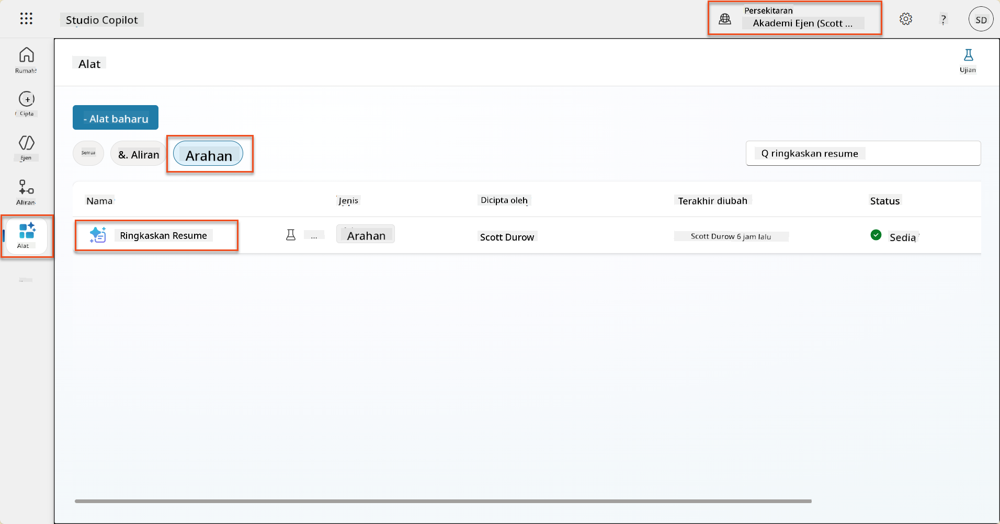

1. Pilih **Edit** untuk mengubah suai arahan, dan gantikan dengan versi yang dipertingkatkan di bawah:

    !!! important
        Pastikan parameter Resume dan Surat Lamaran kekal utuh sebagai parameter.

    ```text
    You are tasked with extracting key candidate information from a resume and cover letter to facilitate matching with open job roles and creating a summary for application review.
    
    ### Instructions:
    1. **Extract Candidate Details:**
       - Identify and extract the candidate's full name.
       - Extract contact information, specifically the email address.
    
    2. **Analyze Resume and Cover Letter:**
       - Review the resume content to identify relevant skills, experience, and qualifications.
       - Review the cover letter to understand the candidate's motivation and suitability for the roles.
    
    3. **Match Against Open Job Roles:**
       - Compare the extracted candidate information with the requirements and descriptions of the provided open job roles.
       - Use the job descriptions to assess potential fit.
       - Identify all roles that align with the candidate's cover letter and profile. You don't need to assess perfect suitability.
       - Provide reasoning for each match based on the specific job requirements.
    
    4. **Create Candidate Summary:**
       - Summarize the candidate's profile as multiline text with the following sections:
          - Candidate name
          - Role(s) applied for if present
          - Contact and location
          - One-paragraph summary
          - Top skills (8–10)
          - Experience snapshot (last 2–3 roles with outcomes)
          - Key projects (1–3 with metrics)
          - Education and certifications
          - Availability and work authorization
    
    ### Output Format
    
    Provide the output in valid JSON format with the following structure:
    
    {
      "CandidateName": "string",
      "Email": "string",
      "MatchedRoles": [
        {
          "JobRoleNumber": "ppa_jobrolenumber from grounded data",
          "RoleName": "ppa_jobtitle from grounded data",
          "Reasoning": "Detailed explanation based on job requirements"
        }
      ],
      "Summary": "string"
    }
    
    ### Guidelines
    
    - Extract information only from the provided resume and cover letter documents.
    - Ensure accuracy in identifying contact details.
    - Use the available job role data for matching decisions.
    - The summary should be concise but informative, suitable for quick application review.
    - If no suitable matches are found, indicate an empty list for MatchedRoles and explain briefly in the summary.
    
    ### Input Data
    Open Job Roles (ppa_jobrolenumber, ppa_jobtitle): /Job Role 
    Resume: {Resume}
    Cover Letter: {CoverLetter}
    ```

1. Dalam editor arahan, gantikan `/Peranan Pekerjaan` dengan memilih **+ Tambah kandungan**, memilih **Dataverse** → **Peranan Pekerjaan** dan pilih lajur berikut, kemudian pilih **Tambah**:

    1. **Nombor Peranan Pekerjaan**

    1. **Tajuk Pekerjaan**

    1. **Penerangan**

    !!! tip
        Anda boleh menaip nama jadual untuk mencari.

1. Dalam dialog **Peranan Pekerjaan**, pilih atribut **Penapis**, pilih **Status**, dan kemudian taip **Aktif** sebagai nilai **Penapis**.  
    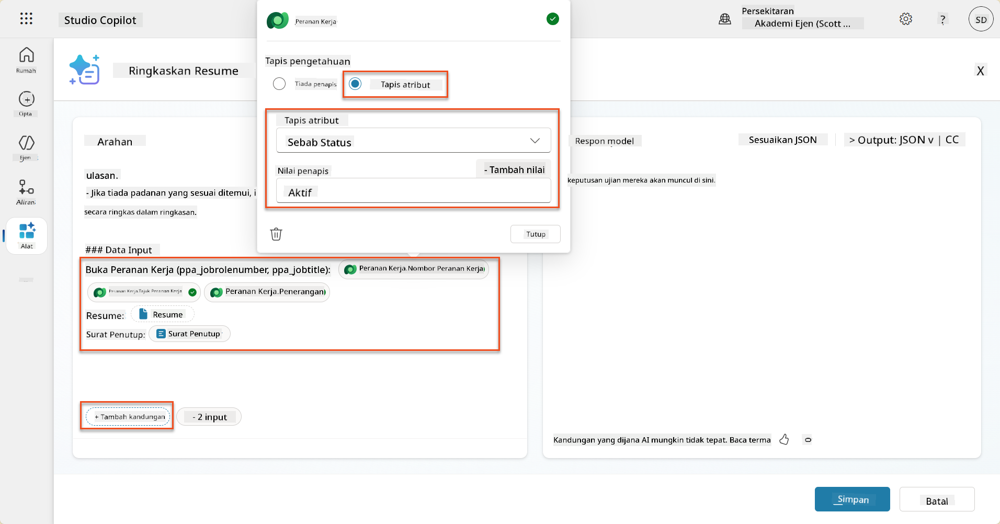

    !!! tip
        Anda boleh menggunakan **Tambah nilai** di sini untuk menambah parameter input juga - contohnya jika anda mempunyai arahan untuk meringkaskan rekod sedia ada, anda boleh memberikan Nombor Resume sebagai parameter untuk ditapis.

1. Seterusnya, anda akan menambah jadual Dataverse berkaitan **Kriteria Penilaian**, dengan sekali lagi memilih **+ Tambah kandungan**, mencari **Peranan Pekerjaan**, dan bukannya memilih lajur pada Peranan Pekerjaan, kembangkan **Peranan Pekerjaan (Kriteria Penilaian)** dan pilih lajur berikut, kemudian pilih **Tambah**:

    1. **Nama Kriteria**

    1. **Penerangan**  
        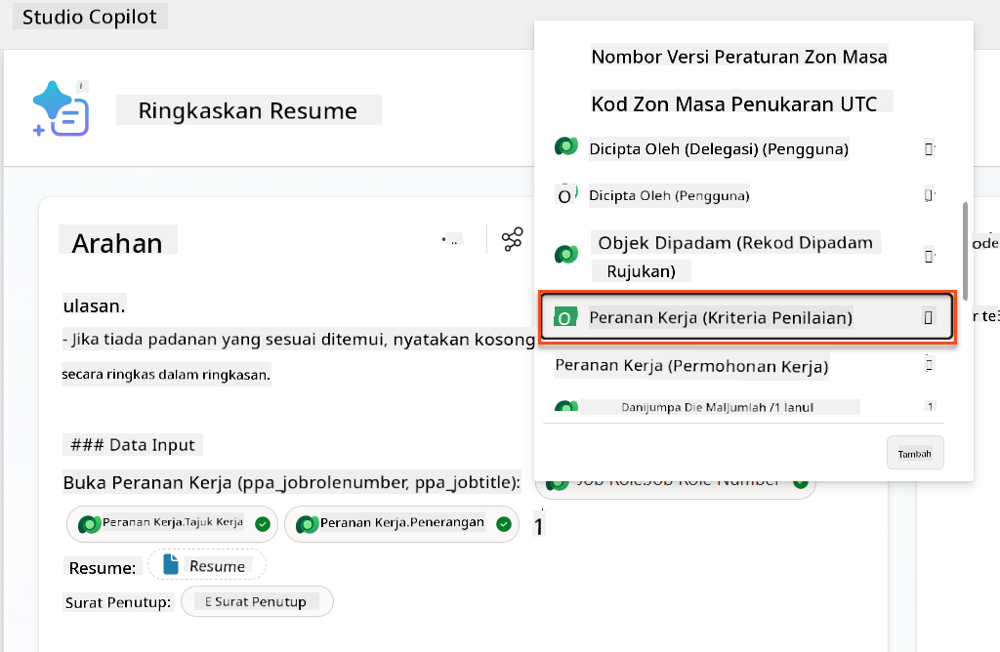

        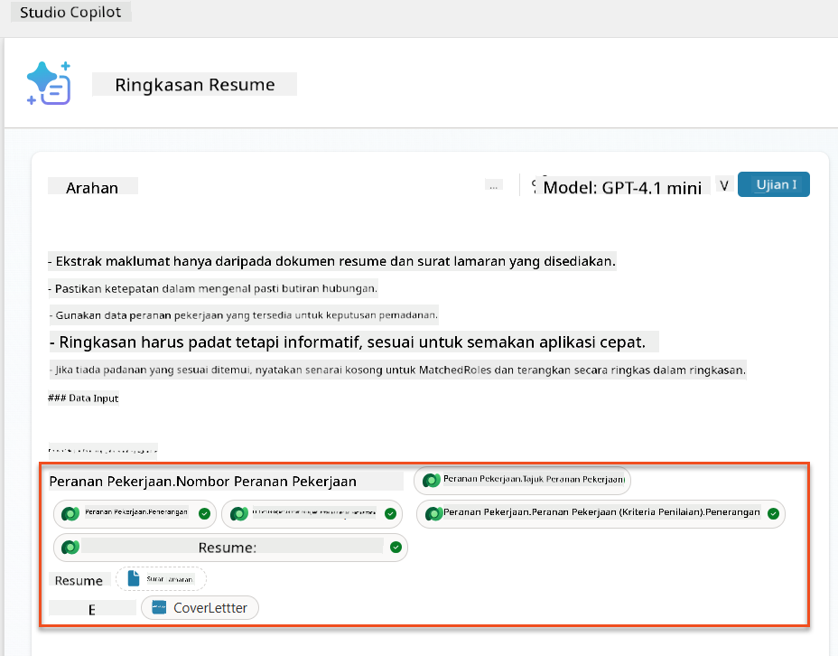

    !!! tip
        Adalah penting untuk memilih Kriteria Penilaian berkaitan dengan terlebih dahulu memilih Peranan Pekerjaan, dan kemudian menavigasi dalam menu ke Peranan Pekerjaan (Kriteria Penilaian). Ini akan memastikan bahawa hanya rekod berkaitan untuk Peranan Pekerjaan akan dimuatkan.

1. Pilih **Tetapan**, dan laraskan **Pengambilan Rekod** kepada 1000 - ini akan membolehkan maksimum Peranan Pekerjaan dan Kriteria Penilaian disertakan dalam arahan anda.  
    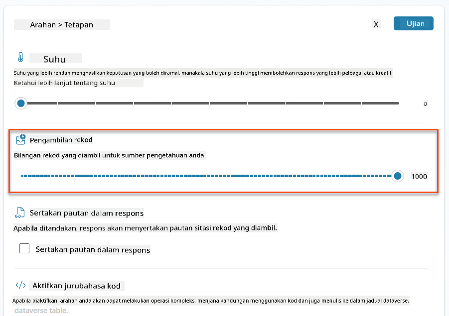

### 8.3 Uji arahan yang dipertingkatkan

1. Pilih parameter **Resume**, dan muat naik resume contoh yang anda gunakan dalam Misi 07.
1. Pilih **Uji**.
1. Setelah ujian dijalankan, perhatikan bahawa output JSON kini termasuk **Peranan yang Dipadankan**.
1. Pilih tab **Pengetahuan yang digunakan**, untuk melihat data Dataverse yang digabungkan dengan arahan anda sebelum pelaksanaan.
1. **Simpan** arahan yang dikemas kini anda. Sistem kini akan secara automatik menyertakan data Dataverse ini dengan arahan anda apabila aliran Ejen Ringkasan Resume sedia ada memanggilnya.  
    

### 8.4 Tambah Aliran Ejen Permohonan Pekerjaan

Untuk membolehkan Ejen Pengambilan Permohonan kami mencipta Peranan Pekerjaan berdasarkan peranan yang disarankan, kita perlu mencipta Aliran Ejen. Ejen akan memanggil alat ini untuk setiap peranan pekerjaan yang dicadangkan yang diminati oleh calon.

!!! tip "Ekspresi Aliran Ejen"
    Adalah sangat penting bahawa anda mengikuti arahan untuk menamakan nod anda dan memasukkan ekspresi dengan tepat kerana ekspresi merujuk kepada nod sebelumnya menggunakan nama mereka! Rujuk misi [Aliran Ejen dalam Pengambilan](../../recruit/09-add-an-agent-flow/README.md#you-mentioned-expressions-what-are-expressions) untuk penyegaran cepat!

1. Di dalam **Ejen Pengambilan,** pilih tab **Ejen**, dan buka ejen anak **Ejen Pengambilan Permohonan**.

1. Di dalam panel **Alat**, pilih **+ Tambah** → **+ Alat baru** → **Aliran Ejen**

1. Pilih nod **Apabila ejen memanggil aliran**, gunakan **+ Tambah input** untuk menambah parameter berikut:

    | Jenis | Nama            | Penerangan                                                  |
    | ---- | --------------- | ------------------------------------------------------------ |
    | Teks | `ResumeNumber`  | Pastikan hanya menggunakan [ResumeNumber] - ia MESTI bermula dengan huruf R |
    | Teks | `JobRoleNumber` | Pastikan hanya menggunakan [JobRoleNumber] - ia MESTI bermula dengan huruf J |

    

1. Pilih ikon **+** Masukkan tindakan di bawah nod pertama, cari **Dataverse**, pilih **Lihat lebih banyak**, dan kemudian cari tindakan **Senarai baris**.

1. **Namakan semula** nod sebagai `Get Resume`, dan kemudian tetapkan parameter berikut:

    | Harta        | Cara Tetapkan                      | Nilai                                                        |
    | --------------- | ------------------------------- | ------------------------------------------------------------ |
    | **Nama jadual**  | Pilih                          | Resumes                                                      |
    | **Penapis baris** | Data dinamik (ikon kilat) | `ppa_resumenumber eq 'ResumeNumber'` Pilih dan gantikan **ResumeNumber** dengan **Apabila ejen memanggil aliran** → **ResumeNumber** |
    | **Bilangan baris**   | Masukkan                           | 1                                                            |

    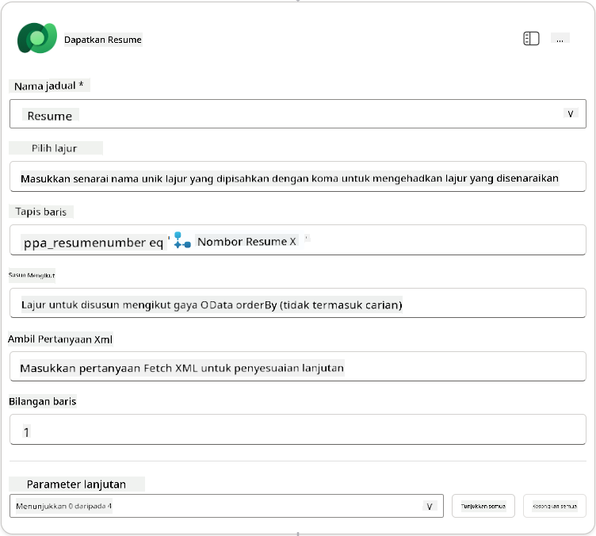

1. Sekarang, pilih ikon **+** Masukkan tindakan di bawah **Get Resume**, cari **Dataverse**, pilih **Lihat lebih banyak**, dan kemudian cari tindakan **Senarai baris**.

1. **Namakan semula** nod sebagai `Get Job Role`, dan kemudian tetapkan parameter berikut:

    | Harta        | Cara Tetapkan                      | Nilai                                                        |
    | --------------- | ------------------------------- | ------------------------------------------------------------ |
    | **Nama jadual**  | Pilih                          | Peranan Pekerjaan                                                    |
    | **Penapis baris** | Data dinamik (ikon kilat) | `ppa_jobrolenumber eq 'JobRoleNumber'` Pilih dan gantikan **JobRoleNumber** dengan **Apabila ejen memanggil aliran** → **JobRoleNumber** |
    | **Bilangan baris**   | Masukkan                           | 1                                                            |

    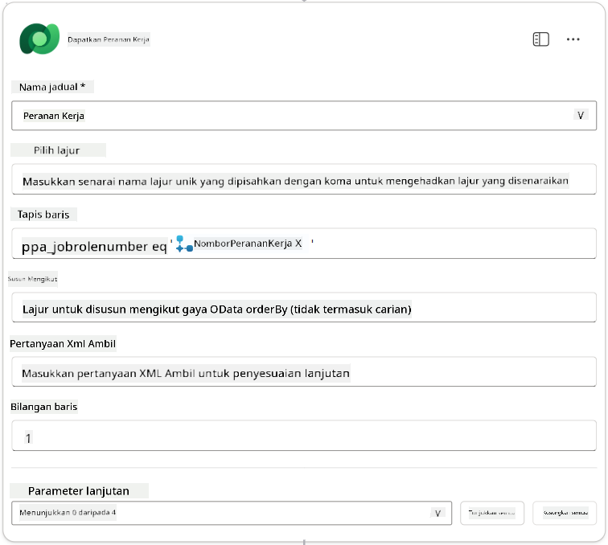

1. Sekarang, pilih ikon **+** Masukkan tindakan di bawah Get Job Role, cari **Dataverse**, pilih **Lihat lebih banyak**, dan kemudian cari tindakan **Tambah baris baru**.

1. **Namakan semula** nod sebagai `Add Application`, dan kemudian tetapkan parameter berikut:

    | Harta                           | Cara Tetapkan           | Nilai                                                        |
    | ---------------------------------- | -------------------- | ------------------------------------------------------------ |
    | **Nama jadual**                     | Pilih               | Permohonan Pekerjaan                                             |
    | **Calon (Calon)**             | Ekspresi (ikon fx) | `concat('ppa_candidates/',first(outputs('Get_Resume')?['body/value'])?['_ppa_candidate_value'])` |
| **Peranan Pekerjaan (Job Roles)**         | Ekspresi (ikon fx)    | `concat('ppa_jobroles/',first(outputs('Get_Job_Role')?['body/value'])?['ppa_jobroleid'])` |
| **Resume (Resumes)**                      | Ekspresi (ikon fx)    | `concat('ppa_resumes/', first(outputs('Get_Resume')?['body/value'])?['ppa_resumeid'])` |
| **Tarikh Permohonan** (gunakan **Tunjukkan semua**) | Ekspresi (ikon fx) | `utcNow()`                                                   |

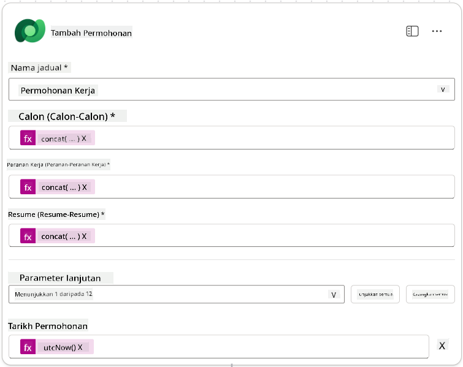

1. Pilih **Respond to the agent node**, kemudian pilih **+ Tambah output**

     | Properti         | Cara Tetapkan                  | Butiran                                        |
     | ---------------- | ------------------------------ | ---------------------------------------------- |
     | **Jenis**        | Pilih                         | `Text`                                         |
     | **Nama**         | Masukkan                      | `ApplicationNumber`                            |
     | **Nilai**        | Data dinamik (ikon kilat)      | *Tambah Permohonan → Lihat Lagi → Nombor Permohonan* |
     | **Deskripsi**    | Masukkan                      | `Nombor [ApplicationNumber] bagi Permohonan Pekerjaan yang dibuat` |

     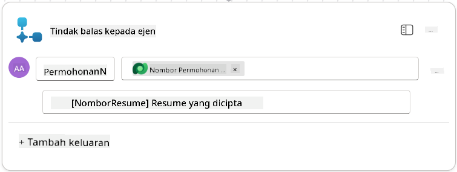

1. Pilih **Simpan draf** di bahagian kanan atas

1. Pilih tab **Gambaran Keseluruhan**, kemudian pilih **Edit** pada panel **Butiran**

      - **Nama Aliran**:`Create Job Application`
      - **Deskripsi**:`Membuat permohonan pekerjaan baru apabila diberikan [ResumeNumber] dan [JobRoleNumber]`
      - **Simpan**

1. Pilih tab **Designer** sekali lagi, dan pilih **Terbitkan**.

### 8.5 Tambah Create Job Application kepada ejen

Sekarang anda akan menghubungkan aliran yang diterbitkan kepada Ejen Pengambilan Permohonan anda.

1. Kembali ke **Hiring Agent** dan pilih tab **Agents**. Buka **Application Intake Agent**, kemudian cari panel **Tools**.

1. Pilih **+ Tambah**

1. Pilih penapis **Flow**, dan cari `Create Job Application`. Pilih aliran **Create Job Application**, kemudian **Tambah dan konfigurasikan**.

1. Tetapkan parameter berikut:

    | Parameter                                           | Nilai                                                        |
    | --------------------------------------------------- | ------------------------------------------------------------ |
    | **Deskripsi**                                       | `Membuat permohonan pekerjaan baru apabila diberikan [ResumeNumber] dan [JobRoleNumber]` |
    | **Butiran tambahan → Bila alat ini boleh digunakan** | `Hanya apabila dirujuk oleh topik atau ejen`                 |

1. Pilih **Simpan**  
    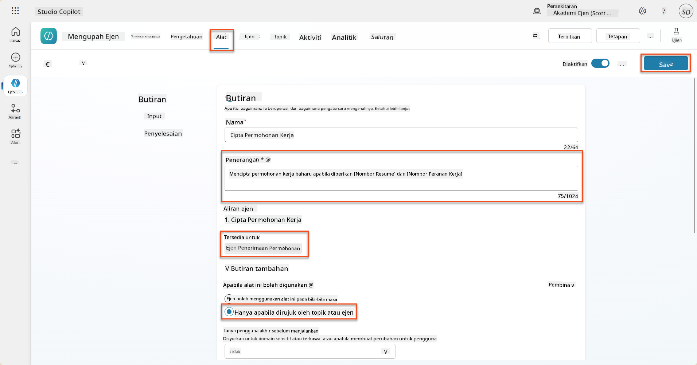

### 8.6 Tetapkan arahan ejen

Untuk membuat permohonan pekerjaan, anda perlu memberitahu ejen bila menggunakan alat baru. Dalam kes ini, anda akan meminta pengguna mengesahkan peranan pekerjaan yang disarankan untuk memohon, dan mengarahkan ejen untuk menjalankan alat bagi setiap peranan.

1. Kembali ke **Application Intake Agent**, kemudian cari panel **Instructions**.

1. Dalam medan **Instructions**, **tambah** panduan yang jelas berikut untuk ejen anak anda di **akhir arahan sedia ada**:

    ```text
    3. Post Resume Upload
       - Respond with a formatted bullet list of [SuggestedJobRoles] the candidate could apply for.  
       - Use the format: [JobRoleNumber] - [RoleDescription]
       - Ask the user to confirm which Job Roles to create applications for the candidate.
       - When the user has confirmed a set of [JobRoleNumber]s, move to the next step.
    
    4. Post Upload - Application Creation
        - After the user confirms which [SuggestedJobRoles] for a specific [ResumeNumber]:
        E.g. "Apply [ResumeNumber] for the Job Roles [JobRoleNumber], [JobRoleNumber], [JobRoleNumber]
        E.g. "apply to all suggested job roles" - this implies use all the [JobRoleNumbers] 
         - Loop over each [JobRoleNumber] and send with [ResumeNumber] to /Create Job Application   
         - Summarize the Job Applications Created
    
    Strict Rules (that must never be broken)
    You must always follow these rules and never break them:
    1. The only valid identifiers are:
      - ResumeNumber (ppa_resumenumber)→ format R#####
      - CandidateNumber (ppa_candidatenumber)→ format C#####
      - ApplicationNumber (ppa_applicationnumber)→ format A#####
      - JobRoleNumber (ppa_jobrolenumber)→ format J#####
    2. Never guess or invent these values.
    3. Always extract identifiers from the current context (conversation, data, or system output). 
    ```

1. Di mana arahan termasuk garis miring (/), pilih teks selepas / dan pilih alat **Create Job Application**.

1. Pilih **Simpan**  
    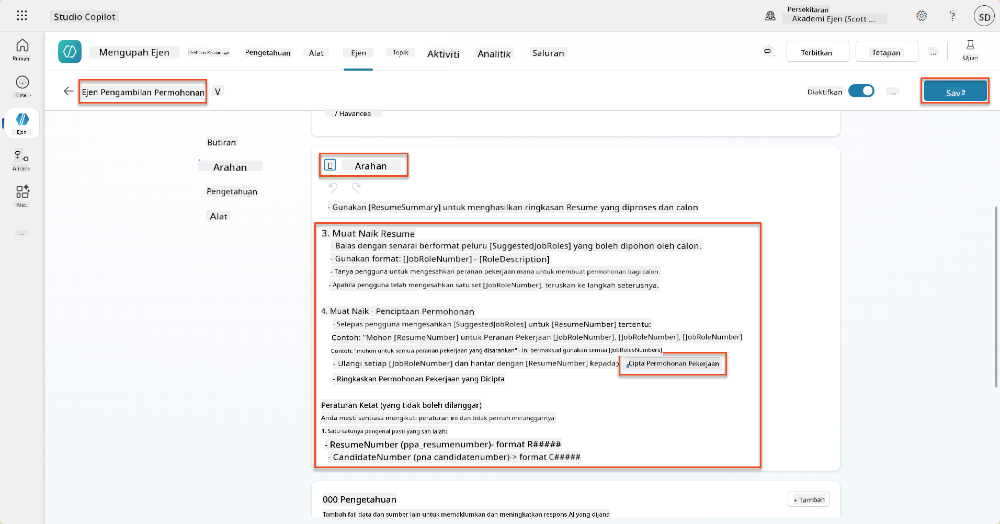

!!! tip "Iterasi ke atas pelbagai item dalam Generative Orchestration"
    Arahan ini menggunakan keupayaan generative orchestration untuk mengulangi pelbagai baris apabila membuat keputusan tentang langkah dan alat yang hendak digunakan. Peranan Pekerjaan yang Dipadankan akan dibaca secara automatik dan Ejen Pengambilan Permohonan akan dijalankan untuk setiap baris. Selamat datang ke dunia ajaib generative orchestration!

### 8.7 Uji ejen anda

1. Buka **Hiring Agent** anda di Copilot Studio.

1. **Muat naik** resume contoh ke dalam chat, dan taip:

    ```text
    This is a new resume for the Power Platform Developer Role.
    ```

1. Perhatikan bagaimana ejen memberikan senarai Peranan Pekerjaan yang Disarankan - setiap satu dengan nombor Peranan Pekerjaan.  
    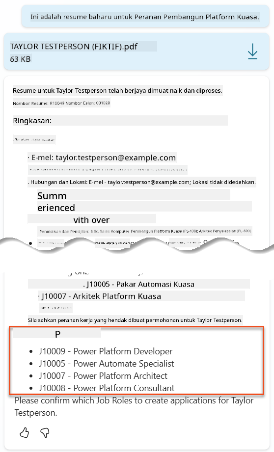

1. Anda kemudian boleh memberikan peranan mana yang anda ingin tambahkan Resume sebagai permohonan pekerjaan.
    **Contoh:**

    ```text
    "Apply for all of those job roles"
    "Apply for the J10009 Power Platform Developer role"
    "Apply for the Developer and Architect roles"
    ```

    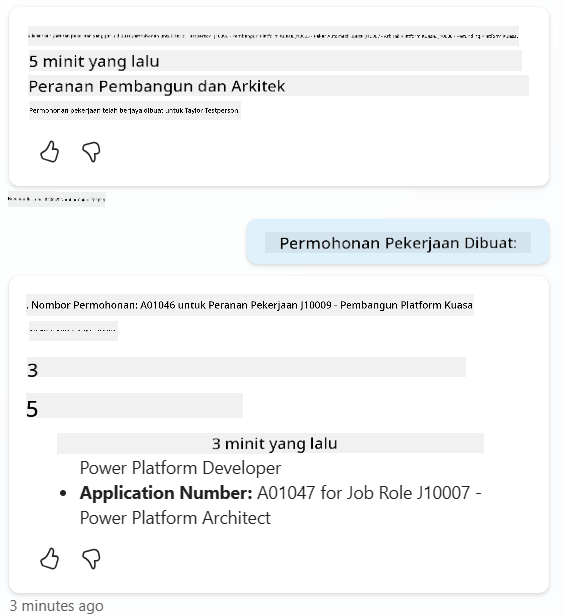

1. Alat **Create Job Application** kemudian akan dijalankan untuk setiap peranan pekerjaan yang anda tentukan. Di dalam peta Aktiviti, anda akan melihat alat Create Job Application dijalankan untuk setiap Peranan Pekerjaan yang anda minta untuk membuat permohonan:  
    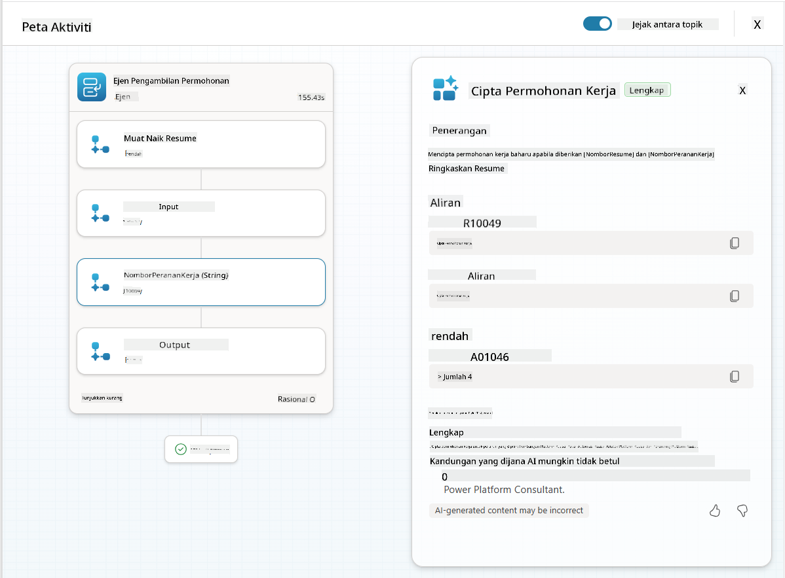

## 🎉 Misi Selesai

Kerja yang cemerlang, Operatif! **Operation Grounding Control** kini selesai. Anda telah berjaya meningkatkan keupayaan AI anda dengan data dinamik, mencipta sistem pengambilan pekerja yang benar-benar pintar.

Inilah yang telah anda capai dalam misi ini:

**✅ Penguasaan grounding Dataverse**  
Anda kini memahami cara menghubungkan prompt tersuai kepada sumber data langsung untuk kecerdasan dinamik.

**✅ Analisis resume yang dipertingkatkan**  
Aliran Summarize Resume anda kini mengakses data peranan pekerjaan masa nyata dan kriteria penilaian untuk pemadanan yang tepat.

**✅ Pengambilan keputusan berdasarkan data**  
Ejen pengambilan anda kini boleh menyesuaikan diri secara automatik dengan keperluan pekerjaan yang berubah tanpa kemas kini prompt manual.

**✅ Penciptaan Permohonan Pekerjaan**  
Sistem anda yang dipertingkatkan kini boleh membuat Permohonan Pekerjaan dan bersedia untuk orkestrasi aliran kerja yang lebih kompleks.

🚀 **Seterusnya:** Dalam misi anda yang seterusnya, anda akan belajar cara melaksanakan keupayaan penalaran mendalam yang membantu ejen anda membuat keputusan yang kompleks dan memberikan penjelasan terperinci untuk cadangan mereka.

⏩ [Bergerak ke Misi 09: Penalaran mendalam](../09-deep-reasoning/README.md)

## 📚 Sumber Taktikal

📖 [Gunakan data anda sendiri dalam prompt](https://learn.microsoft.com/ai-builder/use-your-own-prompt-data?WT.mc_id=power-182762-scottdurow)

📖 [Buat prompt tersuai](https://learn.microsoft.com/ai-builder/create-a-custom-prompt?WT.mc_id=power-182762-scottdurow)

📖 [Bekerja dengan Dataverse dalam Copilot Studio](https://learn.microsoft.com/microsoft-copilot-studio/knowledge-add-dataverse?WT.mc_id=power-182762-scottdurow)

📖 [Gambaran keseluruhan prompt tersuai AI Builder](https://learn.microsoft.com/ai-builder/prompts-overview?WT.mc_id=power-182762-scottdurow)

📖 [Dokumentasi AI Builder Power Platform](https://learn.microsoft.com/ai-builder/?WT.mc_id=power-182762-scottdurow)

📖 [Latihan: Buat prompt AI Builder menggunakan data Dataverse anda sendiri](https://learn.microsoft.com/training/modules/ai-builder-grounded-prompts/?WT.mc_id=power-182762-scottdurow)

---

**Penafian**:  
Dokumen ini telah diterjemahkan menggunakan perkhidmatan terjemahan AI [Co-op Translator](https://github.com/Azure/co-op-translator). Walaupun kami berusaha untuk ketepatan, sila ambil perhatian bahawa terjemahan automatik mungkin mengandungi kesilapan atau ketidaktepatan. Dokumen asal dalam bahasa asalnya harus dianggap sebagai sumber yang berwibawa. Untuk maklumat kritikal, terjemahan manusia profesional adalah disyorkan. Kami tidak bertanggungjawab atas sebarang salah faham atau salah tafsir yang timbul daripada penggunaan terjemahan ini.