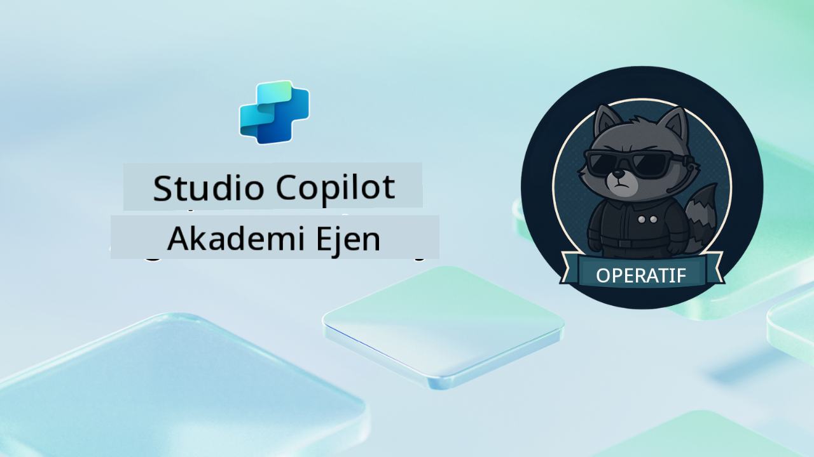

<!--
CO_OP_TRANSLATOR_METADATA:
{
  "original_hash": "24fcbe9a57d3439e05f8866e550c0a84",
  "translation_date": "2025-10-20T00:58:51+00:00",
  "source_file": "docs/operative-preview/README.md",
  "language_code": "ms"
}
-->
# Selamat Datang Operatif

**Selamat datang, Operatif.**  
Misi canggih anda—jika anda memilih untuk menerimanya—adalah untuk menguasai seni membina **sistem multi-agen bertaraf perusahaan** menggunakan **Microsoft Copilot Studio**.

Latihan intensif ini akan membawa anda melangkaui penciptaan agen asas ke dunia yang lebih canggih iaitu **orkestrasi multi-agen**: daripada automasi pengambilan pekerja hingga keselamatan AI, anda akan belajar membina, menyelaraskan, dan melancarkan ekosistem agen pintar menggunakan senario perusahaan sebenar.

--8<-- "disclaimer.md"

---

## 🎯 Objektif Misi

Dengan menyelesaikan program Agent Academy Operative, anda akan dapat:

- Merancang dan melaksanakan **sistem multi-agen** untuk senario perniagaan yang kompleks
- Menguasai **orkestrasi agen** dan corak kolaborasi
- Melaksanakan **keselamatan AI dan moderasi kandungan** dalam sistem pengeluaran
- Membina **arahan multi-modal** untuk pemprosesan dan analisis dokumen
- Melancarkan **agen bersedia untuk perusahaan** dengan tadbir urus dan ujian yang betul

---

## 🧪 Prasyarat

Untuk menyelesaikan semua misi, anda memerlukan:

- Menyelesaikan latihan **Agent Academy Recruit**
- Persekitaran Microsoft Power Platform dengan lesen **Copilot Studio**
- Akses kepada **Microsoft Dataverse**
- Kebenaran pentadbiran untuk mencipta penyelesaian dan agen

---

## 🧬 Siapa Yang Sesuai

Kursus lanjutan ini sesuai untuk:

- **Arkitek penyelesaian** yang merancang sistem AI perusahaan
- **Pembangun** yang membina penyelesaian agen bersedia untuk pengeluaran
- **Profesional IT** yang melaksanakan tadbir urus dan keselamatan AI
- **Penganalisis perniagaan** yang mencipta aliran kerja automasi yang kompleks
- Sesiapa yang bersedia untuk **meningkatkan tahap** daripada agen asas ke sistem perusahaan

---

## 🧭 Gambaran Keseluruhan Kurikulum

Akademi ini disusun sebagai siri operasi lapangan yang progresif—setiap misi membina misi sebelumnya untuk mencipta sistem automasi pengambilan pekerja yang komprehensif.

| Misi | Tajuk | Taklimat Operasi |
|------|-------|------------------|
| `01` | 🚨 [Memulakan dengan Agen Pengambilan](./01-get-started/README.md) | Melancarkan infrastruktur asas dan mencipta agen pengatur utama anda |
| `02` | 🎭 [Menjadikan agen anda bersedia untuk multi-agen dengan agen yang bersambung](./02-multi-agent/README.md) | Mengubah agen tunggal menjadi sistem multi-agen yang diselaraskan |
| `03` | ⚡ [Automasi agen anda dengan Triggers](./03-automate-triggers/README.md) | Melaksanakan tingkah laku agen autonomi dengan triggers berasaskan acara |
| `04` | 📝 [Menulis Arahan Agen](./04-agent-instructions/README.md) | Menguasai komunikasi agen yang tepat dan kawalan tingkah laku |
| `05` | 💬 [Memperibadikan Respons Agen](./05-agent-responses/README.md) | Menyesuaikan respons agen untuk impak dan penglibatan maksimum |
| `06` | 🛡️ [Moderasi Kandungan dan Asas Keselamatan AI](./06-ai-safety/README.md) | Melaksanakan langkah keselamatan dan pematuhan bertaraf perusahaan |
| `07` | 🎨 [Mengekstrak Kandungan Resume dengan Arahan Multi-Modal](./07-multimodal-prompts/README.md) | Memproses dokumen dan imej dengan keupayaan AI yang canggih |
| `08` | 🗄️ [Arahan - Dasar Dataverse](./08-dataverse-grounding/README.md) | Menyandarkan agen dalam data perusahaan untuk respons yang tepat |
| `09` | 🧠 [Mengaplikasikan Penalaran Mendalam untuk Menilai Kesesuaian Calon dan Persediaan Temuduga](./09-deep-reasoning/README.md) | Melaksanakan penalaran AI yang canggih untuk keputusan yang kompleks |
| `10` | 📄 [Menjana Dokumen Temuduga Khusus Calon dengan Arahan](./10-generate-documents/README.md) | Mencipta dokumen dinamik berdasarkan analisis agen |
| `11` | 📊 [Mendapatkan Maklum Balas Pengguna dengan Kad Adaptif](./11-obtain-user-feedback/README.md) | Mengumpul dan memproses maklum balas pengguna untuk penambahbaikan berterusan |
| `12` | 🌐 [Menerbitkan Agen Anda ke Laman Web Demo untuk Ujian Pemegang Kepentingan](./12-demo-website/README.md) | Melancarkan penyelesaian lengkap untuk demonstrasi dan ujian pemegang kepentingan |

!!! note
    ✅ Menyelesaikan kurikulum ini akan memberikan anda lencana **Operatif**.  
    🔓 **Commander** akan dibuka pada fasa akan datang.

<!-- markdownlint-disable-next-line MD033 -->

---

**Penafian**:  
Dokumen ini telah diterjemahkan menggunakan perkhidmatan terjemahan AI [Co-op Translator](https://github.com/Azure/co-op-translator). Walaupun kami berusaha untuk ketepatan, sila ambil perhatian bahawa terjemahan automatik mungkin mengandungi kesilapan atau ketidaktepatan. Dokumen asal dalam bahasa asalnya harus dianggap sebagai sumber yang berwibawa. Untuk maklumat penting, terjemahan manusia profesional adalah disyorkan. Kami tidak bertanggungjawab atas sebarang salah faham atau salah tafsir yang timbul daripada penggunaan terjemahan ini.