<!--
CO_OP_TRANSLATOR_METADATA:
{
  "original_hash": "d9cd8cd1a4fbd8915171a2ed972cc322",
  "translation_date": "2025-10-20T00:38:51+00:00",
  "source_file": "docs/recruit/00-course-setup/README.md",
  "language_code": "ms"
}
-->
# 🚨 Misi 00: Persediaan Kursus

## 🕵️‍♂️ NAMA KOD: `OPERASI SIAP SEDIA PELANCARAN`

> **⏱️ Tempoh Operasi:** `~30 minit`  

## 🎯 Ringkasan Misi

Selamat datang ke misi pertama dalam latihan anda sebagai Ejen Copilot Studio.  
Sebelum anda boleh mula membina ejen AI pertama anda, anda perlu menyediakan **persekitaran pembangunan yang sedia untuk digunakan**.

Ringkasan ini menerangkan sistem, kelayakan akses, dan langkah-langkah persediaan yang diperlukan untuk beroperasi dengan jayanya dalam ekosistem Microsoft 365.

## 🔎 Objektif

Misi anda termasuk:

1. Mendapatkan akaun Microsoft 365  
1. Mendapat akses ke Microsoft Copilot Studio  
1. (Pilihan) Mendapatkan lesen Microsoft 365 Copilot untuk penerbitan produksi
1. Mewujudkan persekitaran pembangun sebagai persekitaran Copilot Studio anda untuk membina  
1. Mewujudkan laman SharePoint untuk digunakan sebagai sumber data anda dalam misi seterusnya

---

## 🔍 Prasyarat

Sebelum anda bermula, pastikan anda mempunyai:

1. **Alamat e-mel kerja atau sekolah** (e-mel peribadi seperti @outlook.com, @gmail.com, dll., tidak disokong).
1. Akses kepada internet dan pelayar moden (Edge, Chrome, atau Firefox disyorkan).  
1. Pengetahuan asas tentang Microsoft 365 (contohnya, log masuk ke aplikasi Office atau Teams).  
1. (Pilihan) Kad kredit atau kaedah pembayaran jika anda bercadang untuk membeli lesen berbayar.

---

## Langkah 1: Dapatkan Akaun Microsoft 365

Copilot Studio terletak dalam Microsoft 365, jadi anda memerlukan akaun Microsoft 365 untuk mengaksesnya. Anda boleh menggunakan akaun sedia ada jika anda sudah memilikinya atau ikuti langkah-langkah ini untuk mendapatkan lesen yang sesuai:

1. **Dapatkan Langganan Perniagaan Microsoft 365 Berbayar**  
   1. Pergi ke [Halaman Pelan dan Harga Microsoft 365 Business](https://www.microsoft.com/microsoft-365/business/microsoft-365-plans-and-pricing)
   1. Pilihan termurah untuk memulakan adalah pelan Microsoft 365 Business Basic. Pilih `Cuba secara percuma` dan ikuti borang panduan untuk mengisi butiran langganan, akaun, dan maklumat pembayaran anda.
   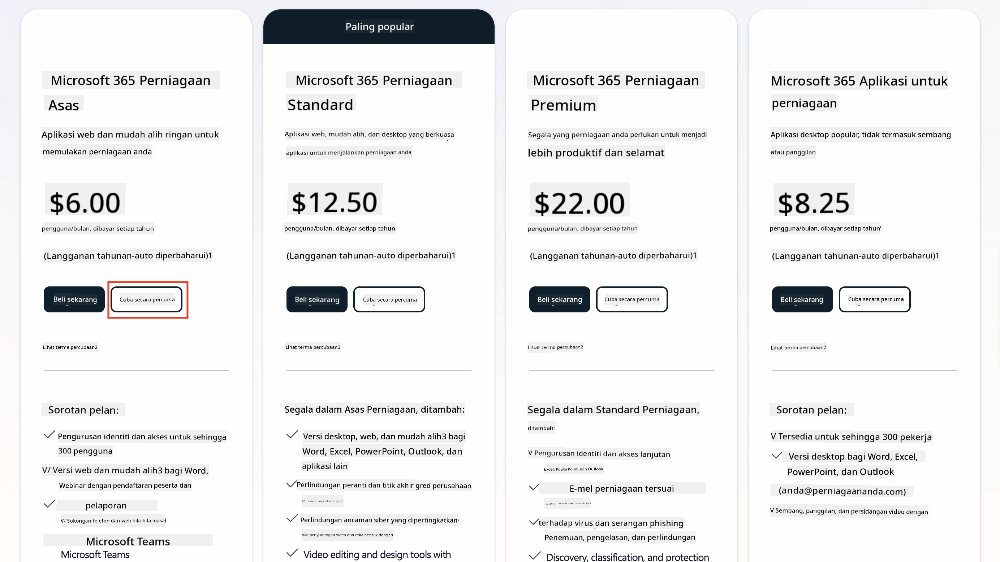
   1. Setelah anda mempunyai akaun baru, log masuk.

    !!! Tip
        Jika anda bercadang untuk menerbitkan ejen ke dalam Microsoft 365 Copilot Chat atau menyambung ke data organisasi (SharePoint, OneDrive, Dataverse), lesen Microsoft 365 Copilot diperlukan. Ini adalah lesen tambahan yang boleh anda pelajari lebih lanjut [di laman web lesen](https://www.microsoft.com/microsoft-365/copilot#plans)

---

## Langkah 2: Mulakan Percubaan Copilot Studio

Setelah anda mempunyai Tenant Microsoft 365, anda perlu mendapatkan akses ke Copilot Studio. Anda boleh mendapatkan percubaan percuma selama 30 hari dengan mengikuti langkah-langkah ini:

1. Navigasi ke [aka.ms/TryCopilotStudio](https://aka.ms/TryCopilotStudio).  
1. Masukkan alamat e-mel dari akaun baru yang anda konfigurasikan dalam langkah sebelumnya dan pilih `Seterusnya`.  
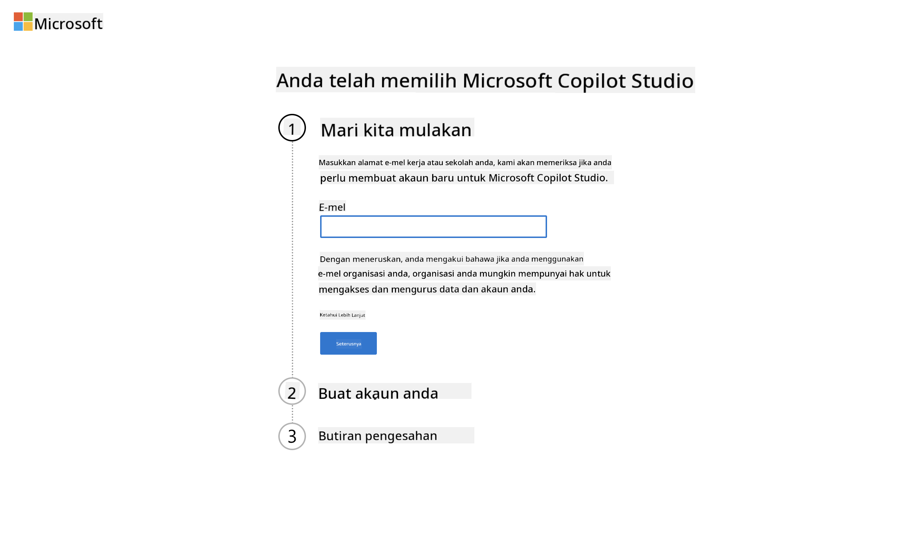
1. Ia akan mengenali akaun anda. Pilih `Log Masuk`.
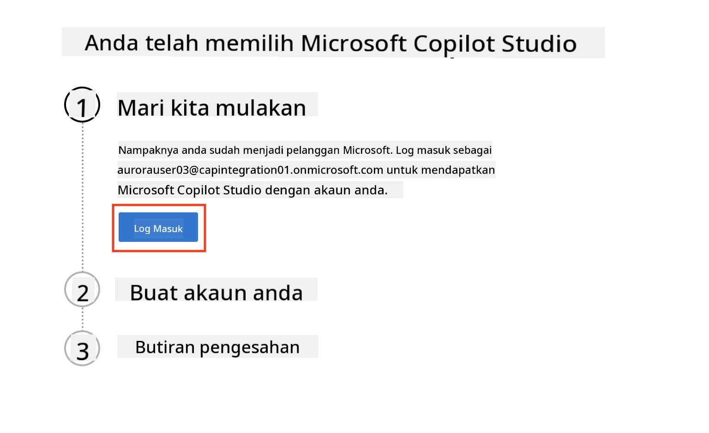  
1. Pilih `Mulakan Percubaan Percuma`.
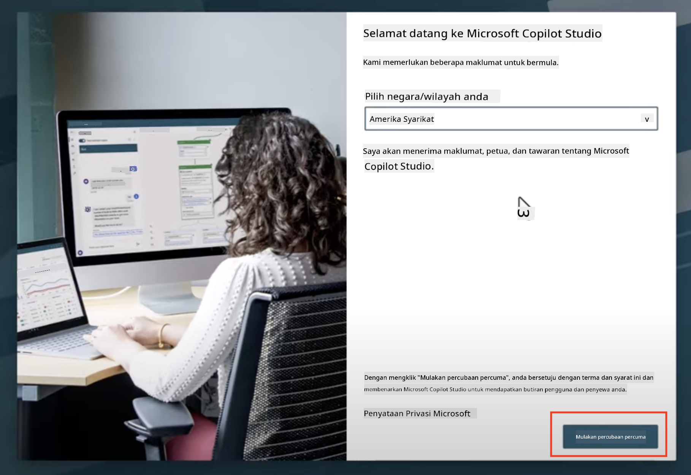

!!! info "Nota Percubaan"  
     1. Percubaan percuma menyediakan **keupayaan penuh Copilot Studio**.
     1. Anda akan menerima pemberitahuan e-mel tentang tarikh tamat percubaan anda. Anda boleh melanjutkan percubaan dalam tempoh 30 hari tambahan (sehingga 90 hari masa operasi ejen).  
     1. Jika pentadbir tenant anda telah mematikan pendaftaran sendiri, anda akan melihat ralat—hubungi pentadbir Microsoft 365 anda untuk mengaktifkannya semula.

---

## Langkah 3: Buat persekitaran pembangun baru

### Daftar untuk Pelan Pembangun Power Apps

Menggunakan tenant Microsoft 365 yang sama dalam Langkah 1, daftar untuk Pelan Pembangun Power Apps untuk membuat persekitaran pembangunan percuma untuk membina dan menguji dengan Copilot Studio.

1. Daftar di laman web [Pelan Pembangun Power Apps](https://aka.ms/PowerAppsDevPlan).

    - Masukkan alamat e-mel anda
    - Tandakan kotak semak
    - Pilih **Mulakan percuma**

    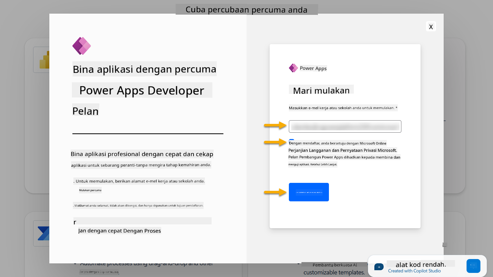

1. Selepas mendaftar untuk Pelan Pembangun, anda akan diarahkan ke [Power Apps](https://make.powerapps.com/). Persekitaran menggunakan nama anda, contohnya **Persekitaran Adele Vance**. Jika sudah ada persekitaran dengan nama itu, persekitaran pembangun baru akan dinamakan **Persekitaran Adele Vance (1)**.

    Gunakan persekitaran pembangun ini dalam Copilot Studio semasa melengkapkan makmal.

!!! Note
    Jika anda menggunakan akaun Microsoft 365 sedia ada dan tidak membuat satu dalam Langkah 1, contohnya - menggunakan akaun anda sendiri dalam organisasi kerja anda, pentadbir IT anda (atau pasukan yang setara) yang menguruskan tenant/persekitaran anda mungkin telah mematikan proses pendaftaran. Dalam kes ini, sila hubungi pentadbir anda, atau buat tenant ujian seperti yang dinyatakan dalam Langkah 1.

---

## Langkah 4: Buat laman SharePoint baru

Laman SharePoint baru perlu dibuat yang akan digunakan dalam [Pelajaran 06 - Buat ejen tersuai menggunakan pengalaman penciptaan perbualan dengan Copilot dan menghubungkannya dengan data anda](../06-create-agent-from-conversation/README.md#62-add-an-internal-knowledge-source-using-a-sharepoint-site).

1. Pilih ikon waffle di bahagian kiri atas Microsoft Copilot Studio untuk melihat menu. Pilih SharePoint dari menu.

    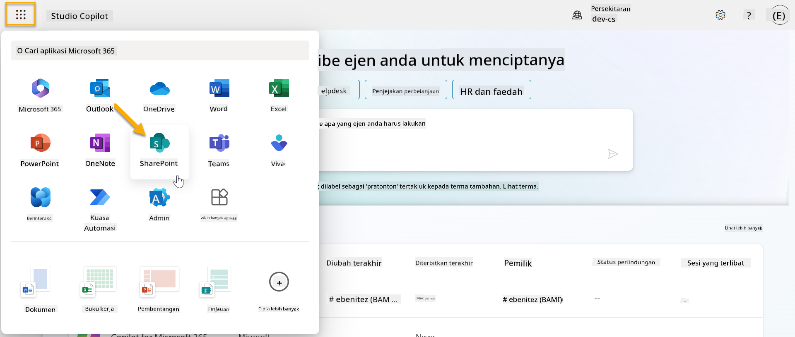

1. SharePoint akan dimuatkan. Pilih **+ Buat laman** untuk membuat laman SharePoint baru.

    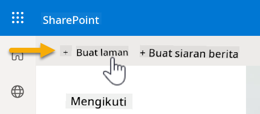

1. Dialog akan muncul untuk membimbing anda dalam membuat laman SharePoint baru. Pilih **Laman pasukan**.

    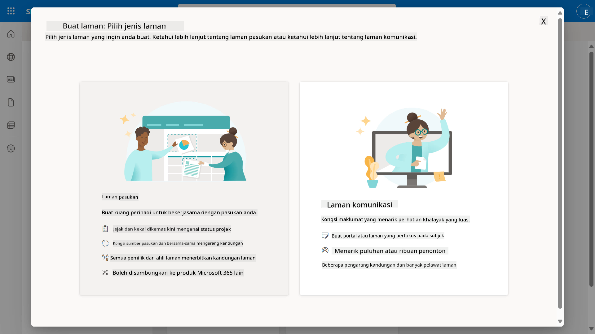

1. Dalam langkah seterusnya, senarai templat Microsoft akan dimuatkan secara lalai. Skrol ke bawah dan pilih templat **Meja bantuan IT**.

    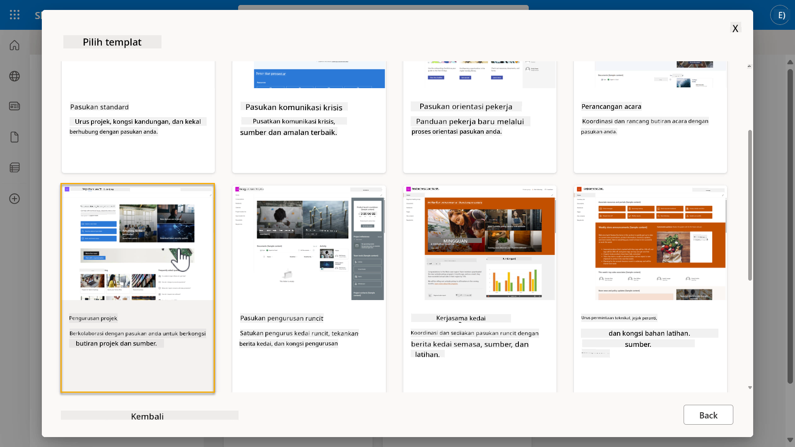

1. Pilih **Gunakan templat** untuk membuat laman SharePoint baru menggunakan templat meja bantuan IT.

    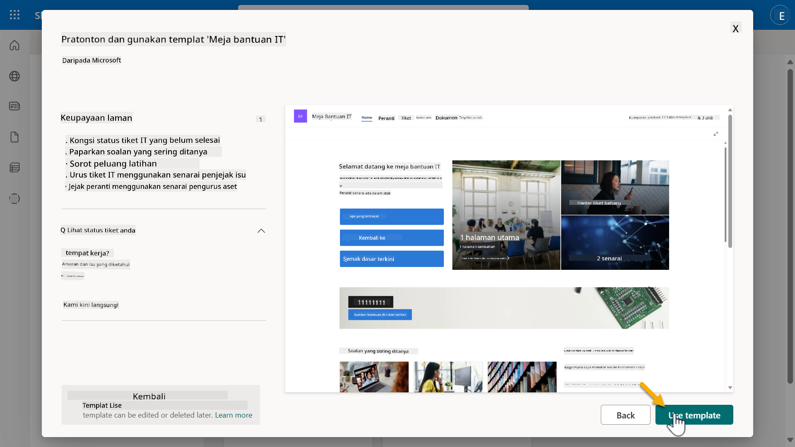

1. Masukkan maklumat untuk laman anda. Berikut adalah contoh:

    | Medan | Nilai |
    | --- | --- |
    | Nama laman | Contoso IT |
    | Penerangan laman | Copilot Studio untuk Pemula |
    | Alamat laman | ContosoIT |

    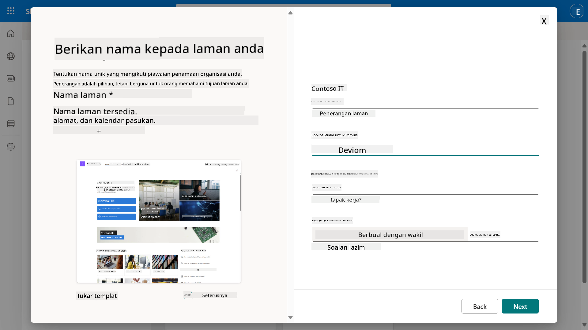

1. Dalam langkah terakhir, bahasa boleh dipilih untuk laman SharePoint. Secara lalai ia akan menjadi **Bahasa Inggeris**. Biarkan Bahasa sebagai **Bahasa Inggeris** dan pilih **Buat laman**.

    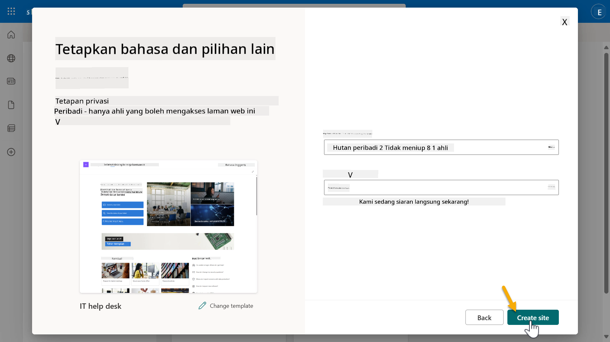

1. Laman SharePoint akan disediakan dalam beberapa saat. Sementara itu, anda boleh memilih untuk menambah pengguna lain ke laman anda dengan memasukkan alamat e-mel mereka dalam medan **Tambah ahli**. Apabila selesai, pilih **Selesai**.

    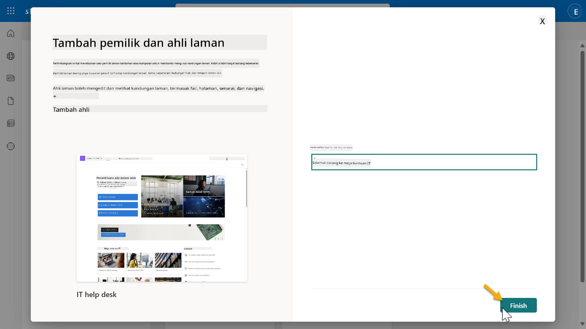

1. Halaman utama laman SharePoint akan dimuatkan seterusnya. **Salin** URL laman SharePoint.

1. Templat ini menyediakan halaman dengan data contoh tentang pelbagai polisi IT dan dua senarai contoh (Tiket dan Peranti).

### Gunakan senarai Peranti SharePoint

Kita akan menggunakan senarai **Peranti** dalam [Misi 07 - Tambah topik baru dengan pencetus dan nod](../07-add-new-topic-with-trigger/README.md#73-add-a-tool-using-a-connector).

### Tambah lajur baru

Skrol ke sebelah kanan dalam senarai dan pilih butang **+ Tambah lajur**. Pilih jenis **hiperpautan**, masukkan **Imej** untuk nama lajur, dan pilih tambah.

### Buat data contoh dalam senarai Peranti SharePoint

Anda perlu memastikan anda mengisi senarai ini dengan sekurang-kurangnya 4 item data contoh dan menambah satu lajur tambahan ke senarai ini.  

Apabila menambah data contoh, pastikan medan berikut diisi:

- Foto peranti - gunakan imej dari [folder imej peranti](https://github.com/microsoft/agent-academy/tree/main/docs/recruit/00-course-setup/images/device-images)
- Tajuk
- Status
- Pengeluar
- Model
- Jenis Aset
- Warna
- Nombor Siri
- Tarikh Pembelian
- Harga Pembelian,
- Nombor Pesanan
- Imej - gunakan pautan berikut

|Peranti  |URL  |
|---------|---------|
|Surface Laptop 13     | [https://raw.githubusercontent.com/microsoft/agent-academy/refs/heads/main/docs/recruit/00-course-setup/images/device-images/Surface-Laptop-13.png](https://raw.githubusercontent.com/microsoft/agent-academy/refs/heads/main/docs/recruit/00-course-setup/images/device-images/Surface-Laptop-13.png)        |
|Surface Laptop 15     | [https://raw.githubusercontent.com/microsoft/agent-academy/refs/heads/main/docs/recruit/00-course-setup/images/device-images/Surface-Laptop-15.png](https://raw.githubusercontent.com/microsoft/agent-academy/refs/heads/main/docs/recruit/00-course-setup/images/device-images/Surface-Laptop-15.png)        |
|Surface Pro    | [https://raw.githubusercontent.com/microsoft/agent-academy/refs/heads/main/docs/recruit/00-course-setup/images/device-images/Surface-Pro-12.png](https://raw.githubusercontent.com/microsoft/agent-academy/refs/heads/main/docs/recruit/00-course-setup/images/device-images/Surface-Pro-12.png)        |
|Surface Studio    | [https://raw.githubusercontent.com/microsoft/agent-academy/refs/heads/main/docs/recruit/00-course-setup/images/device-images/Surface-Studio.png](https://raw.githubusercontent.com/microsoft/agent-academy/refs/heads/main/docs/recruit/00-course-setup/images/device-images/Surface-Studio.png)        |

---

## ✅ Misi Selesai

Anda telah berjaya:

- Menyediakan persekitaran pembangunan Microsoft 365  
- Mengaktifkan percubaan Copilot Studio anda  
- Mewujudkan laman SharePoint untuk menghubungkan ejen  
- Mengisi senarai Peranti untuk digunakan dalam misi masa depan

Anda kini secara rasmi bersedia untuk memulakan **latihan ejen peringkat Rekrut** dalam [Pelajaran 01](../01-introduction-to-agents/README.md).  

<!-- markdownlint-disable-next-line MD033 -->

---

**Penafian**:  
Dokumen ini telah diterjemahkan menggunakan perkhidmatan terjemahan AI [Co-op Translator](https://github.com/Azure/co-op-translator). Walaupun kami berusaha untuk ketepatan, sila ambil perhatian bahawa terjemahan automatik mungkin mengandungi kesilapan atau ketidaktepatan. Dokumen asal dalam bahasa asalnya harus dianggap sebagai sumber yang berwibawa. Untuk maklumat kritikal, terjemahan manusia profesional adalah disyorkan. Kami tidak bertanggungjawab atas sebarang salah faham atau salah tafsir yang timbul daripada penggunaan terjemahan ini.