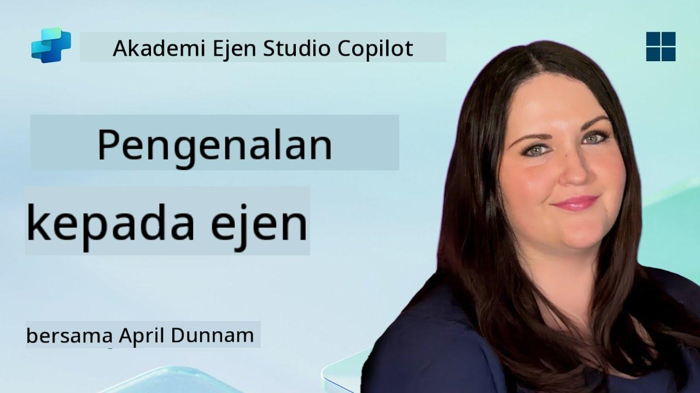

<!--
CO_OP_TRANSLATOR_METADATA:
{
  "original_hash": "d6706e107678264168d77b2e107710b1",
  "translation_date": "2025-10-20T00:53:59+00:00",
  "source_file": "docs/recruit/01-introduction-to-agents/README.md",
  "language_code": "ms"
}
-->
# 🚨 Misi 01: Pengenalan kepada Ejen

## 🕵️‍♂️ NAMA KOD: `OPERASI AI AGENT DECODE`

> **⏱️ Tempoh Operasi:** `~30 minit – hanya maklumat, tiada kerja lapangan diperlukan`

🎥 **Tonton Panduan**

## 🎯 Ringkasan Misi

Selamat datang, Rekrut. Sebelum kita mendalami pembinaan ejen, anda perlu memahami konsep AI yang mendasarinya. Misi ini akan melengkapkan anda dengan pengetahuan asas tentang AI perbualan, model bahasa besar (LLM), penjanaan yang diperkukuh dengan pengambilan (RAG), dan jenis ejen yang boleh anda cipta di Copilot Studio.

## 🔎 Objektif

Dalam misi ini, anda akan mempelajari:

1. Apa itu AI perbualan dan mengapa ia penting  
1. Bagaimana Model Bahasa Besar (LLM) menggerakkan pengalaman sembang  
1. Apa yang dibawa oleh Penjanaan yang Diperkukuh dengan Pengambilan (RAG)  
1. Perbezaan antara ejen perbualan dan ejen autonomi  
1. Bagaimana ejen di Copilot Studio memanfaatkan konsep-konsep ini  

Mari kita mulakan!

---

## Apa Itu AI Perbualan?

AI perbualan merujuk kepada mana-mana sistem yang boleh memahami, memproses, dan memberi respons kepada bahasa manusia – sama ada teks atau ucapan – dengan cara yang terasa semula jadi. Fikirkan chatbot di meja bantuan atau pembantu peribadi maya dalam aplikasi kegemaran anda. Di sebalik tabir, kebanyakan AI perbualan moden bergantung pada Model Bahasa Besar (LLM), yang akan kita bincangkan seterusnya.

### Mengapa Ia Penting

- **Pengalaman Pengguna:** Antara muka perbualan sering kali lebih intuitif berbanding klik melalui menu.  
- **Kebolehskalaan:** Satu ejen boleh mengendalikan puluhan atau ratusan perbualan serentak.  
- **Kecekapan:** Daripada membina skrip berasaskan peraturan yang khusus, ejen yang dikuasakan oleh LLM dapat menyesuaikan diri dengan input pengguna secara langsung.  
- **Kebolehluasan:** Dengan reka bentuk yang betul, ejen boleh mengakses pangkalan pengetahuan, menyambung ke API, atau bertindak sebagai "rakan sekerja digital" dalam aliran kerja perniagaan.

---

## Model Bahasa Besar (LLM) 101

Di teras kebanyakan sistem AI perbualan adalah **Model Bahasa Besar** – rangkaian neural yang dilatih pada korpus teks yang besar. Mereka mempelajari pola statistik bahasa supaya mereka boleh menghasilkan ayat yang koheren, menjawab soalan, atau bahkan mencetuskan idea. Poin utama untuk difahami:

1. **Data Latihan:** LLM menyerap terabait teks (laman web, buku, artikel). Pengetahuan dunia ini membolehkan mereka memberi respons kepada banyak topik.  
1. **Tokenisasi:** Teks dipecahkan kepada unit kecil yang dipanggil token (perkataan, subperkataan, atau huruf). Model meramalkan satu token pada satu masa.  
1. **Tingkap Konteks:** Setiap LLM mempunyai had pada berapa banyak token yang boleh "dilihat" sekaligus. Melebihi had itu, token sebelumnya akan dipotong.  
1. **Prompting:** Anda berinteraksi dengan LLM dengan menghantar prompt. Semakin baik prompt anda, semakin fokus dan relevan responsnya.  
1. **Zero-shot vs. Fine-tuning:** Zero-shot bermaksud menggunakan LLM seperti sedia ada (hanya berat mentah). Fine-tuning bermaksud menyesuaikan model pada data khusus domain supaya ia menjawab dengan lebih tepat untuk keperluan anda.

!!! Tip "Tip Pro"
    Analogi biasa adalah bahawa LLM seperti "autocomplete yang sangat pintar." Ia tidak benar-benar memahami makna seperti otak manusia, tetapi ia sangat baik dalam meramalkan perkataan (atau frasa) terbaik seterusnya dalam urutan.

---

## Penjanaan yang Diperkukuh dengan Pengambilan (RAG)

Apabila LLM hanya bergantung pada data latihan statik, mereka mungkin menghasilkan maklumat yang tidak tepat atau menjadi ketinggalan zaman. RAG menangani ini dengan membolehkan model "mencari" maklumat terkini sebelum menyusun jawapan. Secara umum, RAG berfungsi seperti ini:

1. **Pertanyaan Pengguna:** Seorang pengguna bertanya soalan (contohnya, “Apa berita terkini tentang pendapatan suku tahunan Contoso?”).  
1. **Langkah Pengambilan:** Sistem menanyakan sumber pengetahuan (dokumen, pangkalan data dalaman, perpustakaan SharePoint, dll.) untuk mencari petikan yang relevan.  
1. **Pengukuhan:** Petikan yang diambil ditambahkan atau diletakkan sebelum prompt LLM.  
1. **Penjanaan:** LLM menyerap kedua-dua soalan pengguna dan konteks yang diambil, kemudian menghasilkan respons yang berdasarkan data terkini.  

Dengan RAG, ejen anda boleh mengakses wiki syarikat dalaman, API plugin, atau mencari pangkalan pengetahuan FAQ—dan memberikan jawapan yang tidak terhad kepada parameter model yang diterbitkan secara statik.

---

## Ejen Perbualan vs. Ejen Autonomi

Dalam konteks Copilot Studio, istilah **ejen** boleh merujuk kepada pelbagai jenis pembantu AI. Adalah berguna untuk membezakan antara:

**Ejen Perbualan:**

- Terutamanya fokus pada dialog dua hala.  
- Mengekalkan konteks sepanjang beberapa giliran perbualan.  
- Biasanya diatur melalui aliran atau pencetus yang telah ditentukan (contohnya, “Jika pengguna berkata X, balas dengan Y”).  
- Ideal untuk sokongan pelanggan, FAQ, interaksi berpandu, penjadualan, atau soal jawab ringkas.  
  - Contoh:
    - Chatbot Teams yang menjawab soalan dasar HR.  
    - Bot Power Virtual Agents di halaman SharePoint untuk membimbing pengguna melalui borang.  

**Ejen Autonomi:**

- Melangkaui sembang dua hala; mereka boleh **melakukan tindakan** bagi pihak pengguna.  
- Menggunakan gelung penaakulan LLM (fikirkan “rancang → bertindak → perhatikan → rancang semula”) untuk menyelesaikan tugas.  
- Menyambung ke alat atau API luaran (contohnya, memanggil aliran Power Automate, menghantar jemputan kalendar, memanipulasi data dalam Dataverse).  
- Beroperasi tanpa arahan manusia yang berterusan—sebaik sahaja diaktifkan, mereka boleh mengendalikan proses berbilang langkah secara autonomi.  
  - Contoh:  
    - Ejen yang menghasilkan jadual perjalanan, menempah penerbangan, dan menghantar pengesahan melalui e-mel.  
    - Ejen “Penyusun Ringkasan Mesyuarat” yang menyertai panggilan Teams, menyalinnya secara langsung, dan menulis ringkasan eksekutif ke OneNote.  

!!! Info "Perbezaan Utama"
    Ejen perbualan menunggu input pengguna dan berpegang pada dialog. Ejen autonomi secara proaktif merancang dan melaksanakan urutan langkah menggunakan akses alat yang lebih luas.

---

## Ejen di Copilot Studio

**Copilot Studio** menyatukan kedua-dua senario perbualan dan autonomi di bawah satu rangka kerja. Berikut adalah bagaimana Copilot Studio membantu anda membina ejen:

1. **Pereka Ejen Visual:** Kanvas kod rendah untuk menentukan prompt, memori, dan alat untuk kedua-dua aliran sembang dan tindakan.  
1. **Konfigurasi LLM:** Pilih daripada pelbagai model OpenAI atau GPT kelas perusahaan Microsoft untuk memenuhi keperluan prestasi dan kos anda.  
1. **Penyambung Pengambilan:** Integrasi sedia ada untuk SharePoint, OneDrive, Azure Cognitive Search, dan Dataverse, membolehkan RAG secara langsung.  
1. **Alat & Fungsi Tersuai:** Tentukan tindakan HTTP tersuai atau aliran Power Automate yang boleh dipanggil oleh ejen anda secara autonomi.  
1. **Sokongan Multi-Mod:** Selain teks, ejen Copilot Studio boleh menyerap imej, fail, atau data berstruktur untuk memperkayakan konteks.  
1. **Penerbitan & Pengedaran:** Setelah ejen anda siap, anda boleh menerbitkannya ke Microsoft 365 Copilot (supaya pengguna menggunakannya di Teams, SharePoint, Outlook, dll.) atau menyematkannya sebagai widget sembang mandiri di laman web.

---

## 🎉 Misi Selesai

Anda kini telah melengkapkan pengenalan kepada ejen dan konsep asas AI. Anda memahami:

1. **LLM = “Otak” Ejen Anda**  
   - Bertanggungjawab untuk pemahaman dan penjanaan bahasa.  
   - Lebih banyak token = konteks yang lebih kaya, tetapi juga kos per panggilan yang lebih tinggi.  

1. **RAG = Integrasi Pengetahuan Masa Nyata**  
   - Merapatkan jurang antara LLM statik dan sumber data yang sentiasa berubah.  
   - Mengambil dan menyuntik dokumen atau rekod yang relevan ke dalam prompt LLM.  

1. **Perbualan vs. Autonomi**  
   - **Perbualan:** Fokus pada aliran dialog dan mengekalkan konteks (contohnya, “Memori Sesi”).  
   - **Autonomi:** Tambahkan “Blok Tindakan” yang membolehkan ejen memanggil alat atau perkhidmatan luaran.

---
Seterusnya, anda akan meneroka [asas Copilot Studio](../02-copilot-studio-fundamentals/README.md)!

Tetap fokus, Rekrut - perjalanan AI anda baru sahaja bermula!

## 📚 Sumber Taktikal

🔗 [Halaman Dokumentasi Copilot Studio](https://learn.microsoft.com/microsoft-copilot-studio/)

---

---

**Penafian**:  
Dokumen ini telah diterjemahkan menggunakan perkhidmatan terjemahan AI [Co-op Translator](https://github.com/Azure/co-op-translator). Walaupun kami berusaha untuk ketepatan, sila ambil perhatian bahawa terjemahan automatik mungkin mengandungi kesilapan atau ketidaktepatan. Dokumen asal dalam bahasa asalnya harus dianggap sebagai sumber yang berwibawa. Untuk maklumat kritikal, terjemahan manusia profesional adalah disyorkan. Kami tidak bertanggungjawab atas sebarang salah faham atau salah tafsir yang timbul daripada penggunaan terjemahan ini.