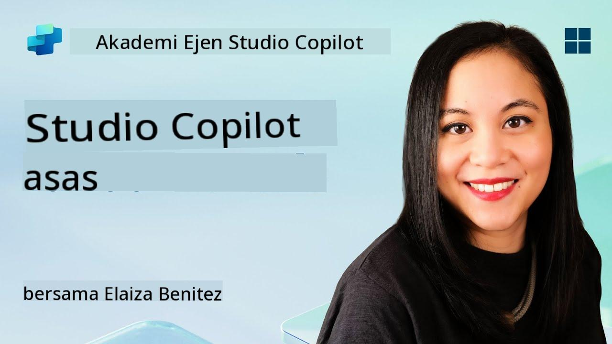
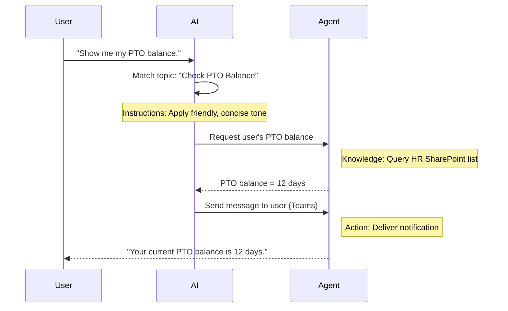

<!--
CO_OP_TRANSLATOR_METADATA:
{
  "original_hash": "90a3c5122f5687bbc8cc819990f175d4",
  "translation_date": "2025-10-20T00:55:13+00:00",
  "source_file": "docs/recruit/02-copilot-studio-fundamentals/README.md",
  "language_code": "ms"
}
-->
# 🚨 Misi 02: Asas Copilot Studio

## 🕵️‍♂️ NAMA KOD: `OPERASI PROTOKOL TERAS`

> **⏱️ Tempoh Operasi:** `~30 minit – hanya intel, tiada kerja lapangan diperlukan`  

🎥 **Tonton Panduan**

[](https://www.youtube.com/watch?v=x4OCwDRGeLE "Tonton panduan di YouTube")

## 🎯 Ringkasan Misi

Selamat datang, Rekrut. Misi ini akan melengkapkan anda dengan intel asas untuk memahami cara Copilot Studio berfungsi, dan bagaimana membina agen pintar yang memberikan nilai perniagaan sebenar.

Sebelum membina agen pertama anda, anda perlu memahami empat komponen utama yang membentuk setiap agen AI tersuai: Pengetahuan, Alat, Topik, dan Arahan. Anda juga akan belajar bagaimana elemen-elemen ini bekerjasama dalam pengatur Copilot Studio.

## 🔎 Objektif

Dalam misi ini, anda akan:

- **Belajar apa itu Copilot Studio**
- **Belajar bila dan mengapa menggunakan agen**
- **Meneroka empat blok binaan agen**
      - **Pengetahuan**
      - **Alat**
      - **Topik**
      - **Arahan**
- **Memahami bagaimana komponen ini bekerjasama** untuk mencipta agen pintar dan automatik

---

## Apa Itu Agen dalam Copilot Studio?

**Agen** adalah pembantu AI khusus yang anda reka untuk menangani tugas atau pertanyaan tertentu. Tidak seperti chatbot umum, agen anda:

- **Mengetahui data khusus syarikat** (polisi, dokumen, pangkalan data)  
- **Melaksanakan tugas dunia nyata** (menghantar mesej, mencipta acara kalendar, mengemas kini rekod)  
- **Menjaga konteks perbualan** supaya ia boleh mengikuti soalan sebelumnya  

Kerana Copilot Studio adalah low-code, anda boleh menyeret dan melepaskan komponen yang telah dibina—tanpa memerlukan kemahiran pengaturcaraan yang mendalam. Setelah agen anda dibina, orang boleh menggunakannya dalam Teams, Slack, atau bahkan laman web tersuai untuk mendapatkan jawapan atau mencetuskan aliran kerja secara automatik.

---

## Bila dan Mengapa Menggunakan Copilot Studio

Walaupun Microsoft 365 Copilot menyediakan bantuan AI umum di seluruh aplikasi Office, anda memerlukan agen tersuai apabila:

### Anda memerlukan pengetahuan khusus domain

- Copilot standard mungkin tidak mengetahui prosedur dalaman atau data syarikat anda. Agen boleh menyoal laman SharePoint, pangkalan data, atau sumber tersuai anda untuk memberikan jawapan yang tepat dan terkini.  

### Anda ingin mengautomasikan aliran kerja berbilang langkah

- Contohnya: "Apabila seseorang menghantar perbelanjaan, hantarkan untuk kelulusan, kemas kini penjejak kewangan, dan maklumkan kepada pengurus." Agen tersuai boleh mengendalikan setiap langkah, yang dicetuskan oleh satu arahan atau peristiwa.  

### Anda memerlukan pengalaman dalam alat yang kontekstual  

- Bayangkan agen Onboarding Pekerja Baru dalam Teams yang membimbing kakitangan HR melalui setiap polisi, menghantar borang yang diperlukan, dan menjadualkan mesyuarat orientasi—semuanya dalam platform kolaborasi sedia ada anda.  

---

## Empat Blok Binaan Agen

Setiap agen Copilot Studio dibina daripada empat komponen teras:

1. **Pengetahuan**  
1. **Alat (Tindakan)**  
1. **Topik**  
1. **Arahan**

Di bawah ini, kami akan mentakrifkan setiap blok binaan dan menunjukkan bagaimana mereka bekerjasama untuk mencipta agen yang berkesan.

### 1. Pengetahuan

**Pengetahuan** adalah data dan konteks yang digunakan oleh agen anda untuk menjawab soalan dengan tepat. Ia mempunyai dua bahagian:

#### Arahan & Konteks Tersuai

- Anda menulis penerangan ringkas tentang tujuan dan nada agen. Contohnya:  

    ```text
    You are an IT support agent. You help employees troubleshoot common software issues, provide troubleshooting steps, and escalate urgent tickets.
    ```

- Semasa perbualan, agen mengingati giliran sebelumnya supaya ia boleh merujuk kembali kepada apa yang telah dibincangkan (contohnya, jika pengguna pertama berkata, "Pencetak saya tidak berfungsi," kemudian bertanya, "Adakah anda memeriksa tahap dakwat?" agen mengingati konteks pencetak).

#### Sumber Pengetahuan (Data Asas)

- Anda menyambungkan agen anda ke beberapa sumber data—perpustakaan SharePoint, laman dokumentasi, wiki, atau pangkalan data lain.  
- Apabila pengguna bertanya soalan, agen menarik petikan yang relevan daripada sumber tersebut supaya jawapan **berdasarkan** polisi organisasi anda, manual produk, atau sebarang maklumat proprietari.  
- Anda juga boleh memaksa agen hanya menjawab dengan maklumat daripada sumber tersebut, mengelakkan ia daripada meneka atau memberikan jawapan yang salah.

!!! contoh
    Agen "Pembantu Polisi" mungkin disambungkan ke laman SharePoint HR anda. Jika pengguna bertanya, "Apakah kadar pengumpulan PTO kami?" agen akan mendapatkan teks tepat daripada dokumen polisi HR dan bukannya bergantung pada respons AI generik.

---

### 2. Alat (Tindakan)

**Alat (Tindakan)** menentukan apa yang boleh dilakukan oleh agen selain berbual. Setiap tindakan adalah tugas yang dilaksanakan oleh agen secara programatik, seperti:

- Menghantar e-mel atau mesej Teams  
- Mencipta atau mengemas kini acara kalendar  
- Menambah atau mengedit rekod dalam pangkalan data (contohnya, senarai SharePoint atau jadual Dataverse)  
- Memanggil aliran Power Automate atau REST API  

#### Cara Tindakan Berfungsi

- **Tentukan Input & Output**  
      - Contohnya, tindakan Hantar E-mel mungkin memerlukan:  
        - `RecipientEmailAddress`  
        - `SubjectLine`  
        - `EmailBody`  

- **Gabungkan Tindakan ke dalam Aliran Kerja**  
      - Selalunya, memenuhi permintaan pengguna melibatkan beberapa langkah.  
      - Anda boleh menyusun tindakan supaya:  
             1. Agen mendapatkan data daripada senarai SharePoint.  
             2. Ia menjana ringkasan menggunakan LLM.  
             3. Ia menghantar mesej Teams dengan ringkasan tersebut.  

- **Sambungkan ke Sistem Luar**  
      - Jika anda perlu mengemas kini CRM atau memanggil API dalaman, cipta tindakan tersuai untuk mengendalikannya.  
      - Copilot Studio boleh berintegrasi dengan Power Platform atau mana-mana endpoint berasaskan HTTP.

!!! contoh "Agen "Pembantu Perbelanjaan" boleh:"  
    1. Mendengar permintaan "Hantar Perbelanjaan".  
    2. Mengambil butiran perbelanjaan pengguna daripada borang.  
    3. Menggunakan tindakan "Tambah ke Senarai SharePoint" untuk menyimpan data.  
    4. Mencetuskan tindakan "Hantar E-mel" untuk memaklumkan kepada pemberi kelulusan.  

---

### 3. Topik

**Topik** menentukan pencetus perbualan atau titik masuk untuk agen anda. Setiap topik sepadan dengan sekeping fungsi atau kategori soalan.

#### Pencetus Perbualan  

- Satu topik mungkin "Hantar Tiket IT," "Semak Baki Cuti," atau "Cipta Laporan Jualan."  
- Di belakang tabir, Copilot Studio menggunakan **generative orchestration**: bukannya bergantung pada kata kunci tepat, AI mentafsir niat pengguna dan memilih topik yang betul berdasarkan penerangan ringkas yang anda berikan.  

#### Penerangan Topik  

- Dalam setiap topik, anda menulis penerangan yang jelas dan ringkas tentang apa yang diliputi oleh topik tersebut.

!!! contoh "Contoh penerangan topik"
    Topik ini membantu pengguna menghantar tiket sokongan IT dengan mengumpulkan butiran isu, keutamaan, dan maklumat hubungan.

- AI menggunakan penerangan itu untuk memutuskan bila untuk mengaktifkan topik ini, walaupun frasa pengguna tidak sepadan dengan tepat.

#### Memetakan Topik ke Tindakan  

- Setiap topik disambungkan ke satu atau lebih tindakan atau langkah pengambilan data.  
- Apabila AI memilih topik, ia membimbing perbualan melalui urutan yang anda tentukan (tanya soalan susulan, panggil tindakan, kembalikan hasil).

!!! contoh
    Jika pengguna berkata, "Saya perlukan bantuan untuk menyediakan laptop baru saya," AI mungkin memadankan niat itu dengan topik "Hantar Tiket IT". Agen kemudian meminta model laptop, butiran pengguna, dan secara automatik menghantar tiket ke sistem helpdesk.

---

### 4. Arahan

**Arahan** (kadang-kadang dipanggil "Prompts" atau "System Messages") membimbing nada, gaya, dan sempadan LLM. Ia membentuk cara agen bertindak balas dalam sebarang situasi.

#### Peranan & Persona  

- Anda memberitahu AI siapa ia (contohnya, "Anda adalah agen perkhidmatan pelanggan untuk Contoso Retail").  
- Ini menetapkan nada—mesra, ringkas, formal, atau santai—bergantung pada kes penggunaan anda.

#### Garis Panduan Respons  

- Tentukan sebarang peraturan yang mesti diikuti oleh agen, seperti:  
      - "Sentiasa ringkaskan maklumat polisi dalam bentuk poin."  
      - "Jika anda tidak tahu jawapannya, katakan ‘Maaf, saya tidak mempunyai maklumat itu.’"  
      - "Jangan sekali-kali menyertakan data sulit di luar konteks."

#### Peraturan Memori & Konteks

- Anda boleh mengarahkan agen berapa giliran perbualan untuk diingati.  
- Contohnya: "Ingat butiran daripada permintaan pengguna ini untuk sehingga tiga soalan susulan."

!!! contoh "Dalam agen "Penasihat Manfaat", anda mungkin menyertakan:"
    "Sentiasa rujuk buku panduan HR terkini semasa menjawab soalan. Jika ditanya tentang tarikh akhir pendaftaran, berikan tarikh tertentu daripada polisi. Kekalkan jawapan di bawah 150 perkataan."

---

## Bagaimana Empat Blok Binaan Bekerja Bersama

Apabila anda menggabungkan **Pengetahuan**, **Alat**, **Topik**, dan **Arahan**, pengatur AI Copilot Studio mencipta agen yang:

1. **Mendengar Topik yang relevan** (dibimbing oleh penerangan topik anda).  
1. **Menggunakan Arahan** untuk menetapkan nadanya, memutuskan bila untuk bertanya soalan susulan, dan menguatkuasakan peraturan.  
1. **Menggunakan Sumber Pengetahuan** untuk mendasarkan jawapannya pada data organisasi anda.  
1. **Memanggil Alat (Tindakan)** seperti yang diperlukan untuk melaksanakan tugas—menghantar mesej, mengemas kini rekod, atau memanggil API.  

Di belakang tabir, pengatur menggunakan pendekatan **generative planning**: ia memutuskan langkah mana yang perlu diambil, dalam urutan apa, untuk memenuhi permintaan pengguna. Jika tindakan gagal (contohnya, e-mel tidak dapat dihantar), agen mengikuti garis panduan pengendalian pengecualian anda (tanya soalan penjelasan atau laporkan ralat). Kerana LLM menyesuaikan diri dengan konteks perbualan, agen boleh mengekalkan memori sepanjang beberapa giliran dan menggabungkan maklumat baru semasa perbualan berlangsung.

**Contoh Aliran Visual:**  
<!--
1. **Pengguna:** "Tunjukkan baki PTO saya."
1. **AI (Topik):** Memadankan topik "Semak Baki PTO".  
1. **AI (Arahan):** Menggunakan nada mesra dan ringkas.  
1. **Agen (Pengetahuan):** Menyoal senarai SharePoint HR untuk baki pengguna.  
1. **Agen (Tindakan):** Mendapatkan nilai dan menghantar mesej Teams:  
   > "Baki PTO semasa anda adalah 12 hari."  
-->



---

## 🎉 Misi Selesai

Anda telah berjaya menyelesaikan taklimat asas anda. Anda kini telah mempelajari empat blok binaan penting bagi mana-mana agen dalam Copilot Studio:

1. **Pengetahuan** – Tempat agen mencari maklumat fakta dan mengekalkan memori perbualan.  
1. **Alat** – Tugas yang boleh dilakukan oleh agen untuk melaksanakan sesuatu secara automatik.  
1. **Topik** – Bagaimana agen mengenali niat pengguna dan memutuskan aliran kerja mana yang perlu dijalankan.  
1. **Arahan** – Peraturan, nada, dan sempadan yang membimbing setiap respons.

Dengan komponen ini, anda boleh membina agen asas yang menjawab soalan dan melaksanakan aliran kerja mudah. Dalam pelajaran seterusnya, kami akan melalui tutorial langkah demi langkah untuk mencipta agen "Meja Perkhidmatan"—daripada menyambungkan sumber pengetahuan pertama anda hingga mentakrifkan topik dan menyambungkan tindakan.

Seterusnya: Anda akan membina [agen deklaratif pertama anda untuk M365 Copilot](../03-create-a-declarative-agent-for-M365Copilot/README.md).

<!-- markdownlint-disable-next-line MD033 -->


---

**Penafian**:  
Dokumen ini telah diterjemahkan menggunakan perkhidmatan terjemahan AI [Co-op Translator](https://github.com/Azure/co-op-translator). Walaupun kami berusaha untuk ketepatan, sila ambil perhatian bahawa terjemahan automatik mungkin mengandungi kesilapan atau ketidaktepatan. Dokumen asal dalam bahasa asalnya harus dianggap sebagai sumber yang berwibawa. Untuk maklumat penting, terjemahan manusia profesional adalah disyorkan. Kami tidak bertanggungjawab atas sebarang salah faham atau salah tafsir yang timbul daripada penggunaan terjemahan ini.