<!--
CO_OP_TRANSLATOR_METADATA:
{
  "original_hash": "0c51aabca81d6256990caf4c015e6195",
  "translation_date": "2025-10-20T00:46:55+00:00",
  "source_file": "docs/recruit/04-creating-a-solution/README.md",
  "language_code": "ms"
}
-->
# 🚨 Misi 04: Mencipta Penyelesaian untuk Ejen Anda

## 🕵️‍♂️ NAMA KOD: `OPERASI CTRL-ALT-PACKAGE`

> **⏱️ Tempoh Operasi:** `~45 minit`

🎥 **Tonton Panduan**

[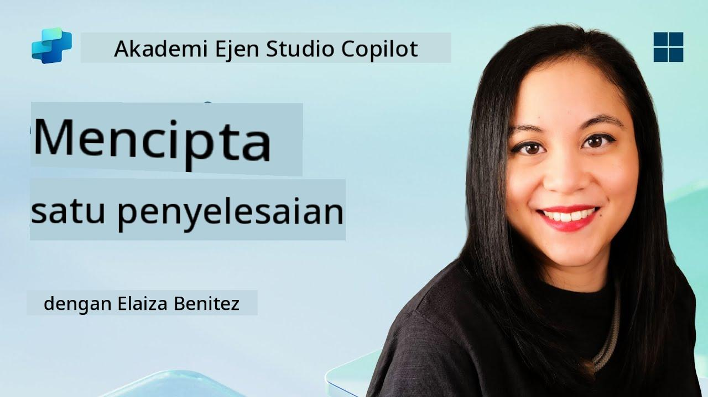](https://www.youtube.com/watch?v=1iATbkgfcpU "Tonton panduan di YouTube")

## 🎯 Ringkasan Misi

Pembuat Ejen, selamat datang ke operasi taktikal anda yang seterusnya. Dalam misi ini, anda akan belajar untuk menyusun Penyelesaian - kenderaan rasmi untuk melancarkan Ejen Meja Bantuan IT anda yang dibina dengan Microsoft Copilot Studio. Anggaplah ini sebagai mencipta beg bimbit digital yang menyimpan ejen anda dan artifaknya.

Setiap ejen memerlukan rumah yang terstruktur dengan baik. Itulah yang disediakan oleh penyelesaian Power Platform - susunan, mudah alih, dan kesediaan untuk pengeluaran.

Mari kita mulakan.

## 🔎 Objektif

Dalam misi ini, anda akan belajar:

1. Memahami apa itu penyelesaian Power Platform dan peranannya dalam pembangunan ejen
1. Mempelajari manfaat menggunakan penyelesaian untuk mengatur dan melancarkan ejen
1. Meneroka penerbit penyelesaian dan kepentingannya dalam pengurusan komponen
1. Memahami kitaran hayat penyelesaian Power Platform dari pembangunan hingga pengeluaran
1. Mencipta penerbit penyelesaian anda sendiri dan penyelesaian tersuai untuk Ejen Meja Bantuan IT anda

## 🕵🏻‍♀️ Penyelesaian? Apa itu?

Dalam Microsoft Power Platform, penyelesaian adalah seperti bekas atau pakej yang menyimpan semua bahagian aplikasi atau ejen anda - ini boleh jadi jadual, borang, aliran, dan logik tersuai. Penyelesaian adalah penting untuk Pengurusan Kitaran Hayat Aplikasi (ALM), ia membolehkan anda menguruskan aplikasi dan ejen anda dari idea ke pembangunan, ujian, pelancaran, dan kemas kini.

Dalam Copilot Studio, setiap ejen yang anda cipta disimpan dalam penyelesaian Power Platform. Secara lalai, ejen dicipta dalam penyelesaian Lalai, kecuali anda mencipta penyelesaian tersuai baru untuk mencipta ejen anda di dalamnya. Inilah yang akan kita pelajari 🤓 dalam pelajaran ini dan dalam makmal praktikal.

Penyelesaian secara tradisional telah dicipta dalam **portal pembuat Power Apps** - antara muka web di mana anda boleh membina dan menyesuaikan aplikasi, Dataverse, aliran, meneroka komponen AI dan banyak lagi.

   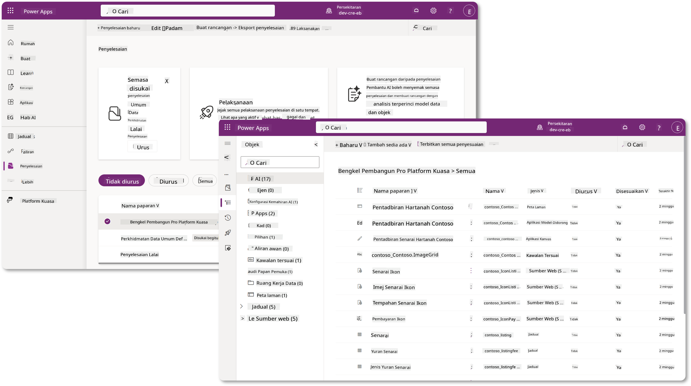

Dalam Copilot Studio, kini terdapat **Solution Explorer** di mana anda boleh menguruskan penyelesaian anda secara langsung. Anda tidak lagi perlu beralih ke portal pembuat Power Apps untuk menguruskan penyelesaian anda, ia boleh dilakukan terus di dalam Copilot Studio 🪄

Ini bermakna anda boleh melakukan tugas berkaitan penyelesaian seperti biasa:

- **Cipta penyelesaian** - penyelesaian tersuai membolehkan ejen dieksport dan diimport antara persekitaran.
- **Tetapkan penyelesaian pilihan anda** - pilih penyelesaian di mana ejen, aplikasi, dll akan dicipta secara lalai.
- **Tambah atau keluarkan komponen** - ejen anda mungkin merujuk kepada komponen lain seperti pembolehubah persekitaran atau aliran awan. Oleh itu, komponen ini perlu dimasukkan dalam penyelesaian.
- **Eksport penyelesaian** - untuk memindahkan penyelesaian ke persekitaran sasaran lain.
- **Import penyelesaian** - import penyelesaian yang dicipta di tempat lain, termasuk menaik taraf atau mengemas kini penyelesaian.
- **Cipta dan urus saluran penyelesaian** - automasikan pelancaran penyelesaian antara persekitaran.
- **Integrasi Git** - membolehkan pembangun menghubungkan penyelesaian dengan repositori Git untuk kawalan versi, kolaborasi dan ALM. Bertujuan untuk digunakan hanya dalam persekitaran pembangun.

   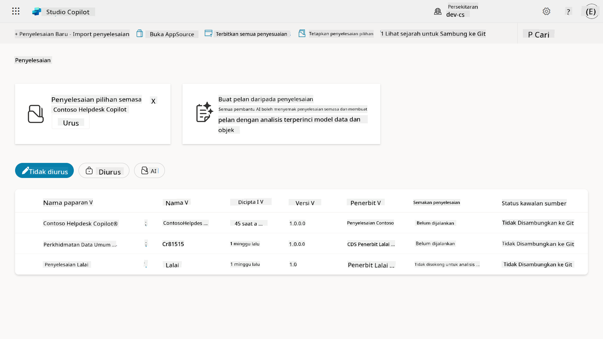

Terdapat dua jenis penyelesaian:

- **Penyelesaian tidak terurus** - digunakan semasa pembangunan. Anda boleh mengedit dan menyesuaikan dengan bebas mengikut keperluan.
- **Penyelesaian terurus** - digunakan apabila anda bersedia untuk melancarkan aplikasi anda ke ujian atau pengeluaran. Ini dikunci untuk mengelakkan perubahan yang tidak disengajakan.

## 🤔 Mengapa _perlu_ saya menggunakan Penyelesaian untuk ejen saya?

Anggaplah Penyelesaian sebagai _kotak alat_. Apabila anda perlu membaiki atau membina sesuatu (ejen) di lokasi lain (persekitaran), anda mengumpulkan semua alat yang diperlukan (komponen) dan meletakkannya dalam kotak alat anda (Penyelesaian). Anda kemudian boleh membawa kotak alat ini ke lokasi baru (persekitaran) dan menggunakan alat (komponen) untuk menyelesaikan kerja anda, atau menambah alat baru (komponen) untuk menyesuaikan ejen atau projek yang anda bina.

!!! quote "Elaiza, penyokong awan mesra anda muncul di sini 🙋🏻‍♀️ untuk berkongsi beberapa kata-kata:"
    Kami mempunyai pepatah di New Zealand, "Jadilah Kiwi yang kemas!" yang merupakan seruan kepada rakyat New Zealand 🥝 untuk bertanggungjawab terhadap persekitaran mereka dengan membuang sampah dengan betul dan menjaga ruang awam tetap bersih. Kita boleh menggunakan konteks yang sama untuk ejen dengan menjaga segala sesuatu yang berkaitan dengan ejen anda teratur dan mudah alih, dan ia akan membantu anda mengekalkan persekitaran yang kemas.

Adalah amalan yang baik untuk mencipta ejen dalam penyelesaian khusus di persekitaran sumber (pembangun) anda. Berikut adalah sebab mengapa penyelesaian itu bernilai:

🧩 **Pembangunan teratur**

- Anda menjaga ejen anda terpisah dari penyelesaian Lalai yang mengandungi segala-galanya dalam persekitaran. Semua komponen ejen anda berada di satu tempat 🎯

- Segala yang anda perlukan untuk ejen anda ada dalam penyelesaian, menjadikannya lebih mudah untuk dieksport dan diimport ke persekitaran sasaran 👉🏻 ini adalah tabiat yang sihat dalam ALM.

🧩 **Pelancaran yang selamat**

- Anda boleh mengeksport aplikasi atau ejen anda sebagai penyelesaian terurus dan melancarkannya ke persekitaran sasaran lain (seperti ujian atau pengeluaran) tanpa risiko perubahan yang tidak disengajakan.

🧩 **Kawalan versi**

- Anda boleh mencipta patch (pembaikan sasaran), kemas kini (perubahan yang lebih menyeluruh) atau peningkatan (menggantikan penyelesaian - biasanya perubahan besar dan memperkenalkan ciri baru).

- Membantu anda melancarkan perubahan dengan cara yang terkawal.

🧩 **Pengurusan kebergantungan**

- Penyelesaian menjejaki bahagian mana yang bergantung kepada yang lain. Ini menghalang anda daripada merosakkan sesuatu apabila anda membuat perubahan.

🧩 **Kolaborasi pasukan**

- Pembangun dan pembuat boleh bekerjasama menggunakan penyelesaian tidak terurus semasa pembangunan, kemudian menyerahkan penyelesaian terurus untuk pelancaran.

## 🪪 Memahami Penerbit Penyelesaian

Penerbit Penyelesaian dalam Power Platform adalah seperti label atau jenama yang mengenal pasti siapa yang mencipta atau memiliki penyelesaian. Ia adalah bahagian kecil tetapi penting dalam menguruskan aplikasi, ejen dan penyesuaian aliran anda, terutamanya apabila bekerja dalam pasukan atau merentasi persekitaran.

Apabila anda mencipta penyelesaian, anda mesti memilih penerbit. Penerbit ini menentukan:

- Awalan yang ditambahkan kepada semua komponen tersuai (seperti jadual, medan, dan aliran).

- Nama dan maklumat hubungan untuk organisasi atau individu yang memiliki penyelesaian.

### 🤔 Mengapa ia penting?

1. **Pengenalan mudah** - awalan (Contoh - `new_` atau `abc_`) membantu anda mengenal pasti dengan cepat komponen mana yang dimiliki oleh penyelesaian atau pasukan mana.

1. **Mengelakkan konflik** - jika dua pasukan mencipta kolum yang dipanggil status, awalan mereka (`teamA_status`, `teamB_status`) mengelakkan pertembungan nama.

1. **Menyokong ALM** - apabila memindahkan penyelesaian antara persekitaran (Dev → Test → Prod), penerbit membantu menjejaki pemilikan dan mengekalkan konsistensi.

### ✨ Contoh

Katakan anda mencipta penerbit yang dipanggil Contoso Solutions dengan awalan `cts_`.

Jika anda menambah kolum tersuai yang dipanggil _Keutamaan_, ia akan disimpan sebagai `cts_Priority` dalam penyelesaian.

Sesiapa yang menemui kolum di peringkat penyelesaian tidak kira di persekitaran mana mereka berada, mereka boleh dengan mudah mengenal pasti ia sebagai kolum yang berkaitan dengan Contoso Solutions.

## 🧭 Kitaran hayat Penyelesaian Power Platform

Sekarang anda memahami tujuan Penyelesaian, mari kita pelajari tentang kitaran hayatnya.

**1. Cipta Penyelesaian di persekitaran Pembangunan** - mulakan dengan mencipta penyelesaian baru di persekitaran Pembangunan anda.

**2. Tambah Komponen** - tambahkan aplikasi, aliran, jadual, dan elemen lain ke dalam penyelesaian anda.

**3. Eksport sebagai penyelesaian Terurus** - bungkus penyelesaian anda untuk pelancaran dengan mengeksportnya sebagai penyelesaian Terurus.

**4. Import ke persekitaran Ujian** - uji penyelesaian anda di persekitaran Ujian yang berasingan untuk memastikan semuanya berfungsi seperti yang diharapkan.

**5. Import ke persekitaran Pengeluaran** - lancarkan penyelesaian yang telah diuji ke persekitaran Pengeluaran langsung anda.

**6. Terapkan Patch, Kemas Kini atau Peningkatan** - buat penambahbaikan atau pembaikan menggunakan patch, kemas kini, atau peningkatan. 🔁 Ulangi kitaran!

### ✨ Contoh

Bayangkan anda sedang membina ejen meja bantuan IT untuk membantu pekerja dengan masalah seperti masalah peranti, penyelesaian masalah rangkaian, pemasangan pencetak dan banyak lagi.

- Anda bermula di persekitaran Pembangunan menggunakan penyelesaian tidak terurus.

- Setelah siap, anda mengeksportnya sebagai penyelesaian terurus dan mengimportnya ke persekitaran sasaran seperti persekitaran Ujian Sistem atau Ujian Penerimaan Pengguna (UAT).

- Selepas ujian, anda memindahkannya ke persekitaran Pengeluaran - semua tanpa menyentuh versi pembangunan asal.

## 🧪 Makmal 04: Cipta Penyelesaian Baru

Sekarang kita akan belajar

- [4.1 Cara mencipta penerbit Penyelesaian](../../../../../docs/recruit/04-creating-a-solution)
- [4.2 Cara mencipta Penyelesaian](../../../../../docs/recruit/04-creating-a-solution)

Kita akan menggunakan contoh dari sebelumnya, di mana kita akan mencipta penyelesaian dalam persekitaran Copilot Studio khusus untuk membina ejen meja bantuan IT kita.

Mari kita mulakan!

### Prasyarat

#### Peranan keselamatan

Dalam Copilot Studio, apa yang anda _boleh lakukan_ dalam penjelajah penyelesaian bergantung pada peranan keselamatan pengguna anda.
Jika anda tidak mempunyai kebenaran untuk menguruskan penyelesaian di pusat pentadbiran Power Apps, anda tidak akan dapat melakukan tugas-tugas tersebut dalam Copilot Studio juga.

Untuk memastikan semuanya berjalan lancar, pastikan anda mempunyai peranan keselamatan dan kebenaran yang betul. Atau jika anda tidak menguruskan persekitaran dalam organisasi anda, minta pentadbir IT anda (atau pasukan yang setara) yang menguruskan penyewa/persekitaran anda.

Berikut adalah peranan keselamatan yang membolehkan pengguna mencipta penyelesaian dalam persekitaran mereka.

| Peranan keselamatan    | Penerangan |
| ---------- | ---------- |
| Pembuat Persekitaran | Memberikan kebenaran yang diperlukan untuk mencipta, menyesuaikan, dan menguruskan sumber dalam persekitaran tertentu, termasuk penyelesaian  |
| Penyesuai Sistem  | Kebenaran yang lebih luas daripada Pembuat Persekitaran, termasuk keupayaan untuk menyesuaikan persekitaran dan menguruskan peranan keselamatan |
| Pentadbir Sistem   | Tahap kebenaran tertinggi dan boleh menguruskan semua aspek persekitaran, termasuk mencipta dan menetapkan peranan keselamatan     |

#### Persekitaran pembangun

Pastikan anda beralih ke persekitaran pembangun khusus anda, rujuk [Pelajaran 00 - Persediaan Kursus - Langkah 3: Cipta pembangun baru](../00-course-setup/README.md#step-3-create-new-developer-environment).

1. Di bahagian kanan atas, pilih ikon **Roda Gigi** dan beralih dari persekitaran lalai ke persekitaran anda, contohnya **Persekitaran Adele Vance**.

    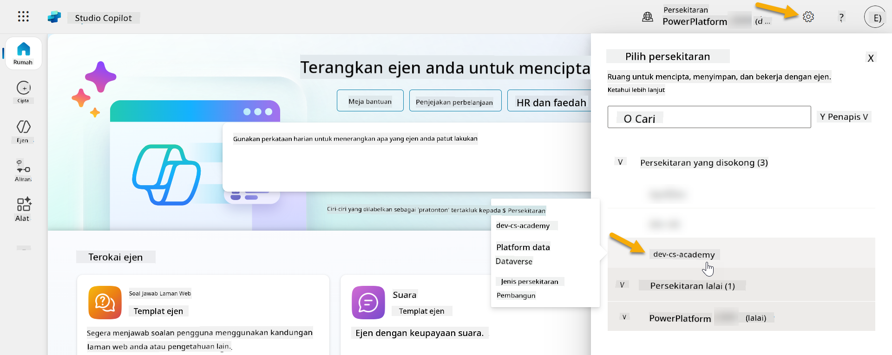

### 4.1 Cipta penerbit Penyelesaian

1. Menggunakan persekitaran Copilot Studio yang sama seperti dalam pelajaran sebelumnya, pilih ikon **tiga titik (. . .)** pada menu sebelah kiri di Copilot Studio. Pilih **Penyelesaian** di bawah tajuk **Teroka**.

    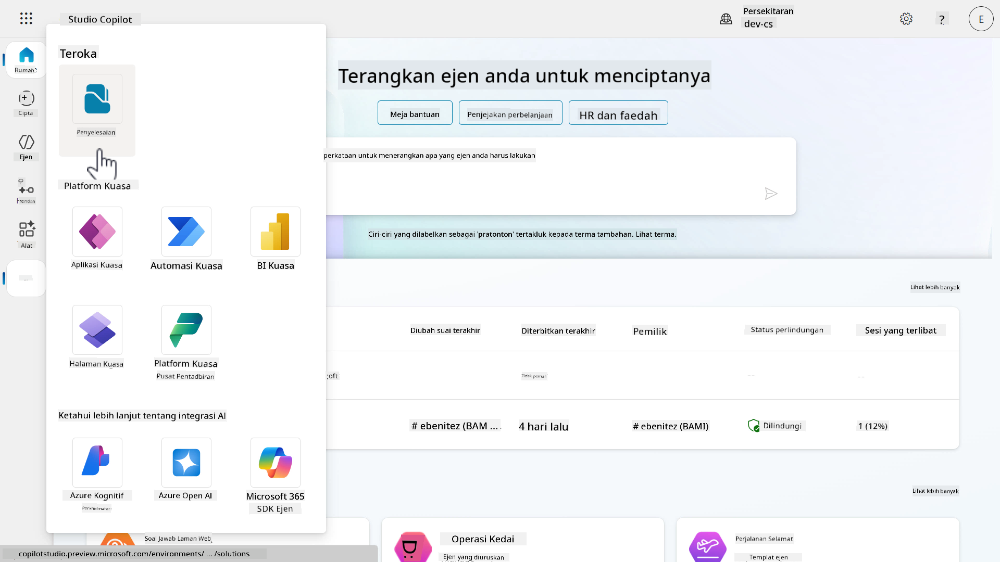

1. **Penjelajah Penyelesaian** dalam Copilot Studio akan dimuatkan. Pilih **+ Penyelesaian baru**

    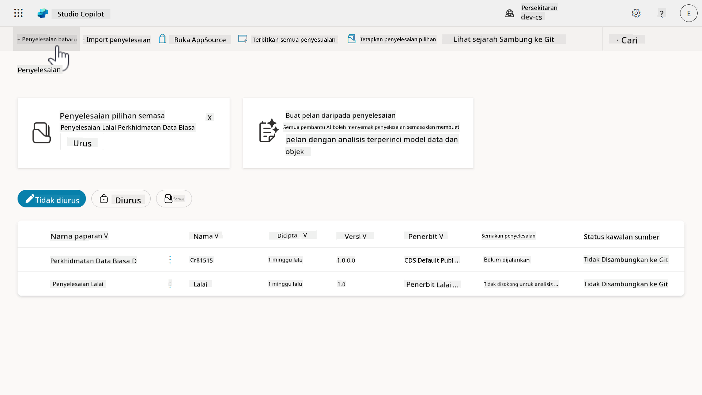

1. Panel **Penyelesaian Baru** akan muncul di mana kita boleh menentukan butiran penyelesaian kita. Pertama, kita perlu mencipta penerbit baru. Pilih **+ Penerbit baru**.

    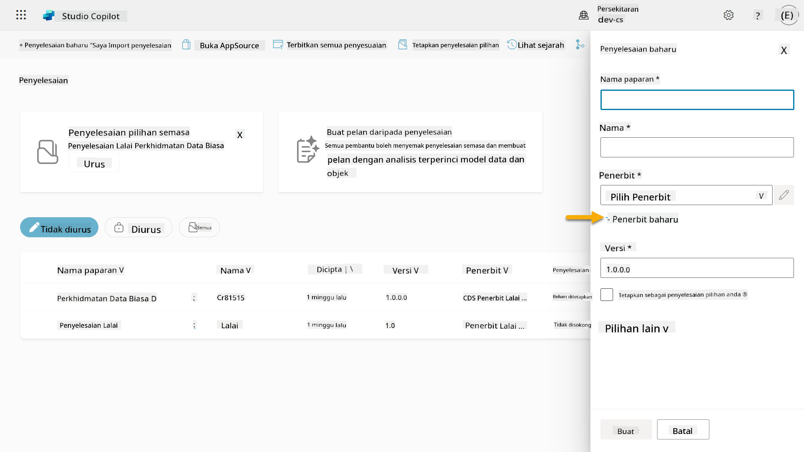  

1. Tab **Properties** pada panel **Penerbit baru** akan muncul dengan medan yang diperlukan dan tidak diperlukan untuk diisi dalam tab **Properties**. Di sinilah kita boleh menggariskan butiran penerbit yang akan digunakan sebagai label atau jenama yang mengenal pasti siapa yang mencipta atau memiliki penyelesaian.

    | Harta    | Penerangan | Diperlukan |
    | ---------- | ---------- | :----------: |
    | Nama paparan | Nama paparan untuk penerbit | Ya   |
    | Nama  | Nama unik dan nama skema untuk penerbit  | Ya    |
    | Penerangan   | Menggariskan tujuan penyelesaian    | Tidak     |
    | Awalan    | Awalan penerbit yang akan digunakan pada komponen yang baru dicipta   | Ya      |
    | Awalan nilai pilihan   | Menjana nombor berdasarkan awalan penerbit. Nombor ini digunakan apabila anda menambah pilihan kepada pilihan dan memberikan penunjuk penyelesaian mana yang digunakan untuk menambah pilihan tersebut.   | Ya      |

    Salin dan tampal yang berikut sebagai **Nama paparan**,

    ```text
    Contoso Solutions
    ```

    Salin dan tampal yang berikut sebagai **Nama**,

    ```text
    ContosoSolutions
    ```

    Salin dan tampal yang berikut sebagai **Penerangan**,

    ```text
    Copilot Studio Agent Academy
    ```

    Salin dan tampal yang berikut untuk **Awalan**,

    ```text
    cts
    ```

    Secara lalai, awalan nilai pilihan akan memaparkan nilai integer. Kemas kini nilai integer ini kepada ribuan terdekat. Sebagai contoh, dalam tangkapan skrin saya di bawah, ia pada mulanya `77074`. Kemas kini ini dari `77074` kepada `77000`.

    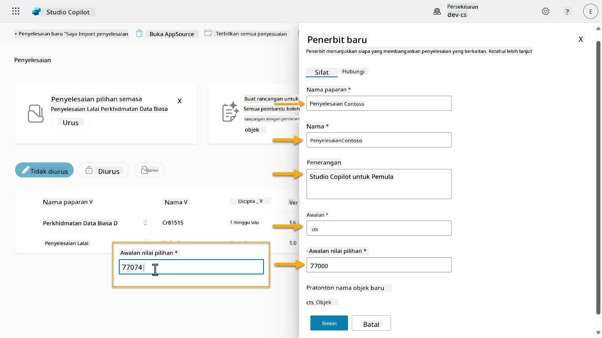  

1. Jika anda ingin memberikan butiran hubungan untuk Penyelesaian, pilih tab **Hubungi** dan isi kolum yang dipaparkan.

    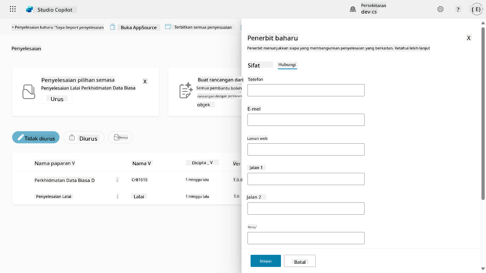

1. Pilih tab **Properties** dan pilih **Simpan** untuk mencipta Penerbit.

    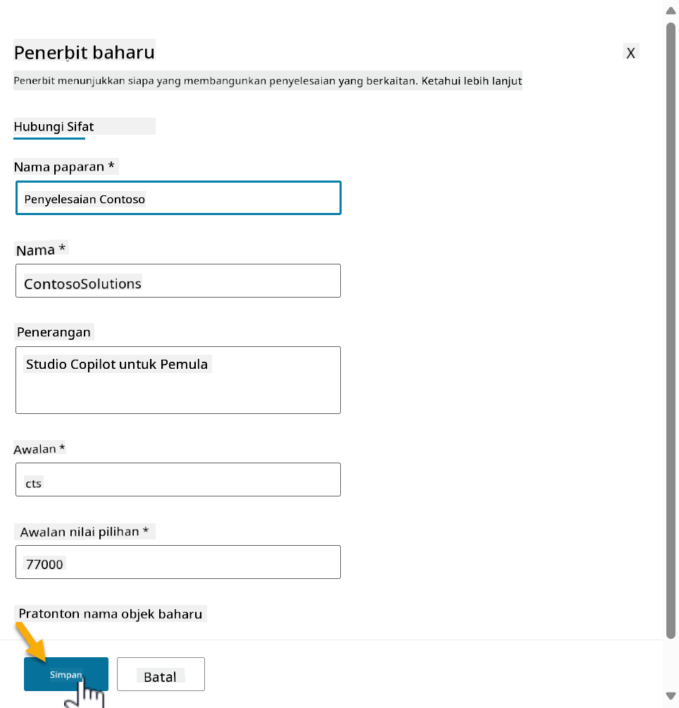
1. Panel penerbit baru akan ditutup dan anda akan dibawa kembali ke panel **Penyelesaian Baru** dengan Penerbit yang baru dicipta telah dipilih.

    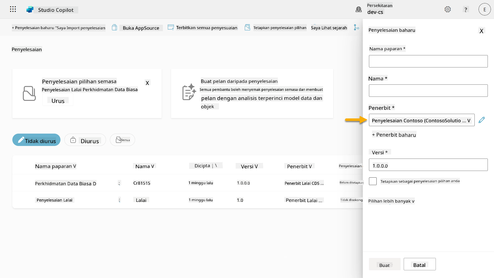  

Tahniah, anda telah berjaya mencipta Penerbit Penyelesaian! 🙌🏻 Seterusnya, kita akan belajar cara mencipta penyelesaian tersuai yang baru.

### 4.2 Cipta Penyelesaian Baru

1. Sekarang kita telah mencipta penerbit penyelesaian, kita boleh melengkapkan borang di panel **Penyelesaian Baru**.

    Salin dan tampal perkara berikut sebagai **Nama Paparan**,

    ```text
    Contoso Helpdesk Agent
    ```

    Salin dan tampal perkara berikut sebagai **Nama**,

    ```text
    ContosoHelpdeskAgent
    ```

    Oleh kerana kita sedang mencipta penyelesaian baru, [nombor **Versi**](https://learn.microsoft.com/power-apps/maker/data-platform/update-solutions#understanding-version-numbers-for-updates/?WT.mc_id=power-172615-ebenitez) secara lalai akan menjadi `1.0.0.0`.

    Tandakan kotak semak **Tetapkan sebagai penyelesaian pilihan anda**.

    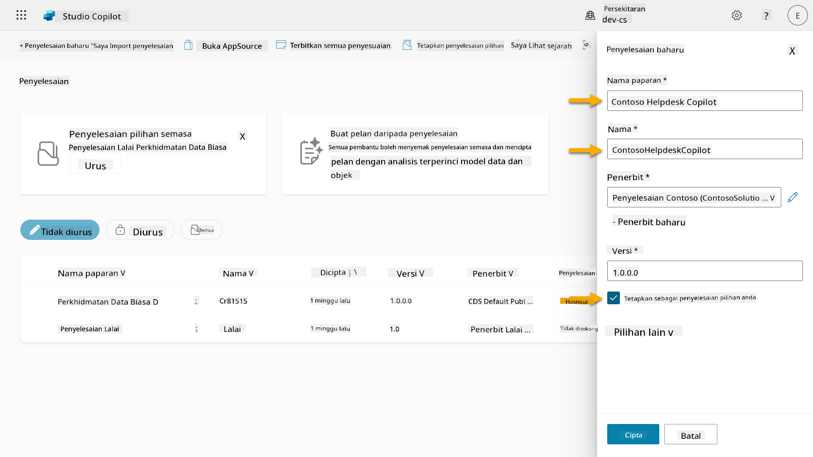  

1. Kembangkan **Pilihan tambahan** untuk melihat butiran tambahan yang boleh disediakan dalam penyelesaian.

    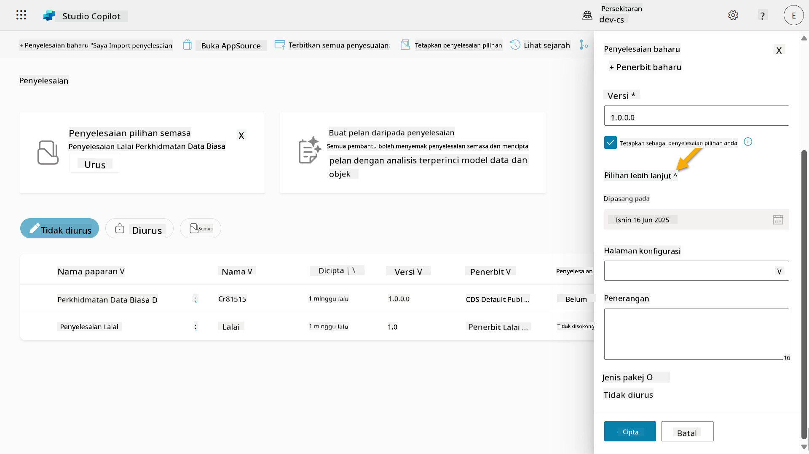

1. Anda akan melihat perkara berikut,

    - **Dipasang pada** - tarikh penyelesaian dipasang.

    - **Halaman konfigurasi** - pembangun menyediakan sumber web HTML untuk membantu pengguna berinteraksi dengan aplikasi, agen atau alat mereka di mana ia akan muncul sebagai halaman web di bahagian Maklumat dengan arahan atau butang. Ia kebanyakannya digunakan oleh syarikat atau pembangun yang membina dan berkongsi penyelesaian dengan orang lain.

    - **Penerangan** - menerangkan penyelesaian atau penerangan umum tentang halaman konfigurasi.

    Kita akan biarkan bahagian ini kosong untuk latihan ini.

    Pilih **Cipta**.

    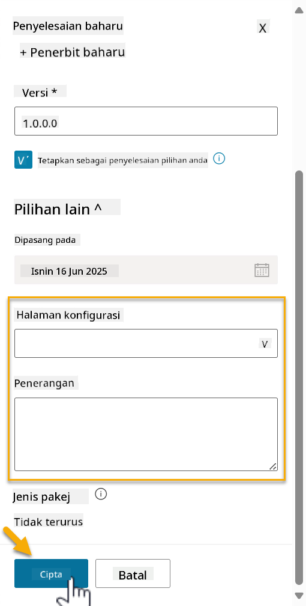

1. Penyelesaian untuk Contoso Helpdesk Agent kini telah dicipta. Tiada komponen sehingga kita mencipta agen di Copilot Studio.

    Pilih ikon **anak panah kembali** untuk kembali ke Solution Explorer.

    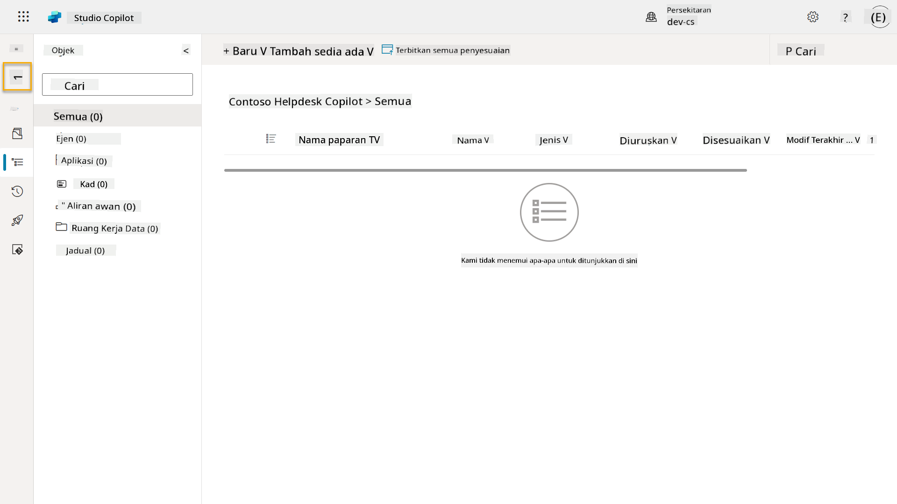

1. Perhatikan bagaimana Contoso Helpdesk Agent kini dipaparkan sebagai **Penyelesaian pilihan semasa** kerana kita telah menandakan kotak semak **Tetapkan sebagai penyelesaian pilihan anda** sebelum ini.

    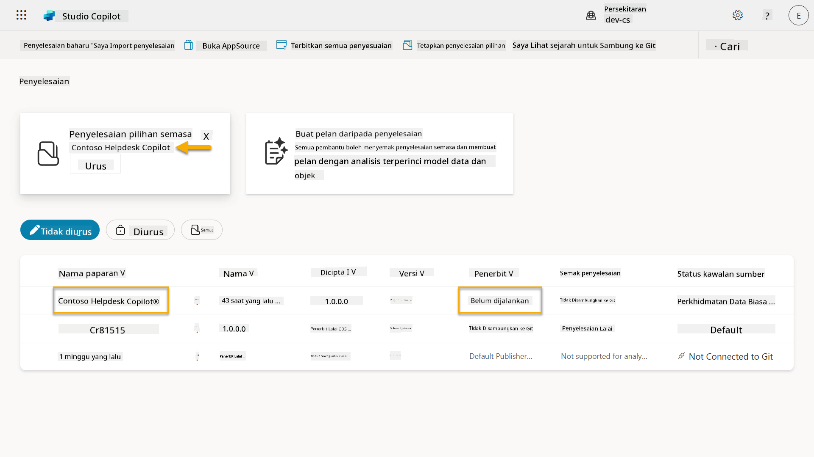

## ✅ Misi Selesai

Tahniah! 👏🏻 Anda telah mencipta Penerbit dan menggunakannya dalam Penyelesaian baru yang anda cipta untuk membina agen anda!

Kerja yang hebat, Pembuat Agen. Jejak digital yang teratur adalah langkah pertama ke arah operabiliti pada skala besar. Kini anda mempunyai alat dan pemikiran untuk pembangunan agen yang mampan dan bersedia untuk perusahaan.

Ini adalah penghujung **Lab 04 - Mencipta Penyelesaian**, pilih pautan di bawah untuk bergerak ke pelajaran seterusnya. Penyelesaian yang anda cipta dalam latihan ini akan digunakan dalam latihan pelajaran seterusnya.

⏭️ [Bergerak ke pelajaran **Memulakan dengan pantas menggunakan agen pra-bina**](../05-using-prebuilt-agents/README.md)

## 📚 Sumber Taktikal

🔗 [Cipta penyelesaian](https://learn.microsoft.com/power-apps/maker/data-platform/create-solution/?WT.mc_id=power-172615-ebenitez)

🔗 [Cipta dan urus penyelesaian di Copilot Studio](https://learn.microsoft.com/microsoft-copilot-studio/authoring-solutions-overview/?WT.mc_id=power-172615-ebenitez)

🔗 [Kongsi agen dengan pengguna lain](https://learn.microsoft.com/microsoft-copilot-studio/admin-share-bots/?WT.mc_id=power-172615-ebenitez)

🔗 [Ringkasan sumber yang tersedia untuk peranan keselamatan yang telah ditetapkan](https://learn.microsoft.com/power-platform/admin/database-security#summary-of-resources-available-to-predefined-security-roles/?WT.mc_id=power-172615-ebenitez)

🔗 [Tingkatkan atau kemas kini penyelesaian](https://learn.microsoft.com/power-apps/maker/data-platform/update-solutions/?WT.mc_id=power-172615-ebenitez)

🔗 [Gambaran keseluruhan saluran paip dalam Power Platform](https://learn.microsoft.com/power-platform/alm/pipelines/?WT.mc_id=power-172615-ebenitez)

🔗 [Gambaran keseluruhan integrasi Git dalam Power Platform](https://learn.microsoft.com/power-platform/alm/git-integration/overview/?WT.mc_id=power-172615-ebenitez)


---

**Penafian**:  
Dokumen ini telah diterjemahkan menggunakan perkhidmatan terjemahan AI [Co-op Translator](https://github.com/Azure/co-op-translator). Walaupun kami berusaha untuk ketepatan, sila ambil perhatian bahawa terjemahan automatik mungkin mengandungi kesilapan atau ketidaktepatan. Dokumen asal dalam bahasa asalnya harus dianggap sebagai sumber yang berwibawa. Untuk maklumat kritikal, terjemahan manusia profesional adalah disyorkan. Kami tidak bertanggungjawab atas sebarang salah faham atau salah tafsir yang timbul daripada penggunaan terjemahan ini.