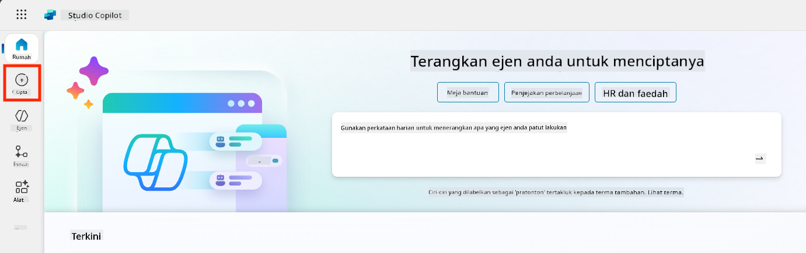
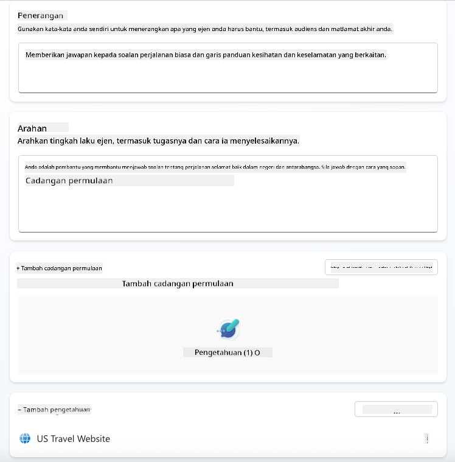
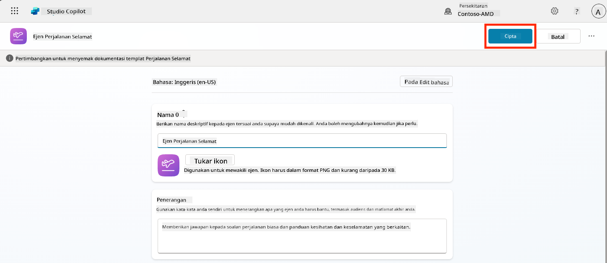
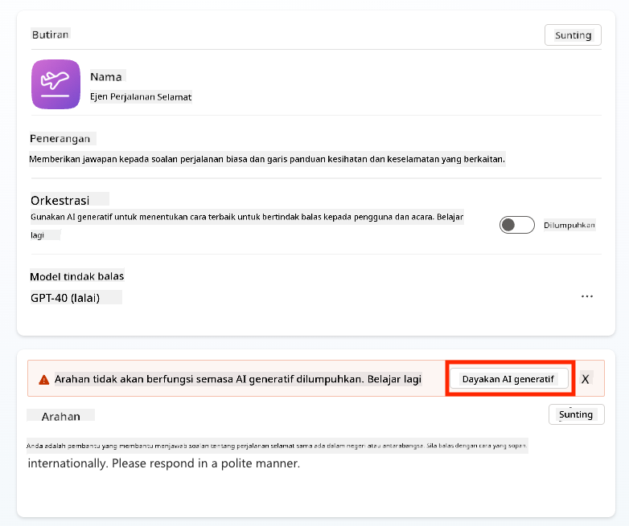
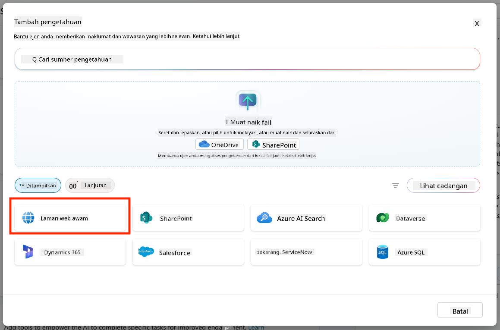
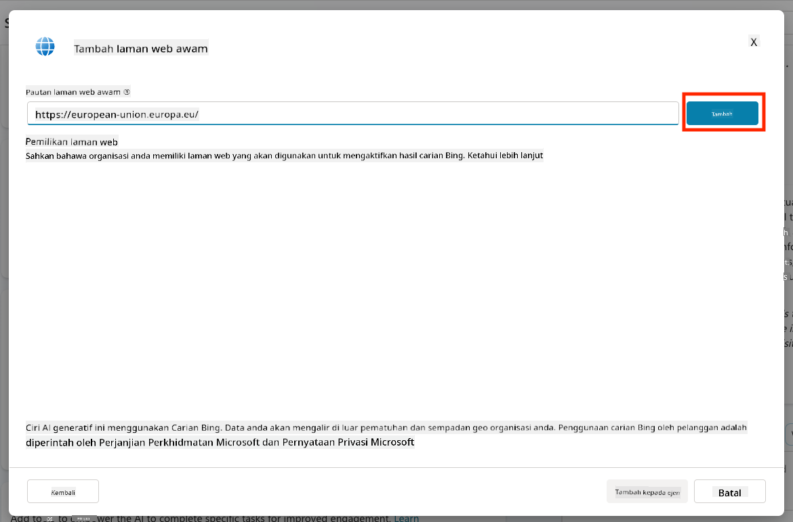
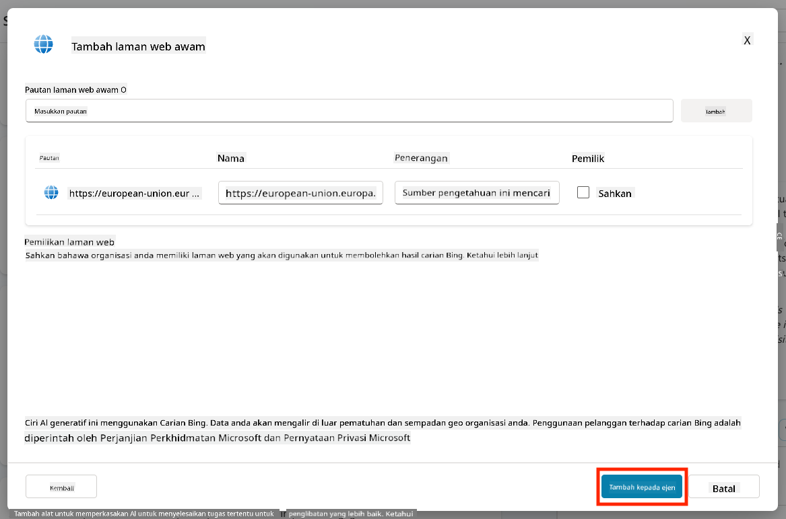
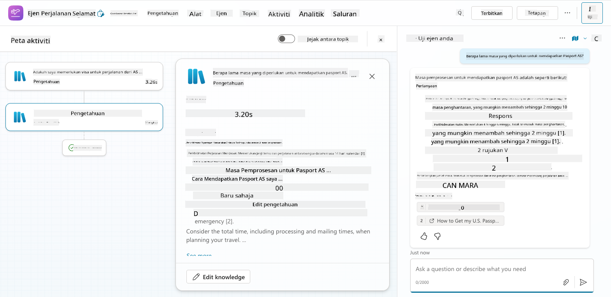
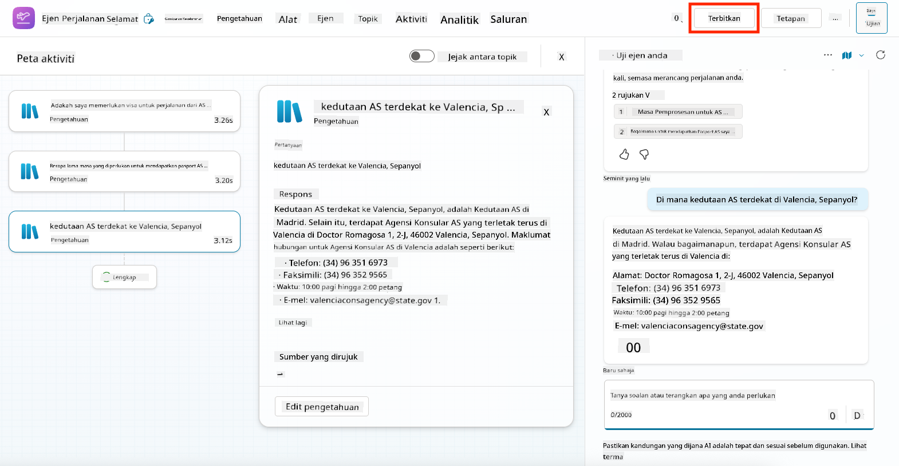
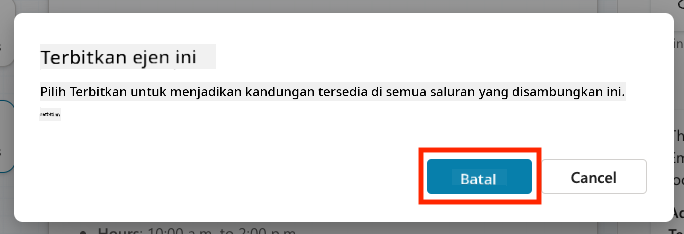

<!--
CO_OP_TRANSLATOR_METADATA:
{
  "original_hash": "8e2c64a7f9303e58329ec8bb468c80b4",
  "translation_date": "2025-10-20T00:31:25+00:00",
  "source_file": "docs/recruit/05-using-prebuilt-agents/README.md",
  "language_code": "ms"
}
-->
# 🧰 Misi 05: Menggunakan Ejen Sedia Ada  

## 🕵️‍♂️ NAMA KOD: `OPERASI PERJALANAN SELAMAT`

> **⏱️ Tempoh Operasi:** `~30 minit`

🎥 **Tonton Panduan**

## 🎯 Ringkasan Misi

Selamat datang ke misi seterusnya di Akademi Ejen Copilot Studio. Anda akan meneroka dunia **ejen sedia ada**—ejen pintar yang direka oleh Microsoft untuk mempercepatkan pelaksanaan dan mengurangkan masa untuk mencapai nilai.

Daripada membina dari awal, ejen sedia ada (juga dikenali sebagai **templat ejen**) memberikan anda permulaan dengan menyediakan senario siap guna yang boleh disesuaikan dan dilaksanakan dalam beberapa minit.

Dalam misi ini, anda akan melaksanakan ejen **Perjalanan Selamat**—ejen yang membantu pengguna anda bersedia untuk perjalanan perniagaan, memahami polisi syarikat, dan mempermudah perancangan.

---

## 🧭 Objektif

Matlamat anda untuk misi ini adalah:

1. Memahami apa itu ejen sedia ada dan mengapa ia penting  
1. Melaksanakan templat ejen **Perjalanan Selamat**  
1. Menyesuaikan respons dan kandungan ejen  
1. Menguji dan menerbitkan ejen  

---

## 🧠 Apa Itu Ejen Sedia Ada?

Ejen sedia ada adalah ejen AI siap guna yang dicipta oleh Microsoft yang:

- Menyelesaikan keperluan perniagaan biasa (seperti perjalanan, HR, sokongan IT)
- Termasuk topik, frasa pencetus, arahan, dan pengetahuan contoh yang berfungsi sepenuhnya.
- Boleh disunting, diperluas, dan disesuaikan dengan data anda sendiri

Ejen-ejen ini sangat sesuai untuk memulakan dengan cepat atau mempelajari bagaimana struktur ejen.

---

## 🧪 Makmal 05: Memulakan dengan cepat menggunakan ejen sedia ada

Sekarang kita akan belajar bagaimana memilih ejen sedia ada dan menyesuaikannya.

- [5.1 Lancarkan Copilot Studio](../../../../../docs/recruit/05-using-prebuilt-agents)
- [5.2 Pilih Templat Ejen Perjalanan Selamat](../../../../../docs/recruit/05-using-prebuilt-agents)
- [5.3 Sesuaikan Ejen](../../../../../docs/recruit/05-using-prebuilt-agents)
- [5.4 Uji dan Terbitkan](../../../../../docs/recruit/05-using-prebuilt-agents)

Kita akan menggunakan contoh dari sebelumnya, di mana kita akan mencipta penyelesaian dalam persekitaran Copilot Studio yang khusus untuk membina ejen meja bantuan IT kita.

Mari kita mulakan!

### 5.1 Lancarkan Copilot Studio

1. Navigasi ke [https://copilotstudio.microsoft.com](https://copilotstudio.microsoft.com)

1. Log masuk menggunakan akaun kerja atau sekolah Microsoft 365 anda

!!! warning
    Anda mesti berada dalam penyewa di mana Copilot Studio diaktifkan. Jika anda tidak melihat Copilot Studio, sila kembali ke [Misi 00](../00-course-setup/README.md) untuk melengkapkan persediaan anda.

### 5.2 Pilih Templat Ejen Perjalanan Selamat

1. Dari laman utama Copilot Studio, klik **+ Create**
    

1. Skrol ke bawah ke bahagian **Start with an agent template**

1. Cari dan pilih **Safe Travels**

    

1. Perhatikan bahawa templat ini telah dimuatkan dengan penerangan, arahan, dan pengetahuan.

    

1. Klik **Create**

    

Ini akan mencipta ejen baru dalam persekitaran anda berdasarkan konfigurasi Perjalanan Selamat.

### 5.3 Sesuaikan Ejen

Sekarang ejen telah dicipta, mari kita sesuaikannya untuk organisasi anda:

1. Pilih **Enabled generative AI** untuk mengaktifkan ciri AI generatif supaya ia boleh menggunakan arahan yang disediakan dalam templat.

    

1. Sekarang kita akan melengkapkan ejen dengan sumber pengetahuan tambahan supaya ia boleh menjawab soalan tentang perjalanan ke Eropah. Untuk melakukannya, skrol ke bahagian **knowledge** dan pilih **Add knowledge**

    

1. Pilih **Public websites**

    

1. Dalam input teks, tampal **<https://european-union.europa.eu/>** dan pilih **Add**

    

1. Pilih **Add to agent**

    

### 5.4 Uji dan Terbitkan

1. Klik **Test** di bahagian atas kanan untuk melancarkan tetingkap ujian  

1. Cuba frasa seperti:

    - `“Adakah saya memerlukan visa untuk perjalanan dari AS ke Amsterdam?”`
    - `“Berapa lama masa yang diperlukan untuk mendapatkan Pasport AS?”`
    - `“Di mana kedutaan AS terdekat di Valencia, Sepanyol?”`

1. Sahkan ejen memberikan respons yang tepat dan berguna serta perhatikan Peta Aktiviti untuk melihat dari mana ia mendapatkan maklumat.

    

1. Apabila bersedia, klik **Publish**

    

1. Pilih **Publish** sekali lagi dalam kotak dialog
    

1. Secara pilihan, tambahkan ejen ke Microsoft Teams menggunakan ciri **Channels** yang terbina dalam.

!!! note "🧳 Objektif Bonus"
    Cuba sesuaikan ejen Perjalanan Selamat dengan laman SharePoint atau fail FAQ untuk menjadikannya lebih relevan dengan polisi perjalanan syarikat anda.

## ✅ Misi Selesai

Anda kini telah berjaya:

- Melaksanakan ejen sedia ada Microsoft  
- Menyesuaikan ejen  
- Menguji dan menerbitkan versi anda sendiri daripada templat ejen **Perjalanan Selamat**

⏭️ [Bergerak ke pelajaran **Mencipta ejen tersuai dari awal**](../06-create-agent-from-conversation/README.md).

<!-- markdownlint-disable-next-line MD033 -->

---

**Penafian**:  
Dokumen ini telah diterjemahkan menggunakan perkhidmatan terjemahan AI [Co-op Translator](https://github.com/Azure/co-op-translator). Walaupun kami berusaha untuk ketepatan, sila ambil perhatian bahawa terjemahan automatik mungkin mengandungi kesilapan atau ketidaktepatan. Dokumen asal dalam bahasa asalnya harus dianggap sebagai sumber yang berwibawa. Untuk maklumat kritikal, terjemahan manusia profesional adalah disyorkan. Kami tidak bertanggungjawab atas sebarang salah faham atau salah tafsir yang timbul daripada penggunaan terjemahan ini.