<!--
CO_OP_TRANSLATOR_METADATA:
{
  "original_hash": "180f9cc0b40527f61be092c9b0f72aba",
  "translation_date": "2025-10-20T00:52:26+00:00",
  "source_file": "docs/recruit/06-create-agent-from-conversation/README.md",
  "language_code": "ms"
}
-->
# 🚨 Misi 06: Cipta ejen tersuai menggunakan bahasa semula jadi dengan Copilot dan menghubungkannya dengan data anda

## 🕵️‍♂️ NAMA KOD: `OPERASI PEMBENTUKAN EJEN`

> **⏱️ Tempoh Operasi:** `~75 minit`

🎥 **Tonton Panduan**

[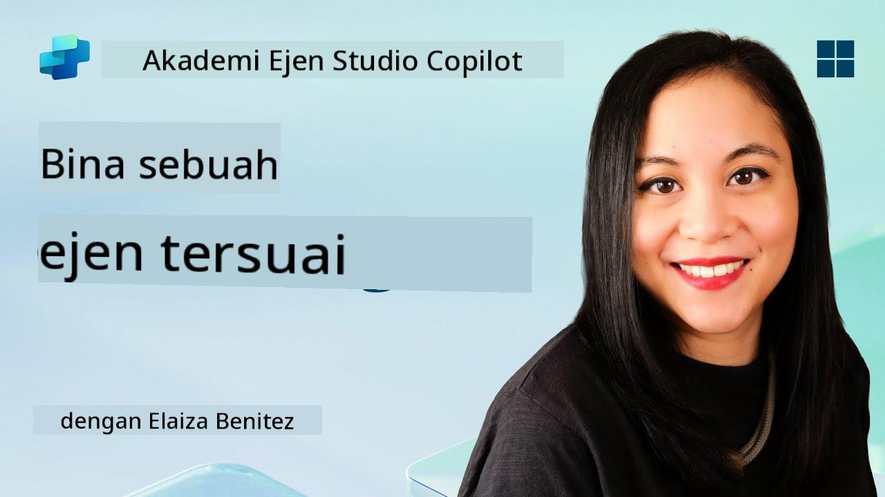](https://www.youtube.com/watch?v=qZTtQVncGFg "Tonton panduan di YouTube")

## 🎯 Ringkasan Misi

Selamat kembali, Pembuat Ejen. Misi ini meletakkan anda di kerusi komando keupayaan paling berkuasa dalam Copilot Studio - mencipta ejen tersuai dari awal menggunakan hanya bahasa semula jadi… dan memperkuatkannya dengan data anda sendiri.

Ini bukan sekadar chatbot biasa. Anda sedang membina rakan sekerja digital yang berpengetahuan - yang boleh berfikir, memberi respons, dan merujuk maklumat sebenar dari perusahaan.

Senjata pilihan anda? Bahasa semula jadi. Misi anda? Reka, latih, dan uji ejen helpdesk tersuai sepenuhnya yang menjawab soalan IT menggunakan SharePoint, fail yang dimuat naik, atau URL syarikat.

Mari bina ejen anda dari asas.

## 🔎 Objektif

Dalam misi ini, anda akan belajar:

1. Memahami apa itu ejen tersuai dan bagaimana ia berbeza daripada templat pra-bina
1. Mencipta ejen menggunakan arahan bahasa semula jadi dan reka bentuk perbualan dengan Copilot
1. Menghubungkan ejen dengan sumber pengetahuan perusahaan termasuk SharePoint, dokumen, dan laman web
1. Belajar tentang orkestrasi generatif dan bagaimana ejen mencari dan memberi respons secara dinamik menggunakan pelbagai sumber data
1. Membina dan menguji ejen helpdesk IT yang berfungsi sepenuhnya yang boleh menjawab soalan daripada data anda sendiri

## 🤔 Apa itu ejen _tersuai_?

Ejen tersuai ialah chatbot atau pembantu maya yang anda cipta dan reka dalam Copilot Studio untuk membantu pengguna dengan tugas atau soalan tertentu. Ia dipanggil tersuai kerana:

- **Anda menentukan tujuannya** - membantu pengguna meminta cuti, menyemak status pesanan, memberikan bantuan berkaitan IT.
- **Anda menentukan perbualan** - apa yang ejen katakan dan bagaimana ia harus memberi respons.
- **Anda menghubungkannya dengan data anda sendiri** - sambungkan kepada data perusahaan anda melalui sumber pengetahuan yang disokong.
- **Anda menghubungkannya dengan sistem atau aplikasi anda sendiri** - pilih daripada penyambung, aliran, REST API dan pelayan protokol konteks model.

!!! note
    Fikirkan begini: anda sedang membina pembantu digital anda sendiri yang boleh bercakap dengan pengguna dan menyelesaikan tugas untuk mereka seperti menjawab soalan, mengumpulkan maklumat yang diperlukan oleh proses, atau menyambung kepada data perusahaan anda.

### 🤖 Apa yang boleh dilakukan oleh ejen tersuai?

Ejen tersuai boleh memenuhi perkara berikut:

- Bertanya kepada pengguna maklumat seperti nama, tarikh, atau pilihan.
- Menyimpan maklumat tersebut ke dalam pangkalan data atau jadual.
- Mencari data berdasarkan soalan yang ditanya dan menjawabnya.
- Bekerja secara autonomi tanpa interaksi langsung dengan pengguna.
- Mencetuskan tindakan sama ada atas permintaan melalui interaksi langsung pengguna atau secara autonomi seperti menghantar e-mel atau mencipta rekod.

### 👩🏻‍💻 Mengapa menggunakan ejen tersuai?

- Menjimatkan masa dengan mengautomasi tugas berulang.
- Memberikan pengalaman yang mesra dan terarah kepada pengguna.
- Menyesuaikannya dengan keperluan perniagaan atau projek anda.

### ✨ Contoh

Anda membina ejen tersuai yang membantu pekerja meminta cuti.

Ia akan bertanya nama mereka, tarikh cuti, dan nama pengurus mereka, kemudian menyimpan maklumat tersebut ke dalam sistem yang ditetapkan untuk menguruskan permintaan cuti, seperti senarai SharePoint.

Kini, daripada perlu menavigasi ke senarai SharePoint dan mencipta item baru, pekerja hanya perlu berbual dengan ejen tersebut.

## 🗣️ Gunakan bahasa semula jadi untuk mencipta ejen

Sebelumnya anda telah belajar cara membina ejen dengan cepat dalam Copilot Studio menggunakan templat ejen pra-bina dalam [Pelajaran 05 - Memulakan dengan cepat menggunakan ejen pra-bina](../05-using-prebuilt-agents/README.md). Dalam pelajaran ini, kita akan mendalami pengalaman penciptaan perbualan dengan Copilot. Copilot Studio memudahkan anda membina ejen dengan berbual dengan Copilot, seperti sedang berbual.

Dalam Copilot Studio, anda tidak perlu menulis kod untuk mencipta ejen. Sebaliknya, anda hanya perlu menerangkan apa yang anda mahu ejen anda lakukan dalam bahasa biasa, dan Copilot akan membantu anda membinanya langkah demi langkah melalui pengalaman seperti berbual.

## 🌱 Tetapi saya baru dalam "menerangkan apa yang saya mahu" - apa yang perlu saya lakukan?

Menerangkan dalam bahasa semula jadi untuk mencipta ejen tersuai mungkin konsep baru bagi anda. Setiap kali anda menggunakan Copilot dalam produk dan perkhidmatan Microsoft, anda menggunakan bahasa semula jadi dalam bentuk _prompt_.

Prompt ialah mesej atau arahan yang anda berikan kepada ejen AI untuk memberitahunya apa yang anda mahu ia lakukan. Fikirkan ia seperti memberikan arahan kepada pembantu. Semakin jelas arahan anda, semakin mudah pembantu anda memahami dan melaksanakannya.

### 🪄 Mengapa Prompt penting

- Ia membimbing tingkah laku ejen.
- Ia membantu ejen memahami jenis perbualan yang perlu dilakukan.
- Prompt yang baik menjadikan ejen lebih membantu dan tepat.

### 📝 Petua untuk menulis prompt yang baik

- Jelas dan spesifik - nyatakan dengan tepat apa yang anda mahu ejen lakukan.
- Fikir seperti pengguna - apa yang akan pengguna katakan? Apa yang harus ejen balas?
- Sertakan contoh - jika boleh, berikan interaksi sampel.

### ✨ Contoh

Katakan pasukan HR memerlukan ejen untuk membantu dengan permintaan cuti.

Promptnya boleh jadi,

    “Saya mahu membina ejen yang membantu pengguna menghantar permintaan cuti. Apabila pengguna mengatakan mereka mahu meminta cuti, ejen harus bertanya nama mereka, tarikh mula cuti, tarikh akhir cuti, dan nama pengurus mereka. Setelah pengguna memberikan maklumat ini, ejen harus menyimpannya ke senarai SharePoint yang dipanggil ‘Permintaan Cuti’ dan menghantar notifikasi di saluran Microsoft Teams yang khusus.”

Mengapa prompt ini berkesan:

- **Nyatakan matlamat dengan jelas** - menghantar permintaan cuti
- **Terangkan interaksi pengguna** - apa yang pengguna katakan dan apa yang ejen harus tanya
- **Senaraikan data yang diperlukan** - nama, tarikh mula, tarikh akhir, pengurus
- **Nyatakan di mana data akan disimpan** - senarai SharePoint yang dipanggil Permintaan Cuti

## 🔮 OK, saya telah mencipta ejen saya... bagaimana saya menghubungkannya dengan pengetahuan?

Dalam Copilot Studio, sumber pengetahuan adalah tempat di mana ejen anda boleh mencari maklumat untuk memberikan jawapan yang lebih baik. Apabila anda menambah sumber-sumber ini, ejen anda boleh menarik data perusahaan anda dari tempat seperti Power Platform, Dynamics 365, laman web, dan sistem atau perkhidmatan lain yang digunakan oleh syarikat anda.

Sumber-sumber ini bekerjasama dengan AI untuk membantu ejen anda memberi respons dengan lebih tepat kepada soalan pengguna, ini dicapai melalui apa yang dikenali sebagai **orkestrasi generatif**.

### 🌿 Apa itu orkestrasi generatif dalam konteks ejen?

Orkestrasi generatif bermaksud ejen menggunakan AI untuk memutuskan secara dinamik bagaimana menjawab soalan dengan menggabungkan kemahiran bahasa terbina dalam dengan maklumat dari sumber pengetahuan yang anda tambahkan.

Apabila pengguna bertanya soalan, ejen:

- Memahami soalan menggunakan AI.
- Boleh bertanya kepada pengguna maklumat yang hilang dengan menjana soalan secara spontan.
- Memilih sumber pengetahuan yang paling relevan.
- Mencari jawapan dalam sumber-sumber tersebut.
- Menjana respons semula jadi dan membantu menggunakan maklumat yang ditemui.

### 🏦 Mengapa sumber pengetahuan penting?

1. **Jawapan yang lebih pintar** - apabila anda menambah sumber pengetahuan, ejen anda boleh memberikan jawapan yang lebih baik dan lebih tepat menggunakan data sebenar dari organisasi anda.

1. **Kurang kerja manual** - anda tidak perlu menulis setiap respons yang mungkin. Ejen boleh mencari melalui sumber yang ditambah dan memberi respons secara automatik.

1. **Gunakan maklumat yang dipercayai** - ejen anda boleh menarik jawapan dari sistem yang sudah anda gunakan seperti Dataverse, SharePoint, atau laman web syarikat supaya pengguna mendapat maklumat yang boleh dipercayai dari sumber yang sah.

1. **Berfungsi dengan AI generatif** - sumber pengetahuan dan AI membantu ejen anda memahami soalan dan memberi respons secara semula jadi, walaupun soalan itu tidak diprogramkan atau ditambah sebagai prompt permulaan.

1. **Fleksibel dan boleh dikembangkan** - anda boleh menambah sumber pengetahuan pada bila-bila masa semasa persediaan atau pada masa akan datang, ejen anda menjadi lebih pintar apabila keperluan anda berubah.

### ✨ Contoh

Bayangkan anda membina ejen untuk membantu pekerja dengan soalan HR. Anda menambah dokumen polisi HR syarikat anda dan laman SharePoint sebagai sumber pengetahuan.

Apabila seorang pekerja bertanya, _“Berapa hari cuti yang saya layak?”_, ejen menggunakan orkestrasi generatif untuk mencari sumber-sumber tersebut dan membalas dengan polisi yang betul tanpa anda perlu menulis jawapan itu secara manual. Ini menjimatkan masa anda daripada perlu mengambil kira setiap soalan yang mungkin ditanya oleh pekerja mengenai kelayakan mereka.

## Jenis sumber pengetahuan yang boleh ditambah

1. **Laman web awam**
    - **Apa yang dilakukan:** Mencari laman web tertentu (seperti laman syarikat anda) menggunakan Bing.
    - **Mengapa ia berguna:** Bagus untuk menarik maklumat yang boleh diakses umum seperti FAQ atau butiran produk.

1. **Dokumen**
    - **Apa yang dilakukan:** Menggunakan dokumen yang anda muat naik terus ke ejen anda, seperti PDF atau fail Word. Fail yang dimuat naik ini disimpan dengan selamat dalam Dataverse.
    - **Mengapa ia berguna:** Membolehkan ejen anda menjawab soalan berdasarkan panduan dalaman, manual atau polisi.

1. **SharePoint**
    - **Apa yang dilakukan:** Menyambung ke folder atau fail SharePoint menggunakan Microsoft Graph Search.
    - **Mengapa ia berguna:** Ideal untuk mengakses dokumen pasukan, polisi HR, atau fail projek yang disimpan di SharePoint.

1. **Dataverse**
    - **Apa yang dilakukan:** Menggunakan data berstruktur dari jadual dan baris persekitaran Dataverse anda, dan boleh menggunakan sinonim dan definisi glosari untuk jadual dan lajur bagi meningkatkan respons ejen.
    - **Mengapa ia berguna:** Apabila anda perlu mencari data perusahaan yang disimpan dalam Dataverse seperti maklumat pelanggan.

1. **Pengetahuan masa nyata dengan penyambung**
    - **Apa yang dilakukan:** Membolehkan ejen anda mengakses data langsung dari sistem perusahaan lain seperti Salesforce, ServiceNow, Dynamics 365, AzureSQL, Databricks, dan banyak lagi semasa perbualan, menggunakan kebenaran pengguna sendiri.
    - **Mengapa ia berguna:** Ia memberikan respons yang terkini, selamat, dan tepat tanpa menyimpan atau menduplikasi data, menjadikan ejen anda lebih pintar dan selamat.

1. **Azure AI Search**
    - **Apa yang dilakukan:** Membolehkan ejen anda mencari melalui set dokumen besar yang disimpan di Azure menggunakan carian semantik dan vektor untuk memahami soalan pengguna.
    - **Mengapa ia berguna:** Memberikan jawapan yang tepat dan boleh dipercayai dari sumber data yang kompleks, menyokong sitasi, dan skala dengan baik untuk koleksi dokumen besar dengan kawalan akses yang selamat.

## 🔒 Nota tentang keselamatan

### Pengesahan sumber pengetahuan

Beberapa sumber seperti SharePoint dan Dataverse memerlukan pengesahan pengguna. Ini bermakna ejen hanya akan merujuk data dalam responsnya yang pengguna dibenarkan untuk melihat. Manakala sumber lain mungkin memerlukan konfigurasi tambahan untuk ejen menyambung kepadanya seperti Azure AI Search yang memerlukan akaun Azure dan menentukan jenis pengesahan.

## Meningkatkan respons ejen anda dalam Copilot Studio

Selepas ejen anda disediakan dari pengalaman penciptaan perbualan, anda perlu menguji ejen anda terhadap arahan yang dihasilkan Copilot dari prompt anda. Meningkatkan respons ejen anda dalam Copilot Studio adalah tentang memastikan ia memahami matlamat anda dengan jelas dan mempunyai maklumat yang betul untuk digunakan.

1. **Perbaiki arahan ejen** - ini adalah tempat anda memberitahu ejen bagaimana ia harus bertindak. Gunakan bahasa yang jelas dan spesifik.

    Contohnya:

    ✅ “Bertindak seperti ejen sokongan pelanggan yang mesra dan menjelaskan perkara dengan mudah.”

    ❌ “Jadilah berguna.” (Terlalu kabur)

1. **Periksa nada dan bahasa** - pastikan nada ejen sesuai dengan audiens anda.

    Anda boleh menetapkannya sebagai:

    - Mesra dan santai.
    - Profesional dan ringkas.
    - Menyokong dan sabar.

1. **Tambah atau kemas kini sumber pengetahuan** - jika ejen anda perlu menjawab soalan tentang sesuatu topik, pastikan ia mempunyai akses kepada maklumat yang betul.

    - Tambah pautan ke laman web, dokumen, atau FAQ.
    - Pastikan kandungan sentiasa dikemas kini.
    - Gunakan maklumat yang jelas dan berstruktur dengan baik.

1. **Gunakan Topik dan Pencetus** - Jika ejen anda perlu mengendalikan tugas atau perbualan tertentu, anda boleh mencipta topik dengan frasa pencetus. Ini membantu membimbing perbualan dengan lebih tepat. Kita akan belajar lebih lanjut tentang ini dalam pelajaran seterusnya.

1. **Uji dengan soalan sebenar** - cuba tanya ejen anda jenis soalan yang mungkin ditanya oleh pengguna.

    Jika jawapannya tidak memuaskan:

    - Sesuaikan arahan sistem.
    - Tambah lebih banyak contoh atau pengetahuan.
    - Ubah suai soalan anda untuk melihat bagaimana ia memberi respons.

1. **Semak dan ulang** - meningkatkan ejen adalah proses yang berterusan!

    Selepas diterbitkan:

    - Kumpulkan maklum balas daripada pengguna.
    - Perhatikan soalan atau kekeliruan yang biasa.
    - Teruskan memperbaiki persediaan ejen.

## 🧪 Makmal 06: Cipta ejen tersuai dalam Copilot Studio

Sekarang kita akan belajar cara mencipta ejen tersuai yang boleh berbual menggunakan data anda

- [6.1 Gunakan bahasa semula jadi untuk mencipta ejen dengan Copilot](../../../../../docs/recruit/06-create-agent-from-conversation)
- [6.2 Tambah sumber pengetahuan dalaman menggunakan laman SharePoint](../../../../../docs/recruit/06-create-agent-from-conversation)
- [6.3 Tambah sumber pengetahuan dalaman dengan memuat naik dokumen](../../../../../docs/recruit/06-create-agent-from-conversation)
- [6.4 Uji ejen](../../../../../docs/recruit/06-create-agent-from-conversation)

### ✨ Kes penggunaan
Kami akan menggunakan kes penggunaan yang sama daripada [Lesson 03 - Create a declarative agent for Microsoft 365 Copilot](../03-create-a-declarative-agent-for-M365Copilot/README.md#use-case-scenario)

**Sebagai** pekerja

**Saya mahu** mendapatkan bantuan yang cepat dan tepat daripada ejen meja bantuan IT untuk masalah seperti masalah peranti, penyelesaian masalah rangkaian, pemasangan pencetak

**Supaya saya boleh** kekal produktif dan menyelesaikan masalah teknikal tanpa kelewatan

Mari kita mulakan!

### ✨ Prasyarat

- **Laman SharePoint**

Kami akan menggunakan laman SharePoint **Contoso IT** daripada [Lesson 00 - Course Setup - Step 3: Create new SharePoint site](../00-course-setup/README.md#step-4-create-new-sharepoint-site).

Jika anda belum menyediakan laman SharePoint **Contoso IT**, sila kembali ke [Lesson 00 - Course Setup - Step 3: Create new SharePoint site](../00-course-setup/README.md#step-4-create-new-sharepoint-site).

- **Penyelesaian**

Kami akan menggunakan penyelesaian **Contoso Helpdesk Agent** daripada [Lesson 04 - Creating a Solution for your agent](../04-creating-a-solution/README.md#41-create-a-solution-publisher).

Jika anda belum menyediakan penyelesaian **Contoso Agent**, sila kembali ke [Lesson 04 - Creating a Solution for your agent](../04-creating-a-solution/README.md#41-create-a-solution-publisher).

### 6.1 Gunakan bahasa semula jadi untuk mencipta ejen dengan Copilot

!!! warning "Soalan Copilot mungkin berbeza antara sesi"

    Pengalaman penciptaan perbualan Copilot boleh berbeza setiap kali di mana soalan yang diberikan untuk panduan mungkin sedikit berbeza daripada sebelumnya.

1. Navigasi ke halaman utama Copilot Studio dan dalam medan, masukkan arahan berikut yang menerangkan ejen meja bantuan IT. Arahan ini termasuk matlamat ejen, konteks, tugas yang diharapkan dan format respons ejen.

    ```text
    You are an IT help desk agent. Your goal is to assist users with their IT issues. You can access information from our company's knowledge base at https://support.microsoft.com/en-us. Your responses should be polite and helpful. If a user reports a slow computer, ask about the age of the device, current software versions, and if they've recently installed any new programs. If a user is experiencing trouble logging into their email, guide them through password reset procedures. You should be concise and informative, using step-by-step instructions with bullet points when appropriate.
    ```

      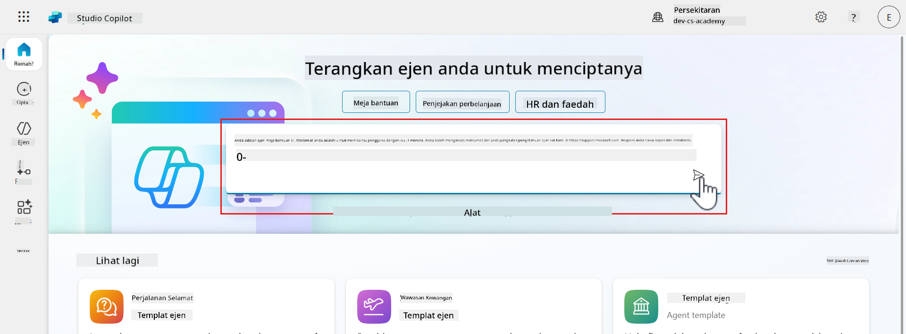

1. Pengalaman penciptaan perbualan dengan Copilot akan dimuatkan seterusnya. Anda akan melihat Copilot sedang dalam proses memberikan respons kepada anda.

      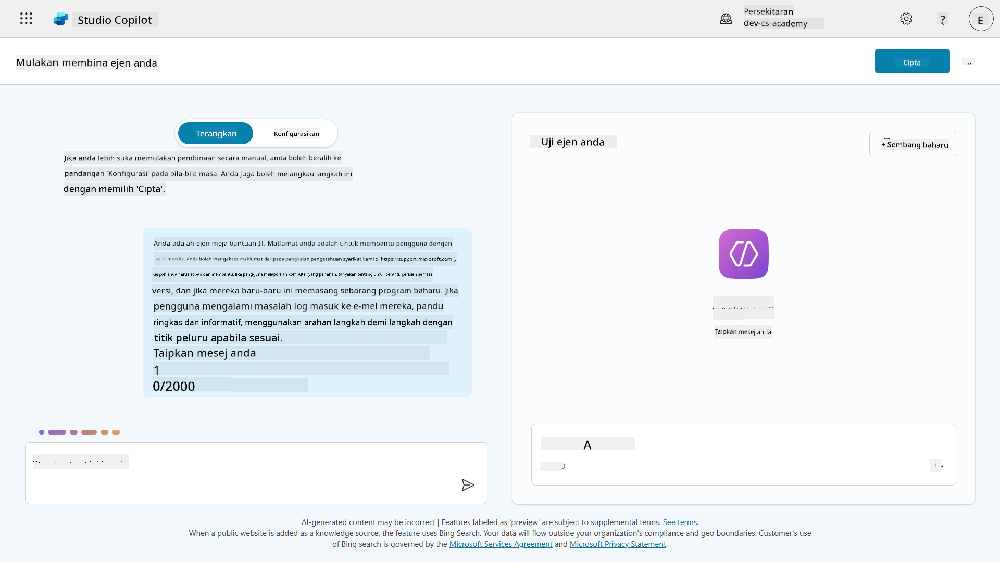

1. Copilot mengesahkan ejen telah disediakan dengan arahan yang diberikan, dan meminta pengesahan nama ejen. Kami akan meminta Copilot untuk menamakan ejen kami sebagai,

       ```text
       Contoso Helpdesk Agent
       ```

      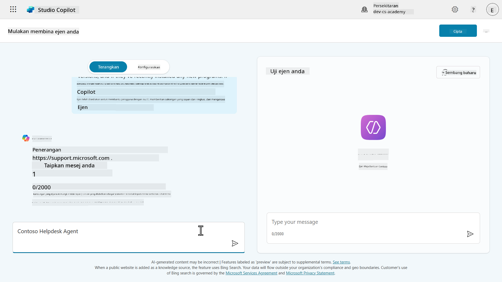

1. Copilot melaksanakan permintaan dan kami akan melihat bahawa nama ejen telah dikemas kini dalam panel ejen. Copilot seterusnya meminta kami untuk memperhalusi arahan. Ia bertanya bagaimana kami harus bertindak balas terhadap isu tertentu dan kami akan meminta agar ia mengakui isu tersebut, memberikan contoh topik untuk dijawab, dan memformat respons sebagai poin-poin.

    Salin dan tampal yang berikut, dan hantar permintaan kepada Copilot.

       ```text
       Utamakan permintaan yang mendesak. Contoh isu IT atau senario untuk dibantu: masalah peranti, sambungan rangkaian, masalah log masuk. Semasa menyelesaikan masalah, mula-mula akui isu mereka dan bertindak balas dengan empati, kemudian berikan panduan langkah demi langkah menggunakan poin-poin dan tanya jika mereka memerlukan bantuan lanjut.
       ```

      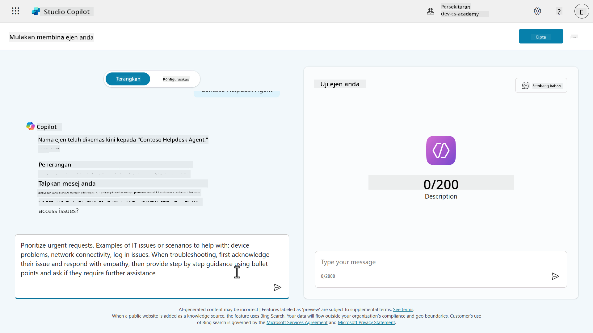

1. Arahan ejen akan dikemas kini selepas Copilot menerima permintaan. Perhatikan bagaimana pada panel sebelah kanan, arahan permulaan kini telah muncul. Arahan ini dibentuk berdasarkan arahan kami.

    Seterusnya, Copilot meminta laman web awam untuk menjadi sumber pengetahuan ejen.

    Salin dan tampal yang berikut, dan hantar permintaan kepada Copilot.

      ```text
      https://support.microsoft.com
      ```

      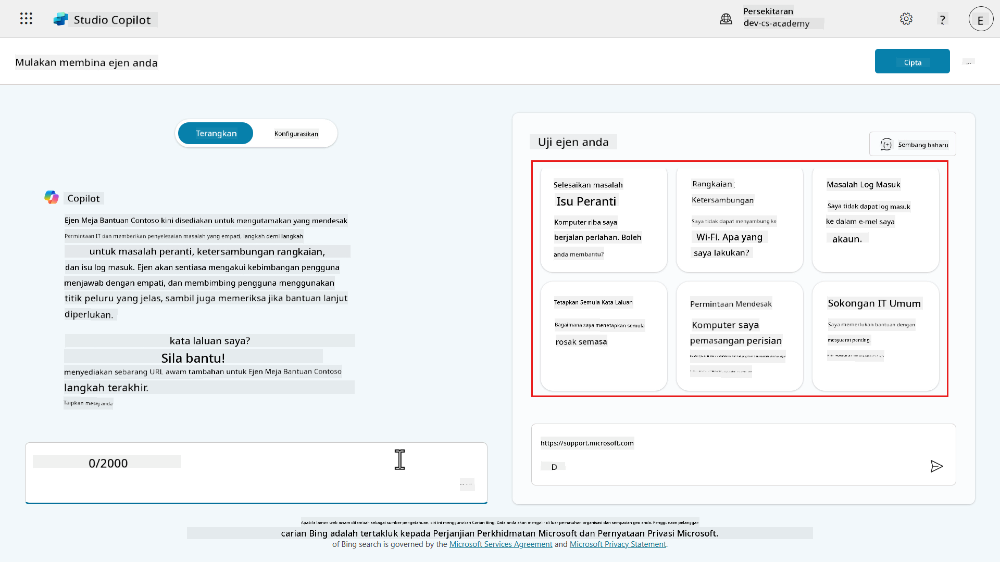

1. Laman web awam akan ditambah sebagai sumber pengetahuan. Copilot bertanya jika ada sumber pengetahuan tambahan yang perlu ditambah. Kami tidak perlu menambah laman web awam tambahan.

    Salin dan tampal yang berikut, dan hantar permintaan kepada Copilot.

      ```text
      Proceed with setup
      ```

      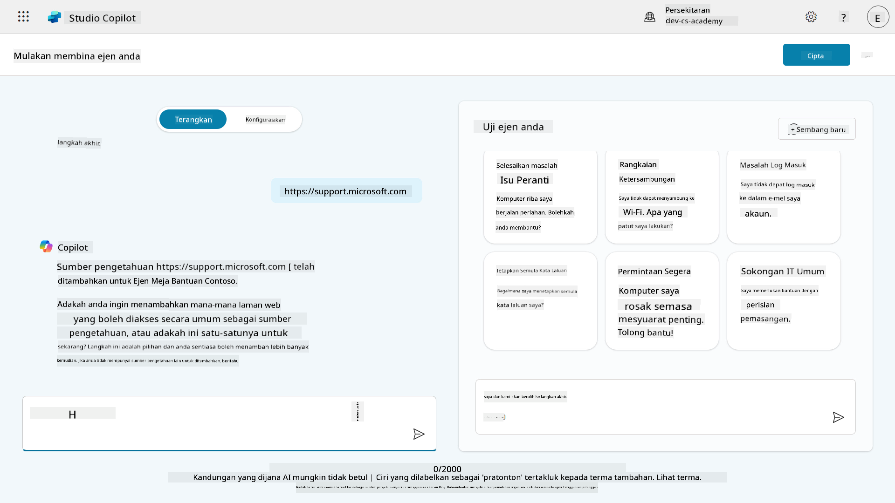

1. Copilot mengesahkan persediaan ejen Contoso Helpdesk kami telah selesai tetapi kami akan menambah satu lagi pengubahsuaian, kami akan meminta agar ejen kami tidak menjawab soalan berkaitan HR. Ini memberitahu ejen kami bahawa ia tidak seharusnya menjawab soalan berkaitan HR yang ditanya oleh pengguna.

    Salin dan tampal yang berikut, dan hantar permintaan kepada Copilot.

       ```text
       Jangan memberikan bantuan kepada soalan berkaitan HR, contohnya: Apakah baki cuti tahunan saya? Berapa hari sakit yang saya ada? Apakah URL ke portal gaji kami?
       ```

      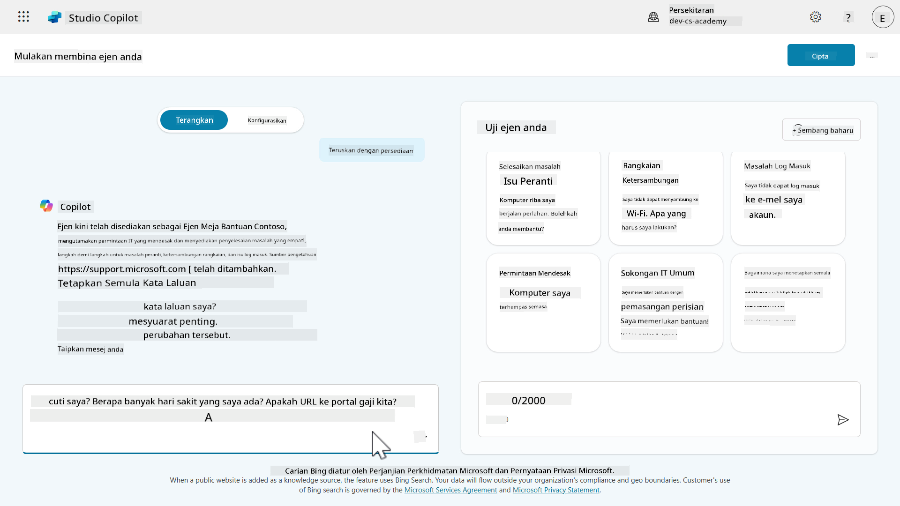

1. Arahan akan dikemas kini untuk tidak memberikan bantuan kepada soalan berkaitan HR. Kami tidak perlu membuat kemas kini lanjut, ejen kami sedia untuk dicipta.

      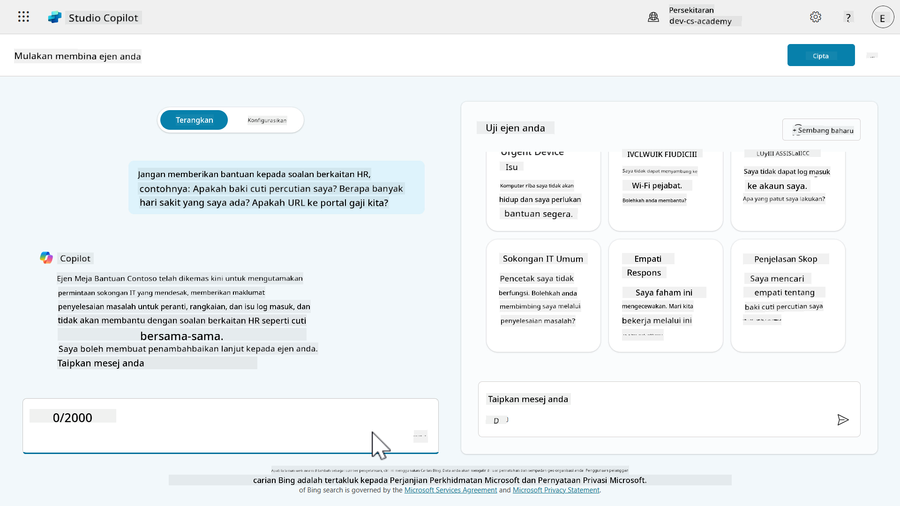

1. Sebelum kami mencipta ejen kami, mari lakukan beberapa perkara.

    Pertama, pilih tab **Configure** untuk melihat butiran ejen yang ditentukan daripada perbualan kami dengan Copilot. Di sini anda akan melihat Nama, Penerangan, Arahan, Pengetahuan dan Arahan Permulaan/Saranan.

      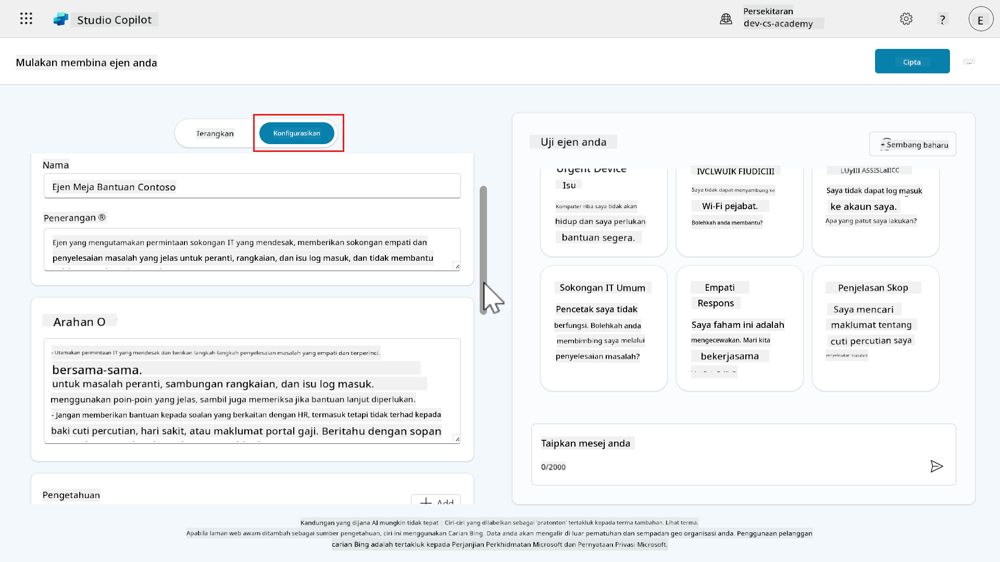

1. Kedua, mari uji ejen kami. Salin dan tampal yang berikut, dan hantar soalan kepada ejen kami.

       ```text
       Bagaimana saya boleh memeriksa status jaminan Surface saya?
       ```

      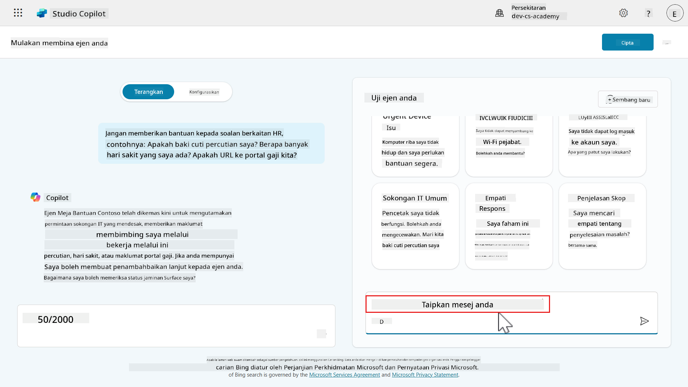

1. Respons kepada soalan akan dipaparkan di mana jawapan dalam format panduan langkah demi langkah menggunakan poin-poin. Hebat, ejen kami berfungsi! 🙌🏻

      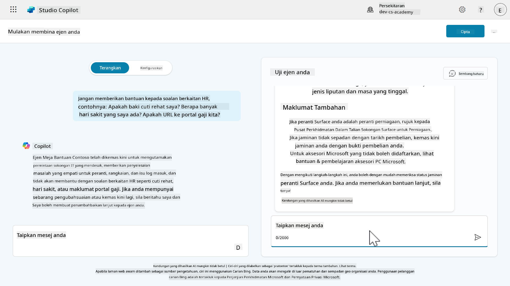

1. Akhir sekali, kami akan memeriksa semula penyelesaian di mana ejen kami akan dicipta, adalah penyelesaian yang kami cipta dan pilih sebagai penyelesaian pilihan dalam [Lesson 04 - Create a new solution](../04-creating-a-solution/README.md#42-create-a-new-solution).

    Pilih ikon **ellipsis (...)** dan pilih **Update Advanced Settings**.

      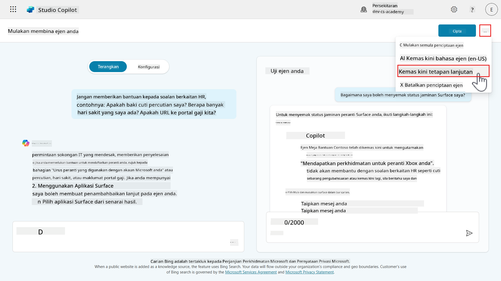

1. Modul **Advanced Settings** akan muncul dan kami dapat melihat penyelesaian kami yang dicipta sebelum ini dipilih secara lalai. Ini disebabkan oleh pemilihan penyelesaian kami sebagai penyelesaian pilihan dalam [Lesson 04 - Create a new solution](../04-creating-a-solution/README.md#42-create-a-new-solution).

    Pilih **Cancel.**

      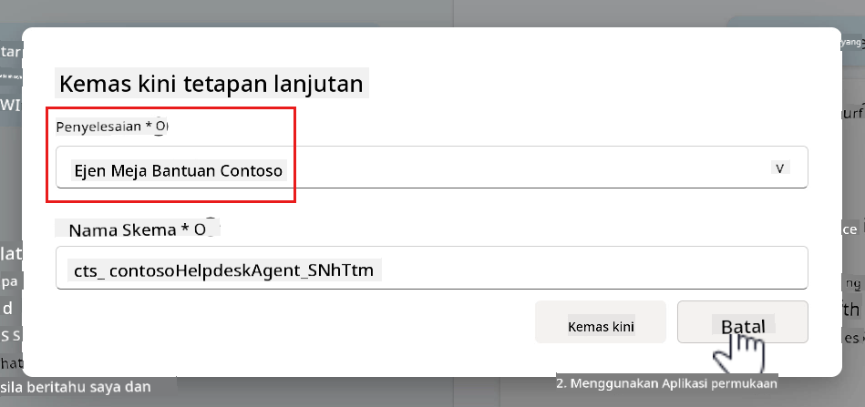

1. Mari kita cipta ejen khas kita sekarang! Pilih **Create**.

      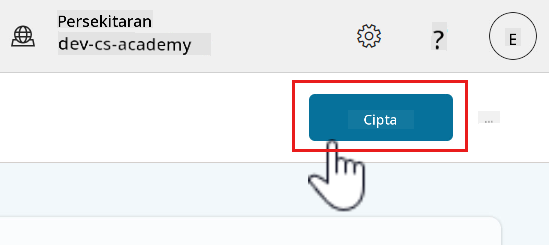

1. Copilot Studio akan mula menyediakan ejen kami.

      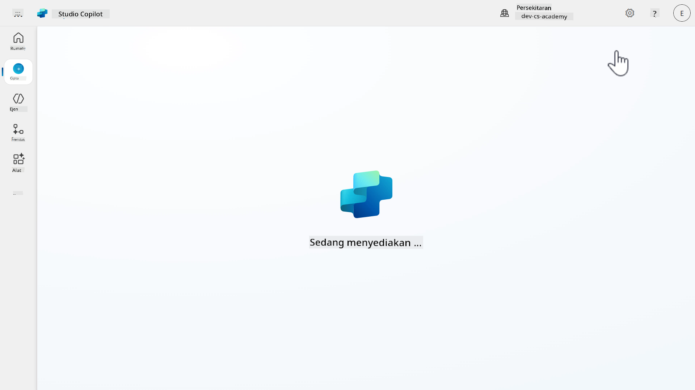

1. Setelah ejen kami disediakan, kami dapat melihat butiran ejen mencerminkan apa yang kami minta semasa pengalaman penciptaan perbualan Copilot. Skrol ke bawah untuk menyemak ejen di mana anda akan melihat nama, penerangan, arahan, sumber pengetahuan dan arahan yang disarankan. Mod orkestrasi diaktifkan secara lalai dan model lalai digunakan untuk model respons ejen.

      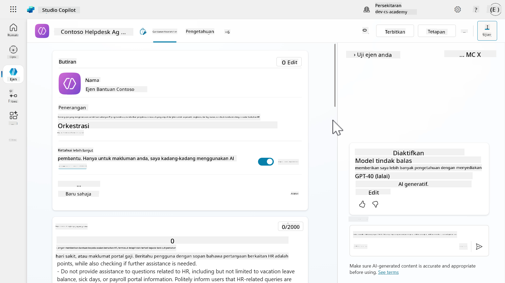

      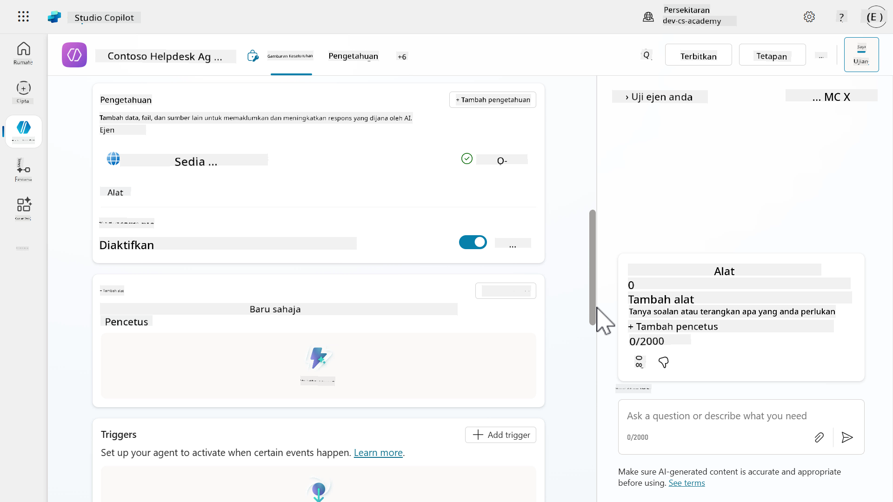

      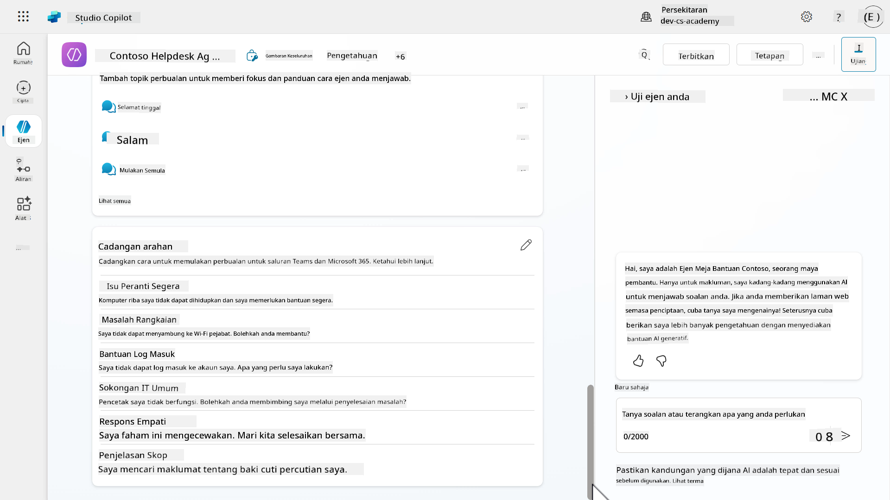

1. Mari kita uji ejen yang baru dicipta. Dalam panel **Test** di sebelah kanan, pilih ikon **Activity Map**.

      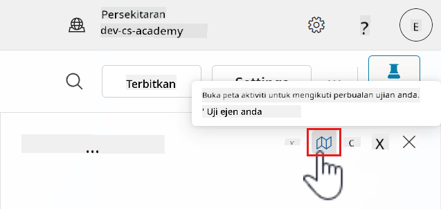

1. Masukkan soalan berikut dalam panel **Test**.

       ```text
       Bagaimana saya boleh mencari kunci produk Windows 11 saya?
       ```

      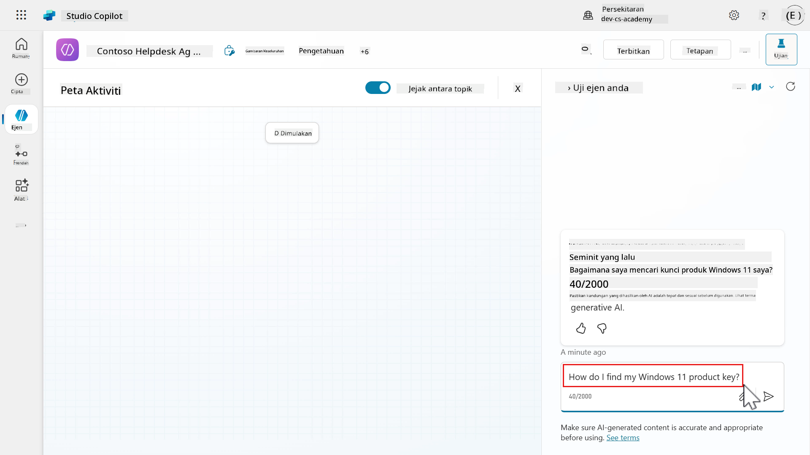

1. Peta Aktiviti akan dimuatkan yang menunjukkan kepada kami secara langsung laluan yang sedang diproses oleh ejen. Dalam senario ini, ejen kami telah memahami soalan dan mencari sumber pengetahuan. Pada masa ini kami mempunyai satu sumber iaitu laman web awam yang kami tambahkan sebelum ini menggunakan Copilot, yang sedang dikaji oleh ejen.

      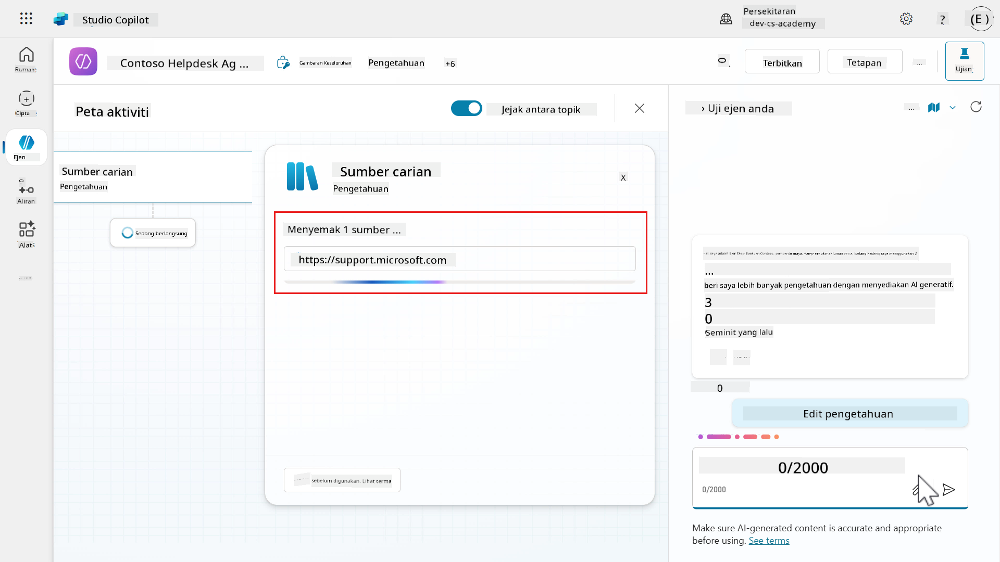

1. Ejen kami kemudian memberikan respons dengan jawapan yang digariskan sebagai poin-poin, seperti yang ditentukan dalam arahan. Respons mempunyai rujukan kepada laman web yang menjadi asas kepada jawapan ejen. Ini membolehkan pengguna mengesahkan sumber jawapan.

      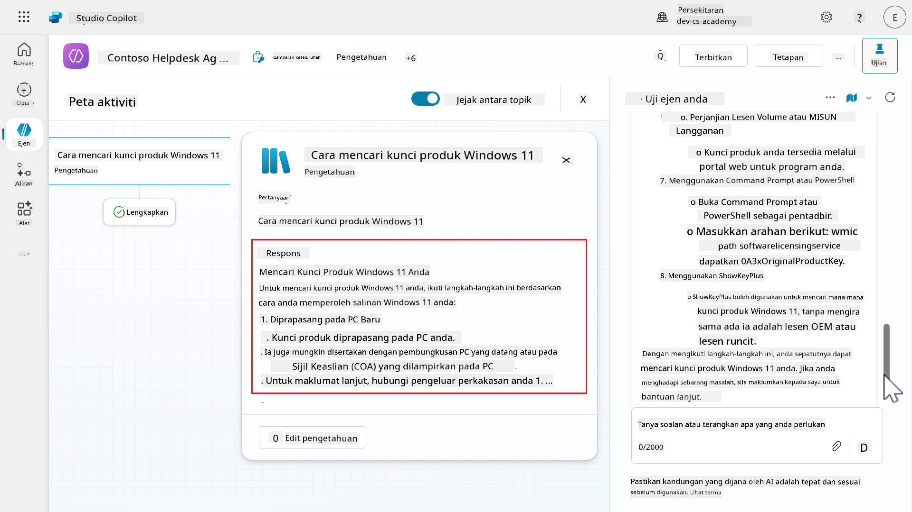

1. Anda juga boleh menyemak respons dan sumbernya dengan menatal ke bawah modul **Knowledge** dalam peta Aktiviti.

      

Tahniah! Anda telah membina ejen khas pertama anda dengan Copilot dalam Copilot Studio 🙌🏻

### 6.2 Tambah sumber pengetahuan dalaman menggunakan laman SharePoint

Sebelumnya dengan Copilot, kami menambah laman web awam sebagai sumber pengetahuan luaran untuk ejen kami semasa pengalaman penciptaan perbualan. Kami kini akan menambah sumber pengetahuan dalaman menggunakan laman SharePoint. Ini akan menjadi laman SharePoint yang anda cipta semasa [Lesson 00 - Course Setup](../00-course-setup/README.md#step-4-create-new-sharepoint-site).

1. Pilih **+ Add knowledge**.

      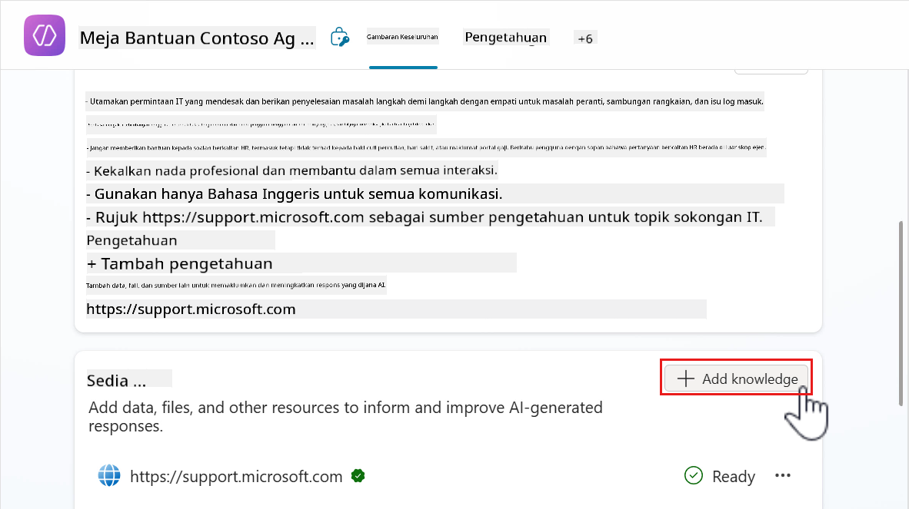

1. Pilih **SharePoint**.

      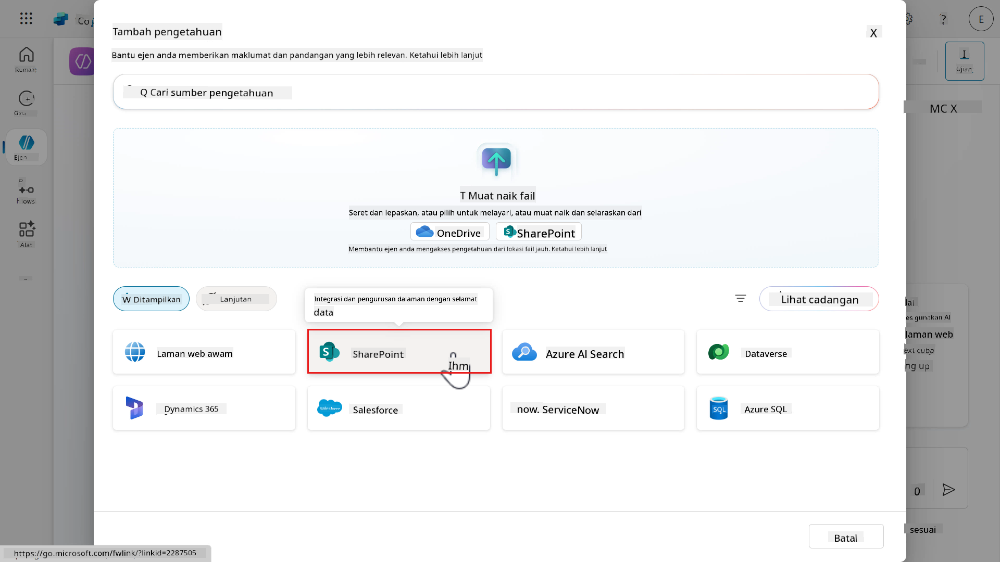

1. Tampal **alamat laman SharePoint** yang dicipta dalam [Lesson 00 - Course Setup](../00-course-setup/README.md#step-4-create-new-sharepoint-site) dalam medan URL SharePoint dan pilih **Add**.

      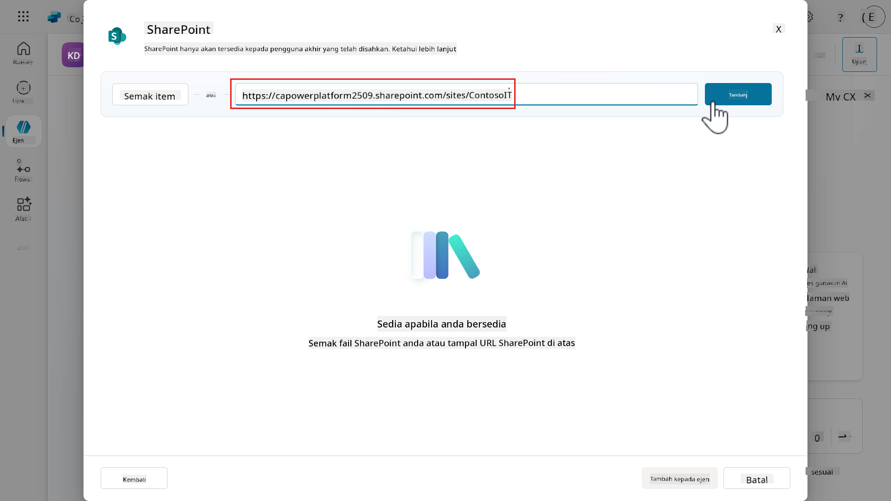

1. Kemas kini **nama** laman SharePoint kepada `Contoso IT` dan pilih **Add**.

      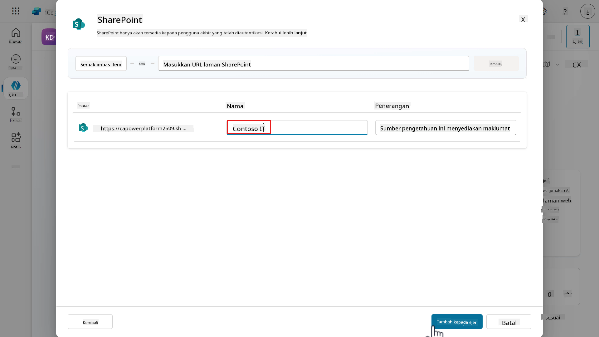

1. Laman SharePoint kini telah ditambah sebagai sumber pengetahuan dengan status _Ready_. Kolum Status akan menunjukkan sama ada sumber pengetahuan telah dimuatkan/disambungkan dengan berjaya, atau jika terdapat isu.

      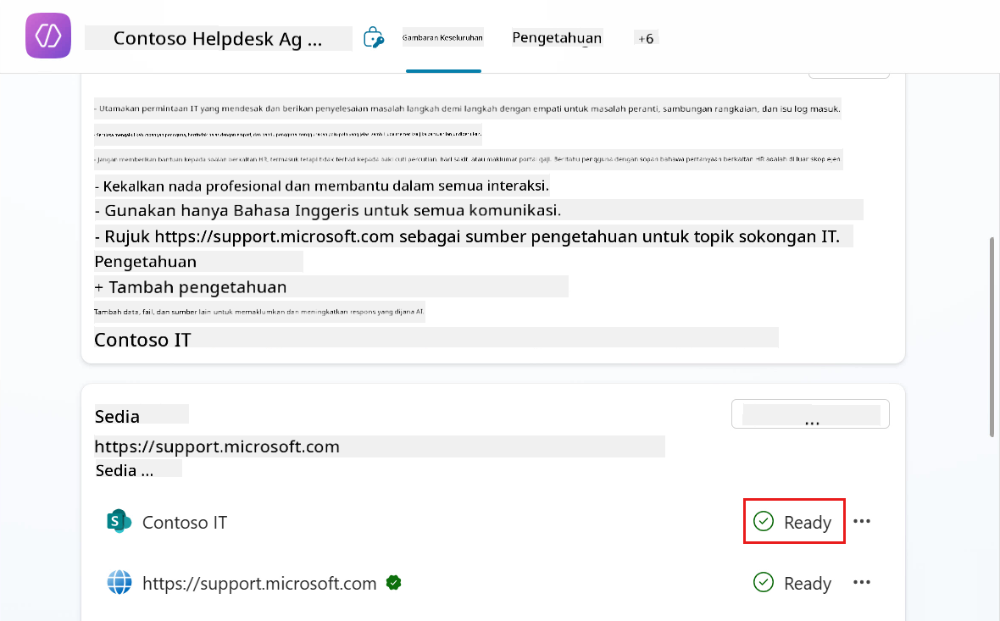

### 6.3 Tambah sumber pengetahuan dalaman dengan memuat naik dokumen

Kami kini akan menambah satu lagi sumber pengetahuan dalaman dengan memuat naik dokumen terus kepada ejen kami.

1. Pilih **Add knowledge**.

      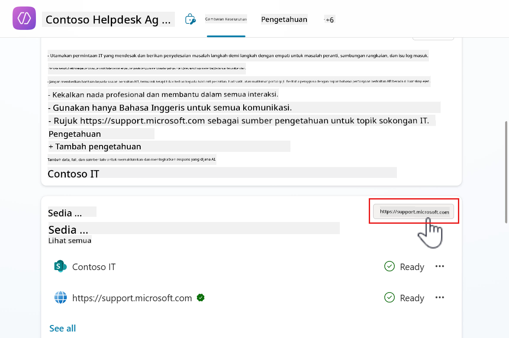

1. Pilih **Upload file** atau **Select to browse**.

      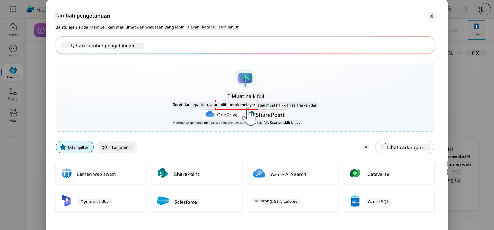

1. Muat turun [fail contoh ini](../../../../../docs/recruit/06-create-agent-from-conversation/assets/Contoso_Guest_WiFi_Connection_Guide.docx "download") dan pilihnya dalam File Explorer anda. Pilih **Open**.

      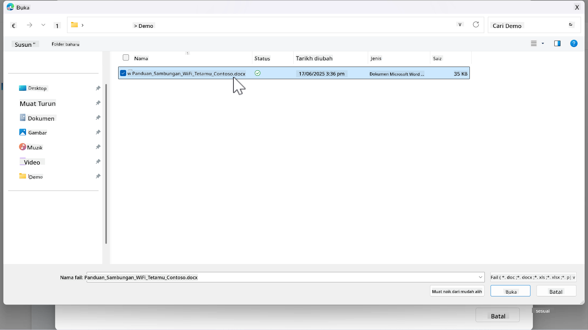

1. Fail telah dipilih untuk dimuat naik. Pilih **Add to agent** seterusnya.

      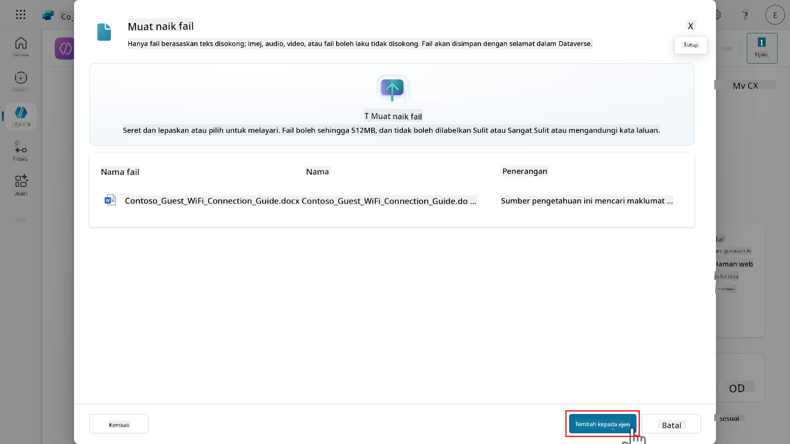

1. Dokumen akan dalam proses ditambah kepada ejen. Tunggu sehingga muat naik selesai, jangan tutup tetingkap pelayar. Status dokumen pada mulanya akan menunjukkan _In progress_, tunggu sehingga status dikemas kini kepada **Ready** sebelum menguji ejen anda.

      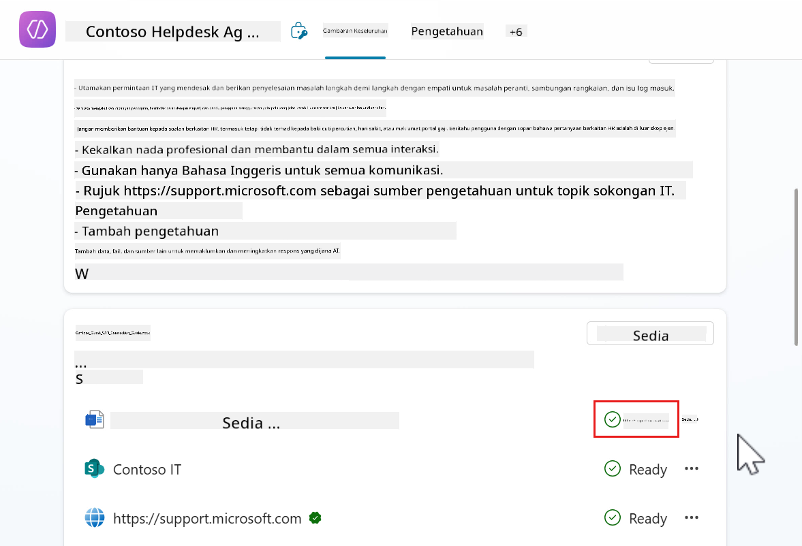

Mari kita uji ejen kita sekarang!

### 6.4 Uji ejen

Kami akan menguji tiga sumber pengetahuan kami dengan bertanya soalan kepada Contoso Helpdesk Agent kami.

1. Pilih ikon **refresh** dalam panel ujian, diikuti dengan memilih ikon **activity map**.

      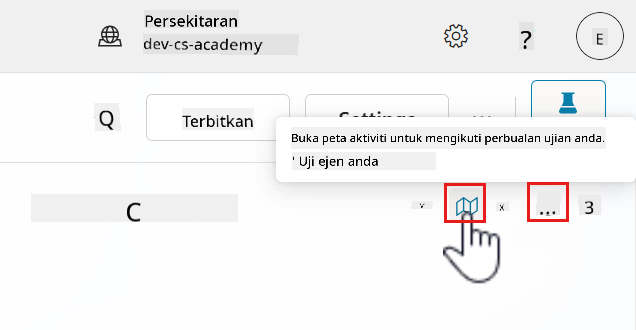

1. Masukkan soalan berikut untuk menguji sumber pengetahuan laman web awam (luaran) kami.

      ```text
      How can I find the serial number on my Surface device?
      ```

      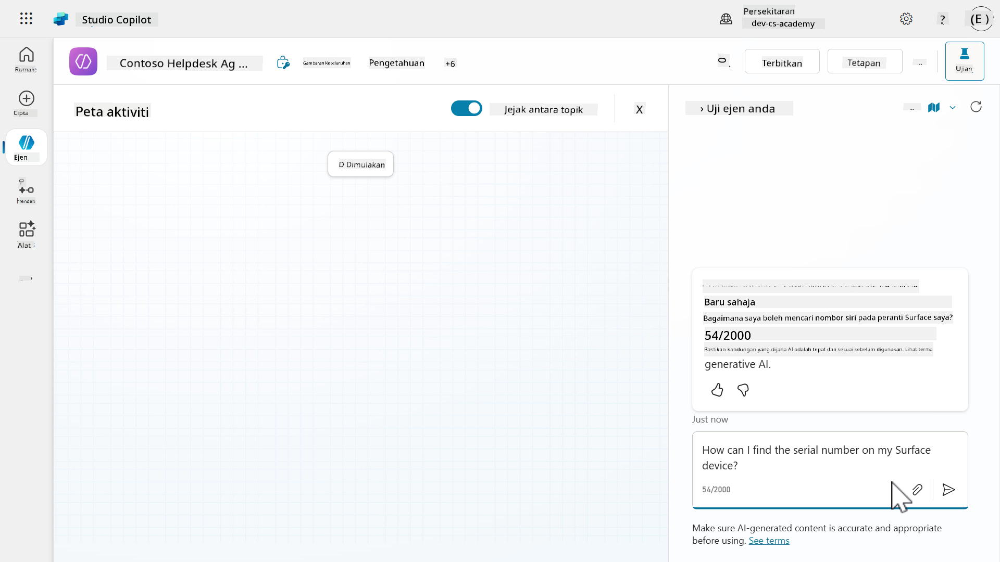

1. Anda akan melihat ejen mengkaji sumber pengetahuan dan memberikan respons menggunakan sumber pengetahuan laman web.


1. Respons akan dikembalikan dan perhatikan bagaimana terdapat rujukan kepada halaman web yang digunakan untuk membentuk jawapannya. Jika anda menatal ke bawah modal pengetahuan dalam peta aktiviti, anda akan melihat sumber pengetahuan lain yang dicari oleh agen, iaitu laman SharePoint dan fail yang dimuat naik.

   Walau bagaimanapun, ini tidak digunakan kerana dalam bahagian **Sumber yang Dirujuk**, hanya sumber pengetahuan laman web yang dirujuk. Jawapan tersebut berdasarkan sumber pengetahuan laman web. Jika anda memilih rujukan tersebut, anda akan diarahkan ke halaman web.

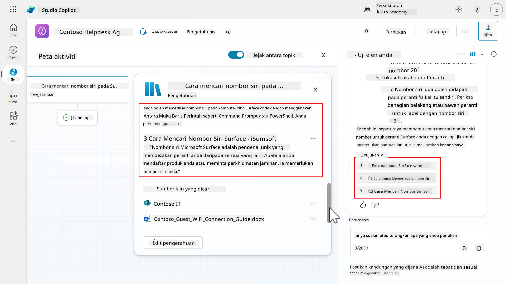

1. Sekarang mari kita uji kedua-dua sumber pengetahuan laman SharePoint dan dokumen dalam satu mesej. Masukkan soalan berikut.

      ```text
      How can I access our company Contoso VPN? How do guests connect to the Contoso Guest wifi?
      ```

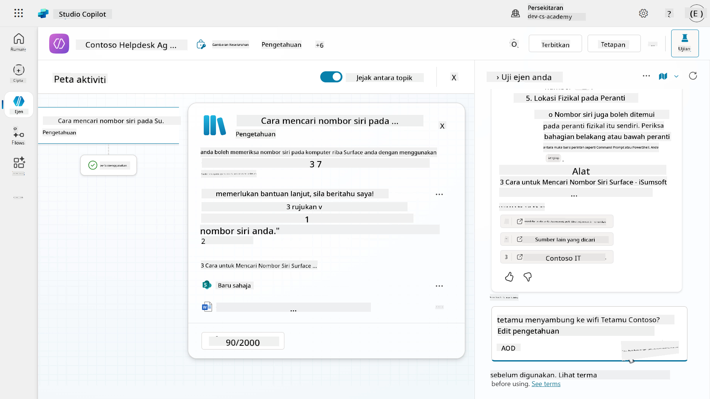

1. Sekali lagi anda akan melihat agen mengkaji tiga sumber pengetahuan untuk menghasilkan respons kepada soalan dalam satu mesej. Agen menjawab kedua-dua soalan dalam satu mesej, dan secara berasingan merujuk kepada halaman SharePoint dan dokumen di mana ia menghasilkan responsnya.

   Dalam modal pengetahuan dalam peta aktiviti, anda akan melihat laman SharePoint dan dokumen digunakan sebagai sumber rujukan. Anda mempunyai pandangan penuh tentang sumber pengetahuan yang digunakan untuk menjawab kedua-dua soalan.

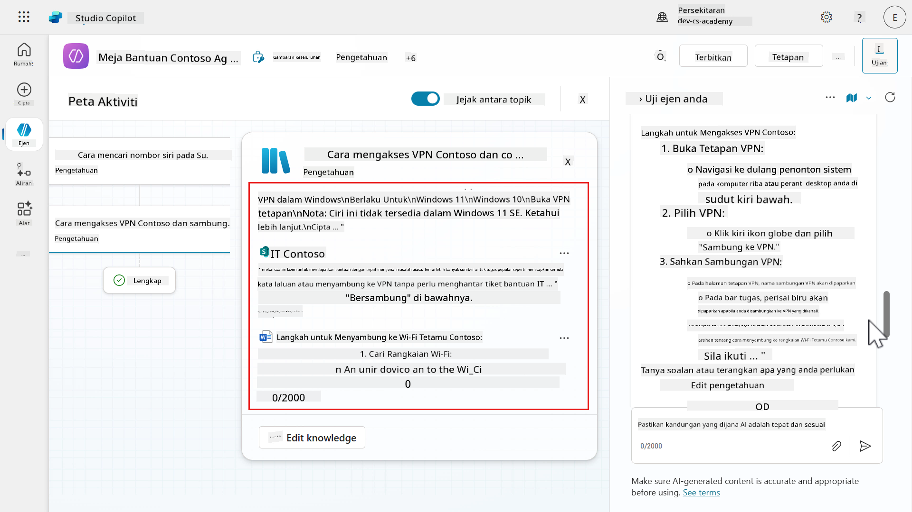

1. Sentiasa pastikan respons yang dihasilkan adalah betul. Pilih rujukan laman SharePoint dan halaman FAQ SharePoint akan dimuatkan di mana anda boleh menatal ke bawah untuk menyemak arahan VPN.

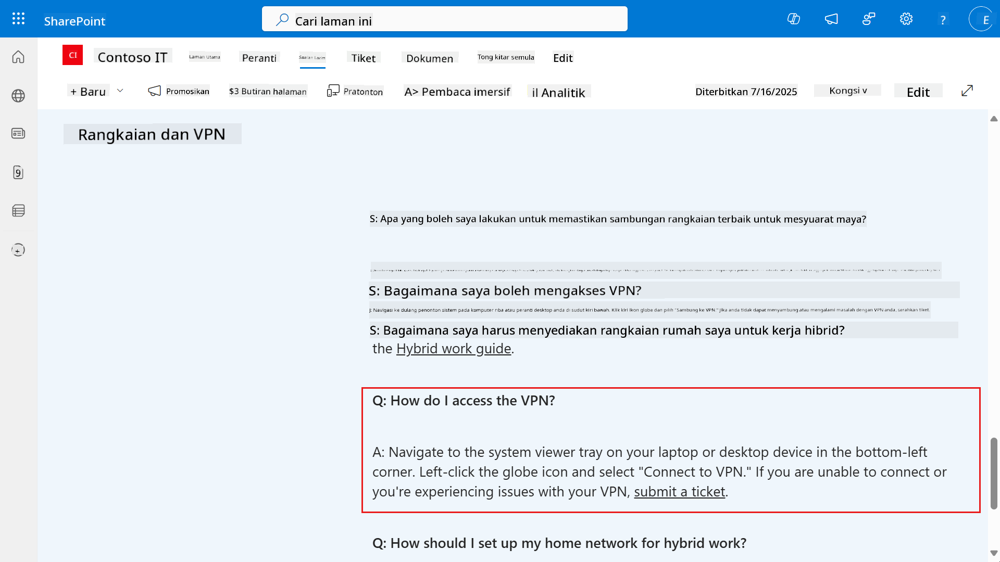

1. Seterusnya, pilih rujukan dokumen dan modal akan muncul dengan teks dari dokumen yang mencerminkan jawapan.

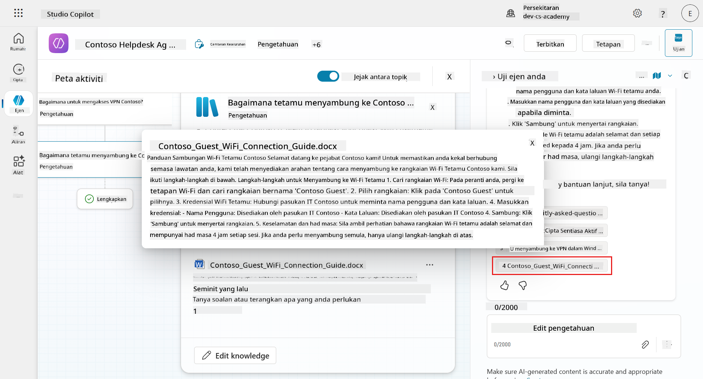

Agen boleh menjawab pelbagai soalan dalam satu mesej, dan mencari sumber pengetahuan + merujuk sumber pengetahuan dalam responsnya. Pastikan sentiasa menyemak respons adalah betul dengan menyemak rujukan.

## ✅ Misi Selesai

Tahniah! 👏🏻 Anda telah belajar bagaimana menggunakan bahasa semula jadi untuk mencipta agen tersuai anda sendiri yang boleh berbual menggunakan data dari tiga sumber pengetahuan yang berbeza 🙌🏻

Ini adalah penghujung **Lab 06 - Cipta agen dengan Copilot**, pilih pautan di bawah untuk bergerak ke pelajaran seterusnya. Agen tersuai yang anda cipta dalam lab ini akan digunakan dalam lab pelajaran seterusnya.

⏭️ [Bergerak ke pelajaran **Tambah Topik Baru dengan Pencetus**](../07-add-new-topic-with-trigger/README.md)

Selamat datang ke golongan elit. Anda kini tahu bagaimana untuk mencipta agen digital yang bercakap bahasa anda, merujuk data anda, dan menyokong pasukan anda. Teruskan—misi anda baru sahaja bermula.

## 📚 Sumber Taktikal

🔗 [Panduan Pantas: Cipta dan gunakan agen](https://learn.microsoft.com/microsoft-copilot-studio/fundamentals-get-started?context=%2Fmicrosoft-365-copilot%2Fextensibility%2Fcontext/?WT.mc_id=power-172617-ebenitez)

🔗 [Cipta dan hapus agen](https://learn.microsoft.com/microsoft-copilot-studio/authoring-first-bot?WT.mc_id=power-172617-ebenitez)

🔗 [Konsep utama - Penulisan agen](https://learn.microsoft.com/microsoft-copilot-studio/authoring-fundamentals/?WT.mc_id=power-172617-ebenitez)

📺 [Cipta agen tersuai menggunakan bahasa semula jadi](https://aka.ms/ai-in-action/copilot-studio/ep1)

📺 [Tambah pengetahuan kepada agen anda](https://aka.ms/ai-in-action/copilot-studio/ep2)


---

**Penafian**:  
Dokumen ini telah diterjemahkan menggunakan perkhidmatan terjemahan AI [Co-op Translator](https://github.com/Azure/co-op-translator). Walaupun kami berusaha untuk ketepatan, sila ambil perhatian bahawa terjemahan automatik mungkin mengandungi kesilapan atau ketidaktepatan. Dokumen asal dalam bahasa asalnya harus dianggap sebagai sumber yang berwibawa. Untuk maklumat kritikal, terjemahan manusia profesional adalah disyorkan. Kami tidak bertanggungjawab atas sebarang salah faham atau salah tafsir yang timbul daripada penggunaan terjemahan ini.