<!--
CO_OP_TRANSLATOR_METADATA:
{
  "original_hash": "c04b3587170139bc23e3b5cfc24c89ac",
  "translation_date": "2025-10-20T00:37:14+00:00",
  "source_file": "docs/recruit/07-add-new-topic-with-trigger/README.md",
  "language_code": "ms"
}
-->
# 🚨 Misi 07: Tambah topik baru dengan pencetus dan nod

## 🕵️‍♂️ NAMA KOD: `OPERASI KEKAL PADA TOPIK`

> **⏱️ Tempoh Operasi:** `~60 minit`

🎥 **Tonton Panduan**

[](https://www.youtube.com/watch?v=7iPAZaA8nJs "Tonton panduan di YouTube")

## 🎯 Ringkasan Misi

Anda telah membina ejen. Ia mendengar, belajar, dan menjawab soalan - tetapi kini tiba masanya untuk menjadi lebih taktikal. Dalam misi ini, anda akan menyelami lebih mendalam dan mengajar ejen anda bagaimana untuk bertindak balas terhadap arahan tertentu dengan tepat.

Dengan Topik dan Pencetus, ejen anda boleh:

- Mengenali niat

- Mengarahkan perbualan dengan logik

- Mengumpul dan menyimpan pembolehubah

- Mencetuskan aliran dan mengambil tindakan

Anda bukan sahaja membina dialog, tetapi juga menghubungkan korteks pembuatan keputusan ejen anda. Selamat datang ke Nexus Neural.

## 🔎 Objektif

Dalam misi ini, anda akan belajar:

1. Memahami apa itu topik dan peranannya dalam mencipta perbualan yang terstruktur untuk ejen anda
1. Mempelajari anatomi topik termasuk frasa pencetus dan nod perbualan
1. Meneroka pelbagai jenis nod perbualan dan cara menggunakan Power Fx untuk logik dinamik
1. Mencipta topik tersuai dari awal untuk menangani permintaan dan tugas pengguna tertentu
1. Membina topik berfungsi yang menghubungkan data SharePoint menggunakan penyambung dan alat

## 🤔 Apa itu Topik?

Topik adalah perbualan terstruktur yang membantu ejen anda bertindak balas terhadap soalan atau tugas pengguna tertentu. Anggaplah topik sebagai perbualan mini atau tugas yang boleh ditangani oleh ejen anda. Setiap topik direka untuk bertindak balas terhadap soalan atau permintaan pengguna tertentu.

### 🌌 Tujuan topik

Terdapat tiga tujuan biasa untuk topik berdasarkan keperluan pengguna:

**Maklumat** - menjawab soalan seperti berikut:

- `Apa itu …?`
- `Bilakah …?`
- `Mengapa …?`
- `Bolehkan anda beritahu saya …?`

**Penyelesaian tugas** - membantu pengguna _melakukan_ sesuatu:

- `"Saya mahu …"`
- `"Bagaimana saya …?"`
- `"Saya perlukan …?"`

**Penyelesaian masalah** - menyelesaikan masalah:

- `Sesuatu tidak berfungsi …`
- `Saya menghadapi mesej ralat …`
- `Saya melihat sesuatu yang tidak dijangka …?`

Anda juga boleh mencipta topik untuk soalan yang tidak jelas seperti `Saya perlukan bantuan`, yang meminta pengguna untuk maklumat lanjut sebelum meneruskan.

## 🐦 Mengapa topik berguna?

Topik membantu anda,

- Mengatur pengetahuan ejen anda.

- Membuat perbualan terasa semula jadi.

- Menyelesaikan masalah pengguna dengan berkesan.

## 🪺 Jenis topik

1. **Topik sistem** - ini adalah bawaan dan menangani acara biasa seperti:
    - Memulakan perbualan
    - Menamatkan perbualan
    - Menangani ralat
    - Meminta pengguna untuk log masuk
    - Meningkatkan kepada ejen manusia

1. **Topik tersuai** - anda mencipta ini untuk menangani tugas atau soalan tertentu seperti:
    - Permintaan cuti pekerja
    - Permintaan peranti baru atau penggantian

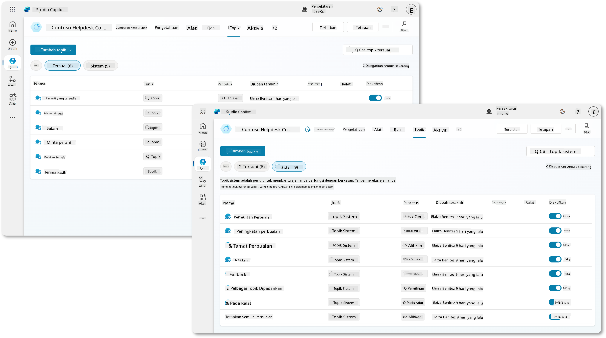

## 🧬 Anatomi topik

Setiap topik biasanya mengandungi perkara berikut.

### 🗣️ Frasa pencetus

Ini adalah perkataan atau ayat yang mungkin diucapkan oleh pengguna untuk memulakan topik.

**Contoh:**

Untuk topik permintaan cuti, frasa pencetus boleh jadi

- `Saya mahu mengambil cuti`
- `Memohon cuti`
- `Mohon cuti`
- `Bagaimana cara saya memohon cuti?`

Untuk topik permintaan peranti, frasa pencetus boleh jadi

- `Saya perlukan peranti baru`
- `Bolehkah saya memohon peranti?`
- `Bolehkah anda membantu saya dengan permintaan peranti`

### 💬 Nod perbualan

Topik terdiri daripada nod yang merupakan langkah-langkah yang diikuti oleh ejen setelah topik dicetuskan. Anda menghubungkan langkah-langkah ini untuk membina aliran perbualan yang diikuti oleh ejen anda semasa berinteraksi dengan pengguna.

Anggaplah ini sebagai arahan atau tindakan seperti berikut:

- Menanyakan soalan kepada pengguna
- Menghantar mesej
- Memanggil perkhidmatan luaran seperti sistem pengurusan cuti
- Menetapkan atau memeriksa pembolehubah
- Menggunakan syarat untuk bercabang dalam perbualan
- Mengarahkan ke topik lain


Berikut adalah jenis utama nod yang boleh anda tambahkan kepada ejen:

#### Menghantar mesej

- **Tujuan** - menghantar mesej kepada pengguna.
- **Contoh** - `Terima kasih atas permintaan anda! Saya akan membantu anda dengan itu.`

Nod ini membolehkan ejen anda menghantar mesej kepada pengguna, yang boleh berupa teks ringkas atau kandungan kaya seperti imej, video, kad, balasan cepat dan kad adaptif.

Anda boleh memperibadikan mesej menggunakan pembolehubah, menambah pelbagai variasi mesej untuk variasi, dan bahkan menyesuaikan output suara untuk saluran yang diaktifkan suara.

!!! tip
    Anggaplah ini sebagai blok "katakan sesuatu" yang membantu ejen anda berkomunikasi dengan jelas dan interaktif dengan pengguna.

#### Menanyakan soalan

- **Tujuan** - menanyakan soalan kepada pengguna dan menunggu jawapan mereka.
- **Contoh** - `Apakah tarikh cuti anda?`

Nod ini digunakan untuk menanyakan maklumat tertentu kepada pengguna semasa perbualan dan menyimpan jawapan mereka dalam pembolehubah untuk digunakan kemudian.

Anda boleh menyesuaikan jenis soalan seperti input teks atau menggunakan entiti untuk senarai nilai yang ditentukan yang dipilih oleh pengguna, dan menentukan bagaimana ejen harus bertindak jika pengguna memberikan jawapan yang tidak sah atau melangkau soalan.

Ia juga menyokong kandungan kaya seperti imej dan balasan cepat, dan membolehkan anda menyesuaikan pengesahan, pengulangan, dan tetapan gangguan untuk memastikan aliran perbualan berjalan lancar.

!!! tip
    Anggaplah ini sebagai blok "tanya dan dengar" yang membantu ejen anda berinteraksi dengan pengguna dengan cara yang terstruktur yang anda tentukan.

#### Bertanya dengan kad adaptif

- **Tujuan** - menghantar kad interaktif yang kaya menggunakan JSON.
- **Contoh** - kad yang memaparkan pemilih tarikh kalendar untuk pengguna memilih tarikh.

Nod ini memaparkan kad interaktif yang kaya yang boleh diisi dan dihantar oleh pengguna seperti borang dengan kotak teks, butang, dan imej. Ia menangkap input pengguna dan menyimpannya dalam pembolehubah, yang boleh digunakan oleh ejen anda kemudian dalam perbualan.

!!! tip
    Anggaplah ini sebagai blok "pembina borang" yang boleh disesuaikan yang menjadikan ejen anda lebih menarik dan mampu mengumpulkan maklumat terperinci daripada pengguna.

#### Menambah syarat

- **Tujuan** - menambah logik kepada perbualan. Ia memeriksa sesuatu dan memutuskan apa yang perlu dilakukan seterusnya.
- **Contoh** - jika pengguna berkata `Ya`, pergi ke langkah seterusnya. Jika `Tidak`, tamatkan perbualan.

Nod ini mencipta titik keputusan dalam aliran perbualan ejen anda dengan memeriksa sama ada pembolehubah memenuhi kriteria tertentu. Berdasarkan sama ada syarat itu benar atau palsu, ejen mengikuti laluan yang berbeza.

!!! tip
    Anggaplah ini sebagai blok "jika-tidak" yang membantu ejen anda membuat keputusan bergantung pada input pengguna atau data yang disimpan dalam pembolehubah.

#### Pengurusan pembolehubah

- **Tujuan** - menyimpan atau mengosongkan maklumat (dipanggil pembolehubah) semasa perbualan.
- **Contoh** - menyimpan tarikh yang dipilih oleh pengguna dalam nod Menanyakan soalan yang memaparkan kad adaptif.

Nod ini membolehkan anda menyimpan dan mengurus maklumat semasa perbualan, ia boleh menjadi nama pengguna, jawapan, atau pilihan. Anda boleh menggunakan pelbagai jenis pembolehubah seperti teks, nombor, atau tarikh, dan ia boleh digunakan untuk satu topik, dikongsi di antara topik (global), atau bahkan diambil dari sistem atau persekitaran.

!!! tip
    Anggaplah ini sebagai "kotak memori" yang membantu ejen anda mengingati maklumat dan menggunakannya semasa perbualan diteruskan dengan pengguna.

#### Pengurusan topik

- **Tujuan** - memindahkan perbualan ke topik lain atau langkah dalam topik, memindahkan perbualan, atau menamatkan topik atau perbualan.
- **Contoh** - mengarahkan ke topik "Polisi Cuti".

Nod ini membolehkan ejen anda melompat dari satu topik ke topik lain tanpa memulakan semula perbualan, menamatkan topik, memindahkan atau menamatkan perbualan, atau pergi ke langkah yang berbeza dalam topik yang sama. Ia membantu membimbing pengguna melalui bahagian-bahagian yang berbeza dalam aliran perbualan dengan lancar beralih antara topik, dan anda boleh memindahkan pembolehubah di antara mereka untuk mengekalkan konteks.

!!! tip
    Anggaplah ini sebagai blok "pergi ke bahagian/langkah lain" yang membantu ejen anda menjadi fleksibel dalam berbual dengan pengguna.

#### Menambah alat

- **Tujuan** - menyambung ke alat seperti penyambung, aliran ejen, arahan, carian tersuai, pertanyaan carian, kemahiran, protokol konteks model.
- **Contoh** - Aliran ejen dilaksanakan selepas pengguna menghantar permintaan cuti mereka.

Nod ini memberikan ejen anda keupayaan untuk berinteraksi dengan sistem luaran atau melaksanakan tugas tertentu, seperti menghantar e-mel, memeriksa cuaca, atau mengakses pangkalan data. Anda boleh menambah alat menggunakan penyambung bawaan, API tersuai, aliran ejen, arahan, atau menyambung ke pelayan Protokol Konteks Model (MCP), dan bahkan _automasi antara muka pengguna grafik_ untuk aplikasi desktop melalui alat penggunaan komputer.

!!! tip
    Anggaplah alat sebagai "blok tindakan" yang memberikan ejen anda kuasa super untuk melakukan perkara di luar _berbual_, seperti memanggil API, menjalankan proses, atau mengumpulkan input pengguna secara automatik.

#### Nod jawapan generatif

- **Tujuan** - menggunakan model bahasa besar untuk menghasilkan respons semula jadi seperti manusia berdasarkan soalan pengguna dan sebarang data yang disambungkan.
- **Contoh** - menggunakan sumber pengetahuan yang disambungkan yang mengandungi maklumat tentang hak cuti untuk menjawab soalan pengguna mengenai permintaan cuti.

Nod ini membolehkan ejen anda bertindak balas terhadap soalan pengguna menggunakan maklumat daripada pelbagai sumber pengetahuan, seperti laman web, dokumen, SharePoint, atau data tersuai. Ia boleh digunakan sebagai sandaran apabila tiada topik yang sepadan ditemui, atau dalam topik untuk memberikan jawapan yang lebih terperinci dan dinamik berdasarkan sumber tertentu yang telah anda konfigurasikan untuk digunakan oleh ejen anda.

!!! tip
    Anggaplah ini sebagai "blok jawapan pintar" yang membantu ejen anda memberikan respons yang berguna dan tepat dengan mencari kandungan yang dipercayai yang anda tentukan.

#### Nod permintaan HTTP

- **Tujuan** - menyambungkan ejen anda ke sistem luaran dengan menghantar panggilan API (contohnya `GET` atau `POST`) untuk mendapatkan atau mengemas kini data.
- **Contoh** - apabila pengguna meminta baki hari cuti mereka, ejen melaksanakan permintaan `GET` ke sistem pengurusan cuti dan mengekstrak `remainingLeaveDays` daripada respons API dan membalas kepada pengguna dengan nilai tersebut.

Nod ini membolehkan ejen anda berhubung dengan sistem luaran dengan menghantar panggilan API REST, seperti permintaan `GET` atau `POST`. Anda boleh menyesuaikan permintaan dengan tajuk, kandungan badan, dan bahkan menggunakan Power Fx untuk memasukkan data dinamik, kemudian menyimpan respons dalam pembolehubah untuk digunakan kemudian dalam perbualan.

!!! tip
    Anggaplah ini sebagai "blok capai dan dapatkan maklumat" yang membantu ejen anda berkomunikasi dengan perkhidmatan lain seperti mendapatkan butiran pengguna atau menghantar data ke sistem lain.

#### Menghantar acara

- **Tujuan** - membolehkan ejen anda menghantar tindakan bukan mesej, seperti kemas kini sistem atau pencetus alat - kepada klien atau saluran, membantunya melaksanakan tugas.
- **Contoh** - bertindak balas kepada pengguna yang menyertai sembang dengan memaparkan mesej selamat datang.

Nod ini membolehkan ejen anda menghantar tindakan bukan mesej kepada sistem luaran atau saluran, yang kemudian boleh memutuskan bagaimana untuk bertindak balas. Anda memberikan setiap acara nama dan melampirkan nilai, yang boleh menjadi nombor atau teks mudah, pembolehubah, atau formula Power Fx, dan ia dihantar sebagai objek JSON.

!!! tip
    Anggaplah ini sebagai "blok pencetus senyap" yang membantu ejen anda melakukan perkara di belakang tabir atau berkomunikasi dengan alat luaran tanpa memerlukan pengguna untuk mengatakan apa-apa.

## 🏋🏻‍♀️ Menggunakan Power Fx dalam nod anda

Di Copilot Studio, Power Fx adalah bahasa pengaturcaraan kod rendah yang digunakan untuk menambah logik dan tingkah laku dinamik kepada ejen anda. Ia adalah bahasa yang sama digunakan dalam Microsoft Power Apps, dan direka untuk menjadi mudah dan seperti Excel, menjadikannya mudah untuk pembangun dan bukan pembangun.

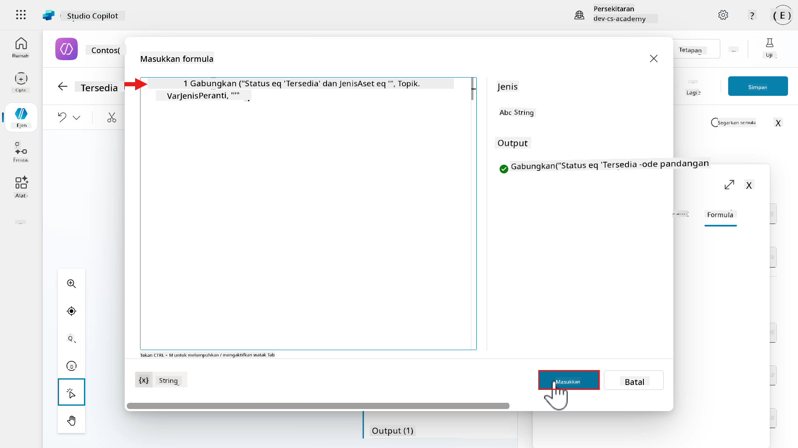

### Apa yang Power Fx boleh lakukan dalam topik

- Menetapkan dan memanipulasi pembolehubah
      - Contoh: `Set(userName, "Adele Vance")`
- Mencipta syarat
      - Contoh: `If(score > 80, "Lulus", "Gagal")`
- Memformat dan mengubah data
      - Contoh: `Text(DateValue, "dd/mm/yyyy")`

### Mengapa menggunakan Power Fx?

- **Fleksibel:** anda boleh membina logik tanpa menulis baris kod penuh.

- **Biasa:** jika anda pernah menggunakan formula Excel, ia terasa sangat serupa.

- **Berkuasa:** ia membolehkan anda memperibadikan perbualan, mengesahkan input, dan mengawal bagaimana ejen anda bertindak berdasarkan data pengguna.

## 🏗️ Bagaimana saya mencipta dan mengedit topik?

Terdapat dua cara anda boleh mencipta dan mengedit topik untuk ejen anda.

### 1. Cipta dari kosong

Ini membolehkan anda membina aliran perbualan tersuai dari awal, dan anda boleh menambah atau menghapuskan nod mengikut keperluan semasa mengedit topik anda.


#### Mengapa ini berguna

- Ia memberikan anda kawalan penuh terhadap bagaimana ejen anda bertindak balas.
- Anda boleh menyesuaikan logik menggunakan pembolehubah, Power Fx, dan syarat.
- Ia sangat sesuai untuk membina pengalaman yang disesuaikan untuk keperluan perniagaan tertentu.

### 2. Cipta dengan Copilot
Ini membolehkan anda menerangkan apa yang anda mahukan menggunakan bahasa semula jadi, dan Copilot akan membina perbualan untuk anda. Perkara yang sama berlaku apabila mengedit topik anda, gunakan bahasa semula jadi dan Copilot akan menyemak serta mengubah suai topik untuk anda.

#### Apa yang disokong oleh Copilot

- Boleh mencipta dan mengedit:
      - Node mesej
      - Node soalan
      - Node syarat
- Tidak menyokong tetapan lanjutan seperti cara untuk meminta semula pengguna jika mereka tidak memberi respons atau cara mengurus gangguan semasa soalan. Anda masih boleh menyesuaikan tetapan tersebut secara manual jika diperlukan.

#### Mengapa ini berguna

- Mempercepatkan pembangunan dengan bantuan AI.
- Membolehkan anda memberi tumpuan kepada logik dan pengalaman pengguna daripada persediaan berulang.
- Memudahkan untuk mengulangi dan meningkatkan aliran perbualan dengan usaha yang minimum.

#### ✨ Contoh arahan

- **Cipta topik**
      - `Terima nama, umur dan tarikh lahir pengguna dan kemudian ulangi respons mereka kembali kepada mereka`
      - `Kumpulkan alamat jalan, negeri dan kod pos pengguna. Pengguna sepatutnya boleh mencuba semula setiap soalan sehingga 4 kali`

- **Edit topik**
      - `Tambah soalan yang meminta tarikh lahir pengguna`
      - `Ringkaskan maklumat yang dikumpulkan dalam Kad Adaptif.`

## 👩🏻‍🎨 Baiklah, bagaimana saya merancang topik untuk ejen saya?

### 🧙🏻‍♂️ Langkah 1 - Fahami keperluan pengguna

Mulakan dengan mengenal pasti soalan atau tugas biasa yang akan ditanya oleh pengguna kepada ejen anda. Ini boleh jadi:

- Soalan yang sering ditanya oleh pengguna seperti, `apa kelayakan saya untuk cuti sakit?`
- Tugas biasa yang ingin diselesaikan oleh pengguna seperti menghantar borang
- Masalah yang sering dihadapi oleh pengguna seperti isu log masuk

### 📦 Langkah 2 - Kumpulkan senario

Susun keperluan pengguna ke dalam tiga kategori berdasarkan apa yang telah kita pelajari sebelum ini - tujuan topik:

- Maklumat - pengguna ingin mengetahui sesuatu
- Penyelesaian tugas - pengguna ingin melakukan sesuatu
- Penyelesaian masalah - pengguna memerlukan bantuan untuk menyelesaikan masalah

### 🗺️ Langkah 3 - Peta aliran perbualan

Lakar aliran perbualan ringkas tentang bagaimana ejen sepatutnya memberi respons

- Mulakan dengan ucapan atau pengesahan
- Tanya soalan susulan untuk mendapatkan butiran
- Berikan jawapan atau lakukan tindakan

!!! tip
    Pastikan perbualan ringkas dan fokus. Hanya tanya apa yang perlu.

### 🔀 Langkah 4 - Tangani jenis perbualan yang berbeza

Rancang untuk kedua-duanya:

- **Satu giliran** - satu soalan, satu jawapan

- **Berbilang giliran** - perbualan berulang-alik dengan soalan susulan

Contoh:

- Pengguna: `Saya ingin memohon cuti percutian.`

- Ejen: `Baiklah! Tarikh apa yang anda ingin mulakan cuti anda?`

- Pengguna: `15 Julai`

- Ejen: `Faham. Dan bila cuti anda akan berakhir?`

- Pengguna: `22 Julai.`

- Ejen: `Terima kasih! Apa sebab anda ingin bercuti?`

- Pengguna: `Percutian keluarga.`

- Ejen: `Terima kasih atas butirannya. Saya telah menghantar permohonan cuti anda dari 15 Julai hingga 22 Julai untuk percutian keluarga. Anda akan menerima pengesahan tidak lama lagi.`

### 🤖 Langkah 5 - Gunakan AI untuk soalan yang tidak dijangka

Walaupun anda telah merancang topik untuk permintaan cuti, pengguna mungkin bertanya soalan yang tidak diliputi secara langsung. Di sinilah ciri AI seperti topik sistem _Conversational boosting_ sangat berguna.

Topik ini termasuk node jawapan generatif, yang membolehkan ejen anda mula menggunakan sumber pengetahuan yang disambungkan dengan segera. Mana-mana sumber pengetahuan yang ditambah pada tahap ejen akan secara automatik dimasukkan dalam node jawapan generatif dalam topik sistem _Conversational boosting_.

#### Contoh

- Pengguna: `Bolehkah saya membawa cuti yang tidak digunakan ke tahun depan?`

Soalan ini mungkin tidak menjadi sebahagian daripada aliran topik yang telah ditentukan, terutamanya jika topik anda hanya mengendalikan permintaan cuti.

#### Bagaimana AI membantu

Jika ejen anda disambungkan kepada dokumen dasar HR syarikat anda atau laman web dalaman, AI boleh:

- Mencari dasar cuti yang relevan
- Memahami dan meringkaskan peraturan
- Ejen memberi respons dengan: `Menurut dasar HR, anda boleh membawa cuti yang tidak digunakan ke tahun kalendar berikutnya. Untuk maklumat lanjut, sila semak bahagian dasar cuti di portal HR.`

#### Mengapa ini berguna

- Anda tidak perlu mencipta topik secara manual untuk setiap soalan berkaitan dasar.
- AI boleh menarik jawapan yang tepat daripada sumber pengetahuan yang dipercayai.
- Ia meningkatkan pengalaman pengguna dengan menjadikan ejen kelihatan lebih pintar dan responsif.

### 🔬 Langkah 6 - Uji topik, aliran perbualan

Sebelum menerbitkan topik anda:

- Uji menggunakan soalan sebenar atau input sampel sebenar.
- Pastikan ia kedengaran semula jadi dan membantu.

!!! tip
    Lakukan penambahbaikan pada topik anda mengikut ujian, seperti menambah lebih banyak node atau menghapuskan node untuk mengarahkan kepada topik lain.

### ⚠️ Langkah 7 - Elakkan menyalin kandungan laman web

Jangan salin apa yang sudah ada di laman web anda.

- Fokus pada topik yang sering ditanya oleh pengguna.
- Tambahkan topik baru berdasarkan sejarah sembang atau permintaan sokongan.

### ✨ Contoh aliran perbualan

Di bawah adalah contoh topik yang mengendalikan permintaan cuti.

#### Langkah 1: Frasa pencetus

Pengguna menaip,

`Saya ingin memohon cuti percutian`

#### Langkah 2: Ejen meminta butiran menggunakan Kad Adaptif

Ejen bertanya,

`Baiklah! Tarikh apa yang anda ingin ambil cuti?`

Kad Adaptif mempunyai kawalan pemilih kalendar tarikh mula dan tarikh tamat.

#### Langkah 3: Pengguna memberikan tarikh

Pengguna memilih tarikh mula sebagai 5 Ogos 2025 dan tarikh tamat 10 Ogos 2025, dan menghantar kad. Nilai tarikh disimpan dalam output kad adaptif sebagai pembolehubah.

#### Langkah 4: Aliran awan dilaksanakan

Aliran awan Power Automate telah dilaksanakan yang mencipta permintaan baru dalam sistem pengurusan cuti dan menghantar e-mel untuk memberitahu pengurus tentang permintaan cuti.

#### Langkah 5: Hantar mesej pengesahan kepada pengguna

Ejen memberi respons dengan,

`Permintaan cuti percutian anda dari 5 Ogos hingga 10 Ogos telah dihantar. Pengurus anda akan menyemak dan memberi maklum balas kepada anda tidak lama lagi.`

## 🧪 Lab 07 - Tambah topik baru dengan node perbualan

Sekarang kita akan belajar bagaimana untuk menambah topik baru dengan pencetus dan alat. Lab ini akan merangkumi penciptaan topik dari awal supaya anda memahami cara menyesuaikan topik mengikut keperluan anda.

- [7.1 Tambah topik baru dari awal](../../../../../docs/recruit/07-add-new-topic-with-trigger)
- [7.2 Tentukan input dan output pencetus](../../../../../docs/recruit/07-add-new-topic-with-trigger)
- [7.3 Tambah alat menggunakan penyambung](../../../../../docs/recruit/07-add-new-topic-with-trigger)

### ✨ Kes penggunaan

**Sebagai seorang** pekerja

**Saya ingin** tahu peranti apa yang tersedia

**Supaya saya** mempunyai senarai peranti yang tersedia

Mari kita mulakan!

### Prasyarat

1. **Senarai SharePoint**

    Kita akan menggunakan senarai **Devices** SharePoint dari [Lesson 00 - Course Setup - Step 3: Create new SharePoint site](../00-course-setup/README.md#step-4-create-new-sharepoint-site).

    Jika anda belum menyediakan senarai **Devices** SharePoint, sila kembali ke [Lesson 00 - Course Setup - Step 3: Create new SharePoint site](../00-course-setup/README.md#step-4-create-new-sharepoint-site).

1. **Ejen Bantuan Contoso**

    Kita akan menggunakan ejen yang sama yang telah dicipta sebelum ini dalam [Lesson 06 - Create a custom agent using natural language with Copilot and grounding it with your data](../06-create-agent-from-conversation/README.md).

### 7.1 Tambah topik baru dari awal

1. Pilih **Tab Topik** berhampiran nama ejen. Jika anda tidak melihatnya, pilih **+6** dan anda akan melihat **Topik** disenaraikan.

    

1. Tab **Topik** akan dimuatkan dan secara lalai topik _Custom_ akan dipaparkan. Anda boleh menapis topik mengikut Semua, Custom dan Sistem. Topik custom dan sistem yang anda lihat sekarang telah dicipta secara automatik apabila ejen disediakan.

    Pilih **+ Tambah topik** dan pilih **Dari awal**.

    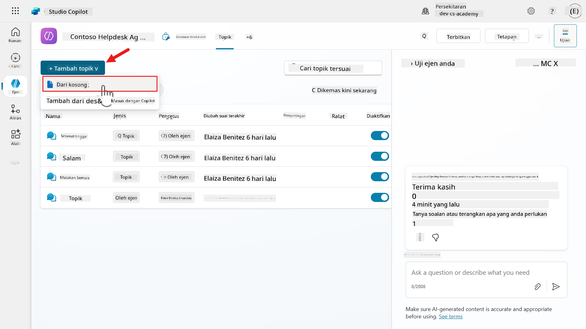

1. Masukkan nama untuk topik tersebut. Salin dan tampal yang berikut.

    ```text
    Available devices
    ```

    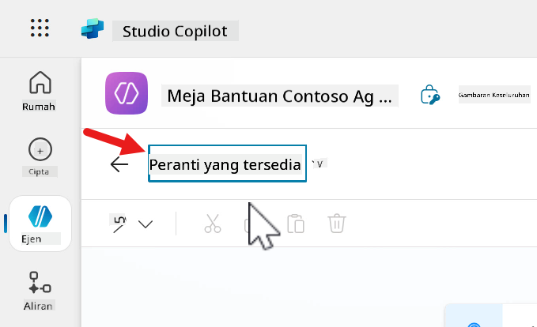

1. Masukkan penerangan pencetus yang menggariskan apa yang dilakukan oleh topik tersebut. Salin dan tampal yang berikut.

    ```text
    This topic helps users find devices that are available from our SharePoint Devices list. User can ask to see available devices and it will return a list of devices that are available which can include laptops, smartphones, accessories and more.
    ```

    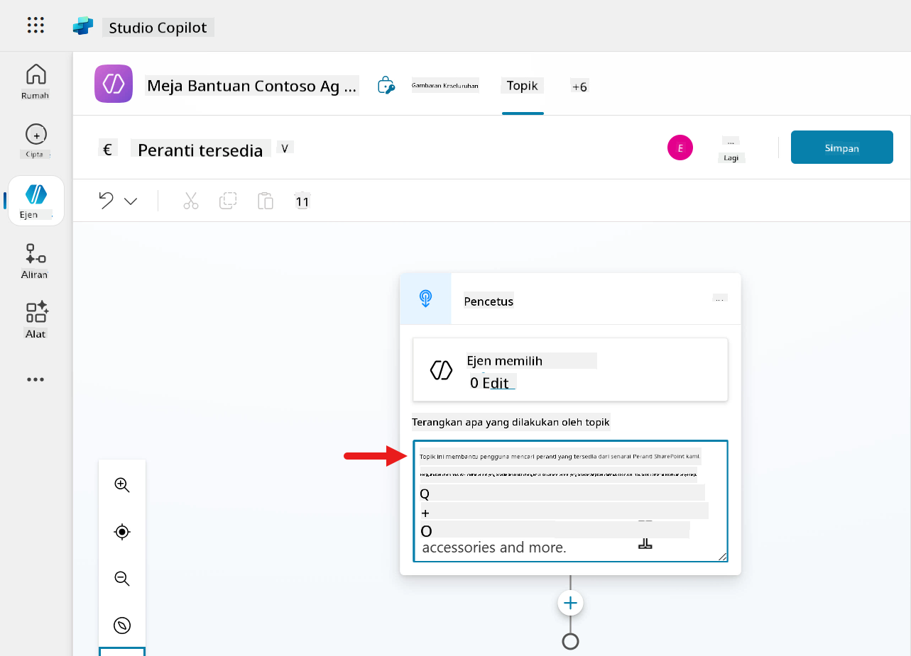

### 7.2 Tentukan input dan output pencetus

1. Seterusnya, kita akan menambah pembolehubah input baru yang akan digunakan oleh AI generatif dalam orkestrasi untuk mengekstrak nilai jenis peranti daripada mesej pengguna. Pilih **Titik tiga (...)** dalam topik dan pilih **Butiran** untuk melihat panel butiran topik.

    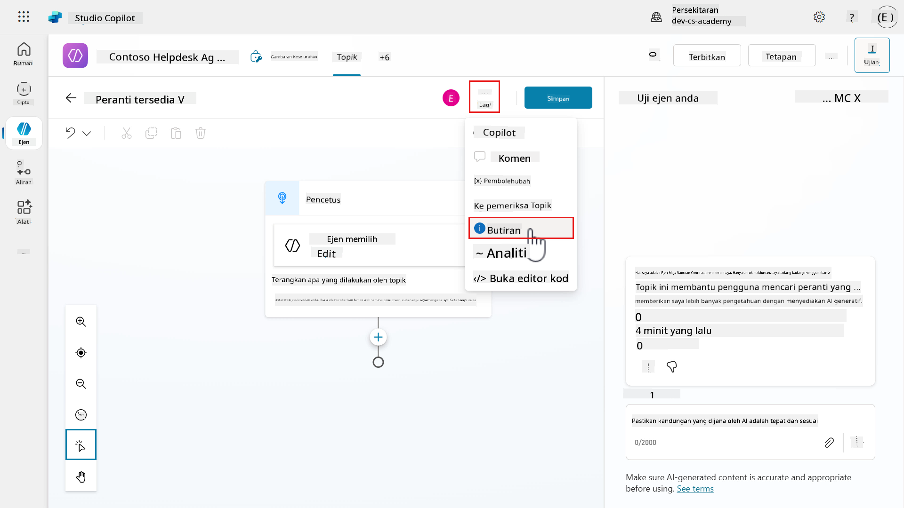

1. Panel **Butiran Topik** kini telah dimuatkan. Pilih tab **Input**.

    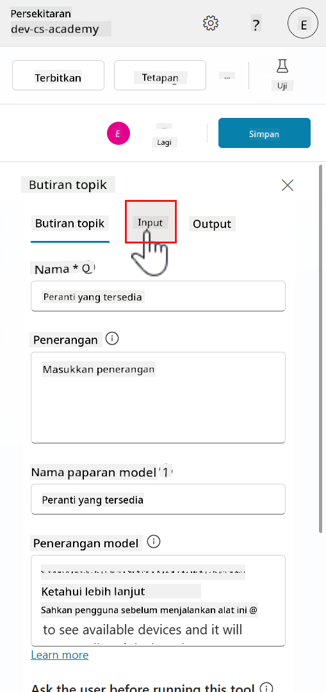

1. Pilih **Cipta pembolehubah baru**.

    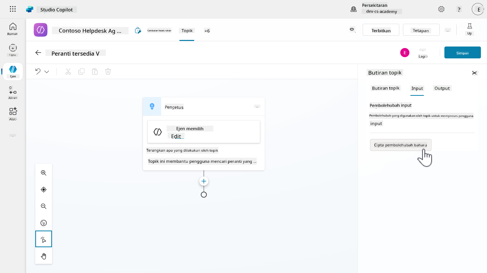

1. Masukkan nama untuk pembolehubah tersebut. Salin dan tampal yang berikut.

    ```text
    VarDeviceType
    ```

    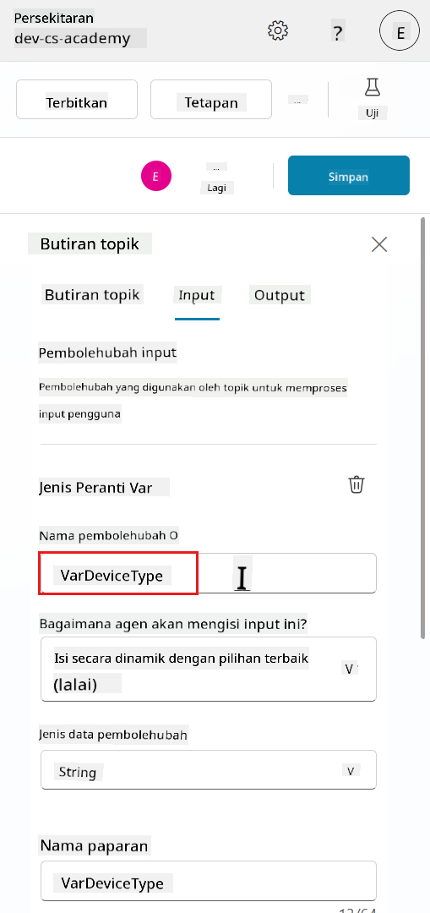

1. Kita kini perlu menentukan pembolehubah input dan output kita. Berikut adalah sifat-sifat yang boleh ditentukan untuk input dan output topik.

    | Medan    | Nilai |
    | ---------- | :--------- |
    | Bagaimana ejen akan mengisi input ini? | Menentukan bagaimana ejen mengisi pembolehubah ini dengan nilai sebelum menjalankan topik. Secara lalai ia ditetapkan kepada _Isi secara dinamik dengan pilihan terbaik_. Jika tidak, anda boleh menggantikan input dengan nilai dan bukannya bertanya kepada pengguna|
    | Jenis data pembolehubah  | Jenis data pembolehubah. Jenis data yang disokong ialah `String`, `Boolean`, `Number`, `Date`, `DateTime`, `DateTimeNoTimeZone`, `Time`, `Record`, `Table`, `Unspecified`, `From sample data` |
    | Nama paparan   | Nama pembolehubah   |
    | Kenal pasti sebagai  | Jenis entiti untuk ejen menangkap jenis nilai yang betul  |
    | Penerangan    | Penerangan membantu ejen mengisi input secara automatik sebelum menjalankan topik atau menjana soalan untuk meminta nilai   |

    Sifat _Bagaimana ejen akan mengisi input ini?_, _Jenis data pembolehubah_ dan _Nama paparan_ boleh dibiarkan seperti sedia ada. Kemas kini sifat **Kenal pasti sebagai** kepada **Respons keseluruhan pengguna**.

    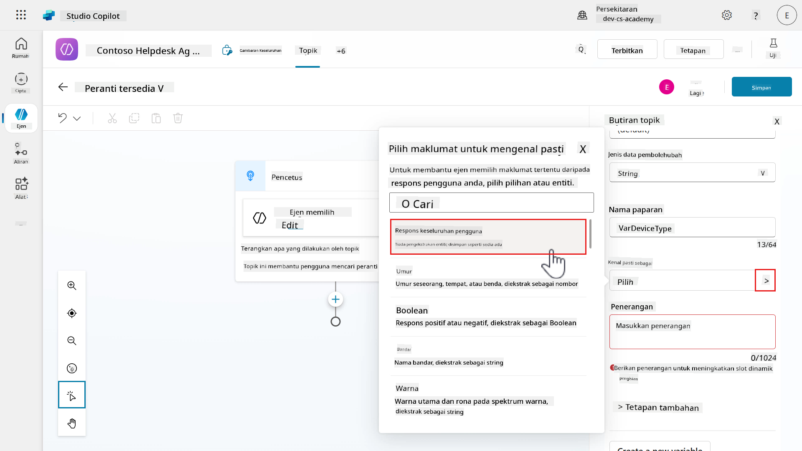

1. Salin dan tampal yang berikut sebagai penerangan.

    ```text
    List of possible values: Laptop, Desktop, Smartphone
    ```

    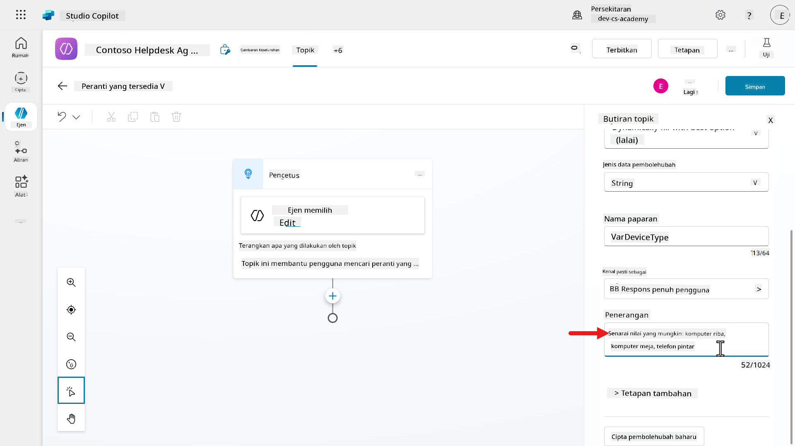

1. Seterusnya, mari kita tentukan output untuk topik tersebut. Pilih tab **Output**.

    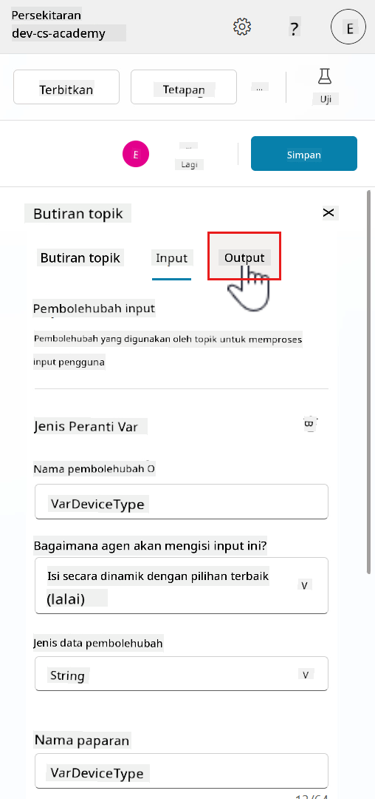

1. Pilih **Cipta pembolehubah baru**.

    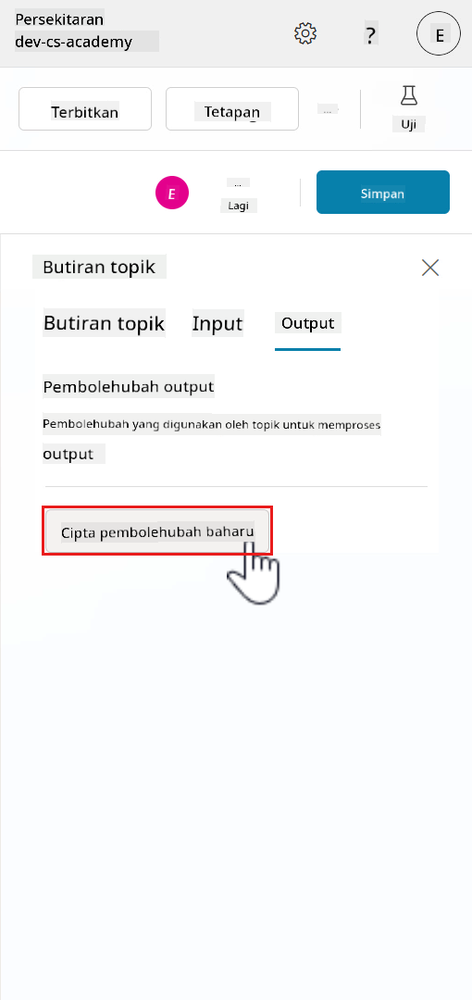

1. Kemas kini sifat berikut.

    **Nama pembolehubah** - Salin dan tampal yang berikut.

    ```text
    VarAvailableDevices
    ```

    **Jenis data pembolehubah** - Pilih **Table** sebagai jenis data.

    **Penerangan pembolehubah** - Salin dan tampal yang berikut.

    ```text
    List of available devices by device type
    ```

    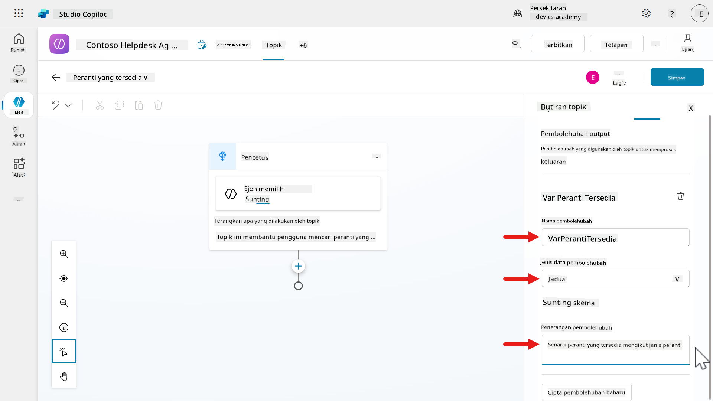

1. Kita kini telah selesai menentukan input dan output topik. Pilih **Ikon X** untuk keluar dari panel **Butiran Topik**.

    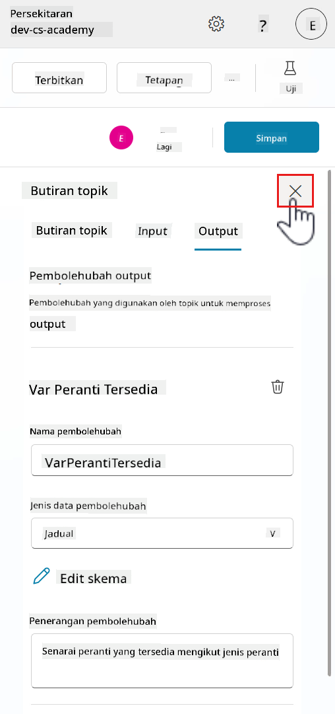

### 7.3 Tambah alat menggunakan penyambung

1. Seterusnya, mari kita tambahkan node yang membolehkan ejen mendapatkan senarai peranti daripada senarai SharePoint **Devices**. Pilih **Ikon +** di bawah pencetus.

    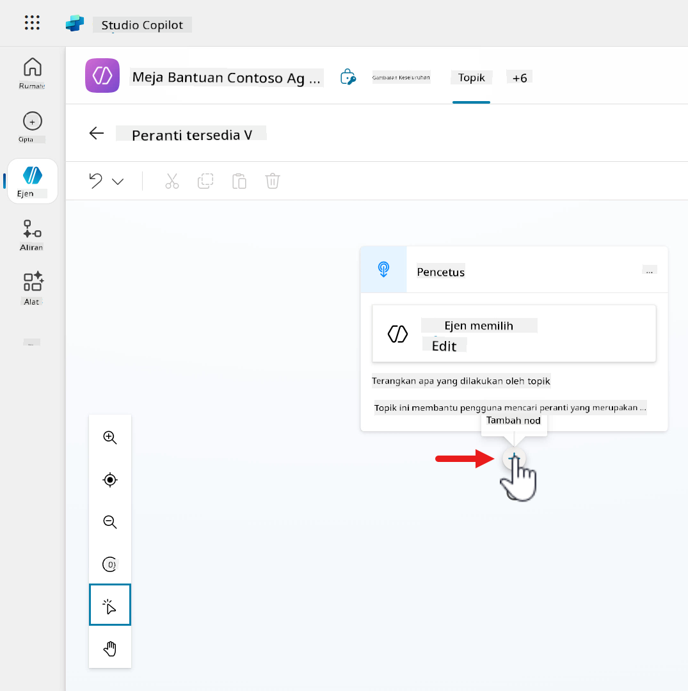

1. Pilih node **Tambah alat**, kemudian pilih tab **Penyambung**. Cari `Get items` dan pilih tindakan penyambung SharePoint **Get items**.

    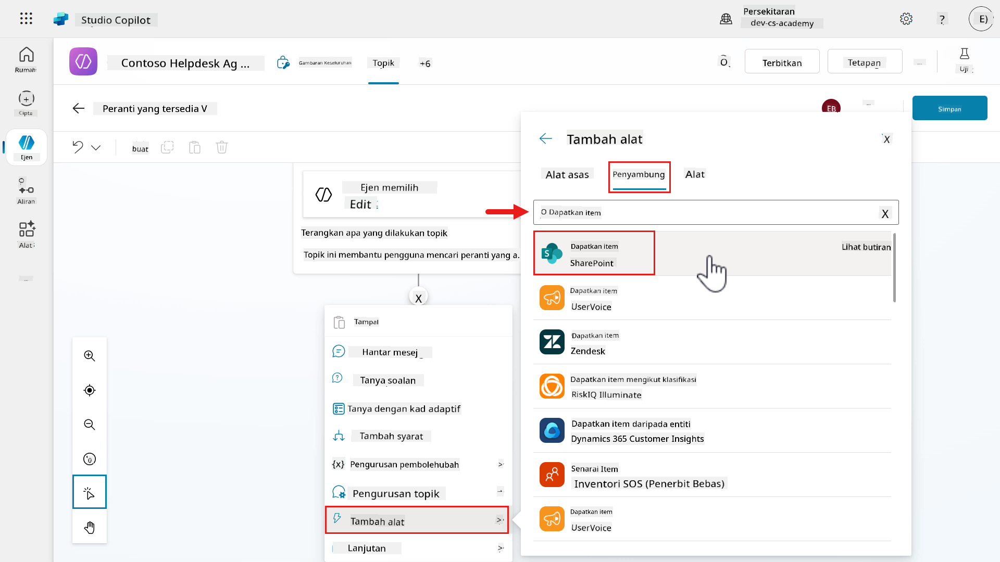

1. Sambungan baru perlu dibuat untuk penyambung tersebut. Pilih ikon **Chevron** dan pilih **Cipta sambungan baru**.

    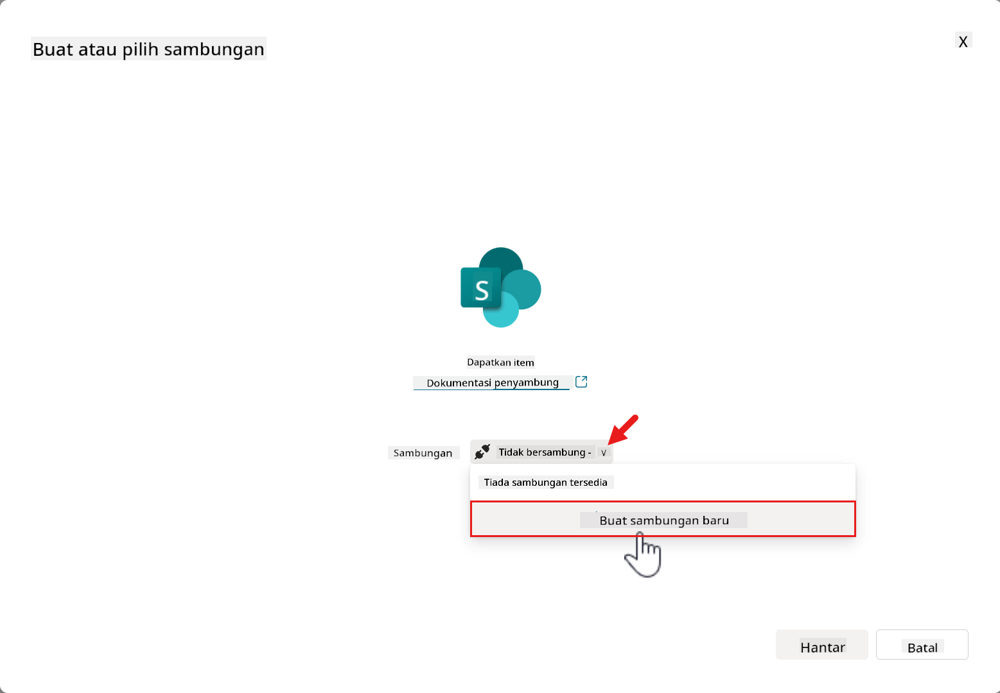

1. Dua pilihan akan dipaparkan yang membolehkan anda menyambung terus ke SharePoint Online atau ke SharePoint di premis. Secara lalai pilihan **Sambung terus (perkhidmatan awan)** akan dipilih, yang akan kita gunakan untuk sambungan kita.
Pilih **Create**.

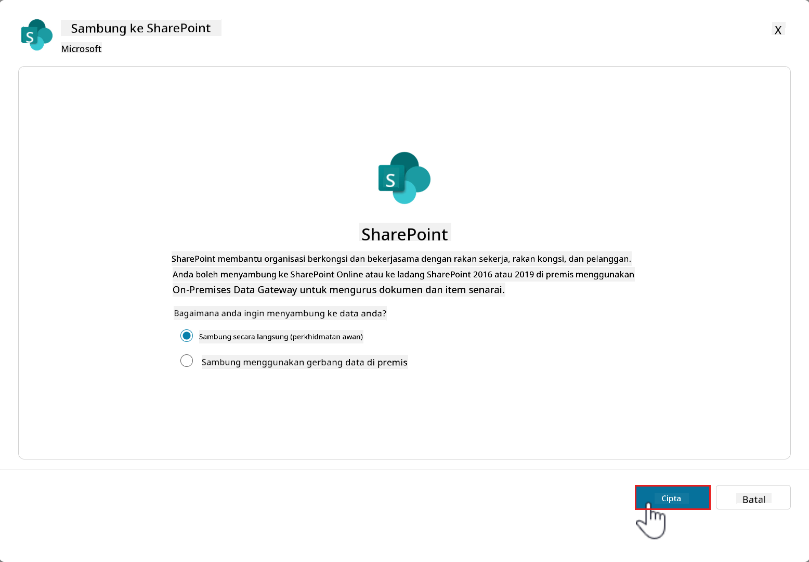

1. Pilih akaun pengguna yang telah log masuk.

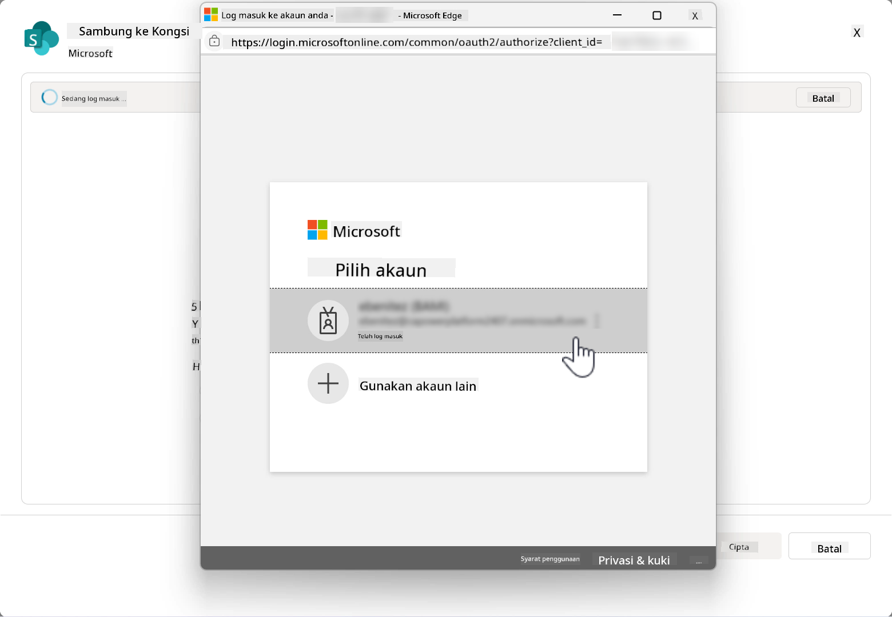

1. Seterusnya, anda perlu mengesahkan akaun pengguna anda boleh digunakan untuk sambungan kepada penyambung SharePoint. Pilih **Allow access**.

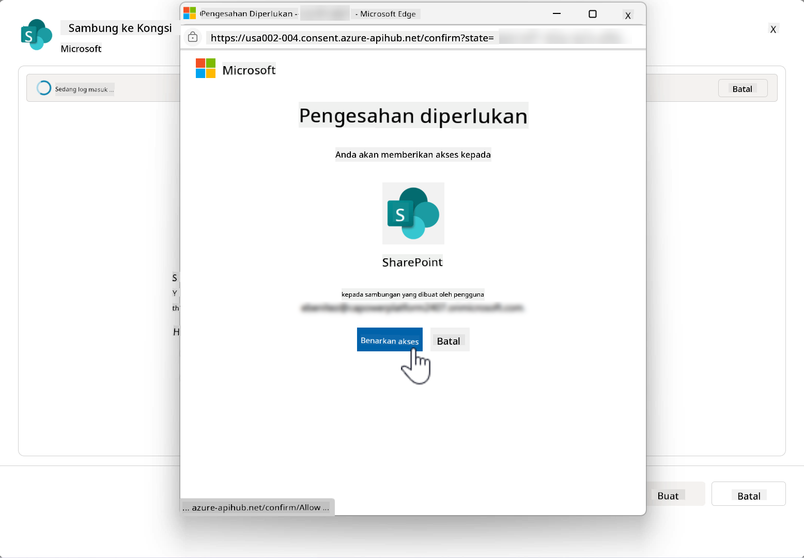

1. Pilih **Submit** untuk tindakan penyambung SharePoint **Get items** ditambah sebagai nod kepada topik.

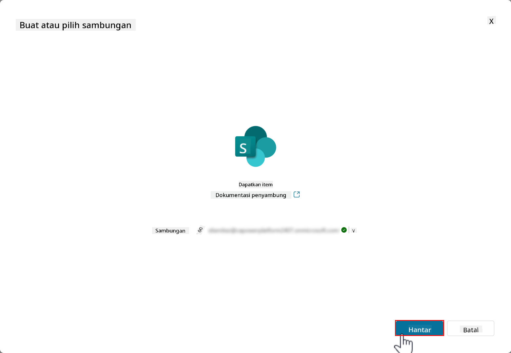

1. Tindakan penyambung SharePoint **Get items** kini telah ditambah kepada topik. Kita kini boleh mula mengkonfigurasi input tindakan tersebut. Pilih **ikon elipsis (...)** dan pilih **Properties**.

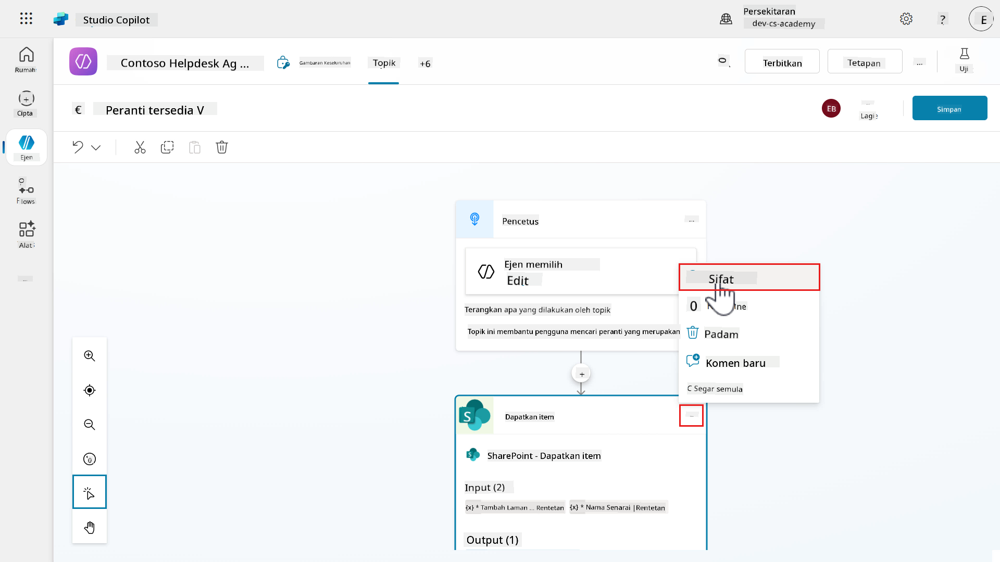

1. Panel konfigurasi **Get items** akan muncul dan secara lalai, anda akan melihat tab **Inputs**. Pilih tab **Initiation** dan masukkan penerangan dalam medan **Usage Description**. Salin dan tampal yang berikut.

    ```text
    Retrieves devices from SharePoint list
    ```

> Ini akan berguna apabila kita melihat halaman _Manage your connections_ ejen kita. Kita akan kembali kepada ini sebentar lagi.

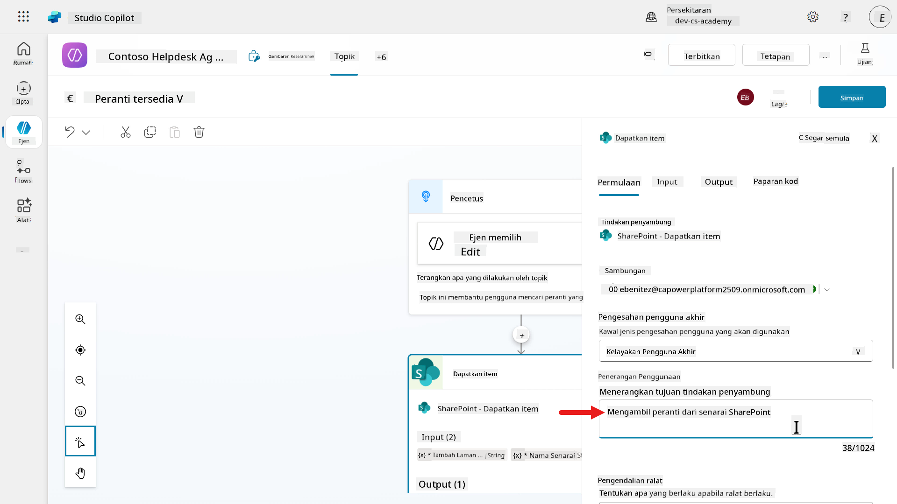

1. Pilih tab **Inputs** dan pilih laman **Contoso IT** serta senarai **Devices** yang anda sediakan dalam [Lesson 00 - Course Setup - Step 3: Create new SharePoint site](../00-course-setup/README.md#step-4-create-new-sharepoint-site).

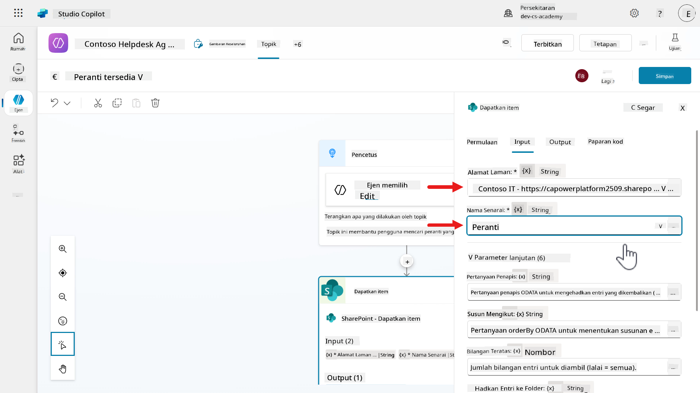

1. Sekarang, untuk hanya memaparkan peranti dari senarai SharePoint berdasarkan
   - nilai yang dipilih,
   - dan hanya peranti di mana statusnya adalah _Available_,

   kita perlu menggunakan penapis. Ini dicapai dengan memasukkan pertanyaan penapis menggunakan Power Fx. Pilih **ikon elipsis (...)**.

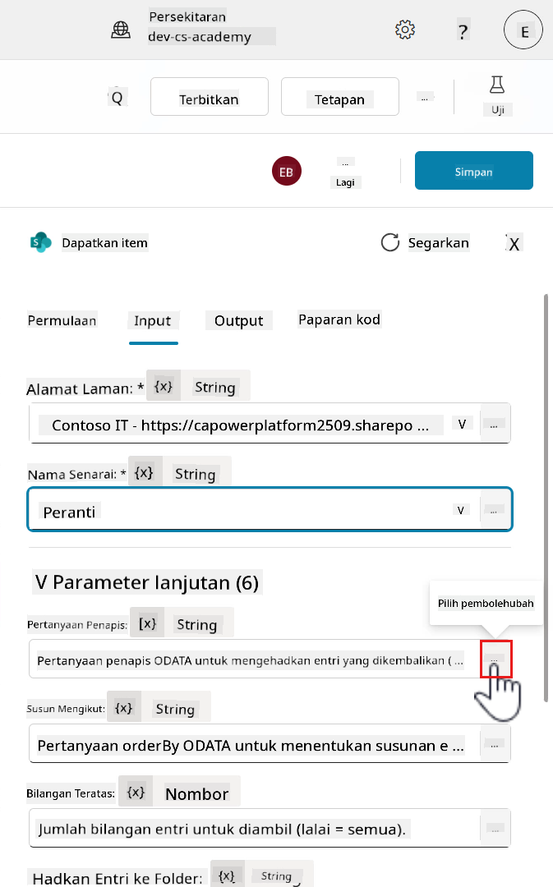

1. Secara lalai, anda akan berada di tab **Custom**. Pilih tab **Formula**.


1. Pilih ikon **expand** untuk membesarkan medan **Formula**. Salin dan tampal ekspresi Power Fx berikut.

Kita menggunakan fungsi `Concatenate` untuk mencipta ekspresi yang akan menapis
- kolum SharePoint **Status** sama dengan _Available_
- dan kolum SharePoint **Asset type** sama dengan _peranti yang dipilih dari nod soalan_.

    ```text
    Concatenate("Status eq 'Available' and AssetType eq '", Topic.VarDeviceType, "'")
    ```

Pilih **Insert**.


1. Ekspresi Power Fx kini akan digunakan dalam parameter input Filter Query tindakan **Get items**. Seterusnya, pilih paparan **All items** dalam **Limit Columns by View**. Ini hanya akan mendapatkan kolum dalam senarai berdasarkan paparan yang dipilih.

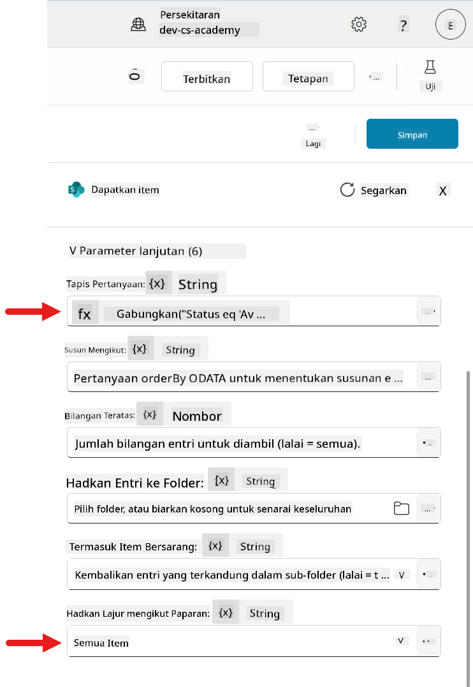

1. Seterusnya, kita akan mengemas kini nama pemboleh ubah untuk output. Pilih tab **Outputs** dan pilih pemboleh ubah `GetItems`.

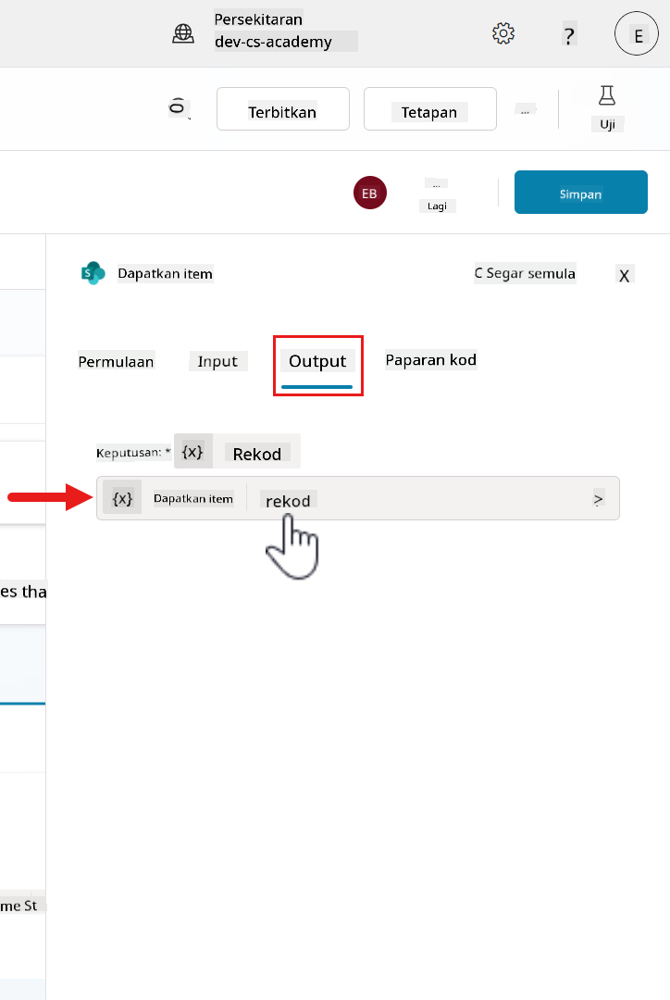

1. Kemas kini nama kepada yang berikut.

    ```text
    VarDevices
    ```

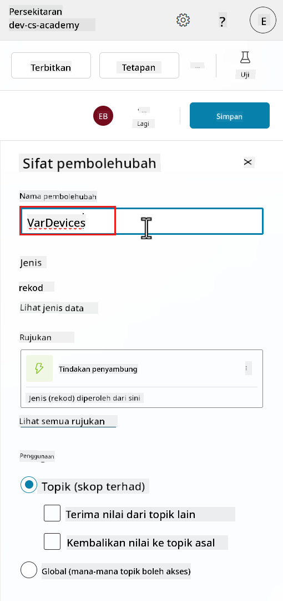

1. Skrol ke bawah dan dalam bahagian **Usage**, pilih **Global**. Ini akan menjadikan pemboleh ubah boleh diakses oleh mana-mana topik.

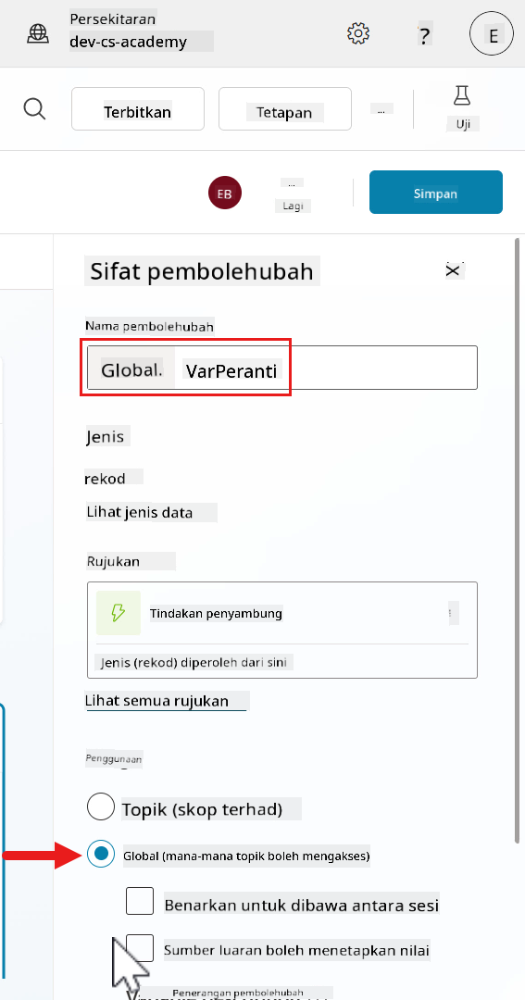

1. **Tutup** panel **Variable properties**.

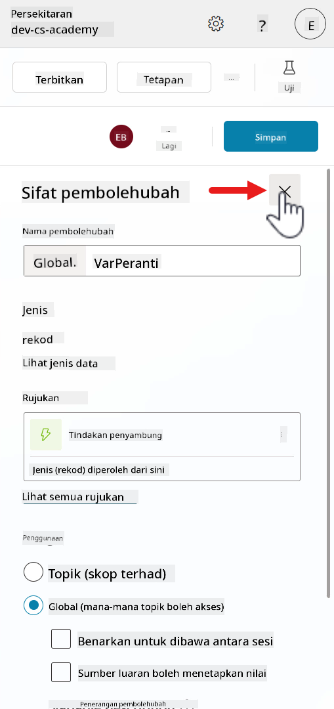

1. Pilih ikon **plus +** untuk memasukkan nod baru, pilih **Variable management** diikuti dengan memilih **Set a variable value**.

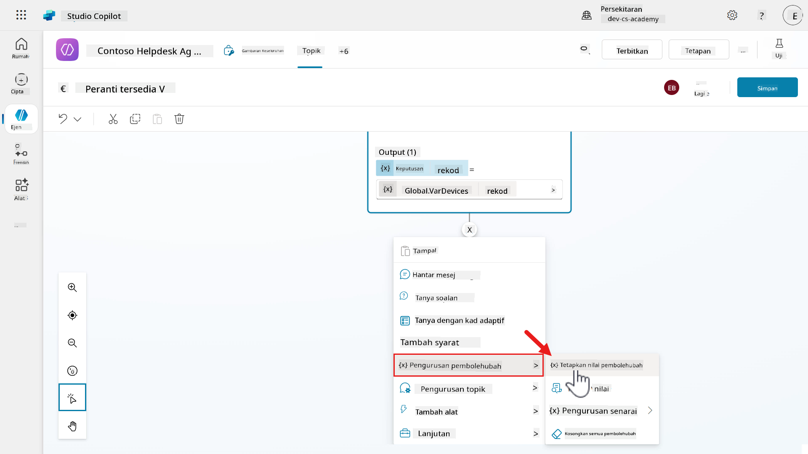

1. Pilih ikon **greater than** untuk parameter input **Set variable**.

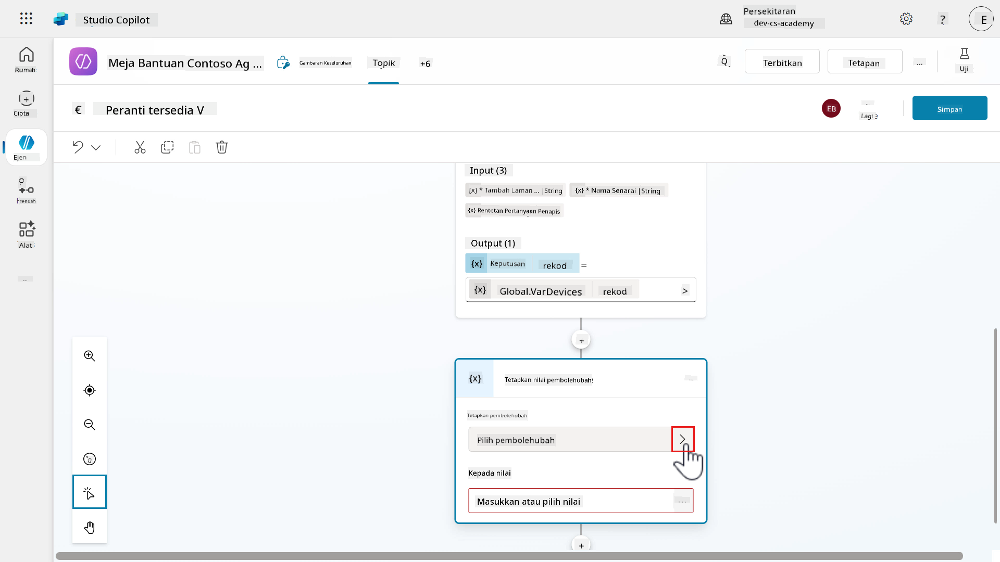

1. Pilih output Topik yang dibuat sebelum ini sebagai pemboleh ubah, **VarAvailableDevices**.

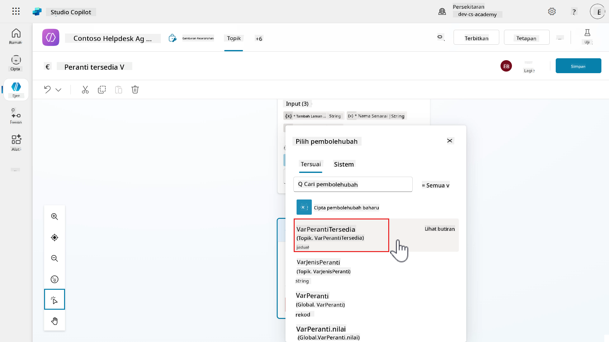

1. Seterusnya, pilih **ikon elipsis (...)** untuk menentukan nilai pemboleh ubah.

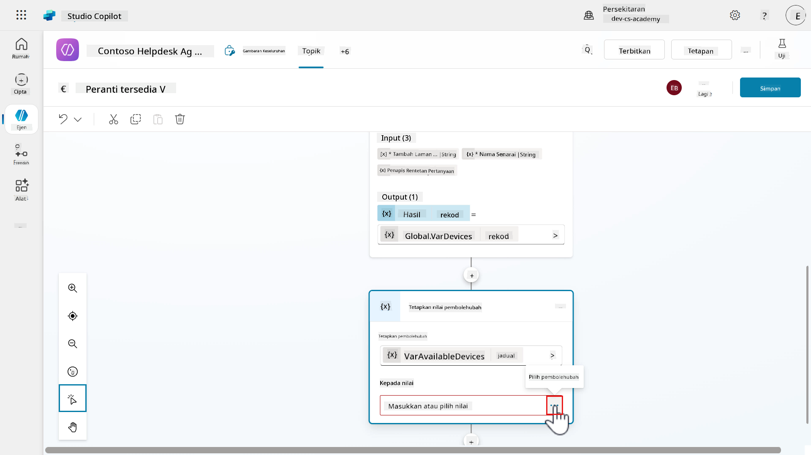

1. Kita kini akan menggunakan ekspresi PowerFx untuk menetapkan nilai pemboleh ubah sebagai sifat `value` yang dikembalikan dalam respons **Get items**, dan menjadikan [skop pemboleh ubah](https://learn.microsoft.com/microsoft-copilot-studio/advanced-power-fx?WT.mc_id=power-172618-ebenitez) global dengan menambah awalan `Global`.

Pilih **Insert** dan **save** topik.

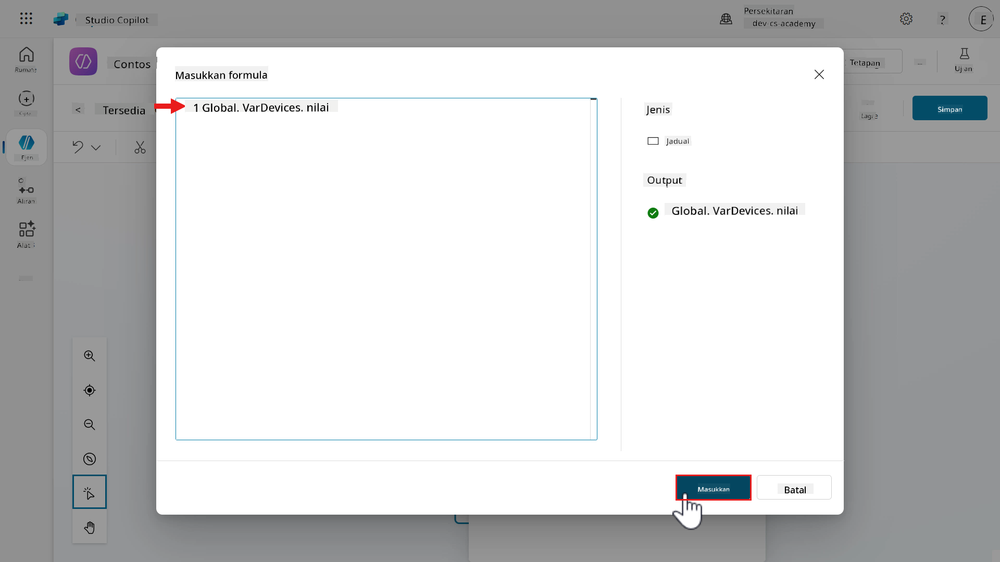

1. Seterusnya kita perlu mengemas kini arahan ejen. Pilih tab **Overview** dan pilih **Edit**.

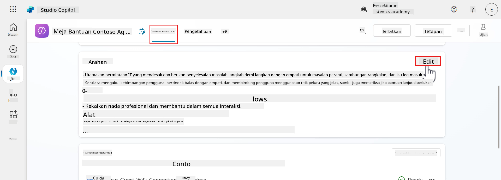

1. Tambahkan baris baru dalam arahan, salin dan tampal yang berikut.

    ```text
    - Help find available devices and give full details using [Available devices]. Always extract the VarDeviceType from the inputs. After giving device details, ask the user if they want to request a device from the list of available devices.
    ```

Arahan ini akan membimbing AI generatif untuk memanggil pencetus **Available devices** untuk memaparkan senarai peranti yang tersedia dari senarai SharePoint **Devices**. Pilih keseluruhan placeholder topik dalam kurungan segi empat.


1. Taipkan watak garis miring `/` dan senarai topik akan muncul. Pilih topik **Available devices**.

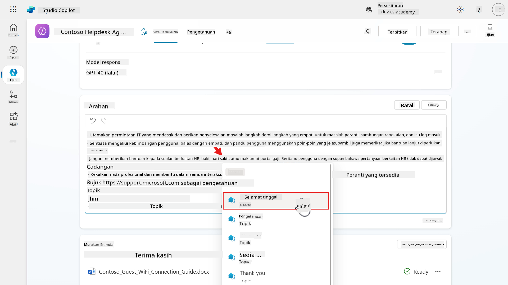

1. **Simpan** arahan yang telah dikemas kini.

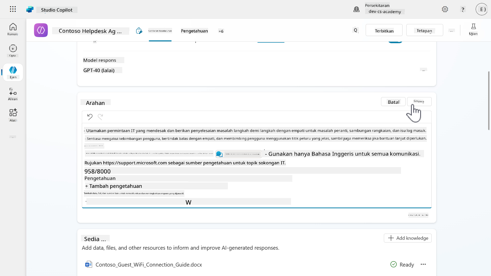

1. Kini kita akan menguji ejen yang telah dikemas kini. Pilih **Test** di bahagian atas kanan untuk memaparkan panel ujian dan **refresh** panel ujian. Masukkan mesej berikut kepada ejen.

    ```text
    I need a laptop
    ```

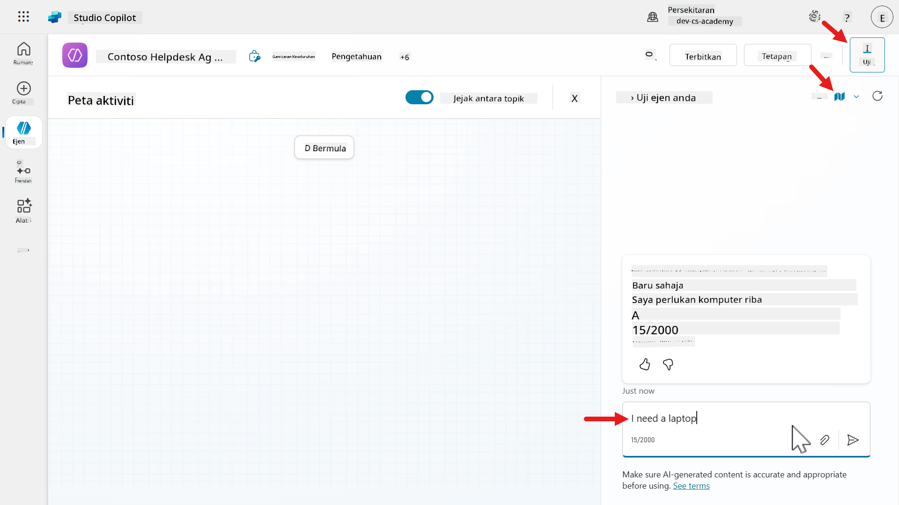

1. Sebelum ejen boleh meneruskan, pengguna perlu mengesahkan sambungan mereka boleh digunakan. Pilih **Allow**.

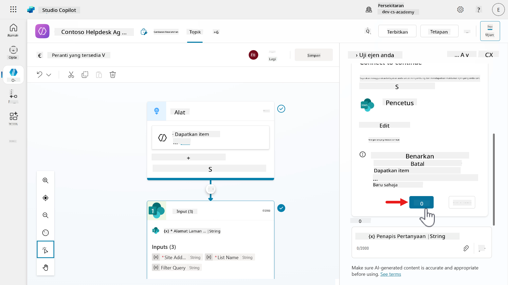

1. Ejen akan melaksanakan alat SharePoint yang mendapatkan senarai peranti yang ditapis di mana jenis peranti sama dengan "laptop" dan status sama dengan "available," berdasarkan ekspresi Power Fx yang digunakan. Respons yang diformatkan dalam bentuk poin akan dikembalikan untuk dibaca oleh pengguna.

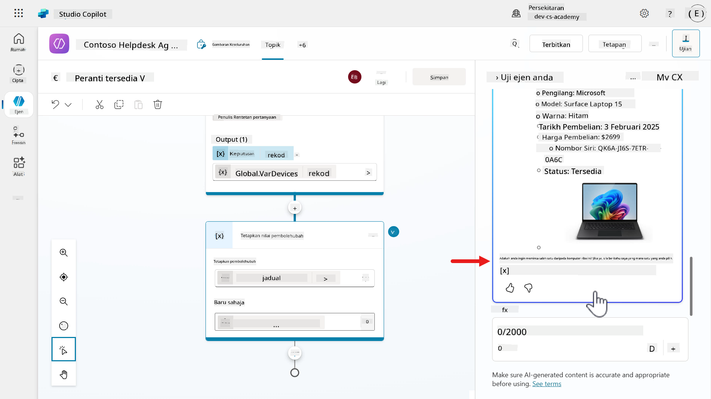

1. Satu perkara terakhir yang perlu dipelajari ialah melihat sambungan yang digunakan dengan melihat halaman _Manage your connections_ ejen. Pilih **ikon elipsis (...)** dan pilih **Manage Connection**.

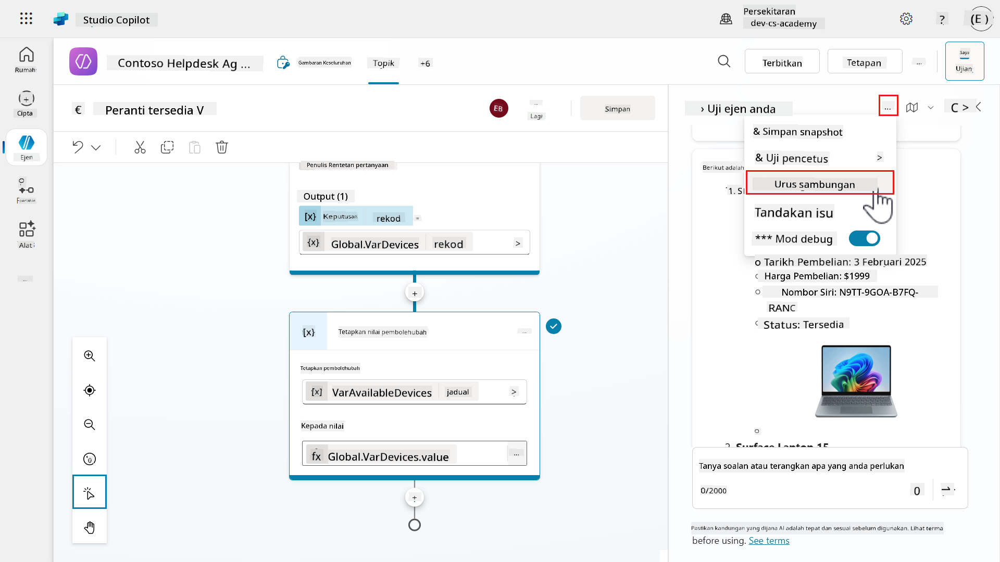

1. Halaman ini adalah tempat kita boleh melihat semua sambungan yang digunakan oleh ejen. Pada masa ini, hanya satu sambungan yang disenaraikan yang dikaitkan dengan alat SharePoint yang telah ditambah kepada Topik. Pilih **1 tool** dalam kolum **Used By**.

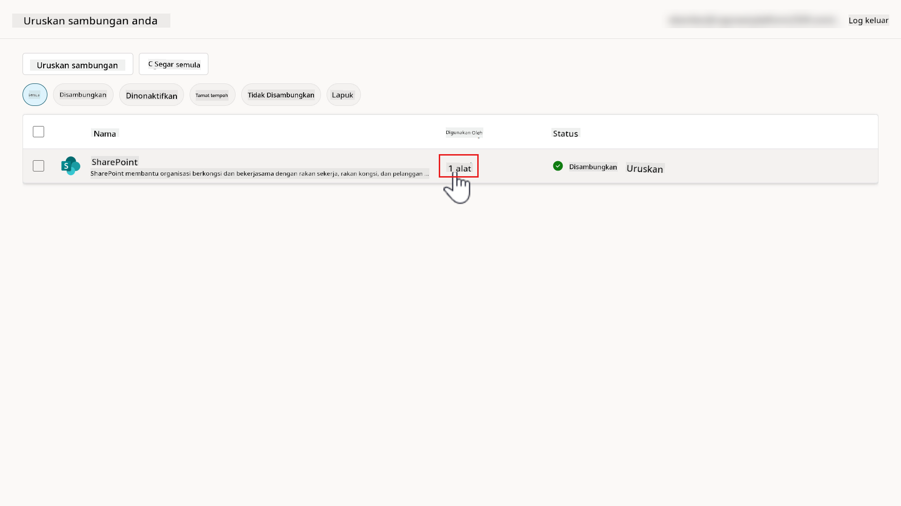

1. Di sinilah kita boleh melihat butiran tindakan Get items dan ingat _usage description_ yang kita masukkan sebelum ini? Di sinilah kita akan melihat penerangan penggunaan tersebut. Pilih **Close**.

> Ini membolehkan kita mengetahui tindakan yang digunakan dan tujuannya. Ini membantu kita mengatur sambungan dengan baik 📁.

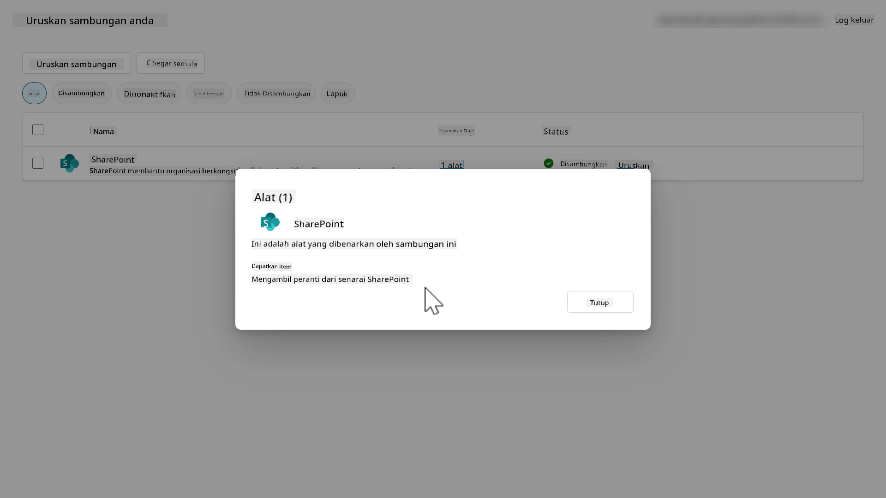

1. Kembali ke tab pelayar anda dengan Copilot Studio dan **refresh** panel ujian untuk mengosongkan ujian.

## ✅ Misi Selesai

Tahniah! 👏🏻 Anda telah belajar cara menambah topik baru dari awal, cara menambah alat yang memanggil tindakan penyambung SharePoint Get items dan menggunakan Power Fx untuk menapis respons supaya hanya mengembalikan peranti di mana statusnya adalah available dan jenis peranti adalah laptop. 🙌🏻

Ini adalah penghujung **Lab 07 - Add a new topic with conversation nodes**, pilih pautan di bawah untuk bergerak ke pelajaran seterusnya. Kita akan mengembangkan kes penggunaan dalam makmal pelajaran berikut.

⏭️ [Bergerak ke pelajaran **Enhance user interactions with Adaptive Cards**](../08-add-adaptive-card/README.md)

## 📚 Sumber Taktikal

🔗 [Gunakan topik sistem](https://learn.microsoft.com/microsoft-copilot-studio/authoring-system-topics?mc_id=power-172618-ebenitez)

🔗 [Topik dalam Microsoft Copilot Studio](https://learn.microsoft.com/microsoft-copilot-studio/guidance/topics-overview?WT.mc_id=power-172618-ebenitez)

🔗 [Tetapkan pencetus topik](https://learn.microsoft.com/microsoft-copilot-studio/authoring-triggers?WT.mc_id=power-172618-ebenitez)

🔗 [Menentukan topik ejen](https://learn.microsoft.com/microsoft-copilot-studio/guidance/defining-chatbot-topics?WT.mc_id=power-172618-ebenitez)

🔗 [Cipta ekspresi menggunakan Power Fx](https://learn.microsoft.com/microsoft-copilot-studio/advanced-power-fx?WT.mc_id=power-172618-ebenitez)

📺 [Cipta topik menggunakan bahasa semula jadi](https://aka.ms/ai-in-action/copilot-studio/ep6)

📺 [Tambah tindakan kepada ejen menggunakan penyambung](https://aka.ms/ai-in-action/copilot-studio/ep4)


---

**Penafian**:  
Dokumen ini telah diterjemahkan menggunakan perkhidmatan terjemahan AI [Co-op Translator](https://github.com/Azure/co-op-translator). Walaupun kami berusaha untuk ketepatan, sila ambil perhatian bahawa terjemahan automatik mungkin mengandungi kesilapan atau ketidaktepatan. Dokumen asal dalam bahasa asalnya harus dianggap sebagai sumber yang berwibawa. Untuk maklumat kritikal, terjemahan manusia profesional adalah disyorkan. Kami tidak bertanggungjawab atas sebarang salah faham atau salah tafsir yang timbul daripada penggunaan terjemahan ini.