<!--
CO_OP_TRANSLATOR_METADATA:
{
  "original_hash": "cd99a76bcb7372ac2771b6ae178b023d",
  "translation_date": "2025-10-20T00:57:44+00:00",
  "source_file": "docs/recruit/10-add-event-triggers/README.md",
  "language_code": "ms"
}
-->
# 🚨 Misi 10: Tambah Pencetus Acara - Aktifkan Keupayaan Ejen Autonomi

## 🕵️‍♂️ NAMA KOD: `OPERASI RUTIN HANTU`

> **⏱️ Tempoh Operasi:** `~45 minit`

🎥 **Tonton Panduan**

[](https://www.youtube.com/watch?v=ZgwHL8PQ1nY "Tonton panduan di YouTube")

## 🎯 Ringkasan Misi

Kini tiba masanya untuk meningkatkan ejen anda daripada pembantu perbualan kepada operasi autonomi. Misi anda adalah untuk membolehkan ejen anda bertindak tanpa dipanggil - bertindak balas kepada isyarat dari seluruh domain digital anda dengan ketepatan dan kelajuan.

Dengan Pencetus Acara, anda akan melatih ejen anda untuk memantau sistem luaran seperti SharePoint, Teams, dan Outlook, serta melaksanakan tindakan pintar sebaik sahaja isyarat diterima. Operasi ini mengubah ejen anda menjadi aset lapangan yang berfungsi sepenuhnya - senyap, pantas, dan sentiasa memerhati.

Kejayaan bermakna membina ejen yang memulakan nilai - bukan hanya bertindak balas kepadanya.

## 🔎 Objektif

📖 Pelajaran ini akan merangkumi:

- Memahami Pencetus Acara dan bagaimana ia membolehkan tingkah laku ejen autonomi
- Mempelajari perbezaan antara pencetus acara dan pencetus topik, termasuk aliran kerja pencetus dan muatan
- Meneroka senario Pencetus Acara yang biasa
- Memahami pertimbangan pengesahan, keselamatan, dan penerbitan untuk ejen yang didorong oleh acara
- Membina ejen Meja Bantuan IT autonomi yang bertindak balas kepada acara SharePoint dan menghantar pengakuan e-mel

## 🤔 Apa itu Pencetus Acara?

**Pencetus Acara** adalah mekanisme yang membolehkan ejen anda bertindak secara autonomi sebagai tindak balas kepada acara luaran, tanpa memerlukan input langsung daripada pengguna. Anggaplah ia sebagai cara untuk membuat ejen anda "memerhati" acara tertentu dan secara automatik mengambil tindakan apabila acara tersebut berlaku.

Berbeza dengan pencetus topik, yang memerlukan pengguna menaip sesuatu untuk mengaktifkan perbualan, pencetus acara diaktifkan berdasarkan perkara yang berlaku dalam sistem yang disambungkan. Contohnya:

- Apabila fail baru dibuat dalam SharePoint atau OneDrive for Business
- Apabila rekod dibuat dalam Dataverse
- Apabila tugas diselesaikan dalam Planner
- Apabila respons Borang Microsoft baru dihantar
- Apabila mesej Microsoft Teams baru ditambah
- Berdasarkan jadual berulang (seperti peringatan harian)  
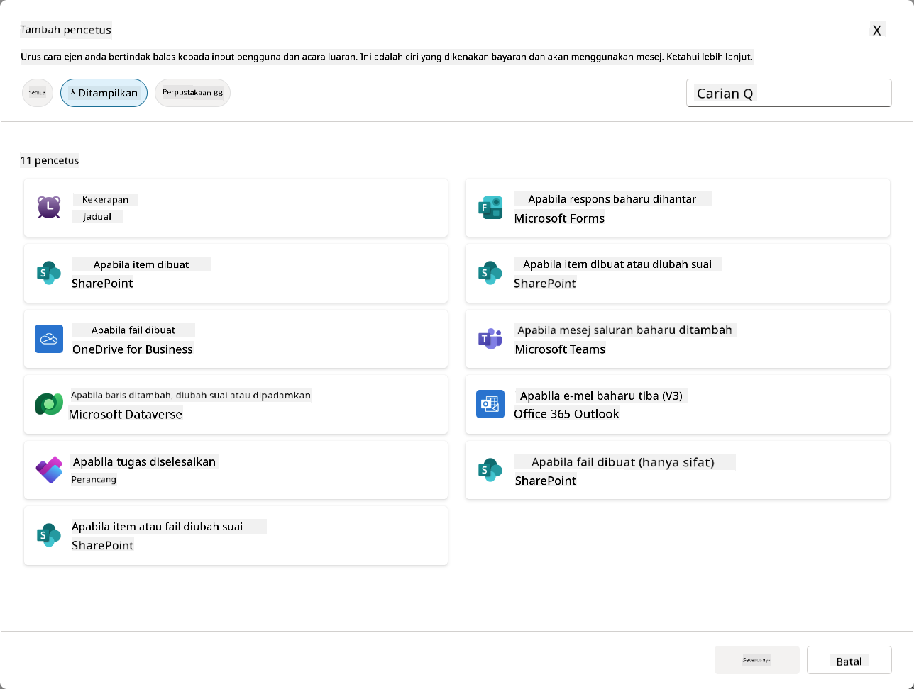

### Mengapa Pencetus Acara penting dalam ejen autonomi

Pencetus acara mengubah ejen anda daripada pembantu reaktif kepada pembantu autonomi yang proaktif:

1. **Operasi autonomi** - ejen anda boleh berfungsi 24/7 tanpa campur tangan manusia, bertindak balas kepada acara sebaik sahaja ia berlaku.
    - *Contoh:* Secara automatik menyambut ahli pasukan baru apabila mereka ditambah ke dalam pasukan.

1. **Respons masa nyata** - bukannya menunggu pengguna bertanya soalan, ejen anda bertindak balas dengan segera kepada acara yang relevan.
    - *Contoh*: Memberi amaran kepada pasukan IT apabila dokumen SharePoint diubah.

1. **Automasi aliran kerja** - menggabungkan beberapa tindakan berdasarkan satu acara pencetus.
    - *Contoh:* Apabila tiket sokongan baru dibuat, buat tugas, maklumkan kepada pengurus, dan kemas kini papan pemantauan.

1. **Proses yang konsisten** - memastikan langkah penting tidak terlepas dengan mengautomasikan tindak balas kepada acara utama.
    - *Contoh:* Setiap pekerja baru secara automatik mendapat bahan orientasi dan permintaan akses.

1. **Tindakan berdasarkan data** - menggunakan maklumat daripada acara pencetus untuk membuat keputusan pintar dan mengambil tindakan yang sesuai.
    - *Contoh:* Mengarahkan tiket yang mendesak kepada kakitangan kanan berdasarkan tahap keutamaan dalam muatan pencetus.

## ⚙️ Bagaimana Pencetus Acara berfungsi?

Pencetus acara beroperasi melalui aliran kerja tiga langkah yang membolehkan ejen anda bertindak balas secara autonomi kepada acara luaran:

### Aliran kerja pencetus

1. **Pengesanan Acara** - Satu acara tertentu berlaku dalam sistem yang disambungkan (SharePoint, Teams, Outlook, dll.)
1. **Pengaktifan Pencetus** - Pencetus acara mengesan acara ini dan menghantar muatan kepada ejen anda melalui Power Automate Cloud Flow.
1. **Respons Ejen** - Ejen anda menerima muatan dan melaksanakan arahan yang telah anda tentukan

### Pencetus Acara vs Pencetus Topik

Memahami perbezaan antara dua jenis pencetus ini adalah penting:

| **Pencetus Acara** | **Pencetus Topik** |
|-------------------|-------------------|
| Diaktifkan oleh acara sistem luaran | Diaktifkan oleh input/frasa pengguna |
| Membolehkan tingkah laku ejen autonomi | Membolehkan respons perbualan |
| Menggunakan pengesahan pembuat | Pilihan untuk pengesahan pengguna |
| Berfungsi tanpa interaksi pengguna | Memerlukan pengguna untuk memulakan perbualan |
| Contoh: Fail dibuat, e-mel diterima | Contoh: "Bagaimana cuaca?" |

## 📦 Memahami muatan pencetus

Apabila satu acara berlaku, pencetus menghantar **muatan** kepada ejen anda yang mengandungi maklumat tentang acara dan arahan tentang cara untuk bertindak balas.

### Muatan lalai vs muatan tersuai

Setiap jenis pencetus datang dengan struktur muatan lalai, tetapi anda boleh menyesuaikannya:

**Muatan lalai** - Menggunakan format standard seperti `Gunakan kandungan daripada {Body}`

- Mengandungi maklumat asas acara
- Menggunakan arahan pemprosesan generik
- Sesuai untuk senario mudah

**Muatan tersuai** - Tambah arahan khusus dan format data

- Sertakan arahan terperinci untuk ejen anda
- Nyatakan dengan tepat data apa yang hendak digunakan dan bagaimana
- Lebih baik untuk aliran kerja yang kompleks

### Arahan ejen vs arahan muatan tersuai

Anda mempunyai dua tempat untuk membimbing tingkah laku ejen anda dengan pencetus acara:

**Arahan Ejen** (Global)

- Panduan luas yang terpakai kepada semua pencetus
- Contoh: "Semasa memproses tiket, sentiasa periksa duplikasi terlebih dahulu"
- Terbaik untuk corak tingkah laku umum

**Arahan Muatan** (Khusus Pencetus)

- Arahan khusus untuk jenis pencetus individu  
- Contoh: "Untuk kemas kini SharePoint ini, hantar ringkasan kepada saluran projek"
- Terbaik untuk ejen kompleks dengan pelbagai pencetus

💡 **Petua profesional**: Elakkan arahan yang bercanggah antara dua tahap ini, kerana ini boleh menyebabkan tingkah laku yang tidak dijangka.

## 🎯 Senario Pencetus Acara yang biasa

Berikut adalah contoh praktikal bagaimana pencetus acara boleh meningkatkan ejen anda:

### Ejen Meja Bantuan IT

- **Pencetus**: Item senarai SharePoint baru (tiket sokongan)
- **Tindakan**: Secara automatik mengkategorikan, menetapkan keutamaan, dan memaklumkan kepada ahli pasukan yang sesuai

### Ejen Orientasi Pekerja

- **Pencetus**: Pengguna baru ditambah ke Dataverse
- **Tindakan**: Hantar mesej selamat datang, buat tugas orientasi, dan sediakan akses

### Ejen Pengurusan Projek

- **Pencetus**: Tugas diselesaikan dalam Planner
- **Tindakan**: Kemas kini papan pemantauan projek, maklumkan kepada pihak berkepentingan, dan periksa halangan

### Ejen Pengurusan Dokumen

- **Pencetus**: Fail dimuat naik ke folder SharePoint tertentu
- **Tindakan**: Ekstrak metadata, gunakan tag, dan maklumkan kepada pemilik dokumen

### Ejen Pembantu Mesyuarat

- **Pencetus**: Acara kalendar dibuat
- **Tindakan**: Hantar peringatan sebelum mesyuarat dan agenda, tempah sumber

## ⚠️ Pertimbangan penerbitan dan pengesahan

Sebelum ejen anda boleh menggunakan pencetus acara dalam pengeluaran, anda perlu memahami implikasi pengesahan dan keselamatan.

### Pengesahan pembuat

Pencetus acara menggunakan **kelayakan pencipta ejen** untuk semua pengesahan:

- Ejen anda mengakses sistem menggunakan kebenaran anda
- Pengguna berpotensi mengakses data melalui kelayakan anda
- Semua tindakan dilakukan "sebagai anda" walaupun pengguna berinteraksi dengan ejen

### Amalan terbaik perlindungan data

Untuk mengekalkan keselamatan semasa menerbitkan ejen dengan pencetus acara:

1. **Nilai akses data** - Semak sistem dan data apa yang boleh diakses oleh pencetus anda
1. **Uji dengan teliti** - Fahami maklumat apa yang termasuk dalam muatan pencetus
1. **Hadkan skop pencetus** - Gunakan parameter tertentu untuk mengehadkan acara yang mengaktifkan pencetus
1. **Semak data muatan** - Pastikan pencetus tidak mendedahkan maklumat sensitif
1. **Pantau penggunaan** - Jejaki aktiviti pencetus dan penggunaan sumber

## ⚠️ Penyelesaian masalah dan batasan

Perhatikan pertimbangan penting ini semasa bekerja dengan pencetus acara:

### Kesan kuota dan pengebilan

- Setiap pengaktifan pencetus dikira terhadap penggunaan mesej anda
- Pencetus yang kerap (seperti pengulangan setiap minit) boleh dengan cepat menggunakan kuota
- Pantau penggunaan untuk mengelakkan sekatan

### Keperluan teknikal

- Hanya tersedia untuk ejen dengan orkestrasi generatif yang diaktifkan
- Memerlukan perkongsian aliran awan yang sedar penyelesaian untuk diaktifkan dalam persekitaran anda

### Pencegahan Kehilangan Data (DLP)

- Dasar DLP organisasi anda menentukan pencetus mana yang tersedia
- Pentadbir boleh menyekat pencetus acara sepenuhnya
- Hubungi pentadbir anda jika pencetus yang dijangka tidak tersedia

## 🧪 Makmal 10 - Tambah Pencetus Acara untuk tingkah laku ejen autonomi

### 🎯 Kes penggunaan

Anda akan meningkatkan ejen Meja Bantuan IT anda untuk bertindak balas secara automatik kepada permintaan sokongan baru. Apabila seseorang membuat item baru dalam senarai tiket sokongan SharePoint anda, ejen anda akan:

1. Mencetuskan secara autonomi apabila tiket SharePoint dibuat
1. Memberikan butiran tiket dan arahan tentang langkah-langkah yang anda mahu ia laksanakan
1. Secara automatik mengakui tiket kepada pengirim melalui e-mel yang dijana AI

Makmal ini menunjukkan bagaimana pencetus acara membolehkan tingkah laku ejen yang benar-benar autonomi.

### Prasyarat

Sebelum memulakan makmal ini, pastikan anda mempunyai:

- ✅ Menyelesaikan makmal sebelumnya (terutamanya Makmal 6-8 untuk ejen Meja Bantuan IT)
- ✅ Akses ke laman SharePoint dengan senarai tiket sokongan IT
- ✅ Persekitaran Copilot Studio dengan pencetus acara diaktifkan
- ✅ Ejen anda mempunyai orkestrasi generatif yang diaktifkan
- ✅ Kebenaran yang sesuai dalam laman SharePoint dan persekitaran Copilot Studio anda

### 10.1 Aktifkan AI Generatif dan buat pencetus penciptaan item SharePoint

1. Buka **ejen Meja Bantuan IT** anda dalam **Copilot Studio**

1. Pertama, pastikan **AI Generatif** diaktifkan untuk ejen anda:
   - Navigasi ke tab **Gambaran Keseluruhan**
   - Di bawah bahagian Orkestrasi, Tukar **Orkestrasi generatif** kepada **Hidup** jika belum diaktifkan  
     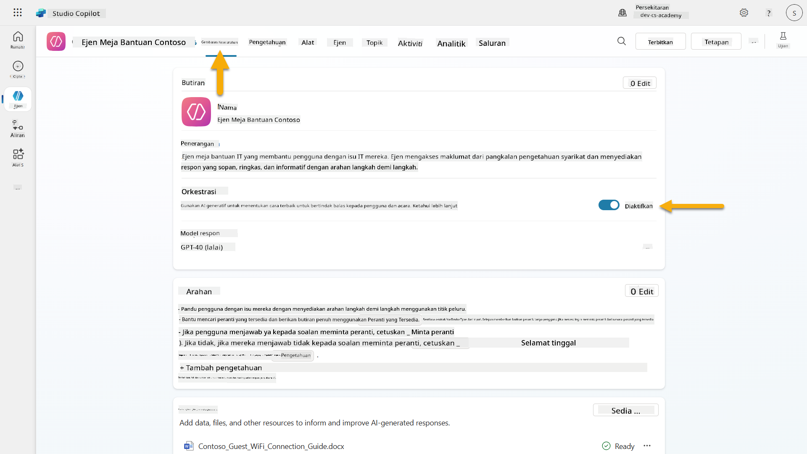

1. Navigasi ke tab **Gambaran Keseluruhan** dan cari bahagian **Pencetus**

1. Klik **+ Tambah pencetus** untuk membuka perpustakaan pencetus  
    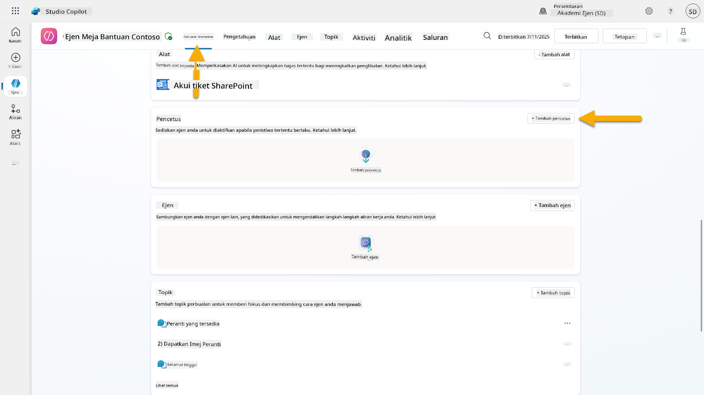

1. Cari dan pilih **Apabila item dibuat** (SharePoint)  
    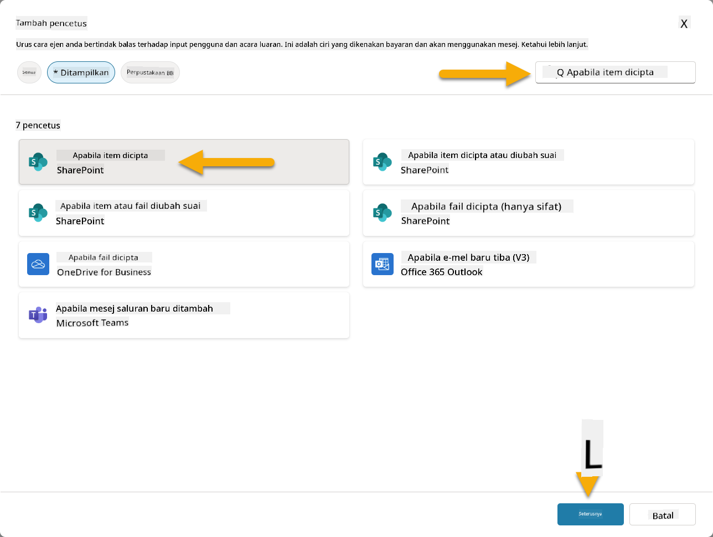

1. Konfigurasikan nama pencetus dan sambungan:

   - **Nama Pencetus:** Tiket Sokongan Baru Dibuat di SharePoint

1. Tunggu sambungan dikonfigurasi, dan pilih **Seterusnya** untuk meneruskan.  
   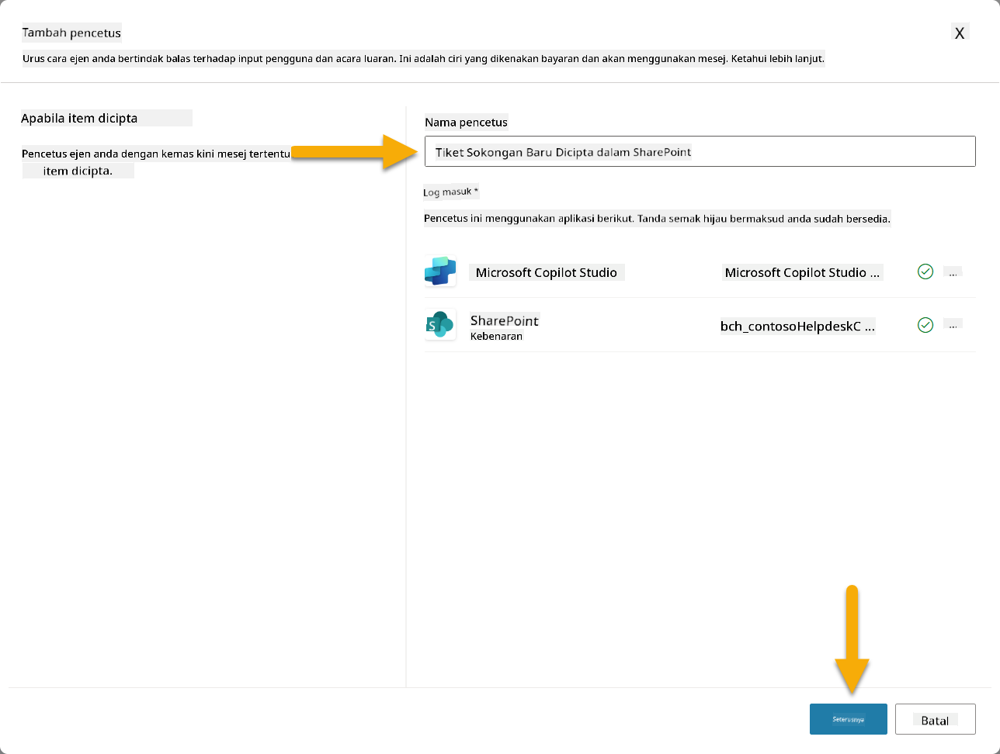

1. Konfigurasikan parameter pencetus:

   - **Alamat Laman**: Pilih laman SharePoint "Contoso IT" anda

   - **Nama Senarai**: Pilih senarai "Tiket" anda

   - **Arahan tambahan kepada ejen apabila ia diaktifkan oleh pencetus:**

     ```text
     New Support Ticket Created in SharePoint: {Body}
     
     Use the 'Acknowledge SharePoint Ticket' tool to generate the email body automatically and respond.
     
     IMPORTANT: Do not wait for any user input. Work completely autonomously.
     ```

     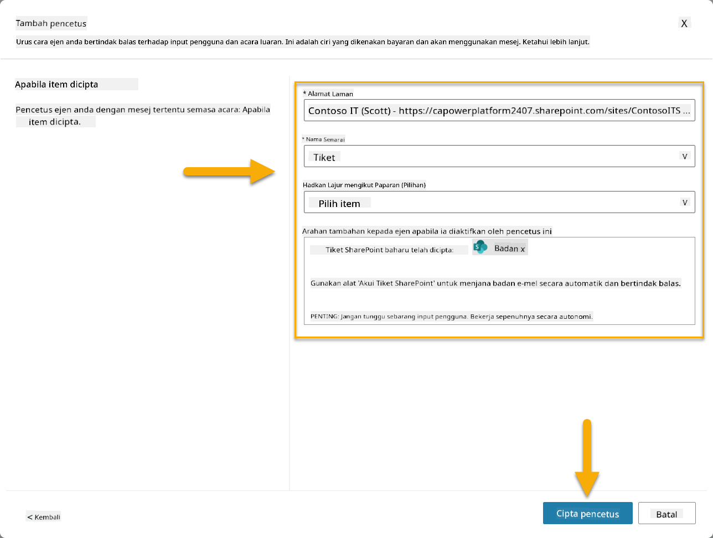

1. Pilih **Buat pencetus** untuk melengkapkan penciptaan pencetus. Aliran Awan Power Automate secara automatik dibuat untuk mencetuskan ejen secara autonomi.

1. Pilih **Tutup**.

### 10.2 Edit Pencetus

1. Di dalam bahagian **Pencetus** pada tab **Gambaran Keseluruhan**, Pilih menu **...** pada pencetus **Tiket Sokongan Baru Dibuat di SharePoint**

1. Pilih **Edit dalam Power Automate**  
   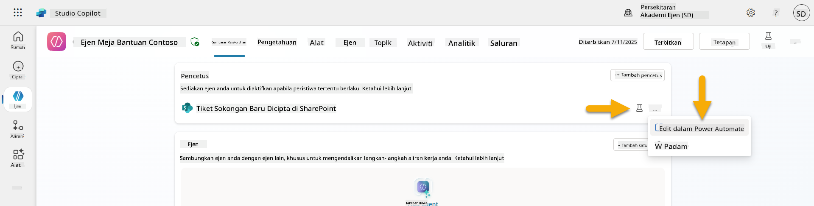

1. Pilih nod **Menghantar arahan kepada copilot yang ditentukan untuk diproses**

1. Dalam medan **Kandungan/Badan**, keluarkan kandungan Badan, **tekan kekunci garis miring ke depan** (/) dan pilih **Masukkan Ekspresi**  
   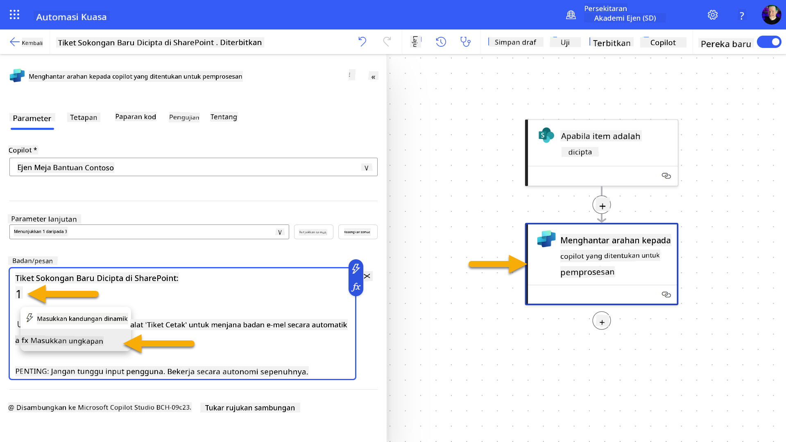

1. Masukkan ekspresi berikut untuk memberikan ejen dengan butiran khusus tentang tiket:

    ```text
    concat('Submitted By Name: ', first(triggerOutputs()?['body/value'])?['Author/DisplayName'], '\nSubmitted By Email: ', first(triggerOutputs()?['body/value'])?['Author/Email'], '\nTitle: ', first(triggerOutputs()?['body/value'])?['Title'], '\nIssue Description: ', first(triggerOutputs()?['body/value'])?['Description'], '\nPriority: ', first(triggerOutputs()?['body/value'])?['Priority/Value'],'\nTicket ID : ', first(triggerOutputs()?['body/value'])?['ID'])
    ```

1. Pilih **Tambah**  
   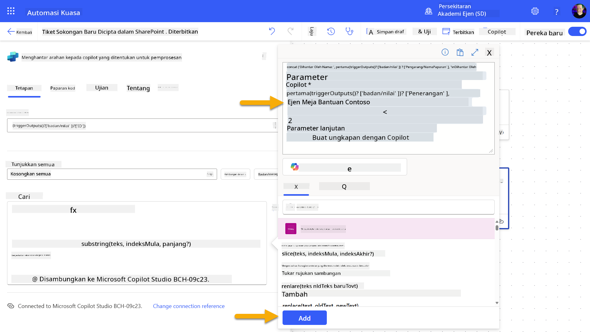

1. Pilih **Terbitkan** pada bar alat di bahagian atas kanan.

### 10.3 Buat alat untuk pengakuan e-mel

1. **Kembali** ke Ejen anda dalam Copilot Studio

1. Navigasi ke tab **Alat** dalam ejen anda

1. Klik **+ Tambah alat** dan pilih **Penyambung**

1. Cari dan pilih penyambung **Hantar e-mel (V2)**  
    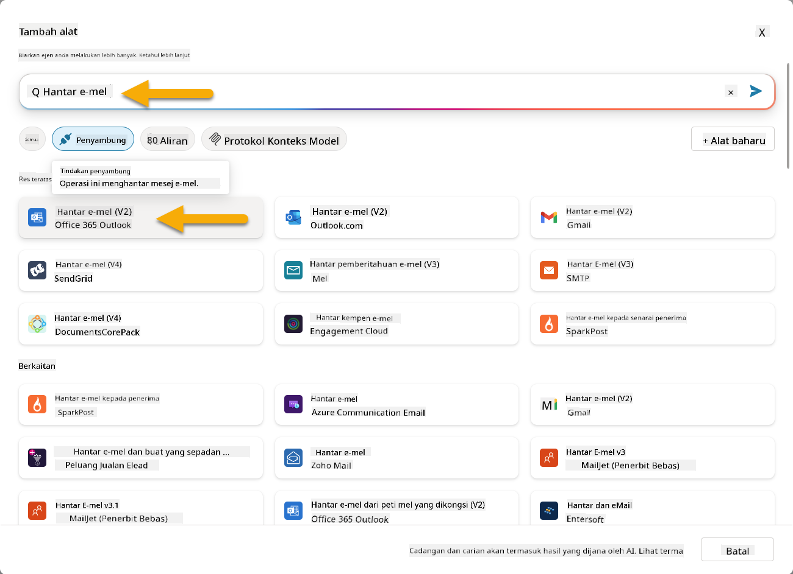

1. Tunggu sambungan dikonfigurasi, dan kemudian pilih **Tambah dan konfigurasikan**

1. Konfigurasikan tetapan alat:

   - **Nama**: Akui tiket SharePoint
   - **Penerangan**: Alat ini menghantar pengakuan e-mel bahawa tiket telah diterima.

1. Pilih **Sesuaikan** di sebelah parameter input dan konfigurasikan seperti berikut:

    **Kepada**:

    - **Penerangan**: Alamat e-mel orang yang menghantar Tiket SharePoint
    - **Kenal pasti sebagai**: E-mel

    **Badan**:

    - **Penerangan**: Pengakuan bahawa Tiket telah diterima, dan kami berusaha untuk memberi respons dalam masa 3 hari bekerja.

    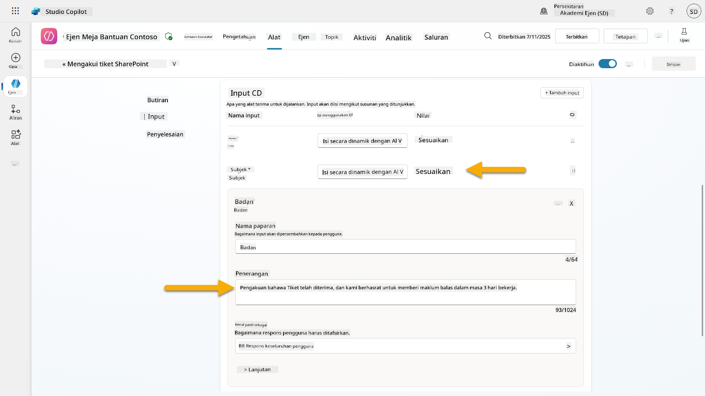

1. Pilih **Simpan**

### 10.4 Uji pencetus

1. Di dalam **Ejen Meja Bantuan** anda, pilih tab **Gambaran Keseluruhan**
1. Klik ikon **Uji Pencetus** di sebelah pencetus **Tiket Sokongan Baru Dibuat di SharePoint**. Ini akan memuatkan tetingkap **Uji pencetus anda**.
1. Buka tab pelayar baru dan pergi ke **Senarai Tiket Sokongan IT SharePoint** anda  
1. Klik **+ Tambah item baru** untuk mencipta tiket ujian:  
   - **Tajuk**: "Tidak dapat sambung ke VPN"  
   - **Penerangan**: "Tidak dapat sambung ke rangkaian WIFI korporat selepas kemas kini terkini"  
   - **Keutamaan**: "Biasa"  

1. **Simpan** item SharePoint  
    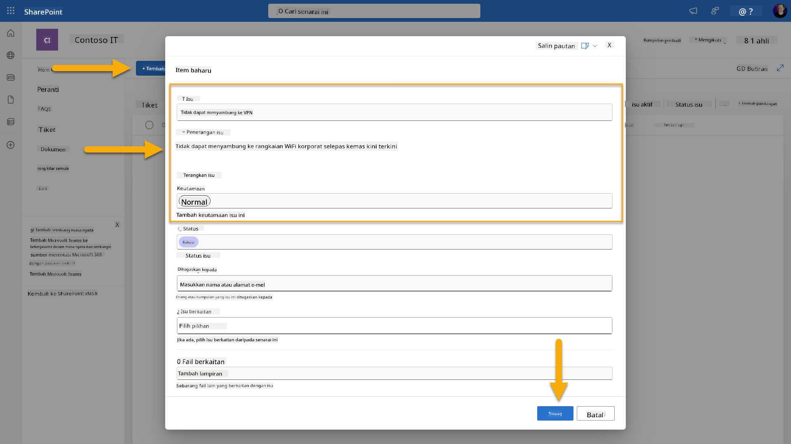  
1. Kembali ke **Copilot Studio** dan pantau panel **Uji pencetus anda** untuk pengaktifan pencetus. Gunakan ikon **Segarkan** untuk memuatkan acara pencetus, ini mungkin mengambil masa beberapa minit.  
    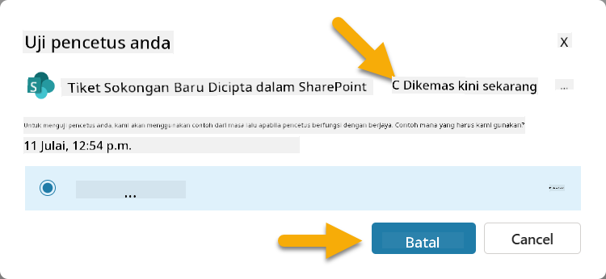  
1. Setelah pencetus muncul, pilih **Mulakan ujian**  
1. Pilih **Ikon Peta Aktiviti** di bahagian atas panel **Uji ejen anda**  
1. Sahkan bahawa ejen anda:  
   - Menerima muatan pencetus  
   - Memanggil alat "Akui tiket SharePoint"  
     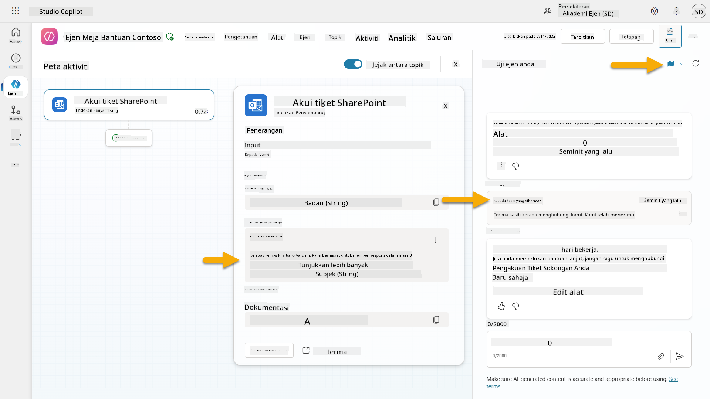  
1. Periksa peti masuk e-mel penghantar untuk mengesahkan e-mel pengakuan telah dihantar  
    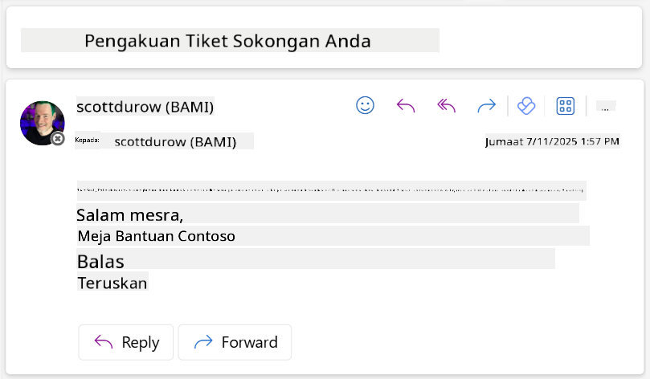  
1. Semak tab **Aktiviti** di Copilot Studio untuk melihat pencetus lengkap dan pelaksanaan alat  

## ✅ Misi Selesai  

🎉 **Tahniah!** Anda telah berjaya melaksanakan pencetus acara dengan alat penyambung yang membolehkan ejen anda beroperasi secara autonomi, secara automatik menghantar e-mel pengakuan dan memproses tiket sokongan tanpa campur tangan pengguna. Setelah ejen anda diterbitkan, ia akan bertindak secara autonomi bagi pihak anda.  

🚀 **Seterusnya**: Dalam pelajaran seterusnya, anda akan belajar bagaimana untuk [menerbitkan ejen anda](../11-publish-your-agent/README.md) ke Microsoft Teams dan Microsoft 365 Copilot, menjadikannya tersedia untuk seluruh organisasi anda!  

⏭️ [Bergerak ke pelajaran **Terbitkan ejen anda**](../11-publish-your-agent/README.md)  

## 📚 Sumber Taktikal  

Bersedia untuk mendalami pencetus acara dan ejen autonomi? Lihat sumber-sumber ini:  

- **Microsoft Learn**: [Jadikan ejen anda autonomi dalam Copilot Studio](https://learn.microsoft.com/training/modules/autonomous-agents-online-workshop/?WT.mc_id=power-177340-scottdurow)  
- **Dokumentasi**: [Tambah pencetus acara](https://learn.microsoft.com/microsoft-copilot-studio/authoring-trigger-event?WT.mc_id=power-177340-scottdurow)  
- **Amalan Terbaik**: [Pengenalan pencetus Power Automate](https://learn.microsoft.com/power-automate/triggers-introduction?WT.mc_id=power-177340-scottdurow)  
- **Senario Lanjutan**: [Menggunakan aliran Power Automate dengan ejen](https://learn.microsoft.com/microsoft-copilot-studio/advanced-flow-create?WT.mc_id=power-177340-scottdurow)  
- **Keselamatan**: [Pencegahan kehilangan data untuk Copilot Studio](https://learn.microsoft.com/microsoft-copilot-studio/admin-data-loss-prevention?WT.mc_id=power-177340-scottdurow)  

  

---

**Penafian**:  
Dokumen ini telah diterjemahkan menggunakan perkhidmatan terjemahan AI [Co-op Translator](https://github.com/Azure/co-op-translator). Walaupun kami berusaha untuk ketepatan, sila ambil perhatian bahawa terjemahan automatik mungkin mengandungi kesilapan atau ketidaktepatan. Dokumen asal dalam bahasa asalnya harus dianggap sebagai sumber yang berwibawa. Untuk maklumat kritikal, terjemahan manusia profesional adalah disyorkan. Kami tidak bertanggungjawab atas sebarang salah faham atau salah tafsir yang timbul daripada penggunaan terjemahan ini.