<!--
CO_OP_TRANSLATOR_METADATA:
{
  "original_hash": "9dceeba2eae2bb73e328602a060eddab",
  "translation_date": "2025-10-20T00:45:00+00:00",
  "source_file": "docs/recruit/11-publish-your-agent/README.md",
  "language_code": "ms"
}
-->
# 🚨 Misi 11: Terbitkan Ejen Anda

## 🕵️‍♂️ NAMA KOD: `OPERASI TERBIT TERBIT TERBIT`

> **⏱️ Tempoh Operasi:** `~30 minit`  

🎥 **Tonton Panduan**

[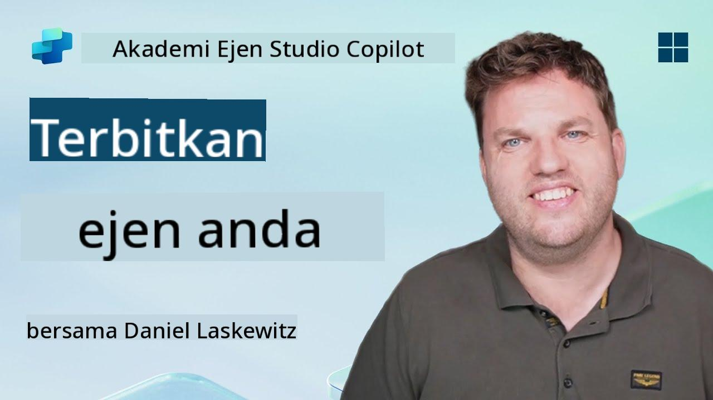](https://www.youtube.com/watch?v=eVZmljhYlSI "Tonton panduan di YouTube")

## 🎯 Ringkasan Misi

Selepas menyelesaikan beberapa modul yang mencabar, Pembuat Ejen, anda kini bersedia untuk langkah paling kritikal: menerbitkan ejen anda. Kini tiba masanya untuk menjadikan ciptaan anda tersedia kepada pengguna di Microsoft Teams dan Microsoft 365 Copilot.

Ejen anda—dilengkapi dengan misi yang jelas, alat yang berkuasa, dan akses kepada sumber pengetahuan utama—sedia untuk berkhidmat. Dengan menggunakan Microsoft Copilot Studio, anda boleh melancarkan ejen anda supaya ia dapat mula membantu pengguna sebenar di tempat mereka bekerja.

Mari lancarkan ejen anda untuk beraksi.

## 🔎 Objektif

📖 Pelajaran ini merangkumi:

1. Mengapa penting untuk menerbitkan ejen anda
1. Apa yang berlaku apabila anda menerbitkan ejen anda
1. Cara menambah saluran (Microsoft Teams & Microsoft 365 Copilot)
1. Cara menambah ejen dalam Microsoft Teams
1. Cara menjadikan ejen tersedia dalam Microsoft Teams untuk seluruh organisasi anda

## 🚀 Terbitkan ejen

Setiap kali anda bekerja pada ejen di Copilot Studio, anda mungkin mengemas kini dengan menambah pengetahuan atau alat. Apabila anda sudah bersedia dengan semua perubahan dan telah mengujinya dengan teliti, anda boleh menerbitkannya. Penerbitan memastikan bahawa kemas kini terkini tersedia secara langsung. Jika anda mengemas kini ejen anda dengan alat baru tetapi tidak menekan butang terbit, ia belum tersedia untuk pengguna akhir.

Pastikan anda sentiasa menekan butang terbit apabila anda ingin menghantar kemas kini kepada pengguna ejen anda. Ejen anda mungkin mempunyai saluran yang ditambah kepadanya, dan apabila anda menekan butang terbit, kemas kini akan tersedia untuk semua saluran yang telah anda tambahkan kepada ejen.

## ⚙️ Konfigurasi saluran

Saluran menentukan di mana pengguna anda boleh mengakses dan berinteraksi dengan ejen anda. Selepas anda menerbitkan ejen anda, anda boleh menjadikannya tersedia di pelbagai saluran. Setiap saluran mungkin memaparkan kandungan ejen anda dengan cara yang berbeza.

Anda boleh menambah ejen anda ke saluran berikut:

- **Microsoft Teams dan Microsoft 365 Copilot** - Jadikan ejen anda tersedia dalam sembang dan mesyuarat Teams, serta dalam pengalaman Microsoft 365 Copilot ([Ketahui lebih lanjut](https://learn.microsoft.com/microsoft-copilot-studio/publication-add-bot-to-microsoft-teams))
- **Laman web demo** - Uji ejen anda di laman web demo yang disediakan oleh Copilot Studio ([Ketahui lebih lanjut](https://learn.microsoft.com/microsoft-copilot-studio/publication-connect-bot-to-web-channels))
- **Laman web tersuai** - Benamkan ejen anda terus ke laman web anda sendiri ([Ketahui lebih lanjut](https://learn.microsoft.com/microsoft-copilot-studio/publication-connect-bot-to-web-channels))
- **Aplikasi mudah alih** - Integrasikan ejen anda ke dalam aplikasi mudah alih tersuai ([Ketahui lebih lanjut](https://learn.microsoft.com/microsoft-copilot-studio/publication-connect-bot-to-custom-application))
- **SharePoint** - Tambahkan ejen anda ke laman SharePoint untuk bantuan dokumen dan laman ([Ketahui lebih lanjut](https://learn.microsoft.com/microsoft-copilot-studio/publication-add-bot-to-sharepoint))
- **Facebook Messenger** - Berhubung dengan pengguna melalui platform mesej Facebook ([Ketahui lebih lanjut](https://learn.microsoft.com/microsoft-copilot-studio/publication-add-bot-to-facebook))
- **Power Pages** - Integrasikan ejen anda ke laman web Power Pages ([Ketahui lebih lanjut](https://learn.microsoft.com/microsoft-copilot-studio/publication-add-bot-to-power-pages))
- **Saluran Azure Bot Service** - Akses saluran tambahan termasuk Slack, Telegram, Twilio SMS, dan banyak lagi ([Ketahui lebih lanjut](https://learn.microsoft.com/microsoft-copilot-studio/publication-connect-bot-to-azure-bot-service-channels))

Untuk menambah saluran, navigasi ke tab **Saluran** dalam ejen anda dan pilih saluran yang ingin anda konfigurasi. Setiap saluran mempunyai keperluan persediaan tertentu dan mungkin memerlukan pengesahan atau langkah konfigurasi tambahan.

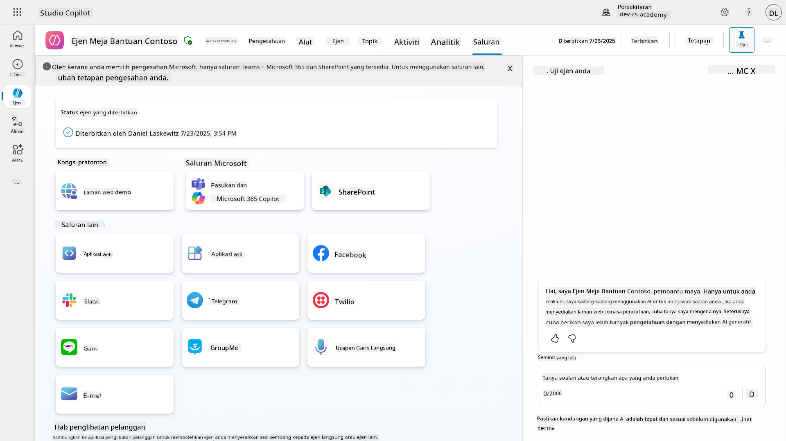

## 📺 Pengalaman saluran

Saluran yang berbeza mempunyai pengalaman pengguna yang berbeza. Apabila membina ejen untuk pelbagai saluran, pastikan anda menyedari perbezaan setiap saluran. Strategi yang baik adalah menguji ejen anda di pelbagai saluran untuk memastikan ia berfungsi seperti yang anda inginkan.

| Pengalaman                        | Laman web     | Teams dan Microsoft 365 Copilot         | Facebook                 | Dynamics Omnichannel untuk Perkhidmatan Pelanggan           |
| --------------------------------- | ------------- | --------------------------------------- | ------------------------ | ----------------------------------------------------------- |
| [Tinjauan kepuasan pelanggan][1]  | Kad adaptif   | Teks sahaja                             | Teks sahaja              | Teks sahaja                                                 |
| [Pilihan pelbagai][1]             | Disokong      | [Disokong sehingga enam (sebagai kad hero)][4] | [Disokong sehingga 13][6] | [Sebahagian disokong][8]                                    |
| [Markdown][2]                     | Disokong      | [Sebahagian disokong][5]                | [Sebahagian disokong][7] | [Sebahagian disokong][9]                                    |
| [Mesej selamat datang][1]         | Disokong      | Disokong                                | Tidak disokong           | Disokong untuk [Sembang][10]. Tidak disokong untuk saluran lain. |
| [Adakah-Anda-Maksudkan][3]        | Disokong      | Disokong                                | Disokong                 | Disokong untuk [Microsoft Teams][11], [Sembang][10], Facebook, dan saluran teks sahaja (mesej pendek (SMS) melalui [TeleSign][12] dan [Twilio][13], [WhatsApp][14], [WeChat][15], dan [Twitter][16]). Tindakan yang disarankan dipaparkan sebagai senarai teks sahaja; pengguna mesti menaip semula pilihan untuk memberi respons. |

[1]: https://learn.microsoft.com/microsoft-copilot-studio/authoring-create-edit-topics
[2]: https://daringfireball.net/projects/markdown/
[3]: https://learn.microsoft.com/microsoft-copilot-studio/advanced-ai-features
[4]: https://learn.microsoft.com/microsoftteams/platform/concepts/cards/cards-reference#hero-card
[5]: https://learn.microsoft.com/microsoftteams/platform/bots/how-to/format-your-bot-messages#text-only-messages
[6]: https://developers.facebook.com/docs/messenger-platform/send-messages/quick-replies/
[7]: https://www.facebook.com/help/147348452522644?helpref=related
[8]: https://learn.microsoft.com/dynamics365/customer-service/asynchronous-channels#suggested-actions-support
[9]: https://learn.microsoft.com/dynamics365/customer-service/asynchronous-channels#preview-support-for-formatted-messages
[10]: https://learn.microsoft.com/dynamics365/customer-service/set-up-chat-widget
[11]: https://learn.microsoft.com/dynamics365/customer-service/configure-microsoft-teams
[12]: https://learn.microsoft.com/dynamics365/customer-service/configure-sms-channel
[13]: https://learn.microsoft.com/dynamics365/customer-service/configure-sms-channel-twilio
[14]: https://learn.microsoft.com/dynamics365/customer-service/configure-whatsapp-channel
[15]: https://learn.microsoft.com/dynamics365/customer-service/configure-wechat-channel
[16]: https://learn.microsoft.com/dynamics365/customer-service/configure-twitter-channel

> [!NOTE]
> Terdapat beberapa contoh di mana anda boleh menggunakan logik yang berbeza untuk saluran yang berbeza. Contohnya boleh didapati dalam repositori Power Platform Snippets:
>
> Henry Jammes berkongsi contoh bagaimana untuk menunjukkan kad adaptif yang berbeza apabila saluran adalah Microsoft Teams. ([Pautan ke contoh](https://github.com/pnp/powerplatform-snippets/blob/main/copilot-studio/multiple-topics-matched-topic/source/multiple-topics-matched.yaml#L40))

## 🧪 Makmal 11: Terbitkan ejen anda ke Teams dan Microsoft 365 Copilot

### 🎯 Kes penggunaan

Ejen Meja Bantuan IT Contoso anda kini telah dikonfigurasi sepenuhnya dengan keupayaan yang hebat—ia boleh mengakses sumber pengetahuan SharePoint, membuat tiket sokongan, menghantar pemberitahuan proaktif, dan memberi respons dengan bijak kepada pertanyaan pengguna. Walau bagaimanapun, semua ciri ini pada masa ini hanya tersedia dalam persekitaran pembangunan di mana anda membinanya.

**Cabaran:** Pengguna akhir tidak dapat memanfaatkan keupayaan ejen anda sehingga ia diterbitkan dengan betul dan boleh diakses melalui saluran di mana mereka sebenarnya bekerja.

**Penyelesaian:** Menerbitkan ejen anda memastikan versi terkini—dengan semua kemas kini terbaru, topik baru, sumber pengetahuan yang dipertingkatkan, dan aliran yang dikonfigurasi—tersedia kepada pengguna sebenar. Tanpa penerbitan, pengguna masih akan berinteraksi dengan versi lama ejen anda yang mungkin kekurangan fungsi penting.

Menambah saluran Teams dan Microsoft 365 Copilot adalah sama penting kerana:

- **Integrasi Teams**: Pekerja organisasi anda menghabiskan sebahagian besar hari mereka di Microsoft Teams untuk kolaborasi, mesyuarat, dan komunikasi. Dengan menambah ejen anda ke Teams, pengguna boleh mendapatkan sokongan IT tanpa meninggalkan persekitaran kerja utama mereka.

- **Microsoft 365 Copilot**: Pengguna boleh mengakses ejen meja bantuan IT khusus anda secara langsung dalam pengalaman Microsoft 365 Copilot mereka, menjadikannya terintegrasi dengan lancar ke dalam aliran kerja harian mereka di aplikasi Office.

- **Akses Berpusat**: Daripada mengingati laman web atau aplikasi yang berasingan, pengguna boleh mengakses sokongan IT melalui platform yang sudah mereka gunakan, mengurangkan halangan dan meningkatkan penggunaan.

Misi ini mengubah kerja pembangunan anda menjadi penyelesaian siap produksi yang memberikan nilai sebenar kepada pengguna akhir organisasi anda.

### Prasyarat

Sebelum memulakan makmal ini, pastikan anda mempunyai:

- ✅ Menyelesaikan makmal sebelumnya dan mempunyai Ejen Meja Bantuan Contoso yang dikonfigurasi sepenuhnya
- ✅ Ejen anda telah diuji dan sedia untuk digunakan dalam produksi
- ✅ Kebenaran dalam persekitaran Copilot Studio anda untuk menerbitkan ejen
- ✅ Akses ke Microsoft Teams dalam organisasi anda

### 11.1 Terbitkan ejen anda

Sekarang semua kerja kita pada ejen telah selesai, kita perlu memastikan semua kerja kita tersedia untuk pengguna akhir yang akan menggunakan ejen kita. Untuk memastikan kandungan tersedia untuk semua pengguna, kita perlu menerbitkan ejen kita.

1. Pergi ke Ejen Meja Bantuan Contoso di Copilot Studio (melalui [portal pembuat Copilot Studio](https://copilotstudio.microsoft.com))

    Di Copilot Studio, mudah untuk menerbitkan ejen anda. Anda hanya perlu memilih butang terbit di bahagian atas paparan ejen.

    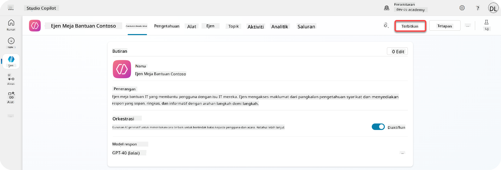

1. Pilih butang **Terbitkan** dalam ejen anda

    Ia akan membuka pop-up penerbitan - untuk mengesahkan bahawa anda benar-benar ingin menerbitkan ejen anda.

    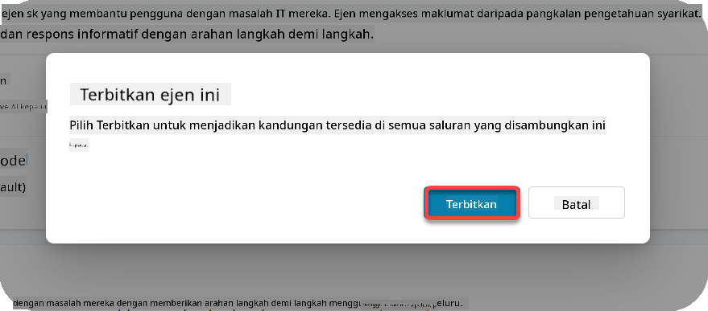

1. Pilih **Terbitkan** untuk mengesahkan penerbitan ejen anda

    Kini mesej akan menunjukkan bahawa ejen anda sedang diterbitkan. Anda tidak perlu menunggu pop-up itu terbuka. Anda akan diberitahu apabila ejen telah diterbitkan.

    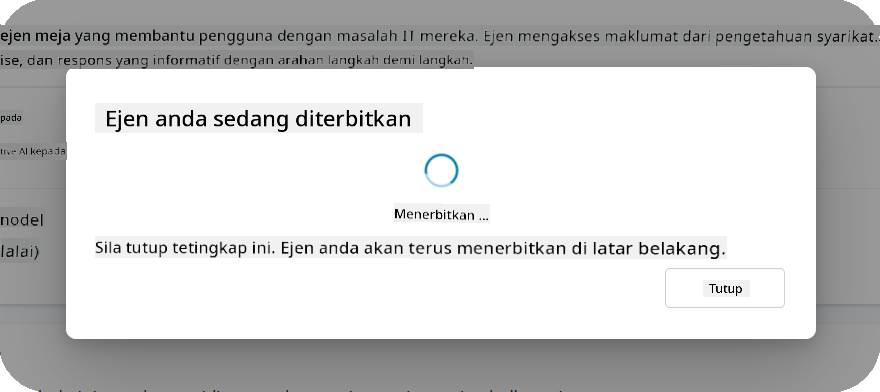

    Apabila ejen selesai diterbitkan, anda akan melihat pemberitahuan di bahagian atas halaman ejen.

    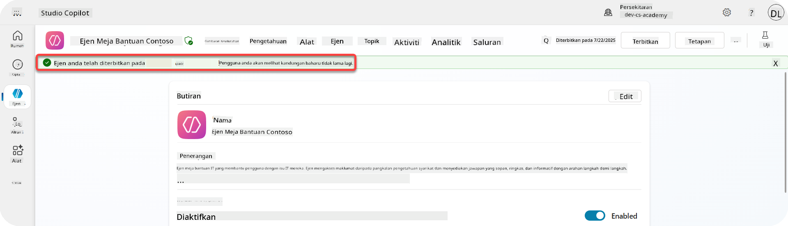

Tetapi - kita hanya menerbitkan ejen, kita belum menambahkannya ke saluran lagi, jadi mari kita selesaikan itu sekarang!

### 11.2 Tambahkan saluran Teams dan Microsoft 365 Copilot

1. Untuk menambah saluran Teams dan Microsoft 365 Copilot ke ejen kita, kita perlu memilih **Saluran** dalam navigasi atas ejen

    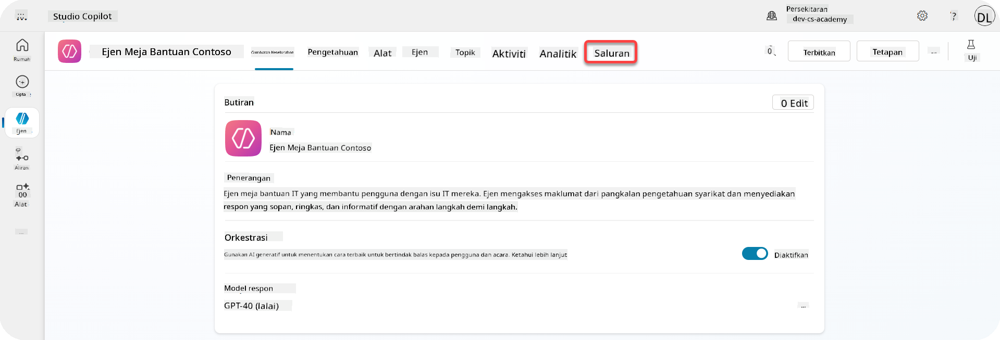

    Di sini kita boleh melihat semua saluran yang boleh kita tambahkan ke ejen ini.

1. Pilih **Teams dan Microsoft 365**

    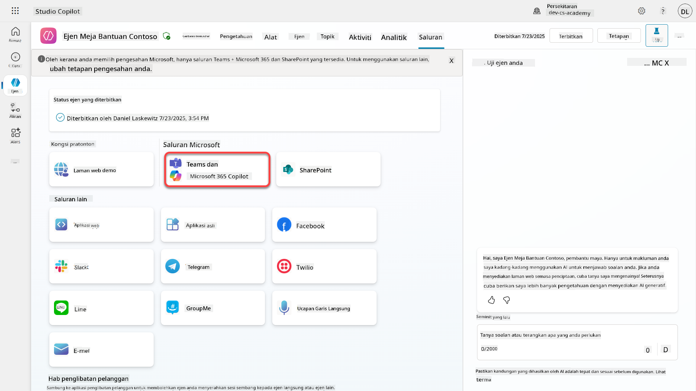

1. Pilih **Tambah saluran** untuk melengkapkan wizard dan menambah saluran ke ejen

    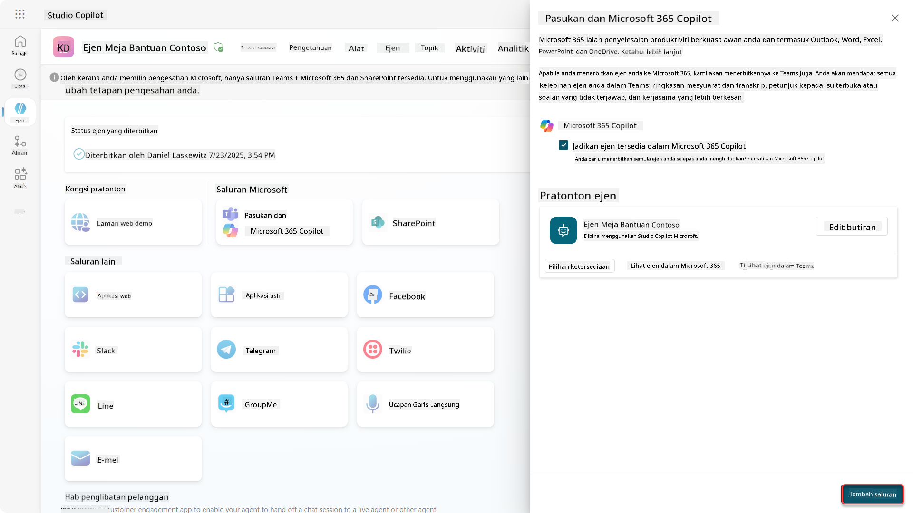

    Ia akan mengambil masa sedikit sehingga ia ditambah. Selepas ia ditambah, pemberitahuan hijau akan muncul di bahagian atas bar sisi.

    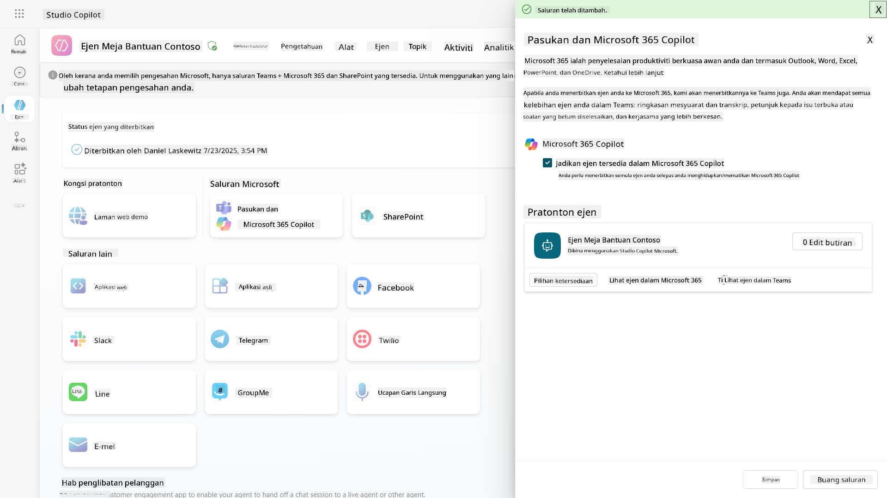

1. Pilih **Lihat ejen dalam Teams** untuk membuka tab baru

    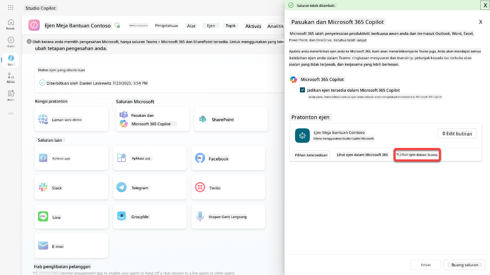

1. Pilih **Tambah** untuk menambah Ejen Meja Bantuan Contoso ke Teams

    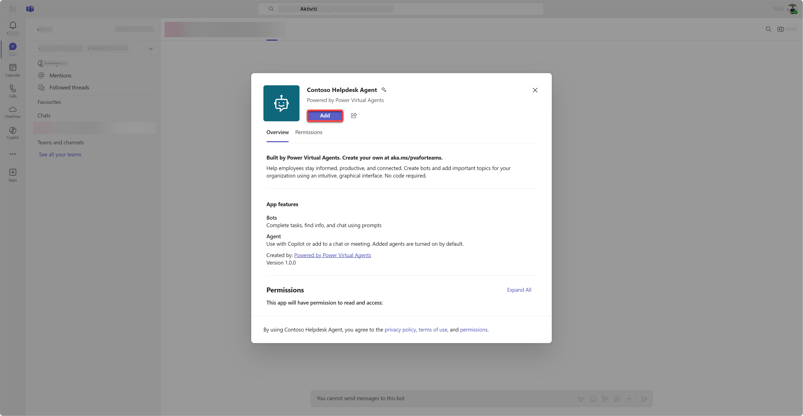

    Ini akan mengambil masa sedikit. Selepas itu, ia akan menunjukkan skrin berikut:

    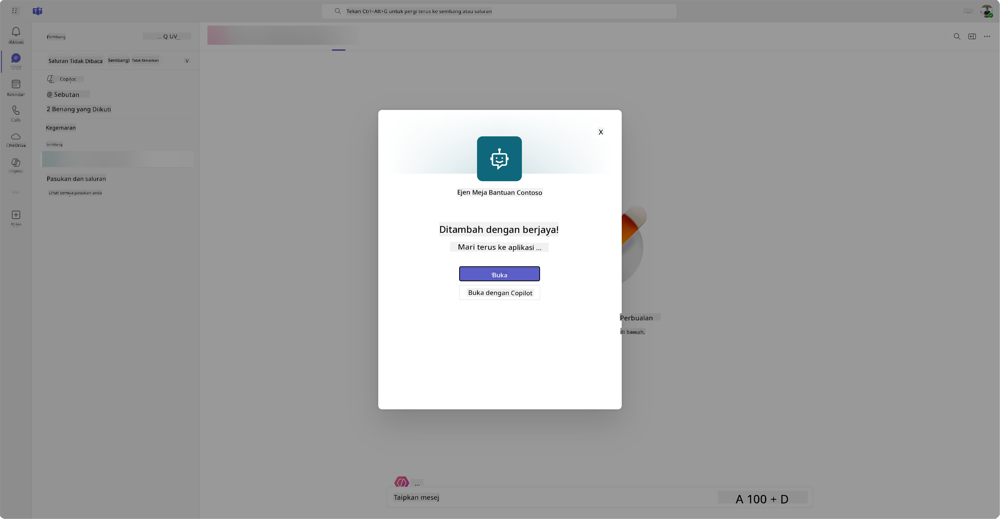

1. Pilih **Buka** untuk membuka ejen dalam Teams

    Ini akan membuka ejen dalam Teams sebagai aplikasi Teams

    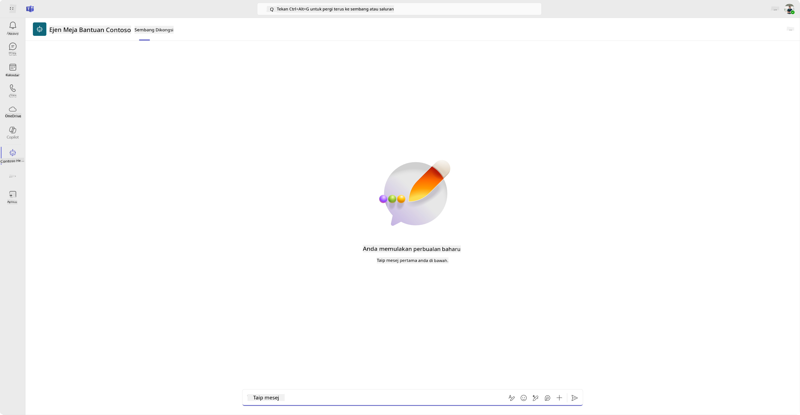

Sekarang kita telah menerbitkan ejen untuk berfungsi dalam Microsoft Teams, tetapi anda mungkin ingin menjadikannya tersedia untuk lebih ramai orang.

### 11.3 Jadikan ejen tersedia untuk semua pengguna dalam penyewa

1. Tutup tab pelayar di mana Ejen Meja Bantuan Contoso dibuka

    Ini sepatutnya membawa anda kembali ke Copilot Studio di mana panel sisi Teams dan Microsoft 365 Copilot masih terbuka. Kita hanya membuka ejen dalam Teams sekarang, tetapi kita boleh melakukan lebih banyak lagi di sini. Kita boleh mengedit butiran ejen, kita boleh melancarkan ejen kepada lebih ramai pengguna, dan banyak lagi.

1. Pilih **Edit butiran**

    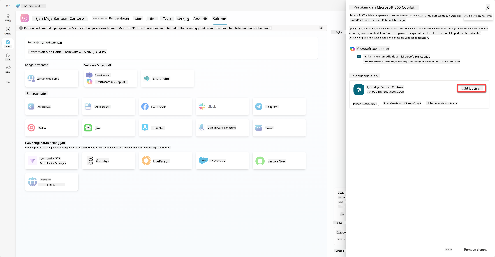
Ini akan membuka panel di mana kita boleh mengubah pelbagai butiran dan tetapan ejen. Kita boleh mengubah butiran asas seperti ikon, warna latar belakang ikon dan deskripsi. Kita juga boleh mengubah tetapan Teams (contohnya membenarkan pengguna menambah ejen ke dalam pasukan, atau membenarkan penggunaan ejen ini dalam sembang kumpulan dan mesyuarat) di sini. Apabila anda memilih *lebih banyak*, anda juga boleh mengubah butiran pembangun seperti nama pembangun, laman web, kenyataan privasi dan terma penggunaan.

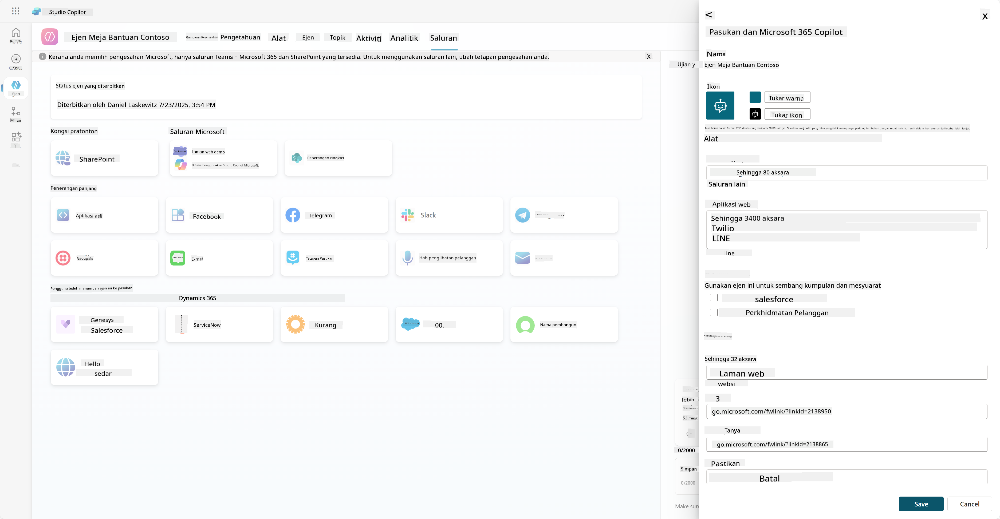

1. Pilih **Cancel** untuk menutup panel Edit details

1. Pilih **Availability options**

    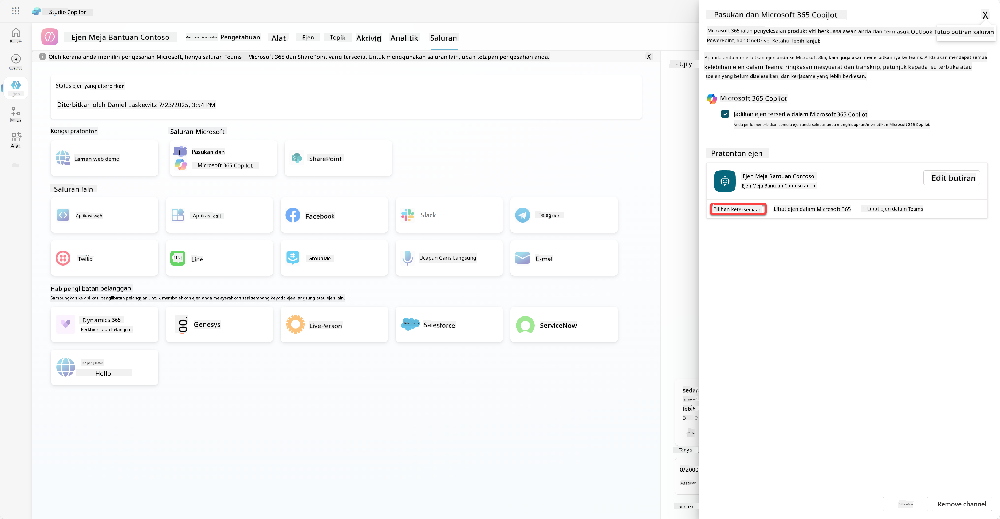

    Ini akan membuka panel pilihan ketersediaan, di mana anda boleh menyalin pautan untuk dihantar kepada pengguna supaya mereka boleh menggunakan ejen ini (perlu diingat, anda juga perlu berkongsi ejen dengan pengguna tersebut) dan anda boleh memuat turun fail untuk menambah ejen anda ke dalam Microsoft Teams atau Microsoft 365 store. Untuk memaparkan ejen di dalam store, terdapat pilihan lain juga: anda boleh memaparkannya kepada rakan sepasukan dan pengguna yang dikongsi (untuk dipaparkan di bahagian *Built with Power Platform*) atau anda boleh memaparkannya kepada semua orang dalam organisasi anda (ini memerlukan kelulusan pentadbir).

1. Pilih **Show to everyone in my org**

    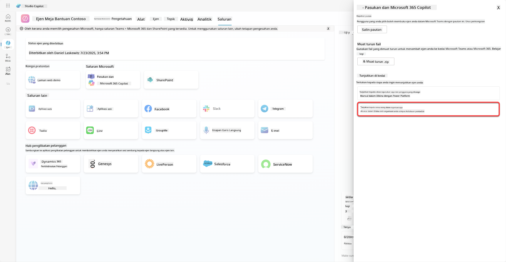

1. Pilih **Submit for admin approval**

    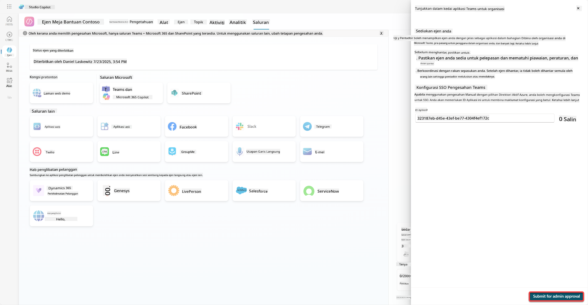

    Kini, pentadbir anda perlu meluluskan penghantaran ejen anda. Mereka boleh melakukannya dengan pergi ke Teams Admin Center dan mencari Contoso Helpdesk Agent dalam Apps. Dalam tangkapan skrin, anda boleh melihat apa yang akan dilihat oleh pentadbir di Teams Admin Center.

    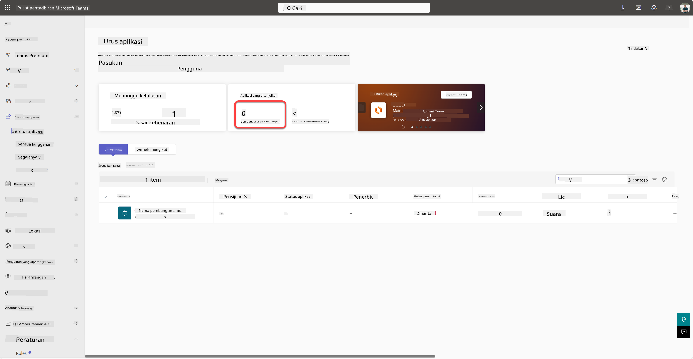

    Pentadbir perlu memilih Contoso Helpdesk Agent dan memilih *Publish* untuk menerbitkan Contoso Helpdesk Agent kepada semua orang.

    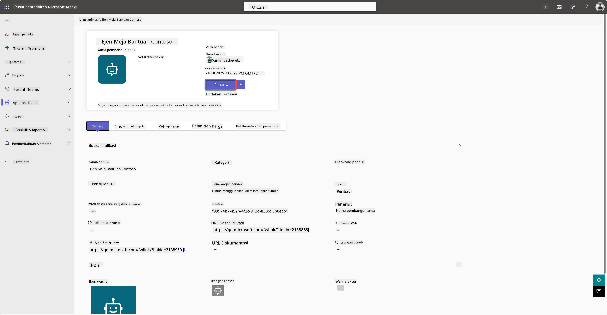

    Apabila pentadbir telah menerbitkan penghantaran ejen, anda akan dapat menyegarkan Copilot Studio dan anda sepatutnya melihat banner *available in app store* dalam pilihan ketersediaan.

    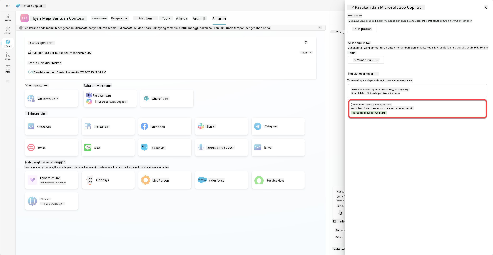

Terdapat lebih banyak kemungkinan di sini. Pentadbir anda boleh mengubah polisi tetapan global dan memasang secara automatik Contoso Helpdesk Agent untuk semua orang dalam tenant. Selain itu - anda boleh menyematkan Contoso Helpdesk Agent ke rel kiri supaya semua orang mempunyai akses mudah kepadanya.

## ✅ Misi Selesai

🎉 **Tahniah!** Anda berjaya menerbitkan ejen anda dan menambahkannya ke Teams dan Microsoft 365 Copilot! Seterusnya adalah misi terakhir kursus ini: Memahami pelesenan.

⏭️ [Bergerak ke pelajaran **Memahami pelesenan**](../12-understanding-licensing/README.md)

## 📚 Sumber Taktikal

🔗 [Dokumentasi saluran penerbitan](https://learn.microsoft.com/microsoft-copilot-studio/publication-fundamentals-publish-channels)

---

**Penafian**:  
Dokumen ini telah diterjemahkan menggunakan perkhidmatan terjemahan AI [Co-op Translator](https://github.com/Azure/co-op-translator). Walaupun kami berusaha untuk ketepatan, sila ambil perhatian bahawa terjemahan automatik mungkin mengandungi kesilapan atau ketidaktepatan. Dokumen asal dalam bahasa asalnya harus dianggap sebagai sumber yang berwibawa. Untuk maklumat penting, terjemahan manusia profesional adalah disyorkan. Kami tidak bertanggungjawab atas sebarang salah faham atau salah tafsir yang timbul daripada penggunaan terjemahan ini.