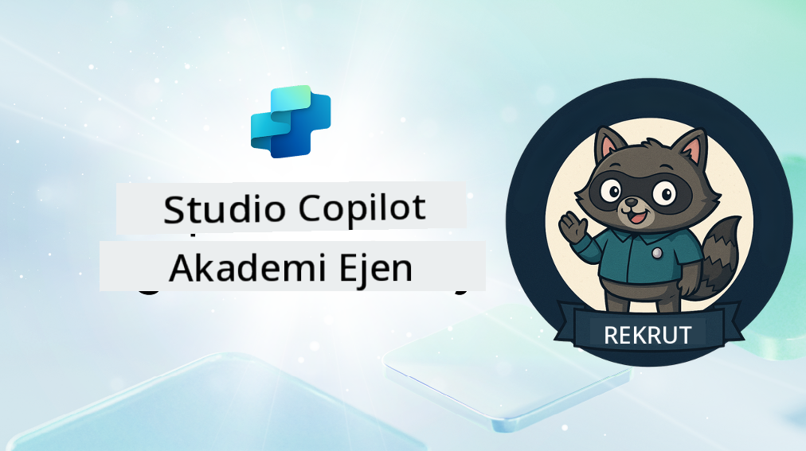

<!--
CO_OP_TRANSLATOR_METADATA:
{
  "original_hash": "8b5ecad9d5d073ea3f4c2b844e80f2e5",
  "translation_date": "2025-10-20T00:30:45+00:00",
  "source_file": "docs/recruit/README.md",
  "language_code": "ms"
}
-->
# Selamat Datang Rekrut

**Selamat datang, Rekrut.**  
Misi anda—jika anda memilih untuk menerimanya—adalah menguasai seni membina ejen menggunakan **Microsoft Copilot Studio**.

Latihan praktikal ini adalah pintu masuk anda ke **dunia ejen**: daripada arahan yang terarah kepada Kad Adaptif dan aliran ejen, anda akan belajar cara membina, mengembangkan, dan melancarkan ejen pintar menggunakan alat dan kes penggunaan dunia sebenar.

---

## 🎯 Objektif Misi

Dengan menyelesaikan Akademi Ejen, anda akan dapat:

- Memahami apa itu ejen dalam konteks Microsoft Copilot Studio
- Meneroka bagaimana Model Bahasa Besar (LLM), penjanaan yang diperkaya dengan pengambilan (RAG), dan orkestrasi bergabung dalam ejen
- Membina kedua-dua ejen **deklaratif** dan **kustom**
- Meningkatkan ejen dengan **Topik**, **Kad Adaptif**, dan **Aliran Ejen**
- Melancarkan ejen ke **Microsoft Teams** dan **Microsoft 365 Copilot**

---

## 🧪 Prasyarat

Untuk menyelesaikan semua misi, anda memerlukan:

- Penyewa Pembangun Microsoft 365 (dengan SharePoint diaktifkan)
- Akses ke **Microsoft Copilot Studio** (percubaan atau berlesen)
- Pilihan: Pengetahuan asas tentang SharePoint, Power Platform, atau Power Fx

---

## 🧬 Siapa Yang Sesuai

Kursus ini sesuai untuk:

- Pembuat dan pembangun yang meneroka **Copilot Studio**
- Profesional IT yang membina **sambungan Microsoft 365 Copilot**
- Peminat Power Platform yang ingin **meningkatkan kemahiran** dengan ejen pintar
- Sesiapa yang lebih suka belajar melalui **praktikal**

---

## 🧭 Gambaran Keseluruhan Kurikulum

Akademi ini dibahagikan kepada pelajaran progresif—setiap satu direka sebagai misi lapangan untuk meningkatkan kemahiran membina ejen anda.

| Pelajaran | Tajuk | Taklimat Misi |
|-----------|-------|---------------|
| `00` | 🧰 [Persediaan Kursus](./00-course-setup/README.md) | Sediakan persekitaran pembangunan anda, percubaan Copilot Studio, dan laman SharePoint |
| `01` | 🧠 [Pengenalan kepada Ejen](./01-introduction-to-agents/README.md) | Memahami konsep AI perbualan, LLM, dan ejen autonomi vs. deklaratif |
| `02` | 🛠️ [Asas Copilot Studio](./02-copilot-studio-fundamentals/README.md) | Pelajari asas: pengetahuan, kemahiran, autonomi |
| `03` | 👩‍💻 [Cipta Ejen Deklaratif](./03-create-a-declarative-agent-for-M365Copilot/README.md) | Tambahkan ejen anda sendiri ke Microsoft 365 Copilot, berdasarkan arahan |
| `04` | 🧩 [Mencipta Penyelesaian](./04-creating-a-solution/README.md) | Bungkus ejen anda ke dalam penyelesaian yang boleh digunakan semula untuk pengurusan persekitaran |
| `05` | 🚀 [Mulakan dengan Ejen Sedia Ada](./05-using-prebuilt-agents/README.md) | Gunakan dan sesuaikan ejen templat untuk mempercepatkan persediaan |
| `06` | ✍️ [Bina Ejen Kustom](./06-create-agent-from-conversation/README.md) | Cipta Copilot baru berdasarkan sumber pengetahuan |
| `07` | 🧠 [Tambah Topik dengan Pencetus](./07-add-new-topic-with-trigger/README.md) | Gunakan Topik untuk menentukan laluan soal jawab kustom |
| `08` | 🪪 [Tingkatkan dengan Kad Adaptif](./08-add-adaptive-card/README.md) | Bina Kad Adaptif menggunakan Power Fx dan SharePoint |
| `09` | 🔁 [Automasi dengan Aliran Ejen](./09-add-an-agent-flow/README.md) | Gunakan input Kad Adaptif untuk mencetuskan aliran belakang |
| `10` | 🧭 [Tambah Pencetus Acara](./10-add-event-triggers/README.md) | Aktifkan ejen anda untuk bertindak secara autonomi menggunakan logik berasaskan acara |
| `11` | 📢 [Terbitkan Ejen Anda](./11-publish-your-agent/README.md) | Lancarkan ejen anda ke Microsoft Teams dan Microsoft 365 Copilot |
| `12` | 🪪 [Memahami Pelesenan](./12-understanding-licensing/README.md) | Pelajari cara pelesenan dan pengebilan berfungsi dengan Copilot Studio |
| `13` | 🚨 [Mendapatkan Lencana Rekrut Anda](./course-completion-badges-recruit/README.md) | Tuntut lencana anda dan tandakan pencapaian anda! |

!!! note
    ✅ Menyelesaikan kurikulum ini akan memberikan anda lencana **Rekrut**.  
    🔓 **Operatif** dan **Komander** akan dibuka pada fasa akan datang.

<!-- markdownlint-disable-next-line MD033 -->

---

**Penafian**:  
Dokumen ini telah diterjemahkan menggunakan perkhidmatan terjemahan AI [Co-op Translator](https://github.com/Azure/co-op-translator). Walaupun kami berusaha untuk ketepatan, sila ambil perhatian bahawa terjemahan automatik mungkin mengandungi kesilapan atau ketidaktepatan. Dokumen asal dalam bahasa asalnya harus dianggap sebagai sumber yang berwibawa. Untuk maklumat yang kritikal, terjemahan manusia profesional adalah disyorkan. Kami tidak bertanggungjawab atas sebarang salah faham atau salah tafsir yang timbul daripada penggunaan terjemahan ini.