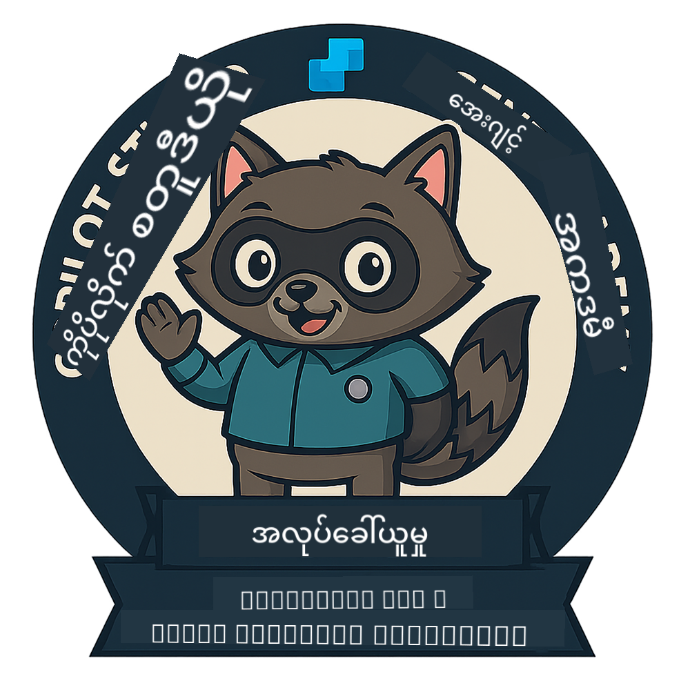
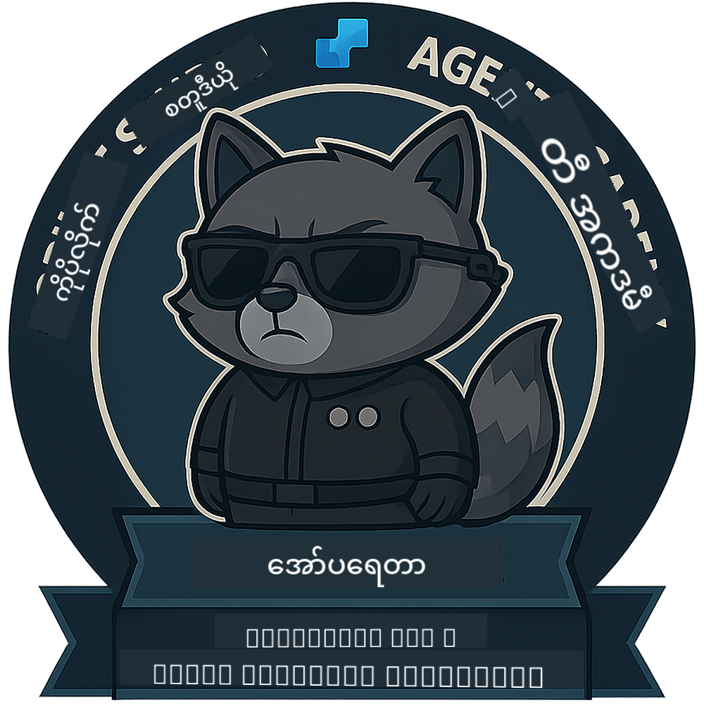

<!--
CO_OP_TRANSLATOR_METADATA:
{
  "original_hash": "15e57e059ce7689d602d7853187235cd",
  "translation_date": "2025-10-21T17:35:18+00:00",
  "source_file": "docs/index.md",
  "language_code": "my"
}
-->
---
hide:
- navigation
---

# Copilot Studio Agent Academy

**Copilot Studio Agent Academy သို့ ကြိုဆိုပါသည်။**  

သင်၏မစ်ရှင်—သင်လက်ခံလိုပါက—**Microsoft Copilot Studio** ကို အသုံးပြု၍ Agent တည်ဆောက်ခြင်း၏ အနုပညာကို ကျွမ်းကျင်စေရန်ဖြစ်သည်။

ဤလက်တွေ့လေ့ကျင့်မှုသည် **Agent များ၏ ကမ္ဘာ** သို့ ဝင်ရောက်ရန် သင်၏ အစပေါ်ဖြစ်ပြီး၊ grounded prompts မှ Adaptive Cards နှင့် agent flows အထိ၊ အမှန်တကယ်သော tools နှင့် အသုံးချမှုများကို အသုံးပြု၍ ဉာဏ်ရည်ရှိသော Agent များကို တည်ဆောက်ခြင်း၊ တိုးချဲ့ခြင်းနှင့် deploy လုပ်ခြင်းကို သင်ယူနိုင်မည်ဖြစ်သည်။

---

## 🏅 Rank Progression

**Copilot Studio Agent Academy** သည် Agent ရာထူးသုံးခုအတွင်း သင်၏ ကျွမ်းကျင်မှုများကို တိုးတက်စေရန် ရည်ရွယ်ထားသော အဆင့်များစွာပါဝင်သော လေ့ကျင့်မှုအစီအစဉ်ဖြစ်သည်။ အဆင့်တစ်ခုစီတွင် badge နှင့် တိုးတက်လာသော တာဝန်များပါဝင်သည်-

| Rank             | Level | Visual |
|------------------|:-----:|--------|
| 🟢 **Recruit**  [🚀 စတင်ပါ](https://aka.ms/agent-academy-recruit){ .md-button .md-button--primary }     | •     | { width="300" }     |
| 🔵 **Operative** (မကြာမီ ရရှိနိုင်မည်)   | ••    | { width="300" } |
| 🟡 **Commander** (မကြာမီ ရရှိနိုင်မည်)    | •••   | { width="300" } |

အဆင့်တစ်ခုစီသည် နောက်တစ်ဆင့်ကို အခြေခံထားသည်။ သင်၏ Recruit မစ်ရှင်ကို ပြီးမြောက်စေပြီး၊ သင်၏ Agent ရာထူး credentials ကို တိုးတက်စေရန် မကြာမီ ကြည့်ရှုပါ။

---

## 🎒 အခြားသင်တန်းများ

AI နှင့် Agents အကြောင်းကို ဆက်လက်လေ့လာရန် အခြားသင်တန်းများကို ကြည့်ရှုပါ-

- [Microsoft Copilot Studio <3 MCP Lab](https://aka.ms/mcsmcplab)
- [Copilot Developer Camp](https://microsoft.github.io/copilot-camp/)
- [AI Agents for Beginners](https://microsoft.github.io/ai-agents-for-beginners/)
- [Model Context Protocol (MCP) For Beginners](https://github.com/microsoft/mcp-for-beginners)

---

## 🚑 ပြဿနာများ

သင်၏ အကြံပြုချက်များကို ကျေးဇူးတင်ပါသည်! သင်၏ မှတ်ချက်များနှင့် ပြဿနာများကို [issues list](https://github.com/microsoft/agent-academy/issues) တွင် မျှဝေပါ။ ကျေးဇူးတင်ပါသည်!

---

## 📜 Code of Conduct

ဤပရောဂျက်သည် [Microsoft Open Source Code of Conduct](https://opensource.microsoft.com/codeofconduct/) ကို လက်ခံထားသည်။

!!! info "Resources:"

    - [Microsoft Open Source Code of Conduct](https://opensource.microsoft.com/codeofconduct/)
    - [Microsoft Code of Conduct FAQ](https://opensource.microsoft.com/codeofconduct/faq/)
    - မေးခွန်းများ သို့မဟုတ် စိုးရိမ်မှုများရှိပါက [opencode@microsoft.com](mailto:opencode@microsoft.com) သို့ ဆက်သွယ်ပါ

---

[⭐️ ကျွန်ုပ်တို့၏ repo ကို Star လုပ်ပါ](https://github.com/microsoft/agent-academy){ .md-button .md-button--primary }

<!-- markdownlint-disable-next-line MD033 -->

---

**အကြောင်းကြားချက်**:  
ဤစာရွက်စာတမ်းကို AI ဘာသာပြန်ဝန်ဆောင်မှု [Co-op Translator](https://github.com/Azure/co-op-translator) ကို အသုံးပြု၍ ဘာသာပြန်ထားပါသည်။ ကျွန်ုပ်တို့သည် တိကျမှုအတွက် ကြိုးစားနေသော်လည်း အလိုအလျောက် ဘာသာပြန်မှုများတွင် အမှားများ သို့မဟုတ် မတိကျမှုများ ပါဝင်နိုင်သည်ကို သတိပြုပါ။ မူရင်းဘာသာစကားဖြင့် ရေးသားထားသော စာရွက်စာတမ်းကို အာဏာတရ အရင်းအမြစ်အဖြစ် သတ်မှတ်သင့်ပါသည်။ အရေးကြီးသော အချက်အလက်များအတွက် လူ့ဘာသာပြန်ပညာရှင်များကို အသုံးပြုရန် အကြံပြုပါသည်။ ဤဘာသာပြန်မှုကို အသုံးပြုခြင်းမှ ဖြစ်ပေါ်လာသော အလွဲအမှားများ သို့မဟုတ် အနားယူမှုများအတွက် ကျွန်ုပ်တို့သည် တာဝန်မယူပါ။