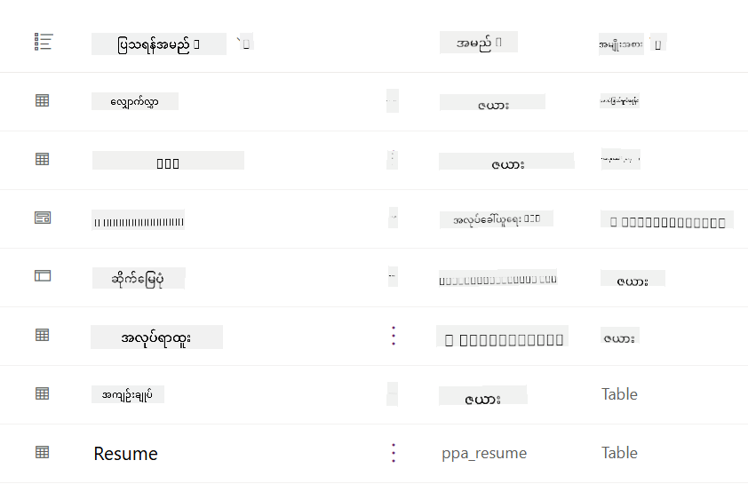
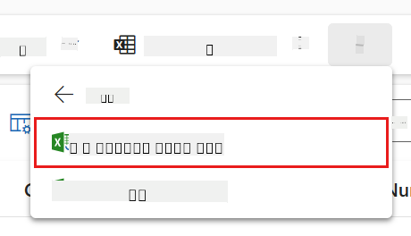
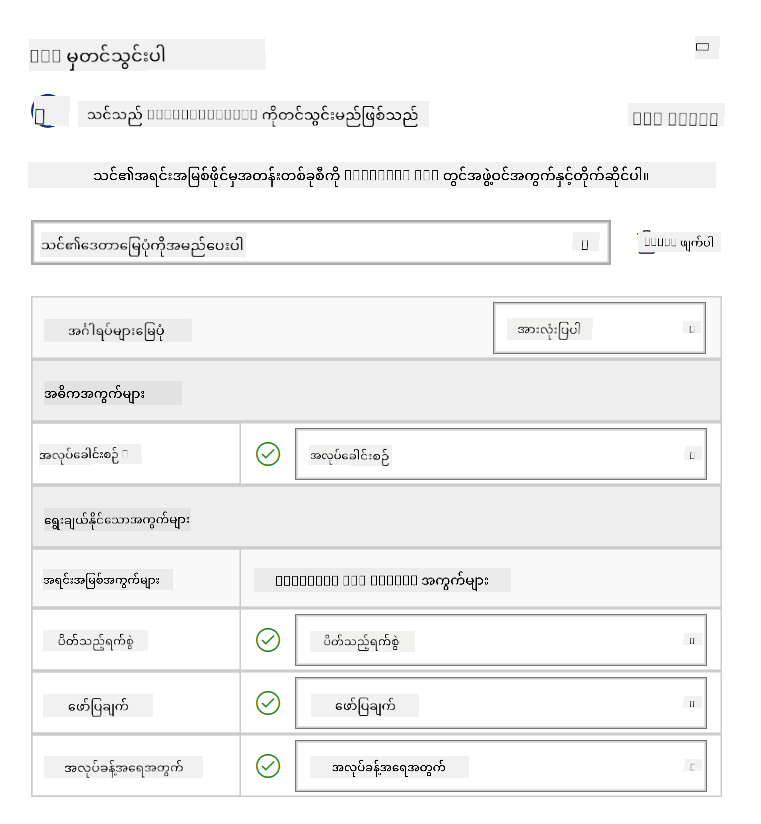
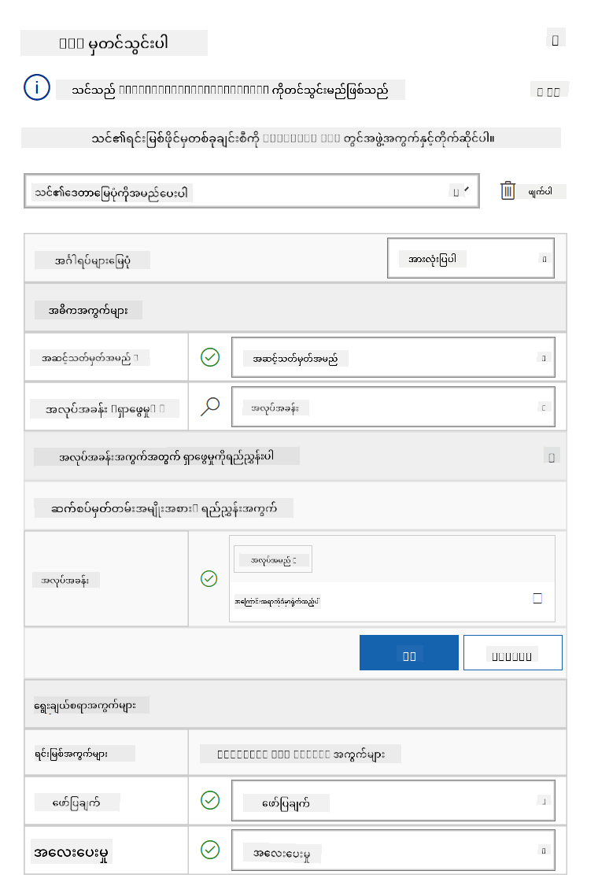
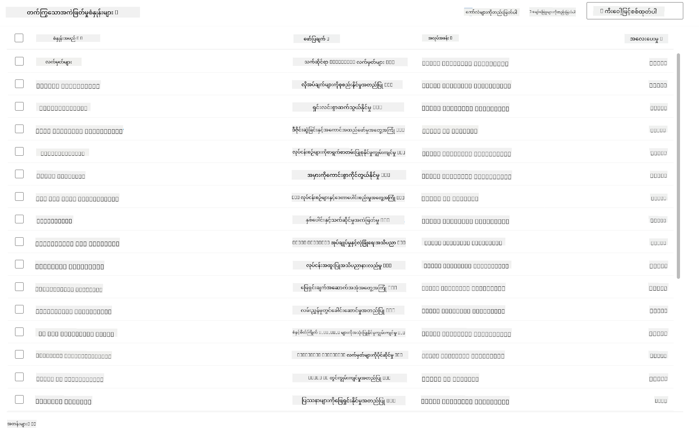

<!--
CO_OP_TRANSLATOR_METADATA:
{
  "original_hash": "2620cf9eaf09a3fc6be7fa31a3a62956",
  "translation_date": "2025-10-21T18:03:37+00:00",
  "source_file": "docs/operative-preview/01-get-started/README.md",
  "language_code": "my"
}
-->
# 🚨 မစ်ရှင် ၀၁: Hiring Agent ကို စတင်အသုံးပြုပါ

--8<-- "disclaimer.md"

## 🕵️‍♂️ CODENAME: `OPERATION TALENT SCOUT`

> **⏱️ လုပ်ဆောင်ချိန်:** `~45 မိနစ်`

## 🎯 မစ်ရှင်အကျဉ်းချုပ်

ကြိုဆိုပါတယ်၊ အေးဂျင့်။ သင့်ရဲ့ ပထမဆုံးတာဝန်မှာ **Operation Talent Scout** ဖြစ်ပြီး အဖွဲ့အစည်းများအတွက် ထိပ်တန်းအရည်အချင်းရှိသူများကို ရှာဖွေခြင်းနှင့် အလုပ်ခန့်ထားခြင်းကို ပြောင်းလဲပေးမယ့် AI အခြေခံထားတဲ့ အလုပ်ခန့်ထားမှုစနစ်ကို တည်ဆောက်ခြင်းဖြစ်ပါတယ်။

သင့်တာဝန်မှာ Microsoft Copilot Studio ကို အသုံးပြုပြီး အလုပ်ခန့်ထားမှုစနစ်တစ်ခုကို တည်ဆောက်ပြီး အလုပ်ခန့်ထားမှုဆိုင်ရာ လုပ်ငန်းစဉ်များကို စီမံခန့်ခွဲပေးမယ့် **Hiring Agent** ကို ဖန်တီးရမှာဖြစ်ပါတယ်။

ဒီ deployment က Agent Academy Operative အစီအစဉ်တစ်ခုလုံးအတွက် command center ကို တည်ဆောက်ပေးမှာဖြစ်ပြီး နောက်ထပ်မစ်ရှင်များတွင် အထူးပြုအေးဂျင့်များ၏ network တစ်ခုလုံးကို တည်ဆောက်ရန် အခြေခံအဆောက်အအုံအဖြစ် သတ်မှတ်ထားပါတယ်။

---

## 🔎 ရည်မှန်းချက်များ

ဒီမစ်ရှင်ကို ပြီးမြောက်အောင် လုပ်ဆောင်ခြင်းအားဖြင့် သင်သည်-

- **အခြေအနေကို နားလည်ခြင်း**: အလုပ်ခန့်ထားမှုအခက်အခဲများနှင့် ဖြေရှင်းနည်းများကို နက်နက်ရှိုင်းရှိုင်း နားလည်ခြင်း
- **ဖြေရှင်းချက်တည်ဆောက်ခြင်း**: အလုပ်ခန့်ထားမှုစနစ်၏ အခြေခံအဆောက်အအုံများကို import လုပ်ပြီး အောင်မြင်စွာ တည်ဆောက်ခြင်း
- **အေးဂျင့်ဖန်တီးခြင်း**: Agent Academy Operative အဖြစ် တည်ဆောက်မည့် အခြေအနေ၏ အစဖြစ်သော Hiring Agent ကို ဖန်တီးခြင်း

---

## 🔍 မစ်ရှင်မစတင်မီလိုအပ်ချက်များ

ဒီမစ်ရှင်ကို စတင်မလုပ်ဆောင်မီ သင်မှာ-

- Copilot Studio လိုင်စင်
- Microsoft Power Platform environment ကို အသုံးပြုခွင့်
- ဖြေရှင်းချက်များနှင့် အေးဂျင့်များကို ဖန်တီးနိုင်ရန် အုပ်ချုပ်ခွင့်ရှိမှု

---

## 🏢 အလုပ်ခန့်ထားမှုအခက်အခဲကို နားလည်ခြင်း

ဒီအခြေအနေမှာ Microsoft Copilot Studio ကို အသုံးပြုပြီး အလုပ်ခန့်ထားမှုလုပ်ငန်းစဉ်ကို တိုးတက်အောင်လုပ်ဆောင်ပေးနိုင်ပုံကို ပြသထားပါတယ်။ အေးဂျင့်များ၏ စနစ်တစ်ခုကို တည်ဆောက်ပြီး အလုပ်ခန့်ထားမှုဆိုင်ရာ တာဝန်များကို စီမံခန့်ခွဲပေးနိုင်ပါတယ်။

### စီးပွားရေးတန်ဖိုး

ဒီဖြေရှင်းချက်က HR အဖွဲ့များအတွက် အချိန်ကို လျှော့ချပေးပြီး ဆုံးဖြတ်ချက်များကို ပိုမိုကောင်းမွန်အောင် လုပ်ဆောင်ပေးနိုင်ပါတယ်-

- အီးမေးလ်မှ ရရှိသော CV များကို အလိုအလျောက် စီမံခြင်း
- လျှောက်ထားသူ၏ ကိုယ်ရေးအကျဉ်းအရ သင့်လျော်သော အလုပ်ရာထူးများကို အကြံပေးခြင်း
- လျှောက်လွှာများနှင့် အင်တာဗျူးလမ်းညွှန်များကို လျှောက်ထားသူတစ်ဦးချင်းစီအတွက် ပြုလုပ်ပေးခြင်း
- Built-in safety နှင့် moderation အင်္ဂါရပ်များမှတစ်ဆင့် တရားမျှတမှုနှင့် စည်းကမ်းရှိမှုကို အာမခံပေးခြင်း
- ဖြေရှင်းချက်ကို တိုးတက်အောင် လုပ်ဆောင်ရန် အကြံပြုချက်များကို စုဆောင်းခြင်း

### အလုပ်လုပ်ပုံ

- အဓိက **Hiring Agent** က လုပ်ငန်းစဉ်ကို စီမံခန့်ခွဲပြီး Microsoft Dataverse တွင် ဒေတာများကို သိမ်းဆည်းထားသည်။
- **Application Intake Agent** က CV များကို ဖတ်ပြီး အလုပ်လျှောက်လွှာများကို ဖန်တီးသည်။
- **Interview Prep Agent** က လျှောက်ထားသူ၏ နောက်ခံအချက်အလက်များအပေါ် အခြေခံပြီး အင်တာဗျူးမေးခွန်းများနှင့် စာရွက်များကို ဖန်တီးသည်။
- ဒီစနစ်ကို demo website တွင် ထုတ်ဝေပြီး stakeholder များနှင့် အပြန်အလှန် ဆက်သွယ်နိုင်သည်။

ဒီအခြေအနေက AI-powered automation ကို အသုံးပြုပြီး အလုပ်ခန့်ထားမှုလုပ်ငန်းစဉ်များကို ခေတ်မီအောင် ပြောင်းလဲလိုသော အဖွဲ့အစည်းများအတွက် အထူးသင့်လျော်သည်။

---

## 🧪 Lab: Hiring Agent ကို တည်ဆောက်ခြင်း

ဒီလက်တွေ့လေ့ကျင့်မှုမှာ သင့်အလုပ်ခန့်ထားမှုစနစ်အတွက် အခြေခံအဆောက်အအုံကို တည်ဆောက်ပါမည်။ အလုပ်ခန့်ထားမှုလုပ်ငန်းစဉ်များကို စီမံခန့်ခွဲရန် လိုအပ်သော Dataverse tables နှင့် ဒေတာဖွဲ့စည်းမှုများပါဝင်သော pre-configured solution ကို import လုပ်ပါမည်။ ထို့နောက် ဒီ module အတွင်း သင်ယူမှုကို ပံ့ပိုးပေးရန်နှင့် စမ်းသပ်မှုအတွက် အမှန်တကယ်ဖြစ်နိုင်သော အခြေအနေများကို ပံ့ပိုးပေးရန် ဒီ tables များကို sample data ဖြင့် ဖြည့်ပါမည်။ နောက်ဆုံးတွင် Copilot Studio တွင် Hiring Agent ကို ဖန်တီးပြီး နောက်ထပ်မစ်ရှင်များတွင် ထည့်သွင်းမည့် အခြားအင်္ဂါရပ်များအတွက် အခြေခံစကားပြောအင်တာဖေ့စ်ကို တည်ဆောက်ပါမည်။

### 🧪 Lab 1.1: Solution ကို Import လုပ်ခြင်း

1. **[Copilot Studio](https://copilotstudio.microsoft.com)** သို့ သွားပါ
1. ဘယ်ဘက် navigation မှ **...** ကိုရွေးပြီး **Solutions** ကိုရွေးပါ
1. အပေါ်ဆုံးရှိ **Import Solution** ခလုတ်ကိုရွေးပါ
1. **[Download](https://raw.githubusercontent.com/microsoft/agent-academy/refs/heads/main/docs/operative-preview/01-get-started/assets/Operative_1_0_0_0.zip)** ပြုလုပ်ပြီး ပြင်ဆင်ထားသော solution ကို ရယူပါ
1. **Browse** ကိုရွေးပြီး အရင်အဆင့်တွင် download လုပ်ထားသော solution ကိုရွေးပါ
1. **Next** ကိုရွေးပါ
1. **Import** ကိုရွေးပါ

!!! success
    အောင်မြင်ပါက "Solution "Operative" imported successfully." ဆိုသော အစိမ်း notification bar ကို တွေ့ရပါမည်။

solution ကို import လုပ်ပြီးပါက **Operative** ဆိုသော solution display name ကိုရွေးပြီး import လုပ်ထားသော အရာများကို ကြည့်ပါ။



အောက်ပါ components များကို import လုပ်ထားပါသည်-

| Display Name | Type | Description |
|-------------|------|-------------|
| Candidate | Table | လျှောက်ထားသူအချက်အလက် |
| Evaluation Criteria | Table | အလုပ်ရာထူးအတွက် အကဲဖြတ်မှုစံနှုန်းများ |
| Hiring Hub | Model-Driven App | အလုပ်ခန့်ထားမှုလုပ်ငန်းစဉ်ကို စီမံခန့်ခွဲရန် အက်ပလီကေးရှင်း |
| Hiring Hub | Site Map | Hiring Hub app အတွက် navigation ဖွဲ့စည်းမှု |
| Job Application | Table | အလုပ်လျှောက်လွှာများ |
| Job Role | Table | အလုပ်ရာထူးများ |
| Resume | Table | လျှောက်ထားသူများ၏ CV များ |

ဒီ lab ၏ နောက်ဆုံးအဆင့်အနေနှင့် **Publish all customizations** ခလုတ်ကို အပေါ်ဆုံးတွင်ရွေးပါ။

### 🧪 Lab 1.2: Sample data ကို Import လုပ်ခြင်း

ဒီ lab မှာ သင် import လုပ်ထားသော tables အချို့ကို sample data ဖြည့်ပါမည်။

#### Import လုပ်ရန် ဖိုင်များကို Download လုပ်ပါ

1. **[Download](https://raw.githubusercontent.com/microsoft/agent-academy/refs/heads/main/docs/operative-preview/01-get-started/assets/evaluation-criteria.csv)** အကဲဖြတ်မှုစံနှုန်းများပါဝင်သော CSV ဖိုင်ကို ရယူပါ
1. **[Download](https://raw.githubusercontent.com/microsoft/agent-academy/refs/heads/main/docs/operative-preview/01-get-started/assets/job-roles.csv)** အလုပ်ရာထူးများပါဝင်သော CSV ဖိုင်ကို ရယူပါ

#### Job Role sample data ကို Import လုပ်ပါ

1. အရင် lab မှာ import လုပ်ထားသော solution သို့ ပြန်သွားပါ
1. **Hiring Hub** Model-Driven App ကို ရွေးပါ
1. အပေါ်ဆုံးရှိ **Play** ခလုတ်ကို ရွေးပါ

    !!! warning
        သင်ကို login ပြန်လုပ်ရန် တောင်းဆိုနိုင်ပါသည်။ Login ပြန်လုပ်ပါ။ ပြန်လုပ်ပြီးပါက Hiring Hub app ကို တွေ့ရပါမည်။

1. ဘယ်ဘက် navigation မှ **Job Roles** ကိုရွေးပါ
1. command bar မှ **More** icon (အောက်မှာ အစီအစဉ်တစ်ခုချင်းစီရှိသော icon) ကိုရွေးပါ
1. *Import from Excel* အနားရှိ **right arrow** ကိုရွေးပါ

    

1. **Import from CSV** ကိုရွေးပါ

    

1. **Choose File** ခလုတ်ကိုရွေးပြီး download လုပ်ထားသော **job-roles.csv** ဖိုင်ကို ရွေးပါ၊ **Open** ကိုရွေးပါ
1. **Next** ကိုရွေးပါ
1. နောက်အဆင့်ကို အတိုင်းထားပြီး **Review Mapping** ကိုရွေးပါ

    

1. Mapping မှန်ကန်မှုရှိကြောင်း သေချာစွာစစ်ဆေးပြီး **Finish Import** ကိုရွေးပါ

    !!! info
        Import လုပ်မှုကို စတင်ပြီး **Done** ကိုရွေးခြင်းဖြင့် အဆင့်တစ်ခုချင်းစီကို စစ်ဆေးနိုင်ပါသည်။

1. **Done** ကိုရွေးပါ

ဒီလုပ်ငန်းစဉ်မှာ အချိန်အနည်းငယ်ယူနိုင်ပါသည်၊ သို့သော် **Refresh** ခလုတ်ကို နှိပ်ပြီး Import အောင်မြင်မှုကို စစ်ဆေးနိုင်ပါသည်။


#### Evaluation Criteria sample data ကို Import လုပ်ပါ

1. ဘယ်ဘက် navigation မှ **Evaluation Criteria** ကိုရွေးပါ
1. command bar မှ **More** icon ကိုရွေးပါ
1. *Import from Excel* အနားရှိ **right arrow** ကိုရွေးပါ

    

1. **Import from CSV** ကိုရွေးပါ

    

1. **Choose File** ခလုတ်ကိုရွေးပြီး download လုပ်ထားသော **evaluation-criteria.csv** ဖိုင်ကို ရွေးပါ၊ **Open** ကိုရွေးပါ
1. **Next** ကိုရွေးပါ
1. နောက်အဆင့်ကို အတိုင်းထားပြီး **Review Mapping** ကိုရွေးပါ

    

1. Mapping အနေနှင့် Job Role field အနားရှိ magnifying glass(🔎 icon) ကိုရွေးပါ
1. **Job Title** ရွေးထားမှုရှိကြောင်း သေချာစွာစစ်ဆေးပါ၊ မရှိပါက ထည့်ပါ
1. **OK** ကိုရွေးပါ
1. အခြား mapping မှန်ကန်မှုကိုလည်း စစ်ဆေးပြီး **Finish Import** ကိုရွေးပါ

    !!! info
        Import လုပ်မှုကို စတင်ပြီး **Done** ကိုရွေးခြင်းဖြင့် အဆင့်တစ်ခုချင်းစီကို စစ်ဆေးနိုင်ပါသည်။

1. **Done** ကိုရွေးပါ

ဒီလုပ်ငန်းစဉ်မှာ အချိန်အနည်းငယ်ယူနိုင်ပါသည်၊ သို့သော် **Refresh** ခလုတ်ကို နှိပ်ပြီး Import အောင်မြင်မှုကို စစ်ဆေးနိုင်ပါသည်။



### 🧪 Lab 1.3: Hiring Agent ကို ဖန်တီးခြင်း

အခုတော့ prerequisites setup ပြီးပါပြီ၊ အရေးကြီးတဲ့အလုပ်ကို စတင်ပါမယ်! Hiring Agent ကို အရင်ဆုံး ထည့်သွင်းပါ။

1. **[Copilot Studio](https://copilotstudio.microsoft.com)** သို့ သွားပြီး solution နှင့် data ကို import လုပ်ထားသော environment တွင်ရှိကြောင်း သေချာပါ
1. ဘယ်ဘက် navigation မှ **Agents** ကိုရွေးပါ
1. **New Agent** ကိုရွေးပါ
1. **Configure** ကိုရွေးပါ
1. **Name** အတွက်:

    ```text
    Hiring Agent
    ```

1. **Description** အတွက်:

    ```text
    Central orchestrator for all hiring activities
    ```

1. အပေါ်ယံရှိ *Create* ခလုတ်အနားရှိ **...** ကိုရွေးပါ
1. **Update advanced settings** ကိုရွေးပါ
1. **Solution** အနေနှင့် `Operative` ကိုရွေးပါ
1. **Update** ကိုရွေးပါ
1. အပေါ်ယံရှိ **Create** ကိုရွေးပါ

ဒီအေးဂျင့်ကို သင့် Operative course အတွင်း အသုံးပြုမည်ဖြစ်သည်။

---

## 🎉 မစ်ရှင်ပြီးမြောက်

မစ်ရှင် ၀၁ ပြီးမြောက်ပါပြီ! သင်သည် အောက်ပါကျွမ်းကျင်မှုများကို အောင်မြင်စွာ လေ့လာပြီးဖြစ်သည်-

✅ **အခြေအနေကို နားလည်ခြင်း**: အလုပ်ခန့်ထားမှုအခက်အခဲများနှင့် ဖြေရှင်းနည်းများကို နက်နက်ရှိုင်းရှိုင်း နားလည်ခြင်း  
✅ **ဖြေရှင်းချက်တည်ဆောက်ခြင်း**: အလုပ်ခန့်ထားမှုစနစ်၏ အခြေခံအဆောက်အအုံများကို import လုပ်ပြီး အောင်မြင်စွာ တည်ဆောက်ခြင်း  
✅ **အေးဂျင့်ဖန်တီးခြင်း**: Agent Academy Operative အဖြစ် တည်ဆောက်မည့် အခြေအနေ၏ အစဖြစ်သော Hiring Agent ကို ဖန်တီးခြင်း  

နောက်တစ်ခုမှာ [Mission 02](../02-multi-agent/README.md): အေးဂျင့်ကို multi-agent အဆင့်သို့ တိုးတက်အောင် လုပ်ဆောင်ပါ။

---

## 📚 တိုက်ရိုက်အရင်းအမြစ်များ

📖 [Microsoft Copilot Studio - အေးဂျင့်တစ်ခုကို ဖန်တီးခြင်း](https://learn.microsoft.com/microsoft-copilot-studio/authoring-first-bot)  
📖 [Microsoft Dataverse Documentation](https://learn.microsoft.com/power-apps/maker/data-platform)

---

**အကြောင်းကြားချက်**:  
ဤစာရွက်စာတမ်းကို AI ဘာသာပြန်ဝန်ဆောင်မှု [Co-op Translator](https://github.com/Azure/co-op-translator) ကို အသုံးပြု၍ ဘာသာပြန်ထားပါသည်။ ကျွန်ုပ်တို့သည် တိကျမှုအတွက် ကြိုးစားနေသော်လည်း အလိုအလျောက် ဘာသာပြန်မှုများတွင် အမှားများ သို့မဟုတ် မတိကျမှုများ ပါဝင်နိုင်သည်ကို သတိပြုပါ။ မူရင်းဘာသာစကားဖြင့် ရေးသားထားသော စာရွက်စာတမ်းကို အာဏာတရားရှိသော အရင်းအမြစ်အဖြစ် သတ်မှတ်သင့်ပါသည်။ အရေးကြီးသော အချက်အလက်များအတွက် လူက ဘာသာပြန်မှုကို အကြံပြုပါသည်။ ဤဘာသာပြန်မှုကို အသုံးပြုခြင်းမှ ဖြစ်ပေါ်လာသော အလွဲအမှားများ သို့မဟုတ် အနားလွဲမှုများအတွက် ကျွန်ုပ်တို့သည် တာဝန်မယူပါ။