<!--
CO_OP_TRANSLATOR_METADATA:
{
  "original_hash": "75efaf515d5694d4fd549bfd6518901a",
  "translation_date": "2025-10-21T18:09:01+00:00",
  "source_file": "docs/operative-preview/03-automate-triggers/README.md",
  "language_code": "my"
}
-->
# Mission 03: အလုပ်လုပ်နိုင်စွမ်းရှိသော Event Triggers ထည့်သွင်းပါ

--8<-- "disclaimer.md"

## 🕵️‍♂️ CODENAME: `OPERATION SIGNAL POINT`

> **⏱️ လုပ်ဆောင်ချိန်:** `~45 မိနစ်`

## 🎯 Mission Brief

အေးချမ်းစွာ ပြန်လည်ကြိုဆိုပါတယ်၊ အေးဂျင့်။ [Mission 02](../02-multi-agent/README.md) တွင် - Application Intake child agent နှင့် Interview Prep connected agent တို့ကို တည်ဆောက်ပြီး သင်၏ Hiring Agent ၏ စွမ်းရည်များကို တိုးချဲ့ပေးနိုင်ခဲ့ပါသည်။

သင်၏တာဝန်မှာ **Operation Signal Point** ဖြစ်ပြီး **event triggers** ကို ပိုမိုနက်နက်ရှိုင်းရှိုင်း လေ့လာရန်ဖြစ်သည် - သင်၏ agent system ကို လူ့အင်ပွတ်ကို စောင့်နေသောအနေအထားမှ **အလုပ်လုပ်နိုင်စွမ်းရှိသော လုပ်ဆောင်မှု** သို့ မြှင့်တင်ရန်ဖြစ်သည်။ သင်၏ agents များကို လူ့အင်ပွတ်ကို ဖြေကြားပေးသောအနေအထားမှ လိုအပ်ချက်များကို ကြိုတင်ခန့်မှန်းပြီး ကိုယ်တိုင်အလုပ်လုပ်နိုင်သောအနေအထားသို့ ပြောင်းလဲပေးပါမည်။

ဤအရာသည် အေးဂျင့်များကို _မေးခွန်းများကို ဖြေကြားပေးသော_ အနေအထားမှ _လိုအပ်ချက်များကို ကြိုတင်ခန့်မှန်းပြီး ကိုယ်တိုင်အလုပ်လုပ်နိုင်သော_ အေးဂျင့်များသို့ မြှင့်တင်ပေးခြင်းဖြစ်သည်။ Event triggers နှင့် automated workflows များကို အသုံးပြုခြင်းအားဖြင့် သင်၏ Hiring Agent သည် လာရောက်သော ရာဇဝင်အီးမေးလ်များကို သိရှိပြီး၊ attachments များကို အလိုအလျောက် process လုပ်ပြီး၊ Dataverse တွင် data များကို သိမ်းဆည်းပြီး၊ Microsoft Teams မှတဆင့် သင်၏ HR recruitment အဖွဲ့ကို အသိပေးမည် - သင်သည် အရေးကြီးသောအလုပ်များကို အာရုံစိုက်နိုင်စေရန်။

automation နှင့် intelligence တွေ့ဆုံရာကမ္ဘာသို့ ကြိုဆိုပါသည်။

## 🔎 Objectives

ဤ mission တွင် သင်လေ့လာရမည့်အရာများမှာ -

1. Event triggers များသည် user interaction မရှိဘဲ autonomous agent behavior ကို ဘယ်လို enable လုပ်ပေးနိုင်သည်ကို
1. Copilot Studio တွင် interactive agents နှင့် autonomous agents များ၏ ကွာခြားချက်များ
1. Email attachments များကို အလိုအလျောက် process လုပ်ပြီး Dataverse သို့ upload လုပ်ပေးသော event triggers များကို ဘယ်လိုတည်ဆောက်ရမည်ကို
1. Notifications များအတွက် adaptive cards များကို Teams channels တွင် post လုပ်ပေးသော agent flows များကို ဘယ်လိုတည်ဆောက်ရမည်ကို
1. Event triggers နှင့် agent flows များအကြား data များကို pass လုပ်ပေးခြင်းအားဖြင့် end-to-end automation ကို ဘယ်လိုလုပ်ဆောင်ရမည်ကို

## 🤔 Event trigger ဆိုတာဘာလဲ?

[Recruit](../../recruit/10-add-event-triggers/README.md) တွင် event triggers များအကြောင်းကို သင်လေ့လာခဲ့ပါသည်။ မသိခဲ့ရင်လည်း အောက်တွင် အကျဉ်းချုပ်ပြန်လည်လေ့လာနိုင်ပါသည်။

**Event triggers** သည် agent ကို user message မလိုအပ်ဘဲ _ကိုယ်တိုင်_ အလုပ်လုပ်နိုင်စေသည်။ Configured event တစ်ခုဖြစ်ပေါ်လာသောအခါ - “new SharePoint item,” “new email,” “Planner task assigned,” သို့မဟုတ် time‑based recurrence တစ်ခုဖြစ်ပေါ်လာသောအခါ connector တစ်ခုသည် trigger payload ကို သင်၏ agent သို့ ပို့ပေးသည်။ ထို့နောက် agent သည် သင်၏ညွှန်ကြားချက်များကို လိုက်နာပြီး ဘာလုပ်ဆောင်ရမည်ကို ဆုံးဖြတ်သည်။

### အဓိကလက္ခဏာများ

- **Autonomous activation:**
      - User message ဖြင့် agent ကို စတင်သော topic triggers များနှင့် မတူဘဲ၊ event triggers များသည် အပြင်ပန်းဖြစ်ရပ်များမှ စတင်ပြီး proactive behavior ကို enable လုပ်ပေးသည်။

- **Payload-driven:**
      - Event တစ်ခုစီသည် connector မှတဆင့် payload (variables + optional instructions) ကို ပေးပို့သည်။ Agent သည် သင်၏ညွှန်ကြားချက်များနှင့် payload ကို အသုံးပြု၍ ဘာလုပ်ဆောင်ရမည်ကို ဆုံးဖြတ်သည်။
      - ဥပမာ _call a topic_ သို့မဟုတ် _execute actions defined by Tools_။

- **Examples out-of-the-box:**
      - SharePoint/OneDrive file or item created
      - Planner task completed/assigned
      - Microsoft Forms response submitted
      - Recurrence/schedule

    Availability သည် Power Automate တွင် သင်၏အဖွဲ့အစည်း၏ data policies များအပေါ်မူတည်သည်။

- **Requires generative orchestration:**
      - Event triggers များသည် agent အတွက် generative orchestration enable လုပ်ထားသောအခါတွင်သာ ရရှိနိုင်သည်။

- **Billing/usage:**
      - Trigger delivery တစ်ခုစီသည် Copilot Studio capacity အတွက် message အဖြစ်တွက်ချက်သည်။
      - ဥပမာ 10‑minute recurrence သည် 10 မိနစ်တိုင်း message တစ်ခု ပို့ပေးသည်။

- **Auth model and setup:**
      - Triggers များကို agent Overview တွင် _Triggers_ အောက်တွင် ထည့်သွင်းနိုင်သည်။ Trigger connector အတွက် authentication သည် agent maker ၏ account (“agent author authentication”) ကို အသုံးပြုသည်။
      - Trigger parameters နှင့် payload ကို Power Automate maker portal တွင် edit လုပ်နိုင်သည်။

- **Testing & observability:**
      - Agent ၏ test pane တွင် triggers များကို စမ်းသပ်နိုင်ပြီး publish လုပ်မည့်အခါမတိုင်မီ activity map ဖြင့် အပြုအမူကို စစ်ဆေးနိုင်သည်။

!!! info "TL;DR for developers"

    Event triggers ကို **webhook-like signals** အဖြစ် စဉ်းစားပါ။ Structured payload ကို agent သို့ push လုပ်ပေးပြီး user message မလိုအပ်ဘဲ _အလုပ်လုပ်နိုင်စေ_ပြီး system များအကြား actions များကို ချိတ်ဆက်ပေးနိုင်သည်။

### Topic triggers - ကွာခြားချက်

[Recruit](../../recruit/07-add-new-topic-with-trigger/README.md) တွင် topic triggers များအကြောင်းကို သင်လေ့လာခဲ့ပြီးဖြစ်သော်လည်း _Topic_ triggers နှင့် _Event_ triggers များ၏ ကွာခြားချက်များကို နားလည်ရန် အခက်အခဲရှိနိုင်သည်။

Topic triggers များသည် user message ကို ဖြေကြားရန်အတွက် topic တစ်ခု run လုပ်ရန် control လုပ်ပေးသည်။

- Generative orchestration တွင် default trigger သည် **By agent** ဖြစ်ပြီး planner သည် user message နှင့် အကောင်းဆုံးကိုက်ညီသော topic ကို ရွေးချယ်ပေးသည်။
- Classic orchestration တွင် default သည် **Phrases** ဖြစ်ပြီး planner သည် user message နှင့် trigger phrases များကိုက်ညီသော topic ကို ရွေးချယ်ပေးသည်။

!!! info "Core difference"

    Topic triggers များသည် chat အတွင်း conversation activity များကို စတင်ပေးသည်။
    
    Event triggers များသည် system event များကို connectors မှတဆင့် စတင်ပေးပြီး conversation မရှိဘဲ agent ကို run လုပ်နိုင်သည်။

### Topic trigger vs Event trigger အကျဉ်းချုပ်

- **Topic trigger:** User (သို့ chat activity) X ကို ပြော/လုပ် → Topic T run လုပ်။
- **Event trigger:** SharePoint/Planner/Email/Timer P ကို fire လုပ် → agent သည် instructions ကို အကဲဖြတ် → Actions/Topics ကို ခေါ်။

## 🏓 Interactive agent vs Autonomous agent - ကွာခြားချက်

Event triggers နှင့် topics triggers များ၏ ကွာခြားချက်ကို သိရှိပြီးနောက်၊ interactive agent နှင့် autonomous agent တို့၏ ကွာခြားချက်ကို လေ့လာကြမည်။

Copilot Studio တွင် "interactive" သည် chat သို့ channel တွင် **topics** ကို အသုံးပြုသော agents များကို ရည်ညွှန်းသည်။ "autonomous" သည် **event triggers** ကို leverage လုပ်ပြီး user input မလိုအပ်ဘဲ run လုပ်နိုင်သော agents များကို ရည်ညွှန်းသည်။

| Dimension                           | Interactive agent     | Autonomous agent                                                                                              |
|-------------------------------------|-----------------------|---------------------------------------------------------------------------------------------------------------|
| ဘယ်လိုစတင်သည်                     | User (သို့ chat activity) topic ကို trigger လုပ်သည်။ ဥပမာ: By agent, Phrases, Message received.   | External event trigger သည် connector မှတဆင့် payload ကို agent သို့ ပို့ပေးသည်။ ဥပမာ: SharePoint, Planner, email, schedule, စသည်တို့။ |
| အဓိကအသုံးပြုမှု                   | Q&A, guided workflows, chat အတွင်း request-driven actions - Teams, web, စသည်တို့။  | Proactive operations နှင့် background automation - system changes များကို တုံ့ပြန်ပြီး၊ notify, file, သို့ orchestrate tasks များကို လုပ်ဆောင်သည်။ |
| Trigger surface                     | Topic triggers: By agent / Phrases / Message received / Activity types / Invoke / Inactivity / Plan complete | Event triggers library via connectors; payload includes event data + optional instructions. |
| Planner (generative orchestration)  | By agent နှင့် Plan complete triggers များအတွက် topics များကို ရွေးချယ်/စဉ်ဆက်ပေးရန် အလွန်အရေးကြီးသည်။ | Event triggers များအတွက်လိုအပ်သည်; agent သည် instructions + payload ကို အသုံးပြု၍ ဘာလုပ်ဆောင်ရမည်ကို ဆုံးဖြတ်သည်။ |
| Typical example                     | User က "What's our refund policy?" ဟုမေး → Topic run လုပ်, knowledge ကို query လုပ်, response ပေး။ | New Planner task assigned → Event trigger fire → Agent သည် Teams message post လုပ်, record update လုပ်, သို့ topic ကို ခေါ်။ |
| Setup path                          | Topics များကို တည်ဆောက်ပြီး၊ trigger type ကို သတ်မှတ်၊ dialog/actions များကို author လုပ်၊ channels တွင် publish လုပ်။ | Event trigger ကို ထည့်သွင်း (Overview → Triggers), connector ကို agent author credentials ဖြင့် authenticate လုပ်, payload/instructions ကို configure လုပ်, test pane တွင် စမ်းသပ်, publish လုပ်။ |
| Auth and governance                 | Channel/auth context အောက်တွင် run လုပ်သည်; topic triggers များသည် allowed channels တွင် chat activities များကို တုံ့ပြန်သည်။ | Trigger availability သည် Power Automate data policies အပေါ်မူတည်သည်; connectors များသည် agent maker ၏ account အောက်တွင် run လုပ်သည်။ |
| Observability                       | Copilot Studio တွင် topics များကို စမ်းသပ်, conversation transcripts/activities ကို စစ်ဆေးနိုင်သည်။ | Test trigger နှင့် activity map ကို အသုံးပြု၍ publish မလုပ်မီ execution ကို validate လုပ်, publish လုပ်ပြီးနောက် activity ကို စောင့်ကြည့်နိုင်သည်။ |
| Capacity impact                     | User message/agent response တစ်ခုစီသည် capacity ကိုစားသုံးသည်။ | Event delivery တစ်ခုစီသည် message တစ်ခုဖြစ်ပြီး၊ subsequent actions များကိုလည်း message အဖြစ်တွက်ချက်သည်။ ဥပမာ: 10‑minute recurrence = 6 messages/hour |

### ဘယ်အခါမှာ ဘာကို အသုံးပြုမလဲ?

- **Topic triggers (interactive)** ကို အသုံးပြုပါ၊ user များသည် agent conversation ကို စတင်သောအခါ - FAQ, guided intake, သို့ command‑style tasks များ chat အတွင်းတွင်။ Planner ၏ By agent trigger သည် manual phrase curation ကို လျှော့ချပေးသည်။
- **Event triggers (autonomous)** ကို ထည့်သွင်းပါ၊ agent သည် conversation ကို စတင်ရန် သို့မဟုတ် ကိုယ်တိုင်အလုပ်လုပ်ရန် - SharePoint/Dataverse တွင် updates, incoming email, သို့ schedule အပေါ်မူတည်၍။ ဤအရာသည် reactive operations မှ proactive operations သို့ ရွှေ့ပြောင်းပေးသည်။

## Developer tips & gotchas

1. **Generative orchestration ကို enable လုပ်ပါ** autonomous ဖြစ်စေလိုသော agent များအတွက်။ Event triggers များသည် otherwise မပေါ်လာပါ။

1. **Payload ကို စောင့်ရှောက်ပါ။** Trigger မှ agent အတွက်လိုအပ်သော minimal fields များကို ဆုံးဖြတ်ပါ၊ ဥပမာ `itemId`, `assignedTo`, `dueDate` နှင့် concise instructions များကို ထည့်သွင်းပါ။

1. **Auth scope အရေးကြီးသည်။** Triggers များသည် agent maker ၏ account ကို authenticate လုပ်သည်။ Account သည် connector permissions များနှင့် Power Automate data policies များကို လိုက်နာရမည်။

1. **Cost နှင့် noise ကို ထိန်းချုပ်ပါ။** High‑frequency recurrences သို့ chatty sources များသည် message consumption ကို မြင့်တက်စေသည် - throttle လုပ်နိုင်သည့်နေရာတွင် throttle လုပ်ပါ သို့မဟုတ် trigger တွင် conditions များထည့်သွင်းပါ။

1. **Publish မလုပ်မီ စမ်းသပ်ပါ။** **Test trigger** နှင့် activity map ကို အသုံးပြု၍ plan နှင့် called actions များကို စစ်ဆေးပါ - instructions/payload ကို iterate လုပ်ပါ၊ behavior သည် တည်ငြိမ်သည်အထိ။

## 🧪 Lab 03 - Candidate application emails များကို အလိုအလျောက်လုပ်ဆောင်ခြင်း

အောက်တွင် **Hiring Agent** တွင် event trigger တစ်ခုထည့်သွင်းပြီး child **Application Intake Agent** တွင် agent flow တစ်ခုတည်ဆောက်ကာ autonomy အတွက် အလုပ်လုပ်ပါမည်။

### ✨ Use case scenario

!!! info ""

    **HR Recruiter အနေဖြင့်**

    **အီးမေးလ် Inbox သို့ ရာဇဝင်နှင့်အတူ အီးမေးလ်ရောက်ရှိလာသောအခါ Dataverse သို့ အလိုအလျောက် upload လုပ်ထားသည်ကို သိရှိလိုပါသည်**

    **ဒါကြောင့်** အီးမေးလ်မှ application အတွက် ရာဇဝင်များကို Dataverse သို့ upload လုပ်ထားသည်ကို အမြဲသိရှိနိုင်ရန်

ဤအရာကို နည်းလမ်းနှစ်ခုဖြင့် ပြုလုပ်မည်

1. အီးမေးလ်ရောက်ရှိသောအခါအတွက် event trigger တစ်ခု
    1. File ၏ `contentType` သည် `PDF` format type ဖြစ်ကြောင်း စစ်ဆေးပါ။
    1. File ကို extract လုပ်ပြီး Dataverse သို့ upload လုပ်ပါ။
    1. Dataverse actions မှ input parameters များကို pass လုပ်ကာ agent prompt ကို ပေးပါ။

1. Child **Application Intake Agent** တွင် agent flow တစ်ခုထည့်သွင်းပါ၊ event trigger ၏ prompt မှ invoke လုပ်ပါ။
    1. Event trigger ၏ prompt မှ pass လုပ်ထားသော input parameters များကို Microsoft Teams channel တွင် adaptive card အဖြစ် post လုပ်ကာ HR Recruitment team ကို notify လုပ်ပါ။ Adaptive card တွင် Dataverse row link ပါဝင်ပြီး **Hiring Agent** တွင် ကြည့်ရှုနိုင်ပါမည်။

စတင်လိုက်ပါစို့!

### ✨ Mission ကို ပြီးမြောက်ရန်လိုအပ်သောအရာများ

သင်သည် **အောက်ပါအနက် တစ်ခုခုကို** လိုအပ်ပါမည် -

- **Mission 01 နှင့် Mission 02 ကို ပြီးမြောက်ထားပြီး Hiring Agent ကို အသင့်ရှိထားပါ၊** **သို့မဟုတ်**
- **Mission 03 starter solution ကို Import လုပ်ပါ** သင်စတင်လိုပါက သို့မဟုတ် catch up လုပ်လိုပါက။ [Mission 03 Starter Solution ကို Download လုပ်ပါ](https://aka.ms/agent-academy)

!!! note "Solution Import နှင့် Sample Data"
    Starter solution ကို အသုံးပြုပါက [Mission 01](../01-get-started/README.md) တွင် solutions နှင့် sample data များကို သင်၏ environment သို့ Import လုပ်ရန် အသေးစိတ်ညွှန်ကြားချက်များကို ရှာဖွေပါ။

Microsoft Teams သို့ adaptive card ကို post လုပ်ရန် **Microsoft Teams** ကိုလည်း အသုံးပြုနိုင်ရမည်။

### Lab 3.1 - အီးမေးလ်မှ ရာဇဝင်များကို Dataverse သို့ upload လုပ်ခြင်းကို အလိုအလျောက်လုပ်ဆောင်ပါ

1. Hiring Agent တွင် **Overview tab** တွင် scroll လုပ်ပြီး **+ Add trigger** ကို ရွေးပါ။

       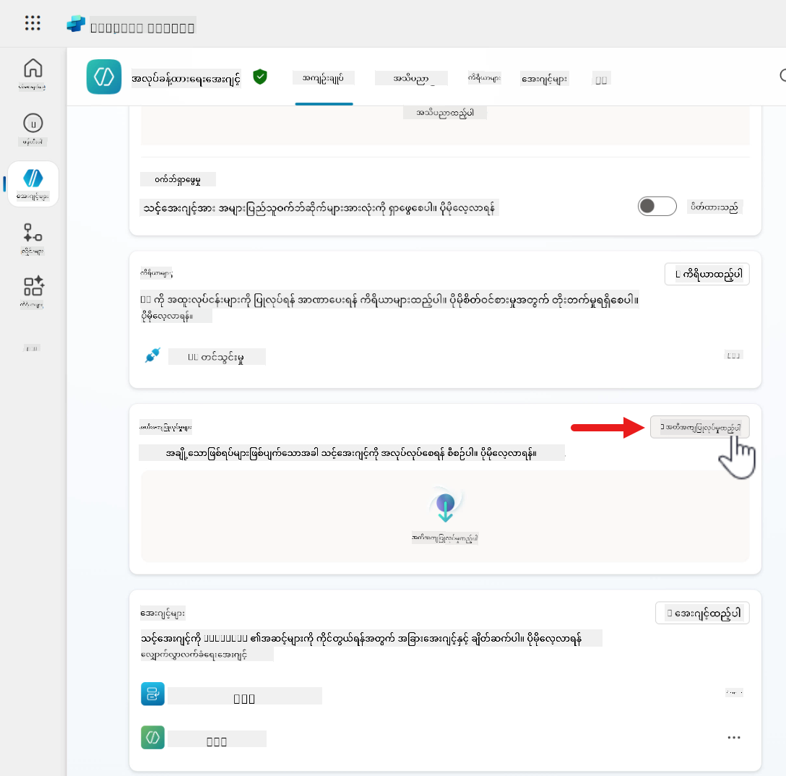

1. Triggers များ၏ စာရင်းတစ်ခု ပေါ်လာပါမည်။ **When a new email arrives (V3)** ကို ရွေးပြီး **Next** ကို ရွေးပါ။

       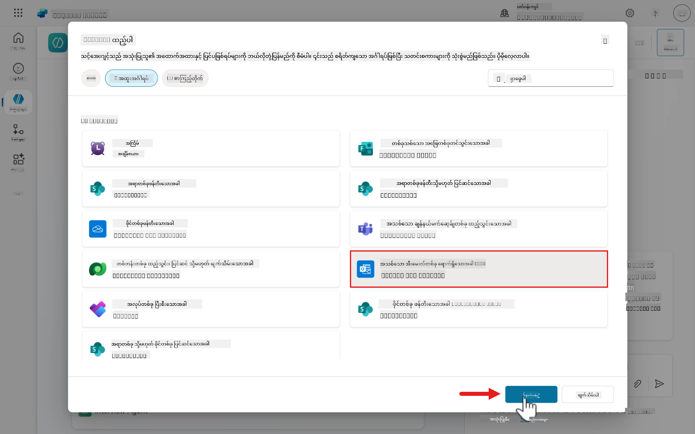

1. **Trigger name** နှင့် **Sign in** connection references များကို တွေ့ရပါမည်။

       Trigger name
အခုတော့ အဖြစ်အပျက် trigger ကို update လုပ်ပြီး automation စွမ်းဆောင်ရည်များကို ပိုမိုထည့်သွင်းဖို့ လုပ်ပါမယ်။ Trigger ရဲ့ **ellipsis (...)** ကိုရွေးပြီး **Edit in Power Automate** ကိုရွေးပါ။

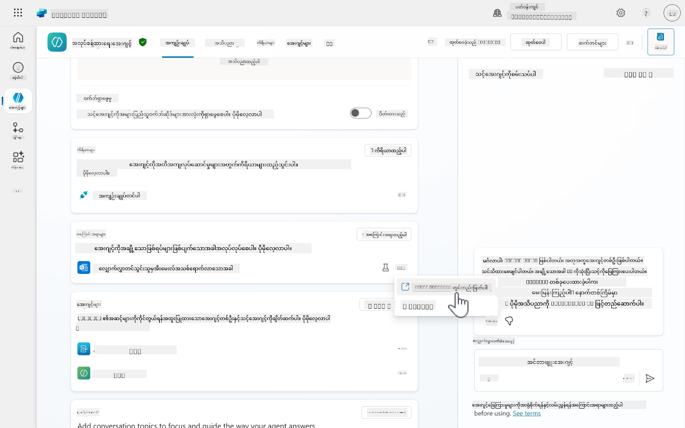

1. Trigger ကို Power Automate maker portal မှာ flow အနေနဲ့ load လုပ်ပါမယ်။ သင်မြင်နေရတာက Power Automate maker portal ရဲ့ flow designer ဖြစ်ပါတယ်။ ဒီနေရာမှာ automation ပိုမိုလုပ်ဆောင်နိုင်ဖို့ logic နဲ့ actions တွေထည့်နိုင်ပါတယ်။ Trigger က အပေါ်မှာပေါ်လာပြီး flow ရဲ့ နောက်ဆုံး action အနေနဲ့ **Sends a prompt to the specified copilot for processing** ပေါ်လာပါမယ်။

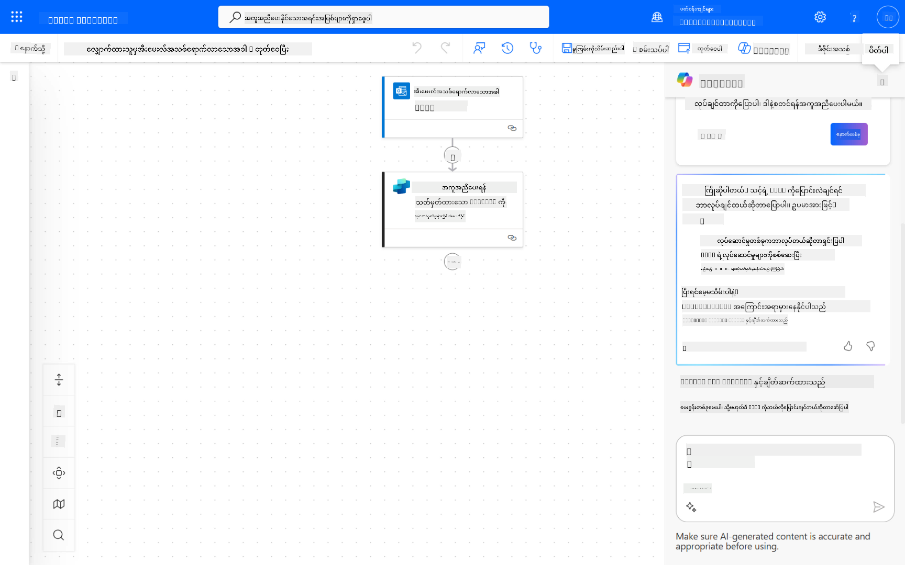

1. Power Automate ရဲ့ **When a new email arrives** trigger က default အနေဖြင့် အီးမေးလ်များစွာကို တစ်ခါတည်း process လုပ်နိုင်ပါတယ်၊ အီးမေးလ်များစွာ တစ်ချိန်တည်းရောက်လာရင် flow ကို batch အနေနဲ့ တစ်ခါသာ run လုပ်ပါမယ်။

Flow ကို အီးမေးလ်တစ်ခုချင်းစီအတွက် သီးသန့် run လုပ်စေဖို့ trigger ရဲ့ settings မှာ **Split On** ကို enable လုပ်ပြီး dropdown array field မှာ `@triggerOutputs()?['body/value']` ကိုရွေးပါ။

**Split On** ကိုဖွင့်ထားပြီး array field ကို `@triggerOutputs()?['body/value']` သတ်မှတ်ထားတဲ့အခါ flow က message တစ်ခုချင်းစီအတွက် run လုပ်ပါမယ်၊ အီးမေးလ်များစွာ တစ်ချိန်တည်းရောက်လာရင်တောင်။

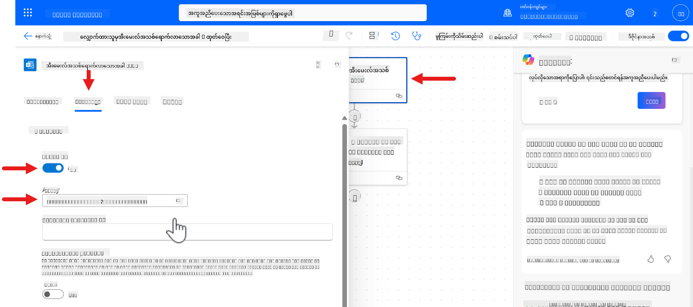

1. Attachment ရဲ့ file type ကိုစစ်ဆေးဖို့ logic တစ်ခုထည့်ပါမယ်၊ .PDF file attachments ကိုသာ upload လုပ်ချင်ပြီး images မ upload လုပ်ချင်ပါဘူး (အဲဒါတွေက email signature ကနေလာနိုင်ပါတယ်)။ Trigger အောက်မှာ **+** icon ကိုရွေးပြီး **Built in tools** အပိုင်းက **Control** ကိုရွေးပါ။

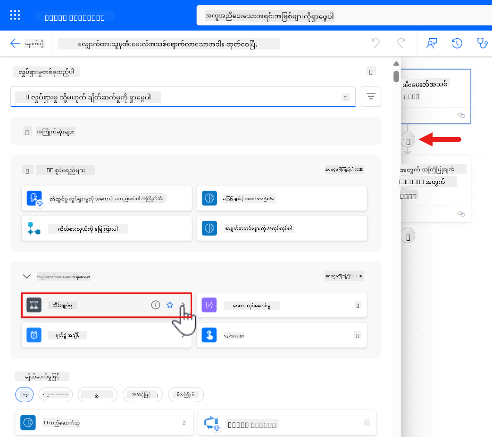

1. **Condition** action ကိုရွေးပါ။


1. Attachment ရဲ့ file type က .PDF ဖြစ်မဖြစ်စစ်ဆေးဖို့ condition ကို configure လုပ်ပါမယ်။ **Choose a value** field မှာ **lightning bolt icon** သို့မဟုတ် **fx icon** ကိုညာဘက်မှာရွေးပါ။

1. **Search** field မှာ အောက်ပါကိုရိုက်ပါ၊

```text
content type
```

1. Trigger မှ **Attachments Content-Type** parameter ကိုရွေးပါ။

1. Dynamic content input ကို action ရဲ့ **Id** parameter ထဲထည့်ဖို့ **Add** ကိုရွေးပါ။

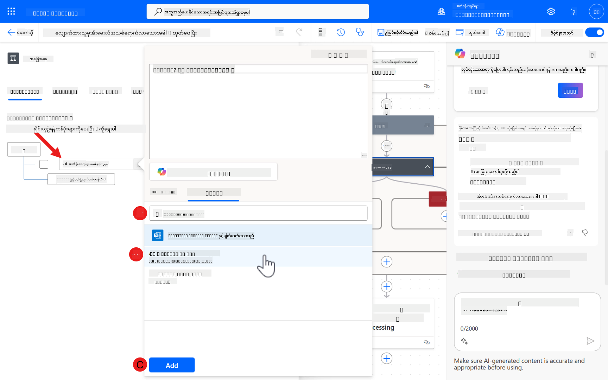

1. **For each** action အလိုအလျောက်ပေါ်လာတာကို သတိထားမိလား။

**For each** action ကိုရွေးပါ။ ဒီ action က email ရဲ့ attachment တစ်ခုချင်းစီကို loop လုပ်တာကို ကိုယ်စားပြုပါတယ်၊ Trigger မှ **Attachments Content-Type** parameter က attachment တစ်ခုချင်းစီနဲ့ဆက်စပ်နေပါတယ်။

အောက်မှာ array ဖြစ်ပြီး **For each** action ကို **Condition** action မှာ **Attachments Content-Type** parameter ကိုရွေးတဲ့အခါ အလိုအလျောက်ထည့်လိုက်တာပါ။

ပိုမိုလေ့လာချင်ရင် အောက်ပါ learning block ကိုဖွင့်ပါ။

??? info "Additional Learning: For each action automatically appearing"

🤔 **"Apply to each" သို့မဟုတ် "For each" အလိုအလျောက်ပေါ်လာတာဘာလဲ?**

Dynamic content (parameter) တစ်ခုကိုရွေးတဲ့အခါ - ဥပမာ attachment, email, rows စတဲ့ list သို့မဟုတ် array ကို ကိုယ်စားပြုတဲ့ parameter - Power Automate က item တစ်ခုချင်းစီကို process လုပ်ချင်တယ်လို့သိပါတယ်။

ဒီလိုလုပ်ဖို့ Power Automate က action အပေါ်မှာ **“Apply to each”** (သို့မဟုတ် **For each**) loop ကို အလိုအလျောက်ထည့်လိုက်ပါတယ်။ ဒါက list တစ်ခုလုံးကိုတစ်ခါတည်း process လုပ်တာမဟုတ်ဘဲ item တစ်ခုချင်းစီအတွက် action ကို run လုပ်စေပါတယ်။

🦋 **ဥပမာ**

- Attachment list (array) ကိုရွေးပြီး single file ကို process လုပ်ဖို့ action တစ်ခုကိုသုံးတဲ့အခါ Power Automate က action ကို **"Apply to each"** (သို့မဟုတ် **For each**) loop ထဲမှာထည့်လိုက်ပါတယ်။
- ဒီလိုနဲ့ action က attachment တစ်ခုချင်းစီအတွက် run လုပ်ပါမယ်။

💡 **Key Points**

- **Automatic:** Loop က item collection တစ်ခုချင်းစီကို process လုပ်ဖို့ အလိုအလျောက်ပေါ်လာပါတယ်။
- **Prevents errors:** Loop မပါဘဲ item များစွာကိုတစ်ခါတည်း handle လုပ်ဖို့ action ကို run လုပ်ရင် error ဖြစ်နိုင်ပါတယ်။
- **Visual cue:** Loop က list ရဲ့ item တစ်ခုချင်းစီအတွက် action ကို repeat လုပ်မယ်ဆိုတာကို visual အနေနဲ့ပြသပါတယ်။

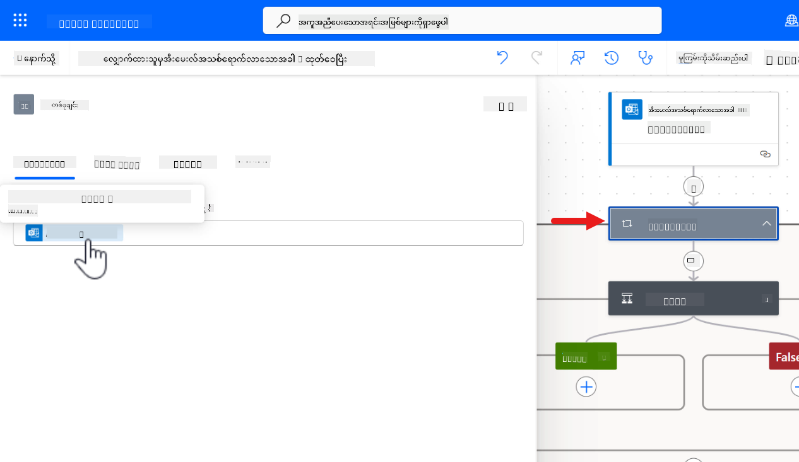

1. အခြား **Choose a value** field မှာ အောက်ပါကိုရိုက်ပါ၊

```text
application/pdf
```

ဒီလိုနဲ့ file attachment တစ်ခုချင်းစီအတွက် file extension format က .PDF ဖြစ်မဖြစ်စစ်ဆေးပါမယ်။


1. **True** path ကို configure လုပ်ပြီး email က file ကို extract လုပ်ပြီး **Resume** Dataverse table ထဲကို upload လုပ်ပါမယ်။

**True** path အောက်မှာ action အသစ်တစ်ခုထည့်ပြီး `html to text` ကိုရှာပါ။ **Html to text** action ကိုရွေးပါ။

ပိုမိုလေ့လာချင်ရင် **Html to text** action အကြောင်း learning block ကိုဖွင့်ပါ။

??? info "Additional Learning: Html to text action"

🤔 **"HTML to text" Action ဆိုတာဘာလဲ?**

Power Automate ရဲ့ **HTML to text** action က HTML format content ကို plain text အဖြစ်ပြောင်းဖို့အသုံးပြုပါတယ်။ HTML tags ပါတဲ့ data (ဥပမာ email, web content, API response) ကို readable text အဖြစ် extract လုပ်ချင်တဲ့အခါ အသုံးဝင်ပါတယ်။

⚙️ **ဘယ်လိုအလုပ်လုပ်သလဲ?**

- **Input:** HTML content string (ဥပမာ email body) ကိုထည့်ပါ။
- **Output:** HTML tags အားလုံးကိုဖယ်ရှားပြီး plain text ကိုပေးပါမယ်။

👍🏻 **ဘယ်အခါအသုံးပြုသင့်သလဲ?**

- HTML tags ပါတဲ့ email, web page, API response က readable text ကို extract လုပ်ချင်တဲ့အခါ။
- HTML format ကို support မလုပ်တဲ့ systems (ဥပမာ SMS, Teams messages, databases) ကို content ပို့မယ့်အခါ။
- Data cleaning သို့မဟုတ် analysis အတွက် content ကိုပြင်ဆင်ချင်တဲ့အခါ။

🔭 **ဘယ်မှာရှာနိုင်မလဲ?**

- Power Automate ရဲ့ Agent Flows မှာ `HTML to text` action ကိုရှာပါ။ **Data Operations** connector အောက်မှာရှိပါတယ်။

💡 **Key Points**

- HTML tags အားလုံးကိုဖယ်ရှားပြီး text ကိုပေးပါမယ်။
- Scripts/styles ကို interpret သို့မဟုတ် execute မလုပ်ပါဘူး - tags ကိုဖယ်ရှားပါမယ်။
- Data cleaning နဲ့ plain-text outputs အတွက်အသုံးဝင်ပါတယ်။

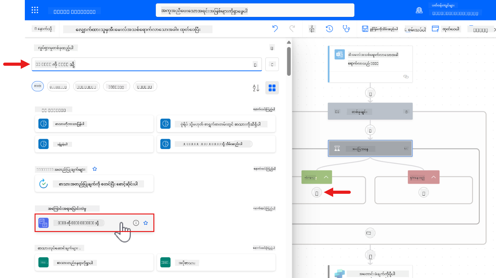

1. **Html to text** action အတွက် connection reference အသစ်တစ်ခုဖန်တီးဖို့ **Add new** ကိုရွေးပါ။

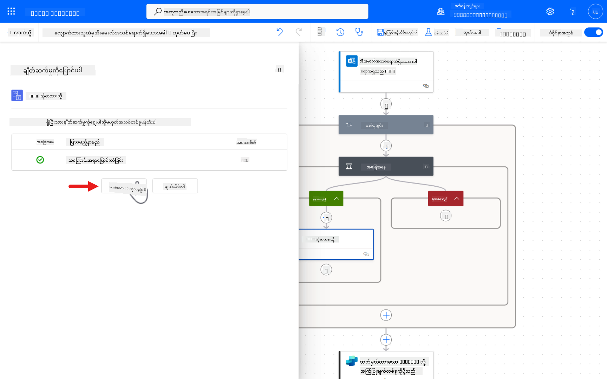

1. Action ကို configure လုပ်ပါမယ်။ Trigger မှ **Body** parameter ကိုထည့်ပါ။ **Content** field မှာ **lightning bolt icon** သို့မဟုတ် **fx icon** ကိုညာဘက်မှာရွေးပါ။

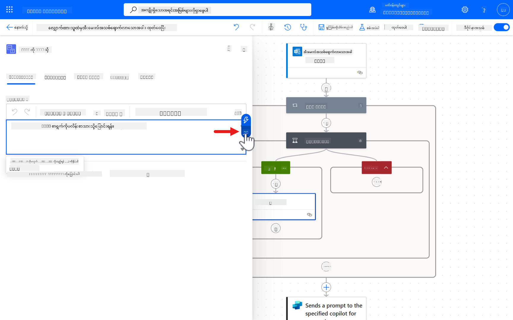

1. **Dynamic content** tab မှာ `body` ကိုရှာပြီး **Body** parameter ကိုရွေးပါ၊ **Add** ကိုရွေးပါ။

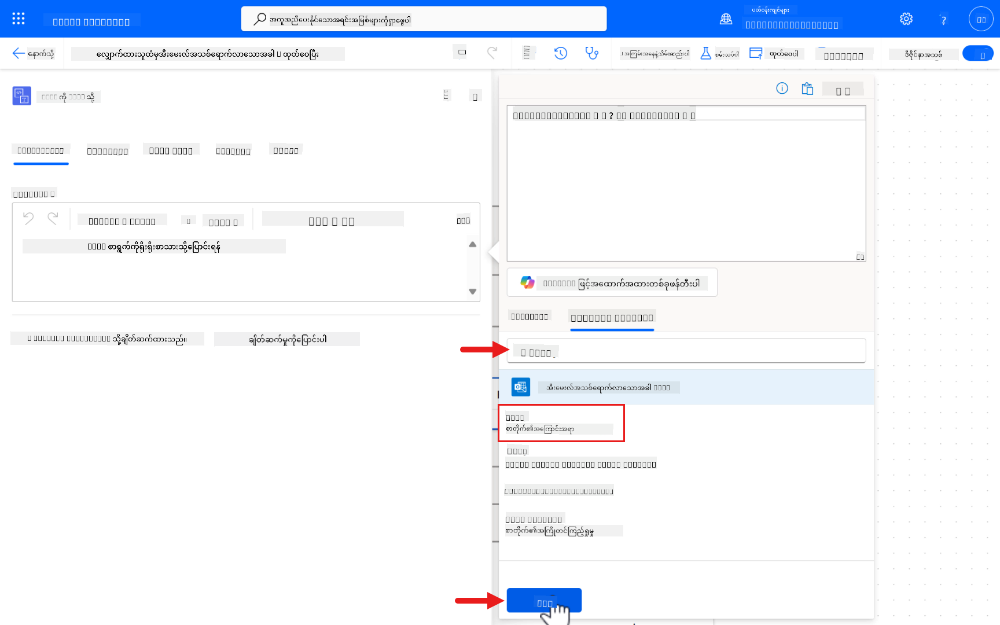

1. Action ကို configure လုပ်ပြီး panel ကိုပိတ်ဖို့ ဘယ်ဘက်ကိုညွှန်းနေတဲ့ angle brackets («) ကိုရွေးပါ။

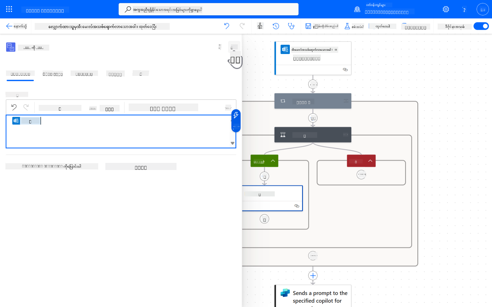

1. **Html to text** action အောက်မှာ **+ icon** ကိုရွေးပြီး action အသစ်ထည့်ပါ။ Panel ကို load လုပ်ပြီး actions တွေထည့်ပါ။ **Microsoft Dataverse** connector ကိုရွေးပါ။

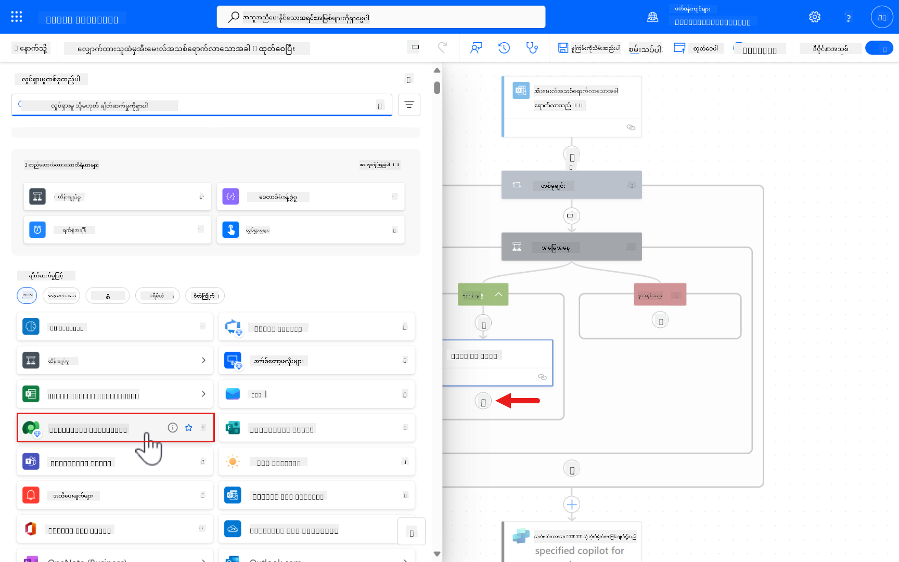

1. **Add a new row** action ကိုရွေးပါ။

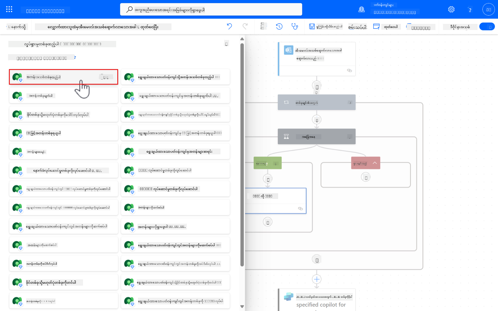

1. Action ကို rename လုပ်ဖို့ **Ellipsis (...)** ကိုရွေးပြီး အောက်ပါကို copy လုပ်ပြီး paste လုပ်ပါ၊

```text
Add a new Resume row
```

**Table name** parameter အတွက် `res` ကိုရှာပြီး **Resumes** table ကိုရွေးပါ။

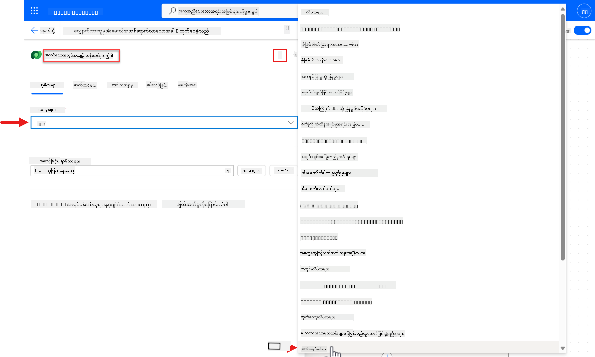

1. **Resume Title** field ကိုရွေးပြီး **lightning bolt icon** သို့မဟုတ် **fx icon** ကိုညာဘက်မှာရွေးပါ။

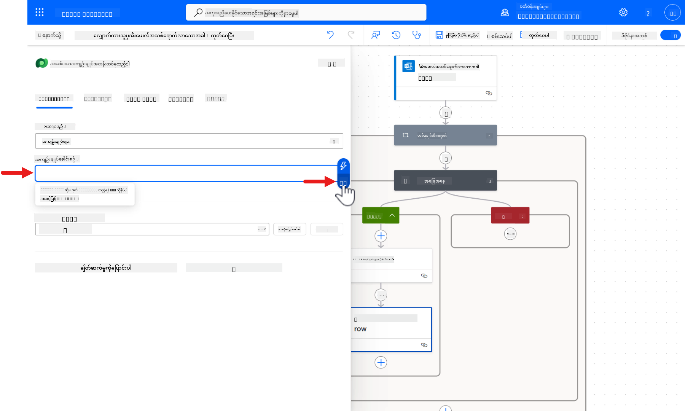

1. **Function tab** မှာ `item()` function ကိုအသုံးပြုတဲ့ expression ကိုရိုက်ပါ။

```text
item()?['name']
```

ပိုမိုလေ့လာချင်ရင် `item()` function အကြောင်း learning block ကိုဖွင့်ပါ။

??? info "Additional Learning: `item()` function"

🤔 **`item()` function ဆိုတာဘာလဲ?**

- **Apply to each** action ကိုအသုံးပြုတဲ့အခါ Power Automate က collection (array) ထဲက element တစ်ခုချင်းစီကို process လုပ်ပါတယ်။
- Loop သို့ array operation ထဲမှာ `item()` function က current item ကိုပြန်ပေးပါတယ်။

⚙️ **ဘယ်လိုအလုပ်လုပ်သလဲ?**

- Loop ထဲမှာ `item()` က current element ကိုပြန်ပေးပါတယ်။

📌 **ဘယ်မှာအသုံးပြုသင့်သလဲ?**

- **Apply to each:** current item ရဲ့ properties ကို access လုပ်ဖို့။
- **Select:** array ထဲက item တစ်ခုချင်းစီကို transform လုပ်ဖို့။
- **Filter array:** current item ကိုစစ်ဆေးဖို့။

🦋 **ဥပမာ**

- Loop ထဲမှာ expression:
```text
item()?['Email']
```
- Current item ရဲ့ `Email` property ကိုရယူပါမယ်။

💡 **Key Points**

- `item()` function က loop သို့ array operation ထဲမှာ current item ကိုကိုယ်စားပြုပါတယ်။
- Nested loops တွေမှာ `items('LoopName')` ကိုအသုံးပြုနိုင်ပါတယ်။

**Resume Title** parameter မှာ expression ကိုထည့်ဖို့ **Add** ကိုရွေးပါ။

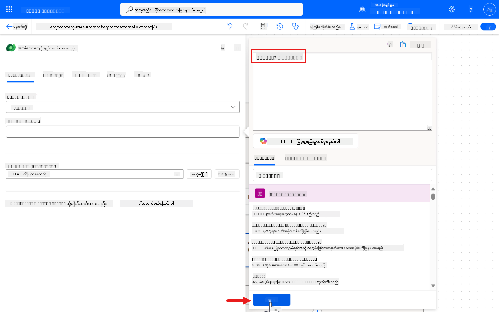

1. **Cover Letter** field ကို configure လုပ်ဖို့ **Show all** ကိုရွေးပါ၊ **lightning bolt icon** သို့မဟုတ် **fx icon** ကိုညာဘက်မှာရွေးပါ။

**Function tab** မှာ အောက်ပါ expression ကိုရိုက်ပါ၊

```text
if(greater(length(body('Html_to_text')), 2000), substring(body('Html_to_text'), 0, 2000), body('Html_to_text'))
```

ဒီ expression က **Html to text** action မှ text ရဲ့အရှည်က 2000 characters ထက်ပိုရင် ပထမ 2000 characters ကိုပေးပြီး၊ မဟုတ်ရင် text အပြည့်ကိုပေးပါမယ်။

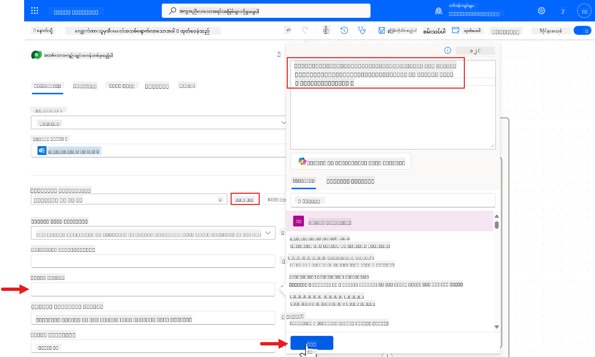

1. Expression ကို **Cover Letter** field မှာထည့်ပြီး configure လုပ်ပါ။

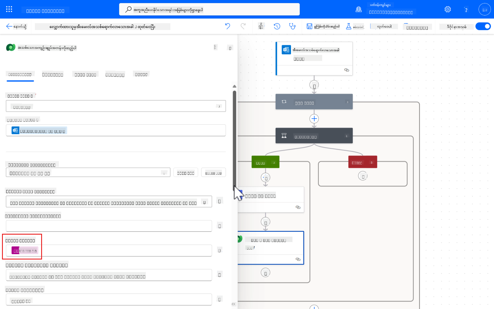

1. **Source Email Address** field အတွက် `from` ကိုရှာပြီး trigger မှ **From** parameter ကိုရွေးပါ၊ အဲဒါက email address value ပါ။

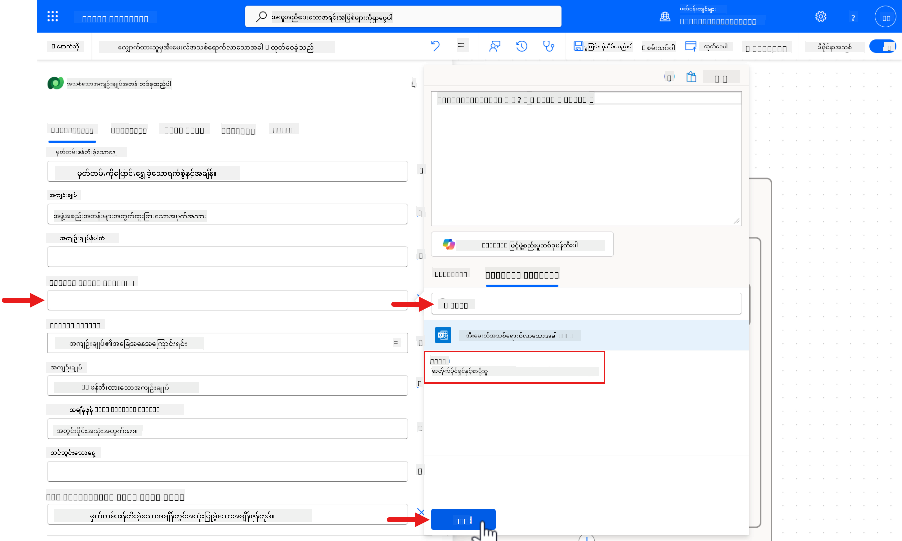

1. **Upload Date** field အတွက် **lightning bolt icon** သို့မဟုတ် **fx icon** ကိုညာဘက်မှာရွေးပါ။ **Function tab** မှာ `utcNow()` function ကိုအသုံးပြုတဲ့ expression ကိုရိုက်ပါ။

```text
utcNow()
```

ပိုမိုလေ့လာချင်ရင် `utcNow` function အကြောင်း learning block ကိုဖွင့်ပါ။

??? info "Additional Learning: `utcNow` function"

🤔 **`utcNow()` function ဆိုတာဘာလဲ?**

- Power Automate ရဲ့ `utcNow()` function က current date နဲ့ time ကို Coordinated Universal Time (UTC) အနေနဲ့ ISO 8601 format (ဥပမာ `2025-09-23T04:32:14Z`) အနေနဲ့ပြန်ပေးပါတယ်။

🦋 **ဥပမာ**

- Expression:
```text
concat('Report generated on ', utcnow())
```
- Output:
```text
Report generated on 2025-09-23T04:32:14Z
```

💡 **Key Points**

- `utcNow()` function က current date နဲ့ time ကို UTC format အနေနဲ့ပြန်ပေးပါတယ်။
- **အကြောင်းအရာများ (input parameters) မလိုအပ်ပါ:** ယခုအချိန် UTC timestamp ကို အမြဲပေးပါသည်။
   - **အသုံးပြုမှုများ**
       - log များ သို့မဟုတ် ဖိုင်နာမည်များတွင် timestamp ထည့်ခြင်း
       - ယခုအချိန်ကို အခြားရက်စွဲများနှင့် နှိုင်းယှဉ်ခြင်း
       - အချိန်အခြေခံ အခြေအနေများ သို့မဟုတ် အချိန်ဇယားများ

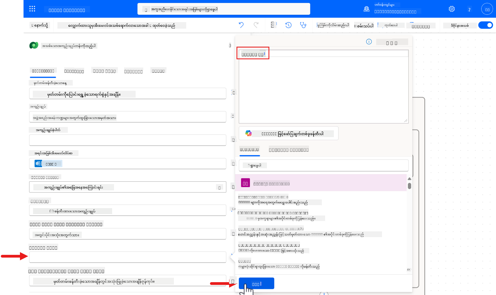

1. **Add a new Resume row** လုပ်ဆောင်ချက်ကို ပြင်ဆင်ပြီးပါပြီ။ အခု panel ကို ပိတ်ပြီး ထွက်ပါ။

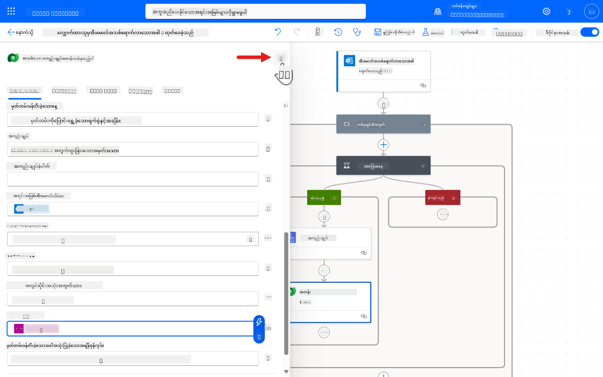

1. **Add a new Resume row** လုပ်ဆောင်ချက်အောက်မှာ **+ icon** ကို ရွေးပြီး လုပ်ဆောင်ချက်များ ထည့်ရန် panel ကို ဖွင့်ပါ။ **Microsoft Dataverse** connector ကို ထပ်မံရွေးပါ။

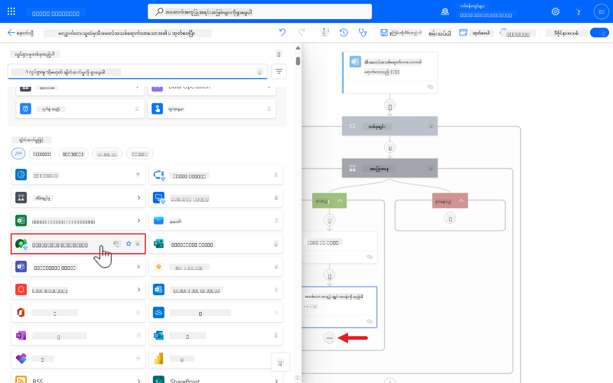

1. **Upload a file or an image** လုပ်ဆောင်ချက်ကို ရွေးပါ။

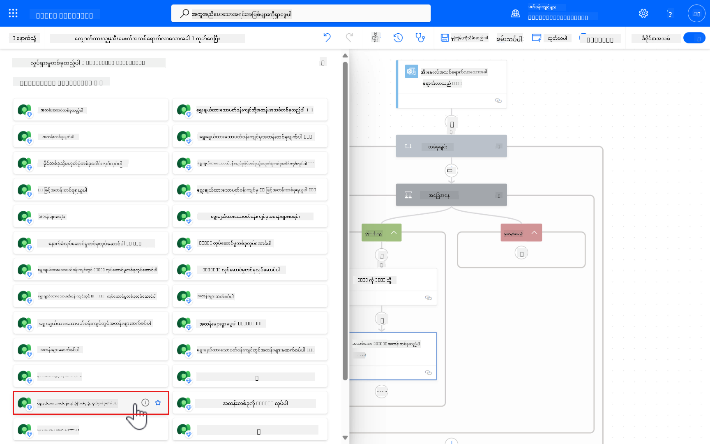

1. **Ellipsis (...)** ကိုရွေးပြီး လုပ်ဆောင်ချက်ကို အမည်ပြောင်းပါ။ အောက်ပါအတိုင်း အမည်ကို ကူးယူပြီး paste လုပ်ပါ။

```text
Upload Resume File
```

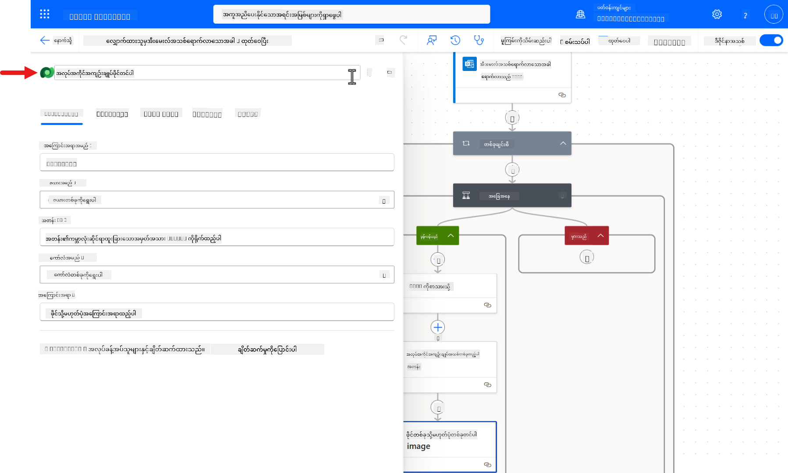

1. **Content name** field ကို ရွေးပြီး **lightning bolt icon** သို့မဟုတ် **fx icon** ကိုညာဘက်တွင် ရွေးပါ။

**Function tab** တွင် အောက်ပါ expression ကို ထည့်ပါ။ ၎င်းသည် `item()` function ကို အသုံးပြုပြီး ယခု item (attachment file) ၏ `name` property ကို ရယူပါသည်။

```text
item()?['name']
```

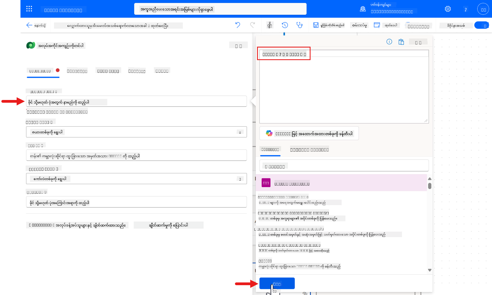

1. **Table name** parameter အတွက် `res` ကို ရှာပြီး **Resumes** table ကို ရွေးပါ။

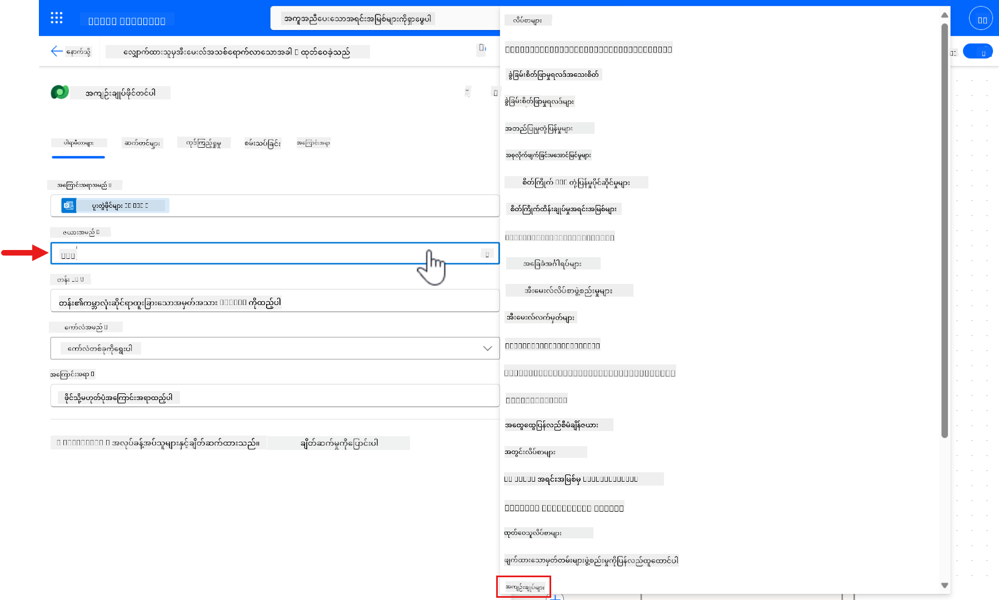

1. **Row ID** field ကို ရွေးပြီး **lightning bolt icon** သို့မဟုတ် **fx icon** ကိုညာဘက်တွင် ရွေးပါ။

`ID` ကို ရှာပြီး _Add a new row_ Dataverse လုပ်ဆောင်ချက်မှ **Resume** parameter ကို ရွေးပါ။ ၎င်းသည် PDF ဖိုင်ကို upload လုပ်ရန် row ID value ကို ပါဝင်သည်။

**Add** ကို ရွေးပါ။

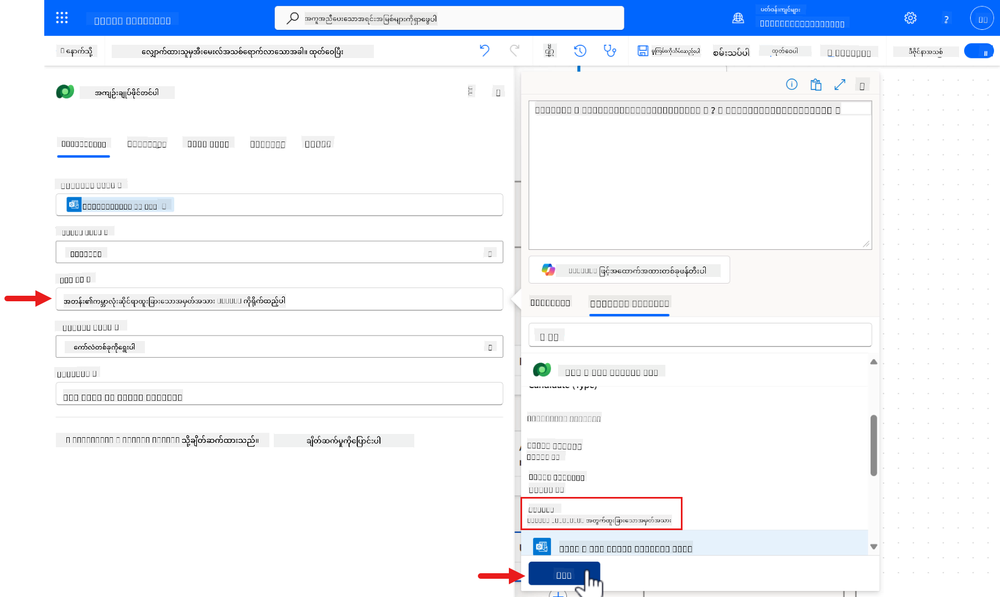

1. **Column name** field ကို ရွေးပြီး **Resume PDF** option ကို ရွေးပါ။


1. **Content** field ကို ရွေးပြီး **lightning bolt icon** သို့မဟုတ် **fx icon** ကိုညာဘက်တွင် ရွေးပါ။

**Function tab** တွင် အောက်ပါ expression ကို ထည့်ပါ။ ၎င်းသည် `item()` function ကို အသုံးပြုပြီး ယခု item (attachment file) ၏ `contentBytes` property ကို ရယူပါသည်။ `contentBytes` သည် ဖိုင် သို့မဟုတ် attachment ၏ raw binary data ဖြစ်ပြီး Base64 string အဖြစ် encode လုပ်ထားသည်။

```text
item()?['contentBytes']
```

1. လုပ်ဆောင်ချက်ကို ပြင်ဆင်ပြီးပါပြီ။ panel ကို ပိတ်ရန် ဘယ်ဘက်ကို ဦးတည်ထားသော angle brackets («) ကို ရွေးပါ။

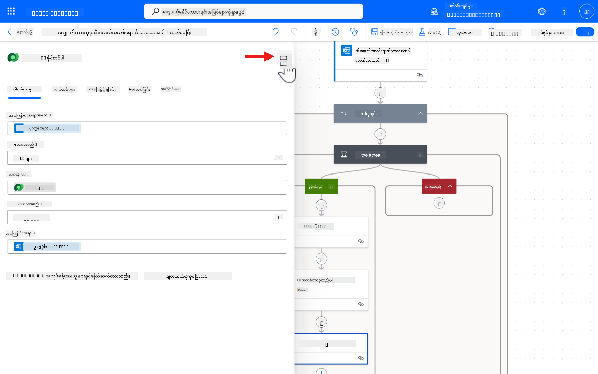

1. **Sends a prompt to the specified copilot for processing** ကို ရွေးပြီး **Upload Resume File** လုပ်ဆောင်ချက်အောက်တွင် _True_ path တွင် drag and drop လုပ်ပါ။

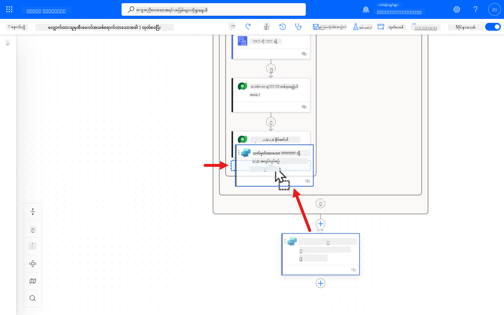

1. **Sends a prompt to the specified copilot for processing** ကို ရွေးပြီး ပြင်ဆင်ပါ။

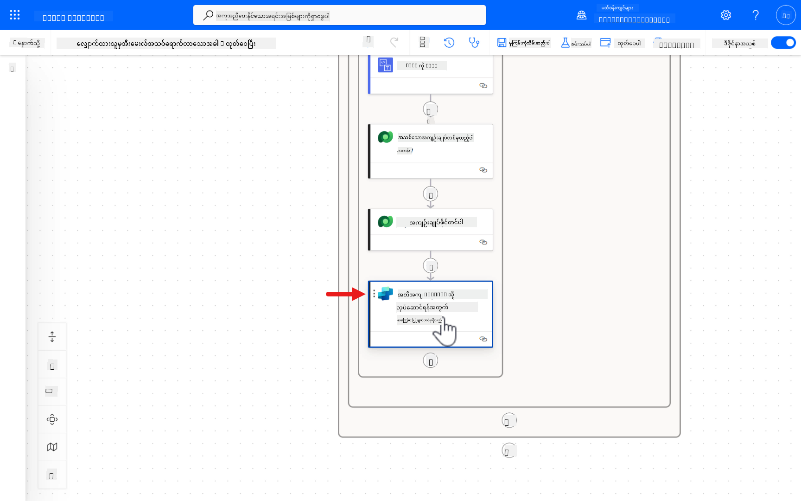

1. **Body/message** field တွင် field content အားလုံးကို ရွေးပြီး ဖျက်ပါ။

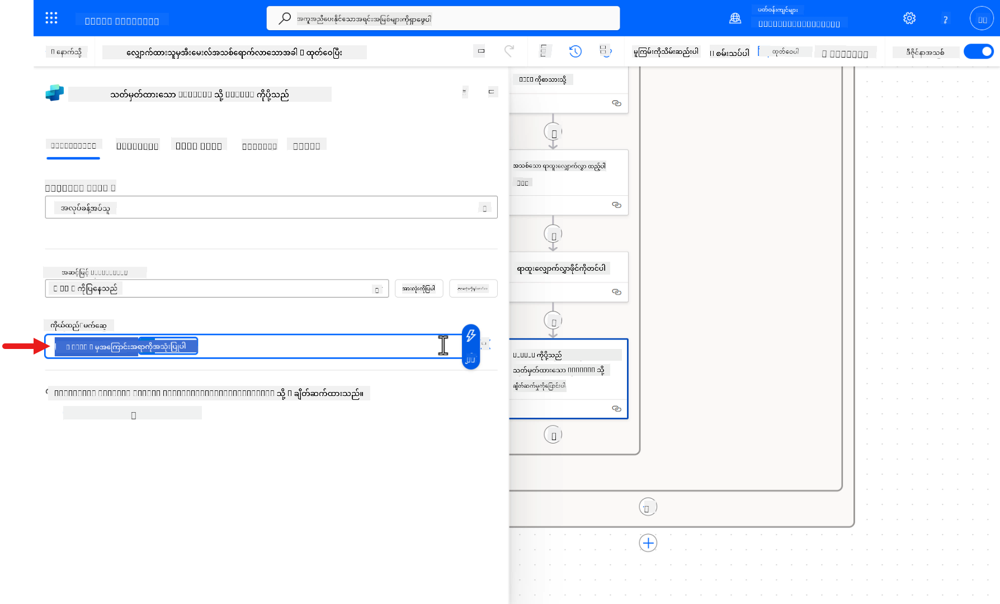

1. အောက်ပါစာသားကို **Body/message** field တွင် ကူးယူပြီး paste လုပ်ပါ။ `RESUME ID PLACEHOLDER` ကို highlight လုပ်ပါ။

```text
Send [ResumeId (text)] = "RESUME ID PLACEHOLDER" and [ResumeTitle (text_1)] = "RESUME TITLE PLACEHOLDER" and [ResumeNumber (text_2)]= "RESUME NUMBER PLACEHOLDER" to the Tool "Notify Teams Applicant channel" in the child agent "Application Intake Agent"
```

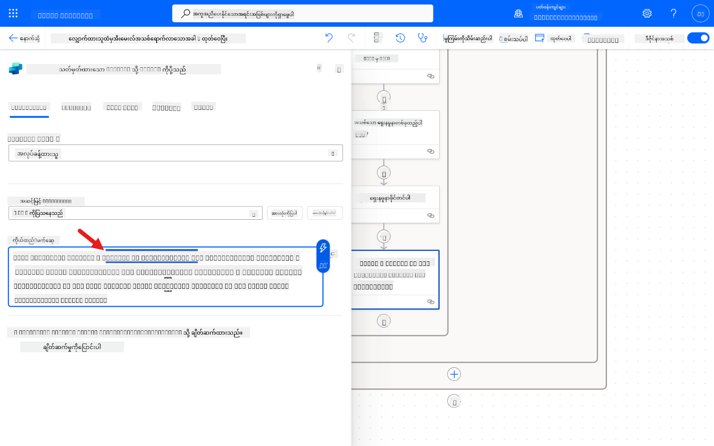

1. **lightning bolt icon** သို့မဟုတ် **fx icon** ကိုညာဘက်တွင် ရွေးပါ။

`resume` ကို ရှာပြီး _Add a new row Dataverse_ လုပ်ဆောင်ချက်မှ **Resume** parameter ကို ရွေးပါ။ ၎င်းသည် Resume row တွင် ဖန်တီးထားသော `ID` value ကို ပါဝင်သည်။

**Add** ကို ရွေးပါ။

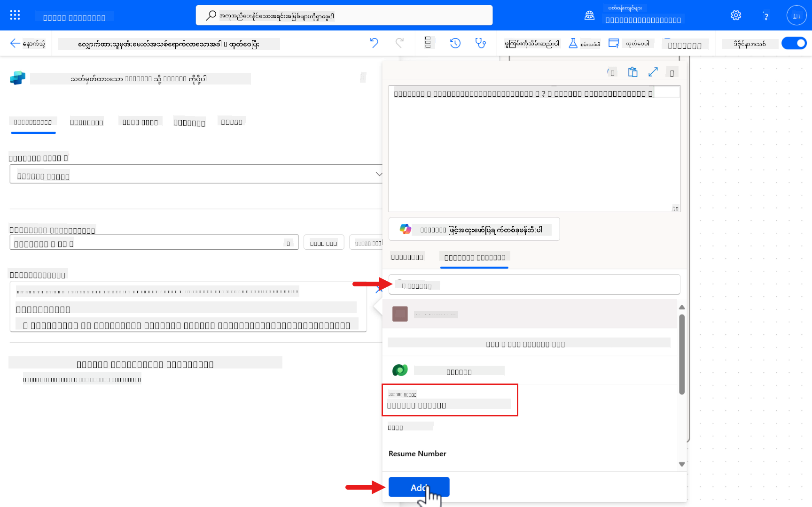

1. `RESUME TITLE PLACEHOLDER` ကို highlight လုပ်ပါ။ **lightning bolt icon** သို့မဟုတ် **fx icon** ကိုညာဘက်တွင် ရွေးပါ။

`title` ကို ရှာပြီး _Add a new row Dataverse_ လုပ်ဆောင်ချက်မှ **Resume Title** parameter ကို ရွေးပါ။ ၎င်းသည် Resume row တွင် ဖန်တီးထားသော `resume title` value ကို ပါဝင်သည်။

**Add** ကို ရွေးပါ။


1. `RESUME NUMBER PLACEHOLDER` ကို highlight လုပ်ပါ။ **lightning bolt icon** သို့မဟုတ် **fx icon** ကိုညာဘက်တွင် ရွေးပါ။

`resume number` ကို ရှာပြီး _Add a new row Dataverse_ လုပ်ဆောင်ချက်မှ **Resume Number** parameter ကို ရွေးပါ။ ၎င်းသည် Resume row တွင် ဖန်တီးထားသော `Resume Number` value ကို ပါဝင်သည်။

**Add** ကို ရွေးပါ။

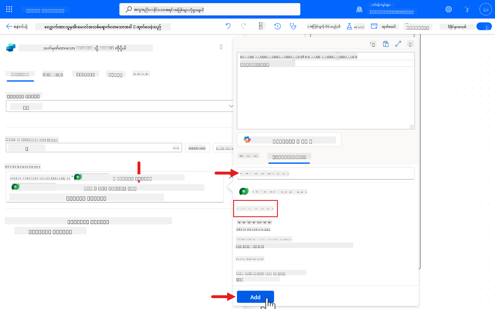

1. လုပ်ဆောင်ချက်ကို ပြင်ဆင်ပြီးပါပြီ။ 🙌🏻 အရမ်းကောင်းပါတယ်! အခု **Save draft** ကို ရွေးပြီး event trigger flow ကို save လုပ်ပါ။

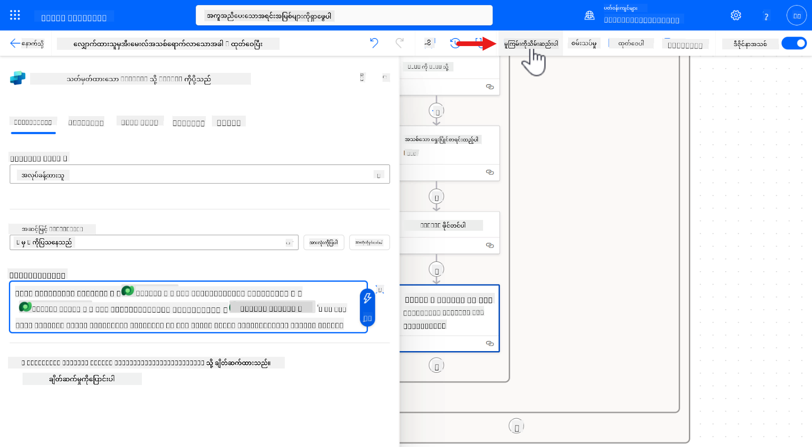

1. အခု agent flow ၏ အသေးစိတ်ကို ပြင်ဆင်ရန် **Back** ကို ရွေးပါ။

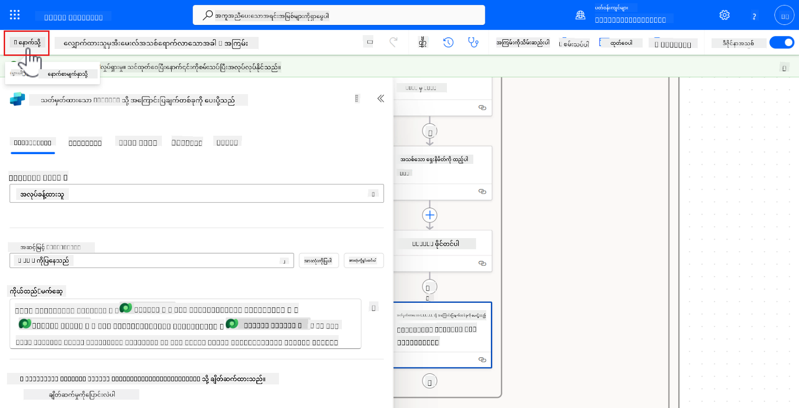

1. **Details** အပိုင်းတွင် **Edit** ကို ရွေးပြီး **Plan** ကို **Copilot Studio** option သို့ update လုပ်ပါ။

**Save** ကို ရွေးပါ။

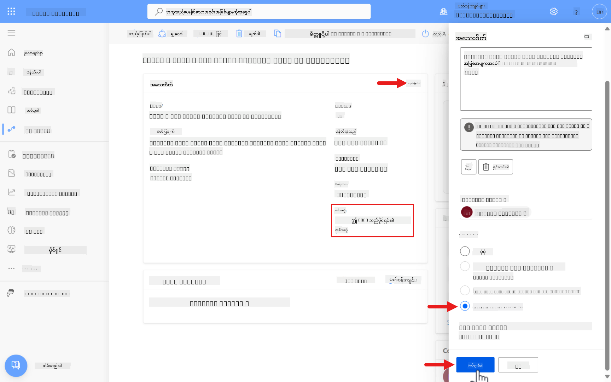

1. Copilot Studio plan သို့ ပြောင်းရန် အတည်ပြုရန် modal တစ်ခု ပေါ်လာပါမည်။ **Confirm** ကို ရွေးပါ။

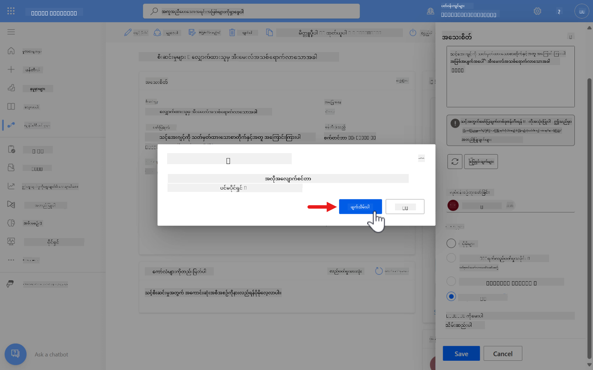

1. Plan ကို **Copilot Studio** သို့ update လုပ်ပြီးပါပြီ။ Agent ၏ event trigger flow ကို publish လုပ်ရန် **Edit** ကို ရွေးပါ။

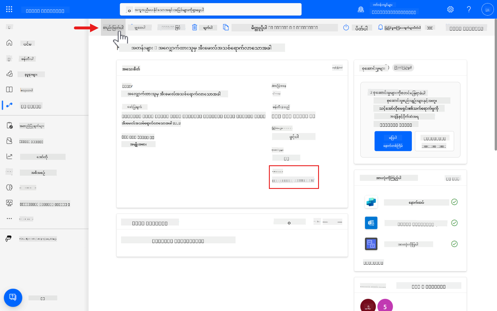

1. **Publish** ကို ရွေးပါ။

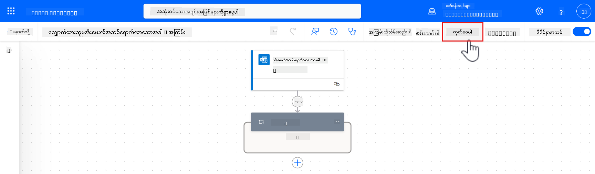

ဟူရေး! Event trigger flow ကို Publish လုပ်ပြီးပါပြီ 😃

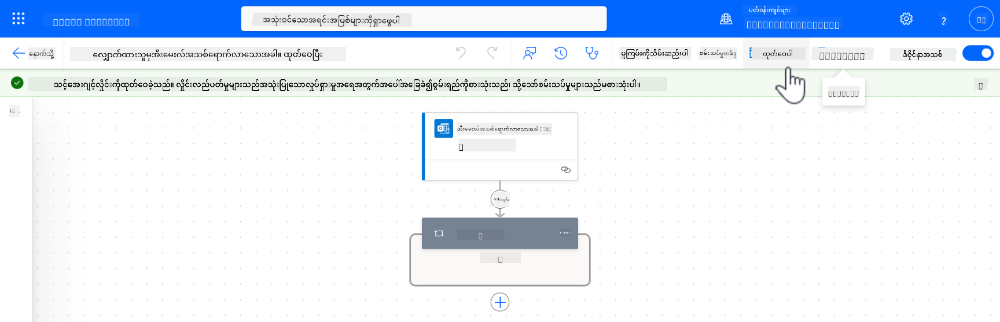

အခု **Intake Application Agent** ဆိုသော child agent မှ ခေါ်ယူမည့် agent flow အသစ်တစ်ခု ဖန်တီးလိုက်ကြစို့။

### Lab 3.2 - Adaptive card ကို အသုံးပြု၍ Teams channel ကို အသိပေးခြင်း

အခု event trigger မှ ပေးပို့သော values ကို အသုံးပြု၍ Teams channel တွင် adaptive card ကို post လုပ်မည့် **Intake Application Agent** ဆိုသော child agent အတွက် agent flow အသစ်တစ်ခု ဖန်တီးမည်ဖြစ်သည်။ ၎င်း adaptive card သည် PDF ကို auto-upload လုပ်ထားသောအကြောင်း HR recruitment အဖွဲ့ကို အသိပေးမည်ဖြစ်ပြီး ၎င်းကို ပြန်လည်သုံးသပ်နိုင်ရန် ဖြစ်သည်။

စတင်လိုက်ကြစို့!

1. **Hiring Agent** တွင် **Agents** tab ကို ရွေးပြီး **Application Intake Agent** ကို ရွေးပါ။

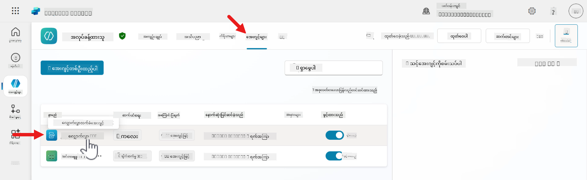

1. **Tools** အပိုင်းကို အောက်သို့ scroll လုပ်ပြီး **+ Add** ကို ရွေးပါ။

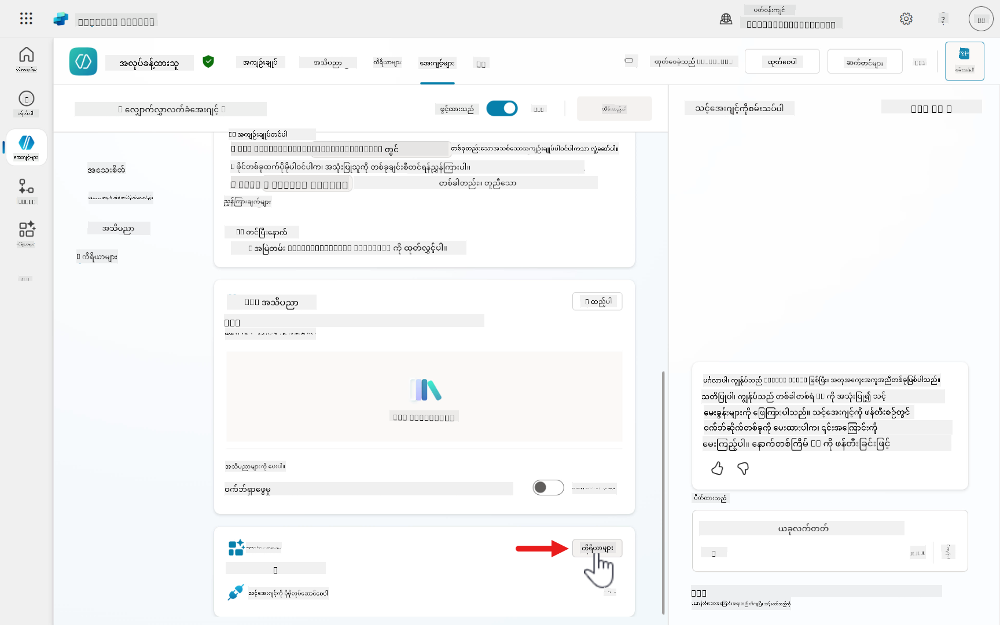

1. **Add tool** modal ပေါ်လာပါမည်။ **+ New tool** ကို ရွေးပါ။

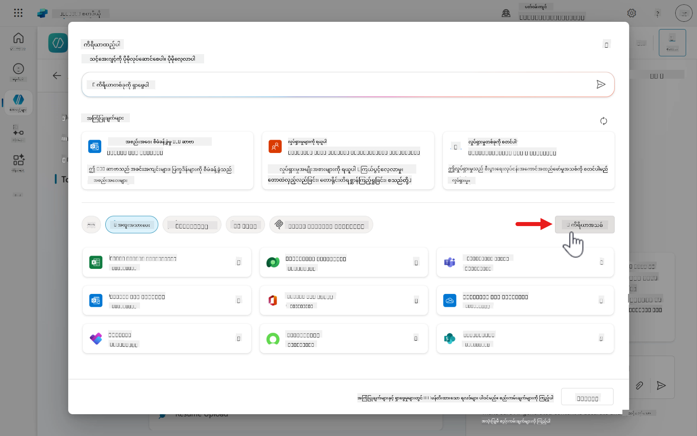

1. **Agent flow** ကို ရွေးပါ။

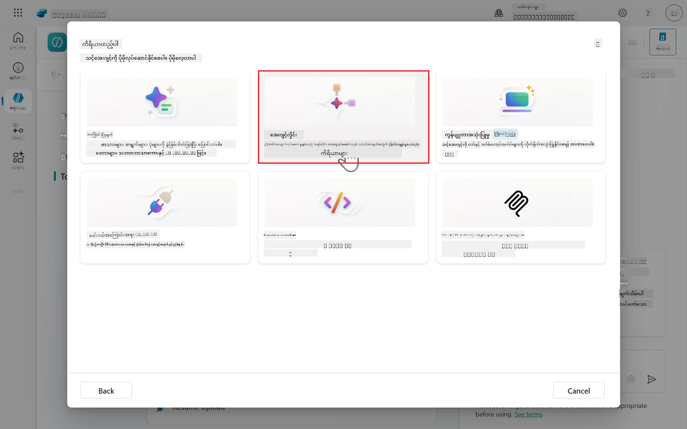

1. **agent flow designer** ပေါ်လာပါမည်။ **When an agent calls the flow** trigger တွင် **+ Add an input** ကို ရွေးပါ။

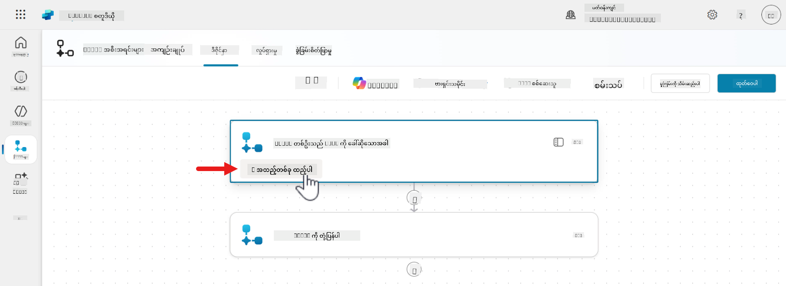

1. User input အမျိုးအစားအဖြစ် **Text** ကို ရွေးပါ။

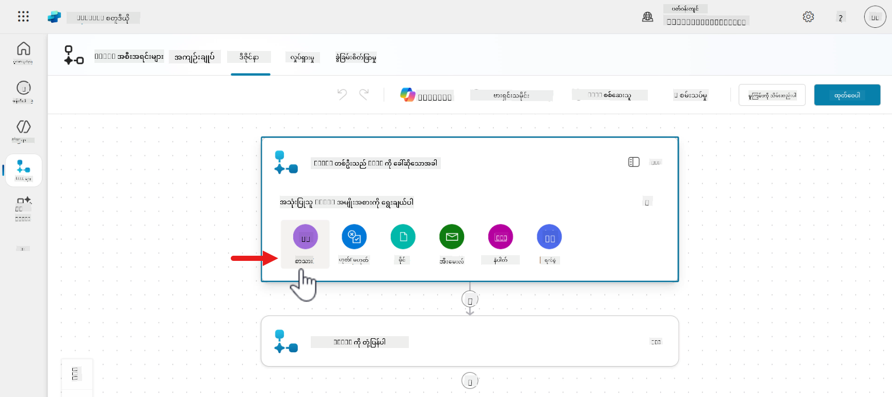

1. Input text field တွင် အောက်ပါအတိုင်း input parameter name ကို ကူးယူပြီး paste လုပ်ပါ။

```text
ResumeId
```

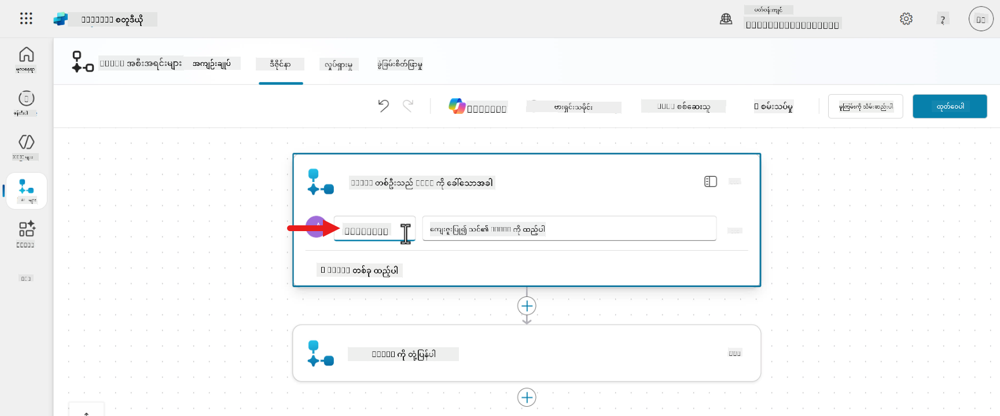

1. ဒုတိယ text input ကို ထပ်မံထည့်ပါ။ Input parameter name အဖြစ် အောက်ပါအတိုင်း ကူးယူပြီး paste လုပ်ပါ။

```text
ResumeTitle
```

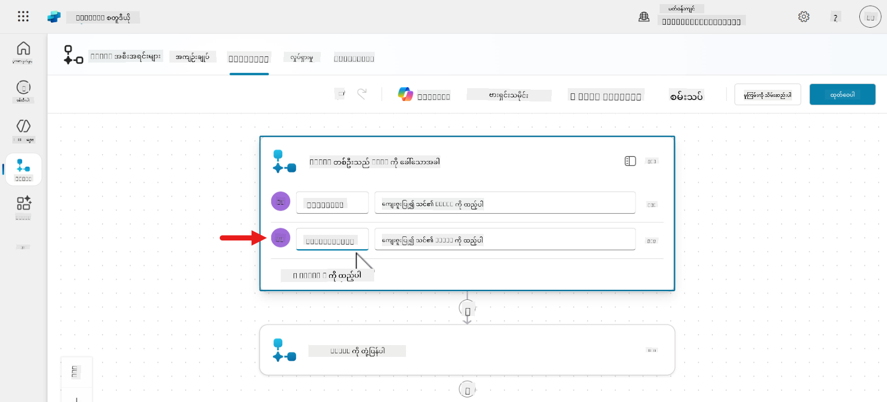

1. တတိယ text input ကို ထပ်မံထည့်ပါ။ Input parameter name အဖြစ် အောက်ပါအတိုင်း ကူးယူပြီး paste လုပ်ပါ။

```text
ResumeNumber
```

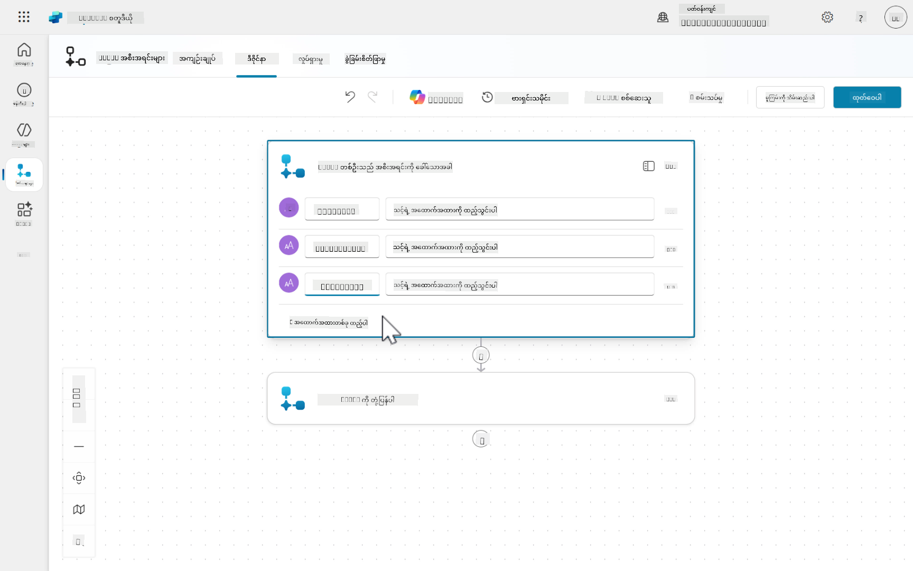

1. [Recruit](../../recruit/08-add-adaptive-card/README.md#81-create-a-new-topic-with-an-adaptive-card-for-user-to-submit-their-request) တွင် Topic အတွင်း adaptive card ကို ထည့်ခဲ့သလို၊ အခု agent flow အတွင်း adaptive card ကို ထည့်မည်ဖြစ်သည်။ Agent flow အတွင်း Teams channel တွင် adaptive card ကို post လုပ်မည့် action တစ်ခု ထည့်လိုက်ပါ။

Trigger အောက်တွင် **+ icon** ကို ရွေးပါ။

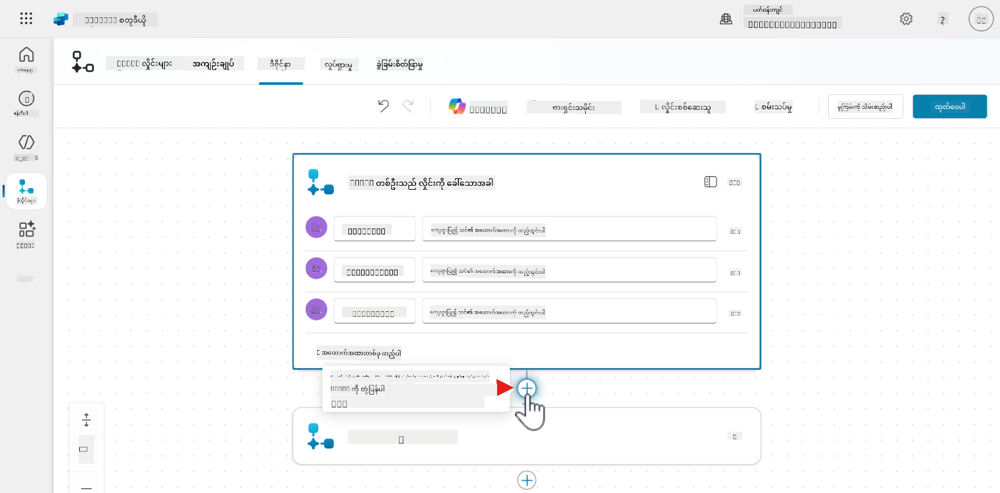

1. **Post card in a chat or channel** လုပ်ဆောင်ချက်ကို ရွေးပါ။

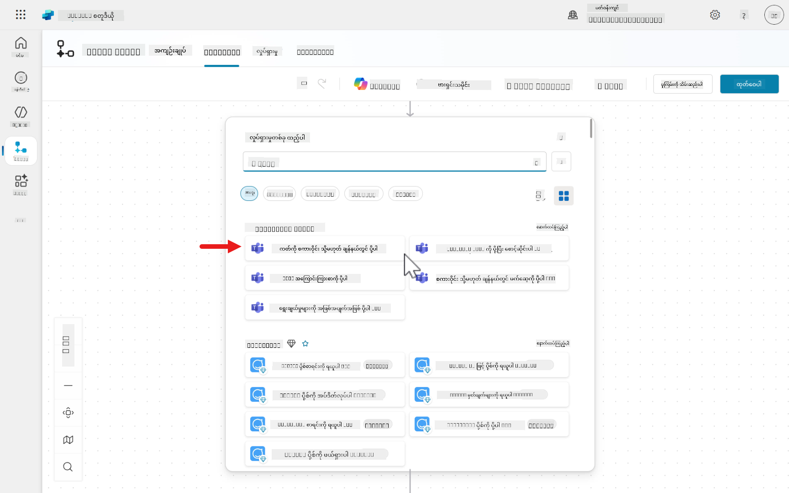

1. Microsoft Teams သို့ connection reference တစ်ခုကို သင့် account ဖြင့် ဖန်တီးရန် လိုအပ်ပါသည်။ **Sign in** ကို ရွေးပါ။

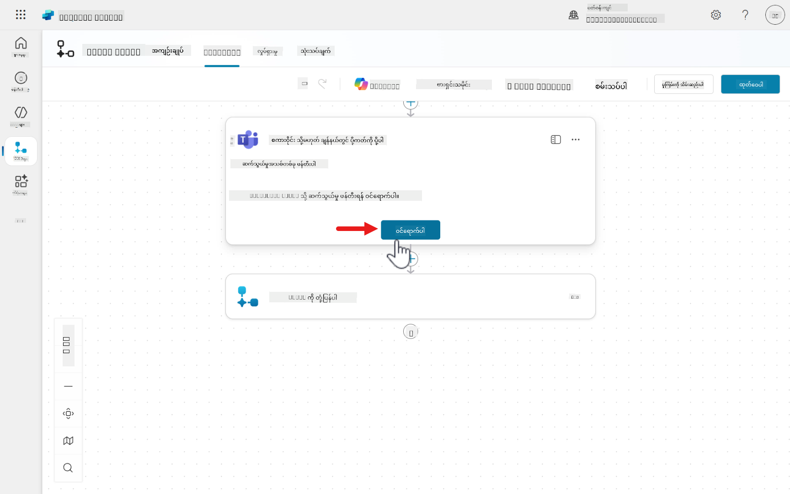

1. သင့် account ကို ရွေးပြီး **Allow access** ကို ရွေးပါ။

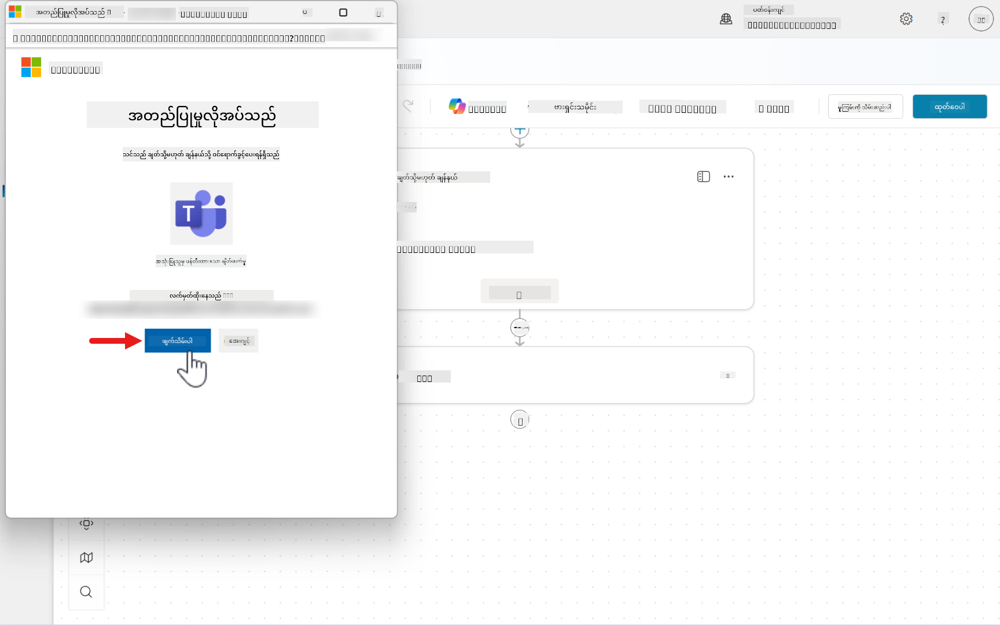

1. အောက်ပါ input parameters အတွက် -

| Parameter | How to Set | Details |
|----------|------------|---------|
| **Post as** | Dropdown | `Flow bot` option ကို ရွေးပါ |
| **Post in** | Dropdown | `Channel` option ကို ရွေးပါ |
| **Team** | Dropdown | သင့် environment တွင် ရရှိနိုင်သော team ကို ရွေးပါ |
| **Channel** | Dropdown | သင့် environment တွင် ရရှိနိုင်သော channel ကို ရွေးပါ |

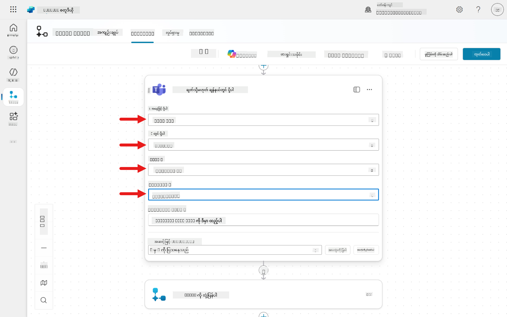

1. **Adaptive Card** field ကို ပြင်ဆင်ရန် **Adaptive Card** field ကို ရွေးပါ။

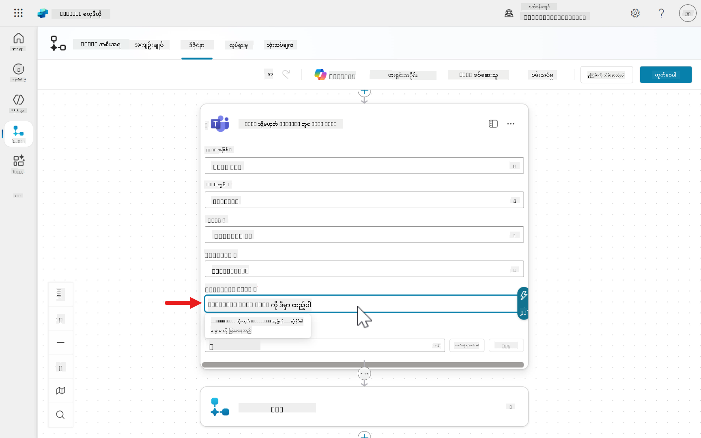

1. [Resume Table Updated JSON file](../../../../../docs/operative-preview/03-automate-triggers/assets/3.2_ResumeTableUpdated.json) ကို ဖွင့်ပြီး ၎င်း၏ အကြောင်းအရာအားလုံးကို ကူးယူပြီး Adaptive Card field တွင် paste လုပ်ပါ။

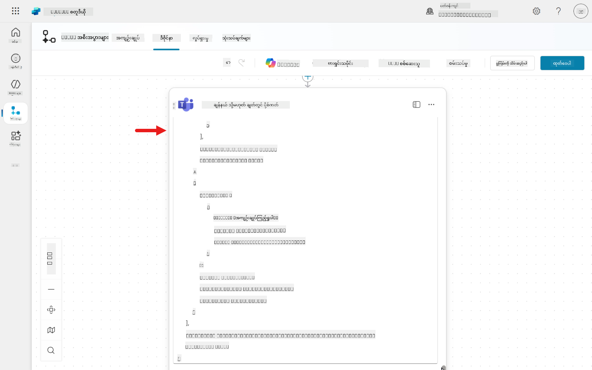

1. [Recruit](../../recruit/08-add-adaptive-card/README.md#81-create-a-new-topic-with-an-adaptive-card-for-user-to-submit-their-request) တွင် JSON payload တွင် existing values ကို dynamic content သို့ ပြောင်းခဲ့သလို၊ အခု JSON payload တွင် dynamic content သို့ ပြောင်းပါ။

ပထမဦးဆုံး `selectAction` property အတွင်း `url` property အတွက် URL ကို update လုပ်ပါ။ ၎င်း URL ကို **Hiring Hub** model-driven app တွင် Resumes system view URL ဖြင့် အစားထိုးပါ။ ၎င်းသည် Recruiter ကို Resumes system view သို့ redirect လုပ်ရန် ဖြစ်သည်။

URL value ကို highlight လုပ်ပြီး ဖျက်ပါ။

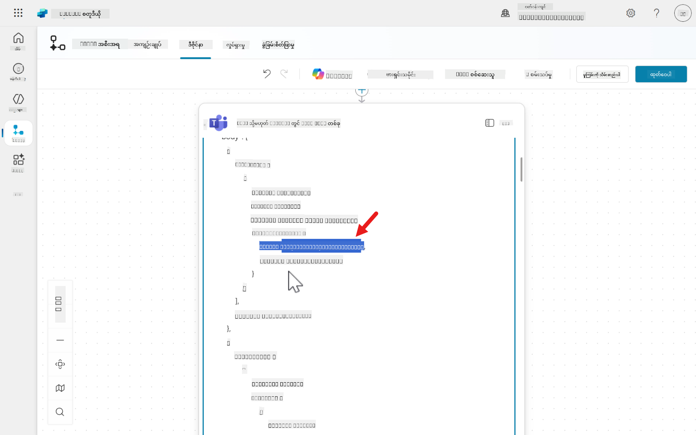

1. **Hiring Hub** model-driven app တွင် **Resumes** system view သို့ left hand side menu ကို အသုံးပြု၍ သွားပါ။ URL ကို ကူးယူပြီး agent flow တွင် ပြန်သွားပြီး `selectAction` property အတွင်း **url** property တွင် paste လုပ်ပါ။

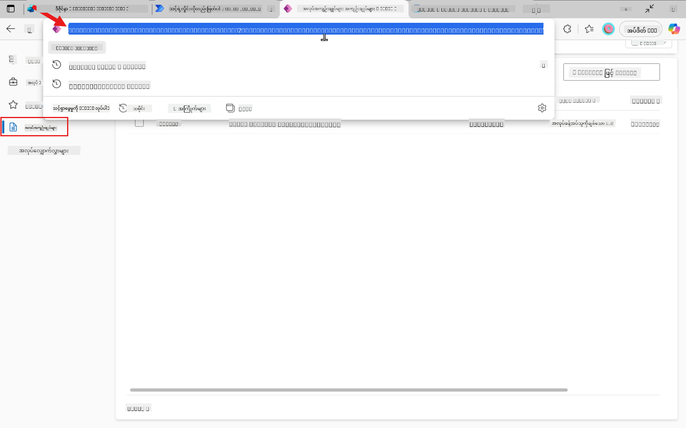
1. သင်သည် အောက်ပါအရာများကို မြင်ရမည်ဖြစ်ပြီး အဝါရောင်ဖြင့် အထောက်အထားပြထားသော **Hiring Hub** model-driven app ၏ ပတ်ဝန်းကျင်အသေးစိတ်ကို တွေ့ရမည်။

     | Parameter | Value | Explanation |
     |----------|------------|---------|
     | **Organization URI** | GUID | Dataverse/Dynamics 365 ပတ်ဝန်းကျင်၏ အဖွဲ့ URL |
     | **appid** | GUID | သတ်မှတ်ထားသော model-driven app ကို ဖွင့်ရန် appid သို့မဟုတ် appname query parameter ကို အသုံးပြုသည်။ ဤကိစ္စတွင် appid ကို အသုံးပြုသည် |
     | **viewid** | GUID | view ၏ id ဖြစ်သော query parameter |

       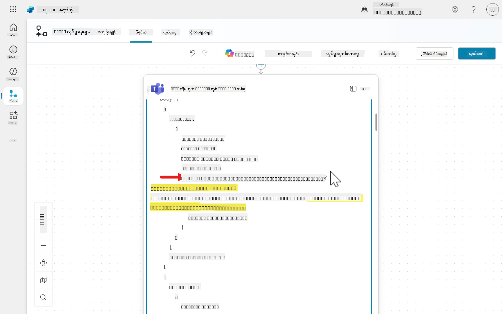

1. နောက်တစ်ဆင့်တွင် properties အတော်များများအတွက် dynamic content values များကို ထည့်သွင်းပါမည်။ အစအနမှာ event trigger မှ အလိုအလျောက် ဖန်တီးထားသော row ၏ Resume Number reference ကို ပြသမည့် text ကို စတင်ပါမည်။

      **panel** icon ကို ရွေးချယ်၍ action panel ကို load လုပ်ပါ။

       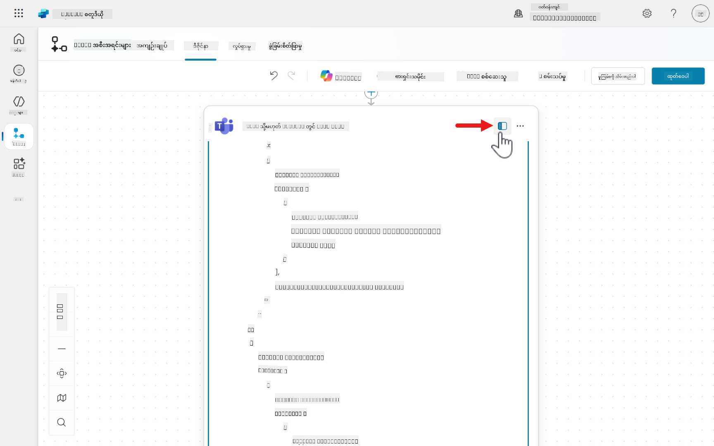

1. `RESUME NUMBER PLACEHOLDER` ၏ `text` property တွင် ရှိသော line ကို အောက်သို့ ဆွဲချပြီး placeholder value ကို highlight လုပ်ပြီး ဖျက်ပါ။

       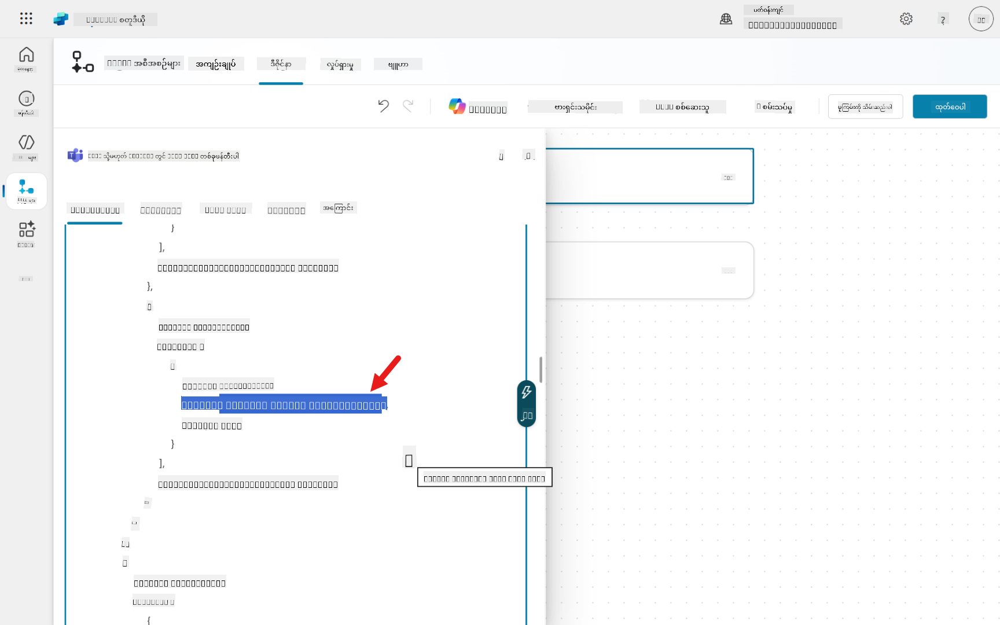

1. နှစ်ခုသော quotation marks အကြားတွင် click လုပ်ပြီး **lightning bolt icon** သို့မဟုတ် **fx icon** ကို ညာဘက်တွင် ရွေးချယ်ပါ။

      **Dynamic Content** tab တွင် **ResumeNumber** parameter ကို ရွေးချယ်ပြီး **Add** ကို ရွေးပါ။

       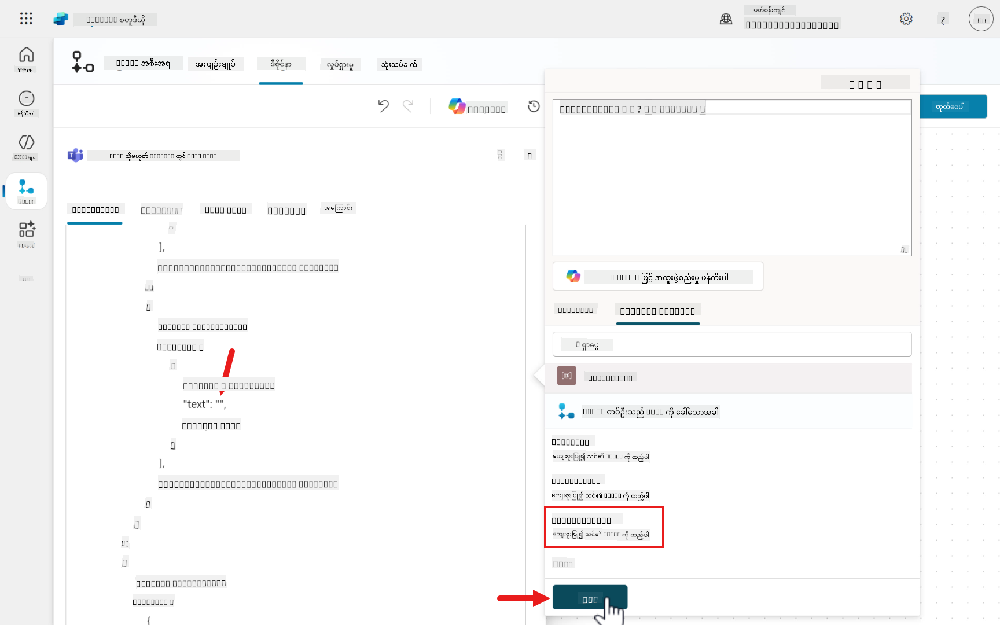

1. **ResumeNumber** parameter သည် dynamic content အဖြစ် `text` property တွင် ထည့်သွင်းထားမည်ဖြစ်သည်။

       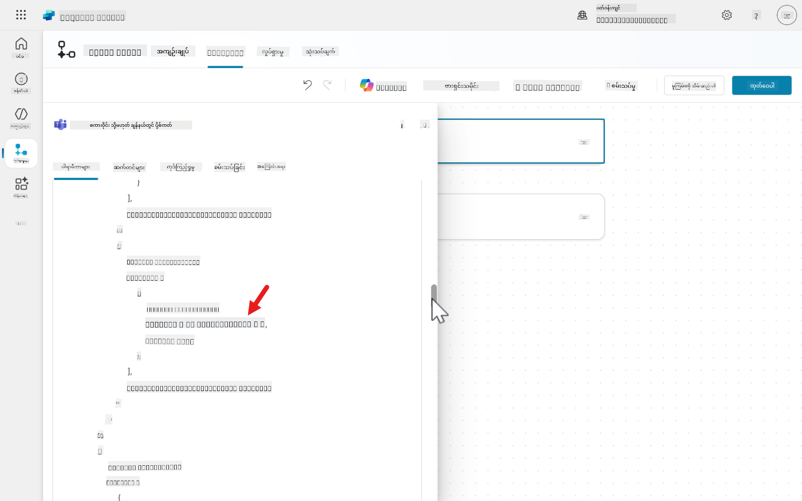

1. အတူတူသော အဆင့်များကို `RESUME NAME PLACEHOLDER` အတွက် ပြန်လုပ်ပါမည်။ `RESUME NAME PLACEHOLDER` ၏ `text` property တွင် ရှိသော line ကို အောက်သို့ ဆွဲချပြီး placeholder value ကို highlight လုပ်ပြီး ဖျက်ပါ။

       

1. နှစ်ခုသော quotation marks အကြားတွင် click လုပ်ပြီး **lightning bolt icon** သို့မဟုတ် **fx icon** ကို ညာဘက်တွင် ရွေးချယ်ပါ။

      **Dynamic Content** tab တွင် **ResumeTitle** parameter ကို ရွေးချယ်ပြီး **Add** ကို ရွေးပါ။

       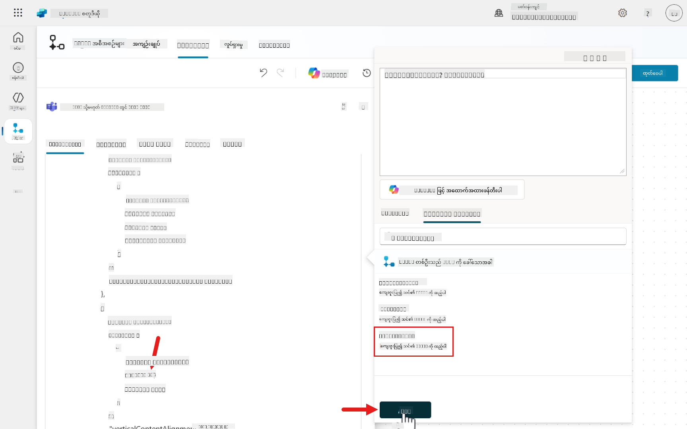

1. **ResumeTitle** parameter သည် dynamic content အဖြစ် `text` property တွင် ထည့်သွင်းထားမည်ဖြစ်သည်။

       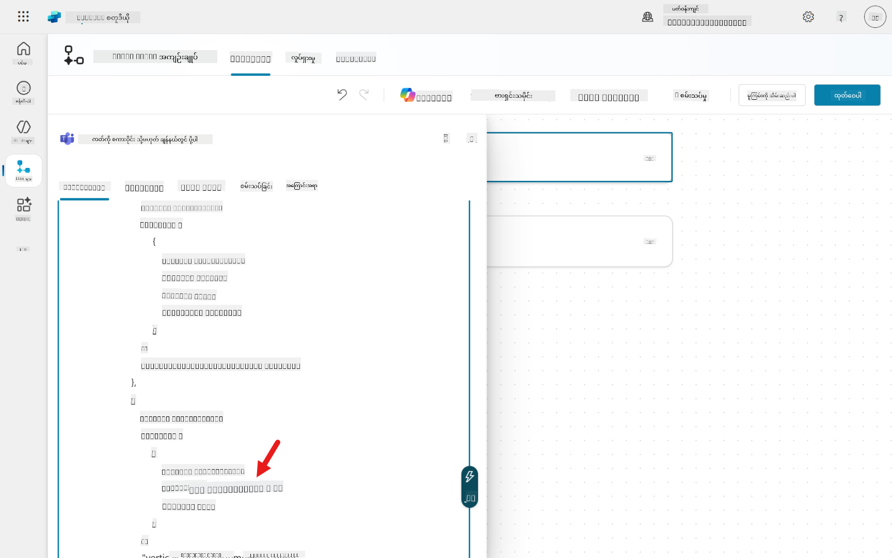

1. Recruiter သည် resume ကို ပြန်လည်သုံးသပ်ရမည့် **Due Date** value အတွက် အတူတူသော အဆင့်များကို ပြန်လုပ်ပါမည်။ `May 21, 2023` ၏ `text` property တွင် ရှိသော line ကို အောက်သို့ ဆွဲချပါ။

       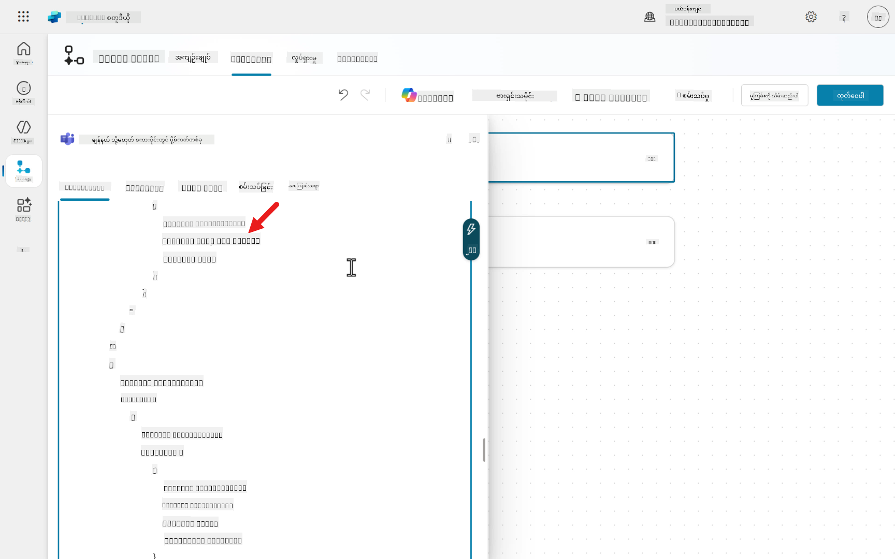

1. date placeholder value ကို ဖျက်ပြီး နှစ်ခုသော quotation marks အကြားတွင် click လုပ်ပါ။

       

1. **lightning bolt icon** သို့မဟုတ် **fx icon** ကို ညာဘက်တွင် ရွေးချယ်ပြီး **Function** tab တွင် အောက်ပါ expression ကို ထည့်သွင်းပြီး **Add** ကို ရွေးပါ။

       ```text
       addDays(utcNow(), 3, 'MMM dd, yyyy')
       ```

      ဤ expression သည် function နှစ်ခုကို အသုံးပြုသည်။

     | Function | Explanation |
     |----------|------------|
     | **addDays** | သတ်မှတ်ထားသော ရက်များကို ပေးထားသော ရက်စွဲတွင် ထည့်သွင်းပြီး string format အဖြစ် ရလဒ်ရက်စွဲကို ပြန်ပေးသည် |
     | **utcNow** | Coordinated Universal Time (UTC) format အဖြစ် string အနေဖြင့် လက်ရှိရက်စွဲနှင့် အချိန်ကို ပြန်ပေးသည် |

      utcNow value အတွက် ရက်စွဲကို လစဉ်နှင့် ရက်စဉ်၊ နှင့်နှစ်စဉ်အတိုင်း format ပြုလုပ်ထားသည်။

       

      expression သည် `text` property တွင် ထည့်သွင်းထားမည်ဖြစ်သည်။

       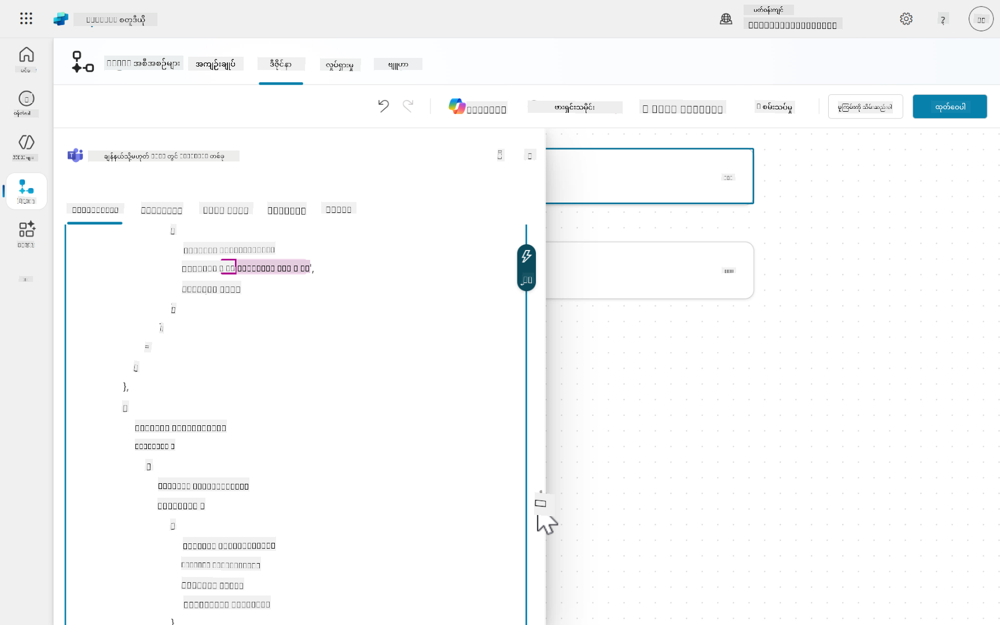

1. နောက်ဆုံးတွင် JSON payload ၏ `actions` array property ၏ `url` property အတွက် URL ကို update လုပ်ပါမည်။ ယခု placeholder URL ကို **Hiring Hub** model-driven app ၏ Resume row URL ဖြင့် အစားထိုးပါမည်။ ဤအရာသည် Recruiter ကို adaptive card ၏ `Action.OpenURL` action ကို ရွေးချယ်ပြီး model-driven app တွင် Resume သို့ ဦးတည်စေမည်။

       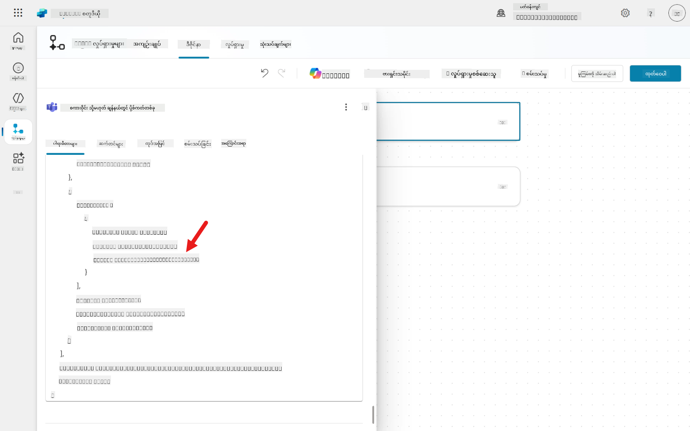

1. **Hiring Hub** model-driven app တွင် **Resumes** system view တွင် row တစ်ခုကို ဘယ်ဘက် menu ကို အသုံးပြု၍ ဖွင့်ပါ။ resume row သည် model-driven app တွင် form အဖြစ် load လုပ်မည်ဖြစ်သည်။

      Resume row URL ကို copy လုပ်ပါ။

    ??? info "သင်သည် **Hiring Hub** model-driven app သို့ ပြန်သွားရန်"

        1. [https://make.powerapps.com](https://make.powerapps.com) သို့ browse လုပ်ပြီး သင်၏ developer environment တွင် ရှိနေကြောင်း သေချာပါ။ မဟုတ်လျှင် switch လုပ်ပါ။
        
        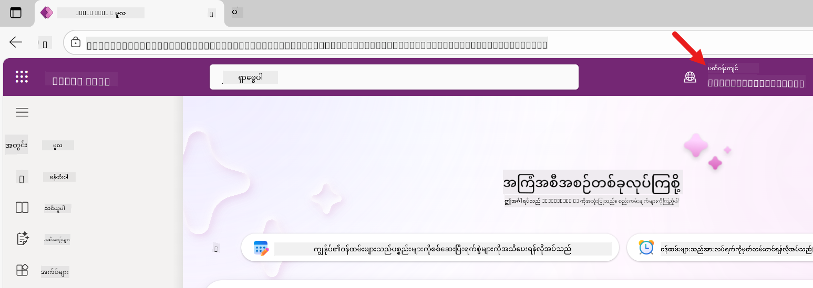

        1. ဘယ်ဘက် menu pane တွင် **Apps** ကို ရွေးချယ်ပြီး **Hiring Hub** model-driven app အတွက် **Play** icon ကို ရွေးချယ်၍ browser တွင် load လုပ်ပါ။
        
        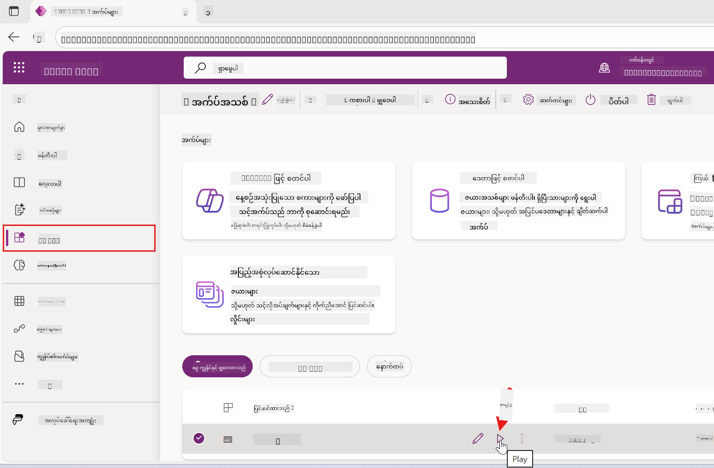

       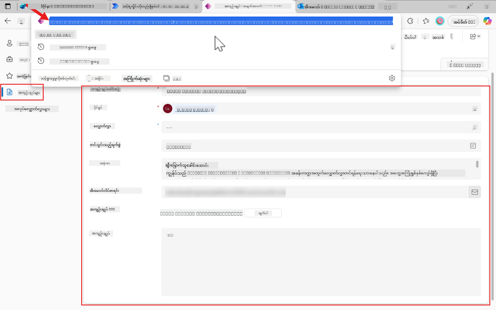

1. agent flow သို့ ပြန်သွားပြီး placeholder URL value ကို highlight လုပ်ပြီး ဖျက်ပါ။

       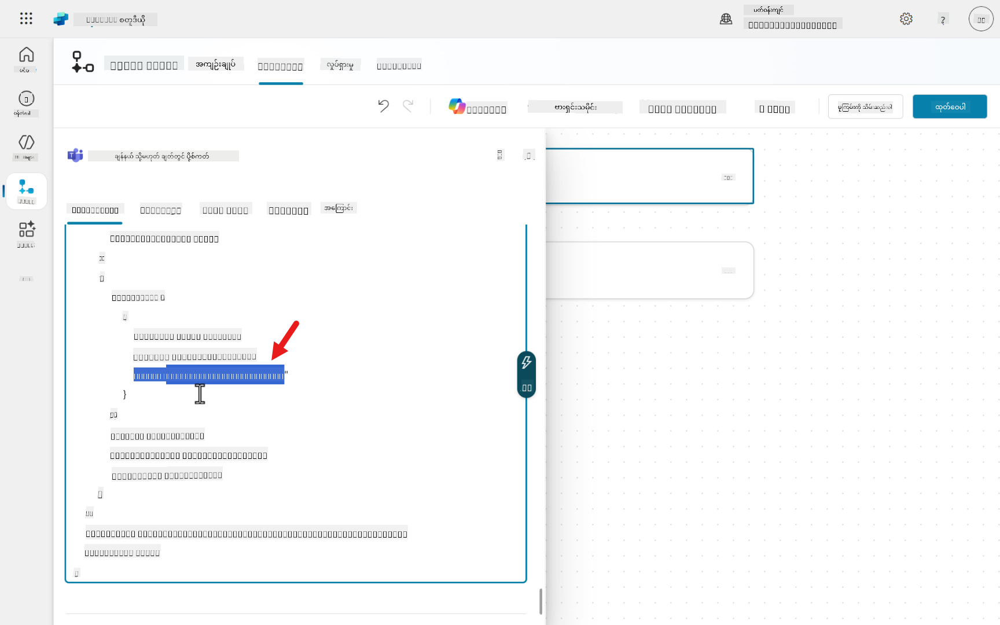

1. ထို့နောက် copy လုပ်ထားသော URL ကို `url` property ၏ **url property** တွင် paste လုပ်ပါ။

       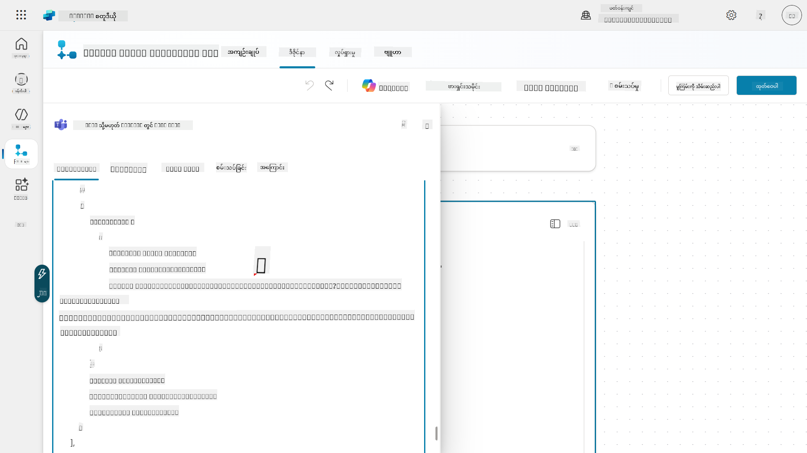

1. သင်သည် အောက်ပါအရာများကို မြင်ရမည်။ အဆုံးတွင် ရှိသော `GUID` id value ကို ဖျက်ပါ။ dynamic content - **ResumeId** parameter ကို အစားထိုးပါမည်။

       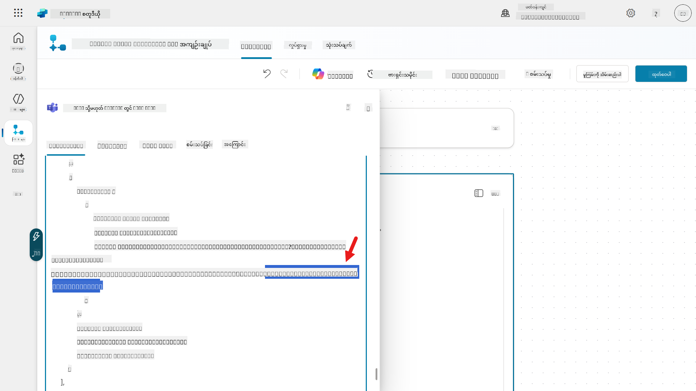

1. **lightning bolt icon** သို့မဟုတ် **fx icon** ကို ညာဘက်တွင် ရွေးချယ်ပါ။

      **Dynamic Content** tab တွင် **ResumeId** parameter ကို ရွေးချယ်ပြီး **Add** ကို ရွေးပါ။

       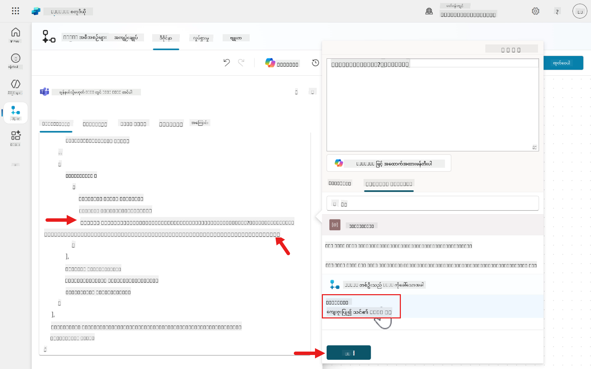

1. **ResumeId** သည် dynamic content အဖြစ် ထည့်သွင်းထားမည်ဖြစ်သည်။ အဝါရောင်ဖြင့် အထောက်အထားပြထားသော **Hiring Hub** model-driven app ၏ ပတ်ဝန်းကျင်အသေးစိတ်ကို တွေ့ရမည်။

     | Parameter | Value | Explanation |
     |----------|------------|---------|
     | **Organization URI** | GUID | Dataverse/Dynamics 365 ပတ်ဝန်းကျင်၏ အဖွဲ့ URL |
     | **appid** | GUID | သတ်မှတ်ထားသော model-driven app ကို ဖွင့်ရန် appid သို့မဟုတ် appname query parameter ကို အသုံးပြုသည်။ ဤကိစ္စတွင် appid ကို အသုံးပြုသည် |
     | **id** | GUID | Resume row ၏ id ဖြစ်သော query parameter |

       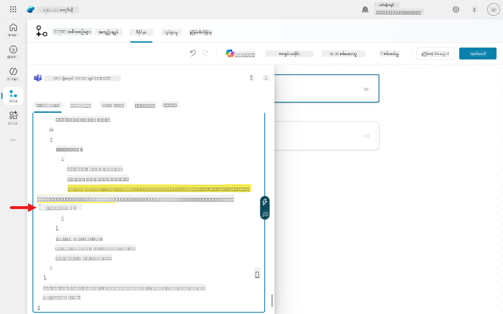

1. **Post card in a chat or channel** action ကို configure ပြုလုပ်ပြီးပါပြီ 👏🏻 **x** icon ကို ရွေးချယ်၍ action configuration panel မှ ထွက်ပါ။

       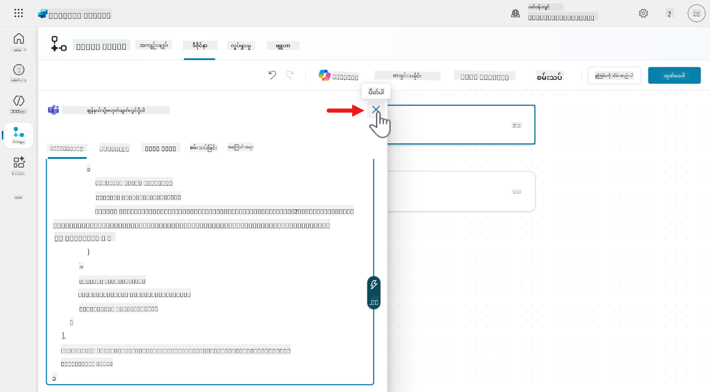

1. နောက်ဆုံးတွင် **Respond to the agent** action ကို configure ပြုလုပ်ပြီး text ကို agent သို့ ပြန်ပို့၍ process ကို အဆုံးသတ်ပါမည်။

      **Respond to the agent** action တွင် **+Add an output** ကို ရွေးပါ။

       

1. output အမျိုးအစားအဖြစ် **Text** ကို ရွေးပါ။

       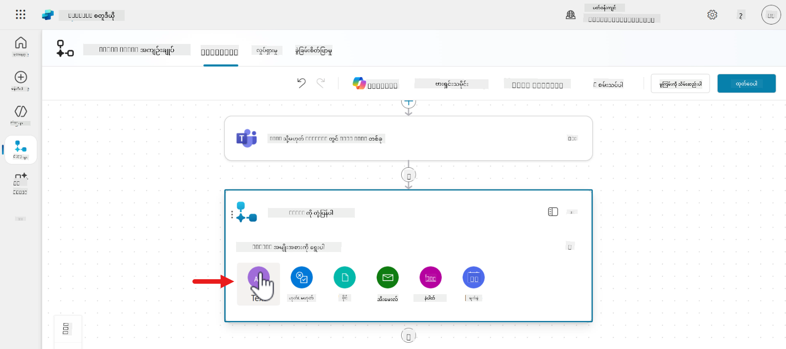

1. output အမည်အဖြစ် အောက်ပါအတိုင်း ထည့်သွင်းပါ။

       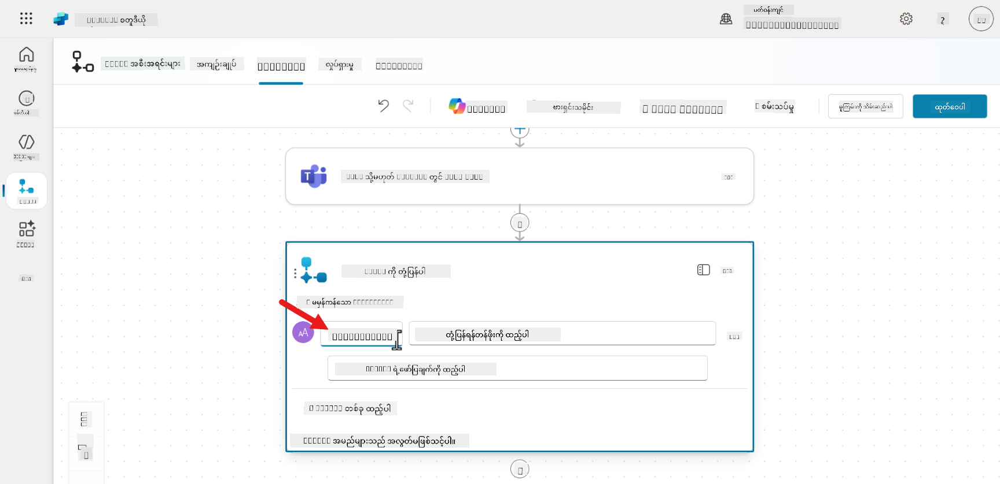

1. output value အဖြစ် အောက်ပါအတိုင်း ထည့်သွင်းပါ။

       ```text
       Finished
       ```

       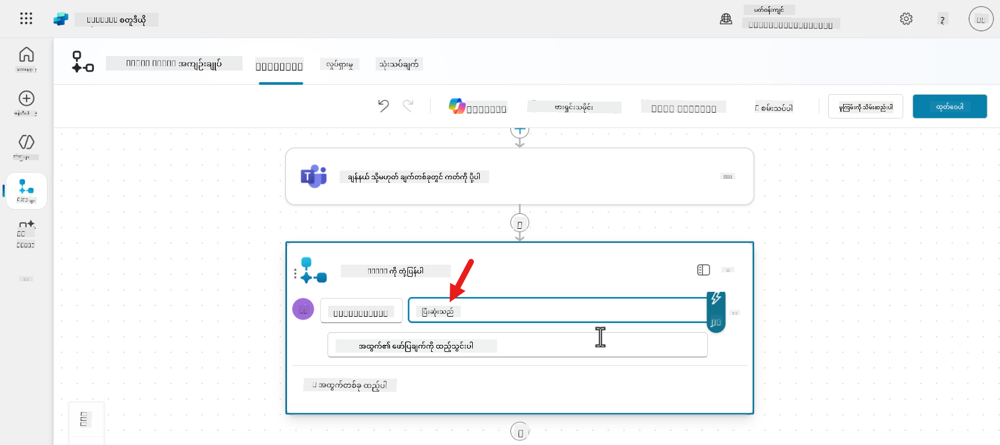

1. agent flow ကို configure ပြုလုပ်ပြီးပါပြီ။ **Save draft** ကို ရွေးချယ်၍ agent flow ကို save လုပ်ပါ။ save ပြုလုပ်ပြီး message တစ်ခု ပေါ်လာမည်။

       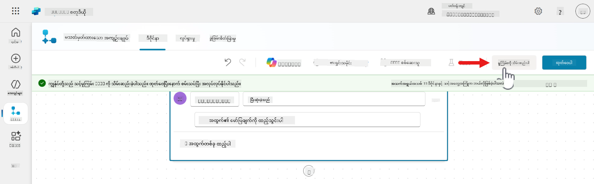

1. agent flow ကို publish ပြုလုပ်ရန်မတိုင်မီ agent flow ၏ အသေးစိတ်ကို update ပြုလုပ်ရန်လိုအပ်သည်။ **Overview** tab ကို ရွေးချယ်ပြီး **Edit** ကို ရွေးပါ။

      flow name field တွင် အောက်ပါအတိုင်း ထည့်သွင်းပါ။

       ```text
       Notify Teams Applicant channel
       ```      

      ထို့နောက် **Refresh** icon ကို ရွေးချယ်၍ AI ကို အသုံးပြု၍ agent flow ၏ ဖော်ပြချက်ကို update ပြုလုပ်ပါ။

      ထို့နောက် **Save** ကို ရွေးချယ်၍ agent flow ၏ အသေးစိတ်ကို save ပြုလုပ်ပါ။

       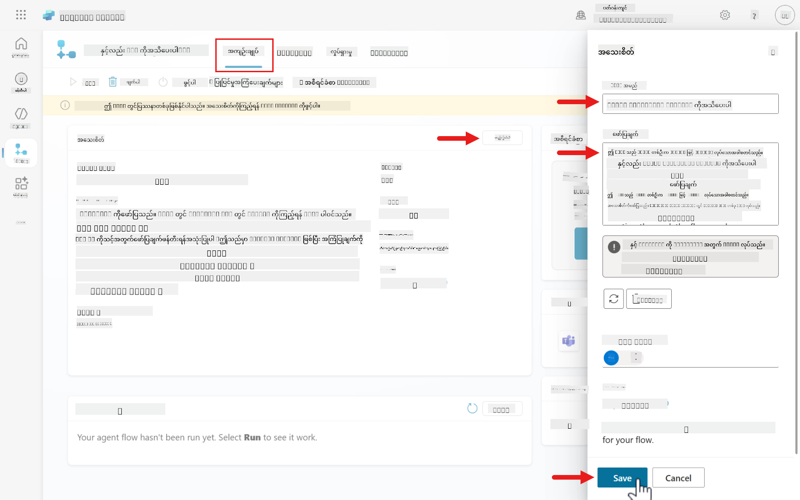

1. **Designer** tab သို့ ပြန်သွားပြီး **Publish** ကို ရွေးချယ်၍ agent flow ကို publish ပြုလုပ်ပါ။ save ပြုလုပ်ပြီး message တစ်ခု ပေါ်လာမည်။

       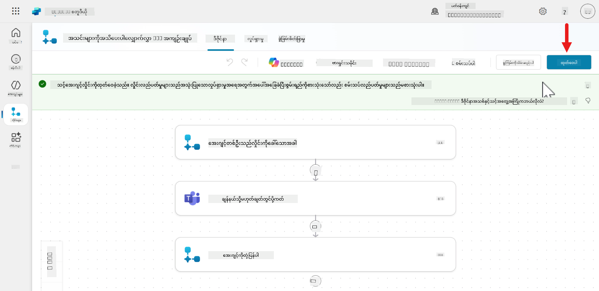

1. agent flow ကို **Application Intake Agent** တွင် tool အဖြစ် ထည့်သွင်းရန်လိုအပ်သည်။ **Hiring Agent** သို့ ပြန်သွားပြီး **Agents** tab ကို ရွေးချယ်ပါ၊ ထို့နောက် **Application Intake Agent** ကို ရွေးပါ။

       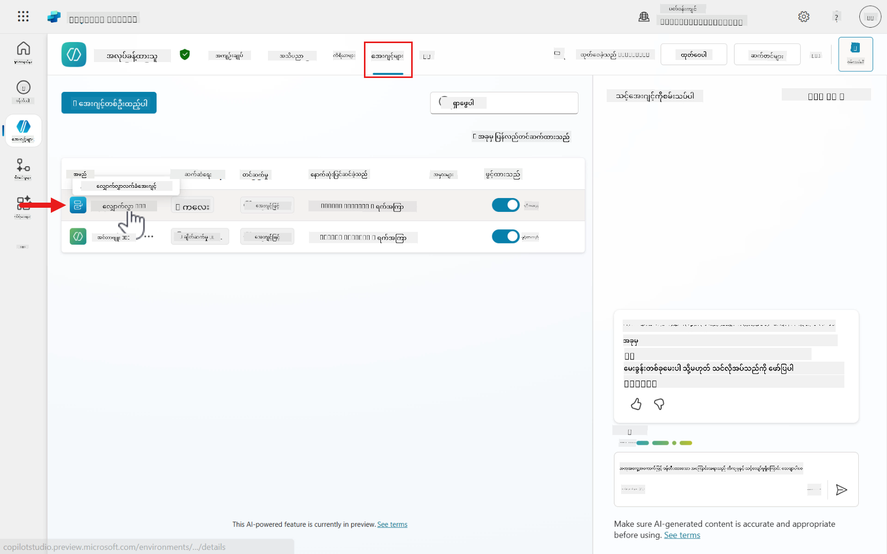

1. agent ၏ **Details** အပိုင်းတွင် **Description** field ကို update ပြုလုပ်ပါ။ အောက်ပါကို copy လုပ်ပြီး ဖော်ပြချက် text ၏ အဆုံးတွင် paste လုပ်ပါ။

       ```text
       and also notify the Teams Applicant channel
       ```

       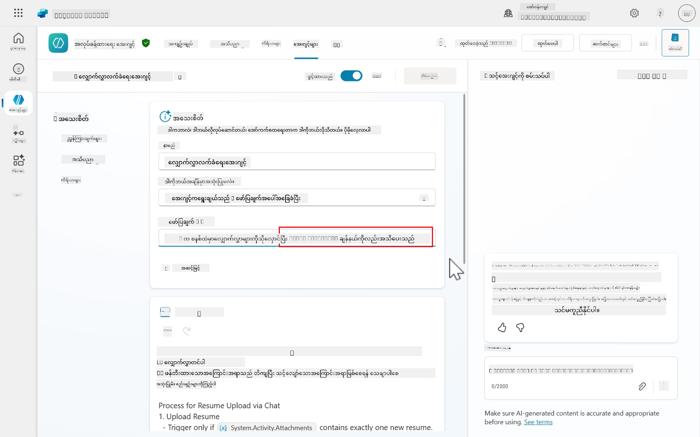

1. နောက်တစ်ဆင့်တွင် agent flow ကို tool အဖြစ် ထည့်သွင်းပါမည်။ အောက်သို့ ဆွဲချပြီး **+ Add** ကို ရွေးပါ။

       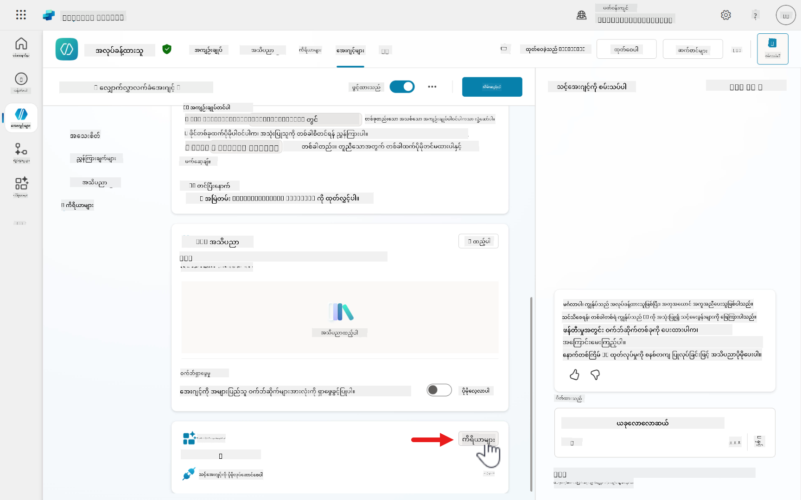

1. အရင်က ဖန်တီးထားသော agent flow ကို ရွေးပါ၊ **Notify Teams Applicant Channel**။

       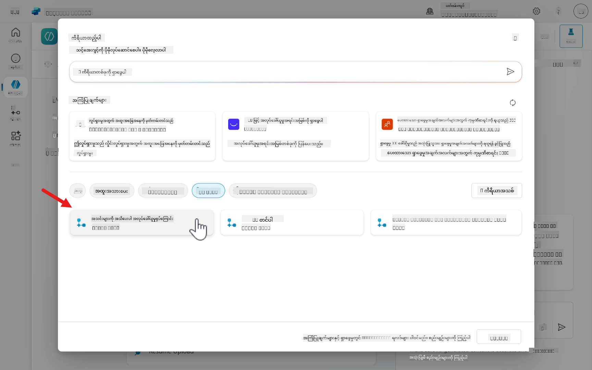

1. ထို့နောက် **Add and configure** ကို ရွေးပါ။

       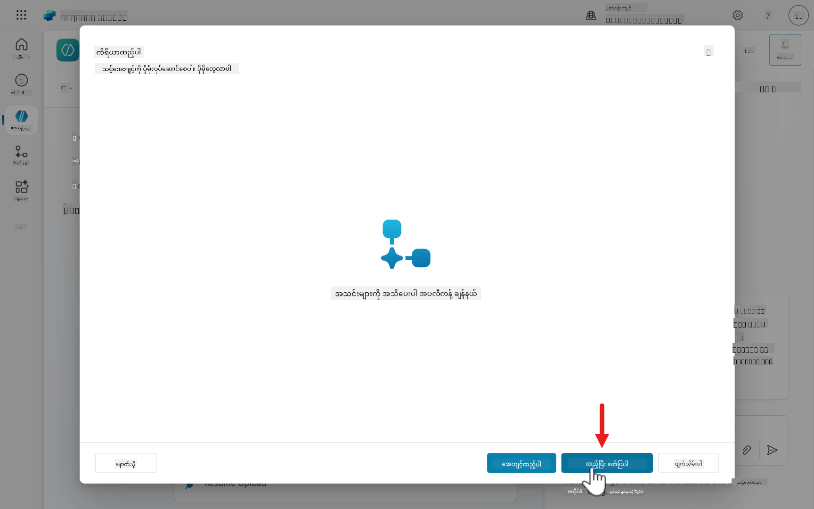

1. agent flow ၏ **Inputs** အပိုင်းတွင် အရင်က agent flow တွင် configure ပြုလုပ်ထားသော inputs သုံးခုကို တွေ့ရမည်။ ပုံမှန်အားဖြင့် **Fill using** configuration သည် **Dynamically fill with AI** အဖြစ် သတ်မှတ်ထားသည်။ ဤ setting ကို အတိုင်းထားမည်ဖြစ်သည်။ event trigger (နောက်ဆုံး action တွင် **Sends a prompt to the specified copilot for processing** - ဤသည်မှာ **Lab 3.1 - Automate uploading resumes to Dataverse received by email** ၏ အဆင့် 38-44 ဖြစ်သည်) မှ AI သည် parameter values များကို extract ပြုလုပ်မည်။

       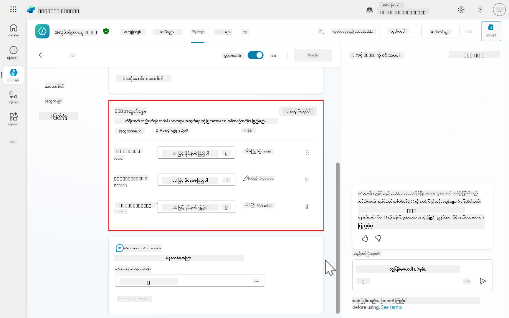

1. tool ကို **Application Intake Agent** တွင် ထည့်သွင်းပြီးနောက် agent ၏ instructions ကို update ပြုလုပ်ရန်လိုအပ်သည်။ **back arrow** icon ကို ရွေးချယ်၍ agents စာရင်းသို့ ပြန်သွားပါ။

       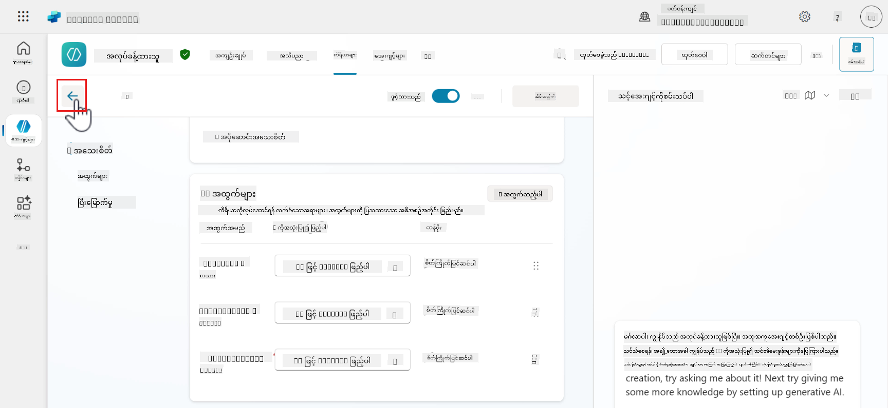

1. **Hiring Agent** ၏ **Agents** tab တွင် **Application Intake Agent** ကို ရွေးပါ။

       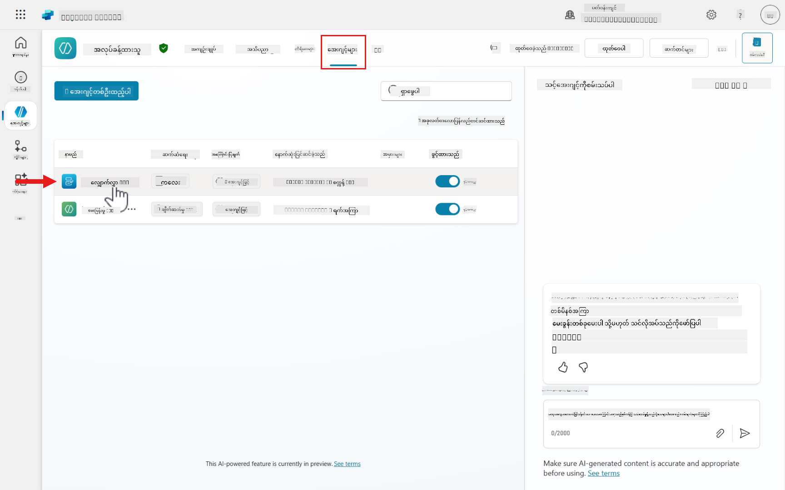

1. **Instructions** field တွင် `2.Post-Upload` instructions အပြီးတွင် အတန်းအသစ်ထည့်ပါ။ အောက်ပါ instructions ကို copy လုပ်ပြီး paste လုပ်ပါ။

       ```text
       Process for Resume Upload via Email
       1. When you receive a message, **Send [ResumeId (text)] = "1680265f-5793-f011-b41b-7c1e525be9f7" and [ResumeTitle (text_1)] = "TAYLOR TESTPERSON (FICTITIOUS).pdf" and [ResumeNumber (text_2)]= "R01026" to the Tool "Notify Teams Applicant channel"** in the child agent "Application Intake Agent", call [AGENT FLOW PLACEHOLDER]
       ```

       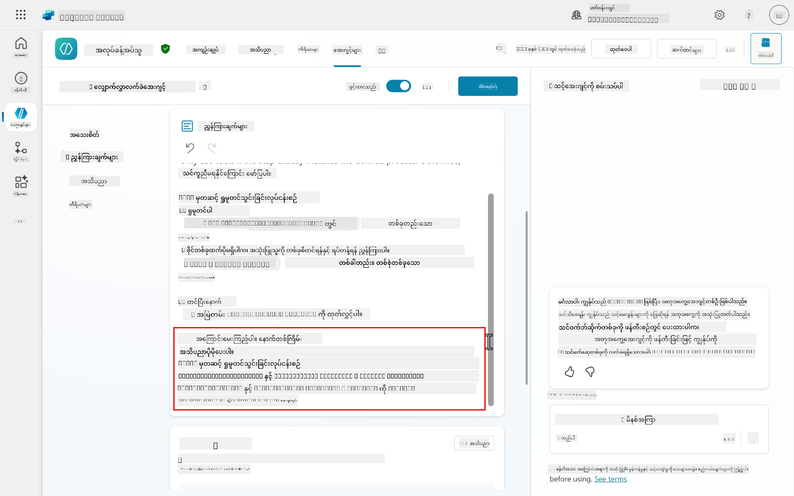

1. `[AGENT FLOW PLACEHOLDER` text ကို highlight လုပ်ပါ။

       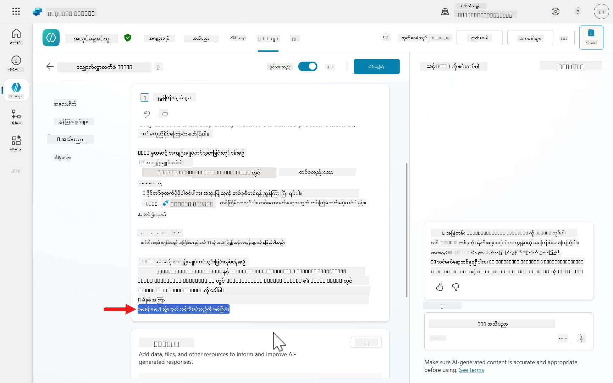

1. forward slash character `/` ကို ထည့်သွင်းပြီး **Notify Teams Applicant Channel** tool ကို ရွေးပါ။

       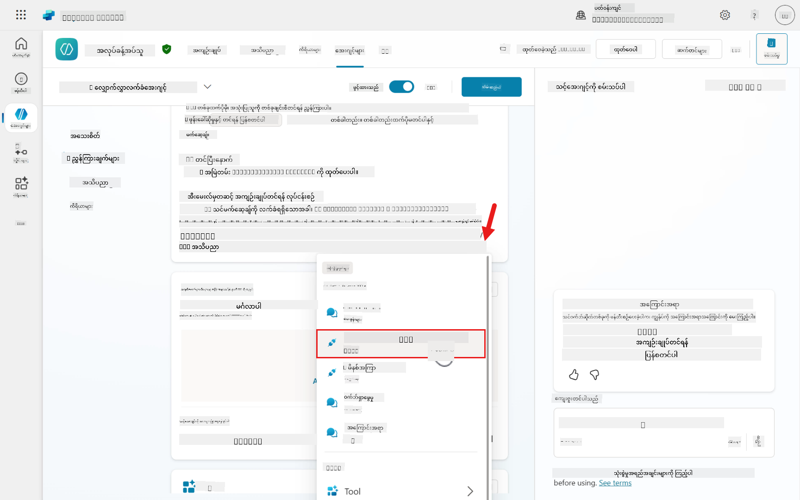
1. အေးဂျင့်ဖလိုးကို **Application Intake Agent** မှ အညွှန်းများအတိုင်း အကောင်အထည်ဖော်မည်ဖြစ်ပြီး၊ အဖြစ်အပျက်ကို အစပြုသောအချိန်တွင် **Sends a prompt to the specified copilot for processing** လုပ်ဆောင်မှုပြီးဆုံးပြီးနောက် parameter values ပါဝင်သော prompt ကို အေးဂျင့်ထံပြန်ပို့ပါမည်။

      **Save** ကိုရွေးချယ်ပြီး **Application Intake Agent** အတွက် အညွှန်းများကို သိမ်းဆည်းပါ။

       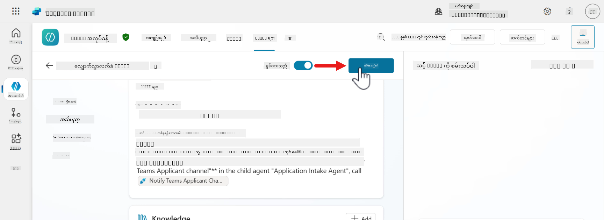

1. အေးဂျင့်ကို သိမ်းဆည်းပြီးနောက် အညွှန်းများကို အပ်ဒိတ်လုပ်ပါမည်။

       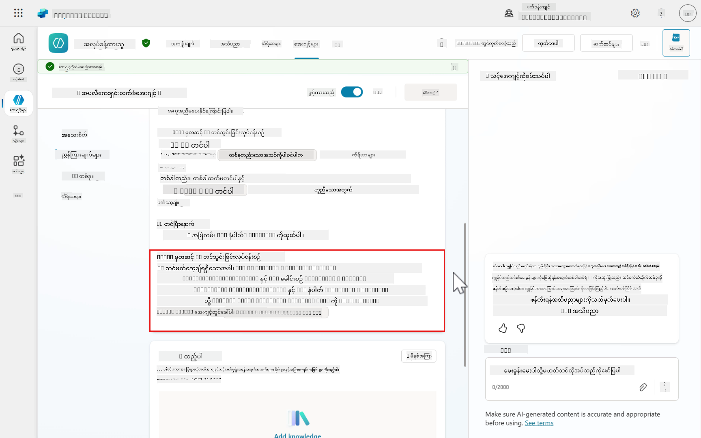

1. **Hiring Agent** ကို **Publish** လုပ်ရန်လိုအပ်ပါသည်။ အပေါ်ယံညာဘက်ရှိ **Publish** ကိုရွေးချယ်ပြီး _Publish this agent modal_ တွင် **Publish** ကိုရွေးချယ်ပါ။

       

1. Publish လုပ်ပြီးနောက် အေးဂျင့် Publish လုပ်ပြီးကြောင်း အတည်ပြုချက်မက်ဆေ့ချ်တစ်ခု ပေါ်လာပါမည်။

       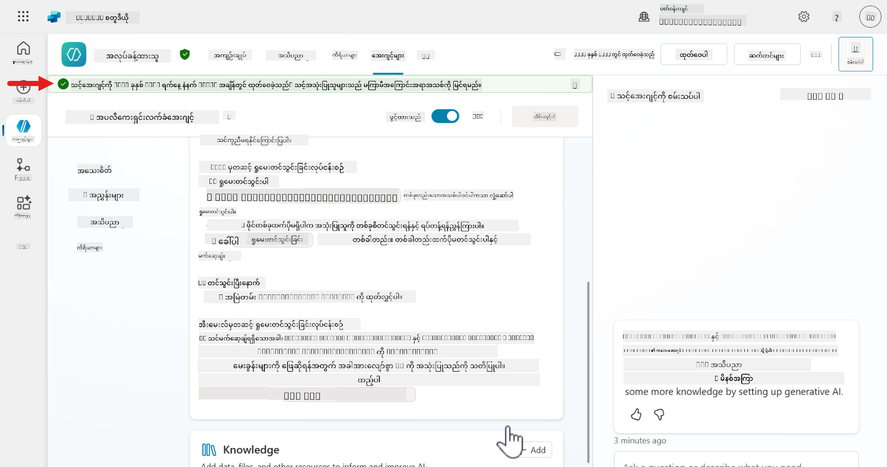

အေးဂျင့်ကို စမ်းသပ်နိုင်ပါပြီ!

### Lab 3.3 - အဖြစ်အပျက်ကို စမ်းသပ်ခြင်း

1. အဖြစ်အပျက်ကို အကောင်အထည်ဖော်ရန် Resume pdf ဖိုင်ပါဝင်သော အီးမေးလ်တစ်ခု ပို့ရန်လိုအပ်ပါသည်။ Outlook တွင် အီးမေးလ်မက်ဆေ့ချ်အသစ်တစ်ခုရေးသားပါ။

     | အီးမေးလ်အစိတ်အပိုင်း | အသေးစိတ် |
     |----------|------------|
     | **To recipient** | သင်၏လက်မှတ်ထိုးထားသော user account ကို အသုံးပြုပါ |
     | **File attachment** | [TAYLOR TESTPERSON (FICTITIOUS)](../../../../../docs/operative-preview/test-data/resumes/TAYLOR%20TESTPERSON%20(FICTITIOUS).pdf) ဖိုင်ကို upload လုပ်ပါ |
     | **Body** | အီးမေးလ် body အဖြစ် အောက်ပါစာသားကို ကူးယူကပ်ပါ  |

       ```text
       Hiring Manager ခင်ဗျား/ရှင်မ,

       Senior Power Platform Engineer ရာထူးအတွက် ကျွန်ုပ်၏စိတ်ဝင်စားမှုကို ဖော်ပြရန် ရေးသားပါသည်။ Microsoft cloud platforms တွင် လုံခြုံပြီး scalable ဖြစ်သော solution များကို ၉ နှစ်ကျော်အတွေ့အကြုံရှိပြီး သင့်အဖွဲ့အတွက် ထိရောက်စွာ အထောက်အကူဖြစ်စေမည်ဟု ယုံကြည်ပါသည်။

       Lead Power Platform Engineer အဖြစ် ကျွန်ုပ်၏နောက်ဆုံးရာထူးတွင် automated resume-intake pipeline တစ်ခု ဖွံ့ဖြိုးခဲ့ပြီး လက်ဖြင့်လုပ်ဆောင်မှုများကို လျှော့ချကာ ရှာဖွေရန်အဆင်ပြေမှုကို တိုးတက်စေခဲ့ပါသည်။ HR case management applications များကို တင်ပို့ခဲ့ပြီး solution-aware flows များကို မိတ်ဆက်ကာ deployment lead times ကို တိုးတက်စေခဲ့ပါသည်။ ကျွန်ုပ်၏ကျွမ်းကျင်မှုများတွင် Power Apps, Power Automate, Power Pages, Dataverse နှင့် Microsoft 365 services များအပြင် Graph/REST APIs နှင့် Azure Functions တို့နှင့် ပေါင်းစည်းမှုများပါဝင်ပါသည်။

       ယခင်က Teams approvals များကို adaptive cards ဖြင့် ဖွံ့ဖြိုးခဲ့ပြီး အတည်ပြုချိန်ကို တစ်နေ့အတွင်းဖြစ်စေခဲ့ပါသည်။ error-handling frameworks များကို ဖန်တီးခဲ့ပြီး legacy workflows များကို Power Automate သို့ ပြောင်းလဲခဲ့ပါသည်။ self-service portals များကို ဖန်တီးခဲ့ပြီး ရာနှင့်ချီသော ဝန်ထမ်းများ အသုံးပြုခဲ့ပါသည်။

       ကျွန်ုပ်သည် Computer Science ဘွဲ့ရရှိထားပြီး Power Platform Developer (PL-400) နှင့် Solution Architect (PL-600) အဖြစ်လက်မှတ်ရရှိထားပါသည်။ mentoring ကို စိတ်ဝင်စားပြီး ဒေသခံ maker groups များနှင့် volunteer လုပ်ခဲ့ပါသည်။

       ကျေးဇူးပြု၍ ကျွန်ုပ်၏ CV ကို သင့်အတွေးအခေါ်အတွက် ထည့်သွင်းပါ။ ကျွန်ုပ်၏ကျွမ်းကျင်မှုများနှင့် သင့်လိုအပ်ချက်များကို အညီအမျှဖြစ်စေရန် ဆွေးနွေးရန် အခွင့်အရေးကို ကြိုဆိုပါသည်။

       သင့်အချိန်နှင့် အတွေးအခေါ်အတွက် ကျေးဇူးတင်ပါသည်။

       အထူးဂုဏ်ပြုလျက်,
       Taylor Testperson
       ```

       **Send** ကိုနှိပ်ပြီး အီးမေးလ်ကို ပို့ပါ။

       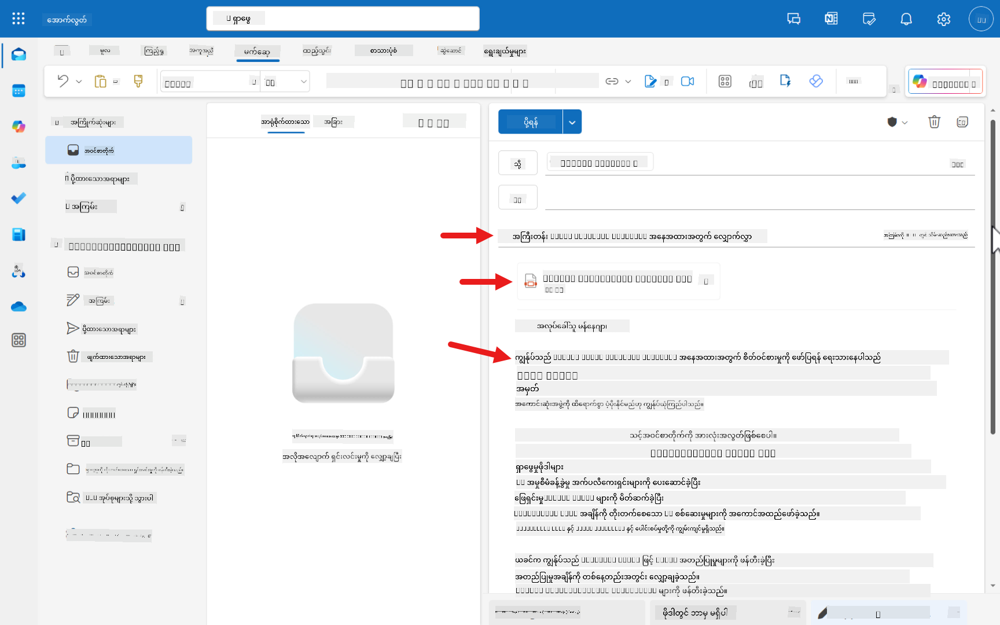

1. Power Automate maker portal တွင် အဖြစ်အပျက်ကို အကောင်အထည်ဖော်သော flow အတွက် **Refresh** icon ကိုရွေးချယ်ပြီး ပို့ထားသော အီးမေးလ်အတွက် အောင်မြင်သော flow run ကို ကြည့်ရှုပါ။

       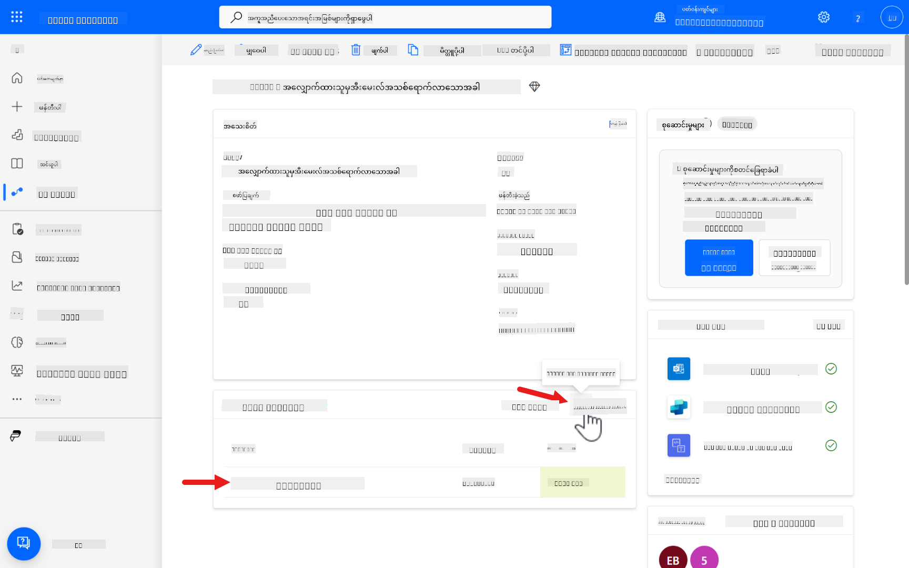

1. Copilot Studio တွင် **Hiring Agent** အတွက် **Activity** tab ကိုရွေးချယ်ပါ။

       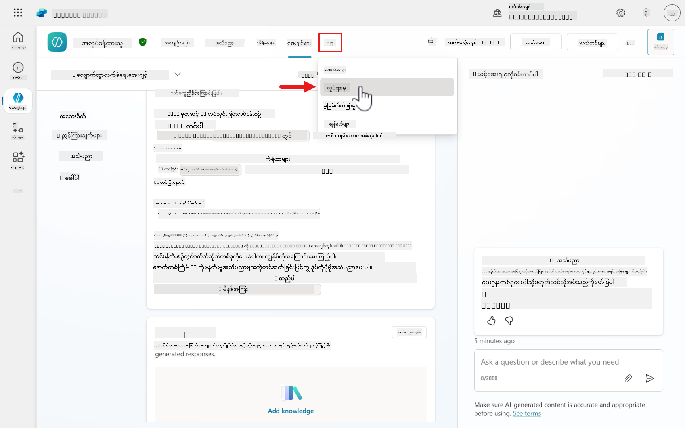

1. **Activity** tab ကို load လုပ်ပြီး **Hiring Agent** ၏ activity များအားလုံးကို ပြသပါမည်။ **Automated** ဟု အမည်ရှိပြီး **Complete** ဟု status ရှိသော activity တစ်ခုရှိပါမည်။ ဤ activity သည် အဖြစ်အပျက်ကို အကောင်အထည်ဖော်ခြင်းနှင့် အေးဂျင့်ဖလိုးကို ဖော်ပြသည်။

       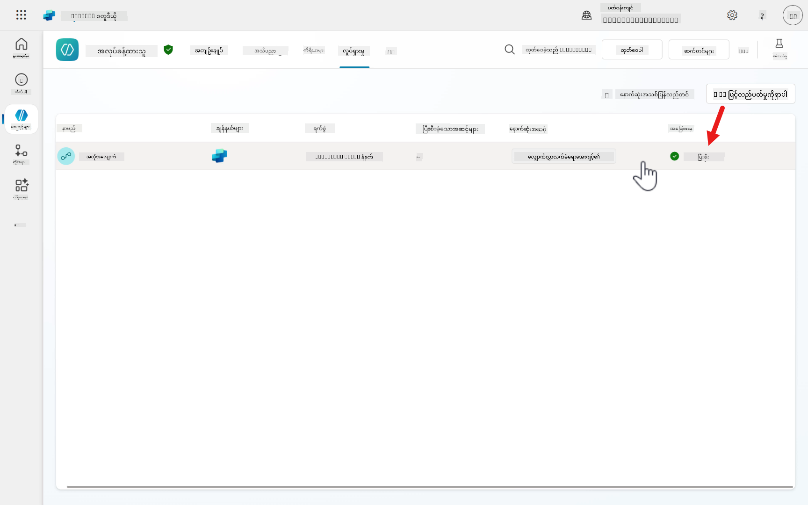

1. activity ကိုရွေးချယ်ပြီး activity map တွင် အဖြစ်အပျက်ကိုရွေးချယ်ပါ။ ညာဘက် panel တွင် prompt ၏ input parameters တွင် **Dataverse** row မှ `Resume Id`, `Resume Title` နှင့် `Resume Number` parameter values ပါဝင်သည်ကို သတိပြုပါ။ ဤအချက်များသည် **Lab 3.1 - Automate uploading resumes to Dataverse received by email** ၏ အဆင့် 18 - 27 တွင် dynamic content values များကို configure လုပ်ထားသောအချက်များဖြစ်သည်။

       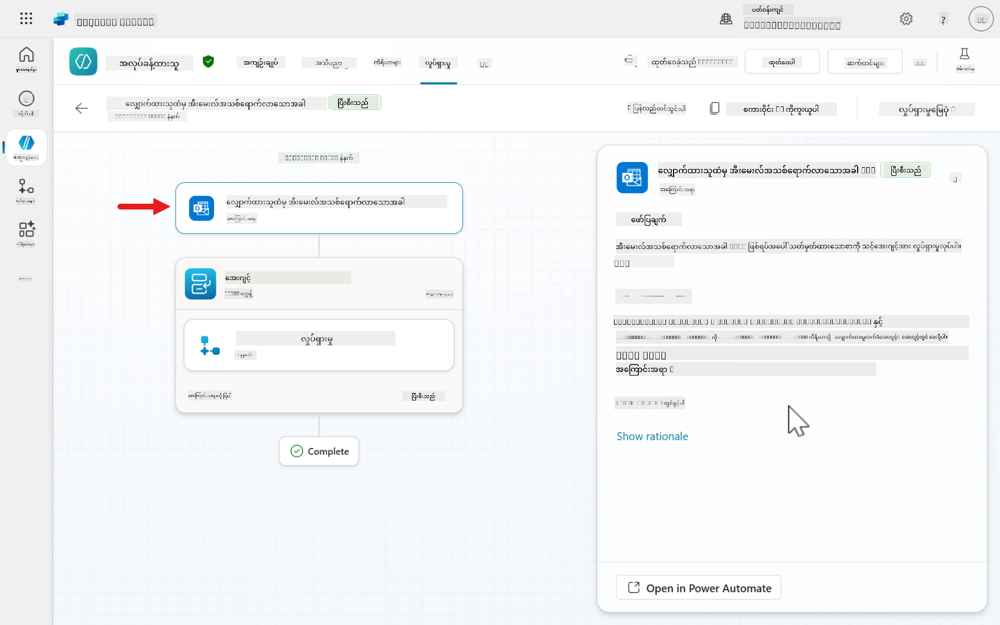

1. **Hiring Hub** model-driven app သို့ ပြန်သွားပြီး **Resumes system view** တွင် **Refresh** ကိုရွေးချယ်ပါ။ အီးမေးလ်ဖြင့် ပို့ထားသော resume အတွက် အသစ်ဖန်တီးထားသော row ကို အဖြစ်အပျက်မှဖန်တီးထားသောအတိုင်း ပြသပါမည်။

       

1. Copilot Studio သို့ ပြန်သွားပြီး **Application Intake Agent** ၏ activity map တွင် **Notify Teams Applicant Channel** အေးဂျင့်ဖလိုးကိုရွေးချယ်ပါ။ ညာဘက် panel တွင် input များတွင် Dataverse row မှ value များပါဝင်သည်ကို သတိပြုပါ။ ဤအချက်များသည် အဖြစ်အပျက်၏ နောက်ဆုံးလုပ်ဆောင်မှု **Sends a prompt to the specified copilot for processing** မှ Dataverse row အသစ်မှ parameter values ပါဝင်သော prompt ကို ပို့ထားသောအချက်များဖြစ်သည်။ ဤနည်းဖြင့် အဖြစ်အပျက်များမှ parameter values များကို အေးဂျင့်ဖလိုးများသို့ ပို့နိုင်ပါသည်။

       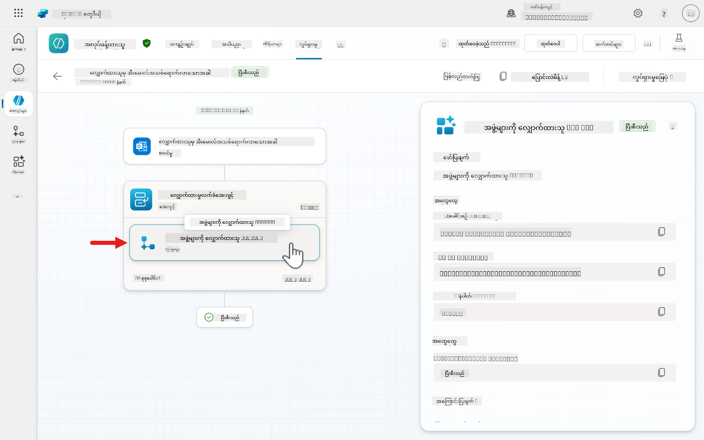

1. နောက်ဆုံးတွင် **Microsoft Teams** ၏ channel တွင် adaptive card ကို ကြည့်ရှုပါ။ channel တွင် Dataverse တွင် အသစ်ဖန်တီးထားသော Resume row အကြောင်းကို ပြသသော adaptive card ကို တွေ့ပါမည်။ adaptive card ၏အစတွင် hyperlink ကို hover လုပ်ပါ။ URL သည် JSON (steps 15 - 19 of **Lab 3.2 - Notify a Teams channel using an adaptive card**) payload တွင် configure လုပ်ထားသော Resumes system view URL ဖြစ်သည်ကို သတိပြုပါ။

       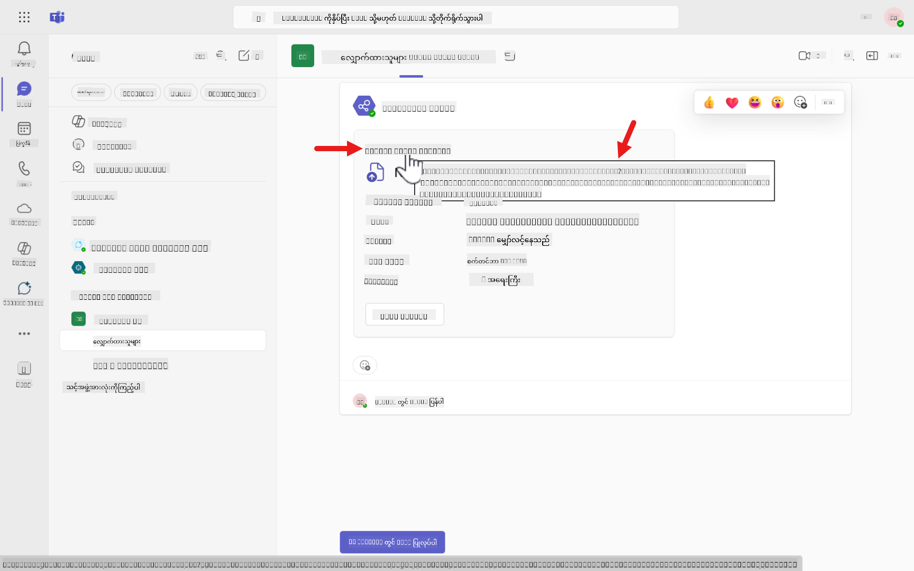

1. hyperlink ကိုရွေးချယ်ပြီး **Hiring Hub** model-driven app ၏ browser တွင် Resumes system view သို့ သွားပါ။

       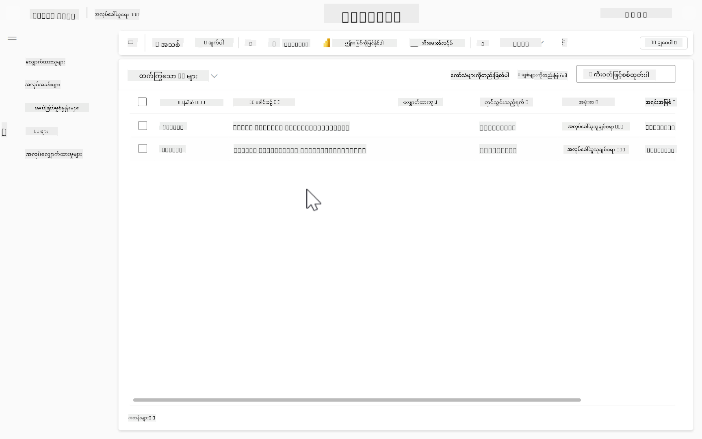

1. Microsoft Teams ၏ channel တွင် adaptive card သို့ ပြန်သွားပါ။ ဤအကြိမ်တွင် **View Resume** ကို hover လုပ်ပါ။ ဤသည်မှာ adaptive card ၏ `Action.OpenURL` လုပ်ဆောင်မှုဖြစ်သည်။ URL သည် JSON (steps 30 - 36 of **Lab 3.2 - Notify a Teams channel using an adaptive card**) payload တွင် configure လုပ်ထားသော Resumes row URL ဖြစ်သည်ကို သတိပြုပါ။

       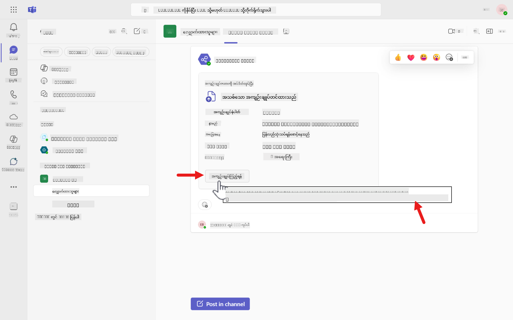

1. action ကိုရွေးချယ်ပြီး **Hiring Hub** model-driven app ၏ browser တွင် Resume row form သို့ သွားပါ။

       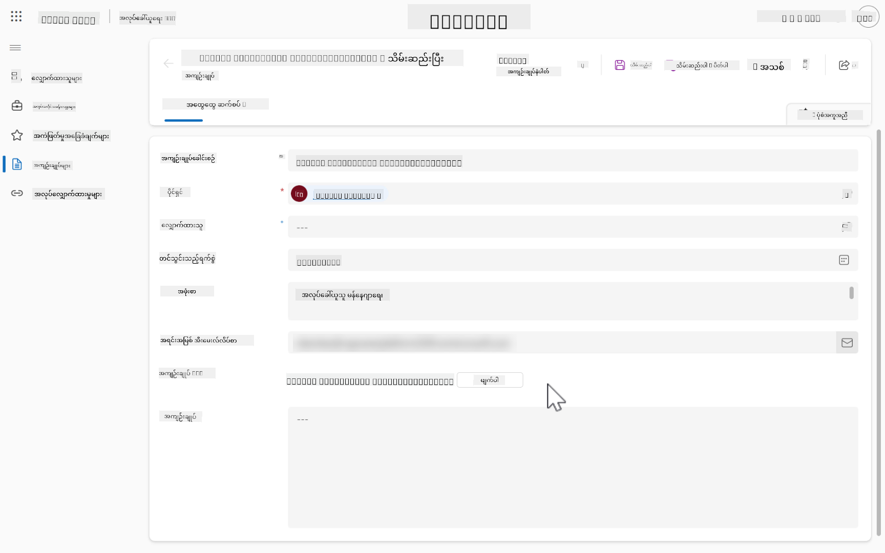

## ✅ Mission Complete

ဂုဏ်ယူပါတယ်! 👏🏻 အလွန်ကောင်းမွန်သောအလုပ်ပါ၊ Operative။

✅ အဖြစ်အပျက်ကို အကောင်အထည်ဖော်ခြင်း - Dataverse parameter values များကို အေးဂျင့်ဖလိုးသို့ ပို့သော အဖြစ်အပျက်ကို ဖန်တီးခဲ့ပါသည်။  
✅ အေးဂျင့်ဖလိုးတစ်ခုကို ဖန်တီးခဲ့ပါသည် - Dataverse parameter values များကို အသုံးပြုကာ Microsoft Teams channel တွင် adaptive card ကို post လုပ်ပြီး HR recruitment team ကို အသိပေးခဲ့ပါသည်။  
✅ child agent အညွှန်းများကို အပ်ဒိတ်လုပ်ခဲ့ပါသည် - အဖြစ်အပျက်ပြီးဆုံးပြီးနောက် ဖလိုးကို အကောင်အထည်ဖော်ရန်။

ဤသည်သည် **Hiring Agent** ကို အီးမေးလ် attachment အဖြစ် ရရှိသော resumes များကို အလိုအလျောက်လုပ်ဆောင်ပြီး HR recruitment team ကို လက်ဖြင့် ပြန်လည်သုံးသပ်ရန် အသိပေးနိုင်စေပါသည်။

ဤသည်သည် **Lab 03 - Automating candidate application emails** ၏ အဆုံးဖြစ်ပြီး၊ အောက်ပါလင့်ခ်ကိုရွေးချယ်ကာ နောက်ဆုံးသင်ခန်းစာသို့ ရွှေ့ပါ။

⏭️ [Move to **Authoring Agent Instructions** lesson](../04-agent-instructions/README.md)

## 📚 Tactical Resources

📖 [Make your agent autonomous in Copilot Studio](https://learn.microsoft.com/training/modules/autonomous-agents-online-workshop/?WT.mc_id=power-188561-ebenitez)  

📖 [Add an event trigger](https://learn.microsoft.com/microsoft-copilot-studio/authoring-trigger-event?WT.mc_id=power-188561-ebenitez)  

📖 [Use agent flows with your agent](https://learn.microsoft.com/microsoft-copilot-studio/advanced-flow?WT.mc_id=power-188561-ebenitez)  

📖 [Power Automate triggers introduction](https://learn.microsoft.com/power-automate/triggers-introduction?WT.mc_id=power-188561-ebenitez)  

📖 [Using Power Automate flows with agents](https://learn.microsoft.com/microsoft-copilot-studio/advanced-flow-create?WT.mc_id=power-188561-ebenitez)  

📖 [Data loss prevention for Copilot Studio](https://learn.microsoft.com/microsoft-copilot-studio/admin-data-loss-prevention?WT.mc_id=power-188561-ebenitez)  

---

**အကြောင်းကြားချက်**:  
ဤစာရွက်စာတမ်းကို AI ဘာသာပြန်ဝန်ဆောင်မှု [Co-op Translator](https://github.com/Azure/co-op-translator) ကို အသုံးပြု၍ ဘာသာပြန်ထားပါသည်။ ကျွန်ုပ်တို့သည် တိကျမှန်ကန်မှုအတွက် ကြိုးစားနေသော်လည်း အလိုအလျောက် ဘာသာပြန်မှုများတွင် အမှားများ သို့မဟုတ် မမှန်ကန်မှုများ ပါဝင်နိုင်သည်ကို သတိပြုပါ။ မူရင်းဘာသာစကားဖြင့် ရေးသားထားသော စာရွက်စာတမ်းကို အာဏာတရားရှိသော အရင်းအမြစ်အဖြစ် သတ်မှတ်သင့်ပါသည်။ အရေးကြီးသော အချက်အလက်များအတွက် လူ့ဘာသာပြန်ပညာရှင်များကို အသုံးပြုရန် အကြံပြုပါသည်။ ဤဘာသာပြန်မှုကို အသုံးပြုခြင်းမှ ဖြစ်ပေါ်လာသော အလွဲအမှားများ သို့မဟုတ် အနားလွဲမှုများအတွက် ကျွန်ုပ်တို့သည် တာဝန်မယူပါ။