<!--
CO_OP_TRANSLATOR_METADATA:
{
  "original_hash": "616d142d4fb5f45d2a168fad6c1f9545",
  "translation_date": "2025-10-21T17:58:19+00:00",
  "source_file": "docs/operative-preview/07-multimodal-prompts/README.md",
  "language_code": "my"
}
-->
# 🚨 Mission 07: ရResume အကြောင်းအရာများကို Multimodal Prompts ဖြင့် ထုတ်ယူခြင်း

--8<-- "disclaimer.md"

## 🕵️‍♂️ CODENAME: `DOCUMENT RESUME RECON`

> **⏱️ လုပ်ဆောင်ရန်အချိန်:** `~45 မိနစ်`

## 🎯 မစ်ရှင်အကျဉ်းချုပ်

ကြိုဆိုပါတယ်၊ အေးဂျင့်။ သင်၏ ယခင်မစ်ရှင်များသည် အေးဂျင့်များကို စီမံခန့်ခွဲနိုင်စွမ်းများကို အားကောင်းစေခဲ့ပြီး ယခုအခါမှာ **multimodal စာရွက်စာတမ်းများကို ခွဲခြားစစ်ဆေးနိုင်စွမ်း** ကို ဖွင့်လှစ်ရန် အချိန်ရောက်ပါပြီ။

သင်၏တာဝန်မှာ **Document Resume Recon** ဖြစ်ပြီး - စာရွက်စာတမ်းများမှ တိကျမှန်ကန်သော အချက်အလက်များကို ထုတ်ယူခြင်းဖြစ်သည်။ သင်၏အေးဂျင့်များသည် စာသားများကို အလွယ်တကူ လုပ်ဆောင်နိုင်သော်လည်း၊ အမှန်တကယ်သော ကမ္ဘာကြီးတွင် PDF၊ ပုံများနှင့် ရှုပ်ထွေးသော စာရွက်စာတမ်းများကို နေ့စဉ်ကိုင်တွယ်ရပါသည်။ ရResume များ စုပုံနေပြီး၊ ငွေတောင်းခံလွှာများကို လုပ်ဆောင်ရမည်၊ ဖောင်များကို ချက်ချင်း ဒစ်ဂျစ်တယ်အချက်အလက်အဖြစ် ပြောင်းလဲရမည်။

ဤမစ်ရှင်သည် သင်ကို စာသားအေးဂျင့်တစ်ဦးမှ **multimodal ကျွမ်းကျင်သူ** အဖြစ် ပြောင်းလဲစေပါမည်။ သင်သည် စာရွက်စာတမ်းများကို လူ့အာဏာဖြင့် နားလည်ဖတ်ရှုနိုင်သည့် AI ကို အမြန်နှုန်းနှင့် တိကျမှုဖြင့် စီမံနိုင်ရန် သင်ယူပါမည်။ မစ်ရှင်အဆုံးတွင် သင်သည် သင်၏ အလုပ်ခန့်ထားမှုလုပ်ငန်းစဉ်နှင့် ပေါင်းစပ်ထားသော ပြည့်စုံသော Resume ထုတ်ယူမှုစနစ်ကို တည်ဆောက်ပြီးဖြစ်ပါမည်။

ဤနည်းလမ်းများသည် သင်၏ နောက်မစ်ရှင်တွင် အဆင့်မြင့်အချက်အလက်များကို အခြေခံ၍ လုပ်ဆောင်ရန် အရေးကြီးပါမည်။

## 🔎 ရည်မှန်းချက်များ

ဤမစ်ရှင်တွင် သင်သည် အောက်ပါအရာများကို သင်ယူပါမည်-

1. Multimodal prompts ဆိုတာဘာလဲ၊ ဘယ်အချိန်မှာ AI မော်ဒယ်အမျိုးမျိုးကို အသုံးပြုသင့်လဲ
1. ပုံနှင့် စာရွက်စာတမ်း input များဖြင့် prompts ကို configure လုပ်နည်း
1. Prompt output များကို JSON အဖြစ် format လုပ်၍ အချက်အလက်များကို တိကျစွာ ထုတ်ယူနည်း
1. စာရွက်စာတမ်းခွဲခြားစစ်ဆေးမှုအတွက် prompt engineering အကောင်းဆုံးနည်းလမ်းများ
1. Multimodal prompts ကို Agent Flows နှင့် ပေါင်းစပ်အသုံးပြုနည်း

## 🧠 Multimodal prompts ကိုနားလည်ခြင်း

### Prompt ကို "multimodal" ဖြစ်စေတဲ့အရာကဘာလဲ?

ရိုးရိုး prompts တွေက စာသားတွေနဲ့ပဲ အလုပ်လုပ်ပါတယ်။ ဒါပေမယ့် multimodal prompts တွေက အမျိုးမျိုးသော အကြောင်းအရာများကို ကိုင်တွယ်နိုင်ပါတယ်-

- **စာသား**: ရေးသားထားသော အညွှန်းများနှင့် အကြောင်းအရာများ
- **ပုံများ**: ဓာတ်ပုံများ၊ screenshot များ၊ charts နှင့် diagrams (.PNG, .JPG, .JPEG)  
- **စာရွက်စာတမ်းများ**: ငွေတောင်းခံလွှာများ၊ ရResume များ၊ ဖောင်များ (.PDF)

ဤစွမ်းရည်သည် ရResume များကို ခွဲခြားစစ်ဆေးခြင်း၊ ငွေတောင်းခံလွှာများကို လုပ်ဆောင်ခြင်း၊ ဖောင်များမှ အချက်အလက်များကို ထုတ်ယူခြင်းကဲ့သို့သော အခွင့်အရေးများကို ဖွင့်လှစ်ပေးပါသည်။

### သင့်လုပ်ငန်းစဉ်များအတွက် multimodal အရေးကြီးမှု

နေ့စဉ် သင့်အဖွဲ့အစည်းသည် အောက်ပါ စာရွက်စာတမ်းများကို ကိုင်တွယ်ရသော စိန်ခေါ်မှုများနှင့် ရင်ဆိုင်ရပါသည်-

- **Resume စစ်ဆေးခြင်း**: ရResume များရာပေါင်းများစွာကို လက်ဖြင့်ဖတ်ရခြင်းသည် အချိန်အလွန်ကုန်ကျစေသည်
- **ငွေတောင်းခံလွှာလုပ်ဆောင်ခြင်း**: ပုံစံအမျိုးမျိုးရှိသော စာရွက်စာတမ်းများမှ ရောင်းသူအချက်အလက်များ၊ ငွေတောင်းခံရက်စွဲများနှင့် ပမာဏများကို ထုတ်ယူခြင်း
- **ဖောင်ခွဲခြားစစ်ဆေးခြင်း**: စက္ကူဖောင်များကို ဒစ်ဂျစ်တယ်အချက်အလက်အဖြစ် ပြောင်းလဲခြင်း

Multimodal prompts တွေက AI ရဲ့ ဘာသာစကားနားလည်မှုကို ရုပ်ပုံခွဲခြားစစ်ဆေးနိုင်စွမ်းနဲ့ ပေါင်းစပ်ပြီး ဒီ bottleneck တွေကို ဖယ်ရှားပေးနိုင်ပါတယ်။ ဒါက သင့် AI ကို စာသားအတိုင်း စာရွက်စာတမ်းများကို အကျိုးရှိရှိ ကိုင်တွယ်နိုင်စွမ်းပေးပါတယ်။

### ရိုးရိုးဖြစ်သော စီးပွားရေးအခြေအနေများ

Multimodal prompts ကို အသုံးပြုနိုင်သော နမူနာအခြေအနေများမှာ-

| အခြေအနေ                | တာဝန်                                                                                                                                      | နမူနာ Output Fields                                                                                   |
|-------------------------|-------------------------------------------------------------------------------------------------------------------------------------------|---------------------------------------------------------------------------------------------------------|
| **Resume စစ်ဆေးခြင်း**    | အမည်၊ အီးမေးလ်၊ ဖုန်းနံပါတ်၊ လက်ရှိရာထူး၊ အတွေ့အကြုံနှစ်များနှင့် အဓိကကျွမ်းကျင်မှုများကို ထုတ်ယူပါ။                                                 | အမည်၊ အီးမေးလ်လိပ်စာ၊ ဖုန်းနံပါတ်၊ လက်ရှိအလုပ်ရာထူး၊ အတွေ့အကြုံနှစ်များ၊ အဓိကကျွမ်းကျင်မှုများ         |
| **ငွေတောင်းခံလွှာလုပ်ဆောင်ခြင်း**  | ငွေတောင်းခံလွှာမှ ရောင်းသူအချက်အလက်များ၊ ငွေတောင်းခံရက်စွဲ၊ စုစုပေါင်းပမာဏနှင့် အပိုင်းအခြားများကို ထုတ်ယူပါ။                                                 | ရောင်းသူအမည်၊ ငွေတောင်းခံရက်စွဲ၊ စုစုပေါင်းပမာဏ၊ ငွေတောင်းခံလွှာအပိုင်းအခြားများ                                             |
| **ဖောင်ခွဲခြားစစ်ဆေးခြင်း**       | ဒီလျှောက်လွှာဖောင်ကို ခွဲခြားစစ်ဆေးပြီး ဖြည့်ထားသော အကွက်အားလုံးကို ထုတ်ယူပါ။                                                                              | အကွက်အမည် (ဥပမာ- လျှောက်ထားသူအမည်)၊ ဖြည့်ထားသောတန်ဖိုး (ဥပမာ- John Doe), ...                                  |
| **ID စာရွက်စာတမ်းအတည်ပြုခြင်း** | ဒီ ID စာရွက်စာတမ်းမှ အမည်၊ ID နံပါတ်၊ သက်တမ်းကုန်ဆုံးရက်နှင့် လိပ်စာကို ထုတ်ယူပါ။ စာသားအားလုံးကို ရှင်းလင်းစွာဖတ်ရှုနိုင်ကြောင်း အတည်ပြုပြီး မရှင်းလင်းသော အပိုင်းများကို flag လုပ်ပါ။ | အမည်အပြည့်အစုံ၊ ID နံပါတ်၊ သက်တမ်းကုန်ဆုံးရက်၊ လိပ်စာ၊ မရှင်းလင်းသောအပိုင်းများ flag                        |

## ⚙️ AI Builder မှာ မော်ဒယ်ရွေးချယ်ခြင်း

AI Builder မှာ တိကျသောတာဝန်များအတွက် အကောင်းဆုံးဖြစ်သော မော်ဒယ်များကို ပေးထားပါတယ်။ ဘယ်မော်ဒယ်ကို အသုံးပြုရမလဲဆိုတာ နားလည်ထားတာ အရေးကြီးပါတယ်။

!!! note "September 2025 အထိ တိကျမှု"
    AI Builder မော်ဒယ်များကို အကြိမ်ကြိမ် update လုပ်ထားပါတယ်၊ အခုအချိန်မှာ [AI Builder model settings documentation](https://learn.microsoft.com/ai-builder/prompt-modelsettings) ကို ကြည့်ပြီး လက်ရှိမော်ဒယ်ရရှိနိုင်မှုကို စစ်ဆေးပါ။

### မော်ဒယ်များနှိုင်းယှဉ်ခြင်း

အောက်ပါမော်ဒယ်အားလုံးသည် vision နှင့် စာရွက်စာတမ်းလုပ်ဆောင်မှုကို ပံ့ပိုးပေးသည်-

| မော်ဒယ် | 💰ကုန်ကျစရိတ် | ⚡အမြန်နှုန်း | ✅အကောင်းဆုံးအတွက် |
|-------|------|-------|----------|
| **GPT-4.1 mini** | အခြေခံ (အကုန်ကျဆုံး) | အမြန် | စံစာရွက်စာတမ်းလုပ်ဆောင်မှု၊ အကျဉ်းချုပ်ရေးသားခြင်း၊ အခွန်ကုန်ကျမှုနည်းသော ပရောဂျက်များ |
| **GPT-4.1** | စံ | အလယ်အလတ် | ရှုပ်ထွေးသောစာရွက်စာတမ်းများ၊ အဆင့်မြင့်အကြောင်းအရာဖန်တီးခြင်း၊ တိကျမှုအလွန်လိုအပ်သောအရာများ |
| **o3** | Premium | နှေး (အကြောင်းအရင်) | အချက်အလက်ခွဲခြားစစ်ဆေးခြင်း၊ အရေးကြီးသောအတွေးအခေါ်၊ ရှုပ်ထွေးသောပြဿနာဖြေရှင်းခြင်း |
| **GPT-5 chat** | စံ | မြှင့်တင်ထားသော | နောက်ဆုံးပေါ်စာရွက်စာတမ်းနားလည်မှု၊ တိကျမှုအမြင့်ဆုံးဖြေရှင်းမှု |
| **GPT-5 reasoning** | Premium | နှေး (ရှုပ်ထွေးသောခွဲခြားစစ်ဆေးမှု) | အဆင့်မြင့်ခွဲခြားစစ်ဆေးမှု၊ အစီအစဉ်ရေးဆွဲခြင်း၊ အဆင့်မြင့် reasoning |

### Temperature settings ရှင်းလင်းချက်

Temperature က သင့် AI response တွေ ဘယ်လောက်ဖန်တီးမှုရှိမလဲ၊ ဘယ်လောက်အတိအကျဖြစ်မလဲကို ထိန်းချုပ်ပေးပါတယ်-

- **Temperature 0**: အတိအကျဆုံး၊ အမြဲတမ်းတူညီသောရလဒ်များ (အချက်အလက်ထုတ်ယူမှုအတွက် အကောင်းဆုံး)
- **Temperature 0.5**: ဖန်တီးမှုနှင့် အတိအကျမှုကို အချိုးကျစေခြင်း  
- **Temperature 1**: အမြင့်ဆုံးဖန်တီးမှု (အကြောင်းအရာဖန်တီးမှုအတွက် အကောင်းဆုံး)

စာရွက်စာတမ်းခွဲခြားစစ်ဆေးမှုအတွက် **temperature 0** ကို အသုံးပြုပါ။

## 📊 Output formats: Text vs JSON

Output format ကို မှန်ကန်စွာရွေးချယ်ခြင်းသည် အနောက်ပိုင်းလုပ်ဆောင်မှုအတွက် အရေးကြီးသည်။

### Text output ကို ဘယ်အချိန်မှာ အသုံးပြုမလဲ

Text output က အောက်ပါအရာများအတွက် အကောင်းဆုံးဖြစ်သည်-

- လူသားများဖတ်ရှုနိုင်သော အကျဉ်းချုပ်များ
- ရိုးရိုး classification များ
- အဆင့်မရှိသောလုပ်ဆောင်မှုမလိုအပ်သော အကြောင်းအရာများ

### JSON output ကို ဘယ်အချိန်မှာ အသုံးပြုမလဲ

JSON output က အရေးကြီးသည်-

- အဆင့်ရှိသော အချက်အလက်ထုတ်ယူမှု
- ဒေတာဘေ့စ်များ သို့မဟုတ် စနစ်များနှင့် ပေါင်းစပ်ခြင်း
- Power Automate flow လုပ်ဆောင်မှု
- အကွက် mapping တိကျမှု

### JSON အကောင်းဆုံးနည်းလမ်းများ

1. **အကွက်အမည်များကို ရှင်းလင်းစွာ သတ်မှတ်ပါ**: ဖော်ပြချက်ရှိပြီး တိကျသောအမည်ပေးခြင်း
1. **နမူနာများပေးပါ**: အကွက်တစ်ခုစီအတွက် နမူနာ output နှင့် တန်ဖိုးများထည့်ပါ
1. **ဒေတာအမျိုးအစားများကို သတ်မှတ်ပါ**: ရက်စွဲများ၊ နံပါတ်များနှင့် စာသားများအတွက် နမူနာများထည့်ပါ
1. **ဒေတာမရှိမှုကို ကိုင်တွယ်ပါ**: null သို့မဟုတ် အလွတ်တန်ဖိုးများအတွက် အစီအစဉ်ရေးဆွဲပါ
1. **ဖွဲ့စည်းမှုကို အတည်ပြုပါ**: စာရွက်စာတမ်းအမျိုးမျိုးဖြင့် စမ်းသပ်ပါ

### စာရွက်စာတမ်းအရည်အသွေးစဉ်းစားမှု

- **Resolution**: ပုံများကို ရှင်းလင်းစွာဖတ်ရှုနိုင်ရန် သေချာပါစေ
- **Orientation**: စာရွက်စာတမ်းများကို လုပ်ဆောင်မှုမတိုင်မီ orientation ကို မှန်ကန်စွာလှည့်ပါ
- **Format ပံ့ပိုးမှု**: သင့်စာရွက်စာတမ်းအမျိုးအစားများ (PDF, JPG, PNG) ဖြင့် စမ်းသပ်ပါ
- **Size ကန့်သတ်ချက်များ**: သင့်ပတ်ဝန်းကျင်ရှိ ဖိုင်အရွယ်အစားကန့်သတ်ချက်များကို သိရှိထားပါ

### လုပ်ဆောင်မှုအမြန်နှုန်းမြှင့်တင်ခြင်း

- **သင့်တော်သောမော်ဒယ်များကို ရွေးချယ်ပါ**: မလိုအပ်သည့်အခါ မော်ဒယ်များကို upgrade မလုပ်ပါနှင့်
- **Prompts ကို optimize လုပ်ပါ**: အတိုဆုံး၊ ရှင်းလင်းသောအညွှန်းများသည် အမြဲ perform ကောင်းသည်
- **အမှားကို ကိုင်တွယ်ပါ**: လုပ်ဆောင်မရသော စာရွက်စာတမ်းများအတွက် အစီအစဉ်ရေးဆွဲပါ
- **ကုန်ကျစရိတ်ကို စောင့်ကြည့်ပါ**: မော်ဒယ်များက AI Builder credits အမျိုးမျိုးကို အသုံးပြုသည်

## 🧪 Lab 7: Resume ထုတ်ယူမှုစနစ်တစ်ခု တည်ဆောက်ခြင်း

Multimodal အသိပညာကို လက်တွေ့ကျကျ အသုံးပြုရန် အချိန်ရောက်ပါပြီ။ သင်သည် လျှောက်ထားသူစာရွက်စာတမ်းများကို ခွဲခြားစစ်ဆေးပြီး သင့်အလုပ်ခန့်ထားမှုလုပ်ငန်းစဉ်အတွက် structured data အဖြစ် ပြောင်းလဲသော ပြည့်စုံသော Resume ထုတ်ယူမှုစနစ်တစ်ခုကို တည်ဆောက်ပါမည်။

### မစ်ရှင်ကို ပြီးမြောက်ရန်လိုအပ်ချက်များ

1. သင်သည် **အောက်ပါအရာများ**ကို လိုအပ်ပါမည်-

    - **Mission 06 ကို ပြီးမြောက်ထားပြီး** သင့် multi-agent hiring system ကို အသင့်ရှိထားခြင်း၊ **သို့မဟုတ်**
    - **Mission 07 starter solution ကို Import လုပ်ထားခြင်း** သို့မဟုတ် စတင်ရန်လိုအပ်ပါက catch up လုပ်ရန်။ [Mission 07 Starter Solution ကို Download လုပ်ပါ](https://aka.ms/agent-academy)

1. [Test Resumes](https://download-directory.github.io/?url=https://github.com/microsoft/agent-academy/tree/main/operative/sample-data/resumes&filename=operative_sampledata) မှ နမူနာ Resume စာရွက်စာတမ်းများ

!!! note "Solution Import နှင့် Sample Data"
    သင် starter solution ကို အသုံးပြုနေပါက၊ solution များနှင့် sample data များကို သင့်ပတ်ဝန်းကျင်ထဲသို့ Import လုပ်နည်းအတွက် [Mission 01](../01-get-started/README.md) ကို ကိုးကားပါ။

### 7.1 Multimodal prompt တစ်ခုကို ဖန်တီးပါ

သင့်ရဲ့ ပထမဆုံးရည်မှန်းချက်- Resume စာရွက်စာတမ်းများကို ခွဲခြားစစ်ဆေးပြီး structured data ကို ထုတ်ယူနိုင်သော prompt တစ်ခုကို ဖန်တီးပါ။

1. [Copilot Studio](https://copilotstudio.microsoft.com) ကို Sign in လုပ်ပြီး **Tools** ကို ဘယ်ဘ
| **Prompt** | ရွေးချယ်ပါ | အကျဉ်းချုပ် CV |
| **CoverLetter** | Expression (fx icon) | `first(body('Get_Resume_Record')?['value'])?['ppa_coverletter']` |
| **Resume** | Dynamic data (thunderbolt icon) | Download Resume → File or image content |

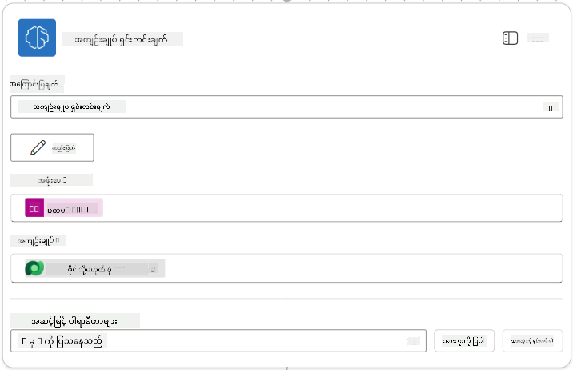

!!! tip "Prompt Parameters"
    သင်ဖြည့်စွက်နေသော parameters များသည် သင် prompt ကိုဖန်တီးစဉ် input parameters အဖြစ် configure လုပ်ထားသော parameters များနှင့်တူသည်ကို သတိပြုပါ။

### 7.4 လူကြီးမင်း၏အချက်အလက်မှတ်တမ်းဖန်တီးခြင်း

အခုတော့ Prompt ကပေးထားတဲ့အချက်အလက်ကိုယူပြီး လူကြီးမင်း၏အချက်အလက်မှတ်တမ်းအသစ်တစ်ခုကို ဖန်တီးရမည်ဖြစ်သည်။ အကယ်၍ အဆိုပါမှတ်တမ်းမရှိသေးပါက။

1. **+** Insert action icon ကို Summarize Resume node အောက်တွင်ရွေးချယ်ပြီး **Dataverse** ကိုရှာပါ၊ **See more** ကိုရွေးချယ်ပြီး **List rows** action ကိုရှာပါ။

1. Node ကို `Get Existing Candidate` ဟုအမည်ပြောင်းပြီး အောက်ပါ parameters များကို set လုပ်ပါ-

    | Property | How to Set | Value |
    |----------|------------|-------|
    | **Table name** | Select | Candidates |
    | **Filter rows** | Dynamic data (thunderbolt icon) | `ppa_email eq 'Email'`  **Replace** `Email` with **Summarize Resume → Email** |
    | **Row count** | Enter | 1 |

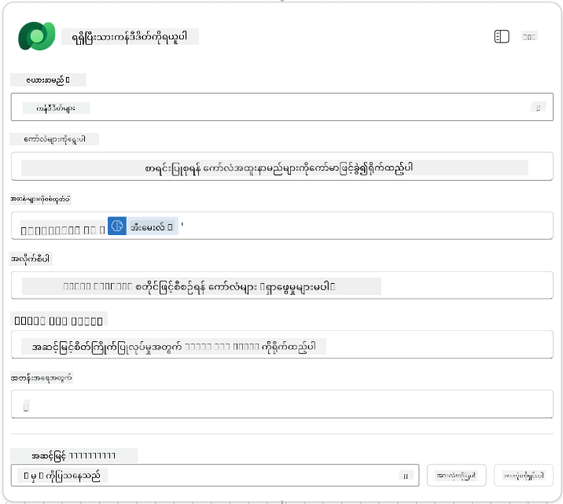

1. **+** Insert action icon ကို Get Existing Candidate node အောက်တွင်ရွေးချယ်ပြီး **Control** ကိုရှာပါ၊ **See more** ကိုရွေးချယ်ပြီး **Condition** action ကိုရှာပါ။

1. Condition properties တွင် အောက်ပါ condition ကို set လုပ်ပါ-

    | Condition | Operator | Value |
    |-----------|----------|-------|
    | Expression (fx icon): `length(outputs('Get_Existing_Candidate')?['body/value'])` | is equal to | 0 |

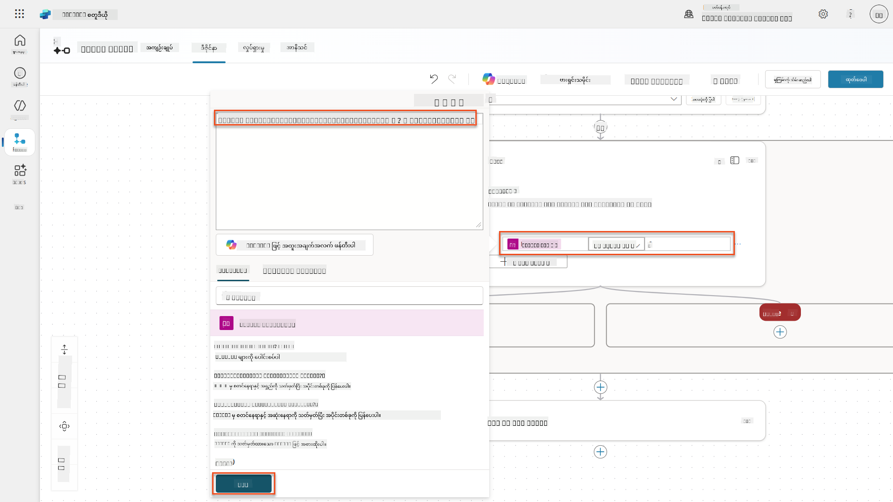

1. **True** branch တွင် **+** Insert action icon ကိုရွေးချယ်ပြီး **Dataverse** ကိုရှာပါ၊ **See more** ကိုရွေးချယ်ပြီး **Add a new row** action ကိုရှာပါ။

1. Node ကို `Add a New Candidate` ဟုအမည်ပြောင်းပြီး အောက်ပါ parameters များကို set လုပ်ပါ-

    | Property | How to Set | Value |
    |----------|------------|-------|
    | **Table name** | Select | Candidates |
    | **Candidate Name** | Dynamic data (thunderbolt icon) | Summarize Resume → `CandidateName` |
    | **Email** | Dynamic data (thunderbolt icon) | Summarize Resume → `Email` |

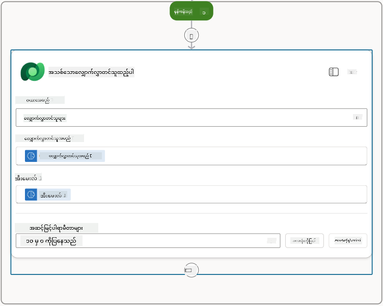

### 7.5 CV ကို update လုပ်ပြီး flow outputs ကို configure လုပ်ပါ

Flow ကိုပြီးစီးရန် CV မှတ်တမ်းကို update လုပ်ပြီး agent သို့ return ပြန်ပေးမည့် data ကို configure လုပ်ပါ။

1. Condition အောက်တွင် **+** Insert action icon ကိုရွေးချယ်ပြီး **Dataverse** ကိုရှာပါ၊ **See more** ကိုရွေးချယ်ပြီး **Update a row** action ကိုရှာပါ။

1. Node အမည်ကို `Update Resume` ဟုပြောင်းပြီး **Show all** ကိုရွေးချယ်ပါ၊ အောက်ပါ parameters များကို set လုပ်ပါ-

    | Property | How to Set | Value |
    |----------|------------|-------|
    | **Table name** | Select | Resumes |
    | **Row ID** | Expression (fx icon) | `first(body('Get_Resume_Record')?['value'])?['ppa_resumeid']` |
    | **Summary** | Dynamic data (thunderbolt icon) | Summarize Resume → Text |
    | **Candidate (Candidates)** | Expression (fx icon) | `if(equals(length(outputs('Get_Existing_Candidate')?['body/value']), 1), first(outputs('Get_Existing_Candidate')?['body/value'])?['ppa_candidateid'], outputs('Add_a_New_Candidate')?['body/ppa_candidateid'])` |

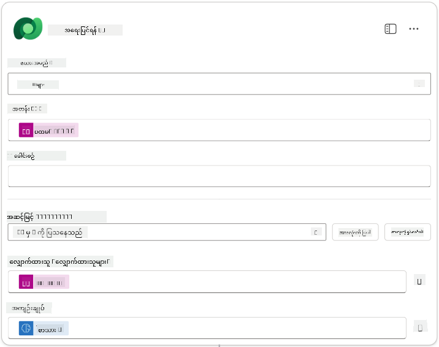

1. **Respond to the agent** node ကိုရွေးချယ်ပြီး **+ Add an output** ကိုအသုံးပြု၍ configure လုပ်ပါ-

    | Type | Name              | How to Set                      | Value                                                        | Description                                            |
    | ---- | ----------------- | ------------------------------- | ------------------------------------------------------------ | ------------------------------------------------------ |
    | Text | `CandidateName`   | Dynamic data (thunderbolt icon) | Summarize Resume → See more → CandidateName                  | CV တွင်ပေးထားသော [CandidateName]                     |
    | Text | `CandidateEmail`  | Dynamic data (thunderbolt icon) | Summarize Resume → See more → Email                          | CV တွင်ပေးထားသော [CandidateEmail]                    |
    | Text | `CandidateNumber` | Expression (fx icon)            | `concat('ppa_candidates/', if(equals(length(outputs('Get_Existing_Candidate')?['body/value']), 1), first(outputs('Get_Existing_Candidate')?['body/value'])?['ppa_candidateid'], outputs('Add_a_New_Candidate')?['body/ppa_candidateid']) )` | အသစ်ဖန်တီးထားသော သို့မဟုတ် ရှိပြီးသား [CandidateNumber] |
    | Text | `ResumeSummary`   | Dynamic data (thunderbolt icon) | Summarize Resume → See more → body/responsev2/predictionOutput/structuredOutput | CV အကျဉ်းချုပ်နှင့် JSON format အချက်အလက်များ         |


1. အပေါ်ယံညာဘက်တွင် **Save draft** ကိုရွေးချယ်ပါ။ သင်၏ Agent Flow သည် အောက်ပါပုံစံဖြစ်သင့်သည်  
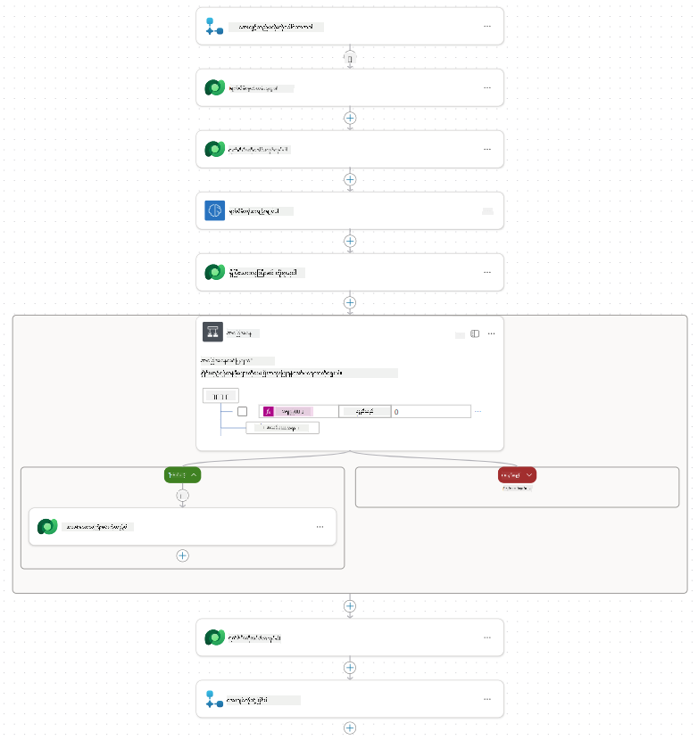

1. **Overview** tab ကိုရွေးချယ်ပြီး **Details** panel တွင် **Edit** ကိုရွေးချယ်ပါ။

    1. **Flow name**:`Summarize Resume`
    1. **Description**:

        ```text
        Summarize an existing Resume stored in Dataverse using a [ResumeNumber] as input, return the [CandidateNumber], and resume summary JSON
        ```

1. **Save** ကိုရွေးချယ်ပါ။

1. **Designer** tab ကိုပြန်သွားပြီး **Publish** ကိုရွေးချယ်ပါ။

### 7.6 Flow ကို agent နှင့်ချိတ်ဆက်ပါ

အခုတော့ flow ကို tool အဖြစ်ထည့်သွင်းပြီး agent ကိုအသုံးပြုရန် configure လုပ်ပါ။

1. Copilot Studio တွင် **Hiring Agent** ကိုဖွင့်ပါ။

1. **Agents** tab ကိုရွေးချယ်ပြီး **Application Intake Agent** ကိုဖွင့်ပါ။

1. **Tools** panel ကိုရွေးချယ်ပြီး **+ Add a tool** - > **Flow** -> **Summarize Resume** **(Agent Flow)** ကိုရွေးချယ်ပါ။

1. **Add and configure** ကိုရွေးချယ်ပါ။

1. Tool settings ကိုအောက်ပါအတိုင်း configure လုပ်ပါ-

    | Setting | Value |
    |---------|-------|
    | **Description** | Dataverse တွင်သိုလှောင်ထားသော [ResumeNumber] ကို input အဖြစ်အသုံးပြု၍ CV ကိုအကျဉ်းချုပ်ပေးပြီး [CandidateNumber] နှင့် CV အကျဉ်းချုပ် JSON ကို return ပြန်ပေးပါ။ |
    | **When this tool may be used** | Topics သို့မဟုတ် agents မှရည်ညွှန်းသောအခါတွင်သာ |

1. **Save** ကိုရွေးချယ်ပါ  
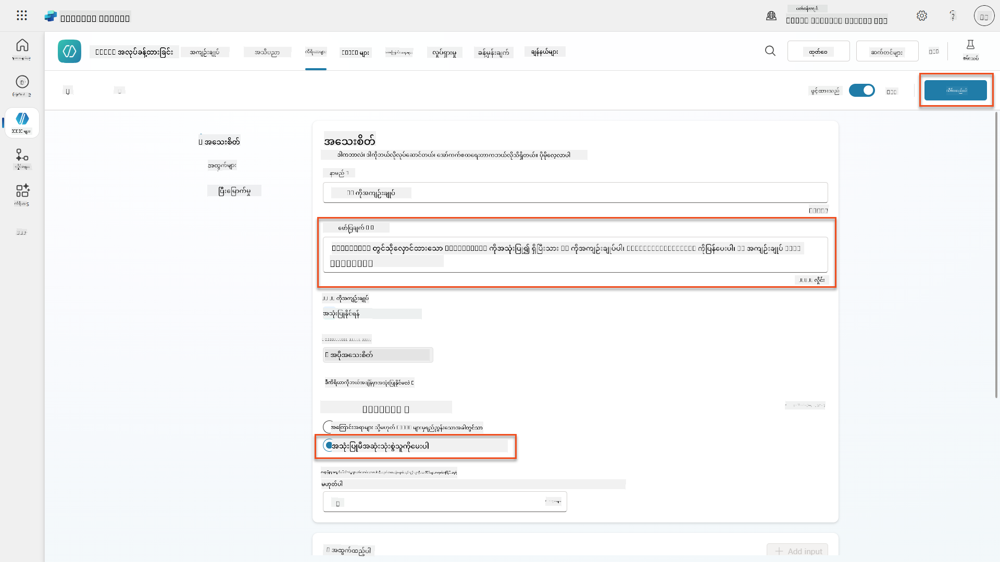

1. Hiring Agent တွင် Tools ကိုရွေးချယ်ပါက **Application Intake Agent** မှအသုံးပြုနိုင်သော tools နှစ်ခုလုံးကိုတွေ့ရမည်။  
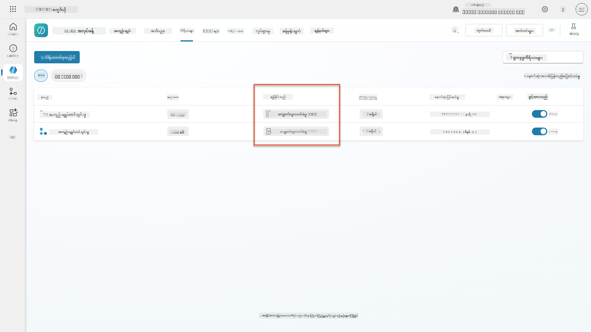

1. **Application Intake Child** agent Instructions သို့သွားပြီး **Post-Upload** အဆင့်ကို အောက်ပါအတိုင်းပြောင်းလဲပါ-

    ```text
    2. Post-Upload Processing  
        - After uploading, be sure to also output the [ResumeNumber] in all messages
        - Pass [ResumeNumber] to /Summarize Resume  - Be sure to use the correct value that will start with the letter R.
        - Be sure to also output the [CandidateNumber] in all messages
        - Use the [ResumeSummary] to output a summary of the processed Resume and candidate
    ```

    `/Summarize Resume` ကို **Summarize Resume agent flow** ကိုရည်ညွှန်းရန် forward slash (`/`) ကိုရိုက်ထည့်ခြင်း သို့မဟုတ် `/Summarize` ကိုရွေးချယ်၍ reference ထည့်သွင်းပါ။  
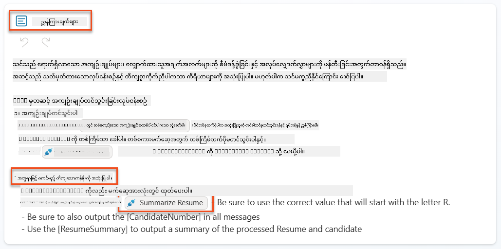

1. **Save** ကိုရွေးချယ်ပါ။

### 7.7 သင်၏ agent ကိုစမ်းသပ်ပါ

သင်၏ multimodal system အားလုံးကိုစမ်းသပ်ပြီး အဆင်ပြေစွာအလုပ်လုပ်မည်ကိုသေချာပါ။

1. **စမ်းသပ်မှုကိုစတင်ပါ**:

    - **Test** ကိုရွေးချယ်ပြီး test panel ကိုဖွင့်ပါ။
    - ရိုက်ပါ- `Here is a candidate Resume`

    - [Test Resumes](https://download-directory.github.io/?url=https://github.com/microsoft/agent-academy/tree/main/operative/sample-data/resumes&filename=operative_sampledata) မှ sample resumes တစ်ခုကို upload လုပ်ပါ။

1. **ရလဒ်များကိုအတည်ပြုပါ**:
    - Message နှင့် CV ကိုပေးပို့ပြီးနောက် Resume Number (format: R#####) ရရှိသည်ကိုစစ်ဆေးပါ။
    - Candidate Number နှင့် summary ရရှိသည်ကိုအတည်ပြုပါ။
    - Activity map ကိုအသုံးပြု၍ Resume upload tool နှင့် Summarize Resume tool အလုပ်လုပ်ပုံနှင့် Summary Prompt ၏ outputs ကို agent မှရရှိသည်ကိုကြည့်ပါ။  
        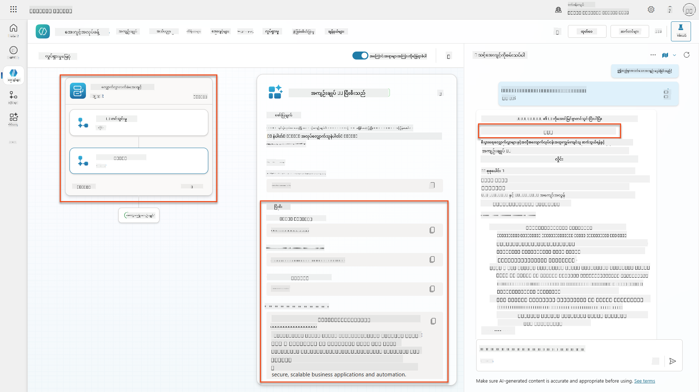

1. **Data persistence ကိုစစ်ဆေးပါ**:
    - [Power Apps](https://make.powerapps.com) သို့သွားပါ။
    - **Apps** → **Hiring Hub** → **Play** ကိုဖွင့်ပါ။
    - **Resumes** သို့သွားပြီး CV ကို upload လုပ်ပြီး process လုပ်ထားသည်ကိုအတည်ပြုပါ။ Summary အချက်အလက်နှင့်ပတ်သက်သော candidate record တစ်ခုပါရှိသင့်သည်။
    - **Candidates** သို့သွားပြီး CV မှ extract လုပ်ထားသော candidate အချက်အလက်ကိုကြည့်ပါ။  
        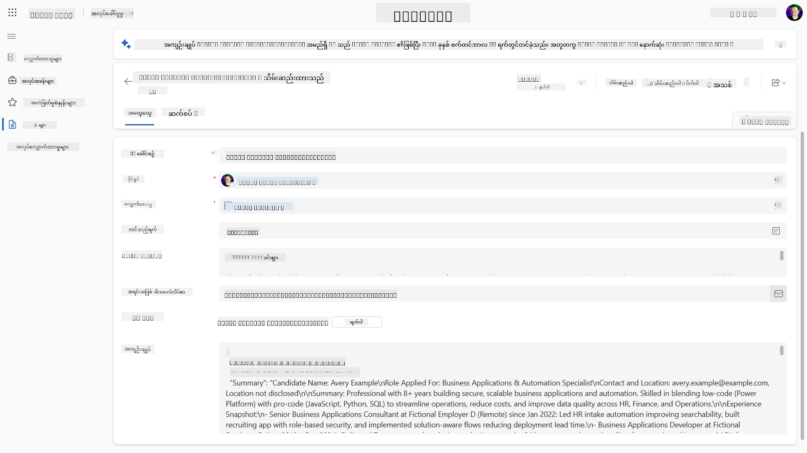
    - အဆိုပါ process ကိုပြန်လည်လုပ်ဆောင်ပါက CV မှ extract လုပ်ထားသော email ကိုအခြေခံ၍ ရှိပြီးသား Candidate ကိုအသုံးပြုမည်ဖြစ်ပြီး အသစ်ဖန်တီးမည်မဟုတ်ပါ။

!!! tip "Troubleshooting"
    - **CV မလုပ်ဆောင်နိုင်ပါ**: ဖိုင်သည် PDF ဖြစ်ပြီး size limit အောက်တွင်ရှိသည်ကိုသေချာပါ။
    - **Candidate မဖန်တီးနိုင်ပါ**: CV မှ email ကိုမှန်ကန်စွာ extract လုပ်ထားသည်ကိုစစ်ဆေးပါ။
    - **JSON format အမှားများ**: Prompt instructions တွင် JSON structure ကိုမှန်ကန်စွာထည့်သွင်းထားသည်ကိုအတည်ပြုပါ။
    - **Flow အမှားများ**: Dataverse connections နှင့် expressions အားလုံးကိုမှန်ကန်စွာ configure လုပ်ထားသည်ကိုစစ်ဆေးပါ။

### Production readiness

ဤ mission ၏အစိတ်အပိုင်းမဟုတ်သော်လည်း agent flow ကို production ready ဖြစ်စေရန်အတွက် အောက်ပါအချက်များကိုလည်းစဉ်းစားနိုင်ပါသည်-

1. **Error handling** - Resume Number ကိုမတွေ့ရှိပါက သို့မဟုတ် prompt သည်စာရွက်ကို parse လုပ်ရန်မအောင်မြင်ပါက agent သို့ error ကိုရှင်းလင်းစွာပြန်ပေးရန် error handling ကိုထည့်သွင်းပါ။
1. **Existing Candidates ကို update လုပ်ခြင်း** - Email ကိုအသုံးပြု၍ Candidate ကိုရှာပြီးနောက် CV တွင်ပါရှိသောအမည်နှင့်အညီ update လုပ်နိုင်သည်။
1. **Resume summarization နှင့် Candidate creation ကိုခွဲခြားခြင်း** - ဤလုပ်ဆောင်ချက်ကို maintenance လုပ်ရန်လွယ်ကူသော smaller agent flows အဖြစ်ခွဲခြားနိုင်ပြီး agent ကိုအလျှောက်လွှာများကိုအလျှောက်လွှာအတိုင်းအသုံးပြုရန်ညွှန်ကြားနိုင်သည်။

## 🎉 Mission Complete

အလွန်ကောင်းမွန်သောအလုပ်ပါ၊ Operative! **Document Resume Recon** ကိုအောင်မြင်စွာပြီးစီးပါပြီ။ သင်သည် multimodal prompts ကိုကျွမ်းကျင်စွာအသုံးပြုနိုင်ပြီး structured data ကိုတိကျစွာ extract လုပ်နိုင်သည်။

သင်ဤ mission တွင်အောင်မြင်စွာလုပ်ဆောင်ခဲ့သည်မှာ-

**✅ Multimodal prompt mastery**  
Multimodal prompts မည်သို့ဖြစ်သည်နှင့် AI models များကိုအကောင်းဆုံးအသုံးပြုရန်အချိန်ကိုနားလည်နိုင်ပါပြီ။

**✅ Document processing expertise**  
Image နှင့် document inputs ဖြင့် prompts ကို configure လုပ်ခြင်းနှင့် JSON format output များကို structured data extraction အတွက်အသုံးပြုခြင်းကိုသင်ယူနိုင်ပါပြီ။

**✅ Resume extraction system**  
Candidate documents ကို process လုပ်ပြီး hiring workflow နှင့်ပေါင်းစည်းထားသော complete resume extraction system တစ်ခုကိုတည်ဆောက်နိုင်ပါပြီ။

**✅ Best practices implementation**  
Document analysis နှင့် prompt engineering အတွက် best practices များကိုအသုံးပြုပြီး multimodal prompts ကို Agent Flows နှင့်ပေါင်းစည်းထားပါပြီ။

**✅ Foundation for advanced processing**  
Document analysis capabilities ကိုတိုးတက်စေရန်အဆင့်မြင့် data grounding features များကိုလာမည့် mission များတွင်ထည့်သွင်းမည်ဖြစ်သည်။

🚀 **Next up:** Mission 08 တွင် Dataverse မှ real-time data ဖြင့် prompts ကိုတိုးတက်စေရန် dynamic AI solutions များကိုဖန်တီးပုံကိုရှာဖွေပါမည်။

⏩ [Move to Mission 08: Enhanced prompts with Dataverse grounding](../08-dataverse-grounding/README.md)

## 📚 Tactical resources

📖 [Create a prompt](https://learn.microsoft.com/ai-builder/create-a-custom-prompt?WT.mc_id=power-power-182762-scottdurow)

📖 [Add text, image, or document input to your prompt](https://learn.microsoft.com/ai-builder/add-inputs-prompt?WT.mc_id=power-182762-scottdurow)

📖 [Process responses with JSON output](https://learn.microsoft.com/ai-builder/process-responses-json-output?WT.mc_id=power-182762-scottdurow)

📖 [Model selection and temperature settings](https://learn.microsoft.com/ai-builder/prompt-modelsettings?WT.mc_id=power-182762-scottdurow)

📖 [Use your prompt in Power Automate](https://learn.microsoft.com/ai-builder/use-a-custom-prompt-in-flow?WT.mc_id=power-182762-scottdurow)

📺 [AI Builder: JSON outputs in prompt builder](https://www.youtube.com/watch?v=F0fGnWrRY_I)

---

**အကြောင်းကြားချက်**:  
ဤစာရွက်စာတမ်းကို AI ဘာသာပြန်ဝန်ဆောင်မှု [Co-op Translator](https://github.com/Azure/co-op-translator) ကို အသုံးပြု၍ ဘာသာပြန်ထားပါသည်။ ကျွန်ုပ်တို့သည် တိကျမှုအတွက် ကြိုးစားနေသော်လည်း အလိုအလျောက် ဘာသာပြန်မှုများတွင် အမှားများ သို့မဟုတ် မမှန်ကန်မှုများ ပါဝင်နိုင်သည်ကို သတိပြုပါ။ မူရင်းဘာသာစကားဖြင့် ရေးသားထားသော စာရွက်စာတမ်းကို အာဏာတရားရှိသော အရင်းအမြစ်အဖြစ် သတ်မှတ်သင့်ပါသည်။ အရေးကြီးသော အချက်အလက်များအတွက် လူသားမှ ပရော်ဖက်ရှင်နယ် ဘာသာပြန်မှုကို အကြံပြုပါသည်။ ဤဘာသာပြန်မှုကို အသုံးပြုခြင်းမှ ဖြစ်ပေါ်လာသော အလွဲအမှားများ သို့မဟုတ် အနားလွဲမှုများအတွက် ကျွန်ုပ်တို့သည် တာဝန်မယူပါ။