<!--
CO_OP_TRANSLATOR_METADATA:
{
  "original_hash": "750f3ea8a94930439ebd8a10871b1d73",
  "translation_date": "2025-10-21T17:45:43+00:00",
  "source_file": "docs/operative-preview/08-dataverse-grounding/README.md",
  "language_code": "my"
}
-->
# 🚨 Mission 08: Dataverse grounding ဖြင့် Prompt များကို တိုးတက်စေခြင်း

--8<-- "disclaimer.md"

## 🕵️‍♂️ CODENAME: `OPERATION GROUNDING CONTROL`

> **⏱️ လုပ်ဆောင်ရန်အချိန်:** `~60 မိနစ်`

## 🎯 မစ်ရှင်အကျဉ်းချုပ်

ပြန်လာပါ Operative။ သင့် multi-agent အလုပ်ခန့်ထားမှုစနစ်က အလုပ်လုပ်နေပြီးသားဖြစ်ပေမယ့် **ဒေတာအခြေခံမှု** အတွက် အရေးကြီးသော တိုးတက်မှုတစ်ခု လိုအပ်နေပါတယ် - သင့် AI မော်ဒယ်များသည် သင့်အဖွဲ့အစည်း၏ ဖွဲ့စည်းထားသော ဒေတာများကို အချိန်နှင့်တပြေးညီ ဝင်ရောက်ကြည့်ရှုနိုင်ရန် လိုအပ်ပါတယ်။

လက်ရှိတွင် သင့် Summarize Resume prompt သည် အတည်ပြုထားသော အသိပညာဖြင့်သာ အလုပ်လုပ်နေသည်။ ဒါပေမယ့် အလုပ်အကိုင်အခန်းကဏ္ဍများ database ကို dynamic access လုပ်နိုင်ပြီး တိကျမှန်ကန်သော အလုပ်အကိုင်ကိုက်ညီမှုများပေးနိုင်မယ်ဆိုရင်ရော ဘာဖြစ်မလဲ။ သို့မဟုတ် သင့်အဖွဲ့အစည်း၏ အကဲဖြတ်မှုစံနှုန်းများကို hardcode မလုပ်ဘဲ နားလည်နိုင်မလား။

ဒီမစ်ရှင်မှာ သင့် custom prompt ကို **Dataverse grounding** ဖြင့် တိုးတက်စေပါမည် - prompt များကို live data sources တွေကို တိုက်ရိုက်ချိတ်ဆက်ခြင်းဖြင့် တိုးတက်စေပါမည်။ ဒါက သင့် agent များကို static responder များမှ dynamic, data-driven စနစ်များအဖြစ် ပြောင်းလဲစေပြီး အဖွဲ့အစည်း၏ လိုအပ်ချက်များ ပြောင်းလဲမှုအပေါ် အလိုအလျောက် အလျင်အမြန် တုံ့ပြန်နိုင်စေပါမည်။

သင့်မစ်ရှင်: real-time အလုပ်အကိုင်အခန်းကဏ္ဍများနှင့် အကဲဖြတ်မှုစံနှုန်းများကို သင့် resume analysis workflow တွင် ထည့်သွင်းပြီး သင့်အဖွဲ့အစည်း၏ အလုပ်ခန့်ထားမှုလိုအပ်ချက်များနှင့်အတူ အမြဲတမ်း current ဖြစ်နေသော စနစ်တစ်ခုကို ဖန်တီးပါ။

## 🔎 ရည်မှန်းချက်များ

ဒီမစ်ရှင်မှာ သင်လေ့လာရမည့်အရာများ:

1. **Dataverse grounding** သည် custom prompt များကို ဘယ်လိုတိုးတက်စေသလဲ
1. data grounding ကို static instructions နှင့် ဘယ်အချိန်မှာ အသုံးပြုရမလဲ
1. live data ကို dynamic ထည့်သွင်းထားသော prompt များကို ဒီဇိုင်းဆွဲခြင်း
1. Summarize Resume flow ကို အလုပ်အကိုင်ကိုက်ညီမှုဖြင့် တိုးတက်စေခြင်း

## 🧠 Prompt များအတွက် Dataverse grounding ကို နားလည်ခြင်း

**Dataverse grounding** သည် သင့် custom prompt များကို Dataverse tables မှ live data ကို request များကို process လုပ်စဉ်တွင် access လုပ်နိုင်စေသည်။ static instructions များအစား prompt များသည် real-time အချက်အလက်များကို ထည့်သွင်းပြီး ဆုံးဖြတ်ချက်များကို ပိုမိုတိကျစေသည်။

### Dataverse grounding အရေးကြီးသောအကြောင်း

ရိုးရိုး prompt များသည် fixed instructions များနှင့်အတူ အလုပ်လုပ်သည်:

```text
Match this candidate to these job roles: Developer, Manager, Analyst
```

Dataverse grounding ဖြင့် prompt သည် လက်ရှိ data ကို access လုပ်သည်:

```text
Match this candidate to available job roles from the Job Roles table, 
considering current evaluation criteria and requirements
```

ဒီနည်းလမ်းက အဓိကအားသာချက်များစွာပေးသည်:

- **Dynamic updates:** အလုပ်အကိုင်အခန်းကဏ္ဍများနှင့် စံနှုန်းများကို prompt ကို ပြင်ဆင်စရာမလိုဘဲ ပြောင်းလဲနိုင်သည်
- **Consistency:** Agent များအားလုံးသည် တူညီသော လက်ရှိ data sources များကို အသုံးပြုသည်
- **Scalability:** အလုပ်အကိုင်အခန်းကဏ္ဍအသစ်များနှင့် စံနှုန်းများကို အလိုအလျောက် ရရှိနိုင်သည်
- **Accuracy:** Real-time data သည် လက်ရှိလိုအပ်ချက်များကို အတိအကျအတိုင်း ဆုံးဖြတ်ချက်များပေးသည်

### Dataverse grounding ဘယ်လိုအလုပ်လုပ်သလဲ

Dataverse grounding ကို custom prompt အတွက် enable လုပ်သောအခါ:

1. **Data selection:** Dataverse tables နှင့် columns အတိအကျရွေးချယ်ပါ။ parent records များကို retrieve လုပ်ပြီး filter လုပ်သည့် related tables များကိုလည်း ရွေးချယ်နိုင်သည်။
1. **Context injection:** Prompt သည် retrieve လုပ်ထားသော data ကို prompt context တွင် အလိုအလျောက် ထည့်သွင်းသည်
1. **Intelligent filtering:** Filtering ပေးထားပါက request လက်ရှိအတွက် သက်ဆိုင်သော data ကိုသာ ထည့်သွင်းသည်။
1. **Structured output:** Prompt သည် retrieve လုပ်ထားသော data ကို reference လုပ်ပြီး records များကို reasoning လုပ်ကာ output ကို ဖန်တီးနိုင်သည်။

### Static မှ Dynamic: Grounding အားသာချက်

Mission 07 မှ Summarize Resume flow ကို ကြည့်ပြီး Dataverse grounding သည် static intelligence မှ dynamic intelligence သို့ ဘယ်လိုပြောင်းလဲစေသလဲကို ကြည့်ပါ။

**လက်ရှိ static နည်းလမ်း:**
လက်ရှိ prompt သည် hardcoded အကဲဖြတ်မှုစံနှုန်းများနှင့် predetermined matching logic များပါဝင်သည်။ ဒီနည်းလမ်းက အလုပ်လုပ်ပေမယ့် အလုပ်အကိုင်အခန်းကဏ္ဍအသစ်များထည့်သွင်းခြင်း၊ အကဲဖြတ်မှုစံနှုန်းများပြောင်းလဲခြင်း၊ သို့မဟုတ် အဖွဲ့အစည်း၏ ဦးစားပေးမှုများပြောင်းလဲခြင်းတိုင်းမှာ manual updates လုပ်ရန်လိုအပ်သည်။

**Dataverse grounding transformation:**
Dataverse grounding ကို ထည့်သွင်းခြင်းဖြင့် သင့် Summarize Resume flow သည်:

- **လက်ရှိအလုပ်အကိုင်အခန်းကဏ္ဍများကို** Job Roles table မှ access လုပ်နိုင်သည်
- **Live အကဲဖြတ်မှုစံနှုန်းများကို** static ဖော်ပြချက်များအစား အသုံးပြုနိုင်သည်  
- **တိကျမှန်ကန်သော ကိုက်ညီမှုများကို** လက်ရှိလိုအပ်ချက်များအပေါ် အခြေခံပြီး ပေးနိုင်သည်

## 🎯 Dedicated prompts နှင့် agent conversations

Mission 02 တွင် သင် Interview Agent ကို အသုံးပြုကာ candidate များကို အလုပ်အကိုင်အခန်းကဏ္ဍများနှင့် ကိုက်ညီစေခဲ့ပေမယ့် အောက်ပါအတိုင်း ရှုပ်ထွေးသော user prompts များလိုအပ်ခဲ့သည်:

```text
Upload this resume, then show me open job roles,
each with a description of the evaluation criteria, 
then use this to match the resume to at least one suitable
job role even if not a perfect match.
```

ဒါပေမယ့် Dataverse grounding ပါဝင်သော dedicated prompts များသည် အထူးလုပ်ငန်းတာဝန်များအတွက် အရေးကြီးသော အားသာချက်များပေးသည်:

### Dedicated prompts ၏ အဓိကအားသာချက်များ

| Aspect | Agent Conversations | Dedicated Prompts |
|--------|-------------------|------------------|
| **Consistency** | User ၏ prompt crafting ကျွမ်းကျင်မှုအပေါ် အခြေခံပြီး ရလဒ်များကွဲပြားနိုင်သည် | အချိန်တိုင်းမှာ standardized processing ရရှိနိုင်သည် |
| **Specialization** | General-purpose reasoning သည် လုပ်ငန်း၏ အထူးအချက်များကို လွဲချော်နိုင်သည် | လုပ်ငန်း logic ကို optimize လုပ်ထားသော purpose-built |
| **Automation** | လူ့ interaction နှင့် အဓိပ္ပါယ်ဖော်ထုတ်မှု လိုအပ်သည် | Structured JSON output ဖြင့် အလိုအလျောက် trigger ဖြစ်သည် |

## 🧪 Lab 8: Prompt များကို Dataverse grounding ဖြင့် တိုးတက်စေခြင်း

အလုပ်အကိုင်ကိုက်ညီမှုကို dynamic ဖြစ်စေသော Summarize Resume flow ကို တိုးတက်စေပါမည်။

### ဒီမစ်ရှင်ကို ပြီးမြောက်စေရန်လိုအပ်ချက်များ

1. သင် **အောက်ပါအရာများထဲမှ တစ်ခုကို** လိုအပ်ပါမည်:

    - **Mission 07 ကို ပြီးမြောက်ထားပြီး** သင့် resume analysis system ကို အသင့်ရှိထားခြင်း **သို့မဟုတ်**
    - **Mission 08 starter solution ကို Import လုပ်ထားခြင်း** သင်စတင်နေခြင်း သို့မဟုတ် catch up လုပ်ရန်လိုအပ်ပါက [Download Mission 08 Starter Solution](https://aka.ms/agent-academy)

1. [test Resumes](https://download-directory.github.io/?url=https://github.com/microsoft/agent-academy/tree/main/operative/sample-data/resumes&filename=operative_sampledata) မှ sample resume documents

!!! note "Solution Import နှင့် Sample Data"
    Starter solution ကို အသုံးပြုနေပါက [Mission 01](../01-get-started/README.md) တွင် ဖော်ပြထားသော solution များနှင့် sample data များကို သင့် environment ထဲသို့ import လုပ်နည်းကို ကြည့်ပါ။

### 8.1 Prompt ကို Dataverse grounding ဖြင့် တိုးတက်စေခြင်း

Mission 07 တွင် ဖန်တီးထားသော Summarize Resume prompt ကို အခြေခံပြီး တိုးတက်စေပါမည်။ လက်ရှိတွင် resume ကို ရှင်းလင်းဖော်ပြပေးသည့်အတိုင်းသာ အလုပ်လုပ်သည်။ Dataverse grounding ဖြင့် အလုပ်အကိုင်အခန်းကဏ္ဍများကို အမြဲ current ဖြစ်စေပါမည်။

Dataverse tables များကို grounding လုပ်မည့်အခါ အရင်ဆုံး ကြည့်ပါ:

1. **Navigate** to [Power Apps](https://make.powerapps.com) နှင့် navigation bar ၏ အပေါ်ယာဉ်ဘက်ရှိ **Environment switcher** ကို အသုံးပြုကာ သင့် environment ကို ရွေးပါ။

1. **Tables** ကို ရွေးပြီး **Job Roles** table ကို ရှာပါ။

1. Grounding အတွက် အသုံးပြုမည့် အဓိက columns များကို ပြန်လည်သုံးသပ်ပါ:

    | Column | Purpose |
    |--------|---------|
    | **Job Role Number** | Role matching အတွက် unique identifier |
    | **Job Title** | Role အတွက် display name |
    | **Description** | Role requirements အကြောင်းအရာအသေးစိတ် |

1. အခြား tables များဖြစ်သော **Evaluation Criteria** table ကိုလည်း ပြန်လည်သုံးသပ်ပါ။

### 8.2 Prompt တွင် Dataverse grounding data ကို ထည့်သွင်းခြင်း

1. **Navigate** to Copilot Studio, navigation bar ၏ အပေါ်ယာဉ်ဘက်ရှိ **Environment switcher** ကို အသုံးပြုကာ သင့် environment ကို ရွေးပါ။

1. **Tools** ကို ဘယ်ဘက် navigation မှာ ရွေးပါ။

1. **Prompt** ကို ရွေးပြီး Mission 07 မှ သင့် **Summarize Resume** prompt ကို ရှာပါ။  
    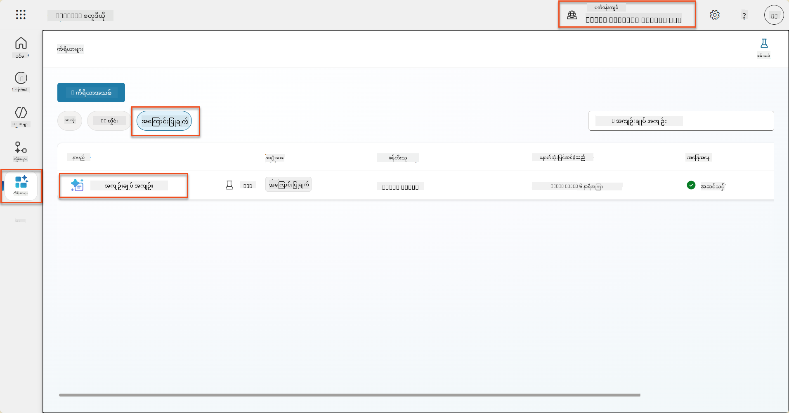

1. **Edit** ကို ရွေးပြီး prompt ကို ပြင်ဆင်ကာ အောက်ပါ enhanced version ဖြင့် အစားထိုးပါ:

    !!! important
        Resume နှင့် Cover Letter parameters များကို parameter အဖြစ် intact ဖြစ်နေစေပါ။

    ```text
    You are tasked with extracting key candidate information from a resume and cover letter to facilitate matching with open job roles and creating a summary for application review.
    
    ### Instructions:
    1. **Extract Candidate Details:**
       - Identify and extract the candidate's full name.
       - Extract contact information, specifically the email address.
    
    2. **Analyze Resume and Cover Letter:**
       - Review the resume content to identify relevant skills, experience, and qualifications.
       - Review the cover letter to understand the candidate's motivation and suitability for the roles.
    
    3. **Match Against Open Job Roles:**
       - Compare the extracted candidate information with the requirements and descriptions of the provided open job roles.
       - Use the job descriptions to assess potential fit.
       - Identify all roles that align with the candidate's cover letter and profile. You don't need to assess perfect suitability.
       - Provide reasoning for each match based on the specific job requirements.
    
    4. **Create Candidate Summary:**
       - Summarize the candidate's profile as multiline text with the following sections:
          - Candidate name
          - Role(s) applied for if present
          - Contact and location
          - One-paragraph summary
          - Top skills (8–10)
          - Experience snapshot (last 2–3 roles with outcomes)
          - Key projects (1–3 with metrics)
          - Education and certifications
          - Availability and work authorization
    
    ### Output Format
    
    Provide the output in valid JSON format with the following structure:
    
    {
      "CandidateName": "string",
      "Email": "string",
      "MatchedRoles": [
        {
          "JobRoleNumber": "ppa_jobrolenumber from grounded data",
          "RoleName": "ppa_jobtitle from grounded data",
          "Reasoning": "Detailed explanation based on job requirements"
        }
      ],
      "Summary": "string"
    }
    
    ### Guidelines
    
    - Extract information only from the provided resume and cover letter documents.
    - Ensure accuracy in identifying contact details.
    - Use the available job role data for matching decisions.
    - The summary should be concise but informative, suitable for quick application review.
    - If no suitable matches are found, indicate an empty list for MatchedRoles and explain briefly in the summary.
    
    ### Input Data
    Open Job Roles (ppa_jobrolenumber, ppa_jobtitle): /Job Role 
    Resume: {Resume}
    Cover Letter: {CoverLetter}
    ```

1. Prompt editor တွင် `/Job Role` ကို အစားထိုးရန် **+ Add content** ကို ရွေးပြီး **Dataverse** → **Job Role** ကို ရွေးကာ အောက်ပါ columns များကို ရွေးပြီး **Add** ကို ရွေးပါ:

    1. **Job Role Number**

    1. **Job Title**

    1. **Description**

    !!! tip
        Table name ကို ရှာရန် type လုပ်နိုင်သည်။

1. **Job Role** dialog တွင် **Filter** attribute ကို ရွေးပြီး **Status** ကို ရွေးကာ **Filter** value အဖြစ် **Active** ကို type လုပ်ပါ။  
    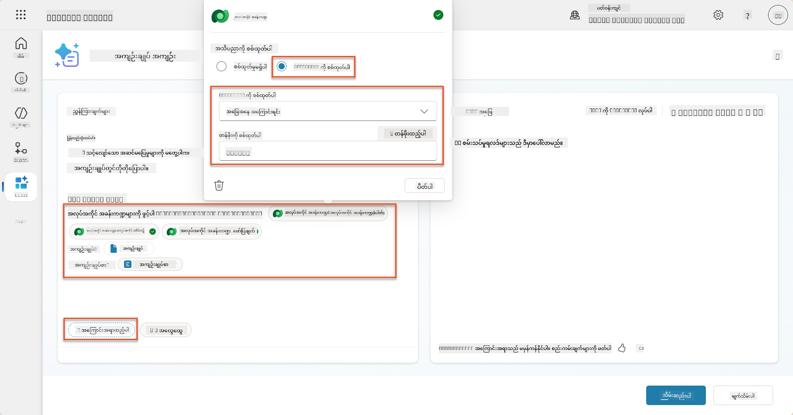

    !!! tip
        **Add value** ကို အသုံးပြုကာ input parameter ကို ထည့်သွင်းနိုင်သည် - ဥပမာအားဖြင့် ရှိပြီးသား record ကို summarize prompt ရှိပါက Resume Number ကို parameter အဖြစ်ပေးကာ filter လုပ်နိုင်သည်။

1. Dataverse table **Evaluation Criteria** ကို ထပ်မံထည့်သွင်းရန် **+ Add content** ကို ရွေးပြီး **Job Roles** ကို ရှာပါ၊ Job Role columns များကို ရွေးခြင်းအစား **Job Role (Evaluation Criteria)** ကို expand လုပ်ကာ အောက်ပါ columns များကို ရွေးပြီး **Add** ကို ရွေးပါ:

    1. **Criteria Name**

    1. **Description**  
        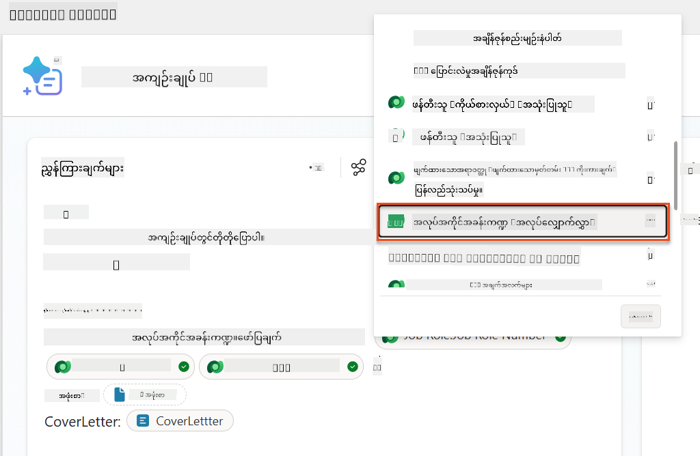

        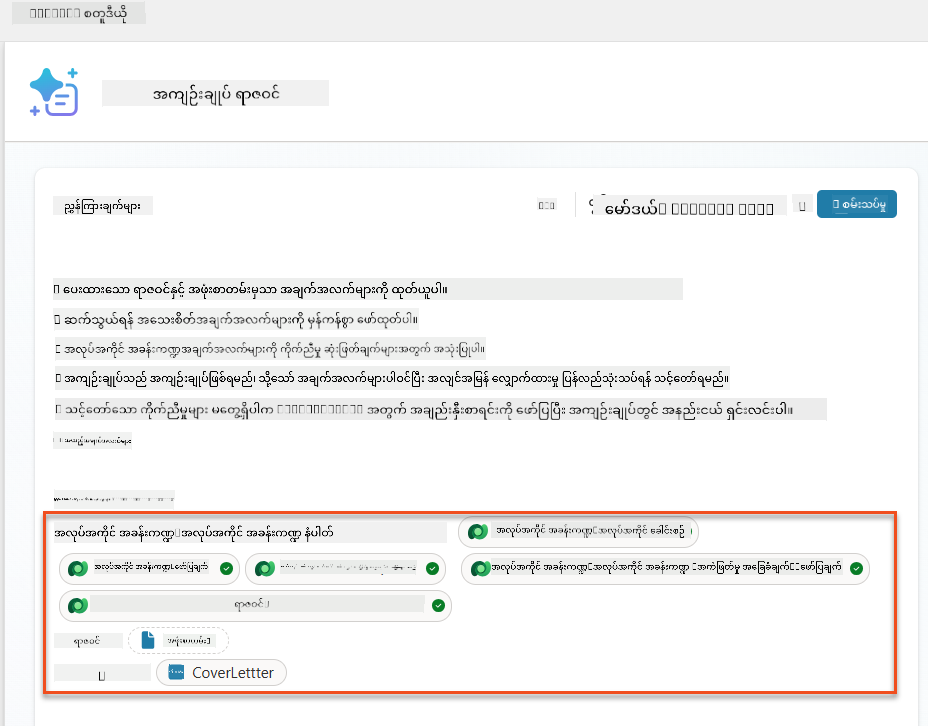

    !!! tip
        Related Evaluation Criteria ကို ရွေးရန်အတွက် Job Role ကို အရင်ဆုံး ရွေးပြီး menu တွင် Job Role (Evaluation Criteria) သို့ သွားပါ။ ဒါက Job Role အတွက် သက်ဆိုင်သော records များသာ load လုပ်စေပါမည်။

1. **Settings** ကို ရွေးပြီး **Record retrieval** ကို 1000 သို့ ပြောင်းပါ - ဒါက prompt တွင် အလုပ်အကိုင်အခန်းကဏ္ဍများနှင့် Evaluation criteria များကို အများဆုံး ထည့်သွင်းနိုင်စေပါမည်။  
    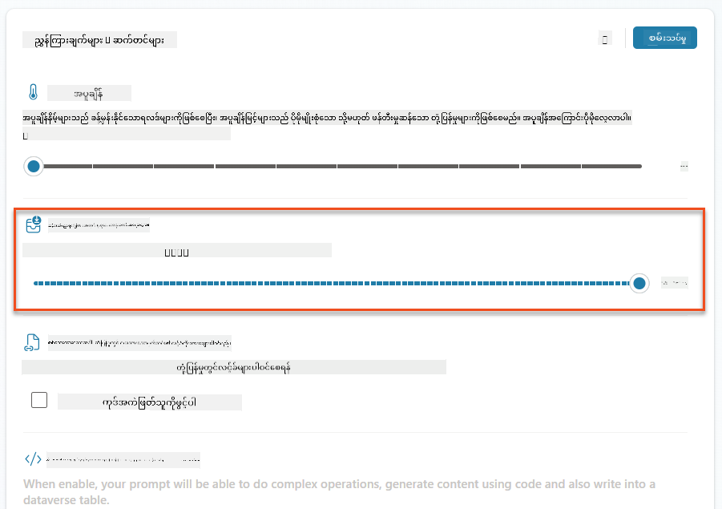

### 8.3 Enhanced prompt ကို စမ်းသပ်ခြင်း

1. **Resume** parameter ကို ရွေးပြီး Mission 07 တွင် အသုံးပြုထားသော sample resume ကို upload လုပ်ပါ။
1. **Test** ကို ရွေးပါ။
1. Test ပြီးဆုံးသောအခါ JSON output တွင် **Matched Roles** ပါဝင်နေသည်ကို သတိပြုပါ။
1. **Knowledge used** tab ကို ရွေးကာ prompt execution မပြုမီ Dataverse data နှင့် prompt ပေါင်းစပ်မှုကို ကြည့်ပါ။
1. **Save** သင့် updated prompt ကို **Save** လုပ်ပါ။ အခုမှစ၍ system သည် Summarize Resume Agent Flow ကို ခေါ်သည့်အခါ prompt နှင့်အတူ Dataverse data ကို အလိုအလျောက် ထည့်သွင်းပါမည်။  
    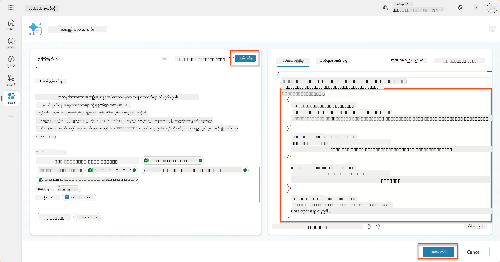

### 8.4 Job Application Agent Flow ကို ထည့်သွင်းခြင်း

Candidate ၏ စိတ်ဝင်စားသော suggested roles အပေါ်အခြေခံကာ Job Roles များကို ဖန်တီးရန် Application Intake Agent ကို Agent Flow ဖန်တီးရန်လိုအပ်ပါမည်။ Agent သည် candidate စိတ်ဝင်စားသော suggested job roles တစ်ခုစီအတွက် tool ကို ခေါ်ပါမည်။

!!! tip "Agent Flow Expressions"
    Node များကို အမည်ပေးခြင်းနှင့် expressions ထည့်သွင်းခြင်းအတွက် အတိအကျ လိုက်နာရန် အရေးကြီးသည်။ Expressions များသည် အရင် node များကို အမည်ဖြင့် ရည်ညွှန်းသည်။ [Agent Flow mission in Recruit](../../recruit/09-add-an-agent-flow/README.md#you-mentioned-expressions-what-are-expressions) တွင် expressions အကြောင်းကို အမြန်ပြန်လည်သုံးသပ်ပါ။

1. **Hiring Agent** အတွင်း **Agents** tab ကို ရွေးပြီး **Application Intake Agent** child agent ကို ဖွင့်ပါ။

1. **Tools** panel အတွင်း **+ Add** → **+ New tool** → **Agent Flow** ကို ရွေးပါ။

1. **When an agent calls the flow** node ကို ရွေးပြီး **+ Add an input** ကို အသုံးပြုကာ အောက်ပါ parameter ကို ထည့်သွင်းပါ:

    | Type | Name            | Description                                                  |
    | ---- | --------------- | ------------------------------------------------------------ |
    | Text | `ResumeNumber`  | [ResumeNumber] ကိုသာ အသုံးပြုပါ - အစမှာ R နဲ့ စရမည် |
    | Text | `JobRoleNumber` | [JobRoleNumber] ကိုသာ အသုံးပြုပါ - အစမှာ J နဲ့ စရမည် |

    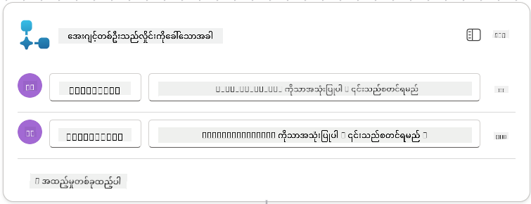

1. **+** Insert action icon ကို **Get Resume** node အောက်တွင် ရွေးပြီး **Dataverse** ကို ရှာပါ၊ **See more** ကို ရွေးပြီး **List rows** action ကို ရှာပါ။

1. Node ကို **Get Resume** အဖြစ် **Rename** လုပ်ပြီး အောက်ပါ parameters များကို သတ်မှတ်ပါ:

    | Property        | How to Set                      | Value                                                        |
    | --------------- | ------------------------------- | ------------------------------------------------------------ |
    | **Table name**  | Select                          | Resumes                                                      |
    | **Filter rows** | Dynamic data (thunderbolt icon) | `ppa_resumenumber eq 'ResumeNumber'` Select and replace **ResumeNumber** with **When an agent calls the flow**
| **အလုပ်အကိုင်အခန်းကဏ္ဍ (Job Roles)** | Expression (fx icon) | `concat('ppa_jobroles/',first(outputs('Get_Job_Role')?['body/value'])?['ppa_jobroleid'])` |
| **အလုပ်လျှောက်လွှာ (Resumes)**         | Expression (fx icon) | `concat('ppa_resumes/', first(outputs('Get_Resume')?['body/value'])?['ppa_resumeid'])` |
| **လျှောက်လွှာရက်စွဲ** (use **Show all**) | Expression (fx icon) | `utcNow()`                                                   |

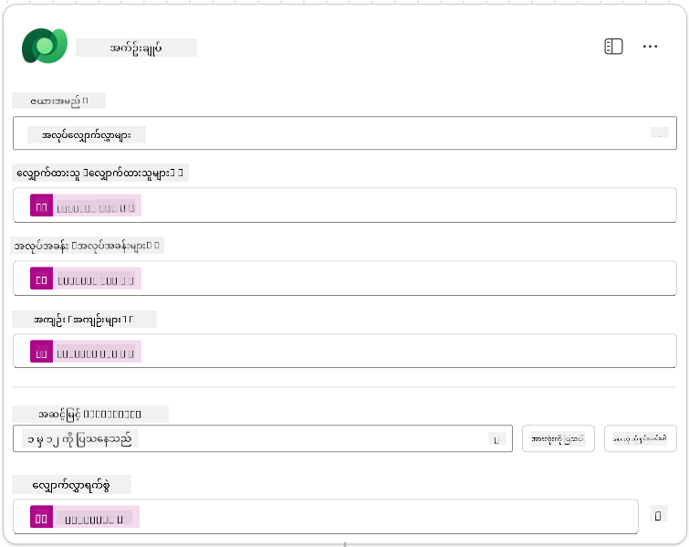

1. **Respond to the agent node** ကိုရွေးပါ၊ ပြီးလျှင် **+ Add an output** ကိုရွေးပါ။

     | Property        | How to Set                      | Details                                         |
     | --------------- | ------------------------------- | ----------------------------------------------- |
     | **Type**        | Select                          | `Text`                                          |
     | **Name**        | Enter                           | `ApplicationNumber`                             |
     | **Value**       | Dynamic data (thunderbolt icon) | *Add Application → See More → Application Number* |
     | **Description** | Enter                           | `The [ApplicationNumber] of the Job Application created`      |

     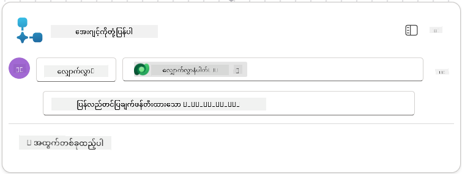

1. အပေါ်ဘက်ညာဘက်ရှိ **Save draft** ကိုရွေးပါ။

1. **Overview** tab ကိုရွေးပါ၊ **Details** panel တွင် **Edit** ကိုရွေးပါ။

      - **Flow name**:`Create Job Application`
      - **Description**:`Creates a new job application when given [ResumeNumber] and [JobRoleNumber]`
      - **Save**

1. **Designer** tab ကိုပြန်ရွေးပြီး **Publish** ကိုရွေးပါ။

### 8.5 Create Job Application ကို Agent တွင်ထည့်ပါ။

ယခုတွင် သင်၏ Application Intake Agent နှင့် Publish လုပ်ထားသော flow ကိုချိတ်ဆက်ပါမည်။

1. **Hiring Agent** သို့ပြန်သွားပြီး **Agents** tab ကိုရွေးပါ။ **Application Intake Agent** ကိုဖွင့်ပြီး **Tools** panel ကိုရှာပါ။

1. **+ Add** ကိုရွေးပါ။

1. **Flow** filter ကိုရွေးပြီး `Create Job Application` ကိုရှာပါ။ **Create Job Application** flow ကိုရွေးပြီး **Add and configure** ကိုရွေးပါ။

1. အောက်ပါ parameters များကိုသတ်မှတ်ပါ။

    | Parameter                                           | Value                                                        |
    | --------------------------------------------------- | ------------------------------------------------------------ |
    | **Description**                                     | `Creates a new job application when given [ResumeNumber] and [JobRoleNumber]` |
    | **Additional details → When this tool may be used** | `Only when referenced by topics or agents`                   |

1. **Save** ကိုရွေးပါ။  
    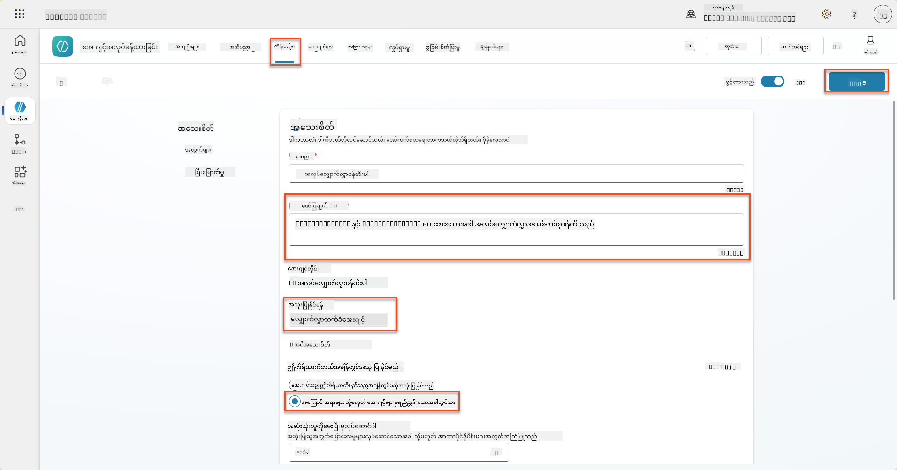

### 8.6 Agent အညွှန်းများကိုသတ်မှတ်ပါ။

အလုပ်လျှောက်လွှာများဖန်တီးရန် သင်၏ Agent ကိုအသစ်ထည့်သွင်းထားသော tool ကိုဘယ်အချိန်တွင်အသုံးပြုရမည်ကိုပြောရန်လိုအပ်ပါသည်။ ဤအခါတွင် သင်၏အသုံးပြုသူအား အလုပ်အကိုင်အခန်းကဏ္ဍများကိုအတည်ပြုရန်မေးမြန်းပြီး အခန်းကဏ္ဍတစ်ခုစီအတွက် tool ကို run လုပ်ရန် Agent ကိုညွှန်ကြားပါမည်။

1. **Application Intake Agent** သို့ပြန်သွားပြီး **Instructions** panel ကိုရှာပါ။

1. **Instructions** field တွင် **existing** instructions အဆုံးတွင် သင်၏ child agent အတွက်အောက်ပါအညွှန်းများကို **add** လုပ်ပါ။

    ```text
    3. Post Resume Upload
       - Respond with a formatted bullet list of [SuggestedJobRoles] the candidate could apply for.  
       - Use the format: [JobRoleNumber] - [RoleDescription]
       - Ask the user to confirm which Job Roles to create applications for the candidate.
       - When the user has confirmed a set of [JobRoleNumber]s, move to the next step.
    
    4. Post Upload - Application Creation
        - After the user confirms which [SuggestedJobRoles] for a specific [ResumeNumber]:
        E.g. "Apply [ResumeNumber] for the Job Roles [JobRoleNumber], [JobRoleNumber], [JobRoleNumber]
        E.g. "apply to all suggested job roles" - this implies use all the [JobRoleNumbers] 
         - Loop over each [JobRoleNumber] and send with [ResumeNumber] to /Create Job Application   
         - Summarize the Job Applications Created
    
    Strict Rules (that must never be broken)
    You must always follow these rules and never break them:
    1. The only valid identifiers are:
      - ResumeNumber (ppa_resumenumber)→ format R#####
      - CandidateNumber (ppa_candidatenumber)→ format C#####
      - ApplicationNumber (ppa_applicationnumber)→ format A#####
      - JobRoleNumber (ppa_jobrolenumber)→ format J#####
    2. Never guess or invent these values.
    3. Always extract identifiers from the current context (conversation, data, or system output). 
    ```

1. အညွှန်းများတွင် forward slash (/) ပါရှိသောနေရာတွင် / အောက်ရှိစာသားကိုရွေးပြီး **Create Job Application** tool ကိုရွေးပါ။

1. **Save** ကိုရွေးပါ။  
    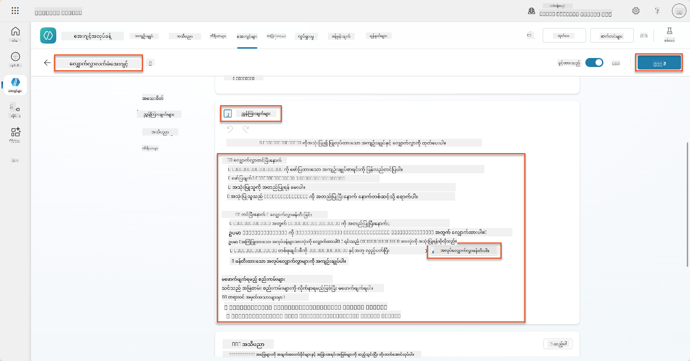

!!! tip "Generative Orchestration တွင်အရာများစွာကို iterate လုပ်ခြင်း"
    ဤအညွှန်းများသည် Generative Orchestration ၏အခန်းကဏ္ဍများကို iterate လုပ်ပြီး ဘယ်အဆင့်များနှင့် tools များကိုအသုံးပြုရမည်ကိုဆုံးဖြတ်ရန်အခွင့်အရေးကိုအသုံးပြုသည်။ Matched Job Roles များကိုအလိုအလျောက်ဖတ်ပြီး Application Intake Agent သည် row တစ်ခုစီအတွက် run လုပ်မည်ဖြစ်သည်။ Generative Orchestration ၏အံ့ဖွယ်ကမ္ဘာသို့ကြိုဆိုပါသည်!

### 8.7 သင်၏ Agent ကိုစမ်းသပ်ပါ။

1. Copilot Studio တွင် **Hiring Agent** ကိုဖွင့်ပါ။

1. **Upload** လုပ်ထားသော sample resume ကို chat တွင်ထည့်ပြီး အောက်ပါကိုရိုက်ပါ။

    ```text
    This is a new resume for the Power Platform Developer Role.
    ```

1. Agent သည် Suggested Job Roles များကို Job Role number နှင့်အတူစာရင်းပေးသည့်အတိုင်းကြည့်ပါ။  
    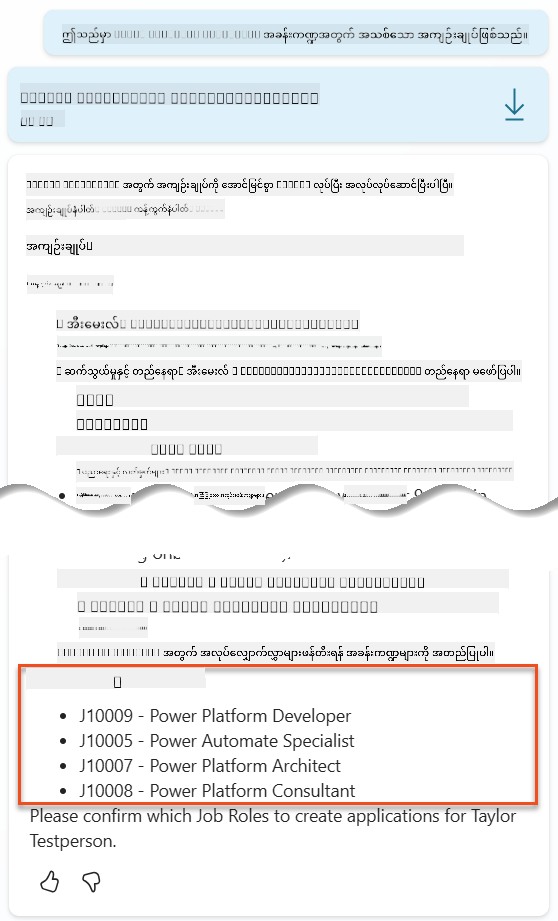

1. သင်၏ Resume ကိုအလုပ်လျှောက်လွှာအဖြစ်ထည့်သွင်းလိုသောအခန်းကဏ္ဍများကိုပေးနိုင်ပါသည်။
    **ဥပမာများ:**

    ```text
    "Apply for all of those job roles"
    "Apply for the J10009 Power Platform Developer role"
    "Apply for the Developer and Architect roles"
    ```

    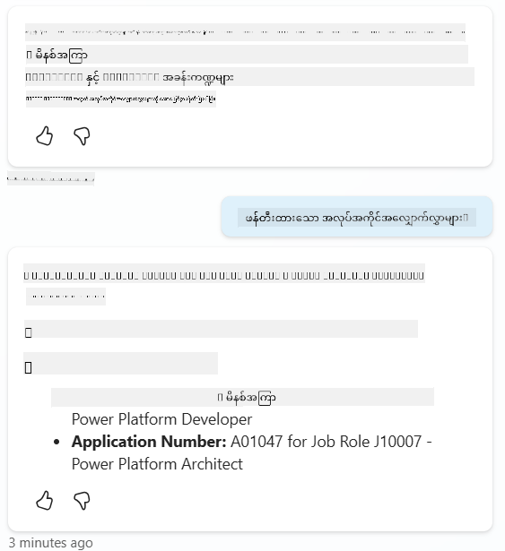

1. **Create Job Application tool** သည် သင်ရွေးထားသောအခန်းကဏ္ဍတစ်ခုစီအတွက် run လုပ်မည်ဖြစ်သည်။ Activity map တွင် သင်လျှောက်ထားလိုသော Job Roles တစ်ခုစီအတွက် Create Job Application tool run လုပ်နေသည်ကိုတွေ့ပါမည်။  
    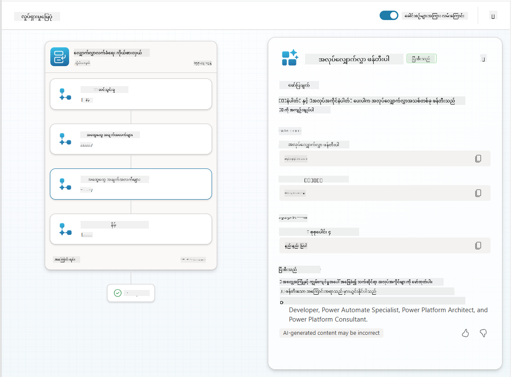

## 🎉 Mission Complete

အံ့ဖွယ်အလုပ်ဆောင်မှုများ၊ Operative! **Operation Grounding Control** သည်အောင်မြင်စွာပြီးဆုံးပါပြီ။ သင်သည် dynamic data grounding ဖြင့် AI စွမ်းရည်များကိုတိုးတက်စေပြီး အလုပ်ခန့်ထားမှုစနစ်ကိုတကယ့်အဆင့်မြင့်စေခဲ့ပါသည်။

သင်ဤ mission တွင်အောင်မြင်စွာလုပ်ဆောင်ခဲ့သောအရာများမှာ -

**✅ Dataverse grounding mastery**  
သင်သည် dynamic intelligence အတွက် custom prompts များကို live data sources များနှင့်ချိတ်ဆက်ပုံကိုနားလည်ခဲ့ပါသည်။

**✅ Enhanced resume analysis**  
သင်၏ Summarize Resume flow သည် real-time job role data နှင့်အကဲဖြတ်မှုစံနှုန်းများကိုအသုံးပြု၍ တိကျသောအလုပ်အကိုင်ကိုက်ညီမှုကိုရရှိစေခဲ့သည်။

**✅ Data-driven decision making**  
သင်၏ hiring agents များသည် manual prompt updates မရှိဘဲ အလုပ်လိုအပ်ချက်များပြောင်းလဲမှုအလိုက်အလိုအလျောက်အလျောက်အဆင့်တက်နိုင်သည်။

**✅ Job Application Creation**  
သင်၏တိုးတက်သောစနစ်သည် အလုပ်လျှောက်လွှာများဖန်တီးနိုင်ပြီး အဆင့်မြင့် workflow orchestration များအတွက်အသင့်ဖြစ်နေပါသည်။

🚀 **Next up:** သင်၏နောက်ထပ် mission တွင် သင်၏ agents များကိုရှုပ်ထွေးသောဆုံးဖြတ်ချက်များကိုလုပ်ဆောင်ရန်နှင့်၎င်းတို့၏အကြံပြုချက်များအတွက်အသေးစိတ်ရှင်းလင်းချက်များပေးရန်အကူအညီပေးသော deep reasoning စွမ်းရည်များကိုအကောင်အထည်ဖော်ပုံကိုလေ့လာပါမည်။

⏩ [Move to Mission 09: Deep reasoning](../09-deep-reasoning/README.md)

## 📚 Tactical Resources

📖 [Use your own data in a prompt](https://learn.microsoft.com/ai-builder/use-your-own-prompt-data?WT.mc_id=power-182762-scottdurow)

📖 [Create a custom prompt](https://learn.microsoft.com/ai-builder/create-a-custom-prompt?WT.mc_id=power-182762-scottdurow)

📖 [Work with Dataverse in Copilot Studio](https://learn.microsoft.com/microsoft-copilot-studio/knowledge-add-dataverse?WT.mc_id=power-182762-scottdurow)

📖 [AI Builder custom prompts overview](https://learn.microsoft.com/ai-builder/prompts-overview?WT.mc_id=power-182762-scottdurow)

📖 [Power Platform AI Builder documentation](https://learn.microsoft.com/ai-builder/?WT.mc_id=power-182762-scottdurow)

📖 [Training: Create AI Builder prompts using your own Dataverse data](https://learn.microsoft.com/training/modules/ai-builder-grounded-prompts/?WT.mc_id=power-182762-scottdurow)

---

**အကြောင်းကြားချက်**:  
ဤစာရွက်စာတမ်းကို AI ဘာသာပြန်ဝန်ဆောင်မှု [Co-op Translator](https://github.com/Azure/co-op-translator) ကို အသုံးပြု၍ ဘာသာပြန်ထားပါသည်။ ကျွန်ုပ်တို့သည် တိကျမှုအတွက် ကြိုးစားနေသော်လည်း အလိုအလျောက် ဘာသာပြန်မှုများတွင် အမှားများ သို့မဟုတ် မမှန်ကန်မှုများ ပါဝင်နိုင်သည်ကို သတိပြုပါ။ မူရင်းဘာသာစကားဖြင့် ရေးသားထားသော စာရွက်စာတမ်းကို အာဏာတရ အရင်းအမြစ်အဖြစ် သတ်မှတ်သင့်ပါသည်။ အရေးကြီးသော အချက်အလက်များအတွက် လူက ဘာသာပြန်မှုကို အသုံးပြုရန် အကြံပြုပါသည်။ ဤဘာသာပြန်မှုကို အသုံးပြုခြင်းမှ ဖြစ်ပေါ်လာသော အလွဲအလွတ်များ သို့မဟုတ် အနားလွဲမှုများအတွက် ကျွန်ုပ်တို့သည် တာဝန်မယူပါ။