<!--
CO_OP_TRANSLATOR_METADATA:
{
  "original_hash": "d9cd8cd1a4fbd8915171a2ed972cc322",
  "translation_date": "2025-10-21T19:08:26+00:00",
  "source_file": "docs/recruit/00-course-setup/README.md",
  "language_code": "my"
}
-->
# 🚨 မစ်ရှင် 00: သင်တန်း စတင်ခြင်း

## 🕵️‍♂️ ကုဒ်နာမည်: `OPERATION DEPLOYMENT READY`

> **⏱️ လုပ်ဆောင်ရန်အချိန်:** `~30 မိနစ်`

## 🎯 မစ်ရှင်အကျဉ်း

Copilot Studio Agent အဖြစ် သင်၏လေ့ကျင့်မှု၏ ပထမဆုံးမစ်ရှင်မှကြိုဆိုပါသည်။  
သင်၏ပထမဆုံး AI Agent ကိုတည်ဆောက်ရန်မတိုင်မီ **Field-ready Development Environment** ကိုတည်ဆောက်ရန်လိုအပ်ပါသည်။

ဤအကျဉ်းချုပ်သည် Microsoft 365 Ecosystem တွင်အောင်မြင်စွာ လုပ်ဆောင်နိုင်ရန်လိုအပ်သော စနစ်များ၊ ဝင်ရောက်ခွင့်အချက်အလက်များနှင့် Setup လုပ်ဆောင်မှုအဆင့်များကို ဖော်ပြထားသည်။

## 🔎 ရည်မှန်းချက်များ

သင်၏မစ်ရှင်တွင်ပါဝင်သည်-

1. Microsoft 365 အကောင့်ရယူခြင်း  
1. Microsoft Copilot Studio ကိုဝင်ရောက်ခွင့်ရရှိခြင်း  
1. (Optional) Microsoft 365 Copilot လိုင်စင်ကို ထုတ်ဝေမှုအတွက်ရယူခြင်း  
1. Copilot Studio အတွက် Developer Environment တည်ဆောက်ခြင်း  
1. နောက်မစ်ရှင်များတွင် ဒေတာရင်းမြစ်အဖြစ်အသုံးပြုရန် SharePoint Site တစ်ခုတည်ဆောက်ခြင်း  

---

## 🔍 လိုအပ်ချက်များ

စတင်မလုပ်ဆောင်မီ၊ သင်မှာ-

1. **အလုပ်သုံး သို့မဟုတ် ကျောင်းသုံး အီးမေးလ်လိပ်စာ** (ပုဂ္ဂလိက @outlook.com, @gmail.com စသည်တို့ကို မပံ့ပိုးပါ)  
1. အင်တာနက်နှင့် ခေတ်မီ Browser (Edge, Chrome, Firefox အကြံပြုသည်)  
1. Microsoft 365 အခြေခံအသိပညာ (ဥပမာ- Office Apps သို့မဟုတ် Teams တွင် Sign-in လုပ်ခြင်း)  
1. (Optional) လိုင်စင်များကိုဝယ်ယူရန်အတွက် Credit Card သို့မဟုတ် ငွေပေးချေမှုနည်းလမ်း  

---

## အဆင့် 1: Microsoft 365 အကောင့်ရယူပါ

Copilot Studio သည် Microsoft 365 အတွင်းရှိသဖြင့်၊ သင်သည် Microsoft 365 အကောင့်တစ်ခုလိုအပ်ပါသည်။ သင်မှာရှိပြီးသားအကောင့်ကိုအသုံးပြုနိုင်သလို၊ သို့မဟုတ် အောက်ပါအဆင့်များကိုလိုက်နာပြီး သင့်အတွက်သင့်လျော်သော လိုင်စင်တစ်ခုရယူနိုင်ပါသည်-

1. **Microsoft 365 Business Subscription ရယူပါ**  
   1. [Microsoft 365 Business Plans and Pricing Page](https://www.microsoft.com/microsoft-365/business/microsoft-365-plans-and-pricing) သို့သွားပါ  
   1. စတင်ရန်အတွက် အနည်းဆုံးကုန်ကျစရိတ်ဖြစ်သော Microsoft 365 Business Basic Plan ကို ရွေးပါ။ `Try for free` ကိုရွေးပြီး Subscription နှင့် Account Details နှင့် Payment Information ဖြည့်ပါ။  
   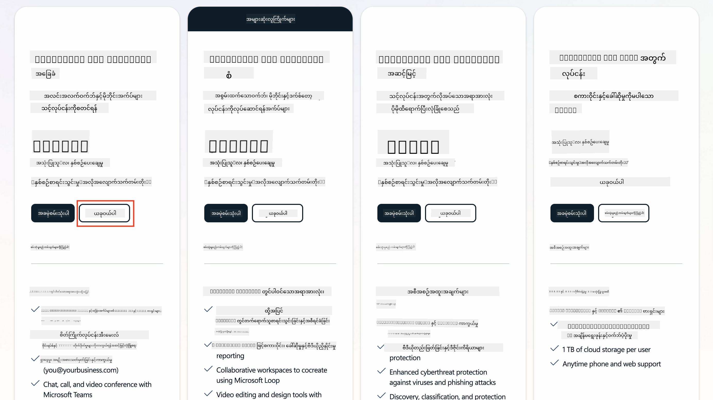  
   1. သင်၏အကောင့်အသစ်ကိုရရှိပြီးနောက် Login လုပ်ပါ။

    !!! Tip  
        သင်သည် Microsoft 365 Copilot Chat သို့ Agent များကိုထုတ်ဝေခြင်း သို့မဟုတ် အဖွဲ့အစည်းဒေတာများ (SharePoint, OneDrive, Dataverse) ကိုချိတ်ဆက်ရန် စီစဉ်နေပါက Microsoft 365 Copilot လိုင်စင်လိုအပ်ပါသည်။ ဤသည်မှာ Add-on လိုင်စင်ဖြစ်ပြီး [လိုင်စင်ဝက်ဘ်ဆိုဒ်](https://www.microsoft.com/microsoft-365/copilot#plans) တွင်ပိုမိုလေ့လာနိုင်ပါသည်။

---

## အဆင့် 2: Copilot Studio Trial စတင်ပါ

Microsoft 365 Tenant ရရှိပြီးနောက်၊ Copilot Studio ကိုဝင်ရောက်ခွင့်ရရန်လိုအပ်ပါသည်။ အခမဲ့ 30 ရက် Trial ကို အောက်ပါအဆင့်များကိုလိုက်နာ၍ရယူနိုင်ပါသည်-

1. [aka.ms/TryCopilotStudio](https://aka.ms/TryCopilotStudio) သို့သွားပါ။  
1. အဆင့် 1 တွင်သင်တည်းဖြတ်ထားသောအကောင့်၏ အီးမေးလ်လိပ်စာကိုထည့်ပြီး `Next` ကိုရွေးပါ။  
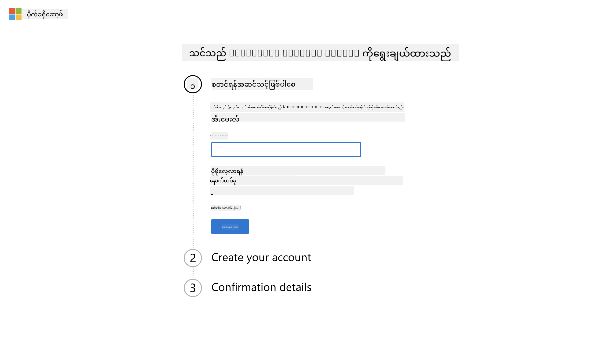  
1. သင့်အကောင့်ကိုသိရှိရမည်။ `Sign In` ကိုရွေးပါ။  
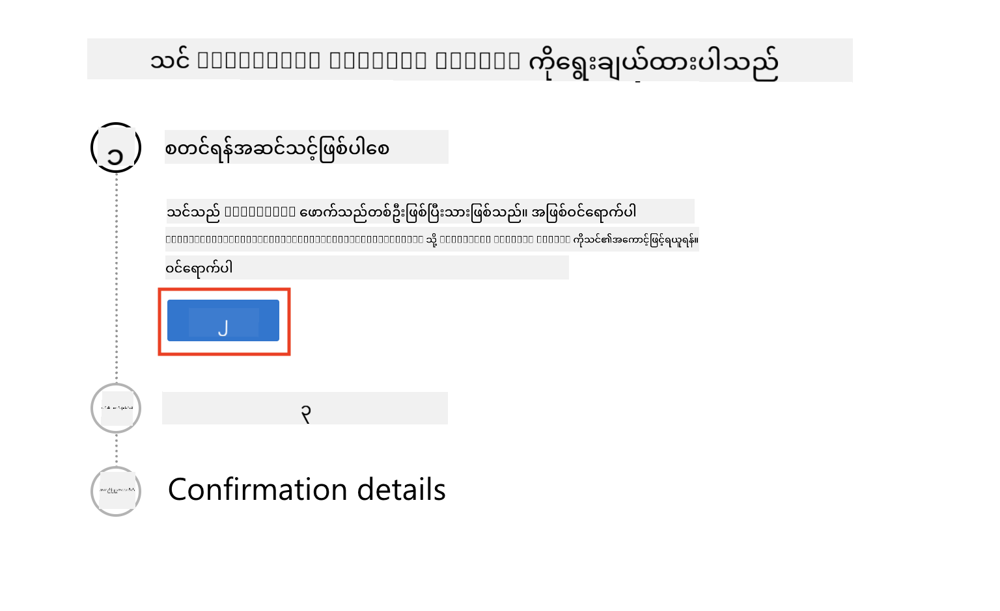  
1. `Start Free Trial` ကိုရွေးပါ။  
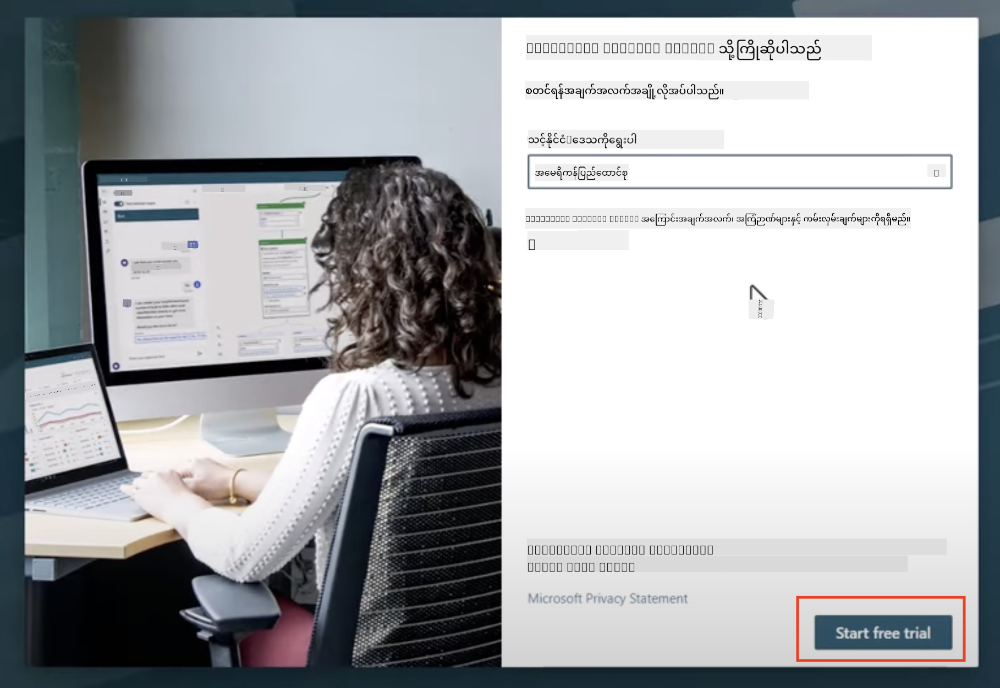

!!! info "Trial Notes"  
     1. အခမဲ့ Trial သည် **Copilot Studio ၏ အားလုံးသောစွမ်းရည်များ** ကိုပေးသည်။  
     1. Trial သက်တမ်းကုန်ဆုံးမှုအကြောင်းအီးမေးလ်အသိပေးချက်များကိုရရှိမည်။ Trial ကို 30 ရက်အပိုဆင့် (Agent Runtime 90 ရက်အထိ) တိုးနိုင်သည်။  
     1. သင့် Tenant Administrator သည် Self-service Sign-up ကိုပိတ်ထားပါက Error တွေ့ရမည်—Microsoft 365 Admin ကိုဆက်သွယ်၍ ပြန်ဖွင့်ရန်တောင်းဆိုပါ။

---

## အဆင့် 3: Developer Environment အသစ်တည်ဆောက်ပါ

### Power Apps Developer Plan မှာ Sign Up လုပ်ပါ

အဆင့် 1 တွင်သုံးထားသော Microsoft 365 Tenant ကိုအသုံးပြု၍ Copilot Studio တွင် Build နှင့် Test လုပ်ရန် အခမဲ့ Development Environment တစ်ခုတည်ဆောက်ရန် Power Apps Developer Plan မှာ Sign Up လုပ်ပါ။

1. [Power Apps Developer Plan website](https://aka.ms/PowerAppsDevPlan) တွင် Sign Up လုပ်ပါ။

    - သင့်အီးမေးလ်လိပ်စာကိုထည့်ပါ  
    - Checkbox ကို Check လုပ်ပါ  
    - **Start free** ကိုရွေးပါ  

    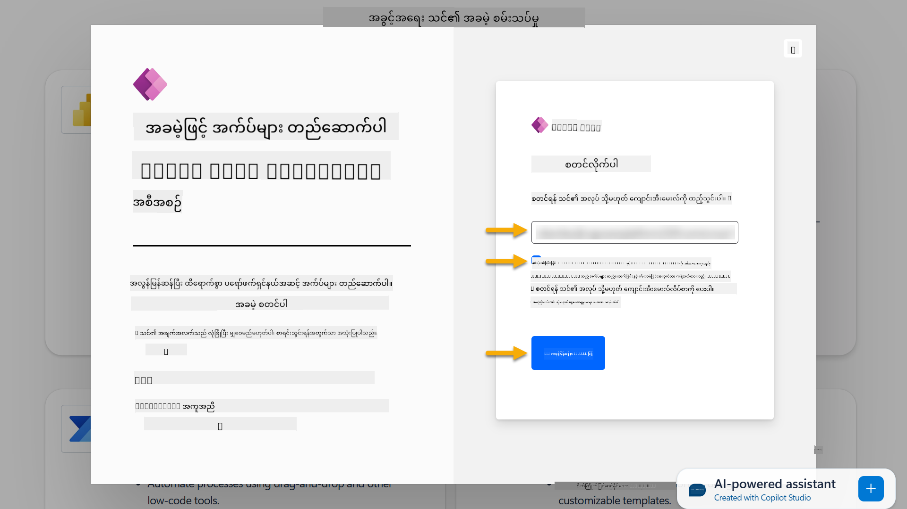

1. Developer Plan ကို Sign Up လုပ်ပြီးနောက် [Power Apps](https://make.powerapps.com/) သို့ Redirect လုပ်မည်။ Environment သည် သင့်နာမည်ကိုအသုံးပြုသည်၊ ဥပမာ **Adele Vance's environment**။ အဆိုပါနာမည်ဖြင့် Environment ရှိပြီးသားဖြစ်ပါက Developer Environment အသစ်ကို **Adele Vance's (1)** environment ဟုအမည်ပေးမည်။

    Copilot Studio တွင် Lab များကိုပြီးစီးရန်ဤ Developer Environment ကိုအသုံးပြုပါ။

!!! Note  
    သင်သည် Microsoft 365 အကောင့်ရှိပြီး အဆင့် 1 တွင်အသစ်မတည်ဆောက်ခဲ့ပါက၊ ဥပမာ - သင်၏အလုပ်အဖွဲ့အစည်းအကောင့်ကိုအသုံးပြုပါက၊ သင့် IT Administrator (သို့မဟုတ်) Tenant/Environment ကိုစီမံခန့်ခွဲသောအဖွဲ့သည် Sign-up လုပ်ဆောင်မှုကိုပိတ်ထားနိုင်သည်။ ဤကိစ္စတွင် Admin ကိုဆက်သွယ်ပါ၊ သို့မဟုတ် အဆင့် 1 အတိုင်း Test Tenant တစ်ခုတည်ဆောက်ပါ။

---

## အဆင့် 4: SharePoint Site အသစ်တည်ဆောက်ပါ

SharePoint Site အသစ်တစ်ခုတည်ဆောက်ရန်လိုအပ်သည်၊ ဤသည်ကို [Lesson 06 - Copilot နှင့် သင်၏ဒေတာဖြင့် Grounding ပြုလုပ်၍ Custom Agent တစ်ခုတည်ဆောက်ခြင်း](../06-create-agent-from-conversation/README.md#62-add-an-internal-knowledge-source-using-a-sharepoint-site) တွင်အသုံးပြုမည်။

1. Microsoft Copilot Studio ၏ ဘယ်ဘက်ထိပ်ဖက်ရှိ Waffle Icon ကိုရွေးပါ။ Menu တွင် SharePoint ကိုရွေးပါ။  

    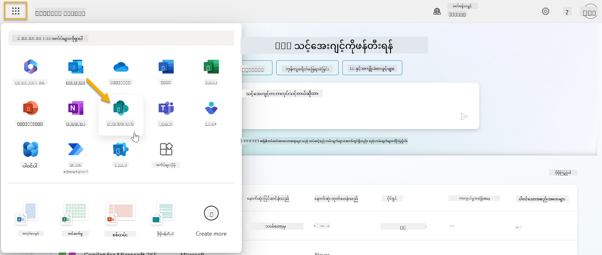

1. SharePoint ကို Load လုပ်ပါမည်။ **+ Create site** ကိုရွေး၍ SharePoint Site အသစ်တစ်ခုတည်ဆောက်ပါ။  

    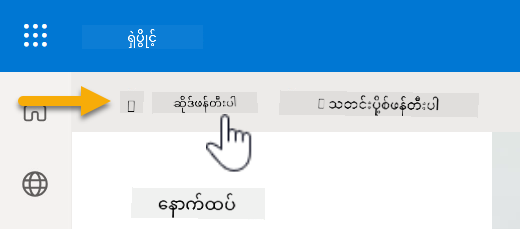

1. SharePoint Site တစ်ခုတည်ဆောက်ရန် Dialog တစ်ခုပေါ်လာမည်။ **Team site** ကိုရွေးပါ။  

    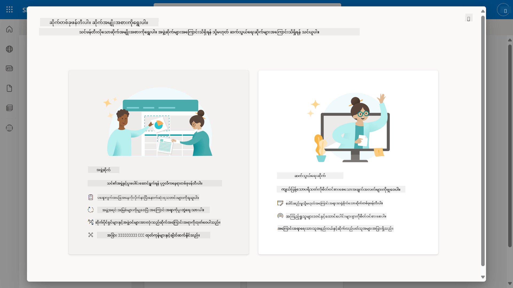

1. နောက်အဆင့်တွင် Microsoft Template များစာရင်းကို Default အဖြစ် Load လုပ်မည်။ **IT help desk** Template ကိုရွေးပါ။  

    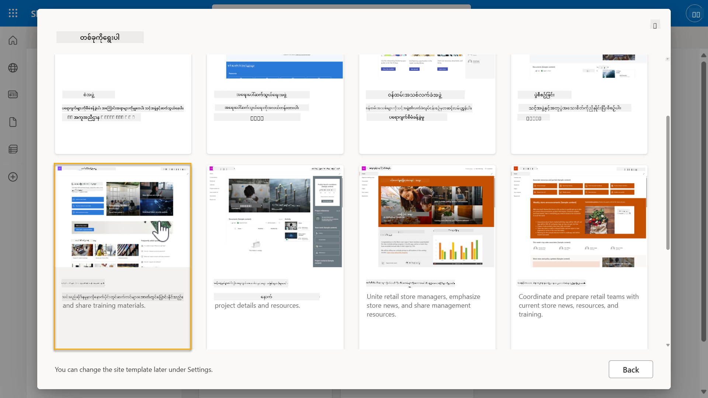

1. **Use template** ကိုရွေး၍ IT help desk Template ဖြင့် SharePoint Site အသစ်တစ်ခုတည်ဆောက်ပါ။  

    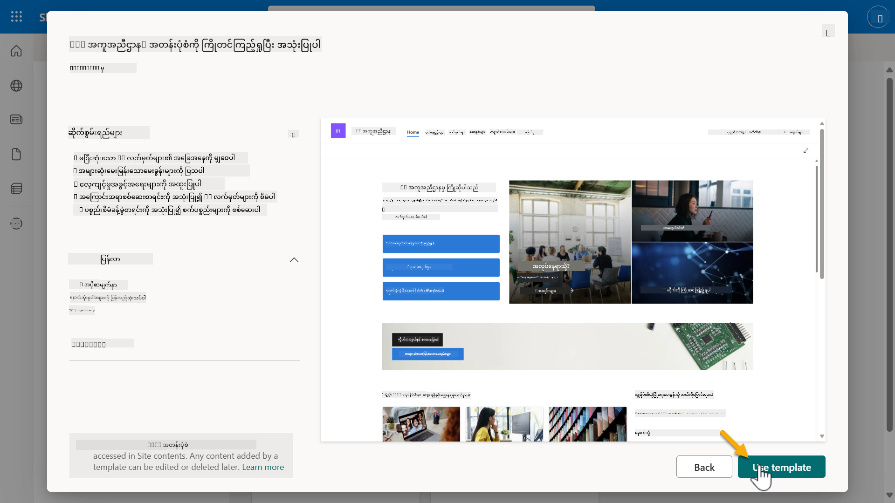

1. သင့် Site အတွက် အချက်အလက်များကိုထည့်ပါ။ ဥပမာအနေဖြင့်-

    | Field | Value |
    | --- | --- |
    | Site name | Contoso IT |
    | Site description | Copilot Studio for Beginners |
    | Site address | ContosoIT |

    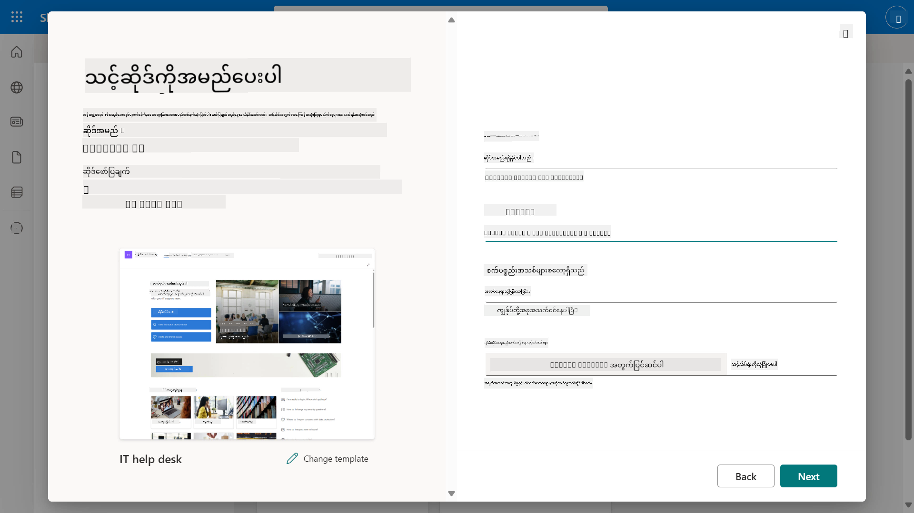

1. နောက်ဆုံးအဆင့်တွင် SharePoint Site အတွက် ဘာသာစကားကိုရွေးနိုင်သည်။ Default အနေဖြင့် **English** ဖြစ်မည်။ ဘာသာစကားကို **English** အဖြစ်ထားပြီး **Create site** ကိုရွေးပါ။  

    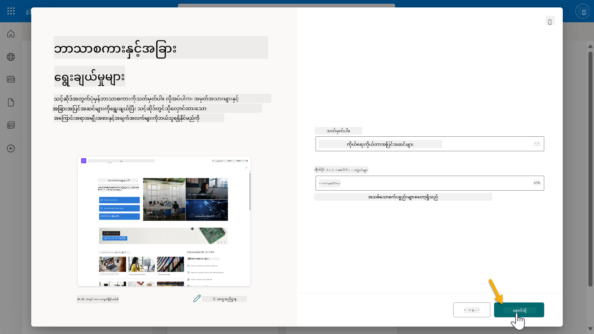

1. SharePoint Site ကို Provision လုပ်မည်။ အချိန်အနည်းငယ်စောင့်ပါ။ **Add members** Field တွင် အခြားအသုံးပြုသူများ၏ အီးမေးလ်လိပ်စာကိုထည့်၍ Site သို့ထည့်နိုင်သည်။ ပြီးဆုံးပါက **Finish** ကိုရွေးပါ။  

    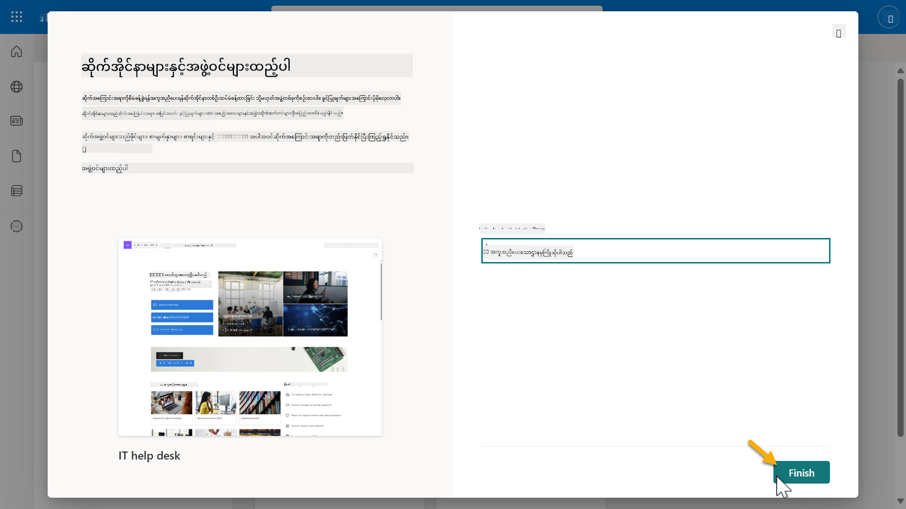

1. SharePoint Site Home Page ကို Load လုပ်မည်။ **SharePoint Site URL ကို Copy လုပ်ပါ**။

1. ဤ Template သည် IT Policies များနှင့် Sample Lists (Tickets နှင့် Devices) နှစ်ခုပါဝင်သော Pages များကိုပေးသည်။

### Devices SharePoint List ကိုအသုံးပြုပါ

ဤ Devices List ကို [Mission 07 - Add new topic with trigger and nodes](../07-add-new-topic-with-trigger/README.md#73-add-a-tool-using-a-connector) တွင်အသုံးပြုမည်။

### Column အသစ်ထည့်ပါ

List ၏ အလယ်ဘက်သို့ Scroll လုပ်ပြီး **+ Add column** Button ကိုရွေးပါ။ **Hyperlink** Type ကိုရွေးပြီး Column Name အဖြစ် **Image** ထည့်ပါ၊ Add ကိုရွေးပါ။

### Devices SharePoint List တွင် Sample Data တည်ဆောက်ပါ

ဤ List တွင် အနည်းဆုံး Sample Data Items 4 ခုဖြည့်ပြီး Column အသစ်တစ်ခုထည့်ရန်လိုအပ်သည်။

Sample Data ထည့်သည့်အခါ၊ အောက်ပါ Field များကိုဖြည့်ရန်သေချာပါ-

- Device photo - [device images folder](https://github.com/microsoft/agent-academy/tree/main/docs/recruit/00-course-setup/images/device-images) မှပုံများကိုအသုံးပြုပါ  
- Title  
- Status  
- Manufacturer  
- Model  
- Asset Type  
- Color  
- Serial Number  
- Purchase Date  
- Purchase Price  
- Order #  
- Image - အောက်ပါ Link များကိုအသုံးပြုပါ  

|Device  |URL  |
|---------|---------|
|Surface Laptop 13     | [https://raw.githubusercontent.com/microsoft/agent-academy/refs/heads/main/docs/recruit/00-course-setup/images/device-images/Surface-Laptop-13.png](https://raw.githubusercontent.com/microsoft/agent-academy/refs/heads/main/docs/recruit/00-course-setup/images/device-images/Surface-Laptop-13.png)        |
|Surface Laptop 15     | [https://raw.githubusercontent.com/microsoft/agent-academy/refs/heads/main/docs/recruit/00-course-setup/images/device-images/Surface-Laptop-15.png](https://raw.githubusercontent.com/microsoft/agent-academy/refs/heads/main/docs/recruit/00-course-setup/images/device-images/Surface-Laptop-15.png)        |
|Surface Pro    | [https://raw.githubusercontent.com/microsoft/agent-academy/refs/heads/main/docs/recruit/00-course-setup/images/device-images/Surface-Pro-12.png](https://raw.githubusercontent.com/microsoft/agent-academy/refs/heads/main/docs/recruit/00-course-setup/images/device-images/Surface-Pro-12.png)        |
|Surface Studio    | [https://raw.githubusercontent.com/microsoft/agent-academy/refs/heads/main/docs/recruit/00-course-setup/images/device-images/Surface-Studio.png](https://raw.githubusercontent.com/microsoft/agent-academy/refs/heads/main/docs/recruit/00-course-setup/images/device-images/Surface-Studio.png)        |

---

## ✅ မစ်ရှင်ပြီးစီး

သင်သည်အောင်မြင်စွာ-

- Microsoft 365 Development Environment တည်ဆောက်ပြီး  
- Copilot Studio Trial ကို Activate လုပ်ပြီး  
- Agent များကို Grounding ပြုလုပ်ရန် SharePoint Site တစ်ခုတည်ဆောက်ပြီး  
- Devices List ကို နောက်မစ်ရှင်များအတွက် အသုံးပြုရန် Populate လုပ်ပြီး  

သင်သည် [Lesson 01](../01-introduction-to-agents/README.md) တွင် **Recruit-level Agent Training** ကိုစတင်ရန် တရားဝင်ခွင့်ရရှိပါပြီ။  

<!-- markdownlint-disable-next-line MD033 -->

---

**အကြောင်းကြားချက်**:  
ဤစာရွက်စာတမ်းကို AI ဘာသာပြန်ဝန်ဆောင်မှု [Co-op Translator](https://github.com/Azure/co-op-translator) ကို အသုံးပြု၍ ဘာသာပြန်ထားပါသည်။ ကျွန်ုပ်တို့သည် တိကျမှုအတွက် ကြိုးစားနေသော်လည်း အလိုအလျောက် ဘာသာပြန်မှုများတွင် အမှားများ သို့မဟုတ် မတိကျမှုများ ပါဝင်နိုင်သည်ကို သတိပြုပါ။ မူရင်းဘာသာစကားဖြင့် ရေးသားထားသော စာရွက်စာတမ်းကို အာဏာတရားရှိသော အရင်းအမြစ်အဖြစ် သတ်မှတ်သင့်ပါသည်။ အရေးကြီးသော အချက်အလက်များအတွက် လူ့ဘာသာပြန်ပညာရှင်များကို အသုံးပြုရန် အကြံပြုပါသည်။ ဤဘာသာပြန်မှုကို အသုံးပြုခြင်းမှ ဖြစ်ပေါ်လာသော အလွဲအမှားများ သို့မဟုတ် အနားယူမှုများအတွက် ကျွန်ုပ်တို့သည် တာဝန်မယူပါ။