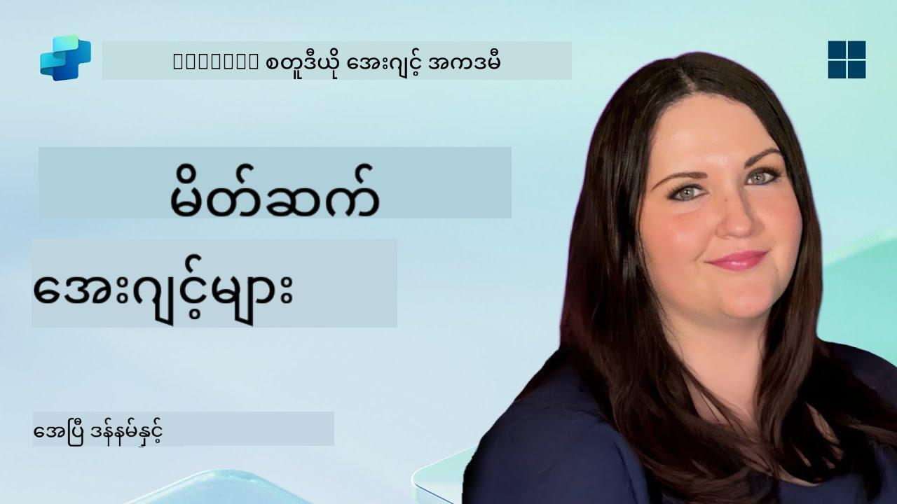

<!--
CO_OP_TRANSLATOR_METADATA:
{
  "original_hash": "d6706e107678264168d77b2e107710b1",
  "translation_date": "2025-10-21T18:28:50+00:00",
  "source_file": "docs/recruit/01-introduction-to-agents/README.md",
  "language_code": "my"
}
-->
# 🚨 မစ်ရှင် 01: အေးဂျင့်များကို မိတ်ဆက်ခြင်း

## 🕵️‍♂️ ကုဒ်နာမည်: `OPERATION AI AGENT DECODE`

> **⏱️ လုပ်ဆောင်ချိန်:** `~30 မိနစ် – သတင်းအချက်အလက်သာ, လုပ်ငန်းခွင်အတွေ့အကြုံမလိုအပ်ပါ`

🎥 **ဗီဒီယိုလမ်းညွှန်ကြည့်ရန်**

## 🎯 မစ်ရှင်အကျဉ်းချုပ်

ကြိုဆိုပါတယ်၊ အဖွဲ့ဝင်။ အေးဂျင့်များကို တည်ဆောက်မည့်အခါ မူလအခြေခံ AI အကြောင်းအရာများကို နားလည်ထားဖို့လိုအပ်ပါတယ်။ ဒီမစ်ရှင်က သင်ကို စကားပြော AI, အကြီးစားဘာသာစကားမော်ဒယ်များ (LLMs), Retrieval-Augmented Generation (RAG), နှင့် Copilot Studio မှာ ဖန်တီးနိုင်တဲ့ အေးဂျင့်အမျိုးအစားများအကြောင်း အခြေခံသိမှတ်စရာများပေးပါမယ်။

## 🔎 ရည်မှန်းချက်များ

ဒီမစ်ရှင်မှာ သင်လေ့လာရမယ့်အရာများ:

1. စကားပြော AI ဆိုတာဘာလဲ၊ ဘာကြောင့် အရေးကြီးလဲ  
1. အကြီးစားဘာသာစကားမော်ဒယ်များ (LLMs) က စကားပြောအတွေ့အကြုံကို ဘယ်လိုအားပေးလဲ  
1. Retrieval-Augmented Generation (RAG) က ဘာတွေထည့်သွင်းပေးလဲ  
1. စကားပြောအေးဂျင့်များနဲ့ ကိုယ်တိုင်လုပ်ဆောင်နိုင်တဲ့ အေးဂျင့်များအကြား ကွာခြားချက်  
1. Copilot Studio မှာ အေးဂျင့်များက ဒီအကြောင်းအရာတွေကို ဘယ်လိုအသုံးချလဲ  

စတင်လိုက်ကြစို့!

---

## စကားပြော AI ဆိုတာဘာလဲ?

စကားပြော AI ဆိုတာ လူသားဘာသာစကား – စာသားဖြစ်စေ၊ အသံဖြစ်စေ – ကို နားလည်နိုင်၊ အလုပ်လုပ်နိုင်၊ ပြန်လည်တုံ့ပြန်နိုင်တဲ့ စနစ်တစ်ခုကို ဆိုလိုပါတယ်။ အကူအညီပေးတဲ့ chatbot တွေ၊ သင့်အချစ်ဆုံး app တွေထဲက အိမ်စောင့်ကူများကို စဉ်းစားကြည့်ပါ။ အောက်မှာတော့ အခေတ်မီ စကားပြော AI တွေဟာ အကြီးစားဘာသာစကားမော်ဒယ်များ (LLMs) ကို အခြေခံထားပါတယ်။

### ဘာကြောင့် အရေးကြီးလဲ

- **အသုံးပြုသူအတွေ့အကြုံ:** စကားပြော interface တွေဟာ menu တွေကို နှိပ်ရတာထက် ပိုမိုလွယ်ကူတယ်။  
- **အကျိုးရှိမှု:** အေးဂျင့်တစ်ယောက်က တစ်ချိန်တည်းမှာ စကားပြောများစွာကို ကိုင်တွယ်နိုင်တယ်။  
- **ထိရောက်မှု:** စည်းမျဉ်းအခြေခံ script တွေကို တည်ဆောက်ရတာမလိုဘဲ LLM-powered အေးဂျင့်တွေက အသုံးပြုသူ input ကို အလိုအလျောက် အဆင်ပြေစေတယ်။  
- **တိုးချဲ့နိုင်မှု:** ဒီဇိုင်းမှန်ကန်ရင် အေးဂျင့်တွေဟာ knowledge base တွေကို အသုံးချနိုင်တယ်၊ API တွေကို ချိတ်ဆက်နိုင်တယ်၊ ဒါမှမဟုတ် စီးပွားရေး workflow တွေထဲမှာ “ဒစ်ဂျစ်တယ်အလုပ်ဖော်” အဖြစ် လုပ်ဆောင်နိုင်တယ်။  

---

## အကြီးစားဘာသာစကားမော်ဒယ်များ (LLMs) 101

အများစုသော စကားပြော AI စနစ်များရဲ့ အခြေခံမှာ **အကြီးစားဘာသာစကားမော်ဒယ်များ** ရှိပါတယ် – စာသားအစုအဝေးကြီးတွေကို လေ့ကျင့်ထားတဲ့ neural networks တွေပါ။ အဲဒီမော်ဒယ်တွေက ဘာသာစကားပုံစံတွေကို သင်ယူပြီး စနစ်တကျ စာကြောင်းတွေကို ဖန်တီးနိုင်တယ်၊ မေးခွန်းတွေကို ဖြေဆိုနိုင်တယ်၊ ဒါမှမဟုတ် အကြံဉာဏ်တွေကို ပေးနိုင်တယ်။ နားလည်ဖို့ အရေးကြီးတဲ့အချက်တွေကတော့:

1. **လေ့ကျင့်မှုဒေတာ:** LLMs တွေဟာ စာသား terabytes (ဝက်ဘ်စာမျက်နှာတွေ၊ စာအုပ်တွေ၊ ဆောင်းပါးတွေ) ကို စုပ်ယူတယ်။ ဒီ “ကမ္ဘာ့အသိပညာ” က သူတို့ကို အမျိုးမျိုးသောအကြောင်းအရာတွေကို ဖြေဆိုနိုင်စေတယ်။  
1. **Tokenization:** စာသားကို token (စကားလုံး၊ subword, character) လို့ခေါ်တဲ့ အပိုင်းငယ်တွေ အဖြစ် ခွဲတယ်။ မော်ဒယ်က token တစ်ခုချင်းစီကို ခန့်မှန်းတယ်။  
1. **Context Window:** LLM တစ်ခုစီမှာ တစ်ချိန်တည်းမှာ “မြင်”နိုင်တဲ့ token အရေအတွက်က အကန့်အသတ်ရှိတယ်။ အဲဒီအကန့်အသတ်ကို ကျော်ရင် အရင် token တွေကို ဖျက်ပစ်လိုက်တယ်။  
1. **Prompting:** သင် LLM နဲ့ ဆက်သွယ်တဲ့အခါ prompt တစ်ခုကို ပေးပို့ရတယ်။ သင့် prompt ကောင်းလို့ ကောင်းလို့ သင့်တော်ပြီး သက်ဆိုင်တဲ့ အဖြေကို ပိုမိုရနိုင်တယ်။  
1. **Zero-shot vs. Fine-tuning:** Zero-shot ဆိုတာ LLM ကို အခြေခံပုံစံနဲ့ အသုံးပြုတာ (raw weights) ဖြစ်တယ်။ Fine-tuning ဆိုတာ မော်ဒယ်ကို domain-specific data နဲ့ ပြင်ဆင်တာဖြစ်ပြီး သင့်လိုအပ်ချက်အတွက် ပိုမိုတိကျတဲ့အဖြေကို ရနိုင်စေတယ်။

!!! Tip "Pro Tip"
    LLM ကို “အရမ်းတော်တဲ့ autocomplete” လို့ ယှဉ်ပြောနိုင်တယ်။ လူ့ဦးနှောက်လို အဓိပ္ပါယ်ကို အမှန်တကယ် နားလည်တာမဟုတ်ပေမယ့် စာကြောင်းမှာ နောက်ထပ်ကောင်းတဲ့ စကားလုံး (ဒါမှမဟုတ် စကားစု) ကို ခန့်မှန်းတာမှာ အရမ်းကောင်းတယ်။

---

## Retrieval-Augmented Generation (RAG)

LLMs တွေဟာ static training data ကိုသာ အခြေခံရင် အမှားတွေဖြစ်နိုင်တယ်၊ ဒါမှမဟုတ် အချိန်နောက်ကျနိုင်တယ်။ RAG က ဒီအချက်ကို ဖြေရှင်းပေးပြီး မော်ဒယ်ကို အဖြေဖန်တီးမယ့်အခါ သစ်လွင်တဲ့ အချက်အလက်ကို “ရှာဖွေ”နိုင်စေတယ်။ RAG ရဲ့ အခြေခံလုပ်ဆောင်ပုံကတော့:

1. **အသုံးပြုသူမေးခွန်း:** အသုံးပြုသူက မေးခွန်းတစ်ခုမေးတယ် (ဥပမာ - “Contoso ရဲ့ သုံးလပတ်အမြတ်အစွန်းအခြေအနေ ဘာလဲ?”)  
1. **Retriever အဆင့်:** စနစ်က knowledge source (စာရွက်စာတမ်းတွေ၊ အတွင်း database တွေ၊ SharePoint libraries, စသည်တို့) ကို မေးမြန်းပြီး သက်ဆိုင်တဲ့ အပိုင်းတွေကို ရှာတယ်။  
1. **Augmentation:** ရှာဖွေတွေ့ရှိထားတဲ့ အပိုင်းတွေကို LLM prompt ရဲ့ အစမှာ ဒါမှမဟုတ် အဆုံးမှာ ထည့်သွင်းတယ်။  
1. **Generation:** LLM က အသုံးပြုသူရဲ့မေးခွန်းနဲ့ context ကို စုစည်းပြီး အပ်ဒိတ်ဖြစ်နေတဲ့ ဒေတာအခြေခံတဲ့ အဖြေကို ဖန်တီးတယ်။  

RAG နဲ့အတူ သင့်အေးဂျင့်ဟာ အတွင်းကုမ္ပဏီ wikis, plugin APIs, ဒါမှမဟုတ် FAQ knowledge base ကို ခေါ်နိုင်ပြီး statically published model parameters များအတွက် အကန့်အသတ်မရှိတဲ့ အဖြေတွေကို ပြန်ပေးနိုင်တယ်။

---

## စကားပြောအေးဂျင့်များနှင့် ကိုယ်တိုင်လုပ်ဆောင်နိုင်တဲ့ အေးဂျင့်များ

Copilot Studio ရဲ့ context မှာ **အေးဂျင့်** ဆိုတာ AI အကူအညီအမျိုးမျိုးကို ဆိုလိုနိုင်ပါတယ်။ အောက်မှာတော့:

**စကားပြောအေးဂျင့်များ:**

- အဓိကအားဖြင့် နှစ်ဖက်စကားပြောကို အခြေခံတယ်။  
- စကားပြောအကြိမ်များစွာအတွင်း context ကို ထိန်းသိမ်းတယ်။  
- အများအားဖြင့် အကြိုတင်သတ်မှတ်ထားတဲ့ flow တွေ ဒါမှမဟုတ် trigger တွေကို အသုံးပြုပြီး စီမံခန့်ခွဲတယ် (ဥပမာ - “အသုံးပြုသူက X ပြောရင် Y နဲ့ တုံ့ပြန်ပါ”)။  
- ဖောက်သည်အကူအညီ၊ FAQ, လမ်းညွှန် interactions, အချိန်ဇယားချိန်းဆိုမှု, ဒါမှမဟုတ် ရိုးရှင်းတဲ့ Q&A အတွက် အကောင်းဆုံးဖြစ်တယ်။  
  - ဥပမာများ:  
    - HR မူဝါဒမေးခွန်းတွေကို ဖြေဆိုတဲ့ Teams chatbot  
    - SharePoint စာမျက်နှာပေါ်မှာ အသုံးပြုသူတွေကို form ဖြည့်စွက်ဖို့ လမ်းညွှန်ပေးတဲ့ Power Virtual Agents bot  

**ကိုယ်တိုင်လုပ်ဆောင်နိုင်တဲ့ အေးဂျင့်များ:**

- နှစ်ဖက်စကားပြောထက် ကျော်လွန်ပြီး **အသုံးပြုသူအတွက် လုပ်ဆောင်မှုတွေ**ကို လုပ်နိုင်တယ်။  
- LLM reasoning loops ကို အသုံးပြုပြီး (ဥပမာ - “အစီအစဉ်ချ → လုပ်ဆောင် → ကြည့်ရှု → အစီအစဉ်ပြန်ချ”) တာဝန်တွေကို ပြီးမြောက်စေတယ်။  
- အပြင်ပန်း tools ဒါမှမဟုတ် APIs တွေကို ချိတ်ဆက်နိုင်တယ် (ဥပမာ - Power Automate flow ကို ခေါ်တယ်၊ calendar invite တွေ ပို့တယ်၊ Dataverse မှာ ဒေတာတွေကို ပြောင်းလဲတယ်)။  
- လူသားရဲ့ အမြဲတမ်းအကြံဉာဏ်မလိုဘဲ – trigger လုပ်ပြီးရင် multi-step process တွေကို ကိုယ်တိုင်လုပ်ဆောင်နိုင်တယ်။  
  - ဥပမာများ:  
    - ခရီးစဉ်အစီအစဉ်ကို ဖန်တီးပြီး လေယာဉ်လက်မှတ်တွေကို ကြိုတင်မှာပြီး အတည်ပြုစာတွေကို အီးမေးလ်ပို့တဲ့ အေးဂျင့်  
    - Teams call ကို ဝင်ပြီး real-time မှာ transcription လုပ်ပြီး OneNote မှာ အမှုဆောင်အကျဉ်းချုပ်ရေးတဲ့ “Meeting Summarizer” အေးဂျင့်  

!!! Info "အဓိကကွာခြားချက်"
    စကားပြောအေးဂျင့်တွေဟာ အသုံးပြုသူ input ကို စောင့်ပြီး စကားပြောကိုသာ အခြေခံတယ်။ ကိုယ်တိုင်လုပ်ဆောင်နိုင်တဲ့ အေးဂျင့်တွေက tools တွေကို အသုံးပြုပြီး လုပ်ဆောင်မှုအဆင့်တွေကို အလိုအလျောက် စီစဉ်ပြီး အကောင်အထည်ဖော်နိုင်တယ်။

---

## Copilot Studio မှာ အေးဂျင့်များ

**Copilot Studio** ဟာ စကားပြောနဲ့ ကိုယ်တိုင်လုပ်ဆောင်နိုင်တဲ့ အခြေအနေနှစ်ခုလုံးကို framework တစ်ခုအောက်မှာ ပေါင်းစည်းထားပါတယ်။ Copilot Studio က အေးဂျင့်တွေကို ဘယ်လိုတည်ဆောက်နိုင်မလဲဆိုတာ:

1. **Visual Agent Designer:** စကားပြောနဲ့ လုပ်ဆောင်မှု workflow တွေအတွက် prompt, memory, tools တွေကို သတ်မှတ်နိုင်တဲ့ low-code canvas  
1. **LLM Configurations:** OpenAI မော်ဒယ်အမျိုးမျိုး ဒါမှမဟုတ် Microsoft ရဲ့ enterprise-grade GPT တွေထဲက ရွေးချယ်နိုင်ပြီး သင့် performance နဲ့ ကုန်ကျစရိတ်လိုအပ်ချက်ကို ကိုက်ညီစေတယ်  
1. **Retrieval Connectors:** SharePoint, OneDrive, Azure Cognitive Search, Dataverse အတွက် Prebuilt integrations တွေကို အသုံးပြုပြီး RAG ကို အလွယ်တကူ အသုံးချနိုင်စေတယ်  
1. **Custom Tools & Functions:** သင့်အေးဂျင့်က ကိုယ်တိုင်ခေါ်နိုင်တဲ့ custom HTTP actions ဒါမှမဟုတ် Power Automate flows တွေကို သတ်မှတ်နိုင်တယ်  
1. **Multi-Modal Support:** စာသားအပြင် Copilot Studio အေးဂျင့်တွေဟာ ပုံတွေ၊ ဖိုင်တွေ၊ ဒါမှမဟုတ် structured data တွေကို context အတွက် အသုံးချနိုင်တယ်  
1. **Publishing & Distribution:** သင့်အေးဂျင့်ကို Microsoft 365 Copilot (Teams, SharePoint, Outlook, စသည်တို့မှာ အသုံးပြုနိုင်ဖို့) publish လုပ်နိုင်တယ် ဒါမှမဟုတ် webpage ပေါ်မှာ standalone chat widget အဖြစ် embed လုပ်နိုင်တယ်  

---

## 🎉 မစ်ရှင်ပြီးစီးပါပြီ

အေးဂျင့်များနဲ့ အခြေခံ AI အကြောင်းအရာများကို မိတ်ဆက်ပြီးစီးပါပြီ။ သင်နားလည်ပြီးဖြစ်ပါတယ်:

1. **LLMs = သင့်အေးဂျင့်ရဲ့ “ဦးနှောက်”**  
   - ဘာသာစကားနားလည်မှုနဲ့ ဖန်တီးမှုအတွက် တာဝန်ယူတယ်။  
   - token ပိုများရင် context ပိုချောမောတယ်၊ ဒါပေမယ့် call တစ်ခုလျှင် ကုန်ကျစရိတ် ပိုများတယ်။  

1. **RAG = အချိန်နှင့်တပြေးညီ knowledge integration**  
   - static LLM နဲ့ အမြဲပြောင်းလဲနေတဲ့ data sources တွေကြား gap ကို ဖြည့်တယ်။  
   - သက်ဆိုင်တဲ့ စာရွက်စာတမ်းတွေ ဒါမှမဟုတ် မှတ်တမ်းတွေကို LLM prompt ထဲမှာ ထည့်သွင်းတယ်။  

1. **စကားပြော vs. ကိုယ်တိုင်လုပ်ဆောင်နိုင်မှု**  
   - **စကားပြော:** စကားပြော flow ကို အခြေခံပြီး context ကို ထိန်းသိမ်းတယ် (ဥပမာ - “Session Memory”)  
   - **ကိုယ်တိုင်လုပ်ဆောင်နိုင်မှု:** “Action Blocks” တွေကို ထည့်သွင်းပြီး အေးဂျင့်က အပြင် tools ဒါမှမဟုတ် ဝန်ဆောင်မှုတွေကို ခေါ်နိုင်စေတယ်။  

---
နောက်တစ်ခုမှာတော့ [Copilot Studio ရဲ့ အခြေခံအချက်များ](../02-copilot-studio-fundamentals/README.md) ကို လေ့လာပါမယ်!

အေးဂျင့်အဖြစ် သင့် AI ခရီးစဉ်က စတင်နေပါပြီ!

## 📚 တိုက်ရိုက်အသုံးချနိုင်တဲ့ အရင်းအမြစ်များ

🔗 [Copilot Studio Documentation Home](https://learn.microsoft.com/microsoft-copilot-studio/)

---

<!-- markdownlint-disable-next-line MD033 -->

---

**အကြောင်းကြားချက်**:  
ဤစာရွက်စာတမ်းကို AI ဘာသာပြန်ဝန်ဆောင်မှု [Co-op Translator](https://github.com/Azure/co-op-translator) ကို အသုံးပြု၍ ဘာသာပြန်ထားပါသည်။ ကျွန်ုပ်တို့သည် တိကျမှန်ကန်မှုအတွက် ကြိုးစားနေသော်လည်း အလိုအလျောက် ဘာသာပြန်မှုများတွင် အမှားများ သို့မဟုတ် မမှန်ကန်မှုများ ပါဝင်နိုင်သည်ကို သတိပြုပါ။ မူရင်းဘာသာစကားဖြင့် ရေးသားထားသော စာရွက်စာတမ်းကို အာဏာတရ အရင်းအမြစ်အဖြစ် သတ်မှတ်သင့်ပါသည်။ အရေးကြီးသော အချက်အလက်များအတွက် လူ့ဘာသာပြန်ပညာရှင်များကို အသုံးပြုရန် အကြံပြုပါသည်။ ဤဘာသာပြန်မှုကို အသုံးပြုခြင်းမှ ဖြစ်ပေါ်လာသော အလွဲအမှားများ သို့မဟုတ် အနားယူမှုများအတွက် ကျွန်ုပ်တို့သည် တာဝန်မယူပါ။