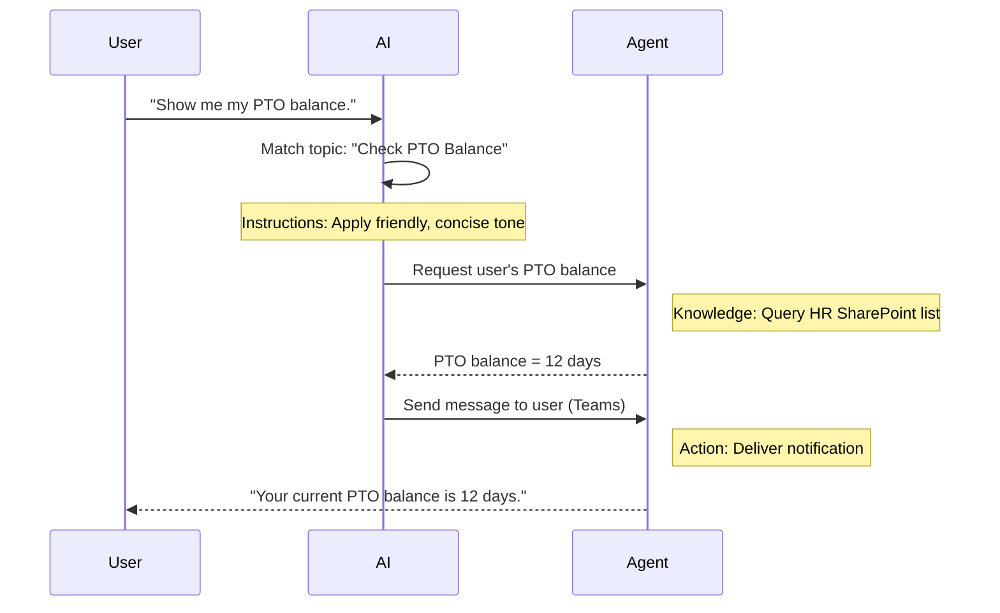

<!--
CO_OP_TRANSLATOR_METADATA:
{
  "original_hash": "90a3c5122f5687bbc8cc819990f175d4",
  "translation_date": "2025-10-21T18:56:50+00:00",
  "source_file": "docs/recruit/02-copilot-studio-fundamentals/README.md",
  "language_code": "my"
}
-->
# 🚨 မစ်ရှင် 02: Copilot Studio အခြေခံများ

## 🕵️‍♂️ ကုဒ်နာမည်: `OPERATION CORE PROTOCOL`

> **⏱️ လုပ်ဆောင်ချိန်:** `~၃၀ မိနစ် – သတင်းအချက်အလက်သာ၊ လုပ်ငန်းခွင်အတွေ့အကြုံမလိုအပ်ပါ`  

🎥 **လမ်းညွှန်မှုကို ကြည့်ပါ**

[](https://www.youtube.com/watch?v=x4OCwDRGeLE "YouTube တွင် လမ်းညွှန်မှုကို ကြည့်ပါ")

## 🎯 မစ်ရှင်အကျဉ်းချုပ်

ကြိုဆိုပါတယ်၊ အဖွဲ့သား။ ဒီမစ်ရှင်က Copilot Studio အလုပ်လုပ်ပုံနဲ့ စီးပွားရေးအကျိုးရှိတဲ့ အာဏာပိုင် AI ကို တည်ဆောက်ပုံကို နားလည်စေဖို့ အခြေခံသတင်းအချက်အလက်တွေကို သင်ပေးမှာပါ။

သင့်ရဲ့ ပထမဆုံး agent ကို တည်ဆောက်မယ့်အခါမှာ Knowledge, Tools, Topics, နဲ့ Instructions ဆိုတဲ့ အရေးပါတဲ့ အစိတ်အပိုင်းလေးခုကို နားလည်ဖို့လိုပါတယ်။ ဒီအရာတွေဟာ Copilot Studio orchestrator မှာ ဘယ်လိုပေါင်းစပ်လုပ်ဆောင်တယ်ဆိုတာကိုလည်း သင်ယူရမှာပါ။

## 🔎 ရည်မှန်းချက်များ

ဒီမစ်ရှင်မှာ သင်လုပ်ဆောင်ရမယ့်အရာတွေက:

- **Copilot Studio ဆိုတာဘာလဲဆိုတာ သင်ယူပါ**
- **Agent တွေကို ဘယ်အချိန်မှာ၊ ဘာကြောင့် အသုံးပြုရမလဲဆိုတာ သင်ယူပါ**
- **Agent တွေရဲ့ အခြေခံအစိတ်အပိုင်းလေးခုကို လေ့လာပါ**
      - **Knowledge**
      - **Tools**
      - **Topics**
      - **Instructions**
- **ဒီအစိတ်အပိုင်းတွေ ဘယ်လိုပေါင်းစပ်လုပ်ဆောင်တယ်ဆိုတာ နားလည်ပါ**  
  အာဏာပိုင်၊ အလိုအလျောက်လုပ်ဆောင်နိုင်တဲ့ agent တစ်ခုကို ဖန်တီးနိုင်ဖို့

---

## Copilot Studio မှာ Agent ဆိုတာဘာလဲ?

**Agent** ဆိုတာ သင့်ရဲ့ အထူးပြု AI အကူအညီပေးသူတစ်ဦးဖြစ်ပြီး အထူးလုပ်ငန်းတာဝန်များကို လုပ်ဆောင်ပေးနိုင်ပါတယ်။ အထူးပြု chatbot တစ်ခုလိုမျိုး သင့် agent:

- **ကုမ္ပဏီအထူးပြု ဒေတာများကို သိရှိထားပါတယ်** (မူဝါဒများ၊ စာရွက်စာတမ်းများ၊ ဒေတာဘေ့စ်များ)  
- **အမှန်တကယ်လုပ်ဆောင်ရမယ့်အလုပ်တွေကို လုပ်ဆောင်ပေးပါတယ်** (မက်ဆေ့ပို့ခြင်း၊ ပြက္ခဒိန်ပွဲစဉ်တွေ ဖန်တီးခြင်း၊ မှတ်တမ်းတွေ ပြင်ဆင်ခြင်း)  
- **စကားပြော context ကို ထိန်းသိမ်းထားပါတယ်** ဒါကြောင့် အရင်မေးထားတဲ့မေးခွန်းတွေကို ဆက်လက်ဖြေရှင်းပေးနိုင်ပါတယ်  

Copilot Studio က low-code ဖြစ်တဲ့အတွက် သင့်မှာ coding skill မရှိလည်း အစိတ်အပိုင်းတွေကို drag နဲ့ drop လုပ်ပြီး အသုံးပြုနိုင်ပါတယ်။ Agent တစ်ခုကို တည်ဆောက်ပြီးရင် လူတွေက Teams, Slack, ဒါမှမဟုတ် custom webpage မှာ အလိုအလျောက် workflow တွေကို လုပ်ဆောင်ဖို့ အကူအညီတောင်းနိုင်ပါတယ်။

---

## Copilot Studio ကို ဘယ်အချိန်မှာ၊ ဘာကြောင့် အသုံးပြုရမလဲ

Microsoft 365 Copilot က Office apps တွေမှာ အထွေထွေ AI အကူအညီပေးနိုင်ပေမယ့် သင့်အတွက် agent တစ်ခုလိုအပ်တဲ့အခါမှာ:

### သင့်အဖွဲ့အစည်းအထူးပြု knowledge လိုအပ်တဲ့အခါ

- Out-of-the-box Copilot က သင့်ကုမ္ပဏီရဲ့ အတွင်းရေးရာလုပ်ထုံးလုပ်နည်းတွေ ဒါမှမဟုတ် ဒေတာတွေကို မသိနိုင်ပါဘူး။ Agent က သင့် SharePoint sites, databases, ဒါမှမဟုတ် custom sources တွေကို query လုပ်ပြီး တိကျတဲ့ အချက်အလက်တွေကို ပေးနိုင်ပါတယ်။  

### အဆင့်ဆင့် workflow တွေကို အလိုအလျောက်လုပ်ဆောင်ချင်တဲ့အခါ

- ဥပမာ: "တစ်ယောက်ယောက်က အကုန်အကျခံစာတင်တဲ့အခါမှာ အတည်ပြုဖို့ပို့ပေးပြီး၊ ငွေကြေးစာရင်းကို update လုပ်ပေးပြီး၊ မန်နေဂျာကို အသိပေးပါ။" Agent တစ်ခုက တစ်ခုတည်းသော command ဒါမှမဟုတ် အဖြစ်အပျက်တစ်ခုနဲ့ အဆင့်ဆင့်လုပ်ဆောင်ပေးနိုင်ပါတယ်။  

### Contextual, tool အတွင်းမှာ အတွေ့အကြုံလိုအပ်တဲ့အခါ  

- ဥပမာ: Teams မှာ New Hire Onboarding agent တစ်ခုက HR staff တွေကို policy တစ်ခုချင်းစီအကြောင်း လမ်းညွှန်ပေးပြီး၊ လိုအပ်တဲ့ form တွေကို ပို့ပေးပြီး၊ orientation meeting တွေကို စီစဉ်ပေးနိုင်ပါတယ်။  

---

## Agent တစ်ခုရဲ့ အခြေခံအစိတ်အပိုင်းလေးခု

Copilot Studio agent တစ်ခုကို အခြေခံအစိတ်အပိုင်းလေးခုဖြင့် တည်ဆောက်ထားပါတယ်:

1. **Knowledge**  
1. **Tools (Actions)**  
1. **Topics**  
1. **Instructions**

အောက်မှာ အစိတ်အပိုင်းတစ်ခုချင်းစီကို အဓိပ္ပာယ်ဖော်ပြပြီး အကျိုးရှိတဲ့ agent တစ်ခုကို ဘယ်လိုလုပ်ဆောင်တယ်ဆိုတာကို ပြသထားပါတယ်။

### 1. Knowledge

**Knowledge** ဆိုတာ သင့် agent က တိကျစွာ မေးခွန်းတွေကို ဖြေရှင်းဖို့ အသုံးပြုတဲ့ ဒေတာနဲ့ context ဖြစ်ပါတယ်။ ဒါဟာ အပိုင်းနှစ်ခုပါဝင်ပါတယ်:

#### Custom Instructions & Context

- Agent ရဲ့ ရည်ရွယ်ချက်နဲ့ စကားပြောပုံစံကို သင့်အနေဖြင့် ရေးသားပေးရပါတယ်။ ဥပမာ:  

    ```text
    You are an IT support agent. You help employees troubleshoot common software issues, provide troubleshooting steps, and escalate urgent tickets.
    ```

- စကားပြောနေစဉ်မှာ Agent က အရင်ပြောထားတဲ့အကြောင်းအရာတွေကို မှတ်မိထားပြီး ပြန်လည်ရည်ညွှန်းနိုင်ပါတယ် (ဥပမာ: အသုံးပြုသူက "My printer is offline" လို့ပြောပြီးနောက် "Did you check the ink level?" လို့မေးတဲ့အခါမှာ Agent က printer context ကို မှတ်မိထားပါတယ်။)

#### Knowledge Sources (Grounding Data)

- Agent ကို SharePoint libraries, documentation sites, wikis, ဒါမှမဟုတ် အခြားသော databases တွေနဲ့ ချိတ်ဆက်ပေးနိုင်ပါတယ်။  
- အသုံးပြုသူက မေးခွန်းမေးတဲ့အခါမှာ Agent က အဲ့ဒီ sources တွေကနေ သက်ဆိုင်တဲ့ အချက်အလက်တွေကို ရှာဖွေပြီး အဖြေတွေကို **grounded** ဖြစ်အောင် ပေးနိုင်ပါတယ်။  
- Agent ကို အဲ့ဒီ sources တွေက အချက်အလက်တွေကိုသာ အသုံးပြုဖို့ အတိအကျပြောနိုင်ပြီး အဖြေတွေကို ခန့်မှန်းတာမျိုးမဖြစ်အောင် ကာကွယ်နိုင်ပါတယ်။

!!! example
    "Policy Assistant" agent တစ်ခုက သင့် HR SharePoint site ကို ချိတ်ဆက်ထားနိုင်ပါတယ်။ အသုံးပြုသူက "What is our PTO accrual rate?" လို့မေးတဲ့အခါမှာ Agent က generic AI response ကို မပေးဘဲ HR policy document မှာရှိတဲ့ အတိအကျစာသားကို ရယူပြီး ဖြေရှင်းပေးနိုင်ပါတယ်။

---

### 2. Tools (Actions)

**Tools (Actions)** ဆိုတာ agent က chatting အပြင် လုပ်ဆောင်နိုင်တဲ့ task တွေကို သတ်မှတ်ပေးပါတယ်။ Action တစ်ခုစီဟာ agent က programmatically လုပ်ဆောင်တဲ့ task ဖြစ်ပါတယ်၊ ဥပမာ:

- Email ဒါမှမဟုတ် Teams message ပို့ခြင်း  
- ပြက္ခဒိန်ပွဲစဉ် ဖန်တီးခြင်း ဒါမှမဟုတ် ပြင်ဆင်ခြင်း  
- SharePoint list ဒါမှမဟုတ် Dataverse table မှာ record တစ်ခုကို ထည့်သွင်းခြင်း ဒါမှမဟုတ် ပြင်ဆင်ခြင်း  
- Power Automate flow ဒါမှမဟုတ် REST API ကို ခေါ်ခြင်း  

#### Actions ဘယ်လိုအလုပ်လုပ်တယ်

- **Inputs & Outputs ကို သတ်မှတ်ပါ**  
      - ဥပမာ၊ Send Email action ကလိုအပ်နိုင်ပါတယ်:  
        - `RecipientEmailAddress`  
        - `SubjectLine`  
        - `EmailBody`  

- **Actions တွေကို Workflows အဖြစ် ပေါင်းစပ်ပါ**  
      - အသုံးပြုသူရဲ့ request ကို ဖြည့်ဆည်းဖို့ အဆင့်စုံ လိုအပ်နိုင်ပါတယ်။  
      - Actions တွေကို အစဉ်လိုက်လုပ်ဆောင်နိုင်ပါတယ်:  
             1. Agent က SharePoint list ကနေ ဒေတာကို ရယူပါတယ်။  
             2. LLM ကို အသုံးပြုပြီး summary တစ်ခုကို ဖန်တီးပါတယ်။  
             3. Teams message ကို အဲ့ဒီ summary နဲ့ပို့ပါတယ်။  

- **အပြင်စနစ်တွေနဲ့ ချိတ်ဆက်ပါ**  
      - CRM ကို update လုပ်ဖို့ ဒါမှမဟုတ် internal API ကို ခေါ်ဖို့ custom action တစ်ခုကို ဖန်တီးပါ။  
      - Copilot Studio က Power Platform ဒါမှမဟုတ် HTTP-based endpoint တစ်ခုနဲ့ ချိတ်ဆက်နိုင်ပါတယ်။

!!! example "An "Expense Helper" agent could:"  
    1. "Submit Expense" request ကို နားထောင်ပါ။  
    2. အသုံးပြုသူရဲ့ expense details ကို form ကနေ ရယူပါ။  
    3. "Add to SharePoint List" action ကို အသုံးပြုပြီး ဒေတာကို သိမ်းဆည်းပါ။  
    4. "Send Email" action ကို အသုံးပြုပြီး approver ကို အသိပေးပါ။  

---

### 3. Topics

**Topics** ဆိုတာ agent ရဲ့ conversational triggers ဒါမှမဟုတ် entry points တွေကို သတ်မှတ်ပေးပါတယ်။ Topic တစ်ခုစီဟာ functionality ဒါမှမဟုတ် မေးခွန်းအမျိုးအစားတစ်ခုကို ကိုယ်စားပြုပါတယ်။

#### Conversational Triggers  

- Topic တစ်ခုက "Submit IT Ticket," "Check Vacation Balance," ဒါမှမဟုတ် "Create Sales Report" ဖြစ်နိုင်ပါတယ်။  
- Copilot Studio က **generative orchestration** ကို အသုံးပြုပါတယ်: အသုံးပြုသူရဲ့ intent ကို AI က နားလည်ပြီး သင့်ရဲ့ short description အပေါ်မူတည်ပြီး မှန်ကန်တဲ့ topic ကို ရွေးချယ်ပါတယ်။  

#### Topic Descriptions  

- Topic တစ်ခုစီမှာ အဲ့ဒီ topic ရဲ့ အကြောင်းအရာကို ရှင်းလင်းပြီး တိကျစွာ ရေးသားပေးပါ။

!!! example "Topic description ဥပမာ"
    ဒီ topic က အသုံးပြုသူတွေကို IT support ticket တစ်ခုကို issue details, priority, နဲ့ contact information တွေကို ရယူပြီး တင်ပေးနိုင်ပါတယ်။

- AI က အဲ့ဒီ description ကို အသုံးပြုပြီး user phrasing နဲ့ မတူညီပေမယ့် topic ကို activate လုပ်ဖို့ ဆုံးဖြတ်ပါတယ်။

#### Mapping Topics to Actions  

- Topic တစ်ခုစီကို action တွေ ဒါမှမဟုတ် data retrieval steps တွေနဲ့ ချိတ်ဆက်ထားပါတယ်။  
- AI က topic ကို ရွေးချယ်တဲ့အခါမှာ သင့်ရဲ့ sequence အတိုင်း conversation ကို လမ်းညွှန်ပေးပါတယ် (follow-up questions မေးခြင်း၊ actions တွေကို ခေါ်ခြင်း၊ results တွေကို ပြန်ပေးခြင်း)။

!!! example
    အသုံးပြုသူက "I need help setting up my new laptop" လို့ပြောတဲ့အခါ AI က "Submit IT Ticket" topic ကို match လုပ်နိုင်ပါတယ်။ Agent က laptop model, user details ကို မေးပြီး helpdesk system မှာ ticket တစ်ခုကို အလိုအလျောက် push လုပ်ပေးနိုင်ပါတယ်။

---

### 4. Instructions

**Instructions** (တစ်ခါတစ်လေ "Prompts" ဒါမှမဟုတ် "System Messages" လို့ခေါ်တယ်) က LLM ရဲ့ tone, style, နဲ့ boundaries ကို လမ်းညွှန်ပေးပါတယ်။ Agent ရဲ့ response ကို shaping လုပ်ပေးပါတယ်။

#### Role & Persona  

- AI ကို "သင် Contoso Retail ရဲ့ customer service agent ဖြစ်ပါတယ်" လို့ ပြောပါ။  
- Tone ကို သင့် use case အပေါ်မူတည်ပြီး friendly, concise, formal, ဒါမှမဟုတ် casual ဖြစ်အောင် သတ်မှတ်နိုင်ပါတယ်။

#### Response Guidelines  

- Agent က လိုက်နာရမယ့် rule တွေကို သတ်မှတ်ပါ၊ ဥပမာ:  
      - "Policy အချက်အလက်တွေကို အမြဲ bullet points အဖြစ် အကျဉ်းချုပ်ပါ။"  
      - "အဖြေမရှိရင် ‘I’m sorry, I don’t have that information.’ လို့ပြောပါ။"  
      - "Confidential data ကို context အပြင်မှာ မထည့်ပါနဲ့။"

#### Memory & Context Rules

- Agent ကို စကားပြောအကြိမ်ရေဘယ်လောက်ကို မှတ်မိထားရမလဲဆိုတာ သတ်မှတ်နိုင်ပါတယ်။  
- ဥပမာ: "ဒီ user ရဲ့ requests တွေကို follow-up questions သုံးခုအထိ မှတ်မိထားပါ။"

!!! example "Benefits Advisor agent မှာ:"
    "Always reference the latest HR handbook when answering questions. If asked about enrollment deadlines, provide the specific dates from the policy. Keep answers under 150 words."

---

## အခြေခံအစိတ်အပိုင်းလေးခု ဘယ်လိုပေါင်းစပ်လုပ်ဆောင်တယ်

**Knowledge**, **Tools**, **Topics**, နဲ့ **Instructions** တွေကို ပေါင်းစပ်ပြီး Copilot Studio ရဲ့ AI orchestrator က agent တစ်ခုကို ဖန်တီးပေးပါတယ်:

1. **သက်ဆိုင်တဲ့ Topic ကို နားထောင်ပါ** (သင့်ရဲ့ topic descriptions အပေါ်မူတည်ပြီး).  
1. **Instructions ကို အသုံးပြုပါ** tone ကို သတ်မှတ်ပြီး၊ follow-up questions မေးရမယ့်အချိန်ကို ဆုံးဖြတ်ပါ၊ rule တွေကို လိုက်နာပါ။  
1. **Knowledge Sources ကို အသုံးပြုပါ** သင့်အဖွဲ့အစည်းရဲ့ ဒေတာအပေါ်မူတည်ပြီး အဖြေတွေကို ပေးပါ။  
1. **Tools (Actions) ကို ခေါ်ပါ** လိုအပ်တဲ့အခါ task တွေကို လုပ်ဆောင်ပါ—message ပို့ခြင်း၊ record တွေ update လုပ်ခြင်း၊ ဒါမှမဟုတ် APIs တွေကို ခေါ်ခြင်း။  

Orchestrator က **generative planning** နည်းလမ်းကို အသုံးပြုပြီး user request ကို ဖြည့်ဆည်းဖို့ ဘယ်လိုအဆင့်တွေကို ဘယ်လိုအစဉ်လိုက်လုပ်ဆောင်ရမလဲဆိုတာ ဆုံးဖြတ်ပါတယ်။ Action တစ်ခု fail ဖြစ်တဲ့အခါ (ဥပမာ၊ email ပို့လို့မရတဲ့အခါ) Agent က exception-handling guidelines (clarifying question မေးခြင်း ဒါမှမဟုတ် error ကို report လုပ်ခြင်း) ကို လိုက်နာပါတယ်။ LLM က conversation context ကို အလိုအလျောက် အပြောင်းအလဲလုပ်နိုင်တဲ့အတွက် Agent က စကားပြောအကြိမ်များစွာအတွင်း memory ကို ထိန်းသိမ်းပြီး စကားပြောအတွင်းမှာ အသစ်ရရှိတဲ့ အချက်အလက်တွေကို ထည့်သွင်းနိုင်ပါတယ်။

**Visual Flow ဥပမာ:**  
<!--
1. **User:** "Show me my PTO balance."
1. **AI (Topics):** "Check PTO Balance" topic ကို match လုပ်ပါ။  
1. **AI (Instructions):** Friendly, concise tone ကို အသုံးပြုပါ။  
1. **Agent (Knowledge):** HR SharePoint list ကို query လုပ်ပြီး user ရဲ့ balance ကို ရယူပါ။  
1. **Agent (Actions):** Value ကို ရယူပြီး Teams message ပို့ပါ:  
   > "Your current PTO balance is 12 days."  
-->



---

## 🎉 မစ်ရှင်ပြီးစီးပါပြီ

သင့်ရဲ့ အခြေခံသင်ကြားမှုကို အောင်မြင်စွာပြီးစီးပါပြီ။ Copilot Studio မှာ agent တစ်ခုရဲ့ အရေးပါတဲ့ အခြေခံအစိတ်အပိုင်းလေးခုကို သင်လေ့လာပြီးပါပြီ:

1. **Knowledge** – Agent က အချက်အလက်တွေကို ရှာဖွေပြီး စကားပြော memory ကို ထိန်းသိမ်းပေးတဲ့နေရာ  
1. **Tools** – Agent က အလိုအလျောက်လုပ်ဆောင်နိုင်တဲ့ task

---

**အကြောင်းကြားချက်**:  
ဤစာရွက်စာတမ်းကို AI ဘာသာပြန်ဝန်ဆောင်မှု [Co-op Translator](https://github.com/Azure/co-op-translator) ကို အသုံးပြု၍ ဘာသာပြန်ထားပါသည်။ ကျွန်ုပ်တို့သည် တိကျမှုအတွက် ကြိုးစားနေသော်လည်း အလိုအလျောက် ဘာသာပြန်မှုများတွင် အမှားများ သို့မဟုတ် မမှန်ကန်မှုများ ပါဝင်နိုင်သည်ကို သတိပြုပါ။ မူရင်းဘာသာစကားဖြင့် ရေးသားထားသော စာရွက်စာတမ်းကို အာဏာတရ အရင်းအမြစ်အဖြစ် သတ်မှတ်သင့်ပါသည်။ အရေးကြီးသော အချက်အလက်များအတွက် လူက ဘာသာပြန်မှုကို အသုံးပြုရန် အကြံပြုပါသည်။ ဤဘာသာပြန်မှုကို အသုံးပြုခြင်းမှ ဖြစ်ပေါ်လာသော အလွဲအလွတ်များ သို့မဟုတ် အနားလွဲမှုများအတွက် ကျွန်ုပ်တို့သည် တာဝန်မယူပါ။