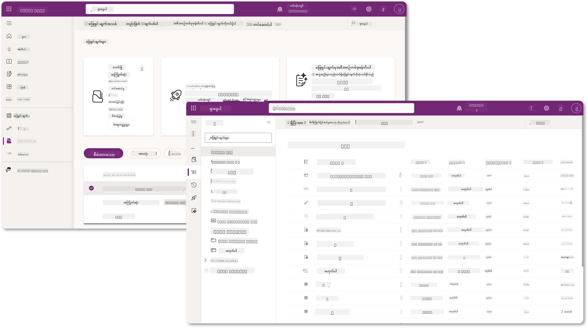
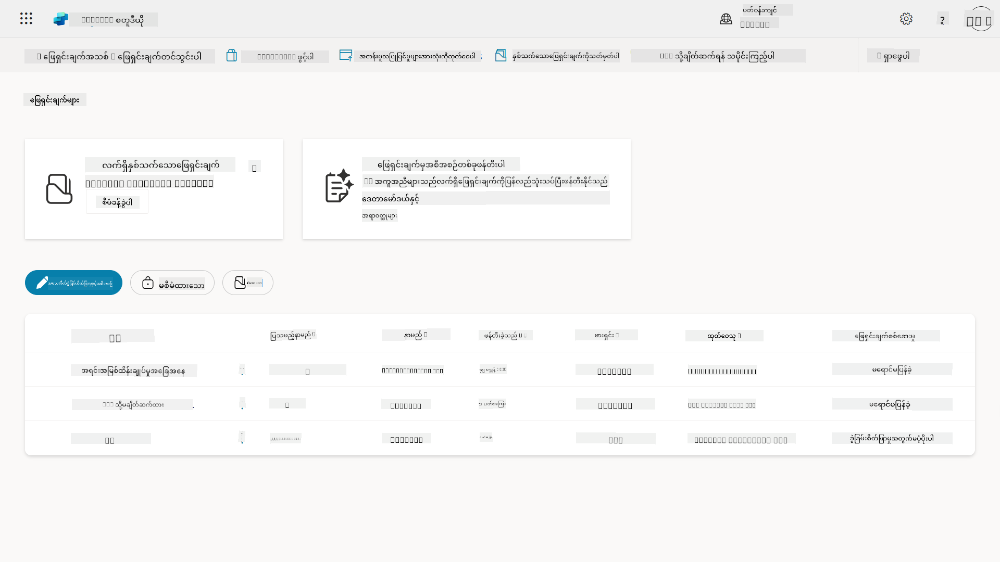
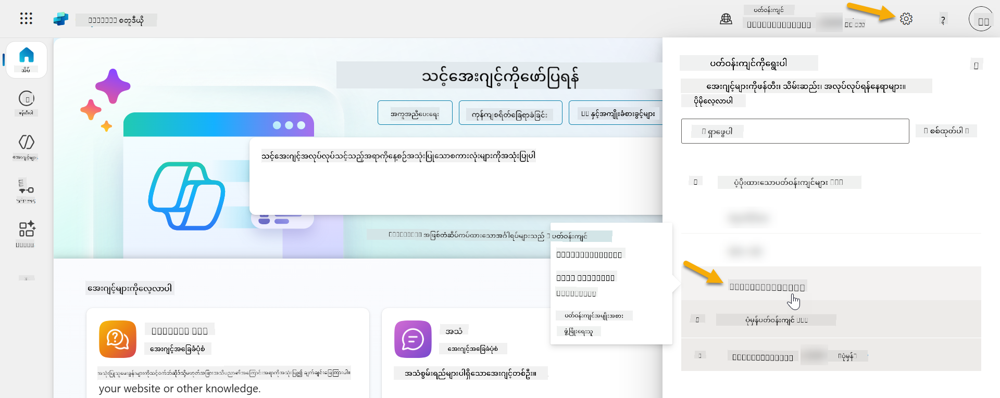
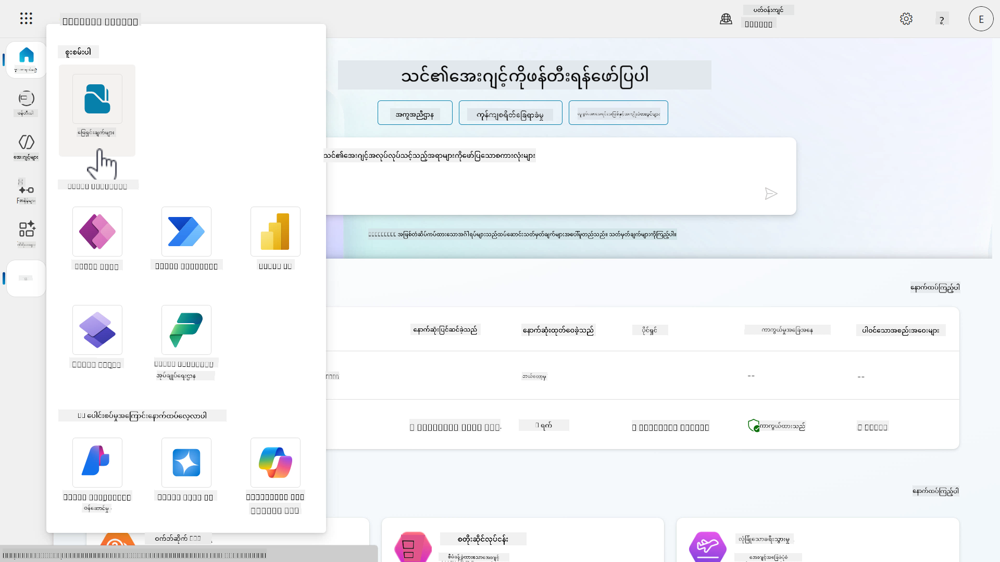
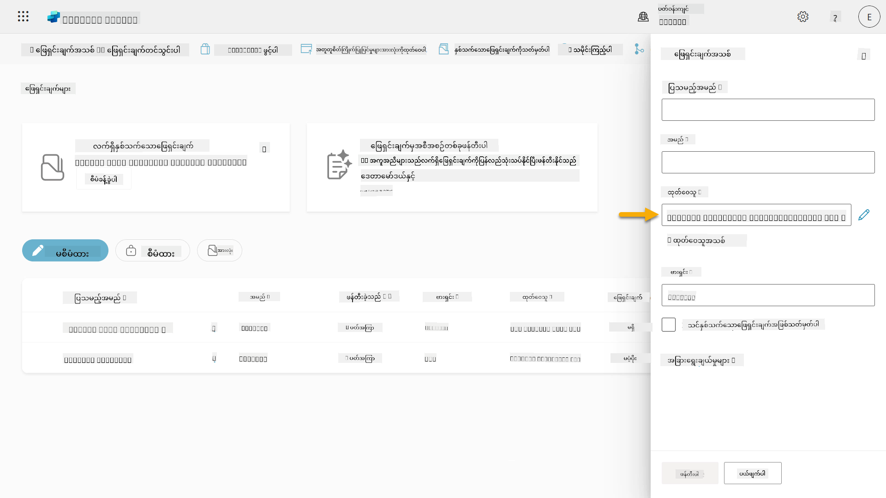
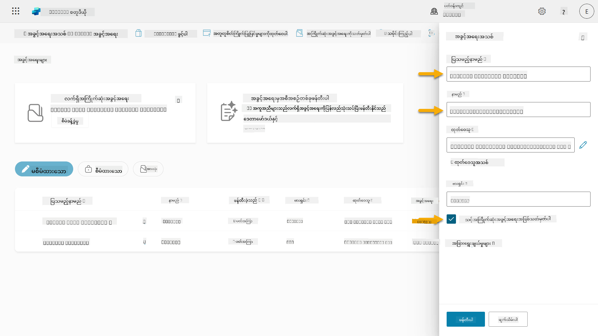
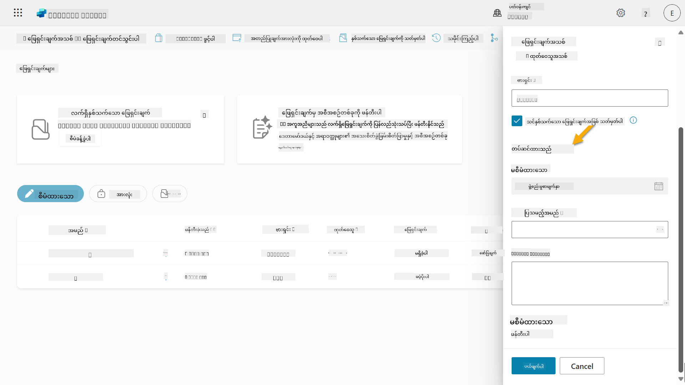
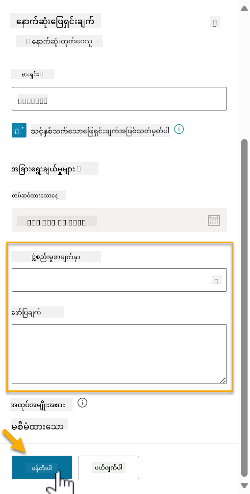
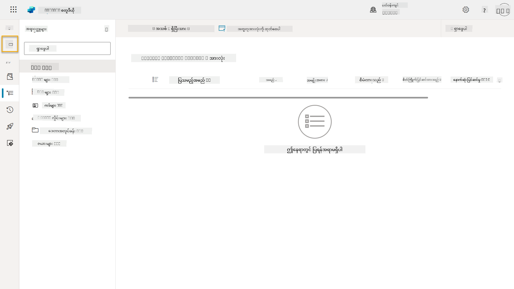

<!--
CO_OP_TRANSLATOR_METADATA:
{
  "original_hash": "0c51aabca81d6256990caf4c015e6195",
  "translation_date": "2025-10-21T18:31:38+00:00",
  "source_file": "docs/recruit/04-creating-a-solution/README.md",
  "language_code": "my"
}
-->
# 🚨 မစ်ရှင် ၀၄: သင့်အေးဂျင့်အတွက် ဖြေရှင်းချက်တစ်ခု ဖန်တီးခြင်း

## 🕵️‍♂️ ကုဒ်နာမည်: `OPERATION CTRL-ALT-PACKAGE`

> **⏱️ လုပ်ဆောင်ချိန်:** `~၄၅ မိနစ်`

🎥 **လမ်းညွှန်မှုကို ကြည့်ပါ**

[](https://www.youtube.com/watch?v=1iATbkgfcpU "YouTube တွင် လမ်းညွှန်မှုကို ကြည့်ပါ")

## 🎯 မစ်ရှင်အကျဉ်းချုပ်

Agent Maker, သင့်အရေးကြီးသော လုပ်ငန်းဆောင်တာသစ်ကို ကြိုဆိုပါတယ်။ ဒီမစ်ရှင်မှာ Microsoft Copilot Studio နဲ့ ဖန်တီးထားတဲ့ IT Helpdesk Agent အတွက် တရားဝင် deployment vehicle ဖြစ်တဲ့ Solution ကို စုစည်းဖန်တီးပုံကို သင်ယူပါမယ်။ ဒါကို သင့်အေးဂျင့်နဲ့ အရေးကြီးပစ္စည်းတွေကို ထည့်ထားတဲ့ ဒစ်ဂျစ်တယ် briefcase တစ်ခု ဖန်တီးတာလို့ ထင်ပါ။

အေးဂျင့်တိုင်းမှာ အဆင်ပြေတဲ့နေအိမ်လိုအပ်ပါတယ်။ Power Platform solution က အစီအစဉ်၊ သယ်ဆောင်နိုင်မှုနဲ့ ထုတ်လုပ်မှုအတွက် အသင့်ဖြစ်စေပါတယ်။

အခုတော့ စုစည်းလိုက်ရအောင်။

## 🔎 ရည်မှန်းချက်များ

ဒီမစ်ရှင်မှာ သင်လေ့လာရမယ့်အရာတွေက:

1. Power Platform solutions ဆိုတာဘာလဲ၊ အေးဂျင့်ဖွံ့ဖြိုးမှုမှာ အရေးပါမှုကို နားလည်ခြင်း
1. အေးဂျင့်တွေကို စီမံခန့်ခွဲပြီး deployment အတွက် solutions အသုံးပြုရတဲ့ အကျိုးကျေးဇူးကို သင်ယူခြင်း
1. Solution publishers ကို စူးစမ်းပြီး component management မှာ အရေးပါမှုကို နားလည်ခြင်း
1. Power Platform solution lifecycle ကို ဖွံ့ဖြိုးမှုကနေ ထုတ်လုပ်မှုအထိ နားလည်ခြင်း
1. သင့် IT Helpdesk Agent အတွက် သင့် solution publisher နဲ့ custom solution ကို ဖန်တီးခြင်း

## 🕵🏻‍♀️ Solution? ဘာလဲ?

Microsoft Power Platform မှာ solutions တွေဟာ သင့် apps သို့မဟုတ် agents ရဲ့ အစိတ်အပိုင်းတွေကို ထည့်ထားတဲ့ container သို့မဟုတ် package လိုပါပဲ - tables, forms, flows, custom logic စတာတွေပါဝင်နိုင်ပါတယ်။ Solutions တွေဟာ Application Lifecycle Management (ALM) အတွက် အရေးကြီးပြီး သင့် app နဲ့ agents တွေကို အကြံဉာဏ်ကနေ ဖွံ့ဖြိုးမှု၊ စမ်းသပ်မှု၊ deployment နဲ့ update အထိ စီမံခန့်ခွဲနိုင်စေပါတယ်။

Copilot Studio မှာ သင့်ဖန်တီးတဲ့ အေးဂျင့်တိုင်းဟာ Power Platform solution မှာ သိမ်းဆည်းထားပါတယ်။ ပုံမှန်အားဖြင့် အေးဂျင့်တွေကို Default solution မှာ ဖန်တီးထားပြီး သင့်အေးဂျင့်ကို ဖန်တီးဖို့ custom solution အသစ်ကို ဖန်တီးမထားလို့ပါ။ ဒီသင်ခန်းစာနဲ့ လက်တွေ့လေ့ကျင့်မှုမှာ ဒီအရာကို သင်ယူပါမယ် 🤓

Solutions တွေကို အများအားဖြင့် **Power Apps maker portal** မှာ ဖန်တီးခဲ့ပါတယ် - apps, Dataverse, flows, AI components စတာတွေကို ဖန်တီးပြီး customize လုပ်နိုင်တဲ့ web-based interface ဖြစ်ပါတယ်။

   

Copilot Studio မှာ **Solution Explorer** ရှိပြီး သင့် solutions တွေကို တိုက်ရိုက်စီမံခန့်ခွဲနိုင်ပါတယ်။ Power Apps maker portal ကို ပြောင်းဖို့ မလိုတော့ဘဲ Copilot Studio အတွင်းမှာပဲ solution-related tasks တွေကို လုပ်နိုင်ပါတယ် 🪄

ဒီအရာက solution-related tasks တွေကို လုပ်နိုင်စေပါတယ်:

- **Solution တစ်ခု ဖန်တီးခြင်း** - custom solutions တွေက အေးဂျင့်တွေကို environment တွေကြားမှာ export နဲ့ import လုပ်နိုင်စေပါတယ်။
- **Preferred solution ကို သတ်မှတ်ခြင်း** - အေးဂျင့်တွေ၊ apps တွေကို default အဖြစ် ဖန်တီးမယ့် solution ကို ရွေးချယ်နိုင်ပါတယ်။
- **Components တွေ ထည့်သွင်းခြင်း သို့မဟုတ် ဖယ်ရှားခြင်း** - သင့်အေးဂျင့်ဟာ environment variables သို့မဟုတ် cloud flows စတာတွေကို ရည်ညွှန်းထားနိုင်ပါတယ်။ ဒါကြောင့် ဒီ components တွေကို solution မှာ ထည့်သွင်းဖို့လိုအပ်ပါတယ်။
- **Solutions တွေကို Export လုပ်ခြင်း** - solutions တွေကို တစ်ခြား target environment ကို ရွှေ့ဖို့။
- **Solutions တွေကို Import လုပ်ခြင်း** - တစ်ခြားနေရာမှာ ဖန်တီးထားတဲ့ solutions တွေကို import လုပ်ပြီး upgrade သို့မဟုတ် update လုပ်ခြင်း။
- **Solution pipelines တွေ ဖန်တီးပြီး စီမံခန့်ခွဲခြင်း** - environment တွေကြားမှာ solutions တွေကို deployment လုပ်ဖို့ automate လုပ်ခြင်း။
- **Git integration** - developers တွေကို Git repositories နဲ့ solutions တွေကို ချိတ်ဆက်ပြီး version control, collaboration နဲ့ ALM အတွက် အသုံးပြုနိုင်စေပါတယ်။ Developer environments တွေမှာသာ အသုံးပြုဖို့ ရည်ရွယ်ထားပါတယ်။

   

Solutions တွေမှာ အမျိုးအစားနှစ်မျိုးရှိပါတယ်:

- **Unmanaged solutions** - ဖွံ့ဖြိုးမှုအတွင်း အသုံးပြုပါတယ်။ လိုအပ်သလို edit နဲ့ customize လုပ်နိုင်ပါတယ်။
- **Managed solutions** - သင့် app ကို စမ်းသပ်မှု သို့မဟုတ် ထုတ်လုပ်မှုအတွက် deploy လုပ်ဖို့ အသင့်ဖြစ်တဲ့အခါ အသုံးပြုပါတယ်။ အမှားဖြစ်စေမယ့် ပြောင်းလဲမှုတွေကို ကာကွယ်ဖို့ lock down လုပ်ထားပါတယ်။

## 🤔 Solution ကို သင့်အေးဂျင့်အတွက် ဘာကြောင့် အသုံးပြုသင့်လဲ?

Solutions တွေကို _toolbox_ လို့ ထင်ပါ။ သင့်အေးဂျင့်ကို တစ်ခြားနေရာ (environment) မှာ ပြင်ဆင်ဖို့ သို့မဟုတ် ဖန်တီးဖို့ လိုအပ်တဲ့ tools (components) တွေကို စုစည်းပြီး toolbox (Solution) ထဲမှာ ထည့်ထားပါတယ်။ အဲ့ဒီ toolbox ကို အသစ်သောနေရာ (environment) ကို သယ်ဆောင်သွားပြီး tools (components) တွေကို သုံးပြီး သင့်အလုပ်ကို ပြီးမြောက်အောင်လုပ်နိုင်ပါတယ်။

!!! quote "Elaiza, သင့်ရဲ့ရင်းနှီးသော cloud advocate 🙋🏻‍♀️"
    နယူးဇီလန်မှာ "Be a tidy Kiwi!" ဆိုတဲ့စကားရှိပါတယ် 🥝 ဒါဟာ နေရာတစ်ခုလုံးကို သန့်ရှင်းစေဖို့ နယူးဇီလန်လူမျိုးတွေကို တိုက်တွန်းတဲ့ စကားပါ။ အေးဂျင့်တွေအတွက်လည်း အဲ့ဒီအတိုင်းပဲ သင့်အေးဂျင့်နဲ့ ဆိုင်တဲ့အရာတွေကို စနစ်တကျ စီမံထားပြီး သယ်ဆောင်နိုင်ဖို့ ပြုလုပ်ပါ။

Source (developer) environment မှာ dedicated solution တစ်ခုအတွင်းမှာ အေးဂျင့်ကို ဖန်တီးတာက အကောင်းဆုံးအလေ့အကျင့်ပါ။ Solutions တွေက အရေးကြီးတဲ့အကြောင်းအရင်းတွေက:

🧩 **ဖွံ့ဖြိုးမှုကို စနစ်တကျ စီမံခြင်း**

- Default solution ထဲမှာရှိတဲ့ အရာအားလုံးကနေ သင့်အေးဂျင့်ကို ခွဲထားပါတယ်။ သင့်အေးဂျင့်ရဲ့ components တွေကို တစ်နေရာတည်းမှာထားပါတယ် 🎯

- သင့်အေးဂျင့်အတွက်လိုအပ်တဲ့ အရာအားလုံးကို solution မှာထားပြီး target environment ကို export နဲ့ import လုပ်ဖို့ လွယ်ကူစေပါတယ် 👉🏻 ဒါဟာ ALM ရဲ့ ကျန်းမာတဲ့အလေ့အကျင့်ပါ။

🧩 **အန္တရာယ်ကင်းသော deployment**

- သင့် app သို့မဟုတ် agent ကို managed solution အဖြစ် export လုပ်ပြီး တစ်ခြား target environments (စမ်းသပ်မှု သို့မဟုတ် ထုတ်လုပ်မှု) ကို deploy လုပ်နိုင်ပါတယ်။

🧩 **Version control**

- Patches (target fixes), updates (ပိုမိုကျယ်ပြန့်တဲ့ ပြောင်းလဲမှု) သို့မဟုတ် upgrades (solution ကို အစားထိုးခြင်း - အများကြီးပြောင်းလဲမှုနဲ့ features အသစ်တွေ ထည့်သွင်းခြင်း) ဖန်တီးနိုင်ပါတယ်။

- ပြောင်းလဲမှုတွေကို စနစ်တကျ rollout လုပ်နိုင်ပါတယ်။

🧩 **Dependency management**

- Solutions တွေဟာ ဘာတွေက ဘာတွေဆီမှာ မူတည်နေတယ်ဆိုတာကို track လုပ်ပါတယ်။ ဒါက သင့်ပြောင်းလဲမှုတွေက အရေးကြီးတဲ့အရာတွေကို မပျက်စီးစေဖို့ ကာကွယ်ပေးပါတယ်။

🧩 **အဖွဲ့အစည်းအတွင်း ပူးပေါင်းဆောင်ရွက်မှု**

- Developers နဲ့ makers တွေဟာ unmanaged solutions တွေကို ဖွံ့ဖြိုးမှုအတွင်း အသုံးပြုပြီး managed solution ကို deployment အတွက် လွှဲပြောင်းပေးနိုင်ပါတယ်။

## 🪪 Solution Publishers ကို နားလည်ခြင်း

Power Platform မှာ Solution Publisher ဆိုတာ solution ကို ဖန်တီးသူ သို့မဟုတ် ပိုင်ဆိုင်သူကို ဖော်ပြတဲ့ label သို့မဟုတ် brand လိုပါပဲ။ သင့် apps, agents နဲ့ flow customizations တွေကို စီမံခန့်ခွဲတဲ့အခါ အရေးကြီးတဲ့ အစိတ်အပိုင်းတစ်ခုပါ။

Solution တစ်ခုကို ဖန်တီးတဲ့အခါ publisher ကို ရွေးချယ်ရပါမယ်။ ဒီ publisher က:

- Custom components (tables, fields, flows စတာတွေ) အားလုံးကို ထည့်သွင်းမယ့် prefix ကို သတ်မှတ်ပေးပါတယ်။

- Solution ကို ပိုင်ဆိုင်သူ organization သို့မဟုတ် ပုဂ္ဂိုလ်ရဲ့ နာမည်နဲ့ ဆက်သွယ်မှုအချက်အလက်တွေကို ဖော်ပြပါတယ်။

### 🤔 အရေးကြီးမှုက ဘာလဲ?

1. **လွယ်ကူစွာ ဖော်ထုတ်နိုင်မှု** - prefix (ဥပမာ - `new_` သို့မဟုတ် `abc_`) က ဘယ် components တွေက ဘယ် solution သို့မဟုတ် အဖွဲ့အစည်းနဲ့ ဆိုင်တယ်ဆိုတာကို လွယ်ကူစွာ ဖော်ထုတ်နိုင်စေပါတယ်။

1. **ပဋိပက္ခတွေကို ရှောင်ရှားနိုင်မှု** - အဖွဲ့နှစ်ခုက status ဆိုတဲ့ column ကို ဖန်တီးရင် သူတို့ရဲ့ prefix (`teamA_status`, `teamB_status`) က naming collisions ကို ကာကွယ်ပေးပါတယ်။

1. **ALM ကို ပံ့ပိုးပေးမှု** - solutions တွေကို environments (Dev → Test → Prod) ကြားမှာ ရွှေ့တဲ့အခါ publisher က ownership ကို track လုပ်ပြီး consistency ကို ထိန်းသိမ်းပေးပါတယ်။

### ✨ ဥပမာ

Contoso Solutions ဆိုတဲ့ publisher ကို `cts_` prefix နဲ့ ဖန်တီးတယ်လို့ ဆိုပါစို့။

သင့် custom column ကို _Priority_ လို့ ဖန်တီးရင် solution မှာ `cts_Priority` အဖြစ် သိမ်းဆည်းပါမယ်။

Solution အဆင့်မှာ column ကို တွေ့တဲ့သူတိုင်း ဘယ် environment မှာရှိနေပါစေ၊ Contoso Solutions နဲ့ ဆိုင်တဲ့ column ဖြစ်တယ်ဆိုတာကို လွယ်ကူစွာ သိနိုင်ပါတယ်။

## 🧭 Power Platform Solution lifecycle

Solution ရဲ့ ရည်ရွယ်ချက်ကို နားလည်ပြီးရင် lifecycle ကို လေ့လာကြရအောင်။

**1. Development environment မှာ Solution ဖန်တီးခြင်း** - Development environment မှာ solution အသစ်ကို ဖန်တီးခြင်း။

**2. Components တွေ ထည့်သွင်းခြင်း** - apps, flows, tables နဲ့ အခြား elements တွေကို solution ထဲမှာ ထည့်သွင်းခြင်း။

**3. Managed solution အဖြစ် Export လုပ်ခြင်း** - Managed solution အဖြစ် export လုပ်ပြီး deployment အတွက် package လုပ်ခြင်း။

**4. Test environment မှာ Import လုပ်ခြင်း** - Test environment မှာ solution ကို စမ်းသပ်ပြီး အားလုံးအဆင်ပြေကြောင်း သေချာစေခြင်း။

**5. Production environment မှာ Import လုပ်ခြင်း** - စမ်းသပ်ပြီးသား solution ကို live Production environment မှာ deploy လုပ်ခြင်း။

**6. Patches, Updates သို့မဟုတ် Upgrades တွေကို အသုံးပြုခြင်း** - Patches, updates သို့မဟုတ် upgrades တွေကို အသုံးပြုပြီး တိုးတက်မှု သို့မဟုတ် ပြင်ဆင်မှုတွေ လုပ်ခြင်း။ 🔁 cycle ကို ထပ်လုပ်ပါ!

### ✨ ဥပမာ

သင့် IT helpdesk agent ကို ဖန်တီးပြီး ဝန်ထမ်းတွေကို device problems, network troubleshooting, printer setup စတာတွေကို ကူညီပေးဖို့ ရည်ရွယ်တယ်လို့ ဆိုပါစို့။

- Development environment မှာ unmanaged solution ကို အသုံးပြုပြီး စတင်ဖန်တီးပါ။

- အဆင်ပြေတဲ့အခါ managed solution အဖြစ် export လုပ်ပြီး System Test သို့မဟုတ် User Acceptance Testing (UAT) environment ကဲ့သို့ target environment မှာ import လုပ်ပါ။

- စမ်းသပ်ပြီးရင် Production environment ကို ရွှေ့ပါ - original development version ကို မထိခိုက်ဘဲ။

## 🧪 Lab 04: Solution အသစ်တစ်ခု ဖန်တီးခြင်း

အခုတော့ သင်ယူရမယ့်အရာတွေက

- [4.1 Solution publisher ကို ဘယ်လိုဖန်တီးမလဲ](../../../../../docs/recruit/04-creating-a-solution)
- [4.2 Solution ကို ဘယ်လိုဖန်တီးမလဲ](../../../../../docs/recruit/04-creating-a-solution)

အရင်ဥပမာနဲ့အတူ Copilot Studio environment မှာ dedicated solution တစ်ခုကို ဖန်တီးပြီး IT helpdesk agent ကို ဖန်တီးမယ်။

စတင်လိုက်ရအောင်!

### လိုအပ်ချက်များ

#### Security role

Copilot Studio မှာ solution explorer မှာ သင်ဘာလုပ်နိုင်မလဲဆိုတာ သင့် user security role ပေါ်မူတည်ပါတယ်။
Power Apps admin center မှာ solutions တွေကို စီမံခန့်ခွဲဖို့ ခွင့်ပြုချက်မရှိရင် Copilot Studio မှာလည်း အဲ့ဒီ tasks တွေကို မလုပ်နိုင်ပါဘူး။

အဆင်ပြေစေဖို့ သင့် security roles နဲ့ permissions တွေကို စစ်ဆေးပါ။ သို့မဟုတ် သင့် organization မှာ environments တွေကို မစီမံခန့်ခွဲရင် သင့် IT administrator (သို့မဟုတ် အတူတူ) team ကို မေးပါ။

Environment မှာ solution ဖန်တီးနိုင်စေတဲ့ security roles တွေက:

| Security role    | ဖော်ပြချက် |
| ---------- | ---------- |
| Environment Maker | Environment တစ်ခုအတွင်း resources တွေကို ဖန်တီး၊ customize နဲ့ စီမံခန့်ခွဲဖို့ လိုအပ်တဲ့ ခွင့်ပြုချက်တွေကို ပေးပါတယ်  |
| System Customizer  | Environment Maker ထက် ကျယ်ပြန့်တဲ့ ခွင့်ပြုချက်တွေကို ပေးပြီး environment ကို customize လုပ်ဖို့နဲ့ security roles တွေကို စီမံခန့်ခွဲဖို့ လွှမ်းမိုးမှုရှိပါတယ် |
| System Administrator   | အမြင့်ဆုံး ခွင့်ပြုချက်အဆင့်ရှိပြီး environment ရဲ့ အAspect အားလုံးကို စီမံခန့်ခွဲနိုင်ပါတယ်၊ security roles တွေကို ဖန်တီးပြီး assign လုပ်နိုင်ပါတယ်     |

#### Developer environment

သင့် dedicated developer environment ကို ပြောင်းပါ၊ [Lesson 00 - Course Setup - Step 3: Create new developer](../00-course-setup/README.md#step-3-create-new-developer-environment) ကို ရည်ညွှန်းပါ။

1. အပေါ်ဘက်ညာမှာ **Cog wheel** icon ကို ရွေးပြီး default environment ကနေ သင့် environment ကို ပြောင်းပါ၊ ဥပမာ **Adele Vance's environment**။

    

### 4.1 Solution publisher ကို ဖန်တီးခြင်း

1. အရင် lesson မှာ အသုံးပြုခဲ့တဲ့ Copilot Studio environment ကို အသုံးပြုပြီး Copilot Studio ရဲ့ ဘယ်ဘက် menu မှာ **ellipsis icon (. . .)** ကို ရွေးပါ။ **Explore** header အောက်မှာ **Solutions** ကို ရွေးပါ။

    

1. Copilot Studio ရဲ့ **Solution Explorer** ကို load လုပ်ပါမယ်။ **+ New solution** ကို ရွ
1. **New publisher** ပန်းကိုပိတ်ပြီး **New solution** ပန်းသို့ ပြန်သွားပါမည်၊ အသစ်ဖန်တီးထားသော Publisher ကို ရွေးထားပြီးဖြစ်သည်။

      

အောင်မြင်မှု! 🙌🏻 သင်သည် Solution Publisher တစ်ခုကို ဖန်တီးပြီးဖြစ်သည်။ အခုတော့ အသစ်သော custom solution ဖန်တီးနည်းကို သင်ယူမည်ဖြစ်သည်။

### 4.2 Solution အသစ် ဖန်တီးခြင်း

1. Solution ကို ဖန်တီးပြီးဖြစ်သောကြောင့် **New solution** ပန်းတွင် ကျန်ရှိသော form ကို ပြည့်စုံစွာ ဖြည့်နိုင်ပါပြီ။

    **Display name** အဖြစ် အောက်ပါကို ကူးယူပြီး paste လုပ်ပါ၊

    ```text
    Contoso Helpdesk Agent
    ```

    **Name** အဖြစ် အောက်ပါကို ကူးယူပြီး paste လုပ်ပါ၊

    ```text
    ContosoHelpdeskAgent
    ```

    Solution အသစ်ကို ဖန်တီးနေသောကြောင့် [**Version** number](https://learn.microsoft.com/power-apps/maker/data-platform/update-solutions#understanding-version-numbers-for-updates/?WT.mc_id=power-172615-ebenitez) သည် default အနေဖြင့် `1.0.0.0` ဖြစ်ပါမည်။

    **Set as your preferred solution** checkbox ကို အမှန်ခြစ်ပါ။

      

1. **More options** ကို ချဲ့ထွင်ပြီး solution တွင် ပေးနိုင်သော အပိုအချက်အလက်များကို ကြည့်ပါ။

    

1. အောက်ပါအချက်များကို တွေ့ပါမည်၊

    - **Installed on** - Solution ကို install လုပ်ခဲ့သော ရက်စွဲ။

    - **Configuration page** - developer များသည် HTML web resource တစ်ခုကို setup လုပ်ပြီး user များအတွက် app, agent သို့မဟုတ် tool နှင့် ဆက်သွယ်ရန် အကူအညီပေးသော web page အဖြစ် Information section တွင် instruction သို့မဟုတ် button များနှင့်တကွ ပေါ်လာစေသည်။ ဒါသည် Solution များကို တည်ဆောက်ပြီး အခြားသူများနှင့် မျှဝေသော company များ သို့ developer များအတွက် အများဆုံး အသုံးပြုသည်။

    - **Description** - solution သို့မဟုတ် configuration page အကြောင်းအရာကို ဖော်ပြသည်။

    ဒီ lab အတွက် အချက်အလက်များကို လွတ်ထားပါမည်။

    **Create** ကို ရွေးပါ။

    

1. Contoso Helpdesk Agent Solution ကို ဖန်တီးပြီးဖြစ်သည်။ Copilot Studio တွင် agent တစ်ခုကို ဖန်တီးမချိန်အထိ component များမပါရှိပါ။

    Solution Explorer သို့ ပြန်သွားရန် **back arrow** icon ကို ရွေးပါ။

    

1. Contoso Helpdesk Agent သည် **Current preferred solution** အဖြစ် ပြသနေသည်ကို သတိပြုပါ၊ အရင်က **Set as your preferred solution** checkbox ကို အမှန်ခြစ်ထားသောကြောင့် ဖြစ်သည်။

    

## ✅ Mission Complete

ဂုဏ်ယူပါတယ်! 👏🏻 သင်သည် Publisher တစ်ခုကို ဖန်တီးပြီး Solution အသစ်တွင် အသုံးပြုကာ agent တစ်ခုကို တည်ဆောက်ရန် ပြင်ဆင်ပြီးဖြစ်သည်။

အလုပ်ကိုင် Agent Maker အဖြစ် အောင်မြင်မှု! တိကျသေချာသော digital footprint သည် အကျိုးရှိသော အတိုင်းအတာအတွက် ပထမဆုံးအဆင့်ဖြစ်သည်။ အခုတော့ သင်သည် တည်ဆောက်နိုင်သော၊ စီးပွားရေးလုပ်ငန်းအဆင့် agent ဖွံ့ဖြိုးတိုးတက်မှုအတွက် လိုအပ်သော tools နှင့် mindset ရရှိပြီးဖြစ်သည်။

**Lab 04 - Creating a Solution** ၏ အဆုံးသို့ ရောက်ရှိပြီးဖြစ်သည်၊ အောက်ပါ link ကို ရွေးပြီး နောက်တစ်ခုသော သင်ခန်းစာသို့ ရွှေ့ပါ။ ဒီ lab တွင် ဖန်တီးထားသော solution ကို နောက်တစ်ခုသော သင်ခန်းစာ၏ lab တွင် အသုံးပြုမည်ဖြစ်သည်။

⏭️ [**Get started quickly with pre-built agents** သင်ခန်းစာသို့ ရွှေ့ပါ](../05-using-prebuilt-agents/README.md)

## 📚 Tactical Resources

🔗 [Solution တစ်ခု ဖန်တီးခြင်း](https://learn.microsoft.com/power-apps/maker/data-platform/create-solution/?WT.mc_id=power-172615-ebenitez)

🔗 [Copilot Studio တွင် Solution များ ဖန်တီးခြင်းနှင့် စီမံခန့်ခွဲခြင်း](https://learn.microsoft.com/microsoft-copilot-studio/authoring-solutions-overview/?WT.mc_id=power-172615-ebenitez)

🔗 [Agent များကို အခြား user များနှင့် မျှဝေခြင်း](https://learn.microsoft.com/microsoft-copilot-studio/admin-share-bots/?WT.mc_id=power-172615-ebenitez)

🔗 [Predefined security roles အတွက် ရရှိနိုင်သော resources များ၏ အကျဉ်းချုပ်](https://learn.microsoft.com/power-platform/admin/database-security#summary-of-resources-available-to-predefined-security-roles/?WT.mc_id=power-172615-ebenitez)

🔗 [Solution တစ်ခုကို upgrade သို့မဟုတ် update လုပ်ခြင်း](https://learn.microsoft.com/power-apps/maker/data-platform/update-solutions/?WT.mc_id=power-172615-ebenitez)

🔗 [Power Platform တွင် pipelines များ၏ အကျဉ်းချုပ်](https://learn.microsoft.com/power-platform/alm/pipelines/?WT.mc_id=power-172615-ebenitez)

🔗 [Power Platform တွင် Git integration ၏ အကျဉ်းချုပ်](https://learn.microsoft.com/power-platform/alm/git-integration/overview/?WT.mc_id=power-172615-ebenitez)

<!-- markdownlint-disable-next-line MD033 -->


---

**အကြောင်းကြားချက်**:  
ဤစာရွက်စာတမ်းကို AI ဘာသာပြန်ဝန်ဆောင်မှု [Co-op Translator](https://github.com/Azure/co-op-translator) ကို အသုံးပြု၍ ဘာသာပြန်ထားပါသည်။ ကျွန်ုပ်တို့သည် တိကျမှုအတွက် ကြိုးစားနေသော်လည်း အလိုအလျောက် ဘာသာပြန်မှုများတွင် အမှားများ သို့မဟုတ် မတိကျမှုများ ပါဝင်နိုင်သည်ကို သတိပြုပါ။ မူရင်းဘာသာစကားဖြင့် ရေးသားထားသော စာရွက်စာတမ်းကို အာဏာတရားရှိသော အရင်းအမြစ်အဖြစ် သတ်မှတ်သင့်ပါသည်။ အရေးကြီးသော အချက်အလက်များအတွက် လူ့ဘာသာပြန်ပညာရှင်များကို အသုံးပြုရန် အကြံပြုပါသည်။ ဤဘာသာပြန်မှုကို အသုံးပြုခြင်းမှ ဖြစ်ပေါ်လာသော အလွဲအမှားများ သို့မဟုတ် အနားယူမှုများအတွက် ကျွန်ုပ်တို့သည် တာဝန်မယူပါ။