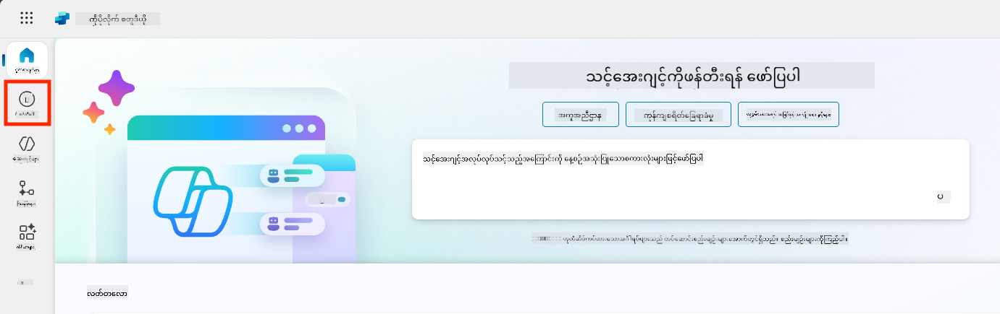
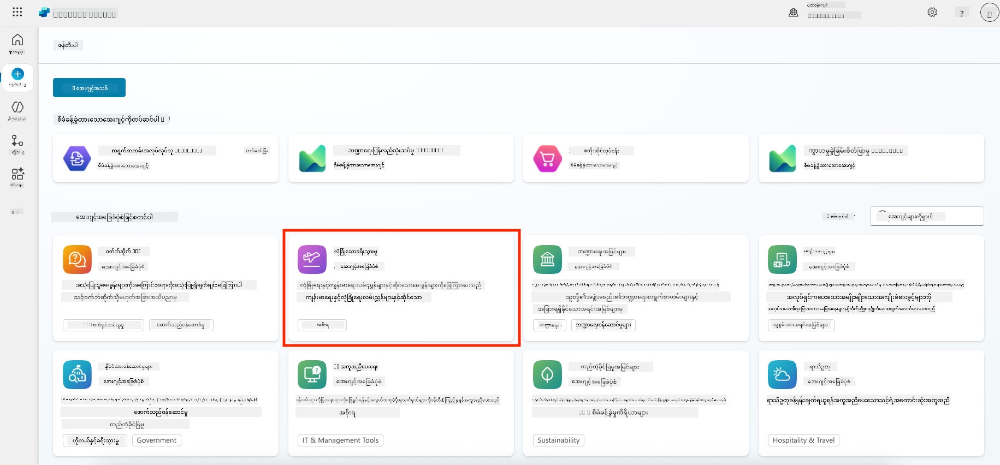
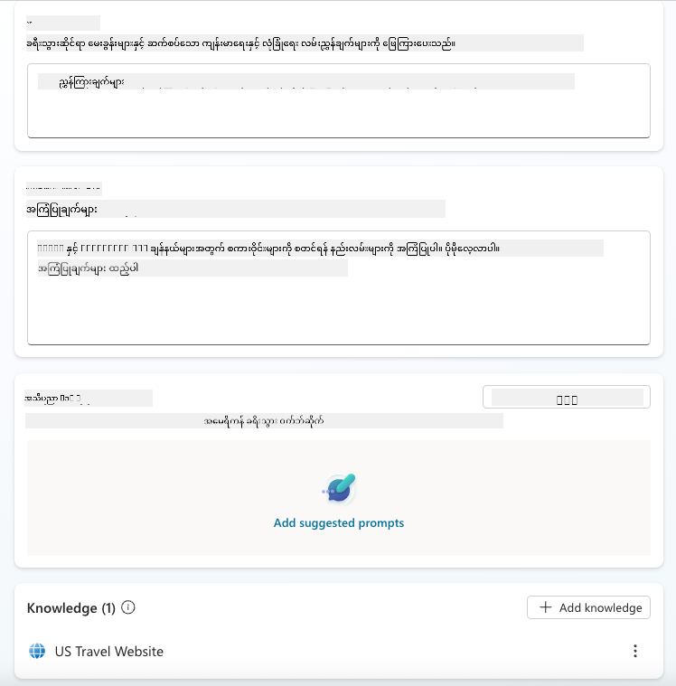
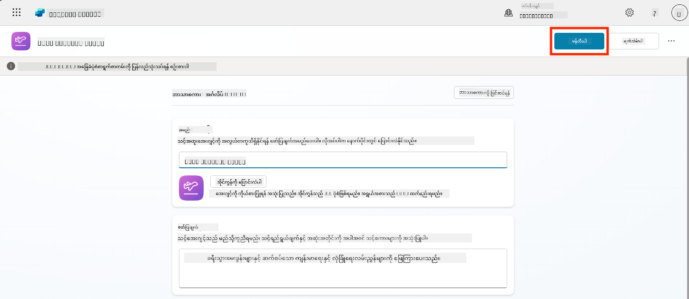
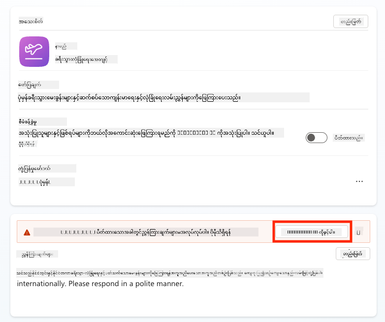
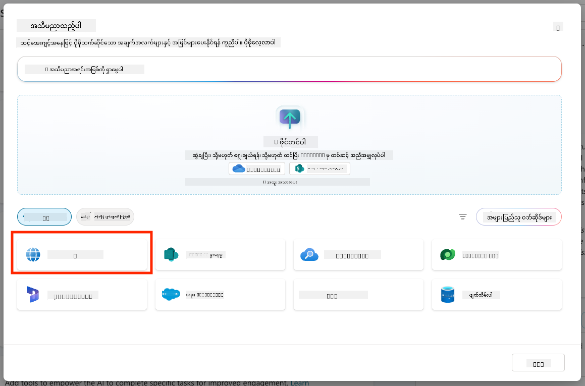
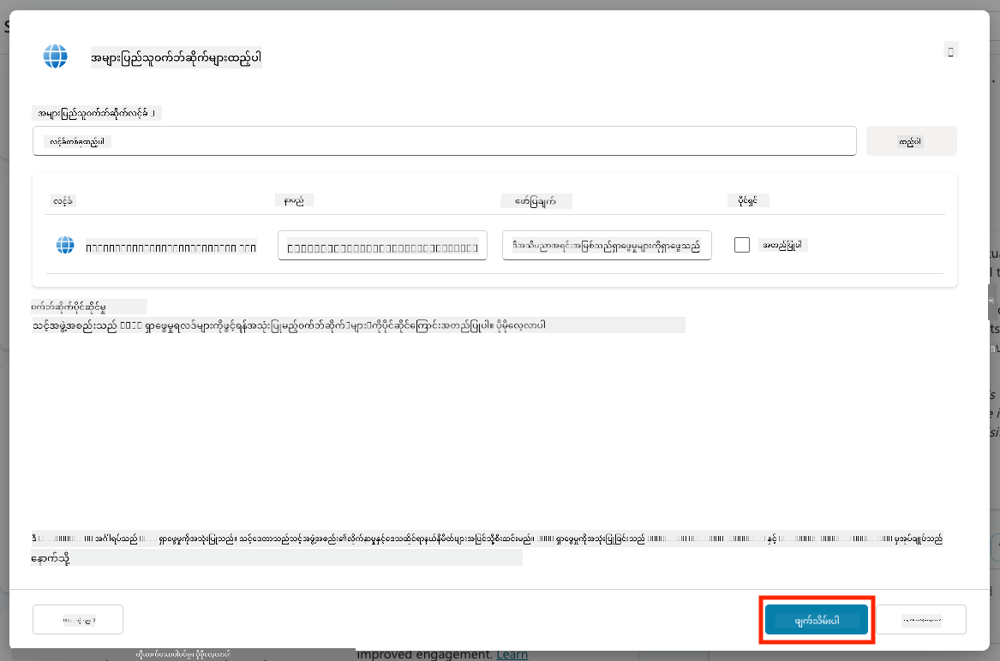
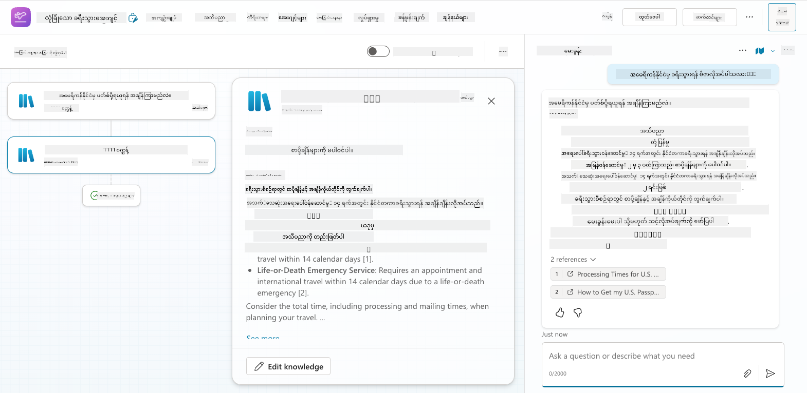
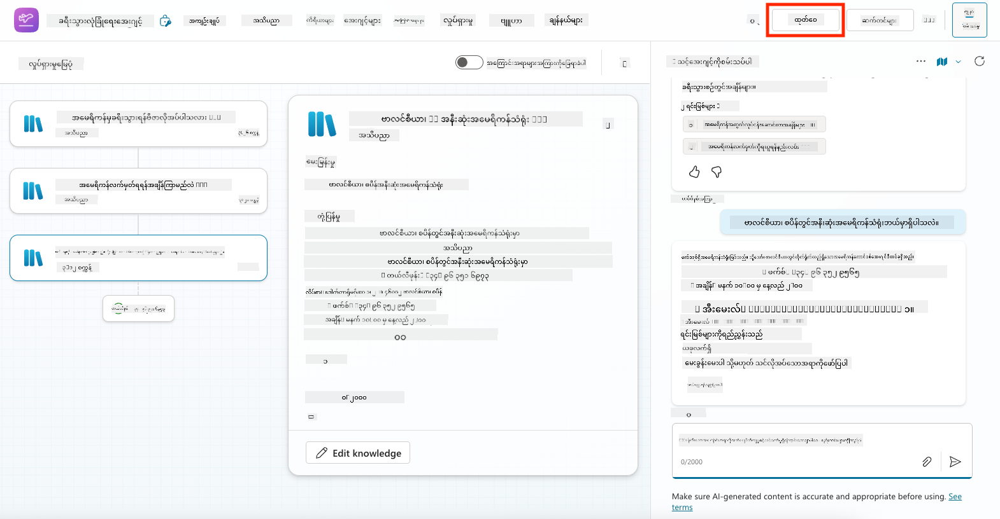
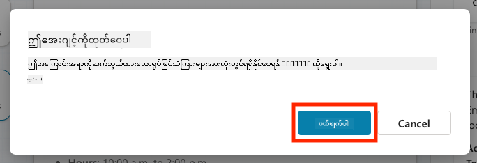

<!--
CO_OP_TRANSLATOR_METADATA:
{
  "original_hash": "8e2c64a7f9303e58329ec8bb468c80b4",
  "translation_date": "2025-10-21T18:47:48+00:00",
  "source_file": "docs/recruit/05-using-prebuilt-agents/README.md",
  "language_code": "my"
}
-->
# 🧰 မစ်ရှင် ၀၅: ကြိုတင်တည်ဆောက်ထားသော Agent ကို အသုံးပြုခြင်း  

## 🕵️‍♂️ ကုဒ်နာမည်: `လုံခြုံစွာ ခရီးသွားရေး လုပ်ငန်းစဉ်`

> **⏱️ လုပ်ငန်းစဉ် အချိန်အကွာအဝေး:** `~၃၀ မိနစ်`

🎥 **လမ်းညွှန်မှုကို ကြည့်ရှုပါ**

## 🎯 မစ်ရှင် အကျဉ်းချုပ်

Microsoft မှ ဖန်တီးထားသော **ကြိုတင်တည်ဆောက်ထားသော Agent** များကို သင်လေ့လာမည်ဖြစ်ပြီး၊ အချိန်ကုန်သက်သာစေပြီး deployment ကို မြန်ဆန်စေသော အာရုံစိုက် Agent များဖြစ်သည်။

အခြေခံမှ စတင်တည်ဆောက်ရန်မလိုဘဲ၊ ကြိုတင်တည်ဆောက်ထားသော Agent များ (**Agent Template** ဟုလည်းခေါ်သည်) သည် အသုံးပြုရန် အဆင်သင့်ဖြစ်သော အခွင့်အရေးများကို ပေးပြီး customization နှင့် deployment ကို မိနစ်အနည်းငယ်အတွင်း ပြုလုပ်နိုင်သည်။

ဤမစ်ရှင်တွင် သင်သည် **Safe Travels** Agent ကို deploy ပြုလုပ်မည်ဖြစ်ပြီး၊ သုံးစွဲသူများအတွက် လုပ်ငန်းခရီးစဉ်များကို ပြင်ဆင်ရန်၊ ကုမ္ပဏီမူဝါဒများကို နားလည်ရန်နှင့် အစီအစဉ်များကို လွယ်ကူစွာ ပြုလုပ်ရန် အကူအညီပေးမည်ဖြစ်သည်။

---

## 🧭 ရည်မှန်းချက်များ

ဤမစ်ရှင်အတွက် သင်၏ ရည်မှန်းချက်များမှာ:

1. ကြိုတင်တည်ဆောက်ထားသော Agent များအကြောင်း နားလည်ခြင်းနှင့် အရေးကြီးမှု  
1. **Safe Travels** Agent Template ကို deploy ပြုလုပ်ခြင်း  
1. Agent ၏ အဖြေများနှင့် အကြောင်းအရာများကို customize ပြုလုပ်ခြင်း  
1. Agent ကို စမ်းသပ်ပြီး ထုတ်ဝေခြင်း  

---

## 🧠 ကြိုတင်တည်ဆောက်ထားသော Agent များက ဘာလဲ?

ကြိုတင်တည်ဆောက်ထားသော Agent များသည် Microsoft မှ ဖန်တီးထားသော turnkey AI Agent များဖြစ်ပြီး:

- လုပ်ငန်းလိုအပ်ချက်များ (ခရီးသွားရေး၊ HR၊ IT အထောက်အပံ့) ကို ဖြေရှင်းပေးသည်  
- အပြည့်အစုံဖြစ်သော topics, trigger phrases, လမ်းညွှန်ချက်များနှင့် နမူနာ knowledge များပါဝင်သည်  
- သင်၏ data ဖြင့် ပြင်ဆင်၊ တိုးချဲ့နှင့် အခြေခံနိုင်သည်  

ဤ Agent များသည် အလွယ်တကူ စတင်ရန် သို့မဟုတ် Agent များကို ဘယ်လိုဖွဲ့စည်းရမည်ကို လေ့လာရန် အကောင်းဆုံးဖြစ်သည်။

---

## 🧪 Lab ၀၅: ကြိုတင်တည်ဆောက်ထားသော Agent ကို အလွယ်တကူ စတင်အသုံးပြုခြင်း

ကြိုတင်တည်ဆောက်ထားသော Agent ကို ရွေးချယ်ပြီး customize ပြုလုပ်ပုံကို လေ့လာမည်ဖြစ်သည်။

- [၅.၁ Copilot Studio ကို စတင်ရန်](../../../../../docs/recruit/05-using-prebuilt-agents)
- [၅.၂ Safe Travels Agent Template ကို ရွေးချယ်ရန်](../../../../../docs/recruit/05-using-prebuilt-agents)
- [၅.၃ Agent ကို customize ပြုလုပ်ရန်](../../../../../docs/recruit/05-using-prebuilt-agents)
- [၅.၄ စမ်းသပ်ပြီး ထုတ်ဝေရန်](../../../../../docs/recruit/05-using-prebuilt-agents)

ယခင်နမူနာအတိုင်း သင်၏ IT helpdesk agent ကို ဖန်တီးရန် Copilot Studio ပတ်ဝန်းကျင်တွင် ဖြေရှင်းချက်တစ်ခုကို ဖန်တီးမည်ဖြစ်သည်။

စတင်လိုက်ပါ!

### ၅.၁ Copilot Studio ကို စတင်ရန်

1. [https://copilotstudio.microsoft.com](https://copilotstudio.microsoft.com) သို့ သွားပါ  

1. Microsoft 365 work သို့မဟုတ် school account ဖြင့် လက်မှတ်ထိုးပါ  

!!! warning
    သင်သည် Copilot Studio ကို enabled လုပ်ထားသော tenant တွင် ရှိရမည်။ Copilot Studio ကို မမြင်ရပါက [Mission 00](../00-course-setup/README.md) သို့ ပြန်သွားပြီး သင်၏ setup ကို ပြီးစီးပါ။

### ၅.၂ Safe Travels Agent Template ကို ရွေးချယ်ရန်

1. Copilot Studio homepage မှ **+ Create** ကို click လုပ်ပါ  
    

1. **Start with an agent template** အပိုင်းသို့ scroll လုပ်ပါ  

1. **Safe Travels** ကို ရှာပြီး ရွေးချယ်ပါ  

    

1. Template တွင် ဖော်ပြချက်၊ လမ်းညွှန်ချက်များနှင့် knowledge များ ပါဝင်ပြီးသားဖြစ်သည်ကို သတိပြုပါ။  

    

1. **Create** ကို click လုပ်ပါ  

    

ဤအဆင့်တွင် Safe Travels configuration အပေါ် အခြေခံပြီး သင်၏ပတ်ဝန်းကျင်တွင် Agent အသစ်တစ်ခု ဖန်တီးမည်ဖြစ်သည်။

### ၅.၃ Agent ကို customize ပြုလုပ်ရန်

Agent ကို ဖန်တီးပြီးနောက် သင်၏အဖွဲ့အစည်းအတွက် ပြင်ဆင်ပါ:

1. **Enabled generative AI** ကို ရွေးချယ်ပြီး template တွင် ပါဝင်သော လမ်းညွှန်ချက်များကို အသုံးပြုနိုင်ရန် generative AI feature ကို ဖွင့်ပါ။  

    

1. Agent ကို Europe ခရီးသွားရေးအကြောင်းကို ဖြေရှင်းနိုင်ရန် knowledge source တစ်ခု ထည့်သွင်းပါ။ ဤအတွက် **knowledge** အပိုင်းသို့ scroll လုပ်ပြီး **Add knowledge** ကို ရွေးချယ်ပါ။  

    

1. **Public websites** ကို ရွေးချယ်ပါ  

    

1. Text input တွင် **<https://european-union.europa.eu/>** ကို paste လုပ်ပြီး **Add** ကို ရွေးချယ်ပါ  

    

1. **Add to agent** ကို ရွေးချယ်ပါ  

    

### ၅.၄ စမ်းသပ်ပြီး ထုတ်ဝေရန်

1. အပေါ်ဘက်-ညာဘက်ရှိ **Test** ကို click လုပ်ပြီး စမ်းသပ် window ကို ဖွင့်ပါ  

1. အောက်ပါစကားများကို စမ်းသပ်ပါ:

    - `“Do I need a visa to travel from the US to Amsterdam?”`
    - `“How long does it take to get a US Passport?”`
    - `“Where is the closest US embassy in Valencia, Spain?”`

1. Agent သည် တိကျပြီး အကျိုးရှိသော အချက်အလက်များဖြင့် ဖြေကြားသည်ကို အတည်ပြုပါ။ Activity Map တွင် အချက်အလက်ကို ရယူထားသောနေရာကို ကြည့်ရှုပါ။  

    

1. ပြင်ဆင်ပြီးပါက **Publish** ကို click လုပ်ပါ  

    

1. Dialog box တွင် **Publish** ကို ထပ်မံ ရွေးချယ်ပါ  
    

1. အလိုအလျောက် Microsoft Teams တွင် Agent ကို ထည့်သွင်းရန် built-in **Channels** feature ကို အသုံးပြုပါ။

!!! note "🧳 အပို ရည်မှန်းချက်"
    Safe Travels Agent ကို SharePoint site သို့မဟုတ် FAQ ဖိုင်ဖြင့် အခြေခံပြီး သင်၏ကုမ္ပဏီ၏ ခရီးသွားမူဝါဒများနှင့် ပိုမိုသက်ဆိုင်အောင် ပြုလုပ်ကြည့်ပါ။

## ✅ မစ်ရှင် ပြီးစီး

သင်သည် ယခုအခါ:

- Microsoft ကြိုတင်တည်ဆောက်ထားသော Agent ကို deploy ပြုလုပ်ပြီး  
- Agent ကို customize ပြုလုပ်ပြီး  
- **Safe Travels** Agent Template ၏ သင်၏ version ကို စမ်းသပ်ပြီး ထုတ်ဝေခဲ့ပါပြီ  

⏭️ [**အခြေခံမှ စတင်တည်ဆောက် Agent ဖန်တီးခြင်း** သင်ခန်းစာသို့ ရွှေ့ပါ](../06-create-agent-from-conversation/README.md)။

<!-- markdownlint-disable-next-line MD033 -->

---

**အကြောင်းကြားချက်**:  
ဤစာရွက်စာတမ်းကို AI ဘာသာပြန်ဝန်ဆောင်မှု [Co-op Translator](https://github.com/Azure/co-op-translator) ကို အသုံးပြု၍ ဘာသာပြန်ထားပါသည်။ ကျွန်ုပ်တို့သည် တိကျမှုအတွက် ကြိုးစားနေသော်လည်း အလိုအလျောက် ဘာသာပြန်ခြင်းတွင် အမှားများ သို့မဟုတ် မမှန်ကန်မှုများ ပါဝင်နိုင်သည်ကို သတိပြုပါ။ မူရင်းဘာသာစကားဖြင့် ရေးသားထားသော စာရွက်စာတမ်းကို အာဏာတရားရှိသော အရင်းအမြစ်အဖြစ် သတ်မှတ်သင့်ပါသည်။ အရေးကြီးသော အချက်အလက်များအတွက် လူက ဘာသာပြန်ခြင်းကို အကြံပြုပါသည်။ ဤဘာသာပြန်ကို အသုံးပြုခြင်းမှ ဖြစ်ပေါ်လာသော အလွဲအမှားများ သို့မဟုတ် အနားလွဲမှုများအတွက် ကျွန်ုပ်တို့သည် တာဝန်မယူပါ။