<!--
CO_OP_TRANSLATOR_METADATA:
{
  "original_hash": "c04b3587170139bc23e3b5cfc24c89ac",
  "translation_date": "2025-10-21T19:02:19+00:00",
  "source_file": "docs/recruit/07-add-new-topic-with-trigger/README.md",
  "language_code": "my"
}
-->
# 🚨 မစ်ရှင် 07: Trigger နှင့် Nodes အသစ်များဖြင့် Topic တစ်ခုထည့်သွင်းပါ

## 🕵️‍♂️ ကုဒ်နာမည်: `OPERATION STAY ON TOPIC`

> **⏱️ လုပ်ဆောင်ရန်အချိန်:** `~60 မိနစ်`

🎥 **လမ်းညွှန်မှုကို ကြည့်ပါ**

[](https://www.youtube.com/watch?v=7iPAZaA8nJs "YouTube တွင် လမ်းညွှန်မှုကို ကြည့်ပါ")

## 🎯  မစ်ရှင်အကျဉ်းချုပ်

သင်သည် agent တစ်ခုကို တည်ဆောက်ပြီးဖြစ်သည်။ အဲဒီ agent သည် နားထောင်သည်၊ သင်ယူသည်၊ မေးခွန်းများကို ဖြေဆိုသည် - ဒါပေမယ့် အခုတော့ ပိုမိုတိကျသောလုပ်ဆောင်မှုများကို လုပ်ဆောင်ရန်အချိန်ရောက်ပါပြီ။ ဒီမစ်ရှင်တွင် သင်၏ agent ကို တိကျစွာ prompt များကို ဖြေဆိုနိုင်ရန် အတွင်းပိုင်းကို အနက်ရှိုင်းဆုံး သင်ကြားပေးပါမည်။

Topics နှင့် Triggers များဖြင့် သင်၏ agent သည်:

- ရည်ရွယ်ချက်ကို သိရှိနိုင်သည်

- Logic ဖြင့် စကားပြောဆိုမှုများကို စီမံနိုင်သည်

- Variable များကို စုဆောင်းပြီး သိမ်းဆည်းနိုင်သည်

- Flows များကို Trigger လုပ်ပြီး လုပ်ဆောင်မှုများကို ပြုလုပ်နိုင်သည်

သင်သည် စကားပြောဆိုမှုကိုသာ တည်ဆောက်နေခြင်းမဟုတ်ပါ။ သင်သည် ၎င်း၏ ဆုံးဖြတ်ချက်ချမှုစနစ်ကို တည်ဆောက်နေပါသည်။ Neural Nexus သို့ ကြိုဆိုပါသည်။

## 🔎 ရည်မှန်းချက်များ

ဒီမစ်ရှင်တွင် သင်သည် အောက်ပါအရာများကို သင်ယူပါမည်-

1. Topics ဆိုတာဘာလဲ၊ သင်၏ agent အတွက် စနစ်တကျ စကားပြောဆိုမှုများ ဖန်တီးရာတွင် ၎င်း၏ အခန်းကဏ္ဍ
1. Topics ၏ ဖွဲ့စည်းမှု anatomy ကို trigger phrases နှင့် conversation nodes အပါအဝင် သင်ယူခြင်း
1. Conversation nodes အမျိုးမျိုးကို လေ့လာခြင်းနှင့် dynamic logic အတွက် Power Fx ကို အသုံးပြုနည်း
1. အသုံးပြုသူ၏ တောင်းဆိုမှုများနှင့် တာဝန်များကို ကိုင်တွယ်ရန် custom topics များကို အစမှ ဖန်တီးခြင်း
1. SharePoint data နှင့် ချိတ်ဆက်ထားသော functional topic တစ်ခုကို တည်ဆောက်ခြင်း

## 🤔 Topic ဆိုတာဘာလဲ?

Topic ဆိုသည်မှာ သင်၏ agent သည် အသုံးပြုသူ၏ တိကျသော မေးခွန်းများ သို့မဟုတ် တောင်းဆိုမှုများကို ဖြေဆိုနိုင်ရန် ကူညီပေးသော စနစ်တကျ စကားပြောဆိုမှုတစ်ခုဖြစ်သည်။ Topic တစ်ခုကို သင်၏ agent အနေဖြင့် တစ်ခုတည်းသော မေးခွန်း သို့မဟုတ် တောင်းဆိုမှုကို ဖြေဆိုနိုင်ရန် ရည်ရွယ်ဖန်တီးထားသည်။

### 🌌 Topic ၏ ရည်ရွယ်ချက်

Topic များ၏ ရည်ရွယ်ချက်များမှာ အသုံးပြုသူများ၏ လိုအပ်ချက်များအပေါ် မူတည်၍ အောက်ပါအတိုင်း သုံးမျိုးရှိသည်-

**အချက်အလက်ပေးခြင်း** - အောက်ပါအတိုင်း မေးခွန်းများကို ဖြေဆိုသည်-

- `ဘာလဲ …?`
- `ဘယ်အချိန်မှာ …?`
- `ဘာကြောင့် …?`
- `သင်ပြောပြနိုင်မလား …?`

**တာဝန်ကို ပြီးမြောက်စေခြင်း** - အသုံးပြုသူများကို တစ်ခုခုလုပ်ဆောင်ရန် ကူညီသည်-

- `"ငါ … လိုချင်တယ်"`
- `"ဘယ်လိုလုပ်ရမလဲ …?"`
- `"ငါ … လိုအပ်တယ်?"`

**ပြဿနာဖြေရှင်းခြင်း** - ပြဿနာများကို ဖြေရှင်းသည်-

- `တစ်ခုခု အလုပ်မလုပ်ဘူး …`
- `Error message တစ်ခုကို တွေ့နေတယ် …`
- `မမျှော်လင့်ထားတဲ့ အရာတစ်ခုကို တွေ့နေတယ် …?`

သင်သည် `ငါ့ကို ကူညီပါ` ကဲ့သို့သော မရေရာသော မေးခွန်းများအတွက်လည်း Topic များကို ဖန်တီးနိုင်ပြီး အသုံးပြုသူများကို ဆက်လက်လုပ်ဆောင်ရန် မေးမြန်းနိုင်သည်။

## 🐦 Topic များက ဘာကြောင့် အသုံးဝင်သလဲ?

Topic များက သင်ကို ကူညီပေးသည်-

- သင်၏ agent ၏ အသိပညာကို စနစ်တကျ စီမံနိုင်သည်။

- စကားပြောဆိုမှုများကို သဘာဝကျစေသည်။

- အသုံးပြုသူ၏ ပြဿနာများကို ထိရောက်စွာ ဖြေရှင်းနိုင်သည်။

## 🪺 Topic များ၏ အမျိုးအစား

1. **System topics** - ၎င်းတို့သည် built-in ဖြစ်ပြီး အောက်ပါအဖြစ်အပျက်များကို ကိုင်တွယ်သည်-
    - စကားပြောဆိုမှုကို စတင်ခြင်း
    - စကားပြောဆိုမှုကို အဆုံးသတ်ခြင်း
    - Error များကို ကိုင်တွယ်ခြင်း
    - အသုံးပြုသူများကို sign in လုပ်ရန် မေးမြန်းခြင်း
    - လူ့ agent သို့ Escalate လုပ်ခြင်း

1. **Custom topics** - သင်သည် အောက်ပါအတိုင်း တိကျသော တာဝန်များ သို့မဟုတ် မေးခွန်းများကို ကိုင်တွယ်ရန် ဖန်တီးသည်-
    - ဝန်ထမ်း ခွင့်တောင်းဆိုမှု
    - စက်ပစ္စည်းအသစ် သို့မဟုတ် အစားထိုးတောင်းဆိုမှု

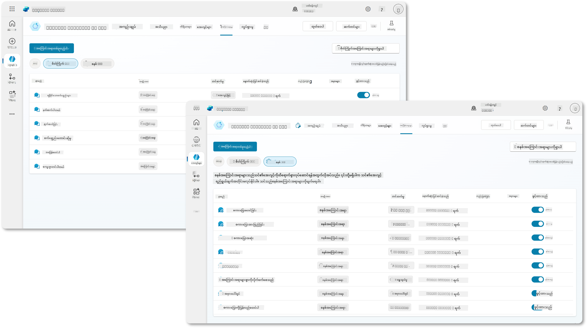

## 🧬 Topic ၏ ဖွဲ့စည်းမှု

Topic တစ်ခုတွင် အောက်ပါအရာများ ပါဝင်လေ့ရှိသည်။

### 🗣️ Trigger phrases

၎င်းသည် Topic ကို စတင်ရန် အသုံးပြုသူများ ပြောနိုင်သော စကားလုံးများ သို့မဟုတ် စာကြောင်းများဖြစ်သည်။

**ဥပမာများ:**

Leave request topic အတွက် Trigger phrases များမှာ

- `ငါ ခွင့်ယူချင်တယ်`
- `ခွင့်တောင်းဆိုပါ`
- `အချိန်ပိတ်ခွင့်အတွက် လျှောက်ထားပါ`
- `ခွင့်တောင်းဆိုမှုကို ဘယ်လို လုပ်ရမလဲ?`

Request device topic အတွက် Trigger phrases များမှာ

- `ငါ့ကို စက်ပစ္စည်းအသစ် လိုအပ်တယ်`
- `စက်ပစ္စည်းတစ်ခုကို တောင်းဆိုနိုင်မလား?`
- `စက်ပစ္စည်းတောင်းဆိုမှုအတွက် ကူညီပေးနိုင်မလား`

### 💬 Conversation nodes

Topic တစ်ခုသည် Nodes များဖြင့် ဖွဲ့စည်းထားပြီး Topic ကို Trigger လုပ်ပြီးနောက် agent လိုက်နာရမည့် အဆင့်များဖြစ်သည်။ ၎င်းအဆင့်များကို ချိတ်ဆက်ပြီး agent သည် အသုံးပြုသူများနှင့် အပြန်အလှန် ဆက်သွယ်မှုများကို လိုက်နာရမည့် စကားပြောဆိုမှု flow တစ်ခုကို တည်ဆောက်သည်။

ဤအဆင့်များကို အောက်ပါအတိုင်း လုပ်ဆောင်မှုများ သို့မဟုတ် လမ်းညွှန်ချက်များအဖြစ် တွေးပါ-

- အသုံးပြုသူကို မေးခွန်းမေးခြင်း
- Message များ ပေးပို့ခြင်း
- Leave management system ကဲ့သို့သော အပြင်ဘက်ဝန်ဆောင်မှုကို ခေါ်ယူခြင်း
- Variable များကို သတ်မှတ်ခြင်း သို့မဟုတ် စစ်ဆေးခြင်း
- စကားပြောဆိုမှုကို branch လုပ်ရန် အခြေအနေများကို အသုံးပြုခြင်း
- အခြား Topic သို့ ဦးတည်ခြင်း

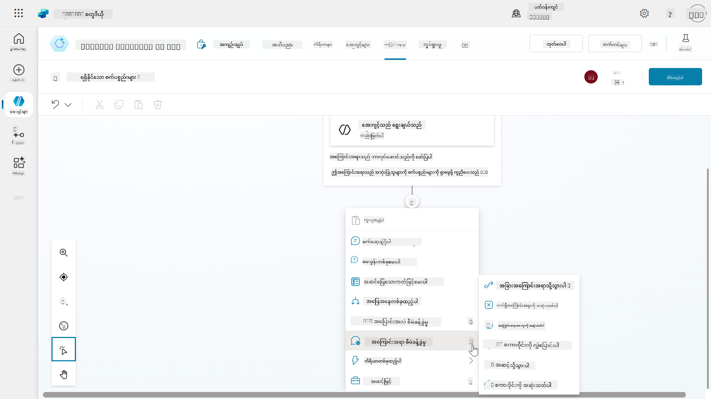

Agent တွင် ထည့်သွင်းနိုင်သော Nodes အမျိုးအစားများမှာ အောက်ပါအတိုင်းဖြစ်သည်-

#### Message ပေးပို့ခြင်း

- **ရည်ရွယ်ချက်** - အသုံးပြုသူထံ Message ပေးပို့သည်။
- **ဥပမာ** - `သင့်တောင်းဆိုမှုအတွက် ကျေးဇူးတင်ပါတယ်! ငါ့အနေနဲ့ အဲဒါကို ကူညီပေးပါမယ်။`

ဒီ Node သည် agent ကို အသုံးပြုသူများထံ Message ပေးပို့စေပြီး Text သာမက Image, Video, Card, Quick Replies, Adaptive Cards ကဲ့သို့သော rich content များကိုလည်း ပေးပို့နိုင်သည်။

Variables များကို အသုံးပြု၍ Message များကို ကိုယ်ပိုင်ပြုလုပ်နိုင်ပြီး Message များကို အမျိုးမျိုးပြောင်းလဲနိုင်သည်။ Voice-enabled channels များအတွက် Speech output ကိုလည်း customize လုပ်နိုင်သည်။

!!! tip
    ၎င်းကို "တစ်ခုခု ပြောပါ" block အဖြစ် တွေးပါ။ ၎င်းသည် agent ကို အသုံးပြုသူများနှင့် ရှင်းလင်းပြီး အပြန်အလှန် ဆက်သွယ်မှုများ ပြုလုပ်နိုင်စေသည်။

#### မေးခွန်းမေးခြင်း

- **ရည်ရွယ်ချက်** - အသုံးပြုသူကို မေးခွန်းမေးပြီး ၎င်း၏ အဖြေကို စောင့်ဆိုင်းသည်။
- **ဥပမာ** - `သင့်ရဲ့ အချိန်ပိတ်ခွင့်ရက်များ ဘာလဲ?`

ဒီ Node သည် စကားပြောဆိုမှုအတွင်း အသုံးပြုသူများထံမှ တိကျသော အချက်အလက်များကို မေးမြန်းပြီး ၎င်း၏ အဖြေကို Variable များတွင် သိမ်းဆည်းရန် အသုံးပြုသည်။

Text input အမျိုးအစားကို customize လုပ်နိုင်သလို အသုံးပြုသူများ ရွေးချယ်နိုင်သော အတိအကျသော တန်ဖိုးများအတွက် Entities ကိုလည်း အသုံးပြုနိုင်သည်။ အသုံးပြုသူက မမှန်ကန်သော အဖြေကို ပေးသည် သို့မဟုတ် မေးခွန်းကို ကျော်သွားပါက agent ၏ အပြုအမူကို သတ်မှတ်နိုင်သည်။

Rich content များကိုလည်း ပံ့ပိုးပြီး Validation, Reprompting, Interruption settings များကို Fine-tune လုပ်နိုင်သည်။

!!! tip
    ၎င်းကို "မေးပြီး နားထောင်ပါ" block အဖြစ် တွေးပါ။ ၎င်းသည် agent ကို သင်သတ်မှတ်ထားသော စနစ်တကျ နည်းလမ်းဖြင့် အသုံးပြုသူများနှင့် အပြန်အလှန် ဆက်သွယ်မှုများ ပြုလုပ်နိုင်စေသည်။

#### Adaptive card ဖြင့် မေးခြင်း

- **ရည်ရွယ်ချက်** - JSON ကို အသုံးပြု၍ Rich, Interactive card တစ်ခုကို ပေးပို့သည်။
- **ဥပမာ** - အသုံးပြုသူသည် ရက်စွဲကို ရွေးချယ်ရန် Calendar date picker ကို ပြသသော Card တစ်ခု။

ဒီ Node သည် Rich, Interactive cards များကို ပြသပြီး အသုံးပြုသူများက ၎င်းကို ဖြည့်စွက်ပြီး Submit လုပ်နိုင်သည်။ Text boxes, Buttons, Images ပါဝင်သော Form များကို ဖန်တီးနိုင်ပြီး အသုံးပြုသူ၏ input ကို Variable များတွင် သိမ်းဆည်းသည်။ Conversation အတွင်း agent သည် ၎င်းကို အသုံးပြုနိုင်သည်။

!!! tip
    ၎င်းကို "Form builder ကို customize လုပ်ပါ" block အဖြစ် တွေးပါ။ ၎င်းသည် agent ကို အသုံးပြုသူများထံမှ အသေးစိတ်အချက်အလက်များကို စုဆောင်းနိုင်စေပြီး ပိုမိုစိတ်ဝင်စားဖွယ်ရှိစေသည်။

#### Condition ထည့်သွင်းခြင်း

- **ရည်ရွယ်ချက်** - စကားပြောဆိုမှုတွင် Logic ကို ထည့်သွင်းသည်။ တစ်ခုခုကို စစ်ဆေးပြီး နောက်တစ်ဆင့်တွင် ဘာလုပ်မည်ကို ဆုံးဖြတ်သည်။
- **ဥပမာ** - အသုံးပြုသူက `Yes` ပြောပါက နောက်တစ်ဆင့်သို့ သွားပါ။ `No` ဆိုပါက စကားပြောဆိုမှုကို အဆုံးသတ်ပါ။

ဒီ Node သည် agent ၏ စကားပြောဆိုမှု flow တွင် Decision points များကို ဖန်တီးပြီး Variable တစ်ခုသည် သတ်မှတ်ချက်တစ်ခုနှင့် ကိုက်ညီမညီကို စစ်ဆေးသည်။ Condition သည် true သို့မဟုတ် false ဖြစ်သည်အပေါ် မူတည်၍ agent သည် path များကို ကွဲပြားစွာ လိုက်နာသည်။

!!! tip
    ၎င်းကို "if-else" block အဖြစ် တွေးပါ။ ၎င်းသည် agent ကို အသုံးပြုသူ၏ input သို့မဟုတ် Variable များတွင် သိမ်းဆည်းထားသော data အပေါ် မူတည်၍ ဆုံးဖြတ်ချက်ချနိုင်စေသည်။

#### Variable စီမံခန့်ခွဲမှု

- **ရည်ရွယ်ချက်** - စကားပြောဆိုမှုအတွင်း Variable များကို သိမ်းဆည်း သို့မဟုတ် ရှင်းလင်းသည်။
- **ဥပမာ** - Adaptive card ကို ပြသသော Ask a question node တွင် အသုံးပြုသူရွေးချယ်ထားသော ရက်စွဲကို သိမ်းဆည်းသည်။

ဒီ Node သည် စကားပြောဆိုမှုအတွင်း Variable များကို သိမ်းဆည်းပြီး စီမံခန့်ခွဲသည်။ ၎င်းသည် အသုံးပြုသူ၏ အမည်၊ အဖြေ သို့မဟုတ် အကြိုက်များဖြစ်နိုင်သည်။ Text, Numbers, Dates ကဲ့သို့သော Variable အမျိုးအစားများကို အသုံးပြုနိုင်ပြီး Topic တစ်ခုအတွင်းသာ သုံးနိုင်သော scope, Topic များအနှံ့ shared ဖြစ်သော scope (global) သို့မဟုတ် System သို့မဟုတ် Environment မှ ရယူနိုင်သည်။

!!! tip
    ၎င်းကို "မှတ်ဉာဏ်သေတ္တာ" block အဖြစ် တွေးပါ။ ၎င်းသည် agent ကို အချက်အလက်များကို မှတ်မိစေပြီး အသုံးပြုသူနှင့် ဆက်လက်စကားပြောဆိုမှုအတွင်း ၎င်းတို့ကို အသုံးပြုနိုင်စေသည်။

#### Topic စီမံခန့်ခွဲမှု

- **ရည်ရွယ်ချက်** - စကားပြောဆိုမှုကို အခြား Topic သို့ သို့မဟုတ် Topic အတွင်း အဆင့်သို့ ရွှေ့သည်၊ စကားပြောဆိုမှုကို လွှဲပြောင်းသည် သို့မဟုတ် အဆုံးသတ်သည်။
- **ဥပမာ** - "Leave Policy" Topic သို့ redirect လုပ်ပါ။

ဒီ Node သည် agent ကို စကားပြောဆိုမှုကို ပြန်စမနေဘဲ တစ်ခုသော Topic မှ အခြား Topic သို့ ရွှေ့နိုင်စေသည်၊ Topic ကို အဆုံးသတ်နိုင်သည်၊ စကားပြောဆိုမှုကို လွှဲပြောင်း သို့မဟုတ် အဆုံးသတ်နိုင်သည်၊ သို့မဟုတ် အတူတူ Topic အတွင်း အခြားအဆင့်သို့ သွားနိုင်သည်။ ၎င်းသည် စကားပြောဆိုမှု flow ၏ အခြားအပိုင်းများသို့ အသုံးပြုသူများကို လွယ်ကူစွာ ရွှေ့နိုင်စေပြီး Variable များကို ၎င်းတို့အကြား ပေးပို့နိုင်သည်။

!!! tip
    ၎င်းကို "အခြားအပိုင်း/အဆင့်သို့ သွားပါ" block အဖြစ် တွေးပါ။ ၎င်းသည် agent ကို အသုံးပြုသူများနှင့် စကားပြောဆိုမှုတွင် Flexible ဖြစ်စေသည်။

#### Tool ထည့်သွင်းခြင်း

- **ရည်ရွယ်ချက်** - Connectors, Agent flows, Prompts, Custom search, Search query, Skills, Model context protocol ကဲ့သို့သော Tools များနှင့် ချိတ်ဆက်သည်။
- **ဥပမာ** - အသုံးပြုသူသည် ၎င်း၏ အချိန်ပိတ်ခွင့်တောင်းဆိုမှုကို Submit လုပ်ပြီးနောက် Agent flow ကို အကောင်အထည်ဖော်သည်။

ဒီ Node သည် agent ကို အပြင်ဘက်စနစ်များနှင့် ဆက်သွယ်ရန် သို့မဟုတ် အထူးလုပ်ဆောင်မှုများကို ပြုလုပ်ရန် အစွမ်းသည့် ပေးသည်။ Email ပေးပို့ခြင်း, ရာသီဥတုစစ်ဆေးခြင်း, Database များကို access လုပ်ခြင်းကဲ့သို့သော လုပ်ဆောင်မှုများကို ပြုလုပ်နိုင်သည်။ Built-in connectors, Custom APIs, Agent flows,
ဤသည် သင့်အတွက် သဘာဝဘာသာစကားကို အသုံးပြု၍ သင်လိုချင်သောအရာကို ဖော်ပြနိုင်ရန် အခွင့်အရေးပေးပြီး Copilot သည် သင့်အတွက် စကားဝိုင်းကို တည်ဆောက်ပေးမည်ဖြစ်သည်။ သင်၏အကြောင်းအရာကို တည်းဖြတ်သောအခါတွင်လည်း သဘာဝဘာသာစကားကို အသုံးပြုပြီး Copilot သင့်အတွက် အကြောင်းအရာကို ပြန်လည်သုံးသပ်ပြီး ပြင်ဆင်ပေးမည်ဖြစ်သည်။

#### Copilot အထောက်အပံ့ပေးနိုင်သောအရာများ

- ဖန်တီးခြင်းနှင့် တည်းဖြတ်ခြင်းကို အောက်ပါအတိုင်းလုပ်ဆောင်နိုင်သည်။
      - သတင်းစကား node များ
      - မေးခွန်း node များ
      - အခြေအနေ node များ
- အသုံးပြုသူသည် မဖြေကြားပါက ပြန်လည်မေးမြန်းရန် သို့မဟုတ် မေးခွန်းအတွင်း အတားအဆီးများကို စီမံခန့်ခွဲရန် advanced settings များကို မထောက်ပံ့ပါ။ သို့သော် အလိုရှိပါက ထို settings များကို လက်ဖြင့် ပြင်ဆင်နိုင်သည်။

#### အဘယ်ကြောင့်ဤသည် အသုံးဝင်သနည်း

- AI အကူအညီဖြင့် ဖွံ့ဖြိုးတိုးတက်မှုကို မြန်ဆန်စေသည်။
- ထပ်တလဲလဲ ပြင်ဆင်မှုများအစား logic နှင့် အသုံးပြုသူအတွေ့အကြုံကို အာရုံစိုက်နိုင်စေသည်။
- အလွယ်တကူ စကားဝိုင်းများကို ပြန်လည်တည်းဖြတ်ပြီး တိုးတက်မှုများကို အနည်းဆုံး အားထုတ်မှုဖြင့် ပြုလုပ်နိုင်စေသည်။

#### ✨ ဥပမာ prompt များ

- **အကြောင်းအရာတစ်ခု ဖန်တီးရန်**
      - `အသုံးပြုသူ၏ နာမည်၊ အသက်နှင့် မွေးနေ့ကို လက်ခံပြီး ထိုသူ၏ ဖြေကြားမှုများကို ပြန်လည်ထုတ်ပြရန်`
      - `အသုံးပြုသူ၏ လမ်းလိပ်စာ၊ ပြည်နယ်နှင့် zip code ကို စုဆောင်းရန်။ အသုံးပြုသူသည် မေးခွန်းတစ်ခုစီကို ၄ ကြိမ်အထိ ပြန်လည်ဖြေကြားနိုင်ရမည်`

- **အကြောင်းအရာတစ်ခုကို တည်းဖြတ်ရန်**
      - `အသုံးပြုသူ၏ မွေးနေ့ကို မေးသော မေးခွန်းတစ်ခု ထည့်ရန်`
      - `စုဆောင်းထားသော အချက်အလက်များကို Adaptive Card အတွင်း အကျဉ်းချုပ်ရန်`

## 👩🏻‍🎨 OK, သင့် agent အတွက် အကြောင်းအရာများကို မည်သို့ ဒီဇိုင်းဆွဲရမည်နည်း?

### 🧙🏻‍♂️ အဆင့် ၁ - အသုံးပြုသူများ၏ လိုအပ်ချက်ကို နားလည်ရန်

သင့် agent ကို အသုံးပြုသူများ မေးမြန်းမည့် မေးခွန်းများ သို့မဟုတ် လုပ်ငန်းတာဝန်များကို စတင်ဖော်ထုတ်ပါ။ ဤအရာများမှာ အောက်ပါအတိုင်းဖြစ်နိုင်သည်-

- အသုံးပြုသူများ မကြာခဏ မေးမြန်းသော မေးခွန်းများ၊ ဥပမာ `ကျွန်ုပ်၏ နာမတရားရက်များအတွက် အခွင့်အရေး ဘယ်လောက်ရှိပါသနည်း?`
- အသုံးပြုသူများ ပြီးစီးလိုသော လုပ်ငန်းတာဝန်များ၊ ဥပမာ form တစ်ခု တင်သွင်းခြင်း
- အသုံးပြုသူများ မကြာခဏ ကြုံတွေ့ရသော ပြဿနာများ၊ ဥပမာ login ပြဿနာများ

### 📦 အဆင့် ၂ - အခြေအနေများကို အုပ်စုဖွဲ့ရန်

အသုံးပြုသူလိုအပ်ချက်များကို အကြောင်းအရာ၏ ရည်ရွယ်ချက်အပေါ် အခြေခံ၍ အုပ်စုဖွဲ့ပါ-

- အချက်အလက်ပေးခြင်း - အသုံးပြုသူသည် အချက်အလက်တစ်ခုကို သိလိုသည်
- လုပ်ငန်းတာဝန် ပြီးစီးခြင်း - အသုံးပြုသူသည် တစ်ခုခုကို ပြုလုပ်လိုသည်
- ပြဿနာဖြေရှင်းခြင်း - အသုံးပြုသူသည် ပြဿနာတစ်ခုကို ဖြေရှင်းရန် အကူအညီလိုအပ်သည်

### 🗺️ အဆင့် ၃ - စကားဝိုင်းကို ရှင်းလင်းစွာ ဖော်ပြရန်

agent သည် မည်သို့ ဖြေကြားရမည်ကို ရှင်းလင်းသော စကားဝိုင်း flow တစ်ခုကို ဆွဲပါ-

- အစမှာ နှုတ်ဆက်ခြင်း သို့မဟုတ် အတည်ပြုခြင်း
- အသေးစိတ်ကို သိရန် follow-up မေးခွန်းများ မေးခြင်း
- အဖြေများပေးခြင်း သို့မဟုတ် လုပ်ဆောင်မှုများ ပြုလုပ်ခြင်း

!!! tip
    စကားဝိုင်းကို တိုတောင်းပြီး အာရုံစိုက်စေပါ။ လိုအပ်သောအရာများကိုသာ မေးပါ။

### 🔀 အဆင့် ၄ - စကားဝိုင်းအမျိုးအစားများကို စီမံရန်

အောက်ပါအမျိုးအစားနှစ်မျိုးအတွက် ဒီဇိုင်းဆွဲပါ-

- **Single-turn** - မေးခွန်းတစ်ခု၊ အဖြေတစ်ခု

- **Multi-turn** - follow-up မေးခွန်းများပါဝင်သော ပြန်လည်ဆွေးနွေးမှု

ဥပမာ-

- အသုံးပြုသူ- `ကျွန်ုပ်သည် အားလပ်ရက်အတွက် လျှောက်ထားလိုပါသည်။`

- Agent- `အိုကေ! သင့်အားလပ်ရက် စတင်မည့်ရက်ကို ပြောပါ။`

- အသုံးပြုသူ- `ဇူလိုင် ၁၅ ရက်`

- Agent- `ရရှိပါပြီ။ သင့်အားလပ်ရက် အဆုံးသတ်မည့်ရက်က ဘယ်ရက်လဲ?`

- အသုံးပြုသူ- `ဇူလိုင် ၂၂ ရက်။`

- Agent- `ကျေးဇူးတင်ပါတယ်! သင့်အားလပ်ရက်ရဲ့ အကြောင်းအရင်းက ဘာလဲ?`

- အသုံးပြုသူ- `မိသားစုအားလပ်ရက်။`

- Agent- `အသေးစိတ်အချက်အလက်များအတွက် ကျေးဇူးတင်ပါတယ်။ ဇူလိုင် ၁၅ ရက်မှ ဇူလိုင် ၂၂ ရက်အထိ မိသားစုအားလပ်ရက်အတွက် သင့်အားလပ်ရက်တောင်းဆိုမှုကို တင်သွင်းပြီးပါပြီ။ သင့်အား အတည်ပြုချက်ကို မကြာမီရရှိပါမည်။`

### 🤖 အဆင့် ၅ - မမျှော်လင့်ထားသော မေးခွန်းများအတွက် AI ကို အသုံးပြုရန်

အားလပ်ရက်တောင်းဆိုမှုများအတွက် အကြောင်းအရာတစ်ခုကို ဒီဇိုင်းဆွဲထားသော်လည်း အသုံးပြုသူများသည် တိုက်ရိုက်မပါဝင်သော မေးခွန်းများကို မေးနိုင်သည်။ ဤနေရာတွင် AI features များဖြစ်သော _Conversational boosting_ system topic သည် အထောက်အကူပြုနိုင်သည်။

ဤအကြောင်းအရာတွင် generative answers node ပါဝင်ပြီး agent သည် ချက်ချင်း knowledge sources များကို အသုံးပြုနိုင်စေသည်။ agent အဆင့်တွင် ထည့်သွင်းထားသော knowledge sources များသည် _Conversational boosting_ system topic အတွင်း generative answers node တွင် အလိုအလျောက် ပါဝင်သည်။

#### ဥပမာ

- အသုံးပြုသူ- `အသုံးမပြုသေးသော အားလပ်ရက်များကို နောက်နှစ်သို့ ဆက်သွားနိုင်ပါသလား?`

ဤမေးခွန်းသည် သင့် predefined topic flow အတွင်း ပါဝင်မည်မဟုတ်ပါ၊ အထူးသဖြင့် သင့်အကြောင်းအရာသည် အားလပ်ရက်တောင်းဆိုမှုများကိုသာ ကိုင်တွယ်ပါက။

#### AI အကူအညီ

သင့် agent သည် သင့်ကုမ္ပဏီ၏ HR policy စာရွက်များ သို့မဟုတ် အတွင်းပိုင်း website နှင့် ချိတ်ဆက်ထားပါက AI သည်-

- သက်ဆိုင်ရာ leave policy ကို ရှာဖွေသည်
- စည်းမျဉ်းများကို နားလည်ပြီး အကျဉ်းချုပ်သည်
- Agent- `HR policy အရ သင့်အား အသုံးမပြုသေးသော အားလပ်ရက်များကို နောက်နှစ်သို့ ဆက်သွားနိုင်ပါသည်။ အသေးစိတ်အချက်အလက်များအတွက် HR portal တွင် leave policy အပိုင်းကို ကြည့်ပါ။`

#### အဘယ်ကြောင့်ဤသည် အသုံးဝင်သနည်း

- policy နှင့်ဆိုင်သော မေးခွန်းတစ်ခုစီအတွက် အကြောင်းအရာတစ်ခုကို လက်ဖြင့် ဖန်တီးရန် မလိုအပ်ပါ။
- AI သည် ယုံကြည်ရသော knowledge sources များမှ တိကျသော အဖြေများကို ရယူနိုင်သည်။
- အသုံးပြုသူအတွေ့အကြုံကို တိုးတက်စေပြီး agent ကို ပိုမို smart ဖြစ်စေသည်။

### 🔬 အဆင့် ၆ - အကြောင်းအရာ၊ စကားဝိုင်း flow ကို စမ်းသပ်ရန်

အကြောင်းအရာကို ထုတ်ဝေမီ-

- အမှန်တကယ် မေးခွန်းများ သို့မဟုတ် အမှန်တကယ် sample inputs များကို အသုံးပြု၍ စမ်းသပ်ပါ။
- သဘာဝကျပြီး အထောက်အကူပြုသောအဖြေများပေးနိုင်ကြောင်း သေချာပါစေ။

!!! tip
    စမ်းသပ်မှုအတွင်း အကြောင်းအရာကို တိုးတက်စေရန် node များ ထည့်သွင်းခြင်း သို့မဟုတ် အခြားအကြောင်းအရာသို့ redirect ပြုလုပ်ခြင်းအစား node များကို ဖယ်ရှားခြင်း စသည်တို့ကို ပြုလုပ်ပါ။

### ⚠️ အဆင့် ၇ - website content ကို မထပ်တူလုပ်ရန်

website တွင် ရှိပြီးသားအရာများကို မကူးယူပါနှင့်။

- အသုံးပြုသူများ မကြာခဏ မေးမြန်းသော အကြောင်းအရာများကို အာရုံစိုက်ပါ။
- chat history သို့မဟုတ် support requests အပေါ် အခြေခံ၍ အကြောင်းအရာအသစ်များ ထည့်သွင်းပါ။

### ✨ စကားဝိုင်း flow ၏ ဥပမာ

အောက်တွင် leave requests ကို ကိုင်တွယ်သော အကြောင်းအရာ၏ ဥပမာကို ဖော်ပြထားသည်။

#### အဆင့် ၁: Trigger phrase

အသုံးပြုသူ- `ကျွန်ုပ်အားလပ်ရက်တောင်းဆိုလိုပါသည်`

#### အဆင့် ၂: Agent သည် Adaptive card ကို အသုံးပြု၍ အသေးစိတ်ကို မေးမြန်းသည်

Agent- `အိုကေ! သင်အားလပ်လိုသော ရက်များကို ပြောပါ။`

Adaptive card တွင် start date နှင့် end date calendar picker control ပါဝင်သည်။

#### အဆင့် ၃: အသုံးပြုသူသည် ရက်များကို ပေးသည်

အသုံးပြုသူသည် start date ကို ၂၀၂၅ ခုနှစ် သြဂုတ်လ ၅ ရက်နှင့် end date ကို သြဂုတ်လ ၁၀ ရက် ရွေးချယ်ပြီး card ကို တင်သွင်းသည်။ Date values များကို adaptive card ၏ output အဖြစ် variables အနေဖြင့် သိမ်းဆည်းထားသည်။

#### အဆင့် ၄: Cloud flow ကို အကောင်အထည်ဖော်သည်

Power Automate cloud flow တစ်ခုကို အကောင်အထည်ဖော်ပြီး leave management system တွင် request အသစ်တစ်ခု ဖန်တီးကာ leave request အကြောင်းကို အကြီးအကဲအား အီးမေးလ်ပို့သည်။

#### အဆင့် ၅: အသုံးပြုသူအား အတည်ပြုချက် message ပေးပို့သည်

Agent- `သင့်အားလပ်ရက်တောင်းဆိုမှုကို သြဂုတ်လ ၅ ရက်မှ သြဂုတ်လ ၁၀ ရက်အထိ တင်သွင်းပြီးပါပြီ။ သင့်အကြီးအကဲသည် ပြန်လည်သုံးသပ်ပြီး မကြာမီ သင့်အား ပြန်လည်ဆက်သွယ်ပါမည်။`

## 🧪 Lab 07 - စကားဝိုင်း node များပါဝင်သော အကြောင်းအရာအသစ်တစ်ခု ထည့်သွင်းရန်

ယခုတွင် trigger နှင့် tools ပါဝင်သော အကြောင်းအရာအသစ်တစ်ခုကို ထည့်သွင်းပုံကို လေ့လာမည်ဖြစ်သည်။ ဤ lab သည် blank မှ အကြောင်းအရာတစ်ခု ဖန်တီးပုံကို လေ့လာရန် အကူအညီပေးပြီး သင့်လိုအပ်ချက်များအတွက် အကြောင်းအရာများကို မည်သို့ customize ပြုလုပ်ရမည်ကို နားလည်စေမည်ဖြစ်သည်။

- [7.1 Blank မှ အကြောင်းအရာအသစ်တစ်ခု ထည့်သွင်းရန်](../../../../../docs/recruit/07-add-new-topic-with-trigger)
- [7.2 Trigger inputs နှင့် outputs ကို သတ်မှတ်ရန်](../../../../../docs/recruit/07-add-new-topic-with-trigger)
- [7.3 Connector ကို အသုံးပြု၍ tool တစ်ခု ထည့်သွင်းရန်](../../../../../docs/recruit/07-add-new-topic-with-trigger)

### ✨ Use case

**As an** employee

**I want to** know what devices are available

**So that I** have a list of available devices

စတင်လိုက်ကြစို့!

### Prerequisites

1. **SharePoint list**

    **Devices** SharePoint list ကို [Lesson 00 - Course Setup - Step 3: Create new SharePoint site](../00-course-setup/README.md#step-4-create-new-sharepoint-site) မှ အသုံးပြုမည်။

    **Devices** SharePoint list ကို မတည်ဆောက်ရသေးပါက [Lesson 00 - Course Setup - Step 3: Create new SharePoint site](../00-course-setup/README.md#step-4-create-new-sharepoint-site) သို့ ပြန်သွားပါ။

1. **Contoso Helpdesk Agent**

    [Lesson 06 - Create a custom agent using natural language with Copilot and grounding it with your data](../06-create-agent-from-conversation/README.md) တွင် ယခင်က ဖန်တီးထားသော agent ကို အသုံးပြုမည်။

### 7.1 Blank မှ အကြောင်းအရာအသစ်တစ်ခု ထည့်သွင်းရန်

1. Agent ၏ နာမည်အနီးတွင် **Topics tab** ကို ရွေးပါ။ မမြင်ရပါက **+6** ကို ရွေးပြီး **Topics** ကို တွေ့ရမည်။

    

1. **Topics** tab သည် load ဖြစ်ပြီး default အနေဖြင့် _Custom_ topics များကို ပြသမည်။ Topics များကို All, Custom နှင့် System အဖြစ် filter ပြုလုပ်နိုင်သည်။ Custom နှင့် System topics များသည် agent ကို provision ပြုလုပ်သောအခါ အလိုအလျောက် ဖန်တီးထားသည်။

    **+ Add a topic** ကို ရွေးပြီး **From blank** ကို ရွေးပါ။

    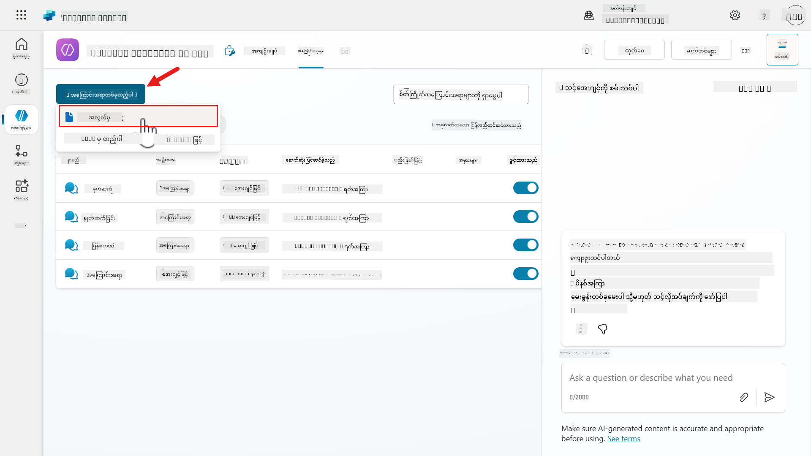

1. အကြောင်းအရာအတွက် နာမည်တစ်ခု ထည့်သွင်းပါ။ အောက်ပါကို Copy နှင့် Paste ပြုလုပ်ပါ။

    ```text
    Available devices
    ```

    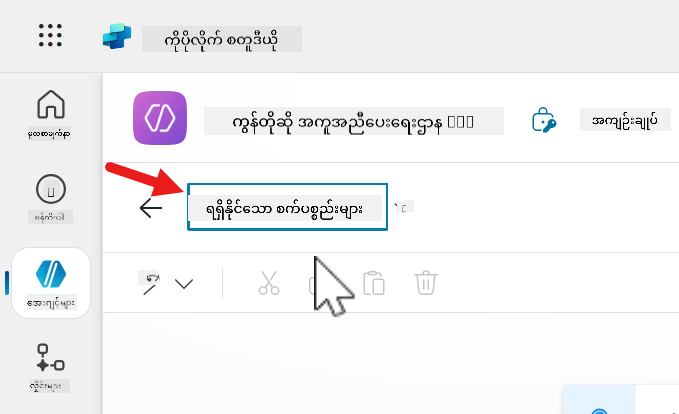

1. အကြောင်းအရာ၏ လုပ်ဆောင်မှုကို ဖော်ပြသော trigger description ကို ထည့်သွင်းပါ။ အောက်ပါကို Copy နှင့် Paste ပြုလုပ်ပါ။

    ```text
    This topic helps users find devices that are available from our SharePoint Devices list. User can ask to see available devices and it will return a list of devices that are available which can include laptops, smartphones, accessories and more.
    ```

    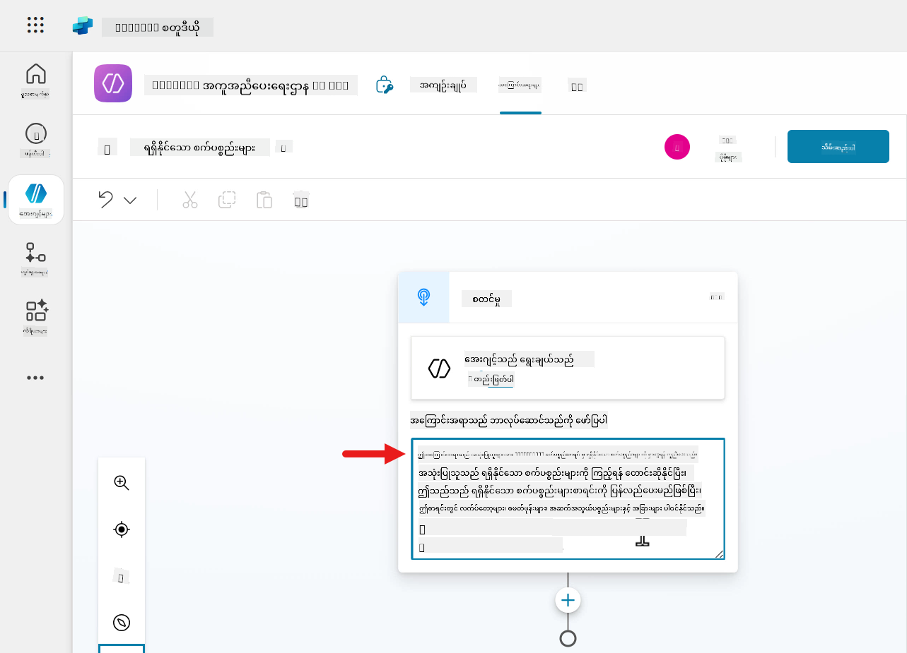

### 7.2 Trigger inputs နှင့် outputs ကို သတ်မှတ်ရန်

1. နောက်တစ်ဆင့်တွင် generative AI သည် အသုံးပြုသူ၏ message မှ device type ၏ တန်ဖိုးကို extract ပြုလုပ်ရန် orchestration တွင် အသုံးပြုမည့် input variable အသစ်တစ်ခုကို ထည့်သွင်းမည်ဖြစ်သည်။ Topic ၏ **More ellipsis (...)** ကို ရွေးပြီး **Details** ကို ရွေးပါ။

    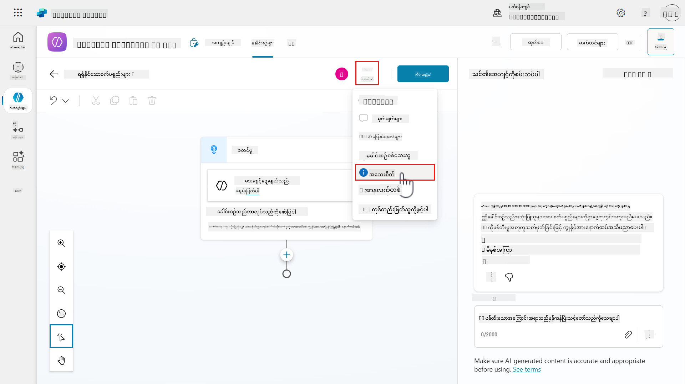

1. **Topic details** pane သည် load ဖြစ်ပြီး **Input** tab ကို ရွေးပါ။

    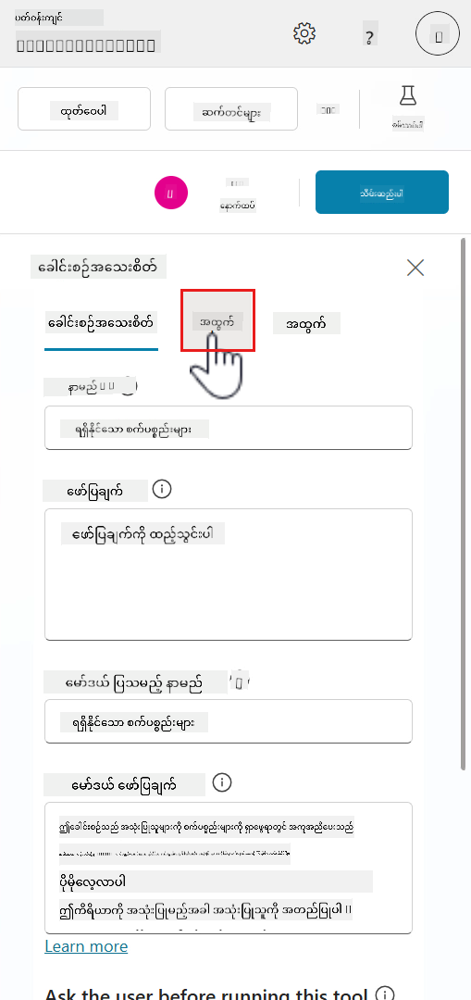

1. **Create a new variable** ကို ရွေးပါ။

    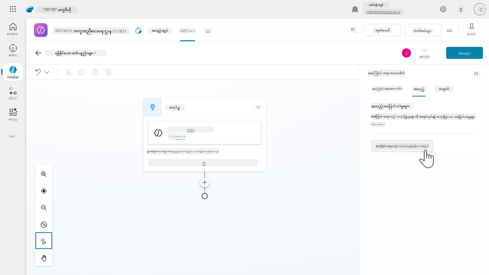

1. Variable အတွက် နာမည်တစ်ခု ထည့်သွင်းပါ။ အောက်ပါကို Copy နှင့် Paste ပြုလုပ်ပါ
**Create** ကို ရွေးပါ။

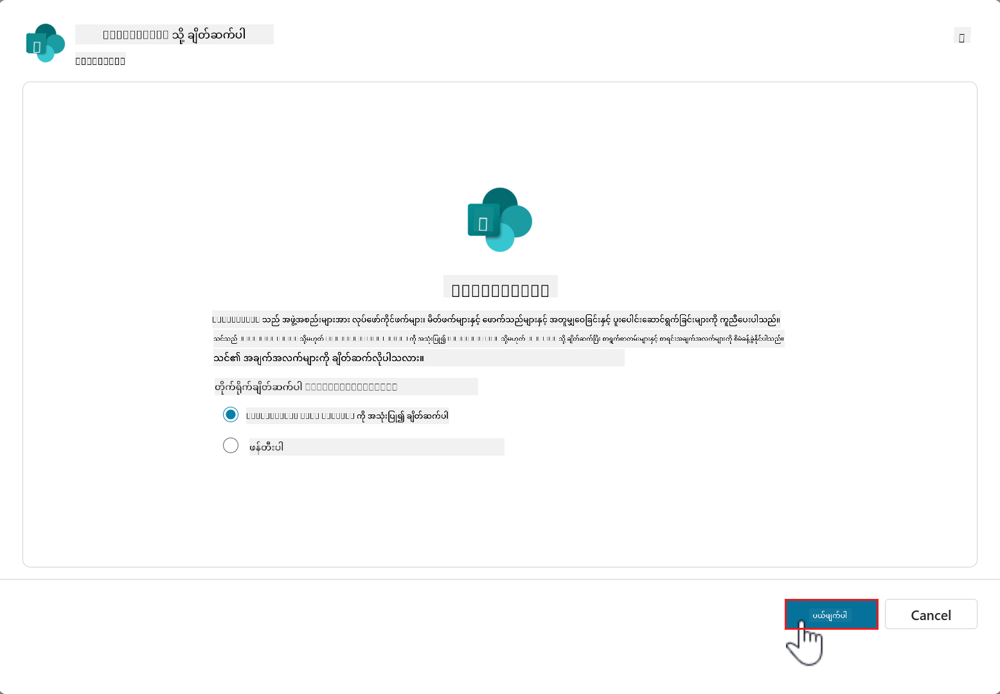

1. သင့်အကောင့်ကို ရွေးပါ။

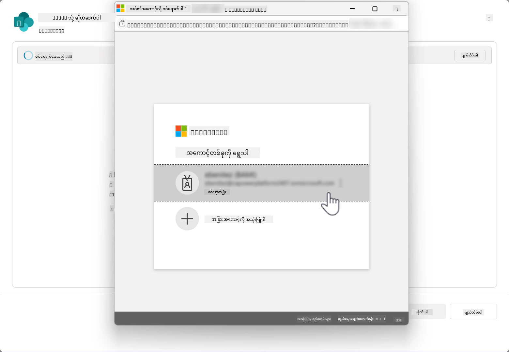

1. SharePoint connector ကို ချိတ်ဆက်ရန် သင့်အကောင့်ကို အသုံးပြုနိုင်မည်ကို အတည်ပြုရန်လိုအပ်သည်။ **Allow access** ကို ရွေးပါ။

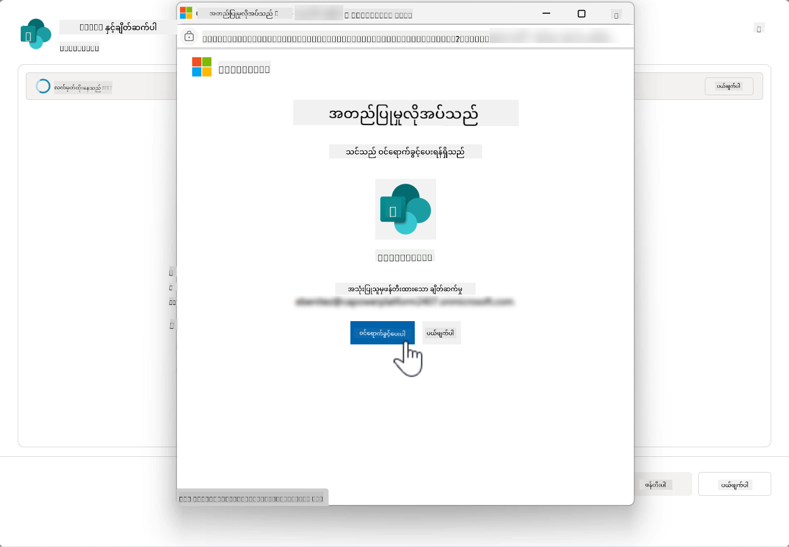

1. **Get items** SharePoint connector action ကို topic တွင် node အဖြစ် ထည့်ရန် **Submit** ကို ရွေးပါ။

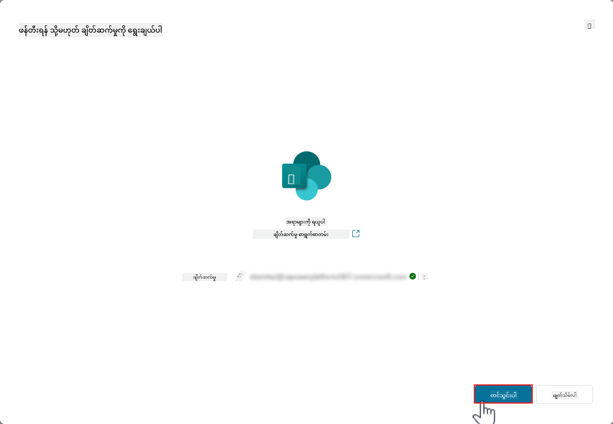

1. **Get items** SharePoint connector action ကို topic တွင် ထည့်ပြီးပါပြီ။ Action ၏ inputs များကို ပြင်ဆင်ရန် စတင်နိုင်ပါပြီ။ **ellipsis (...) icon** ကို ရွေးပြီး **Properties** ကို ရွေးပါ။

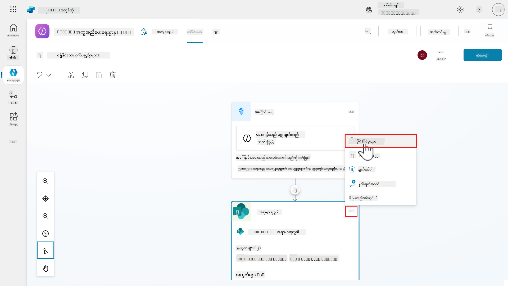

1. **Get items** configuration pane တွင် အလိုအလျောက် **Inputs** tab ကို တွေ့ပါမည်။ **Initiation** tab ကို ရွေးပြီး **Usage Description** field တွင် ဖော်ပြချက်ထည့်ပါ။ အောက်ပါကို ကူးယူပါ။

    ```text
    Retrieves devices from SharePoint list
    ```

> ဤအချက်အလက်သည် _Manage your connections_ စာမျက်နှာကို ကြည့်ရှုသောအခါ အသုံးဝင်ပါမည်။ မကြာမီ ပြန်လည်သွားပါမည်။

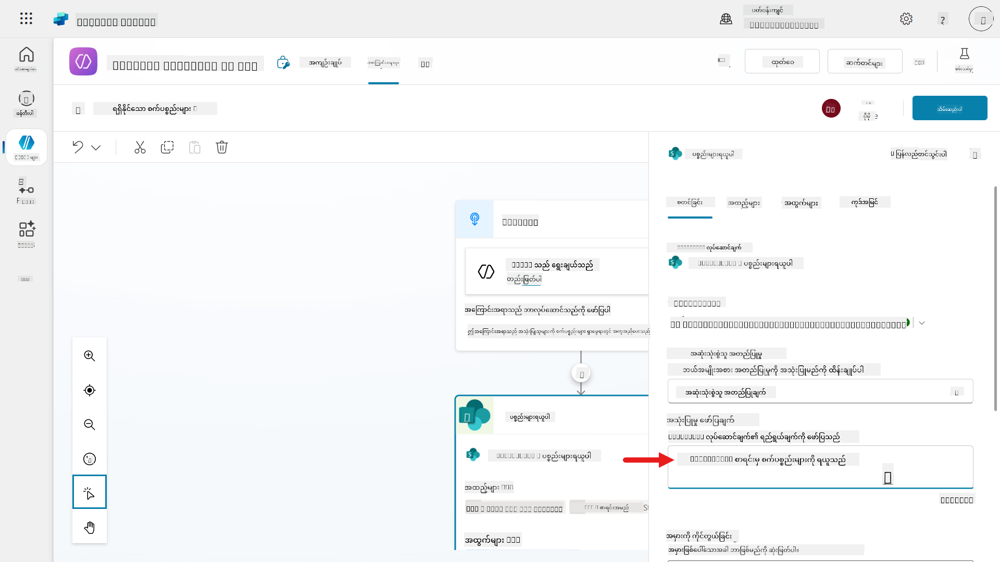

1. **Inputs** tab ကို ရွေးပြီး [Lesson 00 - Course Setup - Step 3: Create new SharePoint site](../00-course-setup/README.md#step-4-create-new-sharepoint-site) တွင် သင့် setup လုပ်ထားသော **Contoso IT** site နှင့် **Devices** list ကို ရွေးပါ။

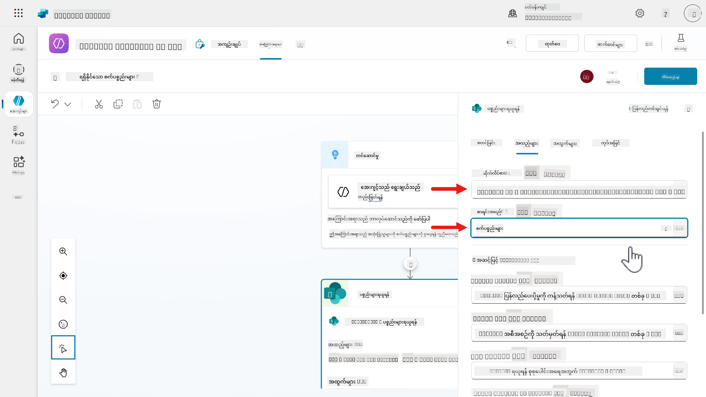

1. SharePoint list မှ devices များကို ရွေးချယ်ထားသော value နှင့်
   - status သည် _Available_ ဖြစ်သော devices များကိုသာ ပြရန် filter ကို အသုံးပြုရန်လိုအပ်သည်။

Power Fx ကို အသုံးပြု၍ filter query ထည့်ရန် **ellipsis (...) icon** ကို ရွေးပါ။

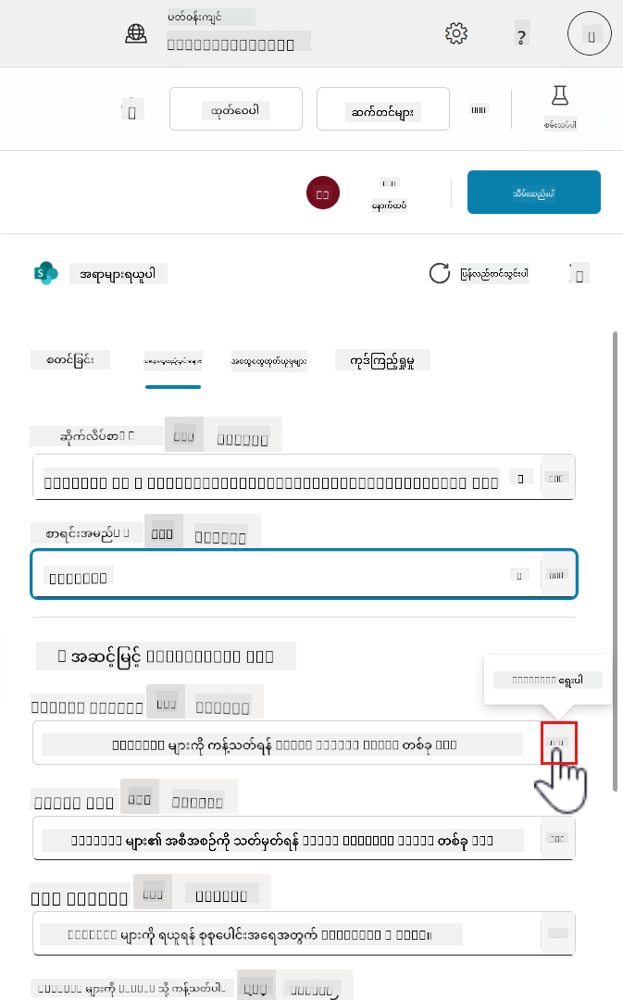

1. အလိုအလျောက် **Custom** tab တွင် ရှိပါမည်။ **Formula** tab ကို ရွေးပါ။

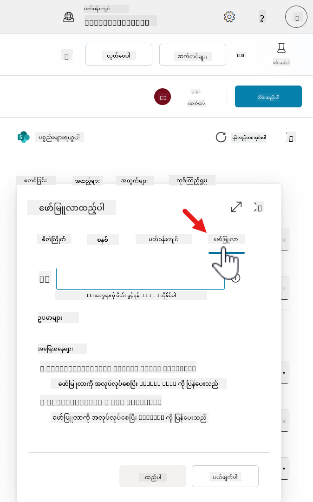

1. **Formula** field ကို ကြီးမားစေရန် **expand** icon ကို ရွေးပါ။ အောက်ပါ Power Fx expression ကို ကူးယူပါ။

`Concatenate` function ကို အသုံးပြု၍ expression တစ်ခုကို ဖန်တီးပါသည်။
   - SharePoint column **Status** သည် _Available_ ဖြစ်သည်။
   - SharePoint column **Asset type** သည် _question node မှ ရွေးချယ်ထားသော device_ ဖြစ်သည်။

    ```text
    Concatenate("Status eq 'Available' and AssetType eq '", Topic.VarDeviceType, "'")
    ```

**Insert** ကို ရွေးပါ။

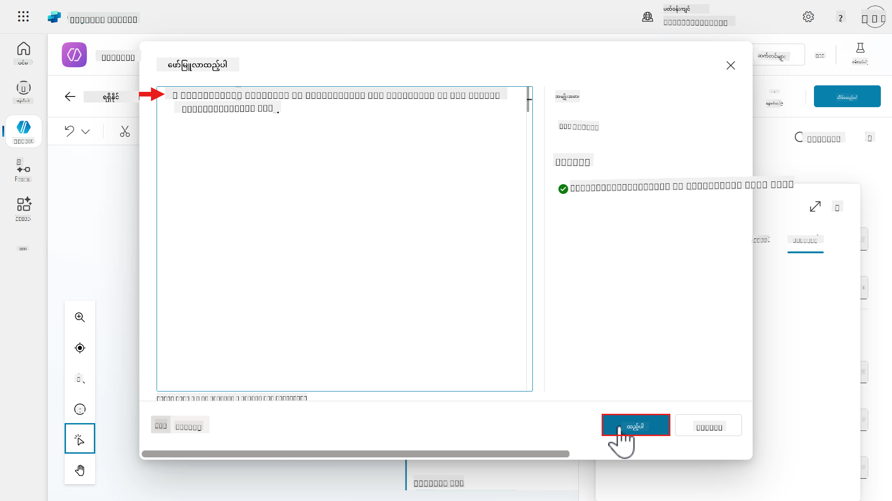

1. Power Fx expression ကို **Get items** action ၏ Filter Query input parameter တွင် အသုံးပြုပါမည်။ **Limit Columns by View** တွင် **All items** view ကို ရွေးပါ။ ဤသည်သည် ရွေးချယ်ထားသော view အပေါ်မူတည်၍ list တွင် columns များကိုသာ retrieve လုပ်ပါမည်။

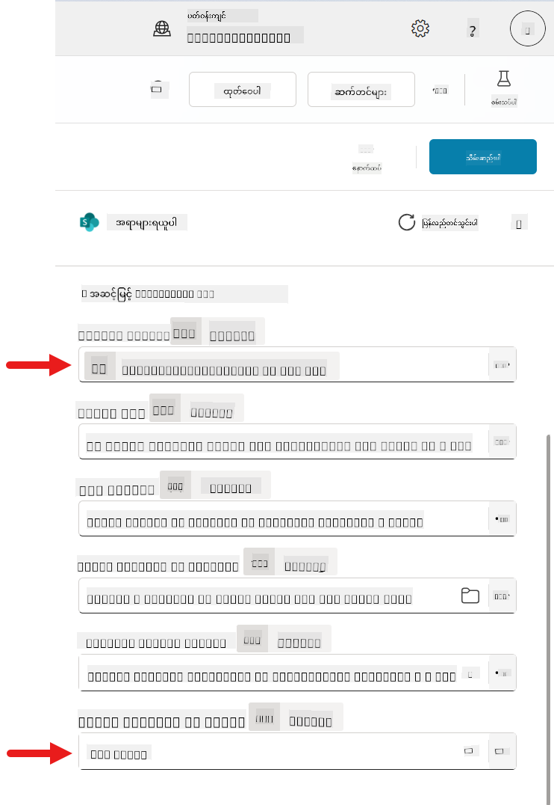

1. Output variable ၏ name ကို update လုပ်ပါ။ **Outputs** tab ကို ရွေးပြီး `GetItems` variable ကို ရွေးပါ။

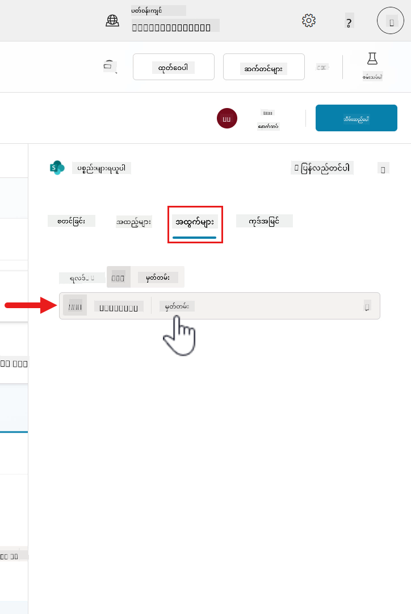

1. အောက်ပါအတိုင်း name ကို update လုပ်ပါ။

    ```text
    VarDevices
    ```

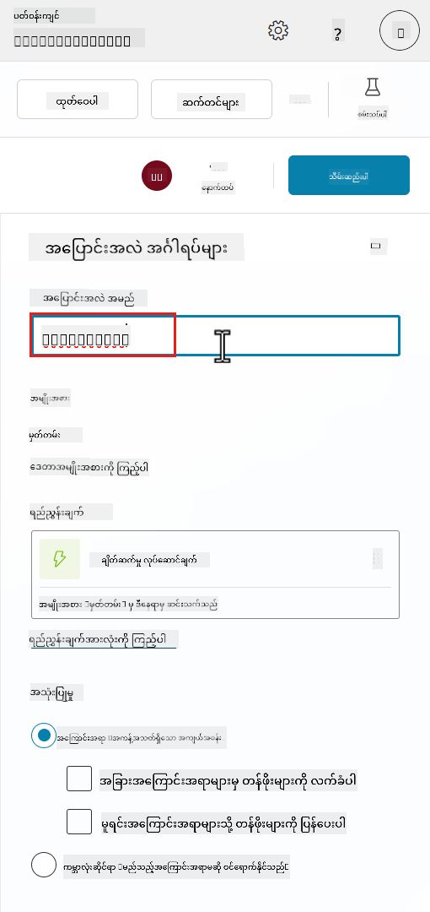

1. **Usage** section တွင် **Global** ကို ရွေးပါ။ ဤ variable ကို topic မည်သည့်အရာမှ access လုပ်နိုင်ပါမည်။

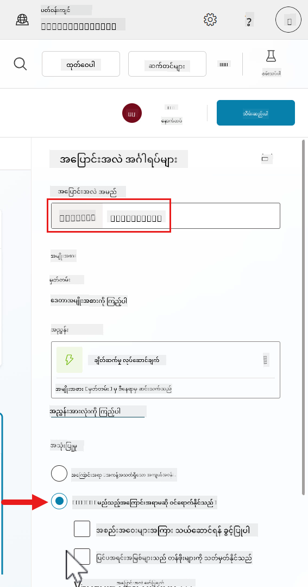

1. **Variable properties** pane ကို **Close** လုပ်ပါ။

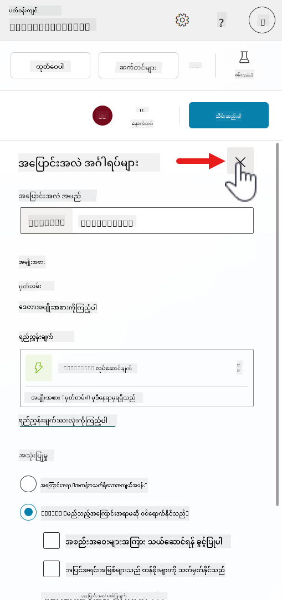

1. **plus +** icon ကို ရွေးပြီး new node တစ်ခုထည့်ပါ၊ **Variable management** ကို ရွေးပြီး **Set a variable value** ကို ရွေးပါ။

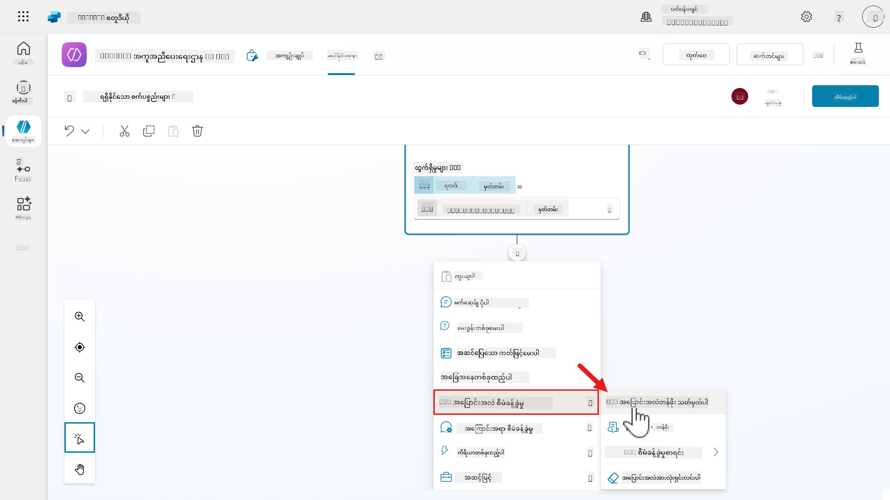

1. **Set variable** input parameter အတွက် **greater than** icon ကို ရွေးပါ။

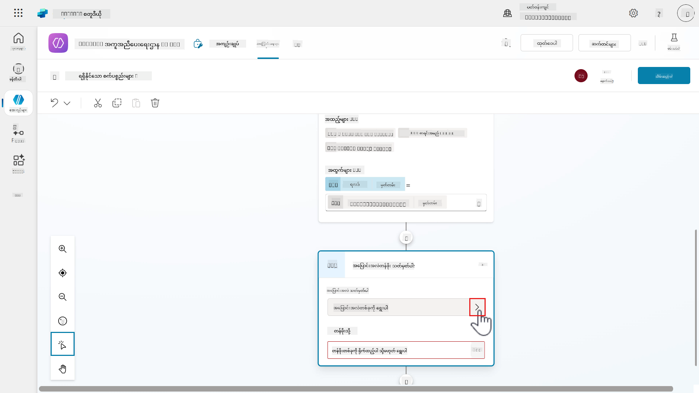

1. အရင်က ဖန်တီးထားသော Topic output ကို variable အဖြစ် ရွေးပါ၊ **VarAvailableDevices**။

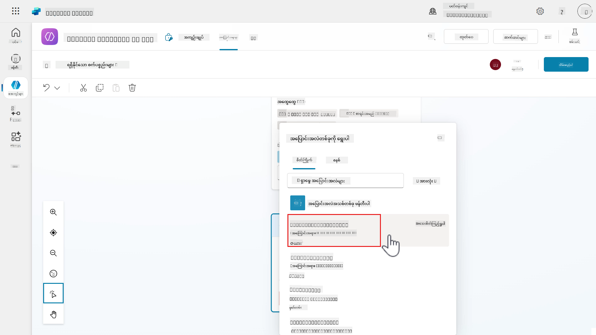

1. Variable ၏ value ကို သတ်မှတ်ရန် **ellipsis (...) icon** ကို ရွေးပါ။

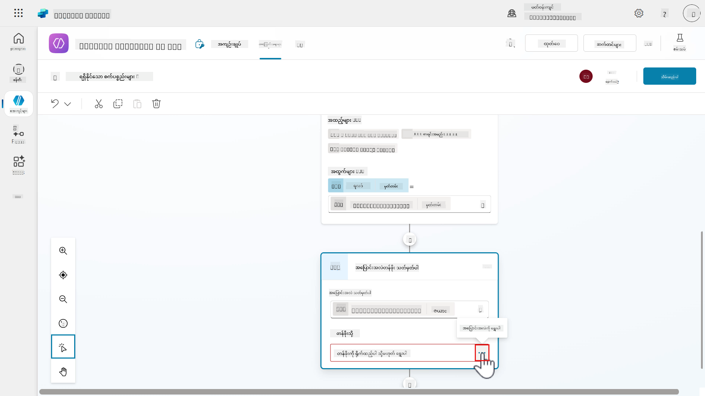

1. PowerFx expression ကို အသုံးပြု၍ variable value ကို **Get items** response ၏ `value` property အဖြစ် သတ်မှတ်ပါ၊ variable ၏ [scope](https://learn.microsoft.com/microsoft-copilot-studio/advanced-power-fx?WT.mc_id=power-172618-ebenitez) ကို global ဖြစ်စေရန် `Global` prefix ကို ထည့်ပါ။

**Insert** ကို ရွေးပြီး **save** topic ကို ရွေးပါ။

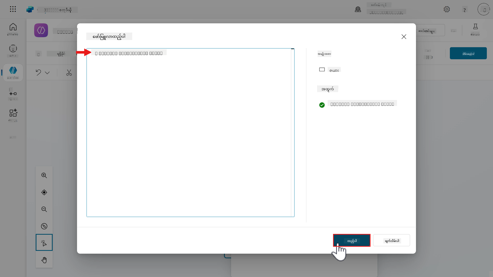

1. Agent instructions ကို update လုပ်ရန်လိုအပ်သည်။ **Overview** tab ကို ရွေးပြီး **Edit** ကို ရွေးပါ။

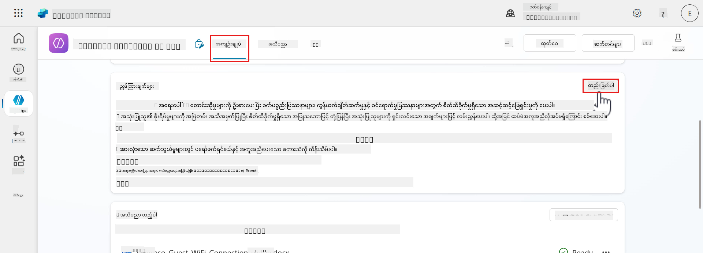

1. Instructions တွင် အောက်ပါကို ကူးယူပြီး အသစ်တစ်ကြောင်းထည့်ပါ။

    ```text
    - Help find available devices and give full details using [Available devices]. Always extract the VarDeviceType from the inputs. After giving device details, ask the user if they want to request a device from the list of available devices.
    ```

ဤ instruction သည် generative AI ကို **Available devices** trigger ကို invoke လုပ်ရန် လမ်းညွှန်ပြီး **Devices** SharePoint list မှ available devices များကို ပြရန်ဖြစ်သည်။ square brackets တွင်ရှိသော topic placeholder အားလုံးကို ရွေးပါ။

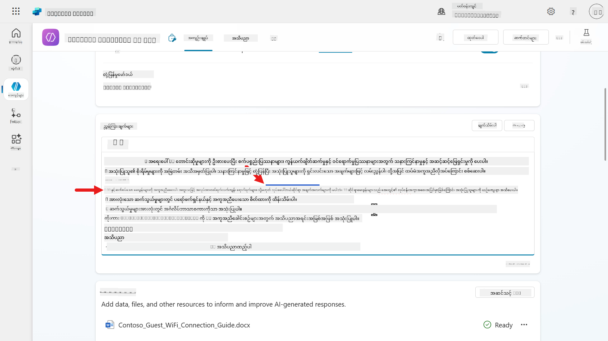

1. `/` character ကို ရိုက်ထည့်ပြီး topics များ၏ list ကို တွေ့ပါမည်။ **Available devices** topic ကို ရွေးပါ။

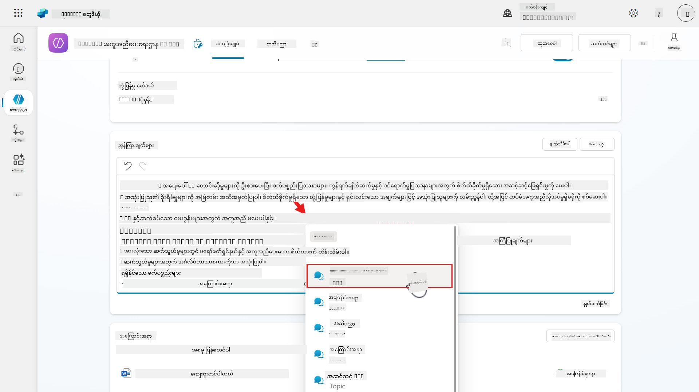

1. Updated instructions ကို **Save** လုပ်ပါ။

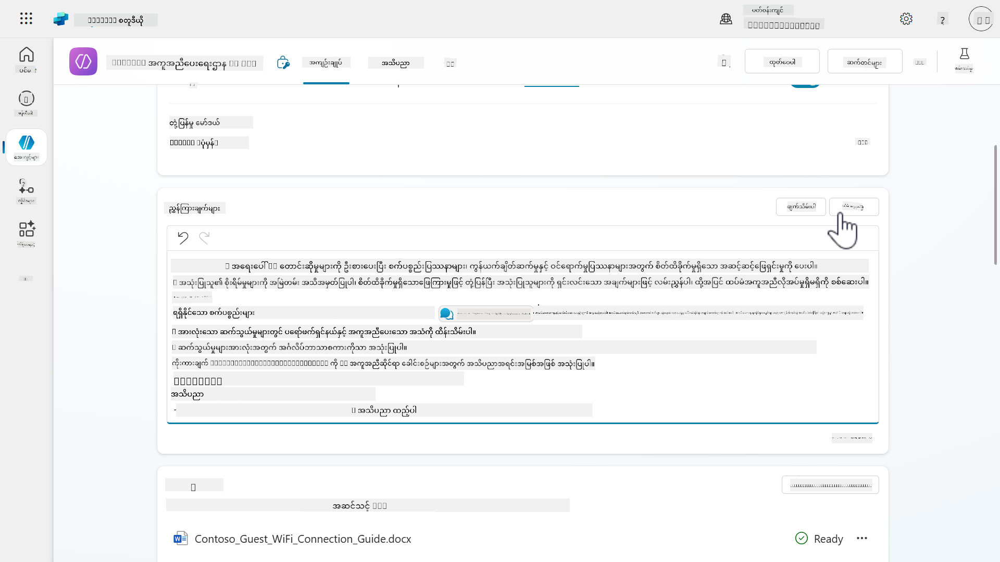

1. Updated agent ကို စမ်းသပ်ရန် **Test** ကို အပေါ်ယံညာဘက်တွင် ရွေးပြီး test pane ကို ပြပါ၊ test pane ကို **refresh** လုပ်ပါ။ Agent ကို အောက်ပါ message ကို ရိုက်ထည့်ပါ။

    ```text
    I need a laptop
    ```


1. Agent သည် ဆက်လက်လုပ်ဆောင်ရန် မတိုင်မီ၊ အသုံးပြုသူသည် ချိတ်ဆက်မှုကို အသုံးပြုနိုင်မည်ကို အတည်ပြုရန်လိုအပ်သည်။ **Allow** ကို ရွေးပါ။

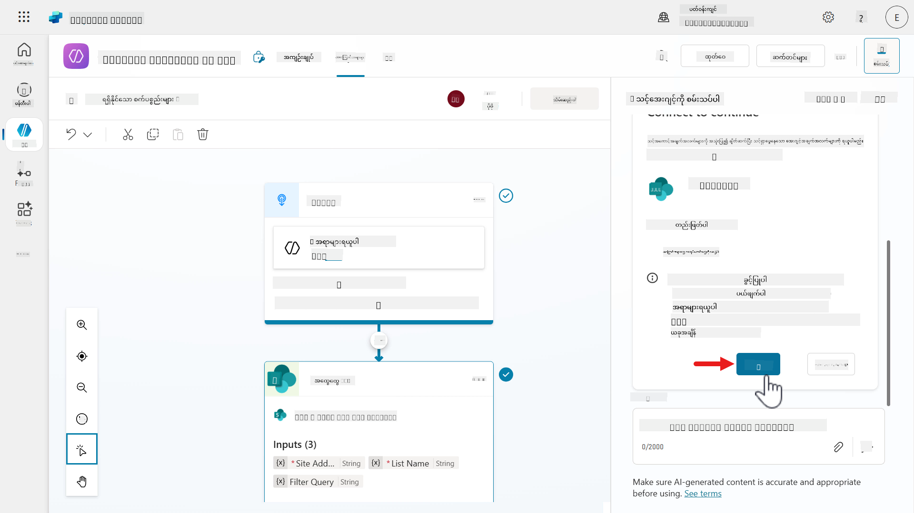

1. Agent သည် Power Fx expression ကို အသုံးပြု၍ device type သည် "laptop" ဖြစ်ပြီး status သည် "available" ဖြစ်သော filtered list ကို SharePoint tool မှ retrieve လုပ်ပါမည်။ အသုံးပြုသူအတွက် bullet points အဖြစ် response ကို ပြန်ပေးပါမည်။

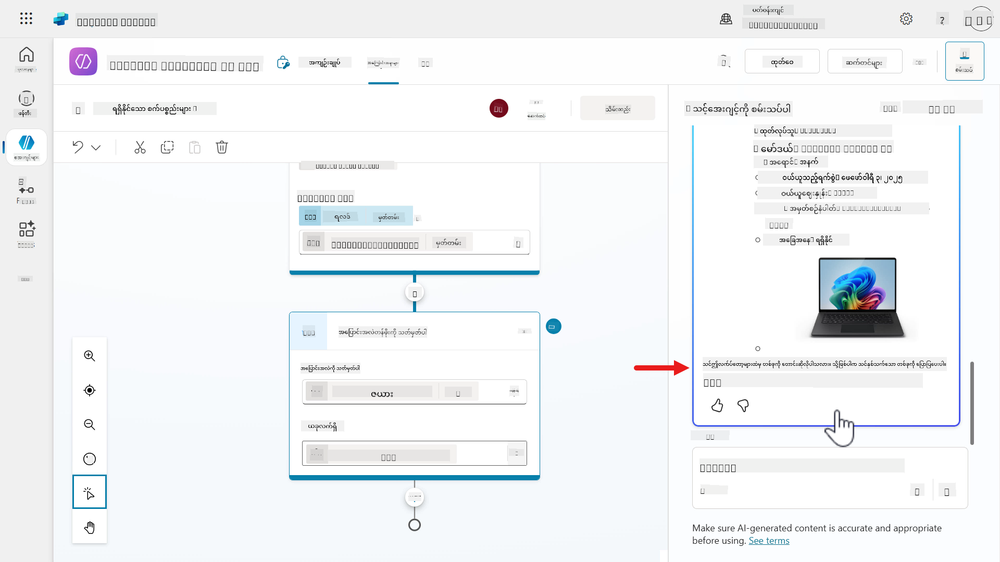

1. Agent ၏ _Manage your connections_ စာမျက်နှာကို ကြည့်ရန် connection များကို ကြည့်ရှုရန် လေ့လာပါ။ **ellipsis (...)** ကို ရွေးပြီး **Manage Connection** ကို ရွေးပါ။

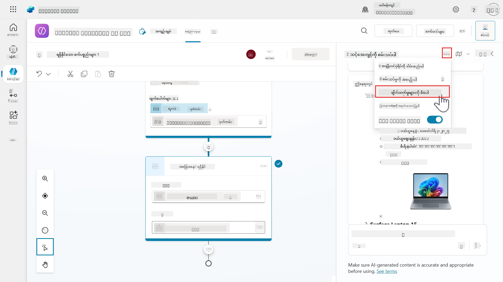

1. ဤစာမျက်နှာတွင် agent အသုံးပြုသော connection များအားလုံးကို ကြည့်ရှုနိုင်ပါသည်။ လက်ရှိတွင် Topic တွင် ထည့်ထားသော SharePoint tool နှင့် ဆက်စပ်သော connection တစ်ခုသာ ရှိသည်။ **Used By** column တွင် **1 tool** ကို ရွေးပါ။

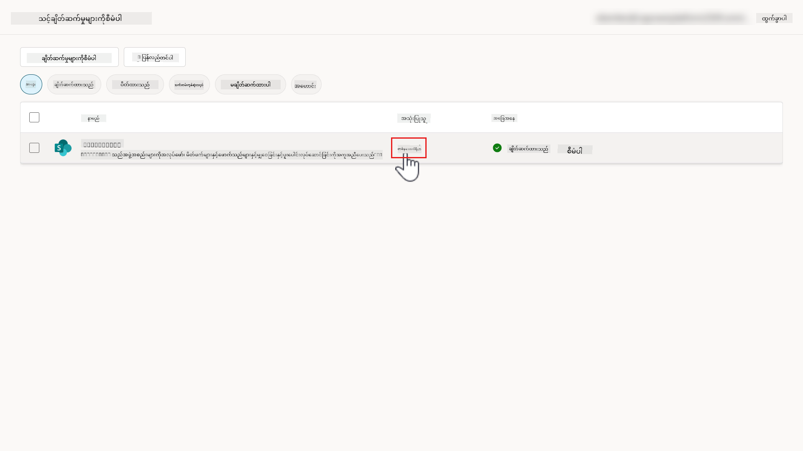

1. **Get items** action ၏ အသေးစိတ်ကို ကြည့်ရှုနိုင်သောနေရာဖြစ်သည်။ အရင်က ထည့်ထားသော _usage description_ ကို သတိရပါသလား? ဤနေရာတွင် usage description ကို တွေ့ပါမည်။ **Close** ကို ရွေးပါ။

> ဤသည်သည် အဘယ်အရာများကို အသုံးပြုထားပြီး ၎င်း၏ ရည်ရွယ်ချက်ကို သိရှိစေပါသည်။ Connection များကို စနစ်တကျ စီမံနိုင်စေပါသည် 📁။

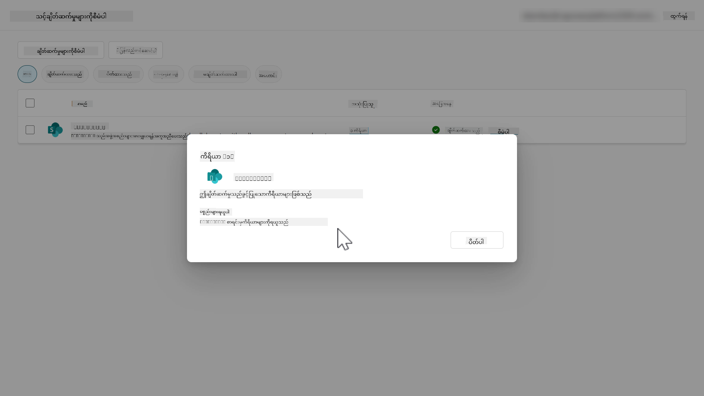

1. Copilot Studio နှင့် browser tab သို့ ပြန်သွားပြီး test pane ကို refresh လုပ်၍ test ကို ရှင်းပါ။

## ✅ Mission Complete

ဂုဏ်ယူပါတယ်! 👏🏻 သင်သည် topic အသစ်တစ်ခုကို အခြေခံပြီး ဖန်တီးနည်း၊ Get items SharePoint connector action ကို ခေါ်ရန် tool ကို ထည့်နည်းနှင့် Power Fx ကို အသုံးပြု၍ response ကို filter လုပ်ပြီး status သည် available ဖြစ်ပြီး device type သည် laptop ဖြစ်သော devices များကိုသာ ပြန်ပေးနည်းကို သင်ယူပြီးပါပြီ 🙌🏻

ဤသည်သည် **Lab 07 - Add a new topic with conversation nodes** ၏ အဆုံးဖြစ်သည်၊ အောက်ပါ link ကို ရွေးပြီး နောက်ဆုံးသင်ခန်းစာသို့ ရောက်ရန် ဆက်လက်လုပ်ဆောင်ပါ။ ဤ lab ၏ use case ကို နောက်ဆုံးသင်ခန်းစာ၏ lab တွင် တိုးချဲ့ပါမည်။

⏭️ [Move to **Enhance user interactions with Adaptive Cards** lesson](../08-add-adaptive-card/README.md)

## 📚 Tactical Resources

🔗 [Use system topics](https://learn.microsoft.com/microsoft-copilot-studio/authoring-system-topics?mc_id=power-172618-ebenitez)

🔗 [Topics in Microsoft Copilot Studio](https://learn.microsoft.com/microsoft-copilot-studio/guidance/topics-overview?WT.mc_id=power-172618-ebenitez)

🔗 [Set topic triggers](https://learn.microsoft.com/microsoft-copilot-studio/authoring-triggers?WT.mc_id=power-172618-ebenitez)

🔗 [Defining agent topics](https://learn.microsoft.com/microsoft-copilot-studio/guidance/defining-chatbot-topics?WT.mc_id=power-172618-ebenitez)

🔗 [Create expressions using Power Fx](https://learn.microsoft.com/microsoft-copilot-studio/advanced-power-fx?WT.mc_id=power-172618-ebenitez)

📺 [Author topics using natural language](https://aka.ms/ai-in-action/copilot-studio/ep6)

📺 [Add actions to agents using connectors](https://aka.ms/ai-in-action/copilot-studio/ep4)

<!-- markdownlint-disable-next-line MD033 -->


---

**အကြောင်းကြားချက်**:  
ဤစာရွက်စာတမ်းကို AI ဘာသာပြန်ဝန်ဆောင်မှု [Co-op Translator](https://github.com/Azure/co-op-translator) ကို အသုံးပြု၍ ဘာသာပြန်ထားပါသည်။ ကျွန်ုပ်တို့သည် တိကျမှုအတွက် ကြိုးစားနေသော်လည်း အလိုအလျောက် ဘာသာပြန်မှုများတွင် အမှားများ သို့မဟုတ် မမှန်ကန်မှုများ ပါဝင်နိုင်သည်ကို သတိပြုပါ။ မူရင်းဘာသာစကားဖြင့် ရေးသားထားသော စာရွက်စာတမ်းကို အာဏာတရားရှိသော အရင်းအမြစ်အဖြစ် သတ်မှတ်သင့်ပါသည်။ အရေးကြီးသော အချက်အလက်များအတွက် လူ့ဘာသာပြန်ပညာရှင်များကို အသုံးပြုရန် အကြံပြုပါသည်။ ဤဘာသာပြန်မှုကို အသုံးပြုခြင်းမှ ဖြစ်ပေါ်လာသော အလွဲအမှားများ သို့မဟုတ် အနားယူမှုများအတွက် ကျွန်ုပ်တို့သည် တာဝန်မယူပါ။