<!--
CO_OP_TRANSLATOR_METADATA:
{
  "original_hash": "cc4afa4a5a11c9d03896decfbcbd4060",
  "translation_date": "2025-10-21T18:23:39+00:00",
  "source_file": "docs/recruit/09-add-an-agent-flow/README.md",
  "language_code": "my"
}
-->
# 🚨 မစ်ရှင် 09: သင့် Topic အတွက် Agent Flow ထည့်သွင်းပြီး အလိုအလျောက်လုပ်ဆောင်မှုများပြုလုပ်ပါ

## 🕵️‍♂️ ကုဒ်နာမည်: `OPERATION AUTOMATION POWERHOUSE`

> **⏱️ လုပ်ဆောင်ရန်အချိန်:** `~30 မိနစ်`

🎥 **လမ်းညွှန်မှုကို ကြည့်ပါ**

[](https://www.youtube.com/watch?v=vtLZJT3eBXg "YouTube မှ walkthrough ကိုကြည့်ပါ")

## 🎯 မစ်ရှင်အကျဉ်းချုပ်

သင့် Agent သည် ယူဇာများနှင့် ဆွေးနွေးပြီး အချက်အလက်များပေးနိုင်ပါပြီ၊ သို့သော် အလုပ်လုပ်ဆောင်မှုအထူးကျွမ်းကျင်မှုအတွက် Agent သည် လုပ်ဆောင်မှုများကို ပြုလုပ်နိုင်ရမည်ဖြစ်သည်။ ဒီမစ်ရှင်သည် သင့် Agent ကို အလိုအလျောက်လုပ်ဆောင်မှုများပြုလုပ်နိုင်သော အထူးကျွမ်းကျင်မှုရှိသော Agent အဖြစ် ပြောင်းလဲပေးမည်ဖြစ်ပြီး Agent Flows ဖြင့် အင်တလီဂျင့် Workflow Automation ကို အသုံးပြုနိုင်စေမည်ဖြစ်သည်။

မစ်ရှင်အဆုံးတွင် သင့် Agent သည် Adaptive Card မှတဆင့် ယူဇာ၏ Input ကို သိမ်းဆည်းခြင်း၊ SharePoint မှ အချက်အလက်များ ရယူခြင်း၊ Email ဖြင့် မန်နေဂျာများထံ သတိပေးချက်များ ပို့ခြင်းနှင့် ယူဇာများကို အဆင်ပြေသော Feedback ပေးခြင်းတို့ကို အဆုံးစွန်အလိုအလျောက်လုပ်ဆောင်နိုင်မည်ဖြစ်သည်။

## 🔎 ရည်မှန်းချက်များ

ဒီမစ်ရှင်တွင် သင်လေ့လာရမည့်အရာများမှာ -

1. Agent Flows ဆိုတာဘာလဲ၊ Power Automate Cloud Flows နှင့် ဘာကွာခြားချက်ရှိလဲဆိုတာကို နားလည်ခြင်း
1. Agent Flows ကို အထူးပြုစေသော အဓိကအင်္ဂါရပ်များကို လေ့လာခြင်း (AI Actions နှင့် Natural Language Authoring အပါအဝင်)
1. Agent Flow Designer ကို စူးစမ်းပြီး Dynamic Data Handling အတွက် Expressions ကို အသုံးပြုနည်းကို လေ့လာခြင်း
1. SharePoint Data နှင့် Email Notifications ကို ပေါင်းစပ်ထားသော Device Request Automation တစ်ခုကို ဖန်တီးခြင်း

## 🤔 Agent Flow ဆိုတာဘာလဲ?

Agent Flows သည် အလုပ်များကို အလိုအလျောက်လုပ်ဆောင်ရန်နှင့် သင့် Apps နှင့် Services များကို ပေါင်းစည်းရန် အထူးပြုသော နည်းလမ်းတစ်ခုဖြစ်သည်။ ၎င်းသည် သင့် Agent အနေဖြင့် Notification ပို့ခြင်း၊ Records များ Update ပြုလုပ်ခြင်း၊ Event များကို တုံ့ပြန်ခြင်းစသည့် အလုပ်များကို အလိုအလျောက်လုပ်ဆောင်နိုင်ရန် Structured Workflow အဖြစ် ဖန်တီးထားသည်။

Agent Flows သည် **Deterministic Workflows** ဖြစ်ပြီး အတူတူ Input ရရှိသည့်အခါ အတူတူ Path ကို အမြဲလိုက်နာမည်ဖြစ်သောကြောင့် ယုံကြည်စိတ်ချရသော ရလဒ်များကို ပေးစွမ်းနိုင်သည်။

ရိုးရှင်းစွာဆိုရမည်ဆိုလျှင် -

- ယူဇာများကို **ပြောခြင်း** သက်သာမက **လုပ်ဆောင်ခြင်း** ကိုလည်း အကောင်အထည်ဖော်နိုင်သည်။
- Topics နှင့် Agents များအတွင်း အသုံးပြုနိုင်သော Reusable ဖြစ်ပြီး ယူဇာ Messages, Events, သို့မဟုတ် အခြား Applications နှင့် Services များမှ Trigger လုပ်နိုင်သည်။

## 🙋🏽 ဟုတ်ကဲ့၊ ဒါပေမယ့် Power Automate Cloud Flows နဲ့ ဘာကွာခြားလဲ?

Agent Flows နှင့် Power Automate Cloud Flows နှစ်ခုစလုံးသည် အလုပ်များကို အလိုအလျောက်လုပ်ဆောင်ရန်အတွက် အထောက်အကူပြုသည်။ သို့သော် ၎င်းတို့သည် အခြားအခြားသော ရည်ရွယ်ချက်များအတွက် ဖန်တီးထားပြီး အလုပ်လုပ်ပုံများကလည်း ကွဲပြားသည်။

### 🤖 Copilot Studio မှ Agent Flows

**ရည်ရွယ်ချက်:**

- Copilot Studio တွင် Conversational နှင့် Autonomous Agents များအတွက် ဖန်တီးထားသည်။
- စီးပွားရေးစနစ်များနှင့် အပြန်အလှန်ဆက်သွယ်မှုရှိသော Smart, AI-Driven Automation အတွက် အထူးပြုထားသည်။

**အသုံးဝင်မှု:**

- Copilot Studio တွင် တိုက်ရိုက် ဖန်တီးပြီး စီမံခန့်ခွဲရန် လွယ်ကူသည်။
- ယူဇာများနှင့် ဆွေးနွေးမှုအတွင်း ဖြစ်ပေါ်သော Leave Request တင်သွင်းခြင်းစသည့် အလုပ်များကို အလိုအလျောက်လုပ်ဆောင်ရန် အထူးသင့်လျော်သည်။
- Power Automate လိုင်စင်မလိုအပ်သဖြင့် Copilot Studio အတွင်း အသုံးပြုမှုအပေါ် အခြေခံပြီး ကုန်ကျစရိတ်နှင့် အချိန်ကို လျှော့ချနိုင်သည်။

**ကန့်သတ်ချက်များ:**

- Share, Copy, Co-owners များ Assign လုပ်၍ မရပါ။
- Agent Flows များသည် Copilot Studio အတွင်းသာ မြင်နိုင်ပြီး အသုံးပြုနိုင်သည်။
- လက်ရှိတွင် Agent Event Triggers များကို Power Automate Maker Portal တွင် Edit ပြုလုပ်နိုင်သည်။

### ☁️ Power Automate Cloud Flows

**ရည်ရွယ်ချက်:**

- Apps နှင့် Services များအတွင်း အထူးပြု Automation အတွက် ဖန်တီးထားသည်။
- Agent Flows နှင့်အတူ သို့မဟုတ် အခြားအလိုအလျောက်လုပ်ဆောင်မှုများအတွက် သီးသန့် အလုပ်လုပ်နိုင်သည်။

**အသုံးဝင်မှု:**

- Connector များစွာကို ပေးစွမ်းသည်။
- Agents အပြင် အခြား Processes များကို အလိုအလျောက်လုပ်ဆောင်ရန် အထူးသင့်လျော်သည်။
- Share, Reuse, Manage လုပ်နိုင်သည်။

**လိုအပ်ချက်များ:**

- Power Automate လိုင်စင်လိုအပ်သည်။

### 📗 အကျဉ်းချုပ်

| ဒီကို အသုံးပြုပါ | သင့်လိုအပ်ချက်မှာ |
| :- | :- |
| Agent Flows | Agent အတွင်း အလုပ်များကို အလိုအလျောက်လုပ်ဆောင်ရန်၊ AI အသုံးပြုရန်၊ Copilot Studio အတွင်း အားလုံးကို ထိန်းချုပ်ရန် |
| Power Automate Cloud Flows | Apps နှင့် Services များအတွင်း အလုပ်များကို အလိုအလျောက်လုပ်ဆောင်ရန်၊ Agents အပြင် Workflow များ ဖန်တီးရန် |

## 👍🏻 အဘယ်ကြောင့် Agent Flows ကို အသုံးပြုသင့်သလဲ

Agent Flows သည် အတိအကျ သတ်မှတ်ထားသော လမ်းကြောင်းကို အမြဲလိုက်နာသည် - အတူတူ Input ရရှိသည့်အခါ အတူတူ အလုပ်လုပ်သည်။

ဒါကြောင့် -

- **ယုံကြည်စိတ်ချရသော** - အမြဲတမ်း တူညီသောအကျင့်ကို လိုက်နာမည်ဖြစ်သည်။
- **ခန့်မှန်းနိုင်သော** - Flow အလုပ်လုပ်သောအခါ ရလဒ်ကို ခန့်မှန်းနိုင်သည်။
- **Rule-based** - သင့်ဖန်တီးထားသော အဆင့်များကို လိုက်နာသည်။

အခြားအကျိုးကျေးဇူးများမှာ -

- **Automation** - Form တင်သွင်းခြင်း၊ Notification ပို့ခြင်းစသည့် အလုပ်များကို အလိုအလျောက်လုပ်ဆောင်နိုင်သည်။
- **Connected** - ServiceNow, SharePoint, Salesforce စသည့် 1400+ Connectors များနှင့် ပေါင်းစည်းနိုင်သည်။ သို့မဟုတ် Custom Connector ကို ဖန်တီးနိုင်သည်။
- **Tightly Integrated** - Agent Flows သည် Agent ၏ Logic အတွင်း ပါဝင်ပြီး ယူဇာ Messages သို့မဟုတ် Actions များမှ တိုက်ရိုက် Trigger လုပ်နိုင်သည်။
- **Scalability** - Flows များကို Agents များနှင့် Scenarios များအတွင်း ပြန်လည်အသုံးပြုနိုင်သည်။
- **No-code သို့မဟုတ် Low-code** - Natural Language သို့မဟုတ် Visual Designer ကို အသုံးပြု၍ Flows များကို ဖန်တီးနိုင်သည်။
- **All-in-one-platform** - Copilot Studio တွင် Flows များကို Design, Test, Deploy ပြုလုပ်နိုင်သည်။ Platforms များအကြား ပြောင်းရန် မလိုအပ်ပါ။

## 🏄🏻‍♂️ Agent Flows သည် သင့် Agent ကို ဘယ်လို အထောက်အကူဖြစ်စေသလဲ?

Agent Flows သည် ယူဇာများနှင့် "စကားပြောဆိုခြင်း" အပြင် အလုပ်များကို လုပ်ဆောင်ရန် Agent ကို အင်တလီဂျင့်စွမ်းရည် ပေးစွမ်းသည်။

ဥပမာအားဖြင့် သင်သည် ဘဏ္ဍာရေးဌာနတွင် အလုပ်လုပ်နေပြီး Vendor များမှ Invoice များစွာ ရရှိနေသည်။ သာမန်အားဖြင့် တစ်ဦးဦးက Invoice တစ်ခုချင်းစီကို ဖတ်ပြီး အရေးကြီးသော အချက်အလက်များ - Amount, Date, Vendor အမည်ကို ရယူပြီး သင့် Records နှင့် ကိုက်ညီမှုရှိ/မရှိ စစ်ဆေးရမည်။ ထို့နောက် အတည်ပြုရန် သင့်လူများထံ ပို့ရမည်။ ၎င်းသည် အချိန်နှင့် အားထုတ်မှုကို လိုအပ်သည်။

Copilot Studio တွင် Agent Flows ကို အသုံးပြု၍ ၎င်းလုပ်ငန်းစဉ်ကို အလိုအလျောက်လုပ်ဆောင်နိုင်သည်။ Invoice ရောက်လာသည်နှင့် -

1. Intelligent Document Processing ကို အသုံးပြု၍ အရေးကြီးသော အချက်အလက်များကို ရှာဖွေဖတ်ရှုသည်။
1. Enterprise Data နှင့် ကိုက်ညီမှုရှိ/မရှိ စစ်ဆေးသည်။
1. အတည်ပြုရန် သင့်လူများထံ ပို့သည်။

၎င်းသည် အချိန်ကို လျှော့ချပြီး အမှားများကို လျှော့ချပေးပြီး လုပ်ငန်းစဉ်ကို ပိုမိုချောမွေ့စေသည်။

### ဒီလိုတွေးပါ

- **Agents**: အဆုံးဖြတ်မှုများကို ပြုလုပ်သောသူများ
- **Agent Flows**: ယုံကြည်စိတ်ချရသော အလုပ်လုပ်ဆောင်သူများ

### အရေးကြီးသောအချက်

- သင့် Agent အတွက် Automation နှင့် Flexible AI ကို ပေါင်းစပ်အသုံးပြုနိုင်သည်။
- လုပ်ငန်းလိုအပ်ချက်များ ပြောင်းလဲသည့်အခါ Flows များကို လွယ်ကူစွာ Update ပြုလုပ်နိုင်သည်။
- Automation ကို အဖွဲ့များအတွင်း အကျယ်အဝန်း အသုံးပြုနိုင်သည်။

## 🔌 Agent Flows ကို အထူးပြုစေသော အဓိကအင်္ဂါရပ်များ

1. **Natural Language Authoring**
    - Flow ကို ဘာလုပ်စေချင်သည်ကို ရိုးရိုးရှင်းရှင်း အင်္ဂလိပ်ဘာသာဖြင့် ဖော်ပြနိုင်သည်။
    - Copilot သည် သင့်ရည်ရွယ်ချက်ကို နားလည်ပြီး Flow ကို ဖန်တီးပေးသည်။
    - Code ရေးရန် မလိုအပ်ပါ - သင့်အကြံကို ရှင်းပြပါ။

1. **AI Actions**

    AI ကို အသုံးပြု၍ -

    - စာရွက်များ သို့မဟုတ် ပုံများကို ဖတ်ရှုနားလည်နိုင်သည်။
    - ရှည်လျားသော အကြောင်းအရာများကို အကျဉ်းချုပ်ပြီး အသုံးဝင်သော အဖြေများပေးနိုင်သည်။
    - Smart Recommendations သို့မဟုတ် အဆုံးဖြတ်ချက်များ ပြုလုပ်နိုင်သည်။

1. **Generative Actions**
    - Flow ကို အချိန်နှင့်အမျှ အလျင်အမြန် ပြောင်းလဲနိုင်စေသည်။
    - Agent သည် အချက်အလက်များ ပြောင်းလဲသည့်အခါ အဆင့်များကို စီစဉ်ပြီး ပြင်ဆင်နိုင်သည်။

1. **Integration Actions**
    - Flow ကို Outlook, Microsoft Teams, ServiceNow, SharePoint နှင့် အခြား Applications နှင့် Services များနှင့် ပေါင်းစည်းနိုင်သည်။
    - +1400 Built-in Connectors သို့မဟုတ် Custom Connector ကို အသုံးပြုနိုင်သည်။
    - သင့်အဖွဲ့အသုံးပြုနေသော Apps များနှင့် Agent ကို ပေါင်းစည်းနိုင်သည်။

1. **Human in the Loop**
    - လူတစ်ဦးဦးက Review သို့မဟုတ် အတည်ပြုရန် လိုအပ်သော Approval Steps များ ထည့်သွင်းနိုင်သည်။
    - [Advanced Approvals](https://learn.microsoft.com/microsoft-copilot-studio/flows-advanced-approvals?WT.mc_id=power-172621-ebenitez) သည် Reminders, Delegation, Multi-stage Approvals များကို ပံ့ပိုးပေးသည်။

## ⚙️ Flow များအလုပ်လုပ်ပုံ

1. **Trigger**

    Event တစ်ခု Flow ကို စတင်စေသည် - ယူဇာက မေးခွန်းမေးခြင်း၊ Topic မှ Flow ကို Invoke လုပ်ခြင်း၊ Schedule တစ်ခု၊ သို့မဟုတ် အခြားစနစ်တွင် Event ဖြစ်ပေါ်ခြင်း။

1. **Actions**

    Agent သည် နောက်တစ်ဆင့်အနေဖြင့် လိုက်နာရမည့်အဆင့်များ - Email ပို့ခြင်း၊ API ကို ခေါ်ခြင်း၊ ServiceNow တွင် Ticket Update ပြုလုပ်ခြင်း။

## 🧶 Agent Flow ကို ဖန်တီးနည်း

1. **Natural Language**: Agent ကို ဘာလုပ်စေချင်သည်ကို ရှင်းပြပြီး Copilot သည် ၎င်းကို ဖန်တီးပေးသည်။
1. **Designer Canvas**: Agent Flow Designer တွင် Actions, Conditions, Loops များကို Drag and Drop လုပ်၍ Agent Flow ကို ဖန်တီးပါ။

## 🎨 Agent Flow Designer ဆိုတာဘာလဲ?

Copilot Studio တွင်ရှိသော Visual Tool တစ်ခုဖြစ်ပြီး Agent Flow များကို ဖန်တီး၊ Edit နှင့် စီမံခန့်ခွဲရန် အဆင့်ဆင့် လမ်းညွှန်ချက်များကို ပေးစွမ်းသည်။ Agent Flows အသစ်ဖန်တီးသူများအတွက်ပါ အသုံးပြုရလွယ်ကူစေရန် ဒီဇိုင်းဆွဲထားသည်။

### Agent Flow Designer ၏ အဓိကအင်္ဂါရပ်များ

1. **Visual Canvas**
    - Flow အားလုံးကို Diagram အဖြစ် မြင်နိုင်သည်။
    - Zoom In/Out, Fit View သို့မဟုတ် Minimap ကို အသုံးပြု၍ Flow ကြီးများကို Navigate လုပ်နိုင်သည်။

1. **Actions ထည့်သွင်းခြင်းနှင့် ဖယ်ရှားခြင်း**
    - _Plus (+)_ Button ကို Click လုပ်၍ Message ပို့ခြင်း သို့မဟုတ် SharePoint List တွင် Item Update ပြုလုပ်ခြင်းစသည့် Action အသစ်ထည့်နိုင်သည်။
    - Connectors မှ Action များကို ရှာဖွေပြီး ၎င်း၏ Settings မှတစ်ဆင့် Configure ပြုလုပ်နိုင်သည်။
    - Action ကို ဖယ်ရှားရန် _Three Dots (⋮)_ ကို Click လုပ်ပြီး _Delete_ ကို ရွေးပါ။

1. **Parameters စစ်ဆေးခြင်း**
    - Action တစ်ခုကို Click လုပ်၍ ၎င်း၏ Settings (Parameters) ကို ကြည့်ရှု သို့မဟုတ် Edit ပြုလုပ်နိုင်သည်။
    - Values များကို Manual ဖြင့် ထည့်သွင်းနိုင်သလို _Expressions_ ကို အသုံးပြု၍ Dynamic ဖြစ်စေရန် ပြုလုပ်နိုင်သည်။

1. **Version History**
    - Flow ကို Save လုပ်သောအခါ Version တစ်ခုကို မှတ်တမ်းတင်ထားသည်။
    - အရင် Version ကို ပြန်လည်ကြည့်ရှု သို့မဟုတ် Restore ပြုလုပ်နိုင်သည်။

1. **Error Checking**
    - _Flow Checker_ သည် Error များကို Highlight ပြုလုပ်သည်။
    - Flow ကို Publish ပြုလုပ်ရန် မတိုင်မီ Error များကို ဖြေရှင်းရမည်။

1. **Publish နှင့် Test**
    - Flow သည် Error မရှိပါက Publish လုပ်၍ Live ဖြစ်စေပါ။
    - _Test_ Feature ကို အသုံးပြု၍ Flow ကို Manual သို့မဟုတ် Automatic Run ပြုလုပ်ပြီး အလုပ်လုပ်ပုံကို စစ်ဆေးနိုင်သည်။

### အဘယ်ကြောင့် Agent Flow Designer ကို အသုံးပြုသင့်သလဲ?

- **Visual နှင့် Intuitive** - Drag နှင့် Click ဖြင့် Flow များကို ဖန်တီးနိုင်သည်။
- **Safe to Experiment** - Version History သည် ပြ
- ဥပမာ - `addDays(utcNow(), 7)` ၏ရလဒ်မှာ ယခုမှ ၇ ရက်အကြာဖြစ်သည်။

- `formatDateTime()` - ရက်စွဲကိုဖတ်ရှုရလွယ်ကူသော string အဖြစ်ဖော်ပြသည်။
  - ဥပမာ - တနင်္လာနေ့၊ ဇူလိုင် ၇၊ ၂၀၂၅

#### ✅ Logical

- `if()` - အမှန်ဖြစ်ပါကတစ်ခု၊ အမှားဖြစ်ပါကတစ်ခုကို အလုပ်လုပ်စေသည်။
  - ဥပမာ - `if(score > 50, 'Pass', 'Fail')`

- `equals()` - တန်ဖိုးနှစ်ခုတူညီကြောင်းစစ်ဆေးသည်။

- `and()`, `or()`, `not()` - အခြေအနေများစွာကိုပေါင်းစည်းသည်။

#### 🪣 အခြားအသုံးဝင်သော function များ

- `coalesce()` - ပထမဆုံး non-empty တန်ဖိုးကိုပြန်ပေးသည်။
  - fallback/default တန်ဖိုးများအတွက်အသုံးဝင်သည်။

- `guid()` - ထူးခြားသော ID တစ်ခုကိုဖန်တီးသည်။
  - tracking သို့မဟုတ် logging အတွက်အသုံးဝင်သည်။

- `length()` - string သို့မဟုတ် array တွင်ရှိသော အက္ခရာများ သို့မဟုတ် item များကိုရေတွက်သည်။

## ⭐ အကောင်းဆုံးအလေ့အကျင့်များ

Copilot Studio တွင် agent flow များတည်ဆောက်ရာတွင် အကောင်းဆုံးအလေ့အကျင့်များကိုအောက်ပါအတိုင်းဖော်ပြထားသည်။

1. **ရိုးရှင်းစွာစတင်ပြီးအဆင့်ဆင့်တိုးတက်စွာတည်ဆောက်ပါ**

    - စတင်မှာ message ပို့ခြင်းကဲ့သို့ ရိုးရှင်းပြီးရှင်းလင်းသော task တစ်ခုဖြင့်စတင်ပါ။
    - သင့် automation ၏အခြေခံကိုစမ်းသပ်ပြီးနောက်ပိုင်းတွင် အဆင့်များကိုထပ်ထည့်ပါ။

1. **အဆင့်တစ်ခုချင်းစီကိုရှင်းလင်းပြီးဖော်ပြနိုင်သောအမည်များပေးပါ**

    - အဆင့်တစ်ခုချင်းစီကိုရှင်းလင်းစွာ label လုပ်ပါ၊ သင်နှင့်သင့်အဖွဲ့သည် ၎င်း၏လုပ်ဆောင်မှုကိုနားလည်နိုင်ရန်။
    - ဥပမာ - SharePoint connector action အတွက် "Update item" အမည်ကို default အဖြစ်ထားမည်မဟုတ်ဘဲ၊ ၎င်း update လုပ်မည့်အရာကိုဖော်ပြသော "Update device status" အဖြစ်ပြောင်းလဲပေးပါ။

1. **Publish မလုပ်မီ error များကိုစစ်ဆေးပါ**

    - **flow checker** ကိုအသုံးပြု၍ ပြဿနာများကိုရှာဖွေပြီးပြင်ဆင်ပါ။
    - error ရှိပါက flow များကို publish မလုပ်နိုင်သောကြောင့်၊ error ဖြစ်ပေါ်သောအခါတွင် ၎င်းကိုဖြေရှင်းရန်ကြိုးစားပါ။

1. **သင့် flow ကိုအပြည့်အဝစမ်းသပ်ပါ**

    - Save လုပ်ပြီး publish လုပ်သည်ဆိုတာ၊ ၎င်းသည်မျှော်မှန်းထားသည့်အတိုင်းအလုပ်လုပ်သည်ဟုဆိုလိုသည်မဟုတ်ပါ။
    - _Test_ feature ကိုအသုံးပြု၍ သင့် flow ကို manual သို့မဟုတ် automatic အနည်းငယ်စမ်းသပ်ပြီးရလဒ်များကိုစစ်ဆေးပါ။

1. **Version History ကိုအသုံးပြုပါ**

    - သင့် flow ကိုမကြာခဏ save လုပ်ပါ၊ လိုအပ်ပါက ယခင် version များသို့ပြန်သွားနိုင်ရန်။
    - _Version History_ panel ကိုအသုံးပြု၍ ယခင် version များကိုကြည့်ရှုပြီးပြန်လည် restore လုပ်နိုင်သည်။

1. **Parameter နှင့် expression များကိုအသုံးချပါ**

    - Action များကို configure လုပ်ရာတွင် parameter များကိုအသုံးပြု၍ သင့် flow ကို dynamic ဖြစ်အောင်လုပ်ပါ။
    - တန်ဖိုးများကို manual ဖြင့်ထည့်သွင်းနိုင်သလို၊ expression များကိုအသုံးပြု၍ calculation လုပ်နိုင်သည်၊ သို့မဟုတ် dynamic content picker ကိုအသုံးပြု၍ upstream action များမှတန်ဖိုးများနှင့်ပေါင်းစည်းနိုင်သည်။

1. **မလိုအပ်သော action များကိုဖျက်ပါ**

    - Action တစ်ခုကိုထည့်ပြီးနောက်ပိုင်း၎င်းမလိုအပ်ကြောင်းဆုံးဖြတ်ပါက၊ သင့် flow ကိုသန့်ရှင်းစေရန်ဖျက်ပါ။

## 🧪 Lab 09 - Automation အတွက် agent flow တစ်ခုထည့်သွင်းပြီး topic ၏စွမ်းရည်များကိုတိုးတက်စေပါ

ယခုအခါတွင် adaptive card များနှင့် topic များ၏အဆင့်မြင့် functionality ကိုအသုံးပြု၍ topic ကိုတိုးတက်စေရန်လေ့လာမည်ဖြစ်သည်။

- [9.1 Agent flow တစ်ခုဖန်တီးပါ](../../../../../docs/recruit/09-add-an-agent-flow)
- [9.2 Agent flow ကို topic တွင်ထည့်ပါ](../../../../../docs/recruit/09-add-an-agent-flow)
- [9.3 Request device topic ကို user experience ပိုမိုကောင်းမွန်စေရန် node များစွာဖြင့် update လုပ်ပါ](../../../../../docs/recruit/09-add-an-agent-flow)
- [9.4 အခြေအနေများစွာဖြင့် agent ကိုစမ်းသပ်ပါ](../../../../../docs/recruit/09-add-an-agent-flow)

### ✨ Use case

**အလုပ်သမား၏မန်နေဂျာအဖြစ်**

**Device request များကိုလက်ခံလိုပါသည်**

**အလုပ်သမားတစ်ဦးတစ်ယောက်ကတောင်းဆိုထားသော device ကိုပြန်လည်သုံးသပ်နိုင်ရန်**

စတင်လိုက်ပါစို့!

### Prerequisites

1. **SharePoint list**

    [Lesson 00 - Course Setup - Step 3: Create new SharePoint site](../00-course-setup/README.md#step-4-create-new-sharepoint-site) မှ **Devices** SharePoint list ကိုအသုံးပြုမည်ဖြစ်သည်။

    **Devices** SharePoint list ကို setup မလုပ်ရသေးပါက [Lesson 00 - Course Setup - Step 3: Create new SharePoint site](../00-course-setup/README.md#step-4-create-new-sharepoint-site) သို့ပြန်သွားပါ။

1. **Contoso Helpdesk Agent**

    [Lesson 06 - Create a custom agent using natural language with Copilot and grounding it with your data](../06-create-agent-from-conversation/README.md) တွင် ယခင်ဖန်တီးထားသော agent ကိုအသုံးပြုမည်ဖြစ်သည်။

### 9.1 Agent flow တစ်ခုဖန်တီးပါ

ဤလေ့ကျင့်ခန်းတွင်၊ SharePoint item ကိုရယူပြီး device အသေးစိတ်အချက်အလက်များနှင့်အတူ မန်နေဂျာထံ email ပို့ရန် agent flow တစ်ခုကိုဖန်တီးမည်ဖြစ်သည်။

1. **Request device** topic တွင် **Ask with adaptive card** node ကိုအောက်သို့ scroll လုပ်ပြီး node အသစ်တစ်ခုထည့်ပါ။ **Add a tool** ကိုရွေးချယ်ပြီး fly out pane ၏ **Basic tools** tab တွင် **New Agent flow** ကိုရွေးချယ်ပါ။

    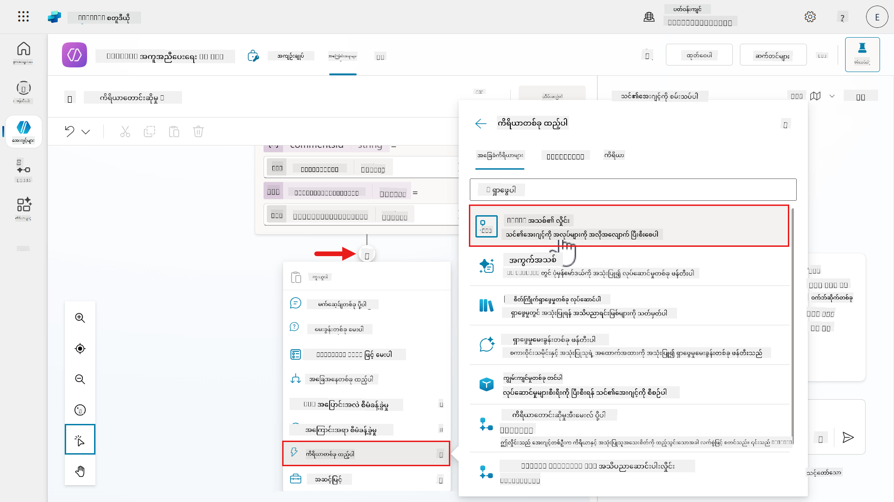

1. Agent flows **Designer** သည် trigger နှင့် action တစ်ခုဖြင့် load လုပ်မည်။

    - **Trigger** - Agent တစ်ခု flow ကိုခေါ်သောအခါ
        - ဤသည်သည် Copilot Studio agent မှ flow တစ်ခုကို trigger လုပ်မည်။

    - **Action** - Agent ကိုတုံ့ပြန်သည်
        - Copilot Studio agent သို့ output values ပါဝင်သောတုံ့ပြန်မှုကိုပို့သည်။

    Trigger ကိုရွေးချယ်ပါ။

    

1. နောက်တစ်ဆင့်တွင် agent flow အတွက် input များစွာထည့်သွင်းမည်။

    - `DeviceSharePointId` - ဤသည်သည် SharePoint item ၏ ID တန်ဖိုးကိုသိုလှောင်မည်။ ဤ ID တန်ဖိုးသည် user က device ကိုရွေးချယ်သော Ask with adaptive card node မှ output တစ်ခုဖြစ်သည်။

    - `User` - ဤသည်သည် agent ၏ system variable မှရရှိမည့် user ၏အမည်ဖြစ်သည်။

    - `AdditionalComments` - ဤသည်သည် user မှရိုက်ထည့်ထားသော comment ဖြစ်ပြီး၊ Ask with adaptive card node ၏ output တစ်ခုဖြစ်သည်။

    ပထမဆုံး input အဖြစ် `DeviceSharePointId` ကို trigger အတွက်ထည့်သွင်းမည်။ **+ Add an input** ကိုရွေးချယ်ပါ။

    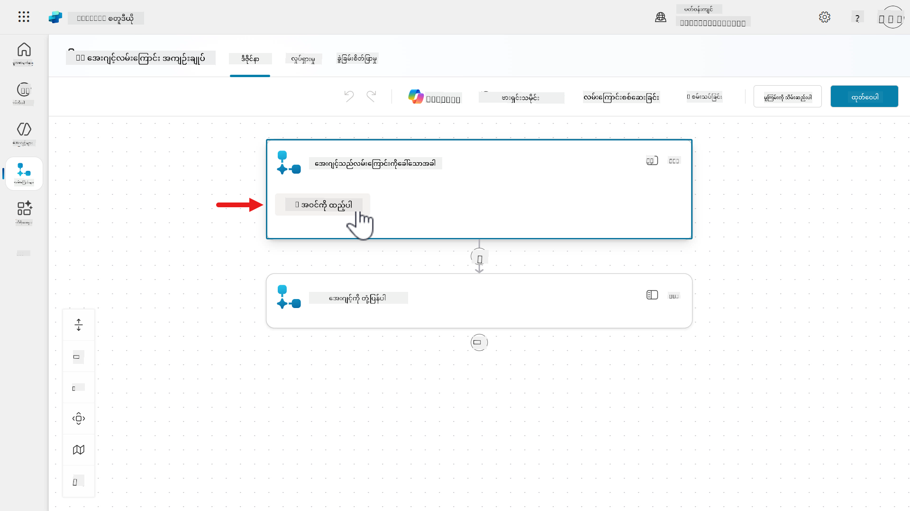

1. User input ၏အမျိုးအစားအတွက် **Text** ကိုရွေးချယ်ပါ။

    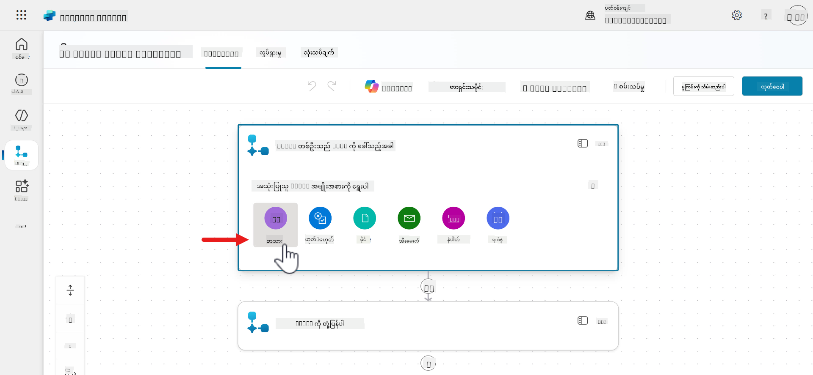

1. Input အမည်အတွက် အောက်ပါအတိုင်းရိုက်ထည့်ပါ။

    ```text
    DeviceSharePointId
    ```

    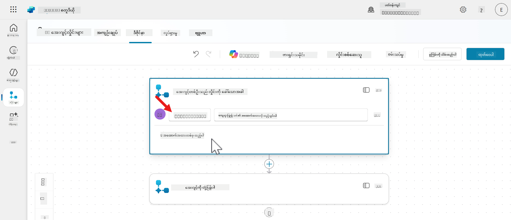

1. ဒုတိယ input ဖြစ်သော `User` ကိုယခုထည့်သွင်းမည်။ အတူတူသောအဆင့်များကိုထပ်လုပ်ပါ၊ **+ Add an input** ကိုရွေးချယ်ပြီး **Text** ကိုရွေးချယ်ပါ။

    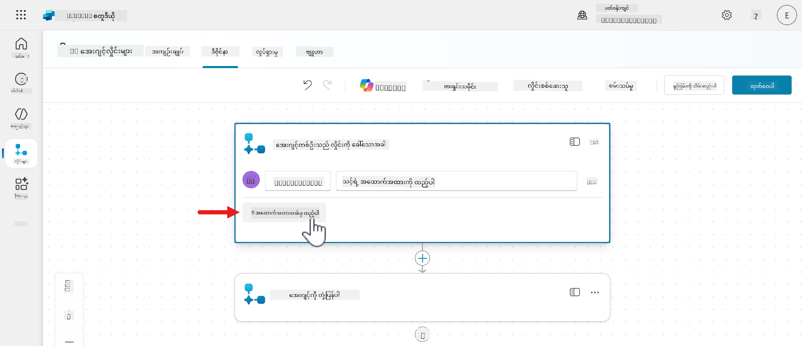

1. Input အမည်အတွက် အောက်ပါအတိုင်းရိုက်ထည့်ပါ။

    ```text
    User
    ```

    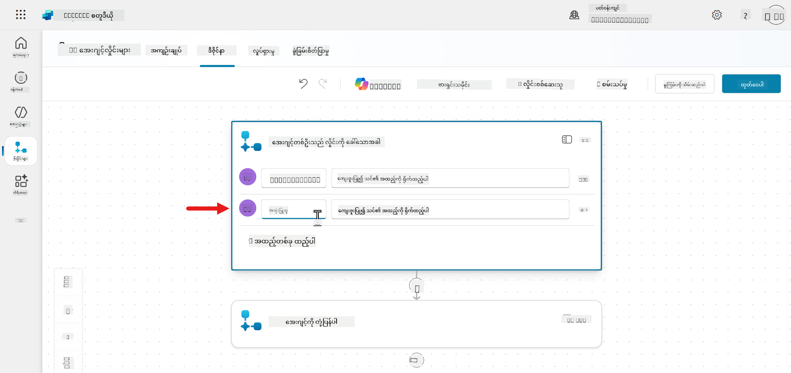

1. တတိယ input ဖြစ်သော `AdditionalComments` ကိုယခုထည့်သွင်းမည်။ အတူတူသောအဆင့်များကိုထပ်လုပ်ပါ၊ **+ Add an input** ကိုရွေးချယ်ပြီး **Text** ကိုရွေးချယ်ပါ။

    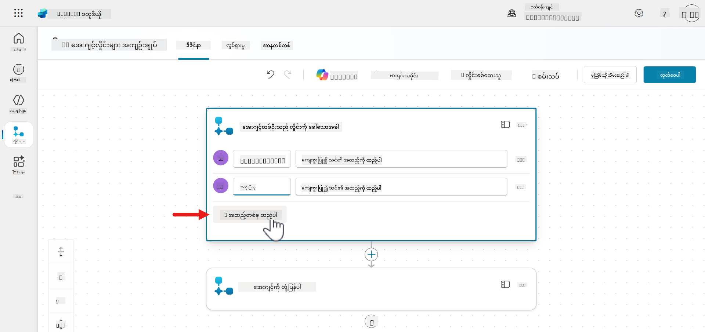

1. Input အမည်အတွက် အောက်ပါအတိုင်းရိုက်ထည့်ပါ။

    ```text
    AdditionalComments
    ```

    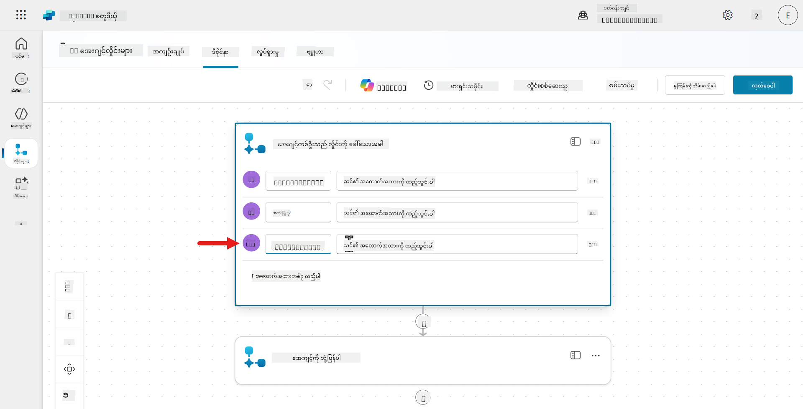

1. `AdditionalComments` input အတွက် optional ဖြစ်စေရန် update လုပ်မည်။ **ellipsis (...) icon** ကိုရွေးချယ်ပြီး **Make the field optional** ကိုရွေးချယ်ပါ။

    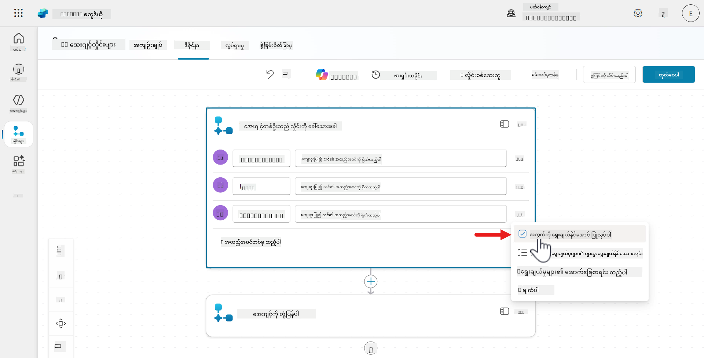

1. အလုပ်ကောင်းစွာလုပ်ဆောင်ပြီးပါပြီ! Trigger ကို configure ပြီးပါပြီ၊ ဆက်လက်လုပ်ဆောင်ပါ။ Trigger အောက်ရှိ **plus + icon** ကိုရွေးချယ်ပြီး action အသစ်တစ်ခုထည့်ပါ။

    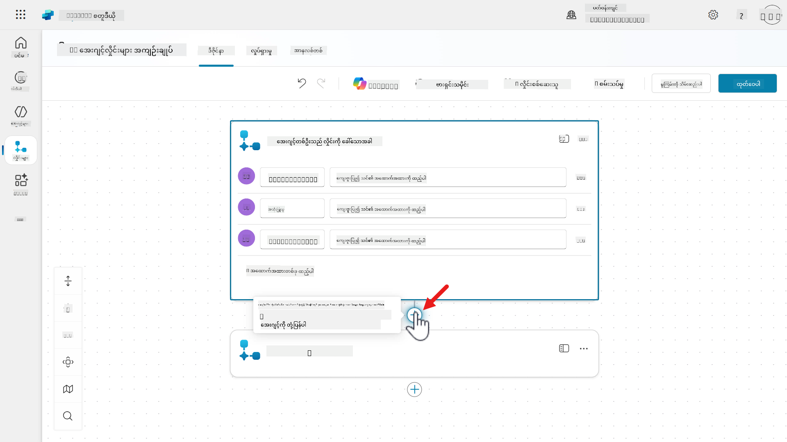

1. **Actions pane** တွင် Microsoft နှင့် third-party service များမှ built-in connector 1400+ အထိရှိသော action များကိုကြည့်ရှုနိုင်သည်။ **search field** တွင် အောက်ပါအတိုင်းရိုက်ထည့်ပါ။

    ```text
    Get item
    ```

    ရှာဖွေမှုရလဒ်များတွင် action များစာရင်းကိုပြသမည်။ **SharePoint connector** မှ **Get item** action ကိုရွေးချယ်ပါ။

    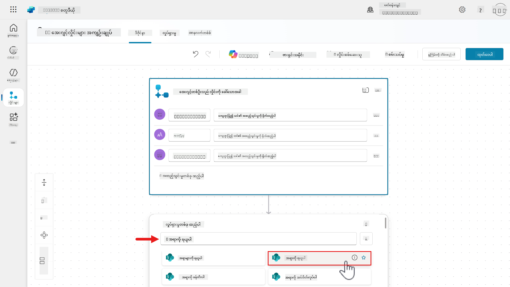

1. ယခု **Get item** action ကို configure လုပ်နိုင်ပြီ။

    **Ellipsis (...)** icon ကို **Get item** action တွင်ရွေးချယ်ပါ။

    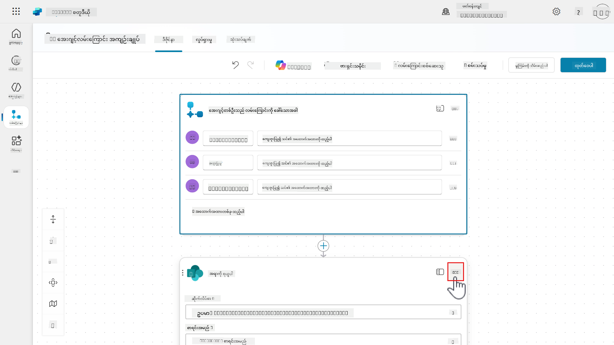

1. **Rename** ကိုရွေးချယ်ပါ။

    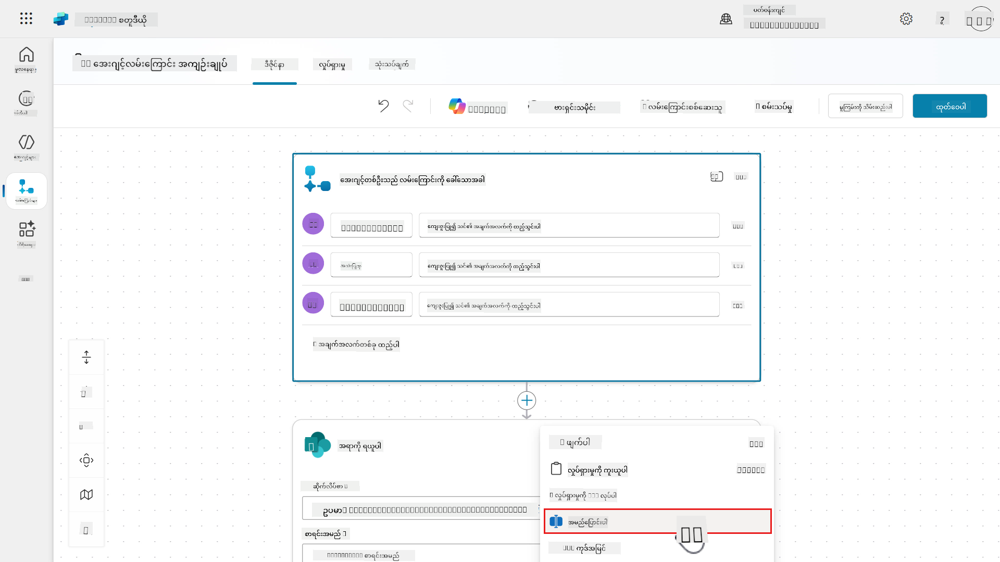

1. Action ကို အောက်ပါအတိုင်း rename လုပ်ပါ။

    ```text
    Get Device
    ```

    

1. **Site Address** field တွင် [Lesson 00 - Course Setup - Step 3: Create new SharePoint site](../00-course-setup/README.md#step-4-create-new-sharepoint-site) တွင်ဖန်တီးထားသော Contoso IT SharePoint site ၏ **Site address** ကိုရွေးချယ်ပါ။

    **List Name** field တွင် **Devices** SharePoint list ကိုရွေးချယ်ပါ။

    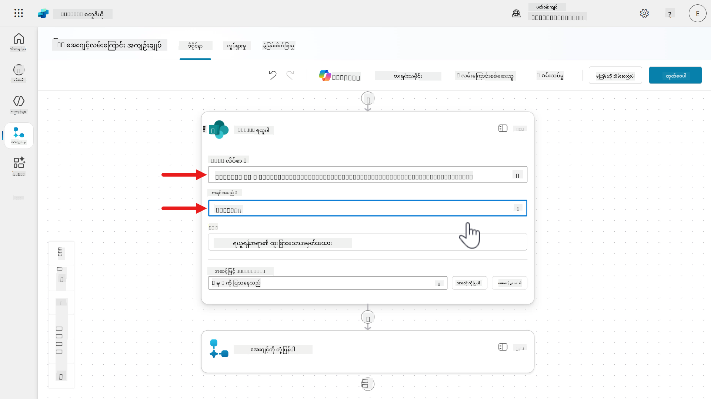

1. **Id** field တွင် **lightning bolt icon** သို့မဟုတ် **fx icon** ကိုညာဘက်တွင်ရွေးချယ်ပါ။

    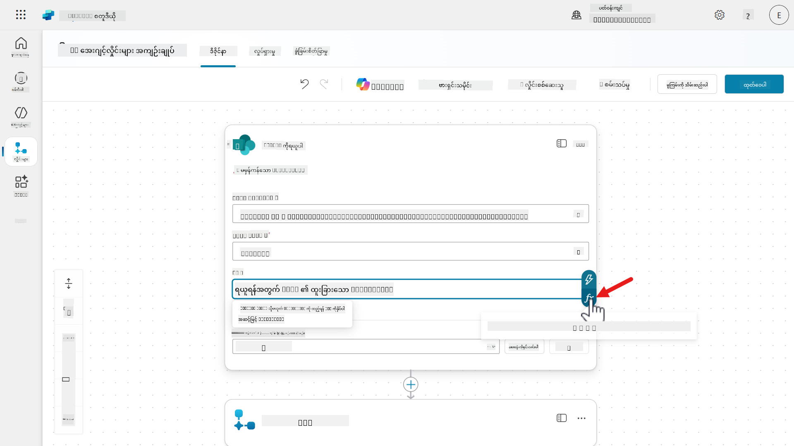

1. Flyout pane ၏ **Dynamic content** tab တွင် အောက်ပါအတိုင်းရိုက်ထည့်ပါ။

    ```text
    sharepoint
    ```

    ရှာဖွေမှုရလဒ်များတွင် ရှာဖွေထားသောတန်ဖိုးနှင့်ကိုက်ညီသော input parameter များကိုပြသမည်။ Trigger မှ **DeviceSharePointId** parameter ကိုရွေးချယ်ပါ။

    နောက်တစ်ဆင့်တွင် **Add** ကိုရွေးချယ်ပြီး dynamic content input ကို action ၏ **Id** parameter တွင်ထည့်ပါ။

    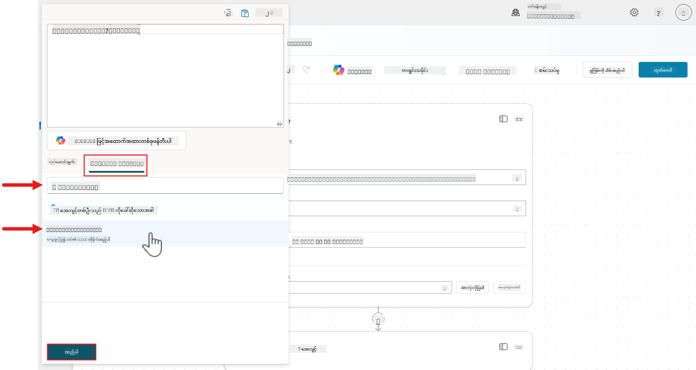

1. Trigger မှ dynamic content input ကို action ၏ **Id** parameter တွင် reference လုပ်ပြီးပါပြီ။ Advanced parameter တစ်ခုကို update လုပ်မည်။ **Show all** ကိုရွေးချယ်ပြီး advanced parameter များကိုကြည့်ပါ။

    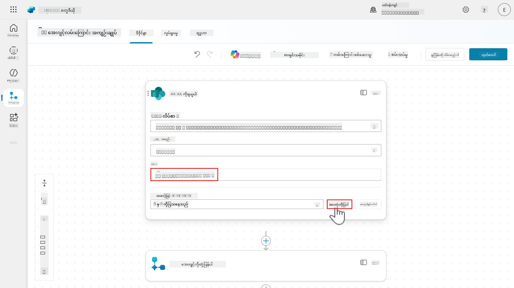

1. **Limit Columns by View** parameter ကိုပြသပြီး default အနေဖြင့် **Use all columns (Do not limit)** သို့ထားရှိထားသည်။ Response တွင်ပြန်ပေးသော column များကိုကန့်သတ်ရန် view ကို update လုပ်မည်။ **Limit Columns by View** parameter ကိုရွေးချယ်ပြီး view များစာရင်းကိုကြည့်ပါ။

    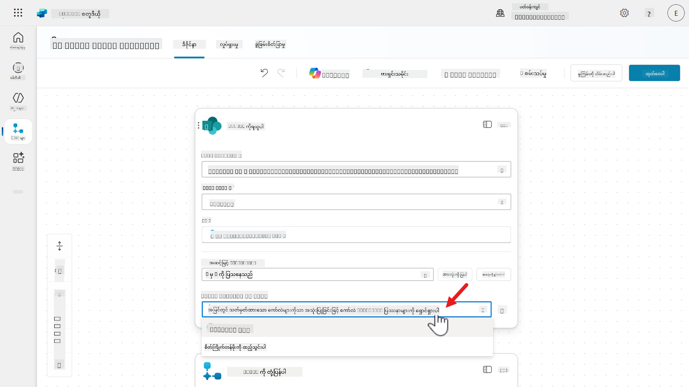

1. **All Items** view ကိုရွေးချယ်ပါ။

    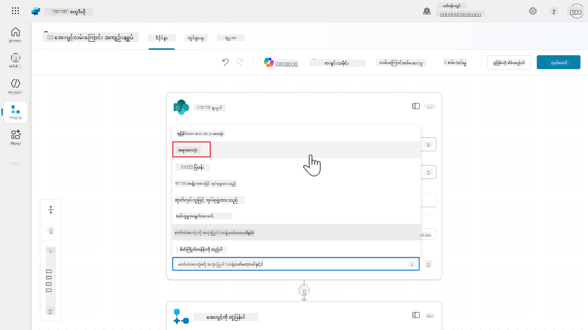

1. _Get Device_ action အောက်ရှိ **plus + icon** ကိုရွေးချယ်ပြီး action အသစ်တစ်ခုထည့်ပါ။

    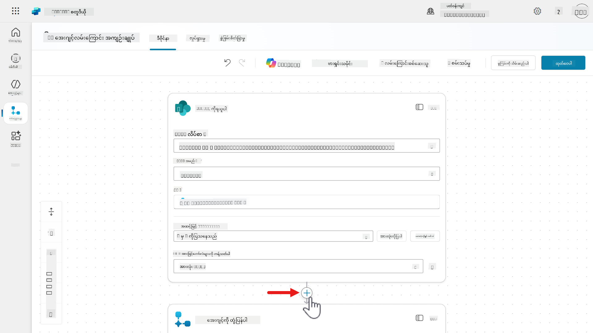

1. ရှာဖွေမှု field တွင် အောက်ပါအတိုင်းရိုက်ထည့်ပါ။

    ```text
    send an email
    ```

    ရှာဖွေမှုရလဒ်များတွင် action များစာရင်းကိုပြသမည်။ **Office 365 Outlook connector** မှ **Send an email (V2)** action ကိုရွေးချယ်ပါ။

    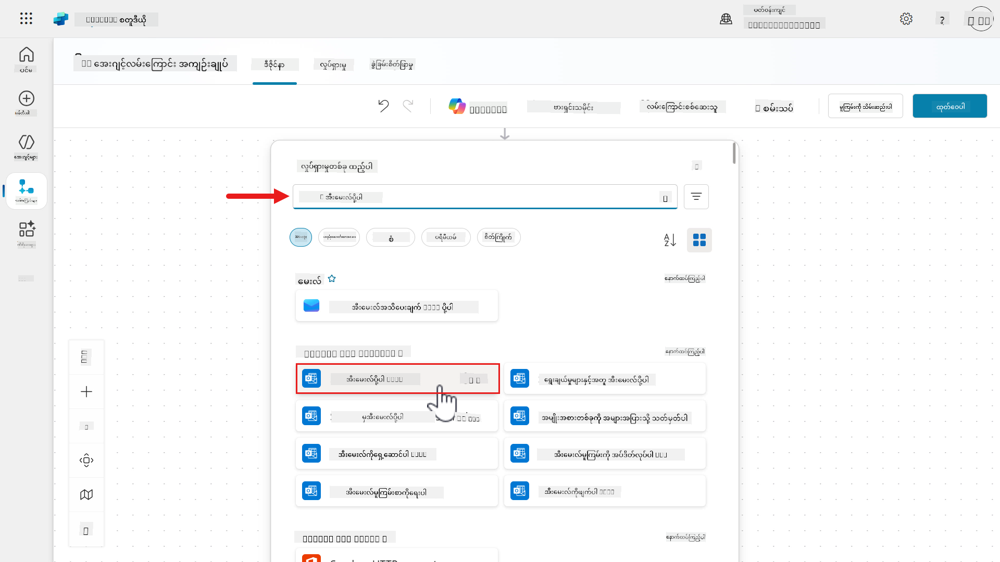

1. Connector action အတွက် connection တစ်ခုဖန်တီးရန်လိုအပ်သည်။ **Sign in** ကိုရွေးချယ်ပါ။

    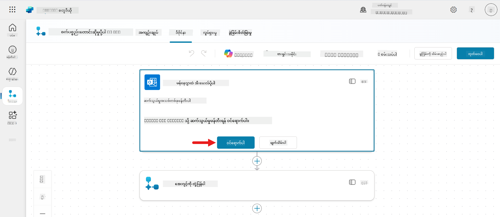

1. သင့် signed in user account ကိုရွေးချယ်ပါ။

    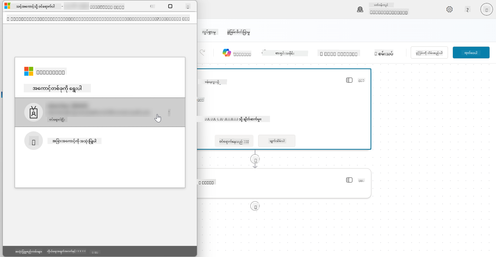

1. **Allow access** ကိုရွေးချယ်ပါ။ Connection တစ်ခုဖန်တီးပြီးပါပြီ။

    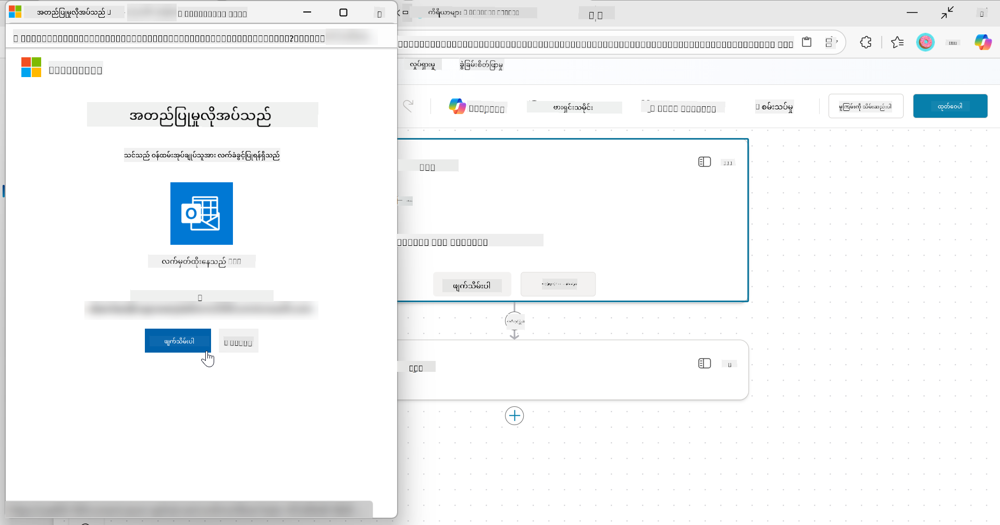

1. Action ကို အောက်ပါအတိုင်း rename လုပ်ပါ။

    ```text
    Send an email to manager
    ```

    Action ၏ input parameter များကိုသတ်မှတ်ပါ။

    **To** input parameter အတွက် သင်ကိုယ်တိုင်ကိုရွေးချယ်ပါ။ သင်၏ Entra ID profile အပေါ်အခြေခံပြီး မန်နေဂျာကိုရယူသော action တစ်ခုကိုအသုံးပြုမည်ဖြစ်သော်လည်း၊ ဤသင်ခန်းစာအတွက် သင်ကိုယ်တိုင်ကိုရွေးချယ်ပါ။

    **Subject** input parameter အတွက် အောက်ပါအတိုင်းရိုက်ထည့်ပါ။

    ```text
    Request type: new device
    ```

    **Body** input parameter အတွက် အောက်ပါအတိုင်းရိုက်ထည့်ပါ။

    ```text
    Hi,

    New device requested from

    Manufacturer:
    Model:
    Link to item in SharePoint
    Additional comments from:

    This is an automated email from Contoso Helpdesk Copilot
    ```

    
    ```

    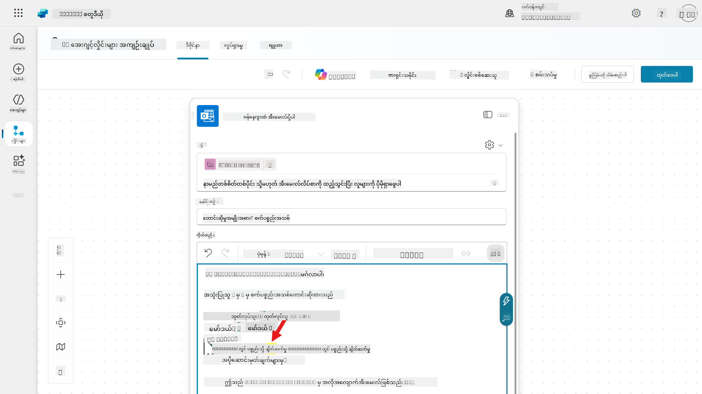

1. `Link to item in SharePoint` text ရဲ့နောက်မှာ click လုပ်ပြီး html anchor tag ကိုပိတ်ပါ။ အောက်ပါကို copy လုပ်ပြီး paste လုပ်ပါ။

    ```text
    </a>
    ```

    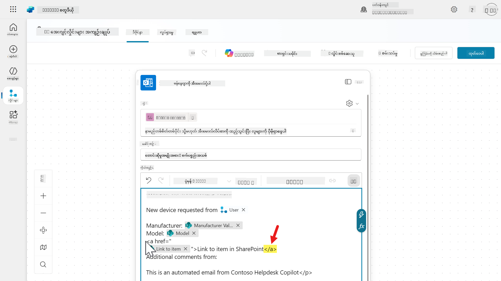

1. Code view ကို toggle လုပ်ဖို့ **&lt;/&gt;** icon ကိုရွေးပါ။

    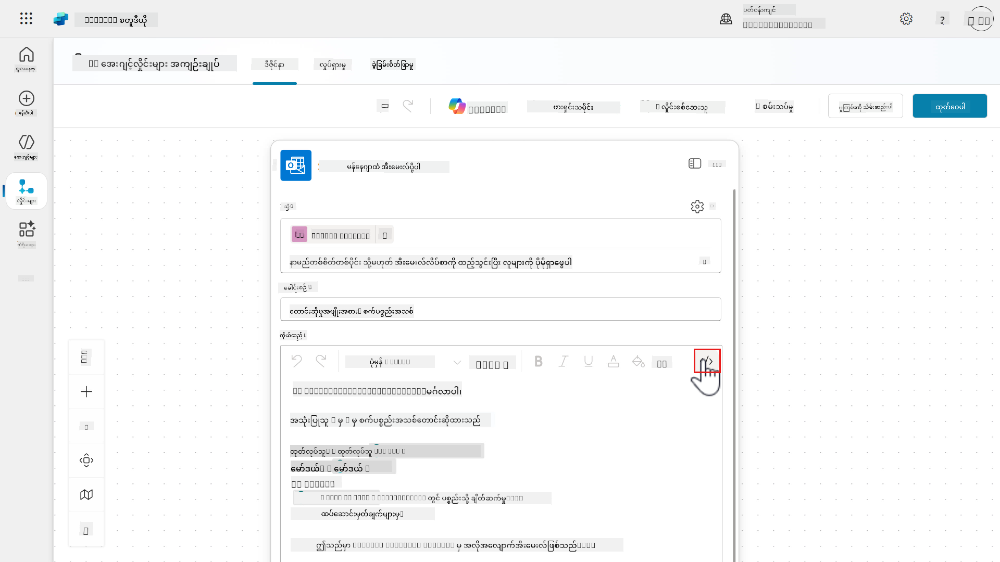

1. ပြန်လည် toggle လုပ်ဖို့ **&lt;/&gt;** icon ကိုထပ်မံရွေးပါ။

    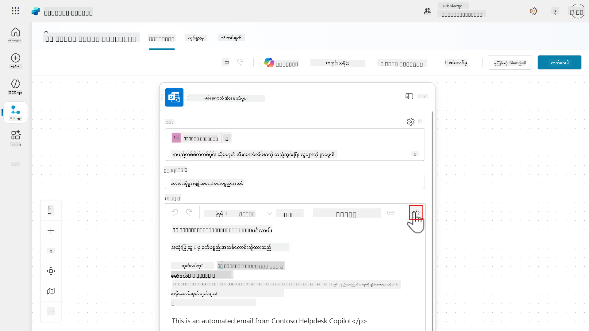

1. `&lt;br&gt;` အပို characters တွေရှိနေတဲ့အတွက် ဖျက်ပါ။

    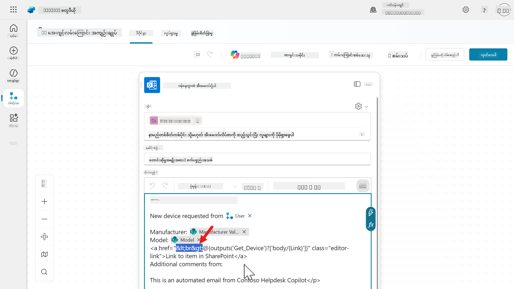

1. Email message body မှာ hyperlink ထည့်တာပြီးဆုံးပါပြီ 😎 Code view ကို toggle လုပ်ဖို့ **&lt;/&gt;** icon ကိုရွေးပါ။

    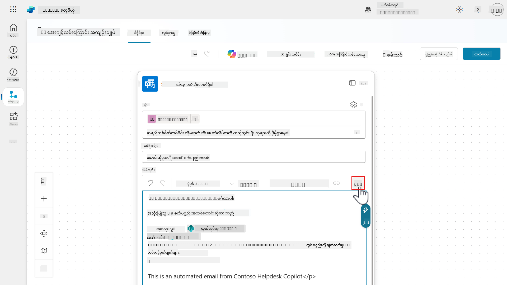

1. `Additional comments from` text ရဲ့ colon character ရဲ့ရှေ့မှာ click လုပ်ပြီး ညာဘက်မှာရှိတဲ့ **lightning bolt icon** သို့မဟုတ် **fx icon** ကိုရွေးပါ။

    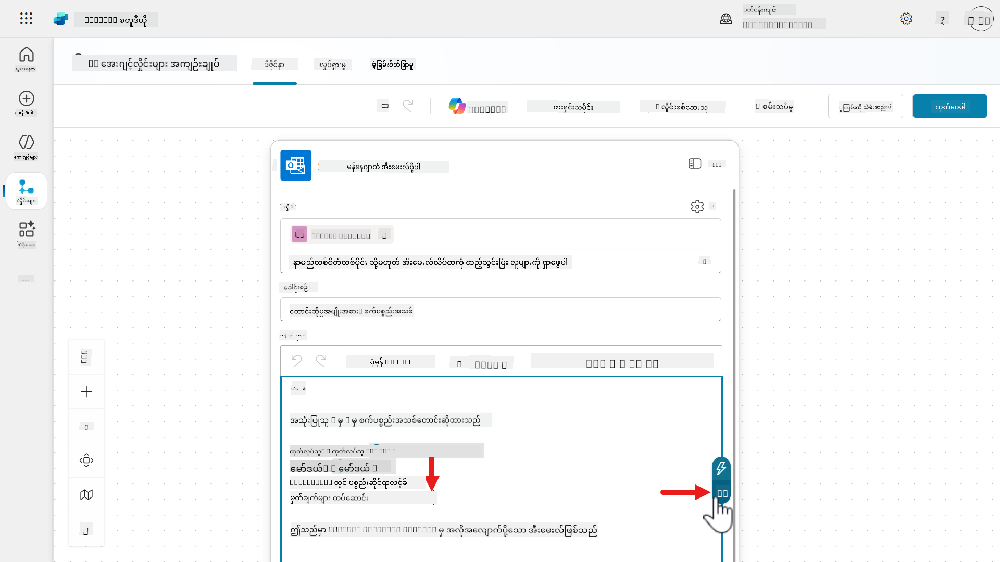

1. Flyout pane ရဲ့ **Dynamic content** tab မှာ search field ထဲမှာ အောက်ပါအတိုင်းရိုက်ထည့်ပါ၊

    ```text
    user
    ```

    Trigger မှ **User** parameter ကိုရွေးပြီး **Add** ကိုရွေးပါ။

    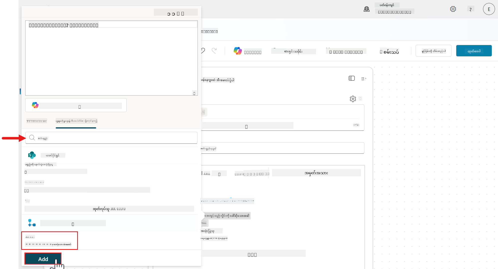

1. User က **Ask an adaptive card** node မှာ Additional Comments ထည့်ထားလားမထည့်ထားဘဲလားဆိုတာကို display လုပ်ဖို့ expression ထည့်ပါမယ်။ ထည့်ထားမယ်ဆိုရင် value ကိုပြပြီး မထည့်ထားဘဲဆိုရင် "None" ကိုပြပါမယ်။

    Colon character ရဲ့နောက်မှာ click လုပ်ပြီး ညာဘက်မှာရှိတဲ့ **lightning bolt icon** သို့မဟုတ် **fx icon** ကိုရွေးပါ။

    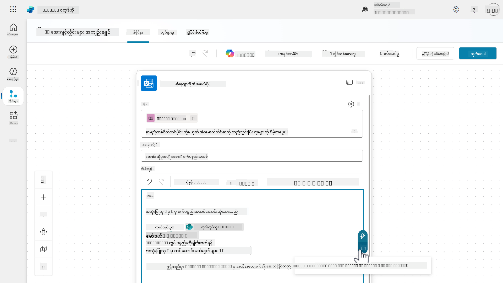

1. Flyout pane ရဲ့ **Function** tab မှာ expression field ရဲ့အပေါ်မှာ အောက်ပါကိုရိုက်ထည့်ပါ၊

    ```text
    if(empty())
    ```

    ဒီ expression မှာ `if` function ကို if-else statement အတွက်အသုံးပြုထားပါတယ်။

    `empty` function ကိုအသုံးပြုထားပြီး string parameter မှာ value ရှိ/မရှိကိုစစ်ဆေးပါတယ်။ Reference လုပ်မယ့် string parameter က trigger မှ `AdditionalComments` input parameter value ဖြစ်ပါတယ်။

    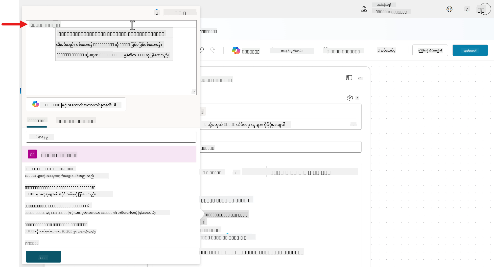

1. `empty` function ရဲ့ brackets အတွင်းမှာ click လုပ်ပါ။ Trigger မှ `AdditionalComments` input parameter ကိုထည့်ပါမယ်။

    **Dynamic content** tab ကိုရွေးပါ။ Search field မှာ အောက်ပါအတိုင်းရိုက်ထည့်ပါ၊

    ```text
    Additional
    ```

    Pane ကိုအောက်သို့ scroll လုပ်ပြီး trigger မှ **AdditionalComments** input ကိုရွေးပါ။ Parameter ကို string parameter အဖြစ် expression မှာထည့်ထားပါပြီ။

    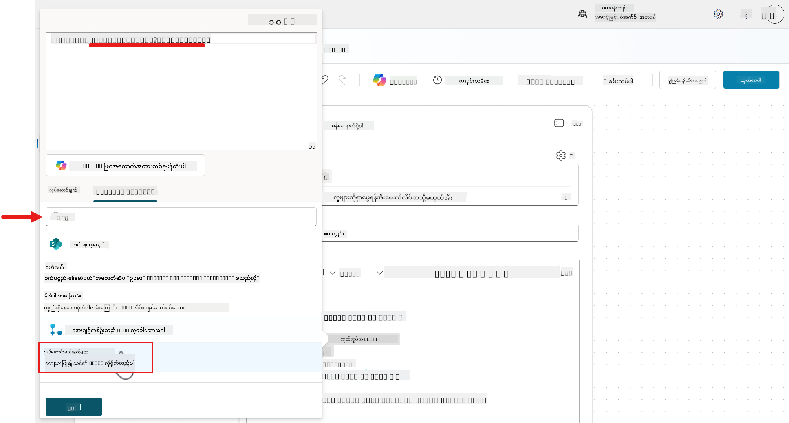

1. **_true_** logic ကို define လုပ်ပါမယ်။ `AdditionalComments` string parameter ကအလွတ်ဖြစ်နေပါက `None` string (text) ကိုပြပါမယ်။

    String parameter ကိုပိတ်ထားတဲ့ bracket ရဲ့နောက်မှာ အောက်ပါကိုရိုက်ထည့်ပါ၊

    ```text
    , 'None',
    ```

    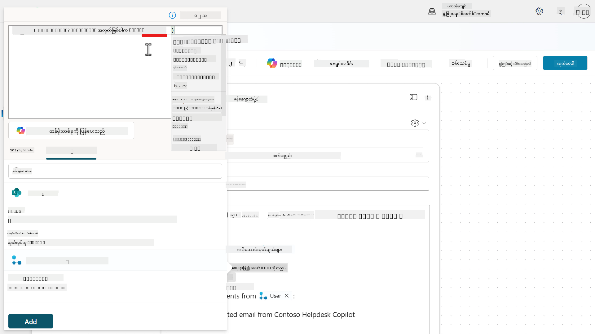

1. **_false_** logic ကို define လုပ်ပါမယ်။ `AdditionalComments` string parameter ကအလွတ်မဖြစ်ပါက trigger မှ **AdditionalComments** input parameter ရဲ့ value ကိုပြပါမယ်။

    > ဒီ value က **Request device** topic ရဲ့ **Ask with adaptive card** node မှ adaptive card ရဲ့ Additional Comments field မှာဖြစ်ပါတယ်။

    **_true_** logic ရဲ့ comma ရဲ့နောက်မှာ **Dynamic content** tab ကိုရွေးပါ။ Search field မှာ အောက်ပါအတိုင်းရိုက်ထည့်ပါ၊

    ```text
    Additional
    ```

    Pane ကိုအောက်သို့ scroll လုပ်ပြီး trigger မှ **AdditionalComments** input ကိုရွေးပါ။ Parameter ကို string parameter အဖြစ် expression မှာထည့်ထားပါပြီ။

    **Body** parameter မှာထည့်ဖို့ **Add** ကိုရွေးပါ။

    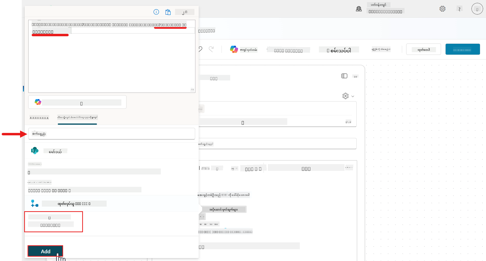

1. အရမ်းကောင်းပါတယ်၊ expression ပြီးဆုံးပါပြီ! Expression ကို **Body** parameter မှာထည့်ထားပြီးဖြစ်ပါတယ်။ နောက်ဆုံးလိုင်းကို Italics အဖြစ် format လုပ်ပါ။

    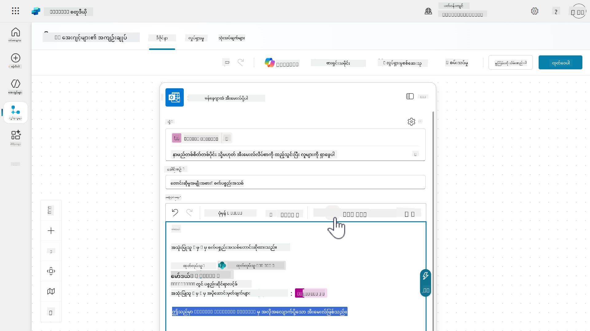

1. **Respond to the agent** action ကို update လုပ်ပြီး **Get item** action မှ **Model value** parameter ရဲ့ value ကို agent ထံပြန်ပို့ပါမယ်။

    Mouse ရဲ့ဘယ်ဘက် key ကိုဖိထားပြီး designer မှာအပေါ်ဘက်သို့ရွှေ့ပါ။ **Respond to the agent** action ကိုရှာပါ။

    **Respond to the agent** action ကိုရွေးပြီး output type အဖြစ် **Text** ကိုရွေးပါ။

    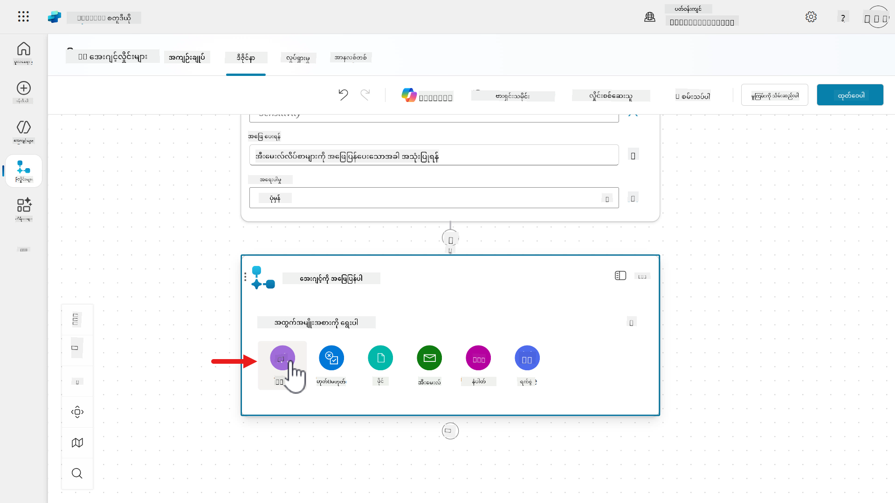

1. Output ရဲ့ name အဖြစ် အောက်ပါကိုရိုက်ထည့်ပါ။

    ```text
    ModelValue
    ```

    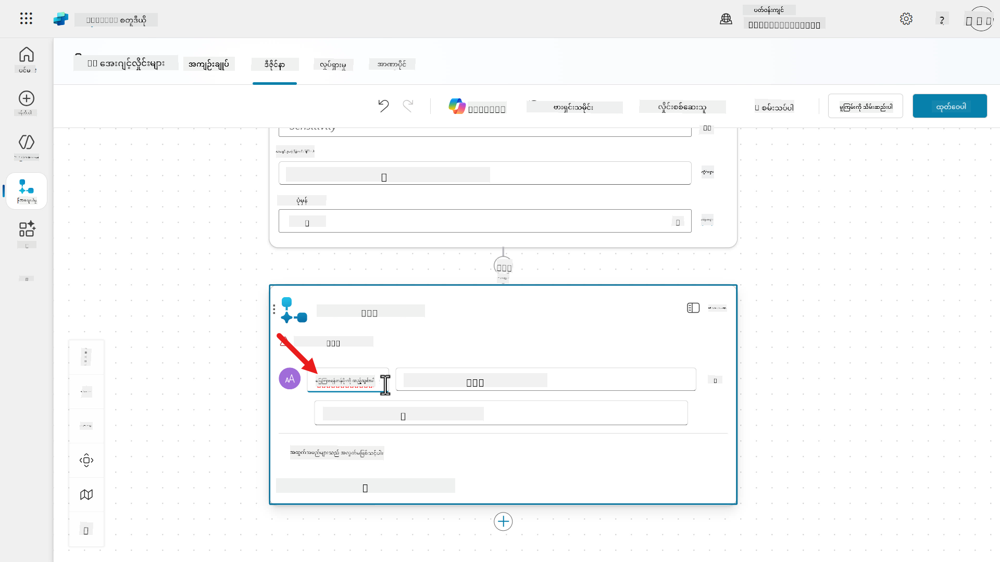

1. Value field ကိုရွေးပြီး ညာဘက်မှာရှိတဲ့ **lightning bolt icon** သို့မဟုတ် **fx icon** ကိုရွေးပါ။

    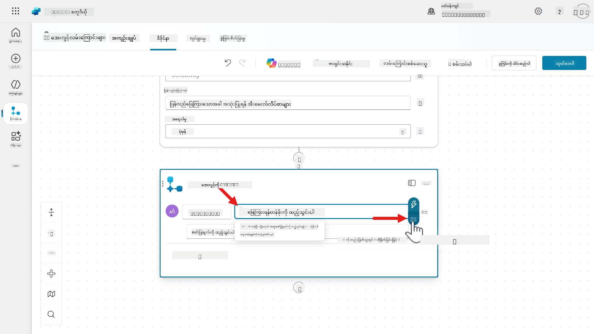

1. Flyout pane ရဲ့ **Dynamic content** tab မှာ search field ထဲမှာ အောက်ပါအတိုင်းရိုက်ထည့်ပါ၊

    ```text
    model
    ```

    **Get item** action မှ **Model** parameter ကိုရွေးပြီး **Add** ကိုရွေးပါ။

    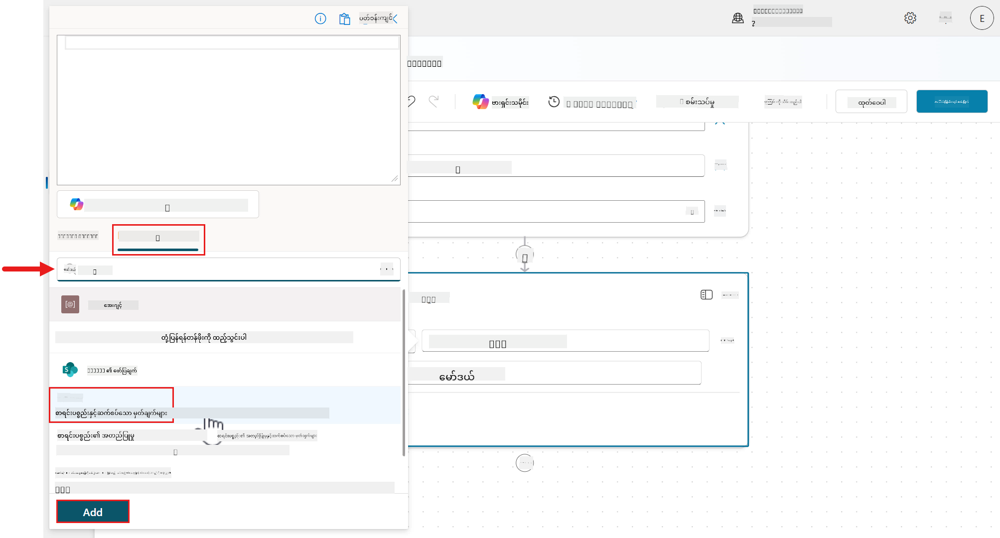

1. **Model** parameter က text output ရဲ့ value ဖြစ်ပါပြီ။ **Save draft** ကိုရွေးပြီး agent flow ကို save လုပ်ပါ။

    Agent flow ကိုပြီးစီးအောင်လုပ်ထားပါပြီ 👏🏻

    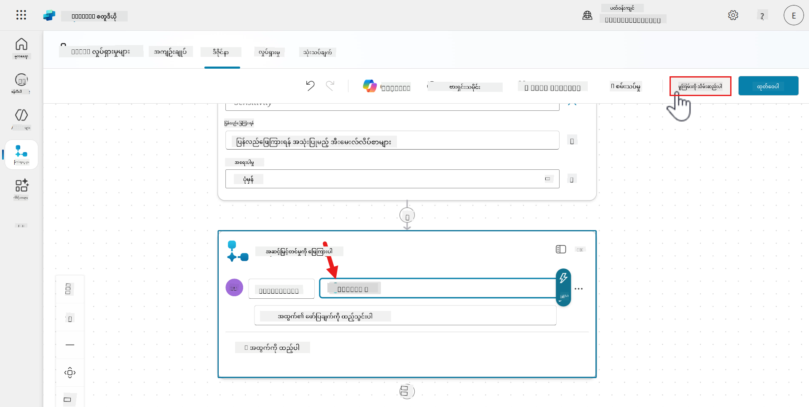

1. Publish လုပ်မည့်အကြို agent flow ကို update လုပ်ပါမယ်။ **Overview** tab ကိုရွေးပြီး **Edit** ကိုရွေးပါ။

    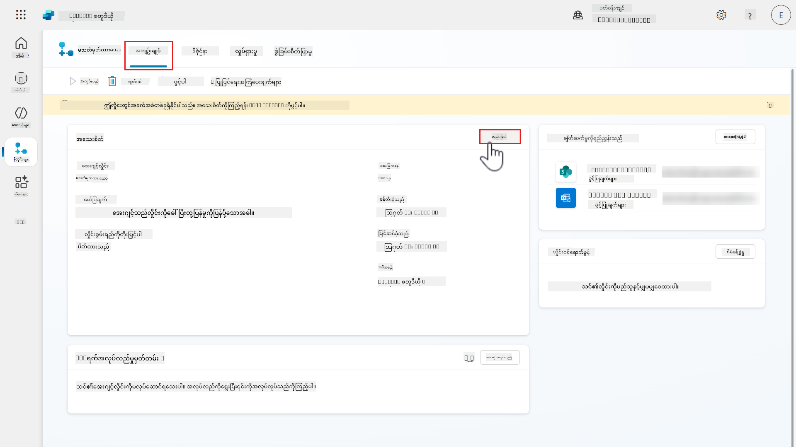

1. **Flow name** အဖြစ် အောက်ပါကို copy လုပ်ပြီး paste လုပ်ပါ။

    ```text
    Send device request email
    ```

    **Description** အတွက် **refresh icon** ကိုရွေးပြီး trigger နဲ့ actions တွေကိုအခြေခံပြီး AI က automatically generate လုပ်ထားတဲ့ description ကိုအသုံးပြုပါ။

    **Save** ကိုရွေးပြီး agent flow ရဲ့ name နဲ့ description ကို save လုပ်ပါ။

    

1. **Designer** tab ကိုရွေးပြီး **Publish** ကိုရွေးပါ။ Agent flow ကို publish လုပ်ပြီး **Request device** topic ရဲ့ node အဖြစ်ထည့်နိုင်ပါပြီ။

    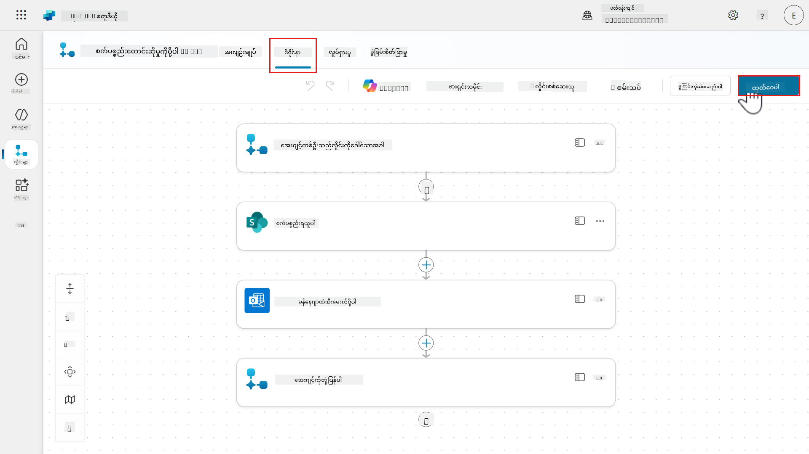

1. Agent flow publish လုပ်ပြီးကြောင်းအတည်ပြုတဲ့ message တစ်ခုမကြာမီပေါ်လာပါမယ်။

    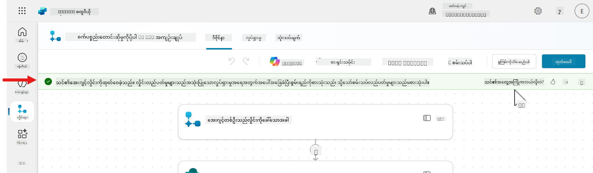

### 9.2 Agent flow ကို topic မှာထည့်ပါ

Agent flow ကို **Request device** topic မှာထည့်ပါမယ်။

1. ဘယ်ဘက် menu မှာ **Agents** ကိုရွေးပြီး **Contoso Helpdesk Agent** ကိုရွေးပါ။

    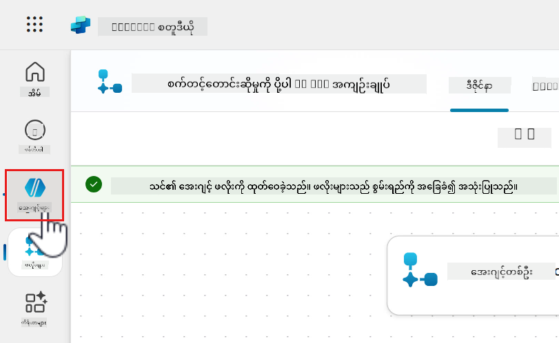

1. **Topics** tab ကိုရွေးပါ။

    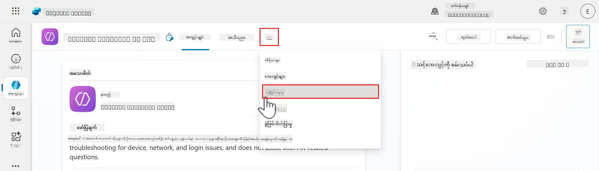

1. **Request device** topic ကိုရွေးပါ။

    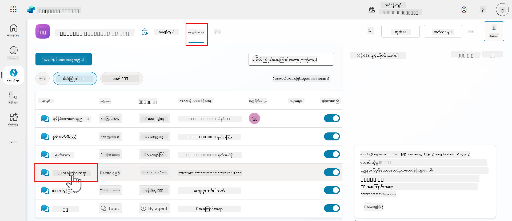

1. **Ask with adaptive card** node ကိုအောက်သို့ scroll လုပ်ပြီး node အသစ်တစ်ခုထည့်ပါ။

    **Add a tool** ကိုရွေးပြီး flyout pane ရဲ့ **Basic tools** tab မှာ အခု publish လုပ်ထားတဲ့ **Send device request email** agent flow ကိုရွေးပါ။

    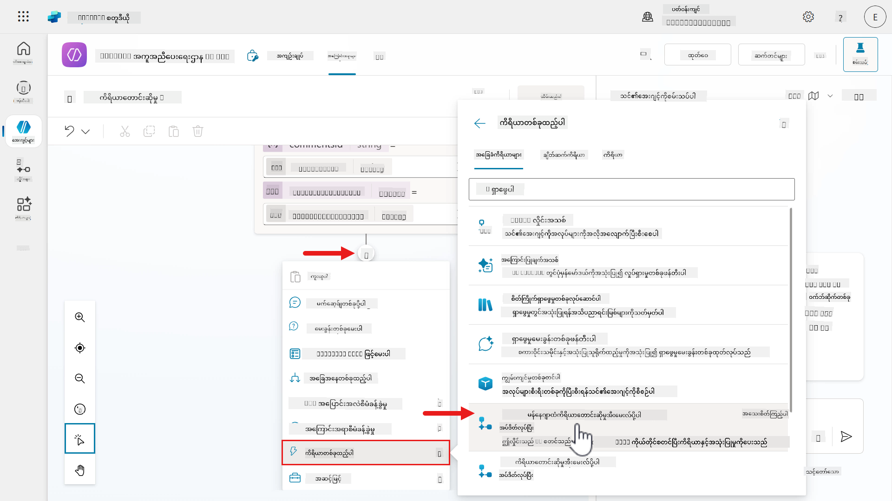

1. Agent flow ရဲ့ trigger inputs အတွက် **Ask with adaptive card** node မှ variable outputs တွေကိုရွေးရပါမယ်။

    **DeviceSharePointId** input အတွက် **ellipsis (...) icon** ကိုရွေးပါ။

    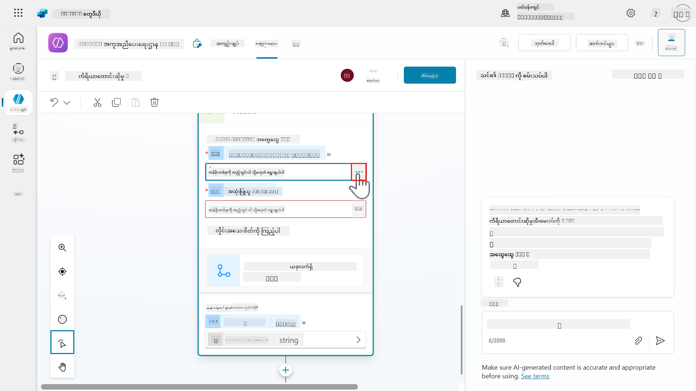

1. **Ask with adaptive card** node မှ outputs တွေထဲက **deviceSelectionId** variable ကိုရွေးပါ။

    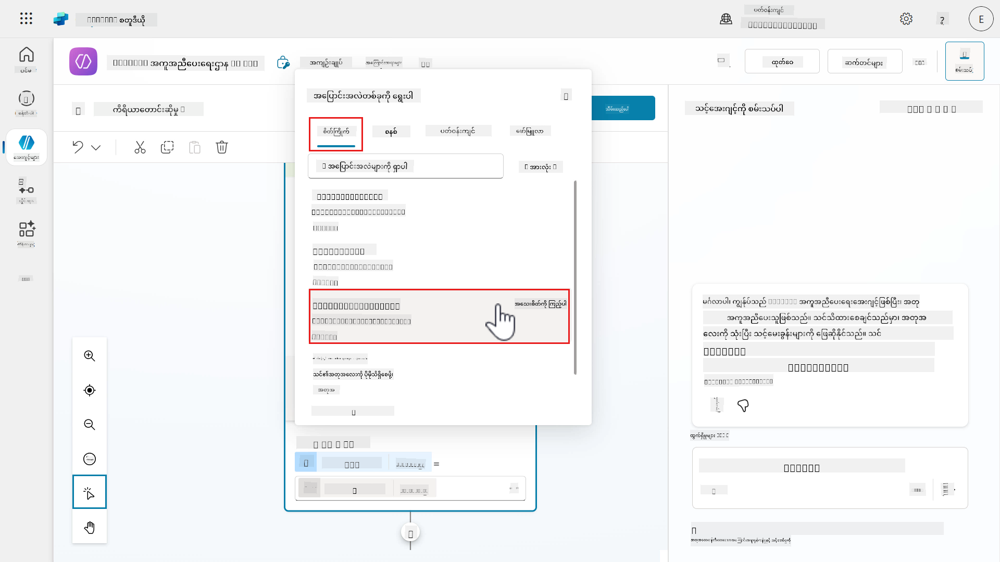

1. နောက်တစ်ခု **User** input အတွက် **ellipsis (...) icon** ကိုရွေးပါ။

    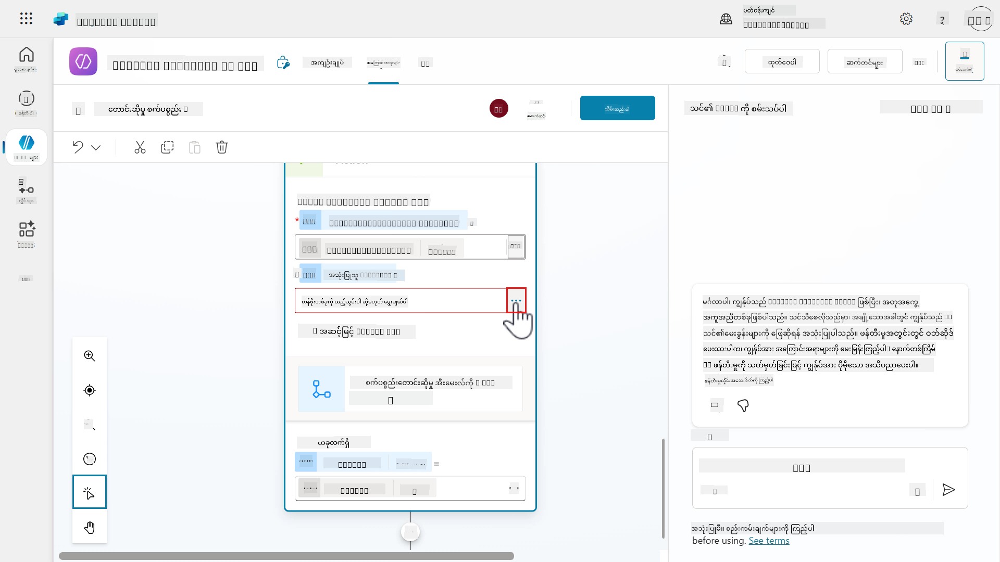

1. Flyout variable pane ရဲ့ **System** tab ကိုရွေးပြီး **User.DisplayName** ကိုရွေးပါ။ ဒီ variable က agent နဲ့အလုပ်လုပ်နေတဲ့ internal user ရဲ့ display name ကိုသိမ်းထားပါတယ်။

    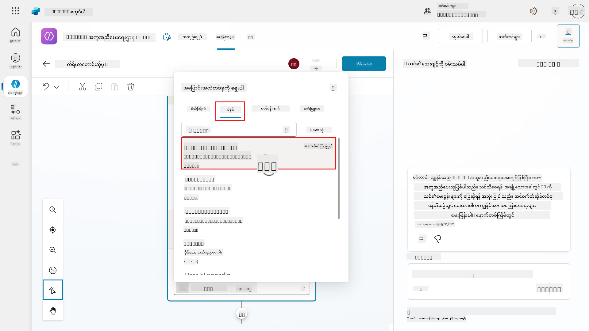

1. နောက်တစ်ခု **Advanced inputs** ကိုချဲ့ဖို့ **greater than icon** ကိုရွေးပြီး **AdditionalComments** input ကိုကြည့်ပါ။

    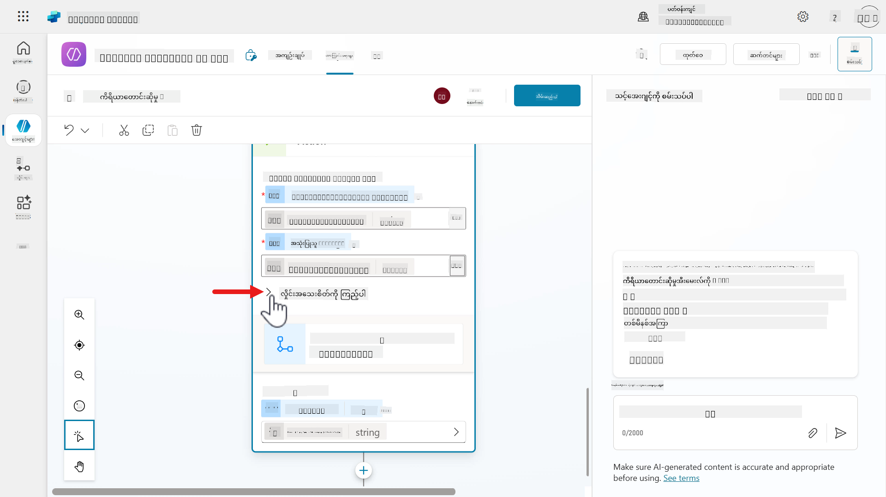

1. AdditionalComments input အတွက် **ellipsis (...) icon** ကိုရွေးပါ။

    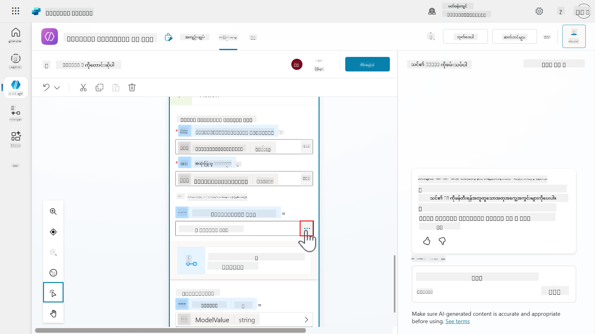

1. Flyout variable pane ရဲ့ **Formula** tab ကိုရွေးပြီး expand icon ကိုရွေးပါ။ Power Fx expression ကိုအသုံးပြုပါမယ်။

    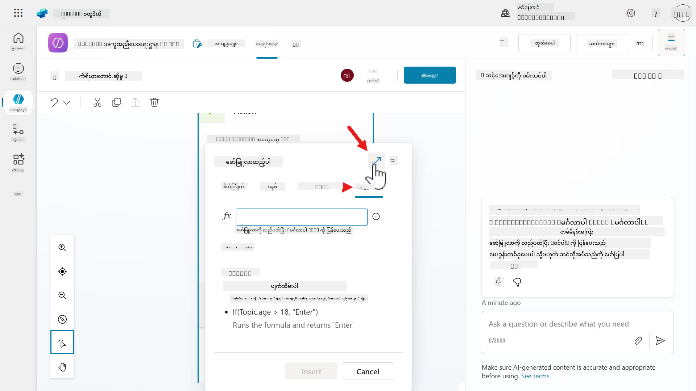

1. Agent flow ရဲ့ expression နဲ့တူတဲ့ conditional check ကို _if_ function အသုံးပြုပြီး Power Fx functions ကိုအသုံးပြုပါမယ်။  
    - Value မရှိပါက no value ထည့်ပါမယ်၊  
    - Value ရှိပါက `commentsId` output variable ရဲ့ value ကို **Ask with adaptive card** node မှထည့်ပါမယ်။

    Power Fx field မှာ အောက်ပါ functions တွေကိုရိုက်ထည့်ပါ၊

    ```text
    If(IsBlank())
    ```

ဒီအထဲမှာ `If` function ကို if-else statement အတွက် အသုံးပြုထားပါတယ်။

နောက်ထပ်အသုံးပြုထားတဲ့ function က `IsBlank` ဖြစ်ပြီး string parameter ထဲမှာ value ရှိ/မရှိ စစ်ဆေးပေးပါတယ်။ ရည်ညွှန်းမယ့် string parameter က **Ask with adaptive card** node ထဲက `commentsId` output variable ဖြစ်ပါတယ်။

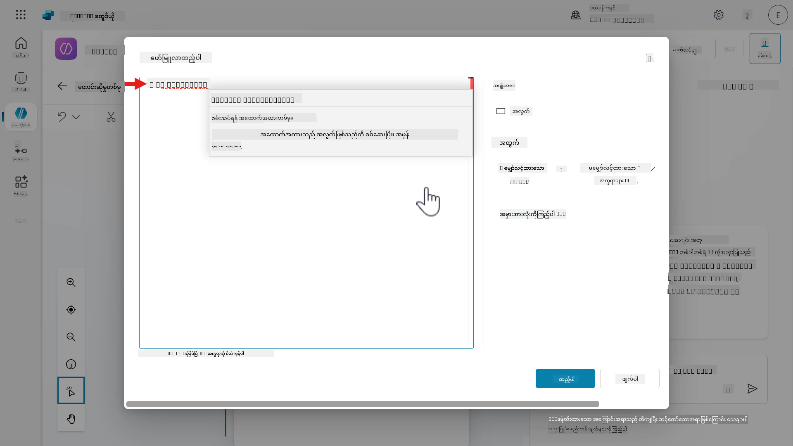

1. နောက်တစ်ခုမှာ `IsBlank` function ရဲ့ **brackets အတွင်း** ကို click လုပ်ပါ။ **Ask with adaptive card** node ထဲက `commentsId` output variable ကို ထည့်သွင်းဖို့ ဖြစ်ပါတယ်။

    Brackets အတွင်းမှာ အောက်ပါအတိုင်း ထည့်သွင်းပါ၊

    ```text
    Topic.commentsId
    ```

    ပြီးရင် bracket အပြီးမှာ comma တစ်ခု ထည့်ပါ။

    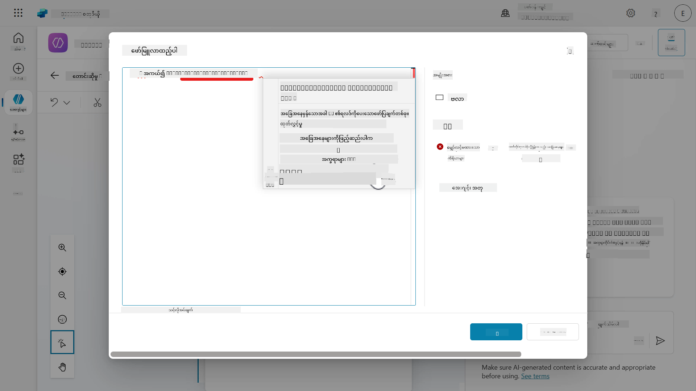

1. နောက်တစ်ခုမှာ logic ကို သတ်မှတ်ပါ။

    - **_true_** ဖြစ်တဲ့အခါ - `Topic.commentsId` string parameter က အလွတ်ဖြစ်ရင် value မထည့်ပါ။
    - **_false_** ဖြစ်တဲ့အခါ - `Topic.commentsId` string parameter က အလွတ်မဟုတ်ရင် `commentsId` variable ရဲ့ value ကို ထည့်ပါ။

    String parameter ကို ပိတ်ထားတဲ့ bracket အပြီးမှာ အောက်ပါအတိုင်း ထည့်သွင်းပါ၊

    ```text
    "", Topic.commentsId)
    ```

    Power Fx expression က အောက်ပါအတိုင်း ဖြစ်သင့်ပါတယ်၊

    ```text
    If(IsBlank(Topic.commentsId), "", Topic.commentsId)
    ```

    ကောင်းပါတယ်၊ expression ပြီးဆုံးပါပြီ! 🙌🏻 အခု **Insert** ကို ရွေးပြီး agent flow ရဲ့ input parameter ကို Power Fx expression အဖြစ် သတ်မှတ်ပါ။

    

1. **Save** the topic.

### 9.3 Request device topic ကို အသုံးပြုသူအတွေ့အကြုံ ပိုမိုကောင်းမွန်စေရန် node အများအပြား ထည့်သွင်းပါ

နောက်တစ်ခုမှာ node နှစ်ခု ထည့်သွင်းပါမယ်။

- **Send a message** - ဒီဟာက အသုံးပြုသူ ရွေးချယ်ထားတဲ့ device ကို ရည်ညွှန်းပြီး သူတို့ရဲ့ request ကို submit လုပ်ပြီးကြောင်း အတည်ပြုတဲ့ message အဖြစ် လုပ်ဆောင်ပါမယ်။
- **Topic management** - စကားဝိုင်းကို ပိတ်ဖို့ **End of conversation** node ကို redirect လုပ်ပါမယ်။

စတင်ကြပါစို့!

1. Agent flow node ရဲ့ **plus + icon** ကို ရွေးပြီး **Send a message** node ကို ရွေးပါ။

    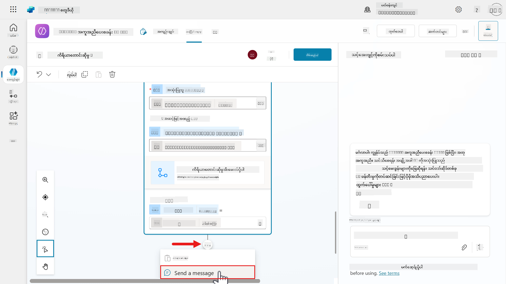

1. Message field ထဲမှာ အောက်ပါအတိုင်း ထည့်သွင်းပါ၊

    ```text
    Thanks
    ```

    ပြီးရင် **Insert variable** ကို ရွေးပြီး အသုံးပြုသူရဲ့ နာမည်ကို ရည်ညွှန်းပါ။

    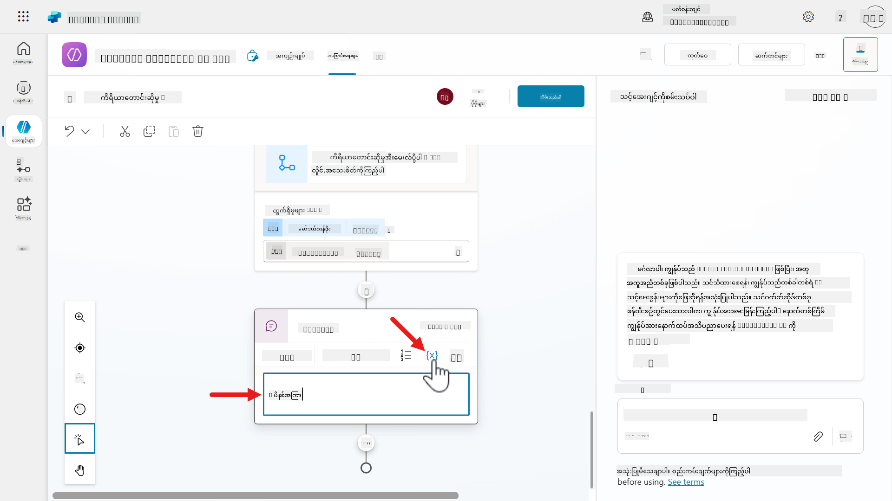

1. **System** tab ကို ရွေးပြီး search field ထဲမှာ `User` ကို ရှာပါ။ **User.DisplayName** variable ကို ရွေးပါ။

    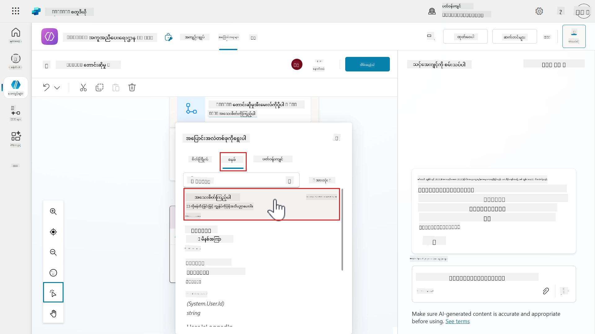

1. Message field ထဲမှာ အောက်ပါအတိုင်း ထည့်သွင်းပါ၊

    ```text
    . Your selected device,
    ```

    ပြီးရင် **Insert variable** ကို ရွေးပြီး ဒီတစ်ခါမှာ **Custom** tab ထဲက **ModelValue** variable ကို ရွေးပါ။

    Message ကို အောက်ပါအတိုင်း ပြီးစီးအောင် ထည့်သွင်းပါ။

    ```text
    , has been submitted and will be reviewed by your manager.
    ```

    Message က အောက်ပါအတိုင်း ဖြစ်သင့်ပါတယ်။

    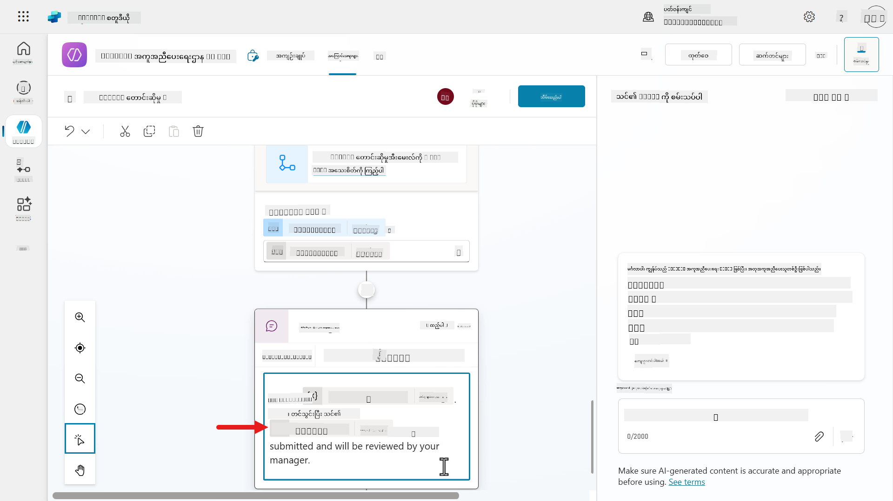

1. နောက်ဆုံးမှာ **Send a message** node ရဲ့ **plus + icon** ကို ရွေးပြီး **Topic management** ကို ရွေးပါ၊ **Go to another topic** ကို ရွေးပြီး **End of Conversation** ကို ရွေးပါ။

    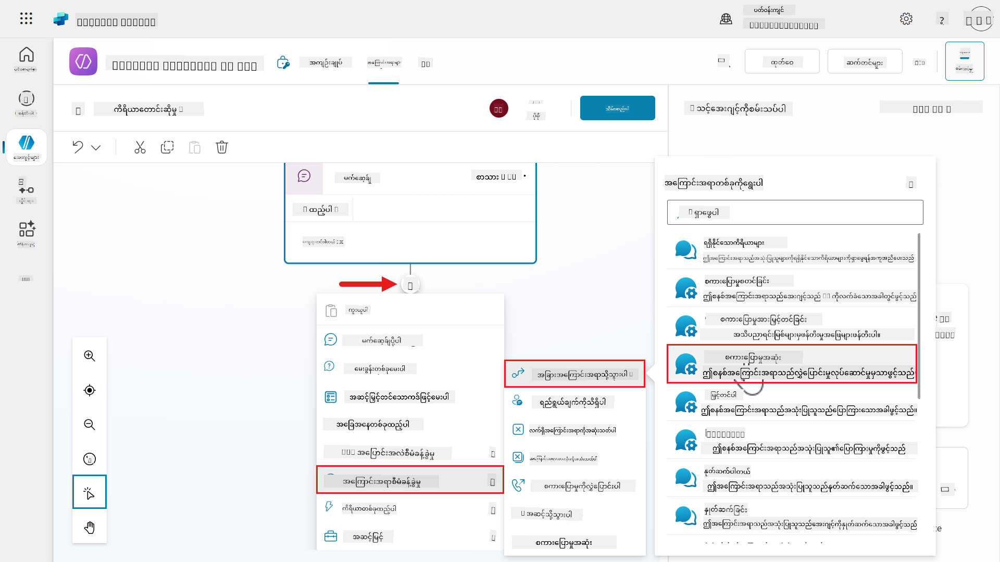

1. **Save** the topic.

    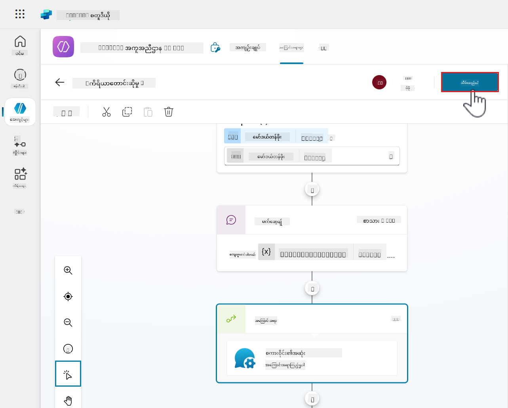

### 9.4 Agent ကို အခြေအနေအမျိုးမျိုးနဲ့ စမ်းသပ်ပါ

ကောင်းပါတယ်!!! 😁 အခုတော့ agent ကို စမ်းသပ်နိုင်ပါပြီ။

#### 9.4.1 Device တစ်ခုကို request လုပ်ပြီး adaptive card ထဲမှာ comment ထည့်ပါ

1. **Refresh** the test pane, **activity map** icon ကို ရွေးပြီး agent ကို အောက်ပါအတိုင်း message ထည့်ပါ။

    ```text
    I need a laptop
    ```

    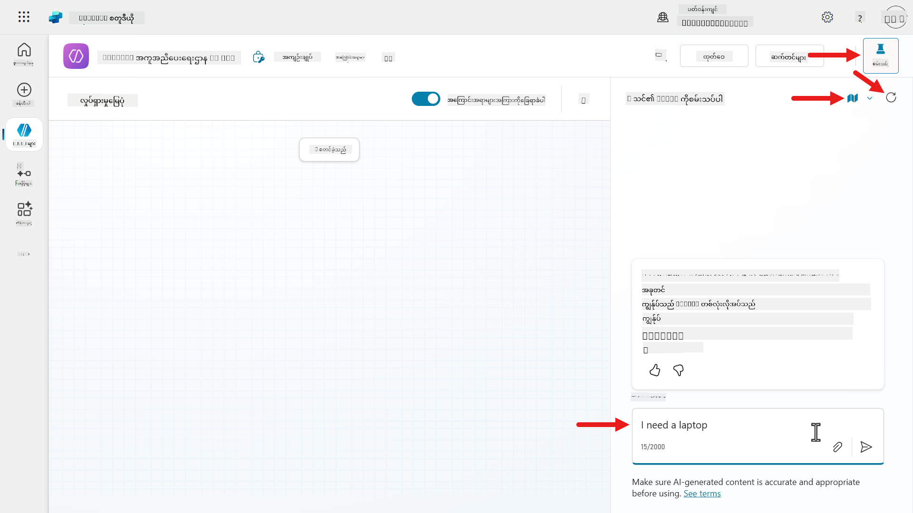

1. Agent က **Available devices** ကို trigger လုပ်ပြီး ရနိုင်တဲ့ device တွေကို ပြန်လည်ပြောပြပါလိမ့်မယ်။ Device request လုပ်ချင်ပါသလားဆိုတဲ့ မေးခွန်းကို အောက်ပါအတိုင်း ဖြေပါ။

    ```text
    Yes
    ```

    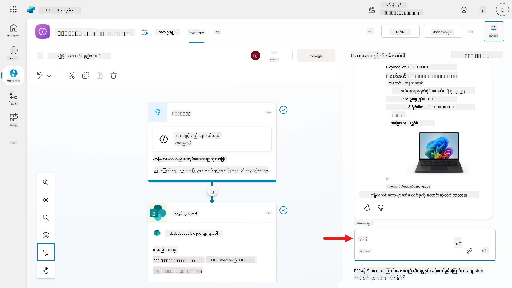

1. Agent က **Request device** ကို invoke လုပ်ပြီး adaptive card ကို agent message ထဲမှာ ပြသထားတာကို သတိပြုပါ။

    **Surface Laptop 15** device ကို ရွေးပြီး အောက်ပါအတိုင်း comment ထည့်ပါ။

    ```text
    I need 16GB of RAM please
    ```

    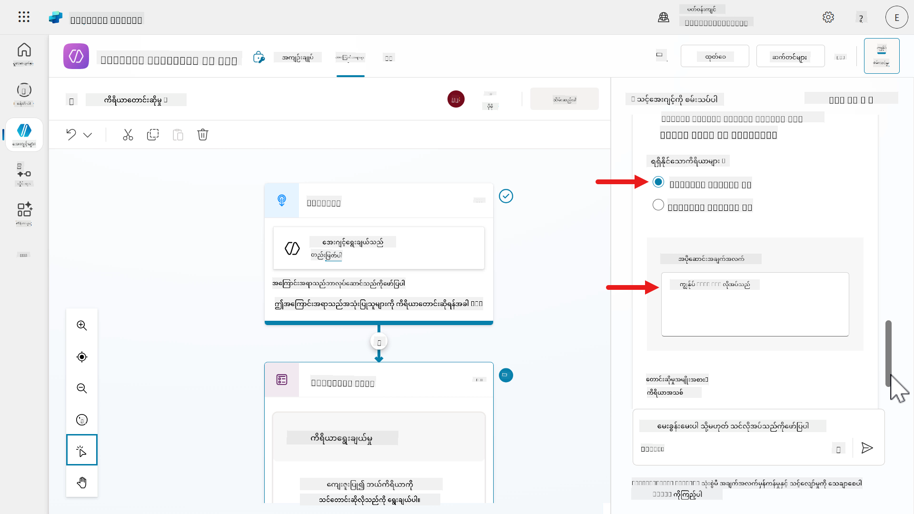

1. **Submit Request** button ကို ရွေးပြီး adaptive card ကို agent ဆီကို submit လုပ်ပါ။

    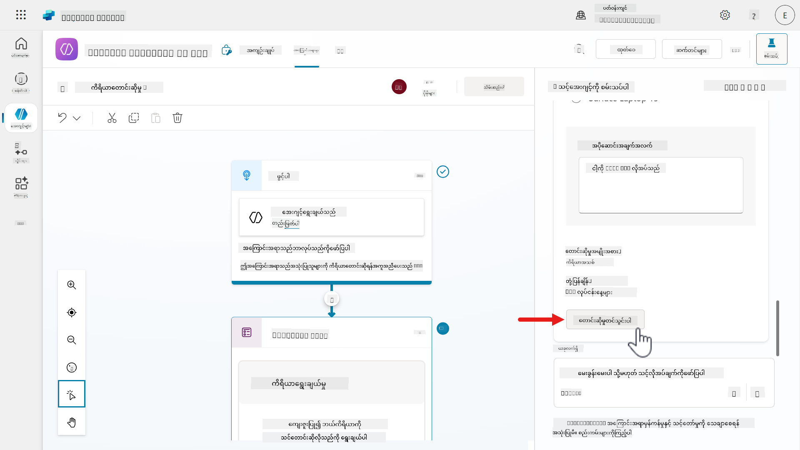

1. Agent က credentials ကို အသုံးပြုဖို့ connection authentication အတွက် **Allow** ကို ရွေးပါ။

    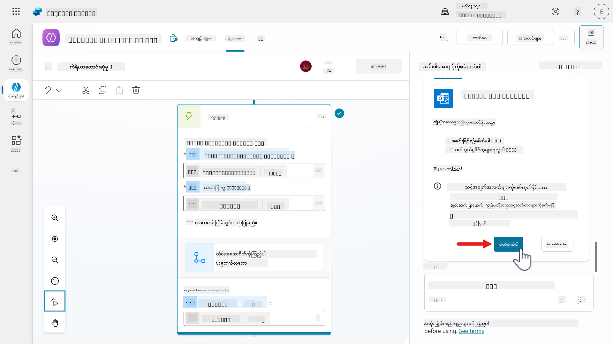

1. Agent က model ရွေးချယ်ထားတာကို အတည်ပြုတဲ့ message ကို ပြပြီး **End of Conversation** topic ကို redirect လုပ်ပါလိမ့်မယ်။ အရမ်းကောင်းပါတယ်!

    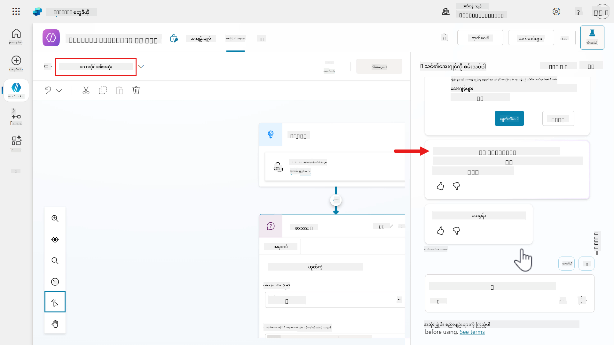

1. **End of Conversation** topic ရဲ့ အခြားအပိုင်းကို verify လုပ်ဖို့ **Yes** ကို ရွေးပါ။

    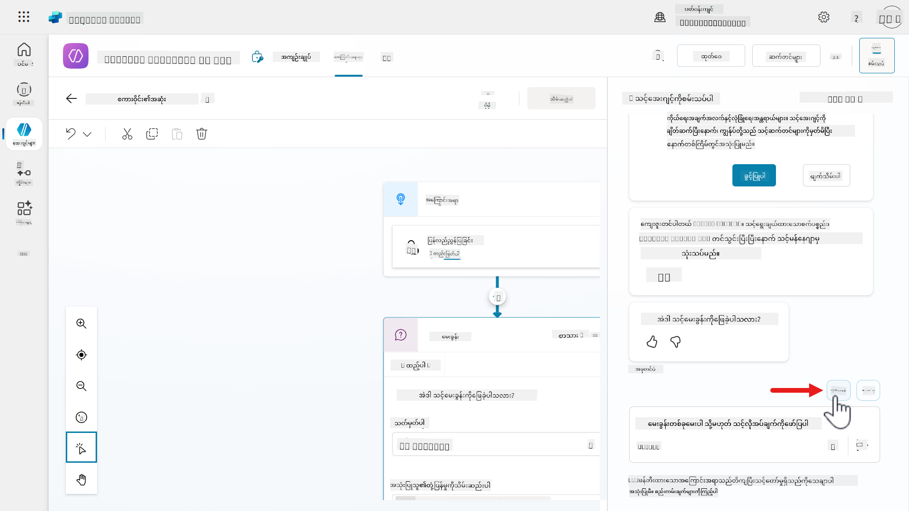

1. Rating scale card ထဲမှာ rating star တစ်ခုခုကို ရွေးပြီး အတွေ့အကြုံကို rate လုပ်ပါ။

    Agent က **End of Conversation** topic ရဲ့ နောက်ဆုံး **Question** node ကို ဆက်လုပ်ပါလိမ့်မယ်။ **No** ကို ရွေးပါ။

    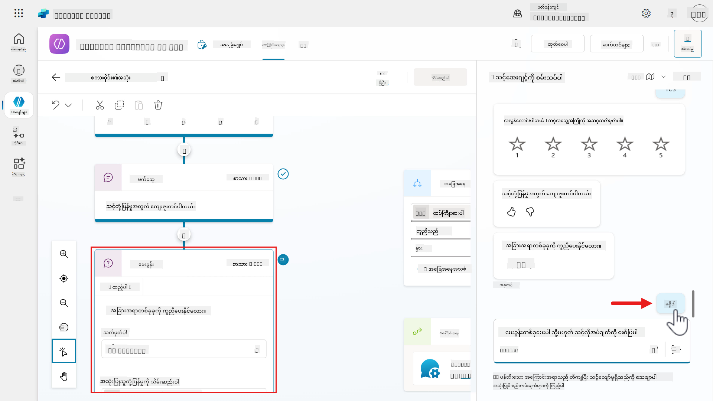

1. Topic က ပြီးဆုံးပြီး test pane ထဲမှာ နောက်ဆုံး message ကို ပြသပါလိမ့်မယ်။

    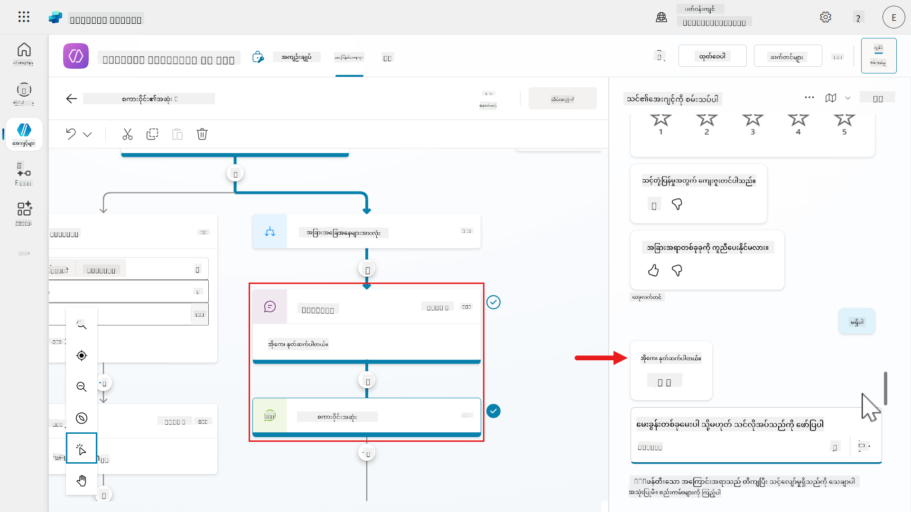

1. Email account ရဲ့ Inbox ကို စစ်ဆေးပြီး agent flow က manager ကို ပို့ထားတဲ့ email ကို ကြည့်ပါ။ ရွေးထားတဲ့ device ရဲ့ အသေးစိတ်အချက်အလက်နဲ့ adaptive card ထဲမှာ ထည့်ထားတဲ့ note ကို တွေ့နိုင်ပါတယ်။

    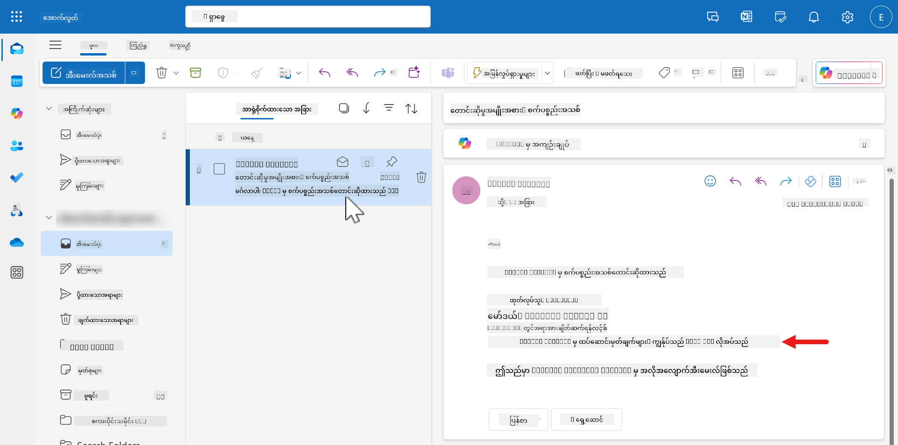

1. Hyperlink ကို click လုပ်ပြီး browser မှာ SharePoint item ကို load လုပ်ပါ။ အရမ်းကောင်းပါတယ်!

    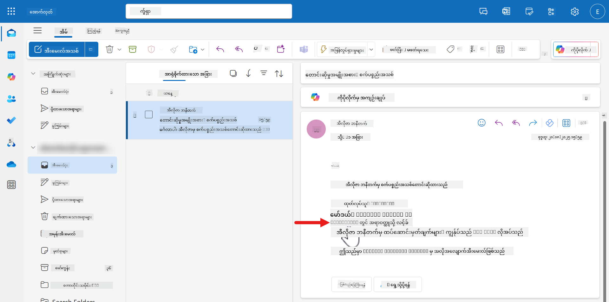

#### 9.4.2 Adaptive card ထဲမှာ comment မထည့်ဘဲ device request လုပ်ပါ

အခုတော့ comment မထည့်တဲ့အခြေအနေကို စမ်းသပ်ပါမယ်။

1. အောက်ပါအတိုင်း အဆင့်တွေကို ထပ်လုပ်ပါ၊

    - **Refresh** the test pane, **activity map** icon ကို ရွေးပါ
    - Message ကို `I need a laptop` အဖြစ် ထည့်ပါ
    - Device request လုပ်ချင်ပါသလားဆိုတဲ့ မေးခွန်းကို `Yes` ဖြေပါ

    

1. ဒီတစ်ခါမှာ **Surface Laptop 13** device ကို ရွေးပြီး comment မထည့်ပါ။

    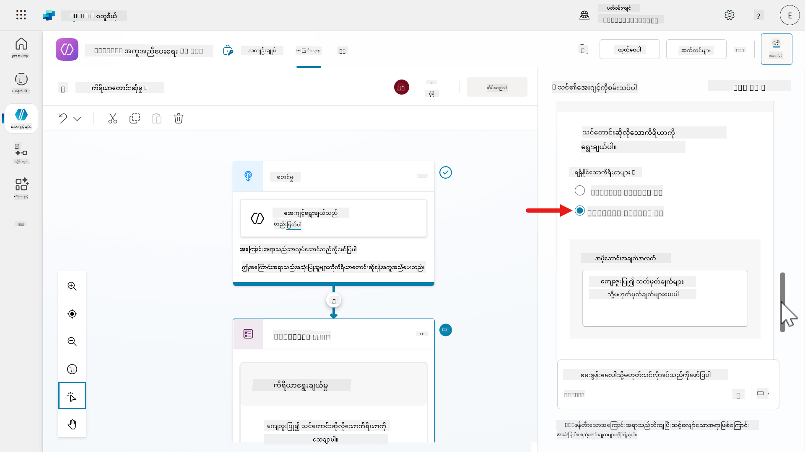

1. **Submit Request** button ကို ရွေးပြီး request ကို submit လုပ်ပါ။

    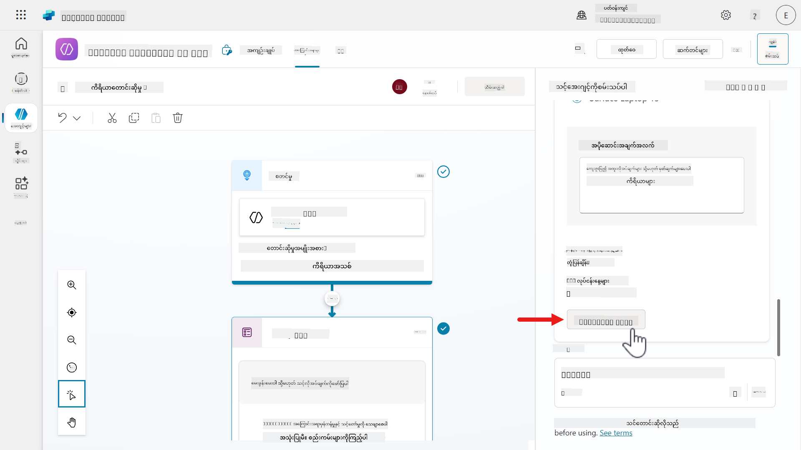

1. ဒီတစ်ခါ Inbox ထဲမှာ ရရှိတဲ့ email မှာ comment အဖြစ် **None** ကို ပြသပါလိမ့်မယ်။

    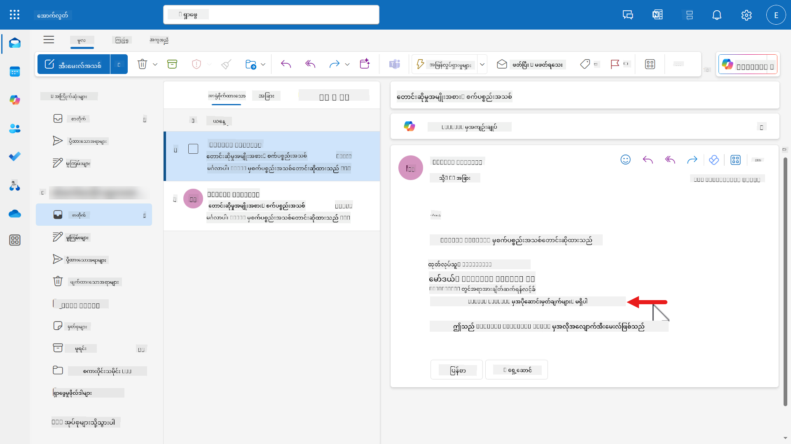

#### 9.4.3 Device request မလုပ်ပါ

နောက်ဆုံး scenario က device request မလုပ်တဲ့အခြေအနေကို စမ်းသပ်ပါမယ်၊ agent instructions အတိုင်း **Goodbye** topic ကို invoke လုပ်သင့်ပါတယ်။

1. အောက်ပါအတိုင်း အဆင့်တွေကို ထပ်လုပ်ပါ၊

    - **Refresh** the test pane, **activity map** icon ကို ရွေးပါ
    - Message ကို `I need a laptop` အဖြစ် ထည့်ပါ
    - Device request လုပ်ချင်ပါသလားဆိုတဲ့ မေးခွန်းကို `No` ဖြေပါ

    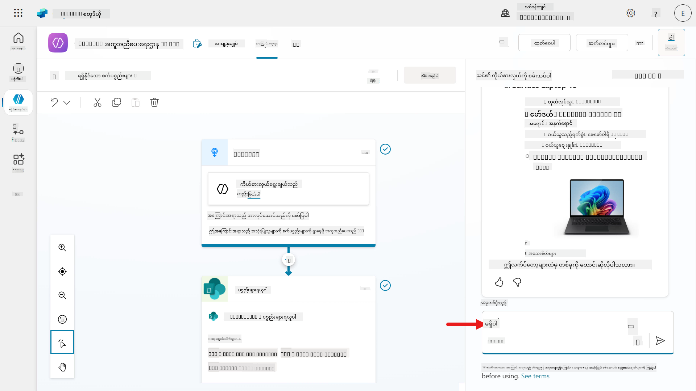

1. Agent က **Goodbye** topic ကို invoke လုပ်ပြီး topic ထဲမှာ သတ်မှတ်ထားတဲ့ မေးခွန်းကို မေးပါလိမ့်မယ်။

    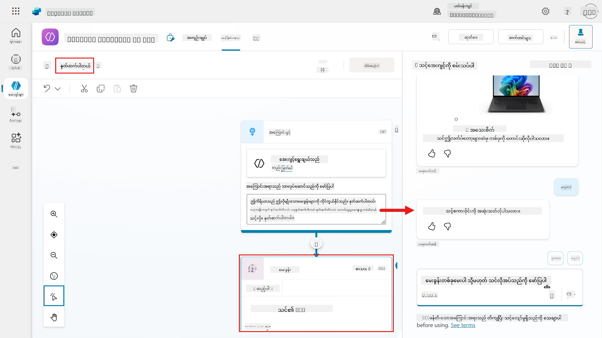

## ✅ Mission Complete

ဂုဏ်ယူပါတယ်! 👏🏻 Agent flow ကို ဘယ်လိုတည်ဆောက်ရမလဲ၊ **Request device** topic ထဲမှာ ထည့်သွင်းရမလဲ၊ agent ကို topic တစ်ခုကနေ တစ်ခုကို redirect လုပ်ရမလဲ ဆိုတာကို သင်ယူပြီးပါပြီ။

ဒီဟာက **Lab 09 - Add an agent flow for automation and enhance topic capabilities** ရဲ့ နောက်ဆုံးအပိုင်းဖြစ်ပါတယ်၊ အောက်ပါ link ကို ရွေးပြီး နောက်ဆုံး lesson ကို ဆက်လက်လေ့လာပါ။ ဒီ lab ရဲ့ use case ကို နောက်ဆုံး lesson ရဲ့ lab မှာ ဆက်လက်တိုးချဲ့ပါမယ်။

⏭️ [Move to **Add Event Triggers - Enable autonomous agent capabilities** lesson](../10-add-event-triggers/README.md)

## 📚 Tactical Resources

🔗 [Introducing agent flows: Transforming automation with AI-first workflows](https://www.microsoft.com/microsoft-copilot/blog/copilot-studio/introducing-agent-flows-transforming-automation-with-ai-first-workflows/)

🔗 [Agent flows overview](https://learn.microsoft.com/microsoft-copilot-studio/flows-overview?WT.mc_id=power-172621-ebenitez)

🔗 [Use agent flows with your agent](https://learn.microsoft.com/microsoft-copilot-studio/advanced-flow?WT.mc_id=power-172621-ebenitez)

🔗 [List of functions in the reference guide](https://learn.microsoft.com/azure/logic-apps/workflow-definition-language-functions-reference?WT.mc_id=power-172621-ebenitez)

📺 [Agent Flows in Copilot Studio](https://www.youtube.com/watch?v=VJTKyk3Pr7s)

<!-- markdownlint-disable-next-line MD033 -->


---

**အကြောင်းကြားချက်**:  
ဤစာရွက်စာတမ်းကို AI ဘာသာပြန်ဝန်ဆောင်မှု [Co-op Translator](https://github.com/Azure/co-op-translator) ကို အသုံးပြု၍ ဘာသာပြန်ထားပါသည်။ ကျွန်ုပ်တို့သည် တိကျမှုအတွက် ကြိုးစားနေသော်လည်း အလိုအလျောက် ဘာသာပြန်မှုများတွင် အမှားများ သို့မဟုတ် မမှန်ကန်မှုများ ပါဝင်နိုင်သည်ကို သတိပြုပါ။ မူရင်းဘာသာစကားဖြင့် ရေးသားထားသော စာရွက်စာတမ်းကို အာဏာတရ အရင်းအမြစ်အဖြစ် သတ်မှတ်သင့်ပါသည်။ အရေးကြီးသော အချက်အလက်များအတွက် လူက ဘာသာပြန်မှုကို အကြံပြုပါသည်။ ဤဘာသာပြန်မှုကို အသုံးပြုခြင်းမှ ဖြစ်ပေါ်လာသော အလွဲအမှားများ သို့မဟုတ် အနားလွဲမှုများအတွက် ကျွန်ုပ်တို့သည် တာဝန်မယူပါ။