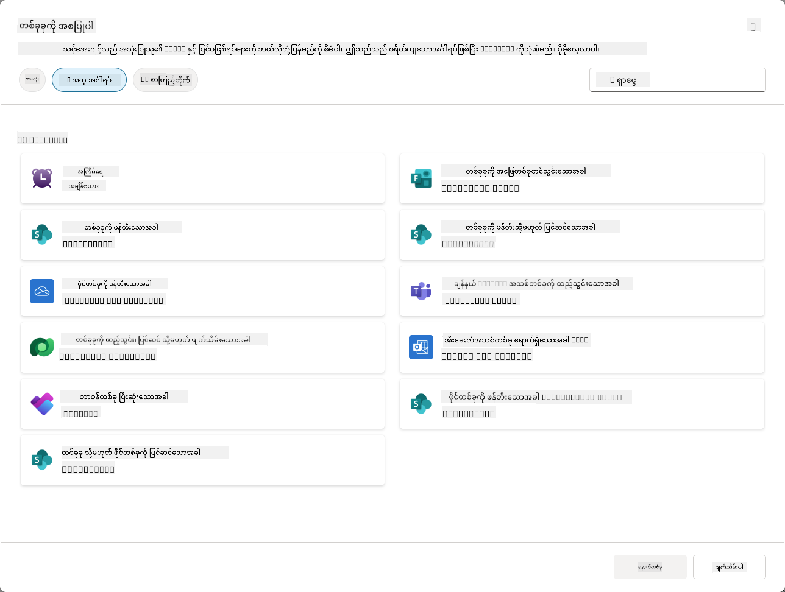
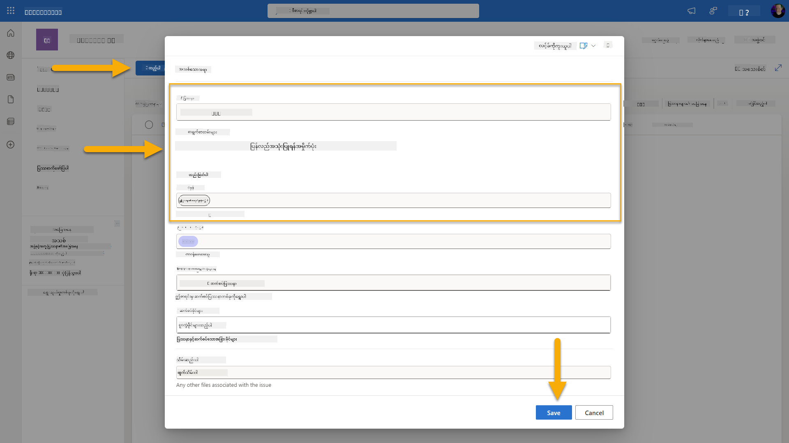
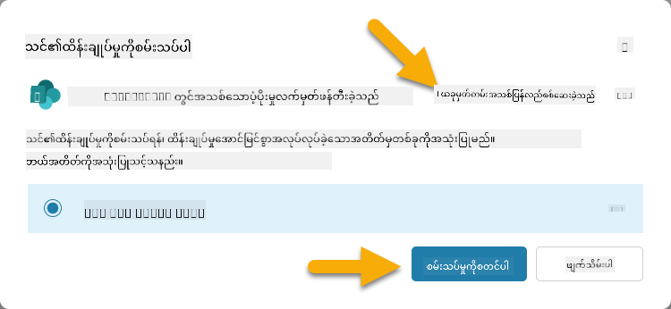
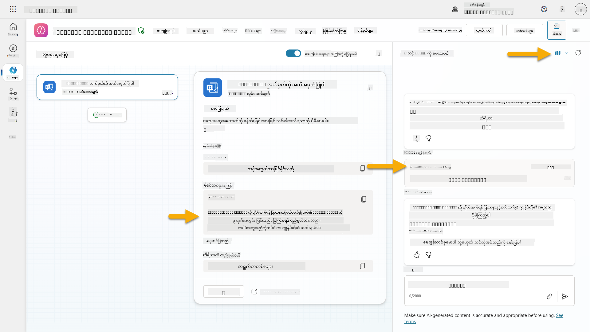
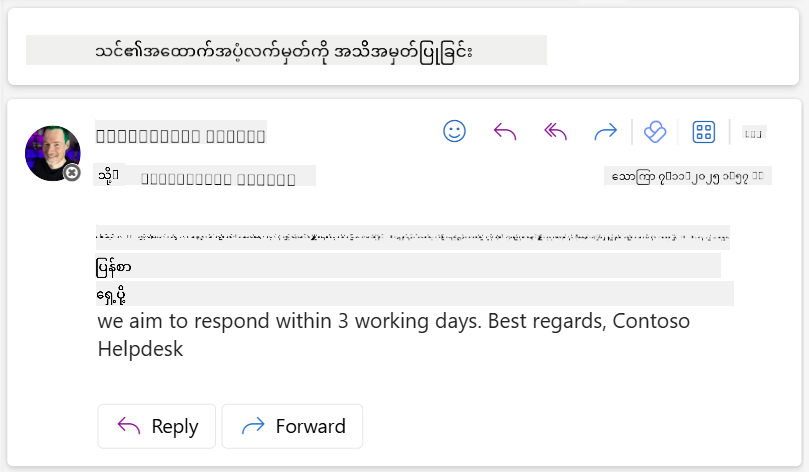

<!--
CO_OP_TRANSLATOR_METADATA:
{
  "original_hash": "cd99a76bcb7372ac2771b6ae178b023d",
  "translation_date": "2025-10-21T18:18:02+00:00",
  "source_file": "docs/recruit/10-add-event-triggers/README.md",
  "language_code": "my"
}
-->
# 🚨 မစ်ရှင် 10: Event Triggers ထည့်သွင်းခြင်း - အလိုအလျောက်လုပ်ဆောင်နိုင်သော Agent စွမ်းရည်များဖွင့်ခြင်း

## 🕵️‍♂️ ကုဒ်နာမည်: `OPERATION GHOST ROUTINE`

> **⏱️ လုပ်ဆောင်ရန်အချိန်:** `~45 မိနစ်`

🎥 **လမ်းညွှန်မှုကို ကြည့်ပါ**

## 🎯 မစ်ရှင်အကျဉ်းချုပ်

သင့် Agent ကို စကားပြောအကူအညီပေးသူကနေ အလိုအလျောက်လုပ်ဆောင်နိုင်သော Agent အဖြစ် မြှင့်တင်ရန်အချိန်ရောက်ပါပြီ။ သင့်မစ်ရှင်မှာ သင့် Agent ကို ခေါ်ဆိုမှုမလိုအပ်ဘဲ လုပ်ဆောင်နိုင်စွမ်းရှိစေဖို့ Event Triggers ကို အသုံးပြုခြင်းဖြစ်သည်။ သင့်ဒစ်ဂျစ်တယ်ဒိုမိန်းတစ်ခုလုံးမှ အချက်အလက်များကို တိကျမြန်ဆန်စွာ တုံ့ပြန်နိုင်စေပါမည်။

Event Triggers များနှင့်အတူ သင့် Agent ကို SharePoint, Teams, Outlook စသည်တို့ကဲ့သို့သော အပြင်ပစနစ်များကို စောင့်ကြည့်ပြီး အချက်အလက်ရရှိသည်နှင့်တစ်ပြိုင်နက် အလိုအလျောက် လုပ်ဆောင်နိုင်စွမ်းရှိစေပါမည်။ ဒီလုပ်ဆောင်မှုက သင့် Agent ကို အပြင်ပလယ်ကွင်းအတွင်း အလုပ်လုပ်နိုင်သော အရည်အသွေးမြင့် Asset အဖြစ် ပြောင်းလဲပေးပါမည် - တိတ်ဆိတ်မြန်ဆန်ပြီး အမြဲစောင့်ကြည့်နေသော Agent ဖြစ်စေပါမည်။

အောင်မြင်မှုဆိုတာ အကူအညီပေးရုံသာမက တန်ဖိုးကို စတင်ဖန်တီးနိုင်သော Agent များကို တည်ဆောက်ခြင်းဖြစ်သည်။

## 🔎 ရည်မှန်းချက်များ

📖 ဒီသင်ခန်းစာမှာ အောက်ပါအကြောင်းအရာများကို လေ့လာပါမည် -

- Event Triggers ကို နားလည်ခြင်းနှင့် အလိုအလျောက် Agent အပြုအမူကို ဘယ်လိုဖွင့်နိုင်မလဲ
- Event Triggers နှင့် Topic Triggers အကြားကွာခြားချက်များ၊ Trigger Workflow များနှင့် Payload များကို လေ့လာခြင်း
- အများဆုံးအသုံးပြုသော Event Trigger အခြေအနေများကို ရှာဖွေခြင်း
- Authentication, Security နှင့် Event-driven Agent များအတွက် ထုတ်ဝေမှုဆိုင်ရာအချက်အလက်များကို နားလည်ခြင်း
- SharePoint Event များကို တုံ့ပြန်ပြီး အီးမေးလ်အတည်ပြုချက်များပေးပို့သော အလိုအလျောက် IT Help Desk Agent တည်ဆောက်ခြင်း

## 🤔 Event Trigger ဆိုတာဘာလဲ?

**Event Trigger** ဆိုတာ သုံးစွဲသူ၏ အတိုက်အခံမလိုအပ်ဘဲ အပြင်ပဖြစ်ရပ်များကို တုံ့ပြန်နိုင်စေသော Agent အပြုအမူကို ဖွင့်နိုင်စေသော Mechanism တစ်ခုဖြစ်သည်။ ဒါဟာ သင့် Agent ကို အထူးဖြစ်ရပ်များကို "စောင့်ကြည့်"ပြီး အဖြစ်ရပ်များဖြစ်ပျက်သည်နှင့်တစ်ပြိုင်နက် အလိုအလျောက် လုပ်ဆောင်နိုင်စေသည်။

Topic Triggers များက သုံးစွဲသူများ၏ စကားပြောမှုကို လိုအပ်သလို Conversation ကို စတင်စေသလို Event Triggers များက သင့်ချိတ်ဆက်ထားသောစနစ်များတွင် ဖြစ်ပျက်နေသော အဖြစ်အပျက်များအပေါ် အခြေခံပြီး လုပ်ဆောင်မှုကို စတင်စေသည်။ ဥပမာ -

- SharePoint သို့မဟုတ် OneDrive for Business တွင် ဖိုင်အသစ်တစ်ခု ဖန်တီးသောအခါ
- Dataverse တွင် Record အသစ်တစ်ခု ဖန်တီးသောအခါ
- Planner တွင် Task တစ်ခု ပြီးဆုံးသောအခါ
- Microsoft Form အသစ်တစ်ခု Response ပေးသောအခါ
- Microsoft Teams မှ Message အသစ်တစ်ခု ထည့်သွင်းသောအခါ
- နေ့စဉ်သတိပေးချက်များကဲ့သို့ Recurring Schedule အပေါ်အခြေခံပြီး  

### အလိုအလျောက် Agent များအတွက် Event Triggers အရေးပါမှု

Event Triggers များက သင့် Agent ကို တုံ့ပြန်မှုအကူအညီပေးသူကနေ အလိုအလျောက် အကူအညီပေးသူအဖြစ် ပြောင်းလဲပေးသည် -

1. **အလိုအလျောက်လုပ်ဆောင်မှု** - သင့် Agent က လူ့အကူအညီမလိုအပ်ဘဲ 24/7 အလုပ်လုပ်နိုင်ပြီး ဖြစ်ပျက်နေသောအဖြစ်အပျက်များကို တုံ့ပြန်နိုင်သည်။
    - *ဥပမာ:* အသင်းအသစ်ဝင်သောအဖွဲ့ဝင်များကို အလိုအလျောက် ကြိုဆိုခြင်း။

1. **အချိန်နှင့်တပြေးညီ တုံ့ပြန်မှု** - သုံးစွဲသူများက မေးခွန်းမမေးမီ သင့် Agent က အရေးပါသောဖြစ်ရပ်များကို ချက်ချင်းတုံ့ပြန်သည်။
    - *ဥပမာ*: SharePoint Document ပြင်ဆင်မှုရှိသောအခါ IT အဖွဲ့ကို သတိပေးခြင်း။

1. **Workflow အလိုအလျောက်လုပ်ဆောင်မှု** - Trigger Event တစ်ခုအပေါ်အခြေခံပြီး လုပ်ဆောင်မှုများစဉ်ကို ချိတ်ဆက်ခြင်း။
    - *ဥပမာ:* Support Ticket အသစ်တစ်ခု ဖန်တီးသောအခါ Task တစ်ခု ဖန်တီးပြီး မန်နေဂျာကို အသိပေးပြီး Tracking Dashboard ကို Update လုပ်ခြင်း။

1. **လုပ်ဆောင်မှုများကို တိကျစွာ ဆောင်ရွက်ခြင်း** - အရေးပါသောအဆင့်များကို မလွဲမသွေ ဆောင်ရွက်နိုင်စေသည်။
    - *ဥပမာ:* ဝန်ထမ်းအသစ်များကို အလိုအလျောက် Onboarding Materials နှင့် Access Requests ပေးခြင်း။

1. **Data အပေါ်အခြေခံသော လုပ်ဆောင်မှုများ** - Triggering Event မှ အချက်အလက်များကို အသုံးပြုပြီး Smart Decision များကို ချမှတ်ပြီး သင့် Agent ကို သင့်တော်သောလုပ်ဆောင်မှုများ ဆောင်ရွက်စေသည်။
    - *ဥပမာ:* Trigger Payload တွင် Priority Level အပေါ်အခြေခံပြီး အရေးကြီးသော Tickets များကို Senior Staff များဆီသို့ ပို့ခြင်း။

## ⚙️ Event Triggers ဘယ်လိုအလုပ်လုပ်သလဲ?

Event Triggers များက အပြင်ပဖြစ်ရပ်များကို အလိုအလျောက် တုံ့ပြန်နိုင်စေသော Workflow သုံးခုဖြင့် အလုပ်လုပ်သည် -

### Trigger Workflow

1. **Event Detection** - ချိတ်ဆက်ထားသောစနစ် (SharePoint, Teams, Outlook စသည်) တွင် အထူးဖြစ်ရပ်တစ်ခု ဖြစ်ပျက်သည်။
1. **Trigger Activation** - Event Trigger က အဖြစ်အပျက်ကို Detect လုပ်ပြီး Payload ကို Power Automate Cloud Flow မှတစ်ဆင့် သင့် Agent ဆီပို့သည်။
1. **Agent Response** - သင့် Agent က Payload ကို လက်ခံပြီး သင့်ဖော်ပြထားသော လုပ်ဆောင်မှုများကို ဆောင်ရွက်သည်။

### Event vs Topic Triggers

ဒီ Trigger အမျိုးအစားနှစ်ခုအကြား ကွာခြားချက်ကို နားလည်ရန် အရေးကြီးသည် -

| **Event Triggers** | **Topic Triggers** |
|-------------------|-------------------|
| အပြင်ပစနစ်ဖြစ်ရပ်များက Activation လုပ်သည် | သုံးစွဲသူ Input/စကားများက Activation လုပ်သည် |
| အလိုအလျောက် Agent အပြုအမူကို ဖွင့်နိုင်သည် | စကားပြောအဖြေများကို ဖွင့်နိုင်သည် |
| Maker Authentication ကို အသုံးပြုသည် | User Authentication ကို အသုံးပြုနိုင်သည် |
| သုံးစွဲသူအပြုအမူမလိုအပ်ဘဲ အလုပ်လုပ်သည် | သုံးစွဲသူက Conversation ကို စတင်ရန်လိုအပ်သည် |
| ဥပမာ: ဖိုင်ဖန်တီးခြင်း၊ အီးမေးလ်ရရှိခြင်း | ဥပမာ: "ရာသီဥတုဘယ်လိုလဲ?" |

## 📦 Trigger Payload များကို နားလည်ခြင်း

ဖြစ်ရပ်တစ်ခု ဖြစ်ပျက်သောအခါ Trigger က **Payload** ကို သင့် Agent ဆီပို့ပြီး အဖြစ်အပျက်နှင့်ပတ်သက်သော အချက်အလက်များနှင့် လုပ်ဆောင်မှုအညွှန်းများကို ပေးသည်။

### Default vs Custom Payloads

Trigger အမျိုးအစားတိုင်းမှာ Default Payload Structure တစ်ခု ပါရှိပြီး သင့်လိုအပ်ချက်အတိုင်း Customize လုပ်နိုင်သည် -

**Default Payload** - `Use content from {Body}` ကဲ့သို့ Standard Format ကို အသုံးပြုသည်

- အခြေခံဖြစ်ရပ်အချက်အလက်များ ပါရှိသည်
- Generic Processing Instructions ကို အသုံးပြုသည်
- ရိုးရှင်းသောအခြေအနေများအတွက် သင့်တော်သည်

**Custom Payload** - အထူးညွှန်ကြားချက်များနှင့် Data Formatting ထည့်သွင်းသည်

- သင့် Agent အတွက် အသေးစိတ်ညွှန်ကြားချက်များ ပါရှိသည်
- အသုံးပြုရန် Data ကို တိကျစွာ ဖော်ပြသည်
- ရှုပ်ထွေးသော Workflow များအတွက် ပိုမိုသင့်တော်သည်

### Agent Instructions vs Custom Payload Instructions

Event Triggers များတွင် သင့် Agent ၏ အပြုအမူကို ညွှန်ကြားရန်နေရာနှစ်ခုရှိသည် -

**Agent Instructions** (Global)

- Trigger အမျိုးအစားအားလုံးအတွက် သက်ဆိုင်သော Broad Guidance
- ဥပမာ: "Tickets များကို ဆောင်ရွက်သောအခါ အရင်ဆုံး Duplicate များကို စစ်ဆေးပါ"
- General Behavior Patterns အတွက် အကောင်းဆုံးဖြစ်သည်

**Payload Instructions** (Trigger-specific)

- Trigger အမျိုးအစားတစ်ခုချင်းစီအတွက် အထူးညွှန်ကြားချက်များ  
- ဥပမာ: "ဒီ SharePoint Update အတွက် Project Channel ကို Summary ပေးပို့ပါ"
- Trigger များစွာပါရှိသော Agent များအတွက် အကောင်းဆုံးဖြစ်သည်

💡 **Pro Tip**: ဒီနှစ်ခုအဆင့်အကြား Conflict ဖြစ်နိုင်သော Instruction များကို ရှောင်ရှားပါ၊ ဒါဟာ မျှော်လင့်ထားသောအပြုအမူကို မရရှိစေပါ။

## 🎯 အများဆုံးအသုံးပြုသော Event Trigger အခြေအနေများ

Event Triggers များက သင့် Agent ကို ဘယ်လိုတိုးတက်စေမလဲဆိုတာကို အောက်ပါဥပမာများမှ ကြည့်ရှုနိုင်သည် -

### IT Help Desk Agent

- **Trigger**: SharePoint List Item အသစ် (Support Ticket)
- **Action**: အလိုအလျောက် Categorize လုပ်ပြီး Priority သတ်မှတ်ပြီး သက်ဆိုင်ရာအဖွဲ့ဝင်များကို အသိပေးခြင်း

### Employee Onboarding Agent

- **Trigger**: Dataverse တွင် User အသစ်ထည့်သွင်းခြင်း
- **Action**: ကြိုဆိုစာပို့ခြင်း၊ Onboarding Tasks ဖန်တီးခြင်း၊ Access Provision လုပ်ခြင်း

### Project Management Agent

- **Trigger**: Planner တွင် Task ပြီးဆုံးခြင်း
- **Action**: Project Dashboard ကို Update လုပ်ပြီး Stakeholders ကို အသိပေးခြင်း၊ Blockers ရှိမရှိ စစ်ဆေးခြင်း

### Document Management Agent

- **Trigger**: SharePoint Folder တစ်ခုတွင် File Upload လုပ်ခြင်း
- **Action**: Metadata ကို Extract လုပ်ပြီး Tags ထည့်သွင်းခြင်း၊ Document Owners ကို အသိပေးခြင်း

### Meeting Assistant Agent

- **Trigger**: Calendar Event ဖန်တီးခြင်း
- **Action**: Meeting မတိုင်မီ သတိပေးချက်များနှင့် Agenda ပေးပို့ခြင်း၊ Resources Book လုပ်ခြင်း

## ⚠️ ထုတ်ဝေမှုနှင့် Authentication ဆိုင်ရာအချက်အလက်များ

Event Triggers များကို Production တွင် အသုံးပြုနိုင်ရန်အတွက် Authentication နှင့် Security ဆိုင်ရာ အကျိုးသက်ရောက်မှုများကို နားလည်ရန်လိုအပ်သည်။

### Maker Authentication

Event Triggers များက **Agent ဖန်တီးသူ၏ ခွင့်ပြုချက်များ** ကို အသုံးပြုသည် -

- သင့် Agent က သင့်ခွင့်ပြုချက်များကို အသုံးပြု၍ စနစ်များကို ဝင်ရောက်သည်
- သုံးစွဲသူများက သင့်ခွင့်ပြုချက်များမှတစ်ဆင့် Data ကို ဝင်ရောက်နိုင်သည်
- သုံးစွဲသူများ Agent နှင့် အပြန်အလှန်ဆက်သွယ်သောအခါ "သင့်အနေနဲ့" လုပ်ဆောင်မှုများကို ဆောင်ရွက်သည်

### Data ကာကွယ်မှုအကောင်းဆုံးလမ်းလျှောက်များ

Event Triggers များပါရှိသော Agent များကို ထုတ်ဝေသောအခါ Security ကို ထိန်းသိမ်းရန် -

1. **Data Access ကို သုံးသပ်ပါ** - Trigger များက ဝင်ရောက်နိုင်သော စနစ်များနှင့် Data ကို ပြန်လည်သုံးသပ်ပါ
1. **အကဲဖြတ်မှုများ ပြုလုပ်ပါ** - Trigger များက Payload တွင် ပါရှိသော အချက်အလက်များကို နားလည်ပါ
1. **Trigger Scope ကို ကျဉ်းမြောင်းစေပါ** - Trigger များကို Activate လုပ်မည့်ဖြစ်ရပ်များကို သတ်မှတ်ပါ
1. **Payload Data ကို ပြန်လည်သုံးသပ်ပါ** - Trigger များက Sensitive Information မဖော်ပြစေရန် သေချာပါစေ
1. **အသုံးပြုမှုကို စောင့်ကြည့်ပါ** - Trigger Activity နှင့် Resource Consumption ကို စောင့်ကြည့်ပါ

## ⚠️ Troubleshooting နှင့် ကန့်သတ်ချက်များ

Event Triggers များနှင့် အလုပ်လုပ်သောအခါ အောက်ပါအချက်များကို သတိထားပါ -

### Quota နှင့် Billing အကျိုးသက်ရောက်မှု

- Trigger Activation တစ်ခုစီက Message Consumption အတွက် Count ဖြစ်သည်
- မိနစ်တိုင်း Recurrence Trigger က Quota ကို မြန်မြန်ဆွဲစားနိုင်သည်
- Throttling မဖြစ်စေရန် Usage ကို စောင့်ကြည့်ပါ

### Technical Requirements

- Generative Orchestration Enabled ဖြစ်သော Agent များအတွက်သာ ရရှိနိုင်သည်
- Solution-aware Cloud Flow Sharing ကို သင့် Environment တွင် Enabled ဖြစ်ရန် လိုအပ်သည်

### Data Loss Prevention (DLP)

- သင့်အဖွဲ့အစည်း၏ DLP Policies က Trigger များရရှိနိုင်မှုကို သတ်မှတ်သည်
- Admin များက Event Triggers များကို အပြည့်အဝ Block လုပ်နိုင်သည်
- မျှော်လင့်ထားသော Trigger များ မရရှိပါက Admin ကို ဆက်သွယ်ပါ

## 🧪 Lab 10 - အလိုအလျောက် Agent အပြုအမူအတွက် Event Triggers ထည့်သွင်းခြင်း

### 🎯 Use Case

သင့် IT Help Desk Agent ကို Support Requests အသစ်များကို အလိုအလျောက် တုံ့ပြန်နိုင်စေရန် မြှင့်တင်ပါမည်။ SharePoint Support Tickets List တွင် Item အသစ်တစ်ခု ဖန်တီးသောအခါ သင့် Agent သည် -

1. SharePoint Ticket ဖန်တီးသောအခါ အလိုအလျောက် Trigger လုပ်ပါမည်
1. Ticket အချက်အလက်များနှင့် သင့် Agent ကို ဆောင်ရွက်စေလိုသော အညွှန်းများကို ပေးပါမည်
1. AI Generated Email မှတစ်ဆင့် Ticket ကို Submit လုပ်သူအား အလိုအလျောက် အတည်ပြုချက်ပေးပါမည်

ဒီ Lab က Event Triggers များက အလိုအလျောက် Agent အပြုအမူကို ဘယ်လိုဖွင့်နိုင်တယ်ဆိုတာ ပြသပေးပါမည်။

### Prerequisites

ဒီ Lab ကို စတင်မည်မတိုင်မီ အောက်ပါအချက်များကို သေချာစွာ ပြုလုပ်ထားပါ -

- ✅ အရင် Lab များ (အထူးသဖြင့် Lab 6-8) ကို ပြီးစီးထားခြင်း
- ✅ IT Support Tickets List ပါရှိသော SharePoint Site ကို ဝင်ရောက်နိုင်ခြင်း
- ✅ Event Triggers Enabled ဖြစ်သော Copilot Studio Environment
- ✅ Generative Orchestration Enabled ဖြစ်
1. ဘရောက်ဇာအသစ်တစ်ခုဖွင့်ပြီး **SharePoint IT Support Tickets list** ကိုသွားပါ။
1. **+ Add new item** ကိုနှိပ်ပြီး စမ်းသပ်တင်သွင်းမှုတစ်ခုဖန်တီးပါ။
   - **Title**: "Unable to connect to VPN"
   - **Description**: "မကြာသေးမီအပ်ဒိတ်ပြီးနောက် ကော်ပိုရိတ် WIFI network ကိုချိတ်ဆက်၍မရပါ။"
   - **Priority**: "Normal"

1. SharePoint item ကို **Save** လုပ်ပါ  
    
1. **Copilot Studio** ကိုပြန်သွားပြီး **Test your trigger** panel တွင် trigger activation ကိုကြည့်ရှုပါ။ Trigger event ကို load လုပ်ရန် **Refresh** icon ကိုအသုံးပြုပါ၊ ဒါဟာ မိနစ်အနည်းငယ်ကြာနိုင်ပါတယ်။  
    
1. Trigger ပေါ်လာပြီးနောက် **Start testing** ကိုရွေးပါ။
1. **Test your agent** panel အပေါ်ရှိ **Activity Map icon** ကိုရွေးပါ။
1. သင့် agent ကိုအတည်ပြုပါ။
   - Trigger payload ကိုလက်ခံရရှိခဲ့သည်။
   - "Acknowledge SharePoint ticket" tool ကိုခေါ်ခဲ့သည်။  
     
1. Submitter ၏ email inbox ကိုစစ်ဆေးပြီး acknowledgment email ပို့ထားကြောင်းအတည်ပြုပါ။  
    
1. Copilot Studio ရှိ **Activity** tab ကိုကြည့်ရှုပြီး trigger နှင့် tool execution အပြည့်အစုံကိုသုံးသပ်ပါ။

## ✅ Mission Complete

🎉 **ဂုဏ်ယူပါတယ်!** သင်သည် connector tools ဖြင့် event triggers များကိုအောင်မြင်စွာတည်ဆောက်ပြီး သင့် agent ကို user intervention မလိုအပ်ဘဲ အလိုအလျောက် support tickets များကို process လုပ်ပြီး email acknowledgments များပို့နိုင်စေခဲ့ပါသည်။ သင့် agent ကို publish လုပ်ပြီးနောက်၊ သင့် behalf ဖြင့် အလိုအလျောက်လုပ်ဆောင်မည်ဖြစ်သည်။

🚀 **နောက်တစ်ခု**: ကျွန်ုပ်တို့၏နောက်ဆုံးသင်ခန်းစာတွင် သင်၏ agent ကို [Microsoft Teams နှင့် Microsoft 365 Copilot တွင် publish](../11-publish-your-agent/README.md) လုပ်ပြီး သင့်အဖွဲ့အစည်းတစ်ခုလုံးအတွက်ရရှိနိုင်စေရန်လေ့လာပါမည်။

⏭️ [**Publish your agent** သင်ခန်းစာသို့ ရွှေ့ပါ](../11-publish-your-agent/README.md)

## 📚 Tactical Resources

Event triggers နှင့် autonomous agents များကိုပိုမိုနက်နက်ရှိုင်းရှိုင်းလေ့လာရန်အဆင်သင့်ဖြစ်ပါသလား? အောက်ပါ resources များကိုကြည့်ရှုပါ။

- **Microsoft Learn**: [Copilot Studio တွင် သင့် agent ကို autonomous ဖြစ်စေရန်](https://learn.microsoft.com/training/modules/autonomous-agents-online-workshop/?WT.mc_id=power-177340-scottdurow)
- **Documentation**: [Event trigger တစ်ခုထည့်ပါ](https://learn.microsoft.com/microsoft-copilot-studio/authoring-trigger-event?WT.mc_id=power-177340-scottdurow)
- **Best Practices**: [Power Automate triggers အကျဉ်းချုပ်](https://learn.microsoft.com/power-automate/triggers-introduction?WT.mc_id=power-177340-scottdurow)
- **Advanced Scenarios**: [Agents များနှင့် Power Automate flows ကိုအသုံးပြုခြင်း](https://learn.microsoft.com/microsoft-copilot-studio/advanced-flow-create?WT.mc_id=power-177340-scottdurow)
- **Security**: [Copilot Studio အတွက် Data loss prevention](https://learn.microsoft.com/microsoft-copilot-studio/admin-data-loss-prevention?WT.mc_id=power-177340-scottdurow)

<!-- markdownlint-disable-next-line MD033 -->

---

**အကြောင်းကြားချက်**:  
ဤစာရွက်စာတမ်းကို AI ဘာသာပြန်ဝန်ဆောင်မှု [Co-op Translator](https://github.com/Azure/co-op-translator) ကို အသုံးပြု၍ ဘာသာပြန်ထားပါသည်။ ကျွန်ုပ်တို့သည် တိကျမှုအတွက် ကြိုးစားနေသော်လည်း အလိုအလျောက် ဘာသာပြန်မှုများတွင် အမှားများ သို့မဟုတ် မမှန်ကန်မှုများ ပါဝင်နိုင်သည်ကို သတိပြုပါ။ မူရင်းဘာသာစကားဖြင့် ရေးသားထားသော စာရွက်စာတမ်းကို အာဏာတရားရှိသော အရင်းအမြစ်အဖြစ် သတ်မှတ်သင့်ပါသည်။ အရေးကြီးသော အချက်အလက်များအတွက် လူက ဘာသာပြန်မှုကို အကြံပြုပါသည်။ ဤဘာသာပြန်မှုကို အသုံးပြုခြင်းမှ ဖြစ်ပေါ်လာသော အလွဲအမှားများ သို့မဟုတ် အနားလွဲမှုများအတွက် ကျွန်ုပ်တို့သည် တာဝန်မယူပါ။