<!--
CO_OP_TRANSLATOR_METADATA:
{
  "original_hash": "9dceeba2eae2bb73e328602a060eddab",
  "translation_date": "2025-10-21T18:54:33+00:00",
  "source_file": "docs/recruit/11-publish-your-agent/README.md",
  "language_code": "my"
}
-->
# 🚨 မစ်ရှင် ၁၁: သင့် Agent ကို ထုတ်ဝေပါ

## 🕵️‍♂️ ကုဒ်နာမည်: `OPERATION PUBLISH PUBLISH PUBLISH`

> **⏱️ လုပ်ငန်းဆောင်တာအချိန်:** `~၃၀ မိနစ်`

🎥 **လမ်းညွှန်ဗီဒီယိုကြည့်ရန်**

## 🎯 မစ်ရှင်အကျဉ်းချုပ်

Agent Maker အဖြစ် စိန်ခေါ်မှုများစွာကို ဖြတ်သန်းပြီးနောက် သင့်အရေးကြီးဆုံးအဆင့်ကို ပြင်ဆင်ရန် အချိန်ရောက်ပါပြီ။ သင့် Agent ကို ထုတ်ဝေပြီး Microsoft Teams နှင့် Microsoft 365 Copilot တွင် အသုံးပြုနိုင်အောင် ပြင်ဆင်ပါ။

သင့် Agent သည် ရှင်းလင်းသောမစ်ရှင်၊ အင်အားကြီးသော Tools များနှင့် အရေးကြီးသော Knowledge Sources များကို အသုံးပြုနိုင်သောအခြေအနေတွင် Microsoft Copilot Studio ကို အသုံးပြု၍ အသုံးပြုသူများအတွက် အကူအညီပေးရန် ပြင်ဆင်ထားပါသည်။

အခုတော့ သင့် Agent ကို လုပ်ငန်းဆောင်တာတွင် စတင်အသုံးပြုနိုင်အောင် လွှတ်တင်လိုက်ပါ။

## 🔎 ရည်မှန်းချက်များ

📖 ဒီသင်ခန်းစာတွင် ပါဝင်သည်-

1. သင့် Agent ကို ထုတ်ဝေခြင်းအရေးကြီးမှု
1. Agent ကို ထုတ်ဝေပြီးနောက် ဖြစ်ပျက်မည့်အရာများ
1. Channel (Microsoft Teams & Microsoft 365 Copilot) ထည့်သွင်းနည်း
1. Microsoft Teams တွင် Agent ကို ထည့်သွင်းနည်း
1. Microsoft Teams တွင် သင့်အဖွဲ့အစည်းတစ်ခုလုံးအတွက် Agent ကို ရရှိနိုင်အောင်လုပ်နည်း

## 🚀 Agent ကို ထုတ်ဝေပါ

Copilot Studio တွင် Agent ကို ပြင်ဆင်နေစဉ် Knowledge သို့မဟုတ် Tools များကို ထည့်သွင်းနိုင်ပါသည်။ ပြင်ဆင်မှုများပြီးဆုံးပြီး စမ်းသပ်မှုများကို ပြုလုပ်ပြီးနောက် သင့် Agent ကို ထုတ်ဝေရန် ပြင်ဆင်ပါ။ ထုတ်ဝေခြင်းသည် နောက်ဆုံးအပ်ဒိတ်များကို အသုံးပြုသူများအတွက် အသက်ဝင်စေပါသည်။ Tools အသစ်များကို ထည့်သွင်းပြီး Publish ခလုတ်ကို မနှိပ်ပါက အပ်ဒိတ်များသည် အသုံးပြုသူများအတွက် မရရှိနိုင်သေးပါ။

သင့် Agent ကို အသုံးပြုသူများထံ အပ်ဒိတ်များကို ပို့လိုပါက Publish ခလုတ်ကို အမြဲနှိပ်ပါ။ သင့် Agent တွင် Channels များကို ထည့်သွင်းထားနိုင်ပြီး Publish ခလုတ်ကို နှိပ်သောအခါ ထည့်သွင်းထားသော Channels များတွင် အပ်ဒိတ်များကို အသက်ဝင်စေပါသည်။

## ⚙️ Channels ကို Configure လုပ်ပါ

Channels သည် သင့် Agent ကို အသုံးပြုသူများက ရရှိနိုင်ပြီး အပြန်အလှန်ဆက်သွယ်နိုင်သောနေရာကို သတ်မှတ်ပေးပါသည်။ Agent ကို ထုတ်ဝေပြီးနောက် Channels များစွာတွင် ရရှိနိုင်အောင် ပြင်ဆင်နိုင်ပါသည်။ Channel တစ်ခုစီသည် သင့် Agent ၏ Content ကို ကွဲပြားစွာ ပြသနိုင်ပါသည်။

သင့် Agent ကို အောက်ပါ Channels များတွင် ထည့်သွင်းနိုင်ပါသည်-

- **Microsoft Teams နှင့် Microsoft 365 Copilot** - Teams chats နှင့် meetings တွင် သင့် Agent ကို ရရှိနိုင်အောင်လုပ်ပါ ([Learn more](https://learn.microsoft.com/microsoft-copilot-studio/publication-add-bot-to-microsoft-teams))
- **Demo website** - Copilot Studio မှ ပေးသော demo website တွင် သင့် Agent ကို စမ်းသပ်ပါ ([Learn more](https://learn.microsoft.com/microsoft-copilot-studio/publication-connect-bot-to-web-channels))
- **Custom website** - သင့်ကိုယ်ပိုင် website တွင် Agent ကို Embed လုပ်ပါ ([Learn more](https://learn.microsoft.com/microsoft-copilot-studio/publication-connect-bot-to-web-channels))
- **Mobile app** - သင့်ကိုယ်ပိုင် mobile application တွင် Agent ကို ထည့်သွင်းပါ ([Learn more](https://learn.microsoft.com/microsoft-copilot-studio/publication-connect-bot-to-custom-application))
- **SharePoint** - SharePoint sites တွင် Agent ကို ထည့်သွင်းပါ ([Learn more](https://learn.microsoft.com/microsoft-copilot-studio/publication-add-bot-to-sharepoint))
- **Facebook Messenger** - Facebook messaging platform တွင် အသုံးပြုသူများနှင့် ဆက်သွယ်ပါ ([Learn more](https://learn.microsoft.com/microsoft-copilot-studio/publication-add-bot-to-facebook))
- **Power Pages** - Power Pages websites တွင် Agent ကို ထည့်သွင်းပါ ([Learn more](https://learn.microsoft.com/microsoft-copilot-studio/publication-add-bot-to-power-pages))
- **Azure Bot Service channels** - Slack, Telegram, Twilio SMS စသည်တို့အပါအဝင် Channels များကို အသုံးပြုပါ ([Learn more](https://learn.microsoft.com/microsoft-copilot-studio/publication-connect-bot-to-azure-bot-service-channels))

Channel ကို ထည့်သွင်းရန် **Channels** tab သို့ သွားပြီး သင့် Agent တွင် Configure လုပ်လိုသော Channel ကို ရွေးပါ။ Channel တစ်ခုစီတွင် သတ်မှတ်ထားသော Setup လိုအပ်ချက်များရှိပြီး Authentication သို့မဟုတ် Configuration အဆင့်များကို လိုအပ်နိုင်ပါသည်။

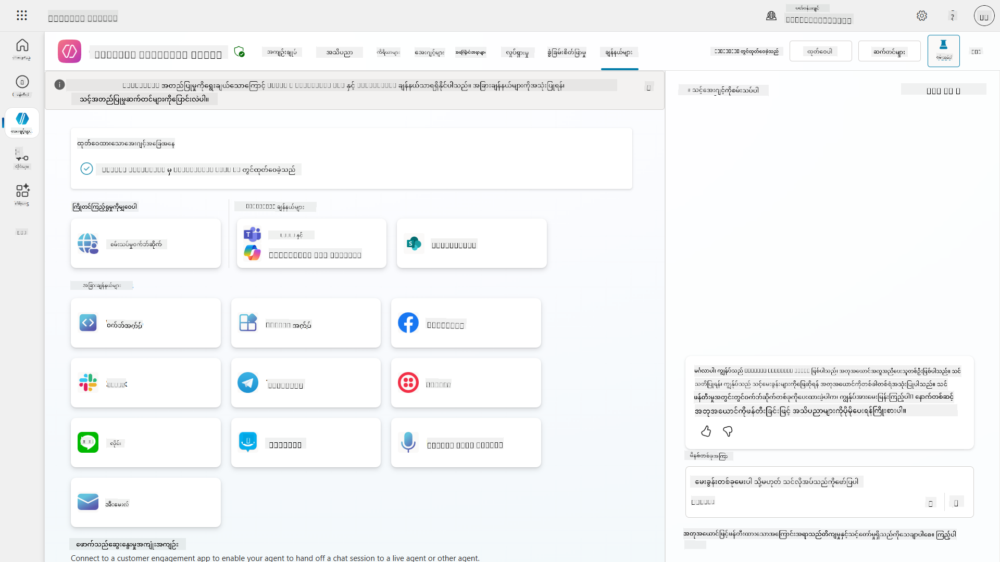

## 📺 Channel experiences

Channels များသည် အသုံးပြုသူအတွေ့အကြုံများကို ကွဲပြားစွာပေးနိုင်ပါသည်။ Channels များစွာအတွက် Agent တစ်ခုကို တည်ဆောက်နေစဉ် Channel တစ်ခုစီ၏ ကွဲပြားမှုများကို သိရှိထားရန် အရေးကြီးပါသည်။ Channels များစွာတွင် Agent ကို စမ်းသပ်ခြင်းသည် သင့်ရည်ရွယ်ချက်နှင့် ကိုက်ညီမှုရှိမရှိ စစ်ဆေးရန် အကောင်းဆုံးနည်းလမ်းဖြစ်ပါသည်။

| အတွေ့အကြုံ | Website | Teams နှင့် Microsoft 365 Copilot | Facebook | Dynamics Omnichannel for Customer Service |
| ------------------------- | ----------- | --------------------------------------- | ------------------------ | ----------------------------------------------------------- |
| [Customer satisfaction survey][1] | Adaptive card | Text-only | Text-only | Text-only |
| [Multiple-choice options][1] | Supported | [Supported up to six (as hero card)][4] | [Supported up to 13][6] | [Partially Supported][8] |
| [Markdown][2] | Supported | [Partially Supported][5] | [Partially supported][7] | [Partially Supported][9] |
| [Welcome message][1] | Supported | Supported | Not supported | Supported for [Chat][10]. Not supported for other channels. |
| [Did-You-Mean][3] | Supported | Supported | Supported | Supported for [Microsoft Teams][11], [Chat][10], Facebook, and text-only channels (short message service (SMS) via [TeleSign][12] and [Twilio][13], [WhatsApp][14], [WeChat][15], and [Twitter][16]). Suggested actions are presented as a text-only list; users must retype an option to respond. |

[1]: https://learn.microsoft.com/microsoft-copilot-studio/authoring-create-edit-topics  
[2]: https://daringfireball.net/projects/markdown/  
[3]: https://learn.microsoft.com/microsoft-copilot-studio/advanced-ai-features  
[4]: https://learn.microsoft.com/microsoftteams/platform/concepts/cards/cards-reference#hero-card  
[5]: https://learn.microsoft.com/microsoftteams/platform/bots/how-to/format-your-bot-messages#text-only-messages  
[6]: https://developers.facebook.com/docs/messenger-platform/send-messages/quick-replies/  
[7]: https://www.facebook.com/help/147348452522644?helpref=related  
[8]: https://learn.microsoft.com/dynamics365/customer-service/asynchronous-channels#suggested-actions-support  
[9]: https://learn.microsoft.com/dynamics365/customer-service/asynchronous-channels#preview-support-for-formatted-messages  
[10]: https://learn.microsoft.com/dynamics365/customer-service/set-up-chat-widget  
[11]: https://learn.microsoft.com/dynamics365/customer-service/configure-microsoft-teams  
[12]: https://learn.microsoft.com/dynamics365/customer-service/configure-sms-channel  
[13]: https://learn.microsoft.com/dynamics365/customer-service/configure-sms-channel-twilio  
[14]: https://learn.microsoft.com/dynamics365/customer-service/configure-whatsapp-channel  
[15]: https://learn.microsoft.com/dynamics365/customer-service/configure-wechat-channel  
[16]: https://learn.microsoft.com/dynamics365/customer-service/configure-twitter-channel  

> [!NOTE]  
> Channels များအတွက် logic ကွဲပြားမှုကို အသုံးပြုနိုင်သော နမူနာများရှိပါသည်။ Power Platform Snippets repository တွင် နမူနာတစ်ခုကို တွေ့နိုင်ပါသည်-  
> Henry Jammes သည် Microsoft Teams Channel အတွက် ကွဲပြားသော adaptive card ကို ပြသနည်းနမူနာကို မျှဝေခဲ့သည်။ ([နမူနာကိုကြည့်ရန်](https://github.com/pnp/powerplatform-snippets/blob/main/copilot-studio/multiple-topics-matched-topic/source/multiple-topics-matched.yaml#L40))

## 🧪 Lab 11: Teams နှင့် Microsoft 365 Copilot တွင် Agent ကို ထုတ်ဝေပါ

### 🎯 Use case

Contoso IT Help Desk Agent သည် SharePoint knowledge sources များကို အသုံးပြုနိုင်ခြင်း၊ support tickets များကို ဖန်တီးခြင်း၊ proactive notifications များပေးပို့ခြင်းနှင့် အသုံးပြုသူမေးခွန်းများကို ဉာဏ်ရည်ရှိစွာ ဖြေဆိုနိုင်ခြင်းတို့ဖြင့် အင်အားကြီးသောစွမ်းရည်များဖြင့် ပြင်ဆင်ပြီးဖြစ်ပါသည်။ သို့သော် ဒီ features များသည် သင်တည်ဆောက်ထားသော development environment တွင်သာ ရရှိနိုင်ပါသည်။

**စိန်ခေါ်မှု:** End users များသည် Agent ၏စွမ်းရည်များကို အကောင်းဆုံးအသုံးပြုနိုင်ရန် ထုတ်ဝေပြီး Channels များတွင် ရရှိနိုင်အောင်လုပ်ရန် လိုအပ်ပါသည်။

**ဖြေရှင်းနည်း:** Agent ကို ထုတ်ဝေခြင်းသည် နောက်ဆုံး version ကို အသုံးပြုသူများအတွက် ရရှိနိုင်စေပါသည်။ ထုတ်ဝေမထားပါက အသုံးပြုသူများသည် အဟောင်း version ကိုသာ အသုံးပြုမည်ဖြစ်ပြီး အရေးကြီးသော functionality များကို မရရှိနိုင်ပါ။

Teams နှင့် Microsoft 365 Copilot Channel ကို ထည့်သွင်းခြင်းသည် အရေးကြီးပါသည်-

- **Teams Integration**: သင့်အဖွဲ့အစည်း၏ ဝန်ထမ်းများသည် Microsoft Teams တွင် ပေါင်းစည်းမှု၊ အစည်းအဝေးများနှင့် ဆက်သွယ်မှုများအတွက် အချိန်အများစုကို ဖြုန်းပါသည်။ Teams တွင် Agent ကို ထည့်သွင်းခြင်းဖြင့် ဝန်ထမ်းများသည် အလုပ်ပတ်ဝန်းကျင်မှ မထွက်ဘဲ IT support ရရှိနိုင်ပါသည်။

- **Microsoft 365 Copilot**: Microsoft 365 Copilot experience တွင် သင့် IT help desk Agent ကို တိုက်ရိုက်ရရှိနိုင်ပြီး Office applications များတွင် seamless integration ဖြစ်စေပါသည်။

- **Centralized Access**: သီးခြား websites သို့မဟုတ် applications များကို မှတ်မိရန် မလိုအပ်ဘဲ အသုံးပြုသူများသည် အလုပ်လုပ်နေသော platform များမှ IT support ရရှိနိုင်ပါသည်။

ဒီမစ်ရှင်သည် သင့်တည်ဆောက်မှုကို production-ready solution အဖြစ် ပြောင်းလဲပေးပြီး သင့်အဖွဲ့အစည်း၏ End users များအတွက် တန်ဖိုးရှိသောအကျိုးကျေးဇူးများကို ပေးစွမ်းပါသည်။

### လိုအပ်ချက်များ

ဒီ Lab ကို စတင်မည်မီ-

- ✅ အရင် Lab များကို ပြီးစီးပြီး Contoso Helpdesk Agent ကို ပြင်ဆင်ပြီးဖြစ်ရမည်
- ✅ Agent ကို စမ်းသပ်ပြီး production-ready ဖြစ်ရမည်
- ✅ Copilot Studio environment တွင် Agent ထုတ်ဝေခွင့်ရှိရမည်
- ✅ သင့်အဖွဲ့အစည်းတွင် Microsoft Teams ကို အသုံးပြုခွင့်ရှိရမည်

### 11.1 သင့် Agent ကို ထုတ်ဝေပါ

Agent အား အသုံးပြုသူများအတွက် ရရှိနိုင်အောင်လုပ်ရန် သင့်လုပ်ဆောင်မှုများကို ထုတ်ဝေပါ။

1. Copilot Studio (via the [Copilot Studio maker portal](https://copilotstudio.microsoft.com)) တွင် Contoso Helpdesk Agent သို့ သွားပါ

    Copilot Studio တွင် Agent ကို ထုတ်ဝေခြင်းသည် လွယ်ကူပါသည်။ Agent overview ၏ ထိပ်တွင် Publish ခလုတ်ကို ရွေးပါ။

    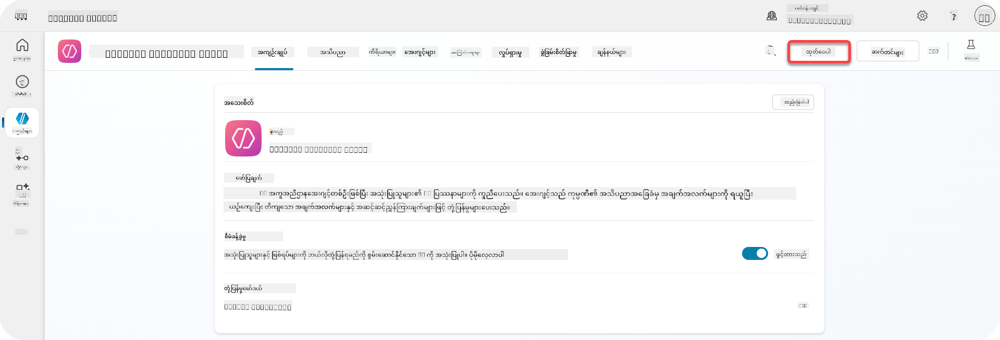

1. **Publish** ခလုတ်ကို ရွေးပါ

    Publish pop-up ကို ဖွင့်ပြီး သင့် Agent ကို Publish လုပ်လိုကြောင်း အတည်ပြုပါ။

    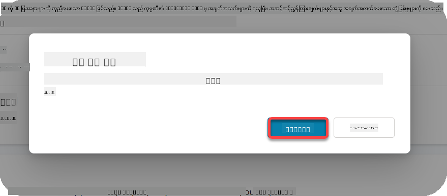

1. **Publish** ကို ရွေးပြီး Agent ကို Publish လုပ်ပါ

    Agent ကို Publish လုပ်နေသည်ဟု မက်ဆေ့ပြပါသည်။ popup ကို ဖွင့်ထားရန် မလိုအပ်ပါ။ Agent ကို Publish လုပ်ပြီးသည့်အခါ သတိပေးချက်ကို ရရှိပါမည်။

    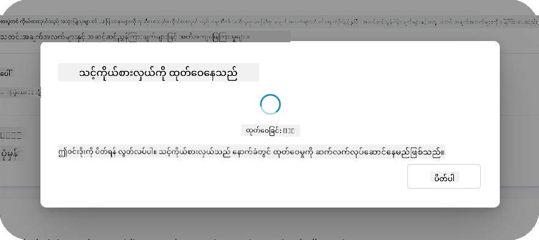

    Agent Publish လုပ်ပြီးသည့်အခါ Agent page ၏ ထိပ်တွင် သတိပေးချက်ကို တွေ့ပါမည်။

    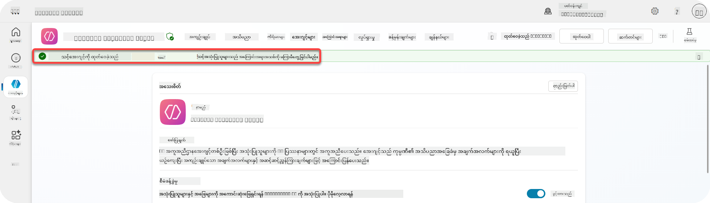

သို့သော် - Agent ကို Publish လုပ်ပြီး Channel မထည့်သွင်းသေးပါ။ အခုတော့ Channel ကို ထည့်သွင်းလိုက်ပါ။

### 11.2 Teams နှင့် Microsoft 365 Copilot Channel ကို ထည့်သွင်းပါ

1. Agent တွင် **Channel** ကို ရွေးပါ

    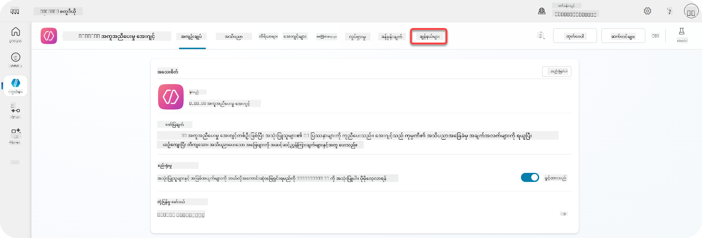

    ဒီမှာ Agent အတွက် ထည့်သွင်းနိုင်သော Channels များကို တွေ့နိုင်ပါသည်။

1. **Teams နှင့် Microsoft 365** ကို ရွေးပါ

    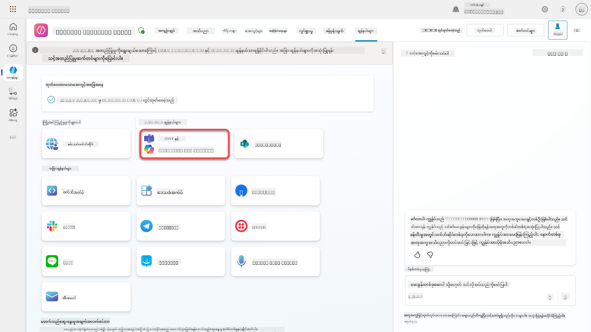

1. **Add channel** ကို ရွေးပြီး wizard ကို ပြီးစီးအောင်လုပ်ပါ

    

    Channel ကို ထည့်သွင်းပြီးနောက် sidebar ၏ ထိပ်တွင် အစိမ်းရောင်သတိပေးချက်ကို တွေ့ပါမည်။

    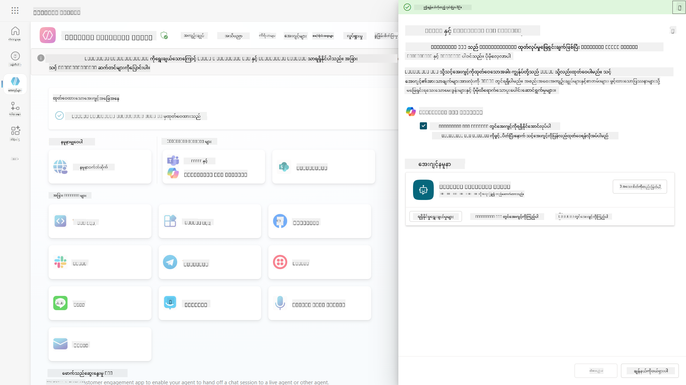

1. **See agent in Teams** ကို ရွေးပြီး tab အသစ်ကို ဖွင့်ပါ

    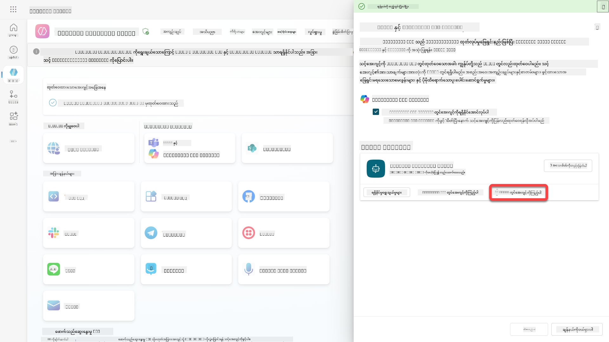

1. **Add** ကို ရွေးပြီး Contoso Helpdesk Agent ကို Teams တွင် ထည့်သွင်းပါ

    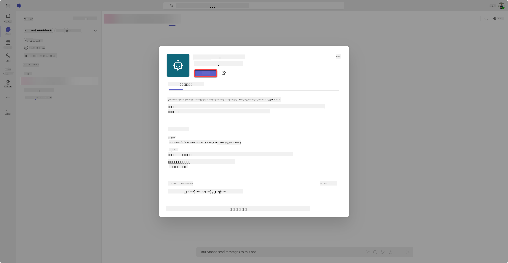

    အချိန်အနည်းငယ်ကြာပါမည်။ ပြီးနောက် အောက်ပါအခြေအနေကို တွေ့ပါမည်-

    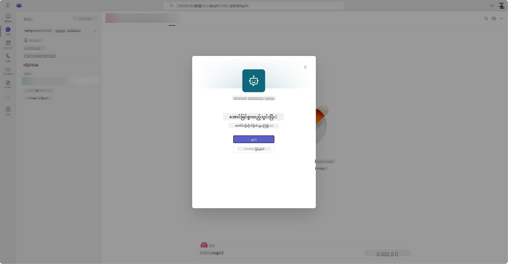

1. **Open** ကို ရွေးပြီး Agent ကို Teams တွင် ဖွင့်ပါ

    Agent ကို Teams တွင် Teams app အဖြစ် ဖွင့်ပါမည်။

    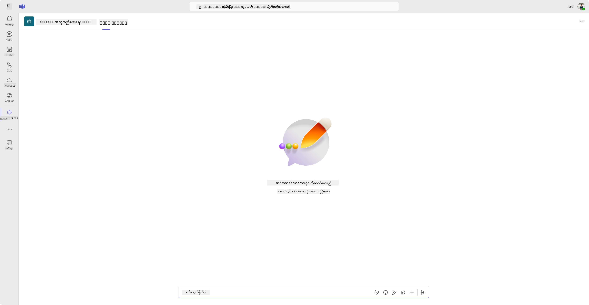

အခုတော့ Agent ကို Microsoft Teams တွင် အသုံးပြုနိုင်အောင် ထုတ်ဝေပြီးဖြစ်ပါသည်။ သို့သော် သင့်အဖွဲ့အစည်းရှိ လူများအတွက် ရရှိနိုင်အောင်လုပ်လိုပါက အောက်ပါအဆင့်များကို ဆက်လက်လုပ်ဆောင်ပါ။

### 11.3 Tenant အတွင်းရှိ အသုံးပြုသူများအတွက် Agent ကို ရရှိနိုင်အောင်လုပ်ပါ

1. Contoso Helpdesk Agent ဖွင့်ထားသော browser tab ကို ပိတ်ပါ

    Copilot Studio သို့ ပြန်သွားပါ။ Teams နှင့် Microsoft 365 Copilot side panel သည် ဖွင့်ထားဆဲဖြစ်ပါသည်။ Agent ကို Teams တွင် ဖွင့်ထားသော်လည်း အခြားလုပ်ဆောင်မှုများကို ပြုလုပ်နိုင်ပါသည်။ Agent ၏ အသေးစိတ်ကို ပြင်ဆင်နိုင်ပြီး အသုံးပြုသူများအတွက် Deploy လုပ်နိုင်ပါသည်။

1. **Edit details** ကို ရွေးပါ

    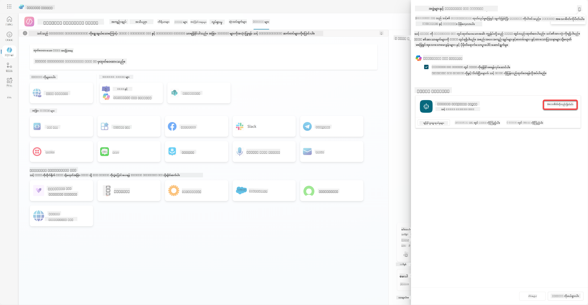
ဒီဟာက Agent ရဲ့ အသေးစိတ်အချက်အလက်တွေ၊ ဆက်တင်တွေကို ပြောင်းလဲနိုင်တဲ့ pane ကို ဖွင့်ပေးမှာပါ။ Icon, Icon ရဲ့ နောက်ခံအရောင်၊ ဖော်ပြချက်တွေလို အခြေခံအချက်အလက်တွေကို ပြောင်းလဲနိုင်ပါတယ်။ Teams ဆက်တင်တွေကိုလည်း ဒီနေရာမှာ ပြောင်းလဲနိုင်ပါတယ် (ဥပမာ - Agent ကို Team မှာ ထည့်နိုင်ဖို့ ခွင့်ပြုခြင်း၊ Group chat နဲ့ Meeting chat တွေမှာ Agent ကို အသုံးပြုနိုင်ဖို့ ခွင့်ပြုခြင်း)။ *more* ကို ရွေးချယ်တဲ့အခါ Developer အချက်အလက်တွေကိုလည်း ပြောင်းလဲနိုင်ပါတယ်၊ Developer နာမည်၊ Website၊ Privacy Statement နဲ့ Terms of Use စတဲ့ အချက်အလက်တွေပါ။

1. **Cancel** ကို ရွေးချယ်ပြီး Edit details pane ကို ပိတ်ပါ။

1. **Availability options** ကို ရွေးချယ်ပါ။

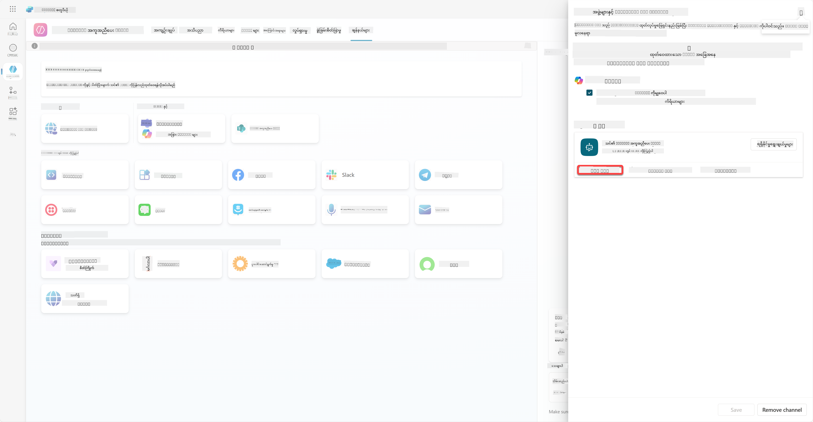

ဒီဟာက Availability options pane ကို ဖွင့်ပေးမှာဖြစ်ပြီး၊ Agent ကို အသုံးပြုဖို့ User တွေကို ပေးပို့နိုင်တဲ့ Link ကို Copy လုပ်နိုင်ပါတယ် (သတိထားပါ၊ Agent ကို User နဲ့ Share လုပ်ဖို့ လိုအပ်ပါတယ်)။ Microsoft Teams သို့မဟုတ် Microsoft 365 Store မှာ Agent ကို ထည့်ဖို့ ဖိုင်ကို Download လုပ်နိုင်ပါတယ်။ Store မှာ Agent ကို ပြသဖို့ အခြားရွေးချယ်စရာတွေရှိပါတယ် - teammates နဲ့ shared users တွေကို ပြသနိုင်ပါတယ် (*Built with Power Platform* အပိုင်းမှာ ပြသဖို့) သို့မဟုတ် org အတွင်းရှိ လူတိုင်းကို ပြသနိုင်ပါတယ် (Administrator အတည်ပြုချက် လိုအပ်ပါတယ်)။

1. **Show to everyone in my org** ကို ရွေးချယ်ပါ။

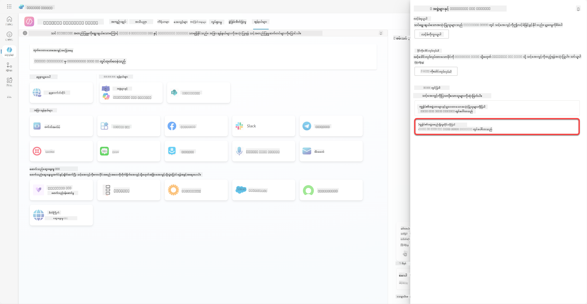

1. **Submit for admin approval** ကို ရွေးချယ်ပါ။

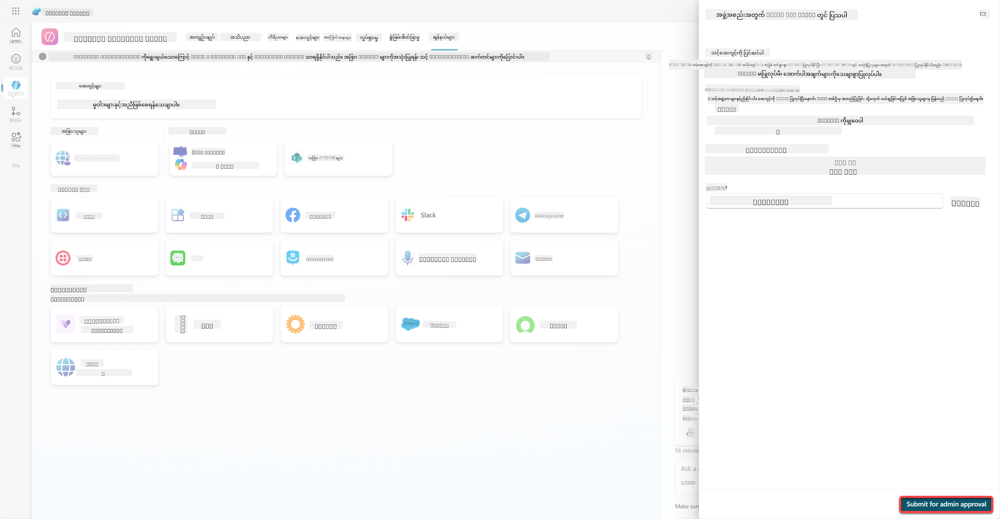

အခုတော့ Administrator က Agent submission ကို အတည်ပြုရပါမယ်။ သူတို့က Teams Admin Center ကို သွားပြီး Apps မှာ Contoso Helpdesk Agent ကို ရှာဖွေနိုင်ပါတယ်။ Screenshot မှာ Administrator က Teams Admin Center မှာ ဘာတွေကို မြင်ရမယ်ဆိုတာကို ပြထားပါတယ်။

Administrator က Contoso Helpdesk Agent ကို ရွေးချယ်ပြီး *Publish* ကို ရွေးချယ်ရပါမယ်၊ Contoso Helpdesk Agent ကို လူတိုင်းအတွက် Publish လုပ်ဖို့။

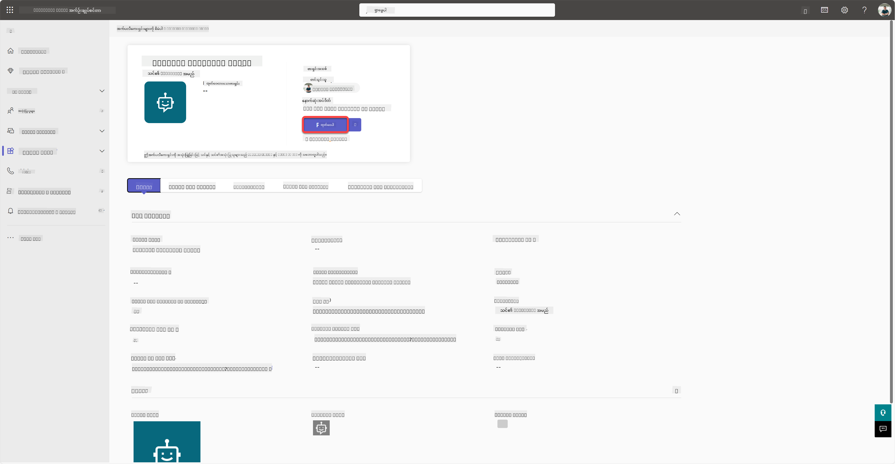

Administrator က Agent submission ကို Publish လုပ်ပြီးတဲ့အခါ၊ Copilot Studio ကို Refresh လုပ်နိုင်ပြီး Availability options မှာ *available in app store* banner ကို မြင်ရပါမယ်။

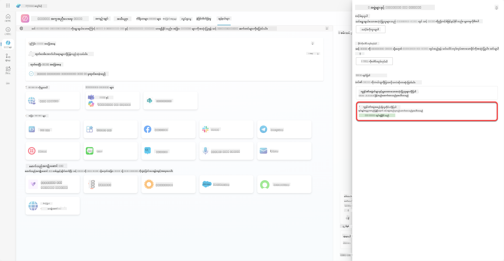

ဒီနေရာမှာ အခြားအခွင့်အရေးတွေရှိပါတယ်။ Admin က Global setup policy ကို ပြောင်းလဲနိုင်ပြီး Contoso Helpdesk Agent ကို Tenant အတွင်းရှိ လူတိုင်းအတွက် Auto install လုပ်နိုင်ပါတယ်။ ထို့အပြင် - Contoso Helpdesk Agent ကို left rail မှာ pin လုပ်နိုင်ပြီး လူတိုင်းအတွက် အလွယ်တကူ access လုပ်နိုင်အောင် ပြုလုပ်နိုင်ပါတယ်။

## ✅ Mission Complete

🎉 **ဂုဏ်ယူပါတယ်!** သင့် Agent ကို Publish လုပ်ပြီး Teams နဲ့ Microsoft 365 Copilot မှာ ထည့်သွင်းပြီး အောင်မြင်ခဲ့ပါပြီ! အခုတော့ Course ရဲ့ နောက်ဆုံး Mission ဖြစ်တဲ့ Licensing ကို နားလည်ခြင်းကို ဆက်လက်လုပ်ဆောင်ရမှာဖြစ်ပါတယ်။

⏭️ [**Understanding licensing** သင်ခန်းစာဆီသို့ ရွှေ့ရန်](../12-understanding-licensing/README.md)

## 📚 Tactical Resources

🔗 [Publish channels documentation](https://learn.microsoft.com/microsoft-copilot-studio/publication-fundamentals-publish-channels)

---

**အကြောင်းကြားချက်**:  
ဤစာရွက်စာတမ်းကို AI ဘာသာပြန်ဝန်ဆောင်မှု [Co-op Translator](https://github.com/Azure/co-op-translator) ကို အသုံးပြု၍ ဘာသာပြန်ထားပါသည်။ ကျွန်ုပ်တို့သည် တိကျမှုအတွက် ကြိုးစားနေသော်လည်း အလိုအလျောက် ဘာသာပြန်မှုများတွင် အမှားများ သို့မဟုတ် မတိကျမှုများ ပါဝင်နိုင်သည်ကို သတိပြုပါ။ မူရင်းဘာသာစကားဖြင့် ရေးသားထားသော စာရွက်စာတမ်းကို အာဏာတရားရှိသော အရင်းအမြစ်အဖြစ် သတ်မှတ်သင့်ပါသည်။ အရေးကြီးသော အချက်အလက်များအတွက် လူ့ဘာသာပြန်ပညာရှင်များကို အသုံးပြုရန် အကြံပြုပါသည်။ ဤဘာသာပြန်မှုကို အသုံးပြုခြင်းမှ ဖြစ်ပေါ်လာသော အလွဲအလွတ်များ သို့မဟုတ် အနားယူမှုများအတွက် ကျွန်ုပ်တို့သည် တာဝန်မယူပါ။