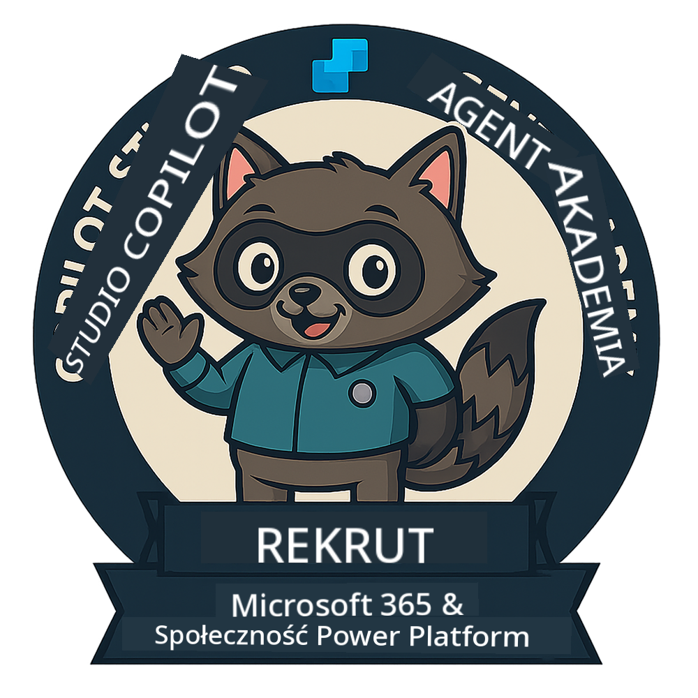
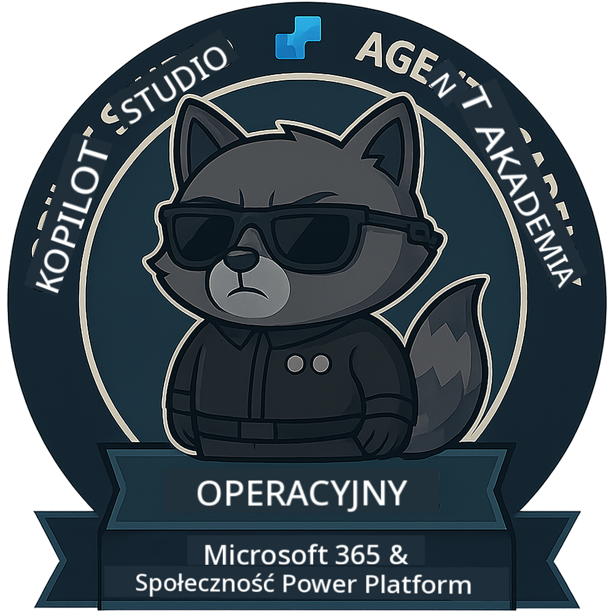
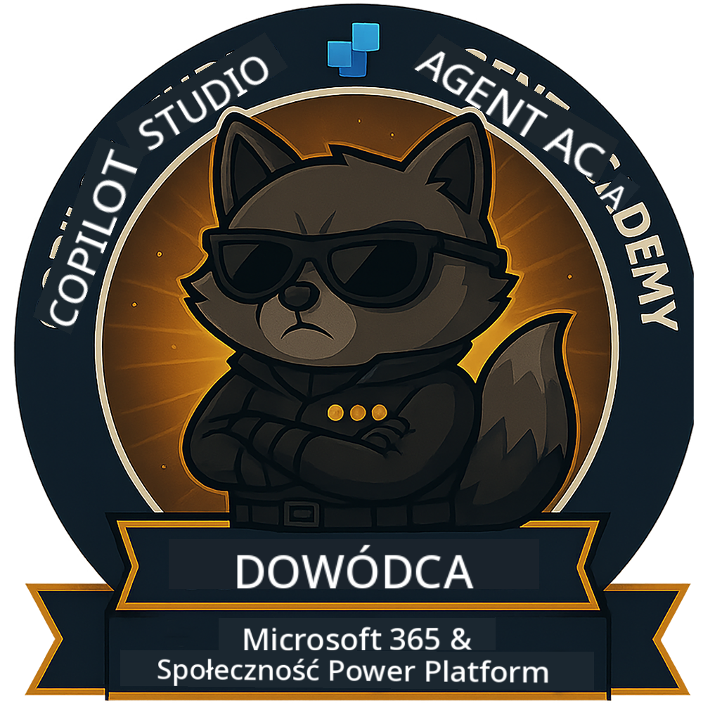

<!--
CO_OP_TRANSLATOR_METADATA:
{
  "original_hash": "15e57e059ce7689d602d7853187235cd",
  "translation_date": "2025-10-21T23:43:44+00:00",
  "source_file": "docs/index.md",
  "language_code": "pl"
}
-->
---
hide:
- navigation
---

# Akademia Agentów Copilot Studio

**Witamy w Akademii Agentów Copilot Studio.**  

Twoja misja – jeśli zdecydujesz się ją przyjąć – polega na opanowaniu sztuki tworzenia agentów za pomocą **Microsoft Copilot Studio**.

To praktyczne szkolenie jest Twoim wejściem do **świata agentów**: od precyzyjnych podpowiedzi po Adaptive Cards i przepływy agentów. Nauczysz się budować, skalować i wdrażać inteligentnych agentów, korzystając z rzeczywistych narzędzi i przypadków użycia.

---

## 🏅 Postęp Rangowy

**Akademia Agentów Copilot Studio** to wieloetapowy program szkoleniowy, który ma na celu rozwijanie Twoich umiejętności w trzech rangach agentów. Każdy poziom obejmuje odznakę i rosnące obowiązki:

| Ranga            | Poziom | Wizualizacja |
|------------------|:-----:|--------------|
| 🟢 **Rekrut**  [🚀 Rozpocznij](https://aka.ms/agent-academy-recruit){ .md-button .md-button--primary }     | •     | { width="300" }     |
| 🔵 **Agent Operacyjny** (Wkrótce)   | ••    | { width="300" } |
| 🟡 **Dowódca** (Wkrótce)    | •••   | { width="300" } |

Każdy poziom opiera się na poprzednim. Ukończ misję Rekruta i bądź na bieżąco, aby podnieść swoje kwalifikacje jako agent.

---

## 🎒 Inne Kursy

Sprawdź te inne kursy, aby kontynuować naukę o AI i agentach:

- [Microsoft Copilot Studio <3 MCP Lab](https://aka.ms/mcsmcplab)
- [Obóz dla Programistów Copilot](https://microsoft.github.io/copilot-camp/)
- [Agenci AI dla Początkujących](https://microsoft.github.io/ai-agents-for-beginners/)
- [Protokół Kontekstu Modelu (MCP) dla Początkujących](https://github.com/microsoft/mcp-for-beginners)

---

## 🚑 Problemy

Bardzo cenimy Twoją opinię! Prosimy o korzystanie z [listy problemów](https://github.com/microsoft/agent-academy/issues), aby podzielić się swoimi uwagami i zgłoszeniami. Dziękujemy!

---

## 📜 Kodeks Postępowania

Ten projekt przyjął [Kodeks Postępowania Microsoft Open Source](https://opensource.microsoft.com/codeofconduct/).

!!! info "Zasoby:"

    - [Kodeks Postępowania Microsoft Open Source](https://opensource.microsoft.com/codeofconduct/)
    - [FAQ dotyczące Kodeksu Postępowania Microsoft](https://opensource.microsoft.com/codeofconduct/faq/)
    - Skontaktuj się z [opencode@microsoft.com](mailto:opencode@microsoft.com) w przypadku pytań lub wątpliwości

---

[⭐️ Oznacz nasz repozytorium gwiazdką](https://github.com/microsoft/agent-academy){ .md-button .md-button--primary }

<!-- markdownlint-disable-next-line MD033 -->

---

**Zastrzeżenie**:  
Ten dokument został przetłumaczony za pomocą usługi tłumaczenia AI [Co-op Translator](https://github.com/Azure/co-op-translator). Chociaż staramy się zapewnić dokładność, prosimy pamiętać, że automatyczne tłumaczenia mogą zawierać błędy lub nieścisłości. Oryginalny dokument w jego rodzimym języku powinien być uznawany za autorytatywne źródło. W przypadku informacji krytycznych zaleca się skorzystanie z profesjonalnego tłumaczenia przez człowieka. Nie ponosimy odpowiedzialności za jakiekolwiek nieporozumienia lub błędne interpretacje wynikające z użycia tego tłumaczenia.