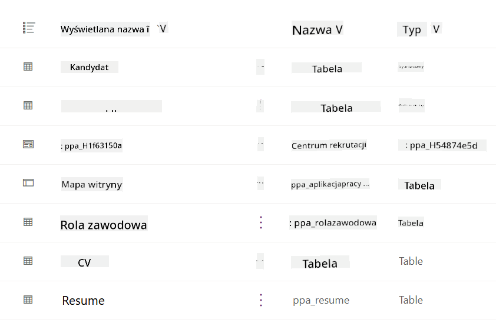
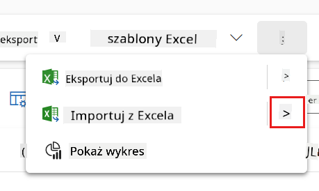
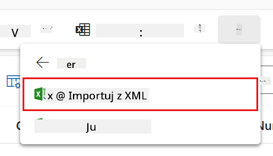
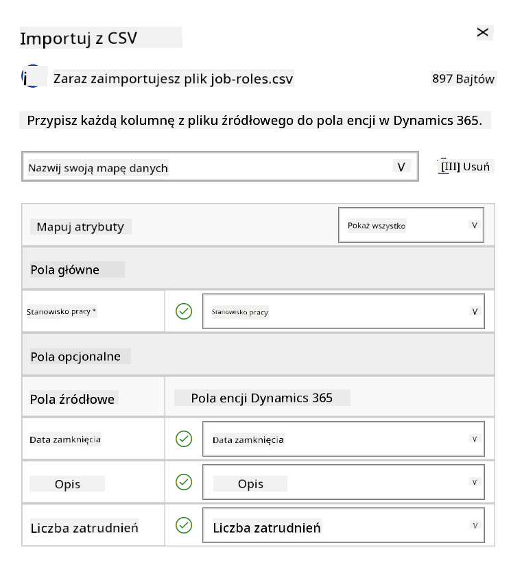
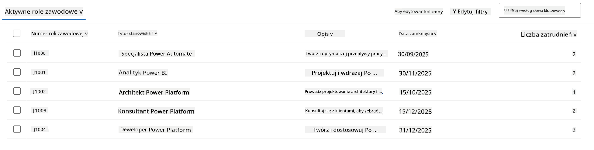
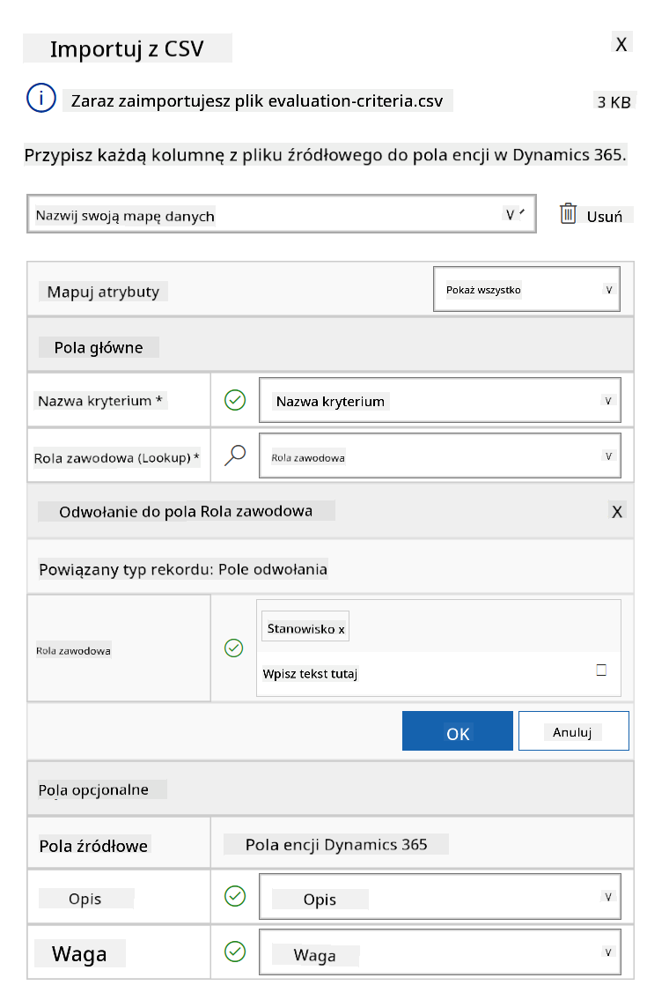
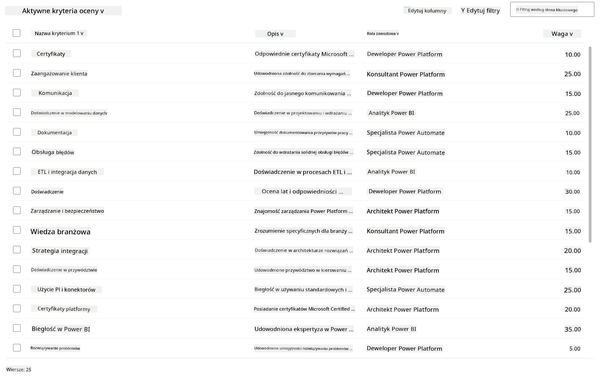

<!--
CO_OP_TRANSLATOR_METADATA:
{
  "original_hash": "2620cf9eaf09a3fc6be7fa31a3a62956",
  "translation_date": "2025-10-22T00:08:10+00:00",
  "source_file": "docs/operative-preview/01-get-started/README.md",
  "language_code": "pl"
}
-->
# 🚨 Misja 01: Rozpocznij pracę z Agentem Rekrutacyjnym

--8<-- "disclaimer.md"

## 🕵️‍♂️ KODOWA NAZWA: `OPERACJA ŁOWCA TALENTÓW`

> **⏱️ Czas trwania operacji:** `~45 minut`

## 🎯 Opis Misji

Witaj, Agencie. Twoje pierwsze zadanie to **Operacja Łowca Talentów** - stworzenie podstawowej infrastruktury dla systemu rekrutacyjnego opartego na sztucznej inteligencji, który zrewolucjonizuje sposób, w jaki organizacje identyfikują i zatrudniają najlepsze talenty.

Twoja misja, jeśli zdecydujesz się ją podjąć, polega na wdrożeniu i skonfigurowaniu kompleksowego systemu zarządzania rekrutacją za pomocą Microsoft Copilot Studio. Zaimportujesz gotowe rozwiązanie zawierające wszystkie niezbędne struktury danych, a następnie stworzysz swojego pierwszego agenta AI - **Agenta Rekrutacyjnego**, który będzie centralnym koordynatorem wszystkich przyszłych operacji rekrutacyjnych.

To początkowe wdrożenie ustanawia centrum dowodzenia, które będziesz rozwijać w trakcie programu Agent Academy Operative. Traktuj to jako bazę operacyjną - fundament, na którym zbudujesz całą sieć wyspecjalizowanych agentów w kolejnych misjach.

---

## 🔎 Cele

Po ukończeniu tej misji będziesz w stanie:

- **Zrozumienie scenariusza**: Zdobyć kompleksową wiedzę na temat wyzwań i rozwiązań związanych z automatyzacją rekrutacji
- **Wdrożenie rozwiązania**: Pomyślnie zaimportować i skonfigurować podstawy systemu zarządzania rekrutacją
- **Tworzenie agenta**: Zbudować Agenta Rekrutacyjnego, który będzie początkiem scenariusza, który rozwijasz jako Agent Academy Operative

---

## 🔍 Wymagania wstępne

Przed rozpoczęciem misji upewnij się, że masz:

- Licencję na Copilot Studio
- Dostęp do środowiska Microsoft Power Platform
- Uprawnienia administracyjne do tworzenia rozwiązań i agentów

---

## 🏢 Zrozumienie scenariusza automatyzacji rekrutacji

Ten scenariusz pokazuje, jak firma może wykorzystać Microsoft Copilot Studio do usprawnienia i automatyzacji procesu rekrutacji. Wprowadza system agentów, którzy współpracują, aby realizować zadania takie jak przeglądanie CV, rekomendowanie stanowisk, przygotowywanie materiałów do rozmów kwalifikacyjnych i ocena kandydatów.

### Wartość biznesowa

Rozwiązanie pomaga zespołom HR oszczędzać czas i podejmować lepsze decyzje dzięki:

- Automatycznemu przetwarzaniu CV otrzymanych drogą mailową.
- Sugerowaniu odpowiednich stanowisk na podstawie profili kandydatów.
- Tworzeniu aplikacji i przewodników do rozmów kwalifikacyjnych dostosowanych do każdego kandydata.
- Zapewnieniu uczciwych i zgodnych z przepisami praktyk rekrutacyjnych dzięki wbudowanym funkcjom bezpieczeństwa i moderacji.
- Zbieraniu opinii w celu ulepszania rozwiązania.

### Jak to działa

- Centralny **Agent Rekrutacyjny** koordynuje proces i przechowuje dane w Microsoft Dataverse.
- **Agent Przyjmowania Aplikacji** odczytuje CV i tworzy aplikacje.
- **Agent Przygotowania Rozmów** generuje pytania i dokumenty do rozmów kwalifikacyjnych na podstawie doświadczenia kandydata.
- System może być opublikowany na stronie demo, umożliwiając interesariuszom interakcję z nim.

Ten scenariusz jest idealny dla organizacji, które chcą zmodernizować swoje procesy rekrutacyjne za pomocą automatyzacji opartej na AI, zachowując przejrzystość, uczciwość i efektywność.

---

## 🧪 Laboratorium: Konfiguracja Agenta Rekrutacyjnego

W tym praktycznym laboratorium ustanowisz podstawy swojego systemu automatyzacji rekrutacji. Zaczniesz od zaimportowania wstępnie skonfigurowanego rozwiązania, które zawiera wszystkie niezbędne tabele Dataverse i struktury danych do zarządzania kandydatami, stanowiskami pracy i procesami rekrutacyjnymi. Następnie wypełnisz te tabele przykładowymi danymi, które będą wspierać Twoją naukę w tym module i dostarczać realistycznych scenariuszy do testowania. Na koniec stworzysz Agenta Rekrutacyjnego w Copilot Studio, konfigurując podstawowy interfejs konwersacyjny, który będzie fundamentem dla wszystkich innych funkcji, które dodasz w przyszłych misjach.

### 🧪 Laboratorium 1.1: Importowanie rozwiązania

1. Przejdź do **[Copilot Studio](https://copilotstudio.microsoft.com)**
1. Wybierz **...** w lewym menu nawigacyjnym i wybierz **Solutions**
1. Kliknij przycisk **Import Solution** na górze
1. **[Pobierz](https://raw.githubusercontent.com/microsoft/agent-academy/refs/heads/main/docs/operative-preview/01-get-started/assets/Operative_1_0_0_0.zip)** przygotowane rozwiązanie
1. Wybierz **Browse** i wskaż pobrane rozwiązanie z poprzedniego kroku
1. Kliknij **Next**
1. Kliknij **Import**

!!! success
    Po pomyślnym imporcie zobaczysz zielony pasek powiadomień z następującym komunikatem:  
    "Solution "Operative" imported successfully."

Po zaimportowaniu rozwiązania, zapoznaj się z jego zawartością, wybierając nazwę wyświetlaną rozwiązania (`Operative`).



Zaimportowane zostały następujące komponenty:

| Nazwa wyświetlana | Typ | Opis |
|-------------------|------|------|
| Kandydat | Tabela | Informacje o kandydacie |
| Kryteria oceny | Tabela | Kryteria oceny dla stanowiska |
| Centrum Rekrutacji | Aplikacja oparta na modelu | Aplikacja do zarządzania procesem rekrutacji |
| Centrum Rekrutacji | Mapa witryny | Struktura nawigacyjna dla aplikacji Centrum Rekrutacji |
| Aplikacja o pracę | Tabela | Aplikacje o pracę |
| Stanowisko pracy | Tabela | Stanowiska pracy |
| CV | Tabela | CV kandydatów |

Jako ostatnie zadanie w tym laboratorium, kliknij przycisk **Publish all customizations** na górze strony.

### 🧪 Laboratorium 1.2: Importowanie przykładowych danych

W tym laboratorium dodasz przykładowe dane do niektórych tabel zaimportowanych w laboratorium 1.1.

#### Pobierz pliki do importu

1. **[Pobierz](https://raw.githubusercontent.com/microsoft/agent-academy/refs/heads/main/docs/operative-preview/01-get-started/assets/evaluation-criteria.csv)** plik CSV z kryteriami oceny
1. **[Pobierz](https://raw.githubusercontent.com/microsoft/agent-academy/refs/heads/main/docs/operative-preview/01-get-started/assets/job-roles.csv)** plik CSV ze stanowiskami pracy

#### Importowanie przykładowych danych o stanowiskach pracy

1. Wróć do rozwiązania, które właśnie zaimportowałeś w poprzednim laboratorium
1. Wybierz aplikację opartą na modelu **Centrum Rekrutacji**, klikając pole wyboru przed wierszem
1. Kliknij przycisk **Play** na górze

    !!! warning
        Możesz zostać poproszony o ponowne zalogowanie się. Upewnij się, że to zrobisz. Po zalogowaniu powinieneś zobaczyć aplikację Centrum Rekrutacji.

1. Wybierz **Stanowiska pracy** w lewym menu nawigacyjnym
1. Kliknij ikonę **Więcej** (trzy kropki jedna pod drugą) na pasku poleceń
1. Kliknij **strzałkę w prawo** obok *Import from Excel*

    

1. Kliknij **Import from CSV**

    

1. Kliknij przycisk **Choose File**, wybierz plik **job-roles.csv**, który właśnie pobrałeś, a następnie kliknij **Open**
1. Kliknij **Next**
1. Pozostaw kolejny krok bez zmian i kliknij **Review Mapping**

    

1. Upewnij się, że mapowanie jest poprawne i kliknij **Finish Import**

    !!! info
        Rozpocznie się import, a postęp można śledzić lub zakończyć proces natychmiast, klikając **Done**

1. Kliknij **Done**

Może to chwilę potrwać, ale możesz kliknąć przycisk **Refresh**, aby sprawdzić, czy import zakończył się sukcesem.



#### Importowanie przykładowych danych o kryteriach oceny

1. Wybierz **Kryteria oceny** w lewym menu nawigacyjnym
1. Kliknij ikonę **Więcej** (trzy kropki jedna pod drugą) na pasku poleceń
1. Kliknij **strzałkę w prawo** obok *Import from Excel*

    

1. Kliknij **Import from CSV**

    

1. Kliknij przycisk **Choose File**, wybierz plik **evaluation-criteria.csv**, który właśnie pobrałeś, a następnie kliknij **Open**
1. Kliknij **Next**
1. Pozostaw kolejny krok bez zmian i kliknij **Review Mapping**

    

1. Teraz musimy wykonać trochę więcej pracy przy mapowaniu. Kliknij ikonę lupy (🔎) obok pola Stanowisko pracy
1. Upewnij się, że wybrano **Tytuł stanowiska**, a jeśli nie - dodaj go
1. Kliknij **OK**
1. Upewnij się, że reszta mapowania jest również poprawna i kliknij **Finish Import**

    !!! info
        Rozpocznie się ponownie import, a postęp można śledzić lub zakończyć proces natychmiast, klikając **Done**

1. Kliknij **Done**

Może to chwilę potrwać, ale możesz kliknąć przycisk **Refresh**, aby sprawdzić, czy import zakończył się sukcesem.



### 🧪 Laboratorium 1.3: Tworzenie Agenta Rekrutacyjnego

Teraz, gdy zakończyłeś konfigurację wymagań wstępnych, czas na właściwą pracę! Najpierw dodajmy naszego Agenta Rekrutacyjnego!

1. Przejdź do **[Copilot Studio](https://copilotstudio.microsoft.com)** i upewnij się, że jesteś w tym samym środowisku, w którym zaimportowałeś rozwiązanie i dane
1. Wybierz **Agents** w lewym menu nawigacyjnym
1. Kliknij **New Agent**
1. Kliknij **Configure**
1. W polu **Name** wpisz:

    ```text
    Hiring Agent
    ```

1. W polu **Description** wpisz:

    ```text
    Central orchestrator for all hiring activities
    ```

1. Kliknij **...** obok przycisku *Create* w prawym górnym rogu
1. Wybierz **Update advanced settings**
1. W polu **Solution** wybierz `Operative`
1. Kliknij **Update**
1. Kliknij **Create** w prawym górnym rogu

To utworzy dla Ciebie Agenta Rekrutacyjnego, którego będziesz używać w całym kursie Operative.

---

## 🎉 Misja zakończona

Misja 01 zakończona! Opanowałeś następujące umiejętności:

✅ **Zrozumienie scenariusza**: Kompleksowa wiedza na temat wyzwań i rozwiązań związanych z automatyzacją rekrutacji  
✅ **Wdrożenie rozwiązania**: Pomyślnie zaimportowano i skonfigurowano podstawy systemu zarządzania rekrutacją  
✅ **Tworzenie agenta**: Stworzono Agenta Rekrutacyjnego, który jest początkiem scenariusza, który rozwijasz jako Agent Academy Operative  

Następnie [Misja 02](../02-multi-agent/README.md): Przygotuj swojego agenta do pracy w środowisku wieloagentowym z połączonymi agentami.

---

## 📚 Zasoby taktyczne

📖 [Microsoft Copilot Studio - Tworzenie agenta](https://learn.microsoft.com/microsoft-copilot-studio/authoring-first-bot)  
📖 [Dokumentacja Microsoft Dataverse](https://learn.microsoft.com/power-apps/maker/data-platform)

---

**Zastrzeżenie**:  
Ten dokument został przetłumaczony za pomocą usługi tłumaczenia AI [Co-op Translator](https://github.com/Azure/co-op-translator). Chociaż staramy się zapewnić dokładność, prosimy pamiętać, że automatyczne tłumaczenia mogą zawierać błędy lub nieścisłości. Oryginalny dokument w jego rodzimym języku powinien być uznawany za autorytatywne źródło. W przypadku informacji krytycznych zaleca się skorzystanie z profesjonalnego tłumaczenia przez człowieka. Nie ponosimy odpowiedzialności za jakiekolwiek nieporozumienia lub błędne interpretacje wynikające z użycia tego tłumaczenia.