<!--
CO_OP_TRANSLATOR_METADATA:
{
  "original_hash": "75efaf515d5694d4fd549bfd6518901a",
  "translation_date": "2025-10-22T00:16:27+00:00",
  "source_file": "docs/operative-preview/03-automate-triggers/README.md",
  "language_code": "pl"
}
-->
# Misja 03: Dodaj wyzwalacze zdarzeń, aby działać autonomicznie

--8<-- "disclaimer.md"

## 🕵️‍♂️ KODOWA NAZWA: `OPERACJA PUNKT SYGNAŁOWY`

> **⏱️ Czas trwania operacji:** `~45 minut`

## 🎯 Opis Misji

Witaj ponownie, Agencie. W [Misji 02](../02-multi-agent/README.md) nauczyłeś się, jak stworzyć agenta ds. przyjmowania aplikacji oraz agenta ds. przygotowania do rozmowy kwalifikacyjnej, aby poszerzyć możliwości swojego głównego agenta ds. rekrutacji.

Twoim zadaniem, jeśli zdecydujesz się je przyjąć, jest **Operacja Punkt Sygnałowy** - zgłębianie tematu **wyzwalaczy zdarzeń**, aby podnieść system agentów z poziomu reaktywnego na **autonomiczne działanie**. Przekształcisz swoich agentów z czekających na dane od człowieka w takich, którzy proaktywnie reagują na zdarzenia zewnętrzne i podejmują inteligentne działania bez nadzoru.

Pomyśl o tym jak o przejściu od agentów, którzy _odpowiadają na pytania_, do agentów, którzy _przewidują potrzeby_ i _działają niezależnie_. Dzięki wyzwalaczom zdarzeń i zautomatyzowanym przepływom pracy Twój agent ds. rekrutacji będzie wykrywał przychodzące e-maile z CV, automatycznie przetwarzał załączniki, przechowywał dane w Dataverse i powiadamiał zespół rekrutacyjny HR za pośrednictwem Microsoft Teams - wszystko to, podczas gdy Ty skupisz się na zadaniach o wyższej wartości.

Witaj w świecie, gdzie automatyzacja spotyka się z inteligencją.

## 🔎 Cele

W tej misji nauczysz się:

1. Jak wyzwalacze zdarzeń umożliwiają autonomiczne zachowanie agenta bez interakcji użytkownika
1. Różnic między interaktywnymi a autonomicznymi agentami w Copilot Studio
1. Jak tworzyć wyzwalacze zdarzeń, które automatycznie przetwarzają załączniki e-mail i przesyłają pliki do Dataverse
1. Jak budować przepływy agentów, które publikują adaptacyjne karty w kanałach Teams w celu powiadamiania
1. Jak przekazywać dane między wyzwalaczami zdarzeń a przepływami agentów dla pełnej automatyzacji

## 🤔 Co to jest wyzwalacz zdarzeń?

Wcześniej w [Recruit](../../recruit/10-add-event-triggers/README.md) poznaliśmy wyzwalacze zdarzeń. Zróbmy szybkie podsumowanie na wypadek, gdybyś to przegapił.

**Wyzwalacze zdarzeń** pozwalają agentowi _działać_ samodzielnie, gdy coś dzieje się w innym systemie - bez potrzeby wiadomości od użytkownika. Gdy skonfigurowane zdarzenie zostanie uruchomione - na przykład „nowy element SharePoint”, „nowy e-mail”, „przypisane zadanie w Plannerze” lub nawet zdarzenie oparte na czasie, konektor wysyła ładunek wyzwalacza do Twojego agenta. Agent następnie wykonuje Twoje instrukcje, aby zdecydować, które działania lub tematy wywołać.

### Kluczowe cechy

- **Autonomiczne uruchamianie:**
      - W przeciwieństwie do wyzwalaczy tematów, które zaczynają się, gdy użytkownik pisze do agenta, wyzwalacze zdarzeń uruchamiają się na podstawie zdarzeń zewnętrznych, umożliwiając proaktywne zachowanie.

- **Sterowanie ładunkiem:**
      - Każde zdarzenie dostarcza ładunek (zmienne + opcjonalne instrukcje) za pośrednictwem konektora. Agent wykorzystuje zdefiniowane przez Ciebie instrukcje i ładunek, aby zdecydować, co zrobić dalej.
      - Na przykład _wywołać temat_ lub _wykonać działania zdefiniowane przez narzędzia_.

- **Przykłady gotowe do użycia:**
      - Plik lub element utworzony w SharePoint/OneDrive
      - Zadanie w Plannerze ukończone/przypisane
      - Odpowiedź w Microsoft Forms przesłana
      - Powtarzalność/harmonogram

    Dostępność zależy od polityk danych Twojej organizacji skonfigurowanych w Power Automate.

- **Wymaga generatywnej orkiestracji:**
      - Wyzwalacze zdarzeń są dostępne tylko wtedy, gdy generatywna orkiestracja jest włączona dla agenta.

- **Koszty/użycie:**
      - Każde dostarczenie wyzwalacza liczy się jako wiadomość w ramach pojemności Copilot Studio.
      - Na przykład powtarzalność co 10 minut wysyła wiadomość co 10 minut.

- **Model uwierzytelniania i konfiguracja:**
      - Dodajesz wyzwalacze w zakładce _Przegląd_ agenta, w sekcji _Wyzwalacze_. Uwierzytelnianie konektora wyzwalacza wykorzystuje konto twórcy agenta („uwierzytelnianie autora agenta”).
      - Możesz edytować parametry wyzwalacza i ładunek w portalu twórcy Power Automate.

- **Testowanie i obserwowalność:**
      - Możesz testować wyzwalacze z poziomu panelu testowego agenta i sprawdzać zachowanie na mapie aktywności przed publikacją.

!!! info "TL;DR dla programistów"

    Pomyśl o wyzwalaczach zdarzeń jak o **sygnałach podobnych do webhooków**, które przesyłają strukturalny ładunek do Twojego agenta, pozwalając mu _rozpocząć_ pracę i łączyć działania między systemami - bez czekania na zapytanie użytkownika.

### Wyzwalacze tematów - czym się różnią

Wcześniej nauczyłeś się o wyzwalaczach tematów w [Recruit](../../recruit/07-add-new-topic-with-trigger/README.md), jednak możesz się zastanawiać, jak _Wyzwalacze tematów_ różnią się od _Wyzwalaczy zdarzeń_ i dlaczego to rozróżnienie ma znaczenie dla zrozumienia, co czyni agenta autonomicznym.

Wyzwalacze tematów kontrolują _kiedy temat jest uruchamiany_, zazwyczaj w odpowiedzi na wiadomość użytkownika.

- W generatywnej orkiestracji domyślnym wyzwalaczem jest **Przez agenta** - planista wybiera temat, którego nazwa/opis najlepiej pasuje do wiadomości użytkownika.
- W klasycznej orkiestracji domyślnym wyzwalaczem są **Frazy** - planista wybiera temat, gdy jedna lub kilka fraz wyzwalających najlepiej pasuje do wiadomości użytkownika.

Inne typy wyzwalaczy obejmują `Otrzymano wiadomość`, `Otrzymano zdarzenie`, `Otrzymano aktywność`, `Aktualizacja rozmowy`, `Otrzymano wywołanie`, `Brak aktywności` i `Plan ukończony`.

!!! info "Podstawowa różnica"

    Wyzwalacze tematów są _rozpoczęciem aktywności rozmowy_ w czacie.
    
    Wyzwalacze zdarzeń są _rozpoczęciem zdarzenia systemowego_ dostarczonego przez konektory, które mogą uruchomić agenta bez żadnej rozmowy.

### Szybki przewodnik: Wyzwalacz tematów vs Wyzwalacz zdarzeń

- **Wyzwalacz tematów:** Użytkownik (lub aktywność czatu) powiedział/zrobił X ➡️ uruchom Temat T.
- **Wyzwalacz zdarzeń:** SharePoint/Planner/E-mail/Timer uruchomił zdarzenie z ładunkiem P ➡️ agent ocenia instrukcje ➡️ wywołuje Działania/Tematy zgodnie z tym.

## 🏓 Agent interaktywny vs Agent autonomiczny - porównanie

Teraz, gdy znasz różnicę między wyzwalaczami zdarzeń a wyzwalaczami tematów, przejdźmy do nauki różnic między agentem interaktywnym a autonomicznym.

W terminologii Copilot Studio „interaktywny” odnosi się do agentów, którzy głównie angażują się za pomocą **tematów** w czacie lub kanale. „Autonomiczny” odnosi się do agentów, którzy również wykorzystują **wyzwalacze zdarzeń**, aby działać bez danych od użytkownika.

Poniższa tabela podsumowuje ich różnice i podobieństwa.

| Wymiar                              | Agent interaktywny    | Agent autonomiczny                                                                                           |
|-------------------------------------|-----------------------|---------------------------------------------------------------------------------------------------------------|
| Jak się uruchamia                   | Użytkownik (lub aktywność czatu) wyzwala temat. Przykład: Przez agenta, Frazy, Otrzymano wiadomość. | Zewnętrzny wyzwalacz zdarzenia wysyła ładunek przez konektor do agenta. Przykład: SharePoint, Planner, e-mail, harmonogram, itp. |
| Główne zastosowanie                 | Pytania i odpowiedzi, prowadzone przepływy pracy, działania na żądanie w czacie - Teams, web, itp. | Proaktywne operacje i automatyzacja w tle - reakcja na zmiany w systemie, a następnie powiadamianie, archiwizacja lub organizacja zadań. |
| Powierzchnia wyzwalacza             | Wyzwalacze tematów: Przez agenta / Frazy / Otrzymano wiadomość / Typy aktywności / Wywołanie / Brak aktywności / Plan ukończony | Biblioteka wyzwalaczy zdarzeń przez konektory; ładunek zawiera dane zdarzenia + opcjonalne instrukcje. |
| Planista (generatywna orkiestracja) | Silnie wykorzystywany dla wyzwalaczy Przez agenta i Plan ukończony do wyboru/sekwencji tematów. | Wymagany dla wyzwalaczy zdarzeń; agent wykorzystuje instrukcje + ładunek, aby zdecydować, które działania/tematy wywołać. |
| Typowy przykład                     | Użytkownik pyta „Jaka jest nasza polityka zwrotów?” → Temat uruchamia się, wyszukuje informacje, odpowiada. | Przypisano nowe zadanie w Plannerze → Wyzwalacz zdarzenia uruchamia się → Agent publikuje wiadomość w Teams, aktualizuje rekord lub wywołuje temat. |
| Ścieżka konfiguracji                | Tworzenie tematów, definiowanie typu wyzwalacza, tworzenie dialogów/działań; publikacja w kanałach. | Dodanie wyzwalacza zdarzenia (Przegląd → Wyzwalacze), uwierzytelnienie konektora za pomocą danych autora agenta, konfiguracja ładunku/instrukcji; testowanie w panelu testowym; publikacja. |
| Uwierzytelnianie i zarządzanie      | Działa w kontekście kanału/uwierzytelnienia; wyzwalacze tematów reagują na aktywności czatu w dozwolonych kanałach. | Dostępność wyzwalaczy zależy od polityk danych Power Automate; konektory działają na koncie twórcy agenta. |
| Obserwowalność                      | Testowanie tematów w Copilot Studio, analiza transkrypcji rozmów/aktywności. | Użyj Test trigger i mapy aktywności, aby zweryfikować wykonanie przed publikacją, monitoruj aktywność po publikacji. |
| Wpływ na pojemność                  | Każda wiadomość użytkownika/odpowiedź agenta to wiadomość zużywająca pojemność. | Każde dostarczenie zdarzenia to również wiadomość, plus wszelkie kolejne działania. Przykład: powtarzalność co 10 minut = 6 wiadomości/godzinę |

### Kiedy używać którego?

- Wybierz **wyzwalacze tematów (interaktywne)**, gdy użytkownicy inicjują rozmowę z agentem - FAQ, prowadzone przyjmowanie, lub zadania w stylu poleceń w czacie. Wyzwalacz Przez agenta planisty zmniejsza konieczność ręcznego tworzenia fraz.
- Dodaj **wyzwalacze zdarzeń (autonomiczne)**, gdy agent powinien rozpocząć rozmowę lub podjąć działanie samodzielnie - na podstawie aktualizacji w SharePoint/Dataverse, przychodzącego e-maila lub harmonogramu. To przenosi Cię z operacji reaktywnych do proaktywnych.

## Wskazówki dla programistów i pułapki

1. **Włącz generatywną orkiestrację** dla każdego agenta, którego chcesz uczynić autonomicznym. Wyzwalacze zdarzeń nie będą widoczne inaczej.

1. **Modeluj ładunek na wczesnym etapie.** Zdecyduj, jakie minimalne pola Twój agent potrzebuje od wyzwalacza, takie jak `itemId`, `assignedTo`, `dueDate` i dodaj zwięzłe instrukcje, które powiedzą agentowi, jakie działanie/temat wywołać na podstawie wartości ładunku.

1. **Zakres uwierzytelniania ma znaczenie.** Wyzwalacze uwierzytelniają się za pomocą konta twórcy agenta. Upewnij się, że konto ma odpowiednie uprawnienia konektora i jest zgodne z politykami danych Power Automate.

1. **Kontroluj koszty i hałas.** Częste powtarzalności lub bardzo „gadatliwe” źródła mogą szybko zwiększyć zużycie wiadomości - ograniczaj tam, gdzie to możliwe, lub dodaj warunki w wyzwalaczu, aby filtrować zdarzenia.

1. **Testuj przed publikacją.** Użyj **Test trigger** i mapy aktywności, aby obserwować plan i wywoływane działania - iteruj instrukcje/ładunek, aż zachowanie będzie stabilne.

## 🧪 Laboratorium 03 - Automatyzacja e-maili z aplikacjami kandydatów

Następnie dodamy wyzwalacz zdarzenia do **Agenta ds. rekrutacji** i zbudujemy przepływ agenta w podrzędnym **Agencie ds. przyjmowania aplikacji**, aby obsłużyć dalsze przetwarzanie dla autonomii.

### ✨ Scenariusz użycia

!!! info ""

    **Jako** Rekruter HR

    **Chcę** być powiadamiany, gdy e-mail z CV dotrze do mojej skrzynki odbiorczej i zostanie automatycznie przesłany do Dataverse

    **Aby móc** być na bieżąco z CV przesyłanymi e-mailem dla aplikacji automatycznie przesłanych do Dataverse

Osiągniemy to za pomocą dwóch technik:

1. Wyzwalacza zdarzenia, gdy e-mail dotrze,
    1. Sprawdź, czy `contentType` pliku równa się `PDF` jako typ formatu.
    1. Wyodrębnij plik i prześlij do Dataverse za pomocą działań przez konektor Dataverse.
    1. Następnie wyślij polecenie do agenta do dalszego przetwarzania, przekazując parametry wejściowe z działań Dataverse.

1. Przepływ agenta zostanie dodany do podrzędnego **Agenta ds. przyjmowania aplikacji**, który zostanie wywołany przez polecenie w wyzwalaczu zdarzenia.
    1. Użyj parametrów wejściowych przekazanych z polecenia wyzwalacza zdarzenia w adaptacyjnej karcie opublikowanej w kanale Microsoft Teams, aby powiadomić zespół rekrutacyjny HR. Adaptacyjna karta będzie zawierała link do wiersza w Dataverse, który będzie widoczny w **Agencie ds. rekrutacji**.

Zaczynajmy!

### ✨ Wymagania wstępne do ukończenia tej misji

Musisz **albo**:

- **Ukończyć Misję 01 i Misję 02** i mieć gotowego Agenta ds. rekrutacji, **ALBO**
- **Zaimportować rozwiązanie startowe Misji 03**, jeśli zaczynasz od zera lub potrzebujesz nadrobić zaległości. [Pobierz rozwiązanie startowe Misji 03](https://aka.ms/agent-academy)

!!! note "Importowanie rozwiązania i danych przykładowych"
    Jeśli korzystasz z rozwiązania startowego, zapoznaj się z [Misją 01](../01-get-started/README.md) w celu uzyskania szczegółowych instrukcji dotyczących importowania rozwiązań i danych przykładowych do swojego środowiska.

Będziesz także potrzebować dostępu do **Microsoft Teams**, aby ukończyć drugie ćwiczenie laboratoryjne dotyczące publikowania adaptacyjnej karty w Microsoft Teams.

###
Teraz zaktualizujemy wyzwalacz zdarzenia, aby dodać więcej funkcji automatyzacji. Wybierz **trzy kropki (...)** przy wyzwalaczu i wybierz **Edytuj w Power Automate**.


1. Wyzwalacz załaduje się jako przepływ w portalu twórcy Power Automate. To, co widzisz, to projektant przepływów w portalu twórcy Power Automate. Tutaj możemy dodać dodatkową logikę i akcje dla większej automatyzacji. Wyzwalacz pojawi się na górze, a **Wysyła zapytanie do określonego copilot do przetworzenia** jako ostatnia akcja w przepływie.

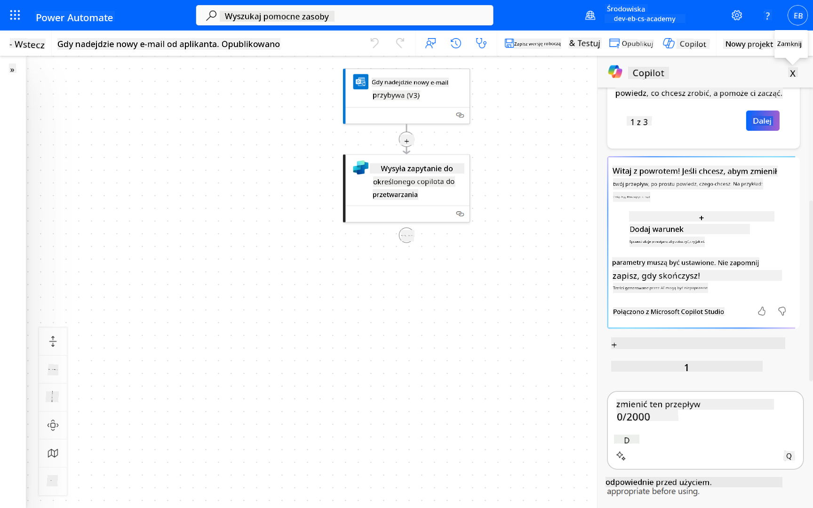

1. Domyślnie wyzwalacz **Gdy nadejdzie nowy e-mail** w Power Automate może przetwarzać wiele e-maili razem, jeśli kilka nadejdzie jednocześnie, uruchamiając przepływ tylko raz dla całej grupy.

Aby upewnić się, że przepływ działa osobno dla każdego e-maila, włącz ustawienie **Split On** w ustawieniach wyzwalacza i wybierz `@triggerOutputs()?['body/value']` w polu tablicy rozwijanej.

Po włączeniu **Split On** i ustawieniu pola tablicy na `@triggerOutputs()?['body/value']`, przepływ będzie działał indywidualnie dla każdej wiadomości, nawet jeśli wiele nadejdzie jednocześnie.

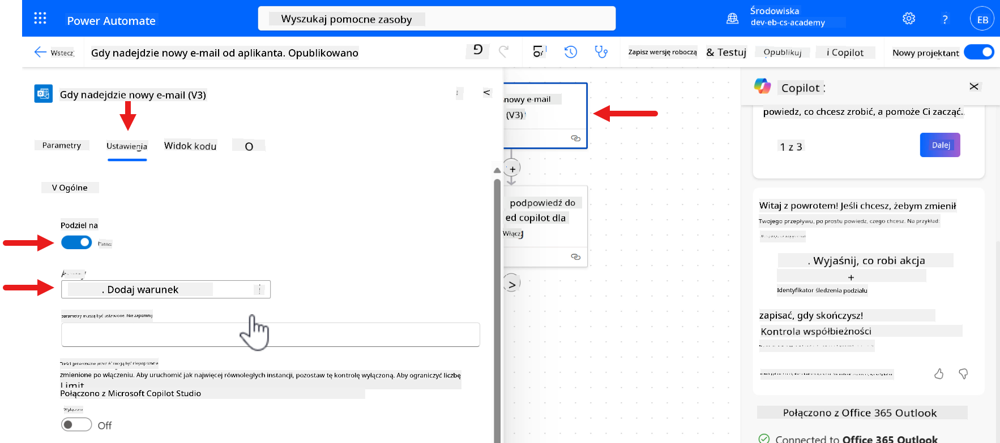

1. Następnie dodamy logikę sprawdzającą typ pliku załącznika. Chcemy przesyłać tylko załączniki w formacie .PDF, a nie obrazy (mogą pochodzić z podpisów e-mail). Wybierz ikonę **+** poniżej wyzwalacza i wybierz **Kontrola** w sekcji **Wbudowane narzędzia**.

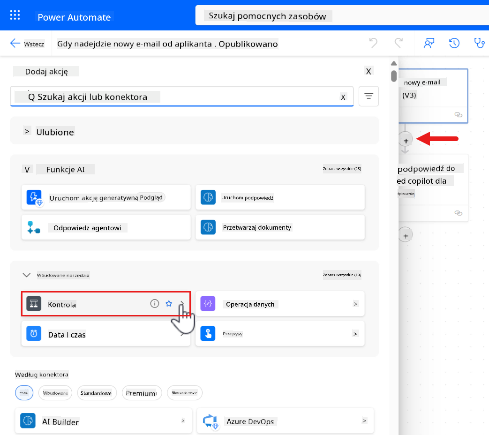

1. Wybierz akcję **Warunek**.


1. Teraz skonfigurujemy warunek, aby sprawdzić, czy typ pliku załącznika to .PDF. W polu **Wybierz wartość** wybierz ikonę **błyskawicy** lub **fx** po prawej stronie.

1. W polu **Szukaj** wpisz następujące:

```text
content type
```

1. Następnie wybierz parametr **Attachments Content-Type** z wyzwalacza.

1. Następnie wybierz **Dodaj**, aby dodać dynamiczne wejście treści do parametru **Id** akcji.

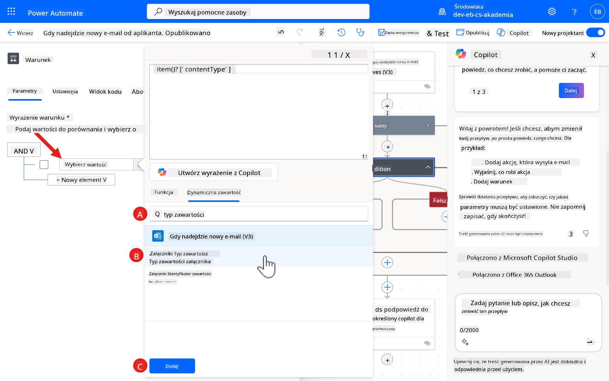

1. Zatrzymajmy się tutaj na chwilę, prawdopodobnie zauważyłeś, że akcja **Dla każdego** automatycznie się pojawiła.

Wybierz akcję **Dla każdego**. Ta akcja reprezentuje iterację przez każdy załącznik w e-mailu, ponieważ parametr **Attachments Content-Type** z wyzwalacza jest powiązany z każdym załącznikiem.

Pod spodem jest to tablica, dlatego akcja **Dla każdego** została automatycznie dodana, gdy wybraliśmy parametr **Attachments Content-Type** w akcji **Warunek**.

Aby dowiedzieć się więcej na ten temat, rozwiń poniższy blok dodatkowej nauki.

??? info "Dodatkowa nauka: Automatyczne pojawianie się akcji Dla każdego"

🤔 **Dlaczego "Zastosuj do każdego" lub "Dla każdego" pojawia się automatycznie?**

Kiedy wybierasz parametr (dynamiczną treść), który reprezentuje listę lub tablicę elementów - na przykład listę załączników, e-maili lub wierszy - Power Automate rozpoznaje, że możesz chcieć przetworzyć każdy element indywidualnie.

Aby Ci w tym pomóc, Power Automate automatycznie dodaje pętlę **"Zastosuj do każdego"** (lub **Dla każdego**) wokół Twojej akcji. Zapewnia to, że Twoja akcja będzie działać raz dla każdego elementu na liście, zamiast próbować przetworzyć całą listę naraz (co mogłoby spowodować błędy).

🦋 **Przykład**

- Jeśli wybierzesz "Załączniki" z poprzedniej akcji (które są tablicą) i spróbujesz użyć ich w akcji, która oczekuje pojedynczego pliku, Power Automate otacza Twoją akcję pętlą **"Zastosuj do każdego"** (lub **Dla każdego**).
- W ten sposób Twoja akcja będzie działać dla **każdego załącznika** - jeden po drugim.

💡 **Kluczowe punkty**

- **Automatyczne:** Pętla pojawia się automatycznie, aby pomóc Ci przetworzyć każdy element w kolekcji.
- **Zapobiega błędom:** Bez pętli Twoja akcja mogłaby się nie powieść, ponieważ nie może obsłużyć wielu elementów naraz.
- **Wizualna wskazówka:** To wizualny sposób pokazania, że Twój przepływ będzie powtarzał akcję dla każdego elementu na liście.


1. Następnie w drugim polu **Wybierz wartość** wpisz następujące:

```text
application/pdf
```

To zapewni, że dla każdego załącznika plikowego sprawdzany będzie format rozszerzenia pliku jako .PDF.

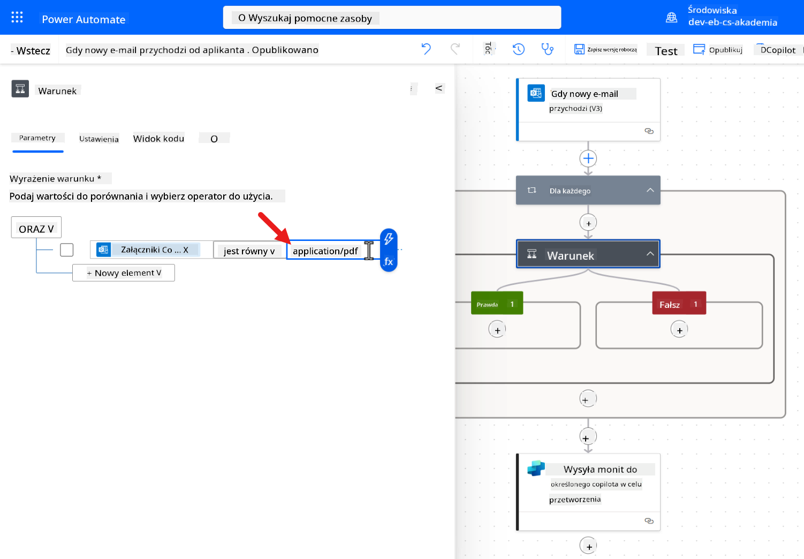

1. Teraz skonfigurujemy ścieżkę **True**, aby wyodrębnić plik z e-maila i przesłać go do tabeli Dataverse **Resume**.

Dodaj nową akcję poniżej w ścieżce **True** i wyszukaj `html to text`. Wybierz akcję **Html to text**.

Aby dowiedzieć się więcej o akcji **Html to text**, rozwiń poniższy blok dodatkowej nauki.

??? info "Dodatkowa nauka: Akcja Html to text"

🤔 **Co to jest akcja "HTML to text"?**

Akcja **HTML to text** w Power Automate służy do konwersji treści sformatowanej w HTML na zwykły tekst. Jest to szczególnie przydatne, gdy otrzymujesz dane (np. e-maile, treści internetowe lub odpowiedzi API), które zawierają tagi HTML, a chcesz wyodrębnić tylko czytelny tekst bez formatowania lub kodu.

⚙️ **Jak to działa?**

- **Wejście:** Podajesz ciąg treści HTML (na przykład treść e-maila).
- **Wyjście:** Akcja usuwa wszystkie tagi HTML i zwraca tylko zwykły tekst.

👍🏻 **Kiedy warto używać?**

- Gdy chcesz wyodrębnić czytelny tekst z e-maili, stron internetowych lub odpowiedzi API zawierających HTML.
- Przed wysłaniem treści do systemów, które nie obsługują formatowania HTML (np. SMS, wiadomości Teams lub bazy danych).
- Aby oczyścić dane do dalszego przetwarzania lub analizy.

🔭 **Gdzie to znaleźć?**

- W Power Automate w Agent Flows, wyszukaj akcję o nazwie `HTML to text`. Znajduje się w konektorze **Data Operations**.

💡 **Kluczowe punkty**

- Usuwa wszystkie tagi HTML i pozostawia tylko tekst.
- Nie interpretuje ani nie wykonuje skryptów/stylów - tylko usuwa tagi.
- Przydatne do czyszczenia danych i przygotowywania treści do wyjść w formacie zwykłego tekstu.

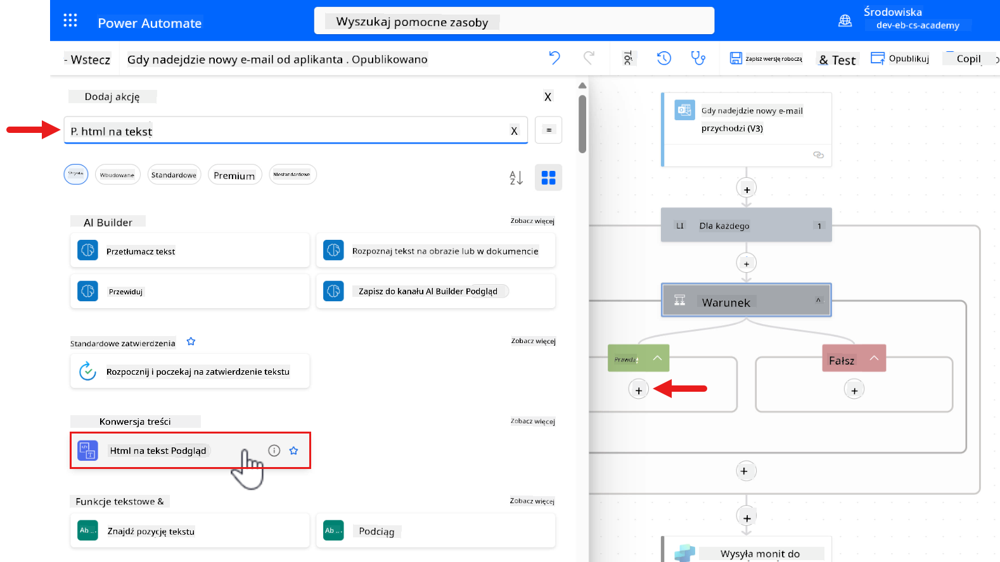

1. Następnie musimy utworzyć nowe odniesienie do połączenia dla akcji **Html to text**, wybierając **Dodaj nowe**.

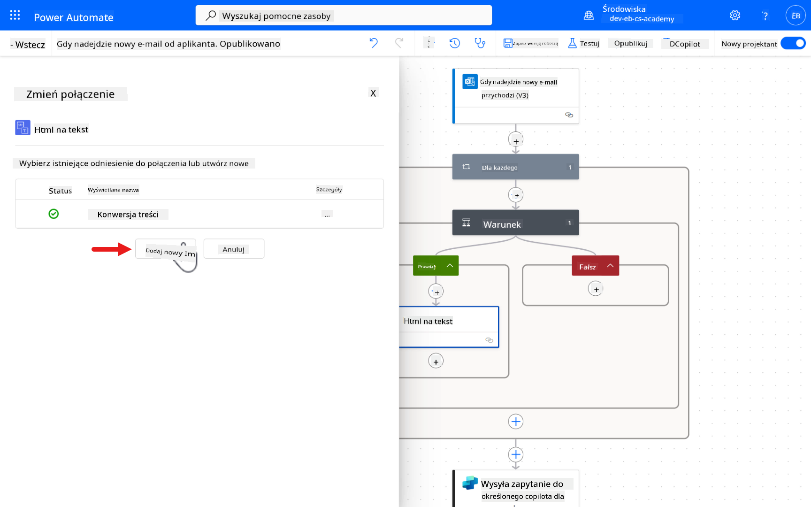

1. Akcja może teraz zostać skonfigurowana. Dodaj parametr **Body** z wyzwalacza. W polu **Treść** wybierz ikonę **błyskawicy** lub **fx** po prawej stronie.

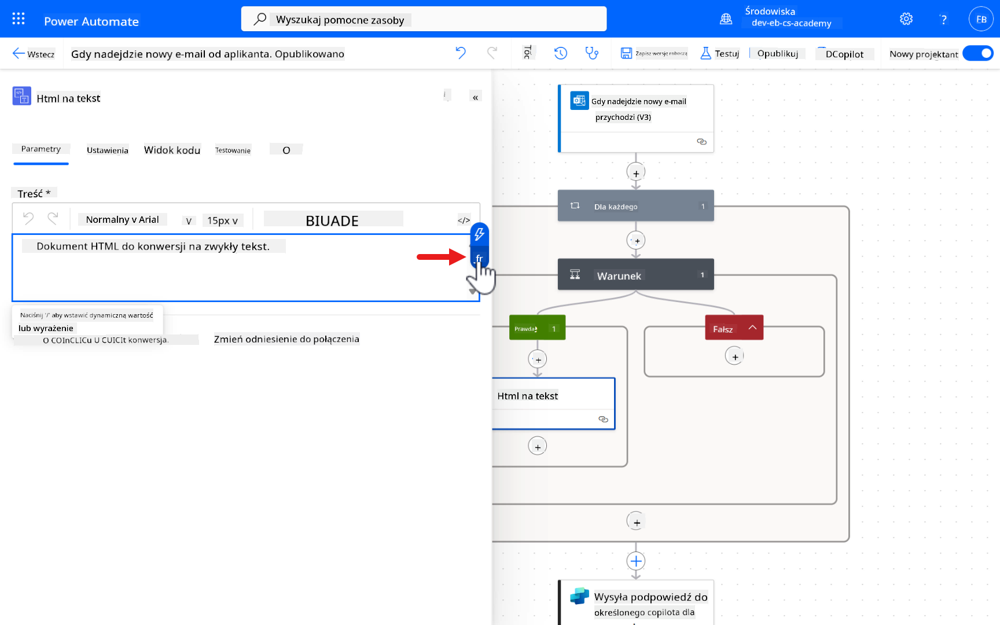

1. W zakładce **Dynamiczna treść** wyszukaj `body` i wybierz parametr **Body**, a następnie wybierz **Dodaj**.

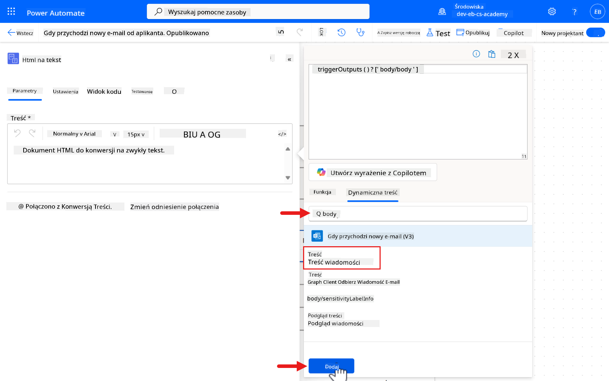

1. Zakończyliśmy konfigurację tej akcji, więc wyjdź z akcji, wybierając dwie strzałki («) skierowane w lewo, aby zwinąć panel.

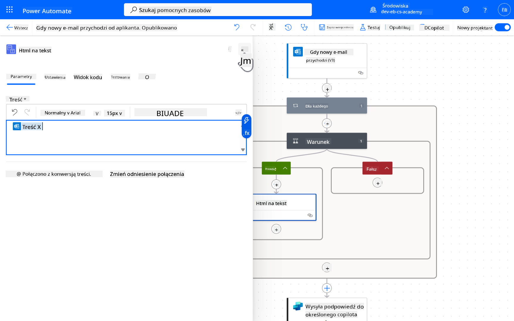

1. Dodamy nową akcję, wybierając **+ ikonę** poniżej akcji **Html to text**, co załaduje panel do dodawania akcji. Wybierz konektor **Microsoft Dataverse**.


1. Wybierz akcję **Dodaj nowy wiersz**.

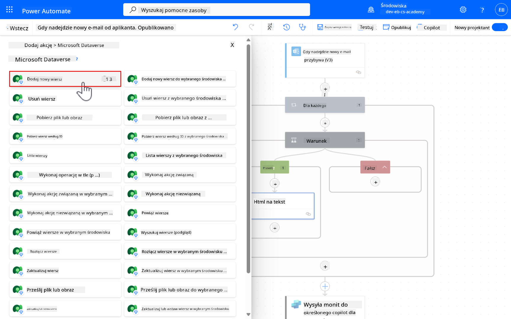

1. Zmień nazwę akcji, wybierając **Trzy kropki (...)**, skopiuj i wklej następującą nazwę:

```text
Dodaj nowy wiersz Resume
```

Dla parametru **Nazwa tabeli** wyszukaj `res` i wybierz tabelę **Resumes**.

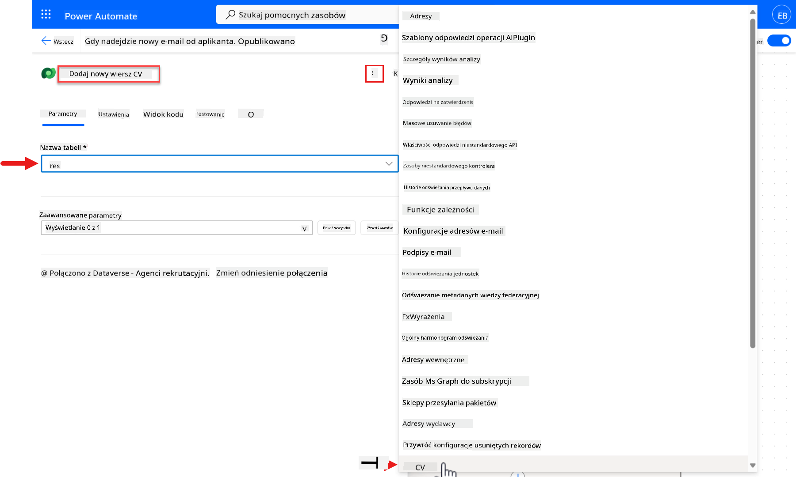

1. Wybierz pole **Tytuł CV**, a następnie wybierz ikonę **błyskawicy** lub **fx** po prawej stronie.

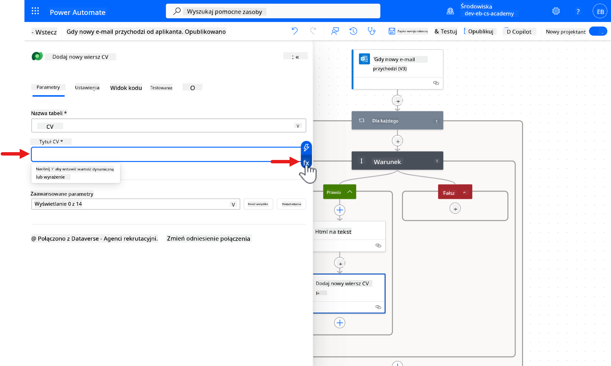

1. W zakładce **Funkcja** wpisz następujące wyrażenie, które używa funkcji `item()`:

```text
item()?['name']
```

Aby dowiedzieć się więcej o funkcji `item()`, rozwiń poniższy blok dodatkowej nauki.

??? info "Dodatkowa nauka: Funkcja `item()`"

🤔 **Co to jest funkcja `item()`?**

- Gdy używasz akcji **Zastosuj do każdego**, Power Automate przechodzi przez każdy element w kolekcji (tablicy).
- Najczęściej używana jest w akcjach takich jak **Zastosuj do każdego** (lub **Dla każdego**), **Wybierz** lub **Filtruj tablicę**.

⚙️ **Jak to działa?**

- `item()` to funkcja, która zwraca aktualnie przetwarzany element w pętli lub operacji na tablicy.
- W tej pętli `item()` odnosi się do _bieżącego elementu_ przetwarzanego.

📌 **Gdzie się jej używa?**

- **Zastosuj do każdego:** aby uzyskać właściwości bieżącego elementu.
- **Wybierz:** aby przekształcić każdy element w tablicy.
- **Filtruj tablicę:** aby odwołać się do bieżącego elementu ocenianego.

🦋 **Przykład**

- Wyrażenie w pętli:
       -  `item()?['Email']`
- Pobiera właściwość `Email` bieżącego elementu.

💡 **Kluczowe punkty**

- `item()` jest _kontekstowo zależne_: zawsze odnosi się do bieżącego elementu w pętli lub operacji na tablicy.
- Jeśli zagnieżdżasz pętle, możesz użyć `items('LoopName')`, aby odwołać się do elementów w konkretnej pętli.

Wybierz **Dodaj**, aby dodać wyrażenie do parametru **Tytuł CV**.

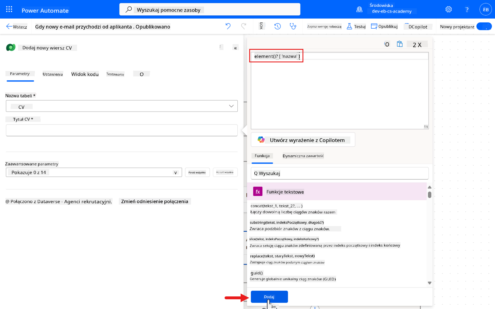

1. Nadal musimy skonfigurować kilka parametrów. Wybierz **Pokaż wszystko**, a w polu **List motywacyjny** wybierz ikonę **błyskawicy** lub **fx** po prawej stronie.

W zakładce **Funkcja** wpisz następujące wyrażenie, które używa tego samego wyrażenia co w poprzedniej [misji](../02-multi-agent/README.md).

```text
if(greater(length(body('Html_to_text')), 2000), substring(body('Html_to_text'), 0, 2000), body('Html_to_text'))
```

To wyrażenie sprawdza, czy _tekst_ z akcji **Html to text** jest dłuższy niż 2000 znaków, a jeśli tak, zwraca tylko pierwsze 2000 znaków; w przeciwnym razie zwraca pełny tekst.

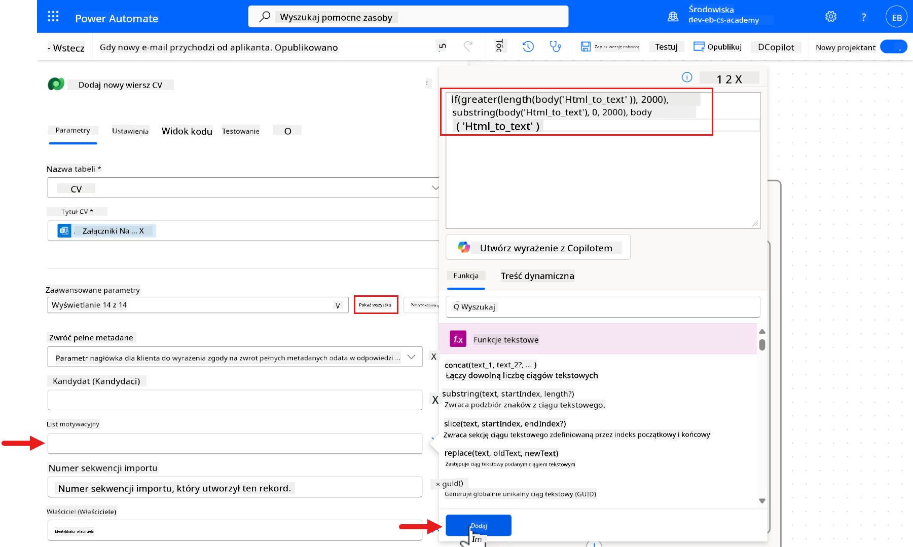

1. Wyrażenie zostanie teraz dodane do pola **List motywacyjny**.

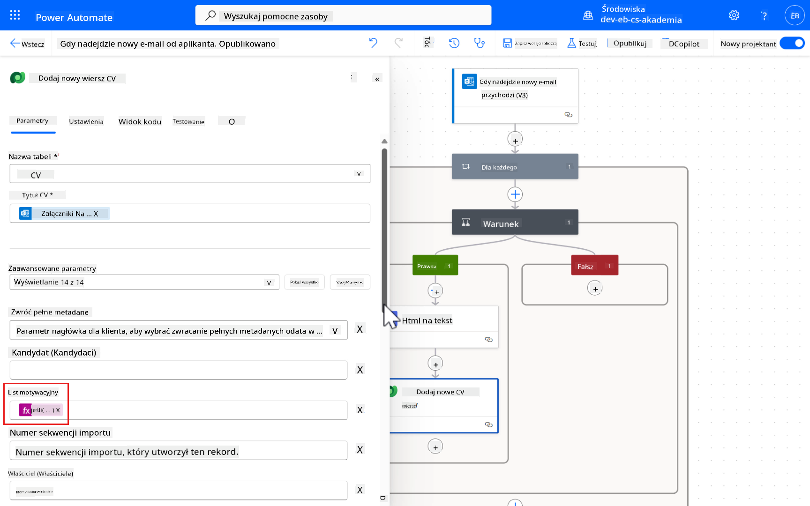

1. Dla pola **Adres e-mail źródła** wyszukaj `from` i wybierz parametr **From** z wyzwalacza, ponieważ zawiera on wartość adresu e-mail.

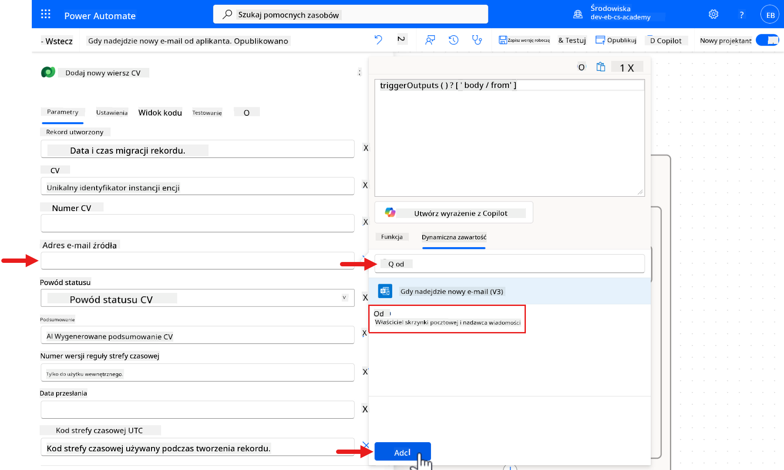

1. Dla pola **Data przesłania** wybierz ikonę **błyskawicy** lub **fx** po prawej stronie. W zakładce **Funkcja** wpisz następujące wyrażenie, które używa funkcji `utcNow()`.

```text
utcNow()
```

Aby dowiedzieć się więcej o funkcji `utcNow`, rozwiń poniższy blok dodatkowej nauki.

??? info "Dodatkowa nauka: Funkcja `utcNow`"

🤔 **Co to jest funkcja `utcNow()`?**

- Funkcja utcnow() w Power Automate zwraca bieżącą datę i czas w uniwersalnym czasie koordynowanym (UTC) w formacie ISO 8601, na przykład: `2025-09-23T04:32:14Z`

🦋 **Przykład**

- Wyrażenie:
       -  `concat('Raport wygenerowany dnia ', utcnow())`
- Wynik to:
       - Raport wygenerowany dnia `2025-09-23T04:32:14Z`

💡 **Kluczowe punkty**
- **Nie wymaga argumentów (parametrów wejściowych):** zawsze zwraca aktualny znacznik czasu UTC.
   - **Przykłady użycia**
       - Dodawanie znaczników czasu do logów lub nazw plików
       - Porównywanie bieżącego czasu z innymi datami
       - Planowanie lub warunki oparte na czasie

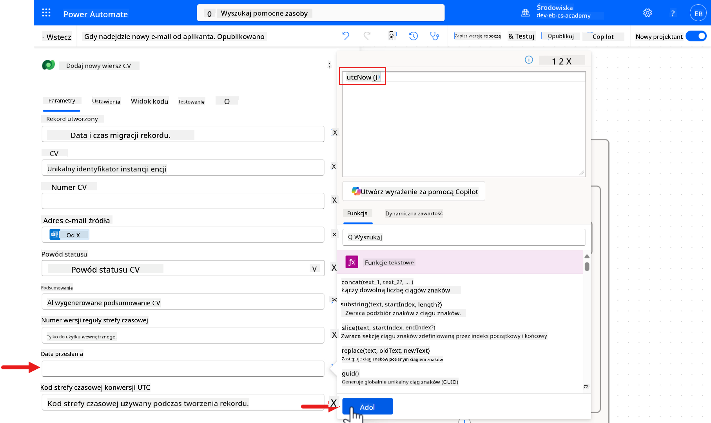

1. Zakończyliśmy konfigurację akcji **Dodaj nowy wiersz CV**, więc wyjdźmy z panelu, zwijając go.

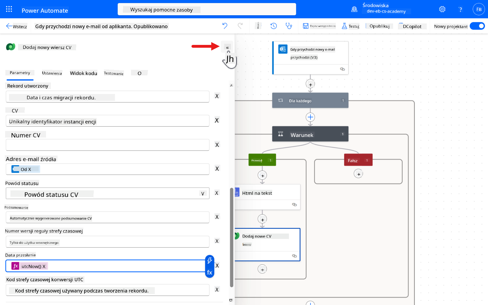

1. Dodamy nową akcję, wybierając **+ ikonę** poniżej akcji **Dodaj nowy wiersz CV**, co załaduje panel do dodawania akcji. Wybierz ponownie konektor **Microsoft Dataverse**.

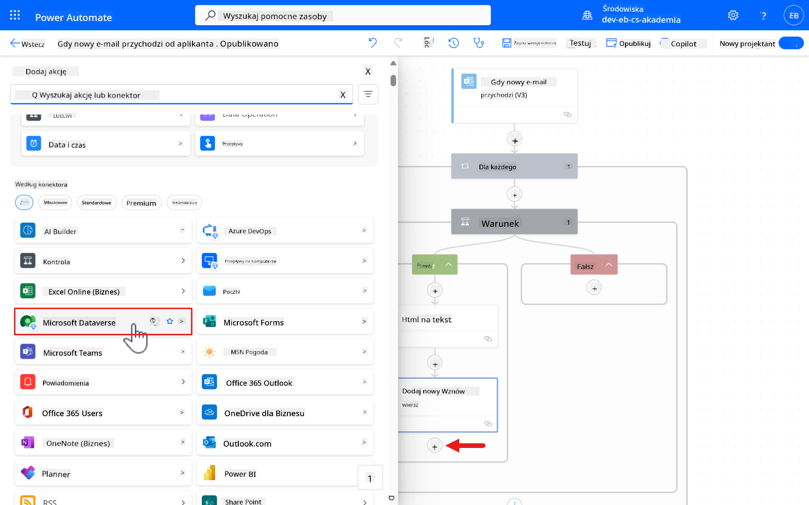

1. Wybierz akcję **Prześlij plik lub obraz**.

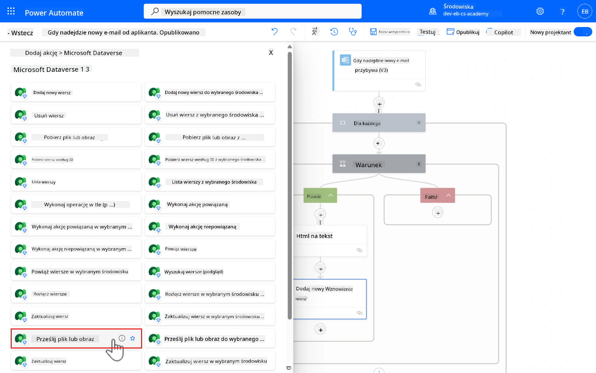

1. Zmień nazwę akcji, wybierając **Elipsę (...)**, skopiuj i wklej poniższe jako nazwę:

```text
Prześlij plik CV
```

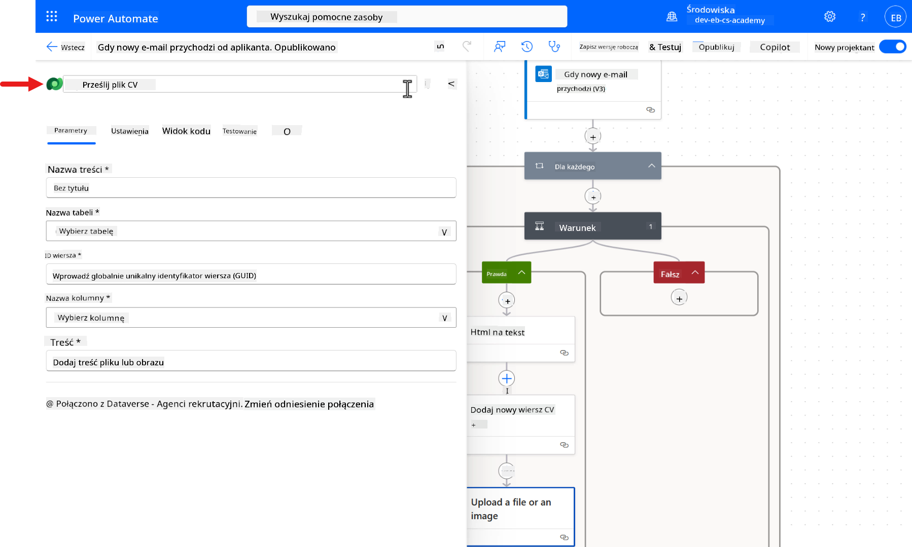

1. Następnie wybierz pole **Nazwa zawartości** i kliknij **ikona pioruna** lub **ikona fx** po prawej stronie.

W zakładce **Funkcja** wprowadź następujące wyrażenie, które używa funkcji `item ()`. Pobiera ono właściwość `name` bieżącego elementu (plik załącznika).

```text
item()?['name']
```

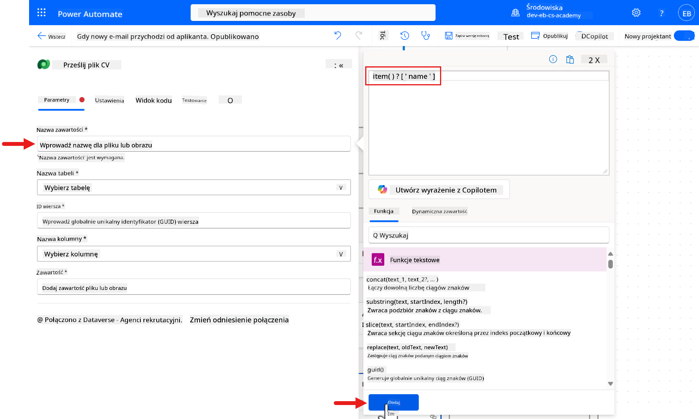

1. Dla parametru **Nazwa tabeli** wyszukaj `res` i wybierz tabelę **CV**.

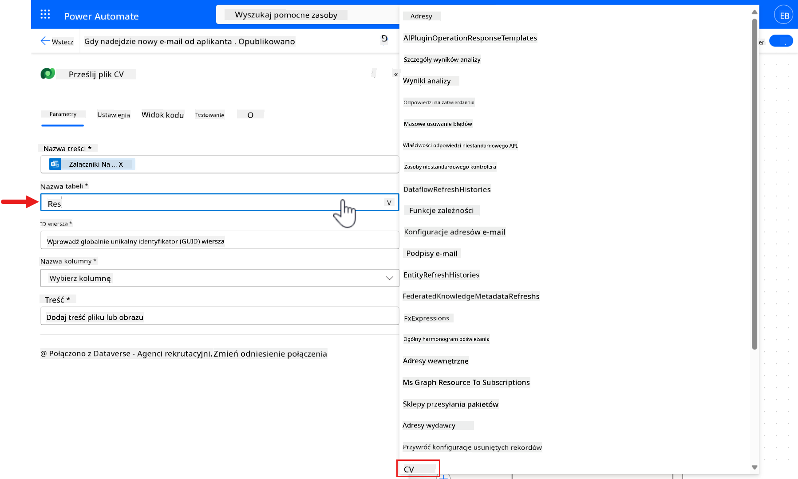

1. Następnie wybierz pole **ID wiersza** i kliknij **ikona pioruna** lub **ikona fx** po prawej stronie.

Wyszukaj `ID` i wybierz parametr **CV** z akcji _Dodaj nowy wiersz_ Dataverse, ponieważ zawiera on wartość ID wiersza, do którego należy przesłać plik PDF.

Wybierz **Dodaj**.

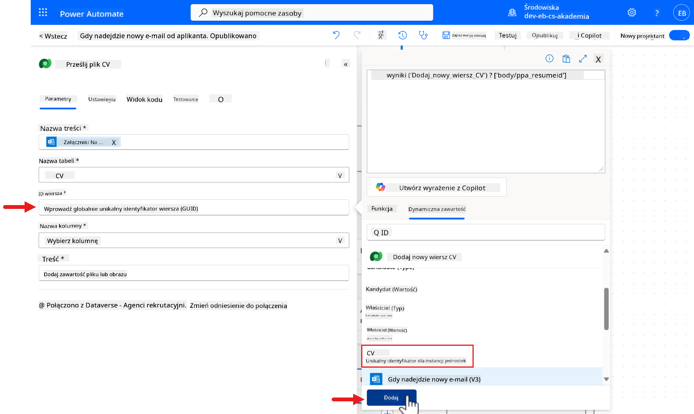

1. Wybierz pole **Nazwa kolumny** i wybierz opcję **CV PDF**.

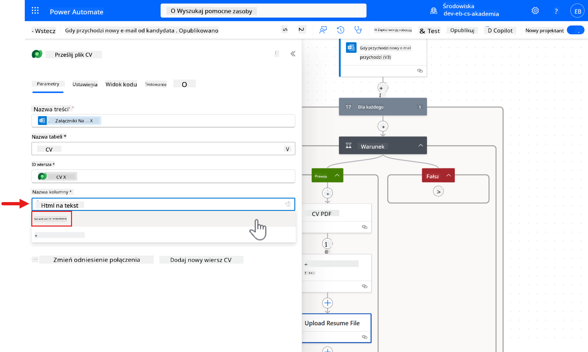

1. Wybierz pole **Zawartość** i kliknij **ikona pioruna** lub **ikona fx** po prawej stronie.

W zakładce **Funkcja** wprowadź następujące wyrażenie, które używa funkcji `item ()`. Pobiera ono właściwość `contentBytes` bieżącego elementu (plik załącznika). `contentBytes` odnosi się do surowych danych binarnych pliku lub załącznika, zakodowanych jako ciąg Base64.

```text
item()?['contentBytes']
```

1. Zakończyliśmy konfigurację tej akcji, więc wyjdźmy z akcji, wybierając podwójne nawiasy («) skierowane w lewo, aby zwinąć panel.

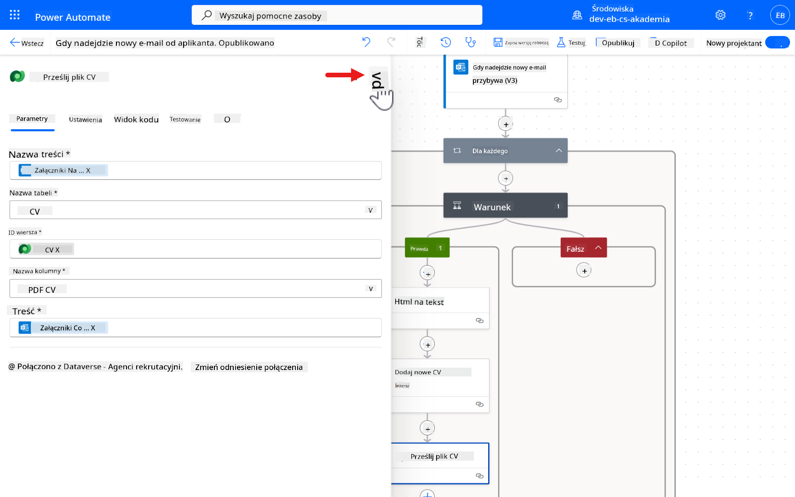

1. Następnie wybierz **Wyślij zapytanie do określonego copilota do przetworzenia**, a następnie przeciągnij i upuść tę akcję poniżej akcji **Prześlij plik CV** w ścieżce _True_ warunku.

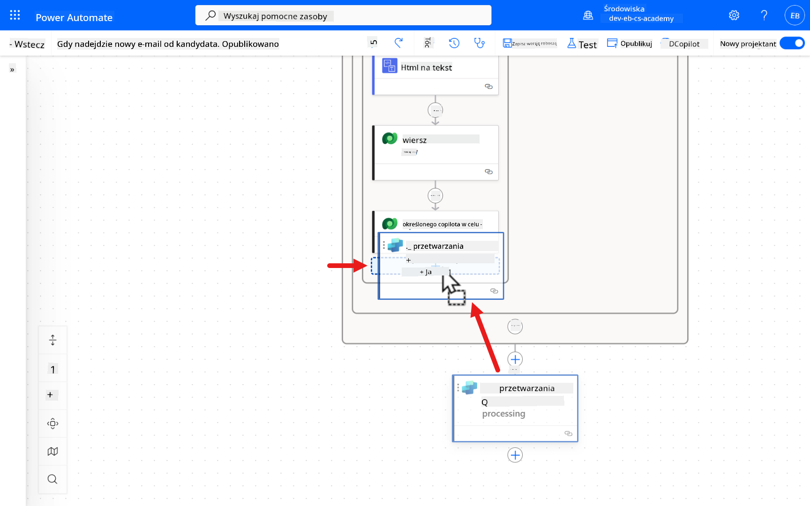

1. Wybierz **Wyślij zapytanie do określonego copilota do przetworzenia**, aby skonfigurować.

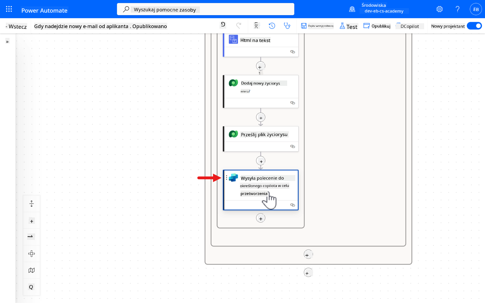

1. W polu **Treść/wiadomość** wybierz całą zawartość pola i wyczyść/usuń ją.

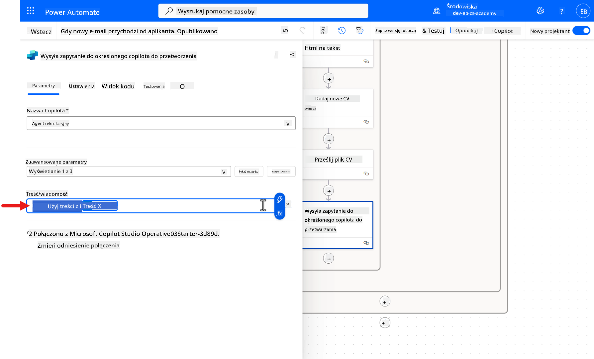

1. Skopiuj i wklej poniższy tekst do pola **Treść/wiadomość** i zaznacz `RESUME ID PLACEHOLDER`.

```text
Wyślij [ResumeId (text)] = "RESUME ID PLACEHOLDER" oraz [ResumeTitle (text_1)] = "RESUME TITLE PLACEHOLDER" oraz [ResumeNumber (text_2)]= "RESUME NUMBER PLACEHOLDER" do narzędzia "Notify Teams Applicant channel" w agencie podrzędnym "Application Intake Agent"
```

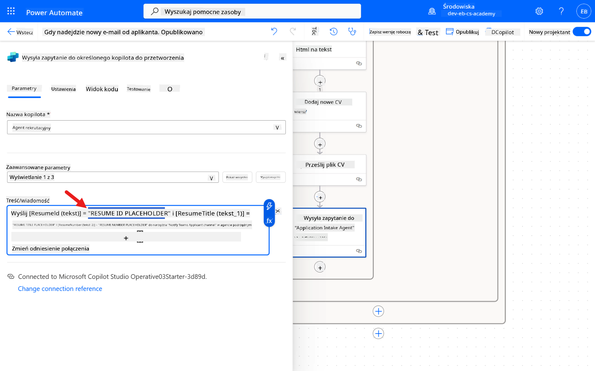

1. Wybierz **ikona pioruna** lub **ikona fx** po prawej stronie.

Wyszukaj `resume` i wybierz parametr **CV** z akcji _Dodaj nowy wiersz Dataverse_, ponieważ zawiera wartość `ID` wiersza CV utworzonego.

Wybierz **Dodaj**.

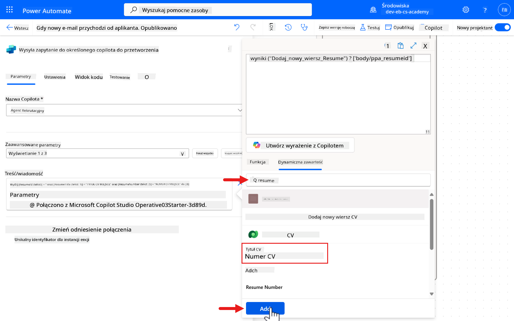

1. Zaznacz `RESUME TITLE PLACEHOLDER`. Wybierz **ikona pioruna** lub **ikona fx** po prawej stronie.

Wyszukaj `title` i wybierz parametr **Tytuł CV** z akcji _Dodaj nowy wiersz Dataverse_, ponieważ zawiera wartość `tytuł CV` wiersza CV utworzonego.

Wybierz **Dodaj**.

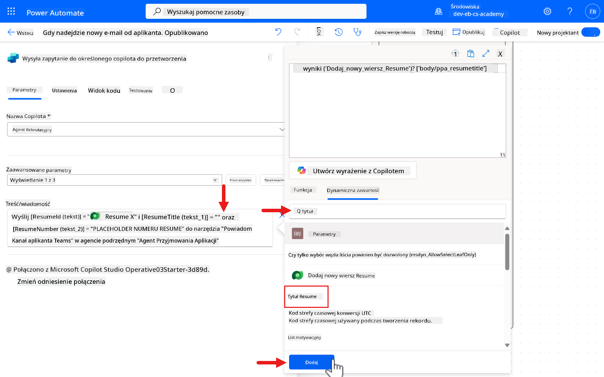

1. Zaznacz `RESUME NUMBER PLACEHOLDER`. Wybierz **ikona pioruna** lub **ikona fx** po prawej stronie.

Wyszukaj `resume number` i wybierz parametr **Numer CV** z akcji _Dodaj nowy wiersz Dataverse_, ponieważ zawiera wartość `Numer CV` wiersza CV utworzonego.

Wybierz **Dodaj**.

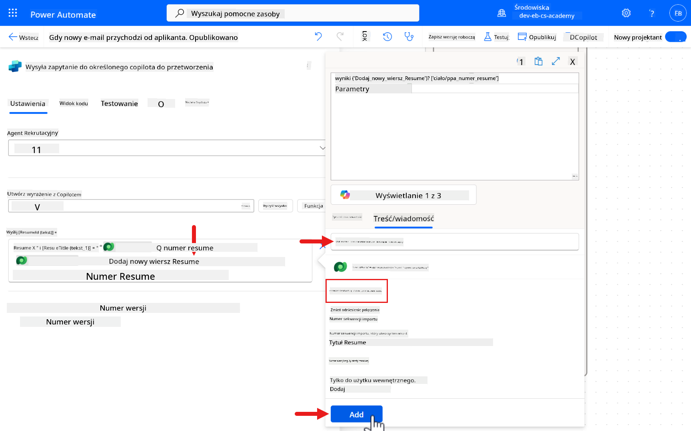

1. Zakończyliśmy konfigurację tej akcji i naszego przepływu agenta 🙌🏻 Świetna robota! Teraz zapiszmy nasz przepływ wyzwalacza zdarzenia, wybierając **Zapisz wersję roboczą**.

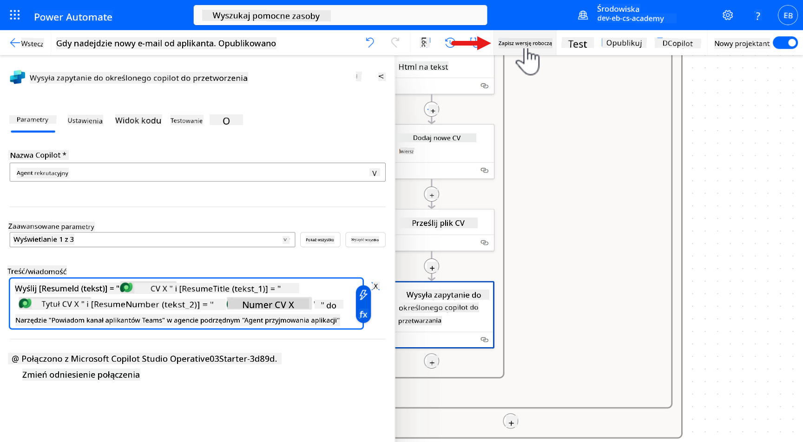

1. Teraz musimy edytować szczegóły przepływu agenta, wybierz **Wstecz**.

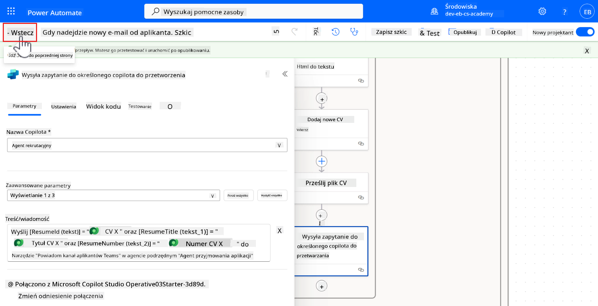

1. W sekcji **Szczegóły** wybierz **Edytuj** i zaktualizuj **Plan** na opcję **Copilot Studio**.

Wybierz **Zapisz**.

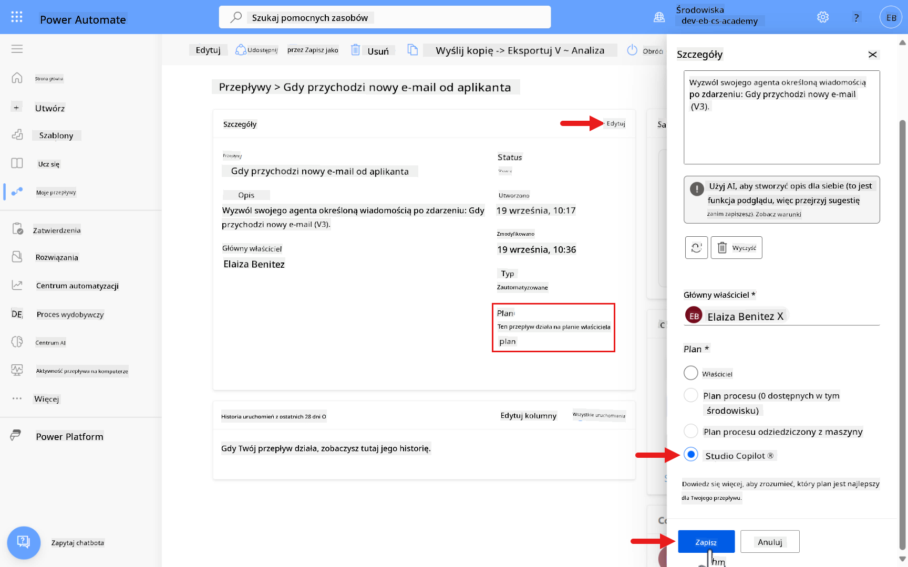

1. Pojawi się modal z prośbą o potwierdzenie przełączenia na plan Copilot Studio. Wybierz **Potwierdź**.

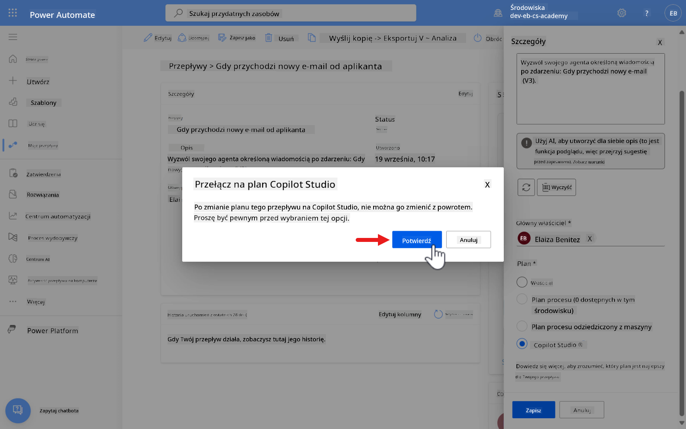

1. Plan został zaktualizowany na **Copilot Studio**. Wybierz **Edytuj**, ponieważ musimy opublikować przepływ wyzwalacza zdarzenia dla naszego agenta.

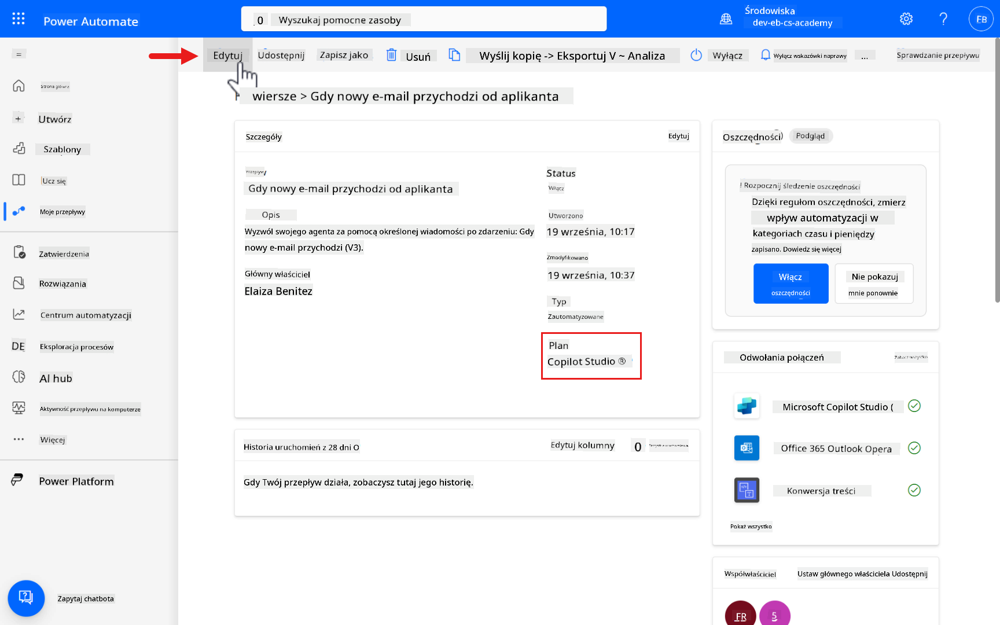

1. Wybierz **Opublikuj**.

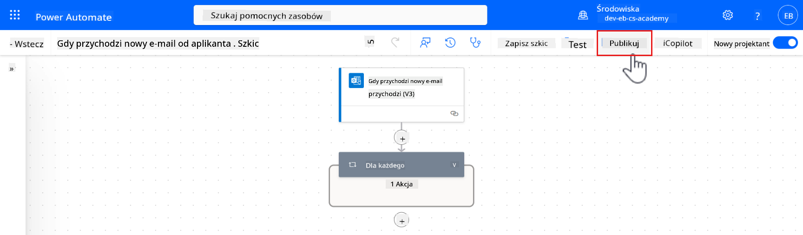

Hurra! Przepływ wyzwalacza zdarzenia został opublikowany 😃

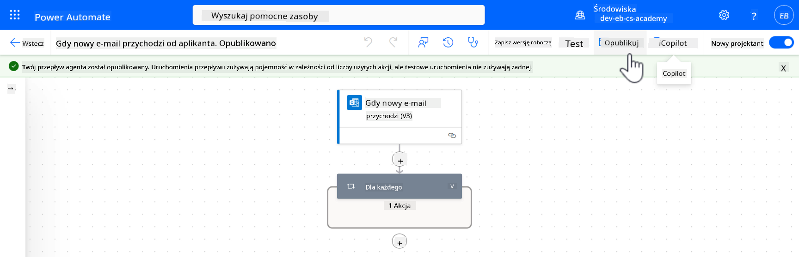

Przejdźmy teraz do tworzenia nowego przepływu agenta, który będzie wywoływany przez podrzędnego **Application Intake Agent**.

### Laboratorium 3.2 - Powiadom kanał Teams za pomocą karty adaptacyjnej

Teraz stworzymy nowy przepływ agenta dla podrzędnego **Application Intake Agent**, który wykorzysta wartości przekazane przez wyzwalacz zdarzenia, aby opublikować kartę adaptacyjną na kanale Teams. Ta karta adaptacyjna powiadomi zespół rekrutacyjny HR o automatycznie przesłanym pliku PDF, aby mogli go przejrzeć.

Zaczynajmy!

1. W **Hiring Agent** wybierz kartę **Agenci** i wybierz **Application Intake Agent**.

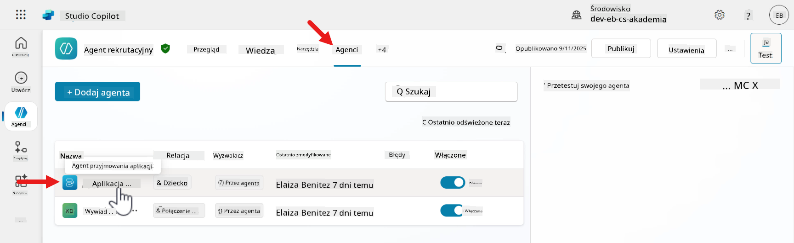

1. Przewiń w dół do **Narzędzia** i wybierz **+ Dodaj**.

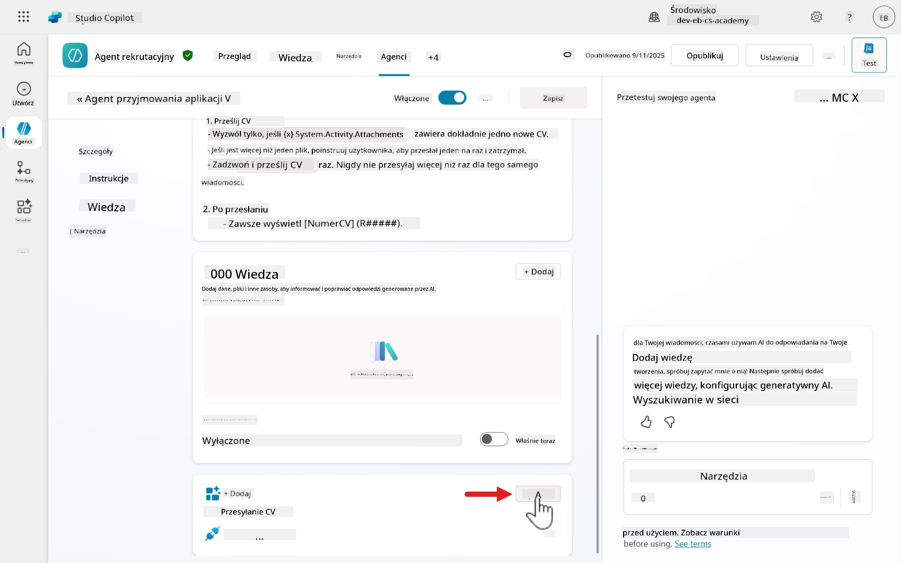

1. Pojawi się modal **Dodaj narzędzie**. Wybierz **+ Nowe narzędzie**.

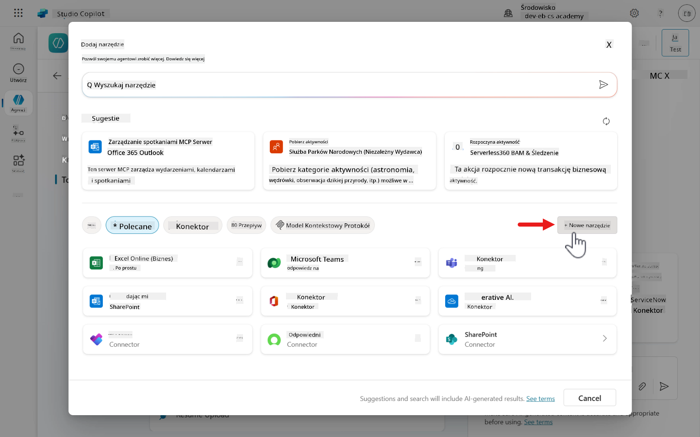

1. Wybierz **Przepływ agenta**.

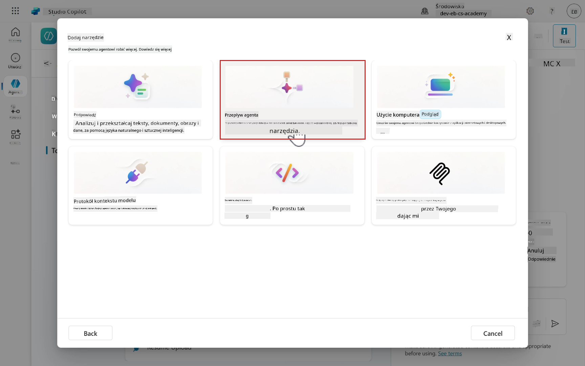

1. Następnie załaduje się **projektant przepływu agenta**. W wyzwalaczu **Gdy agent wywołuje przepływ**, wybierz **+ Dodaj dane wejściowe**.

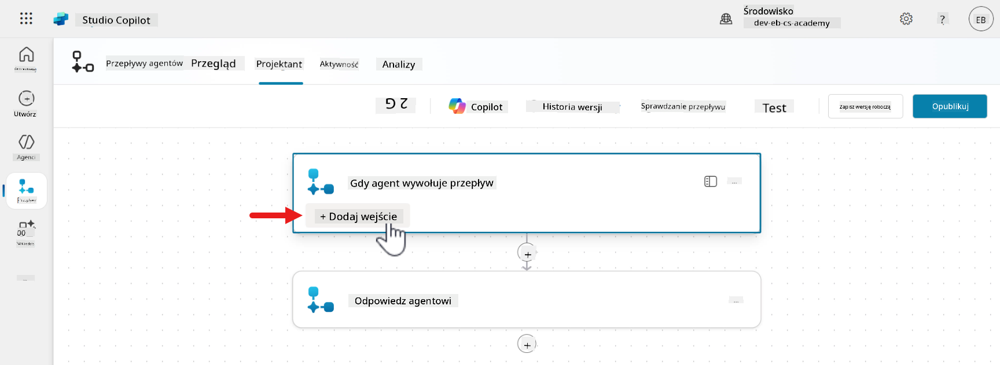

1. Wybierz **Tekst** jako typ danych wejściowych użytkownika.

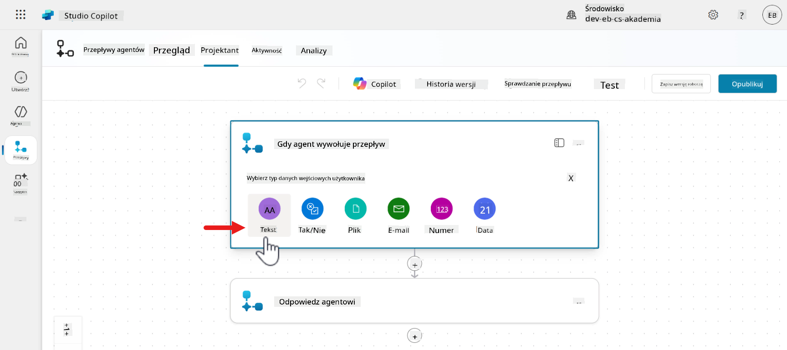

1. W polu tekstowym danych wejściowych skopiuj i wklej poniższe jako nazwę parametru wejściowego.

```text
ResumeId
```

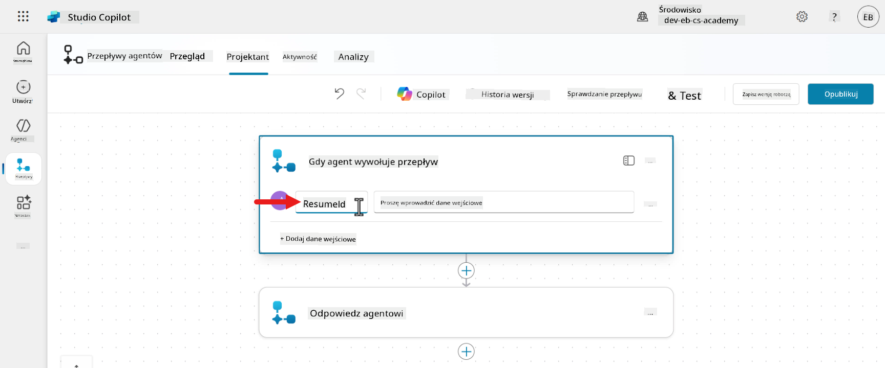

1. Powtórz te same kroki, aby dodać drugie dane wejściowe tekstowe. Skopiuj i wklej poniższe jako nazwę parametru wejściowego.

```text
ResumeTitle
```

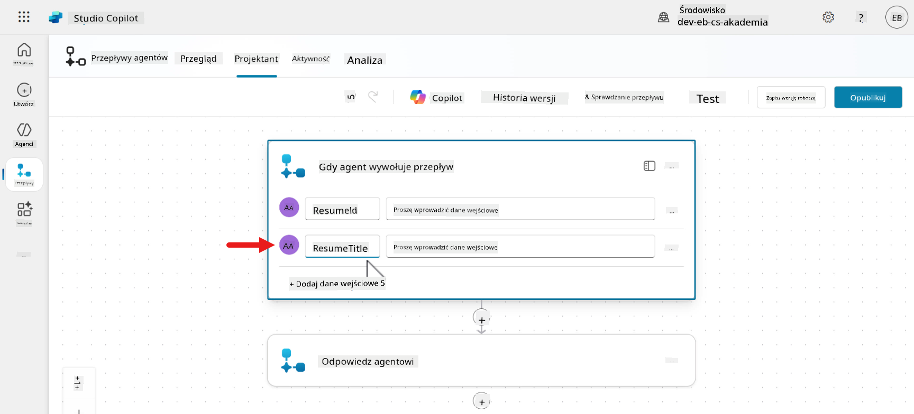

1. Powtórz te same kroki, aby dodać trzecie dane wejściowe tekstowe. Skopiuj i wklej poniższe jako nazwę parametru wejściowego.

```text
ResumeNumber
```

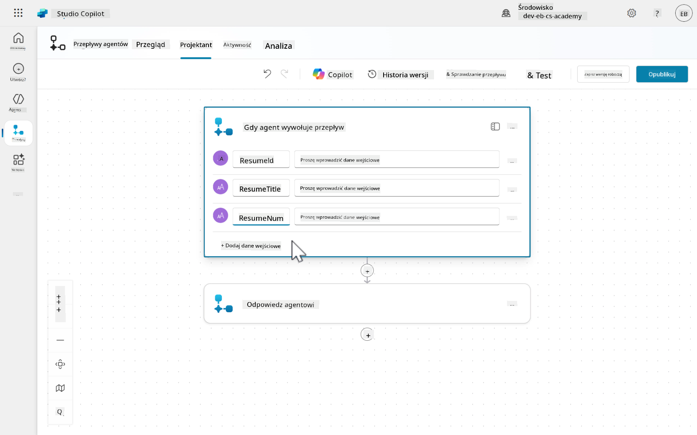

1. Pamiętasz, jak w [Recruit](../../recruit/08-add-adaptive-card/README.md#81-create-a-new-topic-with-an-adaptive-card-for-user-to-submit-their-request) dodaliśmy kartę adaptacyjną w ramach Tematu dla naszego agenta? Tym razem dodamy kartę adaptacyjną w przepływie agenta. Teraz dodamy kolejną akcję do naszego przepływu agenta, która opublikuje kartę adaptacyjną na kanale Teams.

Wybierz **+ ikonę** poniżej wyzwalacza.


1. Wybierz akcję **Opublikuj kartę w czacie lub kanale**.


1. Referencja połączenia z Microsoft Teams musi zostać utworzona za pomocą Twojego zalogowanego konta użytkownika. Wybierz **Zaloguj się**.


1. Wybierz swoje konto użytkownika, a następnie wybierz **Zezwól na dostęp**.


1. Dla następujących parametrów wejściowych:

| Parametr | Jak ustawić | Szczegóły |
|----------|------------|---------|
| **Opublikuj jako** | Lista rozwijana | Wybierz opcję `Flow bot` |
| **Opublikuj w** | Lista rozwijana | Wybierz opcję `Kanał` |
| **Zespół** | Lista rozwijana | Wybierz zespół dostępny w Twoim środowisku, do którego masz dostęp w celu ukończenia tego ćwiczenia |
| **Kanał** | Lista rozwijana | Wybierz kanał dostępny w Twoim środowisku, do którego masz dostęp w celu ukończenia tego ćwiczenia |


1. Następnie skonfigurujemy pole **Karta adaptacyjna**. Wybierz pole **Karta adaptacyjna**.


1. Otwórz [Plik JSON zaktualizowanej tabeli CV](../../../../../docs/operative-preview/03-automate-triggers/assets/3.2_ResumeTableUpdated.json), skopiuj jego całą zawartość i wklej ją do pola Karta adaptacyjna.


1. Podobnie jak zrobiliśmy w [Recruit](../../recruit/08-add-adaptive-card/README.md#81-create-a-new-topic-with-an-adaptive-card-for-user-to-submit-their-request), zamienimy istniejące wartości w ładunku JSON na rzeczywiste wartości lub dynamiczną zawartość.

Najpierw zaktualizujmy URL dla właściwości `url` w ramach właściwości `selectAction`. Ten URL zostanie zastąpiony URL-em widoku systemowego CV w aplikacji model-driven **Hiring Hub**. Pozwoli to Rekruterowi wybrać akcję i zostać przekierowanym do widoku systemowego CV w aplikacji model-driven.

Zaznacz bieżącą wartość URL i usuń ją.


1. W aplikacji model-driven **Hiring Hub** przejdź do widoku systemowego **CV** za pomocą menu po lewej stronie i skopiuj URL. Następnie wróć do przepływu agenta i wklej skopiowany URL do właściwości **url** w ramach właściwości `selectAction`.


1. Powinieneś zobaczyć poniższe, gdzie na żółto zaznaczone są szczegóły środowiska aplikacji modelowej **Hiring Hub**.

     | Parametr | Wartość | Wyjaśnienie |
     |----------|------------|---------|
     | **Organization URI** | GUID | URL organizacji środowiska Dataverse/Dynamics 365 |
     | **appid** | GUID | Aby otworzyć konkretną aplikację modelową, używany jest parametr zapytania appid lub appname. W tym przypadku używany jest appid |
     | **viewid** | GUID | Parametr zapytania, który jest identyfikatorem widoku |

       

1. Następnie dodamy wartości dynamicznej zawartości dla kilku właściwości. Zacznijmy od tekstu, który wyświetli odniesienie do numeru CV wiersza utworzonego automatycznie przez wyzwalacz zdarzenia.

      Wybierz ikonę **panelu**, aby załadować panel akcji.

       

1. Przewiń w dół do linii, gdzie widzisz właściwość `text` dla `RESUME NUMBER PLACEHOLDER`. Zaznacz wartość zastępczą i usuń ją.

       

1. Kliknij między cudzysłowami i wybierz ikonę **błyskawicy** lub **fx** po prawej stronie.

      W zakładce **Dynamic Content** wybierz parametr **ResumeNumber** i kliknij **Add**.

       

1. Parametr **ResumeNumber** zostanie teraz dodany jako dynamiczna zawartość do właściwości `text`.

       

1. Powtórzymy te same kroki dla `RESUME NAME PLACEHOLDER`. Przewiń w dół do linii, gdzie widzisz właściwość `text` dla `RESUME NAME PLACEHOLDER`. Zaznacz wartość zastępczą i usuń ją.

       

1. Kliknij między cudzysłowami i wybierz ikonę **błyskawicy** lub **fx** po prawej stronie.

      W zakładce **Dynamic Content** wybierz parametr **ResumeTitle** i kliknij **Add**.

       

1. Parametr **ResumeTitle** zostanie teraz dodany jako dynamiczna zawartość do właściwości `text`.

       

1. Powtórzymy te same kroki dla wartości **Due Date**, która reprezentuje termin, do którego rekruter powinien przejrzeć CV. Przewiń w dół do linii, gdzie widzisz właściwość `text` dla `May 21, 2023`.

       

1. Usuń wartość zastępczą daty i kliknij między cudzysłowami.

       

1. Wybierz ikonę **błyskawicy** lub **fx** po prawej stronie i w zakładce **Function** wpisz następujące wyrażenie i kliknij **Add**.

       ```text
       addDays(utcNow(), 3, 'MMM dd, yyyy')
       ```

      To wyrażenie wykorzystuje dwie funkcje.

     | Funkcja | Wyjaśnienie |
     |----------|------------|
     | **addDays** | Dodaje określoną liczbę dni do podanej daty i zwraca wynikową datę w formacie tekstowym |
     | **utcNow** | Zwraca bieżącą datę i czas w formacie czasu uniwersalnego (UTC) jako ciąg znaków. |

      Dla wartości utcNow formatujemy datę jako miesiąc i dzień, a następnie rok.

       

      Wyrażenie zostanie teraz dodane do właściwości `text`.

       

1. Na koniec zaktualizujemy URL dla właściwości `url` w ramach właściwości `actions` w dolnej części ładunku JSON. Obecny URL zastępczy zostanie zastąpiony URL-em wiersza CV w aplikacji modelowej **Hiring Hub**. Pozwoli to rekruterowi wybrać akcję `Action.OpenURL` na karcie adaptacyjnej i zostać przekierowanym do CV w aplikacji modelowej.

       

1. W aplikacji modelowej **Hiring Hub** otwórz wiersz w widoku systemowym **Resumes** za pomocą menu po lewej stronie. Wiersz CV załaduje się jako formularz w aplikacji modelowej.

      Skopiuj URL wiersza CV.

    ??? info "Jak wrócić do aplikacji modelowej **Hiring Hub**, jeśli ją zamknąłeś"

        1. Przejdź do [https://make.powerapps.com](https://make.powerapps.com) i upewnij się, że jesteś w środowisku deweloperskim, którego używasz do tych ćwiczeń, w przeciwnym razie przełącz się na nie.
        
        

        1. Wybierz **Apps** w menu po lewej stronie i dla aplikacji modelowej **Hiring Hub** wybierz ikonę **Play**, aby załadować ją w przeglądarce.
        
        

       

1. Następnie wróć do przepływu agenta, zaznacz obecny URL zastępczy i usuń go.

       

1. Następnie wklej skopiowany URL do właściwości **url** w ramach właściwości `url`.

       

1. Powinieneś zobaczyć poniższe. Usuń wartość identyfikatora `GUID` na końcu. Zastąpimy ją dynamiczną zawartością - parametrem **ResumeId**.

       

1. Wybierz ikonę **błyskawicy** lub **fx** po prawej stronie.

      W zakładce **Dynamic Content** wybierz parametr **ResumeId** i kliknij **Add**.

       

1. Parametr **ResumeId** zostanie dodany jako dynamiczna zawartość. Poniższe, zaznaczone na żółto, to szczegóły środowiska aplikacji modelowej **Hiring Hub**.

     | Parametr | Wartość | Wyjaśnienie |
     |----------|------------|---------|
     | **Organization URI** | GUID | URL organizacji środowiska Dataverse/Dynamics 365 |
     | **appid** | GUID | Aby otworzyć konkretną aplikację modelową, używany jest parametr zapytania appid lub appname. W tym przypadku używany jest appid |
     | **id** | GUID | Parametr zapytania, który jest identyfikatorem wiersza CV |

       

1. Zakończyliśmy konfigurację akcji **Post card in a chat or channel** 👏🏻 Wyjdź z panelu konfiguracji akcji, wybierając ikonę **x**.

       

1. Na koniec skonfigurujemy ostatnią akcję, **Respond to the agent**, wysyłając tekst z powrotem do agenta, aby zakończyć przetwarzanie.

      W akcji **Respond to the agent** wybierz **+Add an output**.

       

1. Wybierz **Text** jako typ wyjścia.

       

1. Wprowadź następujące jako nazwę wyjścia.

       

1. Wprowadź następujące jako wartość wyjścia.

       ```text
       Finished
       ```

       

1. Zakończyliśmy konfigurację przepływu agenta. Wybierz **Save draft**, aby zapisać przepływ agenta. Po zapisaniu pojawi się komunikat potwierdzający.

       

1. Przed opublikowaniem przepływu agenta musimy zaktualizować szczegóły przepływu agenta. Wybierz zakładkę **Overview** i kliknij **Edit**.

      W polu nazwy przepływu wprowadź następujące.

       ```text
       Notify Teams Applicant channel
       ```      

      Następnie wybierz ikonę **Refresh**, aby zaktualizować opis przepływu agenta za pomocą AI.

      Następnie wybierz **Save**, aby zapisać zaktualizowane szczegóły przepływu agenta.

       

1. Wróć do zakładki **Designer** i wybierz **Publish**, aby opublikować przepływ agenta. Po zapisaniu pojawi się komunikat potwierdzający.

       

1. Przepływ agenta musi teraz zostać dodany jako narzędzie w **Application Intake Agent**. Wróć do **Hiring Agent** i wybierz zakładkę **Agents**, a następnie wybierz **Application Intake Agent**.

       

1. W sekcji **Details** agenta zaktualizujemy pole **Description**. Skopiuj poniższe i wklej na końcu tekstu opisu.

       ```text
       and also notify the Teams Applicant channel
       ```

       

1. Następnie dodamy przepływ agenta jako narzędzie. Przewiń w dół i wybierz **+ Add**.

       

1. Wybierz wcześniej utworzony przepływ agenta, **Notify Teams Applicant Channel**.

       

1. Następnie wybierz **Add and configure**.

       

1. W sekcji **Inputs** przepływu agenta widoczne są trzy wejścia, które skonfigurowaliśmy wcześniej w przepływie agenta. Domyślnie konfiguracja **Fill using** jest ustawiona na **Dynamically fill with AI**. Pozostawimy to ustawienie bez zmian, ponieważ prompt z wyzwalacza zdarzenia (w ostatniej akcji, **Sends a prompt to the specified copilot for processing** - to kroki 38-44 z **Lab 3.1 - Automate uploading resumes to Dataverse received by email**) będzie zawierał wartości parametrów, które AI wyodrębni.

       

1. Teraz, gdy narzędzie zostało dodane do **Application Intake Agent**, instrukcje agenta muszą zostać zaktualizowane. Wybierz ikonę **strzałki wstecz**, aby wrócić do listy agentów.

       

1. Wybierz **Application Intake Agent** w zakładce **Agents** w **Hiring Agent**.

       

1. W polu **Instructions** wprowadź nową linię po instrukcjach `2.Post-Upload`. Skopiuj i wklej poniższe instrukcje.

       ```text
       Process for Resume Upload via Email
       1. When you receive a message, **Send [ResumeId (text)] = "1680265f-5793-f011-b41b-7c1e525be9f7" and [ResumeTitle (text_1)] = "TAYLOR TESTPERSON (FICTITIOUS).pdf" and [ResumeNumber (text_2)]= "R01026" to the Tool "Notify Teams Applicant channel"** in the child agent "Application Intake Agent", call [AGENT FLOW PLACEHOLDER]
       ```

       

1. Zaznacz tekst `[AGENT FLOW PLACEHOLDER`.

       

1. Wprowadź znak ukośnika, `/`, i wybierz narzędzie **Notify Teams Applicant Channel**.

       
1. Przepływ agenta będzie teraz wywoływany przez **Application Intake Agent** zgodnie z instrukcjami, po ostatnim działaniu (**Wysyła zapytanie do określonego copilota do przetworzenia**) w wyzwalaczu zdarzenia, które przesyła zapytanie zawierające wartości parametrów z powrotem do agenta.

      Wybierz **Zapisz**, aby zapisać zaktualizowane instrukcje dla **Application Intake Agent**.

       

1. Instrukcje zostaną teraz zaktualizowane po zapisaniu agenta.

       

1. Teraz musimy **Opublikować** **Hiring Agent**. Wybierz **Opublikuj** w prawym górnym rogu, a w oknie modalnym _Publish this agent_, które się pojawi, wybierz **Opublikuj**.

       

1. Po opublikowaniu pojawi się wiadomość potwierdzająca, że agent został opublikowany.

       

Teraz możemy przetestować agenta!

### Lab 3.3 - Testowanie wyzwalacza zdarzenia

1. Aby uruchomić wyzwalacz zdarzenia, należy wysłać e-mail z załączonym plikiem PDF CV. W Outlooku utwórz nową wiadomość e-mail.

     | Składnik e-maila | Szczegóły |
     |----------|------------|
     | **Do odbiorcy** | Użyj swojego zalogowanego konta jako wartości |
     | **Załącznik pliku** | Prześlij plik [TAYLOR TESTPERSON (FICTITIOUS)](../../../../../docs/operative-preview/test-data/resumes/TAYLOR%20TESTPERSON%20(FICTITIOUS).pdf) |
     | **Treść** | Skopiuj i wklej poniższy tekst jako treść wiadomości e-mail  |

       ```text
       Szanowny Kierowniku ds. Rekrutacji,

       Piszę, aby wyrazić swoje zainteresowanie stanowiskiem Starszego Inżyniera Power Platform w Państwa organizacji. Mając ponad dziewięcioletnie doświadczenie w dostarczaniu bezpiecznych i skalowalnych rozwiązań na platformach chmurowych Microsoft, jestem przekonany, że mogę skutecznie przyczynić się do rozwoju Państwa zespołu.

       W mojej ostatniej roli jako Główny Inżynier Power Platform opracowałem zautomatyzowany system przyjmowania CV, który zmniejszył ilość ręcznej pracy i poprawił wyszukiwalność. Dostarczyłem aplikacje do zarządzania sprawami HR, wprowadziłem przepływy zorientowane na rozwiązania oraz wdrożyłem kontrole PR, aby skrócić czas wdrażania. Moja ekspertyza obejmuje Power Apps, Power Automate, Power Pages, Dataverse oraz szereg usług Microsoft 365, a także integrację z Graph/REST API i funkcjami Azure.

       Wcześniej opracowałem procesy zatwierdzania w Teams z kartami adaptacyjnymi, skracając czas zatwierdzania do tego samego dnia, oraz stworzyłem solidne ramy obsługi błędów. Moje doświadczenie obejmuje również migrację starszych przepływów pracy do Power Automate oraz budowanie portali samoobsługowych, które zostały zaadoptowane przez setki pracowników.

       Posiadam tytuł licencjata z informatyki oraz certyfikaty Power Platform Developer (PL-400) i Solution Architect (PL-600). Pasjonuję się również mentoringiem i udzielam się jako wolontariusz w lokalnych grupach twórców.

       W załączniku znajdą Państwo moje CV do rozważenia. Chętnie omówię, w jaki sposób moje umiejętności i doświadczenie odpowiadają Państwa potrzebom.

       Dziękuję za poświęcony czas i uwagę.

       Z poważaniem,
       Taylor Testperson
       ```

       **Wyślij** wiadomość e-mail po jej napisaniu.

       

1. W portalu Power Automate dla przepływu wyzwalacza zdarzenia wybierz ikonę **Odśwież**, aby zobaczyć przebieg przepływu, który zakończył się sukcesem dla wysłanego e-maila.

       

1. Wróć do Copilot Studio w **Hiring Agent** i wybierz zakładkę **Aktywność**.

       

1. Zakładka **Aktywność** załaduje się, wyświetlając wszystkie aktywności **Hiring Agent**. Będzie tam aktywność o nazwie **Automated** ze statusem **Complete**. Ta aktywność reprezentuje wyzwalacz zdarzenia i przepływ agenta, który został wywołany.

       

1. Wybierz aktywność i wybierz wyzwalacz zdarzenia na mapie aktywności. Na panelu po prawej stronie zauważ, jak parametry wejściowe w zapytaniu zawierają wartości parametrów `Resume Id`, `Resume Title` i `Resume Number` z wiersza **Dataverse**, który został utworzony. To pochodzi z wartości dynamicznych skonfigurowanych wcześniej w krokach 18 - 27 **Lab 3.1 - Automatyzacja przesyłania CV do Dataverse otrzymanych e-mailem**.

       

1. Przejdź z powrotem do aplikacji model-driven **Hiring Hub** i w widoku systemowym **Resumes**, wybierz **Odśwież**, aby odświeżyć widok. Nowo utworzony wiersz dla CV przesłanego e-mailem będzie teraz widoczny, ponieważ został utworzony przez wyzwalacz zdarzenia.

       

1. Wróć do Copilot Studio i wybierz przepływ agenta **Notify Teams Applicant Channel** w ramach **Application Intake Agent** na mapie aktywności. Na panelu po prawej stronie zauważ, jak dane wejściowe mają wartości z wiersza Dataverse. To pochodzi z zapytania wysłanego przez ostatnie działanie (**Wysyła zapytanie do określonego copilota do przetworzenia**) w wyzwalaczu zdarzenia, które zawiera wartości parametrów z nowo utworzonego wiersza Dataverse. W ten sposób możemy przekazywać wartości parametrów z wyzwalaczy zdarzeń do przepływów agentów.

       

1. Na koniec spójrzmy na kartę adaptacyjną opublikowaną w kanale **Microsoft Teams**. W kanale zobaczymy kartę adaptacyjną, która wyświetla informacje o nowo utworzonym wierszu CV w Dataverse. Najedź kursorem na hiperłącze na początku karty adaptacyjnej, zauważ, jak URL to URL widoku systemowego Resumes, który skonfigurowaliśmy wcześniej w JSON (kroki 15 - 19 **Lab 3.2 - Powiadamianie kanału Teams za pomocą karty adaptacyjnej**) payload karty adaptacyjnej.

       

1. Wybierz hiperłącze, a zostaniesz przekierowany do widoku systemowego Resumes w aplikacji model-driven **Hiring Hub** w przeglądarce.

       

1. Wróć do karty adaptacyjnej opublikowanej w kanale Microsoft Teams. Tym razem najedź kursorem na **View Resume**, które jest akcją `Action.OpenURL` karty adaptacyjnej. Zauważ, jak URL to wiersz CV, który skonfigurowaliśmy wcześniej w JSON (kroki 30 - 36 **Lab 3.2 - Powiadamianie kanału Teams za pomocą karty adaptacyjnej**) payload karty adaptacyjnej.

       

1. Wybierz akcję, a zostaniesz przekierowany do formularza wiersza CV w aplikacji model-driven **Hiring Hub** w przeglądarce.

       

## ✅ Misja zakończona

Gratulacje! 👏🏻 Świetna robota, Operative.

✅ Wyzwalacz zdarzenia: stworzyłeś wyzwalacz zdarzenia, który przekazuje wartości parametrów Dataverse do przepływu agenta.  
✅ Zbudowano przepływ agenta: wykorzystuje wartości parametrów Dataverse do publikowania karty adaptacyjnej w kanale Microsoft Teams, aby powiadomić zespół rekrutacyjny HR.  
✅ Zaktualizowano instrukcje agenta podrzędnego: aby wywołać przepływ po zakończeniu wyzwalacza zdarzenia.

To umożliwia **Hiring Agent** autonomiczne działanie za każdym razem, gdy CV są otrzymywane jako załączniki e-mailowe i powiadamianie zespołu rekrutacyjnego HR o ręcznym przeglądzie.

To koniec **Lab 03 - Automatyzacja e-maili aplikacyjnych kandydatów**, wybierz poniższy link, aby przejść do następnej lekcji.

⏭️ [Przejdź do lekcji **Tworzenie instrukcji agenta**](../04-agent-instructions/README.md)

## 📚 Zasoby taktyczne

📖 [Uczyń swojego agenta autonomicznym w Copilot Studio](https://learn.microsoft.com/training/modules/autonomous-agents-online-workshop/?WT.mc_id=power-188561-ebenitez)

📖 [Dodaj wyzwalacz zdarzenia](https://learn.microsoft.com/microsoft-copilot-studio/authoring-trigger-event?WT.mc_id=power-188561-ebenitez)

📖 [Używaj przepływów agentów ze swoim agentem](https://learn.microsoft.com/microsoft-copilot-studio/advanced-flow?WT.mc_id=power-188561-ebenitez)

📖 [Wprowadzenie do wyzwalaczy Power Automate](https://learn.microsoft.com/power-automate/triggers-introduction?WT.mc_id=power-188561-ebenitez)

📖 [Używanie przepływów Power Automate z agentami](https://learn.microsoft.com/microsoft-copilot-studio/advanced-flow-create?WT.mc_id=power-188561-ebenitez)

📖 [Zapobieganie utracie danych dla Copilot Studio](https://learn.microsoft.com/microsoft-copilot-studio/admin-data-loss-prevention?WT.mc_id=power-188561-ebenitez)

---

**Zastrzeżenie**:  
Ten dokument został przetłumaczony za pomocą usługi tłumaczenia AI [Co-op Translator](https://github.com/Azure/co-op-translator). Chociaż staramy się zapewnić dokładność, prosimy pamiętać, że automatyczne tłumaczenia mogą zawierać błędy lub nieścisłości. Oryginalny dokument w jego rodzimym języku powinien być uznawany za autorytatywne źródło. W przypadku informacji krytycznych zaleca się skorzystanie z profesjonalnego tłumaczenia przez człowieka. Nie ponosimy odpowiedzialności za jakiekolwiek nieporozumienia lub błędne interpretacje wynikające z użycia tego tłumaczenia.