<!--
CO_OP_TRANSLATOR_METADATA:
{
  "original_hash": "616d142d4fb5f45d2a168fad6c1f9545",
  "translation_date": "2025-10-22T00:04:43+00:00",
  "source_file": "docs/operative-preview/07-multimodal-prompts/README.md",
  "language_code": "pl"
}
-->
# 🚨 Misja 07: Wyodrębnianie treści CV za pomocą wielomodalnych podpowiedzi

--8<-- "disclaimer.md"

## 🕵️‍♂️ KOD OPERACJI: `DOKUMENT CV RECON`

> **⏱️ Okno czasowe operacji:** `~45 minut`

## 🎯 Krótki opis misji

Witaj, Operatywie. Twoje wcześniejsze misje wyposażyły Cię w potężne umiejętności orkiestracji agentów, ale teraz nadszedł czas na odblokowanie przełomowej zdolności: **analiza dokumentów wielomodalnych**.

Twoje zadanie, jeśli zdecydujesz się je przyjąć, to **Dokument CV Recon** - precyzyjne wyodrębnianie danych strukturalnych z dowolnego dokumentu. Podczas gdy Twoi agenci mogą łatwo przetwarzać tekst, rzeczywistość wymaga codziennego radzenia sobie z plikami PDF, obrazami i złożonymi dokumentami. CV się piętrzą, faktury wymagają przetworzenia, a formularze natychmiastowej digitalizacji.

Ta misja przekształci Cię z twórcy agentów tekstowych w **eksperta wielomodalnego**. Nauczysz się konfigurować AI, które czyta i rozumie dokumenty jak ludzki analityk - ale z prędkością i precyzją AI. Na koniec misji zbudujesz kompletny system wyodrębniania danych z CV, który zintegrowany zostanie z Twoim procesem rekrutacyjnym.

Techniki, które tutaj poznasz, będą niezbędne w zaawansowanych operacjach ugruntowywania danych w Twojej kolejnej misji.

## 🔎 Cele

W tej misji nauczysz się:

1. Czym są wielomodalne podpowiedzi i kiedy używać różnych modeli AI
1. Jak konfigurować podpowiedzi z wejściami obrazów i dokumentów
1. Jak formatować wyniki podpowiedzi jako JSON dla wyodrębniania danych strukturalnych
1. Najlepszych praktyk w inżynierii podpowiedzi dla analizy dokumentów
1. Jak integrować wielomodalne podpowiedzi z Agent Flows

## 🧠 Zrozumienie wielomodalnych podpowiedzi

### Co sprawia, że podpowiedź jest "wielomodalna"?

Tradycyjne podpowiedzi działają tylko z tekstem. Ale wielomodalne podpowiedzi mogą przetwarzać różne typy treści:

- **Tekst**: Pisemne instrukcje i treści
- **Obrazy**: Zdjęcia, zrzuty ekranu, wykresy i diagramy (.PNG, .JPG, .JPEG)  
- **Dokumenty**: Faktury, CV, formularze (.PDF)

Ta zdolność otwiera potężne scenariusze, takie jak analiza CV, przetwarzanie faktur czy wyodrębnianie danych z formularzy.

### Dlaczego wielomodalność ma znaczenie dla Twoich procesów

Każdego dnia Twoja organizacja staje przed wyzwaniami związanymi z przetwarzaniem dokumentów:

- **Przeglądanie CV**: Ręczne czytanie setek CV zajmuje cenny czas
- **Przetwarzanie faktur**: Wyodrębnianie danych dostawcy, kwot i dat z różnych formatów dokumentów
- **Analiza formularzy**: Konwersja papierowych formularzy na dane cyfrowe

Wielomodalne podpowiedzi eliminują te wąskie gardła, łącząc rozumienie języka przez AI z możliwościami analizy wizualnej. Dzięki temu Twoje AI może przetwarzać dokumenty tak skutecznie jak tekst.

### Typowe scenariusze biznesowe

Oto kilka przykładów zastosowania wielomodalnych podpowiedzi:

| Scenariusz              | Zadanie                                                                                                                                  | Przykładowe pola wyjściowe                                                                                   |
|-------------------------|-----------------------------------------------------------------------------------------------------------------------------------------|-------------------------------------------------------------------------------------------------------------|
| **Przeglądanie CV**     | Wyodrębnij imię i nazwisko kandydata, e-mail, telefon, obecny tytuł, lata doświadczenia i kluczowe umiejętności.                        | Imię i nazwisko kandydata, adres e-mail, numer telefonu, obecny tytuł zawodowy, lata doświadczenia, kluczowe umiejętności |
| **Przetwarzanie faktur**| Wyodrębnij informacje o dostawcy, datę faktury, całkowitą kwotę i pozycje z faktury.                                                    | Nazwa dostawcy, data faktury, całkowita kwota, pozycje faktury                                               |
| **Analiza formularzy**  | Przeanalizuj ten formularz aplikacyjny i wyodrębnij wszystkie wypełnione pola.                                                          | Nazwa pola (np. Imię i nazwisko aplikanta), Wpisana wartość (np. Jan Kowalski), ...                          |
| **Weryfikacja dokumentu tożsamości** | Wyodrębnij imię i nazwisko, numer ID, datę ważności i adres z tego dokumentu tożsamości. Zweryfikuj, czy cały tekst jest czytelny i oznacz wszelkie niejasne sekcje. | Imię i nazwisko, numer identyfikacyjny, data ważności, adres, oznaczenie niejasnych sekcji                   |

## ⚙️ Wybór modelu w AI Builder

AI Builder oferuje różne modele zoptymalizowane pod kątem konkretnych zadań. Zrozumienie, który model wybrać, jest kluczowe dla sukcesu.

!!! note "Aktualne na wrzesień 2025"
    Modele AI Builder są regularnie aktualizowane, więc sprawdź najnowszą [dokumentację ustawień modeli AI Builder](https://learn.microsoft.com/ai-builder/prompt-modelsettings) dla aktualnej dostępności modeli.

### Porównanie modeli

Wszystkie poniższe modele obsługują przetwarzanie wizji i dokumentów

| Model | 💰Koszt | ⚡Szybkość | ✅Najlepsze dla |
|-------|------|-------|----------|
| **GPT-4.1 mini** | Podstawowy (najbardziej ekonomiczny) | Szybki | Standardowe przetwarzanie dokumentów, podsumowania, projekty z ograniczonym budżetem |
| **GPT-4.1** | Standardowy | Umiarkowany | Złożone dokumenty, zaawansowane tworzenie treści, potrzeby wysokiej dokładności |
| **o3** | Premium | Wolny (priorytet na rozumowanie) | Analiza danych, krytyczne myślenie, zaawansowane rozwiązywanie problemów |
| **GPT-5 chat** | Standardowy | Ulepszony | Najnowsze rozumienie dokumentów, najwyższa dokładność odpowiedzi |
| **GPT-5 reasoning** | Premium | Wolny (złożona analiza) | Najbardziej zaawansowana analiza, planowanie, zaawansowane rozumowanie |

### Wyjaśnienie ustawień temperatury

Temperatura kontroluje, jak kreatywne lub przewidywalne są odpowiedzi Twojego AI:

- **Temperatura 0**: Najbardziej przewidywalne, spójne wyniki (najlepsze do wyodrębniania danych)
- **Temperatura 0.5**: Zrównoważona kreatywność i spójność  
- **Temperatura 1**: Maksymalna kreatywność (najlepsze do generowania treści)

Do analizy dokumentów używaj **temperatury 0**, aby zapewnić spójne wyodrębnianie danych.

## 📊 Format wyjściowy: Tekst vs JSON

Wybór odpowiedniego formatu wyjściowego jest kluczowy dla dalszego przetwarzania.

### Kiedy używać wyjścia tekstowego

Wyjście tekstowe sprawdza się w przypadku:

- Podsumowań czytelnych dla ludzi
- Prostych klasyfikacji
- Treści, które nie wymagają strukturalnego przetwarzania

### Kiedy używać wyjścia JSON

Wyjście JSON jest niezbędne dla:

- Wyodrębniania danych strukturalnych
- Integracji z bazami danych lub systemami
- Przetwarzania w Power Automate
- Spójnego mapowania pól

### Najlepsze praktyki dla JSON

1. **Zdefiniuj jasne nazwy pól**: Używaj opisowych, spójnych nazw
1. **Podaj przykłady**: Dołącz przykładowe wyniki i wartości dla każdego pola
1. **Określ typy danych**: Uwzględnij przykłady dla dat, liczb i tekstu
1. **Obsługuj brakujące dane**: Zaplanuj obsługę wartości null lub pustych
1. **Waliduj strukturę**: Testuj na różnych typach dokumentów

### Uwagi dotyczące jakości dokumentów

- **Rozdzielczość**: Upewnij się, że obrazy są wyraźne i czytelne
- **Orientacja**: Obróć dokumenty do właściwej orientacji przed przetwarzaniem
- **Obsługa formatów**: Testuj na swoich specyficznych typach dokumentów (PDF, JPG, PNG)
- **Limity rozmiaru**: Zwróć uwagę na ograniczenia rozmiaru plików w Twoim środowisku

### Optymalizacja wydajności

- **Wybierz odpowiednie modele**: Ulepszaj modele tylko wtedy, gdy jest to konieczne
- **Optymalizuj podpowiedzi**: Często krótsze, bardziej klarowne instrukcje działają lepiej
- **Obsługa błędów**: Zaplanuj obsługę dokumentów, których nie można przetworzyć
- **Monitoruj koszty**: Różne modele zużywają różne ilości kredytów AI Builder

## 🧪 Laboratorium 7: Budowa systemu wyodrębniania danych z CV

Czas zastosować wiedzę o wielomodalności w praktyce. Zbudujesz kompleksowy system wyodrębniania danych z CV, który analizuje dokumenty kandydatów i przekształca je w dane strukturalne dla Twojego procesu rekrutacyjnego.

### Wymagania wstępne do ukończenia misji

1. Musisz **albo**:

    - **Ukończyć Misję 06** i mieć gotowy swój system rekrutacyjny oparty na wielu agentach, **ALBO**
    - **Zaimportować rozwiązanie startowe Misji 07**, jeśli zaczynasz od zera lub chcesz nadrobić zaległości. [Pobierz rozwiązanie startowe Misji 07](https://aka.ms/agent-academy)

1. Przykładowe dokumenty CV z [Testowe CV](https://download-directory.github.io/?url=https://github.com/microsoft/agent-academy/tree/main/operative/sample-data/resumes&filename=operative_sampledata)

!!! note "Importowanie rozwiązania i danych przykładowych"
    Jeśli korzystasz z rozwiązania startowego, zapoznaj się z [Misją 01](../01-get-started/README.md) w celu uzyskania szczegółowych instrukcji dotyczących importowania rozwiązań i danych przykładowych do Twojego środowiska.

### 7.1 Utwórz wielomodalną podpowiedź

Twoim pierwszym celem jest stworzenie podpowiedzi zdolnej do analizy dokumentów CV i wyodrębniania danych strukturalnych.

1. Zaloguj się do [Copilot Studio](https://copilotstudio.microsoft.com) i wybierz **Narzędzia** z lewego menu nawigacyjnego.

1. Wybierz **+ Nowe narzędzie**, a następnie **Podpowiedź**.  
    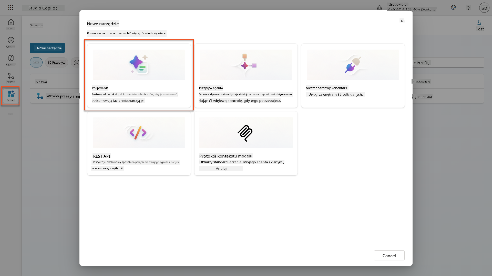

1. **Zmień nazwę** podpowiedzi z domyślnej nazwy z datą (np. *Custom prompt 09/04/2025, 04:59:11 PM*) na `Podsumowanie CV`.

1. W polu Instrukcje dodaj tę podpowiedź:

    ```text
    You are tasked with extracting key candidate information from a resume and cover letter to facilitate matching with open job roles and creating a summary for application review.
    
    Instructions:
    1. Extract Candidate Details:
        - Identify and extract the candidate’s full name.
        - Extract contact information, specifically the email address.
    2. Create Candidate Summary:
        - Summarize the candidate’s profile as multiline text (max 2000 characters) with the following sections:
            - Candidate name
            - Role(s) applied for if present
            - Contact and location
            - One-paragraph summary
            - Experience snapshot (last 2–3 roles with outcomes)
            - Key projects (1–3 with metrics)
            - Education and certifications
            - Top skills (Top 10)
            - Availability and work authorization
    
    Guidelines:
    - Extract information only from the provided resume and cover letter documents.
    - Ensure accuracy in identifying all details such as contact details and skills.
    - The summary should be concise but informative, suitable for quick application review.
    
    Resume: /document
    CoverLetter: /text
    ```

    !!! tip "Skorzystaj z pomocy Copilota"
        Możesz użyć "Rozpocznij z Copilotem", aby wygenerować swoją podpowiedź za pomocą języka naturalnego. Spróbuj poprosić Copilota o stworzenie podpowiedzi do podsumowania CV!

1. **Skonfiguruj** parametry wejściowe:

    | Parametr | Typ | Nazwa | Przykładowe dane |
    |----------|-----|-------|------------------|
    | CV | Obraz lub dokument | CV | Prześlij przykładowe CV z folderu danych testowych |
    | ListMotywacyjny | Tekst | ListMotywacyjny | Oto CV! |

1. Wybierz **Test**, aby zobaczyć początkowy wynik tekstowy z podpowiedzi.  
    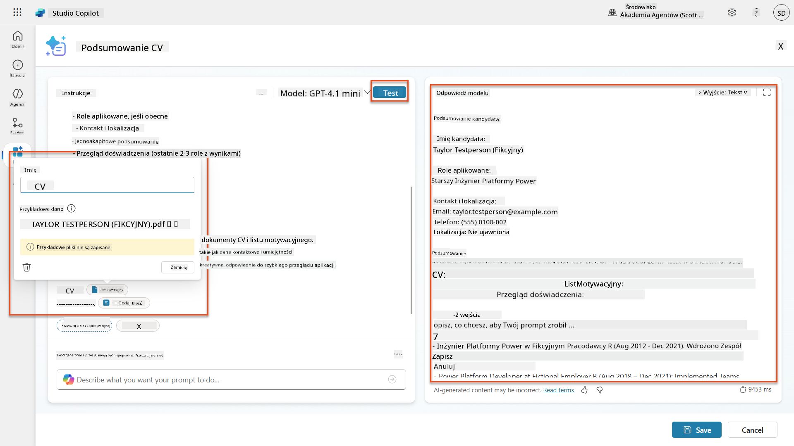

### 7.2 Konfiguracja wyjścia JSON

Teraz przekształcisz podpowiedź, aby generowała dane strukturalne w formacie JSON zamiast zwykłego tekstu.

1. Dodaj tę specyfikację formatu JSON na końcu instrukcji podpowiedzi:

    ```text
    Output Format:
    Provide the output in valid JSON format with the following structure:
    
    {
        "CandidateName": "string",
        "Email": "string",
        "Summary": "string max 2000 characters",
        "Skills": [ {"item": "Skill 1"}, {"item": "Skill 2"}],
        "Experience": [ {"item": "Experience 1"}, {"item": "Experience 2"}],
    }
    ```

1. Zmień ustawienie **Wyjście** z "Tekst" na **JSON**.

1. Wybierz ponownie **Test**, aby zweryfikować, że wynik jest teraz sformatowany jako JSON.  
    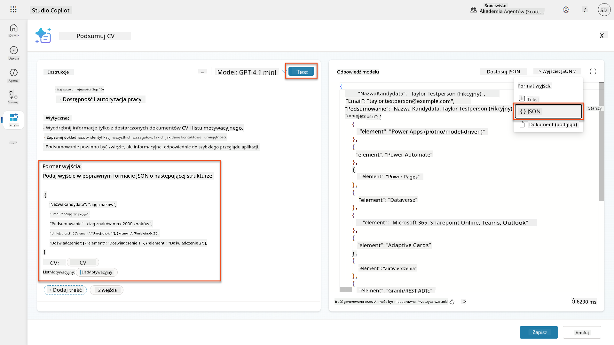

1. **Opcjonalnie:** Eksperymentuj z różnymi modelami AI, aby zobaczyć, jak różnią się wyniki, a następnie wróć do domyślnego modelu.

1. Wybierz **Zapisz**, aby utworzyć podpowiedź.

1. W oknie dialogowym **Konfiguracja do użycia w Agencie** wybierz **Anuluj**.

    !!! info "Dlaczego nie dodajemy tego jako narzędzia"
        Użyjesz tej podpowiedzi w Agent Flow zamiast bezpośrednio jako narzędzia, co da Ci większą kontrolę nad przepływem przetwarzania danych.

### 7.3 Dodaj podpowiedź do Agent Flow

Stworzysz Agent Flow, który użyje Twojej podpowiedzi do przetwarzania CV przechowywanych w Dataverse.

!!! tip "Wyrażenia w Agent Flow"
    Bardzo ważne jest, abyś dokładnie przestrzegał instrukcji dotyczących nazywania węzłów i wprowadzania wyrażeń, ponieważ wyrażenia odwołują się do poprzednich węzłów za pomocą ich nazw! Odwołaj się do [misji Agent Flow w Recruit](../../recruit/09-add-an-agent-flow/README.md#you-mentioned-expressions-what-are-expressions), aby szybko przypomnieć sobie szczegóły!

1. Przejdź do swojego **Agenta Rekrutacyjnego** w Copilot Studio

1. Wybierz zakładkę **Agenci**, a następnie wybierz podrzędnego **Agenta Przyjmowania Aplikacji**

1. W panelu **Narzędzia** wybierz **+ Dodaj** → **+ Nowe narzędzie** → **Agent flow**

1. Wybierz węzeł "Gdy agent wywołuje przepływ", użyj **+ Dodaj wejście**, aby dodać następujący parametr:

    | Typ | Nazwa | Opis |
    |-----|-------|------|
    | Tekst | NumerCV | Upewnij się, że używasz [NumerCV]. Zawsze musi zaczynać się od litery R |

1. Wybierz ikonę **+** Wstaw akcję poniżej pierwszego węzła, wyszukaj **Dataverse**, wybierz **Zobacz więcej**, a następnie znajdź akcję **Lista wierszy**

1. Wybierz **trzy kropki (...)** na węźle Lista wierszy, a następnie wybierz **Zmień nazwę** na `Pobierz rekord CV`, a następnie ustaw następujące parametry:

    | Właściwość | Jak ustawić | Wartość |
    |------------|-------------|---------|
    | **Nazwa tabeli** | Wybierz | CV |
    | **Filtr wierszy** | Dane dynamiczne (ikona pioruna) | `ppa_resumenumber eq 'NumerCV'` Zastąp **NumerCV** wartością **Gdy agent wywołuje przepływ** → **NumerCV** |
    | **Liczba wierszy** | Wprowadź | 1 |

    !!! tip "Optymalizuj zapytania!"
        Korzystając z tej techniki w produkcji, zawsze powinieneś ograniczyć wybierane kolumny tylko do tych wymaganych przez Agent Flow.

    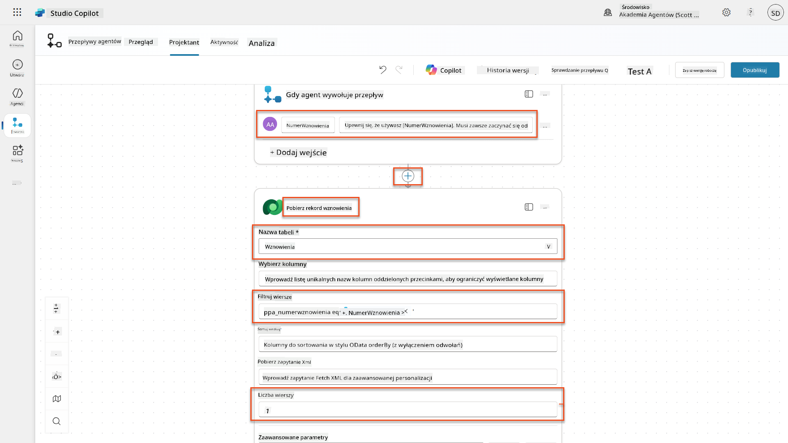

1. Wybierz ikonę **+** Wstaw akcję poniżej węzła Pobierz rekord CV, wyszukaj **Dataverse**, wybierz **Zobacz więcej**, a następnie znajdź akcję **Pobierz plik lub obraz**.

    !!! tip "Wybierz właściwą akcję!"
        Upewnij się, że nie wybierasz akcji kończącej się na "z wybranego środowiska"

1. Jak wcześniej, zmień nazwę akcji
| **Prompt** | Wybierz | Podsumuj CV |
| **CoverLetter** | Wyrażenie (ikona fx) | `first(body('Get_Resume_Record')?['value'])?['ppa_coverletter']` |
| **Resume** | Dynamiczne dane (ikona pioruna) | Pobierz CV → Zawartość pliku lub obrazu |

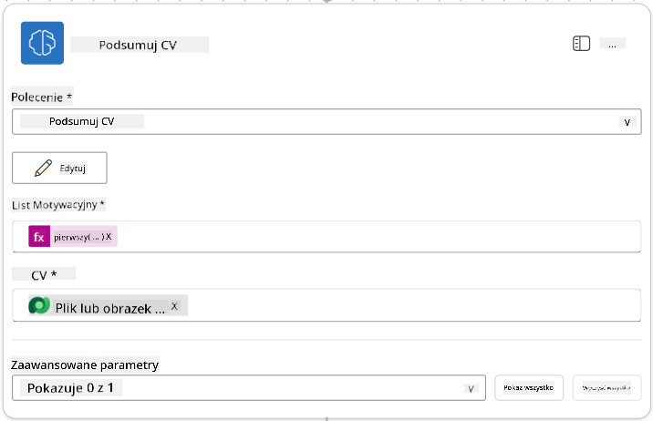

!!! tip "Parametry Prompt"
Zwróć uwagę, że parametry, które wypełniasz, są tymi samymi, które skonfigurowałeś jako parametry wejściowe podczas tworzenia promptu.

### 7.4 Utwórz rekord kandydata

Teraz musisz wziąć informacje, które dostarczył Prompt, i utworzyć nowy rekord kandydata, jeśli jeszcze nie istnieje.

1. Wybierz ikonę **+** Dodaj akcję poniżej węzła Podsumuj CV, wyszukaj **Dataverse**, wybierz **Zobacz więcej**, a następnie znajdź akcję **List rows**

1. Zmień nazwę węzła na `Get Existing Candidate`, a następnie ustaw następujące parametry:

| Właściwość | Jak ustawić | Wartość |
|------------|-------------|---------|
| **Table name** | Wybierz | Candidates |
| **Filter rows** | Dynamiczne dane (ikona pioruna) | `ppa_email eq 'Email'`  **Zamień** `Email` na **Podsumuj CV → Email** |
| **Row count** | Wpisz | 1 |


1. Wybierz ikonę **+** Dodaj akcję poniżej węzła Get Existing Candidate, wyszukaj **Control**, wybierz **Zobacz więcej**, a następnie znajdź akcję **Condition**

1. W właściwościach warunku ustaw następujący warunek:

| Warunek | Operator | Wartość |
|---------|----------|---------|
| Wyrażenie (ikona fx): `length(outputs('Get_Existing_Candidate')?['body/value'])` | jest równy | 0 |

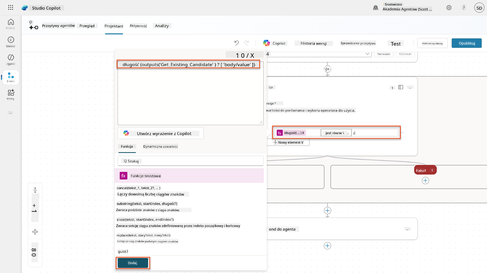

1. Wybierz ikonę **+** Dodaj akcję w gałęzi **True**, wyszukaj **Dataverse**, wybierz **Zobacz więcej**, a następnie znajdź akcję **Add a new row**.

1. Zmień nazwę węzła na `Add a New Candidate`, a następnie ustaw następujące parametry:

| Właściwość | Jak ustawić | Wartość |
|------------|-------------|---------|
| **Table name** | Wybierz | Candidates |
| **Candidate Name** | Dynamiczne dane (ikona pioruna) | Podsumuj CV → `CandidateName` |
| **Email** | Dynamiczne dane (ikona pioruna) | Podsumuj CV → `Email` |

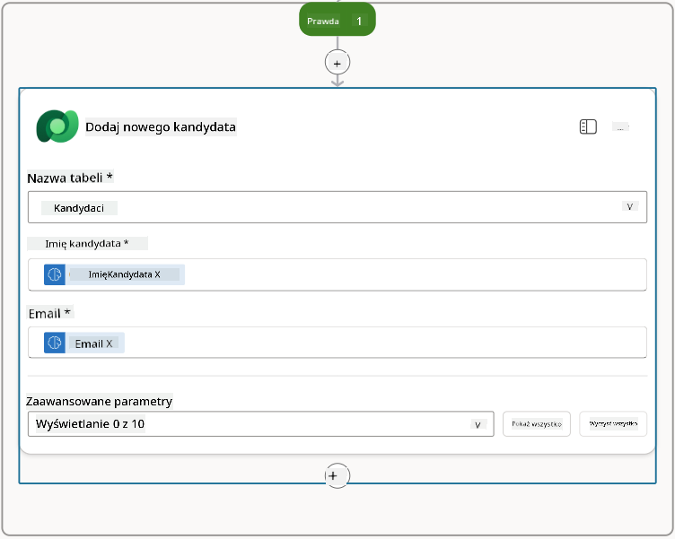

### 7.5 Zaktualizuj CV i skonfiguruj dane wyjściowe przepływu

Ukończ przepływ, aktualizując rekord CV i konfigurując dane, które mają być zwrócone do Twojego agenta.

1. Wybierz ikonę **+** Dodaj akcję poniżej warunku, wyszukaj **Dataverse**, wybierz **Zobacz więcej**, a następnie znajdź akcję **Update a row**

1. Wybierz tytuł, aby zmienić nazwę węzła na `Update Resume`, wybierz **Pokaż wszystko**, a następnie ustaw następujące parametry:

| Właściwość | Jak ustawić | Wartość |
|------------|-------------|---------|
| **Table name** | Wybierz | Resumes |
| **Row ID** | Wyrażenie (ikona fx) | `first(body('Get_Resume_Record')?['value'])?['ppa_resumeid']` |
| **Summary** | Dynamiczne dane (ikona pioruna) | Podsumuj CV → Tekst |
| **Candidate (Candidates)** | Wyrażenie (ikona fx) | `if(equals(length(outputs('Get_Existing_Candidate')?['body/value']), 1), first(outputs('Get_Existing_Candidate')?['body/value'])?['ppa_candidateid'], outputs('Add_a_New_Candidate')?['body/ppa_candidateid'])` |

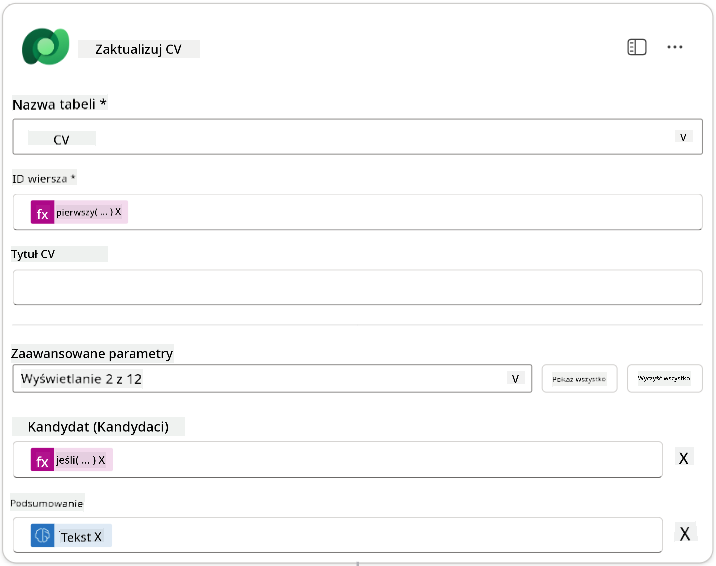

1. Wybierz węzeł **Respond to the agent**, a następnie użyj **+ Add an output**, aby skonfigurować:

| Typ | Nazwa              | Jak ustawić                      | Wartość                                                        | Opis                                            |
|-----|--------------------|----------------------------------|----------------------------------------------------------------|------------------------------------------------|
| Tekst | `CandidateName`   | Dynamiczne dane (ikona pioruna) | Podsumuj CV → Zobacz więcej → CandidateName                    | [CandidateName] podany w CV                    |
| Tekst | `CandidateEmail`  | Dynamiczne dane (ikona pioruna) | Podsumuj CV → Zobacz więcej → Email                            | [CandidateEmail] podany w CV                   |
| Tekst | `CandidateNumber` | Wyrażenie (ikona fx)            | `concat('ppa_candidates/', if(equals(length(outputs('Get_Existing_Candidate')?['body/value']), 1), first(outputs('Get_Existing_Candidate')?['body/value'])?['ppa_candidateid'], outputs('Add_a_New_Candidate')?['body/ppa_candidateid']) )` | [CandidateNumber] nowego lub istniejącego kandydata |
| Tekst | `ResumeSummary`   | Dynamiczne dane (ikona pioruna) | Podsumuj CV → Zobacz więcej → body/responsev2/predictionOutput/structuredOutput | Podsumowanie CV i szczegóły w formacie JSON    |

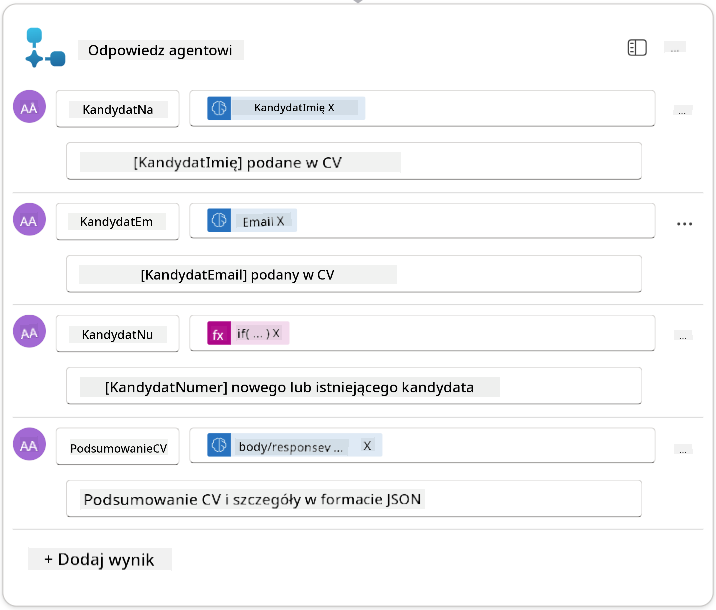

1. Wybierz **Zapisz wersję roboczą** w prawym górnym rogu. Twój Agent Flow powinien wyglądać następująco  
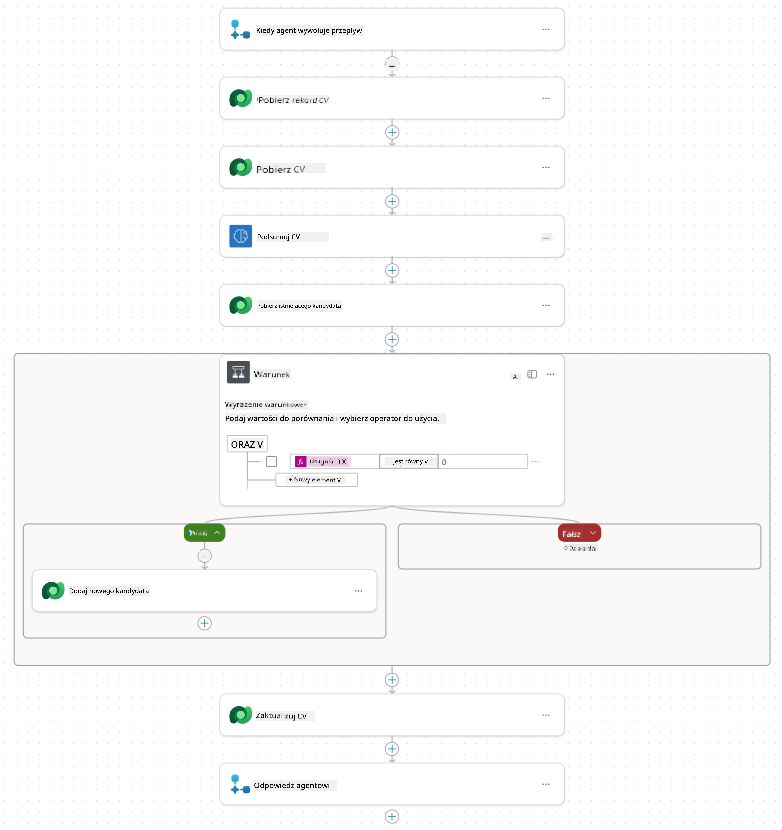

1. Wybierz kartę **Overview**, wybierz **Edytuj** w panelu **Details**

    1. **Nazwa przepływu**:`Summarize Resume`
    1. **Opis**:

        ```text
        Summarize an existing Resume stored in Dataverse using a [ResumeNumber] as input, return the [CandidateNumber], and resume summary JSON
        ```

1. Wybierz **Zapisz**

1. Wróć do karty **Designer**, a następnie wybierz **Publikuj**.

### 7.6 Połącz przepływ z agentem

Teraz dodasz przepływ jako narzędzie i skonfigurujesz swojego agenta, aby z niego korzystał.

1. Otwórz swojego **Hiring Agent** w Copilot Studio

1. Wybierz kartę **Agents**, a następnie otwórz **Application Intake Agent**

1. Wybierz panel **Tools**, a następnie wybierz **+ Add a tool** - > **Flow** -> **Summarize Resume** **(Agent Flow)**

1. Wybierz **Dodaj i skonfiguruj**

1. Skonfiguruj ustawienia narzędzia w następujący sposób:

| Ustawienie | Wartość |
|------------|---------|
| **Opis** | Podsumuj istniejące CV przechowywane w Dataverse, używając [ResumeNumber] jako wejścia, zwróć [CandidateNumber] i podsumowanie CV w formacie JSON |
| **Kiedy to narzędzie może być używane** | Tylko gdy jest odwoływane przez tematy lub agentów |

1. Wybierz **Zapisz**  
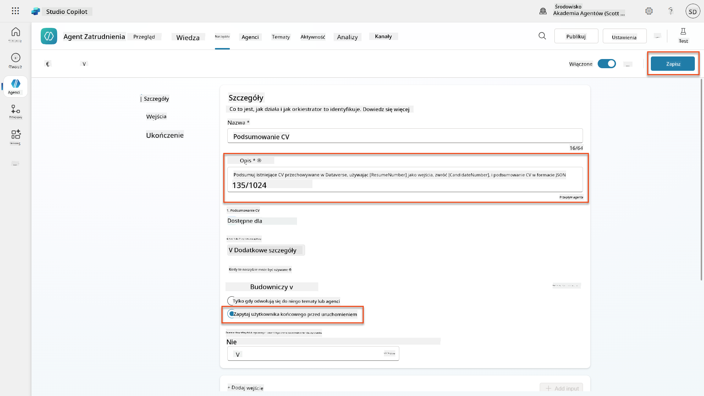

1. Jeśli wybierzesz Tools w Hiring Agent, zobaczysz teraz oba nasze narzędzia, które są dostępne dla **Application Intake Agent**.  
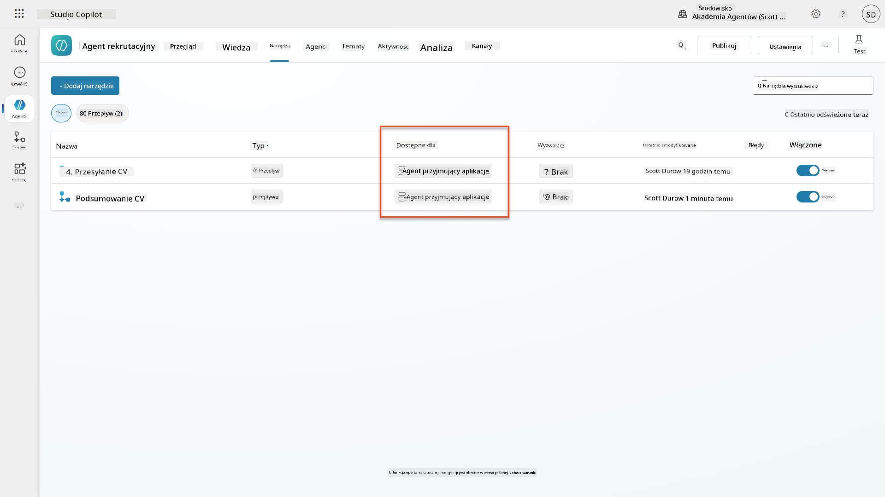

1. Przejdź do instrukcji agenta **Application Intake Child**, a następnie zmodyfikuj krok **Post-Upload** na następujący:

    ```text
    2. Post-Upload Processing  
        - After uploading, be sure to also output the [ResumeNumber] in all messages
        - Pass [ResumeNumber] to /Summarize Resume  - Be sure to use the correct value that will start with the letter R.
        - Be sure to also output the [CandidateNumber] in all messages
        - Use the [ResumeSummary] to output a summary of the processed Resume and candidate
    ```

Zamień `/Summarize Resume`, wstawiając odwołanie do **Summarize Resume agent flow**, wpisując ukośnik (`/)`) lub wybierając `/Summarize`, aby wstawić odwołanie.  
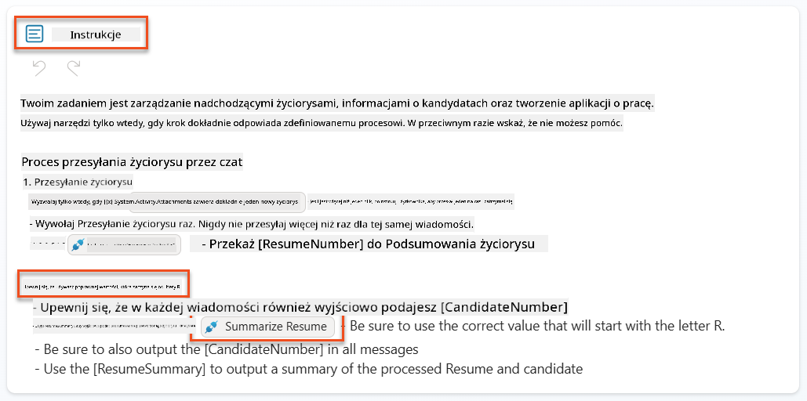

1. Wybierz **Zapisz**.

### 7.7 Przetestuj swojego agenta

Przetestuj swój kompletny system multimodalny, aby upewnić się, że wszystko działa poprawnie.

1. **Rozpocznij testowanie**:

    - Wybierz **Test**, aby otworzyć panel testowy
    - Wpisz: `Oto CV kandydata`

    - Prześlij jedno z przykładowych CV z [Test Resumes](https://download-directory.github.io/?url=https://github.com/microsoft/agent-academy/tree/main/operative/sample-data/resumes&filename=operative_sampledata)

1. **Zweryfikuj wyniki**:
    - Po wysłaniu wiadomości i CV sprawdź, czy otrzymasz numer CV (format: R#####)
    - Zweryfikuj, czy otrzymasz numer kandydata i podsumowanie
    - Użyj mapy aktywności, aby zobaczyć działanie narzędzia do przesyłania CV i narzędzia Podsumuj CV oraz czy wyniki promptu są odbierane przez agenta:  
        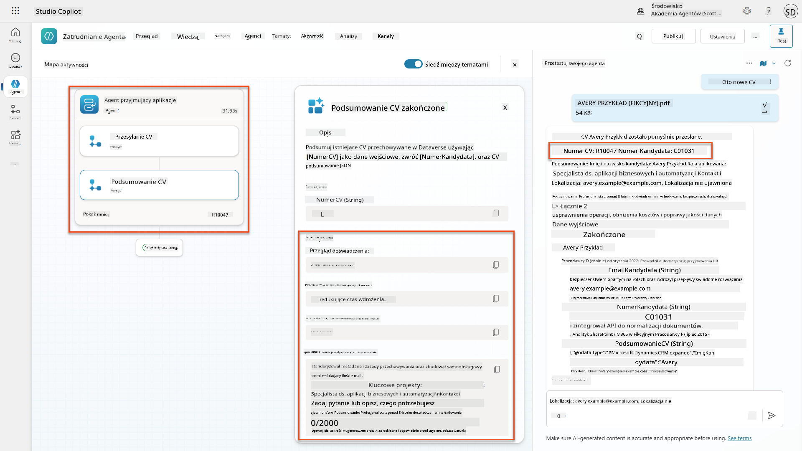

1. **Sprawdź trwałość danych**:
    - Przejdź do [Power Apps](https://make.powerapps.com)
    - Otwórz **Apps** → **Hiring Hub** → **Play**
    - Przejdź do **Resumes**, aby zweryfikować, czy CV zostało przesłane i przetworzone. Powinno zawierać zarówno informacje podsumowujące, jak i powiązany rekord kandydata.
    - Sprawdź **Candidates**, aby zobaczyć wyodrębnione informacje o kandydacie  
        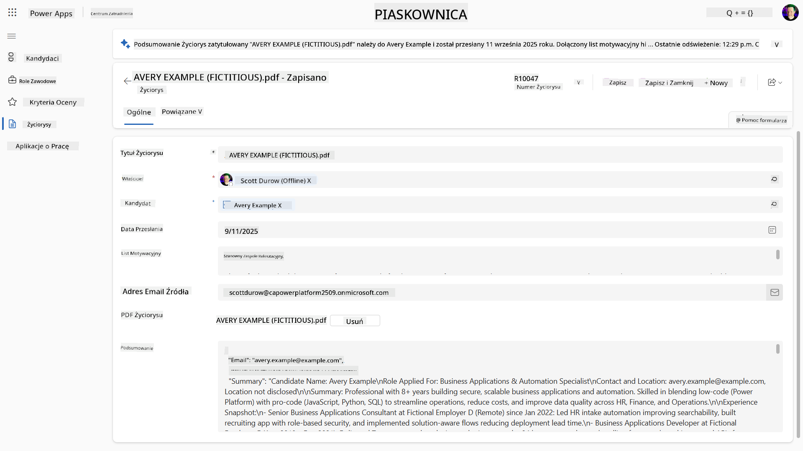
    - Gdy uruchomisz proces ponownie, powinien użyć istniejącego kandydata (dopasowanego na podstawie e-maila wyodrębnionego z CV) zamiast tworzyć nowego.

!!! tip "Rozwiązywanie problemów"
    - **CV nie jest przetwarzane**: Upewnij się, że plik jest w formacie PDF i mieści się w limitach rozmiaru
    - **Nie utworzono kandydata**: Sprawdź, czy e-mail został poprawnie wyodrębniony z CV
    - **Błędy formatu JSON**: Zweryfikuj, czy instrukcje promptu zawierają dokładną strukturę JSON
    - **Błędy przepływu**: Sprawdź, czy wszystkie połączenia Dataverse i wyrażenia są poprawnie skonfigurowane

### Gotowość produkcyjna

Chociaż nie jest to częścią tej misji, aby uczynić ten przepływ agenta gotowym do produkcji, możesz rozważyć następujące:

1. **Obsługa błędów** - Jeśli numer CV nie został znaleziony lub prompt nie zdołał przeanalizować dokumentu, należy dodać obsługę błędów, aby zwrócić agentowi jasny komunikat o błędzie.
1. **Aktualizacja istniejących kandydatów** - Kandydat jest znajdowany na podstawie e-maila, następnie imię może być zaktualizowane, aby pasowało do tego z CV.
1. **Podział podsumowania CV i tworzenia kandydata** - Ta funkcjonalność może być podzielona na mniejsze przepływy agenta, aby ułatwić ich utrzymanie, a następnie agentowi można dać instrukcje, aby używał ich kolejno.

## 🎉 Misja zakończona

Świetna robota, Operative! **Document Resume Recon** jest teraz ukończone. Z powodzeniem opanowałeś multimodalne prompty i możesz teraz precyzyjnie wyodrębniać dane strukturalne z dowolnego dokumentu.

Oto, co osiągnąłeś w tej misji:

**✅ Opanowanie multimodalnych promptów**  
Teraz rozumiesz, czym są multimodalne prompty i kiedy używać różnych modeli AI dla optymalnych wyników.

**✅ Ekspertyza w przetwarzaniu dokumentów**  
Nauczyłeś się konfigurować prompty z wejściami obrazów i dokumentów oraz formatować wyniki jako JSON dla wyodrębniania danych strukturalnych.

**✅ System wyodrębniania CV**  
Zbudowałeś kompletny system wyodrębniania CV, który przetwarza dokumenty kandydatów i integruje się z Twoim procesem rekrutacyjnym.

**✅ Wdrożenie najlepszych praktyk**  
Zastosowałeś najlepsze praktyki w inżynierii promptów z analizą dokumentów i zintegrowałeś multimodalne prompty z Agent Flows.

**✅ Podstawa dla zaawansowanego przetwarzania**  
Twoje ulepszone możliwości analizy dokumentów są teraz gotowe na zaawansowane funkcje ugruntowania danych, które dodamy w nadchodzących misjach.

🚀 **Co dalej:** W Misji 08 odkryjesz, jak ulepszyć swoje prompty za pomocą danych w czasie rzeczywistym z Dataverse, tworząc dynamiczne rozwiązania AI dostosowujące się do zmieniających się wymagań biznesowych.

⏩ [Przejdź do Misji 08: Ulepszone prompty z ugruntowaniem Dataverse](../08-dataverse-grounding/README.md)

## 📚 Zasoby taktyczne

📖 [Tworzenie promptu](https://learn.microsoft.com/ai-builder/create-a-custom-prompt?WT.mc_id=power-power-182762-scottdurow)

📖 [Dodawanie tekstu, obrazu lub dokumentu jako wejścia do promptu](https://learn.microsoft.com/ai-builder/add-inputs-prompt?WT.mc_id=power-182762-scottdurow)

📖 [Przetwarzanie odpowiedzi z wyjściem JSON](https://learn.microsoft.com/ai-builder/process-responses-json-output?WT.mc_id=power-182762-scottdurow)

📖 [Wybór modelu i ustawienia temperatury](https://learn.microsoft.com/ai-builder/prompt-modelsettings?WT.mc_id=power-182762-scottdurow)

📖 [Użycie promptu w Power Automate](https://learn.microsoft.com/ai-builder/use-a-custom-prompt-in-flow?WT.mc_id=power-182762-scottdurow)

📺 [AI Builder: Wyjścia JSON w kreatorze promptów](https://www.youtube.com/watch?v=F0fGnWrRY_I)

---

**Zastrzeżenie**:  
Ten dokument został przetłumaczony za pomocą usługi tłumaczenia AI [Co-op Translator](https://github.com/Azure/co-op-translator). Chociaż staramy się zapewnić dokładność, prosimy pamiętać, że automatyczne tłumaczenia mogą zawierać błędy lub nieścisłości. Oryginalny dokument w jego rodzimym języku powinien być uznawany za źródło autorytatywne. W przypadku informacji krytycznych zaleca się skorzystanie z profesjonalnego tłumaczenia przez człowieka. Nie ponosimy odpowiedzialności za jakiekolwiek nieporozumienia lub błędne interpretacje wynikające z użycia tego tłumaczenia.