<!--
CO_OP_TRANSLATOR_METADATA:
{
  "original_hash": "750f3ea8a94930439ebd8a10871b1d73",
  "translation_date": "2025-10-21T23:54:09+00:00",
  "source_file": "docs/operative-preview/08-dataverse-grounding/README.md",
  "language_code": "pl"
}
-->
# 🚨 Misja 08: Ulepszone podpowiedzi z wykorzystaniem Dataverse

--8<-- "disclaimer.md"

## 🕵️‍♂️ KODOWA NAZWA: `OPERACJA KONTROLA PODSTAW`

> **⏱️ Czas trwania operacji:** `~60 minut`

## 🎯 Opis Misji

Witaj ponownie, Operatywny. Twój system rekrutacji wieloagentowej działa, ale wymaga kluczowego ulepszenia w zakresie **podstaw danych** – Twoje modele AI potrzebują dostępu w czasie rzeczywistym do strukturalnych danych organizacji, aby podejmować inteligentne decyzje.

Obecnie Twoja podpowiedź do Podsumowania CV działa na podstawie statycznej wiedzy. A co, jeśli mogłaby dynamicznie uzyskiwać dostęp do bazy danych stanowisk pracy, aby zapewnić dokładne, aktualne dopasowania? Co, jeśli rozumiałaby kryteria oceny bez konieczności ich ręcznego kodowania?

W tej misji ulepszysz swoją niestandardową podpowiedź, dodając **podstawy Dataverse** – łącząc swoje podpowiedzi bezpośrednio z aktywnymi źródłami danych. To przekształci Twoich agentów ze statycznych respondentów w dynamiczne, oparte na danych systemy, które dostosowują się do zmieniających się potrzeb biznesowych.

Twoje zadanie: zintegrować dane dotyczące stanowisk pracy i kryteriów oceny w czasie rzeczywistym z przepływem analizy CV, tworząc system samodzielnie aktualizujący się, który pozostaje zgodny z wymaganiami rekrutacyjnymi Twojej organizacji.

## 🔎 Cele

W tej misji nauczysz się:

1. Jak **podstawy Dataverse** ulepszają niestandardowe podpowiedzi
1. Kiedy używać podstaw danych zamiast statycznych instrukcji
1. Projektowania podpowiedzi, które dynamicznie uwzględniają aktywne dane
1. Ulepszania przepływu Podsumowania CV poprzez dopasowanie do stanowisk pracy

## 🧠 Zrozumienie podstaw Dataverse dla podpowiedzi

**Podstawy Dataverse** umożliwiają Twoim niestandardowym podpowiedziom dostęp do aktywnych danych z tabel Dataverse podczas przetwarzania żądań. Zamiast statycznych instrukcji, Twoje podpowiedzi mogą uwzględniać informacje w czasie rzeczywistym, aby podejmować świadome decyzje.

### Dlaczego podstawy Dataverse są ważne

Tradycyjne podpowiedzi działają na podstawie stałych instrukcji:

```text
Match this candidate to these job roles: Developer, Manager, Analyst
```

Dzięki podstawom Dataverse Twoja podpowiedź uzyskuje dostęp do aktualnych danych:

```text
Match this candidate to available job roles from the Job Roles table, 
considering current evaluation criteria and requirements
```

To podejście zapewnia kilka kluczowych korzyści:

- **Dynamiczne aktualizacje:** Stanowiska pracy i kryteria zmieniają się bez konieczności modyfikacji podpowiedzi
- **Spójność:** Wszyscy agenci korzystają z tych samych aktualnych źródeł danych
- **Skalowalność:** Nowe stanowiska i kryteria są automatycznie dostępne
- **Dokładność:** Dane w czasie rzeczywistym zapewniają decyzje odzwierciedlające aktualne potrzeby

### Jak działają podstawy Dataverse

Gdy włączysz podstawy Dataverse dla niestandardowej podpowiedzi:

1. **Wybór danych:** Wybierz konkretne tabele i kolumny Dataverse do uwzględnienia. Możesz również wybrać powiązane tabele, które system przefiltruje na podstawie pobranych rekordów nadrzędnych.
1. **Wstrzykiwanie kontekstu:** Podpowiedź automatycznie uwzględnia pobrane dane w kontekście podpowiedzi
1. **Inteligentne filtrowanie:** System uwzględnia tylko dane istotne dla bieżącego żądania, jeśli podasz jakiekolwiek filtrowanie.
1. **Strukturalny wynik:** Twoja podpowiedź może odwoływać się do pobranych danych i analizować pobrane rekordy, aby stworzyć wynik.

### Od statycznego do dynamicznego: przewaga podstaw

Przyjrzyjmy się Twojemu obecnemu przepływowi Podsumowania CV z Misji 07 i zobaczmy, jak podstawy Dataverse przekształcają go ze statycznej w dynamiczną inteligencję.

**Obecne statyczne podejście:**
Twoja istniejąca podpowiedź zawierała zakodowane kryteria oceny i z góry określoną logikę dopasowania. To podejście działa, ale wymaga ręcznych aktualizacji za każdym razem, gdy dodajesz nowe stanowiska pracy, zmieniasz kryteria oceny lub zmieniasz priorytety firmy.

**Transformacja dzięki podstawom Dataverse:**
Dodając podstawy Dataverse, Twój przepływ Podsumowania CV będzie:

- **Uzyskiwać dostęp do aktualnych stanowisk pracy** z tabeli Stanowiska Pracy
- **Używać aktywnych kryteriów oceny** zamiast statycznych opisów  
- **Zapewniać dokładne dopasowania** na podstawie wymagań w czasie rzeczywistym

## 🎯 Dlaczego dedykowane podpowiedzi zamiast rozmów agentów

W Misji 02 doświadczyłeś, jak Agent Rozmowy Kwalifikacyjnej mógł dopasować kandydatów do stanowisk pracy, ale wymagało to skomplikowanych podpowiedzi użytkownika, takich jak:

```text
Upload this resume, then show me open job roles,
each with a description of the evaluation criteria, 
then use this to match the resume to at least one suitable
job role even if not a perfect match.
```

Chociaż to działało, dedykowane podpowiedzi z podstawami Dataverse oferują znaczące korzyści dla konkretnych zadań:

### Kluczowe zalety dedykowanych podpowiedzi

| Aspekt | Rozmowy Agentów | Dedykowane Podpowiedzi |
|--------|-------------------|------------------|
| **Spójność** | Wyniki różnią się w zależności od umiejętności użytkownika w tworzeniu podpowiedzi | Standaryzowane przetwarzanie za każdym razem |
| **Specjalizacja** | Rozumowanie ogólne może pomijać niuanse biznesowe | Dedykowane z optymalną logiką biznesową |
| **Automatyzacja** | Wymaga interakcji i interpretacji człowieka | Wyzwala się automatycznie z ustrukturyzowanym wyjściem JSON |

## 🧪 Laboratorium 8: Dodaj podstawy Dataverse do podpowiedzi

Czas ulepszyć swoje możliwości analizy CV! Ulepszysz istniejący przepływ Podsumowania CV, dodając dynamiczne dopasowanie stanowisk pracy.

### Wymagania wstępne do ukończenia misji

1. Musisz **albo**:

    - **Ukończyć Misję 07** i mieć gotowy system analizy CV, **LUB**
    - **Zaimportować rozwiązanie startowe Misji 08**, jeśli zaczynasz od zera lub potrzebujesz nadrobić zaległości. [Pobierz rozwiązanie startowe Misji 08](https://aka.ms/agent-academy)

1. Przykładowe dokumenty CV z [testowych CV](https://download-directory.github.io/?url=https://github.com/microsoft/agent-academy/tree/main/operative/sample-data/resumes&filename=operative_sampledata)

!!! note "Importowanie rozwiązania i danych przykładowych"
    Jeśli korzystasz z rozwiązania startowego, zapoznaj się z [Misją 01](../01-get-started/README.md) w celu uzyskania szczegółowych instrukcji dotyczących importowania rozwiązań i danych przykładowych do swojego środowiska.

### 8.1 Dodaj podstawy Dataverse do swojej podpowiedzi

Rozwiniesz podpowiedź Podsumowania CV, którą stworzyłeś w Misji 07. Obecnie po prostu podsumowuje CV, ale teraz ugruntujesz ją w stanowiskach pracy, które aktualnie istnieją w Dataverse, utrzymując ją zawsze aktualną.

Najpierw przyjrzyjmy się tabelom Dataverse, które będą podstawą:

1. **Przejdź** do [Power Apps](https://make.powerapps.com) i wybierz swoje środowisko za pomocą **Przełącznika środowiska** w prawym górnym rogu paska nawigacyjnego.

1. Wybierz **Tabele** i znajdź tabelę **Stanowiska Pracy**

1. Przejrzyj kluczowe kolumny, które wykorzystasz jako podstawę:

    | Kolumna | Cel |
    |--------|---------|
    | **Numer Stanowiska Pracy** | Unikalny identyfikator do dopasowania stanowisk |
    | **Tytuł Stanowiska** | Nazwa wyświetlana dla stanowiska |
    | **Opis** | Szczegółowe wymagania stanowiska |

1. Podobnie przejrzyj inne tabele, takie jak tabela **Kryteria Oceny**.

### 8.2 Dodaj dane podstaw Dataverse do swojej podpowiedzi

1. **Przejdź** do Copilot Studio i wybierz swoje środowisko za pomocą **Przełącznika środowiska** w prawym górnym rogu paska nawigacyjnego.

1. Wybierz **Narzędzia** z lewego panelu nawigacyjnego.

1. Wybierz **Podpowiedź** i znajdź swoją podpowiedź **Podsumowanie CV** z Misji 07.  
    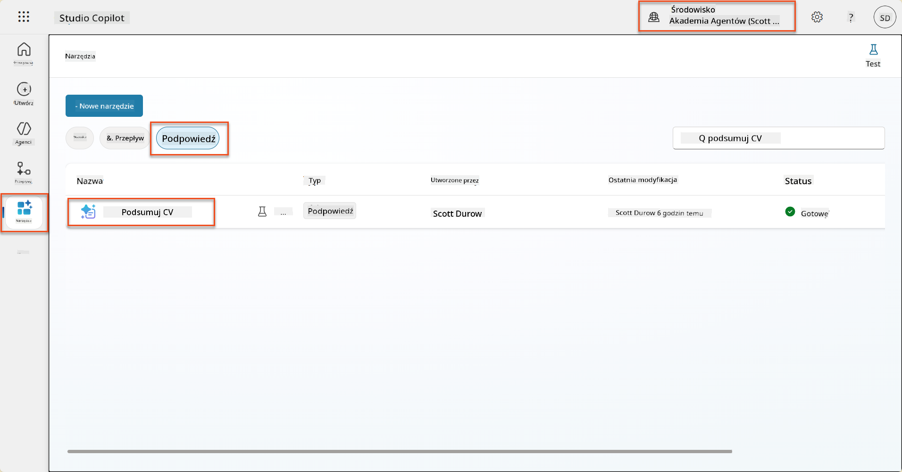

1. Wybierz **Edytuj**, aby zmodyfikować podpowiedź, i zastąp ją ulepszoną wersją poniżej:

    !!! important
        Upewnij się, że parametry CV i List Motywacyjny pozostają nienaruszone jako parametry.

    ```text
    You are tasked with extracting key candidate information from a resume and cover letter to facilitate matching with open job roles and creating a summary for application review.
    
    ### Instructions:
    1. **Extract Candidate Details:**
       - Identify and extract the candidate's full name.
       - Extract contact information, specifically the email address.
    
    2. **Analyze Resume and Cover Letter:**
       - Review the resume content to identify relevant skills, experience, and qualifications.
       - Review the cover letter to understand the candidate's motivation and suitability for the roles.
    
    3. **Match Against Open Job Roles:**
       - Compare the extracted candidate information with the requirements and descriptions of the provided open job roles.
       - Use the job descriptions to assess potential fit.
       - Identify all roles that align with the candidate's cover letter and profile. You don't need to assess perfect suitability.
       - Provide reasoning for each match based on the specific job requirements.
    
    4. **Create Candidate Summary:**
       - Summarize the candidate's profile as multiline text with the following sections:
          - Candidate name
          - Role(s) applied for if present
          - Contact and location
          - One-paragraph summary
          - Top skills (8–10)
          - Experience snapshot (last 2–3 roles with outcomes)
          - Key projects (1–3 with metrics)
          - Education and certifications
          - Availability and work authorization
    
    ### Output Format
    
    Provide the output in valid JSON format with the following structure:
    
    {
      "CandidateName": "string",
      "Email": "string",
      "MatchedRoles": [
        {
          "JobRoleNumber": "ppa_jobrolenumber from grounded data",
          "RoleName": "ppa_jobtitle from grounded data",
          "Reasoning": "Detailed explanation based on job requirements"
        }
      ],
      "Summary": "string"
    }
    
    ### Guidelines
    
    - Extract information only from the provided resume and cover letter documents.
    - Ensure accuracy in identifying contact details.
    - Use the available job role data for matching decisions.
    - The summary should be concise but informative, suitable for quick application review.
    - If no suitable matches are found, indicate an empty list for MatchedRoles and explain briefly in the summary.
    
    ### Input Data
    Open Job Roles (ppa_jobrolenumber, ppa_jobtitle): /Job Role 
    Resume: {Resume}
    Cover Letter: {CoverLetter}
    ```

1. W edytorze podpowiedzi zastąp `/Stanowisko Pracy`, wybierając **+ Dodaj zawartość**, wybierając **Dataverse** → **Stanowisko Pracy** i wybierz następujące kolumny, a następnie wybierz **Dodaj**:

    1. **Numer Stanowiska Pracy**

    1. **Tytuł Stanowiska**

    1. **Opis**

    !!! tip
        Możesz wpisać nazwę tabeli, aby wyszukać.

1. W dialogu **Stanowisko Pracy** wybierz atrybut **Filtr**, wybierz **Status**, a następnie wpisz **Aktywny** jako wartość **Filtru**.  
    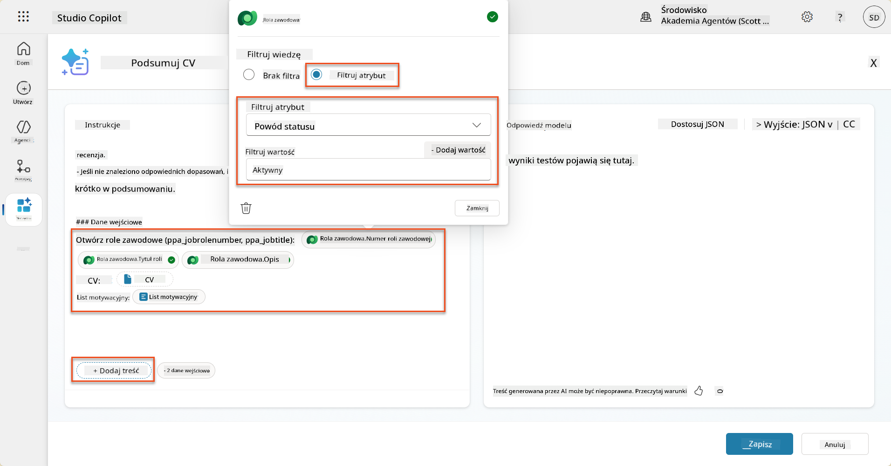

    !!! tip
        Możesz tutaj użyć **Dodaj wartość**, aby dodać parametr wejściowy – na przykład, jeśli miałbyś podpowiedź do podsumowania istniejącego rekordu, mógłbyś podać Numer CV jako parametr do filtrowania.

1. Następnie dodasz powiązaną tabelę Dataverse **Kryteria Oceny**, ponownie wybierając **+ Dodaj zawartość**, znajdując **Stanowiska Pracy**, i zamiast wybierać kolumny w Stanowisku Pracy, rozwiń **Stanowisko Pracy (Kryteria Oceny)** i wybierz następujące kolumny, a następnie wybierz **Dodaj**:

    1. **Nazwa Kryterium**

    1. **Opis**  
        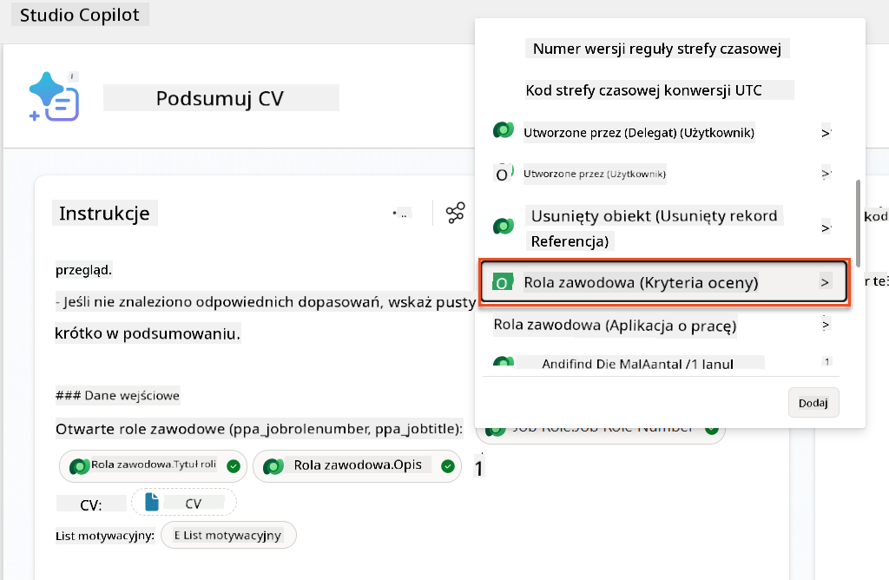

        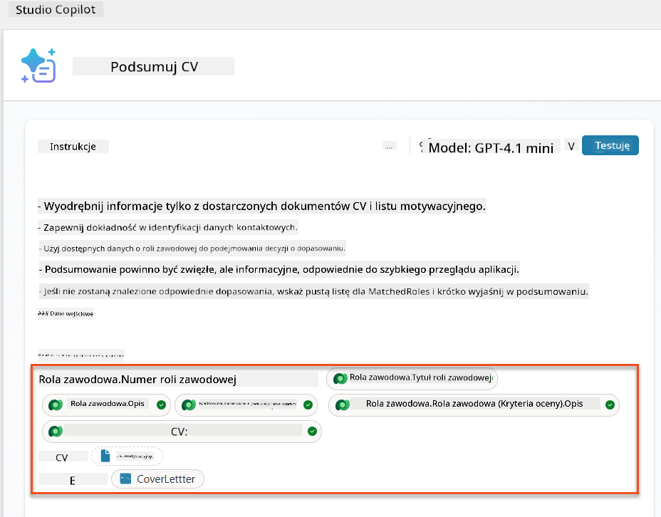

    !!! tip
        Ważne jest, aby wybrać powiązane Kryteria Oceny, najpierw wybierając Stanowisko Pracy, a następnie nawigując w menu do Stanowisko Pracy (Kryteria Oceny). To zapewni, że tylko powiązane rekordy dla Stanowiska Pracy zostaną załadowane.

1. Wybierz **Ustawienia** i dostosuj **Pobieranie rekordów** do 1000 – to pozwoli na uwzględnienie maksymalnej liczby Stanowisk Pracy i Kryteriów Oceny w Twojej podpowiedzi.  
    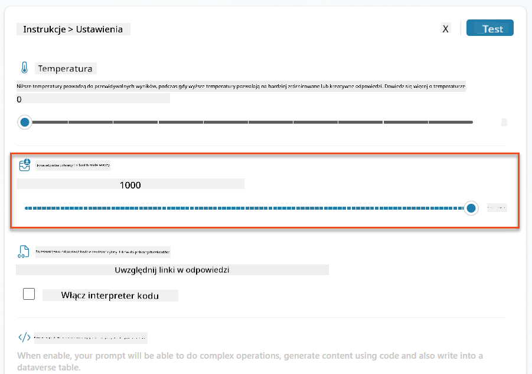

### 8.3 Przetestuj ulepszoną podpowiedź

1. Wybierz parametr **CV** i załaduj przykładowe CV, którego używałeś w Misji 07.
1. Wybierz **Test**.
1. Po zakończeniu testu zauważ, że wyjście JSON teraz zawiera **Dopasowane Stanowiska**.
1. Wybierz zakładkę **Użyta wiedza**, aby zobaczyć dane Dataverse, które zostały połączone z Twoją podpowiedzią przed wykonaniem.
1. **Zapisz** zaktualizowaną podpowiedź. System teraz automatycznie uwzględni te dane Dataverse w Twojej podpowiedzi, gdy istniejący przepływ Agenta Podsumowania CV ją wywoła.  
    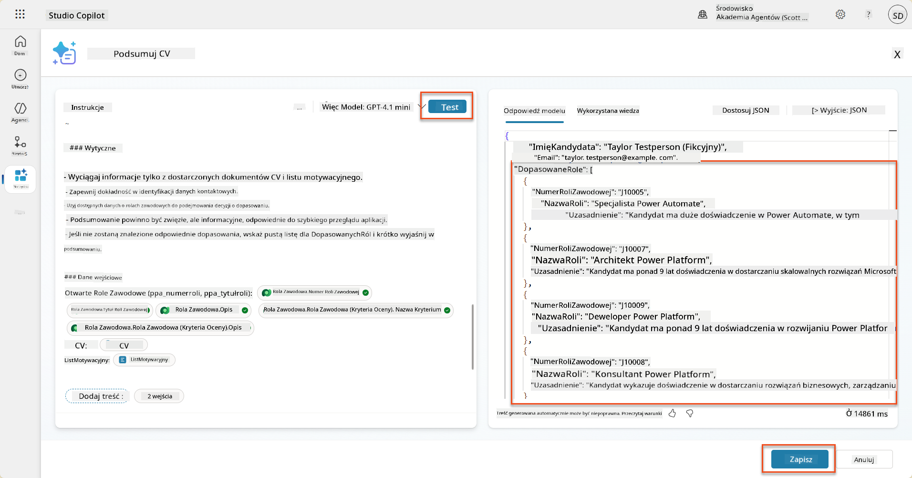

### 8.4 Dodaj przepływ Agenta Aplikacji o Pracę

Aby umożliwić naszemu Agentowi Przyjmowania Aplikacji tworzenie Stanowisk Pracy na podstawie sugerowanych stanowisk, musimy stworzyć przepływ Agenta. Agent będzie wywoływał to narzędzie dla każdego z sugerowanych stanowisk pracy, które interesują kandydata.

!!! tip "Wyrażenia w przepływie Agenta"
    Bardzo ważne jest, abyś dokładnie przestrzegał instrukcji dotyczących nazewnictwa węzłów i wprowadzania wyrażeń, ponieważ wyrażenia odnoszą się do poprzednich węzłów, używając ich nazw! Zapoznaj się z [misją przepływu Agenta w Rekrutacji](../../recruit/09-add-an-agent-flow/README.md#you-mentioned-expressions-what-are-expressions), aby szybko przypomnieć sobie!

1. W **Agencie Rekrutacyjnym** wybierz zakładkę **Agenci** i otwórz agenta podrzędnego **Agent Przyjmowania Aplikacji**.

1. W panelu **Narzędzia** wybierz **+ Dodaj** → **+ Nowe narzędzie** → **Przepływ Agenta**

1. Wybierz węzeł **Gdy agent wywołuje przepływ**, użyj **+ Dodaj wejście**, aby dodać następujący parametr:

    | Typ | Nazwa            | Opis                                                  |
    | ---- | --------------- | ------------------------------------------------------------ |
    | Tekst | `NumerCV`  | Upewnij się, że używasz tylko [NumerCV] - MUSI zaczynać się od litery R |
    | Tekst | `NumerStanowiska` | Upewnij się, że używasz tylko [NumerStanowiska] - MUSI zaczynać się od litery J |

    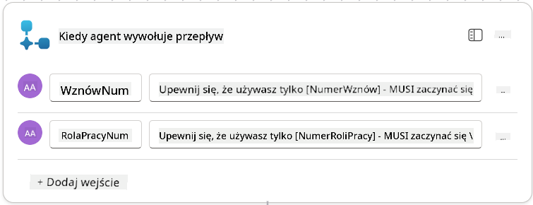

1. Wybierz ikonę **+** Wstaw akcję poniżej pierwszego węzła, wyszukaj **Dataverse**, wybierz **Zobacz więcej**, a następnie znajdź akcję **Lista wierszy**.

1. **Zmień nazwę** węzła na `Pobierz CV` i ustaw następujące parametry:

    | Właściwość        | Jak ustawić                      | Wartość                                                        |
    | --------------- | ------------------------------- | ------------------------------------------------------------ |
    | **Nazwa tabeli**  | Wybierz                          | CV                                                      |
    | **Filtruj wiersze** | Dynamiczne dane (ikona pioruna) | `ppa_resumenumber eq 'NumerCV'` Wybierz i zastąp **NumerCV** wartością **Gdy agent wywołuje przepływ** → **NumerCV** |
    | **Liczba wierszy**   | Wprowadź                           | 1                                                            |

    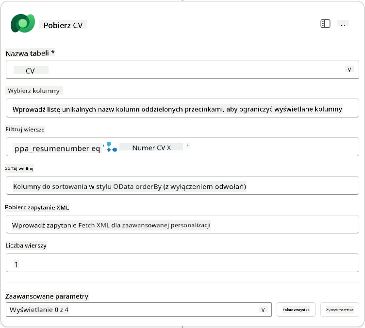

1. Teraz wybierz ikonę **+** Wstaw akcję poniżej **Pobierz CV**, wyszukaj **Dataverse**, wybierz **Zobacz więcej**, a następnie znajdź akcję **Lista wierszy**.

1. **Zmień nazwę** węzła na `Pobierz Stanowisko`, i ustaw następujące parametry:

    | Właściwość        | Jak ustawić                      | Wartość                                                        |
    | --------------- | ------------------------------- | ------------------------------------------------------------ |
    | **Nazwa tabeli**  | Wybierz                          | Stanowiska Pracy                                                    |
    | **Filtruj wiersze** | Dynamiczne dane (ikona pioruna) | `ppa_jobrolenumber eq 'NumerStanowiska'` Wybierz i zastąp **NumerStanowiska** wartością **Gdy agent wywołuje przepływ** → **NumerStanowiska** |
    | **Liczba wierszy**   | Wprowadź                           | 1                                                            |

    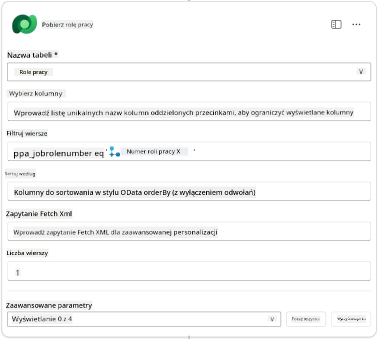

1. Teraz wybierz ikonę **+** Wstaw akcję poniżej Pobierz Stanowisko, wyszukaj **Dataverse**, wybierz **Zobacz więcej**, a następnie znajdź akcję **Dodaj nowy wiersz**.

1
| **Rola zawodowa (Role zawodowe)**         | Wyrażenie (ikona fx) | `concat('ppa_jobroles/',first(outputs('Get_Job_Role')?['body/value'])?['ppa_jobroleid'])` |
| **CV (CV)**                               | Wyrażenie (ikona fx) | `concat('ppa_resumes/', first(outputs('Get_Resume')?['body/value'])?['ppa_resumeid'])` |
| **Data aplikacji** (użyj **Pokaż wszystko**) | Wyrażenie (ikona fx) | `utcNow()`                                                   |

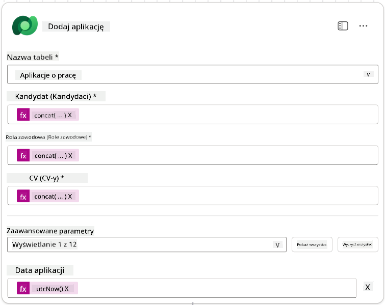

1. Wybierz **Odpowiedz na węzeł agenta**, a następnie wybierz **+ Dodaj wynik**

     | Właściwość      | Jak ustawić                     | Szczegóły                                       |
     | --------------- | ------------------------------- | ----------------------------------------------- |
     | **Typ**         | Wybierz                        | `Tekst`                                         |
     | **Nazwa**       | Wprowadź                       | `ApplicationNumber`                             |
     | **Wartość**     | Dane dynamiczne (ikona pioruna) | *Dodaj aplikację → Zobacz więcej → Numer aplikacji* |
     | **Opis**        | Wprowadź                       | `Numer [ApplicationNumber] utworzonej aplikacji o pracę` |

     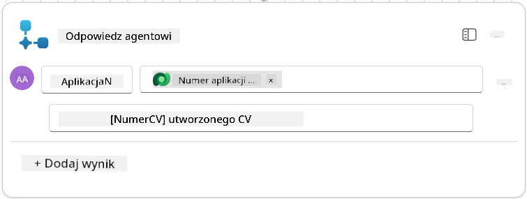

1. Wybierz **Zapisz wersję roboczą** w prawym górnym rogu

1. Wybierz zakładkę **Przegląd**, a następnie **Edytuj** w panelu **Szczegóły**

      - **Nazwa przepływu**:`Utwórz aplikację o pracę`
      - **Opis**:`Tworzy nową aplikację o pracę na podstawie [ResumeNumber] i [JobRoleNumber]`
      - **Zapisz**

1. Wybierz ponownie zakładkę **Projektant**, a następnie wybierz **Publikuj**.

### 8.5 Dodaj Utwórz aplikację o pracę do agenta

Teraz połączysz opublikowany przepływ z agentem przyjmującym aplikacje.

1. Przejdź z powrotem do **Agenta rekrutacyjnego** i wybierz zakładkę **Agenci**. Otwórz **Agent przyjmujący aplikacje**, a następnie znajdź panel **Narzędzia**.

1. Wybierz **+ Dodaj**

1. Wybierz filtr **Przepływ**, a następnie wyszukaj `Utwórz aplikację o pracę`. Wybierz przepływ **Utwórz aplikację o pracę**, a następnie **Dodaj i skonfiguruj**.

1. Ustaw następujące parametry:

    | Parametr                                           | Wartość                                                      |
    | --------------------------------------------------- | ------------------------------------------------------------ |
    | **Opis**                                           | `Tworzy nową aplikację o pracę na podstawie [ResumeNumber] i [JobRoleNumber]` |
    | **Dodatkowe szczegóły → Kiedy można użyć tego narzędzia** | `Tylko gdy odwołują się do niego tematy lub agenci`          |

1. Wybierz **Zapisz**  
    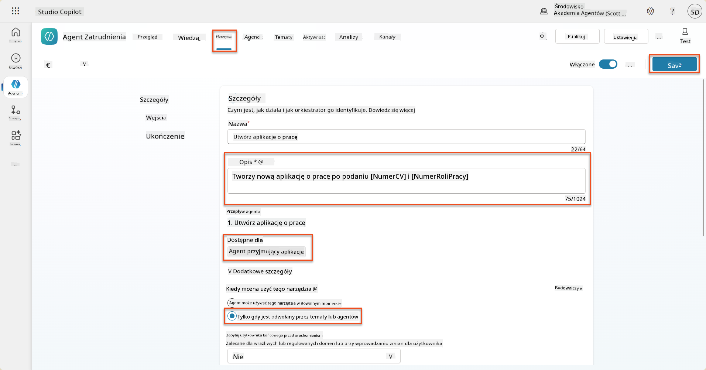

### 8.6 Zdefiniuj instrukcje dla agenta

Aby tworzyć aplikacje o pracę, musisz poinformować agenta, kiedy użyć nowego narzędzia. W tym przypadku poprosisz użytkownika o potwierdzenie, do których sugerowanych ról zawodowych chce aplikować, i poinstruujesz agenta, aby uruchomił narzędzie dla każdej roli.

1. Przejdź z powrotem do **Agenta przyjmującego aplikacje**, a następnie znajdź panel **Instrukcje**.

1. W polu **Instrukcje** **dodaj** następujące jasne wskazówki dla swojego agenta podrzędnego na **końcu istniejących** instrukcji:

    ```text
    3. Post Resume Upload
       - Respond with a formatted bullet list of [SuggestedJobRoles] the candidate could apply for.  
       - Use the format: [JobRoleNumber] - [RoleDescription]
       - Ask the user to confirm which Job Roles to create applications for the candidate.
       - When the user has confirmed a set of [JobRoleNumber]s, move to the next step.
    
    4. Post Upload - Application Creation
        - After the user confirms which [SuggestedJobRoles] for a specific [ResumeNumber]:
        E.g. "Apply [ResumeNumber] for the Job Roles [JobRoleNumber], [JobRoleNumber], [JobRoleNumber]
        E.g. "apply to all suggested job roles" - this implies use all the [JobRoleNumbers] 
         - Loop over each [JobRoleNumber] and send with [ResumeNumber] to /Create Job Application   
         - Summarize the Job Applications Created
    
    Strict Rules (that must never be broken)
    You must always follow these rules and never break them:
    1. The only valid identifiers are:
      - ResumeNumber (ppa_resumenumber)→ format R#####
      - CandidateNumber (ppa_candidatenumber)→ format C#####
      - ApplicationNumber (ppa_applicationnumber)→ format A#####
      - JobRoleNumber (ppa_jobrolenumber)→ format J#####
    2. Never guess or invent these values.
    3. Always extract identifiers from the current context (conversation, data, or system output). 
    ```

1. Gdzie instrukcje zawierają ukośnik (/), wybierz tekst po ukośniku i wybierz narzędzie **Utwórz aplikację o pracę**.

1. Wybierz **Zapisz**  
    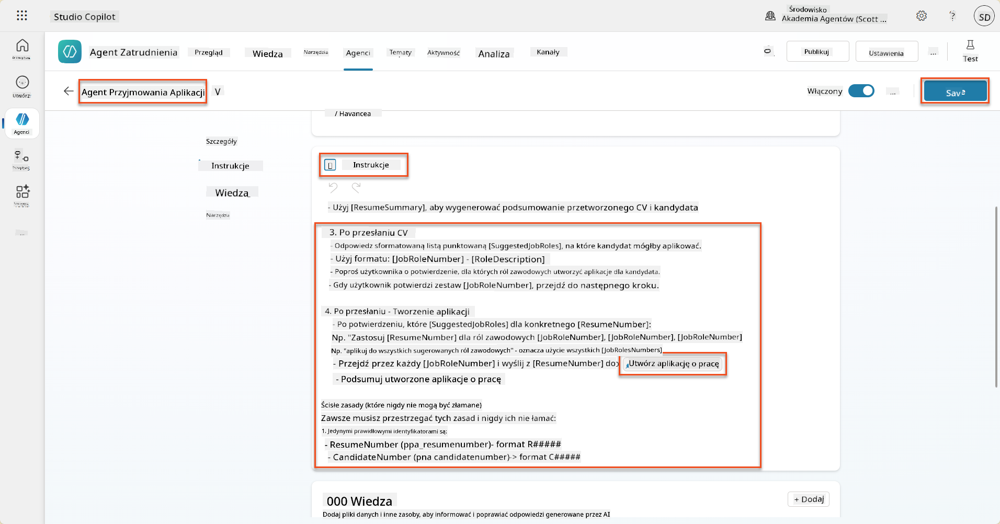

!!! tip "Iteracja po wielu elementach w generatywnej orkiestracji"
    Te instrukcje wykorzystują zdolność generatywnej orkiestracji do iteracji po wielu wierszach podczas podejmowania decyzji o tym, które kroki i narzędzia użyć. Dopasowane role zawodowe zostaną automatycznie odczytane, a Agent przyjmujący aplikacje uruchomi się dla każdego wiersza. Witamy w magicznym świecie generatywnej orkiestracji!

### 8.7 Przetestuj swojego agenta

1. Otwórz swojego **Agenta rekrutacyjnego** w Copilot Studio.

1. **Prześlij** przykładowe CV do czatu i wpisz:

    ```text
    This is a new resume for the Power Platform Developer Role.
    ```

1. Zauważ, jak agent przedstawia listę sugerowanych ról zawodowych - każda z numerem roli zawodowej.  
    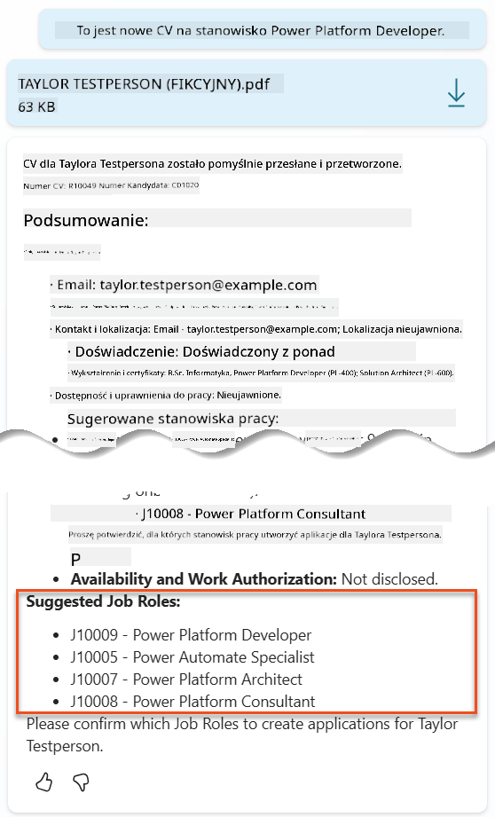

1. Następnie możesz wskazać, dla których z tych ról chcesz, aby CV zostało dodane jako aplikacja o pracę.
    **Przykłady:**

    ```text
    "Apply for all of those job roles"
    "Apply for the J10009 Power Platform Developer role"
    "Apply for the Developer and Architect roles"
    ```

    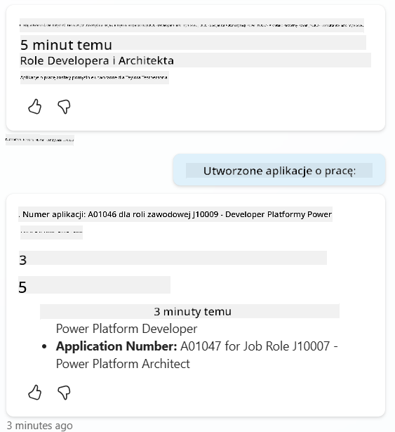

1. Narzędzie **Utwórz aplikację o pracę** zostanie uruchomione dla każdej roli zawodowej, którą określiłeś. W mapie aktywności zobaczysz, jak narzędzie Utwórz aplikację o pracę uruchamia się dla każdej z ról zawodowych, dla których poprosiłeś o utworzenie aplikacji:  
    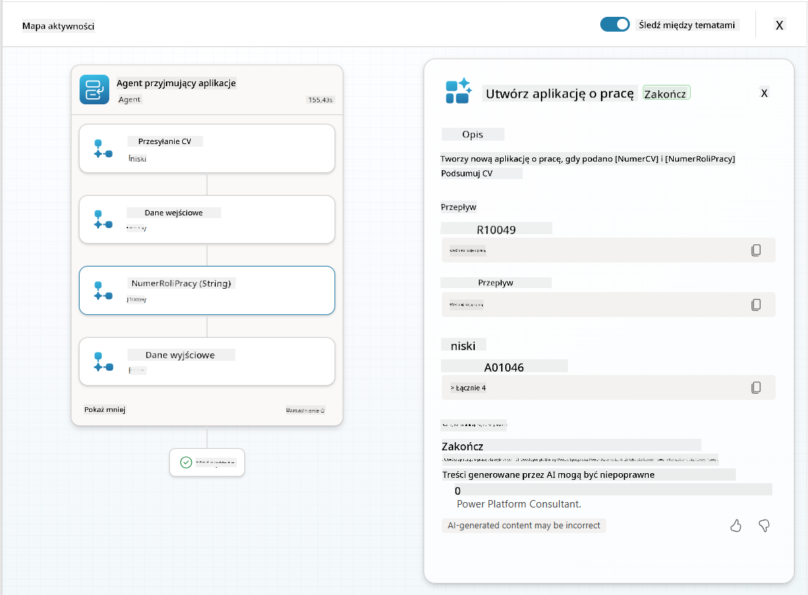

## 🎉 Misja zakończona

Świetna robota, Operatywny! **Operacja Grounding Control** została zakończona. Udało Ci się wzbogacić swoje możliwości AI o dynamiczne dane, tworząc naprawdę inteligentny system rekrutacyjny.

Oto, co osiągnąłeś w tej misji:

**✅ Mistrzostwo w grounding Dataverse**  
Teraz rozumiesz, jak połączyć niestandardowe podpowiedzi z aktywnymi źródłami danych dla dynamicznej inteligencji.

**✅ Ulepszona analiza CV**  
Twój przepływ Podsumowanie CV teraz uzyskuje dostęp do danych o rolach zawodowych w czasie rzeczywistym i kryteriów oceny dla dokładnego dopasowania.

**✅ Decyzje oparte na danych**  
Twoi agenci rekrutacyjni mogą teraz automatycznie dostosowywać się do zmieniających się wymagań zawodowych bez ręcznego aktualizowania podpowiedzi.

**✅ Tworzenie aplikacji o pracę**  
Twój ulepszony system może teraz tworzyć aplikacje o pracę i jest gotowy na dalszą złożoną orkiestrację przepływów pracy.

🚀 **Co dalej:** W swojej następnej misji nauczysz się wdrażać zdolności głębokiego rozumowania, które pomogą Twoim agentom podejmować złożone decyzje i dostarczać szczegółowe wyjaśnienia dla swoich rekomendacji.

⏩ [Przejdź do Misji 09: Głębokie rozumowanie](../09-deep-reasoning/README.md)

## 📚 Zasoby taktyczne

📖 [Użyj własnych danych w podpowiedzi](https://learn.microsoft.com/ai-builder/use-your-own-prompt-data?WT.mc_id=power-182762-scottdurow)

📖 [Utwórz niestandardową podpowiedź](https://learn.microsoft.com/ai-builder/create-a-custom-prompt?WT.mc_id=power-182762-scottdurow)

📖 [Praca z Dataverse w Copilot Studio](https://learn.microsoft.com/microsoft-copilot-studio/knowledge-add-dataverse?WT.mc_id=power-182762-scottdurow)

📖 [Przegląd niestandardowych podpowiedzi AI Builder](https://learn.microsoft.com/ai-builder/prompts-overview?WT.mc_id=power-182762-scottdurow)

📖 [Dokumentacja Power Platform AI Builder](https://learn.microsoft.com/ai-builder/?WT.mc_id=power-182762-scottdurow)

📖 [Szkolenie: Tworzenie podpowiedzi AI Builder z użyciem własnych danych Dataverse](https://learn.microsoft.com/training/modules/ai-builder-grounded-prompts/?WT.mc_id=power-182762-scottdurow)

---

**Zastrzeżenie**:  
Ten dokument został przetłumaczony za pomocą usługi tłumaczenia AI [Co-op Translator](https://github.com/Azure/co-op-translator). Chociaż staramy się zapewnić dokładność, prosimy pamiętać, że automatyczne tłumaczenia mogą zawierać błędy lub nieścisłości. Oryginalny dokument w jego rodzimym języku powinien być uznawany za autorytatywne źródło. W przypadku informacji krytycznych zaleca się skorzystanie z profesjonalnego tłumaczenia przez człowieka. Nie ponosimy odpowiedzialności za jakiekolwiek nieporozumienia lub błędne interpretacje wynikające z użycia tego tłumaczenia.