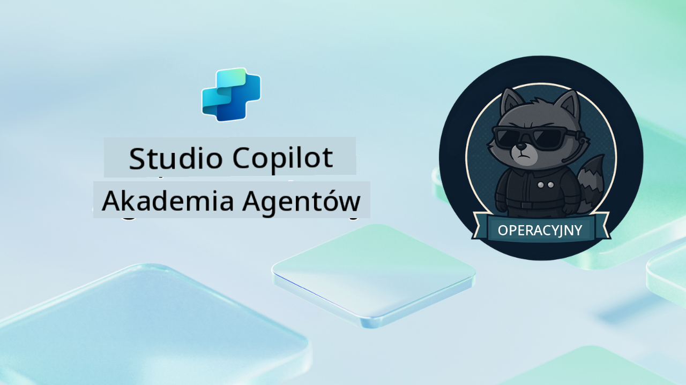

<!--
CO_OP_TRANSLATOR_METADATA:
{
  "original_hash": "24fcbe9a57d3439e05f8866e550c0a84",
  "translation_date": "2025-10-21T23:44:43+00:00",
  "source_file": "docs/operative-preview/README.md",
  "language_code": "pl"
}
-->
# Witaj, Operatywie

**Witaj, Operatywie.**  
Twoja zaawansowana misja—jeśli zdecydujesz się ją przyjąć—polega na opanowaniu sztuki budowania **systemów wieloagentowych klasy korporacyjnej** za pomocą **Microsoft Copilot Studio**.

To intensywne szkolenie przeniesie Cię poza podstawy tworzenia agentów do zaawansowanego świata **orkiestracji wieloagentowej**: od automatyzacji rekrutacji po bezpieczeństwo AI. Nauczysz się budować, koordynować i wdrażać inteligentne ekosystemy agentów w rzeczywistych scenariuszach biznesowych.

--8<-- "disclaimer.md"

---

## 🎯 Cel Misji

Po ukończeniu programu Agent Academy Operative będziesz w stanie:

- Projektować i wdrażać **systemy wieloagentowe** dla złożonych scenariuszy biznesowych
- Opanować wzorce **orkiestracji agentów** i ich współpracy
- Wdrażać **bezpieczeństwo AI i moderację treści** w systemach produkcyjnych
- Tworzyć **wielomodalne podpowiedzi** do przetwarzania i analizy dokumentów
- Wdrażać **agentów gotowych do pracy w przedsiębiorstwie** z odpowiednim zarządzaniem i testowaniem

---

## 🧪 Wymagania Wstępne

Aby ukończyć wszystkie misje, potrzebujesz:

- Ukończonego szkolenia **Agent Academy Recruit**
- Środowiska Microsoft Power Platform z licencją **Copilot Studio**
- Dostępu do **Microsoft Dataverse**
- Uprawnień administracyjnych do tworzenia rozwiązań i agentów

---

## 🧬 Dla Kogo Jest Ten Kurs

Ten zaawansowany kurs jest idealny dla:

- **Architektów rozwiązań** projektujących systemy AI dla przedsiębiorstw
- **Programistów** budujących rozwiązania agentów gotowe do produkcji
- **Specjalistów IT** wdrażających zarządzanie i bezpieczeństwo AI
- **Analityków biznesowych** tworzących złożone przepływy automatyzacji
- Każdego, kto jest gotowy **przejść na wyższy poziom** od podstawowych agentów do systemów korporacyjnych

---

## 🧭 Przegląd Programu

Akademia jest zorganizowana jako progresywna seria operacji terenowych—każda misja buduje na poprzedniej, tworząc kompleksowy system automatyzacji rekrutacji.

| Misja | Tytuł | Opis Operacji |
|-------|-------|--------------|
| `01` | 🚨 [Rozpocznij pracę z Agentem Rekrutacyjnym](./01-get-started/README.md) | Wdróż podstawową infrastrukturę i stwórz centralnego agenta orkiestratora |
| `02` | 🎭 [Przygotuj swojego agenta do pracy wieloagentowej z połączonymi agentami](./02-multi-agent/README.md) | Przekształć pojedynczego agenta w skoordynowany system wieloagentowy |
| `03` | ⚡ [Zautomatyzuj swojego agenta za pomocą Wyzwalaczy](./03-automate-triggers/README.md) | Wdróż autonomiczne zachowania agenta oparte na wyzwalaczach zdarzeń |
| `04` | 📝 [Tworzenie Instrukcji dla Agenta](./04-agent-instructions/README.md) | Opanuj precyzyjną komunikację i kontrolę zachowań agenta |
| `05` | 💬 [Personalizacja Odpowiedzi Agenta](./05-agent-responses/README.md) | Dostosuj odpowiedzi agenta dla maksymalnego efektu i zaangażowania |
| `06` | 🛡️ [Podstawy Moderacji Treści i Bezpieczeństwa AI](./06-ai-safety/README.md) | Wdróż środki bezpieczeństwa i zgodności na poziomie korporacyjnym |
| `07` | 🎨 [Ekstrakcja Zawartości CV za pomocą Wielomodalnych Podpowiedzi](./07-multimodal-prompts/README.md) | Przetwarzaj dokumenty i obrazy za pomocą zaawansowanych możliwości AI |
| `08` | 🗄️ [Podpowiedzi - Osadzenie w Dataverse](./08-dataverse-grounding/README.md) | Osadź agentów w danych przedsiębiorstwa dla precyzyjnych odpowiedzi |
| `09` | 🧠 [Zastosowanie Głębokiego Rozumowania do Oceny Dopasowania Kandydatów i Przygotowania do Rozmowy](./09-deep-reasoning/README.md) | Wdróż zaawansowane rozumowanie AI dla złożonych decyzji |
| `10` | 📄 [Generowanie Dokumentów Rozmowy Kwalifikacyjnej Specyficznych dla Kandydata za pomocą Podpowiedzi](./10-generate-documents/README.md) | Twórz dynamiczne dokumenty na podstawie analizy agenta |
| `11` | 📊 [Pozyskiwanie Opinii Użytkowników za pomocą Kart Adaptacyjnych](./11-obtain-user-feedback/README.md) | Zbieraj i przetwarzaj opinie użytkowników dla ciągłego doskonalenia |
| `12` | 🌐 [Publikowanie Twoich Agentów na Stronie Demo dla Testów Interesariuszy](./12-demo-website/README.md) | Wdróż kompletne rozwiązanie do demonstracji i testów dla interesariuszy |

!!! note
    ✅ Ukończenie tego programu daje Ci odznakę **Operatywnego**.  
    🔓 **Dowódca** zostanie odblokowany w przyszłych fazach.

<!-- markdownlint-disable-next-line MD033 -->

---

**Zastrzeżenie**:  
Ten dokument został przetłumaczony za pomocą usługi tłumaczenia AI [Co-op Translator](https://github.com/Azure/co-op-translator). Chociaż staramy się zapewnić dokładność, prosimy pamiętać, że automatyczne tłumaczenia mogą zawierać błędy lub nieścisłości. Oryginalny dokument w jego rodzimym języku powinien być uznawany za autorytatywne źródło. W przypadku informacji krytycznych zaleca się skorzystanie z profesjonalnego tłumaczenia przez człowieka. Nie ponosimy odpowiedzialności za jakiekolwiek nieporozumienia lub błędne interpretacje wynikające z użycia tego tłumaczenia.