<!--
CO_OP_TRANSLATOR_METADATA:
{
  "original_hash": "d9cd8cd1a4fbd8915171a2ed972cc322",
  "translation_date": "2025-10-22T01:02:09+00:00",
  "source_file": "docs/recruit/00-course-setup/README.md",
  "language_code": "pl"
}
-->
# 🚨 Misja 00: Konfiguracja kursu

## 🕵️‍♂️ KOD OPERACJI: `OPERACJA GOTOWOŚĆ DO WDROŻENIA`

> **⏱️ Czas trwania operacji:** `~30 minut`  

## 🎯 Opis misji

Witamy w pierwszej misji Twojego szkolenia jako Agent Copilot Studio.  
Zanim zaczniesz budować swojego pierwszego agenta AI, musisz skonfigurować swoje **środowisko programistyczne gotowe do działania w terenie**.

Ten dokument zawiera informacje o systemach, danych dostępowych i krokach konfiguracji niezbędnych do pracy w ekosystemie Microsoft 365.

## 🔎 Cele

Twoja misja obejmuje:

1. Uzyskanie konta Microsoft 365  
1. Uzyskanie dostępu do Microsoft Copilot Studio  
1. (Opcjonalnie) Zabezpieczenie licencji Microsoft 365 Copilot do publikacji produkcyjnej  
1. Utworzenie środowiska programistycznego jako środowiska Copilot Studio do budowy  
1. Utworzenie witryny SharePoint jako źródła danych do wykorzystania w późniejszych misjach  

---

## 🔍 Wymagania wstępne

Przed rozpoczęciem upewnij się, że masz:

1. **Służbowy lub szkolny adres e-mail** (osobiste adresy @outlook.com, @gmail.com itp. nie są obsługiwane).  
1. Dostęp do internetu i nowoczesnej przeglądarki (zalecane: Edge, Chrome lub Firefox).  
1. Podstawową znajomość Microsoft 365 (np. logowanie do aplikacji Office lub Teams).  
1. (Opcjonalnie) Kartę kredytową lub metodę płatności, jeśli planujesz zakup licencji płatnych.

---

## Krok 1: Uzyskaj konto Microsoft 365

Copilot Studio działa w ramach Microsoft 365, więc potrzebujesz konta Microsoft 365, aby uzyskać do niego dostęp. Możesz użyć istniejącego konta, jeśli je posiadasz, lub postępować zgodnie z poniższymi krokami, aby uzyskać odpowiednią licencję:

1. **Zdobądź płatną subskrypcję Microsoft 365 Business**  
   1. Przejdź na [stronę planów i cen Microsoft 365 Business](https://www.microsoft.com/microsoft-365/business/microsoft-365-plans-and-pricing)  
   1. Najtańszą opcją na początek jest plan Microsoft 365 Business Basic. Wybierz `Wypróbuj za darmo` i postępuj zgodnie z instrukcjami, aby wypełnić dane subskrypcji, konta i płatności.  
   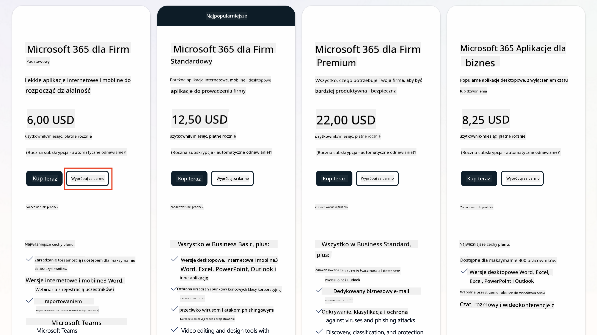  
   1. Po utworzeniu nowego konta, zaloguj się.

    !!! Tip
        Jeśli planujesz publikować agentów w Microsoft 365 Copilot Chat lub łączyć się z danymi organizacyjnymi (SharePoint, OneDrive, Dataverse), wymagana jest licencja Microsoft 365 Copilot. Jest to licencja dodatkowa, o której możesz dowiedzieć się więcej [na stronie licencyjnej](https://www.microsoft.com/microsoft-365/copilot#plans).

---

## Krok 2: Rozpocznij próbę Copilot Studio

Po uzyskaniu swojego Microsoft 365 Tenant, musisz uzyskać dostęp do Copilot Studio. Możesz skorzystać z darmowej 30-dniowej wersji próbnej, wykonując następujące kroki:

1. Przejdź na [aka.ms/TryCopilotStudio](https://aka.ms/TryCopilotStudio).  
1. Wprowadź adres e-mail z nowo skonfigurowanego konta i wybierz `Dalej`.  
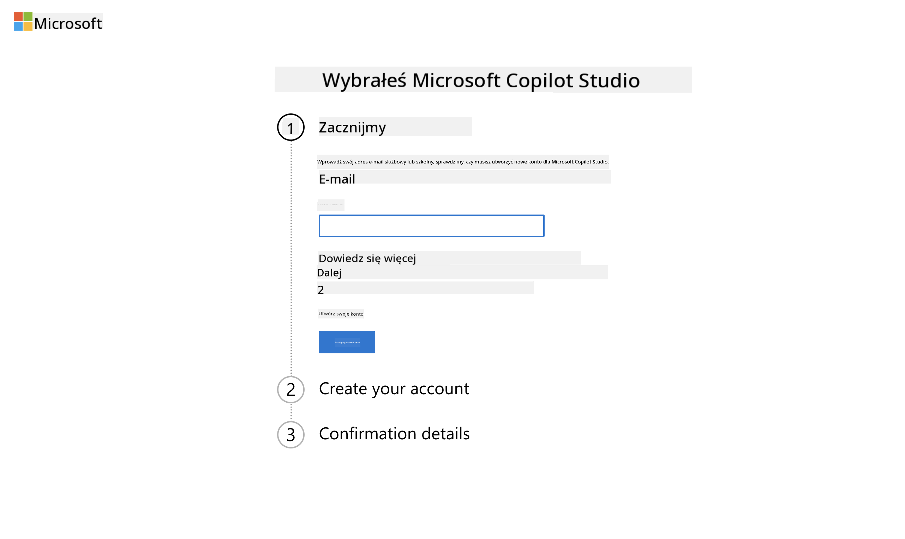  
1. Powinno rozpoznać Twoje konto. Wybierz `Zaloguj się`.  
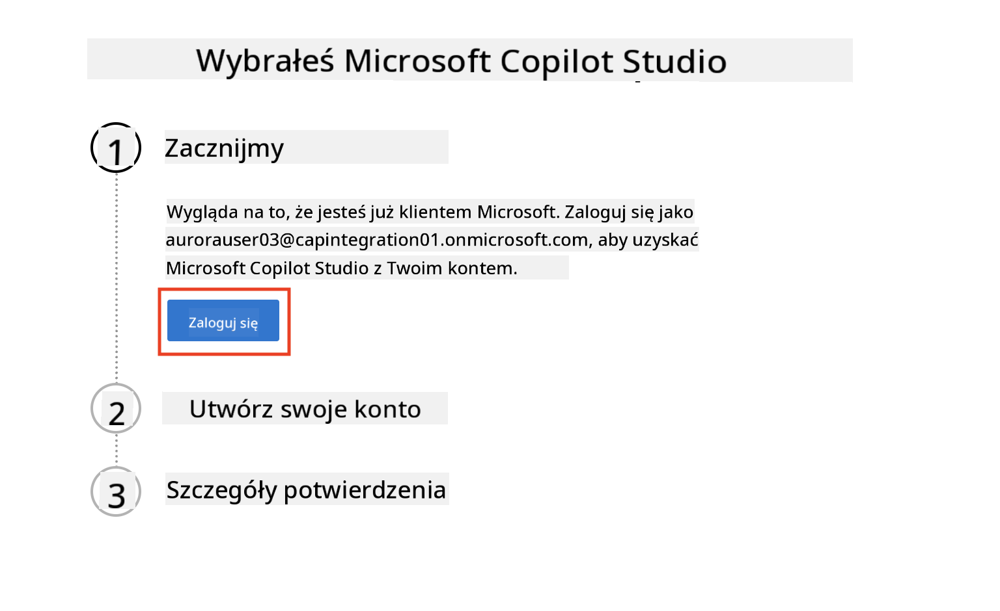  
1. Wybierz `Rozpocznij darmową wersję próbną`.  
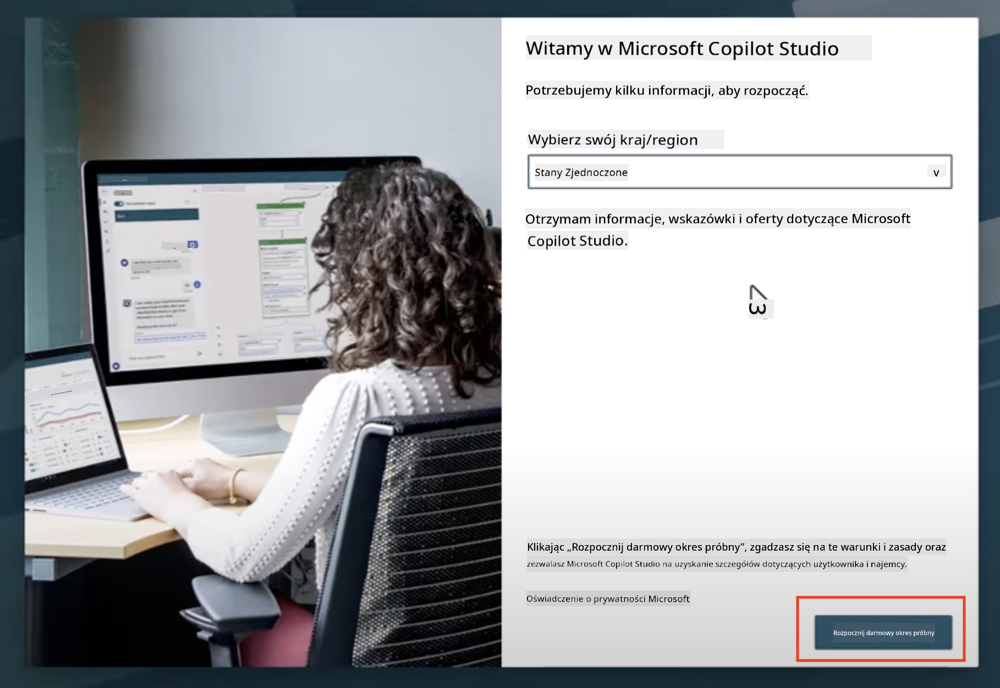

!!! info "Uwagi dotyczące wersji próbnej"  
     1. Darmowa wersja próbna zapewnia **pełne możliwości Copilot Studio**.  
     1. Otrzymasz powiadomienia e-mail o wygaśnięciu wersji próbnej. Możesz przedłużyć wersję próbną o kolejne 30 dni (do 90 dni działania agenta).  
     1. Jeśli administrator Twojego tenant wyłączył proces rejestracji samodzielnej, zobaczysz błąd — skontaktuj się z administratorem Microsoft 365, aby go ponownie włączyć.

---

## Krok 3: Utwórz nowe środowisko programistyczne

### Zarejestruj się w planie dla programistów Power Apps

Korzystając z tego samego tenant Microsoft 365 z Kroku 1, zarejestruj się w planie dla programistów Power Apps, aby utworzyć darmowe środowisko programistyczne do budowy i testowania w Copilot Studio.

1. Zarejestruj się na [stronie planu dla programistów Power Apps](https://aka.ms/PowerAppsDevPlan).

    - Wprowadź swój adres e-mail  
    - Zaznacz pole wyboru  
    - Wybierz **Rozpocznij darmową wersję próbną**  

    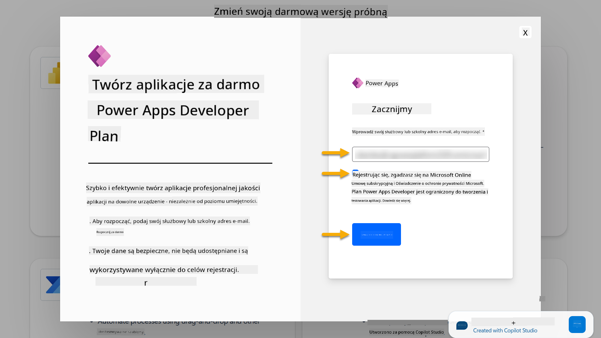

1. Po zarejestrowaniu się w planie dla programistów zostaniesz przekierowany do [Power Apps](https://make.powerapps.com/). Środowisko używa Twojego imienia, na przykład **Środowisko Adele Vance**. Jeśli istnieje już środowisko o tej nazwie, nowe środowisko programistyczne zostanie nazwane **Środowisko Adele Vance (1)**.

    Użyj tego środowiska programistycznego w Copilot Studio podczas wykonywania laboratoriów.

!!! Note
    Jeśli korzystasz z istniejącego konta Microsoft 365 i nie utworzyłeś go w Kroku 1, na przykład - używasz swojego konta w organizacji, administrator IT (lub odpowiedni zespół) zarządzający Twoim tenant/środowiskami mógł wyłączyć proces rejestracji. W takim przypadku skontaktuj się z administratorem lub utwórz testowy tenant zgodnie z Krokiem 1.

---

## Krok 4: Utwórz nową witrynę SharePoint

Należy utworzyć nową witrynę SharePoint, która będzie używana w [Lekcji 06 - Tworzenie niestandardowego agenta za pomocą konwersacyjnego doświadczenia tworzenia z Copilot i osadzenia go w Twoich danych](../06-create-agent-from-conversation/README.md#62-add-an-internal-knowledge-source-using-a-sharepoint-site).

1. Wybierz ikonę "gofra" w lewym górnym rogu Microsoft Copilot Studio, aby wyświetlić menu. Wybierz SharePoint z menu.

    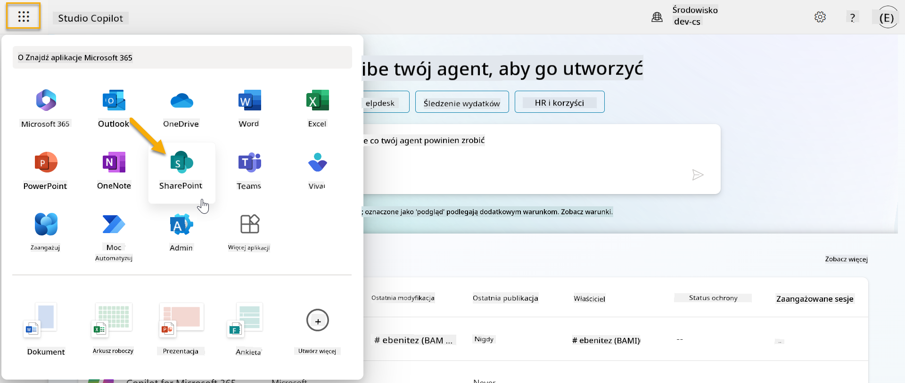

1. SharePoint zostanie załadowany. Wybierz **+ Utwórz witrynę**, aby utworzyć nową witrynę SharePoint.

    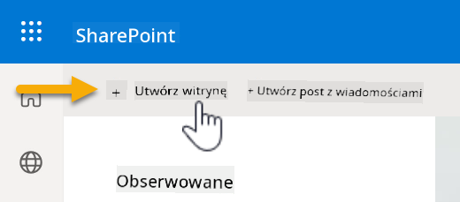

1. Pojawi się okno dialogowe, które poprowadzi Cię przez proces tworzenia nowej witryny SharePoint. Wybierz **Witryna zespołowa**.

    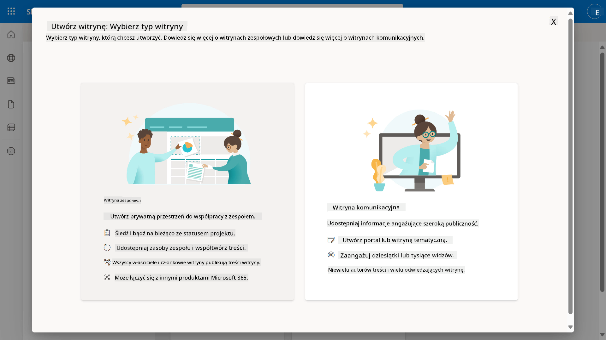

1. W kolejnym kroku domyślnie załaduje się lista szablonów Microsoft. Przewiń w dół i wybierz szablon **Pomoc techniczna IT**.

    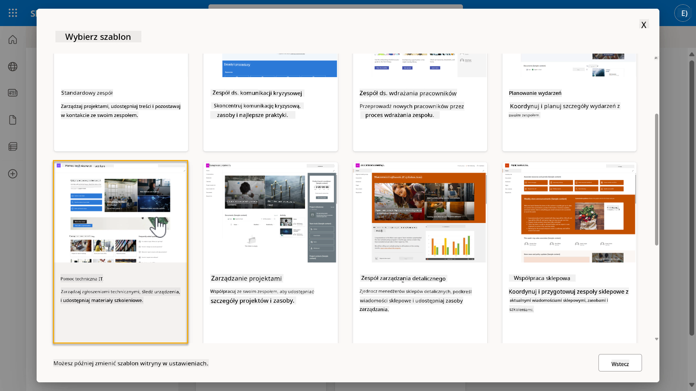

1. Wybierz **Użyj szablonu**, aby utworzyć nową witrynę SharePoint za pomocą szablonu pomocy technicznej IT.

    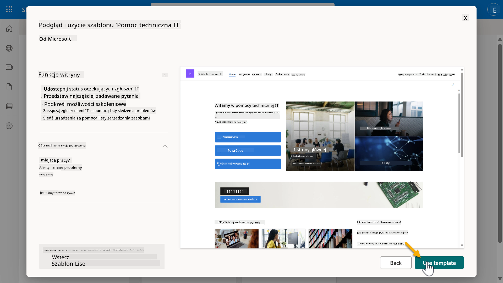

1. Wprowadź informacje o swojej witrynie. Oto przykład:

    | Pole | Wartość |
    | --- | --- |
    | Nazwa witryny | Contoso IT |
    | Opis witryny | Copilot Studio dla początkujących |
    | Adres witryny | ContosoIT |

    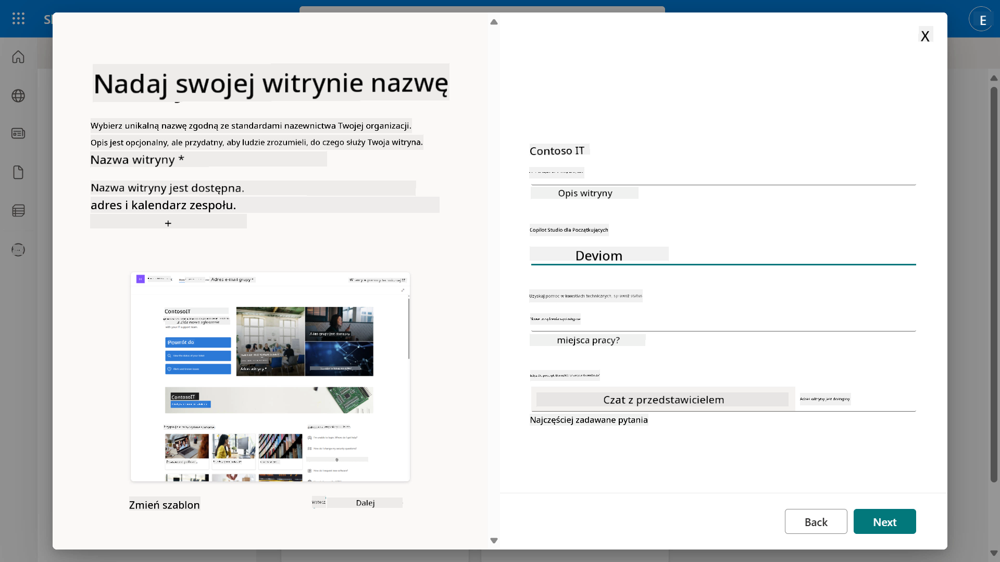

1. W ostatnim kroku można wybrać język dla witryny SharePoint. Domyślnie będzie to **angielski**. Pozostaw język jako **angielski** i wybierz **Utwórz witrynę**.

    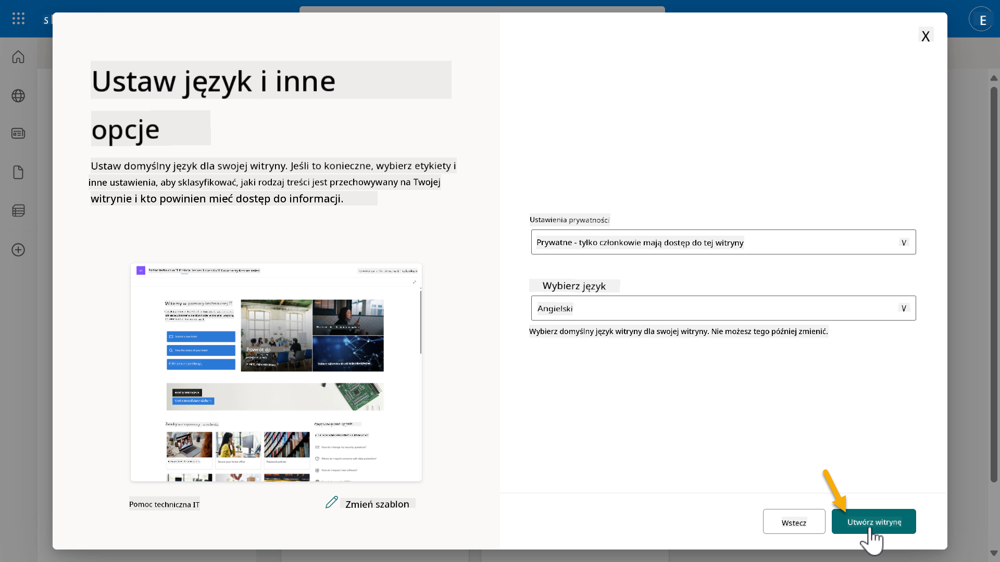

1. Witryna SharePoint zostanie utworzona w ciągu kilku sekund. W międzyczasie możesz dodać innych użytkowników do swojej witryny, wprowadzając ich adres e-mail w polu **Dodaj członków**. Po zakończeniu wybierz **Zakończ**.

    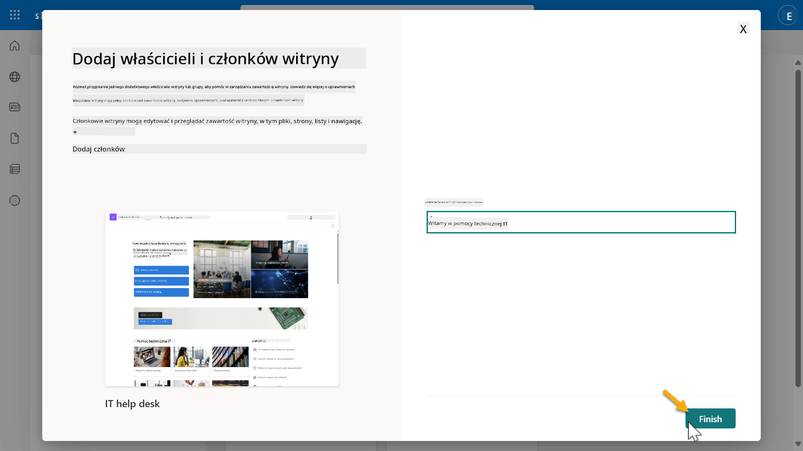

1. Następnie załaduje się strona główna witryny SharePoint. **Skopiuj** adres URL witryny SharePoint.

1. Ten szablon zawiera strony z przykładowymi danymi dotyczącymi różnych polityk IT oraz dwie przykładowe listy (Zgłoszenia i Urządzenia).

### Użyj listy Urządzenia w SharePoint

Użyjemy listy **Urządzenia** w [Misji 07 - Dodaj nowy temat z wyzwalaczem i węzłami](../07-add-new-topic-with-trigger/README.md#73-add-a-tool-using-a-connector).

### Dodaj nową kolumnę

Przewiń listę do prawej strony i wybierz przycisk **+ Dodaj kolumnę**. Wybierz typ **hiperłącze**, wprowadź **Obraz** jako nazwę kolumny i wybierz dodaj.

### Utwórz przykładowe dane w liście Urządzenia w SharePoint

Upewnij się, że wypełniasz tę listę co najmniej 4 przykładowymi elementami danych i dodajesz jedną dodatkową kolumnę do tej listy.  

Podczas dodawania przykładowych danych upewnij się, że wypełnione są następujące pola:

- Zdjęcie urządzenia - użyj obrazów z [folderu obrazów urządzeń](https://github.com/microsoft/agent-academy/tree/main/docs/recruit/00-course-setup/images/device-images)  
- Tytuł  
- Status  
- Producent  
- Model  
- Typ zasobu  
- Kolor  
- Numer seryjny  
- Data zakupu  
- Cena zakupu  
- Numer zamówienia  
- Obraz - użyj poniższych linków  

|Urządzenie  |URL  |
|---------|---------|
|Surface Laptop 13     | [https://raw.githubusercontent.com/microsoft/agent-academy/refs/heads/main/docs/recruit/00-course-setup/images/device-images/Surface-Laptop-13.png](https://raw.githubusercontent.com/microsoft/agent-academy/refs/heads/main/docs/recruit/00-course-setup/images/device-images/Surface-Laptop-13.png)        |
|Surface Laptop 15     | [https://raw.githubusercontent.com/microsoft/agent-academy/refs/heads/main/docs/recruit/00-course-setup/images/device-images/Surface-Laptop-15.png](https://raw.githubusercontent.com/microsoft/agent-academy/refs/heads/main/docs/recruit/00-course-setup/images/device-images/Surface-Laptop-15.png)        |
|Surface Pro    | [https://raw.githubusercontent.com/microsoft/agent-academy/refs/heads/main/docs/recruit/00-course-setup/images/device-images/Surface-Pro-12.png](https://raw.githubusercontent.com/microsoft/agent-academy/refs/heads/main/docs/recruit/00-course-setup/images/device-images/Surface-Pro-12.png)        |
|Surface Studio    | [https://raw.githubusercontent.com/microsoft/agent-academy/refs/heads/main/docs/recruit/00-course-setup/images/device-images/Surface-Studio.png](https://raw.githubusercontent.com/microsoft/agent-academy/refs/heads/main/docs/recruit/00-course-setup/images/device-images/Surface-Studio.png)        |

---

## ✅ Misja zakończona

Pomyślnie:

- Skonfigurowałeś środowisko programistyczne Microsoft 365  
- Aktywowałeś wersję próbną Copilot Studio  
- Utworzyłeś witrynę SharePoint do osadzenia agentów  
- Wypełniłeś listę Urządzenia do wykorzystania w przyszłych misjach  

Jesteś oficjalnie gotowy, aby rozpocząć **szkolenie na poziomie Rekruta** w [Lekcji 01](../01-introduction-to-agents/README.md).  

---

**Zastrzeżenie**:  
Ten dokument został przetłumaczony za pomocą usługi tłumaczenia AI [Co-op Translator](https://github.com/Azure/co-op-translator). Chociaż staramy się zapewnić dokładność, prosimy pamiętać, że automatyczne tłumaczenia mogą zawierać błędy lub nieścisłości. Oryginalny dokument w jego rodzimym języku powinien być uznawany za źródło autorytatywne. W przypadku informacji krytycznych zaleca się profesjonalne tłumaczenie przez człowieka. Nie ponosimy odpowiedzialności za jakiekolwiek nieporozumienia lub błędne interpretacje wynikające z użycia tego tłumaczenia.