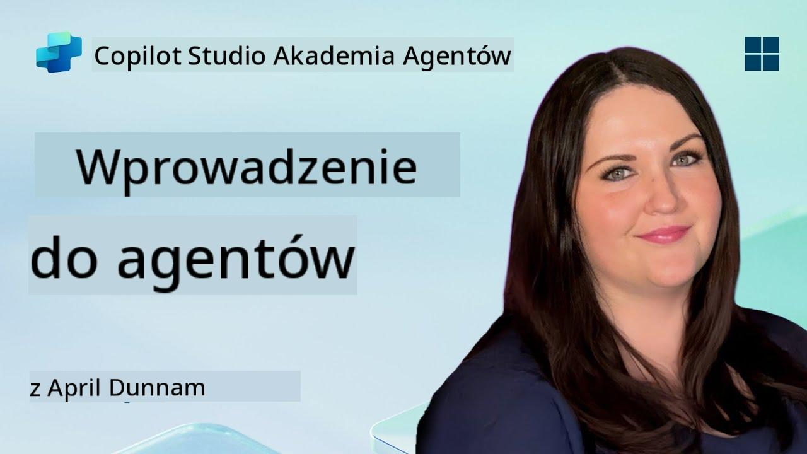

<!--
CO_OP_TRANSLATOR_METADATA:
{
  "original_hash": "d6706e107678264168d77b2e107710b1",
  "translation_date": "2025-10-22T00:32:49+00:00",
  "source_file": "docs/recruit/01-introduction-to-agents/README.md",
  "language_code": "pl"
}
-->
# 🚨 Misja 01: Wprowadzenie do Agentów

## 🕵️‍♂️ KOD OPERACJI: `OPERACJA AI AGENT DECODE`

> **⏱️ Czas trwania operacji:** `~30 minut – tylko analiza, bez pracy w terenie`

🎥 **Obejrzyj Przewodnik**

## 🎯 Cel Misji

Witaj, Rekrucie. Zanim przejdziemy do budowania agentów, musisz dobrze zrozumieć koncepcje AI, które je napędzają. Ta misja wyposaży Cię w podstawową wiedzę na temat konwersacyjnej AI, dużych modeli językowych (LLM), generacji wspomaganej wyszukiwaniem (RAG) oraz typów agentów, które możesz stworzyć w Copilot Studio.

## 🔎 Cele

Podczas tej misji dowiesz się:

1. Czym jest konwersacyjna AI i dlaczego jest ważna  
1. Jak Duże Modele Językowe (LLM) napędzają doświadczenia czatowe  
1. Co wnosi Generacja Wspomagana Wyszukiwaniem (RAG)  
1. Różnica między agentami konwersacyjnymi a autonomicznymi  
1. Jak agenci w Copilot Studio wykorzystują te koncepcje  

Zaczynajmy!

---

## Czym jest konwersacyjna AI?

Konwersacyjna AI odnosi się do każdego systemu, który potrafi rozumieć, przetwarzać i odpowiadać na język ludzki – zarówno tekst, jak i mowę – w sposób naturalny. Pomyśl o chatbotach w działach pomocy technicznej lub wirtualnych asystentach w Twoich ulubionych aplikacjach. W większości nowoczesne konwersacyjne AI opierają się na Dużych Modelach Językowych (LLM), które omówimy w dalszej części.

### Dlaczego to ważne

- **Doświadczenie użytkownika:** Interfejsy konwersacyjne są często bardziej intuicyjne niż nawigacja po menu.  
- **Skalowalność:** Jeden agent może obsługiwać dziesiątki lub setki równoczesnych rozmów.  
- **Efektywność:** Zamiast budować niestandardowe skrypty oparte na regułach, agenci napędzani LLM dostosowują się na bieżąco do danych wejściowych użytkownika.  
- **Rozszerzalność:** Przy odpowiednim projekcie agenci mogą korzystać z baz wiedzy, łączyć się z API lub działać jako „cyfrowi współpracownicy” w ramach procesów biznesowych.

---

## Duże Modele Językowe (LLM) 101

Podstawą większości systemów konwersacyjnej AI są **Duże Modele Językowe** – sieci neuronowe trenowane na ogromnych korpusach tekstu. Uczą się statystycznych wzorców języka, dzięki czemu mogą generować spójne zdania, odpowiadać na pytania czy nawet wymyślać pomysły. Kluczowe punkty do zrozumienia:

1. **Dane treningowe:** LLM przetwarzają terabajty tekstu (strony internetowe, książki, artykuły). Ta „wiedza o świecie” pozwala im odpowiadać na wiele tematów.  
1. **Tokenizacja:** Tekst jest dzielony na mniejsze jednostki zwane tokenami (słowa, części słów lub znaki). Model przewiduje jeden token na raz.  
1. **Okno kontekstowe:** Każdy LLM ma limit, ile tokenów może „widzieć” jednocześnie. Po przekroczeniu tego limitu wcześniejsze tokeny są odcinane.  
1. **Podpowiedzi:** Interakcja z LLM odbywa się poprzez wysyłanie mu podpowiedzi. Im lepsza podpowiedź, tym bardziej skoncentrowana i trafna odpowiedź.  
1. **Zero-shot vs. Fine-tuning:** Zero-shot oznacza użycie LLM w jego pierwotnej formie (bez dostosowań). Fine-tuning oznacza dostosowanie modelu na danych specyficznych dla danej dziedziny, aby odpowiadał bardziej precyzyjnie na Twoje potrzeby.

!!! Tip "Porada"
    Często porównuje się LLM do „superinteligentnego autouzupełniania”. Nie rozumie znaczenia jak ludzki mózg, ale jest niezwykle dobry w przewidywaniu kolejnego najlepszego słowa (lub frazy) w sekwencji.

---

## Generacja Wspomagana Wyszukiwaniem (RAG)

Kiedy LLM opierają się wyłącznie na statycznych danych treningowych, mogą generować błędne informacje lub stać się nieaktualne. RAG rozwiązuje ten problem, pozwalając modelowi „wyszukiwać” świeże informacje przed stworzeniem odpowiedzi. W skrócie, RAG działa w następujący sposób:

1. **Zapytanie użytkownika:** Użytkownik zadaje pytanie (np. „Jakie są najnowsze wyniki kwartalne Contoso?”).  
1. **Krok wyszukiwania:** System przeszukuje źródło wiedzy (dokumenty, wewnętrzne bazy danych, biblioteki SharePoint itp.) w celu znalezienia odpowiednich fragmentów.  
1. **Augmentacja:** Znalezione fragmenty są dodawane do podpowiedzi LLM.  
1. **Generacja:** LLM przetwarza zarówno pytanie użytkownika, jak i dostarczony kontekst, a następnie generuje odpowiedź opartą na aktualnych danych.  

Dzięki RAG Twój agent może korzystać z wewnętrznych wiki firmy, wtyczek API lub przeszukiwać bazę wiedzy FAQ – i zwracać odpowiedzi, które nie są ograniczone do statycznych parametrów modelu.

---

## Agenci konwersacyjni vs. autonomiczni

W kontekście Copilot Studio termin **agent** może odnosić się do różnych typów asystentów AI. Warto rozróżnić:

**Agenci konwersacyjni:**

- Skupiają się głównie na dwukierunkowym dialogu.  
- Zachowują kontekst w wielu wymianach w rozmowie.  
- Zazwyczaj działają według zdefiniowanych przepływów lub wyzwalaczy (np. „Jeśli użytkownik powie X, odpowiedz Y”).  
- Idealni do obsługi klienta, FAQ, interakcji prowadzących, planowania lub prostych pytań i odpowiedzi.  
  - Przykłady:
    - Chatbot w Teams odpowiadający na pytania dotyczące polityki HR.  
    - Bot Power Virtual Agents na stronie SharePoint, który prowadzi użytkowników przez formularz.  

**Agenci autonomiczni:**

- Wykraczają poza rozmowę; mogą **podejmować działania** w imieniu użytkownika.  
- Wykorzystują pętle rozumowania LLM (pomyśl „plan → działanie → obserwacja → ponowne planowanie”) do realizacji zadań.  
- Łączą się z zewnętrznymi narzędziami lub API (np. uruchamiają przepływ Power Automate, wysyłają zaproszenia kalendarzowe, manipulują danymi w Dataverse).  
- Działają bez ciągłych podpowiedzi od człowieka – po uruchomieniu mogą autonomicznie obsługiwać wieloetapowe procesy.  
  - Przykłady:  
    - Agent, który generuje plan podróży, rezerwuje loty i wysyła potwierdzenia e-mailem.  
    - Agent „Podsumowanie Spotkania”, który dołącza do rozmowy w Teams, transkrybuje ją w czasie rzeczywistym i tworzy podsumowanie dla OneNote.  

!!! Info "Kluczowa różnica"
    Agenci konwersacyjni czekają na dane wejściowe od użytkownika i skupiają się na dialogu. Agenci autonomiczni proaktywnie planują i wykonują sekwencję kroków, korzystając z szerszego dostępu do narzędzi.

---

## Agenci w Copilot Studio

**Copilot Studio** łączy zarówno scenariusze konwersacyjne, jak i autonomiczne w jednym frameworku. Oto jak Copilot Studio pomaga w budowaniu agentów:

1. **Wizualny Projektant Agentów:** Platforma low-code do definiowania podpowiedzi, pamięci i narzędzi zarówno dla czatu, jak i przepływów działań.  
1. **Konfiguracje LLM:** Wybierz spośród różnych modeli OpenAI lub korporacyjnych GPT od Microsoft, aby dopasować wydajność i koszty do swoich potrzeb.  
1. **Konektory wyszukiwania:** Gotowe integracje z SharePoint, OneDrive, Azure Cognitive Search i Dataverse, umożliwiające RAG od razu po uruchomieniu.  
1. **Niestandardowe narzędzia i funkcje:** Zdefiniuj niestandardowe akcje HTTP lub przepływy Power Automate, które Twój agent może wywoływać autonomicznie.  
1. **Wsparcie multi-modalne:** Oprócz tekstu agenci Copilot Studio mogą przetwarzać obrazy, pliki lub dane strukturalne, aby wzbogacić kontekst.  
1. **Publikowanie i dystrybucja:** Gdy Twój agent jest gotowy, możesz opublikować go w Microsoft 365 Copilot (aby użytkownicy mogli go wywoływać w Teams, SharePoint, Outlook itp.) lub osadzić go jako samodzielny widżet czatu na stronie internetowej.

---

## 🎉 Misja zakończona

Właśnie ukończyłeś wprowadzenie do agentów i podstawowych koncepcji AI. Rozumiesz:

1. **LLM = „Mózg” Twojego Agenta**  
   - Odpowiada za rozumienie języka i generowanie odpowiedzi.  
   - Więcej tokenów = bogatszy kontekst, ale także wyższy koszt na jedno wywołanie.  

1. **RAG = Integracja Wiedzy w Czasie Rzeczywistym**  
   - Łączy statyczny LLM z ciągle zmieniającymi się źródłami danych.  
   - Wyszukuje i wprowadza odpowiednie dokumenty lub rekordy do podpowiedzi LLM.  

1. **Konwersacyjny vs. Autonomiczny**  
   - **Konwersacyjny:** Skupia się na przepływie dialogu i zachowaniu kontekstu (np. „Pamięć Sesji”).  
   - **Autonomiczny:** Dodaje „Bloki Działań”, które pozwalają agentowi korzystać z zewnętrznych narzędzi lub usług.

---
W następnej kolejności poznasz [podstawy Copilot Studio](../02-copilot-studio-fundamentals/README.md)!

Bądź czujny, Rekrucie - Twoja podróż z AI dopiero się zaczyna!

## 📚 Zasoby Taktyczne

🔗 [Strona główna dokumentacji Copilot Studio](https://learn.microsoft.com/microsoft-copilot-studio/)

---

<!-- markdownlint-disable-next-line MD033 -->

---

**Zastrzeżenie**:  
Ten dokument został przetłumaczony za pomocą usługi tłumaczenia AI [Co-op Translator](https://github.com/Azure/co-op-translator). Chociaż staramy się zapewnić dokładność, prosimy pamiętać, że automatyczne tłumaczenia mogą zawierać błędy lub nieścisłości. Oryginalny dokument w jego rodzimym języku powinien być uznawany za źródło autorytatywne. W przypadku informacji krytycznych zaleca się profesjonalne tłumaczenie przez człowieka. Nie ponosimy odpowiedzialności za jakiekolwiek nieporozumienia lub błędne interpretacje wynikające z użycia tego tłumaczenia.