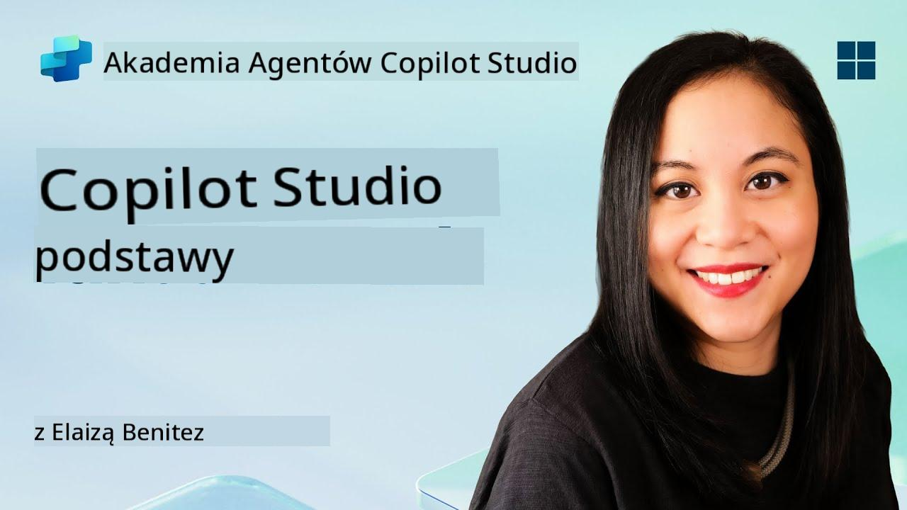
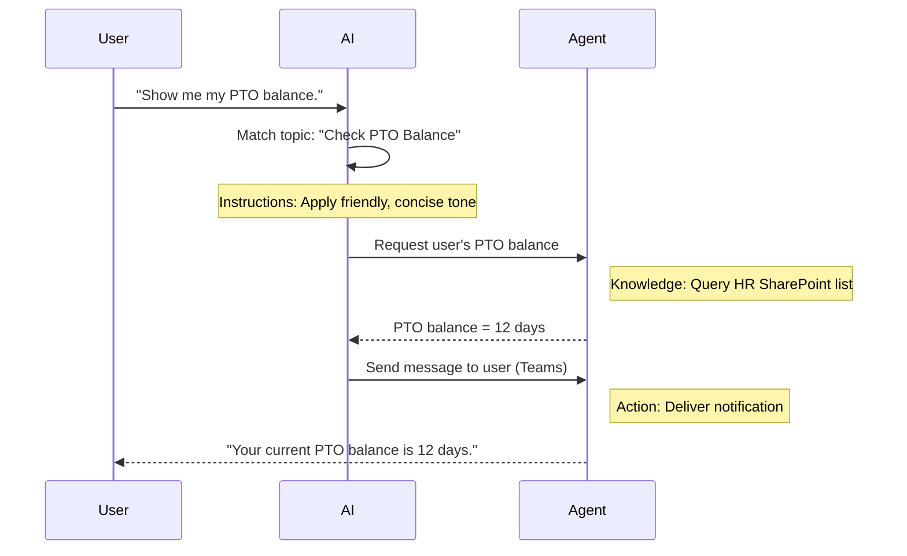

<!--
CO_OP_TRANSLATOR_METADATA:
{
  "original_hash": "90a3c5122f5687bbc8cc819990f175d4",
  "translation_date": "2025-10-22T00:53:53+00:00",
  "source_file": "docs/recruit/02-copilot-studio-fundamentals/README.md",
  "language_code": "pl"
}
-->
# 🚨 Misja 02: Podstawy Copilot Studio

## 🕵️‍♂️ KODOWA NAZWA: `OPERACJA PROTOKÓŁ RDZENIA`

> **⏱️ Czas trwania operacji:** `~30 minut – tylko informacje, bez pracy w terenie`  

🎥 **Obejrzyj Przewodnik**

[](https://www.youtube.com/watch?v=x4OCwDRGeLE "Obejrzyj przewodnik na YouTube")

## 🎯 Cel Misji

Witaj, Rekrucie. Ta misja wyposaży Cię w podstawowe informacje, które pozwolą zrozumieć, jak działa Copilot Studio i jak budować inteligentne agenty, które przynoszą realne korzyści biznesowe.

Zanim zbudujesz swojego pierwszego agenta, musisz zrozumieć cztery kluczowe komponenty, które składają się na każdego niestandardowego agenta AI: Wiedza, Narzędzia, Tematy i Instrukcje. Dowiesz się również, jak te elementy współpracują w orchestratorze Copilot Studio.

## 🔎 Cele

W tej misji dowiesz się:

- **Czym jest Copilot Studio**
- **Kiedy i dlaczego warto używać agentów**
- **Poznasz cztery podstawowe elementy agentów**
      - **Wiedza**
      - **Narzędzia**
      - **Tematy**
      - **Instrukcje**
- **Zrozumiesz, jak te komponenty współpracują** w celu stworzenia inteligentnego, zautomatyzowanego agenta

---

## Czym są agenci w Copilot Studio?

**Agent** to wyspecjalizowany asystent AI, który projektujesz, aby obsługiwał konkretne zadania lub zapytania. W przeciwieństwie do uniwersalnego chatbota, Twój agent:

- **Zna dane specyficzne dla firmy** (polityki, dokumenty, bazy danych)  
- **Wykonuje zadania w rzeczywistym świecie** (wysyłanie wiadomości, tworzenie wydarzeń w kalendarzu, aktualizowanie rekordów)  
- **Utrzymuje kontekst rozmowy**, dzięki czemu może nawiązywać do wcześniejszych pytań  

Ponieważ Copilot Studio jest narzędziem low-code, możesz przeciągać i upuszczać gotowe komponenty—bez potrzeby posiadania zaawansowanych umiejętności programistycznych. Gdy Twój agent zostanie zbudowany, użytkownicy mogą go wywoływać w Teams, Slacku lub nawet na niestandardowej stronie internetowej, aby uzyskać odpowiedzi lub automatycznie uruchamiać procesy.

---

## Kiedy i dlaczego warto używać Copilot Studio

Podczas gdy Microsoft 365 Copilot oferuje ogólną pomoc AI w aplikacjach Office, warto stworzyć niestandardowego agenta, gdy:

### Potrzebujesz wiedzy specyficznej dla danej dziedziny

- Standardowy Copilot może nie znać wewnętrznych procedur lub danych Twojej firmy. Agent może przeszukiwać Twoje witryny SharePoint, bazy danych lub niestandardowe źródła, aby dostarczać dokładne i aktualne odpowiedzi.  

### Chcesz zautomatyzować wieloetapowe procesy

- Na przykład: "Gdy ktoś zgłosi wydatek, wyślij go do zatwierdzenia, zaktualizuj tracker finansowy i powiadom menedżera." Niestandardowy agent może obsłużyć każdy krok, uruchamiany jednym poleceniem lub zdarzeniem.  

### Potrzebujesz kontekstowego doświadczenia w narzędziu  

- Wyobraź sobie agenta do wdrażania nowych pracowników w Teams, który prowadzi pracowników HR przez wszystkie polityki, wysyła niezbędne formularze i planuje spotkania orientacyjne—bezpośrednio w istniejącej platformie współpracy.  

---

## Cztery podstawowe elementy agenta

Każdy agent Copilot Studio składa się z czterech kluczowych komponentów:

1. **Wiedza**  
1. **Narzędzia (Akcje)**  
1. **Tematy**  
1. **Instrukcje**

Poniżej zdefiniujemy każdy z tych elementów i pokażemy, jak współpracują, aby stworzyć skutecznego agenta.

### 1. Wiedza

**Wiedza** to dane i kontekst, które Twój agent wykorzystuje, aby udzielać dokładnych odpowiedzi. Składa się z dwóch części:

#### Niestandardowe Instrukcje i Kontekst

- Piszesz krótki opis celu i tonu agenta. Na przykład:  

    ```text
    You are an IT support agent. You help employees troubleshoot common software issues, provide troubleshooting steps, and escalate urgent tickets.
    ```

- Podczas rozmowy agent pamięta poprzednie wypowiedzi, dzięki czemu może nawiązywać do tego, co już zostało omówione (na przykład, jeśli użytkownik najpierw powie: "Moja drukarka nie działa", a później zapyta: "Czy sprawdziłeś poziom tuszu?", agent pamięta kontekst dotyczący drukarki).

#### Źródła Wiedzy (Dane Podstawowe)

- Łączysz swojego agenta z wieloma źródłami danych—bibliotekami SharePoint, witrynami dokumentacyjnymi, wiki lub innymi bazami danych.  
- Gdy użytkownik zadaje pytanie, agent pobiera odpowiednie fragmenty z tych źródeł, dzięki czemu odpowiedzi są **oparte** na rzeczywistych politykach, instrukcjach produktów lub innych informacjach firmowych.  
- Możesz nawet wymusić, aby agent odpowiadał wyłącznie na podstawie tych źródeł, zapobiegając zgadywaniu lub "halucynowaniu" odpowiedzi.

!!! example
    Agent "Asystent Polityki" może być połączony z witryną HR w SharePoint. Jeśli użytkownik zapyta: "Jaki jest nasz wskaźnik naliczania urlopu?", agent pobierze dokładny tekst z dokumentu polityki HR, zamiast polegać na ogólnej odpowiedzi AI.

---

### 2. Narzędzia (Akcje)

**Narzędzia (Akcje)** definiują, co agent może zrobić poza rozmową. Każda akcja to zadanie, które agent wykonuje programowo, takie jak:

- Wysyłanie e-maila lub wiadomości w Teams  
- Tworzenie lub aktualizowanie wydarzenia w kalendarzu  
- Dodawanie lub edytowanie rekordu w bazie danych (np. lista SharePoint lub tabela Dataverse)  
- Wywoływanie przepływu Power Automate lub REST API  

#### Jak działają Akcje

- **Definiowanie Wejść i Wyjść**  
      - Na przykład, akcja "Wyślij e-mail" może wymagać:  
        - `RecipientEmailAddress`  
        - `SubjectLine`  
        - `EmailBody`  

- **Łączenie Akcji w Procesy**  
      - Często realizacja żądania użytkownika wymaga wielu kroków.  
      - Możesz sekwencjonować akcje tak, aby:  
             1. Agent pobrał dane z listy SharePoint.  
             2. Wygenerował podsumowanie za pomocą LLM.  
             3. Wysłał wiadomość w Teams z tym podsumowaniem.  

- **Łączenie z Systemami Zewnętrznymi**  
      - Jeśli musisz zaktualizować CRM lub wywołać wewnętrzne API, stwórz niestandardową akcję, aby to obsłużyć.  
      - Copilot Studio może integrować się z platformą Power Platform lub dowolnym punktem końcowym opartym na HTTP.

!!! example "Agent "Pomocnik Wydatków" mógłby:"  
    1. Nasłuchiwać żądania "Zgłoś Wydatek".  
    2. Pobierać szczegóły wydatku użytkownika z formularza.  
    3. Używać akcji "Dodaj do Listy SharePoint", aby przechowywać dane.  
    4. Wywoływać akcję "Wyślij E-mail", aby powiadomić osobę zatwierdzającą.  

---

### 3. Tematy

**Tematy** definiują wyzwalacze konwersacyjne lub punkty wejścia dla Twojego agenta. Każdy temat odpowiada funkcjonalności lub kategorii pytań.

#### Wyzwalacze Konwersacyjne  

- Temat może być "Zgłoś Problem IT", "Sprawdź Saldo Urlopu" lub "Utwórz Raport Sprzedaży".  
- W tle Copilot Studio używa **generatywnej orkiestracji**: zamiast polegać na dokładnych słowach kluczowych, AI interpretuje intencje użytkownika i wybiera odpowiedni temat na podstawie krótkiego opisu, który podasz.  

#### Opisy Tematów  

- W każdym temacie piszesz jasny, zwięzły opis tego, co temat obejmuje.

!!! example "Przykład opisu tematu"
    Ten temat pomaga użytkownikom zgłaszać zgłoszenia wsparcia IT, zbierając szczegóły problemu, priorytet i dane kontaktowe.

- AI używa tego opisu, aby zdecydować, kiedy aktywować ten temat, nawet jeśli sposób wyrażenia użytkownika nie pasuje dokładnie.

#### Mapowanie Tematów na Akcje  

- Każdy temat jest połączony z jedną lub kilkoma akcjami lub krokami pobierania danych.  
- Gdy AI wybiera temat, prowadzi rozmowę przez sekwencję, którą zdefiniowałeś (zadaje pytania uzupełniające, wywołuje akcje, zwraca wyniki).

!!! example
    Jeśli użytkownik powie: "Potrzebuję pomocy z konfiguracją nowego laptopa", AI może dopasować tę intencję do tematu "Zgłoś Problem IT". Agent następnie pyta o model laptopa, dane użytkownika i automatycznie zgłasza zgłoszenie do systemu pomocy technicznej.

---

### 4. Instrukcje

**Instrukcje** (czasami nazywane "Podpowiedziami" lub "Wiadomościami Systemowymi") kierują tonem, stylem i granicami LLM. Kształtują sposób, w jaki agent reaguje w każdej sytuacji.

#### Rola i Persona  

- Mówisz AI, kim jest (np. "Jesteś agentem obsługi klienta dla Contoso Retail").  
- To ustala ton—przyjazny, zwięzły, formalny lub swobodny—w zależności od Twojego przypadku użycia.

#### Wytyczne dotyczące odpowiedzi  

- Określ zasady, których agent musi przestrzegać, takie jak:  
      - "Zawsze podsumowuj informacje o polityce w punktach."  
      - "Jeśli nie znasz odpowiedzi, powiedz: ‘Przepraszam, nie mam takich informacji.’"  
      - "Nigdy nie udostępniaj poufnych danych poza kontekstem."

#### Zasady Pamięci i Kontekstu

- Możesz instruować agenta, ile tur rozmowy ma pamiętać.  
- Na przykład: "Zapamiętaj szczegóły z żądań tego użytkownika przez maksymalnie trzy pytania uzupełniające."

!!! example "W agencie "Doradca ds. Korzyści" możesz uwzględnić:"
    "Zawsze odwołuj się do najnowszego podręcznika HR podczas odpowiadania na pytania. Jeśli zapytano o terminy zapisów, podaj konkretne daty z polityki. Ogranicz odpowiedzi do 150 słów."

---

## Jak cztery podstawowe elementy współpracują ze sobą

Gdy połączysz **Wiedzę**, **Narzędzia**, **Tematy** i **Instrukcje**, orchestrator AI Copilot Studio tworzy agenta, który:

1. **Nasłuchuje odpowiedniego Tematu** (kierując się opisami tematów).  
1. **Stosuje Instrukcje**, aby ustalić ton, zdecydować, kiedy zadać pytania uzupełniające i egzekwować zasady.  
1. **Wykorzystuje Źródła Wiedzy**, aby oprzeć odpowiedzi na danych Twojej organizacji.  
1. **Wywołuje Narzędzia (Akcje)** w razie potrzeby, aby wykonać zadania—wysyłanie wiadomości, aktualizowanie rekordów lub wywoływanie API.  

W tle orchestrator używa podejścia **generatywnego planowania**: decyduje, jakie kroki podjąć, w jakiej kolejności, aby spełnić żądanie użytkownika. Jeśli akcja się nie powiedzie (na przykład, nie można wysłać e-maila), agent stosuje Twoje wytyczne dotyczące obsługi wyjątków (zadaje pytanie uzupełniające lub zgłasza błąd). Ponieważ LLM dostosowuje się do kontekstu rozmowy, agent może utrzymać pamięć przez wiele tur i uwzględniać nowe informacje w miarę rozwoju rozmowy.

**Przykład przepływu wizualnego:**  
<!--
1. **Użytkownik:** "Pokaż mi moje saldo urlopu."
1. **AI (Tematy):** Dopasowuje temat "Sprawdź Saldo Urlopu".  
1. **AI (Instrukcje):** Używa przyjaznego, zwięzłego tonu.  
1. **Agent (Wiedza):** Przeszukuje listę HR w SharePoint, aby znaleźć saldo użytkownika.  
1. **Agent (Akcje):** Pobiera wartość i wysyła wiadomość w Teams:  
   > "Twoje obecne saldo urlopu wynosi 12 dni."  
-->



---

## 🎉 Misja Zakończona

Pomyślnie ukończyłeś wprowadzenie do podstaw. Poznałeś cztery kluczowe elementy każdego agenta w Copilot Studio:

1. **Wiedza** – Skąd agent czerpie informacje i jak utrzymuje pamięć rozmowy.  
1. **Narzędzia** – Zadania, które agent może wykonywać, aby automatyzować procesy.  
1. **Tematy** – Jak agent rozpoznaje intencje użytkownika i decyduje, który proces uruchomić.  
1. **Instrukcje** – Zasady, ton i granice, które kierują każdą odpowiedzią.

Dzięki tym komponentom możesz zbudować podstawowego agenta, który odpowiada na pytania i wykonuje proste procesy. W następnej lekcji przejdziemy przez szczegółowy samouczek, jak stworzyć agenta "Service Desk"—od podłączenia pierwszego źródła wiedzy po zdefiniowanie tematu i połączenie akcji.

Następny krok: Zbudujesz swojego [pierwszego deklaratywnego agenta dla M365 Copilot](../03-create-a-declarative-agent-for-M365Copilot/README.md).

<!-- markdownlint-disable-next-line MD033 -->


---

**Zastrzeżenie**:  
Ten dokument został przetłumaczony za pomocą usługi tłumaczenia AI [Co-op Translator](https://github.com/Azure/co-op-translator). Chociaż staramy się zapewnić dokładność, prosimy pamiętać, że automatyczne tłumaczenia mogą zawierać błędy lub nieścisłości. Oryginalny dokument w jego rodzimym języku powinien być uznawany za autorytatywne źródło. W przypadku informacji krytycznych zaleca się skorzystanie z profesjonalnego tłumaczenia przez człowieka. Nie ponosimy odpowiedzialności za jakiekolwiek nieporozumienia lub błędne interpretacje wynikające z użycia tego tłumaczenia.