<!--
CO_OP_TRANSLATOR_METADATA:
{
  "original_hash": "0c51aabca81d6256990caf4c015e6195",
  "translation_date": "2025-10-22T00:35:18+00:00",
  "source_file": "docs/recruit/04-creating-a-solution/README.md",
  "language_code": "pl"
}
-->
# 🚨 Misja 04: Tworzenie rozwiązania dla Twojego agenta

## 🕵️‍♂️ KOD OPERACJI: `OPERACJA CTRL-ALT-PAKOWANIE`

> **⏱️ Czas trwania operacji:** `~45 minut`

🎥 **Obejrzyj przewodnik**

[](https://www.youtube.com/watch?v=1iATbkgfcpU "Obejrzyj przewodnik na YouTube")

## 🎯 Opis misji

Twórca Agentów, witamy w kolejnej taktycznej operacji. W tej misji nauczysz się, jak złożyć Rozwiązanie – oficjalny pojazd wdrożeniowy dla Twojego agenta IT Helpdesk stworzonego w Microsoft Copilot Studio. Pomyśl o tym jak o cyfrowej teczce, która przechowuje Twojego agenta i jego artefakty.

Każdy agent potrzebuje dobrze zorganizowanego domu. To właśnie zapewnia rozwiązanie Power Platform – porządek, przenośność i gotowość do produkcji.

Czas się spakować.

## 🔎 Cele

W tej misji nauczysz się:

1. Zrozumienia, czym są rozwiązania Power Platform i ich roli w rozwoju agentów
1. Poznania korzyści z używania rozwiązań do organizowania i wdrażania agentów
1. Eksploracji wydawców rozwiązań i ich znaczenia w zarządzaniu komponentami
1. Zrozumienia cyklu życia rozwiązań Power Platform od rozwoju do produkcji
1. Tworzenia własnego wydawcy rozwiązań i niestandardowego rozwiązania dla Twojego agenta IT Helpdesk

## 🕵🏻‍♀️ Rozwiązanie? Co to takiego?

W Microsoft Power Platform rozwiązania są jak kontenery lub pakiety, które przechowują wszystkie części Twoich aplikacji lub agentów – mogą to być tabele, formularze, przepływy i niestandardowa logika. Rozwiązania są kluczowe dla Zarządzania Cyklami Życia Aplikacji (ALM), umożliwiają zarządzanie aplikacją i agentami od pomysłu, przez rozwój, testowanie, wdrożenie, aż po aktualizacje.

W Copilot Studio każdy agent, którego tworzysz, jest przechowywany w rozwiązaniu Power Platform. Domyślnie agenci są tworzeni w rozwiązaniu Domyślnym, chyba że utworzysz nowe niestandardowe rozwiązanie, w którym stworzysz swojego agenta. Tego właśnie nauczymy się 🤓 w tej lekcji i w laboratorium praktycznym.

Rozwiązania tradycyjnie były tworzone w **portalu twórcy Power Apps** – interfejsie internetowym, w którym można budować i dostosowywać aplikacje, Dataverse, przepływy, eksplorować komponenty AI i więcej.

   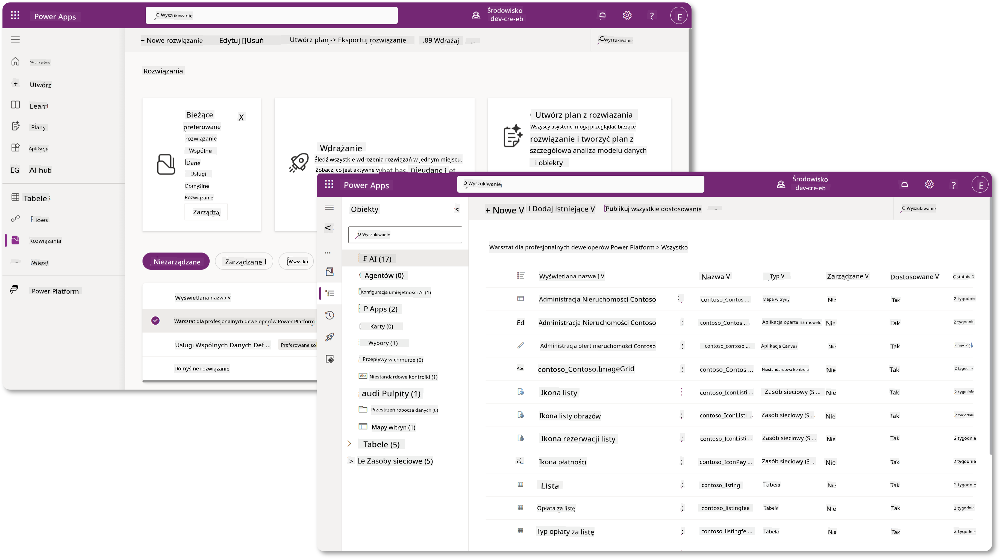

W Copilot Studio istnieje teraz **Eksplorator Rozwiązań**, w którym można zarządzać rozwiązaniami bezpośrednio. Nie trzeba już przełączać się do portalu twórcy Power Apps, aby zarządzać rozwiązaniami – można to zrobić bezpośrednio w Copilot Studio 🪄

Oznacza to, że możesz wykonywać typowe zadania związane z rozwiązaniami:

- **Tworzenie rozwiązania** – niestandardowe rozwiązania umożliwiają eksportowanie i importowanie agentów między środowiskami.
- **Ustawienie preferowanego rozwiązania** – wybór rozwiązania, w którym domyślnie będą tworzeni agenci, aplikacje itp.
- **Dodawanie lub usuwanie komponentów** – Twój agent może odwoływać się do innych komponentów, takich jak zmienne środowiskowe czy przepływy w chmurze. Dlatego te komponenty muszą być uwzględnione w rozwiązaniu.
- **Eksportowanie rozwiązań** – przenoszenie rozwiązań do innego docelowego środowiska.
- **Importowanie rozwiązań** – importowanie rozwiązań stworzonych gdzie indziej, w tym aktualizowanie lub uaktualnianie rozwiązań.
- **Tworzenie i zarządzanie potokami rozwiązań** – automatyzacja wdrażania rozwiązań między środowiskami.
- **Integracja z Git** – umożliwia programistom połączenie rozwiązań z repozytoriami Git w celu kontroli wersji, współpracy i ALM. Przeznaczone do użytku wyłącznie w środowiskach deweloperskich.

   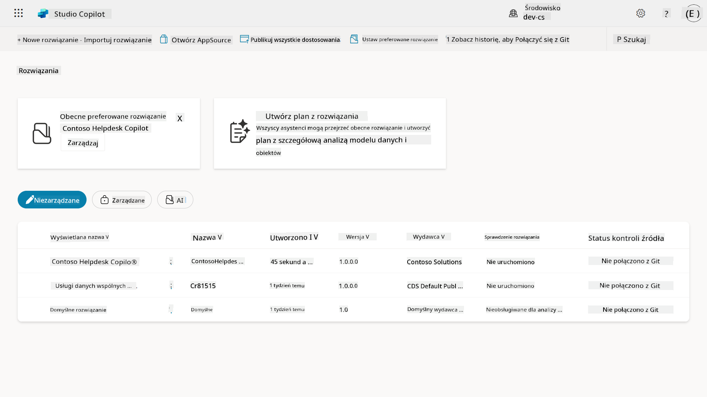

Istnieją dwa rodzaje rozwiązań:

- **Rozwiązania niezarządzane** – używane podczas rozwoju. Można je swobodnie edytować i dostosowywać według potrzeb.
- **Rozwiązania zarządzane** – używane, gdy aplikacja jest gotowa do wdrożenia w testach lub produkcji. Są zablokowane, aby zapobiec przypadkowym zmianom.

## 🤔 Dlaczego _powinienem_ używać Rozwiązania dla mojego agenta?

Pomyśl o Rozwiązaniach jak o _skrzynce narzędziowej_. Kiedy musisz naprawić lub zbudować coś (agenta) w innym miejscu (środowisku), zbierasz wszystkie potrzebne narzędzia (komponenty) i wkładasz je do skrzynki narzędziowej (Rozwiązania). Następnie możesz przenieść tę skrzynkę do nowego miejsca (środowiska) i użyć narzędzi (komponentów), aby dokończyć pracę lub dodać nowe narzędzia (komponenty), aby dostosować swojego agenta lub projekt, który budujesz.

!!! quote "Elaiza, Twoja przyjazna ambasadorka chmury, wtrąca się tutaj 🙋🏻‍♀️, aby podzielić się kilkoma słowami:"
    Mamy takie powiedzenie w Nowej Zelandii: "Bądź porządnym Kiwi!", co jest wezwaniem do działania dla Nowozelandczyków 🥝, aby wziąć odpowiedzialność za swoje otoczenie, właściwie pozbywając się śmieci i utrzymując czystość w przestrzeniach publicznych. Możemy użyć tego samego kontekstu dla agentów, utrzymując wszystko związane z Twoim agentem w porządku i przenośności, co pomoże Ci utrzymać czyste środowisko.

Dobrą praktyką jest tworzenie agenta w dedykowanym rozwiązaniu w Twoim źródłowym środowisku (deweloperskim). Oto dlaczego rozwiązania są wartościowe:

🧩 **Zorganizowany rozwój**

- Trzymasz swojego agenta z dala od rozwiązania Domyślnego, które zawiera wszystko w środowisku. Wszystkie komponenty Twojego agenta są w jednym miejscu 🎯

- Wszystko, czego potrzebujesz dla swojego agenta, znajduje się w rozwiązaniu, co ułatwia eksportowanie i importowanie do docelowego środowiska 👉🏻 to zdrowy nawyk w ALM.

🧩 **Bezpieczne wdrożenie**

- Możesz eksportować swoją aplikację lub agenta jako rozwiązanie zarządzane i wdrożyć je w innych docelowych środowiskach (takich jak testy czy produkcja) bez ryzyka przypadkowych edycji.

🧩 **Kontrola wersji**

- Możesz tworzyć poprawki (naprawy docelowe), aktualizacje (bardziej kompleksowe zmiany) lub uaktualnienia (zastępowanie rozwiązania – zazwyczaj większe zmiany i wprowadzanie nowych funkcji).

- Pomaga w kontrolowanym wprowadzaniu zmian.

🧩 **Zarządzanie zależnościami**

- Rozwiązania śledzą, które części zależą od innych. Zapobiega to łamaniu funkcjonalności podczas wprowadzania zmian.

🧩 **Współpraca zespołowa**

- Programiści i twórcy mogą współpracować, używając rozwiązań niezarządzanych w rozwoju, a następnie przekazać rozwiązanie zarządzane do wdrożenia.

## 🪪 Zrozumienie wydawców rozwiązań

Wydawca Rozwiązania w Power Platform to coś w rodzaju etykiety lub marki, która identyfikuje, kto stworzył lub jest właścicielem rozwiązania. To mały, ale ważny element zarządzania aplikacjami, agentami i dostosowaniami przepływów, szczególnie podczas pracy w zespołach lub między środowiskami.

Tworząc rozwiązanie, musisz wybrać wydawcę. Wydawca definiuje:

- Prefiks, który jest dodawany do wszystkich niestandardowych komponentów (np. tabel, pól i przepływów).

- Nazwę i dane kontaktowe organizacji lub osoby, która jest właścicielem rozwiązania.

### 🤔 Dlaczego to ważne?

1. **Łatwa identyfikacja** – prefiks (np. `new_` lub `abc_`) pomaga szybko zidentyfikować, które komponenty należą do którego rozwiązania lub zespołu.

1. **Unikanie konfliktów** – jeśli dwa zespoły stworzą kolumnę o nazwie status, ich prefiksy (`teamA_status`, `teamB_status`) zapobiegają kolizjom nazw.

1. **Wsparcie dla ALM** – podczas przenoszenia rozwiązań między środowiskami (Dev → Test → Prod), wydawca pomaga śledzić własność i utrzymać spójność.

### ✨ Przykład

Załóżmy, że tworzysz wydawcę o nazwie Contoso Solutions z prefiksem `cts_`.

Jeśli dodasz niestandardową kolumnę o nazwie _Priorytet_, zostanie ona zapisana jako `cts_Priority` w rozwiązaniu.

Każdy, kto natknie się na tę kolumnę na poziomie rozwiązania, niezależnie od środowiska, w którym się znajduje, łatwo zidentyfikuje ją jako kolumnę powiązaną z Contoso Solutions.

## 🧭 Cykl życia rozwiązania Power Platform

Teraz, gdy rozumiesz cel Rozwiązania, przejdźmy do nauki o jego cyklu życia.

**1. Tworzenie rozwiązania w środowisku deweloperskim** – zacznij od stworzenia nowego rozwiązania w swoim środowisku deweloperskim.

**2. Dodawanie komponentów** – dodaj aplikacje, przepływy, tabele i inne elementy do swojego rozwiązania.

**3. Eksport jako rozwiązanie zarządzane** – przygotuj swoje rozwiązanie do wdrożenia, eksportując je jako rozwiązanie zarządzane.

**4. Import do środowiska testowego** – przetestuj swoje rozwiązanie w oddzielnym środowisku testowym, aby upewnić się, że wszystko działa zgodnie z oczekiwaniami.

**5. Import do środowiska produkcyjnego** – wdroż przetestowane rozwiązanie do swojego aktywnego środowiska produkcyjnego.

**6. Zastosowanie poprawek, aktualizacji lub uaktualnień** – wprowadź ulepszenia lub poprawki za pomocą poprawek, aktualizacji lub uaktualnień. 🔁 Powtórz cykl!

### ✨ Przykład

Wyobraź sobie, że budujesz agenta IT Helpdesk, który pomaga pracownikom w problemach takich jak problemy z urządzeniami, rozwiązywanie problemów z siecią, konfiguracja drukarki i inne.

- Zaczynasz w środowisku deweloperskim, używając rozwiązania niezarządzanego.

- Gdy jest gotowe, eksportujesz je jako rozwiązanie zarządzane i importujesz do docelowego środowiska, takiego jak Test Systemowy lub Test Akceptacji Użytkownika (UAT).

- Po testach przenosisz je do środowiska produkcyjnego – wszystko bez dotykania oryginalnej wersji deweloperskiej.

## 🧪 Laboratorium 04: Tworzenie nowego rozwiązania

Teraz nauczymy się:

- [4.1 Jak stworzyć wydawcę rozwiązania](../../../../../docs/recruit/04-creating-a-solution)
- [4.2 Jak stworzyć rozwiązanie](../../../../../docs/recruit/04-creating-a-solution)

Pozostaniemy przy wcześniejszym przykładzie, gdzie stworzymy rozwiązanie w dedykowanym środowisku Copilot Studio, aby zbudować naszego agenta IT Helpdesk.

Zaczynajmy!

### Wymagania wstępne

#### Rola bezpieczeństwa

W Copilot Studio to, co _możesz zrobić_ w eksploratorze rozwiązań, zależy od Twojej roli bezpieczeństwa użytkownika.
Jeśli nie masz uprawnień do zarządzania rozwiązaniami w centrum administracyjnym Power Apps, nie będziesz w stanie wykonywać tych zadań w Copilot Studio.

Aby wszystko działało sprawnie, upewnij się, że masz odpowiednie role bezpieczeństwa i uprawnienia. Jeśli nie zarządzasz środowiskami w swojej organizacji, poproś swojego administratora IT (lub odpowiedni zespół), który zarządza Twoim tenantem/środowiskami.

Poniżej znajdują się role bezpieczeństwa, które umożliwiają użytkownikom tworzenie rozwiązania w ich środowisku.

| Rola bezpieczeństwa    | Opis |
| ---------- | ---------- |
| Twórca środowiska | Zapewnia niezbędne uprawnienia do tworzenia, dostosowywania i zarządzania zasobami w określonym środowisku, w tym rozwiązaniami  |
| Dostosowujący system | Szersze uprawnienia niż Twórca środowiska, w tym możliwość dostosowywania środowiska i zarządzania rolami bezpieczeństwa |
| Administrator systemu   | Najwyższy poziom uprawnień, może zarządzać wszystkimi aspektami środowiska, w tym tworzeniem i przypisywaniem ról bezpieczeństwa     |

#### Środowisko deweloperskie

Upewnij się, że przełączasz się na swoje dedykowane środowisko deweloperskie, odwołując się do [Lekcji 00 - Konfiguracja kursu - Krok 3: Tworzenie nowego dewelopera](../00-course-setup/README.md#step-3-create-new-developer-environment).

1. W prawym górnym rogu wybierz ikonę **Koła zębatego** i przełącz się z domyślnego środowiska na swoje środowisko, na przykład **Środowisko Adele Vance**.

    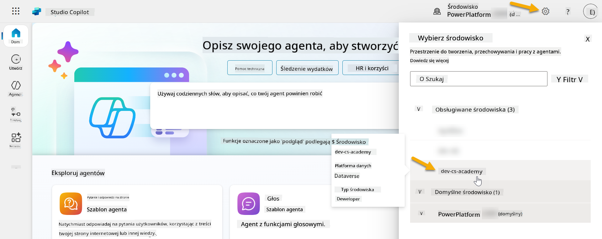

### 4.1 Tworzenie wydawcy rozwiązania

1. Korzystając z tego samego środowiska Copilot Studio, które było używane w poprzedniej lekcji, wybierz ikonę **trzech kropek (. . .)** w menu po lewej stronie w Copilot Studio. Wybierz **Rozwiązania** w sekcji **Eksploruj**.

    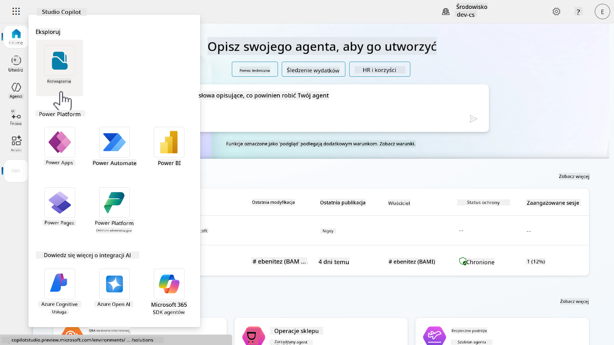

1. Załaduje się **Eksplorator Rozwiązań** w Copilot Studio. Wybierz **+ Nowe rozwiązanie**

    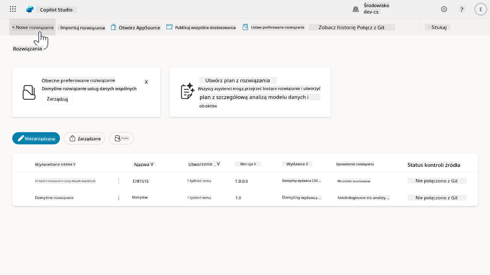

1. Pojawi się panel **Nowe rozwiązanie**, w którym możemy zdefiniować szczegóły naszego rozwiązania. Najpierw musimy stworzyć nowego wydawcę. Wybierz **+ Nowy wydawca**.

    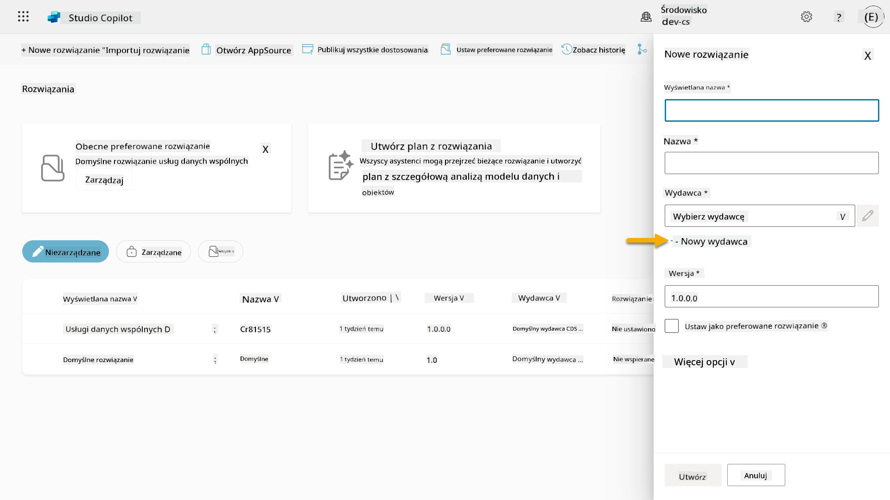  

1. Pojawi się zakładka **Właściwości** panelu **Nowy wydawca** z polami wymaganymi i niewymaganymi do wypełnienia w zakładce **Właściwości**. Tutaj możemy określić szczegóły wydawcy, który będzie używany jako etykieta lub marka identyfikująca, kto stworzył lub jest właścicielem rozwiązania.

    | Właściwość    | Opis | Wymagane |
    | ---------- | ---------- | :----------: |
    | Nazwa wyświetlana | Nazwa wyświetlana dla wydawcy | Tak   |
    | Nazwa  | Unikalna nazwa i nazwa schematu dla wydawcy  | Tak    |
    | Opis   | Określa cel rozwiązania    | Nie     |
    | Prefiks    | Prefiks wydawcy, który zostanie zastosowany do nowo tworzonych komponentów   | Tak      |
    | Prefiks wartości wyboru   | Generuje numer na podstawie prefiksu wydawcy. Ten numer jest używany podczas dodawania opcji do wyborów i zapewnia wskaźnik, które rozwiązanie zostało użyte do dodania opcji.   | Tak      |

    Skopiuj i wklej następujące jako **Nazwa wyświetlana**,

    ```text
    Contoso Solutions
    ```

    Skopiuj i wklej następujące jako **Nazwa**,

    ```text
    ContosoSolutions
    ```

    Skopiuj i wklej następujące jako **Opis**,

    ```text
    Copilot Studio Agent Academy
    ```

    Skopiuj i wklej następujące dla **Prefiks**,

    ```text
    cts
    ```

    Domyślnie **Prefiks wartości wyboru** wyświetli wartość całkowitą. Zaktualizuj tę wartość całkowitą do najbliższego tysiąca. Na przykład, na moim zrzucie ekranu poniżej, początkowo było `77074`. Zaktualizuj to z `77074` na `77000`.


1. Panel **Nowy wydawca** zostanie zamknięty, a Ty wrócisz do panelu **Nowe rozwiązanie** z wybranym nowo utworzonym wydawcą.

    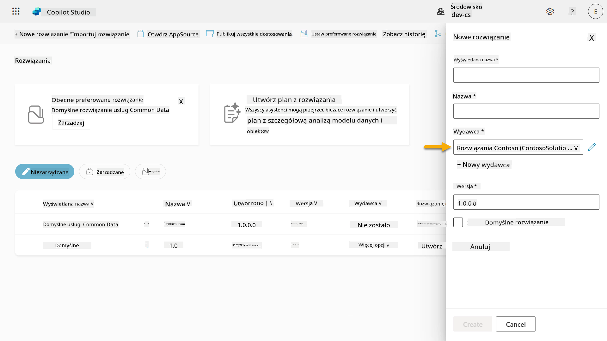  

Brawo, właśnie stworzyłeś Wydawcę Rozwiązania! 🙌🏻 Teraz nauczymy się, jak stworzyć nowe niestandardowe rozwiązanie.

### 4.2 Tworzenie nowego rozwiązania

1. Teraz, gdy stworzyliśmy nasze rozwiązania, możemy wypełnić resztę formularza w panelu **Nowe rozwiązanie**.

    Skopiuj i wklej poniższe jako **Wyświetlana nazwa**,

    ```text
    Contoso Helpdesk Agent
    ```

    Skopiuj i wklej poniższe jako **Nazwa**,

    ```text
    ContosoHelpdeskAgent
    ```

    Ponieważ tworzymy nowe rozwiązanie, domyślny [**Numer wersji**](https://learn.microsoft.com/power-apps/maker/data-platform/update-solutions#understanding-version-numbers-for-updates/?WT.mc_id=power-172615-ebenitez) będzie `1.0.0.0`.

    Zaznacz pole wyboru **Ustaw jako preferowane rozwiązanie**.

    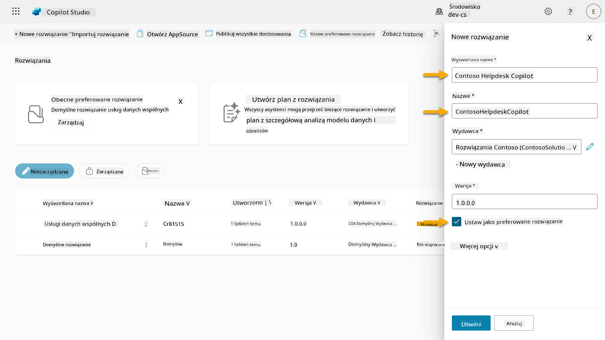  

1. Rozwiń **Więcej opcji**, aby zobaczyć dodatkowe szczegóły, które można podać w rozwiązaniu.

    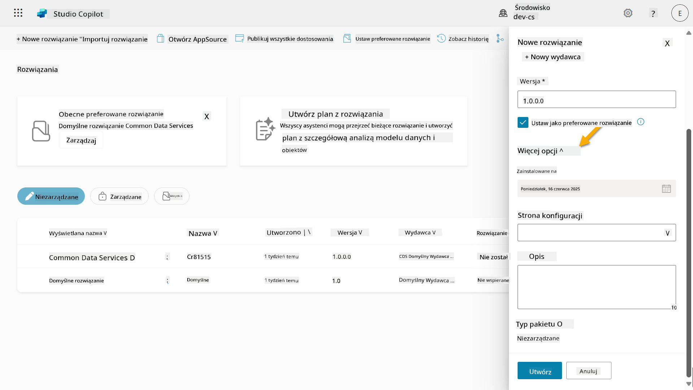

1. Zobaczysz następujące informacje:

    - **Zainstalowano** - data instalacji rozwiązania.

    - **Strona konfiguracji** - deweloperzy ustawiają zasób HTML, który pomaga użytkownikom w interakcji z ich aplikacją, agentem lub narzędziem, gdzie pojawi się jako strona internetowa w sekcji Informacje z instrukcjami lub przyciskami. Jest to głównie używane przez firmy lub deweloperów, którzy tworzą i udostępniają rozwiązania innym.

    - **Opis** - opisuje rozwiązanie lub ogólny opis strony konfiguracji.

    Zostawimy te pola puste w ramach tego laboratorium.

    Wybierz **Utwórz**.

    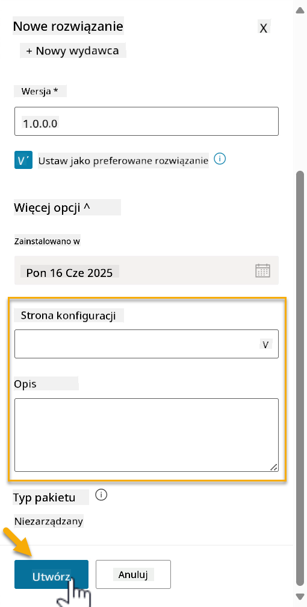

1. Rozwiązanie dla Contoso Helpdesk Agent zostało teraz utworzone. Nie będzie miało żadnych komponentów, dopóki nie stworzymy agenta w Copilot Studio.

    Wybierz ikonę **strzałki wstecz**, aby wrócić do Eksploratora Rozwiązań.

    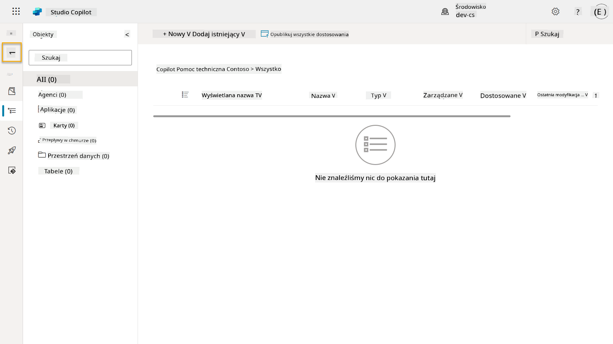

1. Zauważ, że Contoso Helpdesk Agent jest teraz wyświetlany jako **Obecne preferowane rozwiązanie**, ponieważ wcześniej zaznaczyliśmy pole wyboru **Ustaw jako preferowane rozwiązanie**.

    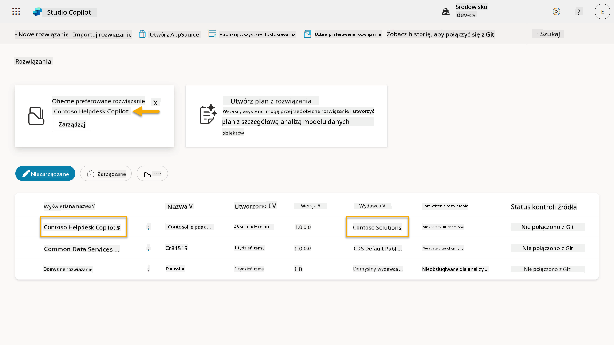

## ✅ Misja zakończona

Gratulacje! 👏🏻 Stworzyłeś Wydawcę i użyłeś go w nowo utworzonym Rozwiązaniu, aby zbudować swojego agenta!

Brawo, Twórca Agentów. Schludny cyfrowy ślad to pierwszy krok w kierunku operacyjności na dużą skalę. Teraz masz narzędzia i podejście do zrównoważonego, gotowego na przedsiębiorstwo rozwoju agentów.

To koniec **Laboratorium 04 - Tworzenie Rozwiązania**, wybierz poniższy link, aby przejść do następnej lekcji. Twoje rozwiązanie stworzone w tym laboratorium będzie używane w laboratorium następnej lekcji.

⏭️ [Przejdź do lekcji **Szybki start z gotowymi agentami**](../05-using-prebuilt-agents/README.md)

## 📚 Zasoby taktyczne

🔗 [Tworzenie rozwiązania](https://learn.microsoft.com/power-apps/maker/data-platform/create-solution/?WT.mc_id=power-172615-ebenitez)

🔗 [Tworzenie i zarządzanie rozwiązaniami w Copilot Studio](https://learn.microsoft.com/microsoft-copilot-studio/authoring-solutions-overview/?WT.mc_id=power-172615-ebenitez)

🔗 [Udostępnianie agentów innym użytkownikom](https://learn.microsoft.com/microsoft-copilot-studio/admin-share-bots/?WT.mc_id=power-172615-ebenitez)

🔗 [Podsumowanie zasobów dostępnych dla zdefiniowanych ról bezpieczeństwa](https://learn.microsoft.com/power-platform/admin/database-security#summary-of-resources-available-to-predefined-security-roles/?WT.mc_id=power-172615-ebenitez)

🔗 [Aktualizacja lub uaktualnienie rozwiązania](https://learn.microsoft.com/power-apps/maker/data-platform/update-solutions/?WT.mc_id=power-172615-ebenitez)

🔗 [Przegląd potoków w Power Platform](https://learn.microsoft.com/power-platform/alm/pipelines/?WT.mc_id=power-172615-ebenitez)

🔗 [Przegląd integracji Git w Power Platform](https://learn.microsoft.com/power-platform/alm/git-integration/overview/?WT.mc_id=power-172615-ebenitez)


---

**Zastrzeżenie**:  
Ten dokument został przetłumaczony za pomocą usługi tłumaczenia AI [Co-op Translator](https://github.com/Azure/co-op-translator). Chociaż staramy się zapewnić dokładność, prosimy pamiętać, że automatyczne tłumaczenia mogą zawierać błędy lub nieścisłości. Oryginalny dokument w jego rodzimym języku powinien być uznawany za autorytatywne źródło. W przypadku informacji krytycznych zaleca się skorzystanie z profesjonalnego tłumaczenia przez człowieka. Nie ponosimy odpowiedzialności za jakiekolwiek nieporozumienia lub błędne interpretacje wynikające z użycia tego tłumaczenia.