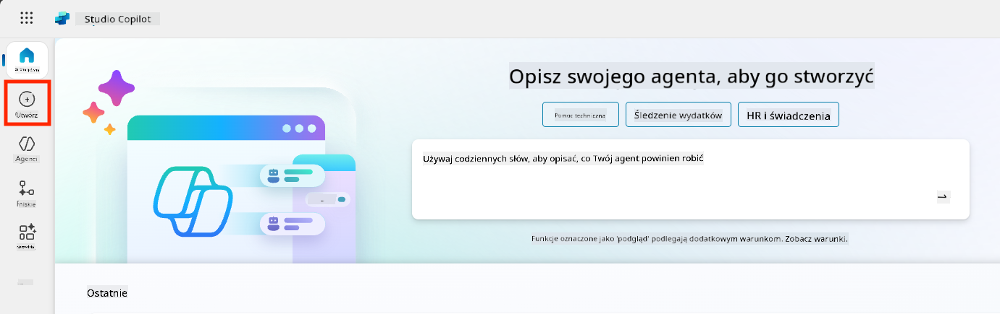
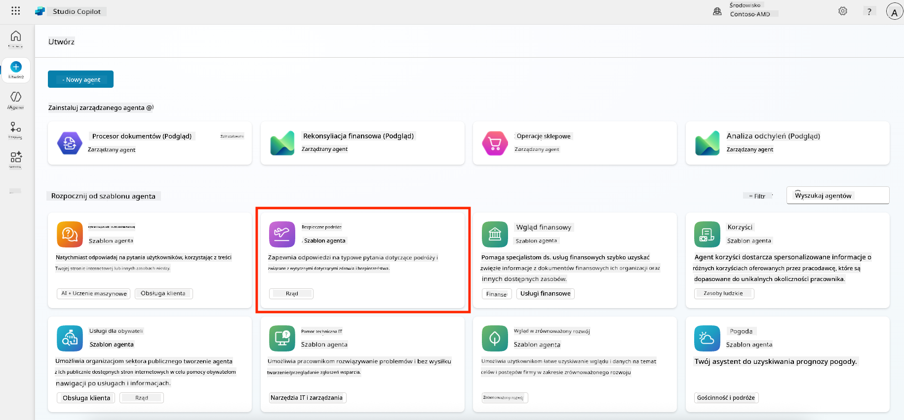
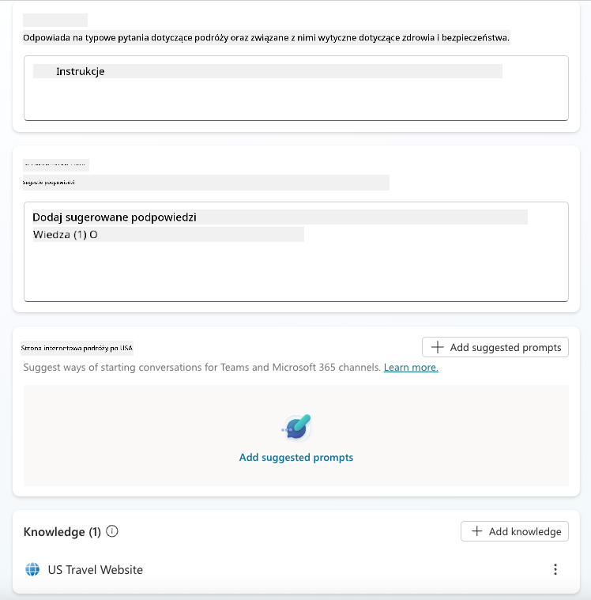
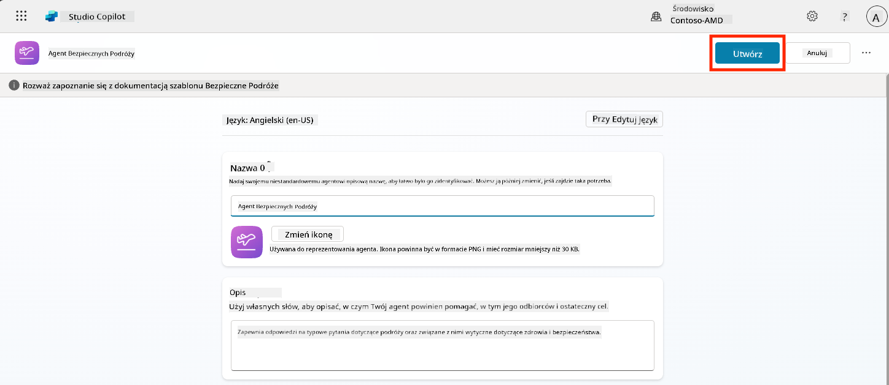
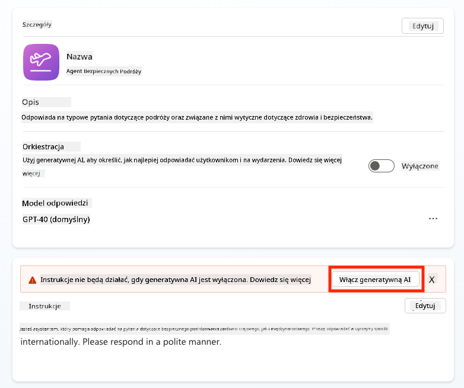
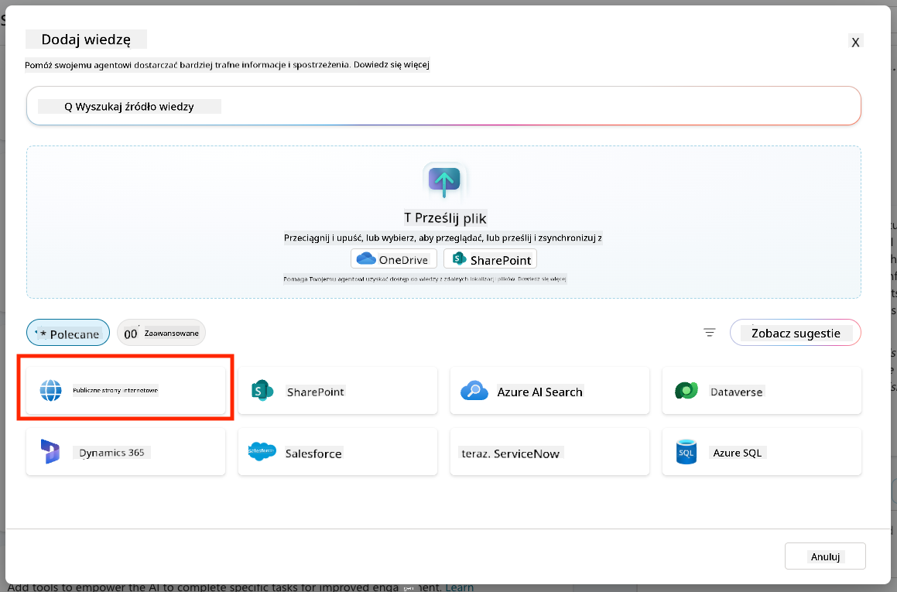
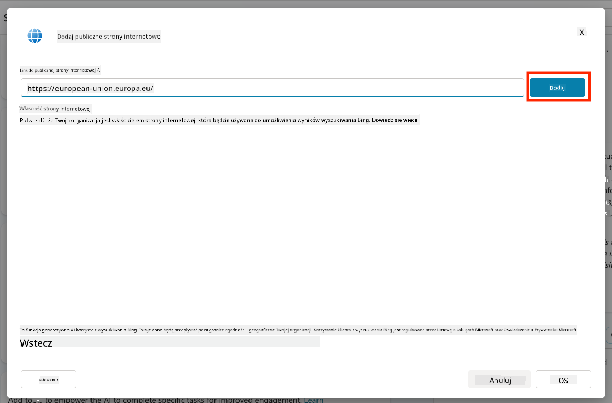
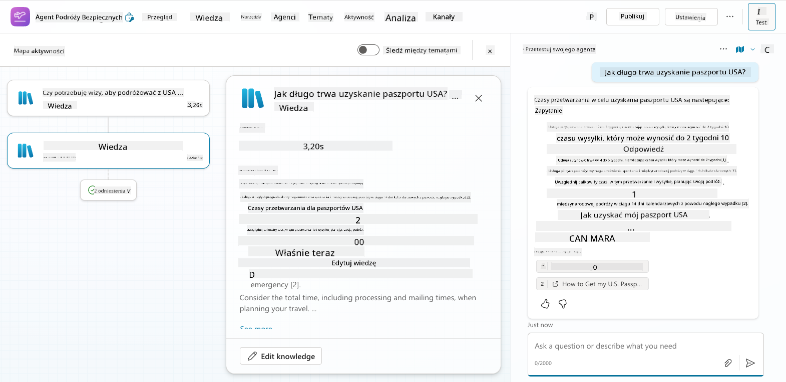
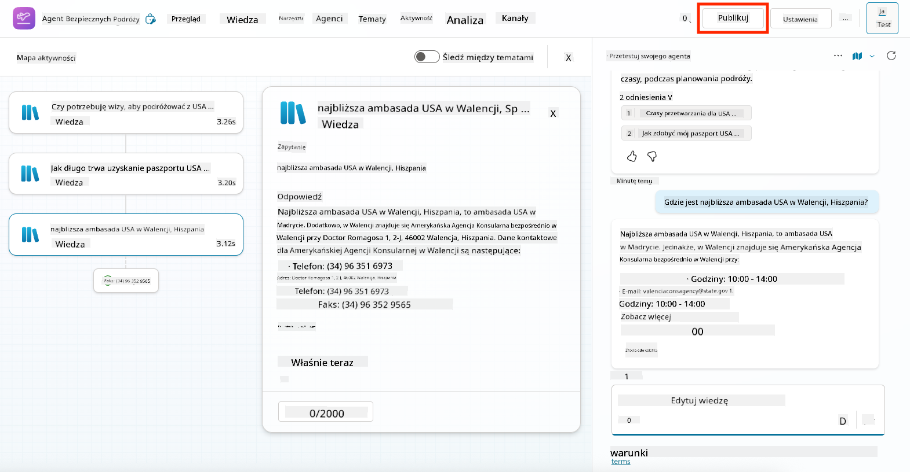
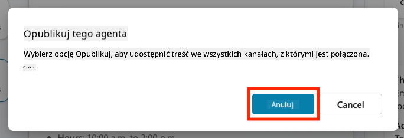

<!--
CO_OP_TRANSLATOR_METADATA:
{
  "original_hash": "8e2c64a7f9303e58329ec8bb468c80b4",
  "translation_date": "2025-10-22T00:46:19+00:00",
  "source_file": "docs/recruit/05-using-prebuilt-agents/README.md",
  "language_code": "pl"
}
-->
# 🧰 Misja 05: Korzystanie z gotowego agenta  

## 🕵️‍♂️ KOD OPERACJI: `BEZPIECZNE PODRÓŻE`

> **⏱️ Czas trwania operacji:** `~30 minut`

🎥 **Obejrzyj instruktaż**

## 🎯 Cel misji

Witamy w kolejnej misji w Akademii Agentów Copilot Studio. Za chwilę poznasz świat **gotowych agentów**—inteligentnych, ukierunkowanych agentów stworzonych przez Microsoft, aby przyspieszyć wdrożenie i skrócić czas osiągnięcia wartości.

Zamiast budować od podstaw, gotowe agenty (zwane również **szablonami agentów**) dają Ci przewagę, oferując gotowe scenariusze, które możesz dostosować i wdrożyć w kilka minut.

W tej misji wdrożysz agenta **Bezpieczne Podróże**—agenta, który pomaga użytkownikom przygotować się do podróży służbowych, zrozumieć polityki firmy i usprawnić planowanie.

---

## 🧭 Cele

Twoje zadania w tej misji to:

1. Zrozumieć, czym są gotowe agenty i dlaczego są ważne  
1. Wdrożyć szablon agenta **Bezpieczne Podróże**  
1. Dostosować odpowiedzi i treści agenta  
1. Przetestować i opublikować agenta  

---

## 🧠 Czym są gotowe agenty?

Gotowe agenty to gotowe do użycia agenty AI stworzone przez Microsoft, które:

- Rozwiązują typowe potrzeby biznesowe (np. podróże, HR, wsparcie IT)
- Zawierają w pełni funkcjonujące tematy, frazy wyzwalające, instrukcje i przykładową wiedzę.
- Mogą być edytowane, rozszerzane i osadzone w Twoich danych

Te agenty są idealne, aby szybko rozpocząć pracę lub nauczyć się, jak są skonstruowane.

---

## 🧪 Laboratorium 05: Szybki start z gotowym agentem

Teraz nauczymy się, jak wybrać gotowego agenta i dostosować go.

- [5.1 Uruchom Copilot Studio](../../../../../docs/recruit/05-using-prebuilt-agents)
- [5.2 Wybierz szablon agenta Bezpieczne Podróże](../../../../../docs/recruit/05-using-prebuilt-agents)
- [5.3 Dostosuj agenta](../../../../../docs/recruit/05-using-prebuilt-agents)
- [5.4 Przetestuj i opublikuj](../../../../../docs/recruit/05-using-prebuilt-agents)

Pozostaniemy przy wcześniejszym przykładzie, gdzie stworzymy rozwiązanie w dedykowanym środowisku Copilot Studio, aby zbudować naszego agenta wsparcia IT.

Zaczynajmy!

### 5.1 Uruchom Copilot Studio

1. Przejdź do [https://copilotstudio.microsoft.com](https://copilotstudio.microsoft.com)

1. Zaloguj się za pomocą konta Microsoft 365 dla pracy lub szkoły

!!! warning
    Musisz być w dzierżawie, gdzie Copilot Studio jest włączone. Jeśli nie widzisz Copilot Studio, wróć do [Misji 00](../00-course-setup/README.md), aby ukończyć konfigurację.

### 5.2 Wybierz szablon agenta Bezpieczne Podróże

1. Na stronie głównej Copilot Studio kliknij **+ Utwórz**
    

1. Przewiń w dół do sekcji **Rozpocznij od szablonu agenta**

1. Znajdź i wybierz **Bezpieczne Podróże**

    

1. Zauważ, że szablon jest wstępnie załadowany opisem, instrukcjami i wiedzą.

    

1. Kliknij **Utwórz**

    

To utworzy nowego agenta w Twoim środowisku na podstawie konfiguracji Bezpieczne Podróże.

### 5.3 Dostosuj agenta

Teraz, gdy agent został utworzony, dostosujmy go do Twojej organizacji:

1. Wybierz **Włącz generatywne AI**, aby aktywować funkcję generatywnego AI, dzięki której będzie korzystać z instrukcji zawartych w szablonie.

    

1. Teraz wyposażymy agenta w dodatkowe źródło wiedzy, aby mógł odpowiadać na pytania dotyczące podróży po Europie. Aby to zrobić, przewiń w dół do sekcji **wiedza** i wybierz **Dodaj wiedzę**

    

1. Wybierz **Publiczne strony internetowe**

    

1. W polu tekstowym wklej **<https://european-union.europa.eu/>** i wybierz **Dodaj**

    

1. Wybierz **Dodaj do agenta**

    

### 5.4 Przetestuj i opublikuj

1. Kliknij **Testuj** w prawym górnym rogu, aby uruchomić okno testowe  

1. Wypróbuj frazy takie jak:

    - `“Czy potrzebuję wizy, aby podróżować z USA do Amsterdamu?”`
    - `“Jak długo trwa uzyskanie paszportu USA?”`
    - `“Gdzie znajduje się najbliższa ambasada USA w Walencji, Hiszpania?”`

1. Potwierdź, że agent odpowiada dokładnie i pomocnie, oraz obserwuj Mapę Aktywności, aby zobaczyć, skąd pobiera informacje.

    

1. Gdy będziesz gotowy, kliknij **Opublikuj**

    

1. W oknie dialogowym ponownie wybierz **Opublikuj**
    

1. Opcjonalnie dodaj agenta do Microsoft Teams za pomocą wbudowanej funkcji **Kanały**.

!!! note "🧳 Dodatkowy cel"
    Spróbuj osadzić agenta Bezpieczne Podróże na stronie SharePoint lub w pliku FAQ, aby uczynić go bardziej odpowiednim dla polityk podróży Twojej firmy.

## ✅ Misja zakończona

Udało Ci się:

- Wdrożyć gotowego agenta Microsoft  
- Dostosować agenta  
- Przetestować i opublikować własną wersję szablonu agenta **Bezpieczne Podróże**

⏭️ [Przejdź do lekcji **Tworzenie własnego agenta od podstaw**](../06-create-agent-from-conversation/README.md).

<!-- markdownlint-disable-next-line MD033 -->

---

**Zastrzeżenie**:  
Ten dokument został przetłumaczony za pomocą usługi tłumaczenia AI [Co-op Translator](https://github.com/Azure/co-op-translator). Chociaż staramy się zapewnić dokładność, prosimy pamiętać, że automatyczne tłumaczenia mogą zawierać błędy lub nieścisłości. Oryginalny dokument w jego rodzimym języku powinien być uznawany za autorytatywne źródło. W przypadku informacji krytycznych zaleca się skorzystanie z profesjonalnego tłumaczenia przez człowieka. Nie ponosimy odpowiedzialności za jakiekolwiek nieporozumienia lub błędne interpretacje wynikające z użycia tego tłumaczenia.