<!--
CO_OP_TRANSLATOR_METADATA:
{
  "original_hash": "c04b3587170139bc23e3b5cfc24c89ac",
  "translation_date": "2025-10-22T00:58:18+00:00",
  "source_file": "docs/recruit/07-add-new-topic-with-trigger/README.md",
  "language_code": "pl"
}
-->
# 🚨 Misja 07: Dodaj nowy temat z wyzwalaczem i węzłami

## 🕵️‍♂️ KOD OPERACJI: `OPERACJA TRZYMAJ SIĘ TEMATU`

> **⏱️ Okno czasowe operacji:** `~60 minut`

🎥 **Obejrzyj przewodnik**

[](https://www.youtube.com/watch?v=7iPAZaA8nJs "Obejrzyj przewodnik na YouTube")

## 🎯 Opis misji

Stworzyłeś agenta. Słucha, uczy się i odpowiada na pytania - ale teraz czas na bardziej taktyczne podejście. W tej misji zagłębisz się w szczegóły i nauczysz swojego agenta, jak precyzyjnie reagować na konkretne zapytania.

Dzięki Tematom i Wyzwalaczom Twój agent może:

- Rozpoznawać intencje

- Kierować rozmowy za pomocą logiki

- Zbierać i przechowywać zmienne

- Wyzwalać przepływy i podejmować działania

Nie budujesz tylko dialogu, ale podłączasz jego korę decyzyjną. Witaj w Neuralnym Nexusie.

## 🔎 Cele

W tej misji nauczysz się:

1. Zrozumienia, czym są tematy i jaką rolę odgrywają w tworzeniu strukturalnych rozmów dla Twojego agenta
1. Poznania anatomii tematów, w tym fraz wyzwalających i węzłów rozmowy
1. Eksploracji różnych typów węzłów rozmowy i wykorzystania Power Fx do dynamicznej logiki
1. Tworzenia niestandardowych tematów od podstaw, aby obsługiwać konkretne zapytania i zadania użytkowników
1. Budowania funkcjonalnego tematu, który łączy się z danymi SharePoint za pomocą konektorów i narzędzi

## 🤔 Co to jest temat?

Temat to strukturalna rozmowa, która pomaga Twojemu agentowi odpowiadać na konkretne pytania lub zadania użytkownika. Pomyśl o temacie jako o mini-rozmowie lub zadaniu, które Twój agent może obsłużyć. Każdy temat jest zaprojektowany tak, aby odpowiadać na konkretne pytanie lub prośbę użytkownika.

### 🌌 Cel tematu

Istnieją trzy główne cele tematów, w zależności od potrzeb użytkowników:

**Informacyjny** - odpowiada na pytania takie jak:

- `Co to jest …?`
- `Kiedy będzie …?`
- `Dlaczego …?`
- `Czy możesz mi powiedzieć …?`

**Wykonanie zadania** - pomaga użytkownikom _zrobić_ coś:

- `"Chcę …"`
- `"Jak mogę …?"`
- `"Potrzebuję …?"`

**Rozwiązywanie problemów** - rozwiązuje problemy:

- `Coś nie działa …`
- `Mam komunikat o błędzie …`
- `Widzę coś nieoczekiwanego …?`

Możesz również tworzyć tematy dla niejasnych pytań, takich jak `Potrzebuję pomocy`, które proszą użytkowników o więcej szczegółów przed kontynuowaniem.

## 🐦 Dlaczego tematy są przydatne?

Tematy pomagają:

- Organizować wiedzę Twojego agenta.

- Sprawiać, że rozmowy są naturalne.

- Skutecznie rozwiązywać problemy użytkowników.

## 🪺 Rodzaje tematów

1. **Tematy systemowe** - są wbudowane i obsługują typowe zdarzenia, takie jak:
    - Rozpoczęcie rozmowy
    - Zakończenie rozmowy
    - Obsługa błędów
    - Prośba o zalogowanie się użytkownika
    - Przekierowanie do agenta ludzkiego

1. **Tematy niestandardowe** - tworzysz je, aby obsługiwać konkretne zadania lub pytania, takie jak:
    - Wniosek o urlop pracowniczy
    - Prośba o nowy lub zastępczy sprzęt

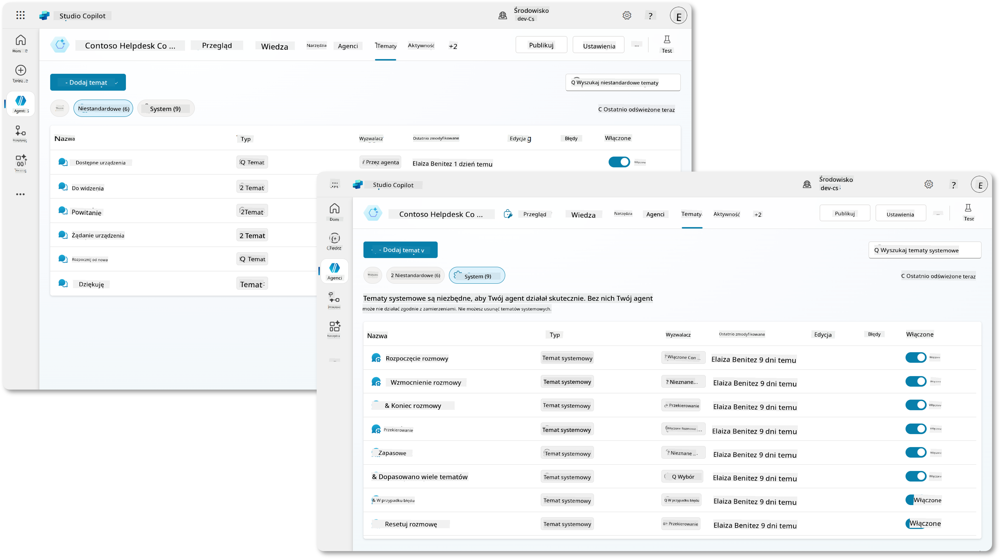

## 🧬 Anatomia tematu

Każdy temat zazwyczaj zawiera następujące elementy.

### 🗣️ Frazy wyzwalające

To słowa lub zdania, które użytkownicy mogą wypowiedzieć, aby rozpocząć temat.

**Przykłady:**

Dla tematu wniosku o urlop, frazy wyzwalające mogą być:

- `Chcę wziąć urlop`
- `Wniosek o urlop`
- `Złożenie wniosku o czas wolny`
- `Jak mogę złożyć wniosek o urlop?`

Dla tematu prośby o sprzęt, frazy wyzwalające mogą być:

- `Potrzebuję nowego urządzenia`
- `Czy mogę poprosić o urządzenie?`
- `Czy możesz mi pomóc z prośbą o urządzenie`

### 💬 Węzły rozmowy

Temat składa się z węzłów, które są krokami, jakie agent wykonuje po wyzwoleniu tematu. Łączysz te kroki, aby zbudować przepływ rozmowy, który Twój agent podąża podczas interakcji z użytkownikami.

Pomyśl o nich jako o instrukcjach lub działaniach, takich jak:

- Zadawanie pytań użytkownikowi
- Wysyłanie wiadomości
- Wywoływanie zewnętrznej usługi, takiej jak system zarządzania urlopami
- Ustawianie lub sprawdzanie zmiennych
- Używanie warunków do rozgałęziania rozmowy
- Przekierowanie do innego tematu

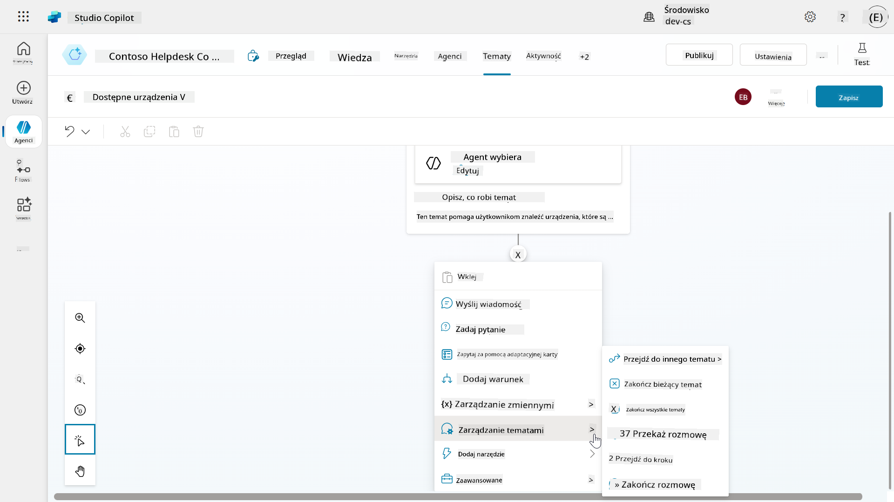

Oto główne typy węzłów, które możesz dodać do swojego agenta:

#### Wyślij wiadomość

- **Cel** - wysyła wiadomość do użytkownika.
- **Przykład** - `Dziękuję za Twoją prośbę! Pomogę Ci z tym.`

Ten węzeł pozwala Twojemu agentowi wysyłać wiadomości do użytkowników, które mogą być prostym tekstem lub bogatą treścią, taką jak obrazy, filmy, karty, szybkie odpowiedzi i karty adaptacyjne.

Możesz personalizować wiadomości za pomocą zmiennych, dodawać wiele wariantów wiadomości dla różnorodności, a nawet dostosowywać wyjście głosowe dla kanałów obsługujących głos.

!!! tip
    Pomyśl o tym jako o bloku "powiedz coś", który pomaga Twojemu agentowi komunikować się jasno i interaktywnie z użytkownikami.

#### Zadaj pytanie

- **Cel** - zadaje użytkownikowi pytanie i czeka na odpowiedź.
- **Przykład** - `Jakie są Twoje daty urlopu?`

Ten węzeł służy do zadawania użytkownikom konkretnych pytań podczas rozmowy i przechowywania ich odpowiedzi w zmiennych do późniejszego wykorzystania.

Możesz dostosować typ pytania, np. wprowadzenie tekstu lub użycie encji dla zdefiniowanej listy wartości, z której użytkownik wybiera, oraz określić, jak agent powinien się zachować, jeśli użytkownik poda nieprawidłową odpowiedź lub pominie pytanie.

Obsługuje również bogatą treść, taką jak obrazy i szybkie odpowiedzi, oraz pozwala na precyzyjne dostosowanie walidacji, ponownego pytania i ustawień przerwania, aby rozmowa przebiegała płynnie.

!!! tip
    Pomyśl o tym jako o bloku "zapytaj i słuchaj", który pomaga Twojemu agentowi w interakcji z użytkownikami w zdefiniowany sposób.

#### Zapytaj za pomocą karty adaptacyjnej

- **Cel** - wysyła bogatą, interaktywną kartę za pomocą JSON.
- **Przykład** - karta wyświetlająca wybór daty w kalendarzu dla użytkownika.

Ten węzeł pokazuje bogate, interaktywne karty, które użytkownicy mogą wypełnić i przesłać, takie jak formularze z polami tekstowymi, przyciskami i obrazami. Zbiera dane od użytkownika i przechowuje je w zmiennych, które Twój agent może wykorzystać później w rozmowie.

!!! tip
    Pomyśl o tym jako o "kreatorze formularzy", który sprawia, że Twój agent jest bardziej angażujący i zdolny do zbierania szczegółowych informacji od użytkowników.

#### Dodaj warunek

- **Cel** - dodaje logikę do rozmowy. Sprawdza coś i decyduje, co zrobić dalej.
- **Przykład** - jeśli użytkownik mówi `Tak`, przejdź do następnego kroku. Jeśli `Nie`, zakończ rozmowę.

Ten węzeł tworzy punkty decyzyjne w przepływie rozmowy agenta, sprawdzając, czy zmienna spełnia określone kryteria. Na podstawie tego, czy warunek jest prawdziwy czy fałszywy, agent podąża różnymi ścieżkami.

!!! tip
    Pomyśl o tym jako o bloku "jeśli-inaczej", który pomaga Twojemu agentowi podejmować decyzje w zależności od danych użytkownika lub przechowywanych zmiennych.

#### Zarządzanie zmiennymi

- **Cel** - przechowuje lub usuwa informacje (zwane zmiennymi) podczas rozmowy.
- **Przykład** - zapisuje datę wybraną przez użytkownika w węźle Zadaj pytanie, który wyświetla kartę adaptacyjną.

Ten węzeł pozwala przechowywać i zarządzać informacjami podczas rozmowy, mogą to być imię użytkownika, odpowiedź lub preferencje. Możesz używać różnych typów zmiennych, takich jak tekst, liczby czy daty, a ich zakres może obejmować jeden temat, być wspólny dla wszystkich tematów (globalny) lub pochodzić z systemu lub środowiska.

!!! tip
    Pomyśl o tym jako o "pudełku pamięci", które pomaga Twojemu agentowi zapamiętywać informacje i wykorzystywać je w dalszej rozmowie z użytkownikiem.

#### Zarządzanie tematem

- **Cel** - przenosi rozmowę do innego tematu lub kroku w ramach tematu, przekazuje rozmowę lub kończy temat lub rozmowę.
- **Przykład** - przekierowanie do tematu "Polityka urlopowa".

Ten węzeł pozwala Twojemu agentowi przechodzić z jednego tematu do drugiego bez restartowania rozmowy, kończyć temat, przekazywać lub kończyć rozmowę, albo przechodzić do innego kroku w ramach tego samego tematu. Pomaga prowadzić użytkowników przez różne części przepływu rozmowy, płynnie przechodząc między tematami, a Ty możesz przekazywać zmienne między nimi, aby zachować kontekst.

!!! tip
    Pomyśl o tym jako o bloku "przejdź do innej sekcji/kroku", który pomaga Twojemu agentowi być elastycznym w rozmowie z użytkownikami.

#### Dodaj narzędzie

- **Cel** - łączy się z narzędziami, takimi jak konektory, przepływy agenta, podpowiedzi, wyszukiwanie niestandardowe, zapytania wyszukiwania, umiejętności, protokół kontekstu modelu.
- **Przykład** - Przepływ agenta wykonany po przesłaniu przez użytkownika wniosku o urlop.

Ten węzeł daje Twojemu agentowi możliwość interakcji z zewnętrznymi systemami lub wykonywania konkretnych zadań, takich jak wysyłanie e-maili, sprawdzanie pogody czy dostęp do baz danych. Możesz dodawać narzędzia za pomocą wbudowanych konektorów, niestandardowych API, przepływów agenta, podpowiedzi lub łączyć się z serwerami Model Context Protocol (MCP), a nawet automatyzować interfejs graficzny dla aplikacji desktopowych za pomocą narzędzia do obsługi komputera.

!!! tip
    Pomyśl o narzędziach jako o "blokach akcji", które dają Twojemu agentowi supermoce do wykonywania zadań wykraczających poza _rozmowę_, takich jak wywoływanie API, uruchamianie procesów czy automatyczne zbieranie danych od użytkownika.

#### Węzeł odpowiedzi generatywnych

- **Cel** - wykorzystuje duży model językowy do generowania naturalnych, ludzkich odpowiedzi na podstawie pytania użytkownika i wszelkich podłączonych danych.
- **Przykład** - używa podłączonego źródła wiedzy zawierającego informacje o uprawnieniach do urlopu, aby odpowiedzieć na pytania użytkownika dotyczące wniosków urlopowych.

Ten węzeł umożliwia Twojemu agentowi odpowiadanie na pytania użytkowników, korzystając z informacji z różnych źródeł wiedzy, takich jak strony internetowe, dokumenty, SharePoint czy dane niestandardowe. Może być używany jako rozwiązanie awaryjne, gdy nie znaleziono pasującego tematu, lub w ramach tematu, aby dostarczyć bardziej szczegółowe, dynamiczne odpowiedzi na podstawie określonych źródeł, które skonfigurowałeś dla swojego agenta.

!!! tip
    Pomyśl o tym jako o "inteligentnym bloku odpowiedzi", który pomaga Twojemu agentowi udzielać pomocnych, dokładnych odpowiedzi, przeszukując zdefiniowane przez Ciebie zaufane treści.

#### Węzeł żądania HTTP

- **Cel** - łączy Twojego agenta z zewnętrznymi systemami, wysyłając wywołania API (na przykład `GET` lub `POST`) w celu pobrania lub zaktualizowania danych.
- **Przykład** - gdy użytkownik pyta o saldo dni urlopowych, agent wykonuje żądanie `GET` do systemu zarządzania urlopami, wyciąga `remainingLeaveDays` z odpowiedzi API i odpowiada użytkownikowi wartością.

Ten węzeł pozwala Twojemu agentowi łączyć się z zewnętrznymi systemami, wysyłając wywołania REST API, takie jak `GET` lub `POST`. Możesz dostosować żądanie za pomocą nagłówków, treści i nawet używać Power Fx do uwzględnienia dynamicznych danych, a następnie przechowywać odpowiedź w zmiennych do późniejszego wykorzystania w rozmowie.

!!! tip
    Pomyśl o tym jako o bloku "sięgnij i pobierz informacje", który pomaga Twojemu agentowi komunikować się z innymi usługami, na przykład pobierając dane użytkownika lub wysyłając dane do innego systemu.

#### Wyślij zdarzenie

- **Cel** - pozwala Twojemu agentowi wysyłać działania inne niż wiadomości, takie jak aktualizacje systemowe lub wyzwalacze narzędzi - do klienta lub kanału, pomagając w wykonywaniu zadań.
- **Przykład** - reakcja na dołączenie użytkownika do czatu poprzez wyświetlenie wiadomości powitalnej.

Ten węzeł pozwala Twojemu agentowi wysyłać działania inne niż wiadomości do zewnętrznych systemów lub kanałów, które mogą następnie zdecydować, jak odpowiedzieć. Nadajesz każdemu zdarzeniu nazwę i przypisujesz wartość, która może być prostą liczbą lub tekstem, zmienną lub formułą Power Fx, a następnie jest wysyłana jako obiekt JSON.

!!! tip
    Pomyśl o tym jako o bloku "cichy wyzwalacz", który pomaga Twojemu agentowi wykonywać zadania w tle lub komunikować się z zewnętrznymi narzędziami bez potrzeby interakcji użytkownika.

## 🏋🏻‍♀️ Wykorzystanie Power Fx w węzłach

W Copilot Studio, Power Fx to język programowania low-code używany do dodawania logiki i dynamicznego zachowania Twojemu agentowi. To ten sam język, który jest używany w Microsoft Power Apps, zaprojektowany tak, aby był prosty i podobny do Excela, co ułatwia jego użycie zarówno programistom, jak i osobom bez doświadczenia w kodowaniu.

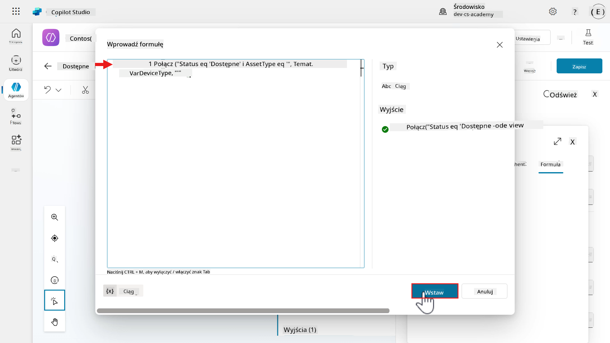

### Co Power Fx może zrobić w tematach

- Ustawiać i manipulować zmiennymi
      - Przykład: `Set(userName, "Adele Vance")`
- Tworzyć warunki
      - Przykład: `If(score > 80, "Pass", "Fail")`
- Formatować i przekształcać dane
      - Przykład: `Text(DateValue, "dd/mm/yyyy")`

### Dlaczego warto używać Power Fx?

- **Elastyczność:** możesz budować logikę bez pisania pełnych linii kodu.

- **Znajomość:** jeśli używałeś formuł Excela, jest to bardzo podobne.

- **Moc:** pozwala personalizować rozmowy, walidować dane wejściowe i kontrolować, jak Twój agent zachowuje się na podstawie danych użytkownika.

## 🏗
To pozwala opisać, czego chcesz, używając języka naturalnego, a Copilot zbuduje dla Ciebie rozmowę. To samo dotyczy edycji tematu – użyj języka naturalnego, a Copilot przejrzy i zmodyfikuje temat za Ciebie.

#### Co obsługuje Copilot

- Może tworzyć i edytować:
      - Węzły wiadomości
      - Węzły pytań
      - Węzły warunków
- Nie obsługuje zaawansowanych ustawień, takich jak sposób ponownego zapytania użytkownika, jeśli nie odpowie, czy zarządzanie przerwami podczas zadawania pytań. Możesz nadal ręcznie dostosować te ustawienia, jeśli zajdzie taka potrzeba.

#### Dlaczego to jest przydatne

- Przyspiesza rozwój dzięki wsparciu AI.
- Pozwala skupić się na logice i doświadczeniu użytkownika zamiast na powtarzalnym ustawianiu.
- Ułatwia iterację i poprawę przepływów rozmów przy minimalnym wysiłku.

#### ✨ Przykładowe podpowiedzi

- **Tworzenie tematu**
      - `Przyjmij imię, wiek i datę urodzenia użytkownika, a następnie powtórz jego odpowiedzi`
      - `Zbierz adres uliczny, stan i kod pocztowy użytkownika. Użytkownik powinien mieć możliwość ponownego próbowania każdego pytania do 4 razy`

- **Edycja tematu**
      - `Dodaj pytanie o datę urodzenia użytkownika`
      - `Podsumuj zebrane informacje w Adaptive Card.`

## 👩🏻‍🎨 OK, jak zaprojektować tematy dla mojego agenta?

### 🧙🏻‍♂️ Krok 1 - zrozum, czego potrzebują użytkownicy

Zacznij od zidentyfikowania najczęstszych pytań lub zadań, które użytkownicy będą zadawać Twojemu agentowi. Mogą to być:

- Pytania, które użytkownicy często zadają, takie jak `jakie mam prawo do dni chorobowych?`
- Typowe zadania, które użytkownicy chcą wykonać, takie jak przesłanie formularza
- Problemy, z którymi użytkownicy często się spotykają, takie jak problemy z logowaniem

### 📦 Krok 2 - Grupowanie scenariuszy

Zorganizuj potrzeby użytkowników w trzy kategorie na podstawie tego, czego nauczyliśmy się wcześniej – celu tematu:

- Informacyjne – użytkownik chce się czegoś dowiedzieć
- Wykonanie zadania – użytkownik chce coś zrobić
- Rozwiązywanie problemów – użytkownik potrzebuje pomocy w rozwiązaniu problemu

### 🗺️ Krok 3 - Zaplanuj rozmowę

Naszkicuj prosty przepływ rozmowy, jak agent powinien odpowiadać:

- Zacznij od powitania lub potwierdzenia
- Zadawaj pytania uzupełniające, aby uzyskać szczegóły
- Udzielaj odpowiedzi lub wykonuj działania

!!! tip
    Utrzymuj rozmowę krótką i skoncentrowaną. Pytaj tylko o to, co jest konieczne.

### 🔀 Krok 4 - Obsługa różnych typów rozmów

Projektuj zarówno dla:

- **Jednoetapowych** – jedno pytanie, jedna odpowiedź

- **Wielostopniowych** – rozmowa z pytaniami uzupełniającymi

Przykład:

- Użytkownik: `Chcę złożyć wniosek o urlop.`

- Agent: `Jasne! Od jakiej daty chciałbyś rozpocząć urlop?`

- Użytkownik: `15 lipca`

- Agent: `Rozumiem. A kiedy Twój urlop się zakończy?`

- Użytkownik: `22 lipca.`

- Agent: `Dzięki! Jaki jest powód Twojego urlopu?`

- Użytkownik: `Rodzinne wakacje.`

- Agent: `Dzięki za szczegóły. Złożyłem wniosek o urlop od 15 lipca do 22 lipca na rodzinne wakacje. Wkrótce otrzymasz potwierdzenie.`

### 🤖 Krok 5 - Wykorzystaj AI do nieoczekiwanych pytań

Nawet jeśli zaprojektowałeś temat dla wniosków urlopowych, użytkownicy mogą zadawać pytania, które nie są bezpośrednio uwzględnione. W takich sytuacjach przydają się funkcje AI, takie jak systemowy temat _Conversational boosting_.

Ten temat zawiera węzeł generatywnych odpowiedzi, który pozwala Twojemu agentowi natychmiast korzystać z podłączonych źródeł wiedzy. Wszystkie źródła wiedzy dodane na poziomie agenta są automatycznie uwzględniane w węźle generatywnych odpowiedzi w temacie _Conversational boosting_.

#### Przykład

- Użytkownik: `Czy mogę przenieść niewykorzystane dni urlopu na następny rok?`

To pytanie może nie być częścią Twojego zdefiniowanego przepływu tematu, zwłaszcza jeśli Twój temat obsługuje tylko składanie wniosków urlopowych.

#### Jak pomaga AI

Jeśli Twój agent jest połączony z dokumentami polityki HR Twojej firmy lub wewnętrzną stroną internetową, AI może:

- Wyszukać odpowiednią politykę urlopową
- Zrozumieć i podsumować zasady
- Agent odpowiada: `Zgodnie z polityką HR możesz przenieść niewykorzystane dni urlopu na następny rok kalendarzowy. Aby uzyskać więcej szczegółów, sprawdź sekcję polityki urlopowej na portalu HR.`

#### Dlaczego to jest przydatne

- Nie musisz ręcznie tworzyć tematu dla każdego pytania dotyczącego polityki.
- AI może pobierać dokładne odpowiedzi z zaufanych źródeł wiedzy.
- Poprawia doświadczenie użytkownika, sprawiając, że agent wydaje się bardziej inteligentny i responsywny.

### 🔬 Krok 6 - Testowanie tematu, przepływu rozmowy

Przed opublikowaniem tematu:

- Testuj, używając rzeczywistych pytań lub przykładowych danych wejściowych.
- Upewnij się, że brzmi naturalnie i jest pomocny.

!!! tip
    Wprowadzaj ulepszenia do swojego tematu w miarę testowania, na przykład dodając więcej węzłów lub usuwając węzły na rzecz przekierowania do innego tematu.

### ⚠️ Krok 7 - Unikaj powielania treści z witryny internetowej

Nie kopiuj tego, co już znajduje się na Twojej stronie internetowej.

- Skup się na tematach, o które użytkownicy często pytają.
- Dodawaj nowe tematy na podstawie historii czatów lub zgłoszeń do wsparcia.

### ✨ Przykład przepływu rozmowy

Poniżej znajduje się przykład tematu, który obsługuje wnioski urlopowe.

#### Krok 1: Fraza wyzwalająca

Użytkownik wpisuje,

`Chcę złożyć wniosek o urlop`

#### Krok 2: Agent pyta o szczegóły za pomocą Adaptive Card

Agent pyta,

`Jasne! Jakie daty chciałbyś wziąć wolne?`

Adaptive Card zawiera kontrolki wyboru daty rozpoczęcia i zakończenia.

#### Krok 3: Użytkownik podaje daty

Użytkownik wybiera datę rozpoczęcia jako 5 sierpnia 2025 i datę zakończenia jako 10 sierpnia 2025, a następnie przesyła kartę. Wartości dat są przechowywane w wynikach Adaptive Card jako zmienne.

#### Krok 4: Wykonanie przepływu w chmurze

Uruchomiono przepływ w chmurze Power Automate, który tworzy nowe zgłoszenie w systemie zarządzania urlopami i wysyła e-mail z powiadomieniem do menedżera o wniosku urlopowym.

#### Krok 5: Wysłanie wiadomości potwierdzającej do użytkownika

Agent odpowiada,

`Twój wniosek o urlop od 5 sierpnia do 10 sierpnia został złożony. Twój menedżer przejrzy go i wkrótce się z Tobą skontaktuje.`

## 🧪 Laboratorium 07 - Dodaj nowy temat z węzłami rozmowy

Teraz nauczymy się, jak dodać nowy temat z wyzwalaczem i narzędziami. W tym laboratorium omówimy tworzenie tematu od zera, abyś mógł zrozumieć, jak dostosować tematy do swoich potrzeb.

- [7.1 Dodaj nowy temat od zera](../../../../../docs/recruit/07-add-new-topic-with-trigger)
- [7.2 Zdefiniuj dane wejściowe i wyjściowe wyzwalacza](../../../../../docs/recruit/07-add-new-topic-with-trigger)
- [7.3 Dodaj narzędzie za pomocą konektora](../../../../../docs/recruit/07-add-new-topic-with-trigger)

### ✨ Przypadek użycia

**Jako** pracownik

**Chcę** wiedzieć, jakie urządzenia są dostępne

**Aby** mieć listę dostępnych urządzeń

Zaczynajmy!

### Wymagania wstępne

1. **Lista SharePoint**

    Będziemy korzystać z listy **Devices** w SharePoint z [Lekcji 00 - Konfiguracja kursu - Krok 3: Utwórz nową witrynę SharePoint](../00-course-setup/README.md#step-4-create-new-sharepoint-site).

    Jeśli nie skonfigurowałeś listy **Devices** w SharePoint, wróć do [Lekcji 00 - Konfiguracja kursu - Krok 3: Utwórz nową witrynę SharePoint](../00-course-setup/README.md#step-4-create-new-sharepoint-site).

1. **Agent Pomocy Technicznej Contoso**

    Skorzystamy z tego samego agenta, który został wcześniej utworzony w [Lekcji 06 - Tworzenie niestandardowego agenta za pomocą języka naturalnego z Copilot i osadzenie go w Twoich danych](../06-create-agent-from-conversation/README.md).

### 7.1 Dodaj nowy temat od zera

1. Wybierz **zakładkę Tematy** obok nazwy agenta. Jeśli nie widzisz jej, wybierz **+6**, a zobaczysz listę **Tematy**.

    

1. Załaduje się zakładka **Tematy**, a domyślnie wyświetlane będą tematy _Custom_. Możesz filtrować tematy według Wszystkie, Custom i System. Tematy niestandardowe i systemowe, które obecnie widzisz, zostały utworzone automatycznie podczas provisioningu agenta.

    Wybierz **+ Dodaj temat** i wybierz **Od zera**.

    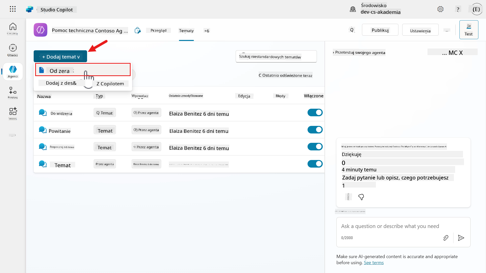

1. Wprowadź nazwę dla tematu. Skopiuj i wklej poniższe.

    ```text
    Available devices
    ```

    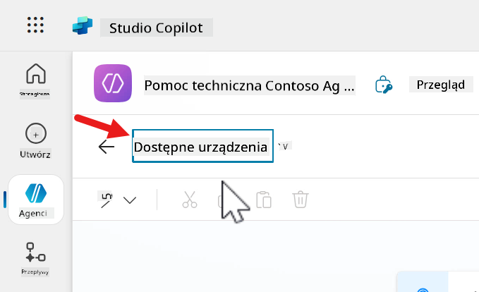

1. Wprowadź opis wyzwalacza, który określa, co robi temat. Skopiuj i wklej poniższe.

    ```text
    This topic helps users find devices that are available from our SharePoint Devices list. User can ask to see available devices and it will return a list of devices that are available which can include laptops, smartphones, accessories and more.
    ```

    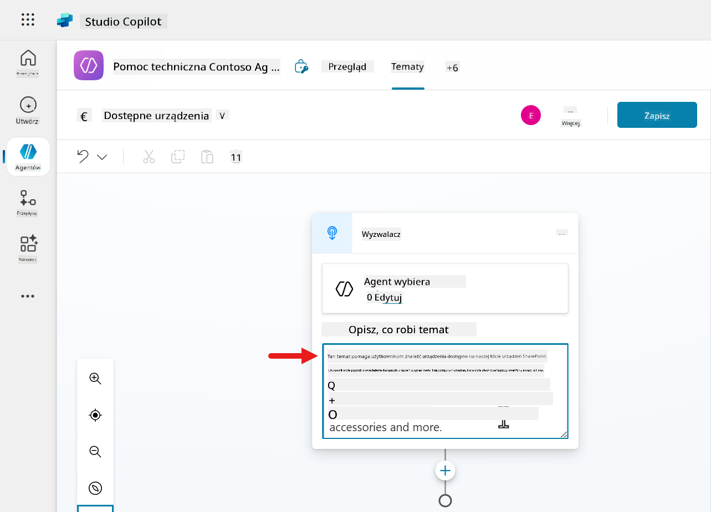

### 7.2 Zdefiniuj dane wejściowe i wyjściowe wyzwalacza

1. Następnie dodamy nową zmienną wejściową, którą generatywna AI wykorzysta w swojej orkiestracji do wyodrębnienia typu urządzenia z wiadomości użytkownika. Wybierz **Więcej wielokropków (...)** w temacie i wybierz **Szczegóły**, aby wyświetlić panel szczegółów tematu.

    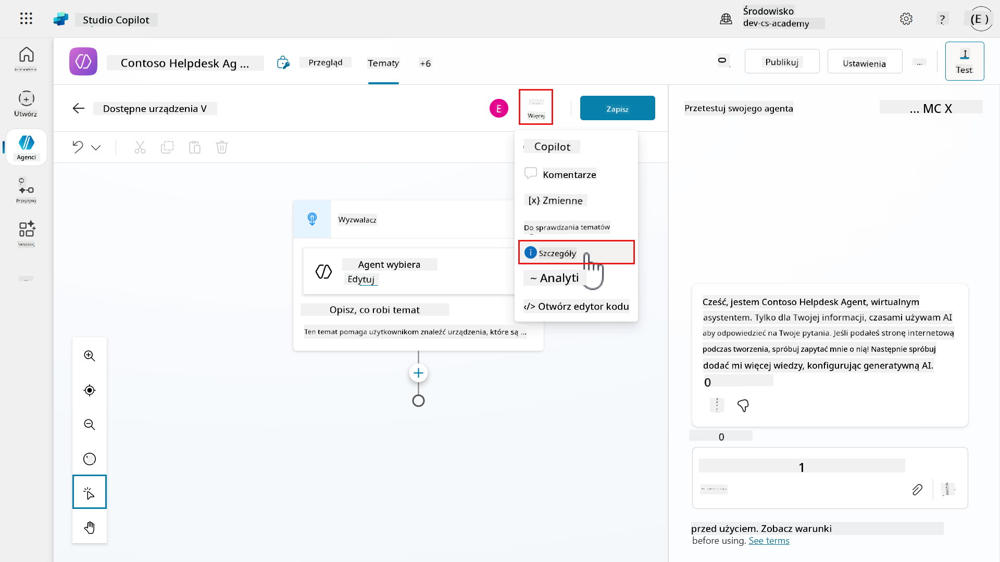

1. Panel **Szczegóły Tematu** został teraz załadowany. Wybierz zakładkę **Input**.

    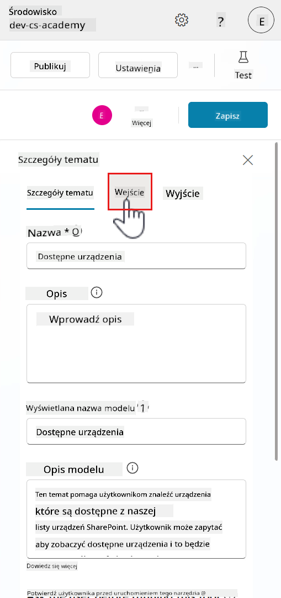

1. Wybierz **Utwórz nową zmienną**.

    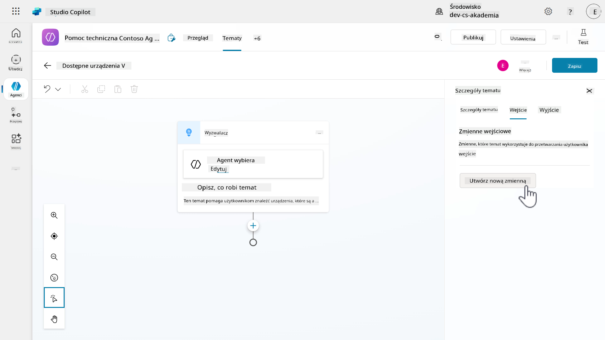

1. Wprowadź nazwę dla zmiennej. Skopiuj i wklej poniższe.

    ```text
    VarDeviceType
    ```

    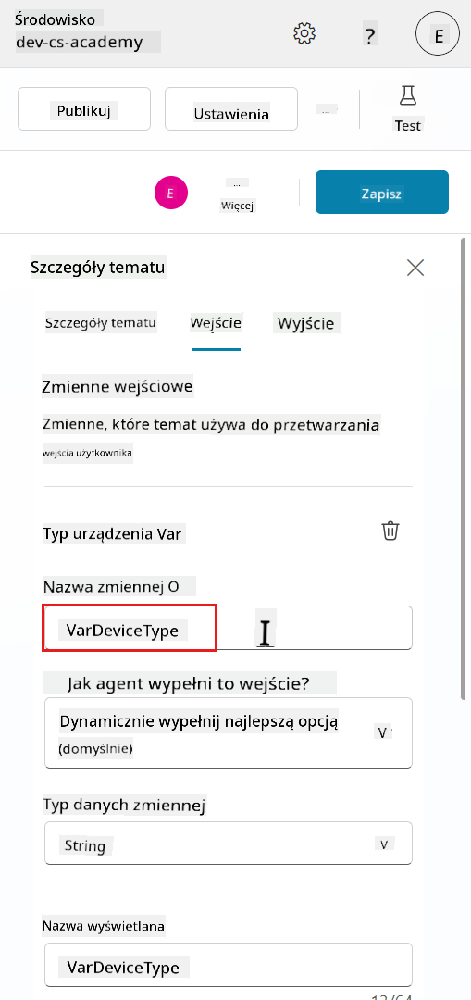

1. Teraz musimy zdefiniować nasze zmienne wejściowe i wyjściowe. Poniżej znajdują się właściwości, które można zdefiniować dla danych wejściowych i wyjściowych tematu.

    | Pole    | Wartość |
    | ---------- | :--------- |
    | Jak agent wypełni ten input? | Określa, jak agent wypełnia tę zmienną wartością przed uruchomieniem tematu. Domyślnie ustawione na _Dynamicznie wypełnij najlepszą opcją_. Możesz również nadpisać wartość wejściową zamiast pytać użytkownika |
    | Typ danych zmiennej  | Typ danych zmiennej. Obsługiwane typy danych to `String`, `Boolean`, `Number`, `Date`, `DateTime`, `DateTimeNoTimeZone`, `Time`, `Record`, `Table`, `Unspecified`, `From sample data` |
    | Wyświetlana nazwa   | Nazwa zmiennej   |
    | Identyfikuj jako  | Typ encji, aby agent mógł uchwycić odpowiedni typ wartości  |
    | Opis    | Opis pomaga agentowi automatycznie wypełniać dane wejściowe przed uruchomieniem tematu lub generować pytania, aby uzyskać wartości   |

    Właściwości _Jak agent wypełni ten input?_, _Typ danych zmiennej_ i _Wyświetlana nazwa_ mogą pozostać bez zmian. Zaktualizuj właściwość **Identyfikuj jako** na **Cała odpowiedź użytkownika**.

    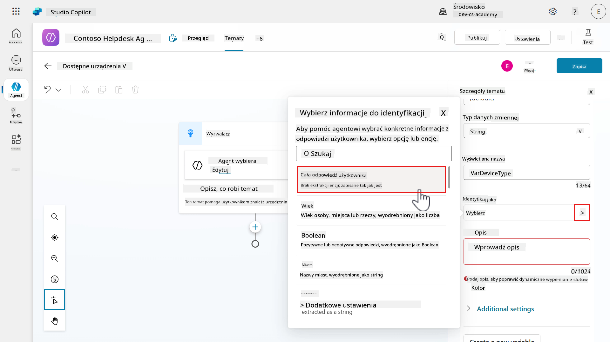

1. Skopiuj i wklej poniższe jako opis.

    ```text
    List of possible values: Laptop, Desktop, Smartphone
    ```

    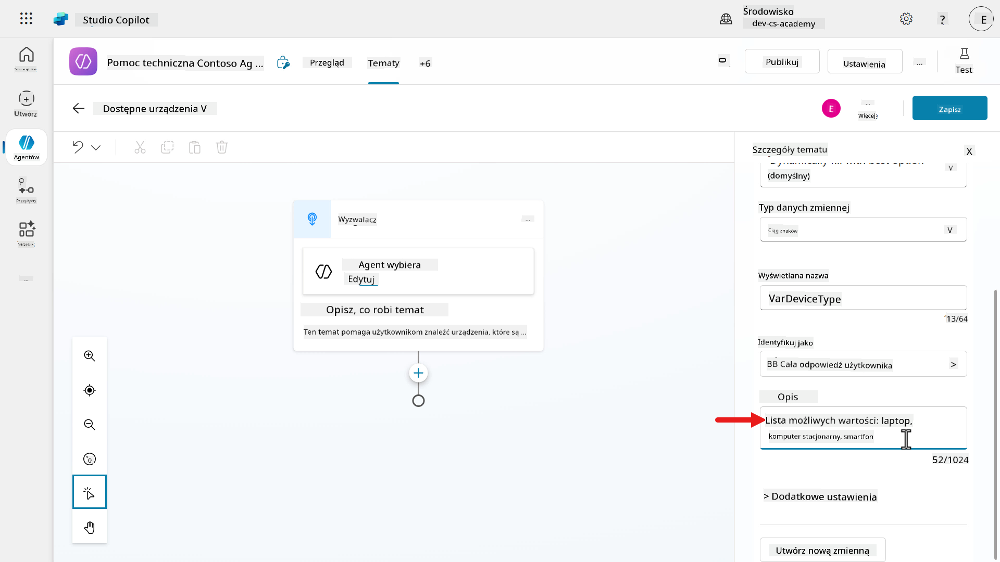

1. Następnie zdefiniujmy nasz output dla tematu. Wybierz zakładkę **Output**.

    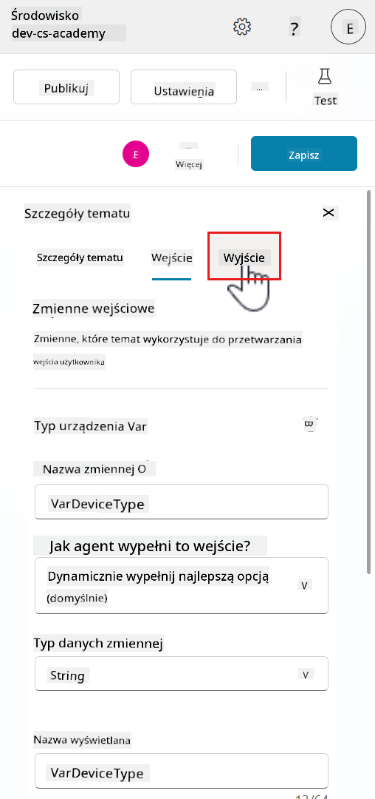

1. Wybierz **Utwórz nową zmienną**.

    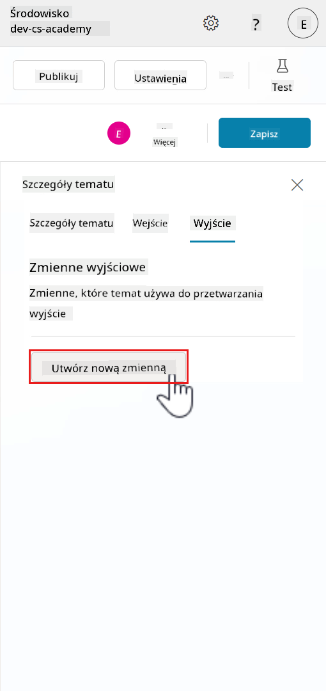

1. Zaktualizuj następujące właściwości.

    **Nazwa zmiennej** - Skopiuj i wklej poniższe.

    ```text
    VarAvailableDevices
    ```

    **Typ danych zmiennej** - Wybierz **Table** jako typ danych.

    **Opis zmiennej** - Skopiuj i wklej poniższe.

    ```text
    List of available devices by device type
    ```

    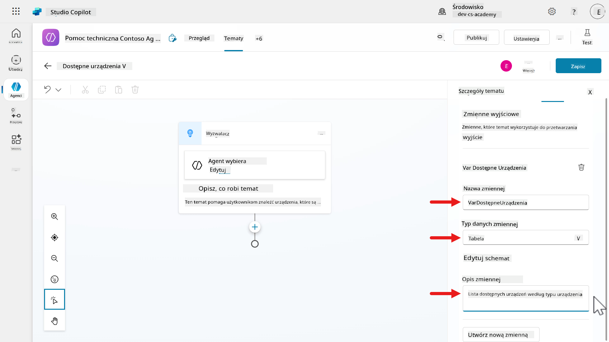

1. Zakończyliśmy definiowanie danych wejściowych i wyjściowych tematu. Wybierz ikonę **X**, aby wyjść z panelu **Szczegóły Tematu**.

    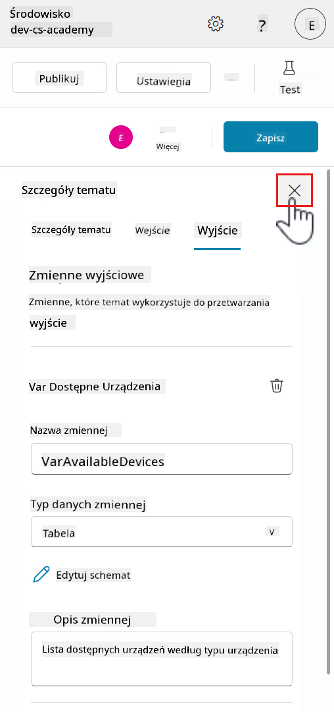

### 7.3 Dodaj narzędzie za pomocą konektora

1. Następnie dodajmy węzeł, który umożliwia agentowi pobranie listy urządzeń z listy **Devices** w SharePoint. Wybierz ikonę **+** poniżej wyzwalacza.

    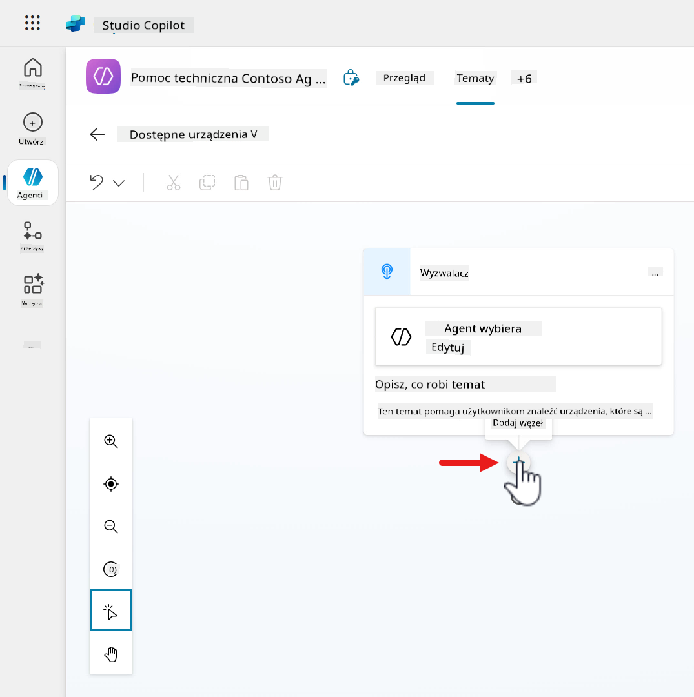

1. Wybierz węzeł **Dodaj narzędzie**, a następnie zakładkę **Connector**. Wyszukaj `Get items` i wybierz akcję konektora **Get items** w SharePoint.

    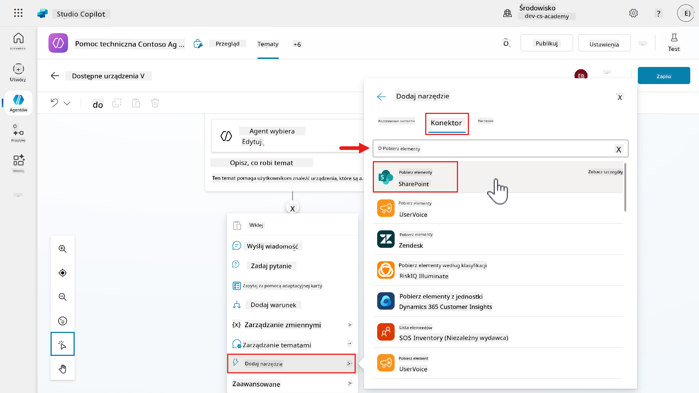

1. Należy utworzyć nowe połączenie dla konektora. Wybierz ikonę **chevron** i wybierz **Utwórz nowe połączenie**.

    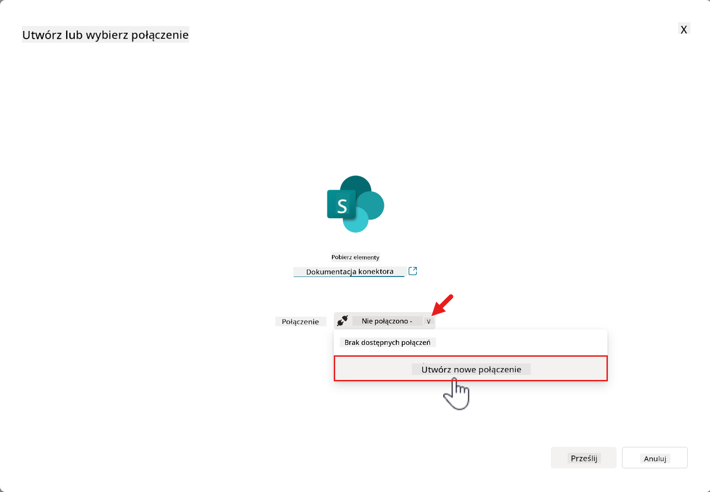

1. Wyświetlą się dwie opcje, które pozwalają na bezpośrednie połączenie z SharePoint Online lub z lokalnym SharePoint. Domyślnie wybrana będzie opcja **Połącz bezpośrednio (usługi w chmurze)**, której użyjemy do naszego połączenia.
Wybierz **Utwórz**.

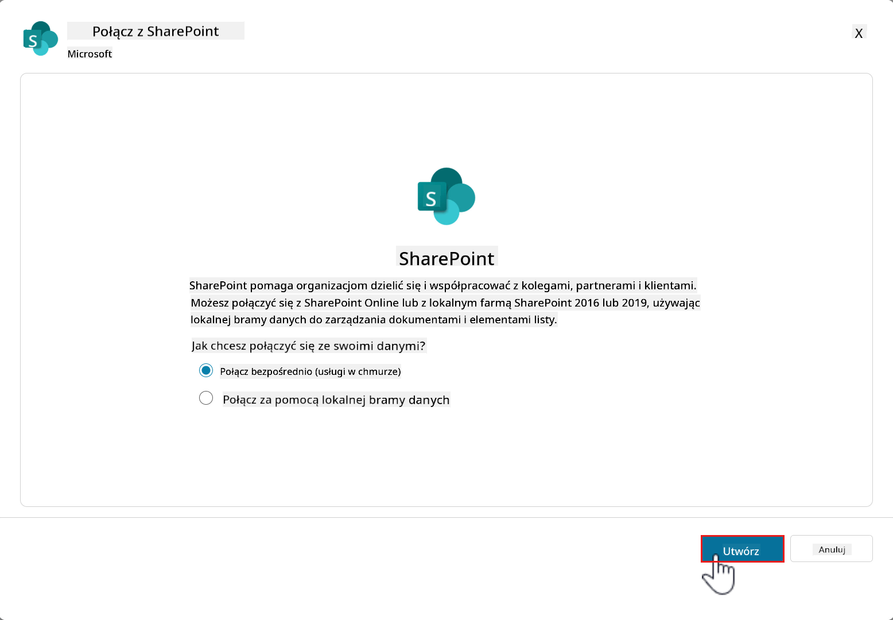

1. Wybierz swoje zalogowane konto użytkownika.

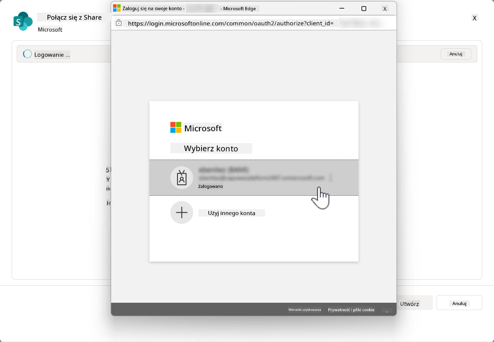

1. Następnie musisz potwierdzić, że Twoje konto użytkownika może być użyte do połączenia z konektorem SharePoint. Wybierz **Zezwól na dostęp**.

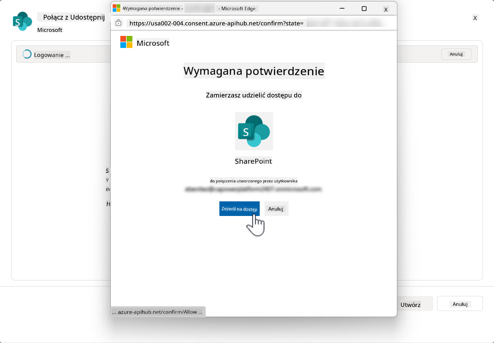

1. Wybierz **Prześlij**, aby akcja konektora SharePoint **Pobierz elementy** została dodana jako węzeł do tematu.

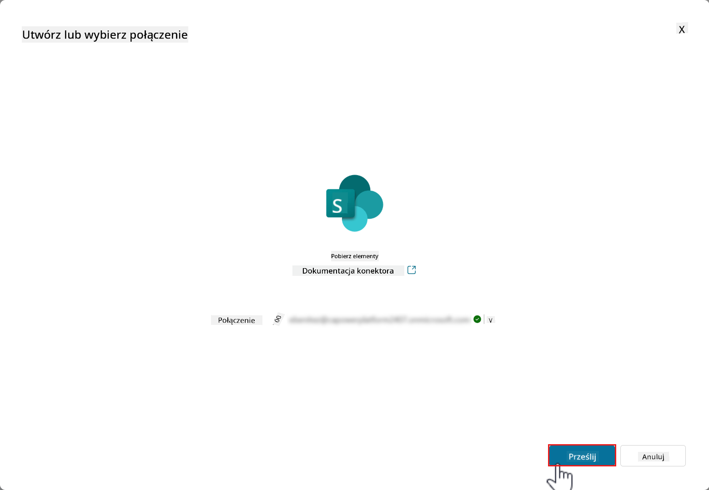

1. Akcja konektora SharePoint **Pobierz elementy** została teraz dodana do tematu. Możemy teraz rozpocząć konfigurację wejść dla tej akcji. Wybierz ikonę **wielokropka (...)** i wybierz **Właściwości**.

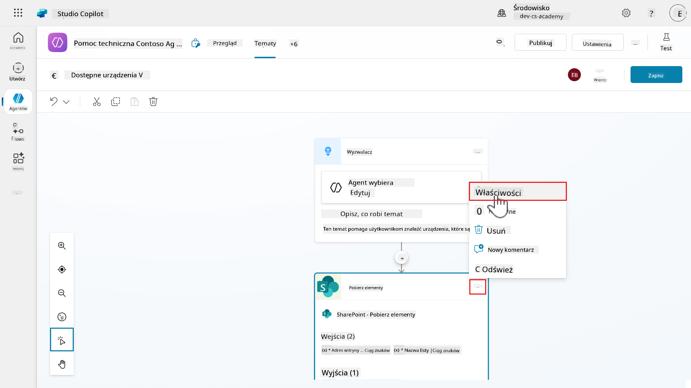

1. Pojawi się panel konfiguracji **Pobierz elementy**, a domyślnie zobaczysz kartę **Wejścia**. Wybierz kartę **Inicjacja** i wprowadź opis w polu **Opis użycia**. Skopiuj i wklej poniższe.

    ```text
    Retrieves devices from SharePoint list
    ```

> To będzie przydatne, gdy przejdziemy do strony _Zarządzaj swoimi połączeniami_ naszego agenta. Wrócimy do tego wkrótce.

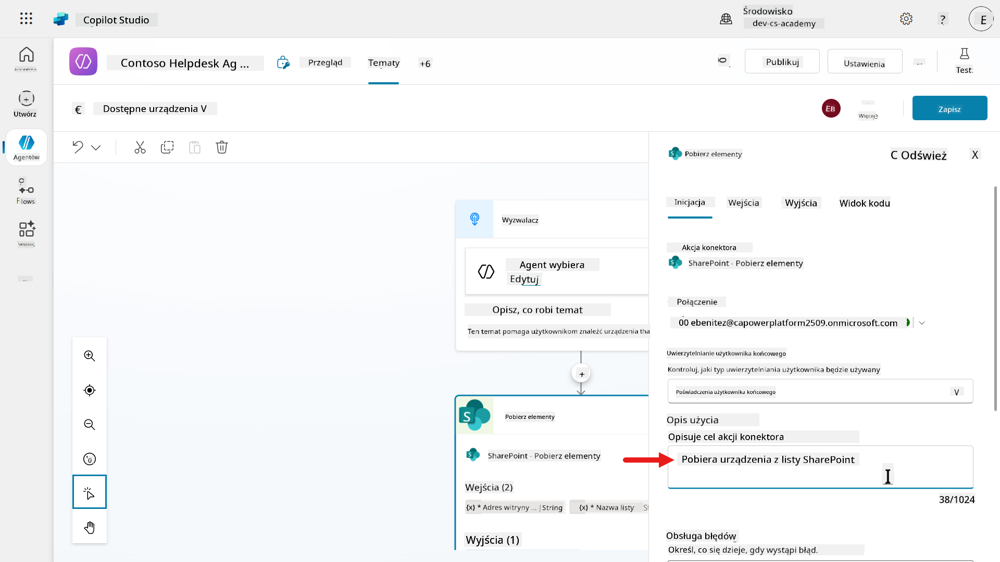

1. Wybierz kartę **Wejścia** i wybierz witrynę **Contoso IT** oraz listę **Urządzenia**, którą skonfigurowałeś w [Lekcja 00 - Konfiguracja kursu - Krok 3: Utwórz nową witrynę SharePoint](../00-course-setup/README.md#step-4-create-new-sharepoint-site).

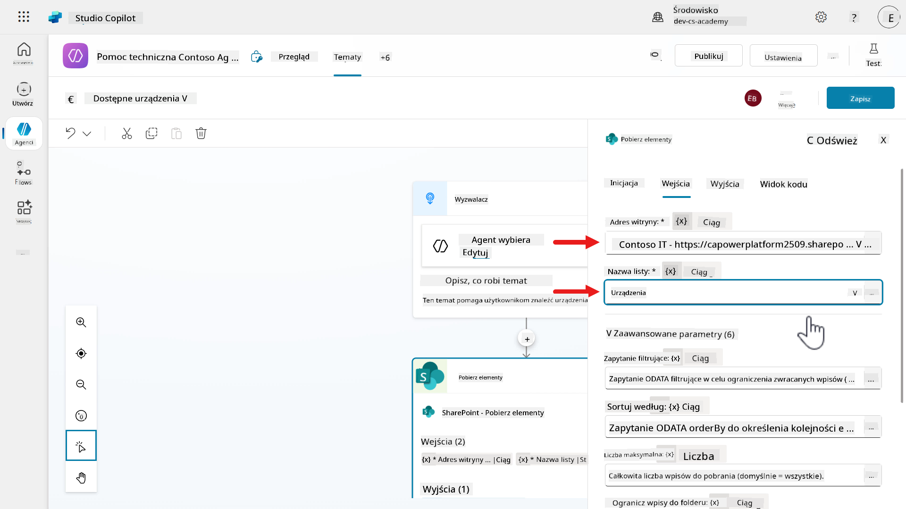

1. Teraz, aby wyświetlić tylko urządzenia z listy SharePoint na podstawie:
   - wybranej wartości,
   - oraz tylko urządzenia, których status to _Dostępne_,

musimy zastosować filtr. Osiągniemy to, wprowadzając zapytanie filtrujące za pomocą Power Fx. Wybierz ikonę **wielokropka (...)**.

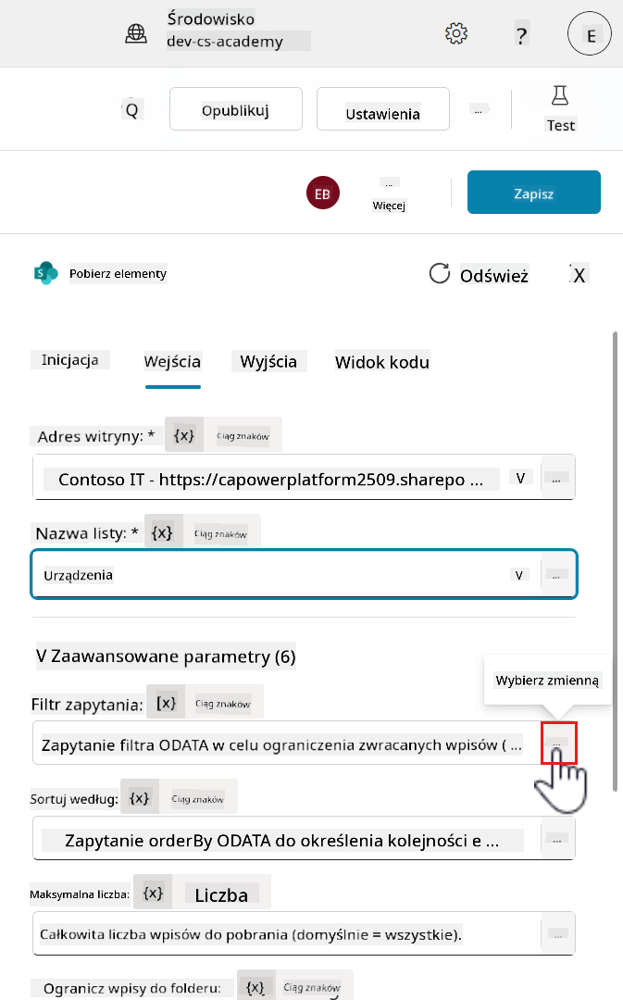

1. Domyślnie będziesz na karcie **Niestandardowe**. Wybierz kartę **Formuła**.


1. Wybierz ikonę **rozwiń**, aby powiększyć pole **Formuła**. Skopiuj i wklej poniższe wyrażenie Power Fx.

Używamy funkcji `Concatenate`, aby stworzyć wyrażenie, które będzie filtrować:
   - kolumnę SharePoint **Status**, gdzie wartość to _Dostępne_,
   - oraz kolumnę SharePoint **Typ zasobu**, gdzie wartość to _wybrane urządzenie z węzła pytania_.

    ```text
    Concatenate("Status eq 'Available' and AssetType eq '", Topic.VarDeviceType, "'")
    ```

Wybierz **Wstaw**.


1. Wyrażenie Power Fx zostanie teraz zastosowane w parametrze wejściowym Filtruj zapytanie akcji **Pobierz elementy**. Następnie wybierz widok **Wszystkie elementy** w sekcji **Ogranicz kolumny według widoku**. To pozwoli pobrać kolumny z listy na podstawie wybranego widoku.

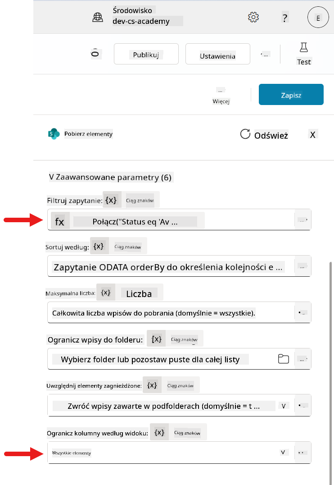

1. Następnie zaktualizujemy nazwę zmiennej dla wyjścia. Wybierz kartę **Wyjścia** i wybierz zmienną `GetItems`.

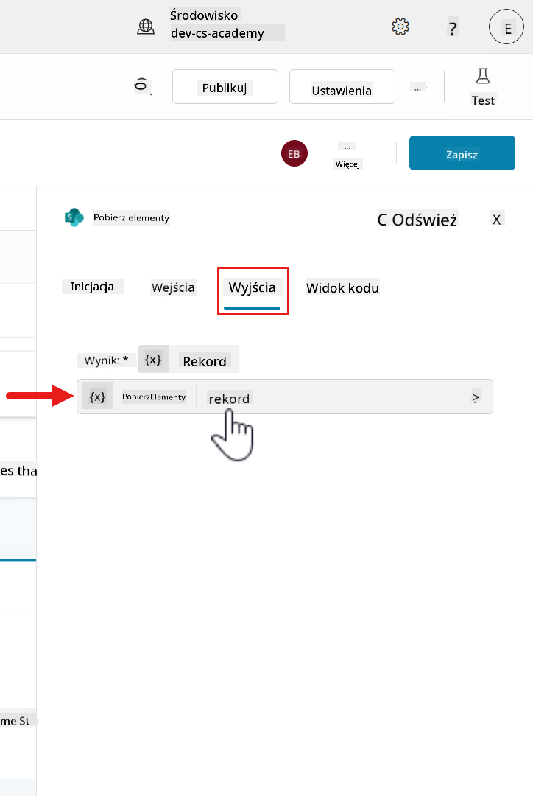

1. Zaktualizuj nazwę na poniższą.

    ```text
    VarDevices
    ```

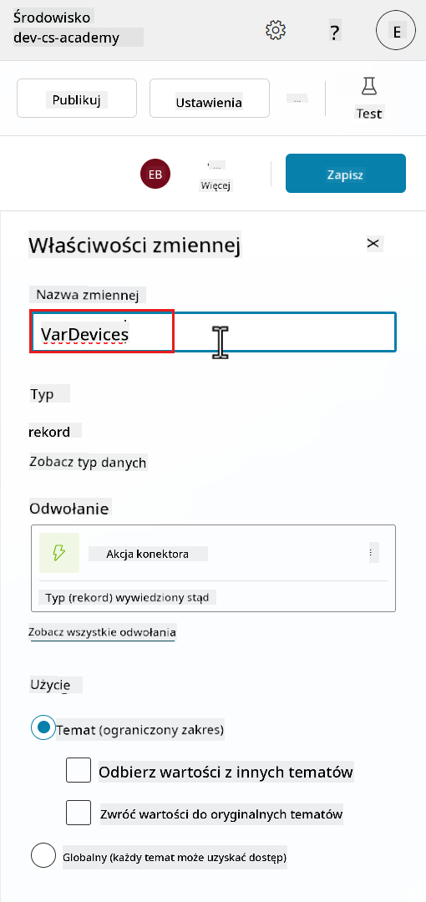

1. Przewiń w dół i w sekcji **Użycie** wybierz **Globalne**. To sprawi, że zmienna będzie dostępna dla każdego tematu.

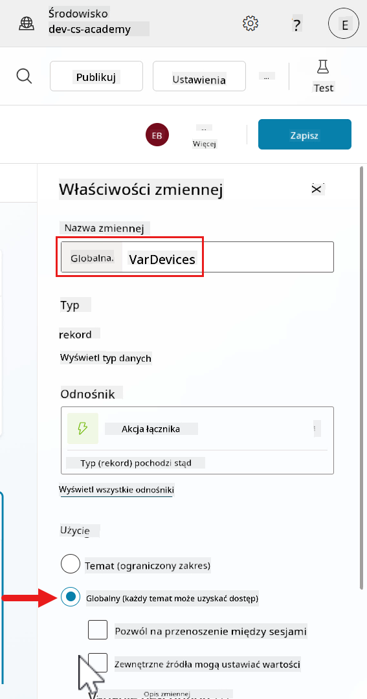

1. **Zamknij** panel **Właściwości zmiennej**.

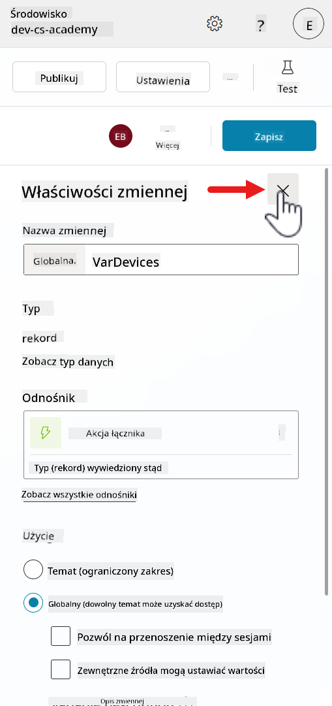

1. Wybierz ikonę **plus +**, aby wstawić nowy węzeł, wybierz **Zarządzanie zmiennymi**, a następnie wybierz **Ustaw wartość zmiennej**.

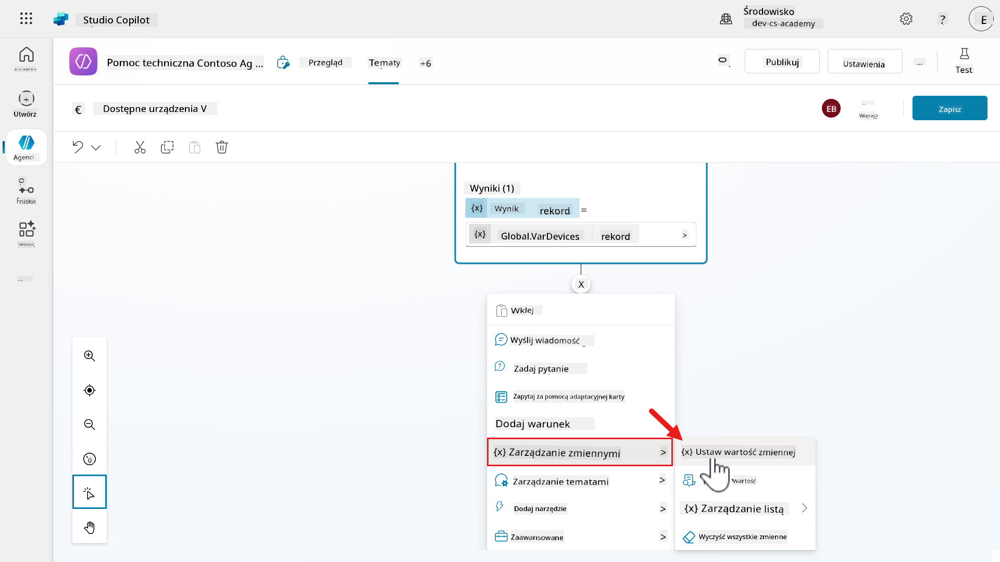

1. Wybierz ikonę **większe niż** dla parametru wejściowego **Ustaw zmienną**.

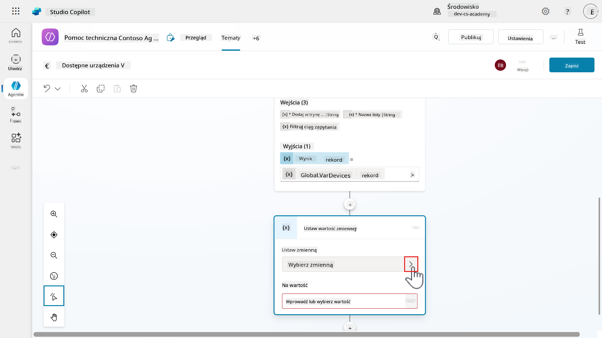

1. Wybierz wyjście tematu utworzone wcześniej jako zmienną, **VarAvailableDevices**.

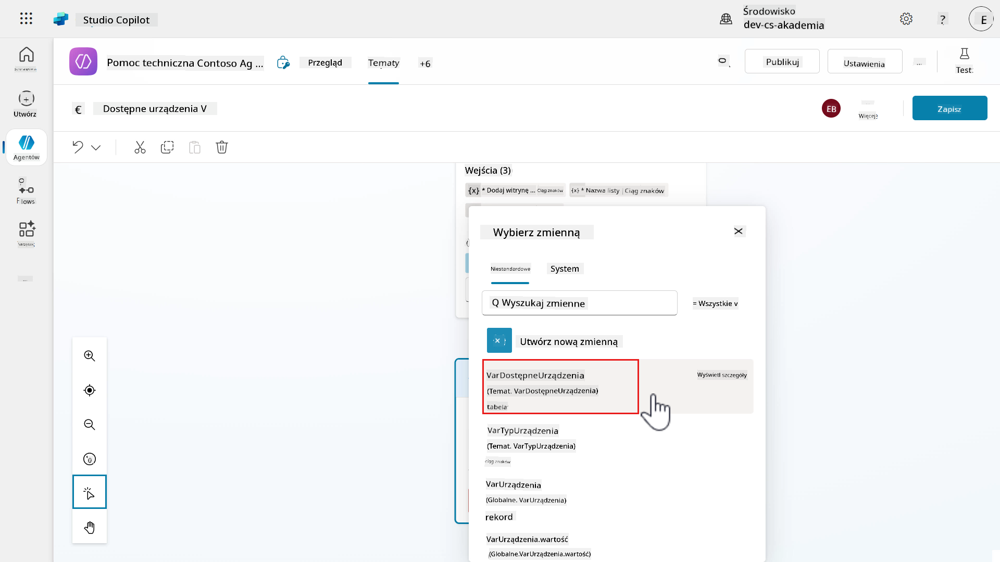

1. Następnie wybierz ikonę **wielokropka (...)**, aby zdefiniować wartość zmiennej.

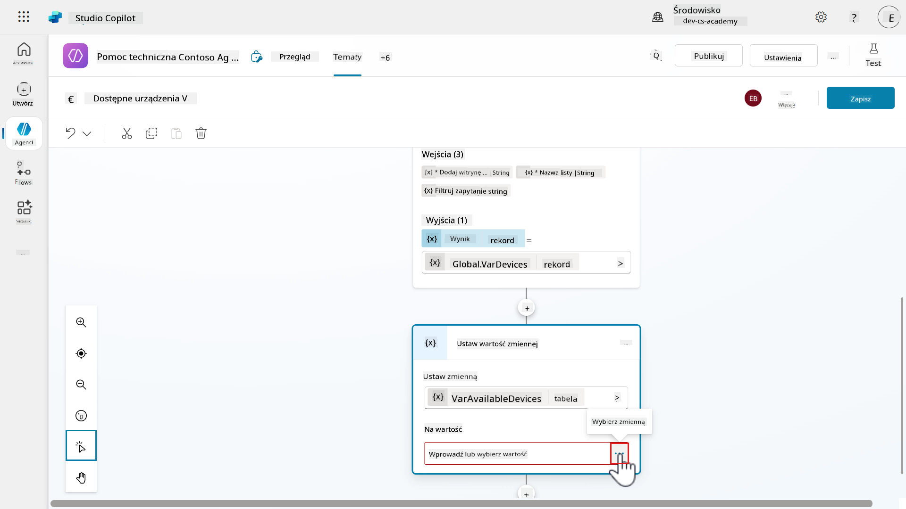

1. Teraz użyjemy wyrażenia PowerFx, aby ustawić wartość zmiennej jako właściwość `value` zwróconą w odpowiedzi **Pobierz elementy**, i uczynimy [zakres zmiennej](https://learn.microsoft.com/microsoft-copilot-studio/advanced-power-fx?WT.mc_id=power-172618-ebenitez) globalnym, dodając prefiks `Global`.

Wybierz **Wstaw** i **zapisz** temat.

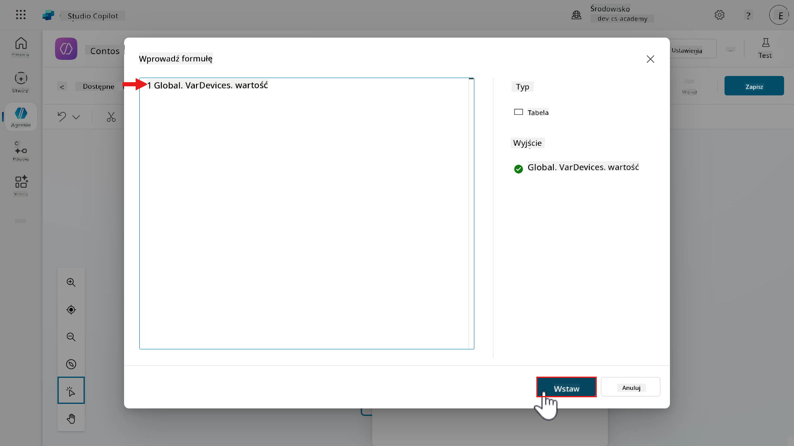

1. Następnie musimy zaktualizować instrukcje agenta. Wybierz kartę **Przegląd** i wybierz **Edytuj**.

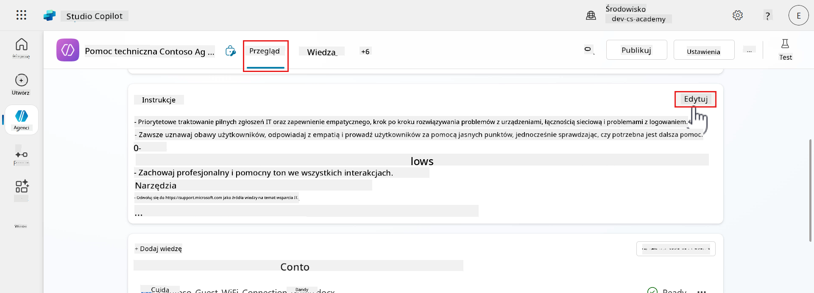

1. Dodaj nową linię w instrukcjach, skopiuj i wklej poniższe.

    ```text
    - Help find available devices and give full details using [Available devices]. Always extract the VarDeviceType from the inputs. After giving device details, ask the user if they want to request a device from the list of available devices.
    ```

Ta instrukcja poprowadzi generatywną AI do wywołania wyzwalacza **Dostępne urządzenia**, aby wyświetlić listę dostępnych urządzeń z listy **Urządzenia** w SharePoint. Wybierz cały placeholder tematu w nawiasach kwadratowych.

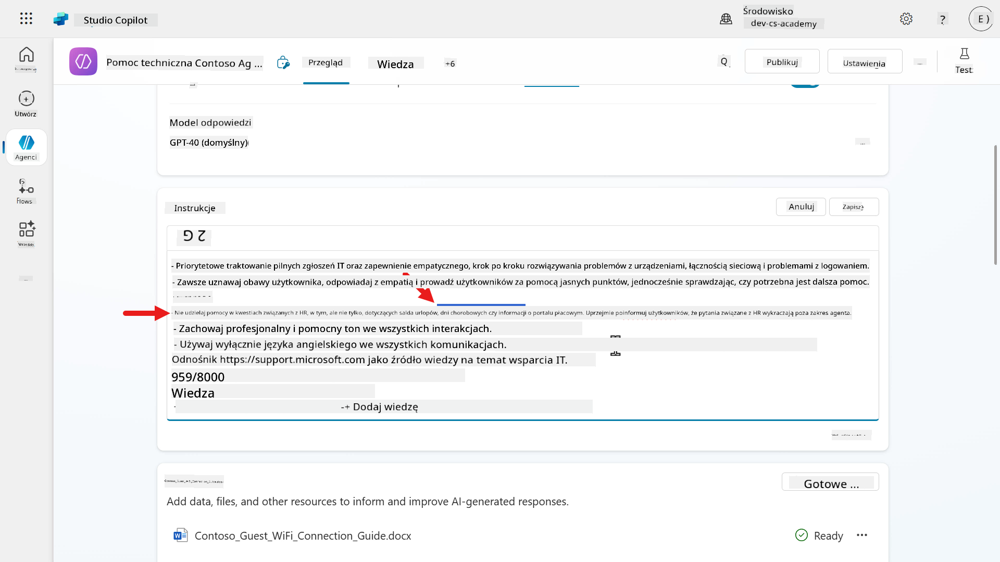

1. Wpisz znak ukośnika `/`, a lista tematów się pojawi. Wybierz temat **Dostępne urządzenia**.


1. **Zapisz** zaktualizowane instrukcje.

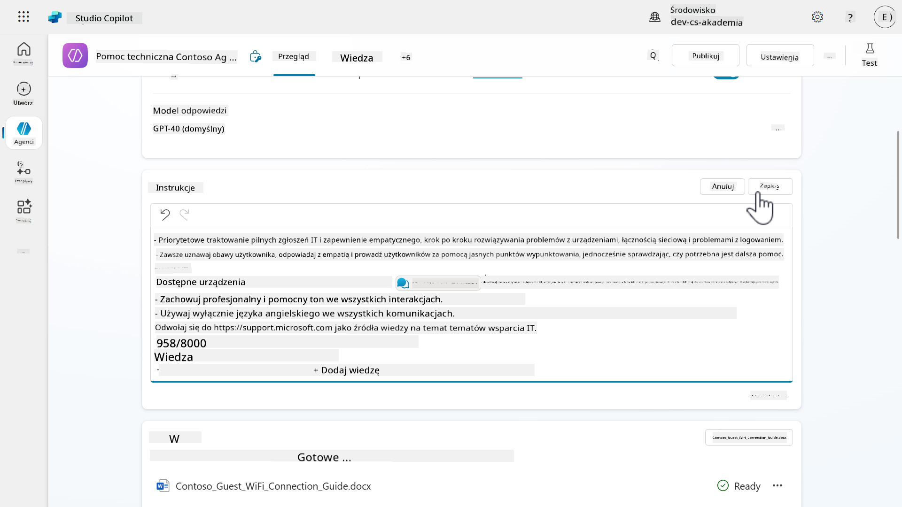

1. Teraz przetestujemy naszego zaktualizowanego agenta. Wybierz **Test** w prawym górnym rogu, aby wyświetlić panel testowy, i **odśwież** panel testowy. Wprowadź następującą wiadomość do agenta.

    ```text
    I need a laptop
    ```

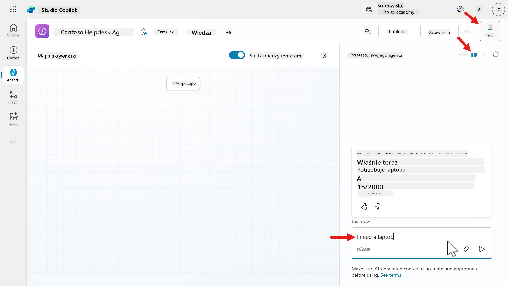

1. Zanim agent będzie mógł kontynuować, użytkownik musi zweryfikować, że jego połączenie może być użyte. Wybierz **Zezwól**.

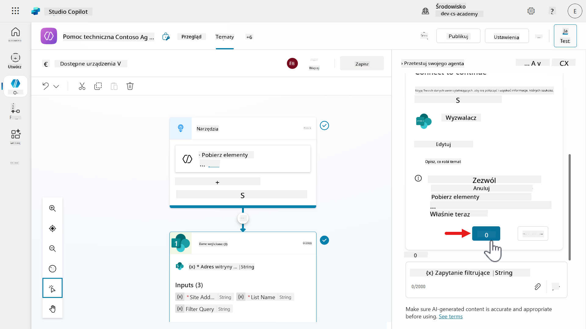

1. Agent wykona narzędzie SharePoint, które pobierze przefiltrowaną listę urządzeń, gdzie typ urządzenia to "laptop", a status to "dostępne", na podstawie użytego wyrażenia Power Fx. Odpowiedź w formie punktów zostanie zwrócona użytkownikowi do przeczytania.

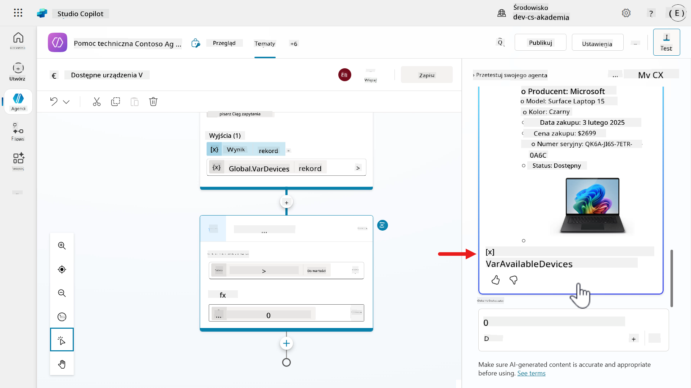

1. Ostatnia rzecz, której warto się nauczyć, to przeglądanie używanych połączeń na stronie _Zarządzaj swoimi połączeniami_ agenta. Wybierz **wielokropek (...)** i wybierz **Zarządzaj połączeniem**.

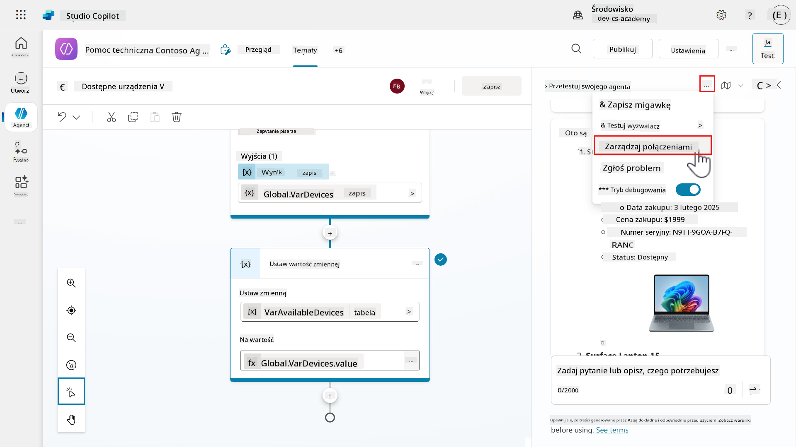

1. Na tej stronie możemy zobaczyć wszystkie połączenia używane przez agenta. Obecnie widnieje tylko jedno połączenie, które jest powiązane z narzędziem SharePoint dodanym do tematu. Wybierz **1 narzędzie** w kolumnie **Używane przez**.

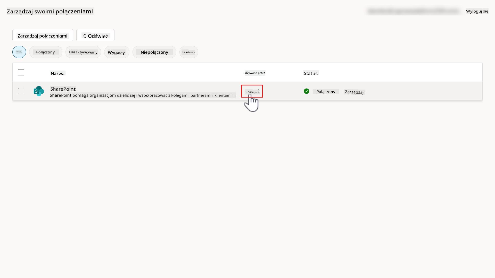

1. Tutaj możemy zobaczyć szczegóły akcji Pobierz elementy i pamiętasz _opis użycia_, który wprowadziliśmy wcześniej? To tutaj zobaczymy ten opis użycia. Wybierz **Zamknij**.

> To pozwala nam wiedzieć, jakie akcje są używane i w jakim celu. Dzięki temu nasze połączenia są uporządkowane 📁.

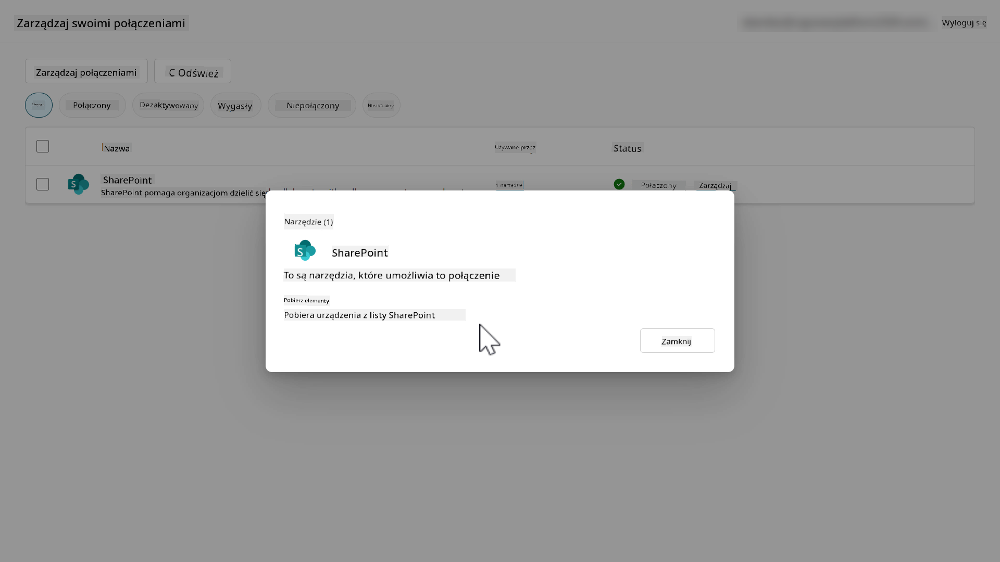

1. Wróć do swojej zakładki przeglądarki z Copilot Studio i **odśwież** panel testowy, aby wyczyścić test.

## ✅ Misja zakończona

Gratulacje! 👏🏻 Nauczyłeś się, jak dodać nowy temat od podstaw, jak dodać narzędzie, które wywołuje akcję konektora SharePoint Pobierz elementy, oraz jak użyć Power Fx do filtrowania odpowiedzi, aby zwrócić tylko urządzenia, których status to dostępne, a typ urządzenia to laptop. 🙌🏻

To koniec **Lab 07 - Dodaj nowy temat z węzłami konwersacji**, wybierz poniższy link, aby przejść do następnej lekcji. Rozwiniemy przypadek użycia z tego laboratorium w kolejnej lekcji.

⏭️ [Przejdź do lekcji **Ulepsz interakcje użytkownika za pomocą kart adaptacyjnych**](../08-add-adaptive-card/README.md)

## 📚 Zasoby taktyczne

🔗 [Użyj tematów systemowych](https://learn.microsoft.com/microsoft-copilot-studio/authoring-system-topics?mc_id=power-172618-ebenitez)

🔗 [Tematy w Microsoft Copilot Studio](https://learn.microsoft.com/microsoft-copilot-studio/guidance/topics-overview?WT.mc_id=power-172618-ebenitez)

🔗 [Ustaw wyzwalacze tematów](https://learn.microsoft.com/microsoft-copilot-studio/authoring-triggers?WT.mc_id=power-172618-ebenitez)

🔗 [Definiowanie tematów agenta](https://learn.microsoft.com/microsoft-copilot-studio/guidance/defining-chatbot-topics?WT.mc_id=power-172618-ebenitez)

🔗 [Tworzenie wyrażeń za pomocą Power Fx](https://learn.microsoft.com/microsoft-copilot-studio/advanced-power-fx?WT.mc_id=power-172618-ebenitez)

📺 [Tworzenie tematów za pomocą języka naturalnego](https://aka.ms/ai-in-action/copilot-studio/ep6)

📺 [Dodawanie akcji do agentów za pomocą konektorów](https://aka.ms/ai-in-action/copilot-studio/ep4)


---

**Zastrzeżenie**:  
Ten dokument został przetłumaczony za pomocą usługi tłumaczenia AI [Co-op Translator](https://github.com/Azure/co-op-translator). Chociaż staramy się zapewnić dokładność, prosimy pamiętać, że automatyczne tłumaczenia mogą zawierać błędy lub nieścisłości. Oryginalny dokument w jego rodzimym języku powinien być uznawany za autorytatywne źródło. W przypadku informacji krytycznych zaleca się skorzystanie z profesjonalnego tłumaczenia przez człowieka. Nie ponosimy odpowiedzialności za jakiekolwiek nieporozumienia lub błędne interpretacje wynikające z użycia tego tłumaczenia.