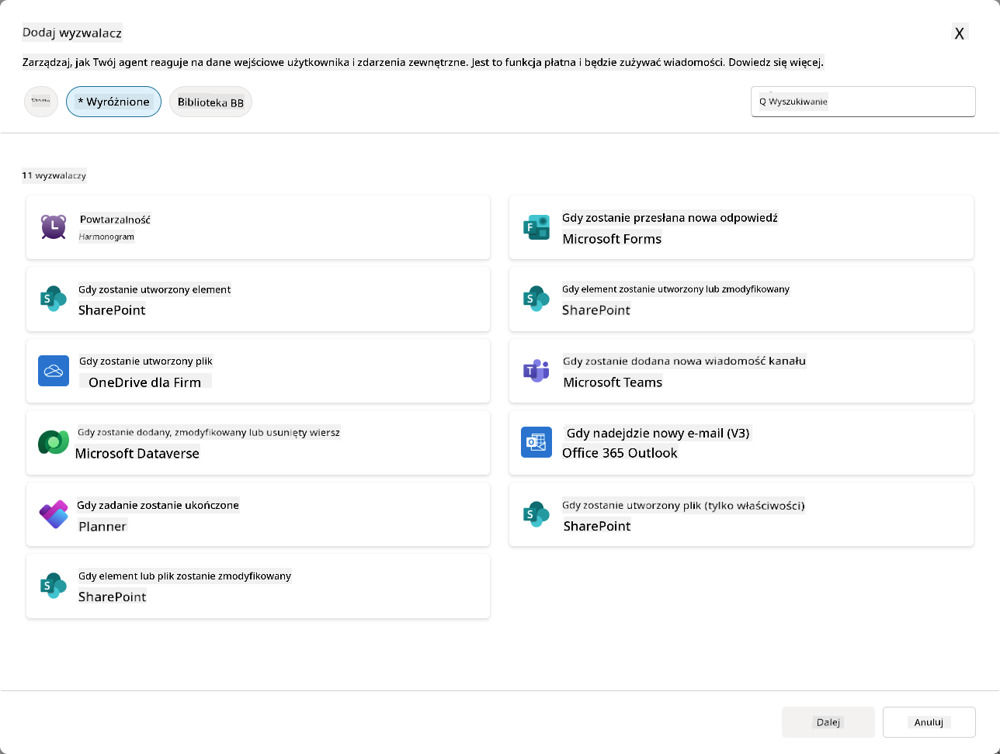
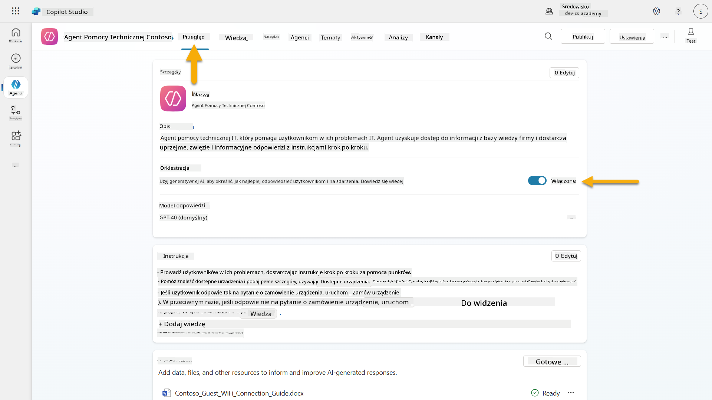
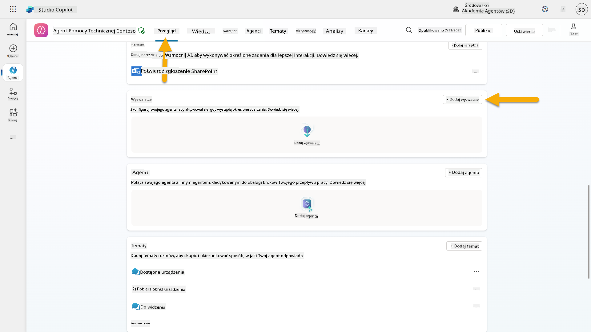
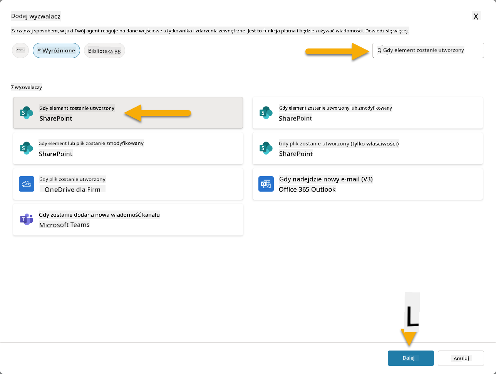
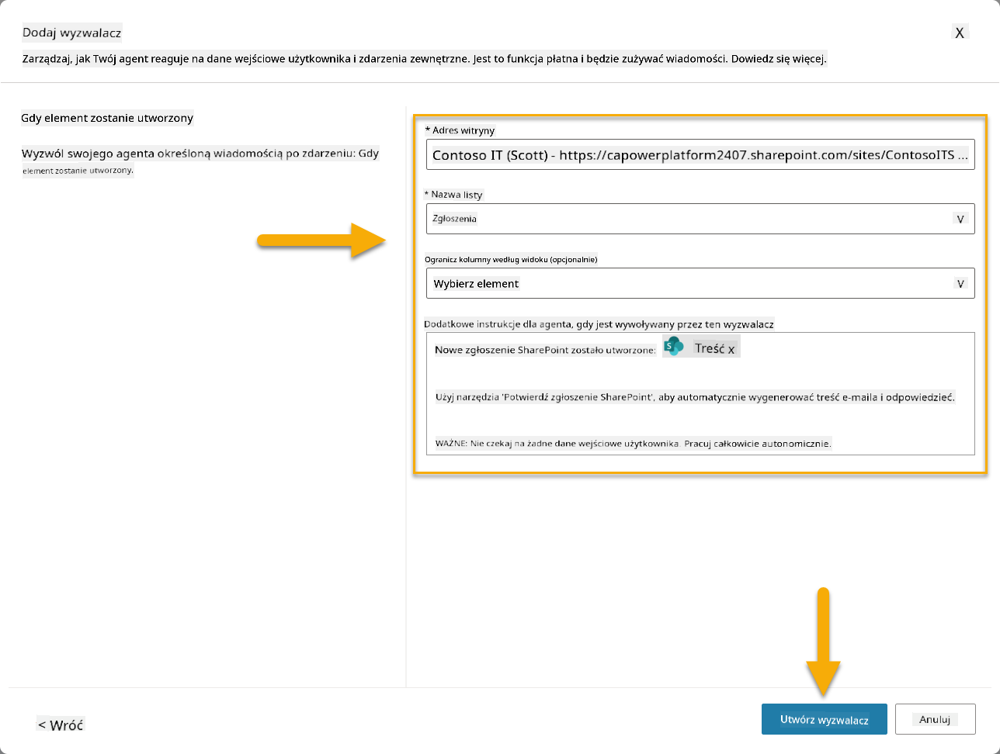
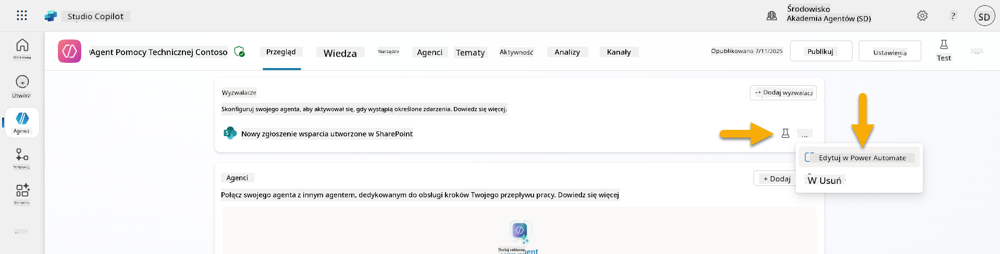
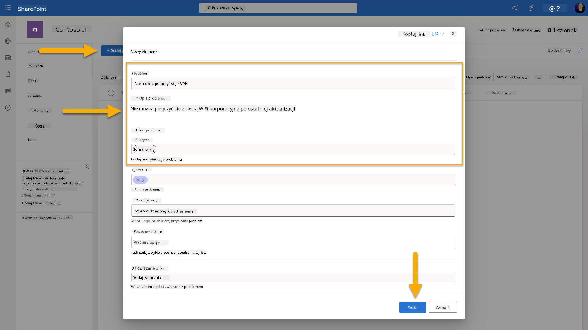
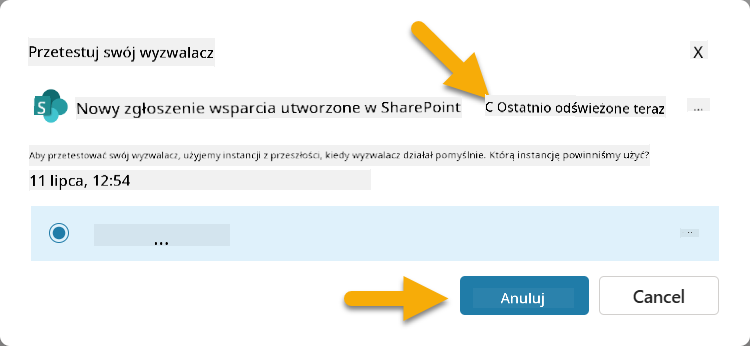
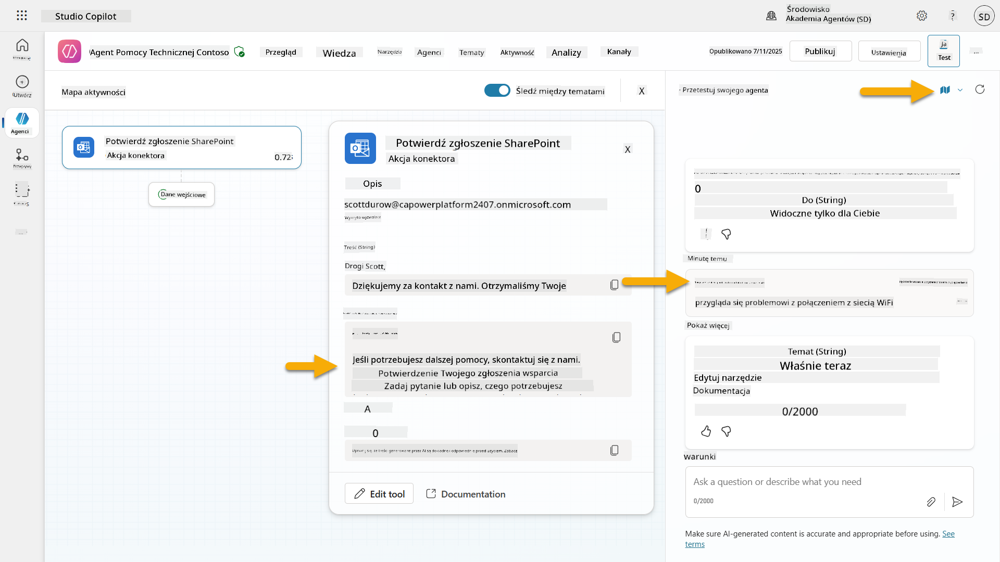
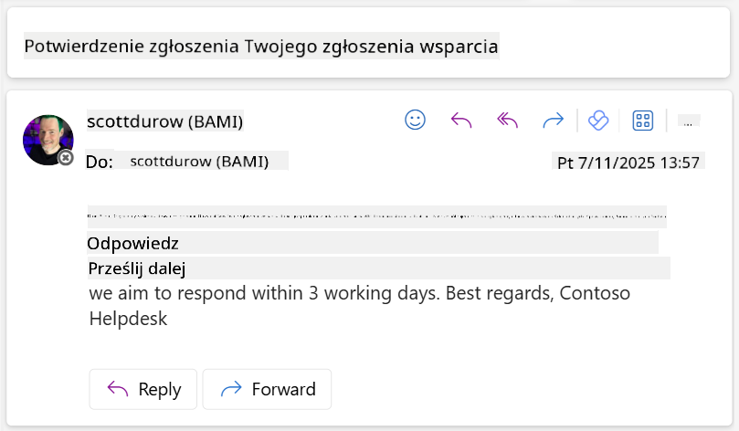

<!--
CO_OP_TRANSLATOR_METADATA:
{
  "original_hash": "cd99a76bcb7372ac2771b6ae178b023d",
  "translation_date": "2025-10-22T00:23:31+00:00",
  "source_file": "docs/recruit/10-add-event-triggers/README.md",
  "language_code": "pl"
}
-->
# 🚨 Misja 10: Dodaj wyzwalacze zdarzeń - Włącz autonomiczne możliwości agenta

## 🕵️‍♂️ KOD OPERACJI: `OPERACJA DUCHOWA RUTYNA`

> **⏱️ Czas operacji:** `~45 minut`

🎥 **Obejrzyj instruktaż**

[](https://www.youtube.com/watch?v=ZgwHL8PQ1nY "Obejrzyj instruktaż na YouTube")

## 🎯 Opis misji

Czas podnieść poziom Twojego agenta z asystenta konwersacyjnego do autonomicznego operacyjnego. Twoim zadaniem jest umożliwienie agentowi działania bez wezwania - reagowania na sygnały z całej Twojej cyfrowej domeny z precyzją i szybkością.

Dzięki wyzwalaczom zdarzeń nauczysz swojego agenta monitorowania zewnętrznych systemów, takich jak SharePoint, Teams i Outlook, oraz wykonywania inteligentnych działań w momencie otrzymania sygnału. Ta operacja przekształca Twojego agenta w w pełni operacyjny zasób terenowy - cichy, szybki i zawsze czujny.

Sukces oznacza tworzenie agentów, którzy inicjują wartość - a nie tylko na nią reagują.

## 🔎 Cele

📖 Ta lekcja obejmie:

- Zrozumienie wyzwalaczy zdarzeń i ich roli w umożliwianiu autonomicznego zachowania agenta
- Poznanie różnicy między wyzwalaczami zdarzeń a wyzwalaczami tematów, w tym przepływów pracy wyzwalaczy i ładunków
- Eksplorowanie typowych scenariuszy wyzwalaczy zdarzeń
- Zrozumienie uwierzytelniania, bezpieczeństwa i kwestii publikacji dla agentów opartych na zdarzeniach
- Budowanie autonomicznego agenta IT Help Desk, który reaguje na zdarzenia SharePoint i wysyła potwierdzenia e-mail

## 🤔 Co to jest wyzwalacz zdarzeń?

**Wyzwalacz zdarzeń** to mechanizm, który pozwala Twojemu agentowi działać autonomicznie w odpowiedzi na zewnętrzne zdarzenia, bez konieczności bezpośredniego wkładu użytkownika. Można to porównać do "obserwowania" przez agenta określonych zdarzeń i automatycznego podejmowania działań, gdy te zdarzenia wystąpią.

W przeciwieństwie do wyzwalaczy tematów, które wymagają od użytkowników wpisania czegoś, aby aktywować rozmowę, wyzwalacze zdarzeń aktywują się na podstawie zdarzeń zachodzących w Twoich połączonych systemach. Np.:

- Gdy nowy plik zostanie utworzony w SharePoint lub OneDrive for Business
- Gdy rekord zostanie utworzony w Dataverse
- Gdy zadanie zostanie ukończone w Planner
- Gdy zostanie przesłana nowa odpowiedź w Microsoft Forms
- Gdy zostanie dodana nowa wiadomość w Microsoft Teams
- Na podstawie powtarzającego się harmonogramu (np. codzienne przypomnienia)  


### Dlaczego wyzwalacze zdarzeń są ważne dla autonomicznych agentów

Wyzwalacze zdarzeń przekształcają Twojego agenta z reaktywnego asystenta w proaktywną, autonomiczną pomoc:

1. **Autonomiczne działanie** - Twój agent może pracować 24/7 bez interwencji człowieka, reagując na zdarzenia w momencie ich wystąpienia.
    - *Przykład:* Automatyczne powitanie nowych członków zespołu, gdy zostaną dodani do zespołu.

1. **Reagowanie w czasie rzeczywistym** - zamiast czekać, aż użytkownicy zadają pytania, Twój agent natychmiast reaguje na odpowiednie zdarzenia.
    - *Przykład*: Powiadomienie zespołu IT, gdy dokument SharePoint zostanie zmodyfikowany.

1. **Automatyzacja przepływów pracy** - połącz wiele działań na podstawie jednego zdarzenia wyzwalającego.
    - *Przykład:* Gdy zostanie utworzony nowy zgłoszenie wsparcia, utwórz zadanie, powiadom menedżera i zaktualizuj pulpit nawigacyjny.

1. **Spójne procesy** - upewnij się, że ważne kroki nigdy nie zostaną pominięte, automatyzując reakcje na kluczowe zdarzenia.
    - *Przykład:* Każdy nowy pracownik automatycznie otrzymuje materiały onboardingowe i wnioski o dostęp.

1. **Działania oparte na danych** - wykorzystaj informacje z wyzwalającego zdarzenia, aby podejmować inteligentne decyzje i odpowiednie działania.
    - *Przykład:* Przekierowanie pilnych zgłoszeń do starszego personelu na podstawie poziomu priorytetu w ładunku wyzwalacza.

## ⚙️ Jak działają wyzwalacze zdarzeń?

Wyzwalacze zdarzeń działają poprzez trzyetapowy przepływ pracy, który umożliwia Twojemu agentowi autonomiczne reagowanie na zewnętrzne zdarzenia:

### Przepływ pracy wyzwalacza

1. **Wykrycie zdarzenia** - Występuje określone zdarzenie w połączonym systemie (SharePoint, Teams, Outlook, itp.)
1. **Aktywacja wyzwalacza** - Wyzwalacz zdarzenia wykrywa to zdarzenie i wysyła ładunek do Twojego agenta za pośrednictwem Power Automate Cloud Flow.
1. **Reakcja agenta** - Twój agent otrzymuje ładunek i wykonuje zdefiniowane przez Ciebie instrukcje.

### Wyzwalacze zdarzeń vs wyzwalacze tematów

Zrozumienie różnicy między tymi dwoma typami wyzwalaczy jest kluczowe:

| **Wyzwalacze zdarzeń** | **Wyzwalacze tematów** |
|-------------------|-------------------|
| Aktywowane przez zdarzenia w zewnętrznych systemach | Aktywowane przez wkład użytkownika/wyrażenia |
| Umożliwiają autonomiczne zachowanie agenta | Umożliwiają odpowiedzi konwersacyjne |
| Używają uwierzytelnienia twórcy | Opcja uwierzytelnienia użytkownika |
| Działają bez interakcji użytkownika | Wymagają, aby użytkownik rozpoczął rozmowę |
| Przykłady: Utworzono plik, otrzymano e-mail | Przykład: "Jaka jest pogoda?" |

## 📦 Zrozumienie ładunków wyzwalaczy

Gdy wystąpi zdarzenie, wyzwalacz wysyła **ładunek** do Twojego agenta, zawierający informacje o zdarzeniu i instrukcje dotyczące reakcji.

### Domyślne vs niestandardowe ładunki

Każdy typ wyzwalacza ma domyślną strukturę ładunku, ale możesz ją dostosować:

**Domyślny ładunek** - Używa standardowego formatu, np. `Użyj treści z {Body}`

- Zawiera podstawowe informacje o zdarzeniu
- Używa ogólnych instrukcji przetwarzania
- Dobry dla prostych scenariuszy

**Niestandardowy ładunek** - Dodaj konkretne instrukcje i formatowanie danych

- Zawiera szczegółowe instrukcje dla Twojego agenta
- Określa dokładnie, jakie dane użyć i jak
- Lepszy dla złożonych przepływów pracy

### Instrukcje dla agenta vs instrukcje dla ładunku niestandardowego

Masz dwa miejsca, w których możesz kierować zachowaniem swojego agenta za pomocą wyzwalaczy zdarzeń:

**Instrukcje dla agenta** (Globalne)

- Ogólne wskazówki, które dotyczą wszystkich wyzwalaczy
- Przykład: "Podczas przetwarzania zgłoszeń zawsze najpierw sprawdzaj duplikaty"
- Najlepsze dla ogólnych wzorców zachowań

**Instrukcje dla ładunku** (Specyficzne dla wyzwalacza)

- Konkretne wskazówki dla poszczególnych typów wyzwalaczy  
- Przykład: "Dla tej aktualizacji SharePoint wyślij podsumowanie do kanału projektu"
- Najlepsze dla złożonych agentów z wieloma wyzwalaczami

💡 **Porada**: Unikaj sprzecznych instrukcji między tymi dwoma poziomami, ponieważ może to powodować nieoczekiwane zachowanie.

## 🎯 Typowe scenariusze wyzwalaczy zdarzeń

Oto praktyczne przykłady, jak wyzwalacze zdarzeń mogą ulepszyć Twojego agenta:

### Agent IT Help Desk

- **Wyzwalacz**: Nowy element listy SharePoint (zgłoszenie wsparcia)
- **Działanie**: Automatyczne kategoryzowanie, przypisywanie priorytetów i powiadamianie odpowiednich członków zespołu

### Agent ds. wdrożenia pracowników

- **Wyzwalacz**: Nowy użytkownik dodany do Dataverse
- **Działanie**: Wysłanie wiadomości powitalnej, utworzenie zadań wdrożeniowych i przyznanie dostępu

### Agent zarządzania projektami

- **Wyzwalacz**: Zadanie ukończone w Planner
- **Działanie**: Aktualizacja pulpitu nawigacyjnego projektu, powiadomienie interesariuszy i sprawdzenie blokad

### Agent zarządzania dokumentami

- **Wyzwalacz**: Plik przesłany do określonego folderu SharePoint
- **Działanie**: Wyodrębnienie metadanych, zastosowanie tagów i powiadomienie właścicieli dokumentów

### Agent asystent spotkań

- **Wyzwalacz**: Utworzenie wydarzenia w kalendarzu
- **Działanie**: Wysłanie przypomnień przed spotkaniem i agendy, rezerwacja zasobów

## ⚠️ Uwagi dotyczące publikacji i uwierzytelniania

Zanim Twój agent będzie mógł korzystać z wyzwalaczy zdarzeń w produkcji, musisz zrozumieć kwestie uwierzytelniania i bezpieczeństwa.

### Uwierzytelnianie twórcy

Wyzwalacze zdarzeń używają **poświadczeń twórcy agenta** do całego uwierzytelniania:

- Twój agent uzyskuje dostęp do systemów za pomocą Twoich uprawnień
- Użytkownicy mogą potencjalnie uzyskać dostęp do danych za pośrednictwem Twoich poświadczeń
- Wszystkie działania są wykonywane "jako Ty", nawet gdy użytkownicy wchodzą w interakcję z agentem

### Najlepsze praktyki ochrony danych

Aby zachować bezpieczeństwo podczas publikowania agentów z wyzwalaczami zdarzeń:

1. **Oceń dostęp do danych** - Przejrzyj, do jakich systemów i danych mają dostęp Twoje wyzwalacze
1. **Testuj dokładnie** - Zrozum, jakie informacje zawierają ładunki wyzwalaczy
1. **Zawęź zakres wyzwalaczy** - Użyj konkretnych parametrów, aby ograniczyć zdarzenia aktywujące wyzwalacze
1. **Przejrzyj dane ładunku** - Upewnij się, że wyzwalacze nie ujawniają poufnych informacji
1. **Monitoruj użycie** - Śledź aktywność wyzwalaczy i zużycie zasobów

## ⚠️ Rozwiązywanie problemów i ograniczenia

Pamiętaj o tych ważnych kwestiach podczas pracy z wyzwalaczami zdarzeń:

### Wpływ na limity i rozliczenia

- Każda aktywacja wyzwalacza liczy się do Twojego zużycia wiadomości
- Częste wyzwalacze (np. co minutę) mogą szybko wyczerpać limit
- Monitoruj użycie, aby uniknąć ograniczeń

### Wymagania techniczne

- Dostępne tylko dla agentów z włączoną generatywną orkiestracją
- Wymaga włączenia udostępniania przepływu chmurowego związanego z rozwiązaniem w Twoim środowisku

### Zapobieganie utracie danych (DLP)

- Polityki DLP Twojej organizacji określają, które wyzwalacze są dostępne
- Administratorzy mogą całkowicie zablokować wyzwalacze zdarzeń
- Skontaktuj się z administratorem, jeśli oczekiwane wyzwalacze nie są dostępne

## 🧪 Laboratorium 10 - Dodaj wyzwalacze zdarzeń dla autonomicznego zachowania agenta

### 🎯 Przypadek użycia

Udoskonalisz swojego agenta IT Help Desk, aby automatycznie reagował na nowe zgłoszenia wsparcia. Gdy ktoś utworzy nowy element na liście zgłoszeń wsparcia w SharePoint, Twój agent:

1. Wyzwoli się autonomicznie, gdy zgłoszenie SharePoint zostanie utworzone
1. Przekaże szczegóły zgłoszenia i instrukcje dotyczące kroków, które chcesz, aby wykonał
1. Automatycznie potwierdzi zgłoszenie do osoby zgłaszającej za pomocą wygenerowanego przez AI e-maila

To laboratorium pokazuje, jak wyzwalacze zdarzeń umożliwiają naprawdę autonomiczne zachowanie agenta.

### Wymagania wstępne

Przed rozpoczęciem tego laboratorium upewnij się, że masz:

- ✅ Ukończone poprzednie laboratoria (szczególnie Laboratoria 6-8 dla agenta IT Help Desk)
- ✅ Dostęp do witryny SharePoint z listą zgłoszeń wsparcia IT
- ✅ Środowisko Copilot Studio z włączonymi wyzwalaczami zdarzeń
- ✅ Twój agent ma włączoną generatywną orkiestrację
- ✅ Odpowiednie uprawnienia w SharePoint i Twoim środowisku Copilot Studio

### 10.1 Włącz Generatywne AI i utwórz wyzwalacz utworzenia elementu SharePoint

1. Otwórz swojego **agenta IT Help Desk** w **Copilot Studio**

1. Najpierw upewnij się, że **Generatywne AI** jest włączone dla Twojego agenta:
   - Przejdź do zakładki **Przegląd**
   - W sekcji Orkiestracja, przełącz **Generatywną orkiestrację** na **Włączone**, jeśli nie jest już włączona  
     

1. Przejdź do zakładki **Przegląd** i znajdź sekcję **Wyzwalacze**

1. Kliknij **+ Dodaj wyzwalacz**, aby otworzyć bibliotekę wyzwalaczy  
    

1. Wyszukaj i wybierz **Gdy element zostanie utworzony** (SharePoint)  
    

1. Skonfiguruj nazwę wyzwalacza i połączenia:

   - **Nazwa wyzwalacza:** Nowe zgłoszenie wsparcia utworzone w SharePoint

1. Poczekaj na skonfigurowanie połączeń i wybierz **Dalej**, aby kontynuować.  
   

1. Skonfiguruj parametry wyzwalacza:

   - **Adres witryny**: Wybierz swoją witrynę SharePoint "Contoso IT"

   - **Nazwa listy**: Wybierz swoją listę "Zgłoszenia"

   - **Dodatkowe instrukcje dla agenta, gdy zostanie wywołany przez wyzwalacz:**

     ```text
     New Support Ticket Created in SharePoint: {Body}
     
     Use the 'Acknowledge SharePoint Ticket' tool to generate the email body automatically and respond.
     
     IMPORTANT: Do not wait for any user input. Work completely autonomously.
     ```

     

1. Wybierz **Utwórz wyzwalacz**, aby zakończyć tworzenie wyzwalacza. Automatycznie zostanie utworzony Power Automate Cloud Flow, który wyzwala agenta autonomicznie.

1. Wybierz **Zamknij**.

### 10.2 Edytuj wyzwalacz

1. W sekcji **Wyzwalacze** zakładki **Przegląd**, wybierz menu **...** na wyzwalaczu **Nowe zgłoszenie wsparcia utworzone w SharePoint**

1. Wybierz **Edytuj w Power Automate**  
   

1. Wybierz węzeł **Wysyła polecenie do określonego copilota do przet
1. Otwórz nową kartę przeglądarki i przejdź do swojej **listy zgłoszeń wsparcia IT w SharePoint**
1. Kliknij **+ Dodaj nowy element**, aby utworzyć testowe zgłoszenie:
   - **Tytuł**: "Nie można połączyć się z VPN"
   - **Opis**: "Nie można połączyć się z siecią WIFI firmy po ostatniej aktualizacji"
   - **Priorytet**: "Normalny"

1. **Zapisz** element w SharePoint  
    
1. Wróć do **Copilot Studio** i monitoruj panel **Testuj swój wyzwalacz**, aby sprawdzić aktywację wyzwalacza. Użyj ikony **Odśwież**, aby załadować zdarzenie wyzwalacza, co może zająć kilka minut.  
    
1. Gdy wyzwalacz się pojawi, wybierz **Rozpocznij testowanie**
1. Kliknij **Ikonę mapy aktywności** na górze panelu **Testuj swojego agenta**
1. Zweryfikuj, że Twój agent:
   - Otrzymał dane wyzwalacza
   - Wywołał narzędzie "Potwierdź zgłoszenie w SharePoint"  
     
1. Sprawdź skrzynkę e-mail osoby zgłaszającej, aby potwierdzić wysłanie e-maila z potwierdzeniem  
    
1. Przejrzyj zakładkę **Aktywność** w Copilot Studio, aby zobaczyć pełne wykonanie wyzwalacza i narzędzia

## ✅ Misja zakończona

🎉 **Gratulacje!** Udało Ci się pomyślnie wdrożyć wyzwalacze zdarzeń z narzędziami konektorów, które umożliwiają Twojemu agentowi autonomiczne działanie, automatyczne wysyłanie potwierdzeń e-mail i przetwarzanie zgłoszeń wsparcia bez interwencji użytkownika. Po opublikowaniu Twój agent będzie działał autonomicznie w Twoim imieniu.

🚀 **Co dalej**: W naszej kolejnej lekcji dowiesz się, jak [opublikować swojego agenta](../11-publish-your-agent/README.md) w Microsoft Teams i Microsoft 365 Copilot, aby był dostępny dla całej Twojej organizacji!

⏭️ [Przejdź do lekcji **Opublikuj swojego agenta**](../11-publish-your-agent/README.md)

## 📚 Zasoby taktyczne

Chcesz zgłębić temat wyzwalaczy zdarzeń i autonomicznych agentów? Sprawdź te zasoby:

- **Microsoft Learn**: [Uczyń swojego agenta autonomicznym w Copilot Studio](https://learn.microsoft.com/training/modules/autonomous-agents-online-workshop/?WT.mc_id=power-177340-scottdurow)
- **Dokumentacja**: [Dodaj wyzwalacz zdarzenia](https://learn.microsoft.com/microsoft-copilot-studio/authoring-trigger-event?WT.mc_id=power-177340-scottdurow)
- **Najlepsze praktyki**: [Wprowadzenie do wyzwalaczy w Power Automate](https://learn.microsoft.com/power-automate/triggers-introduction?WT.mc_id=power-177340-scottdurow)
- **Zaawansowane scenariusze**: [Używanie przepływów Power Automate z agentami](https://learn.microsoft.com/microsoft-copilot-studio/advanced-flow-create?WT.mc_id=power-177340-scottdurow)
- **Bezpieczeństwo**: [Zapobieganie utracie danych w Copilot Studio](https://learn.microsoft.com/microsoft-copilot-studio/admin-data-loss-prevention?WT.mc_id=power-177340-scottdurow)


---

**Zastrzeżenie**:  
Ten dokument został przetłumaczony za pomocą usługi tłumaczenia AI [Co-op Translator](https://github.com/Azure/co-op-translator). Chociaż staramy się zapewnić dokładność, prosimy pamiętać, że automatyczne tłumaczenia mogą zawierać błędy lub nieścisłości. Oryginalny dokument w jego rodzimym języku powinien być uznawany za wiarygodne źródło. W przypadku informacji krytycznych zaleca się skorzystanie z profesjonalnego tłumaczenia przez człowieka. Nie ponosimy odpowiedzialności za jakiekolwiek nieporozumienia lub błędne interpretacje wynikające z użycia tego tłumaczenia.