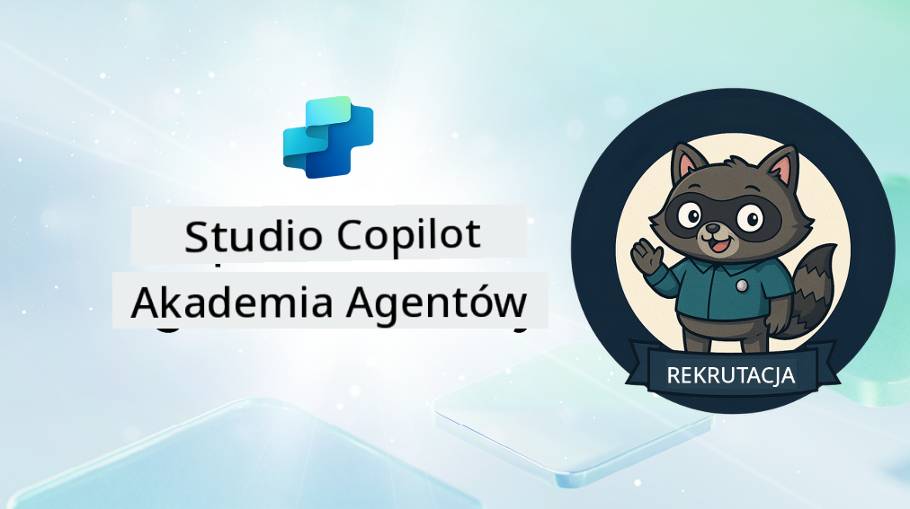

<!--
CO_OP_TRANSLATOR_METADATA:
{
  "original_hash": "8b5ecad9d5d073ea3f4c2b844e80f2e5",
  "translation_date": "2025-10-22T00:20:41+00:00",
  "source_file": "docs/recruit/README.md",
  "language_code": "pl"
}
-->
# Witaj Rekrucie

**Witaj, Rekrucie.**  
Twoja misja—jeśli zdecydujesz się ją przyjąć—polega na opanowaniu sztuki tworzenia agentów za pomocą **Microsoft Copilot Studio**.

To praktyczne szkolenie jest Twoim wejściem do **świata agentów**: od precyzyjnych podpowiedzi, przez Adaptive Cards, aż po przepływy agentów. Nauczysz się budować, skalować i wdrażać inteligentne agenty, korzystając z narzędzi i przypadków użycia z prawdziwego świata.

---

## 🎯 Cel Misji

Po ukończeniu Akademii Agentów będziesz w stanie:

- Zrozumieć, czym są agenci w kontekście Microsoft Copilot Studio
- Zbadać, jak modele językowe (LLM), generacja wspomagana wyszukiwaniem (RAG) i orkiestracja współdziałają w agencie
- Tworzyć zarówno **deklaratywne**, jak i **niestandardowe agenty**
- Udoskonalać agenty za pomocą **Tematów**, **Adaptive Cards** i **Przepływów Agentów**
- Wdrażać agenty w **Microsoft Teams** i **Microsoft 365 Copilot**

---

## 🧪 Wymagania Wstępne

Aby ukończyć wszystkie misje, będziesz potrzebować:

- Tenanta deweloperskiego Microsoft 365 (z włączonym SharePoint)
- Dostępu do **Microsoft Copilot Studio** (wersja próbna lub licencjonowana)
- Opcjonalnie: Podstawowej wiedzy o SharePoint, Power Platform lub Power Fx

---

## 🧬 Dla Kogo Jest Ten Kurs

Ten kurs jest idealny dla:

- Twórców i deweloperów eksplorujących **Copilot Studio**
- Specjalistów IT budujących **rozszerzenia Microsoft 365 Copilot**
- Entuzjastów Power Platform, którzy chcą **podnieść swoje umiejętności** dzięki inteligentnym agentom
- Każdego, kto woli uczyć się poprzez **praktykę**

---

## 🧭 Przegląd Programu

Akademia podzielona jest na kolejne lekcje—każda zaprojektowana jako misja terenowa, która pomoże Ci rozwijać umiejętności w budowaniu agentów.

| Lekcja | Tytuł | Opis Misji |
|--------|-------|------------|
| `00` | 🧰 [Konfiguracja Kursu](./00-course-setup/README.md) | Skonfiguruj środowisko deweloperskie, wersję próbną Copilot Studio i witrynę SharePoint |
| `01` | 🧠 [Wprowadzenie do Agentów](./01-introduction-to-agents/README.md) | Zrozum podstawy AI konwersacyjnej, LLM i różnice między agentami autonomicznymi a deklaratywnymi |
| `02` | 🛠️ [Podstawy Copilot Studio](./02-copilot-studio-fundamentals/README.md) | Poznaj podstawowe elementy: wiedzę, umiejętności, autonomię |
| `03` | 👩‍💻 [Tworzenie Deklaratywnego Agenta](./03-create-a-declarative-agent-for-M365Copilot/README.md) | Dodaj własnego agenta do Microsoft 365 Copilot, opierając go na podpowiedzi |
| `04` | 🧩 [Tworzenie Rozwiązania](./04-creating-a-solution/README.md) | Spakuj swojego agenta w formie rozwiązania do zarządzania środowiskiem |
| `05` | 🚀 [Pierwsze Kroki z Gotowymi Agentami](./05-using-prebuilt-agents/README.md) | Użyj i dostosuj szablon agenta, aby przyspieszyć konfigurację |
| `06` | ✍️ [Tworzenie Niestandardowego Agenta](./06-create-agent-from-conversation/README.md) | Stwórz nowego Copilota opartego na źródłach wiedzy |
| `07` | 🧠 [Dodawanie Tematu z Wyzwalaczami](./07-add-new-topic-with-trigger/README.md) | Użyj Tematów, aby zdefiniować niestandardowe ścieżki pytań i odpowiedzi |
| `08` | 🪪 [Udoskonalanie za pomocą Adaptive Cards](./08-add-adaptive-card/README.md) | Zbuduj Adaptive Card, korzystając z Power Fx i SharePoint |
| `09` | 🔁 [Automatyzacja za pomocą Przepływów Agentów](./09-add-an-agent-flow/README.md) | Użyj danych wejściowych z Adaptive Card, aby uruchomić przepływy zaplecza |
| `10` | 🧭 [Dodawanie Wyzwalaczy Zdarzeń](./10-add-event-triggers/README.md) | Umożliw swojemu agentowi działanie autonomiczne, korzystając z logiki opartej na zdarzeniach |
| `11` | 📢 [Publikowanie Twojego Agenta](./11-publish-your-agent/README.md) | Wdróż swojego agenta w Microsoft Teams i Microsoft 365 Copilot |
| `12` | 🪪 [Zrozumienie Licencjonowania](./12-understanding-licensing/README.md) | Dowiedz się, jak działa licencjonowanie i rozliczenia w Copilot Studio |
| `13` | 🚨 [Zdobycie Odznaki Rekruta](./course-completion-badges-recruit/README.md) | Zdobądź odznakę i potwierdź swoje osiągnięcie! |

!!! note
    ✅ Ukończenie tego programu nauczania pozwala zdobyć odznakę **Rekrut**.  
    🔓 **Operative** i **Commander** zostaną odblokowane w kolejnych fazach.

<!-- markdownlint-disable-next-line MD033 -->

---

**Zastrzeżenie**:  
Ten dokument został przetłumaczony za pomocą usługi tłumaczenia AI [Co-op Translator](https://github.com/Azure/co-op-translator). Chociaż staramy się zapewnić dokładność, prosimy pamiętać, że automatyczne tłumaczenia mogą zawierać błędy lub nieścisłości. Oryginalny dokument w jego rodzimym języku powinien być uznawany za źródło autorytatywne. W przypadku informacji krytycznych zaleca się skorzystanie z profesjonalnego tłumaczenia przez człowieka. Nie ponosimy odpowiedzialności za jakiekolwiek nieporozumienia lub błędne interpretacje wynikające z użycia tego tłumaczenia.