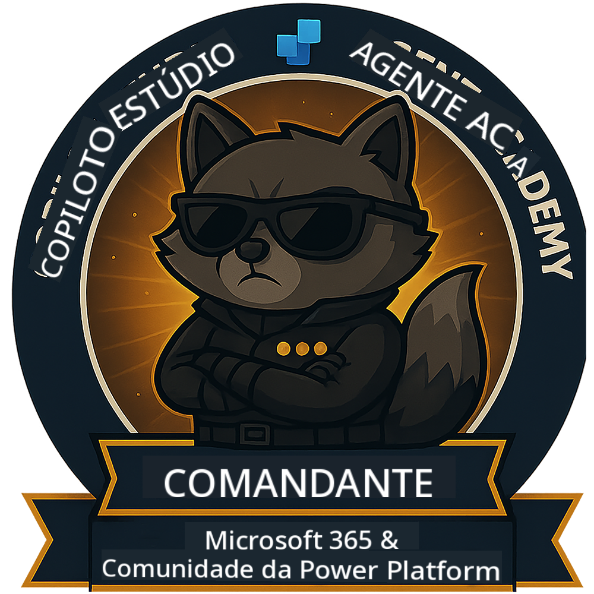

<!--
CO_OP_TRANSLATOR_METADATA:
{
  "original_hash": "8fb14b79c8616d9533f641ac2d555e8c",
  "translation_date": "2025-10-18T03:28:37+00:00",
  "source_file": "docs/commander/README.md",
  "language_code": "pt"
}
-->
---
hide:
- navigation
---

# Comandante (Em breve)

Este curso ainda é muito secreto. Será desbloqueado no futuro! 🔓

{ width="300" }

<!-- markdownlint-disable-next-line MD033 -->

---

**Aviso Legal**:  
Este documento foi traduzido utilizando o serviço de tradução por IA [Co-op Translator](https://github.com/Azure/co-op-translator). Embora nos esforcemos pela precisão, esteja ciente de que traduções automáticas podem conter erros ou imprecisões. O documento original na sua língua nativa deve ser considerado a fonte autoritária. Para informações críticas, recomenda-se uma tradução profissional realizada por humanos. Não nos responsabilizamos por quaisquer mal-entendidos ou interpretações incorretas decorrentes do uso desta tradução.