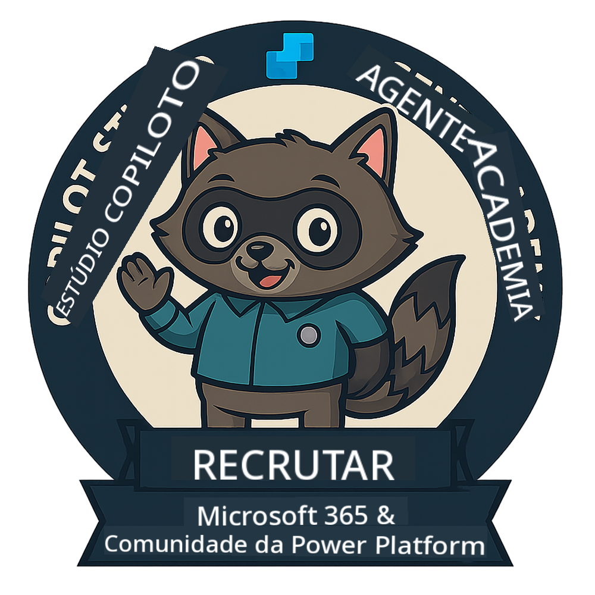
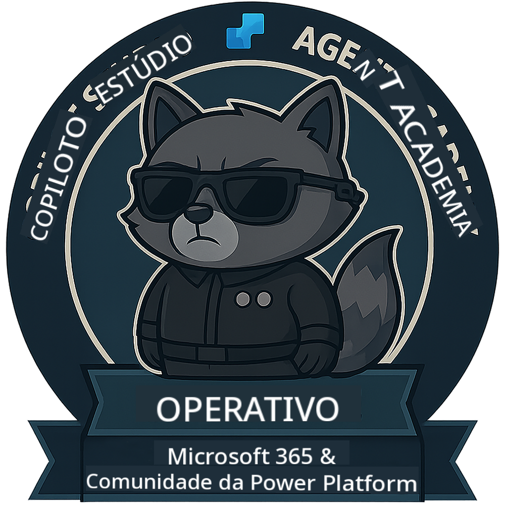

<!--
CO_OP_TRANSLATOR_METADATA:
{
  "original_hash": "15e57e059ce7689d602d7853187235cd",
  "translation_date": "2025-10-18T02:42:09+00:00",
  "source_file": "docs/index.md",
  "language_code": "pt"
}
-->
---
hide:
- navigation
---

# Academia de Agentes do Copilot Studio

**Bem-vindo à Academia de Agentes do Copilot Studio.**  

A sua missão—caso decida aceitá-la—é dominar a arte de criar agentes utilizando o **Microsoft Copilot Studio**.

Este treino prático é o seu ponto de entrada no **mundo dos agentes**: desde prompts fundamentados a Adaptive Cards e fluxos de agentes, aprenderá a criar, escalar e implementar agentes inteligentes utilizando ferramentas e casos de uso do mundo real.

---

## 🏅 Progressão de Patente

A **Academia de Agentes do Copilot Studio** é um programa de formação em várias fases, concebido para desenvolver as suas competências em três patentes de agente. Cada nível inclui um crachá e responsabilidades crescentes:

| Patente          | Nível | Visual |
|------------------|:-----:|--------|
| 🟢 **Recruta**  [🚀 Começar](https://aka.ms/agent-academy-recruit){ .md-button .md-button--primary }     | •     | { width="300" }     |
| 🔵 **Operativo** (Em Breve)   | ••    | { width="300" } |
| 🟡 **Comandante** (Em Breve)    | •••   | { width="300" } |

Cada nível é uma continuação do anterior. Complete a sua missão como Recruta e fique atento para subir de nível nas suas credenciais de agente.

---

## 🎒 Outros Cursos

Confira estes outros cursos para continuar a aprender sobre IA e Agentes:

- [Microsoft Copilot Studio <3 MCP Lab](https://aka.ms/mcsmcplab)
- [Copilot Developer Camp](https://microsoft.github.io/copilot-camp/)
- [Agentes de IA para Iniciantes](https://microsoft.github.io/ai-agents-for-beginners/)
- [Protocolo de Contexto de Modelo (MCP) para Iniciantes](https://github.com/microsoft/mcp-for-beginners)

---

## 🚑 Problemas

Agradecemos muito o seu feedback! Utilize a [lista de problemas](https://github.com/microsoft/agent-academy/issues) para partilhar os seus comentários e problemas. Obrigado!

---

## 📜 Código de Conduta

Este projeto adotou o [Código de Conduta de Código Aberto da Microsoft](https://opensource.microsoft.com/codeofconduct/).

!!! info "Recursos:"

    - [Código de Conduta de Código Aberto da Microsoft](https://opensource.microsoft.com/codeofconduct/)
    - [FAQ do Código de Conduta da Microsoft](https://opensource.microsoft.com/codeofconduct/faq/)
    - Contacte [opencode@microsoft.com](mailto:opencode@microsoft.com) para questões ou preocupações

---

[⭐️ Dê uma estrela ao nosso repositório](https://github.com/microsoft/agent-academy){ .md-button .md-button--primary }

<!-- markdownlint-disable-next-line MD033 -->

---

**Aviso Legal**:  
Este documento foi traduzido utilizando o serviço de tradução por IA [Co-op Translator](https://github.com/Azure/co-op-translator). Embora nos esforcemos pela precisão, esteja ciente de que traduções automáticas podem conter erros ou imprecisões. O documento original na sua língua nativa deve ser considerado a fonte autoritária. Para informações críticas, recomenda-se uma tradução profissional realizada por humanos. Não nos responsabilizamos por quaisquer mal-entendidos ou interpretações incorretas decorrentes do uso desta tradução.