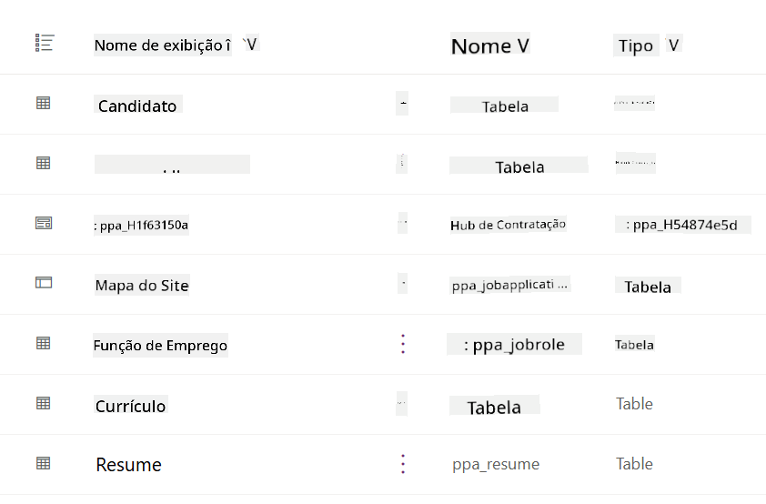
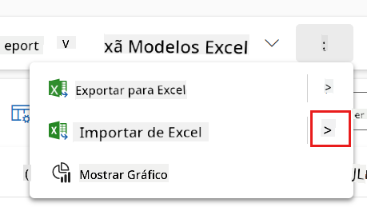
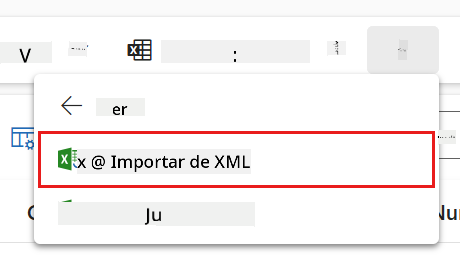
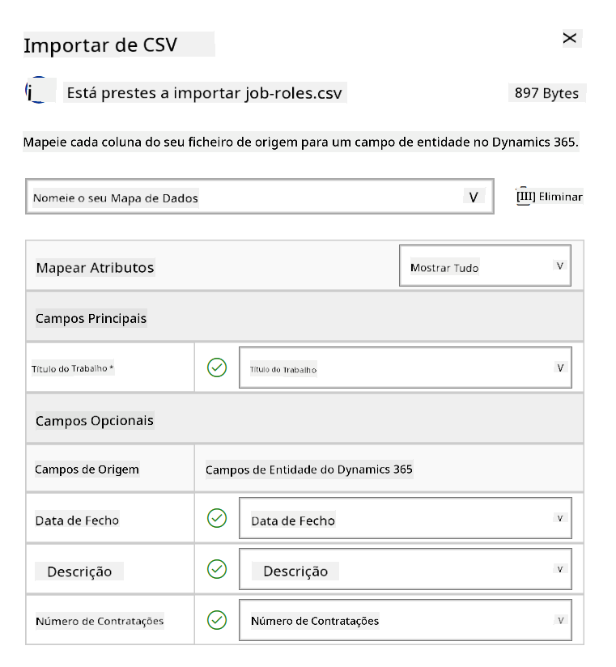
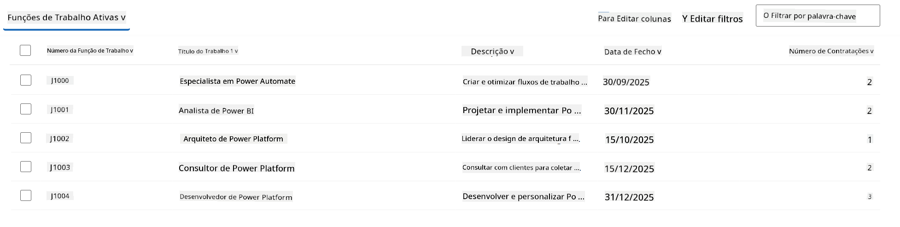
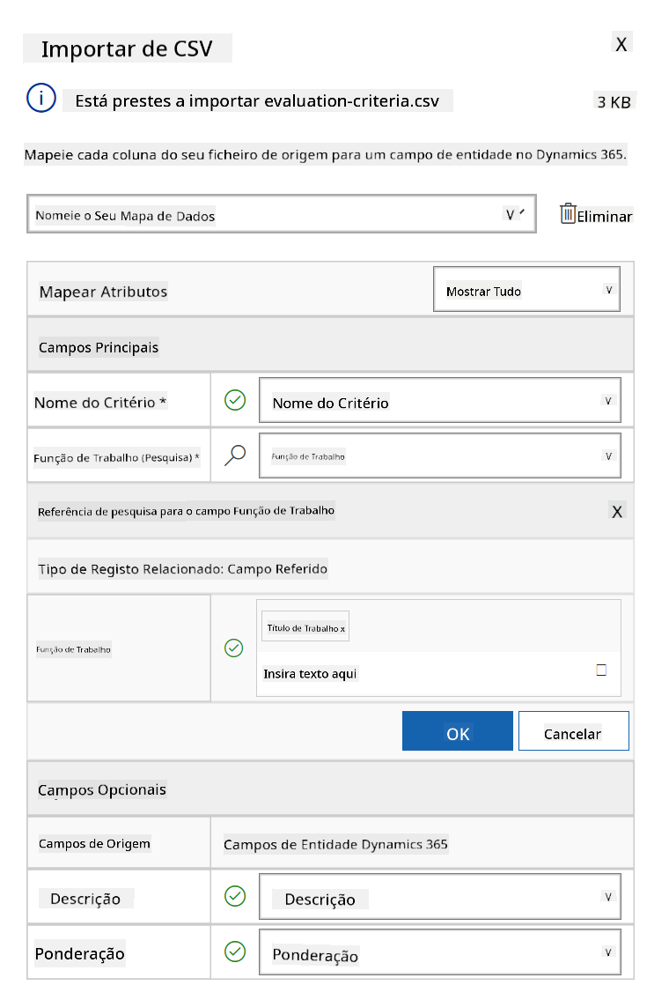
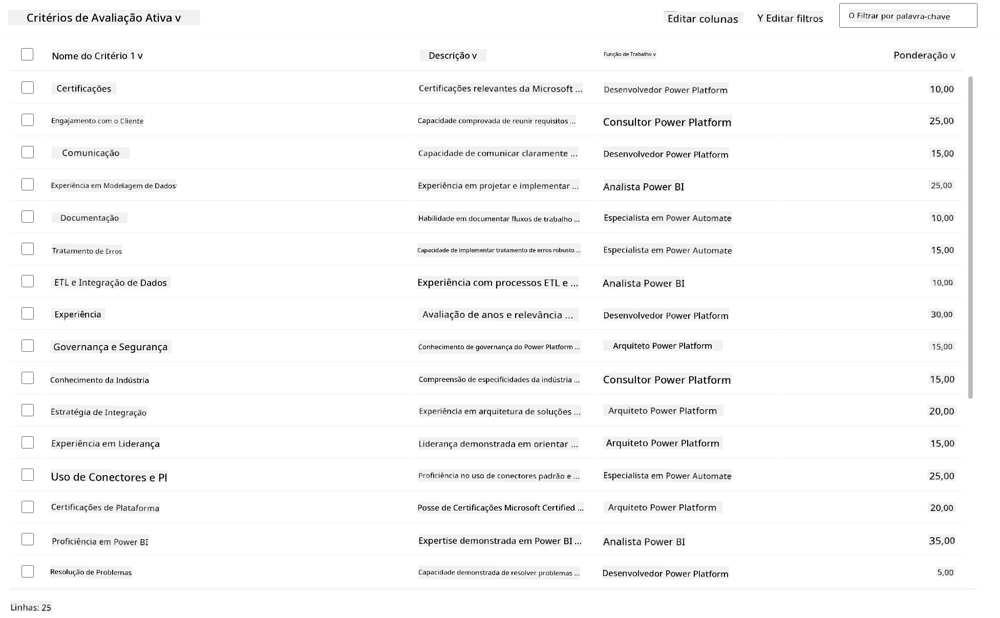

<!--
CO_OP_TRANSLATOR_METADATA:
{
  "original_hash": "2620cf9eaf09a3fc6be7fa31a3a62956",
  "translation_date": "2025-10-18T03:13:44+00:00",
  "source_file": "docs/operative-preview/01-get-started/README.md",
  "language_code": "pt"
}
-->
# 🚨 Missão 01: Começar com o Agente de Recrutamento

--8<-- "disclaimer.md"

## 🕵️‍♂️ CODINOME: `OPERAÇÃO CAÇA-TALENTOS`

> **⏱️ Duração da Operação:** `~45 minutos`

## 🎯 Resumo da Missão

Bem-vindo, Agente. A sua primeira tarefa é a **Operação Caça-Talentos** - estabelecer a infraestrutura básica para um sistema de recrutamento impulsionado por IA que transformará a forma como as organizações identificam e contratam os melhores talentos.

A sua missão, caso decida aceitá-la, é implementar e configurar um sistema abrangente de gestão de recrutamento utilizando o Microsoft Copilot Studio. Você importará uma solução pré-construída contendo todas as estruturas de dados necessárias e, em seguida, criará o seu primeiro agente de IA - o **Agente de Recrutamento** - que será o coordenador central de todas as futuras operações de recrutamento.

Este primeiro passo estabelece o centro de comando que será aprimorado ao longo do programa Operativo da Academia de Agentes. Considere isto como a base sobre a qual você construirá toda uma rede de agentes especializados nas missões subsequentes.

---

## 🔎 Objetivos

Ao completar esta missão, você irá:

- **Compreensão do Cenário**: Obter conhecimento abrangente sobre os desafios e soluções de automação de recrutamento
- **Implementação da Solução**: Importar e configurar com sucesso os fundamentos de um sistema de gestão de recrutamento
- **Criação de Agente**: Construir um agente de recrutamento que será o início do cenário que você desenvolverá como Operativo da Academia de Agentes

---

## 🔍 Pré-requisitos

Antes de iniciar esta missão, certifique-se de ter:

- Licença do Copilot Studio
- Acesso a um ambiente Microsoft Power Platform
- Permissões administrativas para criar soluções e agentes

---

## 🏢 Compreendendo o Cenário de Automação de Recrutamento

Este cenário demonstra como uma empresa pode usar o Microsoft Copilot Studio para melhorar e automatizar o seu processo de recrutamento. Ele apresenta um sistema de agentes que trabalham juntos para lidar com tarefas como revisar currículos, recomendar funções, preparar materiais para entrevistas e avaliar candidatos.

### Valor para o Negócio

A solução ajuda as equipas de RH a economizar tempo e tomar melhores decisões ao:

- Processar automaticamente currículos recebidos por e-mail.
- Sugerir funções adequadas com base nos perfis dos candidatos.
- Criar candidaturas e guias de entrevista personalizados para cada candidato.
- Garantir práticas de recrutamento justas e em conformidade com recursos de segurança e moderação integrados.
- Coletar feedback para melhorar a solução.

### Como Funciona

- Um **Agente de Recrutamento** central coordena o processo e armazena dados no Microsoft Dataverse.
- Um **Agente de Receção de Candidaturas** lê currículos e cria candidaturas.
- Um **Agente de Preparação de Entrevistas** gera perguntas e documentos de entrevista com base no histórico do candidato.
- O sistema pode ser publicado num site de demonstração, permitindo que as partes interessadas interajam com ele.

Este cenário é ideal para organizações que procuram modernizar os seus fluxos de trabalho de recrutamento utilizando automação impulsionada por IA, mantendo transparência, justiça e eficiência.

---

## 🧪 Laboratório: Configurar o Agente de Recrutamento

Neste laboratório prático, você estabelecerá a base para o seu sistema de automação de recrutamento. Começará por importar uma solução pré-configurada que contém todas as tabelas do Dataverse e a estrutura de dados necessária para gerir candidatos, posições de trabalho e fluxos de trabalho de recrutamento. Em seguida, preencherá essas tabelas com dados de exemplo que apoiarão o seu aprendizado ao longo deste módulo e fornecerão cenários realistas para testes. Por fim, criará o Agente de Recrutamento no Copilot Studio, configurando a interface de conversação básica que será a pedra angular de todos os outros recursos que você adicionará em futuras missões.

### 🧪 Laboratório 1.1: Importar solução

1. Acesse **[Copilot Studio](https://copilotstudio.microsoft.com)**
1. Selecione o **...** na navegação à esquerda e escolha **Soluções**
1. Clique no botão **Importar Solução** no topo
1. **[Descarregue](https://raw.githubusercontent.com/microsoft/agent-academy/refs/heads/main/docs/operative-preview/01-get-started/assets/Operative_1_0_0_0.zip)** a solução preparada
1. Clique em **Procurar** e selecione a solução descarregada no passo anterior
1. Clique em **Seguinte**
1. Clique em **Importar**

!!! success
    Quando a importação for concluída com sucesso, verá uma barra de notificação verde com a seguinte mensagem:  
    "Solução "Operative" importada com sucesso."

Após a importação da solução, explore o que foi importado selecionando o nome exibido da solução (`Operative`).



Os seguintes componentes foram importados:

| Nome Exibido | Tipo | Descrição |
|--------------|------|-----------|
| Candidato | Tabela | Informações sobre os candidatos |
| Critérios de Avaliação | Tabela | Critérios de avaliação para a função |
| Central de Recrutamento | Aplicação Model-Driven | Aplicação para gerir o processo de recrutamento |
| Central de Recrutamento | Mapa do Site | Estrutura de navegação para a aplicação Central de Recrutamento |
| Candidatura | Tabela | Candidaturas |
| Função | Tabela | Funções |
| Currículo | Tabela | Currículos dos candidatos |

Como última tarefa deste laboratório, clique no botão **Publicar todas as personalizações** no topo da página.

### 🧪 Laboratório 1.2: Importar dados de exemplo

Neste laboratório, você adicionará dados de exemplo a algumas das tabelas que importou no laboratório 1.1.

#### Descarregar os ficheiros para importar

1. **[Descarregue](https://raw.githubusercontent.com/microsoft/agent-academy/refs/heads/main/docs/operative-preview/01-get-started/assets/evaluation-criteria.csv)** o ficheiro CSV com os critérios de avaliação
1. **[Descarregue](https://raw.githubusercontent.com/microsoft/agent-academy/refs/heads/main/docs/operative-preview/01-get-started/assets/job-roles.csv)** o ficheiro CSV com as funções

#### Importar os dados de exemplo das Funções

1. Volte à solução que acabou de importar no último laboratório
1. Selecione a aplicação Model-Driven **Central de Recrutamento** clicando na marca de verificação na frente da linha
1. Clique no botão **Play** no topo

    !!! warning
        Pode ser solicitado que faça login novamente. Certifique-se de o fazer. Após isso, deverá ver a aplicação Central de Recrutamento.

1. Selecione **Funções** na navegação à esquerda
1. Clique no ícone **Mais** (três pontos verticais) na barra de comandos
1. Clique na **seta para a direita** ao lado de *Importar do Excel*

    

1. Clique em **Importar do CSV**

    

1. Clique no botão **Escolher Ficheiro**, selecione o ficheiro **job-roles.csv** que acabou de descarregar e clique em **Abrir**
1. Clique em **Seguinte**
1. Deixe o próximo passo como está e clique em **Revisar Mapeamento**

    

1. Certifique-se de que o mapeamento está correto e clique em **Concluir Importação**

    !!! info
        Isto iniciará uma importação e poderá acompanhar o progresso ou finalizar o processo imediatamente clicando em **Concluído**

1. Clique em **Concluído**

Isso pode levar algum tempo, mas pode clicar no botão **Atualizar** para verificar se a importação foi bem-sucedida.



#### Importar os dados de exemplo dos Critérios de Avaliação

1. Selecione **Critérios de Avaliação** na navegação à esquerda
1. Clique no ícone **Mais** (três pontos verticais) na barra de comandos
1. Clique na **seta para a direita** ao lado de *Importar do Excel*

    

1. Clique em **Importar do CSV**

    

1. Clique no botão **Escolher Ficheiro**, selecione o ficheiro **evaluation-criteria.csv** que acabou de descarregar e clique em **Abrir**
1. Clique em **Seguinte**
1. Deixe o próximo passo como está e clique em **Revisar Mapeamento**

    

1. Agora será necessário fazer um pouco mais de trabalho no mapeamento. Clique na lupa (ícone 🔎) ao lado do campo Função
1. Certifique-se de que **Título da Função** está selecionado aqui e, se não estiver, adicione-o
1. Clique em **OK**
1. Certifique-se de que o restante do mapeamento também está correto e clique em **Concluir Importação**

    !!! info
        Isto iniciará outra importação e poderá acompanhar o progresso ou finalizar o processo imediatamente clicando em **Concluído**

1. Clique em **Concluído**

Isso pode levar algum tempo, mas pode clicar no botão **Atualizar** para verificar se a importação foi bem-sucedida.



### 🧪 Laboratório 1.3: Criar o agente de recrutamento

Agora que terminou a configuração dos pré-requisitos, é hora de começar o trabalho real! Vamos adicionar o nosso Agente de Recrutamento primeiro!

1. Acesse **[Copilot Studio](https://copilotstudio.microsoft.com)** e certifique-se de que está no mesmo ambiente onde importou a solução e os dados
1. Selecione **Agentes** na navegação à esquerda
1. Clique em **Novo Agente**
1. Clique em **Configurar**
1. Para **Nome**, insira:

    ```text
    Hiring Agent
    ```

1. Para **Descrição**, insira:

    ```text
    Central orchestrator for all hiring activities
    ```

1. Clique no **...** ao lado do botão *Criar* no canto superior direito
1. Clique em **Atualizar configurações avançadas**
1. Como **Solução**, selecione `Operative`
1. Clique em **Atualizar**
1. Clique em **Criar** no canto superior direito

Isso criará o Agente de Recrutamento para você, que será utilizado ao longo deste curso Operativo.

---

## 🎉 Missão Concluída

Missão 01 concluída! Agora você dominou as seguintes habilidades:

✅ **Compreensão do Cenário**: Conhecimento abrangente sobre os desafios e soluções de automação de recrutamento  
✅ **Implementação da Solução**: Importou e configurou com sucesso os fundamentos de um sistema de gestão de recrutamento  
✅ **Criação de Agente**: Criou um agente de recrutamento que será o início do cenário que você desenvolverá como Operativo da Academia de Agentes  

A seguir, [Missão 02](../02-multi-agent/README.md): Prepare o seu agente para ser multiagente com agentes conectados.

---

## 📚 Recursos Táticos

📖 [Microsoft Copilot Studio - Criar um agente](https://learn.microsoft.com/microsoft-copilot-studio/authoring-first-bot)  
📖 [Documentação do Microsoft Dataverse](https://learn.microsoft.com/power-apps/maker/data-platform)

---

**Aviso Legal**:  
Este documento foi traduzido utilizando o serviço de tradução por IA [Co-op Translator](https://github.com/Azure/co-op-translator). Embora nos esforcemos pela precisão, esteja ciente de que traduções automáticas podem conter erros ou imprecisões. O documento original na sua língua nativa deve ser considerado a fonte autoritária. Para informações críticas, recomenda-se uma tradução profissional realizada por humanos. Não nos responsabilizamos por quaisquer mal-entendidos ou interpretações incorretas decorrentes do uso desta tradução.